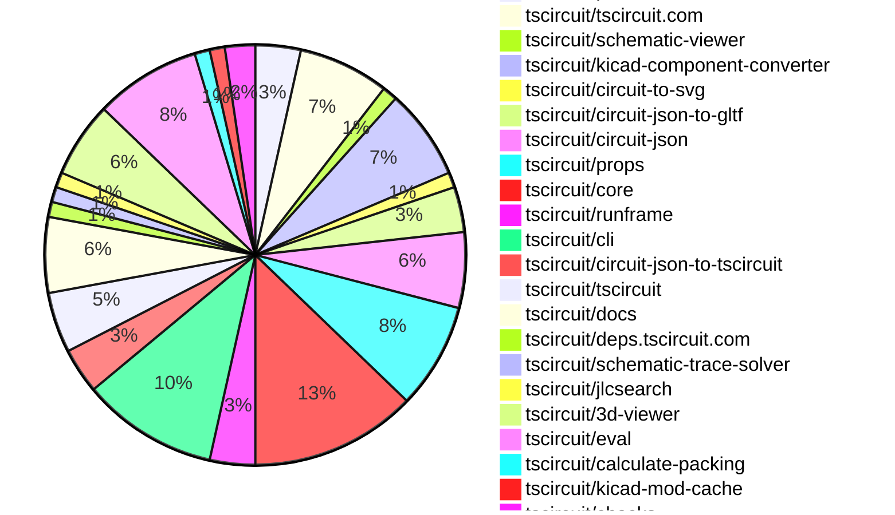
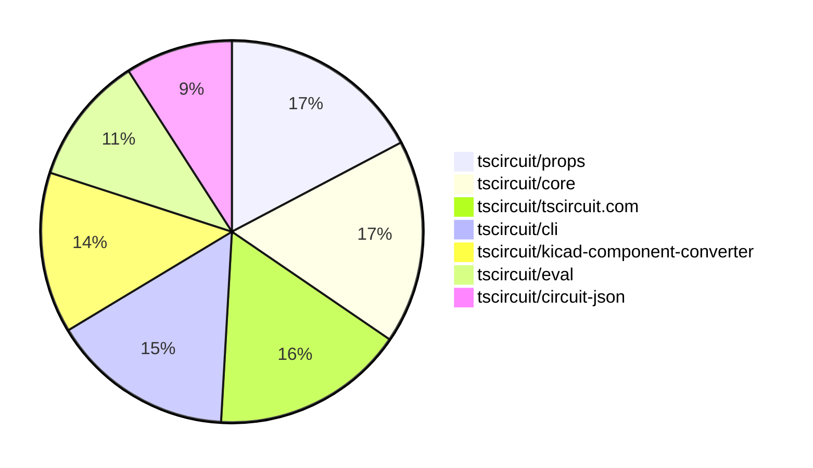

# contribution-tracker

[contributions.tscircuit.com](https://contributions.tscircuit.com) ・ [tscircuit.com](https://tscircuit.com) ・ [Contribution Overviews](./contribution-overviews/) ・ [Changelogs](./changelogs/)

Generates weekly contribution overviews for tscircuit contributors. Check out all
the [contribution overviews here](./contribution-overviews/)
You can find AI-generated monthly changelogs in the [changelogs directory](./changelogs/).

- All PRs in the tscircuit org are scanned/summarized via an LLM
- The LLM classifies each Diff/PR as into a set of attributes for scoring
- All the PRs, summaries, and classifications are organized into charts and tables for [the website](https://contributions.tscircuit.com)

> Want to run locally? See the [Development Section](#development)

The current week is shown below. There are 3 major sections:

- [Contributor Overview](#contributor-overview)
- [PRs by Repository](#prs-by-repository)
- [PRs by Contributor](#changes-by-contributor)

## Current Week

<!-- START_CURRENT_WEEK -->

# Contribution Overview 2025-09-10

## PRs by Repository



## Contributor Overview

| Contributor | 🐳 Major | 🐙 Minor | 🐌 Tiny | ⭐ | Score | Discussion Contributions |
|-------------|---------|---------|---------|-----|----------------|--------------------------|
| [seveibar](#seveibar) | 4 | 16 | 15 | 👑 | 67 | 0🔹 0🔶 0💎 |
| [imrishabh18](#imrishabh18) | 3 | 14 | 9 | ⭐⭐⭐ | 48.5 | 0🔹 0🔶 0💎 |
| [ArnavK-09](#ArnavK-09) | 5 | 1 | 1 | ⭐⭐ | 23 | 0🔹 0🔶 0💎 |
| [ShiboSoftwareDev](#ShiboSoftwareDev) | 2 | 3 | 2 | ⭐⭐ | 15.5 | 0🔹 0🔶 0💎 |
| [AnasSarkiz](#AnasSarkiz) | 1 | 3 | 0 | ⭐ | 10 | 0🔹 0🔶 0💎 |
| [techmannih](#techmannih) | 0 | 2 | 1 | ⭐ | 6 | 0🔹 0🔶 0💎 |
| [Abse2001](#Abse2001) | 0 | 1 | 1 |  | 3 | 0🔹 0🔶 0💎 |
| [tscircuitbot](#tscircuitbot) | 0 | 0 | 2 |  | 2 | 0🔹 0🔶 0💎 |

### Discussion Contribution Legend

- 🔹 Normal Comments: Basic participation with minimal effort
- 🔶 Great Informative Comments: Thoughtful participation that adds value
- 💎 Incredible Comments: Exceptional participation with high-quality content

## Review Table

[reviews-received-hover]: ## "Number of reviews received for PRs for this contributor"
[approvals-received-hover]: ## "Number of approvals received for PRs this contributor authored"
[rejections-received-hover]: ## "Number of rejections received for PRs this contributor authored"
[prs-opened-hover]: ## "Number of PRs opened by this contributor"
[issues-created-hover]: ## "Number of issues created by this contributor"
[bountied-issues-hover]: ## "Number of issues this contributor created with a bounty"
[bountied-issue-$-hover]: ## "Total bounty amount placed on issues authored by this contributor"

| Contributor | Reviews Received | Approvals Received | Rejections Received | Approvals | Rejections | PRs Opened | PRs Merged | Score | Issues Created | Bountied Issues | Bountied Issue $ |
|---|---|---|---|---|---|---|---|---|---|---|---|
| [ArnavK-09](#ArnavK-09) | 20 | 7 | 1 | 0 | 0 | 8 | 7 | 23 | 0 | 0 | 0 |
| [seveibar](#seveibar) | 10 | 0 | 0 | 30 | 5 | 41 | 35 | 67 | 0 | 0 | 0 |
| [imrishabh18](#imrishabh18) | 13 | 8 | 0 | 2 | 2 | 27 | 26 | 48.5 | 0 | 0 | 0 |
| [Excellencedev](#Excellencedev) | 1 | 0 | 0 | 0 | 0 | 2 | 0 | 0 | 0 | 0 | 0 |
| [techmannih](#techmannih) | 8 | 2 | 1 | 0 | 0 | 6 | 3 | 6 | 0 | 0 | 0 |
| [AnasSarkiz](#AnasSarkiz) | 10 | 4 | 0 | 0 | 0 | 5 | 4 | 10 | 0 | 0 | 0 |
| [ShiboSoftwareDev](#ShiboSoftwareDev) | 13 | 7 | 1 | 0 | 0 | 10 | 7 | 15.5 | 0 | 0 | 0 |
| [Abse2001](#Abse2001) | 3 | 2 | 0 | 0 | 0 | 2 | 2 | 3 | 0 | 0 | 0 |
| [tscircuitbot](#tscircuitbot) | 0 | 0 | 0 | 0 | 0 | 16 | 2 | 2 | 0 | 0 | 0 |
| [tribhuwan-kumar](#tribhuwan-kumar) | 1 | 0 | 0 | 0 | 0 | 1 | 0 | 0 | 0 | 0 | 0 |
| [Ayushjhawar8](#Ayushjhawar8) | 1 | 0 | 0 | 0 | 0 | 1 | 0 | 0 | 0 | 0 | 0 |
| [devroy10](#devroy10) | 3 | 1 | 0 | 0 | 0 | 1 | 0 | 0 | 0 | 0 | 0 |
| [baeoc](#baeoc) | 1 | 0 | 0 | 0 | 0 | 1 | 0 | 0 | 0 | 0 | 0 |
| [MAVRICK-1](#MAVRICK-1) | 4 | 1 | 3 | 0 | 0 | 2 | 0 | 0 | 0 | 0 | 0 |
| [melmathari](#melmathari) | 0 | 0 | 0 | 0 | 0 | 1 | 0 | 0 | 0 | 0 | 0 |
| [Bhavyajain21](#Bhavyajain21) | 1 | 0 | 0 | 0 | 0 | 1 | 0 | 0 | 0 | 0 | 0 |
| [DiwanshuVerma](#DiwanshuVerma) | 0 | 0 | 0 | 0 | 0 | 1 | 0 | 0 | 0 | 0 | 0 |
| [0hmX](#0hmX) | 1 | 0 | 1 | 0 | 0 | 1 | 0 | 0 | 0 | 0 | 0 |

## Top 7 Repositories by Contribution Points



## Changes by Repository

### [tscircuit/pcb-viewer](https://github.com/tscircuit/pcb-viewer)

| PR # | Impact | Rating | Contributor | Description |
|------|--------|--------|-------------|-------------|
| [#369](https://github.com/tscircuit/pcb-viewer/pull/369) | 🐳 Major | ⭐⭐⭐ | ArnavK-09 | fix 368  claim 368 |
| [#372](https://github.com/tscircuit/pcb-viewer/pull/372) | 🐙 Minor | ⭐⭐ | ArnavK-09 | Fixes the overlap issue between the dropdown and error list in the toolbar overlay, ensuring that the error list is only displayed when there are errors present. |
| [#371](https://github.com/tscircuit/pcb-viewer/pull/371) | 🐙 Minor | ⭐⭐ | imrishabh18 | Adds support for hole offsets in the circular_hole_with_rect_pad element, allowing for precise positioning of holes in PCB designs. |

### [tscircuit/tscircuit.com](https://github.com/tscircuit/tscircuit.com)

| PR # | Impact | Rating | Contributor | Description |
|------|--------|--------|-------------|-------------|
| [#1662](https://github.com/tscircuit/tscircuit.com/pull/1662) | 🐳 Major | ⭐⭐⭐ | ArnavK-09 | Adds a confirmation dialog to warn users about unsaved changes before navigating away from the editor. |
| [#1663](https://github.com/tscircuit/tscircuit.com/pull/1663) | 🐳 Major | ⭐⭐⭐ | ArnavK-09 | Refactors image loading logic to replace SVG loading with direct PNG URLs from API, adds skeleton loading states for better UX, removes unnecessary file path checks, and consolidates view configuration into a single constant. |
| [#1661](https://github.com/tscircuit/tscircuit.com/pull/1661) | 🐳 Major | ⭐⭐⭐ | ArnavK-09 | Removes an unused import and adds functionality for the Circuit JSON import dialog in the CmdK menu. |
| [#1638](https://github.com/tscircuit/tscircuit.com/pull/1638) | 🐳 Major | ⭐⭐⭐ | ArnavK-09 | Fixes an issue where the UI displayed outdated content after files were saved, ensuring the latest changes are reflected immediately. |

<details>
<summary>🐌 Tiny Contributions (2)</summary>

| PR # | Impact | Contributor | Description |
|------|--------|-------------|-------------|
| [#1655](https://github.com/tscircuit/tscircuit.com/pull/1655) | 🐌 Tiny | imrishabh18 | Updates the versions of the 3D viewer and assembly viewer dependencies in the project. |
| [#1657](https://github.com/tscircuit/tscircuit.com/pull/1657) | 🐌 Tiny | Abse2001 | Updates the 3d-viewer dependency version from 0.0.375 to 0.0.379 in package.json |

</details>

### [tscircuit/schematic-viewer](https://github.com/tscircuit/schematic-viewer)


<details>
<summary>🐌 Tiny Contributions (1)</summary>

| PR # | Impact | Contributor | Description |
|------|--------|-------------|-------------|
| [#130](https://github.com/tscircuit/schematic-viewer/pull/130) | 🐌 Tiny | ArnavK-09 | Removes rounded borders from group overlays in the schematic viewer by setting the rx and ry attributes to 0. |

</details>

### [tscircuit/kicad-component-converter](https://github.com/tscircuit/kicad-component-converter)

| PR # | Impact | Rating | Contributor | Description |
|------|--------|--------|-------------|-------------|
| [#131](https://github.com/tscircuit/kicad-component-converter/pull/131) | 🐳 Major | ⭐⭐⭐ | imrishabh18 | Adds a button to download the generated tsx code from circuit JSON. |
| [#134](https://github.com/tscircuit/kicad-component-converter/pull/134) | 🐳 Major | ⭐⭐⭐ | ShiboSoftwareDev | Adds support for the fp_poly directive in KiCad module files, enabling conversion of polygon shapes on copper, silkscreen, and fabrication layers into appropriate circuit elements. |
| [#129](https://github.com/tscircuit/kicad-component-converter/pull/129) | 🐙 Minor | ⭐⭐ | imrishabh18 | Adds support for a new pad shape circular_hole_with_rect_pad in the KiCad component converter, allowing for better representation of specific PCB designs. |
| [#128](https://github.com/tscircuit/kicad-component-converter/pull/128) | 🐙 Minor | ⭐⭐ | imrishabh18 | Fixes support for failing kicad_mod files related to the capacitor_6x2 component by filtering out non-numeric flags during attribute parsing. |
| [#135](https://github.com/tscircuit/kicad-component-converter/pull/135) | 🐙 Minor | ⭐⭐ | seveibar | Adds a test for loading JST connectors and verifies the output against expected SVG snapshots. |

<details>
<summary>🐌 Tiny Contributions (1)</summary>

| PR # | Impact | Contributor | Description |
|------|--------|-------------|-------------|
| [#130](https://github.com/tscircuit/kicad-component-converter/pull/130) | 🐌 Tiny | imrishabh18 | Adds a vercel.json configuration file for Vercel deployment and updates several dependencies in package.json |

</details>

### [tscircuit/circuit-to-svg](https://github.com/tscircuit/circuit-to-svg)

| PR # | Impact | Rating | Contributor | Description |
|------|--------|--------|-------------|-------------|
| [#310](https://github.com/tscircuit/circuit-to-svg/pull/310) | 🐳 Major | ⭐⭐⭐ | imrishabh18 | Adds support for an optional offset for circular holes within rectangular pads in PCB designs. |

### [tscircuit/circuit-json-to-gltf](https://github.com/tscircuit/circuit-json-to-gltf)

| PR # | Impact | Rating | Contributor | Description |
|------|--------|--------|-------------|-------------|
| [#9](https://github.com/tscircuit/circuit-json-to-gltf/pull/9) | 🐳 Major | ⭐⭐⭐ | imrishabh18 | Enables SVG to PNG conversion in a Node.js environment using native Resvg for high-quality rendering, with a fallback to browser methods if necessary. |
| [#10](https://github.com/tscircuit/circuit-json-to-gltf/pull/10) | 🐙 Minor | ⭐⭐ | imrishabh18 | Fixes the parsing issue of GLB files in the model viewer by adding a buffer reference to the embedded binary data and ensuring proper padding in the JSON data. |

<details>
<summary>🐌 Tiny Contributions (1)</summary>

| PR # | Impact | Contributor | Description |
|------|--------|-------------|-------------|
| [#8](https://github.com/tscircuit/circuit-json-to-gltf/pull/8) | 🐌 Tiny | imrishabh18 | Fixes relative import for WASM file in Node.js environment |

</details>

### [tscircuit/circuit-json](https://github.com/tscircuit/circuit-json)

| PR # | Impact | Rating | Contributor | Description |
|------|--------|--------|-------------|-------------|
| [#274](https://github.com/tscircuit/circuit-json/pull/274) | 🐙 Minor | ⭐⭐ | imrishabh18 | Adds hole offset parameters for circular plated holes with rectangular pads to allow for non-centered hole placement. |
| [#276](https://github.com/tscircuit/circuit-json/pull/276) | 🐙 Minor | ⭐⭐ | seveibar | Add optional rect_border_radius to plated hole types using rectangular pads and support it on rectangular and rotated SMT pads, along with documentation and tests for the new option. |
| [#273](https://github.com/tscircuit/circuit-json/pull/273) | 🐙 Minor | ⭐⭐ | seveibar | Adds an optional model_unit_to_mm_scale_factor to the CAD component schema, allowing for unit scaling in CAD components. |
| [#275](https://github.com/tscircuit/circuit-json/pull/275) | 🐙 Minor | ⭐⭐ | techmannih | Adds knockout functionality for silkscreen text in PCB designs, allowing for customizable padding around the text. |
| [#272](https://github.com/tscircuit/circuit-json/pull/272) | 🐙 Minor | ⭐⭐ | AnasSarkiz | Add PcbComponentOutsideBoardError to detect when PCB components are placed outside the boards physical boundaries, with detailed positioning data for debugging and automated correction. |

### [tscircuit/props](https://github.com/tscircuit/props)

| PR # | Impact | Rating | Contributor | Description |
|------|--------|--------|-------------|-------------|
| [#396](https://github.com/tscircuit/props/pull/396) | 🐳 Major | ⭐⭐⭐ | seveibar | Adds support for ReactElement in CadModelProp type and updates the CadAssemblyProps interface to include children prop |
| [#391](https://github.com/tscircuit/props/pull/391) | 🐳 Major | ⭐⭐⭐ | seveibar | Allows specifying CAD model unit scale via optional modelUnitToMmScale and covers the new CAD model property in tests. |
| [#376](https://github.com/tscircuit/props/pull/376) | 🐳 Major | ⭐⭐⭐ | ShiboSoftwareDev | Refactors the copper-pour component to support a more flexible and customizable interface for different shapes. |
| [#392](https://github.com/tscircuit/props/pull/392) | 🐙 Minor | ⭐⭐ | imrishabh18 | Adds properties pcbHoleOffsetX and pcbHoleOffsetY to the CircularHoleWithRectPlatedProps interface for specifying PCB hole offsets. |
| [#395](https://github.com/tscircuit/props/pull/395) | 🐙 Minor | ⭐⭐ | seveibar | Add cadassembly  and cadmodel  components with support for footprint orientation and model URL sourcing, along with documentation and export of these components. |
| [#393](https://github.com/tscircuit/props/pull/393) | 🐙 Minor | ⭐⭐ | techmannih | Adds properties for knockout and knockout padding to silkscreen text components, allowing for better control over text rendering. |

<details>
<summary>🐌 Tiny Contributions (1)</summary>

| PR # | Impact | Contributor | Description |
|------|--------|-------------|-------------|
| [#394](https://github.com/tscircuit/props/pull/394) | 🐌 Tiny | seveibar | Adds an optional projectBaseUrl to PlatformConfig, documents it in README, and tests its parsing functionality. |

</details>

### [tscircuit/core](https://github.com/tscircuit/core)

| PR # | Impact | Rating | Contributor | Description |
|------|--------|--------|-------------|-------------|
| [#1339](https://github.com/tscircuit/core/pull/1339) | 🐙 Minor | ⭐⭐ | imrishabh18 | Adds support for new plated hole shapes: pill and oval in the circuit design. |
| [#1321](https://github.com/tscircuit/core/pull/1321) | 🐙 Minor | ⭐⭐ | imrishabh18 | Fixes issue where pcbPack fails to render correctly for asynchronous footprints in the circuit design. |
| [#1326](https://github.com/tscircuit/core/pull/1326) | 🐙 Minor | ⭐⭐ | imrishabh18 | Adds support for hole offset in the shape circular_hole_with_rect_pad by introducing new properties for hole offsets in the PlatedHole component. |
| [#1334](https://github.com/tscircuit/core/pull/1334) | 🐙 Minor | ⭐⭐ | seveibar | Add cadmodel and cadassembly React elements and their corresponding primitive classes, enhancing the 3D modeling capabilities in the tscircuit framework. |
| [#1332](https://github.com/tscircuit/core/pull/1332) | 🐙 Minor | ⭐⭐ | seveibar | Passes component pcbMargin values to calculate-packing using chipMarginsMap and adds a test to ensure pcbMargin reaches packing library. |
| [#1327](https://github.com/tscircuit/core/pull/1327) | 🐙 Minor | ⭐⭐ | seveibar | Adds support for generating rounded board outlines when the borderRadius property is set, along with a snapshot test for this feature. |
| [#1325](https://github.com/tscircuit/core/pull/1325) | 🐙 Minor | ⭐⭐ | seveibar | Maps cadModel.modelUnitToMmScale onto cad_component.model_unit_to_mm_scale_factor and updates dependencies for CAD component scale factor propagation. |
| [#1336](https://github.com/tscircuit/core/pull/1336) | 🐙 Minor | ⭐⭐ | AnasSarkiz | Adds a design rule check that flags components extending beyond the board outline during design rule checking. |

<details>
<summary>🐌 Tiny Contributions (3)</summary>

| PR # | Impact | Contributor | Description |
|------|--------|-------------|-------------|
| [#1338](https://github.com/tscircuit/core/pull/1338) | 🐌 Tiny | seveibar | Summary add getTestStaticAssetsServer to serve local models allow getTestFixture to start the fake static asset server update model-related tests to use local models  Testing bunx tsc --noEmit bun test testscomponentsnormal-componentsresistor-cadmodel-react-element.test.tsx bun test testscomponentsnormal-componentschip-cadassembly-react-element.test.tsx bun test testscomponentsnormal-componentsred-led-name-validation.test.tsx bun test testscomponentsnormal-componentsresistor-cad-component-position.test.tsx BUN_UPDATE_SNAPSHOTS1 bun test testscomponentsnormal-componentschip-override-footprint-ports-when-schPortArrangement.test.tsx BUN_UPDATE_SNAPSHOTS1 bun test testscomponentsnormal-componentscustom-footprint-4-ports.test.tsx |
| [#1337](https://github.com/tscircuit/core/pull/1337) | 🐌 Tiny | seveibar | Waits for footprints to load before running downstream PCB phases and updates the PCB snapshot for footprint library map test. |
| [#1335](https://github.com/tscircuit/core/pull/1335) | 🐌 Tiny | seveibar | Adds a snapshot test for PCB packing with margin and removes the spy implementation previously used for testing. |

</details>

### [tscircuit/runframe](https://github.com/tscircuit/runframe)

| PR # | Impact | Rating | Contributor | Description |
|------|--------|--------|-------------|-------------|
| [#1130](https://github.com/tscircuit/runframe/pull/1130) | 🐙 Minor | ⭐⭐ | imrishabh18 | Excludes resvgresvg-js from the bundling process and fixes the GLB export functionality by ensuring valid data is returned before creating a blob for download. |
| [#1121](https://github.com/tscircuit/runframe/pull/1121) | 🐙 Minor | ⭐⭐ | imrishabh18 | Adds a GLB export option in the RunFrame file menu, allowing users to export circuit designs in the GLB format using the circuit-json-to-gltf library. |

<details>
<summary>🐌 Tiny Contributions (1)</summary>

| PR # | Impact | Contributor | Description |
|------|--------|-------------|-------------|
| [#1112](https://github.com/tscircuit/runframe/pull/1112) | 🐌 Tiny | imrishabh18 | Updates the 3D viewer dependency and adds an example for using an asynchronous footprint circuit in the RunFrame component. |

</details>

### [tscircuit/cli](https://github.com/tscircuit/cli)

| PR # | Impact | Rating | Contributor | Description |
|------|--------|--------|-------------|-------------|
| [#338](https://github.com/tscircuit/cli/pull/338) | 🐳 Major | ⭐⭐⭐ | seveibar | Add --kicad option to tsci search to only query KiCad footprints |
| [#331](https://github.com/tscircuit/cli/pull/331) | 🐙 Minor | ⭐⭐ | imrishabh18 | Adds support for exporting circuit JSON as GLB and updates the tscircuitrunframe package to the latest version. |
| [#330](https://github.com/tscircuit/cli/pull/330) | 🐙 Minor | ⭐⭐ | imrishabh18 | Adds a command to convert .kicad_mod files into TSX components, integrating kicad and circuit-json conversion packages. |
| [#340](https://github.com/tscircuit/cli/pull/340) | 🐙 Minor | ⭐⭐ | seveibar | Fixes a crash in the search command when JLC search returns no components by handling the absence of results gracefully. |
| [#336](https://github.com/tscircuit/cli/pull/336) | 🐙 Minor | ⭐⭐ | seveibar | Extends the tsci search command to query the KiCad footprint index with fuzzy matching, documents the search command for footprints, CAD models, or packages, and adds a test for the KiCad footprint search. |
| [#332](https://github.com/tscircuit/cli/pull/332) | 🐙 Minor | ⭐⭐ | ShiboSoftwareDev | Enables successful import of npm packages in the CLI after updates to eval and runframe. |

<details>
<summary>🐌 Tiny Contributions (3)</summary>

| PR # | Impact | Contributor | Description |
|------|--------|-------------|-------------|
| [#337](https://github.com/tscircuit/cli/pull/337) | 🐌 Tiny | seveibar | Prefixes KiCad footprint search results with kicad: for easier copypaste into tscircuit and updates CLI test to expect kicad: prefix. |
| [#327](https://github.com/tscircuit/cli/pull/327) | 🐌 Tiny | seveibar | Updates the RunFrame and easyeda dependencies to their latest versions in the package.json file |
| [#322](https://github.com/tscircuit/cli/pull/322) | 🐌 Tiny | ShiboSoftwareDev | Updates various dependencies in the project, including tscircuitmath-utils and tscircuitprops, and adds tscircuitcircuit-json-util. |

</details>

### [tscircuit/circuit-json-to-tscircuit](https://github.com/tscircuit/circuit-json-to-tscircuit)

| PR # | Impact | Rating | Contributor | Description |
|------|--------|--------|-------------|-------------|
| [#11](https://github.com/tscircuit/circuit-json-to-tscircuit/pull/11) | 🐙 Minor | ⭐⭐ | imrishabh18 | Adds silkscreentext and silkscreenpath elements to the generated TSX code for PCB footprints, enhancing the representation of silkscreen features in the output. |

<details>
<summary>🐌 Tiny Contributions (2)</summary>

| PR # | Impact | Contributor | Description |
|------|--------|-------------|-------------|
| [#10](https://github.com/tscircuit/circuit-json-to-tscircuit/pull/10) | 🐌 Tiny | imrishabh18 | Changes the build process to utilize tsup-node instead of tsup for building TypeScript files. |
| [#9](https://github.com/tscircuit/circuit-json-to-tscircuit/pull/9) | 🐌 Tiny | seveibar | Removes the deprecated createUseComponent hook from the generated component template and updates the component generation to use ChipProps instead. |

</details>

### [tscircuit/tscircuit](https://github.com/tscircuit/tscircuit)


<details>
<summary>🐌 Tiny Contributions (4)</summary>

| PR # | Impact | Contributor | Description |
|------|--------|-------------|-------------|
| [#769](https://github.com/tscircuit/tscircuit/pull/769) | 🐌 Tiny | imrishabh18 | Updates the versions of the circuit-json and props dependencies in package.json |
| [#777](https://github.com/tscircuit/tscircuit/pull/777) | 🐌 Tiny | seveibar | Adds PinLabelsProp to the exported types from the props module, allowing users to utilize this new property in their components. |
| [#772](https://github.com/tscircuit/tscircuit/pull/772) | 🐌 Tiny | seveibar | Exports the ChipProps type from the tscircuitprops module for use in other parts of the application. |
| [#773](https://github.com/tscircuit/tscircuit/pull/773) | 🐌 Tiny | techmannih | Updates the circuit-json dependency to version 0.0.251 in package.json |

</details>

### [tscircuit/docs](https://github.com/tscircuit/docs)


<details>
<summary>🐌 Tiny Contributions (5)</summary>

| PR # | Impact | Contributor | Description |
|------|--------|-------------|-------------|
| [#139](https://github.com/tscircuit/docs/pull/139) | 🐌 Tiny | imrishabh18 | Adds documentation for using KiCads footprint libraries with tscircuit, detailing the format and usage of the kicad: prefix for footprint references. |
| [#145](https://github.com/tscircuit/docs/pull/145) | 🐌 Tiny | seveibar | Removes an accidental .trim() from the ChatGPT quickstart guide to ensure generated documentation remains clean. |
| [#143](https://github.com/tscircuit/docs/pull/143) | 🐌 Tiny | seveibar | Moves guidance on component properties related to part selection and placement into dedicated sections for clarity. |
| [#144](https://github.com/tscircuit/docs/pull/144) | 🐌 Tiny | seveibar | Add documentation for the tsci search command, including usage examples and output. |
| [#142](https://github.com/tscircuit/docs/pull/142) | 🐌 Tiny | seveibar | Fixes the sidebar category label for tscircuit Essentials by renaming the category JSON file to the correct format. |

</details>

### [tscircuit/deps.tscircuit.com](https://github.com/tscircuit/deps.tscircuit.com)


<details>
<summary>🐌 Tiny Contributions (1)</summary>

| PR # | Impact | Contributor | Description |
|------|--------|-------------|-------------|
| [#26](https://github.com/tscircuit/deps.tscircuit.com/pull/26) | 🐌 Tiny | imrishabh18 | Adds a new Upstream category to the dependency graph, allowing users to filter dependencies that are crucial for circuit preview and rendering. |

</details>

### [tscircuit/schematic-trace-solver](https://github.com/tscircuit/schematic-trace-solver)


<details>
<summary>🐌 Tiny Contributions (1)</summary>

| PR # | Impact | Contributor | Description |
|------|--------|-------------|-------------|
| [#59](https://github.com/tscircuit/schematic-trace-solver/pull/59) | 🐌 Tiny | imrishabh18 | Adds a test case for missing schematic-trace functionality related to specific schematic orientations. |

</details>

### [tscircuit/jlcsearch](https://github.com/tscircuit/jlcsearch)

| PR # | Impact | Rating | Contributor | Description |
|------|--------|--------|-------------|-------------|
| [#86](https://github.com/tscircuit/jlcsearch/pull/86) | 🐳 Major | ⭐⭐⭐ | seveibar | Add JST connector derived table and route, expose JST connectors link on home page, and cover JST connectors API with tests. |

### [tscircuit/3d-viewer](https://github.com/tscircuit/3d-viewer)

| PR # | Impact | Rating | Contributor | Description |
|------|--------|--------|-------------|-------------|
| [#470](https://github.com/tscircuit/3d-viewer/pull/470) | 🐙 Minor | ⭐⭐ | seveibar | Adds model unit scaling support and removes KiCad autoscaling line |
| [#469](https://github.com/tscircuit/3d-viewer/pull/469) | 🐙 Minor | ⭐⭐ | seveibar | Sanitizes VRML DEFUSE names containing hyphens before parsing, ensuring compatibility with the VRML parser and adds regression tests for this functionality. |
| [#472](https://github.com/tscircuit/3d-viewer/pull/472) | 🐙 Minor | ⭐⭐ | Abse2001 | Fixes tooltip positioning calculations to ensure tooltips are displayed correctly when the 3D viewer is embedded in containers with different positioning contexts. |

<details>
<summary>🐌 Tiny Contributions (2)</summary>

| PR # | Impact | Contributor | Description |
|------|--------|-------------|-------------|
| [#468](https://github.com/tscircuit/3d-viewer/pull/468) | 🐌 Tiny | seveibar | Fixes start script, adds KiCad resistor story, adds proper async rendering, and replicates VRMLLoader error. |
| [#465](https://github.com/tscircuit/3d-viewer/pull/465) | 🐌 Tiny | ShiboSoftwareDev | Adds a story test for GLTF model support in the CadViewer component. |

</details>

### [tscircuit/eval](https://github.com/tscircuit/eval)

| PR # | Impact | Rating | Contributor | Description |
|------|--------|--------|-------------|-------------|
| [#1045](https://github.com/tscircuit/eval/pull/1045) | 🐙 Minor | ⭐⭐ | seveibar | Adds support for importing .glb files by converting them to object URLs and includes a regression test to ensure functionality. |
| [#1029](https://github.com/tscircuit/eval/pull/1029) | 🐙 Minor | ⭐⭐ | seveibar | Sets the model unit scale for WRLs derived from KiCad STEP files to 2.54 mm. |
| [#1028](https://github.com/tscircuit/eval/pull/1028) | 🐙 Minor | ⭐⭐ | seveibar | Adds an export for the function that retrieves the default platform configuration for tscircuit. |
| [#1032](https://github.com/tscircuit/eval/pull/1032) | 🐙 Minor | ⭐⭐ | ShiboSoftwareDev | Adds support for importing .gltf files that reference external binary (.bin) or image assets, enabling inlining of these assets as data URIs within the GLTF structure. |
| [#1033](https://github.com/tscircuit/eval/pull/1033) | 🐙 Minor | ⭐⭐ | ShiboSoftwareDev | Fixes issue where NPM packages with transitive dependencies were not resolved correctly by implementing recursive loading of dependencies in the importNpmPackage and importEvalPath functions. |

<details>
<summary>🐌 Tiny Contributions (2)</summary>

| PR # | Impact | Contributor | Description |
|------|--------|-------------|-------------|
| [#1042](https://github.com/tscircuit/eval/pull/1042) | 🐌 Tiny | tscircuitbot | Automated update of tscircuitcore to v0.0.719. |
| [#1031](https://github.com/tscircuit/eval/pull/1031) | 🐌 Tiny | tscircuitbot | Automated update of tscircuitcore to v0.0.715. |

</details>

### [tscircuit/calculate-packing](https://github.com/tscircuit/calculate-packing)

| PR # | Impact | Rating | Contributor | Description |
|------|--------|--------|-------------|-------------|
| [#39](https://github.com/tscircuit/calculate-packing/pull/39) | 🐙 Minor | ⭐⭐ | seveibar | Allows the conversion of circuit JSON to pack output to expand pads using a chip margins map, enabling custom chip margin support for pad resizing. |

### [tscircuit/kicad-mod-cache](https://github.com/tscircuit/kicad-mod-cache)


<details>
<summary>🐌 Tiny Contributions (1)</summary>

| PR # | Impact | Contributor | Description |
|------|--------|-------------|-------------|
| [#8](https://github.com/tscircuit/kicad-mod-cache/pull/8) | 🐌 Tiny | seveibar | Updates the kicad-component-converter dependency to version 0.1.16 and adds bun-types for improved TypeScript support including DOM library. |

</details>

### [tscircuit/checks](https://github.com/tscircuit/checks)

| PR # | Impact | Rating | Contributor | Description |
|------|--------|--------|-------------|-------------|
| [#73](https://github.com/tscircuit/checks/pull/73) | 🐳 Major | ⭐⭐⭐ | AnasSarkiz | Adds polygon collision detection for validating PCB component boundaries against custom board shapes, including rotation support and detailed error reporting. |
| [#74](https://github.com/tscircuit/checks/pull/74) | 🐙 Minor | ⭐⭐ | AnasSarkiz | Prevents checkPcbComponentsOutOfBoard from crashing when encountering components with no real footprint by skipping them during DRC checks. |

## Changes by Contributor

### [ArnavK-09](https://github.com/ArnavK-09)

| PRs # | Impact | Rating | Description |
|------|--------|--------|-------------|
| [#369](https://github.com/tscircuit/pcb-viewer/pull/369) | 🐳 Major | ⭐⭐⭐ | fix 368  claim 368 |
| [#1662](https://github.com/tscircuit/tscircuit.com/pull/1662) | 🐳 Major | ⭐⭐⭐ | Adds a confirmation dialog to warn users about unsaved changes before navigating away from the editor. |
| [#1663](https://github.com/tscircuit/tscircuit.com/pull/1663) | 🐳 Major | ⭐⭐⭐ | Refactors image loading logic to replace SVG loading with direct PNG URLs from API, adds skeleton loading states for better UX, removes unnecessary file path checks, and consolidates view configuration into a single constant. |
| [#1661](https://github.com/tscircuit/tscircuit.com/pull/1661) | 🐳 Major | ⭐⭐⭐ | Removes an unused import and adds functionality for the Circuit JSON import dialog in the CmdK menu. |
| [#1638](https://github.com/tscircuit/tscircuit.com/pull/1638) | 🐳 Major | ⭐⭐⭐ | Fixes an issue where the UI displayed outdated content after files were saved, ensuring the latest changes are reflected immediately. |
| [#372](https://github.com/tscircuit/pcb-viewer/pull/372) | 🐙 Minor | ⭐⭐ | Fixes the overlap issue between the dropdown and error list in the toolbar overlay, ensuring that the error list is only displayed when there are errors present. |

<details>
<summary>🐌 Tiny Contributions (1)</summary>

| PR # | Impact | Description |
|------|--------|-------------|
| [#130](https://github.com/tscircuit/schematic-viewer/pull/130) | 🐌 Tiny | Removes rounded borders from group overlays in the schematic viewer by setting the rx and ry attributes to 0. |

</details>

### [imrishabh18](https://github.com/imrishabh18)

| PRs # | Impact | Rating | Description |
|------|--------|--------|-------------|
| [#131](https://github.com/tscircuit/kicad-component-converter/pull/131) | 🐳 Major | ⭐⭐⭐ | Adds a button to download the generated tsx code from circuit JSON. |
| [#310](https://github.com/tscircuit/circuit-to-svg/pull/310) | 🐳 Major | ⭐⭐⭐ | Adds support for an optional offset for circular holes within rectangular pads in PCB designs. |
| [#9](https://github.com/tscircuit/circuit-json-to-gltf/pull/9) | 🐳 Major | ⭐⭐⭐ | Enables SVG to PNG conversion in a Node.js environment using native Resvg for high-quality rendering, with a fallback to browser methods if necessary. |
| [#371](https://github.com/tscircuit/pcb-viewer/pull/371) | 🐙 Minor | ⭐⭐ | Adds support for hole offsets in the circular_hole_with_rect_pad element, allowing for precise positioning of holes in PCB designs. |
| [#274](https://github.com/tscircuit/circuit-json/pull/274) | 🐙 Minor | ⭐⭐ | Adds hole offset parameters for circular plated holes with rectangular pads to allow for non-centered hole placement. |
| [#392](https://github.com/tscircuit/props/pull/392) | 🐙 Minor | ⭐⭐ | Adds properties pcbHoleOffsetX and pcbHoleOffsetY to the CircularHoleWithRectPlatedProps interface for specifying PCB hole offsets. |
| [#129](https://github.com/tscircuit/kicad-component-converter/pull/129) | 🐙 Minor | ⭐⭐ | Adds support for a new pad shape circular_hole_with_rect_pad in the KiCad component converter, allowing for better representation of specific PCB designs. |
| [#128](https://github.com/tscircuit/kicad-component-converter/pull/128) | 🐙 Minor | ⭐⭐ | Fixes support for failing kicad_mod files related to the capacitor_6x2 component by filtering out non-numeric flags during attribute parsing. |
| [#1339](https://github.com/tscircuit/core/pull/1339) | 🐙 Minor | ⭐⭐ | Adds support for new plated hole shapes: pill and oval in the circuit design. |
| [#1321](https://github.com/tscircuit/core/pull/1321) | 🐙 Minor | ⭐⭐ | Fixes issue where pcbPack fails to render correctly for asynchronous footprints in the circuit design. |
| [#1326](https://github.com/tscircuit/core/pull/1326) | 🐙 Minor | ⭐⭐ | Adds support for hole offset in the shape circular_hole_with_rect_pad by introducing new properties for hole offsets in the PlatedHole component. |
| [#1130](https://github.com/tscircuit/runframe/pull/1130) | 🐙 Minor | ⭐⭐ | Excludes resvgresvg-js from the bundling process and fixes the GLB export functionality by ensuring valid data is returned before creating a blob for download. |
| [#1121](https://github.com/tscircuit/runframe/pull/1121) | 🐙 Minor | ⭐⭐ | Adds a GLB export option in the RunFrame file menu, allowing users to export circuit designs in the GLB format using the circuit-json-to-gltf library. |
| [#331](https://github.com/tscircuit/cli/pull/331) | 🐙 Minor | ⭐⭐ | Adds support for exporting circuit JSON as GLB and updates the tscircuitrunframe package to the latest version. |
| [#330](https://github.com/tscircuit/cli/pull/330) | 🐙 Minor | ⭐⭐ | Adds a command to convert .kicad_mod files into TSX components, integrating kicad and circuit-json conversion packages. |
| [#11](https://github.com/tscircuit/circuit-json-to-tscircuit/pull/11) | 🐙 Minor | ⭐⭐ | Adds silkscreentext and silkscreenpath elements to the generated TSX code for PCB footprints, enhancing the representation of silkscreen features in the output. |
| [#10](https://github.com/tscircuit/circuit-json-to-gltf/pull/10) | 🐙 Minor | ⭐⭐ | Fixes the parsing issue of GLB files in the model viewer by adding a buffer reference to the embedded binary data and ensuring proper padding in the JSON data. |

<details>
<summary>🐌 Tiny Contributions (9)</summary>

| PR # | Impact | Description |
|------|--------|-------------|
| [#769](https://github.com/tscircuit/tscircuit/pull/769) | 🐌 Tiny | Updates the versions of the circuit-json and props dependencies in package.json |
| [#130](https://github.com/tscircuit/kicad-component-converter/pull/130) | 🐌 Tiny | Adds a vercel.json configuration file for Vercel deployment and updates several dependencies in package.json |
| [#1655](https://github.com/tscircuit/tscircuit.com/pull/1655) | 🐌 Tiny | Updates the versions of the 3D viewer and assembly viewer dependencies in the project. |
| [#1112](https://github.com/tscircuit/runframe/pull/1112) | 🐌 Tiny | Updates the 3D viewer dependency and adds an example for using an asynchronous footprint circuit in the RunFrame component. |
| [#10](https://github.com/tscircuit/circuit-json-to-tscircuit/pull/10) | 🐌 Tiny | Changes the build process to utilize tsup-node instead of tsup for building TypeScript files. |
| [#139](https://github.com/tscircuit/docs/pull/139) | 🐌 Tiny | Adds documentation for using KiCads footprint libraries with tscircuit, detailing the format and usage of the kicad: prefix for footprint references. |
| [#26](https://github.com/tscircuit/deps.tscircuit.com/pull/26) | 🐌 Tiny | Adds a new Upstream category to the dependency graph, allowing users to filter dependencies that are crucial for circuit preview and rendering. |
| [#8](https://github.com/tscircuit/circuit-json-to-gltf/pull/8) | 🐌 Tiny | Fixes relative import for WASM file in Node.js environment |
| [#59](https://github.com/tscircuit/schematic-trace-solver/pull/59) | 🐌 Tiny | Adds a test case for missing schematic-trace functionality related to specific schematic orientations. |

</details>

### [seveibar](https://github.com/seveibar)

| PRs # | Impact | Rating | Description |
|------|--------|--------|-------------|
| [#396](https://github.com/tscircuit/props/pull/396) | 🐳 Major | ⭐⭐⭐ | Adds support for ReactElement in CadModelProp type and updates the CadAssemblyProps interface to include children prop |
| [#391](https://github.com/tscircuit/props/pull/391) | 🐳 Major | ⭐⭐⭐ | Allows specifying CAD model unit scale via optional modelUnitToMmScale and covers the new CAD model property in tests. |
| [#86](https://github.com/tscircuit/jlcsearch/pull/86) | 🐳 Major | ⭐⭐⭐ | Add JST connector derived table and route, expose JST connectors link on home page, and cover JST connectors API with tests. |
| [#338](https://github.com/tscircuit/cli/pull/338) | 🐳 Major | ⭐⭐⭐ | Add --kicad option to tsci search to only query KiCad footprints |
| [#276](https://github.com/tscircuit/circuit-json/pull/276) | 🐙 Minor | ⭐⭐ | Add optional rect_border_radius to plated hole types using rectangular pads and support it on rectangular and rotated SMT pads, along with documentation and tests for the new option. |
| [#273](https://github.com/tscircuit/circuit-json/pull/273) | 🐙 Minor | ⭐⭐ | Adds an optional model_unit_to_mm_scale_factor to the CAD component schema, allowing for unit scaling in CAD components. |
| [#395](https://github.com/tscircuit/props/pull/395) | 🐙 Minor | ⭐⭐ | Add cadassembly  and cadmodel  components with support for footprint orientation and model URL sourcing, along with documentation and export of these components. |
| [#135](https://github.com/tscircuit/kicad-component-converter/pull/135) | 🐙 Minor | ⭐⭐ | Adds a test for loading JST connectors and verifies the output against expected SVG snapshots. |
| [#470](https://github.com/tscircuit/3d-viewer/pull/470) | 🐙 Minor | ⭐⭐ | Adds model unit scaling support and removes KiCad autoscaling line |
| [#469](https://github.com/tscircuit/3d-viewer/pull/469) | 🐙 Minor | ⭐⭐ | Sanitizes VRML DEFUSE names containing hyphens before parsing, ensuring compatibility with the VRML parser and adds regression tests for this functionality. |
| [#1334](https://github.com/tscircuit/core/pull/1334) | 🐙 Minor | ⭐⭐ | Add cadmodel and cadassembly React elements and their corresponding primitive classes, enhancing the 3D modeling capabilities in the tscircuit framework. |
| [#1332](https://github.com/tscircuit/core/pull/1332) | 🐙 Minor | ⭐⭐ | Passes component pcbMargin values to calculate-packing using chipMarginsMap and adds a test to ensure pcbMargin reaches packing library. |
| [#1327](https://github.com/tscircuit/core/pull/1327) | 🐙 Minor | ⭐⭐ | Adds support for generating rounded board outlines when the borderRadius property is set, along with a snapshot test for this feature. |
| [#1325](https://github.com/tscircuit/core/pull/1325) | 🐙 Minor | ⭐⭐ | Maps cadModel.modelUnitToMmScale onto cad_component.model_unit_to_mm_scale_factor and updates dependencies for CAD component scale factor propagation. |
| [#1045](https://github.com/tscircuit/eval/pull/1045) | 🐙 Minor | ⭐⭐ | Adds support for importing .glb files by converting them to object URLs and includes a regression test to ensure functionality. |
| [#1029](https://github.com/tscircuit/eval/pull/1029) | 🐙 Minor | ⭐⭐ | Sets the model unit scale for WRLs derived from KiCad STEP files to 2.54 mm. |
| [#1028](https://github.com/tscircuit/eval/pull/1028) | 🐙 Minor | ⭐⭐ | Adds an export for the function that retrieves the default platform configuration for tscircuit. |
| [#340](https://github.com/tscircuit/cli/pull/340) | 🐙 Minor | ⭐⭐ | Fixes a crash in the search command when JLC search returns no components by handling the absence of results gracefully. |
| [#336](https://github.com/tscircuit/cli/pull/336) | 🐙 Minor | ⭐⭐ | Extends the tsci search command to query the KiCad footprint index with fuzzy matching, documents the search command for footprints, CAD models, or packages, and adds a test for the KiCad footprint search. |
| [#39](https://github.com/tscircuit/calculate-packing/pull/39) | 🐙 Minor | ⭐⭐ | Allows the conversion of circuit JSON to pack output to expand pads using a chip margins map, enabling custom chip margin support for pad resizing. |

<details>
<summary>🐌 Tiny Contributions (15)</summary>

| PR # | Impact | Description |
|------|--------|-------------|
| [#777](https://github.com/tscircuit/tscircuit/pull/777) | 🐌 Tiny | Adds PinLabelsProp to the exported types from the props module, allowing users to utilize this new property in their components. |
| [#772](https://github.com/tscircuit/tscircuit/pull/772) | 🐌 Tiny | Exports the ChipProps type from the tscircuitprops module for use in other parts of the application. |
| [#394](https://github.com/tscircuit/props/pull/394) | 🐌 Tiny | Adds an optional projectBaseUrl to PlatformConfig, documents it in README, and tests its parsing functionality. |
| [#8](https://github.com/tscircuit/kicad-mod-cache/pull/8) | 🐌 Tiny | Updates the kicad-component-converter dependency to version 0.1.16 and adds bun-types for improved TypeScript support including DOM library. |
| [#468](https://github.com/tscircuit/3d-viewer/pull/468) | 🐌 Tiny | Fixes start script, adds KiCad resistor story, adds proper async rendering, and replicates VRMLLoader error. |
| [#1338](https://github.com/tscircuit/core/pull/1338) | 🐌 Tiny | Summary add getTestStaticAssetsServer to serve local models allow getTestFixture to start the fake static asset server update model-related tests to use local models  Testing bunx tsc --noEmit bun test testscomponentsnormal-componentsresistor-cadmodel-react-element.test.tsx bun test testscomponentsnormal-componentschip-cadassembly-react-element.test.tsx bun test testscomponentsnormal-componentsred-led-name-validation.test.tsx bun test testscomponentsnormal-componentsresistor-cad-component-position.test.tsx BUN_UPDATE_SNAPSHOTS1 bun test testscomponentsnormal-componentschip-override-footprint-ports-when-schPortArrangement.test.tsx BUN_UPDATE_SNAPSHOTS1 bun test testscomponentsnormal-componentscustom-footprint-4-ports.test.tsx |
| [#1337](https://github.com/tscircuit/core/pull/1337) | 🐌 Tiny | Waits for footprints to load before running downstream PCB phases and updates the PCB snapshot for footprint library map test. |
| [#1335](https://github.com/tscircuit/core/pull/1335) | 🐌 Tiny | Adds a snapshot test for PCB packing with margin and removes the spy implementation previously used for testing. |
| [#337](https://github.com/tscircuit/cli/pull/337) | 🐌 Tiny | Prefixes KiCad footprint search results with kicad: for easier copypaste into tscircuit and updates CLI test to expect kicad: prefix. |
| [#327](https://github.com/tscircuit/cli/pull/327) | 🐌 Tiny | Updates the RunFrame and easyeda dependencies to their latest versions in the package.json file |
| [#9](https://github.com/tscircuit/circuit-json-to-tscircuit/pull/9) | 🐌 Tiny | Removes the deprecated createUseComponent hook from the generated component template and updates the component generation to use ChipProps instead. |
| [#145](https://github.com/tscircuit/docs/pull/145) | 🐌 Tiny | Removes an accidental .trim() from the ChatGPT quickstart guide to ensure generated documentation remains clean. |
| [#143](https://github.com/tscircuit/docs/pull/143) | 🐌 Tiny | Moves guidance on component properties related to part selection and placement into dedicated sections for clarity. |
| [#144](https://github.com/tscircuit/docs/pull/144) | 🐌 Tiny | Add documentation for the tsci search command, including usage examples and output. |
| [#142](https://github.com/tscircuit/docs/pull/142) | 🐌 Tiny | Fixes the sidebar category label for tscircuit Essentials by renaming the category JSON file to the correct format. |

</details>

### [techmannih](https://github.com/techmannih)

| PRs # | Impact | Rating | Description |
|------|--------|--------|-------------|
| [#275](https://github.com/tscircuit/circuit-json/pull/275) | 🐙 Minor | ⭐⭐ | Adds knockout functionality for silkscreen text in PCB designs, allowing for customizable padding around the text. |
| [#393](https://github.com/tscircuit/props/pull/393) | 🐙 Minor | ⭐⭐ | Adds properties for knockout and knockout padding to silkscreen text components, allowing for better control over text rendering. |

<details>
<summary>🐌 Tiny Contributions (1)</summary>

| PR # | Impact | Description |
|------|--------|-------------|
| [#773](https://github.com/tscircuit/tscircuit/pull/773) | 🐌 Tiny | Updates the circuit-json dependency to version 0.0.251 in package.json |

</details>

### [AnasSarkiz](https://github.com/AnasSarkiz)

| PRs # | Impact | Rating | Description |
|------|--------|--------|-------------|
| [#73](https://github.com/tscircuit/checks/pull/73) | 🐳 Major | ⭐⭐⭐ | Adds polygon collision detection for validating PCB component boundaries against custom board shapes, including rotation support and detailed error reporting. |
| [#272](https://github.com/tscircuit/circuit-json/pull/272) | 🐙 Minor | ⭐⭐ | Add PcbComponentOutsideBoardError to detect when PCB components are placed outside the boards physical boundaries, with detailed positioning data for debugging and automated correction. |
| [#1336](https://github.com/tscircuit/core/pull/1336) | 🐙 Minor | ⭐⭐ | Adds a design rule check that flags components extending beyond the board outline during design rule checking. |
| [#74](https://github.com/tscircuit/checks/pull/74) | 🐙 Minor | ⭐⭐ | Prevents checkPcbComponentsOutOfBoard from crashing when encountering components with no real footprint by skipping them during DRC checks. |

### [ShiboSoftwareDev](https://github.com/ShiboSoftwareDev)

| PRs # | Impact | Rating | Description |
|------|--------|--------|-------------|
| [#376](https://github.com/tscircuit/props/pull/376) | 🐳 Major | ⭐⭐⭐ | Refactors the copper-pour component to support a more flexible and customizable interface for different shapes. |
| [#134](https://github.com/tscircuit/kicad-component-converter/pull/134) | 🐳 Major | ⭐⭐⭐ | Adds support for the fp_poly directive in KiCad module files, enabling conversion of polygon shapes on copper, silkscreen, and fabrication layers into appropriate circuit elements. |
| [#1032](https://github.com/tscircuit/eval/pull/1032) | 🐙 Minor | ⭐⭐ | Adds support for importing .gltf files that reference external binary (.bin) or image assets, enabling inlining of these assets as data URIs within the GLTF structure. |
| [#1033](https://github.com/tscircuit/eval/pull/1033) | 🐙 Minor | ⭐⭐ | Fixes issue where NPM packages with transitive dependencies were not resolved correctly by implementing recursive loading of dependencies in the importNpmPackage and importEvalPath functions. |
| [#332](https://github.com/tscircuit/cli/pull/332) | 🐙 Minor | ⭐⭐ | Enables successful import of npm packages in the CLI after updates to eval and runframe. |

<details>
<summary>🐌 Tiny Contributions (2)</summary>

| PR # | Impact | Description |
|------|--------|-------------|
| [#465](https://github.com/tscircuit/3d-viewer/pull/465) | 🐌 Tiny | Adds a story test for GLTF model support in the CadViewer component. |
| [#322](https://github.com/tscircuit/cli/pull/322) | 🐌 Tiny | Updates various dependencies in the project, including tscircuitmath-utils and tscircuitprops, and adds tscircuitcircuit-json-util. |

</details>

### [Abse2001](https://github.com/Abse2001)

| PRs # | Impact | Rating | Description |
|------|--------|--------|-------------|
| [#472](https://github.com/tscircuit/3d-viewer/pull/472) | 🐙 Minor | ⭐⭐ | Fixes tooltip positioning calculations to ensure tooltips are displayed correctly when the 3D viewer is embedded in containers with different positioning contexts. |

<details>
<summary>🐌 Tiny Contributions (1)</summary>

| PR # | Impact | Description |
|------|--------|-------------|
| [#1657](https://github.com/tscircuit/tscircuit.com/pull/1657) | 🐌 Tiny | Updates the 3d-viewer dependency version from 0.0.375 to 0.0.379 in package.json |

</details>

### [tscircuitbot](https://github.com/tscircuitbot)


<details>
<summary>🐌 Tiny Contributions (2)</summary>

| PR # | Impact | Description |
|------|--------|-------------|
| [#1042](https://github.com/tscircuit/eval/pull/1042) | 🐌 Tiny | Automated update of tscircuitcore to v0.0.719. |
| [#1031](https://github.com/tscircuit/eval/pull/1031) | 🐌 Tiny | Automated update of tscircuitcore to v0.0.715. |

</details>

## Repository Owners

| Repository | Codeowners |
|------------|------------|
| [builder](https://github.com/tscircuit/builder/blob/main/.github/CODEOWNERS) | [seveibar](https://github.com/seveibar)
| [pcb-viewer](https://github.com/tscircuit/pcb-viewer/blob/main/.github/CODEOWNERS) | [seveibar](https://github.com/seveibar), [ShiboSoftwareDev](https://github.com/ShiboSoftwareDev)
| [footprints-old](https://github.com/tscircuit/footprints-old/blob/main/.github/CODEOWNERS) | [seveibar](https://github.com/seveibar)
| [footprinter](https://github.com/tscircuit/footprinter/blob/main/.github/CODEOWNERS) | [seveibar](https://github.com/seveibar), [techmannih](https://github.com/techmannih)
| [3d-viewer](https://github.com/tscircuit/3d-viewer/blob/main/.github/CODEOWNERS) | [ShiboSoftwareDev](https://github.com/ShiboSoftwareDev)
| [winterspec](https://github.com/tscircuit/winterspec/blob/main/.github/CODEOWNERS) | [seveibar](https://github.com/seveibar), [ShiboSoftwareDev](https://github.com/ShiboSoftwareDev)
| [jscad-electronics](https://github.com/tscircuit/jscad-electronics/blob/main/.github/CODEOWNERS) | [seveibar](https://github.com/seveibar), [abhijitxy](https://github.com/abhijitxy), [anas-sarkez](https://github.com/anas-sarkez)
| [circuit-to-svg](https://github.com/tscircuit/circuit-to-svg/blob/main/.github/CODEOWNERS) | [imrishabh18](https://github.com/imrishabh18)
| [schematic-symbols](https://github.com/tscircuit/schematic-symbols/blob/main/.github/CODEOWNERS) | [seveibar](https://github.com/seveibar), [imrishabh18](https://github.com/imrishabh18), [techmannih](https://github.com/techmannih)
| [circuit-json-to-gerber](https://github.com/tscircuit/circuit-json-to-gerber/blob/main/.github/CODEOWNERS) | [seveibar](https://github.com/seveibar), [ShiboSoftwareDev](https://github.com/ShiboSoftwareDev)
| [tscircuit.com](https://github.com/tscircuit/tscircuit.com/blob/main/.github/CODEOWNERS) | [seveibar](https://github.com/seveibar), [imrishabh18](https://github.com/imrishabh18)
| [cli](https://github.com/tscircuit/cli/blob/main/.github/CODEOWNERS) | [seveibar](https://github.com/seveibar), [imrishabh18](https://github.com/imrishabh18), [ArnavK-09](https://github.com/ArnavK-09)
| [issue-roulette](https://github.com/tscircuit/issue-roulette/blob/main/.github/CODEOWNERS) | [Anshgrover23](https://github.com/Anshgrover23)
| [sparkfun-boards](https://github.com/tscircuit/sparkfun-boards/blob/main/.github/CODEOWNERS) | [ShiboSoftwareDev](https://github.com/ShiboSoftwareDev), [Abse2001](https://github.com/Abse2001), [MustafaMulla29](https://github.com/MustafaMulla29), [Anshgrover23](https://github.com/Anshgrover23), [techmannih](https://github.com/techmannih)
| [schematic-corpus](https://github.com/tscircuit/schematic-corpus/blob/main/.github/CODEOWNERS) | [Abse2001](https://github.com/Abse2001)

## Repositories by Owner

| User | Repo |
|------|------|
| [seveibar](https://github.com/seveibar) | [builder](https://github.com/tscircuit/builder/blob/main/.github/CODEOWNERS) |
|  | [pcb-viewer](https://github.com/tscircuit/pcb-viewer/blob/main/.github/CODEOWNERS) |
|  | [footprints-old](https://github.com/tscircuit/footprints-old/blob/main/.github/CODEOWNERS) |
|  | [footprinter](https://github.com/tscircuit/footprinter/blob/main/.github/CODEOWNERS) |
|  | [winterspec](https://github.com/tscircuit/winterspec/blob/main/.github/CODEOWNERS) |
|  | [jscad-electronics](https://github.com/tscircuit/jscad-electronics/blob/main/.github/CODEOWNERS) |
|  | [schematic-symbols](https://github.com/tscircuit/schematic-symbols/blob/main/.github/CODEOWNERS) |
|  | [circuit-json-to-gerber](https://github.com/tscircuit/circuit-json-to-gerber/blob/main/.github/CODEOWNERS) |
|  | [tscircuit.com](https://github.com/tscircuit/tscircuit.com/blob/main/.github/CODEOWNERS) |
|  | [cli](https://github.com/tscircuit/cli/blob/main/.github/CODEOWNERS) |
| [ShiboSoftwareDev](https://github.com/ShiboSoftwareDev) | [pcb-viewer](https://github.com/tscircuit/pcb-viewer/blob/main/.github/CODEOWNERS) |
|  | [3d-viewer](https://github.com/tscircuit/3d-viewer/blob/main/.github/CODEOWNERS) |
|  | [winterspec](https://github.com/tscircuit/winterspec/blob/main/.github/CODEOWNERS) |
|  | [circuit-json-to-gerber](https://github.com/tscircuit/circuit-json-to-gerber/blob/main/.github/CODEOWNERS) |
|  | [sparkfun-boards](https://github.com/tscircuit/sparkfun-boards/blob/main/.github/CODEOWNERS) |
| [techmannih](https://github.com/techmannih) | [footprinter](https://github.com/tscircuit/footprinter/blob/main/.github/CODEOWNERS) |
|  | [schematic-symbols](https://github.com/tscircuit/schematic-symbols/blob/main/.github/CODEOWNERS) |
|  | [sparkfun-boards](https://github.com/tscircuit/sparkfun-boards/blob/main/.github/CODEOWNERS) |
| [abhijitxy](https://github.com/abhijitxy) | [jscad-electronics](https://github.com/tscircuit/jscad-electronics/blob/main/.github/CODEOWNERS) |
| [anas-sarkez](https://github.com/anas-sarkez) | [jscad-electronics](https://github.com/tscircuit/jscad-electronics/blob/main/.github/CODEOWNERS) |
| [imrishabh18](https://github.com/imrishabh18) | [circuit-to-svg](https://github.com/tscircuit/circuit-to-svg/blob/main/.github/CODEOWNERS) |
|  | [schematic-symbols](https://github.com/tscircuit/schematic-symbols/blob/main/.github/CODEOWNERS) |
|  | [tscircuit.com](https://github.com/tscircuit/tscircuit.com/blob/main/.github/CODEOWNERS) |
|  | [cli](https://github.com/tscircuit/cli/blob/main/.github/CODEOWNERS) |
| [ArnavK-09](https://github.com/ArnavK-09) | [cli](https://github.com/tscircuit/cli/blob/main/.github/CODEOWNERS) |
| [Anshgrover23](https://github.com/Anshgrover23) | [issue-roulette](https://github.com/tscircuit/issue-roulette/blob/main/.github/CODEOWNERS) |
|  | [sparkfun-boards](https://github.com/tscircuit/sparkfun-boards/blob/main/.github/CODEOWNERS) |
| [Abse2001](https://github.com/Abse2001) | [sparkfun-boards](https://github.com/tscircuit/sparkfun-boards/blob/main/.github/CODEOWNERS) |
|  | [schematic-corpus](https://github.com/tscircuit/schematic-corpus/blob/main/.github/CODEOWNERS) |
| [MustafaMulla29](https://github.com/MustafaMulla29) | [sparkfun-boards](https://github.com/tscircuit/sparkfun-boards/blob/main/.github/CODEOWNERS) |


<!-- END_CURRENT_WEEK -->


## Development

### Prerequisites

- [Bun](https://bun.sh/) runtime
- `.env` file with required API keys:
  ```
  GITHUB_TOKEN=your_github_token
  OPENAI_API_KEY=your_openai_api_key
  DISCORD_TOKEN=your_discord_token (optional, for Discord integration)
  SLACK_BOT_TOKEN=your_slack_token (optional, for Slack integration)
  ```

### Available Scripts

#### Core Generation Scripts

- `bun run generate:weekly` - Generate current week's contribution overview
- `bun run generate:monthly` - Generate current month's contribution overview
- `bun run generate:changelog` - Generate monthly changelog from PRs

#### Analysis & Testing

- `bun run analyze-pr` - Analyze a single PR (interactive prompt)
- `bun run test:github` - Test GitHub API integration

#### Notifications & Sync

- `bun run notifications:issues` - Send notifications for new issues
- `bun run notifications:pr` - Send notifications for new PRs
- `bun run sync:discord` - Sync contributor roles with Discord

#### Data Export

- `bun run export:sponsorship` - Generate sponsorship data CSV

#### Development

- `bun run dev` - Start development server for web UI
- `bun run build` - Build for production
- `bun run format` - Format code with Biome

### Usage Examples

```bash
# Generate this week's contribution overview
bun run generate:weekly

# Generate current month's overview
bun run generate:monthly

# Analyze a specific PR
bun run analyze-pr

# Test your GitHub token setup
bun run test:github
```
