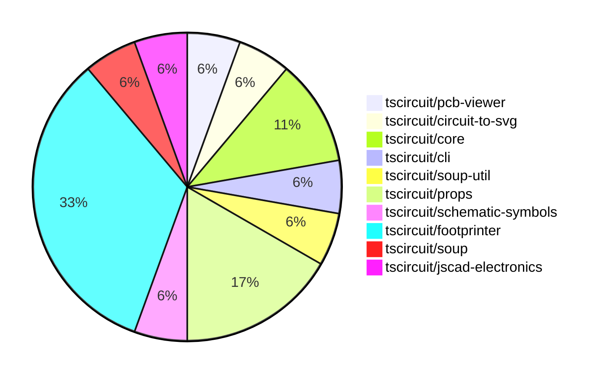

# contribution-tracker

Generates weekly contribution overviews for tscircuit contributors. Check out all
the [contribution overviews here](./contribution-overviews/)

* All PRs in the tscircuit org are scanned/summarized via Claude Haiku
* Claude classifies each Diff/PR as a Major, Minor or Tiny contribution
* All the PRs, summaries, and classifications are organized into charts and tables

The current week is shown below. There are 3 major sections:

* [Contributor Overview](#contributor-overview)
* [PRs by Repository](#prs-by-repository)
* [PRs by Contributor](#changes-by-contributor)

## Current Week

<!-- START_CURRENT_WEEK -->

# Contribution Overview 2024-08-24

## PRs by Repository

## Contributor Overview

| Contributor | 🐳 Major | 🐙 Minor | 🐌 Tiny |
|-------------|-------|-------|-------|
| imrishabh18 | 2 | 0 | 0 |
| seveibar | 2 | 5 | 0 |
| ShiboSoftwareDev | 1 | 2 | 0 |
| anas-sarkez | 2 | 3 | 0 |
| abhijitxy | 1 | 0 | 0 |

## Changes by Repository

### [tscircuit/pcb-viewer](https://github.com/tscircuit/pcb-viewer)

| PR # | Impact | Contributor | Description |
|------|--------|-------------|-------------|
| [#40](https://github.com/tscircuit/pcb-viewer/pull/40) | 🐳 Major | imrishabh18 | Add support for trace-hint on plated-holes. |

### [tscircuit/circuit-to-svg](https://github.com/tscircuit/circuit-to-svg)

| PR # | Impact | Contributor | Description |
|------|--------|-------------|-------------|
| [#25](https://github.com/tscircuit/circuit-to-svg/pull/25) | 🐳 Major | imrishabh18 | Integrate schematic symbols into the circuitJsonToSchematicSvg function, and update the package dependencies. |

### [tscircuit/core](https://github.com/tscircuit/core)

| PR # | Impact | Contributor | Description |
|------|--------|-------------|-------------|
| [#6](https://github.com/tscircuit/core/pull/6) | 🐳 Major | seveibar | Implement trace hints for PCB routing, allowing the user to provide guidance on the desired trace path. |
| [#4](https://github.com/tscircuit/core/pull/4) | 🐳 Major | seveibar |  |

### [tscircuit/cli](https://github.com/tscircuit/cli)

| PR # | Impact | Contributor | Description |
|------|--------|-------------|-------------|
| [#130](https://github.com/tscircuit/cli/pull/130) | 🐙 Minor | seveibar | Update the `flip_y_axis` option for both Gerber and Drill commands to `false`. |

### [tscircuit/soup-util](https://github.com/tscircuit/soup-util)

| PR # | Impact | Contributor | Description |
|------|--------|-------------|-------------|
| [#9](https://github.com/tscircuit/soup-util/pull/9) | 🐙 Minor | seveibar | Allow creating soup util with validation turned on |

### [tscircuit/props](https://github.com/tscircuit/props)

| PR # | Impact | Contributor | Description |
|------|--------|-------------|-------------|
| [#24](https://github.com/tscircuit/props/pull/24) | 🐙 Minor | seveibar | Change the type of `pinLabels` to accept either numbers or strings to fix React parsing issues. |
| [#22](https://github.com/tscircuit/props/pull/22) | 🐙 Minor | seveibar | Make the `for` property of `<tracehint>` optional to support a new syntax where the `<tracehint>` is defined inside the `<trace>` element. |
| [#25](https://github.com/tscircuit/props/pull/25) | 🐙 Minor | ShiboSoftwareDev | Added an optional `outline` property to the `boardProps` type, which allows for defining an array of points to represent the outline of the board. |

### [tscircuit/schematic-symbols](https://github.com/tscircuit/schematic-symbols)

| PR # | Impact | Contributor | Description |
|------|--------|-------------|-------------|
| [#10](https://github.com/tscircuit/schematic-symbols/pull/10) | 🐙 Minor | seveibar | Introduce `getInnerSvg` function to extract the inner SVG elements from the `getSvg` function. |

### [tscircuit/footprinter](https://github.com/tscircuit/footprinter)

| PR # | Impact | Contributor | Description |
|------|--------|-------------|-------------|
| [#19](https://github.com/tscircuit/footprinter/pull/19) | 🐳 Major | ShiboSoftwareDev | Added ms-012 and ms-013 footprints. |
| [#24](https://github.com/tscircuit/footprinter/pull/24) | 🐳 Major | anas-sarkez | Added a new component called SOT723. |
| [#23](https://github.com/tscircuit/footprinter/pull/23) | 🐳 Major | anas-sarkez | Added support for the SOT563 package and its associated test case. |
| [#25](https://github.com/tscircuit/footprinter/pull/25) | 🐙 Minor | anas-sarkez | Fixed silkscreen issue of some components |
| [#21](https://github.com/tscircuit/footprinter/pull/21) | 🐙 Minor | anas-sarkez | Added more test cases for a BGA component with 64 pins, 10mm x 10mm, 8x8 grid, and 1.27mm pitch. |
| [#20](https://github.com/tscircuit/footprinter/pull/20) | 🐙 Minor | anas-sarkez | Added some missing tests and snapshots |

### [tscircuit/soup](https://github.com/tscircuit/soup)

| PR # | Impact | Contributor | Description |
|------|--------|-------------|-------------|
| [#28](https://github.com/tscircuit/soup/pull/28) | 🐙 Minor | ShiboSoftwareDev | Added an optional `outline` prop type to the `pcb_board` type to define the board outline of the PCB. |

### [tscircuit/jscad-electronics](https://github.com/tscircuit/jscad-electronics)

| PR # | Impact | Contributor | Description |
|------|--------|-------------|-------------|
| [#14](https://github.com/tscircuit/jscad-electronics/pull/14) | 🐳 Major | abhijitxy | Implement a new SOT-23-3P component for the project |

## Changes by Contributor

### [imrishabh18](https://github.com/imrishabh18)

| PR # | Impact | Description |
|------|--------|-------------|
| [#40](https://github.com/tscircuit/pcb-viewer/pull/40) | 🐳 Major | Add support for trace-hint on plated-holes. |
| [#25](https://github.com/tscircuit/circuit-to-svg/pull/25) | 🐳 Major | Integrate schematic symbols into the circuitJsonToSchematicSvg function, and update the package dependencies. |

### [seveibar](https://github.com/seveibar)

| PR # | Impact | Description |
|------|--------|-------------|
| [#6](https://github.com/tscircuit/core/pull/6) | 🐳 Major | Implement trace hints for PCB routing, allowing the user to provide guidance on the desired trace path. |
| [#4](https://github.com/tscircuit/core/pull/4) | 🐳 Major |  |
| [#130](https://github.com/tscircuit/cli/pull/130) | 🐙 Minor | Update the `flip_y_axis` option for both Gerber and Drill commands to `false`. |
| [#9](https://github.com/tscircuit/soup-util/pull/9) | 🐙 Minor | Allow creating soup util with validation turned on |
| [#24](https://github.com/tscircuit/props/pull/24) | 🐙 Minor | Change the type of `pinLabels` to accept either numbers or strings to fix React parsing issues. |
| [#22](https://github.com/tscircuit/props/pull/22) | 🐙 Minor | Make the `for` property of `<tracehint>` optional to support a new syntax where the `<tracehint>` is defined inside the `<trace>` element. |
| [#10](https://github.com/tscircuit/schematic-symbols/pull/10) | 🐙 Minor | Introduce `getInnerSvg` function to extract the inner SVG elements from the `getSvg` function. |

### [ShiboSoftwareDev](https://github.com/ShiboSoftwareDev)

| PR # | Impact | Description |
|------|--------|-------------|
| [#19](https://github.com/tscircuit/footprinter/pull/19) | 🐳 Major | Added ms-012 and ms-013 footprints. |
| [#28](https://github.com/tscircuit/soup/pull/28) | 🐙 Minor | Added an optional `outline` prop type to the `pcb_board` type to define the board outline of the PCB. |
| [#25](https://github.com/tscircuit/props/pull/25) | 🐙 Minor | Added an optional `outline` property to the `boardProps` type, which allows for defining an array of points to represent the outline of the board. |

### [anas-sarkez](https://github.com/anas-sarkez)

| PR # | Impact | Description |
|------|--------|-------------|
| [#24](https://github.com/tscircuit/footprinter/pull/24) | 🐳 Major | Added a new component called SOT723. |
| [#23](https://github.com/tscircuit/footprinter/pull/23) | 🐳 Major | Added support for the SOT563 package and its associated test case. |
| [#25](https://github.com/tscircuit/footprinter/pull/25) | 🐙 Minor | Fixed silkscreen issue of some components |
| [#21](https://github.com/tscircuit/footprinter/pull/21) | 🐙 Minor | Added more test cases for a BGA component with 64 pins, 10mm x 10mm, 8x8 grid, and 1.27mm pitch. |
| [#20](https://github.com/tscircuit/footprinter/pull/20) | 🐙 Minor | Added some missing tests and snapshots |

### [abhijitxy](https://github.com/abhijitxy)

| PR # | Impact | Description |
|------|--------|-------------|
| [#14](https://github.com/tscircuit/jscad-electronics/pull/14) | 🐳 Major | Implement a new SOT-23-3P component for the project |

<!-- END_CURRENT_WEEK -->
