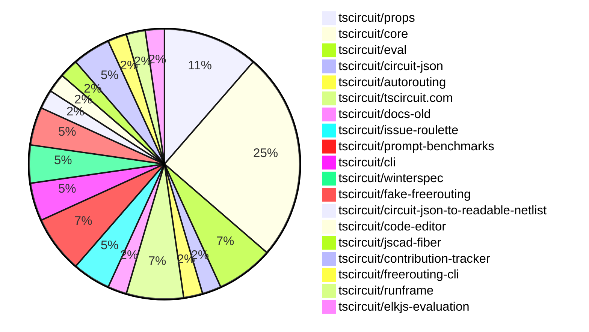

# contribution-tracker

Generates weekly contribution overviews for tscircuit contributors. Check out all
the [contribution overviews here](./contribution-overviews/)

* All PRs in the tscircuit org are scanned/summarized via Claude Haiku
* Claude classifies each Diff/PR as a Major, Minor or Tiny contribution
* All the PRs, summaries, and classifications are organized into charts and tables

The current week is shown below. There are 3 major sections:

* [Contributor Overview](#contributor-overview)
* [PRs by Repository](#prs-by-repository)
* [PRs by Contributor](#changes-by-contributor)

## Current Week

<!-- START_CURRENT_WEEK -->

# Contribution Overview 2025-01-22

## PRs by Repository

## Contributor Overview

| Contributor | 🐳 Major | 🐙 Minor | 🐌 Tiny | ⭐ | Issues Created |
|-------------|---------|---------|---------|-----|----------------|
| [seveibar](#seveibar) | 4 | 12 | 0 | 👑 | 40 |
| [imrishabh18](#imrishabh18) | 0 | 8 | 1 | ⭐⭐ | 3 |
| [ShiboSoftwareDev](#ShiboSoftwareDev) | 2 | 3 | 0 | ⭐⭐ | 3 |
| [ArnavK-09](#ArnavK-09) | 1 | 2 | 0 | ⭐ | 0 |
| [Anshgrover23](#Anshgrover23) | 0 | 3 | 0 | ⭐ | 3 |
| [krushnarout](#krushnarout) | 1 | 0 | 0 | ⭐ | 0 |
| [techmannih](#techmannih) | 0 | 2 | 0 | ⭐ | 5 |
| [kom-senapati](#kom-senapati) | 0 | 2 | 0 | ⭐ | 2 |
| [Abse2001](#Abse2001) | 1 | 0 | 0 | ⭐ | 0 |
| [Ayushjhawar8](#Ayushjhawar8) | 1 | 0 | 0 | ⭐ | 0 |
| [AnasSarkiz](#AnasSarkiz) | 1 | 0 | 0 | ⭐ | 1 |

## Review Table

[reviews-received-hover]: ## "Number of reviews received for PRs for this contributor"
[approvals-received-hover]: ## "Number of approvals received for PRs this contributor authored"
[rejections-received-hover]: ## "Number of rejections received for PRs this contributor authored"
[prs-opened-hover]: ## "Number of PRs opened by this contributor"
[issues-created-hover]: ## "Number of issues created by this contributor"
[bountied-issues-hover]: ## "Number of issues this contributor created with a bounty"
[bountied-issue-$-hover]: ## "Total bounty amount placed on issues authored by this contributor"

| Contributor | Reviews Received | Approvals Received | Rejections Received | Approvals | Rejections | PRs Opened | PRs Merged | Issues Created | Bountied Issues | Bountied Issue $ |
|---|---|---|---|---|---|---|---|---|---|---|
| [seveibar](#seveibar) | 0 | 0 | 0 | 17 | 10 | 17 | 16 | 40 | 32 | 477 |
| [krushnarout](#krushnarout) | 13 | 0 | 3 | 0 | 0 | 3 | 1 | 0 | 0 | 0 |
| [imrishabh18](#imrishabh18) | 8 | 0 | 0 | 0 | 3 | 11 | 9 | 3 | 1 | 10 |
| [Ayushjhawar8](#Ayushjhawar8) | 12 | 1 | 5 | 0 | 0 | 3 | 1 | 0 | 0 | 0 |
| [Anshgrover23](#Anshgrover23) | 13 | 3 | 1 | 2 | 5 | 6 | 3 | 3 | 0 | 0 |
| [ArnavK-09](#ArnavK-09) | 8 | 4 | 1 | 0 | 0 | 4 | 3 | 0 | 0 | 0 |
| [techmannih](#techmannih) | 9 | 2 | 3 | 0 | 0 | 6 | 2 | 5 | 0 | 0 |
| [kom-senapati](#kom-senapati) | 8 | 3 | 4 | 0 | 0 | 6 | 2 | 2 | 1 | 2 |
| [ShiboSoftwareDev](#ShiboSoftwareDev) | 3 | 3 | 0 | 0 | 0 | 7 | 5 | 3 | 2 | 15 |
| [devin-ai-integration[bot]](#devin-ai-integration[bot]) | 0 | 0 | 0 | 0 | 0 | 1 | 0 | 0 | 0 | 0 |
| [mdkaifansari04](#mdkaifansari04) | 1 | 0 | 1 | 0 | 0 | 2 | 0 | 0 | 0 | 0 |
| [mojafa](#mojafa) | 0 | 0 | 0 | 0 | 0 | 1 | 0 | 0 | 0 | 0 |
| [Abse2001](#Abse2001) | 6 | 2 | 0 | 0 | 0 | 1 | 1 | 0 | 0 | 0 |
| [Girma35](#Girma35) | 0 | 0 | 0 | 0 | 0 | 1 | 0 | 0 | 0 | 0 |
| [AnasSarkiz](#AnasSarkiz) | 1 | 1 | 0 | 0 | 0 | 1 | 1 | 1 | 0 | 0 |

## Changes by Repository

### [tscircuit/props](https://github.com/tscircuit/props)

| PR # | Impact | Contributor | Description |
|------|--------|-------------|-------------|
| [#153](https://github.com/tscircuit/props/pull/153) | 🐳 Major | seveibar | Rename `schPortArrangement` to `schPinArrangement`, and `internallyConnectedPorts` to `internallyConnectedPins`, with a default configuration for internally connected push button pins. |
| [#148](https://github.com/tscircuit/props/pull/148) | 🐳 Major | ShiboSoftwareDev | Adds a script to generate documentation for the available component types in the TSCircuit project. |
| [#152](https://github.com/tscircuit/props/pull/152) | 🐙 Minor | seveibar | Add new properties `internallyConnectedPorts` and `externallyConnectedPorts` to the `Chip` type. |
| [#151](https://github.com/tscircuit/props/pull/151) | 🐙 Minor | techmannih | Adds support for "pill" shaped SMT pads in the PCB layout component. |
| [#147](https://github.com/tscircuit/props/pull/147) | 🐙 Minor | ShiboSoftwareDev | Cleanup folder structure by moving files to the appropriate directories. |

### [tscircuit/core](https://github.com/tscircuit/core)

| PR # | Impact | Contributor | Description |
|------|--------|-------------|-------------|
| [#549](https://github.com/tscircuit/core/pull/549) | 🐳 Major | seveibar | Introduce the `sel` object, a utility for accessing component and net references in a schematic. |
| [#543](https://github.com/tscircuit/core/pull/543) | 🐳 Major | seveibar | Add support for subcircuit-dependent autorouting |
| [#555](https://github.com/tscircuit/core/pull/555) | 🐙 Minor | seveibar | The pull request changes the naming of `internallyConnectedPorts` to `internallyConnectedPins` throughout the codebase. |
| [#553](https://github.com/tscircuit/core/pull/553) | 🐙 Minor | seveibar | Renames the property `schPortArrangement` to `schPinArrangement` with backwards compatibility. |
| [#552](https://github.com/tscircuit/core/pull/552) | 🐙 Minor | seveibar | Implements the `internallyConnectedPorts` feature and adds a default for the `<pushbutton />` component. |
| [#551](https://github.com/tscircuit/core/pull/551) | 🐙 Minor | seveibar | Fixes issue where source ports are not created for footprints if the schematic symbol has fewer pins. |
| [#546](https://github.com/tscircuit/core/pull/546) | 🐙 Minor | seveibar | Fix reconciler constants import that was preventing core in NextJS |
| [#561](https://github.com/tscircuit/core/pull/561) | 🐙 Minor | imrishabh18 | Move `react-reconciler` from dev to runtime dependency |
| [#545](https://github.com/tscircuit/core/pull/545) | 🐙 Minor | imrishabh18 | Optimised the circuit JSON sent to the autorouter by including only the `Source_` and `Pcb_` elements, and added the `subcircuit_id` to the request. |
| [#539](https://github.com/tscircuit/core/pull/539) | 🐙 Minor | imrishabh18 | Add `subcircuit_id` and `pcb_group_id` to primitive components |
| [#557](https://github.com/tscircuit/core/pull/557) | 🐌 Tiny | imrishabh18 | Adds missing import 'getTestFixture' to the test file |

### [tscircuit/eval](https://github.com/tscircuit/eval)

| PR # | Impact | Contributor | Description |
|------|--------|-------------|-------------|
| [#91](https://github.com/tscircuit/eval/pull/91) | 🐳 Major | seveibar | Adds the `CircuitRunner` class and exports it from the `lib/eval` module. |
| [#92](https://github.com/tscircuit/eval/pull/92) | 🐙 Minor | seveibar | Added types to exports in package.json |
| [#89](https://github.com/tscircuit/eval/pull/89) | 🐙 Minor | seveibar | Allows importing "tscircuit" and aliasing it to "@tscircuit/core" |

### [tscircuit/circuit-json](https://github.com/tscircuit/circuit-json)

| PR # | Impact | Contributor | Description |
|------|--------|-------------|-------------|
| [#125](https://github.com/tscircuit/circuit-json/pull/125) | 🐙 Minor | seveibar | Add parent subcircuit id to the source group schema |

### [tscircuit/autorouting](https://github.com/tscircuit/autorouting)

| PR # | Impact | Contributor | Description |
|------|--------|-------------|-------------|
| [#110](https://github.com/tscircuit/autorouting/pull/110) | 🐙 Minor | seveibar | The change ignores already routed traces when getting simple route JSON. |

### [tscircuit/tscircuit.com](https://github.com/tscircuit/tscircuit.com)

| PR # | Impact | Contributor | Description |
|------|--------|-------------|-------------|
| [#611](https://github.com/tscircuit/tscircuit.com/pull/611) | 🐙 Minor | seveibar | Update the version of the "@tscircuit/core" dependency to the latest version (0.0.280) |
| [#605](https://github.com/tscircuit/tscircuit.com/pull/605) | 🐙 Minor | seveibar | Allows synchronous import of the "tscircuit" symbol in the "use-run-tsx" hook. |
| [#604](https://github.com/tscircuit/tscircuit.com/pull/604) | 🐙 Minor | imrishabh18 | Fixes the preview page by using the `runframe` library to render the circuit preview. |

### [tscircuit/docs-old](https://github.com/tscircuit/docs-old)

| PR # | Impact | Contributor | Description |
|------|--------|-------------|-------------|
| [#59](https://github.com/tscircuit/docs-old/pull/59) | 🐳 Major | krushnarout | The pull request ports the documentation from Mintlify to Docusaurus. |

### [tscircuit/issue-roulette](https://github.com/tscircuit/issue-roulette)

| PR # | Impact | Contributor | Description |
|------|--------|-------------|-------------|
| [#14](https://github.com/tscircuit/issue-roulette/pull/14) | 🐙 Minor | techmannih | Update the `title` property in the `metadata` object of the Next.js application. |
| [#8](https://github.com/tscircuit/issue-roulette/pull/8) | 🐙 Minor | Anshgrover23 | Adds a filter to the issue roulette component, allowing users to view all issues, bountied issues, or unbountied issues. |

### [tscircuit/prompt-benchmarks](https://github.com/tscircuit/prompt-benchmarks)

| PR # | Impact | Contributor | Description |
|------|--------|-------------|-------------|
| [#13](https://github.com/tscircuit/prompt-benchmarks/pull/13) | 🐳 Major | ShiboSoftwareDev | Enhances the prompt for the AI-generated circuit boards, improving the quality of the generated circuits. |
| [#15](https://github.com/tscircuit/prompt-benchmarks/pull/15) | 🐙 Minor | ShiboSoftwareDev | Display code in code blocks instead of plain text |
| [#14](https://github.com/tscircuit/prompt-benchmarks/pull/14) | 🐙 Minor | ShiboSoftwareDev | Adds error reporting to the `benchmark.eval.ts` file and modifies the `experimental_customColumns` function to handle the case where `result.output` is a string. |

### [tscircuit/cli](https://github.com/tscircuit/cli)

| PR # | Impact | Contributor | Description |
|------|--------|-------------|-------------|
| [#39](https://github.com/tscircuit/cli/pull/39) | 🐳 Major | ArnavK-09 | Adds two new commands, `tsci auth set-token` and `tsci auth print-token`, to the CLI. |
| [#40](https://github.com/tscircuit/cli/pull/40) | 🐙 Minor | kom-senapati | Add registry while cloning a repository |

### [tscircuit/winterspec](https://github.com/tscircuit/winterspec)

| PR # | Impact | Contributor | Description |
|------|--------|-------------|-------------|
| [#27](https://github.com/tscircuit/winterspec/pull/27) | 🐙 Minor | ArnavK-09 |  |
| [#29](https://github.com/tscircuit/winterspec/pull/29) | 🐙 Minor | ArnavK-09 | Fixes the Node.js CI check and adds a new CI workflow to run tests using Bun. |

### [tscircuit/fake-freerouting](https://github.com/tscircuit/fake-freerouting)

| PR # | Impact | Contributor | Description |
|------|--------|-------------|-------------|
| [#21](https://github.com/tscircuit/fake-freerouting/pull/21) | 🐙 Minor | imrishabh18 | Update the version of the "dsn-converter" dependency from "^0.0.41" to "^0.0.57". |
| [#20](https://github.com/tscircuit/fake-freerouting/pull/20) | 🐙 Minor | imrishabh18 | Update the `@tscircuit/infgrid-ijump-astar` dependency to version `0.0.34`. |

### [tscircuit/circuit-json-to-readable-netlist](https://github.com/tscircuit/circuit-json-to-readable-netlist)

| PR # | Impact | Contributor | Description |
|------|--------|-------------|-------------|
| [#8](https://github.com/tscircuit/circuit-json-to-readable-netlist/pull/8) | 🐙 Minor | imrishabh18 | Update the GitHub Actions workflow for formatting code. |

### [tscircuit/code-editor](https://github.com/tscircuit/code-editor)

| PR # | Impact | Contributor | Description |
|------|--------|-------------|-------------|
| [#9](https://github.com/tscircuit/code-editor/pull/9) | 🐙 Minor | imrishabh18 | Adds a GitHub Actions workflow to publish the package to npm on push to the main branch. |

### [tscircuit/jscad-fiber](https://github.com/tscircuit/jscad-fiber)

| PR # | Impact | Contributor | Description |
|------|--------|-------------|-------------|
| [#103](https://github.com/tscircuit/jscad-fiber/pull/103) | 🐙 Minor | kom-senapati | Isolates Three.js-specific functions into a separate entrypoint |

### [tscircuit/contribution-tracker](https://github.com/tscircuit/contribution-tracker)

| PR # | Impact | Contributor | Description |
|------|--------|-------------|-------------|
| [#39](https://github.com/tscircuit/contribution-tracker/pull/39) | 🐙 Minor | Anshgrover23 | The pull request adds "Major", "Minor", and "Tiny" counts, as well as a "stars" field to the contributor stats in the generated markdown. |
| [#37](https://github.com/tscircuit/contribution-tracker/pull/37) | 🐙 Minor | Anshgrover23 | The pull request changes the way review counts are calculated, using distinct pull requests reviewed instead of the raw review counts. |

### [tscircuit/freerouting-cli](https://github.com/tscircuit/freerouting-cli)

| PR # | Impact | Contributor | Description |
|------|--------|-------------|-------------|
| [#8](https://github.com/tscircuit/freerouting-cli/pull/8) | 🐳 Major | Abse2001 | This PR adds a new function `routeUsingLocalFreerouting` that runs the Freerouting tool locally using Docker and provides tests for it. |

### [tscircuit/runframe](https://github.com/tscircuit/runframe)

| PR # | Impact | Contributor | Description |
|------|--------|-------------|-------------|
| [#164](https://github.com/tscircuit/runframe/pull/164) | 🐳 Major | Ayushjhawar8 | Adds a red square stop/pause button to the RunFrame component |

### [tscircuit/elkjs-evaluation](https://github.com/tscircuit/elkjs-evaluation)

| PR # | Impact | Contributor | Description |
|------|--------|-------------|-------------|
| [#2](https://github.com/tscircuit/elkjs-evaluation/pull/2) | 🐳 Major | AnasSarkiz | Added Bootstrap ElkJS Evaluation |

## Changes by Contributor

### [seveibar](https://github.com/seveibar)

| PR # | Impact | Description |
|------|--------|-------------|
| [#153](https://github.com/tscircuit/props/pull/153) | 🐳 Major | Rename `schPortArrangement` to `schPinArrangement`, and `internallyConnectedPorts` to `internallyConnectedPins`, with a default configuration for internally connected push button pins. |
| [#549](https://github.com/tscircuit/core/pull/549) | 🐳 Major | Introduce the `sel` object, a utility for accessing component and net references in a schematic. |
| [#543](https://github.com/tscircuit/core/pull/543) | 🐳 Major | Add support for subcircuit-dependent autorouting |
| [#91](https://github.com/tscircuit/eval/pull/91) | 🐳 Major | Adds the `CircuitRunner` class and exports it from the `lib/eval` module. |
| [#125](https://github.com/tscircuit/circuit-json/pull/125) | 🐙 Minor | Add parent subcircuit id to the source group schema |
| [#152](https://github.com/tscircuit/props/pull/152) | 🐙 Minor | Add new properties `internallyConnectedPorts` and `externallyConnectedPorts` to the `Chip` type. |
| [#555](https://github.com/tscircuit/core/pull/555) | 🐙 Minor | The pull request changes the naming of `internallyConnectedPorts` to `internallyConnectedPins` throughout the codebase. |
| [#553](https://github.com/tscircuit/core/pull/553) | 🐙 Minor | Renames the property `schPortArrangement` to `schPinArrangement` with backwards compatibility. |
| [#552](https://github.com/tscircuit/core/pull/552) | 🐙 Minor | Implements the `internallyConnectedPorts` feature and adds a default for the `<pushbutton />` component. |
| [#551](https://github.com/tscircuit/core/pull/551) | 🐙 Minor | Fixes issue where source ports are not created for footprints if the schematic symbol has fewer pins. |
| [#546](https://github.com/tscircuit/core/pull/546) | 🐙 Minor | Fix reconciler constants import that was preventing core in NextJS |
| [#110](https://github.com/tscircuit/autorouting/pull/110) | 🐙 Minor | The change ignores already routed traces when getting simple route JSON. |
| [#611](https://github.com/tscircuit/tscircuit.com/pull/611) | 🐙 Minor | Update the version of the "@tscircuit/core" dependency to the latest version (0.0.280) |
| [#605](https://github.com/tscircuit/tscircuit.com/pull/605) | 🐙 Minor | Allows synchronous import of the "tscircuit" symbol in the "use-run-tsx" hook. |
| [#92](https://github.com/tscircuit/eval/pull/92) | 🐙 Minor | Added types to exports in package.json |
| [#89](https://github.com/tscircuit/eval/pull/89) | 🐙 Minor | Allows importing "tscircuit" and aliasing it to "@tscircuit/core" |

### [krushnarout](https://github.com/krushnarout)

| PR # | Impact | Description |
|------|--------|-------------|
| [#59](https://github.com/tscircuit/docs-old/pull/59) | 🐳 Major | The pull request ports the documentation from Mintlify to Docusaurus. |

### [techmannih](https://github.com/techmannih)

| PR # | Impact | Description |
|------|--------|-------------|
| [#151](https://github.com/tscircuit/props/pull/151) | 🐙 Minor | Adds support for "pill" shaped SMT pads in the PCB layout component. |
| [#14](https://github.com/tscircuit/issue-roulette/pull/14) | 🐙 Minor | Update the `title` property in the `metadata` object of the Next.js application. |

### [ShiboSoftwareDev](https://github.com/ShiboSoftwareDev)

| PR # | Impact | Description |
|------|--------|-------------|
| [#148](https://github.com/tscircuit/props/pull/148) | 🐳 Major | Adds a script to generate documentation for the available component types in the TSCircuit project. |
| [#13](https://github.com/tscircuit/prompt-benchmarks/pull/13) | 🐳 Major | Enhances the prompt for the AI-generated circuit boards, improving the quality of the generated circuits. |
| [#147](https://github.com/tscircuit/props/pull/147) | 🐙 Minor | Cleanup folder structure by moving files to the appropriate directories. |
| [#15](https://github.com/tscircuit/prompt-benchmarks/pull/15) | 🐙 Minor | Display code in code blocks instead of plain text |
| [#14](https://github.com/tscircuit/prompt-benchmarks/pull/14) | 🐙 Minor | Adds error reporting to the `benchmark.eval.ts` file and modifies the `experimental_customColumns` function to handle the case where `result.output` is a string. |

### [ArnavK-09](https://github.com/ArnavK-09)

| PR # | Impact | Description |
|------|--------|-------------|
| [#39](https://github.com/tscircuit/cli/pull/39) | 🐳 Major | Adds two new commands, `tsci auth set-token` and `tsci auth print-token`, to the CLI. |
| [#27](https://github.com/tscircuit/winterspec/pull/27) | 🐙 Minor |  |
| [#29](https://github.com/tscircuit/winterspec/pull/29) | 🐙 Minor | Fixes the Node.js CI check and adds a new CI workflow to run tests using Bun. |

### [imrishabh18](https://github.com/imrishabh18)

| PR # | Impact | Description |
|------|--------|-------------|
| [#561](https://github.com/tscircuit/core/pull/561) | 🐙 Minor | Move `react-reconciler` from dev to runtime dependency |
| [#545](https://github.com/tscircuit/core/pull/545) | 🐙 Minor | Optimised the circuit JSON sent to the autorouter by including only the `Source_` and `Pcb_` elements, and added the `subcircuit_id` to the request. |
| [#539](https://github.com/tscircuit/core/pull/539) | 🐙 Minor | Add `subcircuit_id` and `pcb_group_id` to primitive components |
| [#604](https://github.com/tscircuit/tscircuit.com/pull/604) | 🐙 Minor | Fixes the preview page by using the `runframe` library to render the circuit preview. |
| [#21](https://github.com/tscircuit/fake-freerouting/pull/21) | 🐙 Minor | Update the version of the "dsn-converter" dependency from "^0.0.41" to "^0.0.57". |
| [#20](https://github.com/tscircuit/fake-freerouting/pull/20) | 🐙 Minor | Update the `@tscircuit/infgrid-ijump-astar` dependency to version `0.0.34`. |
| [#8](https://github.com/tscircuit/circuit-json-to-readable-netlist/pull/8) | 🐙 Minor | Update the GitHub Actions workflow for formatting code. |
| [#9](https://github.com/tscircuit/code-editor/pull/9) | 🐙 Minor | Adds a GitHub Actions workflow to publish the package to npm on push to the main branch. |
| [#557](https://github.com/tscircuit/core/pull/557) | 🐌 Tiny | Adds missing import 'getTestFixture' to the test file |

### [kom-senapati](https://github.com/kom-senapati)

| PR # | Impact | Description |
|------|--------|-------------|
| [#103](https://github.com/tscircuit/jscad-fiber/pull/103) | 🐙 Minor | Isolates Three.js-specific functions into a separate entrypoint |
| [#40](https://github.com/tscircuit/cli/pull/40) | 🐙 Minor | Add registry while cloning a repository |

### [Anshgrover23](https://github.com/Anshgrover23)

| PR # | Impact | Description |
|------|--------|-------------|
| [#39](https://github.com/tscircuit/contribution-tracker/pull/39) | 🐙 Minor | The pull request adds "Major", "Minor", and "Tiny" counts, as well as a "stars" field to the contributor stats in the generated markdown. |
| [#37](https://github.com/tscircuit/contribution-tracker/pull/37) | 🐙 Minor | The pull request changes the way review counts are calculated, using distinct pull requests reviewed instead of the raw review counts. |
| [#8](https://github.com/tscircuit/issue-roulette/pull/8) | 🐙 Minor | Adds a filter to the issue roulette component, allowing users to view all issues, bountied issues, or unbountied issues. |

### [Abse2001](https://github.com/Abse2001)

| PR # | Impact | Description |
|------|--------|-------------|
| [#8](https://github.com/tscircuit/freerouting-cli/pull/8) | 🐳 Major | This PR adds a new function `routeUsingLocalFreerouting` that runs the Freerouting tool locally using Docker and provides tests for it. |

### [Ayushjhawar8](https://github.com/Ayushjhawar8)

| PR # | Impact | Description |
|------|--------|-------------|
| [#164](https://github.com/tscircuit/runframe/pull/164) | 🐳 Major | Adds a red square stop/pause button to the RunFrame component |

### [AnasSarkiz](https://github.com/AnasSarkiz)

| PR # | Impact | Description |
|------|--------|-------------|
| [#2](https://github.com/tscircuit/elkjs-evaluation/pull/2) | 🐳 Major | Added Bootstrap ElkJS Evaluation |

<!-- END_CURRENT_WEEK -->
