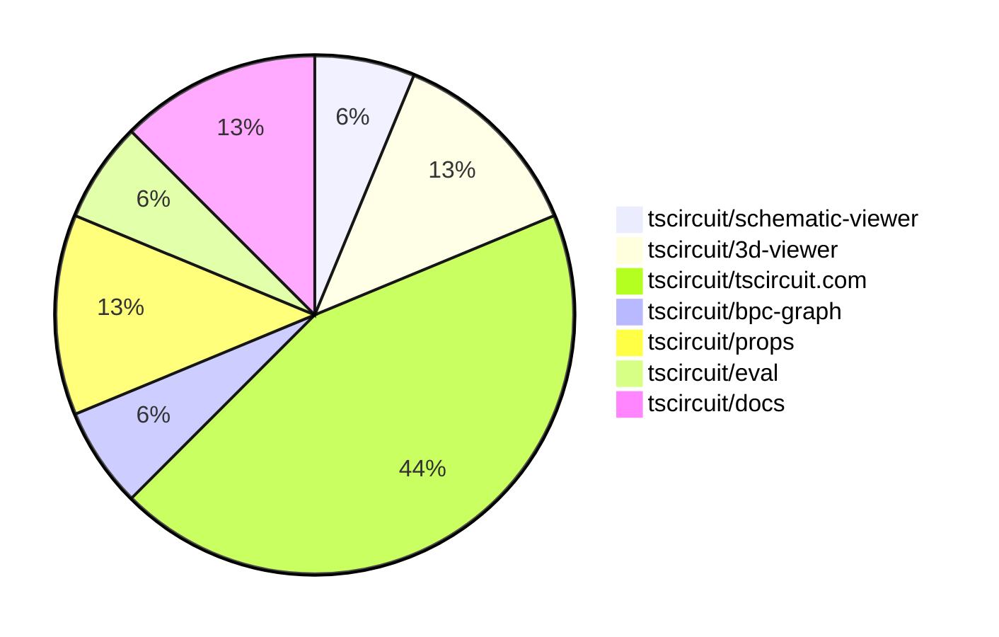
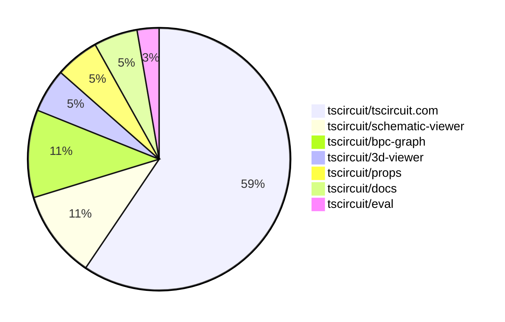

# contribution-tracker

[contributions.tscircuit.com](https://contributions.tscircuit.com) ・ [tscircuit.com](https://tscircuit.com) ・ [Contribution Overviews](./contribution-overviews/) ・ [Changelogs](./changelogs/)

Generates weekly contribution overviews for tscircuit contributors. Check out all
the [contribution overviews here](./contribution-overviews/)
You can find AI-generated monthly changelogs in the [changelogs directory](./changelogs/).

- All PRs in the tscircuit org are scanned/summarized via an LLM
- The LLM classifies each Diff/PR as into a set of attributes for scoring
- All the PRs, summaries, and classifications are organized into charts and tables for [the website](https://contributions.tscircuit.com)

> Want to run locally? See the [Development Section](#development)

The current week is shown below. There are 3 major sections:

- [Contributor Overview](#contributor-overview)
- [PRs by Repository](#prs-by-repository)
- [PRs by Contributor](#changes-by-contributor)

## Current Week

<!-- START_CURRENT_WEEK -->

# Contribution Overview 2025-08-06

## PRs by Repository



## Contributor Overview

| Contributor | 🐳 Major | 🐙 Minor | 🐌 Tiny | ⭐ | Score | Discussion Contributions |
|-------------|---------|---------|---------|-----|----------------|--------------------------|
| [seveibar](#seveibar) | 4 | 0 | 3 | ⭐⭐ | 27 | 0🔹 0🔶 0💎 |
| [ArnavK-09](#ArnavK-09) | 2 | 0 | 1 | ⭐ | 9 | 0🔹 0🔶 0💎 |
| [ShiboSoftwareDev](#ShiboSoftwareDev) | 1 | 0 | 1 | ⭐ | 4.5 | 0🔹 0🔶 0💎 |
| [MustafaMulla29](#MustafaMulla29) | 0 | 0 | 2 |  | 2 | 0🔹 0🔶 0💎 |
| [pxlpal](#pxlpal) | 0 | 0 | 1 |  | 1 | 0🔹 0🔶 0💎 |
| [tscircuitbot](#tscircuitbot) | 0 | 0 | 1 |  | 1 | 0🔹 0🔶 0💎 |

### Discussion Contribution Legend

- 🔹 Normal Comments: Basic participation with minimal effort
- 🔶 Great Informative Comments: Thoughtful participation that adds value
- 💎 Incredible Comments: Exceptional participation with high-quality content

## Review Table

[reviews-received-hover]: ## "Number of reviews received for PRs for this contributor"
[approvals-received-hover]: ## "Number of approvals received for PRs this contributor authored"
[rejections-received-hover]: ## "Number of rejections received for PRs this contributor authored"
[prs-opened-hover]: ## "Number of PRs opened by this contributor"
[issues-created-hover]: ## "Number of issues created by this contributor"
[bountied-issues-hover]: ## "Number of issues this contributor created with a bounty"
[bountied-issue-$-hover]: ## "Total bounty amount placed on issues authored by this contributor"

| Contributor | Reviews Received | Approvals Received | Rejections Received | Approvals | Rejections | PRs Opened | PRs Merged | Score | Issues Created | Bountied Issues | Bountied Issue $ |
|---|---|---|---|---|---|---|---|---|---|---|---|
| [ShiboSoftwareDev](#ShiboSoftwareDev) | 5 | 4 | 0 | 0 | 0 | 4 | 3 | 4.5 | 0 | 0 | 0 |
| [seveibar](#seveibar) | 2 | 0 | 0 | 11 | 1 | 8 | 7 | 27 | 0 | 0 | 0 |
| [pxlpal](#pxlpal) | 2 | 1 | 0 | 0 | 0 | 1 | 1 | 1 | 0 | 0 | 0 |
| [graphite-app[bot]](#graphite-app[bot]) | 0 | 0 | 0 | 0 | 0 | 0 | 0 | 0 | 0 | 0 | 0 |
| [MustafaMulla29](#MustafaMulla29) | 6 | 3 | 1 | 0 | 0 | 4 | 2 | 2 | 0 | 0 | 0 |
| [ArnavK-09](#ArnavK-09) | 7 | 3 | 0 | 0 | 0 | 3 | 3 | 9 | 0 | 0 | 0 |
| [tscircuitbot](#tscircuitbot) | 0 | 0 | 0 | 0 | 0 | 1 | 1 | 1 | 0 | 0 | 0 |

## Top 7 Repositories by Contribution Points



## Changes by Repository

### [tscircuit/schematic-viewer](https://github.com/tscircuit/schematic-viewer)

| PR # | Impact | Rating | Contributor | Description |
|------|--------|--------|-------------|-------------|
| [#102](https://github.com/tscircuit/schematic-viewer/pull/102) | 🐳 Major | ⭐⭐⭐ | ShiboSoftwareDev | Adds SPICE simulation functionality that runs in a background web worker, ensuring UI responsiveness and reruns when circuit JSON changes. |

### [tscircuit/3d-viewer](https://github.com/tscircuit/3d-viewer)


<details>
<summary>🐌 Tiny Contributions (2)</summary>

| PR # | Impact | Contributor | Description |
|------|--------|-------------|-------------|
| [#398](https://github.com/tscircuit/3d-viewer/pull/398) | 🐌 Tiny | ShiboSoftwareDev | Updates the version of react-threedrei from 9.121.4 to 10.6.1 in package.json to resolve compatibility issues with react-reconciler. |
| [#397](https://github.com/tscircuit/3d-viewer/pull/397) | 🐌 Tiny | seveibar | Updates package dependencies and modifies import statements in the codebase to align with the new structure of the project. |

</details>

### [tscircuit/tscircuit.com](https://github.com/tscircuit/tscircuit.com)

| PR # | Impact | Rating | Contributor | Description |
|------|--------|--------|-------------|-------------|
| [#1547](https://github.com/tscircuit/tscircuit.com/pull/1547) | 🐳 Major | ⭐⭐⭐ | seveibar | Allows the package releases page to function correctly even when no build is available, ensuring users can still access release information. |
| [#1546](https://github.com/tscircuit/tscircuit.com/pull/1546) | 🐳 Major | ⭐⭐⭐ | seveibar | Refactors the UI to replace view-connected-repo with releases, introduces new pages for releases and release details, and updates the data model for package releases and builds. |
| [#1545](https://github.com/tscircuit/tscircuit.com/pull/1545) | 🐳 Major | ⭐⭐⭐ | seveibar | Adds a GitHub repository selector component with a refresh button and search functionality for improved user interaction. |
| [#1544](https://github.com/tscircuit/tscircuit.com/pull/1544) | 🐳 Major | ⭐⭐⭐ | ArnavK-09 | No description provided |
| [#1542](https://github.com/tscircuit/tscircuit.com/pull/1542) | 🐳 Major | ⭐⭐⭐ | ArnavK-09 | Replace ConnectedReposCards with ConnectedPackagesList component, add GitHub repo linkingunlinking functionality, improve UI for connected packages with build status and preview, remove unused ConnectedRepoSettings component, update API to handle nullable github_repo_full_name, remove extra settings dialog |

<details>
<summary>🐌 Tiny Contributions (2)</summary>

| PR # | Impact | Contributor | Description |
|------|--------|-------------|-------------|
| [#1548](https://github.com/tscircuit/tscircuit.com/pull/1548) | 🐌 Tiny | seveibar | Adds handling for cases where package build information is not available, displaying a message to the user instead of failing silently. |
| [#1543](https://github.com/tscircuit/tscircuit.com/pull/1543) | 🐌 Tiny | ArnavK-09 | Add allow_pr_previews field to package schema and update API, pass currentAllowPrPreviews to edit dialog components, update GitHubRepositorySelector to use allowPrPreviews instead of enablePrPreview, and include is_pr_preview and github_pr_number in package release mapping |

</details>

### [tscircuit/bpc-graph](https://github.com/tscircuit/bpc-graph)

| PR # | Impact | Rating | Contributor | Description |
|------|--------|--------|-------------|-------------|
| [#69](https://github.com/tscircuit/bpc-graph/pull/69) | 🐳 Major | ⭐⭐⭐ | seveibar | Introduces a new PinSpacePartitionProcessor class that partitions a canonical right-facing graph into smaller right-facing graphs based on gaps between pins. |

### [tscircuit/props](https://github.com/tscircuit/props)


<details>
<summary>🐌 Tiny Contributions (2)</summary>

| PR # | Impact | Contributor | Description |
|------|--------|-------------|-------------|
| [#354](https://github.com/tscircuit/props/pull/354) | 🐌 Tiny | seveibar | Adds properties to allow traces to specify a reference and explicit PCB path via pcbPathRelativeTo and pcbPath. |
| [#351](https://github.com/tscircuit/props/pull/351) | 🐌 Tiny | pxlpal | Adds autocomplete functionality for the footprint prop, allowing editors to suggest common footprints while still permitting custom strings. |

</details>

### [tscircuit/eval](https://github.com/tscircuit/eval)


<details>
<summary>🐌 Tiny Contributions (1)</summary>

| PR # | Impact | Contributor | Description |
|------|--------|-------------|-------------|
| [#801](https://github.com/tscircuit/eval/pull/801) | 🐌 Tiny | tscircuitbot | Updates the tscircuitcore package to version 0.0.614 and the circuit-json package to version 0.0.226. |

</details>

### [tscircuit/docs](https://github.com/tscircuit/docs)


<details>
<summary>🐌 Tiny Contributions (2)</summary>

| PR # | Impact | Contributor | Description |
|------|--------|-------------|-------------|
| [#109](https://github.com/tscircuit/docs/pull/109) | 🐌 Tiny | MustafaMulla29 | Adds documentation for the fuse component, detailing its properties, usage, and specifications. |
| [#108](https://github.com/tscircuit/docs/pull/108) | 🐌 Tiny | MustafaMulla29 | Adds documentation for the battery  element, detailing its usage, specifications, and examples for users. |

</details>

## Changes by Contributor

### [ShiboSoftwareDev](https://github.com/ShiboSoftwareDev)

| PRs # | Impact | Rating | Description |
|------|--------|--------|-------------|
| [#102](https://github.com/tscircuit/schematic-viewer/pull/102) | 🐳 Major | ⭐⭐⭐ | Adds SPICE simulation functionality that runs in a background web worker, ensuring UI responsiveness and reruns when circuit JSON changes. |

<details>
<summary>🐌 Tiny Contributions (1)</summary>

| PR # | Impact | Description |
|------|--------|-------------|
| [#398](https://github.com/tscircuit/3d-viewer/pull/398) | 🐌 Tiny | Updates the version of react-threedrei from 9.121.4 to 10.6.1 in package.json to resolve compatibility issues with react-reconciler. |

</details>

### [seveibar](https://github.com/seveibar)

| PRs # | Impact | Rating | Description |
|------|--------|--------|-------------|
| [#1547](https://github.com/tscircuit/tscircuit.com/pull/1547) | 🐳 Major | ⭐⭐⭐ | Allows the package releases page to function correctly even when no build is available, ensuring users can still access release information. |
| [#1546](https://github.com/tscircuit/tscircuit.com/pull/1546) | 🐳 Major | ⭐⭐⭐ | Refactors the UI to replace view-connected-repo with releases, introduces new pages for releases and release details, and updates the data model for package releases and builds. |
| [#1545](https://github.com/tscircuit/tscircuit.com/pull/1545) | 🐳 Major | ⭐⭐⭐ | Adds a GitHub repository selector component with a refresh button and search functionality for improved user interaction. |
| [#69](https://github.com/tscircuit/bpc-graph/pull/69) | 🐳 Major | ⭐⭐⭐ | Introduces a new PinSpacePartitionProcessor class that partitions a canonical right-facing graph into smaller right-facing graphs based on gaps between pins. |

<details>
<summary>🐌 Tiny Contributions (3)</summary>

| PR # | Impact | Description |
|------|--------|-------------|
| [#354](https://github.com/tscircuit/props/pull/354) | 🐌 Tiny | Adds properties to allow traces to specify a reference and explicit PCB path via pcbPathRelativeTo and pcbPath. |
| [#397](https://github.com/tscircuit/3d-viewer/pull/397) | 🐌 Tiny | Updates package dependencies and modifies import statements in the codebase to align with the new structure of the project. |
| [#1548](https://github.com/tscircuit/tscircuit.com/pull/1548) | 🐌 Tiny | Adds handling for cases where package build information is not available, displaying a message to the user instead of failing silently. |

</details>

### [pxlpal](https://github.com/pxlpal)


<details>
<summary>🐌 Tiny Contributions (1)</summary>

| PR # | Impact | Description |
|------|--------|-------------|
| [#351](https://github.com/tscircuit/props/pull/351) | 🐌 Tiny | Adds autocomplete functionality for the footprint prop, allowing editors to suggest common footprints while still permitting custom strings. |

</details>

### [ArnavK-09](https://github.com/ArnavK-09)

| PRs # | Impact | Rating | Description |
|------|--------|--------|-------------|
| [#1544](https://github.com/tscircuit/tscircuit.com/pull/1544) | 🐳 Major | ⭐⭐⭐ | No description provided |
| [#1542](https://github.com/tscircuit/tscircuit.com/pull/1542) | 🐳 Major | ⭐⭐⭐ | Replace ConnectedReposCards with ConnectedPackagesList component, add GitHub repo linkingunlinking functionality, improve UI for connected packages with build status and preview, remove unused ConnectedRepoSettings component, update API to handle nullable github_repo_full_name, remove extra settings dialog |

<details>
<summary>🐌 Tiny Contributions (1)</summary>

| PR # | Impact | Description |
|------|--------|-------------|
| [#1543](https://github.com/tscircuit/tscircuit.com/pull/1543) | 🐌 Tiny | Add allow_pr_previews field to package schema and update API, pass currentAllowPrPreviews to edit dialog components, update GitHubRepositorySelector to use allowPrPreviews instead of enablePrPreview, and include is_pr_preview and github_pr_number in package release mapping |

</details>

### [tscircuitbot](https://github.com/tscircuitbot)


<details>
<summary>🐌 Tiny Contributions (1)</summary>

| PR # | Impact | Description |
|------|--------|-------------|
| [#801](https://github.com/tscircuit/eval/pull/801) | 🐌 Tiny | Updates the tscircuitcore package to version 0.0.614 and the circuit-json package to version 0.0.226. |

</details>

### [MustafaMulla29](https://github.com/MustafaMulla29)


<details>
<summary>🐌 Tiny Contributions (2)</summary>

| PR # | Impact | Description |
|------|--------|-------------|
| [#109](https://github.com/tscircuit/docs/pull/109) | 🐌 Tiny | Adds documentation for the fuse component, detailing its properties, usage, and specifications. |
| [#108](https://github.com/tscircuit/docs/pull/108) | 🐌 Tiny | Adds documentation for the battery  element, detailing its usage, specifications, and examples for users. |

</details>

## Repository Owners

| Repository | Codeowners |
|------------|------------|
| [builder](https://github.com/tscircuit/builder/blob/main/.github/CODEOWNERS) | [seveibar](https://github.com/seveibar)
| [pcb-viewer](https://github.com/tscircuit/pcb-viewer/blob/main/.github/CODEOWNERS) | [seveibar](https://github.com/seveibar), [ShiboSoftwareDev](https://github.com/ShiboSoftwareDev)
| [footprints](https://github.com/tscircuit/footprints/blob/main/.github/CODEOWNERS) | [seveibar](https://github.com/seveibar)
| [footprinter](https://github.com/tscircuit/footprinter/blob/main/.github/CODEOWNERS) | [seveibar](https://github.com/seveibar), [techmannih](https://github.com/techmannih)
| [winterspec](https://github.com/tscircuit/winterspec/blob/main/.github/CODEOWNERS) | [seveibar](https://github.com/seveibar), [ShiboSoftwareDev](https://github.com/ShiboSoftwareDev)
| [jscad-electronics](https://github.com/tscircuit/jscad-electronics/blob/main/.github/CODEOWNERS) | [seveibar](https://github.com/seveibar), [abhijitxy](https://github.com/abhijitxy), [anas-sarkez](https://github.com/anas-sarkez)
| [circuit-to-svg](https://github.com/tscircuit/circuit-to-svg/blob/main/.github/CODEOWNERS) | [imrishabh18](https://github.com/imrishabh18)
| [schematic-symbols](https://github.com/tscircuit/schematic-symbols/blob/main/.github/CODEOWNERS) | [seveibar](https://github.com/seveibar), [imrishabh18](https://github.com/imrishabh18), [techmannih](https://github.com/techmannih)
| [circuit-json-to-gerber](https://github.com/tscircuit/circuit-json-to-gerber/blob/main/.github/CODEOWNERS) | [seveibar](https://github.com/seveibar), [ShiboSoftwareDev](https://github.com/ShiboSoftwareDev)
| [tscircuit.com](https://github.com/tscircuit/tscircuit.com/blob/main/.github/CODEOWNERS) | [seveibar](https://github.com/seveibar), [imrishabh18](https://github.com/imrishabh18)
| [cli](https://github.com/tscircuit/cli/blob/main/.github/CODEOWNERS) | [seveibar](https://github.com/seveibar), [imrishabh18](https://github.com/imrishabh18), [ArnavK-09](https://github.com/ArnavK-09)
| [issue-roulette](https://github.com/tscircuit/issue-roulette/blob/main/.github/CODEOWNERS) | [Anshgrover23](https://github.com/Anshgrover23)
| [sparkfun-boards](https://github.com/tscircuit/sparkfun-boards/blob/main/.github/CODEOWNERS) | [ShiboSoftwareDev](https://github.com/ShiboSoftwareDev), [MustafaMulla29](https://github.com/MustafaMulla29), [Anshgrover23](https://github.com/Anshgrover23), [Abse2001](https://github.com/Abse2001), [techmannih](https://github.com/techmannih)
| [schematic-corpus](https://github.com/tscircuit/schematic-corpus/blob/main/.github/CODEOWNERS) | [Abse2001](https://github.com/Abse2001)

## Repositories by Owner

| User | Repo |
|------|------|
| [seveibar](https://github.com/seveibar) | [builder](https://github.com/tscircuit/builder/blob/main/.github/CODEOWNERS) |
|  | [pcb-viewer](https://github.com/tscircuit/pcb-viewer/blob/main/.github/CODEOWNERS) |
|  | [footprints](https://github.com/tscircuit/footprints/blob/main/.github/CODEOWNERS) |
|  | [footprinter](https://github.com/tscircuit/footprinter/blob/main/.github/CODEOWNERS) |
|  | [winterspec](https://github.com/tscircuit/winterspec/blob/main/.github/CODEOWNERS) |
|  | [jscad-electronics](https://github.com/tscircuit/jscad-electronics/blob/main/.github/CODEOWNERS) |
|  | [schematic-symbols](https://github.com/tscircuit/schematic-symbols/blob/main/.github/CODEOWNERS) |
|  | [circuit-json-to-gerber](https://github.com/tscircuit/circuit-json-to-gerber/blob/main/.github/CODEOWNERS) |
|  | [tscircuit.com](https://github.com/tscircuit/tscircuit.com/blob/main/.github/CODEOWNERS) |
|  | [cli](https://github.com/tscircuit/cli/blob/main/.github/CODEOWNERS) |
| [ShiboSoftwareDev](https://github.com/ShiboSoftwareDev) | [pcb-viewer](https://github.com/tscircuit/pcb-viewer/blob/main/.github/CODEOWNERS) |
|  | [winterspec](https://github.com/tscircuit/winterspec/blob/main/.github/CODEOWNERS) |
|  | [circuit-json-to-gerber](https://github.com/tscircuit/circuit-json-to-gerber/blob/main/.github/CODEOWNERS) |
|  | [sparkfun-boards](https://github.com/tscircuit/sparkfun-boards/blob/main/.github/CODEOWNERS) |
| [techmannih](https://github.com/techmannih) | [footprinter](https://github.com/tscircuit/footprinter/blob/main/.github/CODEOWNERS) |
|  | [schematic-symbols](https://github.com/tscircuit/schematic-symbols/blob/main/.github/CODEOWNERS) |
|  | [sparkfun-boards](https://github.com/tscircuit/sparkfun-boards/blob/main/.github/CODEOWNERS) |
| [abhijitxy](https://github.com/abhijitxy) | [jscad-electronics](https://github.com/tscircuit/jscad-electronics/blob/main/.github/CODEOWNERS) |
| [anas-sarkez](https://github.com/anas-sarkez) | [jscad-electronics](https://github.com/tscircuit/jscad-electronics/blob/main/.github/CODEOWNERS) |
| [imrishabh18](https://github.com/imrishabh18) | [circuit-to-svg](https://github.com/tscircuit/circuit-to-svg/blob/main/.github/CODEOWNERS) |
|  | [schematic-symbols](https://github.com/tscircuit/schematic-symbols/blob/main/.github/CODEOWNERS) |
|  | [tscircuit.com](https://github.com/tscircuit/tscircuit.com/blob/main/.github/CODEOWNERS) |
|  | [cli](https://github.com/tscircuit/cli/blob/main/.github/CODEOWNERS) |
| [ArnavK-09](https://github.com/ArnavK-09) | [cli](https://github.com/tscircuit/cli/blob/main/.github/CODEOWNERS) |
| [Anshgrover23](https://github.com/Anshgrover23) | [issue-roulette](https://github.com/tscircuit/issue-roulette/blob/main/.github/CODEOWNERS) |
|  | [sparkfun-boards](https://github.com/tscircuit/sparkfun-boards/blob/main/.github/CODEOWNERS) |
| [MustafaMulla29](https://github.com/MustafaMulla29) | [sparkfun-boards](https://github.com/tscircuit/sparkfun-boards/blob/main/.github/CODEOWNERS) |
| [Abse2001](https://github.com/Abse2001) | [sparkfun-boards](https://github.com/tscircuit/sparkfun-boards/blob/main/.github/CODEOWNERS) |
|  | [schematic-corpus](https://github.com/tscircuit/schematic-corpus/blob/main/.github/CODEOWNERS) |


<!-- END_CURRENT_WEEK -->


## Development

### Prerequisites

- [Bun](https://bun.sh/) runtime
- `.env` file with required API keys:
  ```
  GITHUB_TOKEN=your_github_token
  OPENAI_API_KEY=your_openai_api_key
  DISCORD_TOKEN=your_discord_token (optional, for Discord integration)
  SLACK_BOT_TOKEN=your_slack_token (optional, for Slack integration)
  ```

### Available Scripts

#### Core Generation Scripts

- `bun run generate:weekly` - Generate current week's contribution overview
- `bun run generate:monthly` - Generate current month's contribution overview
- `bun run generate:changelog` - Generate monthly changelog from PRs

#### Analysis & Testing

- `bun run analyze-pr` - Analyze a single PR (interactive prompt)
- `bun run test:github` - Test GitHub API integration

#### Notifications & Sync

- `bun run notifications:issues` - Send notifications for new issues
- `bun run notifications:pr` - Send notifications for new PRs
- `bun run sync:discord` - Sync contributor roles with Discord

#### Data Export

- `bun run export:sponsorship` - Generate sponsorship data CSV

#### Development

- `bun run dev` - Start development server for web UI
- `bun run build` - Build for production
- `bun run format` - Format code with Biome

### Usage Examples

```bash
# Generate this week's contribution overview
bun run generate:weekly

# Generate current month's overview
bun run generate:monthly

# Analyze a specific PR
bun run analyze-pr

# Test your GitHub token setup
bun run test:github
```
