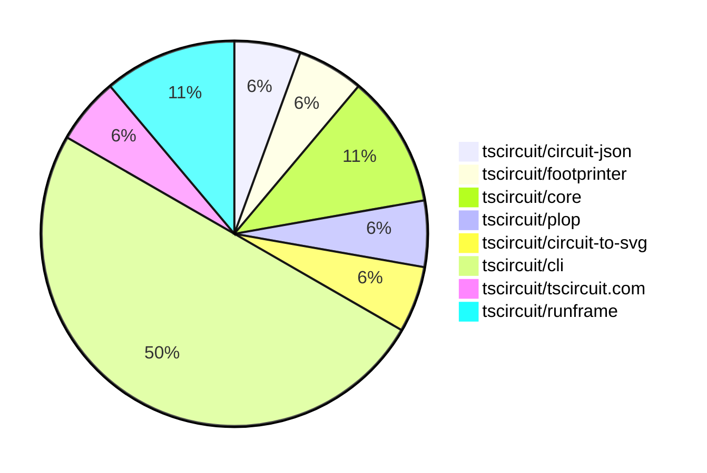

# contribution-tracker

Generates weekly contribution overviews for tscircuit contributors. Check out all
the [contribution overviews here](./contribution-overviews/)

* All PRs in the tscircuit org are scanned/summarized via Claude Haiku
* Claude classifies each Diff/PR as a Major, Minor or Tiny contribution
* All the PRs, summaries, and classifications are organized into charts and tables

The current week is shown below. There are 3 major sections:

* [Contributor Overview](#contributor-overview)
* [PRs by Repository](#prs-by-repository)
* [PRs by Contributor](#changes-by-contributor)

## Current Week

<!-- START_CURRENT_WEEK -->

# Contribution Overview 2025-02-12

## PRs by Repository

## Contributor Overview

| Contributor | 🐳 Major | 🐙 Minor | 🐌 Tiny | ⭐ | Issues Created |
|-------------|---------|---------|---------|-----|----------------|
| [seveibar](#seveibar) | 0 | 1 | 0 | ⭐⭐ | 15 |
| [imrishabh18](#imrishabh18) | 0 | 7 | 0 | ⭐⭐ | 3 |
| [ArnavK-09](#ArnavK-09) | 0 | 5 | 0 | ⭐ | 1 |
| [Anshgrover23](#Anshgrover23) | 0 | 2 | 0 | ⭐ | 1 |
| [techmannih](#techmannih) | 0 | 1 | 0 |  | 1 |
| [rohittcodes](#rohittcodes) | 0 | 1 | 0 |  | 0 |
| [kom-senapati](#kom-senapati) | 0 | 1 | 0 |  | 2 |

## Review Table

[reviews-received-hover]: ## "Number of reviews received for PRs for this contributor"
[approvals-received-hover]: ## "Number of approvals received for PRs this contributor authored"
[rejections-received-hover]: ## "Number of rejections received for PRs this contributor authored"
[prs-opened-hover]: ## "Number of PRs opened by this contributor"
[issues-created-hover]: ## "Number of issues created by this contributor"
[bountied-issues-hover]: ## "Number of issues this contributor created with a bounty"
[bountied-issue-$-hover]: ## "Total bounty amount placed on issues authored by this contributor"

| Contributor | Reviews Received | Approvals Received | Rejections Received | Approvals | Rejections | PRs Opened | PRs Merged | Issues Created | Bountied Issues | Bountied Issue $ |
|---|---|---|---|---|---|---|---|---|---|---|
| [techmannih](#techmannih) | 2 | 2 | 0 | 0 | 0 | 2 | 1 | 1 | 0 | 0 |
| [imrishabh18](#imrishabh18) | 5 | 3 | 0 | 5 | 3 | 11 | 7 | 3 | 0 | 0 |
| [Anshgrover23](#Anshgrover23) | 9 | 5 | 2 | 2 | 2 | 2 | 2 | 1 | 0 | 0 |
| [rohittcodes](#rohittcodes) | 4 | 1 | 0 | 0 | 0 | 1 | 1 | 0 | 0 | 0 |
| [seveibar](#seveibar) | 0 | 0 | 0 | 10 | 0 | 1 | 1 | 15 | 14 | 270 |
| [ShiboSoftwareDev](#ShiboSoftwareDev) | 0 | 0 | 0 | 1 | 1 | 0 | 0 | 8 | 4 | 37 |
| [ArnavK-09](#ArnavK-09) | 18 | 4 | 0 | 0 | 0 | 7 | 5 | 1 | 0 | 0 |
| [Ayushjhawar8](#Ayushjhawar8) | 4 | 0 | 2 | 0 | 0 | 2 | 0 | 1 | 0 | 0 |
| [Abse2001](#Abse2001) | 3 | 0 | 0 | 0 | 0 | 1 | 0 | 0 | 0 | 0 |
| [Saurabhsing21](#Saurabhsing21) | 1 | 0 | 1 | 0 | 0 | 1 | 0 | 0 | 0 | 0 |
| [kom-senapati](#kom-senapati) | 6 | 3 | 1 | 0 | 0 | 3 | 1 | 2 | 0 | 0 |

## Changes by Repository

### [tscircuit/circuit-json](https://github.com/tscircuit/circuit-json)

| PR # | Impact | Contributor | Description |
|------|--------|-------------|-------------|
| [#131](https://github.com/tscircuit/circuit-json/pull/131) | 🐙 Minor | techmannih |  |

### [tscircuit/footprinter](https://github.com/tscircuit/footprinter)

| PR # | Impact | Contributor | Description |
|------|--------|-------------|-------------|
| [#130](https://github.com/tscircuit/footprinter/pull/130) | 🐙 Minor | rohittcodes |  |

### [tscircuit/core](https://github.com/tscircuit/core)

| PR # | Impact | Contributor | Description |
|------|--------|-------------|-------------|
| [#626](https://github.com/tscircuit/core/pull/626) | 🐙 Minor | Anshgrover23 |  |
| [#625](https://github.com/tscircuit/core/pull/625) | 🐙 Minor | Anshgrover23 |  |

### [tscircuit/plop](https://github.com/tscircuit/plop)

| PR # | Impact | Contributor | Description |
|------|--------|-------------|-------------|
| [#9](https://github.com/tscircuit/plop/pull/9) | 🐙 Minor | ArnavK-09 |  |

### [tscircuit/circuit-to-svg](https://github.com/tscircuit/circuit-to-svg)

| PR # | Impact | Contributor | Description |
|------|--------|-------------|-------------|
| [#167](https://github.com/tscircuit/circuit-to-svg/pull/167) | 🐙 Minor | ArnavK-09 |  |

### [tscircuit/cli](https://github.com/tscircuit/cli)

| PR # | Impact | Contributor | Description |
|------|--------|-------------|-------------|
| [#64](https://github.com/tscircuit/cli/pull/64) | 🐙 Minor | ArnavK-09 |  |
| [#66](https://github.com/tscircuit/cli/pull/66) | 🐙 Minor | ArnavK-09 |  |
| [#63](https://github.com/tscircuit/cli/pull/63) | 🐙 Minor | ArnavK-09 |  |
| [#69](https://github.com/tscircuit/cli/pull/69) | 🐙 Minor | imrishabh18 |  |
| [#65](https://github.com/tscircuit/cli/pull/65) | 🐙 Minor | imrishabh18 |  |
| [#62](https://github.com/tscircuit/cli/pull/62) | 🐙 Minor | imrishabh18 |  |
| [#60](https://github.com/tscircuit/cli/pull/60) | 🐙 Minor | imrishabh18 |  |
| [#57](https://github.com/tscircuit/cli/pull/57) | 🐙 Minor | kom-senapati |  |
| [#70](https://github.com/tscircuit/cli/pull/70) | 🐙 Minor | seveibar |  |

### [tscircuit/tscircuit.com](https://github.com/tscircuit/tscircuit.com)

| PR # | Impact | Contributor | Description |
|------|--------|-------------|-------------|
| [#667](https://github.com/tscircuit/tscircuit.com/pull/667) | 🐙 Minor | imrishabh18 |  |

### [tscircuit/runframe](https://github.com/tscircuit/runframe)

| PR # | Impact | Contributor | Description |
|------|--------|-------------|-------------|
| [#235](https://github.com/tscircuit/runframe/pull/235) | 🐙 Minor | imrishabh18 |  |
| [#234](https://github.com/tscircuit/runframe/pull/234) | 🐙 Minor | imrishabh18 |  |

## Changes by Contributor

### [techmannih](https://github.com/techmannih)

| PR # | Impact | Description |
|------|--------|-------------|
| [#131](https://github.com/tscircuit/circuit-json/pull/131) | 🐙 Minor |  |

### [rohittcodes](https://github.com/rohittcodes)

| PR # | Impact | Description |
|------|--------|-------------|
| [#130](https://github.com/tscircuit/footprinter/pull/130) | 🐙 Minor |  |

### [Anshgrover23](https://github.com/Anshgrover23)

| PR # | Impact | Description |
|------|--------|-------------|
| [#626](https://github.com/tscircuit/core/pull/626) | 🐙 Minor |  |
| [#625](https://github.com/tscircuit/core/pull/625) | 🐙 Minor |  |

### [ArnavK-09](https://github.com/ArnavK-09)

| PR # | Impact | Description |
|------|--------|-------------|
| [#9](https://github.com/tscircuit/plop/pull/9) | 🐙 Minor |  |
| [#167](https://github.com/tscircuit/circuit-to-svg/pull/167) | 🐙 Minor |  |
| [#64](https://github.com/tscircuit/cli/pull/64) | 🐙 Minor |  |
| [#66](https://github.com/tscircuit/cli/pull/66) | 🐙 Minor |  |
| [#63](https://github.com/tscircuit/cli/pull/63) | 🐙 Minor |  |

### [imrishabh18](https://github.com/imrishabh18)

| PR # | Impact | Description |
|------|--------|-------------|
| [#667](https://github.com/tscircuit/tscircuit.com/pull/667) | 🐙 Minor |  |
| [#235](https://github.com/tscircuit/runframe/pull/235) | 🐙 Minor |  |
| [#234](https://github.com/tscircuit/runframe/pull/234) | 🐙 Minor |  |
| [#69](https://github.com/tscircuit/cli/pull/69) | 🐙 Minor |  |
| [#65](https://github.com/tscircuit/cli/pull/65) | 🐙 Minor |  |
| [#62](https://github.com/tscircuit/cli/pull/62) | 🐙 Minor |  |
| [#60](https://github.com/tscircuit/cli/pull/60) | 🐙 Minor |  |

### [kom-senapati](https://github.com/kom-senapati)

| PR # | Impact | Description |
|------|--------|-------------|
| [#57](https://github.com/tscircuit/cli/pull/57) | 🐙 Minor |  |

### [seveibar](https://github.com/seveibar)

| PR # | Impact | Description |
|------|--------|-------------|
| [#70](https://github.com/tscircuit/cli/pull/70) | 🐙 Minor |  |

<!-- END_CURRENT_WEEK -->
