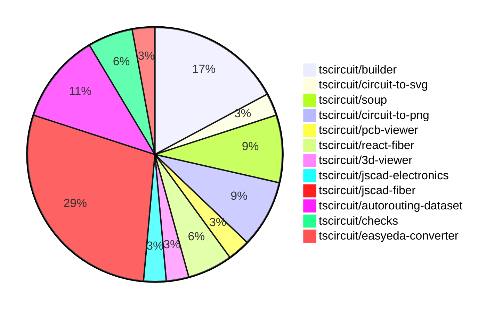

# contribution-tracker

Generates weekly contribution overviews for tscircuit contributors. Check out all
the [contribution overviews here](./contribution-overviews/)

* All PRs in the tscircuit org are scanned/summarized via Claude Haiku
* Claude classifies each Diff/PR as a Major, Minor or Tiny contribution
* All the PRs, summaries, and classifications are organized into charts and tables

The current week is shown below. There are 3 major sections:

* [Contributor Overview](#contributor-overview)
* [PRs by Repository](#prs-by-repository)
* [PRs by Contributor](#changes-by-contributor)

## Current Week

<!-- START_CURRENT_WEEK -->

# Contribution Overview 2024-07-27

## PRs by Repository

## Contributor Overview

| Contributor | 🐳 Major | 🐙 Minor | 🐌 Tiny |
|-------------|-------|-------|-------|
| imrishabh18 | 4 | 6 | 1 |
| seveibar | 11 | 2 | 0 |
| abhijitxy | 1 | 1 | 0 |
| andrii-balitskyi | 1 | 0 | 0 |
| Slaviiiii | 3 | 3 | 1 |
| r-bt | 1 | 0 | 0 |

## Changes by Repository

### [tscircuit/builder](https://github.com/tscircuit/builder)

| PR # | Impact | Contributor | Description |
|------|--------|-------------|-------------|
| [#94](https://github.com/tscircuit/builder/pull/94) | 🐳 Major | imrishabh18 | Introduce a new option `trace_width` in the `NetBuilder` interface to specify the width of the net trace. |
| [#89](https://github.com/tscircuit/builder/pull/89) | 🐳 Major | imrishabh18 | Added a feature to write schematic snapshots as PNG files. |
| [#88](https://github.com/tscircuit/builder/pull/88) | 🐳 Major | imrishabh18 | Add port IDs to the PCB trace routing |
| [#93](https://github.com/tscircuit/builder/pull/93) | 🐙 Minor | imrishabh18 | Fix the directory URL generated on the second time to be correct. |
| [#92](https://github.com/tscircuit/builder/pull/92) | 🐙 Minor | imrishabh18 | Adds a suffix to the snapshot file names for PCB and schematic tests. |
| [#90](https://github.com/tscircuit/builder/pull/90) | 🐙 Minor | imrishabh18 | Add a new function to write PCB snapshot PNG files for test fixtures. |

### [tscircuit/circuit-to-svg](https://github.com/tscircuit/circuit-to-svg)

| PR # | Impact | Contributor | Description |
|------|--------|-------------|-------------|
| [#11](https://github.com/tscircuit/circuit-to-svg/pull/11) | 🐳 Major | imrishabh18 | Adds a transformation matrix and updates the README file for the circuit-to-svg library. |

### [tscircuit/soup](https://github.com/tscircuit/soup)

| PR # | Impact | Contributor | Description |
|------|--------|-------------|-------------|
| [#16](https://github.com/tscircuit/soup/pull/16) | 🐳 Major | seveibar | Add a GitHub Actions workflow to automatically format the code in pull requests. |
| [#15](https://github.com/tscircuit/soup/pull/15) | 🐳 Major | abhijitxy | Introduce a new type called "simple_chip" into the `tscircuit/soup` library. |
| [#17](https://github.com/tscircuit/soup/pull/17) | 🐙 Minor | imrishabh18 | Add a new `trace_width` option to the `SourceNet` type. |

### [tscircuit/circuit-to-png](https://github.com/tscircuit/circuit-to-png)

| PR # | Impact | Contributor | Description |
|------|--------|-------------|-------------|
| [#11](https://github.com/tscircuit/circuit-to-png/pull/11) | 🐙 Minor | imrishabh18 | Add `@tscircuit/soup` as a peer dependency |
| [#10](https://github.com/tscircuit/circuit-to-png/pull/10) | 🐙 Minor | imrishabh18 | Add missing version in package.json |
| [#9](https://github.com/tscircuit/circuit-to-png/pull/9) | 🐌 Tiny | imrishabh18 | Updates the lock file to the latest version |

### [tscircuit/pcb-viewer](https://github.com/tscircuit/pcb-viewer)

| PR # | Impact | Contributor | Description |
|------|--------|-------------|-------------|
| [#31](https://github.com/tscircuit/pcb-viewer/pull/31) | 🐳 Major | seveibar | Introduce a rats nest toggle and allow setting the initial state of the PCBViewer component. |

### [tscircuit/react-fiber](https://github.com/tscircuit/react-fiber)

| PR # | Impact | Contributor | Description |
|------|--------|-------------|-------------|
| [#15](https://github.com/tscircuit/react-fiber/pull/15) | 🐳 Major | seveibar | Fix broken types/build, add `useChildrenSoup` |
| [#14](https://github.com/tscircuit/react-fiber/pull/14) | 🐙 Minor | abhijitxy | Change "chip" to "bug" in the usage and implementation of the `useChip` hook. |

### [tscircuit/3d-viewer](https://github.com/tscircuit/3d-viewer)

| PR # | Impact | Contributor | Description |
|------|--------|-------------|-------------|
| [#10](https://github.com/tscircuit/3d-viewer/pull/10) | 🐳 Major | seveibar | Add ability to render jscad plan from `cad_component` |

### [tscircuit/jscad-electronics](https://github.com/tscircuit/jscad-electronics)

| PR # | Impact | Contributor | Description |
|------|--------|-------------|-------------|
| [#12](https://github.com/tscircuit/jscad-electronics/pull/12) | 🐳 Major | seveibar | Adds a new component called `SmdChipLead` that represents a curved lead for an SMD chip, with customizable dimensions. |

### [tscircuit/jscad-fiber](https://github.com/tscircuit/jscad-fiber)

| PR # | Impact | Contributor | Description |
|------|--------|-------------|-------------|
| [#52](https://github.com/tscircuit/jscad-fiber/pull/52) | 🐳 Major | seveibar | Introduce a hook for rendering elements to jscad plan |
| [#44](https://github.com/tscircuit/jscad-fiber/pull/44) | 🐳 Major | Slaviiiii | Adds support for the `<Hull>` and `<HullChain>` components, which allow creating hull and hull chain geometries. |
| [#41](https://github.com/tscircuit/jscad-fiber/pull/41) | 🐳 Major | Slaviiiii | Add a new "Circle" component to the library. |
| [#43](https://github.com/tscircuit/jscad-fiber/pull/43) | 🐳 Major | Slaviiiii | Add a new rectangle shape component |
| [#40](https://github.com/tscircuit/jscad-fiber/pull/40) | 🐳 Major | r-bt | Allow component props to be updated |
| [#51](https://github.com/tscircuit/jscad-fiber/pull/51) | 🐙 Minor | seveibar | Adds an export for converting JSCAD to Three.js geometry. |
| [#54](https://github.com/tscircuit/jscad-fiber/pull/54) | 🐙 Minor | Slaviiiii | Add positioning to the rounded cuboid component |
| [#53](https://github.com/tscircuit/jscad-fiber/pull/53) | 🐙 Minor | Slaviiiii | Add color support to Sphere component |
| [#39](https://github.com/tscircuit/jscad-fiber/pull/39) | 🐙 Minor | Slaviiiii | Changes the props of the Rotate component to accept either 'rotation' or 'angles' as input. |
| [#42](https://github.com/tscircuit/jscad-fiber/pull/42) | 🐌 Tiny | Slaviiiii | Update the add-circle action in the GitHub Actions workflow |

### [tscircuit/autorouting-dataset](https://github.com/tscircuit/autorouting-dataset)

| PR # | Impact | Contributor | Description |
|------|--------|-------------|-------------|
| [#13](https://github.com/tscircuit/autorouting-dataset/pull/13) | 🐳 Major | seveibar | Adds documentation for the CLI usage, including instructions for starting a dev server, running benchmarks, and generating datasets and single problems. Also implements the `--solver-url` option to specify a custom solver server URL. |
| [#11](https://github.com/tscircuit/autorouting-dataset/pull/11) | 🐳 Major | seveibar | Add a "solve" endpoint to the dev server and add a test for it. |
| [#7](https://github.com/tscircuit/autorouting-dataset/pull/7) | 🐳 Major | seveibar | Add a simple Python-based autorouter algorithm, including a Flask-based server and instructions for running benchmarks without TypeScript. |
| [#6](https://github.com/tscircuit/autorouting-dataset/pull/6) | 🐳 Major | seveibar | Introduce a new feature to generate distant single trace dataset |

### [tscircuit/checks](https://github.com/tscircuit/checks)

| PR # | Impact | Contributor | Description |
|------|--------|-------------|-------------|
| [#12](https://github.com/tscircuit/checks/pull/12) | 🐳 Major | seveibar | Fix port association failure when trace width makes them overlap. |
| [#11](https://github.com/tscircuit/checks/pull/11) | 🐙 Minor | seveibar | This pull request makes the error messages more readable by using selectors instead of IDs. |

### [tscircuit/easyeda-converter](https://github.com/tscircuit/easyeda-converter)

| PR # | Impact | Contributor | Description |
|------|--------|-------------|-------------|
| [#37](https://github.com/tscircuit/easyeda-converter/pull/37) | 🐳 Major | andrii-balitskyi | Modify the `normalizeManufacturerPartNumber` function to replace invalid symbols with underscores and prepend "A_" if the part number starts with a number. |

## Changes by Contributor

### [imrishabh18](https://github.com/imrishabh18)

| PR # | Impact | Description |
|------|--------|-------------|
| [#94](https://github.com/tscircuit/builder/pull/94) | 🐳 Major | Introduce a new option `trace_width` in the `NetBuilder` interface to specify the width of the net trace. |
| [#89](https://github.com/tscircuit/builder/pull/89) | 🐳 Major | Added a feature to write schematic snapshots as PNG files. |
| [#88](https://github.com/tscircuit/builder/pull/88) | 🐳 Major | Add port IDs to the PCB trace routing |
| [#11](https://github.com/tscircuit/circuit-to-svg/pull/11) | 🐳 Major | Adds a transformation matrix and updates the README file for the circuit-to-svg library. |
| [#93](https://github.com/tscircuit/builder/pull/93) | 🐙 Minor | Fix the directory URL generated on the second time to be correct. |
| [#92](https://github.com/tscircuit/builder/pull/92) | 🐙 Minor | Adds a suffix to the snapshot file names for PCB and schematic tests. |
| [#90](https://github.com/tscircuit/builder/pull/90) | 🐙 Minor | Add a new function to write PCB snapshot PNG files for test fixtures. |
| [#17](https://github.com/tscircuit/soup/pull/17) | 🐙 Minor | Add a new `trace_width` option to the `SourceNet` type. |
| [#11](https://github.com/tscircuit/circuit-to-png/pull/11) | 🐙 Minor | Add `@tscircuit/soup` as a peer dependency |
| [#10](https://github.com/tscircuit/circuit-to-png/pull/10) | 🐙 Minor | Add missing version in package.json |
| [#9](https://github.com/tscircuit/circuit-to-png/pull/9) | 🐌 Tiny | Updates the lock file to the latest version |

### [seveibar](https://github.com/seveibar)

| PR # | Impact | Description |
|------|--------|-------------|
| [#31](https://github.com/tscircuit/pcb-viewer/pull/31) | 🐳 Major | Introduce a rats nest toggle and allow setting the initial state of the PCBViewer component. |
| [#15](https://github.com/tscircuit/react-fiber/pull/15) | 🐳 Major | Fix broken types/build, add `useChildrenSoup` |
| [#16](https://github.com/tscircuit/soup/pull/16) | 🐳 Major | Add a GitHub Actions workflow to automatically format the code in pull requests. |
| [#10](https://github.com/tscircuit/3d-viewer/pull/10) | 🐳 Major | Add ability to render jscad plan from `cad_component` |
| [#12](https://github.com/tscircuit/jscad-electronics/pull/12) | 🐳 Major | Adds a new component called `SmdChipLead` that represents a curved lead for an SMD chip, with customizable dimensions. |
| [#52](https://github.com/tscircuit/jscad-fiber/pull/52) | 🐳 Major | Introduce a hook for rendering elements to jscad plan |
| [#13](https://github.com/tscircuit/autorouting-dataset/pull/13) | 🐳 Major | Adds documentation for the CLI usage, including instructions for starting a dev server, running benchmarks, and generating datasets and single problems. Also implements the `--solver-url` option to specify a custom solver server URL. |
| [#11](https://github.com/tscircuit/autorouting-dataset/pull/11) | 🐳 Major | Add a "solve" endpoint to the dev server and add a test for it. |
| [#7](https://github.com/tscircuit/autorouting-dataset/pull/7) | 🐳 Major | Add a simple Python-based autorouter algorithm, including a Flask-based server and instructions for running benchmarks without TypeScript. |
| [#6](https://github.com/tscircuit/autorouting-dataset/pull/6) | 🐳 Major | Introduce a new feature to generate distant single trace dataset |
| [#12](https://github.com/tscircuit/checks/pull/12) | 🐳 Major | Fix port association failure when trace width makes them overlap. |
| [#51](https://github.com/tscircuit/jscad-fiber/pull/51) | 🐙 Minor | Adds an export for converting JSCAD to Three.js geometry. |
| [#11](https://github.com/tscircuit/checks/pull/11) | 🐙 Minor | This pull request makes the error messages more readable by using selectors instead of IDs. |

### [abhijitxy](https://github.com/abhijitxy)

| PR # | Impact | Description |
|------|--------|-------------|
| [#15](https://github.com/tscircuit/soup/pull/15) | 🐳 Major | Introduce a new type called "simple_chip" into the `tscircuit/soup` library. |
| [#14](https://github.com/tscircuit/react-fiber/pull/14) | 🐙 Minor | Change "chip" to "bug" in the usage and implementation of the `useChip` hook. |

### [andrii-balitskyi](https://github.com/andrii-balitskyi)

| PR # | Impact | Description |
|------|--------|-------------|
| [#37](https://github.com/tscircuit/easyeda-converter/pull/37) | 🐳 Major | Modify the `normalizeManufacturerPartNumber` function to replace invalid symbols with underscores and prepend "A_" if the part number starts with a number. |

### [Slaviiiii](https://github.com/Slaviiiii)

| PR # | Impact | Description |
|------|--------|-------------|
| [#44](https://github.com/tscircuit/jscad-fiber/pull/44) | 🐳 Major | Adds support for the `<Hull>` and `<HullChain>` components, which allow creating hull and hull chain geometries. |
| [#41](https://github.com/tscircuit/jscad-fiber/pull/41) | 🐳 Major | Add a new "Circle" component to the library. |
| [#43](https://github.com/tscircuit/jscad-fiber/pull/43) | 🐳 Major | Add a new rectangle shape component |
| [#54](https://github.com/tscircuit/jscad-fiber/pull/54) | 🐙 Minor | Add positioning to the rounded cuboid component |
| [#53](https://github.com/tscircuit/jscad-fiber/pull/53) | 🐙 Minor | Add color support to Sphere component |
| [#39](https://github.com/tscircuit/jscad-fiber/pull/39) | 🐙 Minor | Changes the props of the Rotate component to accept either 'rotation' or 'angles' as input. |
| [#42](https://github.com/tscircuit/jscad-fiber/pull/42) | 🐌 Tiny | Update the add-circle action in the GitHub Actions workflow |

### [r-bt](https://github.com/r-bt)

| PR # | Impact | Description |
|------|--------|-------------|
| [#40](https://github.com/tscircuit/jscad-fiber/pull/40) | 🐳 Major | Allow component props to be updated |

<!-- END_CURRENT_WEEK -->
