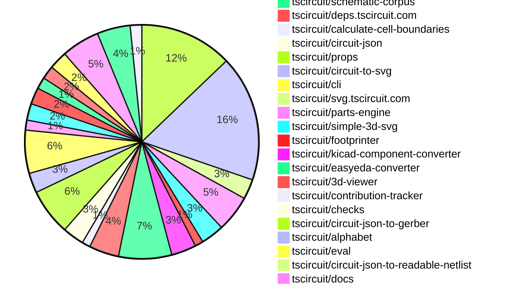
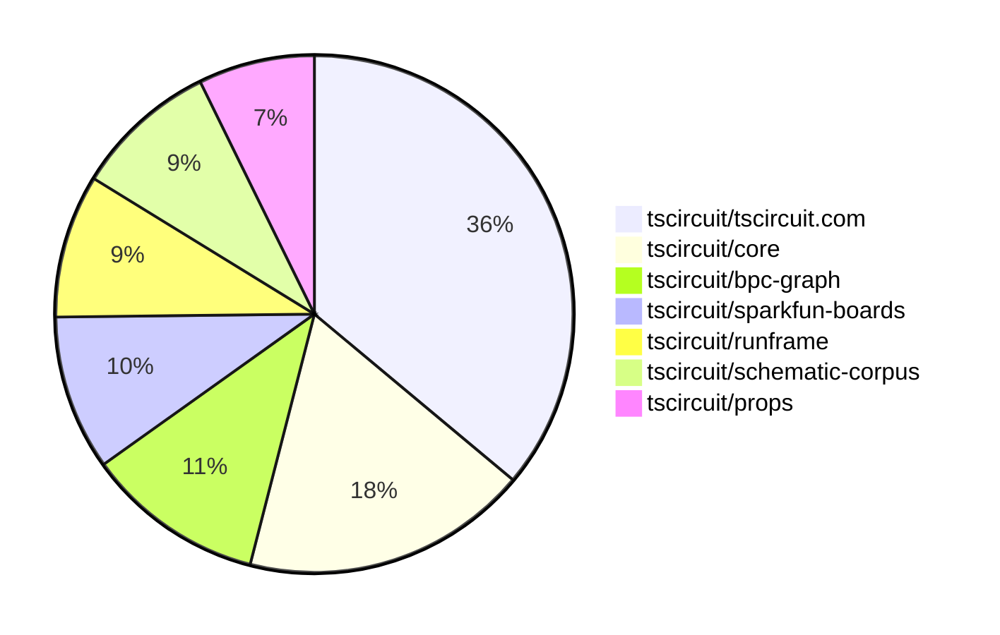

# contribution-tracker

[contributions.tscircuit.com](https://contributions.tscircuit.com) ・ [tscircuit.com](https://tscircuit.com) ・ [Contribution Overviews](./contribution-overviews/) ・ [Changelogs](./changelogs/)

Generates weekly contribution overviews for tscircuit contributors. Check out all
the [contribution overviews here](./contribution-overviews/)
You can find AI-generated monthly changelogs in the [changelogs directory](./changelogs/).

- All PRs in the tscircuit org are scanned/summarized via an LLM
- The LLM classifies each Diff/PR as into a set of attributes for scoring
- All the PRs, summaries, and classifications are organized into charts and tables for [the website](https://contributions.tscircuit.com)

## Getting Started

### Prerequisites

- [Bun](https://bun.sh/) runtime
- `.env` file with required API keys:
  ```
  GITHUB_TOKEN=your_github_token
  OPENAI_API_KEY=your_openai_api_key
  DISCORD_TOKEN=your_discord_token (optional, for Discord integration)
  SLACK_BOT_TOKEN=your_slack_token (optional, for Slack integration)
  ```

### Available Scripts

#### Core Generation Scripts

- `bun run generate:weekly` - Generate current week's contribution overview
- `bun run generate:monthly` - Generate current month's contribution overview
- `bun run generate:changelog` - Generate monthly changelog from PRs

#### Analysis & Testing

- `bun run analyze-pr` - Analyze a single PR (interactive prompt)
- `bun run test:github` - Test GitHub API integration

#### Notifications & Sync

- `bun run notifications:issues` - Send notifications for new issues
- `bun run notifications:pr` - Send notifications for new PRs
- `bun run sync:discord` - Sync contributor roles with Discord

#### Data Export

- `bun run export:sponsorship` - Generate sponsorship data CSV

#### Development

- `bun run dev` - Start development server for web UI
- `bun run build` - Build for production
- `bun run format` - Format code with Biome

### Usage Examples

```bash
# Generate this week's contribution overview
bun run generate:weekly

# Generate current month's overview
bun run generate:monthly

# Analyze a specific PR
bun run analyze-pr

# Test your GitHub token setup
bun run test:github
```

The current week is shown below. There are 3 major sections:

- [Contributor Overview](#contributor-overview)
- [PRs by Repository](#prs-by-repository)
- [PRs by Contributor](#changes-by-contributor)

## Current Week

<!-- START_CURRENT_WEEK -->

# Contribution Overview 2025-06-11

## PRs by Repository



## Contributor Overview

| Contributor | 🐳 Major | 🐙 Minor | 🐌 Tiny | ⭐ | Issues Created | Discussion Contributions |
|-------------|---------|---------|---------|-----|----------------|--------------------------|
| [ArnavK-09](#ArnavK-09) | 19 | 14 | 17 | 👑👑 | 16 | 0🔹 0🔶 0💎 |
| [seveibar](#seveibar) | 32 | 23 | 131 | 👑👑 | 11 | 0🔹 0🔶 0💎 |
| [imrishabh18](#imrishabh18) | 4 | 13 | 51 | 👑 | 10 | 0🔹 0🔶 0💎 |
| [ShiboSoftwareDev](#ShiboSoftwareDev) | 4 | 5 | 25 | ⭐⭐⭐ | 21 | 0🔹 0🔶 0💎 |
| [Anshgrover23](#Anshgrover23) | 4 | 2 | 25 | ⭐⭐⭐ | 21 | 0🔹 0🔶 0💎 |
| [techmannih](#techmannih) | 2 | 6 | 33 | ⭐⭐⭐ | 5 | 0🔹 0🔶 0💎 |
| [Abse2001](#Abse2001) | 1 | 2 | 30 | ⭐⭐ | 6 | 0🔹 0🔶 0💎 |
| [andrii-balitskyi](#andrii-balitskyi) | 2 | 1 | 5 | ⭐⭐ | 0 | 0🔹 0🔶 0💎 |
| [MustafaMulla29](#MustafaMulla29) | 1 | 1 | 8 | ⭐⭐ | 11 | 0🔹 0🔶 0💎 |
| [tscircuitbot](#tscircuitbot) | 0 | 0 | 5 | ⭐ | 0 | 0🔹 0🔶 0💎 |
| [ricohageman](#ricohageman) | 1 | 0 | 0 | ⭐ | 0 | 0🔹 0🔶 0💎 |
| [dope39](#dope39) | 0 | 0 | 1 |  | 0 | 0🔹 0🔶 0💎 |
| [shimaore](#shimaore) | 0 | 0 | 1 |  | 0 | 0🔹 0🔶 0💎 |

### Discussion Contribution Legend

- 🔹 Normal Comments: Basic participation with minimal effort
- 🔶 Great Informative Comments: Thoughtful participation that adds value
- 💎 Incredible Comments: Exceptional participation with high-quality content

## Review Table

[reviews-received-hover]: ## "Number of reviews received for PRs for this contributor"
[approvals-received-hover]: ## "Number of approvals received for PRs this contributor authored"
[rejections-received-hover]: ## "Number of rejections received for PRs this contributor authored"
[prs-opened-hover]: ## "Number of PRs opened by this contributor"
[issues-created-hover]: ## "Number of issues created by this contributor"
[bountied-issues-hover]: ## "Number of issues this contributor created with a bounty"
[bountied-issue-$-hover]: ## "Total bounty amount placed on issues authored by this contributor"

| Contributor | Reviews Received | Approvals Received | Rejections Received | Approvals | Rejections | PRs Opened | PRs Merged | Issues Created | Bountied Issues | Bountied Issue $ |
|---|---|---|---|---|---|---|---|---|---|---|
| [seveibar](#seveibar) | 54 | 4 | 1 | 194 | 20 | 277 | 212 | 11 | 6 | 111 |
| [Abse2001](#Abse2001) | 34 | 27 | 1 | 13 | 0 | 43 | 37 | 6 | 1 | 30 |
| [imrishabh18](#imrishabh18) | 56 | 33 | 2 | 26 | 4 | 89 | 78 | 10 | 4 | 25 |
| [ArnavK-09](#ArnavK-09) | 81 | 59 | 3 | 8 | 0 | 59 | 57 | 16 | 1 | 10 |
| [techmannih](#techmannih) | 106 | 51 | 14 | 4 | 11 | 62 | 41 | 5 | 0 | 0 |
| [ShiboSoftwareDev](#ShiboSoftwareDev) | 65 | 42 | 6 | 25 | 4 | 66 | 42 | 21 | 1 | 5 |
| [graphite-app[bot]](#graphite-app[bot]) | 0 | 0 | 0 | 0 | 0 | 0 | 0 | 0 | 0 | 0 |
| [Anshgrover23](#Anshgrover23) | 54 | 39 | 6 | 7 | 7 | 38 | 31 | 21 | 0 | 0 |
| [MustafaMulla29](#MustafaMulla29) | 26 | 12 | 7 | 1 | 0 | 17 | 10 | 11 | 0 | 0 |
| [andrii-balitskyi](#andrii-balitskyi) | 14 | 7 | 2 | 0 | 0 | 9 | 8 | 0 | 0 | 0 |
| [cursor[bot]](#cursor[bot]) | 0 | 0 | 0 | 0 | 0 | 0 | 0 | 0 | 0 | 0 |
| [abhiiii482](#abhiiii482) | 6 | 0 | 4 | 0 | 0 | 4 | 0 | 0 | 0 | 0 |
| [dope39](#dope39) | 2 | 2 | 0 | 0 | 0 | 1 | 1 | 0 | 0 | 0 |
| [shimaore](#shimaore) | 1 | 1 | 0 | 0 | 0 | 1 | 1 | 0 | 0 | 0 |
| [tscircuitbot](#tscircuitbot) | 0 | 0 | 0 | 0 | 0 | 143 | 7 | 0 | 0 | 0 |
| [ricohageman](#ricohageman) | 1 | 1 | 0 | 0 | 0 | 1 | 1 | 0 | 0 | 0 |

## Top 7 Repositories by Contribution Points



## Changes by Repository

### [tscircuit/schematic-viewer](https://github.com/tscircuit/schematic-viewer)

| PR # | Impact | Contributor | Description |
|------|--------|-------------|-------------|
| [#97](https://github.com/tscircuit/schematic-viewer/pull/97) | 🐳 Major | seveibar | Adds a grid icon and z-index entry, allowing component dragging to snap to a 0.1 grid when enabled, and exposes snap toggle in SchematicViewer. |

<details>
<summary>🐌 Tiny Contributions (1)</summary>

| PR # | Impact | Contributor | Description |
|------|--------|-------------|-------------|
| [#98](https://github.com/tscircuit/schematic-viewer/pull/98) | 🐌 Tiny | Abse2001 | Updates the circuit-to-svg dependency from version 0.0.120 to 0.0.155 in package.json. |

</details>

### [tscircuit/circuit-json-util](https://github.com/tscircuit/circuit-json-util)

| PR # | Impact | Contributor | Description |
|------|--------|-------------|-------------|
| [#36](https://github.com/tscircuit/circuit-json-util/pull/36) | 🐳 Major | seveibar | Fixes numeric conversions when transforming PCB elements and normalizes numeric dimensions when computing PCB element bounds. |

### [tscircuit/core](https://github.com/tscircuit/core)

| PR # | Impact | Contributor | Description |
|------|--------|-------------|-------------|
| [#1016](https://github.com/tscircuit/core/pull/1016) | 🐳 Major | seveibar | Rewrite match adapt to use BPC graphs, route traces in matchAdapt mode, and work in progress on layout. |
| [#1002](https://github.com/tscircuit/core/pull/1002) | 🐳 Major | imrishabh18 | Fixes the issue where multiple traces could exist between the same pins in a subcircuit, ensuring proper autorouting behavior. |
| [#1000](https://github.com/tscircuit/core/pull/1000) | 🐳 Major | ShiboSoftwareDev | Adds functionality to generate obstacles for cutout components in PCB designs, including rectangles, circles, and polygons. |
| [#1004](https://github.com/tscircuit/core/pull/1004) | 🐙 Minor | seveibar | Fixes the netlabel center offset calculation based on the anchor position and side, ensuring accurate placement of netlabels in schematics. |
| [#1003](https://github.com/tscircuit/core/pull/1003) | 🐙 Minor | seveibar | Fixes incorrect net IDs on schematic net labels, ensuring proper association with the corresponding nets. |
| [#976](https://github.com/tscircuit/core/pull/976) | 🐙 Minor | seveibar | Fixes net label positioning based on connected ports to ensure accurate schematic representation. |
| [#948](https://github.com/tscircuit/core/pull/948) | 🐙 Minor | seveibar | Removes the deprecated NetAlias component and replaces it with a new NetLabel component, updating related tests and intrinsic JSX typings accordingly. |
| [#962](https://github.com/tscircuit/core/pull/962) | 🐙 Minor | imrishabh18 | Expands simple route JSON bounds by padded PCB group size and adds a test to check padding application during simple route JSON computation. |
| [#938](https://github.com/tscircuit/core/pull/938) | 🐙 Minor | imrishabh18 | Fixes net label lookup in subcircuits to ensure descendant nets are correctly identified and utilized. |
| [#1014](https://github.com/tscircuit/core/pull/1014) | 🐙 Minor | techmannih | Adds a new test for the <testpoint /> component with netlabels and updates the schematic symbol version in the package.json. |
| [#1008](https://github.com/tscircuit/core/pull/1008) | 🐙 Minor | ShiboSoftwareDev | Fixes incorrect calculation of the board center based on the outline dimensions and offsets. |
| [#954](https://github.com/tscircuit/core/pull/954) | 🐙 Minor | Anshgrover23 | Fixes the issue where the schWidth property was not being displayed in the SchematicText component, ensuring proper rendering of schematic elements. |

<details>
<summary>🐌 Tiny Contributions (44)</summary>

| PR # | Impact | Contributor | Description |
|------|--------|-------------|-------------|
| [#1015](https://github.com/tscircuit/core/pull/1015) | 🐌 Tiny | seveibar | Adds support for schOrientation mapping to schematic symbol rotation and introduces tests for polarized capacitor orientations. |
| [#1005](https://github.com/tscircuit/core/pull/1005) | 🐌 Tiny | seveibar | Removes the TODO placeholder from the PrimitiveComponent name getter and ensures NormalComponent footprint generation uses a fallback name. |
| [#977](https://github.com/tscircuit/core/pull/977) | 🐌 Tiny | seveibar | Forbids '+' or '-' characters in net names and validates 'Net' properties against these characters. |
| [#959](https://github.com/tscircuit/core/pull/959) | 🐌 Tiny | seveibar | Allows `sel` to be invoked as a function and supports generic pins for any reference designator, along with testing dynamic reference designator usage. |
| [#973](https://github.com/tscircuit/core/pull/973) | 🐌 Tiny | seveibar | Adds support for the `pcbDisabled` option in the RootCircuit constructor, allowing for conditional behavior based on platform configuration. |
| [#972](https://github.com/tscircuit/core/pull/972) | 🐌 Tiny | seveibar | Avoids overriding user-provided schematic width when passed in, ensuring that the specified width is respected during schematic generation. |
| [#961](https://github.com/tscircuit/core/pull/961) | 🐌 Tiny | seveibar | Provides clearer error messages when a port selector can't resolve a pin and adds tests covering all error scenarios when port lookup fails. |
| [#960](https://github.com/tscircuit/core/pull/960) | 🐌 Tiny | seveibar | Adds support for `JP` jumpers and constant `USBC` in selector types within the tscircuit/core library. |
| [#957](https://github.com/tscircuit/core/pull/957) | 🐌 Tiny | seveibar | Allows netlabel.connectsTo to accept an array of selectors, enabling multiple connections to be defined for a netlabel. |
| [#955](https://github.com/tscircuit/core/pull/955) | 🐌 Tiny | seveibar | Disables the lockfile feature in the bunfig.toml configuration, allowing for more flexible dependency management. |
| [#951](https://github.com/tscircuit/core/pull/951) | 🐌 Tiny | seveibar | Allows net creation from netlabels and creates traces if a NetLabel has `connectsTo` defined, fixing the handling of netlabel connections in the schematic. |
| [#950](https://github.com/tscircuit/core/pull/950) | 🐌 Tiny | seveibar | Links netlabels to traces using the `connection` prop and updates the `netlabel-connection` schematic snapshot. |
| [#946](https://github.com/tscircuit/core/pull/946) | 🐌 Tiny | seveibar | Adds a test for netalias connections and updates the circuit-json dependency. |
| [#996](https://github.com/tscircuit/core/pull/996) | 🐌 Tiny | Abse2001 | Adds support for Test Point selectors in the selector module, allowing access to pin1 of Test Points like sel.TP1.pin1. |
| [#956](https://github.com/tscircuit/core/pull/956) | 🐌 Tiny | Abse2001 | Adds support for J references in the selector, allowing for the use of sel.J1, sel.J2, etc., in component connections. |
| [#940](https://github.com/tscircuit/core/pull/940) | 🐌 Tiny | Abse2001 | Removes unnecessary conditional checks for titleInside and titleAlignment in SchematicBox component. |
| [#1013](https://github.com/tscircuit/core/pull/1013) | 🐌 Tiny | imrishabh18 | Locks the css-select package version to `5.1.0` to prevent breaking changes in types from newer versions. |
| [#998](https://github.com/tscircuit/core/pull/998) | 🐌 Tiny | imrishabh18 | Adds functionality to print board information (project name, version, URL) to the silkscreen layer of the PCB if specified in the platform configuration. |
| [#997](https://github.com/tscircuit/core/pull/997) | 🐌 Tiny | imrishabh18 | Reproduces a bug where multiple traces are created between the same pins within a subcircuit, aiding in debugging the issue. |
| [#992](https://github.com/tscircuit/core/pull/992) | 🐌 Tiny | imrishabh18 | Handles the props.symbolName for SolderJumper, allowing for dynamic schematic symbol naming based on provided props. |
| [#989](https://github.com/tscircuit/core/pull/989) | 🐌 Tiny | imrishabh18 | Adds support for a new `bridged` prop in the `SolderJumper` component, allowing for the connection of all pins when the prop is set to true, and updates test coverage for this new behavior. |
| [#985](https://github.com/tscircuit/core/pull/985) | 🐌 Tiny | imrishabh18 | Updates the circuit-to-svg dependency from version 0.0.154 to 0.0.160 in package.json. |
| [#983](https://github.com/tscircuit/core/pull/983) | 🐌 Tiny | imrishabh18 | Sets the default pin count for solderjumper to two when both pinCount and footprint are omitted, ensuring consistent behavior in component rendering. |
| [#969](https://github.com/tscircuit/core/pull/969) | 🐌 Tiny | imrishabh18 | Fixes the polarized capacitor symbol in the schematic representation by updating the relevant type and adding tests for polarized capacitors. |
| [#949](https://github.com/tscircuit/core/pull/949) | 🐌 Tiny | imrishabh18 | Adds a render phase to assign names to unnamed components, ensuring they have default names before rendering and providing placeholder names for JSX elements that lack one. |
| [#965](https://github.com/tscircuit/core/pull/965) | 🐌 Tiny | imrishabh18 | Fixes the issue where the subcircuit_id is incorrectly set for groups that are not subcircuits, ensuring that it remains undefined when not applicable. |
| [#964](https://github.com/tscircuit/core/pull/964) | 🐌 Tiny | imrishabh18 | Adds a new render phase `SourceGroupRender` for initializing subcircuits in the `Group` component and updates the render lifecycle event tests accordingly. |
| [#947](https://github.com/tscircuit/core/pull/947) | 🐌 Tiny | imrishabh18 | Adds support for padding in the Group PCB layout and updates the @tscircuit/props package to utilize new padding properties. |
| [#933](https://github.com/tscircuit/core/pull/933) | 🐌 Tiny | imrishabh18 | Preserves the given width/height when auto-sizing boards, ensuring that the specified dimensions are maintained during calculations. |
| [#936](https://github.com/tscircuit/core/pull/936) | 🐌 Tiny | imrishabh18 | Reproduces a bug where a subcircuit with a net label GND causes circuit failures when using GND in other parts of the circuit. |
| [#894](https://github.com/tscircuit/core/pull/894) | 🐌 Tiny | techmannih | Adds support for polygon-shaped SMT pads in the SmtPad component, allowing for more versatile PCB designs. |
| [#967](https://github.com/tscircuit/core/pull/967) | 🐌 Tiny | techmannih | Adds support for the fuse component selector in the selection utility, allowing for new pin types to be utilized in the circuit design. |
| [#971](https://github.com/tscircuit/core/pull/971) | 🐌 Tiny | techmannih | Adds the display of load capacitance value alongside frequency in the crystal component. |
| [#975](https://github.com/tscircuit/core/pull/975) | 🐌 Tiny | techmannih | Adds typing for additional pins (pin3 to pin6) in the switch selector type definition, enhancing type safety and usability. |
| [#999](https://github.com/tscircuit/core/pull/999) | 🐌 Tiny | ShiboSoftwareDev | Updates the footprinter dependency version from 0.0.182 to 0.0.186 and corrects floating-point precision in test cases for PCB components. |
| [#963](https://github.com/tscircuit/core/pull/963) | 🐌 Tiny | ShiboSoftwareDev | Adds support for pin labels in the SolderJumper component, allowing for more descriptive pin naming in schematics. |
| [#995](https://github.com/tscircuit/core/pull/995) | 🐌 Tiny | Anshgrover23 | Adds a test for the <Led/> component to verify connections to power and ground nets. |
| [#984](https://github.com/tscircuit/core/pull/984) | 🐌 Tiny | Anshgrover23 | Adds 'N_CS' as a new pin and net name to the CommonPinNames and CommonNetNames types in the codebase. |
| [#980](https://github.com/tscircuit/core/pull/980) | 🐌 Tiny | Anshgrover23 | Adds 'INT' to CommonNetNames and CommonPinNames types in the codebase, allowing for the use of 'INT' in circuit definitions. |
| [#953](https://github.com/tscircuit/core/pull/953) | 🐌 Tiny | Anshgrover23 | Updates the @tscircuit/props dependency version from 0.0.234 to 0.0.236 in package.json |
| [#919](https://github.com/tscircuit/core/pull/919) | 🐌 Tiny | andrii-balitskyi | Adds support for SMTPAD footprint in the TestPoint component, allowing for circular and rectangular pad shapes with appropriate dimensions and footprint strings for integration with footprinter. |
| [#1009](https://github.com/tscircuit/core/pull/1009) | 🐌 Tiny | MustafaMulla29 | Adds a test case that reproduces the jumper netlabel connection functionality in the circuit rendering. |
| [#982](https://github.com/tscircuit/core/pull/982) | 🐌 Tiny | MustafaMulla29 | Adds 'N_INT' to the CommonNetNames and CommonPinNames types, allowing for its use in the circuit definitions. |
| [#978](https://github.com/tscircuit/core/pull/978) | 🐌 Tiny | MustafaMulla29 | Adds 'gate', 'source', and 'drain' pin types to the TransistorPinNames type, enabling access to these pins for MOSFET components. |

</details>

### [tscircuit/tscircuit.com](https://github.com/tscircuit/tscircuit.com)

| PR # | Impact | Contributor | Description |
|------|--------|-------------|-------------|
| [#1325](https://github.com/tscircuit/tscircuit.com/pull/1325) | 🐳 Major | seveibar | Caches default TypeScript libraries using IndexedDB and loads them when the CodeEditor mounts, enhancing performance and reducing load times. |
| [#1388](https://github.com/tscircuit/tscircuit.com/pull/1388) | 🐳 Major | ArnavK-09 | Adds a global find and replace feature to the code editor, allowing users to search and replace text across multiple files using a dedicated interface. |
| [#1382](https://github.com/tscircuit/tscircuit.com/pull/1382) | 🐳 Major | ArnavK-09 | Adds a native share option for users to share package details via the device's share functionality. |
| [#1384](https://github.com/tscircuit/tscircuit.com/pull/1384) | 🐳 Major | ArnavK-09 | This PR updates the RunFrame component and limits the optimal size of the editor and RunFrame to enhance layout consistency and usability. |
| [#1378](https://github.com/tscircuit/tscircuit.com/pull/1378) | 🐳 Major | ArnavK-09 | Revamps the Cmd+K menu to enhance user experience with improved search functionality and UI components. |
| [#1372](https://github.com/tscircuit/tscircuit.com/pull/1372) | 🐳 Major | ArnavK-09 | Adds a toggle button for enabling/disabling a mock AI autocomplete feature in the CodeEditorHeader component. |
| [#1335](https://github.com/tscircuit/tscircuit.com/pull/1335) | 🐳 Major | ArnavK-09 | Adds a font size control feature to the code editor, allowing users to adjust the font size using the Ctrl key and scroll wheel, mimicking VSCode-like zoom behavior. |
| [#1357](https://github.com/tscircuit/tscircuit.com/pull/1357) | 🐳 Major | ArnavK-09 | Implements client-side caching for file content in the ImportantFilesView component, improving load times and reducing server requests. |
| [#1353](https://github.com/tscircuit/tscircuit.com/pull/1353) | 🐳 Major | ArnavK-09 | Adds a new utility hook for handling keyboard shortcuts, replacing existing keydown event listeners in multiple components. |
| [#1336](https://github.com/tscircuit/tscircuit.com/pull/1336) | 🐳 Major | ArnavK-09 | Adds Tab key support for autocompletion in the code editor, allowing users to accept suggestions or indent lines. |
| [#1337](https://github.com/tscircuit/tscircuit.com/pull/1337) | 🐳 Major | ArnavK-09 | Adds a VSCode-style file switcher to the editor, allowing users to quickly open files using the Ctrl+P shortcut. |
| [#1332](https://github.com/tscircuit/tscircuit.com/pull/1332) | 🐳 Major | ArnavK-09 | Adds a button to re-request AI review on the Important Files View page. |
| [#1330](https://github.com/tscircuit/tscircuit.com/pull/1330) | 🐳 Major | ArnavK-09 | Adds a releases section specifically for small screens on the repository page, improving accessibility for mobile users. |
| [#1313](https://github.com/tscircuit/tscircuit.com/pull/1313) | 🐳 Major | ArnavK-09 | Adds functionality to download a PNG image of the circuit based on the selected type (PCB, schematic, assembly, or 3D) from the DownloadButtonAndMenu component. |
| [#1303](https://github.com/tscircuit/tscircuit.com/pull/1303) | 🐳 Major | ArnavK-09 | Adds SEO meta tags for various pages to improve search engine visibility and user experience. |
| [#1289](https://github.com/tscircuit/tscircuit.com/pull/1289) | 🐳 Major | ArnavK-09 | Adds user profile meta tags for improved SEO and user experience on user profile pages. |
| [#1295](https://github.com/tscircuit/tscircuit.com/pull/1295) | 🐳 Major | ArnavK-09 | Refactors the handling of important files in the package view to include support for 'readme' files and improves the sorting of important files based on their importance score. |
| [#1286](https://github.com/tscircuit/tscircuit.com/pull/1286) | 🐳 Major | imrishabh18 | Adds support for dynamically prefetching pages based on a whitelist of prefetchable pages, improving the efficiency of page loading for specific routes. |
| [#1315](https://github.com/tscircuit/tscircuit.com/pull/1315) | 🐳 Major | andrii-balitskyi | Reloads the page when lazy-loaded chunks fail and catches various dynamic import error messages. |
| [#1320](https://github.com/tscircuit/tscircuit.com/pull/1320) | 🐳 Major | andrii-balitskyi | Injects a build ID meta tag during Vite build, watches for build changes in the browser, and reloads when needed. |
| [#1358](https://github.com/tscircuit/tscircuit.com/pull/1358) | 🐙 Minor | ArnavK-09 | Fixes layout issues in markdown content by adjusting CSS styles for better responsiveness and presentation. |
| [#1355](https://github.com/tscircuit/tscircuit.com/pull/1355) | 🐙 Minor | ArnavK-09 | Fixes responsive design issues in the dialog component to ensure it adapts correctly to various screen sizes and aligns with the current theme. |
| [#1354](https://github.com/tscircuit/tscircuit.com/pull/1354) | 🐙 Minor | ArnavK-09 | Filters out hidden files from the file selection in the Ctrl+P menu, improving user experience by reducing clutter. |
| [#1334](https://github.com/tscircuit/tscircuit.com/pull/1334) | 🐙 Minor | ArnavK-09 | Adds a new user interface for requesting AI reviews and loading states, enhancing user interaction with the AI review feature. |
| [#1310](https://github.com/tscircuit/tscircuit.com/pull/1310) | 🐙 Minor | ArnavK-09 | Fixes the issue where the editor does not reload properly after saving changes, ensuring that users see the latest updates immediately. |
| [#1311](https://github.com/tscircuit/tscircuit.com/pull/1311) | 🐙 Minor | ArnavK-09 | Fixes the issue where whitespace in the unscoped package name input was not being trimmed, ensuring cleaner input handling in the edit package details dialog. |
| [#1301](https://github.com/tscircuit/tscircuit.com/pull/1301) | 🐙 Minor | ArnavK-09 | Fixes the issue of unusable searching functionality on mobile devices by improving the layout and accessibility of the search component in the header. |
| [#1300](https://github.com/tscircuit/tscircuit.com/pull/1300) | 🐙 Minor | ArnavK-09 | Fixes a bug where accessing the github_username could lead to runtime errors if the account object is not properly defined. |
| [#1268](https://github.com/tscircuit/tscircuit.com/pull/1268) | 🐙 Minor | ArnavK-09 | Fixes the UI issue where important file tabs overlap, ensuring proper display and usability. |
| [#1276](https://github.com/tscircuit/tscircuit.com/pull/1276) | 🐙 Minor | ArnavK-09 | Prevents misclicks that redirect users to an unknown package when they click rapidly on package links. |
| [#1393](https://github.com/tscircuit/tscircuit.com/pull/1393) | 🐙 Minor | imrishabh18 | Adds a tooltip to the AI autocomplete button to describe its functionality for users. |
| [#1371](https://github.com/tscircuit/tscircuit.com/pull/1371) | 🐙 Minor | imrishabh18 | Sorts the fetched packages on the dashboard page by their updated or created date. |
| [#1368](https://github.com/tscircuit/tscircuit.com/pull/1368) | 🐙 Minor | andrii-balitskyi | Fixes the loading state for AI review requests by showing a loading spinner immediately after the request is made and maintaining the local loading state during the request process. |

<details>
<summary>🐌 Tiny Contributions (43)</summary>

| PR # | Impact | Contributor | Description |
|------|--------|-------------|-------------|
| [#1362](https://github.com/tscircuit/tscircuit.com/pull/1362) | 🐌 Tiny | seveibar | Allows `usePackageRelease` and `useCurrentPackageRelease` to accept dynamic `refetchInterval` and starts polling package release when AI review is requested. |
| [#1297](https://github.com/tscircuit/tscircuit.com/pull/1297) | 🐌 Tiny | seveibar | Moves all dependencies to devDependencies to resolve conflicts with @tscircuit/fake-snippets overriding versions of @tscircuit packages. |
| [#1346](https://github.com/tscircuit/tscircuit.com/pull/1346) | 🐌 Tiny | Abse2001 | Updates the 'circuit-to-svg' dependency version from 0.0.152 to 0.0.157 in package.json. |
| [#1329](https://github.com/tscircuit/tscircuit.com/pull/1329) | 🐌 Tiny | Abse2001 | Updates the version of the @tscircuit/runframe dependency from ^0.0.610 to ^0.0.614 in package.json. |
| [#1387](https://github.com/tscircuit/tscircuit.com/pull/1387) | 🐌 Tiny | ArnavK-09 | Updates various dependencies in package.json to their latest versions, ensuring compatibility and security improvements. |
| [#1383](https://github.com/tscircuit/tscircuit.com/pull/1383) | 🐌 Tiny | ArnavK-09 | Removes extra spacing in the CmdKMenu component, improving visual consistency. |
| [#1381](https://github.com/tscircuit/tscircuit.com/pull/1381) | 🐌 Tiny | ArnavK-09 | Prevents navigation to a 404 page when a package is still loading by checking if the package ID is available before setting the location. |
| [#1379](https://github.com/tscircuit/tscircuit.com/pull/1379) | 🐌 Tiny | ArnavK-09 | Fixes layout issues on the Package Build Details Page to enhance responsiveness across different screen sizes. |
| [#1374](https://github.com/tscircuit/tscircuit.com/pull/1374) | 🐌 Tiny | ArnavK-09 | Changes the settings dialog to check for GitHub username instead of account ID, ensuring correct display of user information locally. |
| [#1373](https://github.com/tscircuit/tscircuit.com/pull/1373) | 🐌 Tiny | ArnavK-09 | This pull request restricts the ability to generate or re-generate AI reviews to only the package owner, enhancing security by preventing unauthorized access to this functionality. |
| [#1363](https://github.com/tscircuit/tscircuit.com/pull/1363) | 🐌 Tiny | ArnavK-09 | Fixes the dialog component to prevent it from taking the full width on full screens by adjusting the maximum width for medium-sized screens. |
| [#1333](https://github.com/tscircuit/tscircuit.com/pull/1333) | 🐌 Tiny | ArnavK-09 | Hides the edit button for AI-generated content in the ImportantFilesView component. |
| [#1338](https://github.com/tscircuit/tscircuit.com/pull/1338) | 🐌 Tiny | ArnavK-09 | Adds a keyboard shortcut (Ctrl+B) to toggle the visibility of the files sidebar, similar to functionality in VSCode. |
| [#1348](https://github.com/tscircuit/tscircuit.com/pull/1348) | 🐌 Tiny | ArnavK-09 | Adds a home link to the header component, allowing users to navigate back to the homepage easily. |
| [#1331](https://github.com/tscircuit/tscircuit.com/pull/1331) | 🐌 Tiny | ArnavK-09 | Fixes z-index issue in the Download dropdown to ensure proper visibility and interaction. |
| [#1307](https://github.com/tscircuit/tscircuit.com/pull/1307) | 🐌 Tiny | ArnavK-09 | Adds functionality to dynamically select the appropriate Open Graph image based on the package's default view type, enhancing the visual representation of packages on social media. |
| [#1309](https://github.com/tscircuit/tscircuit.com/pull/1309) | 🐌 Tiny | ArnavK-09 | Fixes an issue where the default view does not load if packageInfo is not available, preventing users from accessing the intended content. |
| [#1302](https://github.com/tscircuit/tscircuit.com/pull/1302) | 🐌 Tiny | ArnavK-09 | Fixes a bug in the package release creation logic by removing an unnecessary version check, allowing for proper package creation when only the package name is provided. |
| [#1291](https://github.com/tscircuit/tscircuit.com/pull/1291) | 🐌 Tiny | ArnavK-09 | Refactors the logic for determining if a file is considered important for display in the ImportantFilesView component, ensuring only files in the root directory with a positive importance score are flagged as important. |
| [#1394](https://github.com/tscircuit/tscircuit.com/pull/1394) | 🐌 Tiny | imrishabh18 | Updates the version of the @tscircuit/runframe package from 0.0.647 to 0.0.653 in package.json. |
| [#1370](https://github.com/tscircuit/tscircuit.com/pull/1370) | 🐌 Tiny | imrishabh18 | Avoids mutating cached package list when sorting on the dashboard. |
| [#1367](https://github.com/tscircuit/tscircuit.com/pull/1367) | 🐌 Tiny | imrishabh18 | Updates the circuit-to-svg dependency to version 0.0.160 in package.json. |
| [#1366](https://github.com/tscircuit/tscircuit.com/pull/1366) | 🐌 Tiny | imrishabh18 | Fixes the visibility of the copy button on the AI review tab to only show when review text exists, maintaining the clipboard logic unchanged. |
| [#1364](https://github.com/tscircuit/tscircuit.com/pull/1364) | 🐌 Tiny | imrishabh18 | Fetches AI reviews with a new `useAiReview` hook, returns AI review ID from the request mutation, and polls for AI review completion in the package view page. |
| [#1365](https://github.com/tscircuit/tscircuit.com/pull/1365) | 🐌 Tiny | imrishabh18 | Fixes the issue where an empty new-file input triggers an error when closing the input field. |
| [#1328](https://github.com/tscircuit/tscircuit.com/pull/1328) | 🐌 Tiny | imrishabh18 | Updates the status logic in the sidebar release section to utilize the new `*_display_status` properties for better accuracy in build status representation. |
| [#1324](https://github.com/tscircuit/tscircuit.com/pull/1324) | 🐌 Tiny | imrishabh18 | Updates the @tscircuit/runframe dependency to version 0.0.610, which likely includes manifold support improvements. |
| [#1318](https://github.com/tscircuit/tscircuit.com/pull/1318) | 🐌 Tiny | imrishabh18 | Fixes z-index issue in dialog rendering within the RunFrame component. |
| [#1317](https://github.com/tscircuit/tscircuit.com/pull/1317) | 🐌 Tiny | imrishabh18 | Widen the file dropdown trigger and menu items in the CodeEditorHeader component. |
| [#1314](https://github.com/tscircuit/tscircuit.com/pull/1314) | 🐌 Tiny | imrishabh18 | Updates the runframe package version and adds several missing dependencies to the project. |
| [#1304](https://github.com/tscircuit/tscircuit.com/pull/1304) | 🐌 Tiny | imrishabh18 | Fixes unnecessary data refetching when returning to the package page after changing tabs. |
| [#1288](https://github.com/tscircuit/tscircuit.com/pull/1288) | 🐌 Tiny | imrishabh18 | Fixes filtering of important files to only include 'index' files located in the root directory of the package. |
| [#1287](https://github.com/tscircuit/tscircuit.com/pull/1287) | 🐌 Tiny | imrishabh18 | Updates the version of the @tscircuit/runframe package from 0.0.578 to 0.0.582 in package.json. |
| [#1395](https://github.com/tscircuit/tscircuit.com/pull/1395) | 🐌 Tiny | techmannih | Updates the version of the @tscircuit/footprinter dependency from ^0.0.176 to ^0.0.186 in package.json. |
| [#1322](https://github.com/tscircuit/tscircuit.com/pull/1322) | 🐌 Tiny | techmannih | Updates the easyeda dependency from version 0.0.129 to 0.0.181 in package.json. |
| [#1312](https://github.com/tscircuit/tscircuit.com/pull/1312) | 🐌 Tiny | ShiboSoftwareDev | Fixes the layout of the TreeActions button in the TreeView component to ensure proper alignment and interaction. |
| [#1308](https://github.com/tscircuit/tscircuit.com/pull/1308) | 🐌 Tiny | ShiboSoftwareDev | Adjusts the width of the Confirm Delete Package dialog to 90vw for better usability on smaller devices. |
| [#1389](https://github.com/tscircuit/tscircuit.com/pull/1389) | 🐌 Tiny | Anshgrover23 | Updates the circuit-to-svg dependency version from 0.0.160 to 0.0.163 in package.json. |
| [#1323](https://github.com/tscircuit/tscircuit.com/pull/1323) | 🐌 Tiny | Anshgrover23 | Updates the versions of major dependencies including @tscircuit/core, @tscircuit/eval, and @tscircuit/props in package.json. |
| [#1360](https://github.com/tscircuit/tscircuit.com/pull/1360) | 🐌 Tiny | andrii-balitskyi | Fixes caching issues for package information by allowing caching of package info by both package id and name, and ensures the latest package release is cached when queried by id. |
| [#1316](https://github.com/tscircuit/tscircuit.com/pull/1316) | 🐌 Tiny | andrii-balitskyi | Adds middleware to mimic Vercel SSR routing in development, allowing HTML requests to be handled from api/generated-index.js. |
| [#1298](https://github.com/tscircuit/tscircuit.com/pull/1298) | 🐌 Tiny | andrii-balitskyi | Fixes issues with server-side rendering (SSR) query caching by ensuring proper caching of package and release data. |
| [#1347](https://github.com/tscircuit/tscircuit.com/pull/1347) | 🐌 Tiny | MustafaMulla29 | Updates the @tscircuit/runframe dependency to version 0.0.623 to resolve issues with part imports. |

</details>

### [tscircuit/jlcsearch](https://github.com/tscircuit/jlcsearch)

| PR # | Impact | Contributor | Description |
|------|--------|-------------|-------------|
| [#61](https://github.com/tscircuit/jlcsearch/pull/61) | 🐳 Major | seveibar | Add functionality to track gas sensor measurement capabilities by introducing measurement flags for various gases, exposing these flags through the gas sensors API, and regenerating database types accordingly. |
| [#60](https://github.com/tscircuit/jlcsearch/pull/60) | 🐳 Major | seveibar | Adds a new endpoint for listing Boost DC-DC converters and includes a derived table for boost converters in the database. |

<details>
<summary>🐌 Tiny Contributions (1)</summary>

| PR # | Impact | Contributor | Description |
|------|--------|-------------|-------------|
| [#62](https://github.com/tscircuit/jlcsearch/pull/62) | 🐌 Tiny | seveibar | Adds a measurement query parameter and filter logic for gas sensors, allowing users to filter gas sensors based on specific measurement types such as air quality, CO2, and others. |

</details>

### [tscircuit/graphics-debug](https://github.com/tscircuit/graphics-debug)

| PR # | Impact | Contributor | Description |
|------|--------|-------------|-------------|
| [#61](https://github.com/tscircuit/graphics-debug/pull/61) | 🐳 Major | seveibar | Adds a new method to create a grid layout for graphics objects, allowing for organized arrangement in a specified cell size. |
| [#58](https://github.com/tscircuit/graphics-debug/pull/58) | 🐳 Major | seveibar | Add support for rendering text objects in SVG output and canvas, including merging, translating, and updating bounds for texts, and enabling texts in InteractiveGraphics components. |
| [#66](https://github.com/tscircuit/graphics-debug/pull/66) | 🐙 Minor | seveibar | Allows customizing SVG width and height in the getSvgFromGraphicsObject function. |
| [#65](https://github.com/tscircuit/graphics-debug/pull/65) | 🐙 Minor | seveibar | Fixes the Y offset when creating a graphics grid so rows are not reversed and updates tests for the new grid orientation. |
| [#63](https://github.com/tscircuit/graphics-debug/pull/63) | 🐙 Minor | seveibar | Calculates a dynamic font size for rectangle labels based on their dimensions and tests the label font sizing functionality. |

<details>
<summary>🐌 Tiny Contributions (7)</summary>

| PR # | Impact | Contributor | Description |
|------|--------|-------------|-------------|
| [#68](https://github.com/tscircuit/graphics-debug/pull/68) | 🐌 Tiny | seveibar | Adds a titles option to the stackGraphicsHorizontally function, documents the option in README, and includes a snapshot test for titled horizontal stacking. |
| [#67](https://github.com/tscircuit/graphics-debug/pull/67) | 🐌 Tiny | seveibar | Sets the default value of `includeTextLabels` to `false` in the SVG generation function, adjusting tests accordingly. |
| [#64](https://github.com/tscircuit/graphics-debug/pull/64) | 🐌 Tiny | seveibar | Aligns rectangle label text to the top of the rectangle and increases the label size by 3x, while also updating the test expectations and the @types/bun dependency version. |
| [#62](https://github.com/tscircuit/graphics-debug/pull/62) | 🐌 Tiny | seveibar | Adds options to specify gaps when generating graphics grids, allowing for gap fractions relative to cell width. |
| [#60](https://github.com/tscircuit/graphics-debug/pull/60) | 🐌 Tiny | seveibar | Adds `stackGraphicsHorizontally` and `stackGraphicsVertically` functions to combine graphics by translation, exports these helpers, documents their usage in README, and includes tests for the new utilities. |
| [#59](https://github.com/tscircuit/graphics-debug/pull/59) | 🐌 Tiny | seveibar | This PR adjusts the text sizing logic by accounting for text width and height when computing bounds, scaling font sizes using a transform matrix, exposing font size ratios, and adding tests for the new behavior while adjusting existing tests. |
| [#57](https://github.com/tscircuit/graphics-debug/pull/57) | 🐌 Tiny | seveibar | Adds a new utility function `mergeGraphics` to combine two graphics objects, along with documentation and tests for the new functionality. |

</details>

### [tscircuit/runframe](https://github.com/tscircuit/runframe)

| PR # | Impact | Contributor | Description |
|------|--------|-------------|-------------|
| [#758](https://github.com/tscircuit/runframe/pull/758) | 🐳 Major | seveibar | Records the eval version on each run and displays it in error details for better debugging. |
| [#750](https://github.com/tscircuit/runframe/pull/750) | 🐳 Major | seveibar | Add AiReviewDialog component, expose an AI Review menu item in CLI File menu, enable requesting and viewing AI reviews for boards. |
| [#748](https://github.com/tscircuit/runframe/pull/748) | 🐳 Major | ArnavK-09 | Disables body scrolling when the CircuitJsonPreview component is in fullscreen mode, addressing issue #1094. |
| [#721](https://github.com/tscircuit/runframe/pull/721) | 🐳 Major | ArnavK-09 | …

fix #695


https://github.com/user-attachments/assets/d1a9fc54-59f0-4263-8001-5615164853ab |
| [#824](https://github.com/tscircuit/runframe/pull/824) | 🐙 Minor | ArnavK-09 | Fixes the issue where the active tab does not persist when an error occurs, ensuring that users return to the last active tab after resolving the error. |
| [#820](https://github.com/tscircuit/runframe/pull/820) | 🐙 Minor | ArnavK-09 | 
 |
| [#741](https://github.com/tscircuit/runframe/pull/741) | 🐙 Minor | imrishabh18 | Fixes error messaging in the order quote dialog to display API error messages when the create call fails. |

<details>
<summary>🐌 Tiny Contributions (15)</summary>

| PR # | Impact | Contributor | Description |
|------|--------|-------------|-------------|
| [#783](https://github.com/tscircuit/runframe/pull/783) | 🐌 Tiny | seveibar | Displays the last run evaluation version below the runframe version in the CircuitJsonPreview component. |
| [#777](https://github.com/tscircuit/runframe/pull/777) | 🐌 Tiny | seveibar | Adds PostHog telemetry for capturing execution and circuit JSON errors, and introduces a new `useErrorTelemetry` hook for better error tracking. |
| [#771](https://github.com/tscircuit/runframe/pull/771) | 🐌 Tiny | seveibar | Updates the dependency exclusion list in renovate.json to include 'circuit-json-*', preventing automatic updates for these packages. |
| [#767](https://github.com/tscircuit/runframe/pull/767) | 🐌 Tiny | seveibar | Moves several tscircuit dependencies from 'dependencies' to 'peerDependencies' to resolve issues with overriding CLI dependencies. |
| [#790](https://github.com/tscircuit/runframe/pull/790) | 🐌 Tiny | Abse2001 | Updates the version of the @tscircuit/schematic-viewer dependency from 2.0.21 to 2.0.22 in package.json. |
| [#823](https://github.com/tscircuit/runframe/pull/823) | 🐌 Tiny | ArnavK-09 | # before / after


 |
| [#830](https://github.com/tscircuit/runframe/pull/830) | 🐌 Tiny | imrishabh18 | Fetches the latest version of @tscircuit/eval when preloading the web worker and refactors version fetching to a reusable helper. |
| [#796](https://github.com/tscircuit/runframe/pull/796) | 🐌 Tiny | imrishabh18 | Changes the ImportComponentDialog to use Dialog instead of AlertDialog and allows clicking outside to close the dialog. |
| [#793](https://github.com/tscircuit/runframe/pull/793) | 🐌 Tiny | imrishabh18 | Updates the versions of the '@tscircuit/eval' and 'schematic-symbols' dependencies in package.json. |
| [#786](https://github.com/tscircuit/runframe/pull/786) | 🐌 Tiny | imrishabh18 | Updates the 3D viewer dependency to version 0.0.278 in package.json. |
| [#781](https://github.com/tscircuit/runframe/pull/781) | 🐌 Tiny | imrishabh18 | Elevates the OrderDialog above other layers by setting z-index to 101. |
| [#780](https://github.com/tscircuit/runframe/pull/780) | 🐌 Tiny | imrishabh18 | Captures errors in InitialOrder using useErrorTelemetry. |
| [#757](https://github.com/tscircuit/runframe/pull/757) | 🐌 Tiny | imrishabh18 | Removes the '@tscircuit/core' dependency from the package.json file as it is no longer required for the project. |
| [#742](https://github.com/tscircuit/runframe/pull/742) | 🐌 Tiny | ShiboSoftwareDev | Moves '@tscircuit/eval' to devDependencies in package.json, indicating it is no longer required for production builds. |
| [#800](https://github.com/tscircuit/runframe/pull/800) | 🐌 Tiny | MustafaMulla29 | Updates the easyeda dependency to version 0.0.185 to resolve part import issues in the application. |

</details>

### [tscircuit/tscircuit-autorouter](https://github.com/tscircuit/tscircuit-autorouter)

| PR # | Impact | Contributor | Description |
|------|--------|-------------|-------------|
| [#148](https://github.com/tscircuit/tscircuit-autorouter/pull/148) | 🐳 Major | seveibar | Disables the closed form solvers in the autorouting system, preventing their use in routing calculations. |
| [#145](https://github.com/tscircuit/tscircuit-autorouter/pull/145) | 🐳 Major | seveibar | Adds functionality to convert nodes with port points to Simple Route JSON (SRJ) format, enabling Design Rule Check (DRC) validations. |
| [#146](https://github.com/tscircuit/tscircuit-autorouter/pull/146) | 🐳 Major | seveibar | Fixes the issue where vias do not associate correctly with PCB traces, addressing DRC errors, and introduces a new utility function to facilitate DRC tests against subsolvers. |
| [#161](https://github.com/tscircuit/tscircuit-autorouter/pull/161) | 🐳 Major | Anshgrover23 | Adds a new fixture for the hyperdensity autorouter bug, specifically addressing the issue outlined in #160. |
| [#180](https://github.com/tscircuit/tscircuit-autorouter/pull/180) | 🐳 Major | ricohageman | Fixes caching issue in the unravelMultiSectionSolver by rounding delta values to a higher precision, preventing errors from accumulated rounding. |

<details>
<summary>🐌 Tiny Contributions (9)</summary>

| PR # | Impact | Contributor | Description |
|------|--------|-------------|-------------|
| [#143](https://github.com/tscircuit/tscircuit-autorouter/pull/143) | 🐌 Tiny | seveibar | Add a test verifying DRC errors for high density routing on node cn11081 and update the bun types package. |
| [#177](https://github.com/tscircuit/tscircuit-autorouter/pull/177) | 🐌 Tiny | techmannih | Adds high-density fixtures for nodes cn2776 and cn1722, including their respective JSON configurations and testing fixtures. |
| [#156](https://github.com/tscircuit/tscircuit-autorouter/pull/156) | 🐌 Tiny | ShiboSoftwareDev | Adds a new JSON representation for a high-density node with port points to facilitate autorouting in complex layouts. |
| [#172](https://github.com/tscircuit/tscircuit-autorouter/pull/172) | 🐌 Tiny | Anshgrover23 | Adds additional fixtures for testing autorouting hypersolver bugs, specifically addressing issues related to node configurations and connections. |
| [#171](https://github.com/tscircuit/tscircuit-autorouter/pull/171) | 🐌 Tiny | Anshgrover23 | Adds additional fixtures for testing autorouting hyperdensity bugs, specifically addressing issues related to node configurations in the autorouting process. |
| [#170](https://github.com/tscircuit/tscircuit-autorouter/pull/170) | 🐌 Tiny | Anshgrover23 | Excludes JSON files from the formatting process in the project configuration. |
| [#165](https://github.com/tscircuit/tscircuit-autorouter/pull/165) | 🐌 Tiny | Anshgrover23 | Adds new fixtures for testing the hyperdensity solver, addressing bugs related to node configurations and connections. |
| [#168](https://github.com/tscircuit/tscircuit-autorouter/pull/168) | 🐌 Tiny | Anshgrover23 | Adds a reproduction for the highdensity62 test case, including a new JSON asset and a corresponding fixture component for testing. |
| [#164](https://github.com/tscircuit/tscircuit-autorouter/pull/164) | 🐌 Tiny | MustafaMulla29 | Adds JSON fixtures for nodes that failed to autoroute, addressing issues related to node connectivity and routing failures. |

</details>

### [tscircuit/schematic-match-adapt](https://github.com/tscircuit/schematic-match-adapt)

| PR # | Impact | Contributor | Description |
|------|--------|-------------|-------------|
| [#38](https://github.com/tscircuit/schematic-match-adapt/pull/38) | 🐳 Major | seveibar | - **fix path reconstruction from layout**
- **Rebuild paths using pin builders**
- **Use net label netId when reconstructing paths**
- **clean up types**
- **format**
- **add format instructions**
- **log circuit json to get enough information to figure out schematic trace issue**
- **introduce serialization, dig into issue with pin1 location being wrong**
- **fix corpus line drawing**
- **connect pin4**
- **improve netlist generation from circuit json**
- **improve get matched boxes and make apply use getMatchedBoxes**
- **fix net label name determination (proper source net id mapping)** |
| [#42](https://github.com/tscircuit/schematic-match-adapt/pull/42) | 🐙 Minor | seveibar | Fixes capacitor symbol orientation when applying layout and regenerates snapshots for tscircuit. |
| [#39](https://github.com/tscircuit/schematic-match-adapt/pull/39) | 🐙 Minor | seveibar | Fixes a bug where the application fails to process circuit layouts correctly due to missing lines in the circuit builder, and updates snapshots to reflect the changes in the layout processing logic. |

<details>
<summary>🐌 Tiny Contributions (2)</summary>

| PR # | Impact | Contributor | Description |
|------|--------|-------------|-------------|
| [#41](https://github.com/tscircuit/schematic-match-adapt/pull/41) | 🐌 Tiny | seveibar | Adds a new corpus layout JSON and updates the snapshot for tscircuit8 after the new corpus is available. |
| [#40](https://github.com/tscircuit/schematic-match-adapt/pull/40) | 🐌 Tiny | seveibar | Adds a layout test for tscircuit8 to validate the output of the circuit-to-svg library with a simple board design. |

</details>

### [tscircuit/bpc-graph](https://github.com/tscircuit/bpc-graph)

| PR # | Impact | Contributor | Description |
|------|--------|-------------|-------------|
| [#20](https://github.com/tscircuit/bpc-graph/pull/20) | 🐳 Major | seveibar | Adds examples and utilities for calculating and visualizing the Weisfeiler-Leman distance between BPC graphs, including new graphics rendering capabilities for flat BPC graphs. |
| [#18](https://github.com/tscircuit/bpc-graph/pull/18) | 🐳 Major | seveibar | Fixes the floating box assignment logic to ensure proper positioning of floating boxes in the graph layout and adds an example image to the README for better understanding. |
| [#12](https://github.com/tscircuit/bpc-graph/pull/12) | 🐳 Major | seveibar | Introduces a renetworking function that allows for heuristic graph cuts in the BPC graph, improving the scoring of WL distance by creating edges between pins and the center of the box. |
| [#11](https://github.com/tscircuit/bpc-graph/pull/11) | 🐳 Major | seveibar | Introduces functionality to partition a graph into subgraphs based on box sides, enhancing the ability to manage and manipulate circuit designs. |
| [#10](https://github.com/tscircuit/bpc-graph/pull/10) | 🐳 Major | seveibar | Add utilities to build and merge subgraphs for box sides, detect connected groups of box sides, and test for isolated box sides. |
| [#8](https://github.com/tscircuit/bpc-graph/pull/8) | 🐳 Major | seveibar | - **page tweaking**
- **more work on improving graphics representation for the matching/distance debugging**
- **more visualization for matching**
- **setup for simple edit operations setup** |
| [#7](https://github.com/tscircuit/bpc-graph/pull/7) | 🐳 Major | seveibar | - **Operation Costs, Solve for Graph Transform with A*, heuristic matching function (#2)**
- **v0.0.7**
- **rewrite test input to make a color change more reasonable**
- **v0.0.8**
- **feat: add corpus matcher page**
- **fix corpus matching page**
- **tailwind loading**
- **add mouse hover**
- **corpus match with hovering**
- **remove other bpc matching page**
- **add match button**
- **add preview for texxt area**
- **v0.0.9**
- **add "adapted match" display on the corpus match page**
- **add ignoreTopMatch, possibly fix adaptation**
- **fix ignore top match logic**
- **introduce placeholder test**
- **repro infinite load bug**
- **v0.0.10**
- **Match-Adapt against Corpus (#5)**
- **v0.0.11**
- **Flat BPC Graph (#6)**
- **working on adjacency matrix**
- **add getComparisonGraphics and start eigenvec comparison suite**
- **get comparison svg working**
- **flat bpc construction**
- **adjacency matrix**
- **more readable matrices |
| [#6](https://github.com/tscircuit/bpc-graph/pull/6) | 🐳 Major | seveibar | Introduces a new flat BPC graph type and renames related functions for better clarity in graph similarity calculations. |
| [#5](https://github.com/tscircuit/bpc-graph/pull/5) | 🐳 Major | seveibar | Adds a corpus matcher page that allows users to match and adapt graphs based on heuristic similarity, including features like mouse hover and a match button. |
| [#2](https://github.com/tscircuit/bpc-graph/pull/2) | 🐳 Major | seveibar | - **bootstrap some operations logic, add some operation types and utilities for dir vecs**
- **wip bootstrapping**
- **operation cost setup**
- **add some ops**
- **get operation cost functions** |
| [#9](https://github.com/tscircuit/bpc-graph/pull/9) | 🐙 Minor | seveibar | Fixes issues in net adaptation logic and adds snapshot tests for verification of graphical outputs. |

<details>
<summary>🐌 Tiny Contributions (4)</summary>

| PR # | Impact | Contributor | Description |
|------|--------|-------------|-------------|
| [#19](https://github.com/tscircuit/bpc-graph/pull/19) | 🐌 Tiny | seveibar | Adds a new function to merge two subgraphs into a single graph and includes a corresponding SVG snapshot for visualization. |
| [#17](https://github.com/tscircuit/bpc-graph/pull/17) | 🐌 Tiny | seveibar | Adds a better example for the renetworking functionality in the README, including improved code snippets and visual examples. |
| [#13](https://github.com/tscircuit/bpc-graph/pull/13) | 🐌 Tiny | seveibar | Adds documentation for the library API and example tests for rendering BPC graphs. |
| [#4](https://github.com/tscircuit/bpc-graph/pull/4) | 🐌 Tiny | seveibar | Adds a new page for comparing a BPC graph against the schematic corpus, along with the addition of the @tscircuit/schematic-corpus dependency. |

</details>

### [tscircuit/schematic-corpus](https://github.com/tscircuit/schematic-corpus)

| PR # | Impact | Contributor | Description |
|------|--------|-------------|-------------|
| [#2](https://github.com/tscircuit/schematic-corpus/pull/2) | 🐳 Major | seveibar | Adds a script to convert circuit JSON output to BPC graphs and generates a bundled JSON file with all BPC graphs. |
| [#25](https://github.com/tscircuit/schematic-corpus/pull/25) | 🐙 Minor | seveibar | Adds functionality to generate SVG graphics for BPC graphs based on circuit JSON input. |
| [#14](https://github.com/tscircuit/schematic-corpus/pull/14) | 🐙 Minor | Abse2001 | Fixes the schottky_diode symbol rendering issue in the schematic. |

<details>
<summary>🐌 Tiny Contributions (29)</summary>

| PR # | Impact | Contributor | Description |
|------|--------|-------------|-------------|
| [#37](https://github.com/tscircuit/schematic-corpus/pull/37) | 🐌 Tiny | seveibar | Adds a new site for displaying BPC graphs with improved SVG handling and mouse hover support. |
| [#11](https://github.com/tscircuit/schematic-corpus/pull/11) | 🐌 Tiny | seveibar | Updates the BPC generation process to include netlabels, enhancing the clarity and organization of circuit schematics. |
| [#20](https://github.com/tscircuit/schematic-corpus/pull/20) | 🐌 Tiny | Abse2001 | Adds a new circuit design (design019) with multiple net labels and connections for a chip component, enhancing the schematic corpus. |
| [#19](https://github.com/tscircuit/schematic-corpus/pull/19) | 🐌 Tiny | Abse2001 | Adds new net labels and modifies existing connections in the schematic design for improved circuit representation. |
| [#18](https://github.com/tscircuit/schematic-corpus/pull/18) | 🐌 Tiny | Abse2001 | Adds a new circuit design component with a defined schematic layout for a chip and its connections. |
| [#17](https://github.com/tscircuit/schematic-corpus/pull/17) | 🐌 Tiny | Abse2001 | Adds a new circuit design (design016) with a specific chip configuration and net labels for connections in the schematic. |
| [#16](https://github.com/tscircuit/schematic-corpus/pull/16) | 🐌 Tiny | Abse2001 | Adds a new circuit design with a switch, capacitor, resistor, and net labels for a schematic representation. |
| [#15](https://github.com/tscircuit/schematic-corpus/pull/15) | 🐌 Tiny | Abse2001 | Adds a new circuit design component with a switch and net labels for BOOT0 and V3_3 connections. |
| [#13](https://github.com/tscircuit/schematic-corpus/pull/13) | 🐌 Tiny | Abse2001 | Adds a new schematic design with capacitors and net labels for a circuit board. |
| [#12](https://github.com/tscircuit/schematic-corpus/pull/12) | 🐌 Tiny | Abse2001 | Adds a new circuit design with capacitors and a crystal oscillator to the schematic corpus. |
| [#9](https://github.com/tscircuit/schematic-corpus/pull/9) | 🐌 Tiny | Abse2001 | Creates a new schematic design for a circuit board with specific components and net connections. |
| [#8](https://github.com/tscircuit/schematic-corpus/pull/8) | 🐌 Tiny | Abse2001 | Adds a new circuit design with specific component placements and connections in the schematic corpus. |
| [#7](https://github.com/tscircuit/schematic-corpus/pull/7) | 🐌 Tiny | Abse2001 | Adds a new circuit design with a resistor and a chip, including manual placements and net labels for connections. |
| [#6](https://github.com/tscircuit/schematic-corpus/pull/6) | 🐌 Tiny | Abse2001 | Adds a new circuit design with specific component placements and connections in the schematic corpus. |
| [#5](https://github.com/tscircuit/schematic-corpus/pull/5) | 🐌 Tiny | Abse2001 | Adds a new circuit design with specific component placements and connections in the schematic corpus. |
| [#4](https://github.com/tscircuit/schematic-corpus/pull/4) | 🐌 Tiny | Abse2001 | Adds a new circuit design with specific component placements and connections in the schematic corpus. |
| [#3](https://github.com/tscircuit/schematic-corpus/pull/3) | 🐌 Tiny | Abse2001 | Adds a new design for testing and tuning the auto-layout algorithm in the schematic corpus. |
| [#35](https://github.com/tscircuit/schematic-corpus/pull/35) | 🐌 Tiny | techmannih | Creates a new schematic design in the tscircuit/schematic-corpus repository |
| [#33](https://github.com/tscircuit/schematic-corpus/pull/33) | 🐌 Tiny | techmannih | Creates a new schematic design in the tscircuit/schematic-corpus repository |
| [#31](https://github.com/tscircuit/schematic-corpus/pull/31) | 🐌 Tiny | techmannih | Modifies the design025 circuit by adding a third pin to the pin arrangement and updating net labels for better clarity and functionality. |
| [#27](https://github.com/tscircuit/schematic-corpus/pull/27) | 🐌 Tiny | techmannih | Creates a new schematic design in the tscircuit/schematic-corpus repository |
| [#26](https://github.com/tscircuit/schematic-corpus/pull/26) | 🐌 Tiny | techmannih | Creates a new schematic design in the tscircuit/schematic-corpus repository |
| [#21](https://github.com/tscircuit/schematic-corpus/pull/21) | 🐌 Tiny | techmannih | Creates a new schematic design in the tscircuit/schematic-corpus repository |
| [#36](https://github.com/tscircuit/schematic-corpus/pull/36) | 🐌 Tiny | Anshgrover23 | Creates a new schematic design in the tscircuit/schematic-corpus repository |
| [#34](https://github.com/tscircuit/schematic-corpus/pull/34) | 🐌 Tiny | Anshgrover23 | Creates a new schematic design in the tscircuit/schematic-corpus repository |
| [#32](https://github.com/tscircuit/schematic-corpus/pull/32) | 🐌 Tiny | Anshgrover23 | Adds a new circuit design (design024) to the schematic corpus, including a jumper and multiple net labels for connections. |
| [#24](https://github.com/tscircuit/schematic-corpus/pull/24) | 🐌 Tiny | Anshgrover23 | Adds a new circuit design (design022) to the schematic corpus, including a new board layout and components. |
| [#22](https://github.com/tscircuit/schematic-corpus/pull/22) | 🐌 Tiny | Anshgrover23 | Creates a new schematic design in the tscircuit/schematic-corpus repository |
| [#10](https://github.com/tscircuit/schematic-corpus/pull/10) | 🐌 Tiny | Anshgrover23 | Creates a new schematic design in the tscircuit/schematic-corpus repository |

</details>

### [tscircuit/deps.tscircuit.com](https://github.com/tscircuit/deps.tscircuit.com)

| PR # | Impact | Contributor | Description |
|------|--------|-------------|-------------|
| [#14](https://github.com/tscircuit/deps.tscircuit.com/pull/14) | 🐳 Major | seveibar | Adds a category filter dropdown to the dependency graph, allowing users to filter graph nodes and edges by selected categories, enhancing the visualization of package dependencies. |
| [#8](https://github.com/tscircuit/deps.tscircuit.com/pull/8) | 🐳 Major | seveibar | Retains user-modified node positions during data refreshes and adds a Reset Layout button to automatically reset the layout when new repositories appear. |
| [#2](https://github.com/tscircuit/deps.tscircuit.com/pull/2) | 🐳 Major | seveibar | Adds the last updated timestamp for each node in the dependency graph, enhancing user awareness of package updates. |

<details>
<summary>🐌 Tiny Contributions (15)</summary>

| PR # | Impact | Contributor | Description |
|------|--------|-------------|-------------|
| [#23](https://github.com/tscircuit/deps.tscircuit.com/pull/23) | 🐌 Tiny | seveibar | Adds @tscircuit/cli as a downstream dependency in the dependency graph and updates the package.json to include it. |
| [#22](https://github.com/tscircuit/deps.tscircuit.com/pull/22) | 🐌 Tiny | seveibar | Adds functionality to focus on nodes in the dependency graph, allowing users to see connected nodes while fading out unconnected ones, and includes a button to unfocus nodes. |
| [#21](https://github.com/tscircuit/deps.tscircuit.com/pull/21) | 🐌 Tiny | seveibar | Changes the default behavior of the dependency graph to show all dependencies instead of only peer dependencies. |
| [#19](https://github.com/tscircuit/deps.tscircuit.com/pull/19) | 🐌 Tiny | seveibar | Maps `tscircuit/checks` to the **Core Utility** category and tests that it resolves correctly. |
| [#18](https://github.com/tscircuit/deps.tscircuit.com/pull/18) | 🐌 Tiny | seveibar | Adds the `parts-engine` repository to the dependency graph and categorizes it as a Core Utility, along with testing the new category mapping. |
| [#17](https://github.com/tscircuit/deps.tscircuit.com/pull/17) | 🐌 Tiny | seveibar | Maps 'tscircuit' to 'Packaged Bundles' and updates the category for 'jscad-electronics' to 'UI Packages'. |
| [#13](https://github.com/tscircuit/deps.tscircuit.com/pull/13) | 🐌 Tiny | seveibar | Adds support for peerDependencies in the dependency graph by only creating edges for dependencies declared in peerDependencies. |
| [#12](https://github.com/tscircuit/deps.tscircuit.com/pull/12) | 🐌 Tiny | seveibar | Adds worstEdgeColor to DisplayNodeData and computes the worst incoming edge color to visually indicate node status with red or yellow borders based on edge severity. |
| [#10](https://github.com/tscircuit/deps.tscircuit.com/pull/10) | 🐌 Tiny | seveibar | Adds a `getEdgeColor` helper to compute color from version difference and applies it when building dependency edges, along with tests for the new color logic. |
| [#7](https://github.com/tscircuit/deps.tscircuit.com/pull/7) | 🐌 Tiny | seveibar | Displays the dependency name in edge labels when a package version is stale and exposes the `formatEdgeLabel` helper with tests for it. |
| [#9](https://github.com/tscircuit/deps.tscircuit.com/pull/9) | 🐌 Tiny | seveibar | Adds additional GitHub repositories to the dependency graph for better visibility of dependencies. |
| [#5](https://github.com/tscircuit/deps.tscircuit.com/pull/5) | 🐌 Tiny | seveibar | Displays dependency edges in gray when the requirement is satisfied and in yellow with a 'used / latest' label when behind. |
| [#6](https://github.com/tscircuit/deps.tscircuit.com/pull/6) | 🐌 Tiny | seveibar | Updates the site description to remove the v0 reference and includes the `tscircuit-autorouter` repo in the dependency graph. |
| [#3](https://github.com/tscircuit/deps.tscircuit.com/pull/3) | 🐌 Tiny | seveibar | Allows nodes and edges in the dependency graph to be dragged for better visualization and interaction. |
| [#4](https://github.com/tscircuit/deps.tscircuit.com/pull/4) | 🐌 Tiny | seveibar | Adds a GitHub repository badge to the README and updates the semver dependency version to ^7.7.2. |

</details>

### [tscircuit/calculate-cell-boundaries](https://github.com/tscircuit/calculate-cell-boundaries)

| PR # | Impact | Contributor | Description |
|------|--------|-------------|-------------|
| [#7](https://github.com/tscircuit/calculate-cell-boundaries/pull/7) | 🐳 Major | seveibar | ## Summary
- move algorithm internals out of `claude` folder
- rename `types.ts` used inside the algorithm to `internalTypes.ts`
- update imports across the library
- rename example component to `cell-boundaries.tsx`

## Testing
- `bun test tests` |
| [#5](https://github.com/tscircuit/calculate-cell-boundaries/pull/5) | 🐳 Major | seveibar | Adjusts cell boundary calculations to account for container offsets, ensuring accurate positioning of cell contents within the defined boundaries. |
| [#4](https://github.com/tscircuit/calculate-cell-boundaries/pull/4) | 🐳 Major | seveibar | - **fix algorithm to pass tests**
- **add test11, show mouse coords**
- **add test12**
- **fix test12**
- **wip new algo proposal**
- **wip**
- **wip**
- **wip**
- **fix bad paths being used**
- **add drag'n'drop support**
- **remove distance filter**
- **remove competing adjacent parallel segments**
- **remove redundant boundary paths**
- **start polygon rewrite**
- **merged polygons (not completely working)**
- **merge polygon impl**
- **wip probably broken merge fix for drag**
- **add rect merge visualization**
- **pre-merge rects starting to look correct**
- **progress on merged rects**
- **improve merged rect drawing**
- **improve merging**
- **wip**
- **outline stage**
- **outlines 1**
- **update outlines method**
- **some integration with lib**
- **wip**
- **add instructive comment**
- **improve output sorting, fix first 3 tests**
- **wip container tweaking**
- **split up sites, fix test05 |
| [#2](https://github.com/tscircuit/calculate-cell-boundaries/pull/2) | 🐳 Major | seveibar | Fixes the algorithm for calculating cell boundaries by overhauling line extension logic, expanding horizontals to nearest verticals, and ensuring only the top-most horizontal is kept when multiple share the same span. |

<details>
<summary>🐌 Tiny Contributions (1)</summary>

| PR # | Impact | Contributor | Description |
|------|--------|-------------|-------------|
| [#6](https://github.com/tscircuit/calculate-cell-boundaries/pull/6) | 🐌 Tiny | seveibar | Fixes failing test expectations and sorts computed boundaries in test cases for accurate validation of the calculateCellBoundaries function. |

</details>

### [tscircuit/circuit-json](https://github.com/tscircuit/circuit-json)

| PR # | Impact | Contributor | Description |
|------|--------|-------------|-------------|
| [#231](https://github.com/tscircuit/circuit-json/pull/231) | 🐙 Minor | seveibar | Adds an optional 'subcircuit_id' field to various circuit element schemas including SourceComponentBase, PCB, and schematic elements, enhancing the ability to reference subcircuits. |
| [#225](https://github.com/tscircuit/circuit-json/pull/225) | 🐙 Minor | seveibar | Deprecates the 'source_simple_bug' component and adds 'expectTypesMatch' checks to various schema definitions to ensure type consistency across the application. |
| [#221](https://github.com/tscircuit/circuit-json/pull/221) | 🐙 Minor | seveibar | Adds new ground plane types including SourcePcbGroundPlane, PcbGroundPlane, PcbGroundPlaneRegion, and PcbThermalSpoke to the circuit JSON schema. |

<details>
<summary>🐌 Tiny Contributions (10)</summary>

| PR # | Impact | Contributor | Description |
|------|--------|-------------|-------------|
| [#232](https://github.com/tscircuit/circuit-json/pull/232) | 🐌 Tiny | seveibar | Stops defaulting `SchematicNetLabel.is_movable` to `true`, updates documentation for `schematic_net_label`, updates unit tests, and bumps `zod`. |
| [#230](https://github.com/tscircuit/circuit-json/pull/230) | 🐌 Tiny | seveibar | Fixes README generator to ignore deprecated properties and ensures PcbVia interface appears in documentation, along with adding a regression test for the README generator. |
| [#226](https://github.com/tscircuit/circuit-json/pull/226) | 🐌 Tiny | seveibar | Makes `schematic_component_id` optional for `schematic_box`, updates documentation, updates dependencies, and adds a regression test for the optional ID. |
| [#227](https://github.com/tscircuit/circuit-json/pull/227) | 🐌 Tiny | Abse2001 | Fixes typecheck issue by changing zod dependency to a peer dependency in package.json |
| [#220](https://github.com/tscircuit/circuit-json/pull/220) | 🐌 Tiny | Abse2001 | Exports the NinePointAnchor module for use in other parts of the application. |
| [#228](https://github.com/tscircuit/circuit-json/pull/228) | 🐌 Tiny | techmannih | Adds an optional max_current_rating property to the simple inductor component, allowing users to specify the maximum current rating for inductors. |
| [#229](https://github.com/tscircuit/circuit-json/pull/229) | 🐌 Tiny | techmannih | Adds an optional max_current_rating property to the simple inductor component, allowing users to specify the maximum current rating for the inductor. |
| [#223](https://github.com/tscircuit/circuit-json/pull/223) | 🐌 Tiny | techmannih | Adds type checking for SourceSimplePinHeader to ensure type consistency in the simple pin header component. |
| [#222](https://github.com/tscircuit/circuit-json/pull/222) | 🐌 Tiny | techmannih | Adds type checking for SourceSimplePotentiometer to ensure type consistency in the potentiometer component. |
| [#219](https://github.com/tscircuit/circuit-json/pull/219) | 🐌 Tiny | techmannih | Refactors the smtpads implementation to utilize z.discriminatedUnion for enhanced type safety in the PCB SMT pad definitions. |

</details>

### [tscircuit/props](https://github.com/tscircuit/props)

| PR # | Impact | Contributor | Description |
|------|--------|-------------|-------------|
| [#308](https://github.com/tscircuit/props/pull/308) | 🐙 Minor | seveibar | Extends CommonComponentProps with a new optional pinAttributes field and propagates pin label generics to several component prop interfaces. |
| [#290](https://github.com/tscircuit/props/pull/290) | 🐙 Minor | seveibar | Fixes the anchorSide values for netalias and netlabel to support 'top' and 'bottom' sides instead of 'up' and 'down'. |

<details>
<summary>🐌 Tiny Contributions (26)</summary>

| PR # | Impact | Contributor | Description |
|------|--------|-------------|-------------|
| [#302](https://github.com/tscircuit/props/pull/302) | 🐌 Tiny | seveibar | Adds a `bridged` boolean option to `SolderJumperProps`, allowing users to specify if all pins are bridged with cuttable traces, along with documentation and tests for this new feature. |
| [#301](https://github.com/tscircuit/props/pull/301) | 🐌 Tiny | seveibar | Adds a new `schTitle` prop to the group component, allowing users to display a schematic title above the group in the schematic view. |
| [#298](https://github.com/tscircuit/props/pull/298) | 🐌 Tiny | seveibar | Adds a `connectsTo` property to plated hole components, allowing for better connection management in circuit designs. |
| [#297](https://github.com/tscircuit/props/pull/297) | 🐌 Tiny | seveibar | Allows naming of smtpads and vias, enables vias to specify nets they connect to via `connectsTo`, documents the new props, tests via parser, and updates existing smtpad tests. |
| [#296](https://github.com/tscircuit/props/pull/296) | 🐌 Tiny | seveibar | Adds a schematicOrientation enum and supports the schOrientation prop on two-pin components, including tests for parsing orientation for diodes and resistors. |
| [#295](https://github.com/tscircuit/props/pull/295) | 🐌 Tiny | seveibar | Adds a `connections` property to the `<jumper />` component, allowing it to connect to other components and includes documentation and tests for this new feature. |
| [#294](https://github.com/tscircuit/props/pull/294) | 🐌 Tiny | seveibar | Clarifies comments and documentation for the 'internallyConnectedPins' property in the ConnectorProps and JumperProps interfaces, ensuring accurate representation of the property without the misleading term 'bridged'. |
| [#291](https://github.com/tscircuit/props/pull/291) | 🐌 Tiny | seveibar | ## Summary
- expand `connectsTo` union to accept string or array
- regenerate docs for `NetLabelProps`

## Testing
- `bun test tests`
- `bun update --latest some-dep` *(fails: GET https://registry.npmjs.org/some-dep - 403)* |
| [#289](https://github.com/tscircuit/props/pull/289) | 🐌 Tiny | seveibar | Adds padding properties to LayoutConfig for better layout control in components. |
| [#288](https://github.com/tscircuit/props/pull/288) | 🐌 Tiny | seveibar | Renames the type 'Footprint' to 'FootprintProp' to prevent naming conflicts in the core library. |
| [#283](https://github.com/tscircuit/props/pull/283) | 🐌 Tiny | seveibar | Ensures that generated documentation is deterministic by sorting extracted interfaces and file listings during the documentation generation process. |
| [#282](https://github.com/tscircuit/props/pull/282) | 🐌 Tiny | seveibar | ## Summary
- allow `cellBorder` and `border` to be `null` on `<group />`
- update docs and generated files
- test null border parsing

## Testing
- `bun test tests/group.test.ts`
- `bun test tests` |
| [#281](https://github.com/tscircuit/props/pull/281) | 🐌 Tiny | seveibar | ## Summary
- support `border` on `<group/>`
- document `border` prop in README and generated docs
- test that `border` parses correctly

## Testing
- `bun test tests/group.test.ts` |
| [#280](https://github.com/tscircuit/props/pull/280) | 🐌 Tiny | seveibar | Adds an optional `cellBorder` property to groups, allowing for customizable border styling in the layout configuration. |
| [#277](https://github.com/tscircuit/props/pull/277) | 🐌 Tiny | seveibar | Removes the default value for the testpoint 'footprintVariant', requiring explicit specification in component props. |
| [#286](https://github.com/tscircuit/props/pull/286) | 🐌 Tiny | Abse2001 | Changes the default title alignment value of the schematic box component from 'center' to 'top_left'. |
| [#284](https://github.com/tscircuit/props/pull/284) | 🐌 Tiny | Abse2001 | Adds schPadding and border padding properties to the BaseGroupProps interface, allowing for more flexible layout configurations in component groups. |
| [#276](https://github.com/tscircuit/props/pull/276) | 🐌 Tiny | Abse2001 | Renames and exports the ninePointAnchor and fivePointAnchor enums for consistent naming conventions in the codebase. |
| [#307](https://github.com/tscircuit/props/pull/307) | 🐌 Tiny | imrishabh18 | Adds board information fields to the PlatformConfig interface and documents these options in the README. |
| [#275](https://github.com/tscircuit/props/pull/275) | 🐌 Tiny | techmannih | Refactors the smtpads component to utilize z.discriminatedUnion for improved type safety in TypeScript, ensuring better type checking and reducing potential runtime errors. |
| [#279](https://github.com/tscircuit/props/pull/279) | 🐌 Tiny | techmannih | Replaces z.union with z.discriminatedUnion for improved type safety in plated hole properties, ensuring 'shape' is required for all variants. |
| [#285](https://github.com/tscircuit/props/pull/285) | 🐌 Tiny | techmannih | Adds an optional maxCurrentRating property to the InductorProps interface, allowing users to specify the maximum current rating for inductors. |
| [#287](https://github.com/tscircuit/props/pull/287) | 🐌 Tiny | techmannih | Adds 'igbt' as a new type in the TransistorProps interface, allowing users to specify IGBT transistors in their designs. |
| [#304](https://github.com/tscircuit/props/pull/304) | 🐌 Tiny | Anshgrover23 | Adds a connections property to the LED component, allowing for flexible connection definitions including single strings and arrays for anode and cathode connections. |
| [#293](https://github.com/tscircuit/props/pull/293) | 🐌 Tiny | Anshgrover23 | Makes schX and schY properties optional in schematic-text and schematic-box components, enhancing flexibility in their usage. |
| [#292](https://github.com/tscircuit/props/pull/292) | 🐌 Tiny | Anshgrover23 | Adds missing properties schWidth, schHeight, schPinSpacing, and schPinStyle to the PinHeaderProps interface, allowing for better customization of pin header schematics. |

</details>

### [tscircuit/circuit-to-svg](https://github.com/tscircuit/circuit-to-svg)

| PR # | Impact | Contributor | Description |
|------|--------|-------------|-------------|
| [#256](https://github.com/tscircuit/circuit-to-svg/pull/256) | 🐳 Major | techmannih | Fixes bounding box calculation for net labels in schematic rendering. |
| [#270](https://github.com/tscircuit/circuit-to-svg/pull/270) | 🐳 Major | ShiboSoftwareDev | Adds rendering support for pads, pins, and holes in the assembly SVG output. |
| [#266](https://github.com/tscircuit/circuit-to-svg/pull/266) | 🐙 Minor | seveibar | Avoids rendering port circles for connected pins based on trace connections, improving SVG rendering accuracy. |
| [#262](https://github.com/tscircuit/circuit-to-svg/pull/262) | 🐙 Minor | seveibar | Adds a software metadata attribute to SVG outputs by exposing the `getSoftwareUsedString` utility and attaching `data-software-used-string` to all SVG outputs when metadata is present. |
| [#261](https://github.com/tscircuit/circuit-to-svg/pull/261) | 🐙 Minor | Abse2001 | Fixes the stroke scaling of schematic boxes to use non-scaling stroke, ensuring consistent appearance regardless of transformations applied. |
| [#268](https://github.com/tscircuit/circuit-to-svg/pull/268) | 🐙 Minor | imrishabh18 | Adds support for newline characters in PCB silkscreen text by creating a <tspan> for each line and includes a test for this functionality. |
| [#265](https://github.com/tscircuit/circuit-to-svg/pull/265) | 🐙 Minor | imrishabh18 | Adds newline rendering logic for schematic text, allowing for multiline text display in schematics. |

<details>
<summary>🐌 Tiny Contributions (5)</summary>

| PR # | Impact | Contributor | Description |
|------|--------|-------------|-------------|
| [#276](https://github.com/tscircuit/circuit-to-svg/pull/276) | 🐌 Tiny | seveibar | Removes overline styling from net labels and reduces font size for pin labels that previously had overline styling applied. |
| [#267](https://github.com/tscircuit/circuit-to-svg/pull/267) | 🐌 Tiny | seveibar | Adds overline styling for pin labels and net labels that start with 'N_', computes net label widths based on trimmed label text, and tests inverted pin label rendering. |
| [#264](https://github.com/tscircuit/circuit-to-svg/pull/264) | 🐌 Tiny | seveibar | Fixes rendering issue where bottom layer traces do not appear below top layer SMT pads in SVG outputs. |
| [#259](https://github.com/tscircuit/circuit-to-svg/pull/259) | 🐌 Tiny | seveibar | Rounds the ends of lines drawn for schematic symbols and updates SVG snapshots. |
| [#258](https://github.com/tscircuit/circuit-to-svg/pull/258) | 🐌 Tiny | Abse2001 | Fixes the stroke width scaling of schematic boxes based on transformation parameters, ensuring accurate rendering in SVG outputs. |

</details>

### [tscircuit/cli](https://github.com/tscircuit/cli)

| PR # | Impact | Contributor | Description |
|------|--------|-------------|-------------|
| [#225](https://github.com/tscircuit/cli/pull/225) | 🐙 Minor | seveibar | Adds the capability to generate 3D SVG snapshots using the `convertCircuitJsonToSimple3dSvg` function, updates the snapshot command help documentation, and includes new tests for 3D snapshots. |
| [#226](https://github.com/tscircuit/cli/pull/226) | 🐙 Minor | ArnavK-09 | Prompts the user to enter a desired directory name if they choose not to initialize a new project in the current directory. |
| [#241](https://github.com/tscircuit/cli/pull/241) | 🐙 Minor | ShiboSoftwareDev | Refactors the configuration creation logic to support both global and project-specific settings, enhancing the command line interface for configuration management. |

<details>
<summary>🐌 Tiny Contributions (23)</summary>

| PR # | Impact | Contributor | Description |
|------|--------|-------------|-------------|
| [#253](https://github.com/tscircuit/cli/pull/253) | 🐌 Tiny | seveibar | Fixes the CLI build process to utilize the peer dependency of tscircuit, preventing the bundling of core, eval, and tscircuit packages, which ensures that the CLI uses the user's installed version instead. |
| [#248](https://github.com/tscircuit/cli/pull/248) | 🐌 Tiny | seveibar | Adds a command-line option to disable PCB outputs during the build process. |
| [#243](https://github.com/tscircuit/cli/pull/243) | 🐌 Tiny | seveibar | Allows `tsci snapshot [file]` to generate snapshots for a single file and supports `filePaths` option in `snapshotProject`. |
| [#236](https://github.com/tscircuit/cli/pull/236) | 🐌 Tiny | seveibar | Adds `--pcb-only` and `--schematic-only` flags to the `tsci snapshot` command, allowing users to generate snapshots for only PCB or schematic designs. |
| [#234](https://github.com/tscircuit/cli/pull/234) | 🐌 Tiny | seveibar | Logs the paths of snapshot files when they are created, providing clearer feedback to users about the snapshot generation process. |
| [#231](https://github.com/tscircuit/cli/pull/231) | 🐌 Tiny | seveibar | Adds functionality to generate circuit.json files for each *.circuit.tsx file, enhancing the build process for circuit files. |
| [#229](https://github.com/tscircuit/cli/pull/229) | 🐌 Tiny | seveibar | Fixes the path for GitHub Actions workflows to be created in the git root directory instead of a subdirectory, ensuring proper setup for CI/CD processes. |
| [#228](https://github.com/tscircuit/cli/pull/228) | 🐌 Tiny | seveibar | Passes the CLI session token to the runframe standalone HTML for improved session management. |
| [#242](https://github.com/tscircuit/cli/pull/242) | 🐌 Tiny | Abse2001 | Updates the version of the @tscircuit/runframe dependency from ^0.0.609 to ^0.0.614 in package.json. |
| [#254](https://github.com/tscircuit/cli/pull/254) | 🐌 Tiny | ArnavK-09 | Updates dependencies and adjusts height settings in RunFrame for better layout management. |
| [#252](https://github.com/tscircuit/cli/pull/252) | 🐌 Tiny | imrishabh18 | Updates the versions of the @tscircuit/eval and tscircuit dependencies in package.json from 0.0.238 to 0.0.240 and from 0.0.505 to 0.0.510 respectively. |
| [#233](https://github.com/tscircuit/cli/pull/233) | 🐌 Tiny | imrishabh18 | Renames the project configuration schema field from 'mainEntrypoint' to 'mainComponentPath' and updates related functions to use the new field. |
| [#251](https://github.com/tscircuit/cli/pull/251) | 🐌 Tiny | ShiboSoftwareDev | Updates GitHub workflows to use Node.js version 22 for improved compatibility and performance. |
| [#250](https://github.com/tscircuit/cli/pull/250) | 🐌 Tiny | ShiboSoftwareDev | Adds the ability to ignore circuitJson errors during the build process when the --ignore-errors flag is used, allowing builds to continue despite errors. |
| [#249](https://github.com/tscircuit/cli/pull/249) | 🐌 Tiny | ShiboSoftwareDev | Adds @tscircuit/props as a peer dependency in package.json, ensuring compatibility with other packages that depend on it. |
| [#247](https://github.com/tscircuit/cli/pull/247) | 🐌 Tiny | ShiboSoftwareDev | Changes the dependency status of 'tscircuit' from a regular dependency to a peer dependency in the package.json file. |
| [#245](https://github.com/tscircuit/cli/pull/245) | 🐌 Tiny | ShiboSoftwareDev | Fixes a regression that caused the snapshot command to break by checking irrelevant index files and updates the tscircuit dependency version. |
| [#244](https://github.com/tscircuit/cli/pull/244) | 🐌 Tiny | ShiboSoftwareDev | Fixes the GitHub Actions workflow for the tsci snapshot command to ensure it checks for snapshot mismatches correctly during push and pull request events. |
| [#239](https://github.com/tscircuit/cli/pull/239) | 🐌 Tiny | ShiboSoftwareDev | Updates various dependencies in the project to their latest versions, potentially resolving issues with sparkfun-packages. |
| [#237](https://github.com/tscircuit/cli/pull/237) | 🐌 Tiny | ShiboSoftwareDev | Enables the snapshot command to function correctly on Windows machines, ensuring compatibility across different operating systems. |
| [#232](https://github.com/tscircuit/cli/pull/232) | 🐌 Tiny | ShiboSoftwareDev | Adds functionality to the snapshot command to include handling of *.circuit.tsx files, ensuring they are processed similarly to *.board.tsx files during snapshot generation. |
| [#227](https://github.com/tscircuit/cli/pull/227) | 🐌 Tiny | ShiboSoftwareDev | This PR updates the dependencies to ensure only one version of @tscircuit/eval is present, resolving potential conflicts. |
| [#255](https://github.com/tscircuit/cli/pull/255) | 🐌 Tiny | Anshgrover23 | Updates the versions of the 'circuit-to-svg' and '@tscircuit/runframe' dependencies in the package.json file. |

</details>

### [tscircuit/svg.tscircuit.com](https://github.com/tscircuit/svg.tscircuit.com)

| PR # | Impact | Contributor | Description |
|------|--------|-------------|-------------|
| [#203](https://github.com/tscircuit/svg.tscircuit.com/pull/203) | 🐙 Minor | seveibar | Adds support for generating 3D SVG output by introducing new dependencies and modifying the endpoint to handle 'svg_type=3d'. |

<details>
<summary>🐌 Tiny Contributions (2)</summary>

| PR # | Impact | Contributor | Description |
|------|--------|-------------|-------------|
| [#205](https://github.com/tscircuit/svg.tscircuit.com/pull/205) | 🐌 Tiny | seveibar | Removes multiple @tscircuit dependencies and replaces them with a single tscircuit dependency in package.json. |
| [#211](https://github.com/tscircuit/svg.tscircuit.com/pull/211) | 🐌 Tiny | imrishabh18 | Removes the board wrapper from the circuit rendering, allowing components to be rendered directly without the board encapsulation. |

</details>

### [tscircuit/parts-engine](https://github.com/tscircuit/parts-engine)

| PR # | Impact | Contributor | Description |
|------|--------|-------------|-------------|
| [#7](https://github.com/tscircuit/parts-engine/pull/7) | 🐙 Minor | seveibar | Returns an empty part list when the API response is missing data and adds a regression test for missing API fields. |
| [#9](https://github.com/tscircuit/parts-engine/pull/9) | 🐙 Minor | imrishabh18 | Fixes the search functionality to use the displayed resistance and capacitance values instead of the absolute values, allowing for more accurate component searches. |
| [#4](https://github.com/tscircuit/parts-engine/pull/4) | 🐙 Minor | imrishabh18 | Adds support for searching LED parts by category in the parts engine. |
| [#5](https://github.com/tscircuit/parts-engine/pull/5) | 🐙 Minor | techmannih | Adds support for the 'simple_fuse' component type in the parts engine, allowing for the retrieval of fuse parts from the JLCPCB API. |
| [#8](https://github.com/tscircuit/parts-engine/pull/8) | 🐙 Minor | Anshgrover23 | Fixes a bug where undefined fuses would cause errors in the findPart function by ensuring that an empty array is returned instead of causing a runtime error. |

<details>
<summary>🐌 Tiny Contributions (1)</summary>

| PR # | Impact | Contributor | Description |
|------|--------|-------------|-------------|
| [#6](https://github.com/tscircuit/parts-engine/pull/6) | 🐌 Tiny | techmannih | Adds GitHub workflows for format and type checking using Bun, ensuring code quality and consistency in the repository. |

</details>

### [tscircuit/simple-3d-svg](https://github.com/tscircuit/simple-3d-svg)

| PR # | Impact | Contributor | Description |
|------|--------|-------------|-------------|
| [#21](https://github.com/tscircuit/simple-3d-svg/pull/21) | 🐙 Minor | seveibar | Rounds the RGBA channel values when writing colors to SVG. |
| [#17](https://github.com/tscircuit/simple-3d-svg/pull/17) | 🐙 Minor | seveibar | Adds color utilities for converting and adjusting brightness, shades STL & OBJ faces based on surface normal, suppresses polygon strokes for meshes, and updates snapshots. |

<details>
<summary>🐌 Tiny Contributions (8)</summary>

| PR # | Impact | Contributor | Description |
|------|--------|-------------|-------------|
| [#27](https://github.com/tscircuit/simple-3d-svg/pull/27) | 🐌 Tiny | seveibar | Adds a new test case for rendering a 3D scene with various models and components in the simple-3d-svg library. |
| [#25](https://github.com/tscircuit/simple-3d-svg/pull/25) | 🐌 Tiny | seveibar | Adds a new formatting function to round coordinates to the nearest pixel, improving rendering precision and potentially reducing file size. |
| [#24](https://github.com/tscircuit/simple-3d-svg/pull/24) | 🐌 Tiny | seveibar | Adds a helper function to round polygon points to two decimal places for improved SVG rendering accuracy. |
| [#23](https://github.com/tscircuit/simple-3d-svg/pull/23) | 🐌 Tiny | seveibar | Adds a `centerModel` property to the `Box` type to control the centering of STL and OBJ models during rendering. |
| [#22](https://github.com/tscircuit/simple-3d-svg/pull/22) | 🐌 Tiny | seveibar | Adds `scaleStlToBox` and `scaleObjToBox` flags to the `Box` interface, allowing normalization of STL/OBJ meshes based on these flags. |
| [#19](https://github.com/tscircuit/simple-3d-svg/pull/19) | 🐌 Tiny | seveibar | Adds bounding box debug rendering and improves STL/OBJ transformations by applying rotations before scaling and centering models to fit inside a box. |
| [#18](https://github.com/tscircuit/simple-3d-svg/pull/18) | 🐌 Tiny | seveibar | Support optional `color` on `Box` and per-triangle color on OBJ meshes, parse material and vertex colors from OBJ files, render OBJ faces using their colors when `box.color` is not provided, and add regression test for OBJ colors. |
| [#12](https://github.com/tscircuit/simple-3d-svg/pull/12) | 🐌 Tiny | seveibar | Adds support for loading OBJ files via loadOBJ, enabling the rendering of OBJ meshes in renderScene with configurable objUrl, objPosition, and objRotation. |

</details>

### [tscircuit/footprinter](https://github.com/tscircuit/footprinter)

| PR # | Impact | Contributor | Description |
|------|--------|-------------|-------------|
| [#295](https://github.com/tscircuit/footprinter/pull/295) | 🐙 Minor | techmannih | Fixes incorrect logic for pad dimensions in passive component footprints, ensuring accurate pad width and height calculations. |

<details>
<summary>🐌 Tiny Contributions (9)</summary>

| PR # | Impact | Contributor | Description |
|------|--------|-------------|-------------|
| [#302](https://github.com/tscircuit/footprinter/pull/302) | 🐌 Tiny | seveibar | Adds the ability for BGA footprints to utilize circular pads by introducing a new `circularpads` flag in the footprinter and includes tests for this feature. |
| [#297](https://github.com/tscircuit/footprinter/pull/297) | 🐌 Tiny | seveibar | Changes the lockfile format from binary (bun.lockb) to text-based (bun.lock) for better readability and version control. |
| [#294](https://github.com/tscircuit/footprinter/pull/294) | 🐌 Tiny | seveibar | Adds a `squarepad` option for plated holes in the footprint definition, allowing for square pad holes to be created and tested. |
| [#292](https://github.com/tscircuit/footprinter/pull/292) | 🐌 Tiny | seveibar | Adds a new platedhole footprint generator and associated tests for specific diameter and radius specifications. |
| [#306](https://github.com/tscircuit/footprinter/pull/306) | 🐌 Tiny | techmannih | Fixes the 1210 footprint to have taller pads for improved compatibility with components. |
| [#299](https://github.com/tscircuit/footprinter/pull/299) | 🐌 Tiny | techmannih | Ensures `pad()` returns parameters alongside circuit JSON and verifies pad parameters in unit tests. |
| [#296](https://github.com/tscircuit/footprinter/pull/296) | 🐌 Tiny | techmannih | Adds a new SOT-6 footprint for electronic components, addressing issue #168. |
| [#307](https://github.com/tscircuit/footprinter/pull/307) | 🐌 Tiny | ShiboSoftwareDev | Adds a `nopinlabels` option to the `pinrow` definition and builder, allowing users to skip silkscreen pin labels when set to true. |
| [#291](https://github.com/tscircuit/footprinter/pull/291) | 🐌 Tiny | andrii-balitskyi | Adds support for circle, rectangle, and square SMT pads in the footprinter API, including helper functions and tests for these shapes. |

</details>

### [tscircuit/kicad-component-converter](https://github.com/tscircuit/kicad-component-converter)


<details>
<summary>🐌 Tiny Contributions (1)</summary>

| PR # | Impact | Contributor | Description |
|------|--------|-------------|-------------|
| [#121](https://github.com/tscircuit/kicad-component-converter/pull/121) | 🐌 Tiny | seveibar | Switches the build output to ESM modules and removes the dependency on `@tscircuit/builder`, reimplementing the converter functionality. |

</details>

### [tscircuit/easyeda-converter](https://github.com/tscircuit/easyeda-converter)

| PR # | Impact | Contributor | Description |
|------|--------|-------------|-------------|
| [#234](https://github.com/tscircuit/easyeda-converter/pull/234) | 🐳 Major | Anshgrover23 | Fixes #232 
Fixes #233  |
| [#254](https://github.com/tscircuit/easyeda-converter/pull/254) | 🐙 Minor | techmannih | Fixes import issue with part C5830143 from JLCPCB, ensuring proper conversion to TypeScript and circuit JSON. |
| [#255](https://github.com/tscircuit/easyeda-converter/pull/255) | 🐙 Minor | techmannih | Fixes import failure for JLCPCB part C9900017879 due to incorrect handling of nullable fields in the schema. |

<details>
<summary>🐌 Tiny Contributions (4)</summary>

| PR # | Impact | Contributor | Description |
|------|--------|-------------|-------------|
| [#270](https://github.com/tscircuit/easyeda-converter/pull/270) | 🐌 Tiny | seveibar | Adds support for converting vias to TSX format in the generateFootprintTsx function, including a test for a specific component with vias. |
| [#269](https://github.com/tscircuit/easyeda-converter/pull/269) | 🐌 Tiny | seveibar | ## Summary
- add `ViaSchema` to support VIA shapes in packages
- convert VIA elements to pcb_via
- add test for part C46497 which includes VIA
- add snapshot test for pcb vias

## Testing
- `bun test tests/parse-tests/parse-c46497.test.ts`
- `BUN_UPDATE_SNAPSHOTS=1 bun test tests/convert-to-soup-tests/c46497.test.ts` |
| [#247](https://github.com/tscircuit/easyeda-converter/pull/247) | 🐌 Tiny | seveibar | Adds a test for converting the C19795120 part to ensure PCB cutout generation from HOLE and SOLIDREGION shapes, and transforms PCB cutout elements when recentering. |
| [#243](https://github.com/tscircuit/easyeda-converter/pull/243) | 🐌 Tiny | Abse2001 | Fixes the failure to import the component C105419 from JLCPCB due to incorrect handling of rotation values in the schema. |

</details>

### [tscircuit/3d-viewer](https://github.com/tscircuit/3d-viewer)

| PR # | Impact | Contributor | Description |
|------|--------|-------------|-------------|
| [#346](https://github.com/tscircuit/3d-viewer/pull/346) | 🐳 Major | imrishabh18 | Adds a tooltip that displays error messages when hovering over the error cube in the 3D viewer. |
| [#356](https://github.com/tscircuit/3d-viewer/pull/356) | 🐳 Major | ShiboSoftwareDev | Refactors the manifold rendering process to operate within a web worker, preventing UI freezing during updates and improving rendering performance. |
| [#365](https://github.com/tscircuit/3d-viewer/pull/365) | 🐙 Minor | ShiboSoftwareDev | Fixes rendering issues by enabling JSX board definitions in the Manifold engine, allowing for proper circuit visualization. |
| [#364](https://github.com/tscircuit/3d-viewer/pull/364) | 🐙 Minor | ShiboSoftwareDev | Handles cases where the board data is empty, preventing errors during rendering by rendering nothing for the board and showing the components instead. |
| [#338](https://github.com/tscircuit/3d-viewer/pull/338) | 🐙 Minor | ShiboSoftwareDev | Fixes board outline positioning by ensuring outlines are anchored at their provided coordinates without translation by center. |

<details>
<summary>🐌 Tiny Contributions (3)</summary>

| PR # | Impact | Contributor | Description |
|------|--------|-------------|-------------|
| [#336](https://github.com/tscircuit/3d-viewer/pull/336) | 🐌 Tiny | seveibar | Scales the background grid based on board size to ensure it is at least 1.5x larger, exposes board dimensions to viewer containers, and keeps snapshots updated. |
| [#350](https://github.com/tscircuit/3d-viewer/pull/350) | 🐌 Tiny | imrishabh18 | Loads the Manifold WebAssembly module from a CDN instead of a local file, improving loading times and reducing the bundle size. |
| [#355](https://github.com/tscircuit/3d-viewer/pull/355) | 🐌 Tiny | ShiboSoftwareDev | Adds support for pill-shaped plated holes in the manifold processing, allowing for more versatile PCB designs. |

</details>

### [tscircuit/contribution-tracker](https://github.com/tscircuit/contribution-tracker)

| PR # | Impact | Contributor | Description |
|------|--------|-------------|-------------|
| [#175](https://github.com/tscircuit/contribution-tracker/pull/175) | 🐳 Major | ArnavK-09 | Adds functionality to notify first-time contributors via Discord when their pull request is merged. |

<details>
<summary>🐌 Tiny Contributions (3)</summary>

| PR # | Impact | Contributor | Description |
|------|--------|-------------|-------------|
| [#178](https://github.com/tscircuit/contribution-tracker/pull/178) | 🐌 Tiny | seveibar | Switches to OpenAI's o3 model for AI object generation and adds guidelines for changelog generation. |
| [#177](https://github.com/tscircuit/contribution-tracker/pull/177) | 🐌 Tiny | seveibar | Adds a monthly changelog generator that uses AI to create markdown files summarizing pull requests, updates the README to link to these changelogs, and sets up a CI workflow to run the generator nightly. |
| [#176](https://github.com/tscircuit/contribution-tracker/pull/176) | 🐌 Tiny | dope39 | Changes the repository name from 'tscircuit/snippets' to 'tscircuit/tscircuit.com' in the data retrieval module. |

</details>

### [tscircuit/checks](https://github.com/tscircuit/checks)


<details>
<summary>🐌 Tiny Contributions (1)</summary>

| PR # | Impact | Contributor | Description |
|------|--------|-------------|-------------|
| [#52](https://github.com/tscircuit/checks/pull/52) | 🐌 Tiny | seveibar | Adds a new utility function `runAllChecks` that executes multiple PCB checks on provided circuit code and validates the results with unit tests. |

</details>

### [tscircuit/circuit-json-to-gerber](https://github.com/tscircuit/circuit-json-to-gerber)

| PR # | Impact | Contributor | Description |
|------|--------|-------------|-------------|
| [#45](https://github.com/tscircuit/circuit-json-to-gerber/pull/45) | 🐙 Minor | imrishabh18 | Fixes incorrect handling of silkscreen text anchor alignment in Gerber file generation, ensuring proper rendering based on the `anchor_side` property. |

<details>
<summary>🐌 Tiny Contributions (2)</summary>

| PR # | Impact | Contributor | Description |
|------|--------|-------------|-------------|
| [#44](https://github.com/tscircuit/circuit-json-to-gerber/pull/44) | 🐌 Tiny | seveibar | Adds support for nine text anchors in Gerber conversion, allowing for more precise placement of silkscreen text on circuit boards. |
| [#41](https://github.com/tscircuit/circuit-json-to-gerber/pull/41) | 🐌 Tiny | seveibar | Adds a test for generating Gerber files with pinrow components and supports SMT pads with rectangular pads in the conversion process. |

</details>

### [tscircuit/alphabet](https://github.com/tscircuit/alphabet)


<details>
<summary>🐌 Tiny Contributions (2)</summary>

| PR # | Impact | Contributor | Description |
|------|--------|-------------|-------------|
| [#11](https://github.com/tscircuit/alphabet/pull/11) | 🐌 Tiny | seveibar | Adds '/' and '\' characters to the svgAlphabet in the SVG rendering system. |
| [#13](https://github.com/tscircuit/alphabet/pull/13) | 🐌 Tiny | ShiboSoftwareDev | Adds SVG representations for lowercase alphabet characters in normalized sized boxes. |

</details>

### [tscircuit/eval](https://github.com/tscircuit/eval)


<details>
<summary>🐌 Tiny Contributions (11)</summary>

| PR # | Impact | Contributor | Description |
|------|--------|-------------|-------------|
| [#585](https://github.com/tscircuit/eval/pull/585) | 🐌 Tiny | seveibar | Adds a utility function to list candidate circuit entrypoints based on the provided file system map. |
| [#576](https://github.com/tscircuit/eval/pull/576) | 🐌 Tiny | seveibar | Adds support for an optional platform configuration in CircuitRunner, allowing users to customize platform settings for circuit execution. |
| [#624](https://github.com/tscircuit/eval/pull/624) | 🐌 Tiny | imrishabh18 | Updates the parts-engine dependency version from 0.0.3 to 0.0.8 and adds a capacitor component to the test suite for parts-engine functionality. |
| [#608](https://github.com/tscircuit/eval/pull/608) | 🐌 Tiny | imrishabh18 | Updates the @tscircuit/core dependency version from 0.0.510 to 0.0.526 in package.json |
| [#537](https://github.com/tscircuit/eval/pull/537) | 🐌 Tiny | imrishabh18 | Sets the entrypoint in the configuration file to the value specified in the `mainEntrypoint` property of `tscircuit.config.json`. |
| [#528](https://github.com/tscircuit/eval/pull/528) | 🐌 Tiny | imrishabh18 | Adds functionality to parse 'tscircuit.config.js' to determine the 'mainComponentPath' for the application. |
| [#619](https://github.com/tscircuit/eval/pull/619) | 🐌 Tiny | tscircuitbot | Automated update of @tscircuit/core to v0.0.532, which includes updates to the core library and schematic symbols. |
| [#575](https://github.com/tscircuit/eval/pull/575) | 🐌 Tiny | tscircuitbot | Automated update of @tscircuit/core to v0.0.510, which includes dependency updates without introducing new functionality. |
| [#563](https://github.com/tscircuit/eval/pull/563) | 🐌 Tiny | tscircuitbot | Updates the @tscircuit/core dependency to version 0.0.504, ensuring compatibility with the latest features and fixes provided by the core library. |
| [#546](https://github.com/tscircuit/eval/pull/546) | 🐌 Tiny | tscircuitbot | Updates the @tscircuit/core dependency to version 0.0.495 in the package.json file. |
| [#536](https://github.com/tscircuit/eval/pull/536) | 🐌 Tiny | tscircuitbot | Updates the @tscircuit/core dependency from version 0.0.480 to 0.0.491, along with updating the circuit-json dependency from version 0.0.210 to 0.0.212. |

</details>

### [tscircuit/circuit-json-to-readable-netlist](https://github.com/tscircuit/circuit-json-to-readable-netlist)


<details>
<summary>🐌 Tiny Contributions (1)</summary>

| PR # | Impact | Contributor | Description |
|------|--------|-------------|-------------|
| [#15](https://github.com/tscircuit/circuit-json-to-readable-netlist/pull/15) | 🐌 Tiny | seveibar | Migrates the dependency from soup-util to circuit-json-util and updates the package.json to include circuit-json as a peer dependency. |

</details>

### [tscircuit/docs](https://github.com/tscircuit/docs)

| PR # | Impact | Contributor | Description |
|------|--------|-------------|-------------|
| [#74](https://github.com/tscircuit/docs/pull/74) | 🐳 Major | imrishabh18 | Adds a new section detailing the ordering process for prototypes through the tscircuit platform, including component properties and steps for placing an order. |
| [#93](https://github.com/tscircuit/docs/pull/93) | 🐙 Minor | imrishabh18 | Adds YouTube video demos for manual edits in the schematic and PCB viewer, replacing TODO notes with embedded videos. |
| [#61](https://github.com/tscircuit/docs/pull/61) | 🐙 Minor | imrishabh18 | Adds documentation for the `tsci export` command, detailing its usage, options, and supported formats for exporting circuit designs. |

<details>
<summary>🐌 Tiny Contributions (20)</summary>

| PR # | Impact | Contributor | Description |
|------|--------|-------------|-------------|
| [#94](https://github.com/tscircuit/docs/pull/94) | 🐌 Tiny | seveibar | Documents the `schOrientation` feature in the layout property guide, explaining how to orient polarized capacitors using this property. |
| [#92](https://github.com/tscircuit/docs/pull/92) | 🐌 Tiny | seveibar | Documents the usage of `sel.net` under new selector documentation. |
| [#90](https://github.com/tscircuit/docs/pull/90) | 🐌 Tiny | seveibar | Documents the generic usage of `sel.net` for creating custom net selectors in TypeScript. |
| [#89](https://github.com/tscircuit/docs/pull/89) | 🐌 Tiny | seveibar | Adds documentation for creating an order quote in the Ordering API, detailing the request body and response format. |
| [#88](https://github.com/tscircuit/docs/pull/88) | 🐌 Tiny | seveibar | Documents the Order Quote API in the Ordering API page, providing details on how to retrieve pricing quotes for PCB orders. |
| [#86](https://github.com/tscircuit/docs/pull/86) | 🐌 Tiny | seveibar | Documents public ordering API endpoints for creating and retrieving orders through the tscircuit API. |
| [#87](https://github.com/tscircuit/docs/pull/87) | 🐌 Tiny | seveibar | Documents the pin information schema in the Datasheet API docs and shows sample pin info output from the RP2040 datasheet. |
| [#85](https://github.com/tscircuit/docs/pull/85) | 🐌 Tiny | seveibar | Adds documentation for the `/datasheets/get` and `/datasheets/create` endpoints, along with CLI reference for `tsci auth print-token`. |
| [#84](https://github.com/tscircuit/docs/pull/84) | 🐌 Tiny | seveibar | Adds documentation for the `<breakout>` container and `<breakoutpoint>` for routing targets in the tscircuit documentation. |
| [#82](https://github.com/tscircuit/docs/pull/82) | 🐌 Tiny | seveibar | Documents the new feature for calling `sel()` with a reference designator and recommends saving the selector set to a variable. |
| [#81](https://github.com/tscircuit/docs/pull/81) | 🐌 Tiny | seveibar | Adds leftView and rightView props to CircuitPreview, allowing users to display different views side by side, while hiding tabs and disabling extra previews when these props are used. |
| [#76](https://github.com/tscircuit/docs/pull/76) | 🐌 Tiny | seveibar | Documents the new `<netlabel />` element, which replaces the `<netalias />` element in the schematic representation. |
| [#80](https://github.com/tscircuit/docs/pull/80) | 🐌 Tiny | seveibar | Expands documentation for the <jumper /> component by adding a bridge pin example, documenting jumper properties, and refining the bridging description with pin labels in the example. |
| [#77](https://github.com/tscircuit/docs/pull/77) | 🐌 Tiny | seveibar | Documents how to add tscircuit types in tsconfig and updates clsx to the latest version. |
| [#75](https://github.com/tscircuit/docs/pull/75) | 🐌 Tiny | seveibar | Adds documentation for the `tsci build` and `tsci snapshot` commands, detailing their usage, options, and output. |
| [#71](https://github.com/tscircuit/docs/pull/71) | 🐌 Tiny | seveibar | Adds documentation for the `<jumper />` and `<solderjumper />` components, detailing their properties and usage in circuit design. |
| [#72](https://github.com/tscircuit/docs/pull/72) | 🐌 Tiny | seveibar | Updates the 'repomix' dependency from version 0.2.28 to 0.3.9 in package.json. |
| [#79](https://github.com/tscircuit/docs/pull/79) | 🐌 Tiny | imrishabh18 | Adds documentation for the `<schematictext />` component, detailing its properties and usage, and ensures lint compliance for the `YouTubeEmbed` component by changing the iframe to a self-closing tag. |
| [#78](https://github.com/tscircuit/docs/pull/78) | 🐌 Tiny | imrishabh18 | Fixes incomplete sentences in the `<net />` documentation, providing clearer explanations of its usage and implications. |
| [#70](https://github.com/tscircuit/docs/pull/70) | 🐌 Tiny | imrishabh18 | Fixes the width of both panes in CircuitPreview to ensure they are equal, enhancing the layout consistency. |

</details>

### [tscircuit/circuit-json-to-bpc](https://github.com/tscircuit/circuit-json-to-bpc)


<details>
<summary>🐌 Tiny Contributions (1)</summary>

| PR # | Impact | Contributor | Description |
|------|--------|-------------|-------------|
| [#2](https://github.com/tscircuit/circuit-json-to-bpc/pull/2) | 🐌 Tiny | seveibar | Adds functionality to convert schematic net labels into boxes with pins in the BPC graph, along with tests for this conversion and updates to dependencies. |

</details>

### [tscircuit/calculate-elbow](https://github.com/tscircuit/calculate-elbow)


<details>
<summary>🐌 Tiny Contributions (1)</summary>

| PR # | Impact | Contributor | Description |
|------|--------|-------------|-------------|
| [#3](https://github.com/tscircuit/calculate-elbow/pull/3) | 🐌 Tiny | seveibar | Adds two new test cases for the calculateElbow function to ensure correct behavior with different input scenarios. |

</details>

### [tscircuit/api](https://github.com/tscircuit/api)


<details>
<summary>🐌 Tiny Contributions (3)</summary>

| PR # | Impact | Contributor | Description |
|------|--------|-------------|-------------|
| [#4](https://github.com/tscircuit/api/pull/4) | 🐌 Tiny | seveibar | Adds an example of the datasheet output for the RP2040 chip to the documentation. |
| [#3](https://github.com/tscircuit/api/pull/3) | 🐌 Tiny | seveibar | Adds a new helper method for finding, creating, and waiting for datasheets, along with support for retrieving datasheets by chip name and enhancing the README with usage examples. |
| [#2](https://github.com/tscircuit/api/pull/2) | 🐌 Tiny | seveibar | Implements datasheet create/get API in the client and completes associated tests. |

</details>

### [tscircuit/sparkfun-boards](https://github.com/tscircuit/sparkfun-boards)

| PR # | Impact | Contributor | Description |
|------|--------|-------------|-------------|
| [#29](https://github.com/tscircuit/sparkfun-boards/pull/29) | 🐳 Major | Abse2001 | Introduces a new circuit board for the SparkFun Transceiver Breakout MAX3232, including schematic and footprint definitions. |
| [#5](https://github.com/tscircuit/sparkfun-boards/pull/5) | 🐳 Major | techmannih | Introduces a new circuit board design for the SparkFun USB to Serial Breakout FT232RL, including its schematic and footprint. |
| [#11](https://github.com/tscircuit/sparkfun-boards/pull/11) | 🐳 Major | ShiboSoftwareDev | the only thing left is using the connections prop and using sel, but we should fix the autorouting error and these type errors first: 
 |
| [#18](https://github.com/tscircuit/sparkfun-boards/pull/18) | 🐳 Major | Anshgrover23 | No description provided |
| [#15](https://github.com/tscircuit/sparkfun-boards/pull/15) | 🐳 Major | Anshgrover23 | here is my board link : https://www.sparkfun.com/sparkfun-rfm69-breakout-915mhz.html |
| [#10](https://github.com/tscircuit/sparkfun-boards/pull/10) | 🐳 Major | MustafaMulla29 | original sparkfun board: https://www.sparkfun.com/sparkfun-hmc6343-breakout.html |
| [#12](https://github.com/tscircuit/sparkfun-boards/pull/12) | 🐙 Minor | techmannih | Fixes pin label assignments for the USBToSerialBreakout board and introduces a new component for MST22D18G2_125. |
| [#37](https://github.com/tscircuit/sparkfun-boards/pull/37) | 🐙 Minor | MustafaMulla29 | No description provided |

<details>
<summary>🐌 Tiny Contributions (12)</summary>

| PR # | Impact | Contributor | Description |
|------|--------|-------------|-------------|
| [#31](https://github.com/tscircuit/sparkfun-boards/pull/31) | 🐌 Tiny | techmannih | Adds a README file for the SparkFun USB to Serial Breakout - FT232RL board, providing a link to the official product page for user reference. |
| [#30](https://github.com/tscircuit/sparkfun-boards/pull/30) | 🐌 Tiny | ShiboSoftwareDev | No description provided |
| [#25](https://github.com/tscircuit/sparkfun-boards/pull/25) | 🐌 Tiny | ShiboSoftwareDev | Updates GitHub workflows to run on Node.js version 22 and updates dependencies to their latest versions, ensuring the tsci snapshot workflow functions correctly. |
| [#9](https://github.com/tscircuit/sparkfun-boards/pull/9) | 🐌 Tiny | ShiboSoftwareDev | No description provided |
| [#8](https://github.com/tscircuit/sparkfun-boards/pull/8) | 🐌 Tiny | ShiboSoftwareDev | Introduces a new React component for the MCP4725 I2C DAC Breakout, including its footprint and CAD model. |
| [#4](https://github.com/tscircuit/sparkfun-boards/pull/4) | 🐌 Tiny | ShiboSoftwareDev | Adds GitHub workflows for format checking and type checking using Bun, enhancing the development process. |
| [#33](https://github.com/tscircuit/sparkfun-boards/pull/33) | 🐌 Tiny | Anshgrover23 | Refactors the code by moving the jumper footprint definition into a separate file for better organization and maintainability. |
| [#32](https://github.com/tscircuit/sparkfun-boards/pull/32) | 🐌 Tiny | Anshgrover23 | Adds new scripts for snapshot functionality in package.json. |
| [#16](https://github.com/tscircuit/sparkfun-boards/pull/16) | 🐌 Tiny | Anshgrover23 | Adds a README file for the SparkFun RFM69 Breakout (915MHz) board, providing a link to the official product page for user reference. |
| [#24](https://github.com/tscircuit/sparkfun-boards/pull/24) | 🐌 Tiny | Anshgrover23 | No description provided |
| [#21](https://github.com/tscircuit/sparkfun-boards/pull/21) | 🐌 Tiny | MustafaMulla29 | No description provided |
| [#13](https://github.com/tscircuit/sparkfun-boards/pull/13) | 🐌 Tiny | MustafaMulla29 | Updates the dependency 'tscircuit' from version 0.0.499 to 0.0.502 to resolve selection type errors. |

</details>

### [tscircuit/pcb-viewer](https://github.com/tscircuit/pcb-viewer)

| PR # | Impact | Contributor | Description |
|------|--------|-------------|-------------|
| [#331](https://github.com/tscircuit/pcb-viewer/pull/331) | 🐙 Minor | ArnavK-09 | Fixes the z-index issue that prevents users from accessing the toolbar when error overlays are displayed. |

### [tscircuit/schematic-symbols](https://github.com/tscircuit/schematic-symbols)

| PR # | Impact | Contributor | Description |
|------|--------|-------------|-------------|
| [#308](https://github.com/tscircuit/schematic-symbols/pull/308) | 🐙 Minor | imrishabh18 | Fixes the representation of polarized capacitors in schematic symbols to align with IPC conventions. |

<details>
<summary>🐌 Tiny Contributions (6)</summary>

| PR # | Impact | Contributor | Description |
|------|--------|-------------|-------------|
| [#310](https://github.com/tscircuit/schematic-symbols/pull/310) | 🐌 Tiny | imrishabh18 | Adds missing port labels 'pos' and 'neg' to the right, up, and down capacitor symbols in the schematic. |
| [#316](https://github.com/tscircuit/schematic-symbols/pull/316) | 🐌 Tiny | techmannih | Introduces a new schematic symbol for 'not connected' in multiple orientations. |
| [#315](https://github.com/tscircuit/schematic-symbols/pull/315) | 🐌 Tiny | techmannih | Reduces the size of the testpoint symbol in the schematic representation. |
| [#306](https://github.com/tscircuit/schematic-symbols/pull/306) | 🐌 Tiny | techmannih | Introduces new variations of the Schottky diode symbol for schematic representation, including horizontal, vertical, left, right, and down orientations. |
| [#309](https://github.com/tscircuit/schematic-symbols/pull/309) | 🐌 Tiny | techmannih | Fixes the crystal symbol variations by correcting text references and introducing new directional symbols for better representation. |
| [#312](https://github.com/tscircuit/schematic-symbols/pull/312) | 🐌 Tiny | techmannih | Introduces a new schematic symbol for bridged ground with all variations. |

</details>

### [tscircuit/tscircuit](https://github.com/tscircuit/tscircuit)


<details>
<summary>🐌 Tiny Contributions (3)</summary>

| PR # | Impact | Contributor | Description |
|------|--------|-------------|-------------|
| [#694](https://github.com/tscircuit/tscircuit/pull/694) | 🐌 Tiny | imrishabh18 | Updates the versions of the @tscircuit/core and @tscircuit/eval dependencies in package.json. |
| [#690](https://github.com/tscircuit/tscircuit/pull/690) | 🐌 Tiny | techmannih | Updates the versions of the @tscircuit/core and @tscircuit/eval dependencies in package.json. |
| [#688](https://github.com/tscircuit/tscircuit/pull/688) | 🐌 Tiny | ShiboSoftwareDev | Updates various dependencies in the project to their latest versions, including @tscircuit/capacity-autorouter, @tscircuit/cli, @tscircuit/core, @tscircuit/eval, and @tscircuit/props. |

</details>

### [tscircuit/browser-preview.tscircuit.com](https://github.com/tscircuit/browser-preview.tscircuit.com)


<details>
<summary>🐌 Tiny Contributions (1)</summary>

| PR # | Impact | Contributor | Description |
|------|--------|-------------|-------------|
| [#191](https://github.com/tscircuit/browser-preview.tscircuit.com/pull/191) | 🐌 Tiny | imrishabh18 | Updates the @tscircuit/core dependency to version 0.0.474 to address an outage issue. |

</details>

### [tscircuit/led-water-accelerometer](https://github.com/tscircuit/led-water-accelerometer)


<details>
<summary>🐌 Tiny Contributions (1)</summary>

| PR # | Impact | Contributor | Description |
|------|--------|-------------|-------------|
| [#3](https://github.com/tscircuit/led-water-accelerometer/pull/3) | 🐌 Tiny | imrishabh18 | Adds mounting holes to the PCB layout and connects the Pico's VBUS to the V5 net for improved power distribution. |

</details>

### [tscircuit/circuit-json-to-pnp-csv](https://github.com/tscircuit/circuit-json-to-pnp-csv)


<details>
<summary>🐌 Tiny Contributions (1)</summary>

| PR # | Impact | Contributor | Description |
|------|--------|-------------|-------------|
| [#3](https://github.com/tscircuit/circuit-json-to-pnp-csv/pull/3) | 🐌 Tiny | shimaore | Fixes import placement errors on JLCPCB by ensuring that x and y coordinates do not contain the letter 'e'. |

</details>

## Changes by Contributor

### [seveibar](https://github.com/seveibar)

| PR # | Impact | Description |
|------|--------|-------------|
| [#97](https://github.com/tscircuit/schematic-viewer/pull/97) | 🐳 Major | Adds a grid icon and z-index entry, allowing component dragging to snap to a 0.1 grid when enabled, and exposes snap toggle in SchematicViewer. |
| [#36](https://github.com/tscircuit/circuit-json-util/pull/36) | 🐳 Major | Fixes numeric conversions when transforming PCB elements and normalizes numeric dimensions when computing PCB element bounds. |
| [#1016](https://github.com/tscircuit/core/pull/1016) | 🐳 Major | Rewrite match adapt to use BPC graphs, route traces in matchAdapt mode, and work in progress on layout. |
| [#1325](https://github.com/tscircuit/tscircuit.com/pull/1325) | 🐳 Major | Caches default TypeScript libraries using IndexedDB and loads them when the CodeEditor mounts, enhancing performance and reducing load times. |
| [#61](https://github.com/tscircuit/jlcsearch/pull/61) | 🐳 Major | Add functionality to track gas sensor measurement capabilities by introducing measurement flags for various gases, exposing these flags through the gas sensors API, and regenerating database types accordingly. |
| [#60](https://github.com/tscircuit/jlcsearch/pull/60) | 🐳 Major | Adds a new endpoint for listing Boost DC-DC converters and includes a derived table for boost converters in the database. |
| [#61](https://github.com/tscircuit/graphics-debug/pull/61) | 🐳 Major | Adds a new method to create a grid layout for graphics objects, allowing for organized arrangement in a specified cell size. |
| [#58](https://github.com/tscircuit/graphics-debug/pull/58) | 🐳 Major | Add support for rendering text objects in SVG output and canvas, including merging, translating, and updating bounds for texts, and enabling texts in InteractiveGraphics components. |
| [#758](https://github.com/tscircuit/runframe/pull/758) | 🐳 Major | Records the eval version on each run and displays it in error details for better debugging. |
| [#750](https://github.com/tscircuit/runframe/pull/750) | 🐳 Major | Add AiReviewDialog component, expose an AI Review menu item in CLI File menu, enable requesting and viewing AI reviews for boards. |
| [#148](https://github.com/tscircuit/tscircuit-autorouter/pull/148) | 🐳 Major | Disables the closed form solvers in the autorouting system, preventing their use in routing calculations. |
| [#145](https://github.com/tscircuit/tscircuit-autorouter/pull/145) | 🐳 Major | Adds functionality to convert nodes with port points to Simple Route JSON (SRJ) format, enabling Design Rule Check (DRC) validations. |
| [#146](https://github.com/tscircuit/tscircuit-autorouter/pull/146) | 🐳 Major | Fixes the issue where vias do not associate correctly with PCB traces, addressing DRC errors, and introduces a new utility function to facilitate DRC tests against subsolvers. |
| [#38](https://github.com/tscircuit/schematic-match-adapt/pull/38) | 🐳 Major | - **fix path reconstruction from layout**
- **Rebuild paths using pin builders**
- **Use net label netId when reconstructing paths**
- **clean up types**
- **format**
- **add format instructions**
- **log circuit json to get enough information to figure out schematic trace issue**
- **introduce serialization, dig into issue with pin1 location being wrong**
- **fix corpus line drawing**
- **connect pin4**
- **improve netlist generation from circuit json**
- **improve get matched boxes and make apply use getMatchedBoxes**
- **fix net label name determination (proper source net id mapping)** |
| [#20](https://github.com/tscircuit/bpc-graph/pull/20) | 🐳 Major | Adds examples and utilities for calculating and visualizing the Weisfeiler-Leman distance between BPC graphs, including new graphics rendering capabilities for flat BPC graphs. |
| [#18](https://github.com/tscircuit/bpc-graph/pull/18) | 🐳 Major | Fixes the floating box assignment logic to ensure proper positioning of floating boxes in the graph layout and adds an example image to the README for better understanding. |
| [#12](https://github.com/tscircuit/bpc-graph/pull/12) | 🐳 Major | Introduces a renetworking function that allows for heuristic graph cuts in the BPC graph, improving the scoring of WL distance by creating edges between pins and the center of the box. |
| [#11](https://github.com/tscircuit/bpc-graph/pull/11) | 🐳 Major | Introduces functionality to partition a graph into subgraphs based on box sides, enhancing the ability to manage and manipulate circuit designs. |
| [#10](https://github.com/tscircuit/bpc-graph/pull/10) | 🐳 Major | Add utilities to build and merge subgraphs for box sides, detect connected groups of box sides, and test for isolated box sides. |
| [#8](https://github.com/tscircuit/bpc-graph/pull/8) | 🐳 Major | - **page tweaking**
- **more work on improving graphics representation for the matching/distance debugging**
- **more visualization for matching**
- **setup for simple edit operations setup** |
| [#7](https://github.com/tscircuit/bpc-graph/pull/7) | 🐳 Major | - **Operation Costs, Solve for Graph Transform with A*, heuristic matching function (#2)**
- **v0.0.7**
- **rewrite test input to make a color change more reasonable**
- **v0.0.8**
- **feat: add corpus matcher page**
- **fix corpus matching page**
- **tailwind loading**
- **add mouse hover**
- **corpus match with hovering**
- **remove other bpc matching page**
- **add match button**
- **add preview for texxt area**
- **v0.0.9**
- **add "adapted match" display on the corpus match page**
- **add ignoreTopMatch, possibly fix adaptation**
- **fix ignore top match logic**
- **introduce placeholder test**
- **repro infinite load bug**
- **v0.0.10**
- **Match-Adapt against Corpus (#5)**
- **v0.0.11**
- **Flat BPC Graph (#6)**
- **working on adjacency matrix**
- **add getComparisonGraphics and start eigenvec comparison suite**
- **get comparison svg working**
- **flat bpc construction**
- **adjacency matrix**
- **more readable matrices |
| [#6](https://github.com/tscircuit/bpc-graph/pull/6) | 🐳 Major | Introduces a new flat BPC graph type and renames related functions for better clarity in graph similarity calculations. |
| [#5](https://github.com/tscircuit/bpc-graph/pull/5) | 🐳 Major | Adds a corpus matcher page that allows users to match and adapt graphs based on heuristic similarity, including features like mouse hover and a match button. |
| [#2](https://github.com/tscircuit/bpc-graph/pull/2) | 🐳 Major | - **bootstrap some operations logic, add some operation types and utilities for dir vecs**
- **wip bootstrapping**
- **operation cost setup**
- **add some ops**
- **get operation cost functions** |
| [#2](https://github.com/tscircuit/schematic-corpus/pull/2) | 🐳 Major | Adds a script to convert circuit JSON output to BPC graphs and generates a bundled JSON file with all BPC graphs. |
| [#14](https://github.com/tscircuit/deps.tscircuit.com/pull/14) | 🐳 Major | Adds a category filter dropdown to the dependency graph, allowing users to filter graph nodes and edges by selected categories, enhancing the visualization of package dependencies. |
| [#8](https://github.com/tscircuit/deps.tscircuit.com/pull/8) | 🐳 Major | Retains user-modified node positions during data refreshes and adds a Reset Layout button to automatically reset the layout when new repositories appear. |
| [#2](https://github.com/tscircuit/deps.tscircuit.com/pull/2) | 🐳 Major | Adds the last updated timestamp for each node in the dependency graph, enhancing user awareness of package updates. |
| [#7](https://github.com/tscircuit/calculate-cell-boundaries/pull/7) | 🐳 Major | ## Summary
- move algorithm internals out of `claude` folder
- rename `types.ts` used inside the algorithm to `internalTypes.ts`
- update imports across the library
- rename example component to `cell-boundaries.tsx`

## Testing
- `bun test tests` |
| [#5](https://github.com/tscircuit/calculate-cell-boundaries/pull/5) | 🐳 Major | Adjusts cell boundary calculations to account for container offsets, ensuring accurate positioning of cell contents within the defined boundaries. |
| [#4](https://github.com/tscircuit/calculate-cell-boundaries/pull/4) | 🐳 Major | - **fix algorithm to pass tests**
- **add test11, show mouse coords**
- **add test12**
- **fix test12**
- **wip new algo proposal**
- **wip**
- **wip**
- **wip**
- **fix bad paths being used**
- **add drag'n'drop support**
- **remove distance filter**
- **remove competing adjacent parallel segments**
- **remove redundant boundary paths**
- **start polygon rewrite**
- **merged polygons (not completely working)**
- **merge polygon impl**
- **wip probably broken merge fix for drag**
- **add rect merge visualization**
- **pre-merge rects starting to look correct**
- **progress on merged rects**
- **improve merged rect drawing**
- **improve merging**
- **wip**
- **outline stage**
- **outlines 1**
- **update outlines method**
- **some integration with lib**
- **wip**
- **add instructive comment**
- **improve output sorting, fix first 3 tests**
- **wip container tweaking**
- **split up sites, fix test05 |
| [#2](https://github.com/tscircuit/calculate-cell-boundaries/pull/2) | 🐳 Major | Fixes the algorithm for calculating cell boundaries by overhauling line extension logic, expanding horizontals to nearest verticals, and ensuring only the top-most horizontal is kept when multiple share the same span. |
| [#231](https://github.com/tscircuit/circuit-json/pull/231) | 🐙 Minor | Adds an optional 'subcircuit_id' field to various circuit element schemas including SourceComponentBase, PCB, and schematic elements, enhancing the ability to reference subcircuits. |
| [#225](https://github.com/tscircuit/circuit-json/pull/225) | 🐙 Minor | Deprecates the 'source_simple_bug' component and adds 'expectTypesMatch' checks to various schema definitions to ensure type consistency across the application. |
| [#221](https://github.com/tscircuit/circuit-json/pull/221) | 🐙 Minor | Adds new ground plane types including SourcePcbGroundPlane, PcbGroundPlane, PcbGroundPlaneRegion, and PcbThermalSpoke to the circuit JSON schema. |
| [#308](https://github.com/tscircuit/props/pull/308) | 🐙 Minor | Extends CommonComponentProps with a new optional pinAttributes field and propagates pin label generics to several component prop interfaces. |
| [#290](https://github.com/tscircuit/props/pull/290) | 🐙 Minor | Fixes the anchorSide values for netalias and netlabel to support 'top' and 'bottom' sides instead of 'up' and 'down'. |
| [#1004](https://github.com/tscircuit/core/pull/1004) | 🐙 Minor | Fixes the netlabel center offset calculation based on the anchor position and side, ensuring accurate placement of netlabels in schematics. |
| [#1003](https://github.com/tscircuit/core/pull/1003) | 🐙 Minor | Fixes incorrect net IDs on schematic net labels, ensuring proper association with the corresponding nets. |
| [#976](https://github.com/tscircuit/core/pull/976) | 🐙 Minor | Fixes net label positioning based on connected ports to ensure accurate schematic representation. |
| [#948](https://github.com/tscircuit/core/pull/948) | 🐙 Minor | Removes the deprecated NetAlias component and replaces it with a new NetLabel component, updating related tests and intrinsic JSX typings accordingly. |
| [#266](https://github.com/tscircuit/circuit-to-svg/pull/266) | 🐙 Minor | Avoids rendering port circles for connected pins based on trace connections, improving SVG rendering accuracy. |
| [#262](https://github.com/tscircuit/circuit-to-svg/pull/262) | 🐙 Minor | Adds a software metadata attribute to SVG outputs by exposing the `getSoftwareUsedString` utility and attaching `data-software-used-string` to all SVG outputs when metadata is present. |
| [#66](https://github.com/tscircuit/graphics-debug/pull/66) | 🐙 Minor | Allows customizing SVG width and height in the getSvgFromGraphicsObject function. |
| [#65](https://github.com/tscircuit/graphics-debug/pull/65) | 🐙 Minor | Fixes the Y offset when creating a graphics grid so rows are not reversed and updates tests for the new grid orientation. |
| [#63](https://github.com/tscircuit/graphics-debug/pull/63) | 🐙 Minor | Calculates a dynamic font size for rectangle labels based on their dimensions and tests the label font sizing functionality. |
| [#225](https://github.com/tscircuit/cli/pull/225) | 🐙 Minor | Adds the capability to generate 3D SVG snapshots using the `convertCircuitJsonToSimple3dSvg` function, updates the snapshot command help documentation, and includes new tests for 3D snapshots. |
| [#203](https://github.com/tscircuit/svg.tscircuit.com/pull/203) | 🐙 Minor | Adds support for generating 3D SVG output by introducing new dependencies and modifying the endpoint to handle 'svg_type=3d'. |
| [#7](https://github.com/tscircuit/parts-engine/pull/7) | 🐙 Minor | Returns an empty part list when the API response is missing data and adds a regression test for missing API fields. |
| [#42](https://github.com/tscircuit/schematic-match-adapt/pull/42) | 🐙 Minor | Fixes capacitor symbol orientation when applying layout and regenerates snapshots for tscircuit. |
| [#39](https://github.com/tscircuit/schematic-match-adapt/pull/39) | 🐙 Minor | Fixes a bug where the application fails to process circuit layouts correctly due to missing lines in the circuit builder, and updates snapshots to reflect the changes in the layout processing logic. |
| [#21](https://github.com/tscircuit/simple-3d-svg/pull/21) | 🐙 Minor | Rounds the RGBA channel values when writing colors to SVG. |
| [#17](https://github.com/tscircuit/simple-3d-svg/pull/17) | 🐙 Minor | Adds color utilities for converting and adjusting brightness, shades STL & OBJ faces based on surface normal, suppresses polygon strokes for meshes, and updates snapshots. |
| [#9](https://github.com/tscircuit/bpc-graph/pull/9) | 🐙 Minor | Fixes issues in net adaptation logic and adds snapshot tests for verification of graphical outputs. |
| [#25](https://github.com/tscircuit/schematic-corpus/pull/25) | 🐙 Minor | Adds functionality to generate SVG graphics for BPC graphs based on circuit JSON input. |

<details>
<summary>🐌 Tiny Contributions (131)</summary>

| PR # | Impact | Description |
|------|--------|-------------|
| [#232](https://github.com/tscircuit/circuit-json/pull/232) | 🐌 Tiny | Stops defaulting `SchematicNetLabel.is_movable` to `true`, updates documentation for `schematic_net_label`, updates unit tests, and bumps `zod`. |
| [#230](https://github.com/tscircuit/circuit-json/pull/230) | 🐌 Tiny | Fixes README generator to ignore deprecated properties and ensures PcbVia interface appears in documentation, along with adding a regression test for the README generator. |
| [#226](https://github.com/tscircuit/circuit-json/pull/226) | 🐌 Tiny | Makes `schematic_component_id` optional for `schematic_box`, updates documentation, updates dependencies, and adds a regression test for the optional ID. |
| [#302](https://github.com/tscircuit/props/pull/302) | 🐌 Tiny | Adds a `bridged` boolean option to `SolderJumperProps`, allowing users to specify if all pins are bridged with cuttable traces, along with documentation and tests for this new feature. |
| [#301](https://github.com/tscircuit/props/pull/301) | 🐌 Tiny | Adds a new `schTitle` prop to the group component, allowing users to display a schematic title above the group in the schematic view. |
| [#298](https://github.com/tscircuit/props/pull/298) | 🐌 Tiny | Adds a `connectsTo` property to plated hole components, allowing for better connection management in circuit designs. |
| [#297](https://github.com/tscircuit/props/pull/297) | 🐌 Tiny | Allows naming of smtpads and vias, enables vias to specify nets they connect to via `connectsTo`, documents the new props, tests via parser, and updates existing smtpad tests. |
| [#296](https://github.com/tscircuit/props/pull/296) | 🐌 Tiny | Adds a schematicOrientation enum and supports the schOrientation prop on two-pin components, including tests for parsing orientation for diodes and resistors. |
| [#295](https://github.com/tscircuit/props/pull/295) | 🐌 Tiny | Adds a `connections` property to the `<jumper />` component, allowing it to connect to other components and includes documentation and tests for this new feature. |
| [#294](https://github.com/tscircuit/props/pull/294) | 🐌 Tiny | Clarifies comments and documentation for the 'internallyConnectedPins' property in the ConnectorProps and JumperProps interfaces, ensuring accurate representation of the property without the misleading term 'bridged'. |
| [#291](https://github.com/tscircuit/props/pull/291) | 🐌 Tiny | ## Summary
- expand `connectsTo` union to accept string or array
- regenerate docs for `NetLabelProps`

## Testing
- `bun test tests`
- `bun update --latest some-dep` *(fails: GET https://registry.npmjs.org/some-dep - 403)* |
| [#289](https://github.com/tscircuit/props/pull/289) | 🐌 Tiny | Adds padding properties to LayoutConfig for better layout control in components. |
| [#288](https://github.com/tscircuit/props/pull/288) | 🐌 Tiny | Renames the type 'Footprint' to 'FootprintProp' to prevent naming conflicts in the core library. |
| [#283](https://github.com/tscircuit/props/pull/283) | 🐌 Tiny | Ensures that generated documentation is deterministic by sorting extracted interfaces and file listings during the documentation generation process. |
| [#282](https://github.com/tscircuit/props/pull/282) | 🐌 Tiny | ## Summary
- allow `cellBorder` and `border` to be `null` on `<group />`
- update docs and generated files
- test null border parsing

## Testing
- `bun test tests/group.test.ts`
- `bun test tests` |
| [#281](https://github.com/tscircuit/props/pull/281) | 🐌 Tiny | ## Summary
- support `border` on `<group/>`
- document `border` prop in README and generated docs
- test that `border` parses correctly

## Testing
- `bun test tests/group.test.ts` |
| [#280](https://github.com/tscircuit/props/pull/280) | 🐌 Tiny | Adds an optional `cellBorder` property to groups, allowing for customizable border styling in the layout configuration. |
| [#277](https://github.com/tscircuit/props/pull/277) | 🐌 Tiny | Removes the default value for the testpoint 'footprintVariant', requiring explicit specification in component props. |
| [#302](https://github.com/tscircuit/footprinter/pull/302) | 🐌 Tiny | Adds the ability for BGA footprints to utilize circular pads by introducing a new `circularpads` flag in the footprinter and includes tests for this feature. |
| [#297](https://github.com/tscircuit/footprinter/pull/297) | 🐌 Tiny | Changes the lockfile format from binary (bun.lockb) to text-based (bun.lock) for better readability and version control. |
| [#294](https://github.com/tscircuit/footprinter/pull/294) | 🐌 Tiny | Adds a `squarepad` option for plated holes in the footprint definition, allowing for square pad holes to be created and tested. |
| [#292](https://github.com/tscircuit/footprinter/pull/292) | 🐌 Tiny | Adds a new platedhole footprint generator and associated tests for specific diameter and radius specifications. |
| [#121](https://github.com/tscircuit/kicad-component-converter/pull/121) | 🐌 Tiny | Switches the build output to ESM modules and removes the dependency on `@tscircuit/builder`, reimplementing the converter functionality. |
| [#270](https://github.com/tscircuit/easyeda-converter/pull/270) | 🐌 Tiny | Adds support for converting vias to TSX format in the generateFootprintTsx function, including a test for a specific component with vias. |
| [#269](https://github.com/tscircuit/easyeda-converter/pull/269) | 🐌 Tiny | ## Summary
- add `ViaSchema` to support VIA shapes in packages
- convert VIA elements to pcb_via
- add test for part C46497 which includes VIA
- add snapshot test for pcb vias

## Testing
- `bun test tests/parse-tests/parse-c46497.test.ts`
- `BUN_UPDATE_SNAPSHOTS=1 bun test tests/convert-to-soup-tests/c46497.test.ts` |
| [#247](https://github.com/tscircuit/easyeda-converter/pull/247) | 🐌 Tiny | Adds a test for converting the C19795120 part to ensure PCB cutout generation from HOLE and SOLIDREGION shapes, and transforms PCB cutout elements when recentering. |
| [#336](https://github.com/tscircuit/3d-viewer/pull/336) | 🐌 Tiny | Scales the background grid based on board size to ensure it is at least 1.5x larger, exposes board dimensions to viewer containers, and keeps snapshots updated. |
| [#1015](https://github.com/tscircuit/core/pull/1015) | 🐌 Tiny | Adds support for schOrientation mapping to schematic symbol rotation and introduces tests for polarized capacitor orientations. |
| [#1005](https://github.com/tscircuit/core/pull/1005) | 🐌 Tiny | Removes the TODO placeholder from the PrimitiveComponent name getter and ensures NormalComponent footprint generation uses a fallback name. |
| [#977](https://github.com/tscircuit/core/pull/977) | 🐌 Tiny | Forbids '+' or '-' characters in net names and validates 'Net' properties against these characters. |
| [#959](https://github.com/tscircuit/core/pull/959) | 🐌 Tiny | Allows `sel` to be invoked as a function and supports generic pins for any reference designator, along with testing dynamic reference designator usage. |
| [#973](https://github.com/tscircuit/core/pull/973) | 🐌 Tiny | Adds support for the `pcbDisabled` option in the RootCircuit constructor, allowing for conditional behavior based on platform configuration. |
| [#972](https://github.com/tscircuit/core/pull/972) | 🐌 Tiny | Avoids overriding user-provided schematic width when passed in, ensuring that the specified width is respected during schematic generation. |
| [#961](https://github.com/tscircuit/core/pull/961) | 🐌 Tiny | Provides clearer error messages when a port selector can't resolve a pin and adds tests covering all error scenarios when port lookup fails. |
| [#960](https://github.com/tscircuit/core/pull/960) | 🐌 Tiny | Adds support for `JP` jumpers and constant `USBC` in selector types within the tscircuit/core library. |
| [#957](https://github.com/tscircuit/core/pull/957) | 🐌 Tiny | Allows netlabel.connectsTo to accept an array of selectors, enabling multiple connections to be defined for a netlabel. |
| [#955](https://github.com/tscircuit/core/pull/955) | 🐌 Tiny | Disables the lockfile feature in the bunfig.toml configuration, allowing for more flexible dependency management. |
| [#951](https://github.com/tscircuit/core/pull/951) | 🐌 Tiny | Allows net creation from netlabels and creates traces if a NetLabel has `connectsTo` defined, fixing the handling of netlabel connections in the schematic. |
| [#950](https://github.com/tscircuit/core/pull/950) | 🐌 Tiny | Links netlabels to traces using the `connection` prop and updates the `netlabel-connection` schematic snapshot. |
| [#946](https://github.com/tscircuit/core/pull/946) | 🐌 Tiny | Adds a test for netalias connections and updates the circuit-json dependency. |
| [#178](https://github.com/tscircuit/contribution-tracker/pull/178) | 🐌 Tiny | Switches to OpenAI's o3 model for AI object generation and adds guidelines for changelog generation. |
| [#177](https://github.com/tscircuit/contribution-tracker/pull/177) | 🐌 Tiny | Adds a monthly changelog generator that uses AI to create markdown files summarizing pull requests, updates the README to link to these changelogs, and sets up a CI workflow to run the generator nightly. |
| [#276](https://github.com/tscircuit/circuit-to-svg/pull/276) | 🐌 Tiny | Removes overline styling from net labels and reduces font size for pin labels that previously had overline styling applied. |
| [#267](https://github.com/tscircuit/circuit-to-svg/pull/267) | 🐌 Tiny | Adds overline styling for pin labels and net labels that start with 'N_', computes net label widths based on trimmed label text, and tests inverted pin label rendering. |
| [#264](https://github.com/tscircuit/circuit-to-svg/pull/264) | 🐌 Tiny | Fixes rendering issue where bottom layer traces do not appear below top layer SMT pads in SVG outputs. |
| [#259](https://github.com/tscircuit/circuit-to-svg/pull/259) | 🐌 Tiny | Rounds the ends of lines drawn for schematic symbols and updates SVG snapshots. |
| [#52](https://github.com/tscircuit/checks/pull/52) | 🐌 Tiny | Adds a new utility function `runAllChecks` that executes multiple PCB checks on provided circuit code and validates the results with unit tests. |
| [#44](https://github.com/tscircuit/circuit-json-to-gerber/pull/44) | 🐌 Tiny | Adds support for nine text anchors in Gerber conversion, allowing for more precise placement of silkscreen text on circuit boards. |
| [#41](https://github.com/tscircuit/circuit-json-to-gerber/pull/41) | 🐌 Tiny | Adds a test for generating Gerber files with pinrow components and supports SMT pads with rectangular pads in the conversion process. |
| [#1362](https://github.com/tscircuit/tscircuit.com/pull/1362) | 🐌 Tiny | Allows `usePackageRelease` and `useCurrentPackageRelease` to accept dynamic `refetchInterval` and starts polling package release when AI review is requested. |
| [#1297](https://github.com/tscircuit/tscircuit.com/pull/1297) | 🐌 Tiny | Moves all dependencies to devDependencies to resolve conflicts with @tscircuit/fake-snippets overriding versions of @tscircuit packages. |
| [#11](https://github.com/tscircuit/alphabet/pull/11) | 🐌 Tiny | Adds '/' and '\' characters to the svgAlphabet in the SVG rendering system. |
| [#62](https://github.com/tscircuit/jlcsearch/pull/62) | 🐌 Tiny | Adds a measurement query parameter and filter logic for gas sensors, allowing users to filter gas sensors based on specific measurement types such as air quality, CO2, and others. |
| [#68](https://github.com/tscircuit/graphics-debug/pull/68) | 🐌 Tiny | Adds a titles option to the stackGraphicsHorizontally function, documents the option in README, and includes a snapshot test for titled horizontal stacking. |
| [#67](https://github.com/tscircuit/graphics-debug/pull/67) | 🐌 Tiny | Sets the default value of `includeTextLabels` to `false` in the SVG generation function, adjusting tests accordingly. |
| [#64](https://github.com/tscircuit/graphics-debug/pull/64) | 🐌 Tiny | Aligns rectangle label text to the top of the rectangle and increases the label size by 3x, while also updating the test expectations and the @types/bun dependency version. |
| [#62](https://github.com/tscircuit/graphics-debug/pull/62) | 🐌 Tiny | Adds options to specify gaps when generating graphics grids, allowing for gap fractions relative to cell width. |
| [#60](https://github.com/tscircuit/graphics-debug/pull/60) | 🐌 Tiny | Adds `stackGraphicsHorizontally` and `stackGraphicsVertically` functions to combine graphics by translation, exports these helpers, documents their usage in README, and includes tests for the new utilities. |
| [#59](https://github.com/tscircuit/graphics-debug/pull/59) | 🐌 Tiny | This PR adjusts the text sizing logic by accounting for text width and height when computing bounds, scaling font sizes using a transform matrix, exposing font size ratios, and adding tests for the new behavior while adjusting existing tests. |
| [#57](https://github.com/tscircuit/graphics-debug/pull/57) | 🐌 Tiny | Adds a new utility function `mergeGraphics` to combine two graphics objects, along with documentation and tests for the new functionality. |
| [#585](https://github.com/tscircuit/eval/pull/585) | 🐌 Tiny | Adds a utility function to list candidate circuit entrypoints based on the provided file system map. |
| [#576](https://github.com/tscircuit/eval/pull/576) | 🐌 Tiny | Adds support for an optional platform configuration in CircuitRunner, allowing users to customize platform settings for circuit execution. |
| [#783](https://github.com/tscircuit/runframe/pull/783) | 🐌 Tiny | Displays the last run evaluation version below the runframe version in the CircuitJsonPreview component. |
| [#777](https://github.com/tscircuit/runframe/pull/777) | 🐌 Tiny | Adds PostHog telemetry for capturing execution and circuit JSON errors, and introduces a new `useErrorTelemetry` hook for better error tracking. |
| [#771](https://github.com/tscircuit/runframe/pull/771) | 🐌 Tiny | Updates the dependency exclusion list in renovate.json to include 'circuit-json-*', preventing automatic updates for these packages. |
| [#767](https://github.com/tscircuit/runframe/pull/767) | 🐌 Tiny | Moves several tscircuit dependencies from 'dependencies' to 'peerDependencies' to resolve issues with overriding CLI dependencies. |
| [#253](https://github.com/tscircuit/cli/pull/253) | 🐌 Tiny | Fixes the CLI build process to utilize the peer dependency of tscircuit, preventing the bundling of core, eval, and tscircuit packages, which ensures that the CLI uses the user's installed version instead. |
| [#248](https://github.com/tscircuit/cli/pull/248) | 🐌 Tiny | Adds a command-line option to disable PCB outputs during the build process. |
| [#243](https://github.com/tscircuit/cli/pull/243) | 🐌 Tiny | Allows `tsci snapshot [file]` to generate snapshots for a single file and supports `filePaths` option in `snapshotProject`. |
| [#236](https://github.com/tscircuit/cli/pull/236) | 🐌 Tiny | Adds `--pcb-only` and `--schematic-only` flags to the `tsci snapshot` command, allowing users to generate snapshots for only PCB or schematic designs. |
| [#234](https://github.com/tscircuit/cli/pull/234) | 🐌 Tiny | Logs the paths of snapshot files when they are created, providing clearer feedback to users about the snapshot generation process. |
| [#231](https://github.com/tscircuit/cli/pull/231) | 🐌 Tiny | Adds functionality to generate circuit.json files for each *.circuit.tsx file, enhancing the build process for circuit files. |
| [#229](https://github.com/tscircuit/cli/pull/229) | 🐌 Tiny | Fixes the path for GitHub Actions workflows to be created in the git root directory instead of a subdirectory, ensuring proper setup for CI/CD processes. |
| [#228](https://github.com/tscircuit/cli/pull/228) | 🐌 Tiny | Passes the CLI session token to the runframe standalone HTML for improved session management. |
| [#15](https://github.com/tscircuit/circuit-json-to-readable-netlist/pull/15) | 🐌 Tiny | Migrates the dependency from soup-util to circuit-json-util and updates the package.json to include circuit-json as a peer dependency. |
| [#205](https://github.com/tscircuit/svg.tscircuit.com/pull/205) | 🐌 Tiny | Removes multiple @tscircuit dependencies and replaces them with a single tscircuit dependency in package.json. |
| [#94](https://github.com/tscircuit/docs/pull/94) | 🐌 Tiny | Documents the `schOrientation` feature in the layout property guide, explaining how to orient polarized capacitors using this property. |
| [#92](https://github.com/tscircuit/docs/pull/92) | 🐌 Tiny | Documents the usage of `sel.net` under new selector documentation. |
| [#90](https://github.com/tscircuit/docs/pull/90) | 🐌 Tiny | Documents the generic usage of `sel.net` for creating custom net selectors in TypeScript. |
| [#89](https://github.com/tscircuit/docs/pull/89) | 🐌 Tiny | Adds documentation for creating an order quote in the Ordering API, detailing the request body and response format. |
| [#88](https://github.com/tscircuit/docs/pull/88) | 🐌 Tiny | Documents the Order Quote API in the Ordering API page, providing details on how to retrieve pricing quotes for PCB orders. |
| [#86](https://github.com/tscircuit/docs/pull/86) | 🐌 Tiny | Documents public ordering API endpoints for creating and retrieving orders through the tscircuit API. |
| [#87](https://github.com/tscircuit/docs/pull/87) | 🐌 Tiny | Documents the pin information schema in the Datasheet API docs and shows sample pin info output from the RP2040 datasheet. |
| [#85](https://github.com/tscircuit/docs/pull/85) | 🐌 Tiny | Adds documentation for the `/datasheets/get` and `/datasheets/create` endpoints, along with CLI reference for `tsci auth print-token`. |
| [#84](https://github.com/tscircuit/docs/pull/84) | 🐌 Tiny | Adds documentation for the `<breakout>` container and `<breakoutpoint>` for routing targets in the tscircuit documentation. |
| [#82](https://github.com/tscircuit/docs/pull/82) | 🐌 Tiny | Documents the new feature for calling `sel()` with a reference designator and recommends saving the selector set to a variable. |
| [#81](https://github.com/tscircuit/docs/pull/81) | 🐌 Tiny | Adds leftView and rightView props to CircuitPreview, allowing users to display different views side by side, while hiding tabs and disabling extra previews when these props are used. |
| [#76](https://github.com/tscircuit/docs/pull/76) | 🐌 Tiny | Documents the new `<netlabel />` element, which replaces the `<netalias />` element in the schematic representation. |
| [#80](https://github.com/tscircuit/docs/pull/80) | 🐌 Tiny | Expands documentation for the <jumper /> component by adding a bridge pin example, documenting jumper properties, and refining the bridging description with pin labels in the example. |
| [#77](https://github.com/tscircuit/docs/pull/77) | 🐌 Tiny | Documents how to add tscircuit types in tsconfig and updates clsx to the latest version. |
| [#75](https://github.com/tscircuit/docs/pull/75) | 🐌 Tiny | Adds documentation for the `tsci build` and `tsci snapshot` commands, detailing their usage, options, and output. |
| [#71](https://github.com/tscircuit/docs/pull/71) | 🐌 Tiny | Adds documentation for the `<jumper />` and `<solderjumper />` components, detailing their properties and usage in circuit design. |
| [#72](https://github.com/tscircuit/docs/pull/72) | 🐌 Tiny | Updates the 'repomix' dependency from version 0.2.28 to 0.3.9 in package.json. |
| [#143](https://github.com/tscircuit/tscircuit-autorouter/pull/143) | 🐌 Tiny | Add a test verifying DRC errors for high density routing on node cn11081 and update the bun types package. |
| [#41](https://github.com/tscircuit/schematic-match-adapt/pull/41) | 🐌 Tiny | Adds a new corpus layout JSON and updates the snapshot for tscircuit8 after the new corpus is available. |
| [#40](https://github.com/tscircuit/schematic-match-adapt/pull/40) | 🐌 Tiny | Adds a layout test for tscircuit8 to validate the output of the circuit-to-svg library with a simple board design. |
| [#27](https://github.com/tscircuit/simple-3d-svg/pull/27) | 🐌 Tiny | Adds a new test case for rendering a 3D scene with various models and components in the simple-3d-svg library. |
| [#25](https://github.com/tscircuit/simple-3d-svg/pull/25) | 🐌 Tiny | Adds a new formatting function to round coordinates to the nearest pixel, improving rendering precision and potentially reducing file size. |
| [#24](https://github.com/tscircuit/simple-3d-svg/pull/24) | 🐌 Tiny | Adds a helper function to round polygon points to two decimal places for improved SVG rendering accuracy. |
| [#23](https://github.com/tscircuit/simple-3d-svg/pull/23) | 🐌 Tiny | Adds a `centerModel` property to the `Box` type to control the centering of STL and OBJ models during rendering. |
| [#22](https://github.com/tscircuit/simple-3d-svg/pull/22) | 🐌 Tiny | Adds `scaleStlToBox` and `scaleObjToBox` flags to the `Box` interface, allowing normalization of STL/OBJ meshes based on these flags. |
| [#19](https://github.com/tscircuit/simple-3d-svg/pull/19) | 🐌 Tiny | Adds bounding box debug rendering and improves STL/OBJ transformations by applying rotations before scaling and centering models to fit inside a box. |
| [#18](https://github.com/tscircuit/simple-3d-svg/pull/18) | 🐌 Tiny | Support optional `color` on `Box` and per-triangle color on OBJ meshes, parse material and vertex colors from OBJ files, render OBJ faces using their colors when `box.color` is not provided, and add regression test for OBJ colors. |
| [#12](https://github.com/tscircuit/simple-3d-svg/pull/12) | 🐌 Tiny | Adds support for loading OBJ files via loadOBJ, enabling the rendering of OBJ meshes in renderScene with configurable objUrl, objPosition, and objRotation. |
| [#19](https://github.com/tscircuit/bpc-graph/pull/19) | 🐌 Tiny | Adds a new function to merge two subgraphs into a single graph and includes a corresponding SVG snapshot for visualization. |
| [#17](https://github.com/tscircuit/bpc-graph/pull/17) | 🐌 Tiny | Adds a better example for the renetworking functionality in the README, including improved code snippets and visual examples. |
| [#13](https://github.com/tscircuit/bpc-graph/pull/13) | 🐌 Tiny | Adds documentation for the library API and example tests for rendering BPC graphs. |
| [#4](https://github.com/tscircuit/bpc-graph/pull/4) | 🐌 Tiny | Adds a new page for comparing a BPC graph against the schematic corpus, along with the addition of the @tscircuit/schematic-corpus dependency. |
| [#2](https://github.com/tscircuit/circuit-json-to-bpc/pull/2) | 🐌 Tiny | Adds functionality to convert schematic net labels into boxes with pins in the BPC graph, along with tests for this conversion and updates to dependencies. |
| [#37](https://github.com/tscircuit/schematic-corpus/pull/37) | 🐌 Tiny | Adds a new site for displaying BPC graphs with improved SVG handling and mouse hover support. |
| [#11](https://github.com/tscircuit/schematic-corpus/pull/11) | 🐌 Tiny | Updates the BPC generation process to include netlabels, enhancing the clarity and organization of circuit schematics. |
| [#23](https://github.com/tscircuit/deps.tscircuit.com/pull/23) | 🐌 Tiny | Adds @tscircuit/cli as a downstream dependency in the dependency graph and updates the package.json to include it. |
| [#22](https://github.com/tscircuit/deps.tscircuit.com/pull/22) | 🐌 Tiny | Adds functionality to focus on nodes in the dependency graph, allowing users to see connected nodes while fading out unconnected ones, and includes a button to unfocus nodes. |
| [#21](https://github.com/tscircuit/deps.tscircuit.com/pull/21) | 🐌 Tiny | Changes the default behavior of the dependency graph to show all dependencies instead of only peer dependencies. |
| [#19](https://github.com/tscircuit/deps.tscircuit.com/pull/19) | 🐌 Tiny | Maps `tscircuit/checks` to the **Core Utility** category and tests that it resolves correctly. |
| [#18](https://github.com/tscircuit/deps.tscircuit.com/pull/18) | 🐌 Tiny | Adds the `parts-engine` repository to the dependency graph and categorizes it as a Core Utility, along with testing the new category mapping. |
| [#17](https://github.com/tscircuit/deps.tscircuit.com/pull/17) | 🐌 Tiny | Maps 'tscircuit' to 'Packaged Bundles' and updates the category for 'jscad-electronics' to 'UI Packages'. |
| [#13](https://github.com/tscircuit/deps.tscircuit.com/pull/13) | 🐌 Tiny | Adds support for peerDependencies in the dependency graph by only creating edges for dependencies declared in peerDependencies. |
| [#12](https://github.com/tscircuit/deps.tscircuit.com/pull/12) | 🐌 Tiny | Adds worstEdgeColor to DisplayNodeData and computes the worst incoming edge color to visually indicate node status with red or yellow borders based on edge severity. |
| [#10](https://github.com/tscircuit/deps.tscircuit.com/pull/10) | 🐌 Tiny | Adds a `getEdgeColor` helper to compute color from version difference and applies it when building dependency edges, along with tests for the new color logic. |
| [#7](https://github.com/tscircuit/deps.tscircuit.com/pull/7) | 🐌 Tiny | Displays the dependency name in edge labels when a package version is stale and exposes the `formatEdgeLabel` helper with tests for it. |
| [#9](https://github.com/tscircuit/deps.tscircuit.com/pull/9) | 🐌 Tiny | Adds additional GitHub repositories to the dependency graph for better visibility of dependencies. |
| [#5](https://github.com/tscircuit/deps.tscircuit.com/pull/5) | 🐌 Tiny | Displays dependency edges in gray when the requirement is satisfied and in yellow with a 'used / latest' label when behind. |
| [#6](https://github.com/tscircuit/deps.tscircuit.com/pull/6) | 🐌 Tiny | Updates the site description to remove the v0 reference and includes the `tscircuit-autorouter` repo in the dependency graph. |
| [#3](https://github.com/tscircuit/deps.tscircuit.com/pull/3) | 🐌 Tiny | Allows nodes and edges in the dependency graph to be dragged for better visualization and interaction. |
| [#4](https://github.com/tscircuit/deps.tscircuit.com/pull/4) | 🐌 Tiny | Adds a GitHub repository badge to the README and updates the semver dependency version to ^7.7.2. |
| [#3](https://github.com/tscircuit/calculate-elbow/pull/3) | 🐌 Tiny | Adds two new test cases for the calculateElbow function to ensure correct behavior with different input scenarios. |
| [#4](https://github.com/tscircuit/api/pull/4) | 🐌 Tiny | Adds an example of the datasheet output for the RP2040 chip to the documentation. |
| [#3](https://github.com/tscircuit/api/pull/3) | 🐌 Tiny | Adds a new helper method for finding, creating, and waiting for datasheets, along with support for retrieving datasheets by chip name and enhancing the README with usage examples. |
| [#2](https://github.com/tscircuit/api/pull/2) | 🐌 Tiny | Implements datasheet create/get API in the client and completes associated tests. |
| [#6](https://github.com/tscircuit/calculate-cell-boundaries/pull/6) | 🐌 Tiny | Fixes failing test expectations and sorts computed boundaries in test cases for accurate validation of the calculateCellBoundaries function. |

</details>

### [Abse2001](https://github.com/Abse2001)

| PR # | Impact | Description |
|------|--------|-------------|
| [#29](https://github.com/tscircuit/sparkfun-boards/pull/29) | 🐳 Major | Introduces a new circuit board for the SparkFun Transceiver Breakout MAX3232, including schematic and footprint definitions. |
| [#261](https://github.com/tscircuit/circuit-to-svg/pull/261) | 🐙 Minor | Fixes the stroke scaling of schematic boxes to use non-scaling stroke, ensuring consistent appearance regardless of transformations applied. |
| [#14](https://github.com/tscircuit/schematic-corpus/pull/14) | 🐙 Minor | Fixes the schottky_diode symbol rendering issue in the schematic. |

<details>
<summary>🐌 Tiny Contributions (30)</summary>

| PR # | Impact | Description |
|------|--------|-------------|
| [#98](https://github.com/tscircuit/schematic-viewer/pull/98) | 🐌 Tiny | Updates the circuit-to-svg dependency from version 0.0.120 to 0.0.155 in package.json. |
| [#227](https://github.com/tscircuit/circuit-json/pull/227) | 🐌 Tiny | Fixes typecheck issue by changing zod dependency to a peer dependency in package.json |
| [#220](https://github.com/tscircuit/circuit-json/pull/220) | 🐌 Tiny | Exports the NinePointAnchor module for use in other parts of the application. |
| [#286](https://github.com/tscircuit/props/pull/286) | 🐌 Tiny | Changes the default title alignment value of the schematic box component from 'center' to 'top_left'. |
| [#284](https://github.com/tscircuit/props/pull/284) | 🐌 Tiny | Adds schPadding and border padding properties to the BaseGroupProps interface, allowing for more flexible layout configurations in component groups. |
| [#276](https://github.com/tscircuit/props/pull/276) | 🐌 Tiny | Renames and exports the ninePointAnchor and fivePointAnchor enums for consistent naming conventions in the codebase. |
| [#243](https://github.com/tscircuit/easyeda-converter/pull/243) | 🐌 Tiny | Fixes the failure to import the component C105419 from JLCPCB due to incorrect handling of rotation values in the schema. |
| [#996](https://github.com/tscircuit/core/pull/996) | 🐌 Tiny | Adds support for Test Point selectors in the selector module, allowing access to pin1 of Test Points like sel.TP1.pin1. |
| [#956](https://github.com/tscircuit/core/pull/956) | 🐌 Tiny | Adds support for J references in the selector, allowing for the use of sel.J1, sel.J2, etc., in component connections. |
| [#940](https://github.com/tscircuit/core/pull/940) | 🐌 Tiny | Removes unnecessary conditional checks for titleInside and titleAlignment in SchematicBox component. |
| [#258](https://github.com/tscircuit/circuit-to-svg/pull/258) | 🐌 Tiny | Fixes the stroke width scaling of schematic boxes based on transformation parameters, ensuring accurate rendering in SVG outputs. |
| [#1346](https://github.com/tscircuit/tscircuit.com/pull/1346) | 🐌 Tiny | Updates the 'circuit-to-svg' dependency version from 0.0.152 to 0.0.157 in package.json. |
| [#1329](https://github.com/tscircuit/tscircuit.com/pull/1329) | 🐌 Tiny | Updates the version of the @tscircuit/runframe dependency from ^0.0.610 to ^0.0.614 in package.json. |
| [#790](https://github.com/tscircuit/runframe/pull/790) | 🐌 Tiny | Updates the version of the @tscircuit/schematic-viewer dependency from 2.0.21 to 2.0.22 in package.json. |
| [#242](https://github.com/tscircuit/cli/pull/242) | 🐌 Tiny | Updates the version of the @tscircuit/runframe dependency from ^0.0.609 to ^0.0.614 in package.json. |
| [#20](https://github.com/tscircuit/schematic-corpus/pull/20) | 🐌 Tiny | Adds a new circuit design (design019) with multiple net labels and connections for a chip component, enhancing the schematic corpus. |
| [#19](https://github.com/tscircuit/schematic-corpus/pull/19) | 🐌 Tiny | Adds new net labels and modifies existing connections in the schematic design for improved circuit representation. |
| [#18](https://github.com/tscircuit/schematic-corpus/pull/18) | 🐌 Tiny | Adds a new circuit design component with a defined schematic layout for a chip and its connections. |
| [#17](https://github.com/tscircuit/schematic-corpus/pull/17) | 🐌 Tiny | Adds a new circuit design (design016) with a specific chip configuration and net labels for connections in the schematic. |
| [#16](https://github.com/tscircuit/schematic-corpus/pull/16) | 🐌 Tiny | Adds a new circuit design with a switch, capacitor, resistor, and net labels for a schematic representation. |
| [#15](https://github.com/tscircuit/schematic-corpus/pull/15) | 🐌 Tiny | Adds a new circuit design component with a switch and net labels for BOOT0 and V3_3 connections. |
| [#13](https://github.com/tscircuit/schematic-corpus/pull/13) | 🐌 Tiny | Adds a new schematic design with capacitors and net labels for a circuit board. |
| [#12](https://github.com/tscircuit/schematic-corpus/pull/12) | 🐌 Tiny | Adds a new circuit design with capacitors and a crystal oscillator to the schematic corpus. |
| [#9](https://github.com/tscircuit/schematic-corpus/pull/9) | 🐌 Tiny | Creates a new schematic design for a circuit board with specific components and net connections. |
| [#8](https://github.com/tscircuit/schematic-corpus/pull/8) | 🐌 Tiny | Adds a new circuit design with specific component placements and connections in the schematic corpus. |
| [#7](https://github.com/tscircuit/schematic-corpus/pull/7) | 🐌 Tiny | Adds a new circuit design with a resistor and a chip, including manual placements and net labels for connections. |
| [#6](https://github.com/tscircuit/schematic-corpus/pull/6) | 🐌 Tiny | Adds a new circuit design with specific component placements and connections in the schematic corpus. |
| [#5](https://github.com/tscircuit/schematic-corpus/pull/5) | 🐌 Tiny | Adds a new circuit design with specific component placements and connections in the schematic corpus. |
| [#4](https://github.com/tscircuit/schematic-corpus/pull/4) | 🐌 Tiny | Adds a new circuit design with specific component placements and connections in the schematic corpus. |
| [#3](https://github.com/tscircuit/schematic-corpus/pull/3) | 🐌 Tiny | Adds a new design for testing and tuning the auto-layout algorithm in the schematic corpus. |

</details>

### [ArnavK-09](https://github.com/ArnavK-09)

| PR # | Impact | Description |
|------|--------|-------------|
| [#175](https://github.com/tscircuit/contribution-tracker/pull/175) | 🐳 Major | Adds functionality to notify first-time contributors via Discord when their pull request is merged. |
| [#1388](https://github.com/tscircuit/tscircuit.com/pull/1388) | 🐳 Major | Adds a global find and replace feature to the code editor, allowing users to search and replace text across multiple files using a dedicated interface. |
| [#1382](https://github.com/tscircuit/tscircuit.com/pull/1382) | 🐳 Major | Adds a native share option for users to share package details via the device's share functionality. |
| [#1384](https://github.com/tscircuit/tscircuit.com/pull/1384) | 🐳 Major | This PR updates the RunFrame component and limits the optimal size of the editor and RunFrame to enhance layout consistency and usability. |
| [#1378](https://github.com/tscircuit/tscircuit.com/pull/1378) | 🐳 Major | Revamps the Cmd+K menu to enhance user experience with improved search functionality and UI components. |
| [#1372](https://github.com/tscircuit/tscircuit.com/pull/1372) | 🐳 Major | Adds a toggle button for enabling/disabling a mock AI autocomplete feature in the CodeEditorHeader component. |
| [#1335](https://github.com/tscircuit/tscircuit.com/pull/1335) | 🐳 Major | Adds a font size control feature to the code editor, allowing users to adjust the font size using the Ctrl key and scroll wheel, mimicking VSCode-like zoom behavior. |
| [#1357](https://github.com/tscircuit/tscircuit.com/pull/1357) | 🐳 Major | Implements client-side caching for file content in the ImportantFilesView component, improving load times and reducing server requests. |
| [#1353](https://github.com/tscircuit/tscircuit.com/pull/1353) | 🐳 Major | Adds a new utility hook for handling keyboard shortcuts, replacing existing keydown event listeners in multiple components. |
| [#1336](https://github.com/tscircuit/tscircuit.com/pull/1336) | 🐳 Major | Adds Tab key support for autocompletion in the code editor, allowing users to accept suggestions or indent lines. |
| [#1337](https://github.com/tscircuit/tscircuit.com/pull/1337) | 🐳 Major | Adds a VSCode-style file switcher to the editor, allowing users to quickly open files using the Ctrl+P shortcut. |
| [#1332](https://github.com/tscircuit/tscircuit.com/pull/1332) | 🐳 Major | Adds a button to re-request AI review on the Important Files View page. |
| [#1330](https://github.com/tscircuit/tscircuit.com/pull/1330) | 🐳 Major | Adds a releases section specifically for small screens on the repository page, improving accessibility for mobile users. |
| [#1313](https://github.com/tscircuit/tscircuit.com/pull/1313) | 🐳 Major | Adds functionality to download a PNG image of the circuit based on the selected type (PCB, schematic, assembly, or 3D) from the DownloadButtonAndMenu component. |
| [#1303](https://github.com/tscircuit/tscircuit.com/pull/1303) | 🐳 Major | Adds SEO meta tags for various pages to improve search engine visibility and user experience. |
| [#1289](https://github.com/tscircuit/tscircuit.com/pull/1289) | 🐳 Major | Adds user profile meta tags for improved SEO and user experience on user profile pages. |
| [#1295](https://github.com/tscircuit/tscircuit.com/pull/1295) | 🐳 Major | Refactors the handling of important files in the package view to include support for 'readme' files and improves the sorting of important files based on their importance score. |
| [#748](https://github.com/tscircuit/runframe/pull/748) | 🐳 Major | Disables body scrolling when the CircuitJsonPreview component is in fullscreen mode, addressing issue #1094. |
| [#721](https://github.com/tscircuit/runframe/pull/721) | 🐳 Major | …

fix #695


https://github.com/user-attachments/assets/d1a9fc54-59f0-4263-8001-5615164853ab |
| [#331](https://github.com/tscircuit/pcb-viewer/pull/331) | 🐙 Minor | Fixes the z-index issue that prevents users from accessing the toolbar when error overlays are displayed. |
| [#1358](https://github.com/tscircuit/tscircuit.com/pull/1358) | 🐙 Minor | Fixes layout issues in markdown content by adjusting CSS styles for better responsiveness and presentation. |
| [#1355](https://github.com/tscircuit/tscircuit.com/pull/1355) | 🐙 Minor | Fixes responsive design issues in the dialog component to ensure it adapts correctly to various screen sizes and aligns with the current theme. |
| [#1354](https://github.com/tscircuit/tscircuit.com/pull/1354) | 🐙 Minor | Filters out hidden files from the file selection in the Ctrl+P menu, improving user experience by reducing clutter. |
| [#1334](https://github.com/tscircuit/tscircuit.com/pull/1334) | 🐙 Minor | Adds a new user interface for requesting AI reviews and loading states, enhancing user interaction with the AI review feature. |
| [#1310](https://github.com/tscircuit/tscircuit.com/pull/1310) | 🐙 Minor | Fixes the issue where the editor does not reload properly after saving changes, ensuring that users see the latest updates immediately. |
| [#1311](https://github.com/tscircuit/tscircuit.com/pull/1311) | 🐙 Minor | Fixes the issue where whitespace in the unscoped package name input was not being trimmed, ensuring cleaner input handling in the edit package details dialog. |
| [#1301](https://github.com/tscircuit/tscircuit.com/pull/1301) | 🐙 Minor | Fixes the issue of unusable searching functionality on mobile devices by improving the layout and accessibility of the search component in the header. |
| [#1300](https://github.com/tscircuit/tscircuit.com/pull/1300) | 🐙 Minor | Fixes a bug where accessing the github_username could lead to runtime errors if the account object is not properly defined. |
| [#1268](https://github.com/tscircuit/tscircuit.com/pull/1268) | 🐙 Minor | Fixes the UI issue where important file tabs overlap, ensuring proper display and usability. |
| [#1276](https://github.com/tscircuit/tscircuit.com/pull/1276) | 🐙 Minor | Prevents misclicks that redirect users to an unknown package when they click rapidly on package links. |
| [#824](https://github.com/tscircuit/runframe/pull/824) | 🐙 Minor | Fixes the issue where the active tab does not persist when an error occurs, ensuring that users return to the last active tab after resolving the error. |
| [#820](https://github.com/tscircuit/runframe/pull/820) | 🐙 Minor | 
 |
| [#226](https://github.com/tscircuit/cli/pull/226) | 🐙 Minor | Prompts the user to enter a desired directory name if they choose not to initialize a new project in the current directory. |

<details>
<summary>🐌 Tiny Contributions (17)</summary>

| PR # | Impact | Description |
|------|--------|-------------|
| [#1387](https://github.com/tscircuit/tscircuit.com/pull/1387) | 🐌 Tiny | Updates various dependencies in package.json to their latest versions, ensuring compatibility and security improvements. |
| [#1383](https://github.com/tscircuit/tscircuit.com/pull/1383) | 🐌 Tiny | Removes extra spacing in the CmdKMenu component, improving visual consistency. |
| [#1381](https://github.com/tscircuit/tscircuit.com/pull/1381) | 🐌 Tiny | Prevents navigation to a 404 page when a package is still loading by checking if the package ID is available before setting the location. |
| [#1379](https://github.com/tscircuit/tscircuit.com/pull/1379) | 🐌 Tiny | Fixes layout issues on the Package Build Details Page to enhance responsiveness across different screen sizes. |
| [#1374](https://github.com/tscircuit/tscircuit.com/pull/1374) | 🐌 Tiny | Changes the settings dialog to check for GitHub username instead of account ID, ensuring correct display of user information locally. |
| [#1373](https://github.com/tscircuit/tscircuit.com/pull/1373) | 🐌 Tiny | This pull request restricts the ability to generate or re-generate AI reviews to only the package owner, enhancing security by preventing unauthorized access to this functionality. |
| [#1363](https://github.com/tscircuit/tscircuit.com/pull/1363) | 🐌 Tiny | Fixes the dialog component to prevent it from taking the full width on full screens by adjusting the maximum width for medium-sized screens. |
| [#1333](https://github.com/tscircuit/tscircuit.com/pull/1333) | 🐌 Tiny | Hides the edit button for AI-generated content in the ImportantFilesView component. |
| [#1338](https://github.com/tscircuit/tscircuit.com/pull/1338) | 🐌 Tiny | Adds a keyboard shortcut (Ctrl+B) to toggle the visibility of the files sidebar, similar to functionality in VSCode. |
| [#1348](https://github.com/tscircuit/tscircuit.com/pull/1348) | 🐌 Tiny | Adds a home link to the header component, allowing users to navigate back to the homepage easily. |
| [#1331](https://github.com/tscircuit/tscircuit.com/pull/1331) | 🐌 Tiny | Fixes z-index issue in the Download dropdown to ensure proper visibility and interaction. |
| [#1307](https://github.com/tscircuit/tscircuit.com/pull/1307) | 🐌 Tiny | Adds functionality to dynamically select the appropriate Open Graph image based on the package's default view type, enhancing the visual representation of packages on social media. |
| [#1309](https://github.com/tscircuit/tscircuit.com/pull/1309) | 🐌 Tiny | Fixes an issue where the default view does not load if packageInfo is not available, preventing users from accessing the intended content. |
| [#1302](https://github.com/tscircuit/tscircuit.com/pull/1302) | 🐌 Tiny | Fixes a bug in the package release creation logic by removing an unnecessary version check, allowing for proper package creation when only the package name is provided. |
| [#1291](https://github.com/tscircuit/tscircuit.com/pull/1291) | 🐌 Tiny | Refactors the logic for determining if a file is considered important for display in the ImportantFilesView component, ensuring only files in the root directory with a positive importance score are flagged as important. |
| [#823](https://github.com/tscircuit/runframe/pull/823) | 🐌 Tiny | # before / after


 |
| [#254](https://github.com/tscircuit/cli/pull/254) | 🐌 Tiny | Updates dependencies and adjusts height settings in RunFrame for better layout management. |

</details>

### [imrishabh18](https://github.com/imrishabh18)

| PR # | Impact | Description |
|------|--------|-------------|
| [#346](https://github.com/tscircuit/3d-viewer/pull/346) | 🐳 Major | Adds a tooltip that displays error messages when hovering over the error cube in the 3D viewer. |
| [#1002](https://github.com/tscircuit/core/pull/1002) | 🐳 Major | Fixes the issue where multiple traces could exist between the same pins in a subcircuit, ensuring proper autorouting behavior. |
| [#1286](https://github.com/tscircuit/tscircuit.com/pull/1286) | 🐳 Major | Adds support for dynamically prefetching pages based on a whitelist of prefetchable pages, improving the efficiency of page loading for specific routes. |
| [#74](https://github.com/tscircuit/docs/pull/74) | 🐳 Major | Adds a new section detailing the ordering process for prototypes through the tscircuit platform, including component properties and steps for placing an order. |
| [#962](https://github.com/tscircuit/core/pull/962) | 🐙 Minor | Expands simple route JSON bounds by padded PCB group size and adds a test to check padding application during simple route JSON computation. |
| [#938](https://github.com/tscircuit/core/pull/938) | 🐙 Minor | Fixes net label lookup in subcircuits to ensure descendant nets are correctly identified and utilized. |
| [#268](https://github.com/tscircuit/circuit-to-svg/pull/268) | 🐙 Minor | Adds support for newline characters in PCB silkscreen text by creating a <tspan> for each line and includes a test for this functionality. |
| [#265](https://github.com/tscircuit/circuit-to-svg/pull/265) | 🐙 Minor | Adds newline rendering logic for schematic text, allowing for multiline text display in schematics. |
| [#308](https://github.com/tscircuit/schematic-symbols/pull/308) | 🐙 Minor | Fixes the representation of polarized capacitors in schematic symbols to align with IPC conventions. |
| [#45](https://github.com/tscircuit/circuit-json-to-gerber/pull/45) | 🐙 Minor | Fixes incorrect handling of silkscreen text anchor alignment in Gerber file generation, ensuring proper rendering based on the `anchor_side` property. |
| [#1393](https://github.com/tscircuit/tscircuit.com/pull/1393) | 🐙 Minor | Adds a tooltip to the AI autocomplete button to describe its functionality for users. |
| [#1371](https://github.com/tscircuit/tscircuit.com/pull/1371) | 🐙 Minor | Sorts the fetched packages on the dashboard page by their updated or created date. |
| [#741](https://github.com/tscircuit/runframe/pull/741) | 🐙 Minor | Fixes error messaging in the order quote dialog to display API error messages when the create call fails. |
| [#93](https://github.com/tscircuit/docs/pull/93) | 🐙 Minor | Adds YouTube video demos for manual edits in the schematic and PCB viewer, replacing TODO notes with embedded videos. |
| [#61](https://github.com/tscircuit/docs/pull/61) | 🐙 Minor | Adds documentation for the `tsci export` command, detailing its usage, options, and supported formats for exporting circuit designs. |
| [#9](https://github.com/tscircuit/parts-engine/pull/9) | 🐙 Minor | Fixes the search functionality to use the displayed resistance and capacitance values instead of the absolute values, allowing for more accurate component searches. |
| [#4](https://github.com/tscircuit/parts-engine/pull/4) | 🐙 Minor | Adds support for searching LED parts by category in the parts engine. |

<details>
<summary>🐌 Tiny Contributions (51)</summary>

| PR # | Impact | Description |
|------|--------|-------------|
| [#694](https://github.com/tscircuit/tscircuit/pull/694) | 🐌 Tiny | Updates the versions of the @tscircuit/core and @tscircuit/eval dependencies in package.json. |
| [#307](https://github.com/tscircuit/props/pull/307) | 🐌 Tiny | Adds board information fields to the PlatformConfig interface and documents these options in the README. |
| [#350](https://github.com/tscircuit/3d-viewer/pull/350) | 🐌 Tiny | Loads the Manifold WebAssembly module from a CDN instead of a local file, improving loading times and reducing the bundle size. |
| [#1013](https://github.com/tscircuit/core/pull/1013) | 🐌 Tiny | Locks the css-select package version to `5.1.0` to prevent breaking changes in types from newer versions. |
| [#998](https://github.com/tscircuit/core/pull/998) | 🐌 Tiny | Adds functionality to print board information (project name, version, URL) to the silkscreen layer of the PCB if specified in the platform configuration. |
| [#997](https://github.com/tscircuit/core/pull/997) | 🐌 Tiny | Reproduces a bug where multiple traces are created between the same pins within a subcircuit, aiding in debugging the issue. |
| [#992](https://github.com/tscircuit/core/pull/992) | 🐌 Tiny | Handles the props.symbolName for SolderJumper, allowing for dynamic schematic symbol naming based on provided props. |
| [#989](https://github.com/tscircuit/core/pull/989) | 🐌 Tiny | Adds support for a new `bridged` prop in the `SolderJumper` component, allowing for the connection of all pins when the prop is set to true, and updates test coverage for this new behavior. |
| [#985](https://github.com/tscircuit/core/pull/985) | 🐌 Tiny | Updates the circuit-to-svg dependency from version 0.0.154 to 0.0.160 in package.json. |
| [#983](https://github.com/tscircuit/core/pull/983) | 🐌 Tiny | Sets the default pin count for solderjumper to two when both pinCount and footprint are omitted, ensuring consistent behavior in component rendering. |
| [#969](https://github.com/tscircuit/core/pull/969) | 🐌 Tiny | Fixes the polarized capacitor symbol in the schematic representation by updating the relevant type and adding tests for polarized capacitors. |
| [#949](https://github.com/tscircuit/core/pull/949) | 🐌 Tiny | Adds a render phase to assign names to unnamed components, ensuring they have default names before rendering and providing placeholder names for JSX elements that lack one. |
| [#965](https://github.com/tscircuit/core/pull/965) | 🐌 Tiny | Fixes the issue where the subcircuit_id is incorrectly set for groups that are not subcircuits, ensuring that it remains undefined when not applicable. |
| [#964](https://github.com/tscircuit/core/pull/964) | 🐌 Tiny | Adds a new render phase `SourceGroupRender` for initializing subcircuits in the `Group` component and updates the render lifecycle event tests accordingly. |
| [#947](https://github.com/tscircuit/core/pull/947) | 🐌 Tiny | Adds support for padding in the Group PCB layout and updates the @tscircuit/props package to utilize new padding properties. |
| [#933](https://github.com/tscircuit/core/pull/933) | 🐌 Tiny | Preserves the given width/height when auto-sizing boards, ensuring that the specified dimensions are maintained during calculations. |
| [#936](https://github.com/tscircuit/core/pull/936) | 🐌 Tiny | Reproduces a bug where a subcircuit with a net label GND causes circuit failures when using GND in other parts of the circuit. |
| [#310](https://github.com/tscircuit/schematic-symbols/pull/310) | 🐌 Tiny | Adds missing port labels 'pos' and 'neg' to the right, up, and down capacitor symbols in the schematic. |
| [#1394](https://github.com/tscircuit/tscircuit.com/pull/1394) | 🐌 Tiny | Updates the version of the @tscircuit/runframe package from 0.0.647 to 0.0.653 in package.json. |
| [#1370](https://github.com/tscircuit/tscircuit.com/pull/1370) | 🐌 Tiny | Avoids mutating cached package list when sorting on the dashboard. |
| [#1367](https://github.com/tscircuit/tscircuit.com/pull/1367) | 🐌 Tiny | Updates the circuit-to-svg dependency to version 0.0.160 in package.json. |
| [#1366](https://github.com/tscircuit/tscircuit.com/pull/1366) | 🐌 Tiny | Fixes the visibility of the copy button on the AI review tab to only show when review text exists, maintaining the clipboard logic unchanged. |
| [#1364](https://github.com/tscircuit/tscircuit.com/pull/1364) | 🐌 Tiny | Fetches AI reviews with a new `useAiReview` hook, returns AI review ID from the request mutation, and polls for AI review completion in the package view page. |
| [#1365](https://github.com/tscircuit/tscircuit.com/pull/1365) | 🐌 Tiny | Fixes the issue where an empty new-file input triggers an error when closing the input field. |
| [#1328](https://github.com/tscircuit/tscircuit.com/pull/1328) | 🐌 Tiny | Updates the status logic in the sidebar release section to utilize the new `*_display_status` properties for better accuracy in build status representation. |
| [#1324](https://github.com/tscircuit/tscircuit.com/pull/1324) | 🐌 Tiny | Updates the @tscircuit/runframe dependency to version 0.0.610, which likely includes manifold support improvements. |
| [#1318](https://github.com/tscircuit/tscircuit.com/pull/1318) | 🐌 Tiny | Fixes z-index issue in dialog rendering within the RunFrame component. |
| [#1317](https://github.com/tscircuit/tscircuit.com/pull/1317) | 🐌 Tiny | Widen the file dropdown trigger and menu items in the CodeEditorHeader component. |
| [#1314](https://github.com/tscircuit/tscircuit.com/pull/1314) | 🐌 Tiny | Updates the runframe package version and adds several missing dependencies to the project. |
| [#1304](https://github.com/tscircuit/tscircuit.com/pull/1304) | 🐌 Tiny | Fixes unnecessary data refetching when returning to the package page after changing tabs. |
| [#1288](https://github.com/tscircuit/tscircuit.com/pull/1288) | 🐌 Tiny | Fixes filtering of important files to only include 'index' files located in the root directory of the package. |
| [#1287](https://github.com/tscircuit/tscircuit.com/pull/1287) | 🐌 Tiny | Updates the version of the @tscircuit/runframe package from 0.0.578 to 0.0.582 in package.json. |
| [#624](https://github.com/tscircuit/eval/pull/624) | 🐌 Tiny | Updates the parts-engine dependency version from 0.0.3 to 0.0.8 and adds a capacitor component to the test suite for parts-engine functionality. |
| [#608](https://github.com/tscircuit/eval/pull/608) | 🐌 Tiny | Updates the @tscircuit/core dependency version from 0.0.510 to 0.0.526 in package.json |
| [#537](https://github.com/tscircuit/eval/pull/537) | 🐌 Tiny | Sets the entrypoint in the configuration file to the value specified in the `mainEntrypoint` property of `tscircuit.config.json`. |
| [#528](https://github.com/tscircuit/eval/pull/528) | 🐌 Tiny | Adds functionality to parse 'tscircuit.config.js' to determine the 'mainComponentPath' for the application. |
| [#830](https://github.com/tscircuit/runframe/pull/830) | 🐌 Tiny | Fetches the latest version of @tscircuit/eval when preloading the web worker and refactors version fetching to a reusable helper. |
| [#796](https://github.com/tscircuit/runframe/pull/796) | 🐌 Tiny | Changes the ImportComponentDialog to use Dialog instead of AlertDialog and allows clicking outside to close the dialog. |
| [#793](https://github.com/tscircuit/runframe/pull/793) | 🐌 Tiny | Updates the versions of the '@tscircuit/eval' and 'schematic-symbols' dependencies in package.json. |
| [#786](https://github.com/tscircuit/runframe/pull/786) | 🐌 Tiny | Updates the 3D viewer dependency to version 0.0.278 in package.json. |
| [#781](https://github.com/tscircuit/runframe/pull/781) | 🐌 Tiny | Elevates the OrderDialog above other layers by setting z-index to 101. |
| [#780](https://github.com/tscircuit/runframe/pull/780) | 🐌 Tiny | Captures errors in InitialOrder using useErrorTelemetry. |
| [#757](https://github.com/tscircuit/runframe/pull/757) | 🐌 Tiny | Removes the '@tscircuit/core' dependency from the package.json file as it is no longer required for the project. |
| [#252](https://github.com/tscircuit/cli/pull/252) | 🐌 Tiny | Updates the versions of the @tscircuit/eval and tscircuit dependencies in package.json from 0.0.238 to 0.0.240 and from 0.0.505 to 0.0.510 respectively. |
| [#233](https://github.com/tscircuit/cli/pull/233) | 🐌 Tiny | Renames the project configuration schema field from 'mainEntrypoint' to 'mainComponentPath' and updates related functions to use the new field. |
| [#211](https://github.com/tscircuit/svg.tscircuit.com/pull/211) | 🐌 Tiny | Removes the board wrapper from the circuit rendering, allowing components to be rendered directly without the board encapsulation. |
| [#79](https://github.com/tscircuit/docs/pull/79) | 🐌 Tiny | Adds documentation for the `<schematictext />` component, detailing its properties and usage, and ensures lint compliance for the `YouTubeEmbed` component by changing the iframe to a self-closing tag. |
| [#78](https://github.com/tscircuit/docs/pull/78) | 🐌 Tiny | Fixes incomplete sentences in the `<net />` documentation, providing clearer explanations of its usage and implications. |
| [#70](https://github.com/tscircuit/docs/pull/70) | 🐌 Tiny | Fixes the width of both panes in CircuitPreview to ensure they are equal, enhancing the layout consistency. |
| [#191](https://github.com/tscircuit/browser-preview.tscircuit.com/pull/191) | 🐌 Tiny | Updates the @tscircuit/core dependency to version 0.0.474 to address an outage issue. |
| [#3](https://github.com/tscircuit/led-water-accelerometer/pull/3) | 🐌 Tiny | Adds mounting holes to the PCB layout and connects the Pico's VBUS to the V5 net for improved power distribution. |

</details>

### [techmannih](https://github.com/techmannih)

| PR # | Impact | Description |
|------|--------|-------------|
| [#256](https://github.com/tscircuit/circuit-to-svg/pull/256) | 🐳 Major | Fixes bounding box calculation for net labels in schematic rendering. |
| [#5](https://github.com/tscircuit/sparkfun-boards/pull/5) | 🐳 Major | Introduces a new circuit board design for the SparkFun USB to Serial Breakout FT232RL, including its schematic and footprint. |
| [#295](https://github.com/tscircuit/footprinter/pull/295) | 🐙 Minor | Fixes incorrect logic for pad dimensions in passive component footprints, ensuring accurate pad width and height calculations. |
| [#254](https://github.com/tscircuit/easyeda-converter/pull/254) | 🐙 Minor | Fixes import issue with part C5830143 from JLCPCB, ensuring proper conversion to TypeScript and circuit JSON. |
| [#255](https://github.com/tscircuit/easyeda-converter/pull/255) | 🐙 Minor | Fixes import failure for JLCPCB part C9900017879 due to incorrect handling of nullable fields in the schema. |
| [#1014](https://github.com/tscircuit/core/pull/1014) | 🐙 Minor | Adds a new test for the <testpoint /> component with netlabels and updates the schematic symbol version in the package.json. |
| [#5](https://github.com/tscircuit/parts-engine/pull/5) | 🐙 Minor | Adds support for the 'simple_fuse' component type in the parts engine, allowing for the retrieval of fuse parts from the JLCPCB API. |
| [#12](https://github.com/tscircuit/sparkfun-boards/pull/12) | 🐙 Minor | Fixes pin label assignments for the USBToSerialBreakout board and introduces a new component for MST22D18G2_125. |

<details>
<summary>🐌 Tiny Contributions (33)</summary>

| PR # | Impact | Description |
|------|--------|-------------|
| [#690](https://github.com/tscircuit/tscircuit/pull/690) | 🐌 Tiny | Updates the versions of the @tscircuit/core and @tscircuit/eval dependencies in package.json. |
| [#228](https://github.com/tscircuit/circuit-json/pull/228) | 🐌 Tiny | Adds an optional max_current_rating property to the simple inductor component, allowing users to specify the maximum current rating for inductors. |
| [#229](https://github.com/tscircuit/circuit-json/pull/229) | 🐌 Tiny | Adds an optional max_current_rating property to the simple inductor component, allowing users to specify the maximum current rating for the inductor. |
| [#223](https://github.com/tscircuit/circuit-json/pull/223) | 🐌 Tiny | Adds type checking for SourceSimplePinHeader to ensure type consistency in the simple pin header component. |
| [#222](https://github.com/tscircuit/circuit-json/pull/222) | 🐌 Tiny | Adds type checking for SourceSimplePotentiometer to ensure type consistency in the potentiometer component. |
| [#219](https://github.com/tscircuit/circuit-json/pull/219) | 🐌 Tiny | Refactors the smtpads implementation to utilize z.discriminatedUnion for enhanced type safety in the PCB SMT pad definitions. |
| [#275](https://github.com/tscircuit/props/pull/275) | 🐌 Tiny | Refactors the smtpads component to utilize z.discriminatedUnion for improved type safety in TypeScript, ensuring better type checking and reducing potential runtime errors. |
| [#279](https://github.com/tscircuit/props/pull/279) | 🐌 Tiny | Replaces z.union with z.discriminatedUnion for improved type safety in plated hole properties, ensuring 'shape' is required for all variants. |
| [#285](https://github.com/tscircuit/props/pull/285) | 🐌 Tiny | Adds an optional maxCurrentRating property to the InductorProps interface, allowing users to specify the maximum current rating for inductors. |
| [#287](https://github.com/tscircuit/props/pull/287) | 🐌 Tiny | Adds 'igbt' as a new type in the TransistorProps interface, allowing users to specify IGBT transistors in their designs. |
| [#306](https://github.com/tscircuit/footprinter/pull/306) | 🐌 Tiny | Fixes the 1210 footprint to have taller pads for improved compatibility with components. |
| [#299](https://github.com/tscircuit/footprinter/pull/299) | 🐌 Tiny | Ensures `pad()` returns parameters alongside circuit JSON and verifies pad parameters in unit tests. |
| [#296](https://github.com/tscircuit/footprinter/pull/296) | 🐌 Tiny | Adds a new SOT-6 footprint for electronic components, addressing issue #168. |
| [#894](https://github.com/tscircuit/core/pull/894) | 🐌 Tiny | Adds support for polygon-shaped SMT pads in the SmtPad component, allowing for more versatile PCB designs. |
| [#967](https://github.com/tscircuit/core/pull/967) | 🐌 Tiny | Adds support for the fuse component selector in the selection utility, allowing for new pin types to be utilized in the circuit design. |
| [#971](https://github.com/tscircuit/core/pull/971) | 🐌 Tiny | Adds the display of load capacitance value alongside frequency in the crystal component. |
| [#975](https://github.com/tscircuit/core/pull/975) | 🐌 Tiny | Adds typing for additional pins (pin3 to pin6) in the switch selector type definition, enhancing type safety and usability. |
| [#316](https://github.com/tscircuit/schematic-symbols/pull/316) | 🐌 Tiny | Introduces a new schematic symbol for 'not connected' in multiple orientations. |
| [#315](https://github.com/tscircuit/schematic-symbols/pull/315) | 🐌 Tiny | Reduces the size of the testpoint symbol in the schematic representation. |
| [#306](https://github.com/tscircuit/schematic-symbols/pull/306) | 🐌 Tiny | Introduces new variations of the Schottky diode symbol for schematic representation, including horizontal, vertical, left, right, and down orientations. |
| [#309](https://github.com/tscircuit/schematic-symbols/pull/309) | 🐌 Tiny | Fixes the crystal symbol variations by correcting text references and introducing new directional symbols for better representation. |
| [#312](https://github.com/tscircuit/schematic-symbols/pull/312) | 🐌 Tiny | Introduces a new schematic symbol for bridged ground with all variations. |
| [#1395](https://github.com/tscircuit/tscircuit.com/pull/1395) | 🐌 Tiny | Updates the version of the @tscircuit/footprinter dependency from ^0.0.176 to ^0.0.186 in package.json. |
| [#1322](https://github.com/tscircuit/tscircuit.com/pull/1322) | 🐌 Tiny | Updates the easyeda dependency from version 0.0.129 to 0.0.181 in package.json. |
| [#177](https://github.com/tscircuit/tscircuit-autorouter/pull/177) | 🐌 Tiny | Adds high-density fixtures for nodes cn2776 and cn1722, including their respective JSON configurations and testing fixtures. |
| [#6](https://github.com/tscircuit/parts-engine/pull/6) | 🐌 Tiny | Adds GitHub workflows for format and type checking using Bun, ensuring code quality and consistency in the repository. |
| [#31](https://github.com/tscircuit/sparkfun-boards/pull/31) | 🐌 Tiny | Adds a README file for the SparkFun USB to Serial Breakout - FT232RL board, providing a link to the official product page for user reference. |
| [#35](https://github.com/tscircuit/schematic-corpus/pull/35) | 🐌 Tiny | Creates a new schematic design in the tscircuit/schematic-corpus repository |
| [#33](https://github.com/tscircuit/schematic-corpus/pull/33) | 🐌 Tiny | Creates a new schematic design in the tscircuit/schematic-corpus repository |
| [#31](https://github.com/tscircuit/schematic-corpus/pull/31) | 🐌 Tiny | Modifies the design025 circuit by adding a third pin to the pin arrangement and updating net labels for better clarity and functionality. |
| [#27](https://github.com/tscircuit/schematic-corpus/pull/27) | 🐌 Tiny | Creates a new schematic design in the tscircuit/schematic-corpus repository |
| [#26](https://github.com/tscircuit/schematic-corpus/pull/26) | 🐌 Tiny | Creates a new schematic design in the tscircuit/schematic-corpus repository |
| [#21](https://github.com/tscircuit/schematic-corpus/pull/21) | 🐌 Tiny | Creates a new schematic design in the tscircuit/schematic-corpus repository |

</details>

### [ShiboSoftwareDev](https://github.com/ShiboSoftwareDev)

| PR # | Impact | Description |
|------|--------|-------------|
| [#356](https://github.com/tscircuit/3d-viewer/pull/356) | 🐳 Major | Refactors the manifold rendering process to operate within a web worker, preventing UI freezing during updates and improving rendering performance. |
| [#1000](https://github.com/tscircuit/core/pull/1000) | 🐳 Major | Adds functionality to generate obstacles for cutout components in PCB designs, including rectangles, circles, and polygons. |
| [#270](https://github.com/tscircuit/circuit-to-svg/pull/270) | 🐳 Major | Adds rendering support for pads, pins, and holes in the assembly SVG output. |
| [#11](https://github.com/tscircuit/sparkfun-boards/pull/11) | 🐳 Major | the only thing left is using the connections prop and using sel, but we should fix the autorouting error and these type errors first: 
 |
| [#365](https://github.com/tscircuit/3d-viewer/pull/365) | 🐙 Minor | Fixes rendering issues by enabling JSX board definitions in the Manifold engine, allowing for proper circuit visualization. |
| [#364](https://github.com/tscircuit/3d-viewer/pull/364) | 🐙 Minor | Handles cases where the board data is empty, preventing errors during rendering by rendering nothing for the board and showing the components instead. |
| [#338](https://github.com/tscircuit/3d-viewer/pull/338) | 🐙 Minor | Fixes board outline positioning by ensuring outlines are anchored at their provided coordinates without translation by center. |
| [#1008](https://github.com/tscircuit/core/pull/1008) | 🐙 Minor | Fixes incorrect calculation of the board center based on the outline dimensions and offsets. |
| [#241](https://github.com/tscircuit/cli/pull/241) | 🐙 Minor | Refactors the configuration creation logic to support both global and project-specific settings, enhancing the command line interface for configuration management. |

<details>
<summary>🐌 Tiny Contributions (25)</summary>

| PR # | Impact | Description |
|------|--------|-------------|
| [#688](https://github.com/tscircuit/tscircuit/pull/688) | 🐌 Tiny | Updates various dependencies in the project to their latest versions, including @tscircuit/capacity-autorouter, @tscircuit/cli, @tscircuit/core, @tscircuit/eval, and @tscircuit/props. |
| [#307](https://github.com/tscircuit/footprinter/pull/307) | 🐌 Tiny | Adds a `nopinlabels` option to the `pinrow` definition and builder, allowing users to skip silkscreen pin labels when set to true. |
| [#355](https://github.com/tscircuit/3d-viewer/pull/355) | 🐌 Tiny | Adds support for pill-shaped plated holes in the manifold processing, allowing for more versatile PCB designs. |
| [#999](https://github.com/tscircuit/core/pull/999) | 🐌 Tiny | Updates the footprinter dependency version from 0.0.182 to 0.0.186 and corrects floating-point precision in test cases for PCB components. |
| [#963](https://github.com/tscircuit/core/pull/963) | 🐌 Tiny | Adds support for pin labels in the SolderJumper component, allowing for more descriptive pin naming in schematics. |
| [#1312](https://github.com/tscircuit/tscircuit.com/pull/1312) | 🐌 Tiny | Fixes the layout of the TreeActions button in the TreeView component to ensure proper alignment and interaction. |
| [#1308](https://github.com/tscircuit/tscircuit.com/pull/1308) | 🐌 Tiny | Adjusts the width of the Confirm Delete Package dialog to 90vw for better usability on smaller devices. |
| [#13](https://github.com/tscircuit/alphabet/pull/13) | 🐌 Tiny | Adds SVG representations for lowercase alphabet characters in normalized sized boxes. |
| [#742](https://github.com/tscircuit/runframe/pull/742) | 🐌 Tiny | Moves '@tscircuit/eval' to devDependencies in package.json, indicating it is no longer required for production builds. |
| [#251](https://github.com/tscircuit/cli/pull/251) | 🐌 Tiny | Updates GitHub workflows to use Node.js version 22 for improved compatibility and performance. |
| [#250](https://github.com/tscircuit/cli/pull/250) | 🐌 Tiny | Adds the ability to ignore circuitJson errors during the build process when the --ignore-errors flag is used, allowing builds to continue despite errors. |
| [#249](https://github.com/tscircuit/cli/pull/249) | 🐌 Tiny | Adds @tscircuit/props as a peer dependency in package.json, ensuring compatibility with other packages that depend on it. |
| [#247](https://github.com/tscircuit/cli/pull/247) | 🐌 Tiny | Changes the dependency status of 'tscircuit' from a regular dependency to a peer dependency in the package.json file. |
| [#245](https://github.com/tscircuit/cli/pull/245) | 🐌 Tiny | Fixes a regression that caused the snapshot command to break by checking irrelevant index files and updates the tscircuit dependency version. |
| [#244](https://github.com/tscircuit/cli/pull/244) | 🐌 Tiny | Fixes the GitHub Actions workflow for the tsci snapshot command to ensure it checks for snapshot mismatches correctly during push and pull request events. |
| [#239](https://github.com/tscircuit/cli/pull/239) | 🐌 Tiny | Updates various dependencies in the project to their latest versions, potentially resolving issues with sparkfun-packages. |
| [#237](https://github.com/tscircuit/cli/pull/237) | 🐌 Tiny | Enables the snapshot command to function correctly on Windows machines, ensuring compatibility across different operating systems. |
| [#232](https://github.com/tscircuit/cli/pull/232) | 🐌 Tiny | Adds functionality to the snapshot command to include handling of *.circuit.tsx files, ensuring they are processed similarly to *.board.tsx files during snapshot generation. |
| [#227](https://github.com/tscircuit/cli/pull/227) | 🐌 Tiny | This PR updates the dependencies to ensure only one version of @tscircuit/eval is present, resolving potential conflicts. |
| [#156](https://github.com/tscircuit/tscircuit-autorouter/pull/156) | 🐌 Tiny | Adds a new JSON representation for a high-density node with port points to facilitate autorouting in complex layouts. |
| [#30](https://github.com/tscircuit/sparkfun-boards/pull/30) | 🐌 Tiny | No description provided |
| [#25](https://github.com/tscircuit/sparkfun-boards/pull/25) | 🐌 Tiny | Updates GitHub workflows to run on Node.js version 22 and updates dependencies to their latest versions, ensuring the tsci snapshot workflow functions correctly. |
| [#9](https://github.com/tscircuit/sparkfun-boards/pull/9) | 🐌 Tiny | No description provided |
| [#8](https://github.com/tscircuit/sparkfun-boards/pull/8) | 🐌 Tiny | Introduces a new React component for the MCP4725 I2C DAC Breakout, including its footprint and CAD model. |
| [#4](https://github.com/tscircuit/sparkfun-boards/pull/4) | 🐌 Tiny | Adds GitHub workflows for format checking and type checking using Bun, enhancing the development process. |

</details>

### [Anshgrover23](https://github.com/Anshgrover23)

| PR # | Impact | Description |
|------|--------|-------------|
| [#234](https://github.com/tscircuit/easyeda-converter/pull/234) | 🐳 Major | Fixes #232 
Fixes #233  |
| [#161](https://github.com/tscircuit/tscircuit-autorouter/pull/161) | 🐳 Major | Adds a new fixture for the hyperdensity autorouter bug, specifically addressing the issue outlined in #160. |
| [#18](https://github.com/tscircuit/sparkfun-boards/pull/18) | 🐳 Major | No description provided |
| [#15](https://github.com/tscircuit/sparkfun-boards/pull/15) | 🐳 Major | here is my board link : https://www.sparkfun.com/sparkfun-rfm69-breakout-915mhz.html |
| [#954](https://github.com/tscircuit/core/pull/954) | 🐙 Minor | Fixes the issue where the schWidth property was not being displayed in the SchematicText component, ensuring proper rendering of schematic elements. |
| [#8](https://github.com/tscircuit/parts-engine/pull/8) | 🐙 Minor | Fixes a bug where undefined fuses would cause errors in the findPart function by ensuring that an empty array is returned instead of causing a runtime error. |

<details>
<summary>🐌 Tiny Contributions (25)</summary>

| PR # | Impact | Description |
|------|--------|-------------|
| [#304](https://github.com/tscircuit/props/pull/304) | 🐌 Tiny | Adds a connections property to the LED component, allowing for flexible connection definitions including single strings and arrays for anode and cathode connections. |
| [#293](https://github.com/tscircuit/props/pull/293) | 🐌 Tiny | Makes schX and schY properties optional in schematic-text and schematic-box components, enhancing flexibility in their usage. |
| [#292](https://github.com/tscircuit/props/pull/292) | 🐌 Tiny | Adds missing properties schWidth, schHeight, schPinSpacing, and schPinStyle to the PinHeaderProps interface, allowing for better customization of pin header schematics. |
| [#995](https://github.com/tscircuit/core/pull/995) | 🐌 Tiny | Adds a test for the <Led/> component to verify connections to power and ground nets. |
| [#984](https://github.com/tscircuit/core/pull/984) | 🐌 Tiny | Adds 'N_CS' as a new pin and net name to the CommonPinNames and CommonNetNames types in the codebase. |
| [#980](https://github.com/tscircuit/core/pull/980) | 🐌 Tiny | Adds 'INT' to CommonNetNames and CommonPinNames types in the codebase, allowing for the use of 'INT' in circuit definitions. |
| [#953](https://github.com/tscircuit/core/pull/953) | 🐌 Tiny | Updates the @tscircuit/props dependency version from 0.0.234 to 0.0.236 in package.json |
| [#1389](https://github.com/tscircuit/tscircuit.com/pull/1389) | 🐌 Tiny | Updates the circuit-to-svg dependency version from 0.0.160 to 0.0.163 in package.json. |
| [#1323](https://github.com/tscircuit/tscircuit.com/pull/1323) | 🐌 Tiny | Updates the versions of major dependencies including @tscircuit/core, @tscircuit/eval, and @tscircuit/props in package.json. |
| [#255](https://github.com/tscircuit/cli/pull/255) | 🐌 Tiny | Updates the versions of the 'circuit-to-svg' and '@tscircuit/runframe' dependencies in the package.json file. |
| [#172](https://github.com/tscircuit/tscircuit-autorouter/pull/172) | 🐌 Tiny | Adds additional fixtures for testing autorouting hypersolver bugs, specifically addressing issues related to node configurations and connections. |
| [#171](https://github.com/tscircuit/tscircuit-autorouter/pull/171) | 🐌 Tiny | Adds additional fixtures for testing autorouting hyperdensity bugs, specifically addressing issues related to node configurations in the autorouting process. |
| [#170](https://github.com/tscircuit/tscircuit-autorouter/pull/170) | 🐌 Tiny | Excludes JSON files from the formatting process in the project configuration. |
| [#165](https://github.com/tscircuit/tscircuit-autorouter/pull/165) | 🐌 Tiny | Adds new fixtures for testing the hyperdensity solver, addressing bugs related to node configurations and connections. |
| [#168](https://github.com/tscircuit/tscircuit-autorouter/pull/168) | 🐌 Tiny | Adds a reproduction for the highdensity62 test case, including a new JSON asset and a corresponding fixture component for testing. |
| [#33](https://github.com/tscircuit/sparkfun-boards/pull/33) | 🐌 Tiny | Refactors the code by moving the jumper footprint definition into a separate file for better organization and maintainability. |
| [#32](https://github.com/tscircuit/sparkfun-boards/pull/32) | 🐌 Tiny | Adds new scripts for snapshot functionality in package.json. |
| [#16](https://github.com/tscircuit/sparkfun-boards/pull/16) | 🐌 Tiny | Adds a README file for the SparkFun RFM69 Breakout (915MHz) board, providing a link to the official product page for user reference. |
| [#24](https://github.com/tscircuit/sparkfun-boards/pull/24) | 🐌 Tiny | No description provided |
| [#36](https://github.com/tscircuit/schematic-corpus/pull/36) | 🐌 Tiny | Creates a new schematic design in the tscircuit/schematic-corpus repository |
| [#34](https://github.com/tscircuit/schematic-corpus/pull/34) | 🐌 Tiny | Creates a new schematic design in the tscircuit/schematic-corpus repository |
| [#32](https://github.com/tscircuit/schematic-corpus/pull/32) | 🐌 Tiny | Adds a new circuit design (design024) to the schematic corpus, including a jumper and multiple net labels for connections. |
| [#24](https://github.com/tscircuit/schematic-corpus/pull/24) | 🐌 Tiny | Adds a new circuit design (design022) to the schematic corpus, including a new board layout and components. |
| [#22](https://github.com/tscircuit/schematic-corpus/pull/22) | 🐌 Tiny | Creates a new schematic design in the tscircuit/schematic-corpus repository |
| [#10](https://github.com/tscircuit/schematic-corpus/pull/10) | 🐌 Tiny | Creates a new schematic design in the tscircuit/schematic-corpus repository |

</details>

### [andrii-balitskyi](https://github.com/andrii-balitskyi)

| PR # | Impact | Description |
|------|--------|-------------|
| [#1315](https://github.com/tscircuit/tscircuit.com/pull/1315) | 🐳 Major | Reloads the page when lazy-loaded chunks fail and catches various dynamic import error messages. |
| [#1320](https://github.com/tscircuit/tscircuit.com/pull/1320) | 🐳 Major | Injects a build ID meta tag during Vite build, watches for build changes in the browser, and reloads when needed. |
| [#1368](https://github.com/tscircuit/tscircuit.com/pull/1368) | 🐙 Minor | Fixes the loading state for AI review requests by showing a loading spinner immediately after the request is made and maintaining the local loading state during the request process. |

<details>
<summary>🐌 Tiny Contributions (5)</summary>

| PR # | Impact | Description |
|------|--------|-------------|
| [#291](https://github.com/tscircuit/footprinter/pull/291) | 🐌 Tiny | Adds support for circle, rectangle, and square SMT pads in the footprinter API, including helper functions and tests for these shapes. |
| [#919](https://github.com/tscircuit/core/pull/919) | 🐌 Tiny | Adds support for SMTPAD footprint in the TestPoint component, allowing for circular and rectangular pad shapes with appropriate dimensions and footprint strings for integration with footprinter. |
| [#1360](https://github.com/tscircuit/tscircuit.com/pull/1360) | 🐌 Tiny | Fixes caching issues for package information by allowing caching of package info by both package id and name, and ensures the latest package release is cached when queried by id. |
| [#1316](https://github.com/tscircuit/tscircuit.com/pull/1316) | 🐌 Tiny | Adds middleware to mimic Vercel SSR routing in development, allowing HTML requests to be handled from api/generated-index.js. |
| [#1298](https://github.com/tscircuit/tscircuit.com/pull/1298) | 🐌 Tiny | Fixes issues with server-side rendering (SSR) query caching by ensuring proper caching of package and release data. |

</details>

### [MustafaMulla29](https://github.com/MustafaMulla29)

| PR # | Impact | Description |
|------|--------|-------------|
| [#10](https://github.com/tscircuit/sparkfun-boards/pull/10) | 🐳 Major | original sparkfun board: https://www.sparkfun.com/sparkfun-hmc6343-breakout.html |
| [#37](https://github.com/tscircuit/sparkfun-boards/pull/37) | 🐙 Minor | No description provided |

<details>
<summary>🐌 Tiny Contributions (8)</summary>

| PR # | Impact | Description |
|------|--------|-------------|
| [#1009](https://github.com/tscircuit/core/pull/1009) | 🐌 Tiny | Adds a test case that reproduces the jumper netlabel connection functionality in the circuit rendering. |
| [#982](https://github.com/tscircuit/core/pull/982) | 🐌 Tiny | Adds 'N_INT' to the CommonNetNames and CommonPinNames types, allowing for its use in the circuit definitions. |
| [#978](https://github.com/tscircuit/core/pull/978) | 🐌 Tiny | Adds 'gate', 'source', and 'drain' pin types to the TransistorPinNames type, enabling access to these pins for MOSFET components. |
| [#1347](https://github.com/tscircuit/tscircuit.com/pull/1347) | 🐌 Tiny | Updates the @tscircuit/runframe dependency to version 0.0.623 to resolve issues with part imports. |
| [#800](https://github.com/tscircuit/runframe/pull/800) | 🐌 Tiny | Updates the easyeda dependency to version 0.0.185 to resolve part import issues in the application. |
| [#164](https://github.com/tscircuit/tscircuit-autorouter/pull/164) | 🐌 Tiny | Adds JSON fixtures for nodes that failed to autoroute, addressing issues related to node connectivity and routing failures. |
| [#21](https://github.com/tscircuit/sparkfun-boards/pull/21) | 🐌 Tiny | No description provided |
| [#13](https://github.com/tscircuit/sparkfun-boards/pull/13) | 🐌 Tiny | Updates the dependency 'tscircuit' from version 0.0.499 to 0.0.502 to resolve selection type errors. |

</details>

### [dope39](https://github.com/dope39)


<details>
<summary>🐌 Tiny Contributions (1)</summary>

| PR # | Impact | Description |
|------|--------|-------------|
| [#176](https://github.com/tscircuit/contribution-tracker/pull/176) | 🐌 Tiny | Changes the repository name from 'tscircuit/snippets' to 'tscircuit/tscircuit.com' in the data retrieval module. |

</details>

### [shimaore](https://github.com/shimaore)


<details>
<summary>🐌 Tiny Contributions (1)</summary>

| PR # | Impact | Description |
|------|--------|-------------|
| [#3](https://github.com/tscircuit/circuit-json-to-pnp-csv/pull/3) | 🐌 Tiny | Fixes import placement errors on JLCPCB by ensuring that x and y coordinates do not contain the letter 'e'. |

</details>

### [tscircuitbot](https://github.com/tscircuitbot)


<details>
<summary>🐌 Tiny Contributions (5)</summary>

| PR # | Impact | Description |
|------|--------|-------------|
| [#619](https://github.com/tscircuit/eval/pull/619) | 🐌 Tiny | Automated update of @tscircuit/core to v0.0.532, which includes updates to the core library and schematic symbols. |
| [#575](https://github.com/tscircuit/eval/pull/575) | 🐌 Tiny | Automated update of @tscircuit/core to v0.0.510, which includes dependency updates without introducing new functionality. |
| [#563](https://github.com/tscircuit/eval/pull/563) | 🐌 Tiny | Updates the @tscircuit/core dependency to version 0.0.504, ensuring compatibility with the latest features and fixes provided by the core library. |
| [#546](https://github.com/tscircuit/eval/pull/546) | 🐌 Tiny | Updates the @tscircuit/core dependency to version 0.0.495 in the package.json file. |
| [#536](https://github.com/tscircuit/eval/pull/536) | 🐌 Tiny | Updates the @tscircuit/core dependency from version 0.0.480 to 0.0.491, along with updating the circuit-json dependency from version 0.0.210 to 0.0.212. |

</details>

### [ricohageman](https://github.com/ricohageman)

| PR # | Impact | Description |
|------|--------|-------------|
| [#180](https://github.com/tscircuit/tscircuit-autorouter/pull/180) | 🐳 Major | Fixes caching issue in the unravelMultiSectionSolver by rounding delta values to a higher precision, preventing errors from accumulated rounding. |

## Repository Owners

| Repository | Codeowners |
|------------|------------|
| [footprinter](https://github.com/tscircuit/footprinter/blob/main/.github/CODEOWNERS) | [seveibar](https://github.com/seveibar), [techmannih](https://github.com/techmannih) |
| [winterspec](https://github.com/tscircuit/winterspec/blob/main/.github/CODEOWNERS) | [seveibar](https://github.com/seveibar) |
| [circuit-json-to-gerber](https://github.com/tscircuit/circuit-json-to-gerber/blob/main/.github/CODEOWNERS) | [seveibar](https://github.com/seveibar), [ShiboSoftwareDev](https://github.com/ShiboSoftwareDev) |
| [tscircuit.com](https://github.com/tscircuit/tscircuit.com/blob/main/.github/CODEOWNERS) | [seveibar](https://github.com/seveibar), [imrishabh18](https://github.com/imrishabh18) |
| [cli](https://github.com/tscircuit/cli/blob/main/.github/CODEOWNERS) | [seveibar](https://github.com/seveibar), [imrishabh18](https://github.com/imrishabh18), [ArnavK-09](https://github.com/ArnavK-09) |
| [circuit-to-svg](https://github.com/tscircuit/circuit-to-svg/blob/main/.github/CODEOWNERS) | [imrishabh18](https://github.com/imrishabh18) |
| [schematic-symbols](https://github.com/tscircuit/schematic-symbols/blob/main/.github/CODEOWNERS) | [imrishabh18](https://github.com/imrishabh18) |

## Repos by Owner

| User | Repo |
|------|------|
| [seveibar](https://github.com/seveibar) | [footprinter](https://github.com/tscircuit/footprinter/blob/main/.github/CODEOWNERS) |
|  | [winterspec](https://github.com/tscircuit/winterspec/blob/main/.github/CODEOWNERS) |
|  | [circuit-json-to-gerber](https://github.com/tscircuit/circuit-json-to-gerber/blob/main/.github/CODEOWNERS) |
|  | [tscircuit.com](https://github.com/tscircuit/tscircuit.com/blob/main/.github/CODEOWNERS) |
|  | [cli](https://github.com/tscircuit/cli/blob/main/.github/CODEOWNERS) |
| [imrishabh18](https://github.com/imrishabh18) | [circuit-to-svg](https://github.com/tscircuit/circuit-to-svg/blob/main/.github/CODEOWNERS) |
|  | [schematic-symbols](https://github.com/tscircuit/schematic-symbols/blob/main/.github/CODEOWNERS) |
|  | [tscircuit.com](https://github.com/tscircuit/tscircuit.com/blob/main/.github/CODEOWNERS) |
|  | [cli](https://github.com/tscircuit/cli/blob/main/.github/CODEOWNERS) |
| [ArnavK-09](https://github.com/ArnavK-09) | [cli](https://github.com/tscircuit/cli/blob/main/.github/CODEOWNERS) |
| [techmannih](https://github.com/techmannih) | [footprinter](https://github.com/tscircuit/footprinter/blob/main/.github/CODEOWNERS) |
| [ShiboSoftwareDev](https://github.com/ShiboSoftwareDev) | [circuit-json-to-gerber](https://github.com/tscircuit/circuit-json-to-gerber/blob/main/.github/CODEOWNERS) |


<!-- END_CURRENT_WEEK -->
