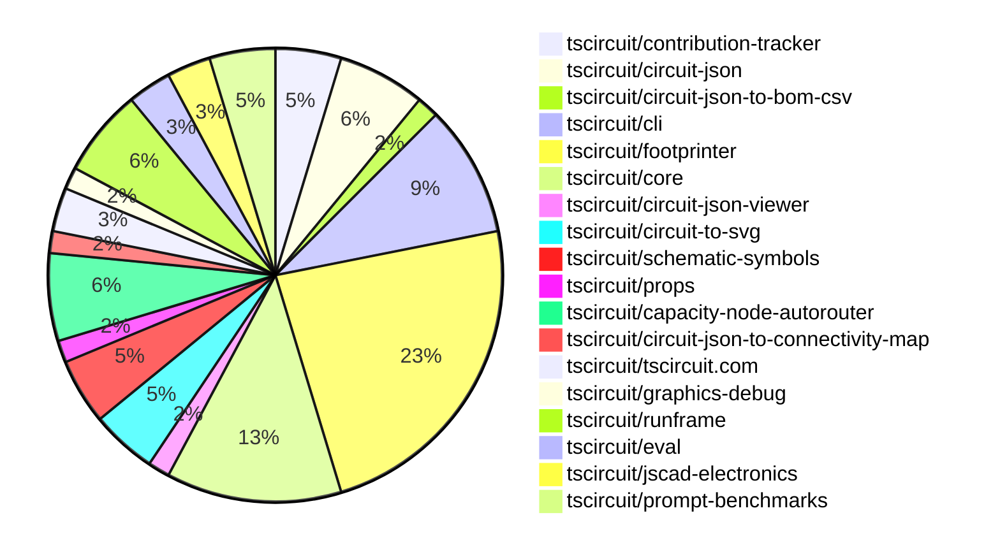

# contribution-tracker

Generates weekly contribution overviews for tscircuit contributors. Check out all
the [contribution overviews here](./contribution-overviews/)

* All PRs in the tscircuit org are scanned/summarized via Claude Haiku
* Claude classifies each Diff/PR as a Major, Minor or Tiny contribution
* All the PRs, summaries, and classifications are organized into charts and tables

The current week is shown below. There are 3 major sections:

* [Contributor Overview](#contributor-overview)
* [PRs by Repository](#prs-by-repository)
* [PRs by Contributor](#changes-by-contributor)

## Current Week

<!-- START_CURRENT_WEEK -->

# Contribution Overview 2025-02-19

## PRs by Repository

## Contributor Overview

| Contributor | 🐳 Major | 🐙 Minor | 🐌 Tiny | ⭐ | Issues Created |
|-------------|---------|---------|---------|-----|----------------|
| [seveibar](#seveibar) | 5 | 8 | 0 | 👑 | 40 |
| [techmannih](#techmannih) | 1 | 9 | 1 | ⭐⭐ | 6 |
| [ShiboSoftwareDev](#ShiboSoftwareDev) | 0 | 3 | 0 | ⭐⭐ | 7 |
| [imrishabh18](#imrishabh18) | 0 | 7 | 2 | ⭐⭐ | 10 |
| [Abse2001](#Abse2001) | 0 | 6 | 0 | ⭐⭐ | 2 |
| [ArnavK-09](#ArnavK-09) | 1 | 3 | 1 | ⭐⭐ | 1 |
| [kom-senapati](#kom-senapati) | 1 | 3 | 0 | ⭐ | 5 |
| [AnasSarkiz](#AnasSarkiz) | 1 | 2 | 0 | ⭐ | 1 |
| [MustafaMulla29](#MustafaMulla29) | 1 | 1 | 0 | ⭐ | 1 |
| [Ayushjhawar8](#Ayushjhawar8) | 0 | 3 | 0 | ⭐ | 1 |
| [Anshgrover23](#Anshgrover23) | 0 | 2 | 1 | ⭐ | 3 |
| [siva222003](#siva222003) | 0 | 1 | 0 |  | 1 |

## Review Table

[reviews-received-hover]: ## "Number of reviews received for PRs for this contributor"
[approvals-received-hover]: ## "Number of approvals received for PRs this contributor authored"
[rejections-received-hover]: ## "Number of rejections received for PRs this contributor authored"
[prs-opened-hover]: ## "Number of PRs opened by this contributor"
[issues-created-hover]: ## "Number of issues created by this contributor"
[bountied-issues-hover]: ## "Number of issues this contributor created with a bounty"
[bountied-issue-$-hover]: ## "Total bounty amount placed on issues authored by this contributor"

| Contributor | Reviews Received | Approvals Received | Rejections Received | Approvals | Rejections | PRs Opened | PRs Merged | Issues Created | Bountied Issues | Bountied Issue $ |
|---|---|---|---|---|---|---|---|---|---|---|
| [rohitbhure65](#rohitbhure65) | 0 | 0 | 0 | 0 | 0 | 3 | 0 | 0 | 0 | 0 |
| [kom-senapati](#kom-senapati) | 31 | 16 | 5 | 0 | 0 | 10 | 4 | 5 | 0 | 0 |
| [seveibar](#seveibar) | 1 | 1 | 0 | 37 | 4 | 15 | 14 | 40 | 27 | 426 |
| [Abse2001](#Abse2001) | 9 | 6 | 1 | 0 | 0 | 6 | 6 | 2 | 1 | 10 |
| [imrishabh18](#imrishabh18) | 4 | 4 | 0 | 9 | 1 | 10 | 9 | 10 | 4 | 49 |
| [techmannih](#techmannih) | 27 | 13 | 4 | 2 | 1 | 15 | 11 | 6 | 4 | 32 |
| [Anshgrover23](#Anshgrover23) | 5 | 3 | 2 | 8 | 10 | 4 | 3 | 3 | 0 | 0 |
| [deekshatomer](#deekshatomer) | 2 | 0 | 2 | 0 | 0 | 2 | 0 | 0 | 0 | 0 |
| [MustafaMulla29](#MustafaMulla29) | 8 | 6 | 1 | 0 | 0 | 3 | 2 | 1 | 0 | 0 |
| [AnasSarkiz](#AnasSarkiz) | 4 | 3 | 0 | 0 | 1 | 3 | 3 | 1 | 1 | 5 |
| [ShiboSoftwareDev](#ShiboSoftwareDev) | 1 | 1 | 0 | 2 | 0 | 3 | 3 | 7 | 4 | 110 |
| [ArnavK-09](#ArnavK-09) | 6 | 6 | 0 | 7 | 4 | 6 | 5 | 1 | 0 | 0 |
| [Ayushjhawar8](#Ayushjhawar8) | 9 | 3 | 3 | 0 | 0 | 3 | 3 | 1 | 0 | 0 |
| [siva222003](#siva222003) | 2 | 1 | 0 | 0 | 0 | 2 | 1 | 1 | 0 | 0 |
| [AayushSaini101](#AayushSaini101) | 15 | 2 | 3 | 0 | 0 | 1 | 0 | 0 | 0 | 0 |

## Changes by Repository

### [tscircuit/contribution-tracker](https://github.com/tscircuit/contribution-tracker)

| PR # | Impact | Contributor | Description |
|------|--------|-------------|-------------|
| [#72](https://github.com/tscircuit/contribution-tracker/pull/72) | 🐳 Major | kom-senapati | Introduce workflows to automate format checking, testing, and type checking on push and pull request events. |
| [#76](https://github.com/tscircuit/contribution-tracker/pull/76) | 🐳 Major | ArnavK-09 | The pull request adds a requirement for approval before points can be claimed, and modifies the logic for processing and tracking PR reviews. |
| [#58](https://github.com/tscircuit/contribution-tracker/pull/58) | 🐙 Minor | Ayushjhawar8 | Fixes a bug to provide special honor to full-time contributors in the contributor overview. |

### [tscircuit/circuit-json](https://github.com/tscircuit/circuit-json)

| PR # | Impact | Contributor | Description |
|------|--------|-------------|-------------|
| [#140](https://github.com/tscircuit/circuit-json/pull/140) | 🐙 Minor | kom-senapati | Removes the `rotation` field from the `SchematicComponent` interface and its corresponding schema. |
| [#138](https://github.com/tscircuit/circuit-json/pull/138) | 🐙 Minor | Abse2001 | Adding the `pcb_autorouting_error` type to the `any_circuit_element` union type. |
| [#137](https://github.com/tscircuit/circuit-json/pull/137) | 🐙 Minor | Abse2001 | Introduces a new type of PCB error called "AutoroutingError" to handle issues related to the autorouting process. |
| [#135](https://github.com/tscircuit/circuit-json/pull/135) | 🐙 Minor | techmannih | Add stroke width for silkscreen circle and silkscreen rectangle |

### [tscircuit/circuit-json-to-bom-csv](https://github.com/tscircuit/circuit-json-to-bom-csv)

| PR # | Impact | Contributor | Description |
|------|--------|-------------|-------------|
| [#6](https://github.com/tscircuit/circuit-json-to-bom-csv/pull/6) | 🐙 Minor | kom-senapati | Add support for interpreting LCSC part numbers in the JLCPCB Part # column |

### [tscircuit/cli](https://github.com/tscircuit/cli)

| PR # | Impact | Contributor | Description |
|------|--------|-------------|-------------|
| [#88](https://github.com/tscircuit/cli/pull/88) | 🐳 Major | seveibar | Bundle everything with bun, reducing install size from ~500MB to ~25MB. |
| [#87](https://github.com/tscircuit/cli/pull/87) | 🐙 Minor | kom-senapati | Adds a GitHub workflow to automatically update the README file with the CLI usage documentation. |
| [#89](https://github.com/tscircuit/cli/pull/89) | 🐙 Minor | seveibar | Remove all the "import @tscircuit/core" statements from the codebase. |
| [#96](https://github.com/tscircuit/cli/pull/96) | 🐙 Minor | imrishabh18 | Updates the dependency `@tscircuit/core` from version `0.0.249` to `0.0.323` |
| [#95](https://github.com/tscircuit/cli/pull/95) | 🐙 Minor | ArnavK-09 | Adds detection for the new "bun.lock" file to determine the package manager. |
| [#92](https://github.com/tscircuit/cli/pull/92) | 🐙 Minor | ArnavK-09 | Adds an optional `message` parameter to the `POST /api/events/create` endpoint to send an error message to the `runframe` application when saving a code snippet fails. |

### [tscircuit/footprinter](https://github.com/tscircuit/footprinter)

| PR # | Impact | Contributor | Description |
|------|--------|-------------|-------------|
| [#184](https://github.com/tscircuit/footprinter/pull/184) | 🐳 Major | MustafaMulla29 | Implemented VSSOP-8-0.65mm footprint. |
| [#208](https://github.com/tscircuit/footprinter/pull/208) | 🐙 Minor | Abse2001 | Fixed NaN in sot23 silkscreen |
| [#161](https://github.com/tscircuit/footprinter/pull/161) | 🐙 Minor | techmannih | Adds the sot89_3 footprint |
| [#135](https://github.com/tscircuit/footprinter/pull/135) | 🐙 Minor | techmannih | Add sod323 footprint |
| [#216](https://github.com/tscircuit/footprinter/pull/216) | 🐙 Minor | techmannih | Add rows parameter in pinrow footprint |
| [#218](https://github.com/tscircuit/footprinter/pull/218) | 🐙 Minor | techmannih | Update the snapshot due to a bound issue |
| [#215](https://github.com/tscircuit/footprinter/pull/215) | 🐙 Minor | techmannih | Add support for sot223 footprint |
| [#148](https://github.com/tscircuit/footprinter/pull/148) | 🐙 Minor | techmannih | Adds the sod123w footprint to the library. |
| [#206](https://github.com/tscircuit/footprinter/pull/206) | 🐙 Minor | MustafaMulla29 | Fixed the incorrect marking of pins in the stampreceiver component. |
| [#212](https://github.com/tscircuit/footprinter/pull/212) | 🐙 Minor | imrishabh18 | Refactored the `sot23` footprint to handle different number of pins (3, 5, 6, 8) and added support for the `sot23_N` format. |
| [#210](https://github.com/tscircuit/footprinter/pull/210) | 🐙 Minor | imrishabh18 | Fix to220 footprint parsing |
| [#207](https://github.com/tscircuit/footprinter/pull/207) | 🐙 Minor | imrishabh18 | Add a build workflow for the Bun framework |
| [#214](https://github.com/tscircuit/footprinter/pull/214) | 🐙 Minor | Anshgrover23 | Fixes the pad spacing issue in the TO220-5 component. |
| [#204](https://github.com/tscircuit/footprinter/pull/204) | 🐙 Minor | AnasSarkiz | Added support for male and female pin headers in the pinrow footprint |
| [#209](https://github.com/tscircuit/footprinter/pull/209) | 🐌 Tiny | Anshgrover23 | Add a test for the `dip_0.1in` component. |

### [tscircuit/core](https://github.com/tscircuit/core)

| PR # | Impact | Contributor | Description |
|------|--------|-------------|-------------|
| [#645](https://github.com/tscircuit/core/pull/645) | 🐳 Major | seveibar | Fixes the connections implementation to automatically create nets and be accepted across NormalComponents. |
| [#644](https://github.com/tscircuit/core/pull/644) | 🐙 Minor | Abse2001 | Adds an error object to the list of PCB autorouting errors when the autorouting job fails. |
| [#639](https://github.com/tscircuit/core/pull/639) | 🐙 Minor | Abse2001 | Adds silkscreen text for component names to the NormalComponent class and the createComponentsFromSoup utility function. |
| [#646](https://github.com/tscircuit/core/pull/646) | 🐙 Minor | techmannih | Update the `@tscircuit/footprinter` dependency to version `0.0.140` and update the jumper test with rows. |
| [#638](https://github.com/tscircuit/core/pull/638) | 🐙 Minor | seveibar | Add more common pin names to the `sel-utility-types.ts` file. |
| [#643](https://github.com/tscircuit/core/pull/643) | 🐙 Minor | imrishabh18 | Adds `@tscircuit/footprinter` as a peer dependency |
| [#640](https://github.com/tscircuit/core/pull/640) | 🐙 Minor | imrishabh18 | Add subcircuit_id to output traces |
| [#641](https://github.com/tscircuit/core/pull/641) | 🐌 Tiny | imrishabh18 | Update the version of the `@tscircuit/footprinter` dependency from `^0.0.128` to `^0.0.135`. |

### [tscircuit/circuit-json-viewer](https://github.com/tscircuit/circuit-json-viewer)

| PR # | Impact | Contributor | Description |
|------|--------|-------------|-------------|
| [#3](https://github.com/tscircuit/circuit-json-viewer/pull/3) | 🐙 Minor | Abse2001 | Updated the "@tscircuit/runframe" dependency to version 0.0.189 |

### [tscircuit/circuit-to-svg](https://github.com/tscircuit/circuit-to-svg)

| PR # | Impact | Contributor | Description |
|------|--------|-------------|-------------|
| [#170](https://github.com/tscircuit/circuit-to-svg/pull/170) | 🐳 Major | techmannih | Adds support for silkscreenline, silkscreencircle, and silkscreenrect elements in the PCB SVG conversion process. |
| [#172](https://github.com/tscircuit/circuit-to-svg/pull/172) | 🐙 Minor | Anshgrover23 | Fixes incorrect bounds calculation for PCB silkscreen elements in the Circuit-to-SVG conversion. |
| [#176](https://github.com/tscircuit/circuit-to-svg/pull/176) | 🐌 Tiny | imrishabh18 | Deletes the `testing.tsx` file. |

### [tscircuit/schematic-symbols](https://github.com/tscircuit/schematic-symbols)

| PR # | Impact | Contributor | Description |
|------|--------|-------------|-------------|
| [#257](https://github.com/tscircuit/schematic-symbols/pull/257) | 🐙 Minor | techmannih | Swapped the emitter and collector pins for the NPN bipolar transistor symbol. |
| [#256](https://github.com/tscircuit/schematic-symbols/pull/256) | 🐙 Minor | seveibar | Removes unused directories from the package output |
| [#258](https://github.com/tscircuit/schematic-symbols/pull/258) | 🐌 Tiny | techmannih | Removes unnecessary model files. |

### [tscircuit/props](https://github.com/tscircuit/props)

| PR # | Impact | Contributor | Description |
|------|--------|-------------|-------------|
| [#186](https://github.com/tscircuit/props/pull/186) | 🐳 Major | seveibar | Introduce `layoutMode`, `pcbLayout` and `schLayout` to the `<group />` component, allowing for flexbox layout and grid layout inside the group. |

### [tscircuit/capacity-node-autorouter](https://github.com/tscircuit/capacity-node-autorouter)

| PR # | Impact | Contributor | Description |
|------|--------|-------------|-------------|
| [#8](https://github.com/tscircuit/capacity-node-autorouter/pull/8) | 🐳 Major | seveibar | Capacity function tuning, more tests, LED matrices, and caching for overlapping obstacles (with a fix for obstacle traversal) |
| [#5](https://github.com/tscircuit/capacity-node-autorouter/pull/5) | 🟣 | seveibar | Improve Difficult very dense edge cases, add higher difficulty cases, support for connection map for deliberate shorting, add second keyboard test |
| [#3](https://github.com/tscircuit/capacity-node-autorouter/pull/3) | 🐳 Major | seveibar | Introduces many improvements to animation and fixes to the hyper-parameter solver. |
| [#2](https://github.com/tscircuit/capacity-node-autorouter/pull/2) | 🐙 Minor | seveibar | Improves the high density autorouter by combining the visualizations of successful and failed solvers. |

### [tscircuit/circuit-json-to-connectivity-map](https://github.com/tscircuit/circuit-json-to-connectivity-map)

| PR # | Impact | Contributor | Description |
|------|--------|-------------|-------------|
| [#8](https://github.com/tscircuit/circuit-json-to-connectivity-map/pull/8) | 🐙 Minor | seveibar | Handles unknown nets in the connectivity map by returning false when checking connectivity between unknown IDs and true when checking connectivity between the same unknown ID. |

### [tscircuit/tscircuit.com](https://github.com/tscircuit/tscircuit.com)

| PR # | Impact | Contributor | Description |
|------|--------|-------------|-------------|
| [#688](https://github.com/tscircuit/tscircuit.com/pull/688) | 🐙 Minor | seveibar | Change all references to "/ai" to "https://chat.tscircuit.com" |
| [#685](https://github.com/tscircuit/tscircuit.com/pull/685) | 🐙 Minor | siva222003 | Fix the layout of UI cards and badge on the /quickstart page for improved responsiveness on small screens. |

### [tscircuit/graphics-debug](https://github.com/tscircuit/graphics-debug)

| PR # | Impact | Contributor | Description |
|------|--------|-------------|-------------|
| [#24](https://github.com/tscircuit/graphics-debug/pull/24) | 🐙 Minor | seveibar | Add support for dash array and line cap to the Line component |

### [tscircuit/runframe](https://github.com/tscircuit/runframe)

| PR # | Impact | Contributor | Description |
|------|--------|-------------|-------------|
| [#270](https://github.com/tscircuit/runframe/pull/270) | 🐙 Minor | seveibar | Allow standalone bundle to display the CLI version of the RunFrame component. |
| [#273](https://github.com/tscircuit/runframe/pull/273) | 🐙 Minor | ArnavK-09 | Tweaks various UI elements in the RunframeForCli application, including alert dialogs, notifications, and tab menus. |
| [#250](https://github.com/tscircuit/runframe/pull/250) | 🐙 Minor | Ayushjhawar8 | Fix better error message and handling of infinitely loading runframe |
| [#274](https://github.com/tscircuit/runframe/pull/274) | 🐌 Tiny | ArnavK-09 | Bump the versions of GitHub Actions used in the workflow files |

### [tscircuit/eval](https://github.com/tscircuit/eval)

| PR # | Impact | Contributor | Description |
|------|--------|-------------|-------------|
| [#124](https://github.com/tscircuit/eval/pull/124) | 🐙 Minor | imrishabh18 | Update the version of `@tscircuit/core` dependency and add a new test for the `example8-footprinter-to220` scenario. |
| [#118](https://github.com/tscircuit/eval/pull/118) | 🐙 Minor | Ayushjhawar8 | This pull request adds support for parsing default imports with namespace import syntax. |

### [tscircuit/jscad-electronics](https://github.com/tscircuit/jscad-electronics)

| PR # | Impact | Contributor | Description |
|------|--------|-------------|-------------|
| [#91](https://github.com/tscircuit/jscad-electronics/pull/91) | 🐳 Major | AnasSarkiz | Introduce a new 3D component for a push button, including the button body, button top, and legs. |
| [#89](https://github.com/tscircuit/jscad-electronics/pull/89) | 🐙 Minor | AnasSarkiz | Introduce Female headers 3D model and added example |

### [tscircuit/prompt-benchmarks](https://github.com/tscircuit/prompt-benchmarks)

| PR # | Impact | Contributor | Description |
|------|--------|-------------|-------------|
| [#44](https://github.com/tscircuit/prompt-benchmarks/pull/44) | 🐙 Minor | ShiboSoftwareDev | Added more tests for utility functions |
| [#43](https://github.com/tscircuit/prompt-benchmarks/pull/43) | 🐙 Minor | ShiboSoftwareDev | Added more tests for utility functions |
| [#42](https://github.com/tscircuit/prompt-benchmarks/pull/42) | 🐙 Minor | ShiboSoftwareDev | Renaming and refactoring the project structure, including renaming "AiCoder" to "TscircuitCoder" and moving related files to a new "ask-ai" directory. |

## Changes by Contributor

### [kom-senapati](https://github.com/kom-senapati)

| PR # | Impact | Description |
|------|--------|-------------|
| [#72](https://github.com/tscircuit/contribution-tracker/pull/72) | 🐳 Major | Introduce workflows to automate format checking, testing, and type checking on push and pull request events. |
| [#140](https://github.com/tscircuit/circuit-json/pull/140) | 🐙 Minor | Removes the `rotation` field from the `SchematicComponent` interface and its corresponding schema. |
| [#6](https://github.com/tscircuit/circuit-json-to-bom-csv/pull/6) | 🐙 Minor | Add support for interpreting LCSC part numbers in the JLCPCB Part # column |
| [#87](https://github.com/tscircuit/cli/pull/87) | 🐙 Minor | Adds a GitHub workflow to automatically update the README file with the CLI usage documentation. |

### [Abse2001](https://github.com/Abse2001)

| PR # | Impact | Description |
|------|--------|-------------|
| [#138](https://github.com/tscircuit/circuit-json/pull/138) | 🐙 Minor | Adding the `pcb_autorouting_error` type to the `any_circuit_element` union type. |
| [#137](https://github.com/tscircuit/circuit-json/pull/137) | 🐙 Minor | Introduces a new type of PCB error called "AutoroutingError" to handle issues related to the autorouting process. |
| [#208](https://github.com/tscircuit/footprinter/pull/208) | 🐙 Minor | Fixed NaN in sot23 silkscreen |
| [#644](https://github.com/tscircuit/core/pull/644) | 🐙 Minor | Adds an error object to the list of PCB autorouting errors when the autorouting job fails. |
| [#639](https://github.com/tscircuit/core/pull/639) | 🐙 Minor | Adds silkscreen text for component names to the NormalComponent class and the createComponentsFromSoup utility function. |
| [#3](https://github.com/tscircuit/circuit-json-viewer/pull/3) | 🐙 Minor | Updated the "@tscircuit/runframe" dependency to version 0.0.189 |

### [techmannih](https://github.com/techmannih)

| PR # | Impact | Description |
|------|--------|-------------|
| [#170](https://github.com/tscircuit/circuit-to-svg/pull/170) | 🐳 Major | Adds support for silkscreenline, silkscreencircle, and silkscreenrect elements in the PCB SVG conversion process. |
| [#135](https://github.com/tscircuit/circuit-json/pull/135) | 🐙 Minor | Add stroke width for silkscreen circle and silkscreen rectangle |
| [#161](https://github.com/tscircuit/footprinter/pull/161) | 🐙 Minor | Adds the sot89_3 footprint |
| [#135](https://github.com/tscircuit/footprinter/pull/135) | 🐙 Minor | Add sod323 footprint |
| [#216](https://github.com/tscircuit/footprinter/pull/216) | 🐙 Minor | Add rows parameter in pinrow footprint |
| [#218](https://github.com/tscircuit/footprinter/pull/218) | 🐙 Minor | Update the snapshot due to a bound issue |
| [#215](https://github.com/tscircuit/footprinter/pull/215) | 🐙 Minor | Add support for sot223 footprint |
| [#148](https://github.com/tscircuit/footprinter/pull/148) | 🐙 Minor | Adds the sod123w footprint to the library. |
| [#646](https://github.com/tscircuit/core/pull/646) | 🐙 Minor | Update the `@tscircuit/footprinter` dependency to version `0.0.140` and update the jumper test with rows. |
| [#257](https://github.com/tscircuit/schematic-symbols/pull/257) | 🐙 Minor | Swapped the emitter and collector pins for the NPN bipolar transistor symbol. |
| [#258](https://github.com/tscircuit/schematic-symbols/pull/258) | 🐌 Tiny | Removes unnecessary model files. |

### [seveibar](https://github.com/seveibar)

| PR # | Impact | Description |
|------|--------|-------------|
| [#186](https://github.com/tscircuit/props/pull/186) | 🐳 Major | Introduce `layoutMode`, `pcbLayout` and `schLayout` to the `<group />` component, allowing for flexbox layout and grid layout inside the group. |
| [#645](https://github.com/tscircuit/core/pull/645) | 🐳 Major | Fixes the connections implementation to automatically create nets and be accepted across NormalComponents. |
| [#88](https://github.com/tscircuit/cli/pull/88) | 🐳 Major | Bundle everything with bun, reducing install size from ~500MB to ~25MB. |
| [#8](https://github.com/tscircuit/capacity-node-autorouter/pull/8) | 🐳 Major | Capacity function tuning, more tests, LED matrices, and caching for overlapping obstacles (with a fix for obstacle traversal) |
| [#638](https://github.com/tscircuit/core/pull/638) | 🐙 Minor | Add more common pin names to the `sel-utility-types.ts` file. |
| [#256](https://github.com/tscircuit/schematic-symbols/pull/256) | 🐙 Minor | Removes unused directories from the package output |
| [#8](https://github.com/tscircuit/circuit-json-to-connectivity-map/pull/8) | 🐙 Minor | Handles unknown nets in the connectivity map by returning false when checking connectivity between unknown IDs and true when checking connectivity between the same unknown ID. |
| [#688](https://github.com/tscircuit/tscircuit.com/pull/688) | 🐙 Minor | Change all references to "/ai" to "https://chat.tscircuit.com" |
| [#24](https://github.com/tscircuit/graphics-debug/pull/24) | 🐙 Minor | Add support for dash array and line cap to the Line component |
| [#270](https://github.com/tscircuit/runframe/pull/270) | 🐙 Minor | Allow standalone bundle to display the CLI version of the RunFrame component. |
| [#89](https://github.com/tscircuit/cli/pull/89) | 🐙 Minor | Remove all the "import @tscircuit/core" statements from the codebase. |
| [#5](https://github.com/tscircuit/capacity-node-autorouter/pull/5) | 🟣 | Improve Difficult very dense edge cases, add higher difficulty cases, support for connection map for deliberate shorting, add second keyboard test |
| [#3](https://github.com/tscircuit/capacity-node-autorouter/pull/3) | 🐳 Major | Introduces many improvements to animation and fixes to the hyper-parameter solver. |
| [#2](https://github.com/tscircuit/capacity-node-autorouter/pull/2) | 🐙 Minor | Improves the high density autorouter by combining the visualizations of successful and failed solvers. |

### [MustafaMulla29](https://github.com/MustafaMulla29)

| PR # | Impact | Description |
|------|--------|-------------|
| [#184](https://github.com/tscircuit/footprinter/pull/184) | 🐳 Major | Implemented VSSOP-8-0.65mm footprint. |
| [#206](https://github.com/tscircuit/footprinter/pull/206) | 🐙 Minor | Fixed the incorrect marking of pins in the stampreceiver component. |

### [imrishabh18](https://github.com/imrishabh18)

| PR # | Impact | Description |
|------|--------|-------------|
| [#212](https://github.com/tscircuit/footprinter/pull/212) | 🐙 Minor | Refactored the `sot23` footprint to handle different number of pins (3, 5, 6, 8) and added support for the `sot23_N` format. |
| [#210](https://github.com/tscircuit/footprinter/pull/210) | 🐙 Minor | Fix to220 footprint parsing |
| [#207](https://github.com/tscircuit/footprinter/pull/207) | 🐙 Minor | Add a build workflow for the Bun framework |
| [#643](https://github.com/tscircuit/core/pull/643) | 🐙 Minor | Adds `@tscircuit/footprinter` as a peer dependency |
| [#640](https://github.com/tscircuit/core/pull/640) | 🐙 Minor | Add subcircuit_id to output traces |
| [#124](https://github.com/tscircuit/eval/pull/124) | 🐙 Minor | Update the version of `@tscircuit/core` dependency and add a new test for the `example8-footprinter-to220` scenario. |
| [#96](https://github.com/tscircuit/cli/pull/96) | 🐙 Minor | Updates the dependency `@tscircuit/core` from version `0.0.249` to `0.0.323` |
| [#641](https://github.com/tscircuit/core/pull/641) | 🐌 Tiny | Update the version of the `@tscircuit/footprinter` dependency from `^0.0.128` to `^0.0.135`. |
| [#176](https://github.com/tscircuit/circuit-to-svg/pull/176) | 🐌 Tiny | Deletes the `testing.tsx` file. |

### [Anshgrover23](https://github.com/Anshgrover23)

| PR # | Impact | Description |
|------|--------|-------------|
| [#214](https://github.com/tscircuit/footprinter/pull/214) | 🐙 Minor | Fixes the pad spacing issue in the TO220-5 component. |
| [#172](https://github.com/tscircuit/circuit-to-svg/pull/172) | 🐙 Minor | Fixes incorrect bounds calculation for PCB silkscreen elements in the Circuit-to-SVG conversion. |
| [#209](https://github.com/tscircuit/footprinter/pull/209) | 🐌 Tiny | Add a test for the `dip_0.1in` component. |

### [AnasSarkiz](https://github.com/AnasSarkiz)

| PR # | Impact | Description |
|------|--------|-------------|
| [#91](https://github.com/tscircuit/jscad-electronics/pull/91) | 🐳 Major | Introduce a new 3D component for a push button, including the button body, button top, and legs. |
| [#204](https://github.com/tscircuit/footprinter/pull/204) | 🐙 Minor | Added support for male and female pin headers in the pinrow footprint |
| [#89](https://github.com/tscircuit/jscad-electronics/pull/89) | 🐙 Minor | Introduce Female headers 3D model and added example |

### [ArnavK-09](https://github.com/ArnavK-09)

| PR # | Impact | Description |
|------|--------|-------------|
| [#76](https://github.com/tscircuit/contribution-tracker/pull/76) | 🐳 Major | The pull request adds a requirement for approval before points can be claimed, and modifies the logic for processing and tracking PR reviews. |
| [#273](https://github.com/tscircuit/runframe/pull/273) | 🐙 Minor | Tweaks various UI elements in the RunframeForCli application, including alert dialogs, notifications, and tab menus. |
| [#95](https://github.com/tscircuit/cli/pull/95) | 🐙 Minor | Adds detection for the new "bun.lock" file to determine the package manager. |
| [#92](https://github.com/tscircuit/cli/pull/92) | 🐙 Minor | Adds an optional `message` parameter to the `POST /api/events/create` endpoint to send an error message to the `runframe` application when saving a code snippet fails. |
| [#274](https://github.com/tscircuit/runframe/pull/274) | 🐌 Tiny | Bump the versions of GitHub Actions used in the workflow files |

### [Ayushjhawar8](https://github.com/Ayushjhawar8)

| PR # | Impact | Description |
|------|--------|-------------|
| [#58](https://github.com/tscircuit/contribution-tracker/pull/58) | 🐙 Minor | Fixes a bug to provide special honor to full-time contributors in the contributor overview. |
| [#118](https://github.com/tscircuit/eval/pull/118) | 🐙 Minor | This pull request adds support for parsing default imports with namespace import syntax. |
| [#250](https://github.com/tscircuit/runframe/pull/250) | 🐙 Minor | Fix better error message and handling of infinitely loading runframe |

### [siva222003](https://github.com/siva222003)

| PR # | Impact | Description |
|------|--------|-------------|
| [#685](https://github.com/tscircuit/tscircuit.com/pull/685) | 🐙 Minor | Fix the layout of UI cards and badge on the /quickstart page for improved responsiveness on small screens. |

### [ShiboSoftwareDev](https://github.com/ShiboSoftwareDev)

| PR # | Impact | Description |
|------|--------|-------------|
| [#44](https://github.com/tscircuit/prompt-benchmarks/pull/44) | 🐙 Minor | Added more tests for utility functions |
| [#43](https://github.com/tscircuit/prompt-benchmarks/pull/43) | 🐙 Minor | Added more tests for utility functions |
| [#42](https://github.com/tscircuit/prompt-benchmarks/pull/42) | 🐙 Minor | Renaming and refactoring the project structure, including renaming "AiCoder" to "TscircuitCoder" and moving related files to a new "ask-ai" directory. |

<!-- END_CURRENT_WEEK -->
