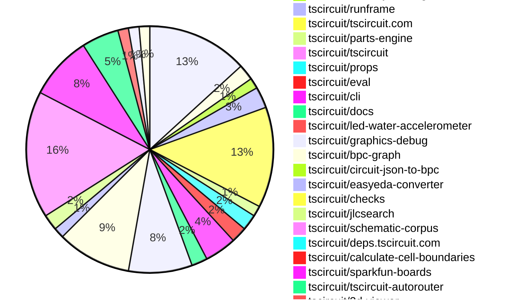

# contribution-tracker

[contributions.tscircuit.com](https://contributions.tscircuit.com) ・ [tscircuit.com](https://tscircuit.com) ・ [Contribution Overviews](./contribution-overviews/) ・ [Changelogs](./changelogs/)

Generates weekly contribution overviews for tscircuit contributors. Check out all
the [contribution overviews here](./contribution-overviews/)
You can find AI-generated monthly changelogs in the [changelogs directory](./changelogs/).

- All PRs in the tscircuit org are scanned/summarized via an LLM
- The LLM classifies each Diff/PR as into a set of attributes for scoring
- All the PRs, summaries, and classifications are organized into charts and tables for [the website](https://contributions.tscircuit.com)

## Getting Started

### Prerequisites

- [Bun](https://bun.sh/) runtime
- `.env` file with required API keys:
  ```
  GITHUB_TOKEN=your_github_token
  OPENAI_API_KEY=your_openai_api_key
  DISCORD_TOKEN=your_discord_token (optional, for Discord integration)
  SLACK_BOT_TOKEN=your_slack_token (optional, for Slack integration)
  ```

### Available Scripts

#### Core Generation Scripts

- `bun run generate:weekly` - Generate current week's contribution overview
- `bun run generate:monthly` - Generate current month's contribution overview
- `bun run generate:changelog` - Generate monthly changelog from PRs

#### Analysis & Testing

- `bun run analyze-pr` - Analyze a single PR (interactive prompt)
- `bun run test:github` - Test GitHub API integration

#### Notifications & Sync

- `bun run notifications:issues` - Send notifications for new issues
- `bun run notifications:pr` - Send notifications for new PRs
- `bun run sync:discord` - Sync contributor roles with Discord

#### Data Export

- `bun run export:sponsorship` - Generate sponsorship data CSV

#### Development

- `bun run dev` - Start development server for web UI
- `bun run build` - Build for production
- `bun run format` - Format code with Biome

### Usage Examples

```bash
# Generate this week's contribution overview
bun run generate:weekly

# Generate current month's overview
bun run generate:monthly

# Analyze a specific PR
bun run analyze-pr

# Test your GitHub token setup
bun run test:github
```

The current week is shown below. There are 3 major sections:

- [Contributor Overview](#contributor-overview)
- [PRs by Repository](#prs-by-repository)
- [PRs by Contributor](#changes-by-contributor)

## Current Week

<!-- START_CURRENT_WEEK -->

# Contribution Overview 2025-06-25

## PRs by Repository



## Contributor Overview

| Contributor | 🐳 Major | 🐙 Minor | 🐌 Tiny | ⭐ | Issues Created | Discussion Contributions |
|-------------|---------|---------|---------|-----|----------------|--------------------------|
| [seveibar](#seveibar) | 13 | 8 | 30 | 👑 | 5 | 0🔹 0🔶 0💎 |
| [imrishabh18](#imrishabh18) | 4 | 2 | 15 | ⭐⭐ | 1 | 0🔹 0🔶 0💎 |
| [Anshgrover23](#Anshgrover23) | 3 | 2 | 16 | ⭐⭐ | 9 | 0🔹 0🔶 0💎 |
| [Abse2001](#Abse2001) | 2 | 0 | 9 | ⭐⭐ | 1 | 0🔹 0🔶 0💎 |
| [techmannih](#techmannih) | 0 | 2 | 12 | ⭐⭐ | 2 | 0🔹 0🔶 0💎 |
| [ArnavK-09](#ArnavK-09) | 2 | 3 | 10 | ⭐⭐ | 7 | 0🔹 0🔶 0💎 |
| [ShiboSoftwareDev](#ShiboSoftwareDev) | 1 | 1 | 9 | ⭐⭐ | 7 | 0🔹 0🔶 0💎 |
| [ricohageman](#ricohageman) | 1 | 0 | 0 |  | 0 | 0🔹 0🔶 0💎 |
| [MustafaMulla29](#MustafaMulla29) | 0 | 0 | 3 |  | 6 | 0🔹 0🔶 0💎 |
| [andrii-balitskyi](#andrii-balitskyi) | 0 | 0 | 1 |  | 0 | 0🔹 0🔶 0💎 |
| [tscircuitbot](#tscircuitbot) | 0 | 0 | 1 |  | 0 | 0🔹 0🔶 0💎 |

### Discussion Contribution Legend

- 🔹 Normal Comments: Basic participation with minimal effort
- 🔶 Great Informative Comments: Thoughtful participation that adds value
- 💎 Incredible Comments: Exceptional participation with high-quality content

## Review Table

[reviews-received-hover]: ## "Number of reviews received for PRs for this contributor"
[approvals-received-hover]: ## "Number of approvals received for PRs this contributor authored"
[rejections-received-hover]: ## "Number of rejections received for PRs this contributor authored"
[prs-opened-hover]: ## "Number of PRs opened by this contributor"
[issues-created-hover]: ## "Number of issues created by this contributor"
[bountied-issues-hover]: ## "Number of issues this contributor created with a bounty"
[bountied-issue-$-hover]: ## "Total bounty amount placed on issues authored by this contributor"

| Contributor | Reviews Received | Approvals Received | Rejections Received | Approvals | Rejections | PRs Opened | PRs Merged | Issues Created | Bountied Issues | Bountied Issue $ |
|---|---|---|---|---|---|---|---|---|---|---|
| [seveibar](#seveibar) | 6 | 1 | 0 | 41 | 4 | 66 | 51 | 5 | 2 | 50 |
| [imrishabh18](#imrishabh18) | 18 | 9 | 0 | 9 | 2 | 23 | 21 | 1 | 0 | 0 |
| [graphite-app[bot]](#graphite-app[bot]) | 0 | 0 | 0 | 0 | 0 | 0 | 0 | 0 | 0 | 0 |
| [techmannih](#techmannih) | 47 | 20 | 7 | 1 | 4 | 26 | 14 | 2 | 0 | 0 |
| [Anshgrover23](#Anshgrover23) | 30 | 21 | 4 | 3 | 6 | 25 | 21 | 9 | 0 | 0 |
| [ShiboSoftwareDev](#ShiboSoftwareDev) | 12 | 9 | 0 | 13 | 2 | 15 | 11 | 7 | 1 | 5 |
| [MustafaMulla29](#MustafaMulla29) | 8 | 3 | 4 | 0 | 0 | 7 | 3 | 6 | 0 | 0 |
| [ArnavK-09](#ArnavK-09) | 22 | 14 | 1 | 2 | 0 | 17 | 15 | 7 | 0 | 0 |
| [Abse2001](#Abse2001) | 5 | 3 | 1 | 13 | 0 | 13 | 11 | 1 | 0 | 0 |
| [andrii-balitskyi](#andrii-balitskyi) | 2 | 1 | 1 | 0 | 0 | 2 | 1 | 0 | 0 | 0 |
| [tscircuitbot](#tscircuitbot) | 0 | 0 | 0 | 0 | 0 | 32 | 1 | 0 | 0 | 0 |
| [ricohageman](#ricohageman) | 1 | 1 | 0 | 0 | 0 | 1 | 1 | 0 | 0 | 0 |
| [cursor[bot]](#cursor[bot]) | 0 | 0 | 0 | 0 | 0 | 0 | 0 | 0 | 0 | 0 |

## Changes by Repository

### [tscircuit/core](https://github.com/tscircuit/core)

| PR # | Impact | Contributor | Description | Milestone Aligned |
|------|--------|-------------|-------------|-------------------|
| [#1002](https://github.com/tscircuit/core/pull/1002) | 🐳 Major | imrishabh18 | Fixes autorouter bug where subcircuits could have multiple traces between the same pins, causing redundant routing and errors. Now, only unrouted traces are considered for autorouting, preventing duplicate connections. | ❌ |
| [#1016](https://github.com/tscircuit/core/pull/1016) | 🐳 Major | seveibar | Rewrites the schematic match-adapt layout algorithm to use BPC (Box-Pin-Connection) graphs, enabling improved schematic layout matching and adaptation using a graph-based approach and a schematic corpus. | ❌ |
| [#1004](https://github.com/tscircuit/core/pull/1004) | 🐳 Major | seveibar | Fixes incorrect placement of schematic netlabel centers by computing their position based on anchor side, ensuring accurate netlabel alignment in schematics. | ❌ |
| [#976](https://github.com/tscircuit/core/pull/976) | 🐳 Major | seveibar | Net labels in schematics now automatically orient themselves based on the position of the connected port, improving label placement and readability. | ❌ |
| [#1008](https://github.com/tscircuit/core/pull/1008) | 🐳 Major | ShiboSoftwareDev | Fixes incorrect calculation of PCB board center when an outline is provided, ensuring the center is derived from the outline's bounding box rather than defaulting to origin or offsets. | ❌ |
| [#1015](https://github.com/tscircuit/core/pull/1015) | 🐙 Minor | seveibar | Maps `schOrientation` prop to schematic symbol rotation and adds comprehensive tests (with snapshots) for polarized capacitor orientations, ensuring correct symbol mapping for all supported orientations. | ❌ |
| [#1005](https://github.com/tscircuit/core/pull/1005) | 🐙 Minor | seveibar | Removes the 'TODO_REMOVE_THIS' placeholder from PrimitiveComponent name getter and ensures NormalComponent footprint generation uses a fallback name if needed, eliminating placeholder leakage into user-facing component names. | ❌ |
| [#1003](https://github.com/tscircuit/core/pull/1003) | 🐙 Minor | seveibar | Fixes incorrect assignment of net IDs to schematic net labels, ensuring that net labels reference the correct source net ID instead of the net name. | ❌ |
| [#1013](https://github.com/tscircuit/core/pull/1013) | 🐌 Tiny | imrishabh18 | Pins the css-select dependency to version 5.1.0 to avoid breaking type errors caused by newer versions. | ❌ |
| [#998](https://github.com/tscircuit/core/pull/998) | 🐌 Tiny | imrishabh18 | Adds automatic printing of project name, version, and URL to the PCB silkscreen if enabled in the platform config via `printBoardInformationToSilkscreen`. | ❌ |
| [#997](https://github.com/tscircuit/core/pull/997) | 🐌 Tiny | imrishabh18 | Adds a comprehensive skipped test that reproduces the bug where duplicate traces are created between the same pins inside a subcircuit (see issue #693). | ❌ |
| [#992](https://github.com/tscircuit/core/pull/992) | 🐌 Tiny | imrishabh18 | Allows users to specify a custom schematic symbol name for the SolderJumper component via the symbolName prop, falling back to the default naming if not provided. | ❌ |
| [#989](https://github.com/tscircuit/core/pull/989) | 🐌 Tiny | imrishabh18 | Adds support for a new `bridged` prop to the SolderJumper component, allowing all pins to be internally connected when set, and updates tests to cover this behavior. | ❌ |
| [#995](https://github.com/tscircuit/core/pull/995) | 🐌 Tiny | Anshgrover23 | Adds a test to verify that the <Led/> component correctly creates traces for specified connections (GND and VCC), ensuring the component's connections prop is handled as expected. | ❌ |
| [#1000](https://github.com/tscircuit/core/pull/1000) | 🐌 Tiny | ShiboSoftwareDev | Adds support for generating PCB routing obstacles for rectangular, circular, and polygonal cutout components, ensuring traces avoid these regions during autorouting. | ❌ |
| [#999](https://github.com/tscircuit/core/pull/999) | 🐌 Tiny | ShiboSoftwareDev | Updates @tscircuit/footprinter dependency from 0.0.182 to 0.0.186 and updates test snapshots to reflect improved floating point precision in pad and group dimensions (e.g., 0.6000000000000001 → 0.6). No new features or bug fixes beyond dependency update and test maintenance. | ❌ |
| [#1014](https://github.com/tscircuit/core/pull/1014) | 🐌 Tiny | techmannih | Updates the schematic symbol dependency and adds a test for testpoint components with netlabels in the schematic, ensuring correct netlabel connections and snapshot testing. | ❌ |
| [#1009](https://github.com/tscircuit/core/pull/1009) | 🐌 Tiny | MustafaMulla29 | Adds a comprehensive test that reproduces the bug where jumper netlabel connections are not handled correctly, enabling easier future fixes. | ❌ |
| [#996](https://github.com/tscircuit/core/pull/996) | 🐌 Tiny | Abse2001 | Adds support for selecting test point pins using selectors like sel.TP1.pin1, enabling users to reference test point pins in selection expressions. | ❌ |

### [tscircuit/circuit-to-svg](https://github.com/tscircuit/circuit-to-svg)

| PR # | Impact | Contributor | Description | Milestone Aligned |
|------|--------|-------------|-------------|-------------------|
| [#268](https://github.com/tscircuit/circuit-to-svg/pull/268) | 🐳 Major | imrishabh18 | Adds support for rendering multi-line PCB silkscreen text by splitting on newlines and generating a <tspan> per line in SVG output, with a test and documentation update. | ❌ |
| [#276](https://github.com/tscircuit/circuit-to-svg/pull/276) | 🐳 Major | seveibar | Removes overline rendering from net labels and reduces font size for negated (overlined) pin labels in schematics, addressing #272. | ❌ |
| [#270](https://github.com/tscircuit/circuit-to-svg/pull/270) | 🐌 Tiny | ShiboSoftwareDev | Adds rendering of pads, pins, and holes to the assembly SVG output, allowing users to visually identify these features in generated assembly diagrams. | ❌ |

### [tscircuit/circuit-json-to-gerber](https://github.com/tscircuit/circuit-json-to-gerber)

| PR # | Impact | Contributor | Description | Milestone Aligned |
|------|--------|-------------|-------------|-------------------|
| [#45](https://github.com/tscircuit/circuit-json-to-gerber/pull/45) | 🐳 Major | imrishabh18 | Fixes incorrect alignment of silkscreen text in Gerber output by supporting additional anchor alignments and the `anchor_side` property, with tests verifying correct behavior. | ❌ |
| [#44](https://github.com/tscircuit/circuit-json-to-gerber/pull/44) | 🐌 Tiny | seveibar | Adds support for all nine text anchor alignments (top_left, top_center, top_right, center_left, center, center_right, bottom_left, bottom_center, bottom_right) in Gerber conversion, and covers them with new silkscreen text test snapshots. | ❌ |

### [tscircuit/runframe](https://github.com/tscircuit/runframe)

| PR # | Impact | Contributor | Description | Milestone Aligned |
|------|--------|-------------|-------------|-------------------|
| [#830](https://github.com/tscircuit/runframe/pull/830) | 🐳 Major | imrishabh18 | Fixes RunFrame so it fetches and uses the actual latest version of @tscircuit/eval from jsdelivr, avoiding stale versions due to CDN caching, and refactors version resolution logic. | ❌ |
| [#824](https://github.com/tscircuit/runframe/pull/824) | 🐳 Major | ArnavK-09 | Fixes bug where the active tab in CircuitJsonPreview is lost when an error occurs, now restoring the previous tab after error is resolved. | ❌ |
| [#820](https://github.com/tscircuit/runframe/pull/820) | 🐙 Minor | ArnavK-09 | Enables full screen mode for circuit previews on tscircuit.com, allowing users to view and interact with circuit previews in a maximized interface. | ❌ |
| [#823](https://github.com/tscircuit/runframe/pull/823) | 🐌 Tiny | ArnavK-09 | Fixes incorrect height handling in fullscreen and CLI RunFrame previews by updating Tailwind classes for more consistent layout rendering. | ❌ |

### [tscircuit/tscircuit.com](https://github.com/tscircuit/tscircuit.com)

| PR # | Impact | Contributor | Description | Milestone Aligned |
|------|--------|-------------|-------------|-------------------|
| [#1388](https://github.com/tscircuit/tscircuit.com/pull/1388) | 🐳 Major | ArnavK-09 | Adds a VSCode-style global find and replace feature (Ctrl+Shift+F) to the code editor, allowing users to search and replace text across all files with support for regex, case sensitivity, and whole word matching. | ❌ |
| [#1370](https://github.com/tscircuit/tscircuit.com/pull/1370) | 🐙 Minor | imrishabh18 | Fixes bug where sorting packages on the dashboard would mutate the cached package list, potentially causing stale or incorrect data to be displayed elsewhere. | ❌ |
| [#1381](https://github.com/tscircuit/tscircuit.com/pull/1381) | 🐙 Minor | ArnavK-09 | Prevents users from being redirected to a 404 error page when clicking files or edit before the package has finished loading on the View Package page. | ❌ |
| [#1378](https://github.com/tscircuit/tscircuit.com/pull/1378) | 🐙 Minor | ArnavK-09 | Completely redesigns the Cmd+K command menu with improved search, keyboard navigation, categorized options, and enhanced UI for package and template selection. | ❌ |
| [#1394](https://github.com/tscircuit/tscircuit.com/pull/1394) | 🐌 Tiny | imrishabh18 | Update @tscircuit/runframe dependency from version ^0.0.647 to ^0.0.653. No user-facing changes or new features introduced. | ❌ |
| [#1393](https://github.com/tscircuit/tscircuit.com/pull/1393) | 🐌 Tiny | imrishabh18 | Adds a tooltip to the AI autocomplete button in the code editor header, providing users with a description of its function. | ❌ |
| [#1371](https://github.com/tscircuit/tscircuit.com/pull/1371) | 🐌 Tiny | imrishabh18 | Packages on the dashboard page are now consistently sorted by most recently updated or created, improving package list order for users. | ❌ |
| [#1325](https://github.com/tscircuit/tscircuit.com/pull/1325) | 🐌 Tiny | seveibar | Caches TypeScript default library files in the browser using IndexedDB and loads them on CodeEditor mount, reducing load times for users. | ❌ |
| [#1389](https://github.com/tscircuit/tscircuit.com/pull/1389) | 🐌 Tiny | Anshgrover23 | Updates the 'circuit-to-svg' package dependency from version ^0.0.160 to ^0.0.163; no user-facing changes or new features are introduced. | ❌ |
| [#1395](https://github.com/tscircuit/tscircuit.com/pull/1395) | 🐌 Tiny | techmannih | Updates @tscircuit/footprinter dependency from version 0.0.176 to 0.0.186 in package.json; no user-facing changes or new functionality introduced. | ❌ |
| [#1387](https://github.com/tscircuit/tscircuit.com/pull/1387) | 🐌 Tiny | ArnavK-09 | Updates several project dependencies to newer versions, including @tscircuit/core, @tscircuit/pcb-viewer, @tscircuit/props, @tscircuit/runframe, and circuit-json related packages. | ❌ |
| [#1382](https://github.com/tscircuit/tscircuit.com/pull/1382) | 🐌 Tiny | ArnavK-09 | Adds a native share option to the package card, allowing users to share package links via device-native sharing or clipboard fallback. | ❌ |
| [#1384](https://github.com/tscircuit/tscircuit.com/pull/1384) | 🐌 Tiny | ArnavK-09 | Limits the height of the RunFrame and CodeEditor components to 98vh for improved layout consistency and updates @tscircuit/runframe dependency version. | ❌ |
| [#1383](https://github.com/tscircuit/tscircuit.com/pull/1383) | 🐌 Tiny | ArnavK-09 | Removes extra horizontal spacing from highlighted characters in the command menu, resulting in more compact and visually consistent text highlighting. | ❌ |
| [#1379](https://github.com/tscircuit/tscircuit.com/pull/1379) | 🐌 Tiny | ArnavK-09 | Improves the responsiveness and layout of the Package Build Details page for better usability on mobile and small screens (fixes #1340). | ❌ |
| [#1374](https://github.com/tscircuit/tscircuit.com/pull/1374) | 🐌 Tiny | ArnavK-09 | Fixes bug where package settings dialog would not show for package owners if their GitHub account ID did not match, by checking GitHub username instead. | ❌ |
| [#1373](https://github.com/tscircuit/tscircuit.com/pull/1373) | 🐌 Tiny | ArnavK-09 | Restricts the ability to generate or re-generate AI reviews to only the package owner, preventing other authenticated users from accessing this functionality. | ❌ |
| [#1372](https://github.com/tscircuit/tscircuit.com/pull/1372) | 🐌 Tiny | ArnavK-09 | Adds a toggle button to the CodeEditorHeader allowing users to enable or disable a mock AI autocomplete feature in the code editor UI. | ❌ |
| [#1368](https://github.com/tscircuit/tscircuit.com/pull/1368) | 🐌 Tiny | andrii-balitskyi | Fixes delayed or missing loading spinner when requesting an AI review by immediately showing a loading indicator and maintaining local loading state during the request. | ❌ |

### [tscircuit/parts-engine](https://github.com/tscircuit/parts-engine)

| PR # | Impact | Contributor | Description | Milestone Aligned |
|------|--------|-------------|-------------|-------------------|
| [#9](https://github.com/tscircuit/parts-engine/pull/9) | 🐙 Minor | imrishabh18 | Fixes bug where resistor and capacitor searches used absolute values instead of value+SI unit, ensuring correct part matching in BOM generation. | ❌ |
| [#8](https://github.com/tscircuit/parts-engine/pull/8) | 🐙 Minor | Anshgrover23 | Fixes a bug where findPart would throw an error if the 'fuses' variable is undefined, by defaulting to an empty array before mapping. | ❌ |

### [tscircuit/tscircuit](https://github.com/tscircuit/tscircuit)

| PR # | Impact | Contributor | Description | Milestone Aligned |
|------|--------|-------------|-------------|-------------------|
| [#694](https://github.com/tscircuit/tscircuit/pull/694) | 🐌 Tiny | imrishabh18 | Updates @tscircuit/core from 0.0.520 to 0.0.526 and @tscircuit/eval from 0.0.239 to 0.0.240; no other changes. | ❌ |

### [tscircuit/props](https://github.com/tscircuit/props)

| PR # | Impact | Contributor | Description | Milestone Aligned |
|------|--------|-------------|-------------|-------------------|
| [#307](https://github.com/tscircuit/props/pull/307) | 🐌 Tiny | imrishabh18 | Adds optional board information fields (projectName, version, url, printBoardInformationToSilkscreen) to PlatformConfig and documents them in the README, allowing users to specify and optionally print board metadata on silkscreen. | ❌ |
| [#308](https://github.com/tscircuit/props/pull/308) | 🐌 Tiny | seveibar | Adds an optional `pinAttributes` property to all component prop interfaces, allowing users to specify per-pin attributes with type safety, and propagates pin label generics for improved type inference across components. | ❌ |
| [#304](https://github.com/tscircuit/props/pull/304) | 🐌 Tiny | Anshgrover23 | Adds an optional 'connections' property to the LED component, allowing users to specify net connections for each LED pin, with comprehensive validation and tests. | ❌ |

### [tscircuit/eval](https://github.com/tscircuit/eval)

| PR # | Impact | Contributor | Description | Milestone Aligned |
|------|--------|-------------|-------------|-------------------|
| [#624](https://github.com/tscircuit/eval/pull/624) | 🐌 Tiny | imrishabh18 | Updates @tscircuit/parts-engine dependency from v0.0.3 to v0.0.8 and expands the test to check that all board components (resistor and capacitor) have valid JLCPCB supplier part numbers, ensuring improved Bill of Materials generation and validation. | ❌ |
| [#608](https://github.com/tscircuit/eval/pull/608) | 🐌 Tiny | imrishabh18 | Updates the @tscircuit/core dependency from version 0.0.510 to 0.0.526; no user-facing changes or new functionality are introduced in this repository by this PR. | ❌ |
| [#619](https://github.com/tscircuit/eval/pull/619) | 🐌 Tiny | tscircuitbot | Automated update of @tscircuit/core to v0.0.532. This PR was created automatically by the update-tscircuit-core GitHub workflow. | ❌ |

### [tscircuit/cli](https://github.com/tscircuit/cli)

| PR # | Impact | Contributor | Description | Milestone Aligned |
|------|--------|-------------|-------------|-------------------|
| [#253](https://github.com/tscircuit/cli/pull/253) | 🐙 Minor | seveibar | Ensures the CLI uses the user's installed tscircuit peer dependency for core functionality instead of bundling its own, preventing version mismatches and reducing bundle size. | ❌ |
| [#252](https://github.com/tscircuit/cli/pull/252) | 🐌 Tiny | imrishabh18 | Updates @tscircuit/eval from 0.0.238 to 0.0.240 and tscircuit from 0.0.505 to 0.0.510 in package.json; no other changes. | ❌ |
| [#255](https://github.com/tscircuit/cli/pull/255) | 🐌 Tiny | Anshgrover23 | Updates the versions of the 'circuit-to-svg' and '@tscircuit/runframe' dependencies in package.json. No user-facing features or bug fixes are introduced; this is a maintenance update to keep dependencies current. | ❌ |
| [#251](https://github.com/tscircuit/cli/pull/251) | 🐌 Tiny | ShiboSoftwareDev | Updates the generated GitHub Actions workflows to use Node.js version 22 for CI steps. | ❌ |
| [#250](https://github.com/tscircuit/cli/pull/250) | 🐌 Tiny | ShiboSoftwareDev | Adds a --ignore-errors flag to the build command, allowing builds to continue even if circuitJson errors are present. | ❌ |
| [#254](https://github.com/tscircuit/cli/pull/254) | 🐌 Tiny | ArnavK-09 | Updates several development dependencies, including @tscircuit/circuit-json-util, @tscircuit/props, and @tscircuit/simple-3d-svg, to newer versions; no functional or user-facing changes are introduced. | ❌ |

### [tscircuit/docs](https://github.com/tscircuit/docs)

| PR # | Impact | Contributor | Description | Milestone Aligned |
|------|--------|-------------|-------------|-------------------|
| [#93](https://github.com/tscircuit/docs/pull/93) | 🐌 Tiny | imrishabh18 | Embed demonstration videos showing manual edit features in the schematic and PCB viewer documentation pages, replacing placeholder notes with actual YouTube video embeds. | ❌ |
| [#94](https://github.com/tscircuit/docs/pull/94) | 🐌 Tiny | seveibar | Documents the `schOrientation` property for schematic elements, explaining its usage and valid values for orienting polarized capacitors in the schematic, and updates the layout properties guide accordingly. | ❌ |
| [#92](https://github.com/tscircuit/docs/pull/92) | 🐌 Tiny | seveibar | Documents how to group typed nets using the `sel.net` selector pattern in the tscircuit documentation, providing a new example for users to organize reusable selectors. | ❌ |

### [tscircuit/led-water-accelerometer](https://github.com/tscircuit/led-water-accelerometer)

| PR # | Impact | Contributor | Description | Milestone Aligned |
|------|--------|-------------|-------------|-------------------|
| [#3](https://github.com/tscircuit/led-water-accelerometer/pull/3) | 🐌 Tiny | imrishabh18 | Adds three mounting holes to the PCB and connects the Pico VBUS pin to the V5 net, improving mechanical stability and ensuring proper power distribution to the LED matrix. | ❌ |

### [tscircuit/graphics-debug](https://github.com/tscircuit/graphics-debug)

| PR # | Impact | Contributor | Description | Milestone Aligned |
|------|--------|-------------|-------------|-------------------|
| [#65](https://github.com/tscircuit/graphics-debug/pull/65) | 🐳 Major | seveibar | Fixes the Y offset calculation in graphics grid creation so that rows are no longer reversed, ensuring correct visual row order for users of the graphics grid API. | ❌ |
| [#59](https://github.com/tscircuit/graphics-debug/pull/59) | 🐙 Minor | seveibar | Accurately computes text bounds and scales font sizes using transform matrices in graphics rendering, ensuring correct text placement and sizing in SVG and canvas outputs; adds tests for new text sizing logic. | ❌ |
| [#68](https://github.com/tscircuit/graphics-debug/pull/68) | 🐌 Tiny | seveibar | Adds an option to display titles above each graphic when using stackGraphicsHorizontally, updates documentation, and adds a snapshot test for this feature. | ❌ |
| [#67](https://github.com/tscircuit/graphics-debug/pull/67) | 🐌 Tiny | seveibar | Changes the default value of the includeTextLabels option in getSvgFromGraphicsObject to false, so text labels are no longer included in SVG output unless explicitly requested. | ❌ |
| [#64](https://github.com/tscircuit/graphics-debug/pull/64) | 🐌 Tiny | seveibar | Rectangle label text is now aligned to the top of the rectangle and rendered 3x larger for improved visibility; also updates @types/bun dependency. | ❌ |
| [#66](https://github.com/tscircuit/graphics-debug/pull/66) | 🐌 Tiny | seveibar | Allows users to customize the SVG width and height generated by getSvgFromGraphicsObject via new svgWidth and svgHeight parameters, and adds a test for this functionality. | ❌ |
| [#63](https://github.com/tscircuit/graphics-debug/pull/63) | 🐌 Tiny | seveibar | Dynamically calculates and applies font size for rectangle labels in SVG output based on rectangle dimensions, ensuring label text scales appropriately with shape size. | ❌ |
| [#62](https://github.com/tscircuit/graphics-debug/pull/62) | 🐌 Tiny | seveibar | Adds support for specifying gaps (absolute or as a fraction of cell width) between cells in createGraphicsGrid, allowing more flexible grid layouts. | ❌ |
| [#61](https://github.com/tscircuit/graphics-debug/pull/61) | 🐌 Tiny | seveibar | Adds a createGraphicsGrid method to arrange multiple graphics objects in a grid layout, and updates tests to cover this new functionality. | ❌ |
| [#60](https://github.com/tscircuit/graphics-debug/pull/60) | 🐌 Tiny | seveibar | Adds stackGraphicsHorizontally and stackGraphicsVertically functions to allow users to combine multiple graphics objects by translation, exports these utilities from the library, documents their usage in the README, and adds tests for the new stacking utilities. | ❌ |
| [#58](https://github.com/tscircuit/graphics-debug/pull/58) | 🐌 Tiny | seveibar | Adds support for rendering and manipulating text objects within graphics, including SVG and canvas output, merging, translation, and interactive components. | ❌ |
| [#57](https://github.com/tscircuit/graphics-debug/pull/57) | 🐌 Tiny | seveibar | Adds a new `mergeGraphics` utility function to combine two GraphicsObject instances, exports it from the library, documents its usage in the README, and provides tests for the new function. | ❌ |

### [tscircuit/bpc-graph](https://github.com/tscircuit/bpc-graph)

| PR # | Impact | Contributor | Description | Milestone Aligned |
|------|--------|-------------|-------------|-------------------|
| [#20](https://github.com/tscircuit/bpc-graph/pull/20) | 🐳 Major | seveibar | Adds example tests and documentation for computing Weisfeiler-Leman graph distance between BPC graphs, and introduces a utility to visualize flat BPC graph representations. | ❌ |
| [#12](https://github.com/tscircuit/bpc-graph/pull/12) | 🐳 Major | seveibar | Introduces partitioning and renetworking functions to enable heuristic graph cuts and improved subgraph extraction, adds new graph utilities and tests for schematic partitioning and matching, and enhances flat BPC graph node connectivity for better WL Distance scoring. | ❌ |
| [#11](https://github.com/tscircuit/bpc-graph/pull/11) | 🐳 Major | seveibar | Adds subgraph partitioning and re-networking utilities to enable partitioning BPC graphs by box sides, including new core functions for conditional network splitting, merging, and matching against a schematic corpus, with comprehensive tests and API exposure. | ❌ |
| [#10](https://github.com/tscircuit/bpc-graph/pull/10) | 🐳 Major | seveibar | Adds utilities to extract, merge, and analyze connectivity of individual box sides in a BpcGraph, enabling detection of isolated or connected box sides for a given box. | ❌ |
| [#9](https://github.com/tscircuit/bpc-graph/pull/9) | 🐳 Major | seveibar | Fixes multiple bugs in net adaptation logic for BPC graphs, adds comprehensive snapshot-based tests for net adaptation across diverse schematic cases, and removes obsolete GraphNetworkTransformer debugger pages. | ❌ |
| [#8](https://github.com/tscircuit/bpc-graph/pull/8) | 🐳 Major | seveibar | Adds net adaptation and floating box assignment algorithms, enabling transformation of a source BPC graph to match the netlist and structure of a target BPC graph, including new edit operation logic and comprehensive tests for graph editing and assignment. Removes legacy graph transformation code and related tests. | ❌ |
| [#7](https://github.com/tscircuit/bpc-graph/pull/7) | 🐳 Major | seveibar | Introduces adjacency matrix-based graph similarity algorithms (including eigenvalue and Weisfeiler-Lehman methods) for matching and comparing BPC graphs, refactors matching logic to use these algorithms, and adds comprehensive tests and utilities for matrix-based graph analysis. | ❌ |
| [#5](https://github.com/tscircuit/bpc-graph/pull/5) | 🐳 Major | seveibar | Adds a new corpus matcher page and implements A*-based graph transformation with operation costs and heuristic matching, enabling users to match and adapt schematic graphs against a reference corpus with interactive UI and debugging support. | ❌ |
| [#18](https://github.com/tscircuit/bpc-graph/pull/18) | 🐙 Minor | seveibar | Fixes incorrect assignment of positions to floating boxes in BPC graphs and adds a visual example to the README, ensuring floating boxes are positioned based on network connections and providing a test and image for documentation. | ❌ |
| [#13](https://github.com/tscircuit/bpc-graph/pull/13) | 🐙 Minor | seveibar | Adds comprehensive API documentation and usage examples to the README, and introduces snapshot-based example tests for key BPC graph utilities. | ❌ |
| [#19](https://github.com/tscircuit/bpc-graph/pull/19) | 🐌 Tiny | seveibar | Adds a usage example and snapshot test for mergeBoxSideSubgraphs, demonstrating how to merge two subgraphs and visualizing the result in the documentation and tests. | ❌ |
| [#17](https://github.com/tscircuit/bpc-graph/pull/17) | 🐌 Tiny | seveibar | Improves the README with a more comprehensive and realistic example for the renetworkWithCondition function, updates example code and images, and adds new snapshot tests for documentation accuracy. | ❌ |
| [#6](https://github.com/tscircuit/bpc-graph/pull/6) | 🐌 Tiny | seveibar | Renames and refactors the network similarity algorithm to 'assignment-combinations-network-similarity', introduces a new 'FlatBpcGraph' type for non-hierarchical graph representation, and updates all usages and tests to use the new structure and naming. | ❌ |
| [#4](https://github.com/tscircuit/bpc-graph/pull/4) | 🐌 Tiny | seveibar | Adds a new page that allows users to compare a BPC graph against a schematic corpus using a heuristic similarity metric. Introduces @tscircuit/schematic-corpus as a dependency and provides a UI for input and result display. | ❌ |

### [tscircuit/circuit-json-to-bpc](https://github.com/tscircuit/circuit-json-to-bpc)

| PR # | Impact | Contributor | Description | Milestone Aligned |
|------|--------|-------------|-------------|-------------------|
| [#2](https://github.com/tscircuit/circuit-json-to-bpc/pull/2) | 🐙 Minor | seveibar | Converts schematic net labels in circuit JSON to boxes with pins in the BPC graph, enabling net labels to be represented as physical connection points in downstream tools. Adds a test for this conversion and updates dependencies. | ❌ |

### [tscircuit/easyeda-converter](https://github.com/tscircuit/easyeda-converter)

| PR # | Impact | Contributor | Description | Milestone Aligned |
|------|--------|-------------|-------------|-------------------|
| [#270](https://github.com/tscircuit/easyeda-converter/pull/270) | 🐌 Tiny | seveibar | Adds support for converting vias to TSX format in generateFootprintTsx, enabling components with vias to be correctly converted and represented in TypeScript output. | ❌ |
| [#269](https://github.com/tscircuit/easyeda-converter/pull/269) | 🐌 Tiny | seveibar | Adds support for parsing and converting VIA shapes from EasyEDA JSON to tscircuit circuit JSON, enabling correct handling of vias in imported packages and boards. Includes new schema, conversion logic, and tests for a real-world part (C46497) with vias. | ❌ |

### [tscircuit/checks](https://github.com/tscircuit/checks)

| PR # | Impact | Contributor | Description | Milestone Aligned |
|------|--------|-------------|-------------|-------------------|
| [#52](https://github.com/tscircuit/checks/pull/52) | 🐌 Tiny | seveibar | Adds a new runAllChecks utility function that executes all available PCB checks on tscircuit code, exports it for external use, and includes a unit test for validation. | ❌ |

### [tscircuit/jlcsearch](https://github.com/tscircuit/jlcsearch)

| PR # | Impact | Contributor | Description | Milestone Aligned |
|------|--------|-------------|-------------|-------------------|
| [#62](https://github.com/tscircuit/jlcsearch/pull/62) | 🐌 Tiny | seveibar | Adds a measurement filter dropdown to the Gas Sensors page, allowing users to filter sensors by the type of gas they measure. | ❌ |
| [#61](https://github.com/tscircuit/jlcsearch/pull/61) | 🐌 Tiny | seveibar | Adds gas sensor measurement capability flags to the database and API, allowing users to filter and view which gases each sensor can detect via a new /gas_sensors/list page and endpoint. | ❌ |
| [#60](https://github.com/tscircuit/jlcsearch/pull/60) | 🐌 Tiny | seveibar | Adds a searchable and filterable Boost DC-DC converter listing page and API endpoint, including database integration, UI, and tests. | ❌ |

### [tscircuit/schematic-corpus](https://github.com/tscircuit/schematic-corpus)

| PR # | Impact | Contributor | Description | Milestone Aligned |
|------|--------|-------------|-------------|-------------------|
| [#36](https://github.com/tscircuit/schematic-corpus/pull/36) | 🐳 Major | Anshgrover23 | Adds a new schematic and PCB design (design029) to the schematic-corpus repository, featuring a 10mm x 10mm board with a pin header, two LEDs, and associated resistors. | ❌ |
| [#22](https://github.com/tscircuit/schematic-corpus/pull/22) | 🐳 Major | Anshgrover23 | Adds a new schematic and board design (design021) to the schematic-corpus repository, featuring a pinrow8 jumper and labeled nets for VIN, GND, V5, VDD, and N_RESET. | ❌ |
| [#12](https://github.com/tscircuit/schematic-corpus/pull/12) | 🐳 Major | Abse2001 | Adds a new 32.768kHz crystal oscillator circuit design (design011) with two 15pF capacitors and ground netlabels to the schematic-corpus repository. | ❌ |
| [#37](https://github.com/tscircuit/schematic-corpus/pull/37) | 🐌 Tiny | seveibar | Adds a new interactive gallery site for browsing schematic corpus designs as BPC graphs and SVGs, with improved preview and build tooling. | ❌ |
| [#25](https://github.com/tscircuit/schematic-corpus/pull/25) | 🐌 Tiny | seveibar | Generates and saves SVG graphics for each BPC (Box-Pin-Color) graph in the schematic corpus, alongside the existing JSON output. | ❌ |
| [#11](https://github.com/tscircuit/schematic-corpus/pull/11) | 🐌 Tiny | seveibar | Updates dependencies to support BPC generation with netlabels by bumping 'circuit-json-to-bpc' and 'tscircuit' versions, and adds '@types/bun' to types in tsconfig. | ❌ |
| [#34](https://github.com/tscircuit/schematic-corpus/pull/34) | 🐌 Tiny | Anshgrover23 | Adds a new schematic design (design026) featuring a jumper and two capacitors with specific net labels and manual schematic placements to the schematic-corpus repository. | ❌ |
| [#32](https://github.com/tscircuit/schematic-corpus/pull/32) | 🐌 Tiny | Anshgrover23 | Adds a new schematic design (design024) featuring a 10-pin jumper (JP12) with labeled net connections for D8, D9, D10, COPI, CIPO, SCK, GND, AREF, A4, and A5, expanding the schematic-corpus repository's collection of reference designs. | ❌ |
| [#24](https://github.com/tscircuit/schematic-corpus/pull/24) | 🐌 Tiny | Anshgrover23 | Adds a new schematic design (design022) featuring a power net, solder jumper, resistor, and LED to the schematic-corpus repository. | ❌ |
| [#10](https://github.com/tscircuit/schematic-corpus/pull/10) | 🐌 Tiny | Anshgrover23 | Adds a new example circuit design (design 18) to the schematic-corpus repository, featuring a 4-pin jumper with SCL, SDA, MISO, and GND nets. | ❌ |
| [#35](https://github.com/tscircuit/schematic-corpus/pull/35) | 🐌 Tiny | techmannih | Adds a new schematic design (design028) to the schematic-corpus repository, featuring a simple board with a chip and labeled nets for V5 and GND. | ❌ |
| [#33](https://github.com/tscircuit/schematic-corpus/pull/33) | 🐌 Tiny | techmannih | Adds a new schematic and board design (design027) to the schematic-corpus repository, featuring a pinrow8 jumper and labeled nets for VIN, GND, V5, V3_3, VCC, and N_RESET. | ❌ |
| [#31](https://github.com/tscircuit/schematic-corpus/pull/31) | 🐌 Tiny | techmannih | Updates the schematic for design025 by adding a third pin to the right side of U1, relabeling and repositioning netlabels to VCC, COPI, and GND, and adjusting their positions and connections accordingly. | ❌ |
| [#27](https://github.com/tscircuit/schematic-corpus/pull/27) | 🐌 Tiny | techmannih | Adds a new schematic design (design025) to the schematic-corpus repository, featuring a board with a chip (U1) and two netlabels (A6, A7) connected to its pins. | ❌ |
| [#26](https://github.com/tscircuit/schematic-corpus/pull/26) | 🐌 Tiny | techmannih | Adds a new schematic design (design023) featuring a 10k resistor and a red LED with VCC and GND netlabels to the schematic-corpus repository. | ❌ |
| [#21](https://github.com/tscircuit/schematic-corpus/pull/21) | 🐌 Tiny | techmannih | Adds a new schematic design (design020) to the schematic-corpus repository, featuring a 4-pin chip with labeled nets for SCL, SDA, V3_3, and GND. | ❌ |
| [#20](https://github.com/tscircuit/schematic-corpus/pull/20) | 🐌 Tiny | Abse2001 | Adds a new schematic design (design019) featuring a 16-pin chip with labeled net connections to the schematic-corpus repository. | ❌ |
| [#19](https://github.com/tscircuit/schematic-corpus/pull/19) | 🐌 Tiny | Abse2001 | Adds or updates the schematic design017 with expanded netlabels and pin connections for U1, providing a more detailed schematic representation in the schematic-corpus repository. | ❌ |
| [#18](https://github.com/tscircuit/schematic-corpus/pull/18) | 🐌 Tiny | Abse2001 | Adds a new schematic design (design017) to the schematic-corpus repository, featuring a chip with labeled net connections (V3_3, SCL, SDA, GND). | ❌ |
| [#17](https://github.com/tscircuit/schematic-corpus/pull/17) | 🐌 Tiny | Abse2001 | Adds a new schematic design (design016) to the schematic-corpus repository, featuring a 9-pin chip with labeled SDIO and power nets. | ❌ |
| [#16](https://github.com/tscircuit/schematic-corpus/pull/16) | 🐌 Tiny | Abse2001 | Adds a new schematic design (design015) featuring a switch, capacitor, resistor, and netlabels for V3_3, RESET, and GND to the schematic-corpus repository. | ❌ |
| [#15](https://github.com/tscircuit/schematic-corpus/pull/15) | 🐌 Tiny | Abse2001 | Adds a new schematic design (design014) featuring a switch (SW1) with labeled nets BOOT0 and V3_3 to the schematic-corpus repository. | ❌ |
| [#14](https://github.com/tscircuit/schematic-corpus/pull/14) | 🐌 Tiny | Abse2001 | Adds a new schematic design (design013) featuring two diodes and labeled nets (V_USB, VIN, V_BATT) to the schematic-corpus repository. Note: schottky_diode symbol is not working as per author comment. | ❌ |
| [#13](https://github.com/tscircuit/schematic-corpus/pull/13) | 🐌 Tiny | Abse2001 | Adds a new schematic design (design012) featuring four 0.1uF capacitors with specific manual placements and netlabels for V3_3 and GND, to the schematic-corpus repository. | ❌ |

### [tscircuit/deps.tscircuit.com](https://github.com/tscircuit/deps.tscircuit.com)

| PR # | Impact | Contributor | Description | Milestone Aligned |
|------|--------|-------------|-------------|-------------------|
| [#23](https://github.com/tscircuit/deps.tscircuit.com/pull/23) | 🐌 Tiny | seveibar | Adds @tscircuit/cli as a dependency, categorizes it as 'Downstream' in the dependency graph, and tests its recognition as such. | ❌ |

### [tscircuit/calculate-cell-boundaries](https://github.com/tscircuit/calculate-cell-boundaries)

| PR # | Impact | Contributor | Description | Milestone Aligned |
|------|--------|-------------|-------------|-------------------|
| [#7](https://github.com/tscircuit/calculate-cell-boundaries/pull/7) | 🐌 Tiny | seveibar | Refactors the internal algorithm code by moving logic out of the `claude` folder into a new `lib` structure, modularizing core cell boundary calculation logic, and updating imports and file names for improved maintainability; no user-facing functionality changes. | ❌ |

### [tscircuit/sparkfun-boards](https://github.com/tscircuit/sparkfun-boards)

| PR # | Impact | Contributor | Description | Milestone Aligned |
|------|--------|-------------|-------------|-------------------|
| [#18](https://github.com/tscircuit/sparkfun-boards/pull/18) | 🐳 Major | Anshgrover23 | Adds a complete implementation (schematic, PCB, and component definition) for the SparkFun Human Presence and Motion Sensor - STHS34PF80 (Qwiic) board, including all supporting files and snapshots. | ❌ |
| [#29](https://github.com/tscircuit/sparkfun-boards/pull/29) | 🐳 Major | Abse2001 | Adds the SparkFun Transceiver Breakout - MAX3232 board, including schematic, PCB layout, custom footprints, and all supporting files for integration into the tscircuit/sparkfun-boards repository. | ❌ |
| [#32](https://github.com/tscircuit/sparkfun-boards/pull/32) | 🐙 Minor | Anshgrover23 | Adds 'snapshot' and related scripts to package.json, enabling users to run and update tsci snapshot tests via npm scripts. | ❌ |
| [#33](https://github.com/tscircuit/sparkfun-boards/pull/33) | 🐌 Tiny | Anshgrover23 | Moves the JST04_1MM_RA jumper footprint definition into its own file and updates references to use the new import, improving code modularity and maintainability without changing user-facing functionality. | ❌ |
| [#16](https://github.com/tscircuit/sparkfun-boards/pull/16) | 🐌 Tiny | Anshgrover23 | Adds a README file with a link to the official SparkFun product page for the SparkFun RFM69 Breakout (915MHz) board. | ❌ |
| [#24](https://github.com/tscircuit/sparkfun-boards/pull/24) | 🐌 Tiny | Anshgrover23 | Updates the RFM69 Breakout board definition to use explicit connection props and autorouter, and refreshes PCB and schematic snapshots to match the new implementation. | ❌ |
| [#30](https://github.com/tscircuit/sparkfun-boards/pull/30) | 🐌 Tiny | ShiboSoftwareDev | Adjusts schematic component and net label positions for the SparkFun I2C DAC Breakout - MCP4725 board to improve schematic clarity and alignment; no functional or footprint changes. | ❌ |
| [#25](https://github.com/tscircuit/sparkfun-boards/pull/25) | 🐌 Tiny | ShiboSoftwareDev | Fixes GitHub Actions workflows by updating Node.js to v22 and bumping tscircuit dependencies, ensuring snapshot verification works for all PRs. | ❌ |
| [#31](https://github.com/tscircuit/sparkfun-boards/pull/31) | 🐌 Tiny | techmannih | Adds a README file with a link to the official SparkFun product page for the SparkFun USB to Serial Breakout - FT232RL board. | ❌ |
| [#12](https://github.com/tscircuit/sparkfun-boards/pull/12) | 🐌 Tiny | techmannih | Fixes and refactors the SparkFun USB-to-Serial Breakout (FT232RL) board by correcting pin labels, updating schematic connections, introducing a dedicated switch component with proper footprint, and improving net assignments for accurate board generation. | ❌ |
| [#37](https://github.com/tscircuit/sparkfun-boards/pull/37) | 🐌 Tiny | MustafaMulla29 | Substantially revises the existing SparkFun HMC6343 Breakout board by updating component footprints, repositioning parts, and correcting board dimensions and mounting holes to match the real hardware, resulting in a more accurate and manufacturable PCB and schematic. | ❌ |
| [#21](https://github.com/tscircuit/sparkfun-boards/pull/21) | 🐌 Tiny | MustafaMulla29 | Updates @tscircuit/cli and @tscircuit/props dependencies and regenerates board and schematic snapshots for SparkFun HMC6343 Breakout and SparkFun RFM69 Breakout (915MHz) to reflect changes from updated dependencies. | ❌ |

### [tscircuit/tscircuit-autorouter](https://github.com/tscircuit/tscircuit-autorouter)

| PR # | Impact | Contributor | Description | Milestone Aligned |
|------|--------|-------------|-------------|-------------------|
| [#180](https://github.com/tscircuit/tscircuit-autorouter/pull/180) | 🐳 Major | ricohageman | Fixes a bug where cached results in the unravelMultiSectionSolver could be missed due to insufficient rounding precision of delta values, leading to inconsistent caching behavior. | ❌ |
| [#172](https://github.com/tscircuit/tscircuit-autorouter/pull/172) | 🐌 Tiny | Anshgrover23 | Adds new high-density node fixtures and test cases to reproduce specific autorouting hypersolver bugs (see #134), enabling easier debugging and future fixes. | ❌ |
| [#171](https://github.com/tscircuit/tscircuit-autorouter/pull/171) | 🐌 Tiny | Anshgrover23 | Adds new test fixtures to reproduce and debug specific autorouting failures in high-density scenarios (see #141), enabling easier diagnosis and future fixes. | ❌ |
| [#170](https://github.com/tscircuit/tscircuit-autorouter/pull/170) | 🐌 Tiny | Anshgrover23 | Excludes all JSON files in examples/assets from being formatted by the Biome formatter by updating the ignore pattern in biome.json. | ❌ |
| [#165](https://github.com/tscircuit/tscircuit-autorouter/pull/165) | 🐌 Tiny | Anshgrover23 | Adds new high-density node fixtures and corresponding test cases to reproduce and debug specific hyperdensity solver bugs (see #163), enabling targeted testing and debugging of autorouter failures in complex scenarios. | ❌ |
| [#168](https://github.com/tscircuit/tscircuit-autorouter/pull/168) | 🐌 Tiny | Anshgrover23 | Fixes #167 | ❌ |
| [#177](https://github.com/tscircuit/tscircuit-autorouter/pull/177) | 🐌 Tiny | techmannih | Adds two new high-density test fixtures for nodes cn2776 and cn1722, including associated nodeWithPortPoints JSON assets and fixture files for HyperHighDensityDebugger visualization. | ❌ |

### [tscircuit/3d-viewer](https://github.com/tscircuit/3d-viewer)

| PR # | Impact | Contributor | Description | Milestone Aligned |
|------|--------|-------------|-------------|-------------------|
| [#365](https://github.com/tscircuit/3d-viewer/pull/365) | 🐙 Minor | ShiboSoftwareDev | Allows users to define circuit boards using JSX children in the Manifold 3D viewer, not just via circuitJson, enabling more flexible and React-friendly board definitions. | ❌ |
| [#364](https://github.com/tscircuit/3d-viewer/pull/364) | 🐌 Tiny | ShiboSoftwareDev | Fixes bug where 3D viewer would fail or hang when attempting to render an empty board by gracefully handling empty board data and rendering only components if present. | ❌ |

### [tscircuit/footprinter](https://github.com/tscircuit/footprinter)

| PR # | Impact | Contributor | Description | Milestone Aligned |
|------|--------|-------------|-------------|-------------------|
| [#306](https://github.com/tscircuit/footprinter/pull/306) | 🐙 Minor | techmannih | Corrects the 1210 (3225 metric) passive footprint dimensions to use taller and wider pads, fixing incorrect pad sizing in generated footprints (fixes #304). | ❌ |
| [#307](https://github.com/tscircuit/footprinter/pull/307) | 🐌 Tiny | ShiboSoftwareDev | Adds a `nopinlabels` option to the `pinrow` footprint definition and builder, allowing users to omit silkscreen pin labels when generating pin rows. | ❌ |

### [tscircuit/schematic-symbols](https://github.com/tscircuit/schematic-symbols)

| PR # | Impact | Contributor | Description | Milestone Aligned |
|------|--------|-------------|-------------|-------------------|
| [#315](https://github.com/tscircuit/schematic-symbols/pull/315) | 🐙 Minor | techmannih | Reduces the size of the testpoint schematic symbol for more compact schematic layouts. | ❌ |
| [#316](https://github.com/tscircuit/schematic-symbols/pull/316) | 🐌 Tiny | techmannih | Adds a new 'not connected' schematic symbol with support for all four orientations (up, down, left, right), making it available for use in schematics. | ❌ |

## Changes by Contributor

### [imrishabh18](https://github.com/imrishabh18)

| PR # | Impact | Description | Milestone Aligned |
|------|--------|-------------|-------------------|
| [#1002](https://github.com/tscircuit/core/pull/1002) | 🐳 Major | Fixes autorouter bug where subcircuits could have multiple traces between the same pins, causing redundant routing and errors. Now, only unrouted traces are considered for autorouting, preventing duplicate connections. | ❌ |
| [#268](https://github.com/tscircuit/circuit-to-svg/pull/268) | 🐳 Major | Adds support for rendering multi-line PCB silkscreen text by splitting on newlines and generating a <tspan> per line in SVG output, with a test and documentation update. | ❌ |
| [#45](https://github.com/tscircuit/circuit-json-to-gerber/pull/45) | 🐳 Major | Fixes incorrect alignment of silkscreen text in Gerber output by supporting additional anchor alignments and the `anchor_side` property, with tests verifying correct behavior. | ❌ |
| [#830](https://github.com/tscircuit/runframe/pull/830) | 🐳 Major | Fixes RunFrame so it fetches and uses the actual latest version of @tscircuit/eval from jsdelivr, avoiding stale versions due to CDN caching, and refactors version resolution logic. | ❌ |
| [#1370](https://github.com/tscircuit/tscircuit.com/pull/1370) | 🐙 Minor | Fixes bug where sorting packages on the dashboard would mutate the cached package list, potentially causing stale or incorrect data to be displayed elsewhere. | ❌ |
| [#9](https://github.com/tscircuit/parts-engine/pull/9) | 🐙 Minor | Fixes bug where resistor and capacitor searches used absolute values instead of value+SI unit, ensuring correct part matching in BOM generation. | ❌ |
| [#694](https://github.com/tscircuit/tscircuit/pull/694) | 🐌 Tiny | Updates @tscircuit/core from 0.0.520 to 0.0.526 and @tscircuit/eval from 0.0.239 to 0.0.240; no other changes. | ❌ |
| [#307](https://github.com/tscircuit/props/pull/307) | 🐌 Tiny | Adds optional board information fields (projectName, version, url, printBoardInformationToSilkscreen) to PlatformConfig and documents them in the README, allowing users to specify and optionally print board metadata on silkscreen. | ❌ |
| [#1013](https://github.com/tscircuit/core/pull/1013) | 🐌 Tiny | Pins the css-select dependency to version 5.1.0 to avoid breaking type errors caused by newer versions. | ❌ |
| [#998](https://github.com/tscircuit/core/pull/998) | 🐌 Tiny | Adds automatic printing of project name, version, and URL to the PCB silkscreen if enabled in the platform config via `printBoardInformationToSilkscreen`. | ❌ |
| [#997](https://github.com/tscircuit/core/pull/997) | 🐌 Tiny | Adds a comprehensive skipped test that reproduces the bug where duplicate traces are created between the same pins inside a subcircuit (see issue #693). | ❌ |
| [#992](https://github.com/tscircuit/core/pull/992) | 🐌 Tiny | Allows users to specify a custom schematic symbol name for the SolderJumper component via the symbolName prop, falling back to the default naming if not provided. | ❌ |
| [#989](https://github.com/tscircuit/core/pull/989) | 🐌 Tiny | Adds support for a new `bridged` prop to the SolderJumper component, allowing all pins to be internally connected when set, and updates tests to cover this behavior. | ❌ |
| [#1394](https://github.com/tscircuit/tscircuit.com/pull/1394) | 🐌 Tiny | Update @tscircuit/runframe dependency from version ^0.0.647 to ^0.0.653. No user-facing changes or new features introduced. | ❌ |
| [#1393](https://github.com/tscircuit/tscircuit.com/pull/1393) | 🐌 Tiny | Adds a tooltip to the AI autocomplete button in the code editor header, providing users with a description of its function. | ❌ |
| [#1371](https://github.com/tscircuit/tscircuit.com/pull/1371) | 🐌 Tiny | Packages on the dashboard page are now consistently sorted by most recently updated or created, improving package list order for users. | ❌ |
| [#624](https://github.com/tscircuit/eval/pull/624) | 🐌 Tiny | Updates @tscircuit/parts-engine dependency from v0.0.3 to v0.0.8 and expands the test to check that all board components (resistor and capacitor) have valid JLCPCB supplier part numbers, ensuring improved Bill of Materials generation and validation. | ❌ |
| [#608](https://github.com/tscircuit/eval/pull/608) | 🐌 Tiny | Updates the @tscircuit/core dependency from version 0.0.510 to 0.0.526; no user-facing changes or new functionality are introduced in this repository by this PR. | ❌ |
| [#252](https://github.com/tscircuit/cli/pull/252) | 🐌 Tiny | Updates @tscircuit/eval from 0.0.238 to 0.0.240 and tscircuit from 0.0.505 to 0.0.510 in package.json; no other changes. | ❌ |
| [#93](https://github.com/tscircuit/docs/pull/93) | 🐌 Tiny | Embed demonstration videos showing manual edit features in the schematic and PCB viewer documentation pages, replacing placeholder notes with actual YouTube video embeds. | ❌ |
| [#3](https://github.com/tscircuit/led-water-accelerometer/pull/3) | 🐌 Tiny | Adds three mounting holes to the PCB and connects the Pico VBUS pin to the V5 net, improving mechanical stability and ensuring proper power distribution to the LED matrix. | ❌ |

### [seveibar](https://github.com/seveibar)

| PR # | Impact | Description | Milestone Aligned |
|------|--------|-------------|-------------------|
| [#1016](https://github.com/tscircuit/core/pull/1016) | 🐳 Major | Rewrites the schematic match-adapt layout algorithm to use BPC (Box-Pin-Connection) graphs, enabling improved schematic layout matching and adaptation using a graph-based approach and a schematic corpus. | ❌ |
| [#1004](https://github.com/tscircuit/core/pull/1004) | 🐳 Major | Fixes incorrect placement of schematic netlabel centers by computing their position based on anchor side, ensuring accurate netlabel alignment in schematics. | ❌ |
| [#976](https://github.com/tscircuit/core/pull/976) | 🐳 Major | Net labels in schematics now automatically orient themselves based on the position of the connected port, improving label placement and readability. | ❌ |
| [#276](https://github.com/tscircuit/circuit-to-svg/pull/276) | 🐳 Major | Removes overline rendering from net labels and reduces font size for negated (overlined) pin labels in schematics, addressing #272. | ❌ |
| [#65](https://github.com/tscircuit/graphics-debug/pull/65) | 🐳 Major | Fixes the Y offset calculation in graphics grid creation so that rows are no longer reversed, ensuring correct visual row order for users of the graphics grid API. | ❌ |
| [#20](https://github.com/tscircuit/bpc-graph/pull/20) | 🐳 Major | Adds example tests and documentation for computing Weisfeiler-Leman graph distance between BPC graphs, and introduces a utility to visualize flat BPC graph representations. | ❌ |
| [#12](https://github.com/tscircuit/bpc-graph/pull/12) | 🐳 Major | Introduces partitioning and renetworking functions to enable heuristic graph cuts and improved subgraph extraction, adds new graph utilities and tests for schematic partitioning and matching, and enhances flat BPC graph node connectivity for better WL Distance scoring. | ❌ |
| [#11](https://github.com/tscircuit/bpc-graph/pull/11) | 🐳 Major | Adds subgraph partitioning and re-networking utilities to enable partitioning BPC graphs by box sides, including new core functions for conditional network splitting, merging, and matching against a schematic corpus, with comprehensive tests and API exposure. | ❌ |
| [#10](https://github.com/tscircuit/bpc-graph/pull/10) | 🐳 Major | Adds utilities to extract, merge, and analyze connectivity of individual box sides in a BpcGraph, enabling detection of isolated or connected box sides for a given box. | ❌ |
| [#9](https://github.com/tscircuit/bpc-graph/pull/9) | 🐳 Major | Fixes multiple bugs in net adaptation logic for BPC graphs, adds comprehensive snapshot-based tests for net adaptation across diverse schematic cases, and removes obsolete GraphNetworkTransformer debugger pages. | ❌ |
| [#8](https://github.com/tscircuit/bpc-graph/pull/8) | 🐳 Major | Adds net adaptation and floating box assignment algorithms, enabling transformation of a source BPC graph to match the netlist and structure of a target BPC graph, including new edit operation logic and comprehensive tests for graph editing and assignment. Removes legacy graph transformation code and related tests. | ❌ |
| [#7](https://github.com/tscircuit/bpc-graph/pull/7) | 🐳 Major | Introduces adjacency matrix-based graph similarity algorithms (including eigenvalue and Weisfeiler-Lehman methods) for matching and comparing BPC graphs, refactors matching logic to use these algorithms, and adds comprehensive tests and utilities for matrix-based graph analysis. | ❌ |
| [#5](https://github.com/tscircuit/bpc-graph/pull/5) | 🐳 Major | Adds a new corpus matcher page and implements A*-based graph transformation with operation costs and heuristic matching, enabling users to match and adapt schematic graphs against a reference corpus with interactive UI and debugging support. | ❌ |
| [#1015](https://github.com/tscircuit/core/pull/1015) | 🐙 Minor | Maps `schOrientation` prop to schematic symbol rotation and adds comprehensive tests (with snapshots) for polarized capacitor orientations, ensuring correct symbol mapping for all supported orientations. | ❌ |
| [#1005](https://github.com/tscircuit/core/pull/1005) | 🐙 Minor | Removes the 'TODO_REMOVE_THIS' placeholder from PrimitiveComponent name getter and ensures NormalComponent footprint generation uses a fallback name if needed, eliminating placeholder leakage into user-facing component names. | ❌ |
| [#1003](https://github.com/tscircuit/core/pull/1003) | 🐙 Minor | Fixes incorrect assignment of net IDs to schematic net labels, ensuring that net labels reference the correct source net ID instead of the net name. | ❌ |
| [#59](https://github.com/tscircuit/graphics-debug/pull/59) | 🐙 Minor | Accurately computes text bounds and scales font sizes using transform matrices in graphics rendering, ensuring correct text placement and sizing in SVG and canvas outputs; adds tests for new text sizing logic. | ❌ |
| [#253](https://github.com/tscircuit/cli/pull/253) | 🐙 Minor | Ensures the CLI uses the user's installed tscircuit peer dependency for core functionality instead of bundling its own, preventing version mismatches and reducing bundle size. | ❌ |
| [#18](https://github.com/tscircuit/bpc-graph/pull/18) | 🐙 Minor | Fixes incorrect assignment of positions to floating boxes in BPC graphs and adds a visual example to the README, ensuring floating boxes are positioned based on network connections and providing a test and image for documentation. | ❌ |
| [#13](https://github.com/tscircuit/bpc-graph/pull/13) | 🐙 Minor | Adds comprehensive API documentation and usage examples to the README, and introduces snapshot-based example tests for key BPC graph utilities. | ❌ |
| [#2](https://github.com/tscircuit/circuit-json-to-bpc/pull/2) | 🐙 Minor | Converts schematic net labels in circuit JSON to boxes with pins in the BPC graph, enabling net labels to be represented as physical connection points in downstream tools. Adds a test for this conversion and updates dependencies. | ❌ |
| [#308](https://github.com/tscircuit/props/pull/308) | 🐌 Tiny | Adds an optional `pinAttributes` property to all component prop interfaces, allowing users to specify per-pin attributes with type safety, and propagates pin label generics for improved type inference across components. | ❌ |
| [#270](https://github.com/tscircuit/easyeda-converter/pull/270) | 🐌 Tiny | Adds support for converting vias to TSX format in generateFootprintTsx, enabling components with vias to be correctly converted and represented in TypeScript output. | ❌ |
| [#269](https://github.com/tscircuit/easyeda-converter/pull/269) | 🐌 Tiny | Adds support for parsing and converting VIA shapes from EasyEDA JSON to tscircuit circuit JSON, enabling correct handling of vias in imported packages and boards. Includes new schema, conversion logic, and tests for a real-world part (C46497) with vias. | ❌ |
| [#52](https://github.com/tscircuit/checks/pull/52) | 🐌 Tiny | Adds a new runAllChecks utility function that executes all available PCB checks on tscircuit code, exports it for external use, and includes a unit test for validation. | ❌ |
| [#44](https://github.com/tscircuit/circuit-json-to-gerber/pull/44) | 🐌 Tiny | Adds support for all nine text anchor alignments (top_left, top_center, top_right, center_left, center, center_right, bottom_left, bottom_center, bottom_right) in Gerber conversion, and covers them with new silkscreen text test snapshots. | ❌ |
| [#1325](https://github.com/tscircuit/tscircuit.com/pull/1325) | 🐌 Tiny | Caches TypeScript default library files in the browser using IndexedDB and loads them on CodeEditor mount, reducing load times for users. | ❌ |
| [#62](https://github.com/tscircuit/jlcsearch/pull/62) | 🐌 Tiny | Adds a measurement filter dropdown to the Gas Sensors page, allowing users to filter sensors by the type of gas they measure. | ❌ |
| [#61](https://github.com/tscircuit/jlcsearch/pull/61) | 🐌 Tiny | Adds gas sensor measurement capability flags to the database and API, allowing users to filter and view which gases each sensor can detect via a new /gas_sensors/list page and endpoint. | ❌ |
| [#60](https://github.com/tscircuit/jlcsearch/pull/60) | 🐌 Tiny | Adds a searchable and filterable Boost DC-DC converter listing page and API endpoint, including database integration, UI, and tests. | ❌ |
| [#68](https://github.com/tscircuit/graphics-debug/pull/68) | 🐌 Tiny | Adds an option to display titles above each graphic when using stackGraphicsHorizontally, updates documentation, and adds a snapshot test for this feature. | ❌ |
| [#67](https://github.com/tscircuit/graphics-debug/pull/67) | 🐌 Tiny | Changes the default value of the includeTextLabels option in getSvgFromGraphicsObject to false, so text labels are no longer included in SVG output unless explicitly requested. | ❌ |
| [#64](https://github.com/tscircuit/graphics-debug/pull/64) | 🐌 Tiny | Rectangle label text is now aligned to the top of the rectangle and rendered 3x larger for improved visibility; also updates @types/bun dependency. | ❌ |
| [#66](https://github.com/tscircuit/graphics-debug/pull/66) | 🐌 Tiny | Allows users to customize the SVG width and height generated by getSvgFromGraphicsObject via new svgWidth and svgHeight parameters, and adds a test for this functionality. | ❌ |
| [#63](https://github.com/tscircuit/graphics-debug/pull/63) | 🐌 Tiny | Dynamically calculates and applies font size for rectangle labels in SVG output based on rectangle dimensions, ensuring label text scales appropriately with shape size. | ❌ |
| [#62](https://github.com/tscircuit/graphics-debug/pull/62) | 🐌 Tiny | Adds support for specifying gaps (absolute or as a fraction of cell width) between cells in createGraphicsGrid, allowing more flexible grid layouts. | ❌ |
| [#61](https://github.com/tscircuit/graphics-debug/pull/61) | 🐌 Tiny | Adds a createGraphicsGrid method to arrange multiple graphics objects in a grid layout, and updates tests to cover this new functionality. | ❌ |
| [#60](https://github.com/tscircuit/graphics-debug/pull/60) | 🐌 Tiny | Adds stackGraphicsHorizontally and stackGraphicsVertically functions to allow users to combine multiple graphics objects by translation, exports these utilities from the library, documents their usage in the README, and adds tests for the new stacking utilities. | ❌ |
| [#58](https://github.com/tscircuit/graphics-debug/pull/58) | 🐌 Tiny | Adds support for rendering and manipulating text objects within graphics, including SVG and canvas output, merging, translation, and interactive components. | ❌ |
| [#57](https://github.com/tscircuit/graphics-debug/pull/57) | 🐌 Tiny | Adds a new `mergeGraphics` utility function to combine two GraphicsObject instances, exports it from the library, documents its usage in the README, and provides tests for the new function. | ❌ |
| [#94](https://github.com/tscircuit/docs/pull/94) | 🐌 Tiny | Documents the `schOrientation` property for schematic elements, explaining its usage and valid values for orienting polarized capacitors in the schematic, and updates the layout properties guide accordingly. | ❌ |
| [#92](https://github.com/tscircuit/docs/pull/92) | 🐌 Tiny | Documents how to group typed nets using the `sel.net` selector pattern in the tscircuit documentation, providing a new example for users to organize reusable selectors. | ❌ |
| [#19](https://github.com/tscircuit/bpc-graph/pull/19) | 🐌 Tiny | Adds a usage example and snapshot test for mergeBoxSideSubgraphs, demonstrating how to merge two subgraphs and visualizing the result in the documentation and tests. | ❌ |
| [#17](https://github.com/tscircuit/bpc-graph/pull/17) | 🐌 Tiny | Improves the README with a more comprehensive and realistic example for the renetworkWithCondition function, updates example code and images, and adds new snapshot tests for documentation accuracy. | ❌ |
| [#6](https://github.com/tscircuit/bpc-graph/pull/6) | 🐌 Tiny | Renames and refactors the network similarity algorithm to 'assignment-combinations-network-similarity', introduces a new 'FlatBpcGraph' type for non-hierarchical graph representation, and updates all usages and tests to use the new structure and naming. | ❌ |
| [#4](https://github.com/tscircuit/bpc-graph/pull/4) | 🐌 Tiny | Adds a new page that allows users to compare a BPC graph against a schematic corpus using a heuristic similarity metric. Introduces @tscircuit/schematic-corpus as a dependency and provides a UI for input and result display. | ❌ |
| [#37](https://github.com/tscircuit/schematic-corpus/pull/37) | 🐌 Tiny | Adds a new interactive gallery site for browsing schematic corpus designs as BPC graphs and SVGs, with improved preview and build tooling. | ❌ |
| [#25](https://github.com/tscircuit/schematic-corpus/pull/25) | 🐌 Tiny | Generates and saves SVG graphics for each BPC (Box-Pin-Color) graph in the schematic corpus, alongside the existing JSON output. | ❌ |
| [#11](https://github.com/tscircuit/schematic-corpus/pull/11) | 🐌 Tiny | Updates dependencies to support BPC generation with netlabels by bumping 'circuit-json-to-bpc' and 'tscircuit' versions, and adds '@types/bun' to types in tsconfig. | ❌ |
| [#23](https://github.com/tscircuit/deps.tscircuit.com/pull/23) | 🐌 Tiny | Adds @tscircuit/cli as a dependency, categorizes it as 'Downstream' in the dependency graph, and tests its recognition as such. | ❌ |
| [#7](https://github.com/tscircuit/calculate-cell-boundaries/pull/7) | 🐌 Tiny | Refactors the internal algorithm code by moving logic out of the `claude` folder into a new `lib` structure, modularizing core cell boundary calculation logic, and updating imports and file names for improved maintainability; no user-facing functionality changes. | ❌ |

### [Anshgrover23](https://github.com/Anshgrover23)

| PR # | Impact | Description | Milestone Aligned |
|------|--------|-------------|-------------------|
| [#18](https://github.com/tscircuit/sparkfun-boards/pull/18) | 🐳 Major | Adds a complete implementation (schematic, PCB, and component definition) for the SparkFun Human Presence and Motion Sensor - STHS34PF80 (Qwiic) board, including all supporting files and snapshots. | ❌ |
| [#36](https://github.com/tscircuit/schematic-corpus/pull/36) | 🐳 Major | Adds a new schematic and PCB design (design029) to the schematic-corpus repository, featuring a 10mm x 10mm board with a pin header, two LEDs, and associated resistors. | ❌ |
| [#22](https://github.com/tscircuit/schematic-corpus/pull/22) | 🐳 Major | Adds a new schematic and board design (design021) to the schematic-corpus repository, featuring a pinrow8 jumper and labeled nets for VIN, GND, V5, VDD, and N_RESET. | ❌ |
| [#8](https://github.com/tscircuit/parts-engine/pull/8) | 🐙 Minor | Fixes a bug where findPart would throw an error if the 'fuses' variable is undefined, by defaulting to an empty array before mapping. | ❌ |
| [#32](https://github.com/tscircuit/sparkfun-boards/pull/32) | 🐙 Minor | Adds 'snapshot' and related scripts to package.json, enabling users to run and update tsci snapshot tests via npm scripts. | ❌ |
| [#304](https://github.com/tscircuit/props/pull/304) | 🐌 Tiny | Adds an optional 'connections' property to the LED component, allowing users to specify net connections for each LED pin, with comprehensive validation and tests. | ❌ |
| [#995](https://github.com/tscircuit/core/pull/995) | 🐌 Tiny | Adds a test to verify that the <Led/> component correctly creates traces for specified connections (GND and VCC), ensuring the component's connections prop is handled as expected. | ❌ |
| [#1389](https://github.com/tscircuit/tscircuit.com/pull/1389) | 🐌 Tiny | Updates the 'circuit-to-svg' package dependency from version ^0.0.160 to ^0.0.163; no user-facing changes or new features are introduced. | ❌ |
| [#255](https://github.com/tscircuit/cli/pull/255) | 🐌 Tiny | Updates the versions of the 'circuit-to-svg' and '@tscircuit/runframe' dependencies in package.json. No user-facing features or bug fixes are introduced; this is a maintenance update to keep dependencies current. | ❌ |
| [#172](https://github.com/tscircuit/tscircuit-autorouter/pull/172) | 🐌 Tiny | Adds new high-density node fixtures and test cases to reproduce specific autorouting hypersolver bugs (see #134), enabling easier debugging and future fixes. | ❌ |
| [#171](https://github.com/tscircuit/tscircuit-autorouter/pull/171) | 🐌 Tiny | Adds new test fixtures to reproduce and debug specific autorouting failures in high-density scenarios (see #141), enabling easier diagnosis and future fixes. | ❌ |
| [#170](https://github.com/tscircuit/tscircuit-autorouter/pull/170) | 🐌 Tiny | Excludes all JSON files in examples/assets from being formatted by the Biome formatter by updating the ignore pattern in biome.json. | ❌ |
| [#165](https://github.com/tscircuit/tscircuit-autorouter/pull/165) | 🐌 Tiny | Adds new high-density node fixtures and corresponding test cases to reproduce and debug specific hyperdensity solver bugs (see #163), enabling targeted testing and debugging of autorouter failures in complex scenarios. | ❌ |
| [#168](https://github.com/tscircuit/tscircuit-autorouter/pull/168) | 🐌 Tiny | Fixes #167 | ❌ |
| [#33](https://github.com/tscircuit/sparkfun-boards/pull/33) | 🐌 Tiny | Moves the JST04_1MM_RA jumper footprint definition into its own file and updates references to use the new import, improving code modularity and maintainability without changing user-facing functionality. | ❌ |
| [#16](https://github.com/tscircuit/sparkfun-boards/pull/16) | 🐌 Tiny | Adds a README file with a link to the official SparkFun product page for the SparkFun RFM69 Breakout (915MHz) board. | ❌ |
| [#24](https://github.com/tscircuit/sparkfun-boards/pull/24) | 🐌 Tiny | Updates the RFM69 Breakout board definition to use explicit connection props and autorouter, and refreshes PCB and schematic snapshots to match the new implementation. | ❌ |
| [#34](https://github.com/tscircuit/schematic-corpus/pull/34) | 🐌 Tiny | Adds a new schematic design (design026) featuring a jumper and two capacitors with specific net labels and manual schematic placements to the schematic-corpus repository. | ❌ |
| [#32](https://github.com/tscircuit/schematic-corpus/pull/32) | 🐌 Tiny | Adds a new schematic design (design024) featuring a 10-pin jumper (JP12) with labeled net connections for D8, D9, D10, COPI, CIPO, SCK, GND, AREF, A4, and A5, expanding the schematic-corpus repository's collection of reference designs. | ❌ |
| [#24](https://github.com/tscircuit/schematic-corpus/pull/24) | 🐌 Tiny | Adds a new schematic design (design022) featuring a power net, solder jumper, resistor, and LED to the schematic-corpus repository. | ❌ |
| [#10](https://github.com/tscircuit/schematic-corpus/pull/10) | 🐌 Tiny | Adds a new example circuit design (design 18) to the schematic-corpus repository, featuring a 4-pin jumper with SCL, SDA, MISO, and GND nets. | ❌ |

### [ShiboSoftwareDev](https://github.com/ShiboSoftwareDev)

| PR # | Impact | Description | Milestone Aligned |
|------|--------|-------------|-------------------|
| [#1008](https://github.com/tscircuit/core/pull/1008) | 🐳 Major | Fixes incorrect calculation of PCB board center when an outline is provided, ensuring the center is derived from the outline's bounding box rather than defaulting to origin or offsets. | ❌ |
| [#365](https://github.com/tscircuit/3d-viewer/pull/365) | 🐙 Minor | Allows users to define circuit boards using JSX children in the Manifold 3D viewer, not just via circuitJson, enabling more flexible and React-friendly board definitions. | ❌ |
| [#307](https://github.com/tscircuit/footprinter/pull/307) | 🐌 Tiny | Adds a `nopinlabels` option to the `pinrow` footprint definition and builder, allowing users to omit silkscreen pin labels when generating pin rows. | ❌ |
| [#364](https://github.com/tscircuit/3d-viewer/pull/364) | 🐌 Tiny | Fixes bug where 3D viewer would fail or hang when attempting to render an empty board by gracefully handling empty board data and rendering only components if present. | ❌ |
| [#1000](https://github.com/tscircuit/core/pull/1000) | 🐌 Tiny | Adds support for generating PCB routing obstacles for rectangular, circular, and polygonal cutout components, ensuring traces avoid these regions during autorouting. | ❌ |
| [#999](https://github.com/tscircuit/core/pull/999) | 🐌 Tiny | Updates @tscircuit/footprinter dependency from 0.0.182 to 0.0.186 and updates test snapshots to reflect improved floating point precision in pad and group dimensions (e.g., 0.6000000000000001 → 0.6). No new features or bug fixes beyond dependency update and test maintenance. | ❌ |
| [#270](https://github.com/tscircuit/circuit-to-svg/pull/270) | 🐌 Tiny | Adds rendering of pads, pins, and holes to the assembly SVG output, allowing users to visually identify these features in generated assembly diagrams. | ❌ |
| [#251](https://github.com/tscircuit/cli/pull/251) | 🐌 Tiny | Updates the generated GitHub Actions workflows to use Node.js version 22 for CI steps. | ❌ |
| [#250](https://github.com/tscircuit/cli/pull/250) | 🐌 Tiny | Adds a --ignore-errors flag to the build command, allowing builds to continue even if circuitJson errors are present. | ❌ |
| [#30](https://github.com/tscircuit/sparkfun-boards/pull/30) | 🐌 Tiny | Adjusts schematic component and net label positions for the SparkFun I2C DAC Breakout - MCP4725 board to improve schematic clarity and alignment; no functional or footprint changes. | ❌ |
| [#25](https://github.com/tscircuit/sparkfun-boards/pull/25) | 🐌 Tiny | Fixes GitHub Actions workflows by updating Node.js to v22 and bumping tscircuit dependencies, ensuring snapshot verification works for all PRs. | ❌ |

### [techmannih](https://github.com/techmannih)

| PR # | Impact | Description | Milestone Aligned |
|------|--------|-------------|-------------------|
| [#306](https://github.com/tscircuit/footprinter/pull/306) | 🐙 Minor | Corrects the 1210 (3225 metric) passive footprint dimensions to use taller and wider pads, fixing incorrect pad sizing in generated footprints (fixes #304). | ❌ |
| [#315](https://github.com/tscircuit/schematic-symbols/pull/315) | 🐙 Minor | Reduces the size of the testpoint schematic symbol for more compact schematic layouts. | ❌ |
| [#1014](https://github.com/tscircuit/core/pull/1014) | 🐌 Tiny | Updates the schematic symbol dependency and adds a test for testpoint components with netlabels in the schematic, ensuring correct netlabel connections and snapshot testing. | ❌ |
| [#316](https://github.com/tscircuit/schematic-symbols/pull/316) | 🐌 Tiny | Adds a new 'not connected' schematic symbol with support for all four orientations (up, down, left, right), making it available for use in schematics. | ❌ |
| [#1395](https://github.com/tscircuit/tscircuit.com/pull/1395) | 🐌 Tiny | Updates @tscircuit/footprinter dependency from version 0.0.176 to 0.0.186 in package.json; no user-facing changes or new functionality introduced. | ❌ |
| [#177](https://github.com/tscircuit/tscircuit-autorouter/pull/177) | 🐌 Tiny | Adds two new high-density test fixtures for nodes cn2776 and cn1722, including associated nodeWithPortPoints JSON assets and fixture files for HyperHighDensityDebugger visualization. | ❌ |
| [#31](https://github.com/tscircuit/sparkfun-boards/pull/31) | 🐌 Tiny | Adds a README file with a link to the official SparkFun product page for the SparkFun USB to Serial Breakout - FT232RL board. | ❌ |
| [#12](https://github.com/tscircuit/sparkfun-boards/pull/12) | 🐌 Tiny | Fixes and refactors the SparkFun USB-to-Serial Breakout (FT232RL) board by correcting pin labels, updating schematic connections, introducing a dedicated switch component with proper footprint, and improving net assignments for accurate board generation. | ❌ |
| [#35](https://github.com/tscircuit/schematic-corpus/pull/35) | 🐌 Tiny | Adds a new schematic design (design028) to the schematic-corpus repository, featuring a simple board with a chip and labeled nets for V5 and GND. | ❌ |
| [#33](https://github.com/tscircuit/schematic-corpus/pull/33) | 🐌 Tiny | Adds a new schematic and board design (design027) to the schematic-corpus repository, featuring a pinrow8 jumper and labeled nets for VIN, GND, V5, V3_3, VCC, and N_RESET. | ❌ |
| [#31](https://github.com/tscircuit/schematic-corpus/pull/31) | 🐌 Tiny | Updates the schematic for design025 by adding a third pin to the right side of U1, relabeling and repositioning netlabels to VCC, COPI, and GND, and adjusting their positions and connections accordingly. | ❌ |
| [#27](https://github.com/tscircuit/schematic-corpus/pull/27) | 🐌 Tiny | Adds a new schematic design (design025) to the schematic-corpus repository, featuring a board with a chip (U1) and two netlabels (A6, A7) connected to its pins. | ❌ |
| [#26](https://github.com/tscircuit/schematic-corpus/pull/26) | 🐌 Tiny | Adds a new schematic design (design023) featuring a 10k resistor and a red LED with VCC and GND netlabels to the schematic-corpus repository. | ❌ |
| [#21](https://github.com/tscircuit/schematic-corpus/pull/21) | 🐌 Tiny | Adds a new schematic design (design020) to the schematic-corpus repository, featuring a 4-pin chip with labeled nets for SCL, SDA, V3_3, and GND. | ❌ |

### [MustafaMulla29](https://github.com/MustafaMulla29)

| PR # | Impact | Description | Milestone Aligned |
|------|--------|-------------|-------------------|
| [#1009](https://github.com/tscircuit/core/pull/1009) | 🐌 Tiny | Adds a comprehensive test that reproduces the bug where jumper netlabel connections are not handled correctly, enabling easier future fixes. | ❌ |
| [#37](https://github.com/tscircuit/sparkfun-boards/pull/37) | 🐌 Tiny | Substantially revises the existing SparkFun HMC6343 Breakout board by updating component footprints, repositioning parts, and correcting board dimensions and mounting holes to match the real hardware, resulting in a more accurate and manufacturable PCB and schematic. | ❌ |
| [#21](https://github.com/tscircuit/sparkfun-boards/pull/21) | 🐌 Tiny | Updates @tscircuit/cli and @tscircuit/props dependencies and regenerates board and schematic snapshots for SparkFun HMC6343 Breakout and SparkFun RFM69 Breakout (915MHz) to reflect changes from updated dependencies. | ❌ |

### [Abse2001](https://github.com/Abse2001)

| PR # | Impact | Description | Milestone Aligned |
|------|--------|-------------|-------------------|
| [#29](https://github.com/tscircuit/sparkfun-boards/pull/29) | 🐳 Major | Adds the SparkFun Transceiver Breakout - MAX3232 board, including schematic, PCB layout, custom footprints, and all supporting files for integration into the tscircuit/sparkfun-boards repository. | ❌ |
| [#12](https://github.com/tscircuit/schematic-corpus/pull/12) | 🐳 Major | Adds a new 32.768kHz crystal oscillator circuit design (design011) with two 15pF capacitors and ground netlabels to the schematic-corpus repository. | ❌ |
| [#996](https://github.com/tscircuit/core/pull/996) | 🐌 Tiny | Adds support for selecting test point pins using selectors like sel.TP1.pin1, enabling users to reference test point pins in selection expressions. | ❌ |
| [#20](https://github.com/tscircuit/schematic-corpus/pull/20) | 🐌 Tiny | Adds a new schematic design (design019) featuring a 16-pin chip with labeled net connections to the schematic-corpus repository. | ❌ |
| [#19](https://github.com/tscircuit/schematic-corpus/pull/19) | 🐌 Tiny | Adds or updates the schematic design017 with expanded netlabels and pin connections for U1, providing a more detailed schematic representation in the schematic-corpus repository. | ❌ |
| [#18](https://github.com/tscircuit/schematic-corpus/pull/18) | 🐌 Tiny | Adds a new schematic design (design017) to the schematic-corpus repository, featuring a chip with labeled net connections (V3_3, SCL, SDA, GND). | ❌ |
| [#17](https://github.com/tscircuit/schematic-corpus/pull/17) | 🐌 Tiny | Adds a new schematic design (design016) to the schematic-corpus repository, featuring a 9-pin chip with labeled SDIO and power nets. | ❌ |
| [#16](https://github.com/tscircuit/schematic-corpus/pull/16) | 🐌 Tiny | Adds a new schematic design (design015) featuring a switch, capacitor, resistor, and netlabels for V3_3, RESET, and GND to the schematic-corpus repository. | ❌ |
| [#15](https://github.com/tscircuit/schematic-corpus/pull/15) | 🐌 Tiny | Adds a new schematic design (design014) featuring a switch (SW1) with labeled nets BOOT0 and V3_3 to the schematic-corpus repository. | ❌ |
| [#14](https://github.com/tscircuit/schematic-corpus/pull/14) | 🐌 Tiny | Adds a new schematic design (design013) featuring two diodes and labeled nets (V_USB, VIN, V_BATT) to the schematic-corpus repository. Note: schottky_diode symbol is not working as per author comment. | ❌ |
| [#13](https://github.com/tscircuit/schematic-corpus/pull/13) | 🐌 Tiny | Adds a new schematic design (design012) featuring four 0.1uF capacitors with specific manual placements and netlabels for V3_3 and GND, to the schematic-corpus repository. | ❌ |

### [ArnavK-09](https://github.com/ArnavK-09)

| PR # | Impact | Description | Milestone Aligned |
|------|--------|-------------|-------------------|
| [#1388](https://github.com/tscircuit/tscircuit.com/pull/1388) | 🐳 Major | Adds a VSCode-style global find and replace feature (Ctrl+Shift+F) to the code editor, allowing users to search and replace text across all files with support for regex, case sensitivity, and whole word matching. | ❌ |
| [#824](https://github.com/tscircuit/runframe/pull/824) | 🐳 Major | Fixes bug where the active tab in CircuitJsonPreview is lost when an error occurs, now restoring the previous tab after error is resolved. | ❌ |
| [#1381](https://github.com/tscircuit/tscircuit.com/pull/1381) | 🐙 Minor | Prevents users from being redirected to a 404 error page when clicking files or edit before the package has finished loading on the View Package page. | ❌ |
| [#1378](https://github.com/tscircuit/tscircuit.com/pull/1378) | 🐙 Minor | Completely redesigns the Cmd+K command menu with improved search, keyboard navigation, categorized options, and enhanced UI for package and template selection. | ❌ |
| [#820](https://github.com/tscircuit/runframe/pull/820) | 🐙 Minor | Enables full screen mode for circuit previews on tscircuit.com, allowing users to view and interact with circuit previews in a maximized interface. | ❌ |
| [#1387](https://github.com/tscircuit/tscircuit.com/pull/1387) | 🐌 Tiny | Updates several project dependencies to newer versions, including @tscircuit/core, @tscircuit/pcb-viewer, @tscircuit/props, @tscircuit/runframe, and circuit-json related packages. | ❌ |
| [#1382](https://github.com/tscircuit/tscircuit.com/pull/1382) | 🐌 Tiny | Adds a native share option to the package card, allowing users to share package links via device-native sharing or clipboard fallback. | ❌ |
| [#1384](https://github.com/tscircuit/tscircuit.com/pull/1384) | 🐌 Tiny | Limits the height of the RunFrame and CodeEditor components to 98vh for improved layout consistency and updates @tscircuit/runframe dependency version. | ❌ |
| [#1383](https://github.com/tscircuit/tscircuit.com/pull/1383) | 🐌 Tiny | Removes extra horizontal spacing from highlighted characters in the command menu, resulting in more compact and visually consistent text highlighting. | ❌ |
| [#1379](https://github.com/tscircuit/tscircuit.com/pull/1379) | 🐌 Tiny | Improves the responsiveness and layout of the Package Build Details page for better usability on mobile and small screens (fixes #1340). | ❌ |
| [#1374](https://github.com/tscircuit/tscircuit.com/pull/1374) | 🐌 Tiny | Fixes bug where package settings dialog would not show for package owners if their GitHub account ID did not match, by checking GitHub username instead. | ❌ |
| [#1373](https://github.com/tscircuit/tscircuit.com/pull/1373) | 🐌 Tiny | Restricts the ability to generate or re-generate AI reviews to only the package owner, preventing other authenticated users from accessing this functionality. | ❌ |
| [#1372](https://github.com/tscircuit/tscircuit.com/pull/1372) | 🐌 Tiny | Adds a toggle button to the CodeEditorHeader allowing users to enable or disable a mock AI autocomplete feature in the code editor UI. | ❌ |
| [#823](https://github.com/tscircuit/runframe/pull/823) | 🐌 Tiny | Fixes incorrect height handling in fullscreen and CLI RunFrame previews by updating Tailwind classes for more consistent layout rendering. | ❌ |
| [#254](https://github.com/tscircuit/cli/pull/254) | 🐌 Tiny | Updates several development dependencies, including @tscircuit/circuit-json-util, @tscircuit/props, and @tscircuit/simple-3d-svg, to newer versions; no functional or user-facing changes are introduced. | ❌ |

### [andrii-balitskyi](https://github.com/andrii-balitskyi)

| PR # | Impact | Description | Milestone Aligned |
|------|--------|-------------|-------------------|
| [#1368](https://github.com/tscircuit/tscircuit.com/pull/1368) | 🐌 Tiny | Fixes delayed or missing loading spinner when requesting an AI review by immediately showing a loading indicator and maintaining local loading state during the request. | ❌ |

### [tscircuitbot](https://github.com/tscircuitbot)

| PR # | Impact | Description | Milestone Aligned |
|------|--------|-------------|-------------------|
| [#619](https://github.com/tscircuit/eval/pull/619) | 🐌 Tiny | Automated update of @tscircuit/core to v0.0.532. This PR was created automatically by the update-tscircuit-core GitHub workflow. | ❌ |

### [ricohageman](https://github.com/ricohageman)

| PR # | Impact | Description | Milestone Aligned |
|------|--------|-------------|-------------------|
| [#180](https://github.com/tscircuit/tscircuit-autorouter/pull/180) | 🐳 Major | Fixes a bug where cached results in the unravelMultiSectionSolver could be missed due to insufficient rounding precision of delta values, leading to inconsistent caching behavior. | ❌ |

## Repository Owners

| Repository | Codeowners |
|------------|------------|
| [circuit-json-to-gerber](https://github.com/tscircuit/circuit-json-to-gerber/blob/main/.github/CODEOWNERS) | [seveibar](https://github.com/seveibar), [ShiboSoftwareDev](https://github.com/ShiboSoftwareDev) |
| [tscircuit.com](https://github.com/tscircuit/tscircuit.com/blob/main/.github/CODEOWNERS) | [seveibar](https://github.com/seveibar), [imrishabh18](https://github.com/imrishabh18) |
| [cli](https://github.com/tscircuit/cli/blob/main/.github/CODEOWNERS) | [seveibar](https://github.com/seveibar), [imrishabh18](https://github.com/imrishabh18), [ArnavK-09](https://github.com/ArnavK-09) |
| [circuit-to-svg](https://github.com/tscircuit/circuit-to-svg/blob/main/.github/CODEOWNERS) | [imrishabh18](https://github.com/imrishabh18) |
| [footprinter](https://github.com/tscircuit/footprinter/blob/main/.github/CODEOWNERS) | [techmannih](https://github.com/techmannih) |

## Repos by Owner

| User | Repo |
|------|------|
| [seveibar](https://github.com/seveibar) | [circuit-json-to-gerber](https://github.com/tscircuit/circuit-json-to-gerber/blob/main/.github/CODEOWNERS) |
|  | [tscircuit.com](https://github.com/tscircuit/tscircuit.com/blob/main/.github/CODEOWNERS) |
|  | [cli](https://github.com/tscircuit/cli/blob/main/.github/CODEOWNERS) |
| [imrishabh18](https://github.com/imrishabh18) | [circuit-to-svg](https://github.com/tscircuit/circuit-to-svg/blob/main/.github/CODEOWNERS) |
|  | [tscircuit.com](https://github.com/tscircuit/tscircuit.com/blob/main/.github/CODEOWNERS) |
|  | [cli](https://github.com/tscircuit/cli/blob/main/.github/CODEOWNERS) |
| [techmannih](https://github.com/techmannih) | [footprinter](https://github.com/tscircuit/footprinter/blob/main/.github/CODEOWNERS) |
| [ShiboSoftwareDev](https://github.com/ShiboSoftwareDev) | [circuit-json-to-gerber](https://github.com/tscircuit/circuit-json-to-gerber/blob/main/.github/CODEOWNERS) |
| [ArnavK-09](https://github.com/ArnavK-09) | [cli](https://github.com/tscircuit/cli/blob/main/.github/CODEOWNERS) |


<!-- END_CURRENT_WEEK -->
