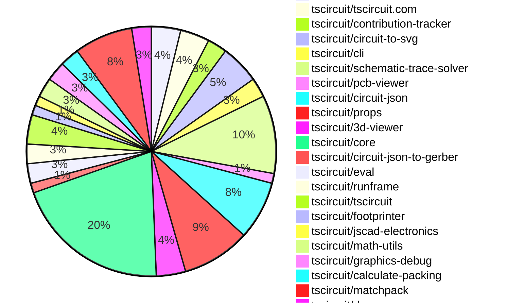
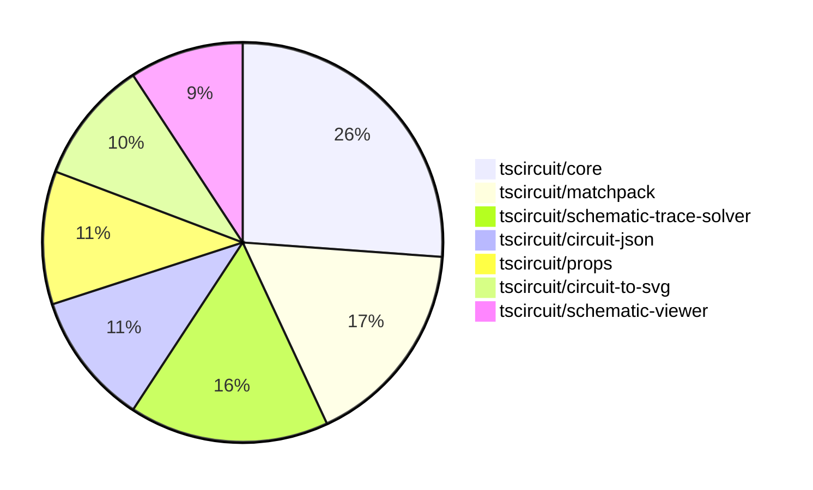

# contribution-tracker

[contributions.tscircuit.com](https://contributions.tscircuit.com) ・ [tscircuit.com](https://tscircuit.com) ・ [Contribution Overviews](./contribution-overviews/) ・ [Changelogs](./changelogs/)

Generates weekly contribution overviews for tscircuit contributors. Check out all
the [contribution overviews here](./contribution-overviews/)
You can find AI-generated monthly changelogs in the [changelogs directory](./changelogs/).

- All PRs in the tscircuit org are scanned/summarized via an LLM
- The LLM classifies each Diff/PR as into a set of attributes for scoring
- All the PRs, summaries, and classifications are organized into charts and tables for [the website](https://contributions.tscircuit.com)

> Want to run locally? See the [Development Section](#development)

The current week is shown below. There are 3 major sections:

- [Contributor Overview](#contributor-overview)
- [PRs by Repository](#prs-by-repository)
- [PRs by Contributor](#changes-by-contributor)

## Current Week

<!-- START_CURRENT_WEEK -->

# Contribution Overview 2025-09-03

## PRs by Repository



## Contributor Overview

| Contributor | 🐳 Major | 🐙 Minor | 🐌 Tiny | ⭐ | Score | Discussion Contributions |
|-------------|---------|---------|---------|-----|----------------|--------------------------|
| [seveibar](#seveibar) | 14 | 13 | 4 | 👑👑 | 88 | 0🔹 0🔶 0💎 |
| [ShiboSoftwareDev](#ShiboSoftwareDev) | 4 | 10 | 4 | ⭐⭐⭐ | 41.5 | 0🔹 0🔶 0💎 |
| [imrishabh18](#imrishabh18) | 3 | 1 | 9 | ⭐⭐ | 24 | 0🔹 0🔶 0💎 |
| [ArnavK-09](#ArnavK-09) | 4 | 0 | 2 | ⭐⭐ | 18 | 0🔹 0🔶 0💎 |
| [techmannih](#techmannih) | 0 | 2 | 2 | ⭐⭐ | 11 | 0🔹 0🔶 0💎 |
| [MustafaMulla29](#MustafaMulla29) | 1 | 2 | 0 | ⭐ | 8 | 0🔹 0🔶 0💎 |
| [Abse2001](#Abse2001) | 0 | 1 | 0 |  | 2 | 0🔹 0🔶 0💎 |
| [0hmX](#0hmX) | 0 | 1 | 0 |  | 2 | 0🔹 0🔶 0💎 |
| [AnasSarkiz](#AnasSarkiz) | 0 | 0 | 1 |  | 1 | 0🔹 0🔶 0💎 |
| [Ayushjhawar8](#Ayushjhawar8) | 0 | 0 | 1 |  | 1 | 0🔹 0🔶 0💎 |
| [nathaniel-brough](#nathaniel-brough) | 0 | 0 | 0 |  | 0 | 1🔹 0🔶 0💎 |

### Discussion Contribution Legend

- 🔹 Normal Comments: Basic participation with minimal effort
- 🔶 Great Informative Comments: Thoughtful participation that adds value
- 💎 Incredible Comments: Exceptional participation with high-quality content

## Review Table

[reviews-received-hover]: ## "Number of reviews received for PRs for this contributor"
[approvals-received-hover]: ## "Number of approvals received for PRs this contributor authored"
[rejections-received-hover]: ## "Number of rejections received for PRs this contributor authored"
[prs-opened-hover]: ## "Number of PRs opened by this contributor"
[issues-created-hover]: ## "Number of issues created by this contributor"
[bountied-issues-hover]: ## "Number of issues this contributor created with a bounty"
[bountied-issue-$-hover]: ## "Total bounty amount placed on issues authored by this contributor"

| Contributor | Reviews Received | Approvals Received | Rejections Received | Approvals | Rejections | PRs Opened | PRs Merged | Score | Issues Created | Bountied Issues | Bountied Issue $ |
|---|---|---|---|---|---|---|---|---|---|---|---|
| [ArnavK-09](#ArnavK-09) | 9 | 7 | 0 | 0 | 0 | 8 | 6 | 18 | 0 | 0 | 0 |
| [seveibar](#seveibar) | 6 | 0 | 0 | 41 | 7 | 37 | 31 | 88 | 0 | 0 | 0 |
| [JrmyDev](#JrmyDev) | 5 | 0 | 1 | 0 | 0 | 1 | 0 | 0 | 0 | 0 | 0 |
| [techmannih](#techmannih) | 28 | 5 | 3 | 1 | 0 | 8 | 4 | 11 | 0 | 0 | 0 |
| [baeoc](#baeoc) | 3 | 0 | 1 | 0 | 0 | 2 | 0 | 0 | 0 | 0 | 0 |
| [ShiboSoftwareDev](#ShiboSoftwareDev) | 25 | 19 | 0 | 2 | 0 | 21 | 19 | 41.5 | 0 | 0 | 0 |
| [imrishabh18](#imrishabh18) | 26 | 5 | 1 | 0 | 1 | 17 | 13 | 24 | 0 | 0 | 0 |
| [MustafaMulla29](#MustafaMulla29) | 12 | 3 | 2 | 0 | 0 | 4 | 3 | 8 | 0 | 0 | 0 |
| [aryel780](#aryel780) | 1 | 0 | 0 | 0 | 0 | 1 | 0 | 0 | 0 | 0 | 0 |
| [Abse2001](#Abse2001) | 2 | 1 | 0 | 0 | 0 | 2 | 1 | 2 | 0 | 0 | 0 |
| [AnasSarkiz](#AnasSarkiz) | 6 | 1 | 0 | 0 | 0 | 2 | 1 | 1 | 0 | 0 | 0 |
| [Ayushjhawar8](#Ayushjhawar8) | 3 | 2 | 0 | 0 | 0 | 2 | 1 | 1 | 0 | 0 | 0 |
| [tscircuitbot](#tscircuitbot) | 0 | 0 | 0 | 0 | 0 | 24 | 0 | 0 | 0 | 0 | 0 |
| [0hmX](#0hmX) | 1 | 1 | 0 | 0 | 0 | 2 | 1 | 2 | 0 | 0 | 0 |
| [nathaniel-brough](#nathaniel-brough) | 0 | 0 | 0 | 0 | 0 | 0 | 0 | 1 | 0 | 0 | 0 |

## Top 7 Repositories by Contribution Points



## Changes by Repository

### [tscircuit/schematic-viewer](https://github.com/tscircuit/schematic-viewer)

| PR # | Impact | Rating | Contributor | Description |
|------|--------|--------|-------------|-------------|
| [#124](https://github.com/tscircuit/schematic-viewer/pull/124) | 🐳 Major | ⭐⭐⭐ | ArnavK-09 | Adds localStorage persistence for the groups view in the schematic viewer, allowing users to disable group visibility and retain this setting across sessions. |
| [#120](https://github.com/tscircuit/schematic-viewer/pull/120) | 🐳 Major | ⭐⭐⭐ | ArnavK-09 | Adds mobile touch support for group viewing functionality in the schematic viewer, allowing users to interact with components using touch events. |
| [#119](https://github.com/tscircuit/schematic-viewer/pull/119) | 🐳 Major | ⭐⭐⭐ | ArnavK-09 | Adds mobile touch support for group viewing functionality in the ViewMenu component, allowing users to toggle group visibility with touch events. |

### [tscircuit/tscircuit.com](https://github.com/tscircuit/tscircuit.com)

| PR # | Impact | Rating | Contributor | Description |
|------|--------|--------|-------------|-------------|
| [#1631](https://github.com/tscircuit/tscircuit.com/pull/1631) | 🐳 Major | ⭐⭐⭐ | ArnavK-09 | Adds functionality to manually update AI description and usage instructions for a package by its owner. |

<details>
<summary>🐌 Tiny Contributions (2)</summary>

| PR # | Impact | Contributor | Description |
|------|--------|-------------|-------------|
| [#1628](https://github.com/tscircuit/tscircuit.com/pull/1628) | 🐌 Tiny | ArnavK-09 | Disables the order button for packages that have no available releases to prevent users from attempting to place orders that would fail. |
| [#1632](https://github.com/tscircuit/tscircuit.com/pull/1632) | 🐌 Tiny | imrishabh18 | Updates the dependencies for tscircuit and circuit-to-svg to version 0.0.618 and 0.0.182 respectively, enabling support for trace highlighting functionality. |

</details>

### [tscircuit/contribution-tracker](https://github.com/tscircuit/contribution-tracker)

| PR # | Impact | Rating | Contributor | Description |
|------|--------|--------|-------------|-------------|
| [#219](https://github.com/tscircuit/contribution-tracker/pull/219) | 🐳 Major | ⭐⭐⭐ | MustafaMulla29 | Updates the scoring mechanism for contribution ratings by adjusting the multipliers for core changes and major improvements to core data modeling. |

<details>
<summary>🐌 Tiny Contributions (1)</summary>

| PR # | Impact | Contributor | Description |
|------|--------|-------------|-------------|
| [#218](https://github.com/tscircuit/contribution-tracker/pull/218) | 🐌 Tiny | ArnavK-09 | Adds a maintainers list component to the application, displaying project maintainers with their roles and avatars. |

</details>

### [tscircuit/circuit-to-svg](https://github.com/tscircuit/circuit-to-svg)

| PR # | Impact | Rating | Contributor | Description |
|------|--------|--------|-------------|-------------|
| [#307](https://github.com/tscircuit/circuit-to-svg/pull/307) | 🐳 Major | ⭐⭐⭐ | ShiboSoftwareDev | Add support for rendering pcb_copper_pour elements in the PCB SVG output, enabling visualization of rectangular and polygonal copper pours on both top and bottom layers. |
| [#303](https://github.com/tscircuit/circuit-to-svg/pull/303) | 🐳 Major | ⭐⭐⭐ | imrishabh18 | Adds functionality to highlight all traces sharing the same connectivity key when hovered over in the schematic view. |
| [#302](https://github.com/tscircuit/circuit-to-svg/pull/302) | 🐳 Major | ⭐⭐⭐ | imrishabh18 | Fixes rendering issue where hops and arcs are buried under traces in schematic SVG output |

<details>
<summary>🐌 Tiny Contributions (1)</summary>

| PR # | Impact | Contributor | Description |
|------|--------|-------------|-------------|
| [#306](https://github.com/tscircuit/circuit-to-svg/pull/306) | 🐌 Tiny | ShiboSoftwareDev | Reduces the size of arrows for schematic ports in SVG rendering. |

</details>

### [tscircuit/cli](https://github.com/tscircuit/cli)

| PR # | Impact | Rating | Contributor | Description |
|------|--------|--------|-------------|-------------|
| [#319](https://github.com/tscircuit/cli/pull/319) | 🐳 Major | ⭐⭐⭐ | ShiboSoftwareDev | this was possible with the updated made to 3d-viewer and eval the resistor is a normal .obj file and the other is an OpenCASCADE obj file img width1654 height1324 altimage srchttps:github.comuser-attachmentsassets2f5faca8-d22e-4301-8119-7d019c8a4efb  claim https:github.comtscircuitcliissues316 closes https:github.comtscircuitcliissues316 |

<details>
<summary>🐌 Tiny Contributions (1)</summary>

| PR # | Impact | Contributor | Description |
|------|--------|-------------|-------------|
| [#318](https://github.com/tscircuit/cli/pull/318) | 🐌 Tiny | imrishabh18 | Updates the versions of the tscircuitrunframe and tscircuit dependencies in package.json |

</details>

### [tscircuit/schematic-trace-solver](https://github.com/tscircuit/schematic-trace-solver)

| PR # | Impact | Rating | Contributor | Description |
|------|--------|--------|-------------|-------------|
| [#44](https://github.com/tscircuit/schematic-trace-solver/pull/44) | 🐳 Major | ⭐⭐⭐ | ShiboSoftwareDev | Addresses a limitation in the TraceOverlapShiftSolver where it would fail to resolve overlaps on trace segments connected directly to pins by implementing a jog-based resolution strategy and increasing overlap detection tolerance. |
| [#39](https://github.com/tscircuit/schematic-trace-solver/pull/39) | 🐳 Major | ⭐⭐⭐ | ShiboSoftwareDev | Add logic to SchematicTraceSingleLineSolver to reject candidate elbow segments that would cross a chips center line on an axis where related pins on that chip face both directions (e.g., pins on both left and right faces - vertical center line restricted). |
| [#43](https://github.com/tscircuit/schematic-trace-solver/pull/43) | 🐳 Major | ⭐⭐⭐ | seveibar | Fixes net label placement failure by implementing a fallback mechanism when overlaps occur during placement. |
| [#35](https://github.com/tscircuit/schematic-trace-solver/pull/35) | 🐳 Major | ⭐⭐⭐ | seveibar | Add matcher functionality and example snapshots for testing the Schematic Trace Solver. |
| [#30](https://github.com/tscircuit/schematic-trace-solver/pull/30) | 🐙 Minor | ⭐⭐ | 0hmX | Add U-turn generation for elbow routing in schematic trace generation, allowing traces to double back cleanly when overshooting their destination. |

<details>
<summary>🐌 Tiny Contributions (3)</summary>

| PR # | Impact | Contributor | Description |
|------|--------|-------------|-------------|
| [#37](https://github.com/tscircuit/schematic-trace-solver/pull/37) | 🐌 Tiny | imrishabh18 | Adds new examples and corresponding tests for the schematic trace solver functionality. |
| [#48](https://github.com/tscircuit/schematic-trace-solver/pull/48) | 🐌 Tiny | seveibar | Reproduces an infinite loop issue in the schematic trace solver by providing a detailed input problem for debugging. |
| [#41](https://github.com/tscircuit/schematic-trace-solver/pull/41) | 🐌 Tiny | seveibar | Reproduces a bug related to net label placement failure in the schematic trace solver. |

</details>

### [tscircuit/pcb-viewer](https://github.com/tscircuit/pcb-viewer)

| PR # | Impact | Rating | Contributor | Description |
|------|--------|--------|-------------|-------------|
| [#367](https://github.com/tscircuit/pcb-viewer/pull/367) | 🐙 Minor | ⭐⭐ | ShiboSoftwareDev | Adds support for rendering pcb_copper_pour elements in the PCB viewer, including rect and polygon shapes with rotation. |

### [tscircuit/circuit-json](https://github.com/tscircuit/circuit-json)

| PR # | Impact | Rating | Contributor | Description |
|------|--------|--------|-------------|-------------|
| [#262](https://github.com/tscircuit/circuit-json/pull/262) | 🐳 Major | ⭐⭐⭐ | seveibar | Make schematic_trace.source_trace_id optional and add optional schematic_trace.subcircuit_connectivity_map_key, along with documentation and tests for these new fields. |
| [#266](https://github.com/tscircuit/circuit-json/pull/266) | 🐙 Minor | ⭐⭐ | ShiboSoftwareDev | Adds support for model_gltf_url in CAD component definitions, allowing users to specify GLTF model URLs for components. |
| [#265](https://github.com/tscircuit/circuit-json/pull/265) | 🐙 Minor | ⭐⭐ | ShiboSoftwareDev | Adds the pcb_copper_pour element to the Circuit JSON specification, enabling the definition of copper pour areas on a PCB for ground planes and net connections. |
| [#264](https://github.com/tscircuit/circuit-json/pull/264) | 🐙 Minor | ⭐⭐ | techmannih | Adds support for manually placed vias in the source domain, defining their properties and structure. |
| [#263](https://github.com/tscircuit/circuit-json/pull/263) | 🐙 Minor | ⭐⭐ | seveibar | Adds a boolean flag is_positive_voltage_source to the SourceNet schema and interface, updates documentation, and includes tests for parsing this new flag. |
| [#261](https://github.com/tscircuit/circuit-json/pull/261) | 🐙 Minor | ⭐⭐ | seveibar | Adds a new SourceSimplePinout schema without a pin name list, includes it in unions and exports, and tests its parsing and union inclusion. |

### [tscircuit/props](https://github.com/tscircuit/props)

| PR # | Impact | Rating | Contributor | Description |
|------|--------|--------|-------------|-------------|
| [#372](https://github.com/tscircuit/props/pull/372) | 🐙 Minor | ⭐⭐ | ShiboSoftwareDev | Adds support for glTF model URLs in the CAD model interface, allowing for the inclusion of 3D models in glTF format. |
| [#371](https://github.com/tscircuit/props/pull/371) | 🐙 Minor | ⭐⭐ | ShiboSoftwareDev | Adds support for rect, circle, and polygon shapes in CopperPour components, along with a connectsTo prop for net association, zod schemas for validation, and comprehensive unit tests. |
| [#370](https://github.com/tscircuit/props/pull/370) | 🐙 Minor | ⭐⭐ | seveibar | Add optional connections to VoltageSourceProps, enabling the specification of connections for voltage sources in the components props. |
| [#369](https://github.com/tscircuit/props/pull/369) | 🐙 Minor | ⭐⭐ | seveibar | Adds support for connections prop in the inductor  component, documents the connections, and includes tests for parsing the connections. |
| [#368](https://github.com/tscircuit/props/pull/368) | 🐙 Minor | ⭐⭐ | seveibar | Adds an optional borderRadius property for board components, updates documentation, and includes tests for borderRadius parsing. |
| [#367](https://github.com/tscircuit/props/pull/367) | 🐙 Minor | ⭐⭐ | seveibar | Add a new symbol  container element with associated properties and tests for parsing symbol properties. |
| [#366](https://github.com/tscircuit/props/pull/366) | 🐙 Minor | ⭐⭐ | seveibar | Add a pinout  component that reuses chip props, documents PinoutProps in README, exports new pinout schema, and adds basic parsing test. |

### [tscircuit/3d-viewer](https://github.com/tscircuit/3d-viewer)

| PR # | Impact | Rating | Contributor | Description |
|------|--------|--------|-------------|-------------|
| [#456](https://github.com/tscircuit/3d-viewer/pull/456) | 🐙 Minor | ⭐⭐ | ShiboSoftwareDev | Adds support for rendering pcb_copper_pour elements in the 3D viewer for both the Jscad and Manifold engines. |
| [#449](https://github.com/tscircuit/3d-viewer/pull/449) | 🐙 Minor | ⭐⭐ | techmannih | Fixes hole drilling on pads to ensure proper material removal during PCB fabrication. |

<details>
<summary>🐌 Tiny Contributions (1)</summary>

| PR # | Impact | Contributor | Description |
|------|--------|-------------|-------------|
| [#455](https://github.com/tscircuit/3d-viewer/pull/455) | 🐌 Tiny | ShiboSoftwareDev | This pull request enhances the OBJ file loader to support models exported from OpenCASCADE. These files often reference external .mtl files that are not included, causing the loader to fail when attempting to fetch them. Changes: Modified useGlobalObjLoader.ts to strip mtllib directives from the OBJ file content before parsing, preventing failed network requests. The loader now gracefully handles OBJ files that do not contain any embedded material definitions. Added storiesOpenCascadeObj.stories.tsx to test and demonstrate loading an OBJ file from OpenCASCADE. |

</details>

### [tscircuit/core](https://github.com/tscircuit/core)

| PR # | Impact | Rating | Contributor | Description |
|------|--------|--------|-------------|-------------|
| [#1279](https://github.com/tscircuit/core/pull/1279) | 🐳 Major | ⭐⭐⭐ | imrishabh18 | Adds subcircuit_connectivity_map_key to schematic_trace to enhance connectivity mapping in schematic traces. |
| [#1281](https://github.com/tscircuit/core/pull/1281) | 🐳 Major | ⭐⭐⭐ | seveibar | Fixes schematic trace configuration for better snapshot reliability and updates Matchpack to version 0.0.16 with new defaults and adjustments for trace distances. |
| [#1273](https://github.com/tscircuit/core/pull/1273) | 🐳 Major | ⭐⭐⭐ | seveibar | Updates the matchpack dependency to version 0.0.12 and the calculate-packing dependency to version 0.0.31, optimizing symmetry handling in the packing algorithm. |
| [#1288](https://github.com/tscircuit/core/pull/1288) | 🐙 Minor | ⭐⭐ | ShiboSoftwareDev | Adds support for specifying a GLTF model for a component via the gltfUrl property within the cadModel prop. |
| [#1284](https://github.com/tscircuit/core/pull/1284) | 🐙 Minor | ⭐⭐ | ShiboSoftwareDev | Adds the ability to display power direction arrows on schematic ports based on the pinAttributes property of a component, enhancing schematic clarity by visually indicating the intended direction of power flow for pins. |
| [#1278](https://github.com/tscircuit/core/pull/1278) | 🐙 Minor | ⭐⭐ | imrishabh18 | Adds a test for overlapping junctions and crossings in circuit schematics to ensure proper rendering and functionality. |
| [#1274](https://github.com/tscircuit/core/pull/1274) | 🐙 Minor | ⭐⭐ | seveibar | Adds a new pinout  component backed by simple_pinout source type and updates dependencies. |
| [#1271](https://github.com/tscircuit/core/pull/1271) | 🐙 Minor | ⭐⭐ | seveibar | Skip the rp2040 decoupling capacitors test and add a benchmark for the RP2040 decoupling capacitors, registering it on the benchmark page. |
| [#1268](https://github.com/tscircuit/core/pull/1268) | 🐙 Minor | ⭐⭐ | seveibar | Adds an example circuit for the RP2040 microcontroller that includes decoupling capacitors for power stability. |
| [#1287](https://github.com/tscircuit/core/pull/1287) | 🐙 Minor | ⭐⭐ | MustafaMulla29 | Prevents the creation of components with the same name in a subcircuit, ensuring unique naming and avoiding conflicts during rendering. |
| [#1267](https://github.com/tscircuit/core/pull/1267) | 🐙 Minor | ⭐⭐ | MustafaMulla29 | Automatically adjusts silkscreen reference designator text position for passive components when they overlap with other components. |
| [#1270](https://github.com/tscircuit/core/pull/1270) | 🐙 Minor | ⭐⭐ | Abse2001 | Fixes the rendering of manual PCB trace paths to support group rotation, ensuring accurate placement and orientation of traces in the PCB layout. |

<details>
<summary>🐌 Tiny Contributions (4)</summary>

| PR # | Impact | Contributor | Description |
|------|--------|-------------|-------------|
| [#1286](https://github.com/tscircuit/core/pull/1286) | 🐌 Tiny | ShiboSoftwareDev | Updates the versions of the tscircuitprops and circuit-json dependencies in package.json |
| [#1280](https://github.com/tscircuit/core/pull/1280) | 🐌 Tiny | imrishabh18 | Updates the circuit-to-svg dependency to version 0.0.182 in the package.json file. |
| [#1272](https://github.com/tscircuit/core/pull/1272) | 🐌 Tiny | seveibar | Add instructions for getting inputs to algorithms and improve matchpack debug output |
| [#1260](https://github.com/tscircuit/core/pull/1260) | 🐌 Tiny | AnasSarkiz | Reproduces a bug where the same net is not combined in a circuit layout involving a connector, resistor, and solder jumper. |

</details>

### [tscircuit/circuit-json-to-gerber](https://github.com/tscircuit/circuit-json-to-gerber)

| PR # | Impact | Rating | Contributor | Description |
|------|--------|--------|-------------|-------------|
| [#53](https://github.com/tscircuit/circuit-json-to-gerber/pull/53) | 🐙 Minor | ⭐⭐ | ShiboSoftwareDev | Implements the pcb_copper_pour element for Gerber generation, handling rectangular and polygonal copper pours using Gerber region commands (G36G37) and emitting the layer polarity command in headers to ensure filled regions are rendered correctly. |

### [tscircuit/eval](https://github.com/tscircuit/eval)

| PR # | Impact | Rating | Contributor | Description |
|------|--------|--------|-------------|-------------|
| [#961](https://github.com/tscircuit/eval/pull/961) | 🐙 Minor | ⭐⭐ | ShiboSoftwareDev | Adds support for importing local .obj files as blob URLs for CAD components in designs. |

<details>
<summary>🐌 Tiny Contributions (1)</summary>

| PR # | Impact | Contributor | Description |
|------|--------|-------------|-------------|
| [#960](https://github.com/tscircuit/eval/pull/960) | 🐌 Tiny | imrishabh18 | Updates the core dependencies in the package.json file to newer versions. |

</details>

### [tscircuit/runframe](https://github.com/tscircuit/runframe)


<details>
<summary>🐌 Tiny Contributions (2)</summary>

| PR # | Impact | Contributor | Description |
|------|--------|-------------|-------------|
| [#1081](https://github.com/tscircuit/runframe/pull/1081) | 🐌 Tiny | ShiboSoftwareDev | Updates the 3D viewer dependency to version 0.0.365 in the package.json file. |
| [#1076](https://github.com/tscircuit/runframe/pull/1076) | 🐌 Tiny | imrishabh18 | Updates the circuit-to-svg and tscircuit dependencies to their latest versions in package.json |

</details>

### [tscircuit/tscircuit](https://github.com/tscircuit/tscircuit)


<details>
<summary>🐌 Tiny Contributions (3)</summary>

| PR # | Impact | Contributor | Description |
|------|--------|-------------|-------------|
| [#756](https://github.com/tscircuit/tscircuit/pull/756) | 🐌 Tiny | imrishabh18 | Updates the version of the tscircuitcore and tscircuitprops dependencies in package.json |
| [#755](https://github.com/tscircuit/tscircuit/pull/755) | 🐌 Tiny | imrishabh18 | Updates the circuit-to-svg dependency version from 0.0.174 to 0.0.182 in package.json |
| [#754](https://github.com/tscircuit/tscircuit/pull/754) | 🐌 Tiny | imrishabh18 | Updates the circuit-json dependency version from 0.0.236 to 0.0.238 in package.json |

</details>

### [tscircuit/footprinter](https://github.com/tscircuit/footprinter)


<details>
<summary>🐌 Tiny Contributions (1)</summary>

| PR # | Impact | Contributor | Description |
|------|--------|-------------|-------------|
| [#366](https://github.com/tscircuit/footprinter/pull/366) | 🐌 Tiny | techmannih | Removes the outer plating around stampboard holes to ensure proper fit and functionality of components. |

</details>

### [tscircuit/jscad-electronics](https://github.com/tscircuit/jscad-electronics)


<details>
<summary>🐌 Tiny Contributions (1)</summary>

| PR # | Impact | Contributor | Description |
|------|--------|-------------|-------------|
| [#119](https://github.com/tscircuit/jscad-electronics/pull/119) | 🐌 Tiny | techmannih | Updates the tscircuitfootprinter dependency to version 0.0.234 in the package.json file. |

</details>

### [tscircuit/math-utils](https://github.com/tscircuit/math-utils)

| PR # | Impact | Rating | Contributor | Description |
|------|--------|--------|-------------|-------------|
| [#18](https://github.com/tscircuit/math-utils/pull/18) | 🐳 Major | ⭐⭐⭐ | seveibar | Adds utilities to compute overlapping area and minimum distance between bounding rectangles, along with documentation updates. |
| [#17](https://github.com/tscircuit/math-utils/pull/17) | 🐳 Major | ⭐⭐⭐ | seveibar | Adds a function to determine if two bounding rectangles overlap, along with corresponding tests. |

### [tscircuit/graphics-debug](https://github.com/tscircuit/graphics-debug)

| PR # | Impact | Rating | Contributor | Description |
|------|--------|--------|-------------|-------------|
| [#73](https://github.com/tscircuit/graphics-debug/pull/73) | 🐳 Major | ⭐⭐⭐ | seveibar | Sorts rectangles by area before rendering so smaller ones appear on top when overlapping, and adds utility and tests for sorting rectangles by area. |
| [#74](https://github.com/tscircuit/graphics-debug/pull/74) | 🐙 Minor | ⭐⭐ | seveibar | Fixes the dimension overlay to ensure the keydown event for the d hotkey is active immediately without requiring a mouse enterleave cycle. |

### [tscircuit/calculate-packing](https://github.com/tscircuit/calculate-packing)

| PR # | Impact | Rating | Contributor | Description |
|------|--------|--------|-------------|-------------|
| [#30](https://github.com/tscircuit/calculate-packing/pull/30) | 🐳 Major | ⭐⭐⭐ | seveibar | This pull request introduces a new packing strategy called minimum_closest_sum_squared_distance to the OutlineSegmentCandidatePointSolver and SingleComponentPackSolver classes. It implements a two-phase optimization approach to improve the packing of components in a circuit design, addressing issues with misalignment in previous strategies. |
| [#31](https://github.com/tscircuit/calculate-packing/pull/31) | 🐙 Minor | ⭐⭐ | seveibar | Fixes the passing of pack placement strategies in the OutlineSegmentCandidatePointSolver and SingleComponentPackSolver classes. |

### [tscircuit/matchpack](https://github.com/tscircuit/matchpack)

| PR # | Impact | Rating | Contributor | Description |
|------|--------|--------|-------------|-------------|
| [#24](https://github.com/tscircuit/matchpack/pull/24) | 🐳 Major | ⭐⭐⭐ | seveibar | Adds voltage source metadata to net definitions and modifies decoupling partition logic to require at least two decoupling capacitors connected to a positive voltage source and ground. |
| [#23](https://github.com/tscircuit/matchpack/pull/23) | 🐳 Major | ⭐⭐⭐ | seveibar | Optimizes the packing algorithm to prioritize direct connections between pins when handling inner partitions, enhancing the efficiency of the layout process. |
| [#19](https://github.com/tscircuit/matchpack/pull/19) | 🐳 Major | ⭐⭐⭐ | seveibar | Adds functionality to separate decoupling capacitors into their own partitions while partitioning remaining chips based on strong pin connections. |
| [#18](https://github.com/tscircuit/matchpack/pull/18) | 🐳 Major | ⭐⭐⭐ | seveibar | Adds a new solver to identify decoupling capacitor groups based on specific criteria, including pin configuration and connections to main chips, along with caching for input problem visualization. |
| [#17](https://github.com/tscircuit/matchpack/pull/17) | 🐳 Major | ⭐⭐⭐ | seveibar | Switches the packing placement strategy to minimum_closest_sum_squared_distance for improved packing symmetry in circuit layouts. |
| [#16](https://github.com/tscircuit/matchpack/pull/16) | 🐙 Minor | ⭐⭐ | seveibar | Adds functionality to ensure that the chip body pad fully envelopes the pads for inner partition packing, improving layout accuracy. |

### [tscircuit/docs](https://github.com/tscircuit/docs)


<details>
<summary>🐌 Tiny Contributions (2)</summary>

| PR # | Impact | Contributor | Description |
|------|--------|-------------|-------------|
| [#127](https://github.com/tscircuit/docs/pull/127) | 🐌 Tiny | seveibar | Add guide on using JavaScript expressions to derive component values, including examples for voltage dividers and LC resonant circuits, and fixes to examples for correct component representation. |
| [#129](https://github.com/tscircuit/docs/pull/129) | 🐌 Tiny | Ayushjhawar8 | Fixes layout issues by moving background colors from img tags to parent containers and adjusting object-fit properties for PCB, schematic, and 3D previews in both split-view and single-view layouts. |

</details>

## Changes by Contributor

### [ArnavK-09](https://github.com/ArnavK-09)

| PRs # | Impact | Rating | Description |
|------|--------|--------|-------------|
| [#124](https://github.com/tscircuit/schematic-viewer/pull/124) | 🐳 Major | ⭐⭐⭐ | Adds localStorage persistence for the groups view in the schematic viewer, allowing users to disable group visibility and retain this setting across sessions. |
| [#120](https://github.com/tscircuit/schematic-viewer/pull/120) | 🐳 Major | ⭐⭐⭐ | Adds mobile touch support for group viewing functionality in the schematic viewer, allowing users to interact with components using touch events. |
| [#119](https://github.com/tscircuit/schematic-viewer/pull/119) | 🐳 Major | ⭐⭐⭐ | Adds mobile touch support for group viewing functionality in the ViewMenu component, allowing users to toggle group visibility with touch events. |
| [#1631](https://github.com/tscircuit/tscircuit.com/pull/1631) | 🐳 Major | ⭐⭐⭐ | Adds functionality to manually update AI description and usage instructions for a package by its owner. |

<details>
<summary>🐌 Tiny Contributions (2)</summary>

| PR # | Impact | Description |
|------|--------|-------------|
| [#218](https://github.com/tscircuit/contribution-tracker/pull/218) | 🐌 Tiny | Adds a maintainers list component to the application, displaying project maintainers with their roles and avatars. |
| [#1628](https://github.com/tscircuit/tscircuit.com/pull/1628) | 🐌 Tiny | Disables the order button for packages that have no available releases to prevent users from attempting to place orders that would fail. |

</details>

### [ShiboSoftwareDev](https://github.com/ShiboSoftwareDev)

| PRs # | Impact | Rating | Description |
|------|--------|--------|-------------|
| [#307](https://github.com/tscircuit/circuit-to-svg/pull/307) | 🐳 Major | ⭐⭐⭐ | Add support for rendering pcb_copper_pour elements in the PCB SVG output, enabling visualization of rectangular and polygonal copper pours on both top and bottom layers. |
| [#319](https://github.com/tscircuit/cli/pull/319) | 🐳 Major | ⭐⭐⭐ | this was possible with the updated made to 3d-viewer and eval the resistor is a normal .obj file and the other is an OpenCASCADE obj file img width1654 height1324 altimage srchttps:github.comuser-attachmentsassets2f5faca8-d22e-4301-8119-7d019c8a4efb  claim https:github.comtscircuitcliissues316 closes https:github.comtscircuitcliissues316 |
| [#44](https://github.com/tscircuit/schematic-trace-solver/pull/44) | 🐳 Major | ⭐⭐⭐ | Addresses a limitation in the TraceOverlapShiftSolver where it would fail to resolve overlaps on trace segments connected directly to pins by implementing a jog-based resolution strategy and increasing overlap detection tolerance. |
| [#39](https://github.com/tscircuit/schematic-trace-solver/pull/39) | 🐳 Major | ⭐⭐⭐ | Add logic to SchematicTraceSingleLineSolver to reject candidate elbow segments that would cross a chips center line on an axis where related pins on that chip face both directions (e.g., pins on both left and right faces - vertical center line restricted). |
| [#367](https://github.com/tscircuit/pcb-viewer/pull/367) | 🐙 Minor | ⭐⭐ | Adds support for rendering pcb_copper_pour elements in the PCB viewer, including rect and polygon shapes with rotation. |
| [#266](https://github.com/tscircuit/circuit-json/pull/266) | 🐙 Minor | ⭐⭐ | Adds support for model_gltf_url in CAD component definitions, allowing users to specify GLTF model URLs for components. |
| [#265](https://github.com/tscircuit/circuit-json/pull/265) | 🐙 Minor | ⭐⭐ | Adds the pcb_copper_pour element to the Circuit JSON specification, enabling the definition of copper pour areas on a PCB for ground planes and net connections. |
| [#372](https://github.com/tscircuit/props/pull/372) | 🐙 Minor | ⭐⭐ | Adds support for glTF model URLs in the CAD model interface, allowing for the inclusion of 3D models in glTF format. |
| [#371](https://github.com/tscircuit/props/pull/371) | 🐙 Minor | ⭐⭐ | Adds support for rect, circle, and polygon shapes in CopperPour components, along with a connectsTo prop for net association, zod schemas for validation, and comprehensive unit tests. |
| [#456](https://github.com/tscircuit/3d-viewer/pull/456) | 🐙 Minor | ⭐⭐ | Adds support for rendering pcb_copper_pour elements in the 3D viewer for both the Jscad and Manifold engines. |
| [#1288](https://github.com/tscircuit/core/pull/1288) | 🐙 Minor | ⭐⭐ | Adds support for specifying a GLTF model for a component via the gltfUrl property within the cadModel prop. |
| [#1284](https://github.com/tscircuit/core/pull/1284) | 🐙 Minor | ⭐⭐ | Adds the ability to display power direction arrows on schematic ports based on the pinAttributes property of a component, enhancing schematic clarity by visually indicating the intended direction of power flow for pins. |
| [#53](https://github.com/tscircuit/circuit-json-to-gerber/pull/53) | 🐙 Minor | ⭐⭐ | Implements the pcb_copper_pour element for Gerber generation, handling rectangular and polygonal copper pours using Gerber region commands (G36G37) and emitting the layer polarity command in headers to ensure filled regions are rendered correctly. |
| [#961](https://github.com/tscircuit/eval/pull/961) | 🐙 Minor | ⭐⭐ | Adds support for importing local .obj files as blob URLs for CAD components in designs. |

<details>
<summary>🐌 Tiny Contributions (4)</summary>

| PR # | Impact | Description |
|------|--------|-------------|
| [#455](https://github.com/tscircuit/3d-viewer/pull/455) | 🐌 Tiny | This pull request enhances the OBJ file loader to support models exported from OpenCASCADE. These files often reference external .mtl files that are not included, causing the loader to fail when attempting to fetch them. Changes: Modified useGlobalObjLoader.ts to strip mtllib directives from the OBJ file content before parsing, preventing failed network requests. The loader now gracefully handles OBJ files that do not contain any embedded material definitions. Added storiesOpenCascadeObj.stories.tsx to test and demonstrate loading an OBJ file from OpenCASCADE. |
| [#1286](https://github.com/tscircuit/core/pull/1286) | 🐌 Tiny | Updates the versions of the tscircuitprops and circuit-json dependencies in package.json |
| [#306](https://github.com/tscircuit/circuit-to-svg/pull/306) | 🐌 Tiny | Reduces the size of arrows for schematic ports in SVG rendering. |
| [#1081](https://github.com/tscircuit/runframe/pull/1081) | 🐌 Tiny | Updates the 3D viewer dependency to version 0.0.365 in the package.json file. |

</details>

### [imrishabh18](https://github.com/imrishabh18)

| PRs # | Impact | Rating | Description |
|------|--------|--------|-------------|
| [#1279](https://github.com/tscircuit/core/pull/1279) | 🐳 Major | ⭐⭐⭐ | Adds subcircuit_connectivity_map_key to schematic_trace to enhance connectivity mapping in schematic traces. |
| [#303](https://github.com/tscircuit/circuit-to-svg/pull/303) | 🐳 Major | ⭐⭐⭐ | Adds functionality to highlight all traces sharing the same connectivity key when hovered over in the schematic view. |
| [#302](https://github.com/tscircuit/circuit-to-svg/pull/302) | 🐳 Major | ⭐⭐⭐ | Fixes rendering issue where hops and arcs are buried under traces in schematic SVG output |
| [#1278](https://github.com/tscircuit/core/pull/1278) | 🐙 Minor | ⭐⭐ | Adds a test for overlapping junctions and crossings in circuit schematics to ensure proper rendering and functionality. |

<details>
<summary>🐌 Tiny Contributions (9)</summary>

| PR # | Impact | Description |
|------|--------|-------------|
| [#756](https://github.com/tscircuit/tscircuit/pull/756) | 🐌 Tiny | Updates the version of the tscircuitcore and tscircuitprops dependencies in package.json |
| [#755](https://github.com/tscircuit/tscircuit/pull/755) | 🐌 Tiny | Updates the circuit-to-svg dependency version from 0.0.174 to 0.0.182 in package.json |
| [#754](https://github.com/tscircuit/tscircuit/pull/754) | 🐌 Tiny | Updates the circuit-json dependency version from 0.0.236 to 0.0.238 in package.json |
| [#1280](https://github.com/tscircuit/core/pull/1280) | 🐌 Tiny | Updates the circuit-to-svg dependency to version 0.0.182 in the package.json file. |
| [#1632](https://github.com/tscircuit/tscircuit.com/pull/1632) | 🐌 Tiny | Updates the dependencies for tscircuit and circuit-to-svg to version 0.0.618 and 0.0.182 respectively, enabling support for trace highlighting functionality. |
| [#960](https://github.com/tscircuit/eval/pull/960) | 🐌 Tiny | Updates the core dependencies in the package.json file to newer versions. |
| [#1076](https://github.com/tscircuit/runframe/pull/1076) | 🐌 Tiny | Updates the circuit-to-svg and tscircuit dependencies to their latest versions in package.json |
| [#318](https://github.com/tscircuit/cli/pull/318) | 🐌 Tiny | Updates the versions of the tscircuitrunframe and tscircuit dependencies in package.json |
| [#37](https://github.com/tscircuit/schematic-trace-solver/pull/37) | 🐌 Tiny | Adds new examples and corresponding tests for the schematic trace solver functionality. |

</details>

### [techmannih](https://github.com/techmannih)

| PRs # | Impact | Rating | Description |
|------|--------|--------|-------------|
| [#264](https://github.com/tscircuit/circuit-json/pull/264) | 🐙 Minor | ⭐⭐ | Adds support for manually placed vias in the source domain, defining their properties and structure. |
| [#449](https://github.com/tscircuit/3d-viewer/pull/449) | 🐙 Minor | ⭐⭐ | Fixes hole drilling on pads to ensure proper material removal during PCB fabrication. |

<details>
<summary>🐌 Tiny Contributions (2)</summary>

| PR # | Impact | Description |
|------|--------|-------------|
| [#366](https://github.com/tscircuit/footprinter/pull/366) | 🐌 Tiny | Removes the outer plating around stampboard holes to ensure proper fit and functionality of components. |
| [#119](https://github.com/tscircuit/jscad-electronics/pull/119) | 🐌 Tiny | Updates the tscircuitfootprinter dependency to version 0.0.234 in the package.json file. |

</details>

### [seveibar](https://github.com/seveibar)

| PRs # | Impact | Rating | Description |
|------|--------|--------|-------------|
| [#262](https://github.com/tscircuit/circuit-json/pull/262) | 🐳 Major | ⭐⭐⭐ | Make schematic_trace.source_trace_id optional and add optional schematic_trace.subcircuit_connectivity_map_key, along with documentation and tests for these new fields. |
| [#1281](https://github.com/tscircuit/core/pull/1281) | 🐳 Major | ⭐⭐⭐ | Fixes schematic trace configuration for better snapshot reliability and updates Matchpack to version 0.0.16 with new defaults and adjustments for trace distances. |
| [#1273](https://github.com/tscircuit/core/pull/1273) | 🐳 Major | ⭐⭐⭐ | Updates the matchpack dependency to version 0.0.12 and the calculate-packing dependency to version 0.0.31, optimizing symmetry handling in the packing algorithm. |
| [#18](https://github.com/tscircuit/math-utils/pull/18) | 🐳 Major | ⭐⭐⭐ | Adds utilities to compute overlapping area and minimum distance between bounding rectangles, along with documentation updates. |
| [#17](https://github.com/tscircuit/math-utils/pull/17) | 🐳 Major | ⭐⭐⭐ | Adds a function to determine if two bounding rectangles overlap, along with corresponding tests. |
| [#73](https://github.com/tscircuit/graphics-debug/pull/73) | 🐳 Major | ⭐⭐⭐ | Sorts rectangles by area before rendering so smaller ones appear on top when overlapping, and adds utility and tests for sorting rectangles by area. |
| [#30](https://github.com/tscircuit/calculate-packing/pull/30) | 🐳 Major | ⭐⭐⭐ | This pull request introduces a new packing strategy called minimum_closest_sum_squared_distance to the OutlineSegmentCandidatePointSolver and SingleComponentPackSolver classes. It implements a two-phase optimization approach to improve the packing of components in a circuit design, addressing issues with misalignment in previous strategies. |
| [#24](https://github.com/tscircuit/matchpack/pull/24) | 🐳 Major | ⭐⭐⭐ | Adds voltage source metadata to net definitions and modifies decoupling partition logic to require at least two decoupling capacitors connected to a positive voltage source and ground. |
| [#23](https://github.com/tscircuit/matchpack/pull/23) | 🐳 Major | ⭐⭐⭐ | Optimizes the packing algorithm to prioritize direct connections between pins when handling inner partitions, enhancing the efficiency of the layout process. |
| [#19](https://github.com/tscircuit/matchpack/pull/19) | 🐳 Major | ⭐⭐⭐ | Adds functionality to separate decoupling capacitors into their own partitions while partitioning remaining chips based on strong pin connections. |
| [#18](https://github.com/tscircuit/matchpack/pull/18) | 🐳 Major | ⭐⭐⭐ | Adds a new solver to identify decoupling capacitor groups based on specific criteria, including pin configuration and connections to main chips, along with caching for input problem visualization. |
| [#17](https://github.com/tscircuit/matchpack/pull/17) | 🐳 Major | ⭐⭐⭐ | Switches the packing placement strategy to minimum_closest_sum_squared_distance for improved packing symmetry in circuit layouts. |
| [#43](https://github.com/tscircuit/schematic-trace-solver/pull/43) | 🐳 Major | ⭐⭐⭐ | Fixes net label placement failure by implementing a fallback mechanism when overlaps occur during placement. |
| [#35](https://github.com/tscircuit/schematic-trace-solver/pull/35) | 🐳 Major | ⭐⭐⭐ | Add matcher functionality and example snapshots for testing the Schematic Trace Solver. |
| [#263](https://github.com/tscircuit/circuit-json/pull/263) | 🐙 Minor | ⭐⭐ | Adds a boolean flag is_positive_voltage_source to the SourceNet schema and interface, updates documentation, and includes tests for parsing this new flag. |
| [#261](https://github.com/tscircuit/circuit-json/pull/261) | 🐙 Minor | ⭐⭐ | Adds a new SourceSimplePinout schema without a pin name list, includes it in unions and exports, and tests its parsing and union inclusion. |
| [#370](https://github.com/tscircuit/props/pull/370) | 🐙 Minor | ⭐⭐ | Add optional connections to VoltageSourceProps, enabling the specification of connections for voltage sources in the components props. |
| [#369](https://github.com/tscircuit/props/pull/369) | 🐙 Minor | ⭐⭐ | Adds support for connections prop in the inductor  component, documents the connections, and includes tests for parsing the connections. |
| [#368](https://github.com/tscircuit/props/pull/368) | 🐙 Minor | ⭐⭐ | Adds an optional borderRadius property for board components, updates documentation, and includes tests for borderRadius parsing. |
| [#367](https://github.com/tscircuit/props/pull/367) | 🐙 Minor | ⭐⭐ | Add a new symbol  container element with associated properties and tests for parsing symbol properties. |
| [#366](https://github.com/tscircuit/props/pull/366) | 🐙 Minor | ⭐⭐ | Add a pinout  component that reuses chip props, documents PinoutProps in README, exports new pinout schema, and adds basic parsing test. |
| [#1274](https://github.com/tscircuit/core/pull/1274) | 🐙 Minor | ⭐⭐ | Adds a new pinout  component backed by simple_pinout source type and updates dependencies. |
| [#1271](https://github.com/tscircuit/core/pull/1271) | 🐙 Minor | ⭐⭐ | Skip the rp2040 decoupling capacitors test and add a benchmark for the RP2040 decoupling capacitors, registering it on the benchmark page. |
| [#1268](https://github.com/tscircuit/core/pull/1268) | 🐙 Minor | ⭐⭐ | Adds an example circuit for the RP2040 microcontroller that includes decoupling capacitors for power stability. |
| [#74](https://github.com/tscircuit/graphics-debug/pull/74) | 🐙 Minor | ⭐⭐ | Fixes the dimension overlay to ensure the keydown event for the d hotkey is active immediately without requiring a mouse enterleave cycle. |
| [#31](https://github.com/tscircuit/calculate-packing/pull/31) | 🐙 Minor | ⭐⭐ | Fixes the passing of pack placement strategies in the OutlineSegmentCandidatePointSolver and SingleComponentPackSolver classes. |
| [#16](https://github.com/tscircuit/matchpack/pull/16) | 🐙 Minor | ⭐⭐ | Adds functionality to ensure that the chip body pad fully envelopes the pads for inner partition packing, improving layout accuracy. |

<details>
<summary>🐌 Tiny Contributions (4)</summary>

| PR # | Impact | Description |
|------|--------|-------------|
| [#1272](https://github.com/tscircuit/core/pull/1272) | 🐌 Tiny | Add instructions for getting inputs to algorithms and improve matchpack debug output |
| [#127](https://github.com/tscircuit/docs/pull/127) | 🐌 Tiny | Add guide on using JavaScript expressions to derive component values, including examples for voltage dividers and LC resonant circuits, and fixes to examples for correct component representation. |
| [#48](https://github.com/tscircuit/schematic-trace-solver/pull/48) | 🐌 Tiny | Reproduces an infinite loop issue in the schematic trace solver by providing a detailed input problem for debugging. |
| [#41](https://github.com/tscircuit/schematic-trace-solver/pull/41) | 🐌 Tiny | Reproduces a bug related to net label placement failure in the schematic trace solver. |

</details>

### [MustafaMulla29](https://github.com/MustafaMulla29)

| PRs # | Impact | Rating | Description |
|------|--------|--------|-------------|
| [#219](https://github.com/tscircuit/contribution-tracker/pull/219) | 🐳 Major | ⭐⭐⭐ | Updates the scoring mechanism for contribution ratings by adjusting the multipliers for core changes and major improvements to core data modeling. |
| [#1287](https://github.com/tscircuit/core/pull/1287) | 🐙 Minor | ⭐⭐ | Prevents the creation of components with the same name in a subcircuit, ensuring unique naming and avoiding conflicts during rendering. |
| [#1267](https://github.com/tscircuit/core/pull/1267) | 🐙 Minor | ⭐⭐ | Automatically adjusts silkscreen reference designator text position for passive components when they overlap with other components. |

### [Abse2001](https://github.com/Abse2001)

| PRs # | Impact | Rating | Description |
|------|--------|--------|-------------|
| [#1270](https://github.com/tscircuit/core/pull/1270) | 🐙 Minor | ⭐⭐ | Fixes the rendering of manual PCB trace paths to support group rotation, ensuring accurate placement and orientation of traces in the PCB layout. |

### [AnasSarkiz](https://github.com/AnasSarkiz)


<details>
<summary>🐌 Tiny Contributions (1)</summary>

| PR # | Impact | Description |
|------|--------|-------------|
| [#1260](https://github.com/tscircuit/core/pull/1260) | 🐌 Tiny | Reproduces a bug where the same net is not combined in a circuit layout involving a connector, resistor, and solder jumper. |

</details>

### [Ayushjhawar8](https://github.com/Ayushjhawar8)


<details>
<summary>🐌 Tiny Contributions (1)</summary>

| PR # | Impact | Description |
|------|--------|-------------|
| [#129](https://github.com/tscircuit/docs/pull/129) | 🐌 Tiny | Fixes layout issues by moving background colors from img tags to parent containers and adjusting object-fit properties for PCB, schematic, and 3D previews in both split-view and single-view layouts. |

</details>

### [0hmX](https://github.com/0hmX)

| PRs # | Impact | Rating | Description |
|------|--------|--------|-------------|
| [#30](https://github.com/tscircuit/schematic-trace-solver/pull/30) | 🐙 Minor | ⭐⭐ | Add U-turn generation for elbow routing in schematic trace generation, allowing traces to double back cleanly when overshooting their destination. |

## Repository Owners

| Repository | Codeowners |
|------------|------------|
| [builder](https://github.com/tscircuit/builder/blob/main/.github/CODEOWNERS) | [seveibar](https://github.com/seveibar)
| [pcb-viewer](https://github.com/tscircuit/pcb-viewer/blob/main/.github/CODEOWNERS) | [seveibar](https://github.com/seveibar), [ShiboSoftwareDev](https://github.com/ShiboSoftwareDev)
| [footprints-old](https://github.com/tscircuit/footprints-old/blob/main/.github/CODEOWNERS) | [seveibar](https://github.com/seveibar)
| [footprinter](https://github.com/tscircuit/footprinter/blob/main/.github/CODEOWNERS) | [seveibar](https://github.com/seveibar), [techmannih](https://github.com/techmannih)
| [3d-viewer](https://github.com/tscircuit/3d-viewer/blob/main/.github/CODEOWNERS) | [ShiboSoftwareDev](https://github.com/ShiboSoftwareDev)
| [winterspec](https://github.com/tscircuit/winterspec/blob/main/.github/CODEOWNERS) | [seveibar](https://github.com/seveibar), [ShiboSoftwareDev](https://github.com/ShiboSoftwareDev)
| [jscad-electronics](https://github.com/tscircuit/jscad-electronics/blob/main/.github/CODEOWNERS) | [seveibar](https://github.com/seveibar), [abhijitxy](https://github.com/abhijitxy), [anas-sarkez](https://github.com/anas-sarkez)
| [circuit-to-svg](https://github.com/tscircuit/circuit-to-svg/blob/main/.github/CODEOWNERS) | [imrishabh18](https://github.com/imrishabh18)
| [schematic-symbols](https://github.com/tscircuit/schematic-symbols/blob/main/.github/CODEOWNERS) | [seveibar](https://github.com/seveibar), [imrishabh18](https://github.com/imrishabh18), [techmannih](https://github.com/techmannih)
| [circuit-json-to-gerber](https://github.com/tscircuit/circuit-json-to-gerber/blob/main/.github/CODEOWNERS) | [seveibar](https://github.com/seveibar), [ShiboSoftwareDev](https://github.com/ShiboSoftwareDev)
| [tscircuit.com](https://github.com/tscircuit/tscircuit.com/blob/main/.github/CODEOWNERS) | [seveibar](https://github.com/seveibar), [imrishabh18](https://github.com/imrishabh18)
| [cli](https://github.com/tscircuit/cli/blob/main/.github/CODEOWNERS) | [seveibar](https://github.com/seveibar), [imrishabh18](https://github.com/imrishabh18), [ArnavK-09](https://github.com/ArnavK-09)
| [issue-roulette](https://github.com/tscircuit/issue-roulette/blob/main/.github/CODEOWNERS) | [Anshgrover23](https://github.com/Anshgrover23)
| [sparkfun-boards](https://github.com/tscircuit/sparkfun-boards/blob/main/.github/CODEOWNERS) | [ShiboSoftwareDev](https://github.com/ShiboSoftwareDev), [Abse2001](https://github.com/Abse2001), [MustafaMulla29](https://github.com/MustafaMulla29), [Anshgrover23](https://github.com/Anshgrover23), [techmannih](https://github.com/techmannih)
| [schematic-corpus](https://github.com/tscircuit/schematic-corpus/blob/main/.github/CODEOWNERS) | [Abse2001](https://github.com/Abse2001)

## Repositories by Owner

| User | Repo |
|------|------|
| [seveibar](https://github.com/seveibar) | [builder](https://github.com/tscircuit/builder/blob/main/.github/CODEOWNERS) |
|  | [pcb-viewer](https://github.com/tscircuit/pcb-viewer/blob/main/.github/CODEOWNERS) |
|  | [footprints-old](https://github.com/tscircuit/footprints-old/blob/main/.github/CODEOWNERS) |
|  | [footprinter](https://github.com/tscircuit/footprinter/blob/main/.github/CODEOWNERS) |
|  | [winterspec](https://github.com/tscircuit/winterspec/blob/main/.github/CODEOWNERS) |
|  | [jscad-electronics](https://github.com/tscircuit/jscad-electronics/blob/main/.github/CODEOWNERS) |
|  | [schematic-symbols](https://github.com/tscircuit/schematic-symbols/blob/main/.github/CODEOWNERS) |
|  | [circuit-json-to-gerber](https://github.com/tscircuit/circuit-json-to-gerber/blob/main/.github/CODEOWNERS) |
|  | [tscircuit.com](https://github.com/tscircuit/tscircuit.com/blob/main/.github/CODEOWNERS) |
|  | [cli](https://github.com/tscircuit/cli/blob/main/.github/CODEOWNERS) |
| [ShiboSoftwareDev](https://github.com/ShiboSoftwareDev) | [pcb-viewer](https://github.com/tscircuit/pcb-viewer/blob/main/.github/CODEOWNERS) |
|  | [3d-viewer](https://github.com/tscircuit/3d-viewer/blob/main/.github/CODEOWNERS) |
|  | [winterspec](https://github.com/tscircuit/winterspec/blob/main/.github/CODEOWNERS) |
|  | [circuit-json-to-gerber](https://github.com/tscircuit/circuit-json-to-gerber/blob/main/.github/CODEOWNERS) |
|  | [sparkfun-boards](https://github.com/tscircuit/sparkfun-boards/blob/main/.github/CODEOWNERS) |
| [techmannih](https://github.com/techmannih) | [footprinter](https://github.com/tscircuit/footprinter/blob/main/.github/CODEOWNERS) |
|  | [schematic-symbols](https://github.com/tscircuit/schematic-symbols/blob/main/.github/CODEOWNERS) |
|  | [sparkfun-boards](https://github.com/tscircuit/sparkfun-boards/blob/main/.github/CODEOWNERS) |
| [abhijitxy](https://github.com/abhijitxy) | [jscad-electronics](https://github.com/tscircuit/jscad-electronics/blob/main/.github/CODEOWNERS) |
| [anas-sarkez](https://github.com/anas-sarkez) | [jscad-electronics](https://github.com/tscircuit/jscad-electronics/blob/main/.github/CODEOWNERS) |
| [imrishabh18](https://github.com/imrishabh18) | [circuit-to-svg](https://github.com/tscircuit/circuit-to-svg/blob/main/.github/CODEOWNERS) |
|  | [schematic-symbols](https://github.com/tscircuit/schematic-symbols/blob/main/.github/CODEOWNERS) |
|  | [tscircuit.com](https://github.com/tscircuit/tscircuit.com/blob/main/.github/CODEOWNERS) |
|  | [cli](https://github.com/tscircuit/cli/blob/main/.github/CODEOWNERS) |
| [ArnavK-09](https://github.com/ArnavK-09) | [cli](https://github.com/tscircuit/cli/blob/main/.github/CODEOWNERS) |
| [Anshgrover23](https://github.com/Anshgrover23) | [issue-roulette](https://github.com/tscircuit/issue-roulette/blob/main/.github/CODEOWNERS) |
|  | [sparkfun-boards](https://github.com/tscircuit/sparkfun-boards/blob/main/.github/CODEOWNERS) |
| [Abse2001](https://github.com/Abse2001) | [sparkfun-boards](https://github.com/tscircuit/sparkfun-boards/blob/main/.github/CODEOWNERS) |
|  | [schematic-corpus](https://github.com/tscircuit/schematic-corpus/blob/main/.github/CODEOWNERS) |
| [MustafaMulla29](https://github.com/MustafaMulla29) | [sparkfun-boards](https://github.com/tscircuit/sparkfun-boards/blob/main/.github/CODEOWNERS) |


<!-- END_CURRENT_WEEK -->


## Development

### Prerequisites

- [Bun](https://bun.sh/) runtime
- `.env` file with required API keys:
  ```
  GITHUB_TOKEN=your_github_token
  OPENAI_API_KEY=your_openai_api_key
  DISCORD_TOKEN=your_discord_token (optional, for Discord integration)
  SLACK_BOT_TOKEN=your_slack_token (optional, for Slack integration)
  ```

### Available Scripts

#### Core Generation Scripts

- `bun run generate:weekly` - Generate current week's contribution overview
- `bun run generate:monthly` - Generate current month's contribution overview
- `bun run generate:changelog` - Generate monthly changelog from PRs

#### Analysis & Testing

- `bun run analyze-pr` - Analyze a single PR (interactive prompt)
- `bun run test:github` - Test GitHub API integration

#### Notifications & Sync

- `bun run notifications:issues` - Send notifications for new issues
- `bun run notifications:pr` - Send notifications for new PRs
- `bun run sync:discord` - Sync contributor roles with Discord

#### Data Export

- `bun run export:sponsorship` - Generate sponsorship data CSV

#### Development

- `bun run dev` - Start development server for web UI
- `bun run build` - Build for production
- `bun run format` - Format code with Biome

### Usage Examples

```bash
# Generate this week's contribution overview
bun run generate:weekly

# Generate current month's overview
bun run generate:monthly

# Analyze a specific PR
bun run analyze-pr

# Test your GitHub token setup
bun run test:github
```
