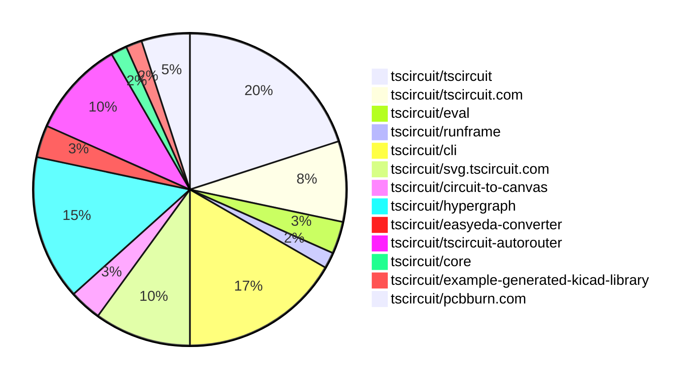

# contribution tracker

[contributions.tscircuit.com](https://contributions.tscircuit.com) ・ [tscircuit.com](https://tscircuit.com) ・ [Contribution Overviews](./contribution-overviews/) ・ [Changelogs](./changelogs/)

Generates weekly contribution overviews for tscircuit contributors. Check out all
the [contribution overviews here](./contribution-overviews/)
You can find AI-generated monthly changelogs in the [changelogs directory](./changelogs/)

- All PRs in the tscircuit org are scanned/summarized via an LLM
- The LLM classifies each Diff/PR as into a set of attributes for scoring
- All the PRs, summaries, and classifications are organized into charts and tables for [the website](https://contributions.tscircuit.com)

> Want to run locally? See the [Development Section](#development)

The current week is shown below. There are 4 major sections:

- [Contributor Overview](#contributor-overview)
- [PRs by Repository](#prs-by-repository)
- [PRs by Contributor](#changes-by-contributor)
- [Scoring & Sponsorship System](#scoring--sponsorship-system)

## Current Week

<!-- START_CURRENT_WEEK -->

# Contribution Overview 2026-01-07

The current week is shown below. There are 3 major sections:

- [Contributor Overview](#contributor-overview)
- [PRs by Repository](#prs-by-repository)
- [PRs by Contributor](#changes-by-contributor)
- [Scoring & Sponsorship Details](/docs/sponsorship-calculation-explanation.md)

## PRs by Repository



## Contributor Overview

| Contributor | 🐳 Major | 🐙 Minor | 🐌 Tiny | ⭐ | Discussion Contributions |
|-------------|---------|---------|---------|-----|--------------------------|
| [seveibar](#seveibar) | 7 | 1 | 1 | ⭐⭐⭐ | 0🔹 0🔶 0💎 |
| [tscircuitbot](#tscircuitbot) | 0 | 0 | 33 | ⭐⭐ | 0🔹 0🔶 0💎 |
| [ArnavK-09](#ArnavK-09) | 1 | 1 | 1 | ⭐ | 0🔹 0🔶 0💎 |
| [ShiboSoftwareDev](#ShiboSoftwareDev) | 1 | 1 | 0 | ⭐ | 0🔹 0🔶 0💎 |
| [imrishabh18](#imrishabh18) | 0 | 1 | 3 | ⭐ | 0🔹 0🔶 0💎 |
| [AnasSarkiz](#AnasSarkiz) | 1 | 0 | 2 | ⭐ | 0🔹 0🔶 0💎 |
| [0hmX](#0hmX) | 1 | 0 | 0 | ⭐ | 0🔹 0🔶 0💎 |
| [Ayushjhawar8](#Ayushjhawar8) | 0 | 1 | 1 |  | 0🔹 0🔶 0💎 |
| [techmannih](#techmannih) | 0 | 0 | 1 |  | 0🔹 0🔶 0💎 |
| [MustafaMulla29](#MustafaMulla29) | 0 | 0 | 2 |  | 0🔹 0🔶 0💎 |

> Note: AI evaluates PRs and assigns 1-3 star ratings automatically. 4 and 5 star ratings require manual staff review.

### Discussion Contribution Legend

- 🔹 Normal Comments: Basic participation with minimal effort
- 🔶 Great Informative Comments: Thoughtful participation that adds value
- 💎 Incredible Comments: Exceptional participation with high-quality content

## Review Table

[reviews-received-hover]: ## "Number of reviews received for PRs for this contributor"
[approvals-received-hover]: ## "Number of approvals received for PRs this contributor authored"
[rejections-received-hover]: ## "Number of rejections received for PRs this contributor authored"
[prs-opened-hover]: ## "Number of PRs opened by this contributor"
[issues-created-hover]: ## "Number of issues created by this contributor"

| Contributor | Reviews Received | Approvals Received | Rejections Received | Approvals | Rejections | PRs Opened | PRs Merged | Issues Created |
|---|---|---|---|---|---|---|---|---|
| [Ayushjhawar8](#Ayushjhawar8) | 5 | 2 | 0 | 0 | 0 | 3 | 2 | 0 |
| [tscircuitbot](#tscircuitbot) | 0 | 0 | 0 | 0 | 0 | 35 | 33 | 0 |
| [Sahil-Gupta584](#Sahil-Gupta584) | 7 | 0 | 1 | 0 | 0 | 4 | 0 | 0 |
| [techmannih](#techmannih) | 0 | 0 | 0 | 0 | 1 | 1 | 1 | 0 |
| [Rewolbebol](#Rewolbebol) | 1 | 0 | 0 | 0 | 0 | 1 | 0 | 0 |
| [seveibar](#seveibar) | 0 | 0 | 0 | 10 | 2 | 13 | 9 | 0 |
| [ShiboSoftwareDev](#ShiboSoftwareDev) | 2 | 2 | 0 | 0 | 0 | 2 | 2 | 0 |
| [imrishabh18](#imrishabh18) | 1 | 0 | 0 | 0 | 2 | 5 | 4 | 0 |
| [ArnavK-09](#ArnavK-09) | 3 | 3 | 0 | 0 | 0 | 3 | 3 | 0 |
| [MustafaMulla29](#MustafaMulla29) | 32 | 3 | 4 | 0 | 0 | 4 | 2 | 0 |
| [0hmX](#0hmX) | 2 | 0 | 0 | 0 | 1 | 6 | 1 | 0 |
| [Excellencedev](#Excellencedev) | 1 | 0 | 1 | 0 | 0 | 1 | 0 | 0 |
| [AnasSarkiz](#AnasSarkiz) | 0 | 0 | 0 | 0 | 0 | 3 | 3 | 0 |

## Changes by Repository

### [tscircuit/tscircuit](https://github.com/tscircuit/tscircuit)


<details>
<summary>🐌 Tiny Contributions (12)</summary>

| PR # | Impact | Contributor | Description |
|------|--------|-------------|-------------|
| [#1806](https://github.com/tscircuit/tscircuit/pull/1806) | 🐌 Tiny | tscircuitbot | Automated package update |
| [#1805](https://github.com/tscircuit/tscircuit/pull/1805) | 🐌 Tiny | tscircuitbot | Updates the tscircuitcli package to version 0.1.730 in package.json |
| [#1804](https://github.com/tscircuit/tscircuit/pull/1804) | 🐌 Tiny | tscircuitbot | Automated package update |
| [#1803](https://github.com/tscircuit/tscircuit/pull/1803) | 🐌 Tiny | tscircuitbot | Automated package update |
| [#1802](https://github.com/tscircuit/tscircuit/pull/1802) | 🐌 Tiny | tscircuitbot | Automated package update |
| [#1801](https://github.com/tscircuit/tscircuit/pull/1801) | 🐌 Tiny | tscircuitbot | Updates the version of the tscircuitcore package from 0.0.956 to 0.0.957 in package.json |
| [#1800](https://github.com/tscircuit/tscircuit/pull/1800) | 🐌 Tiny | tscircuitbot | Automated package update |
| [#1799](https://github.com/tscircuit/tscircuit/pull/1799) | 🐌 Tiny | tscircuitbot | Updates the tscircuitcli package to version 0.1.728 in the package.json file |
| [#1798](https://github.com/tscircuit/tscircuit/pull/1798) | 🐌 Tiny | tscircuitbot | Automated package update |
| [#1797](https://github.com/tscircuit/tscircuit/pull/1797) | 🐌 Tiny | tscircuitbot | Automated package update |
| [#1796](https://github.com/tscircuit/tscircuit/pull/1796) | 🐌 Tiny | tscircuitbot | Automated package update |
| [#1795](https://github.com/tscircuit/tscircuit/pull/1795) | 🐌 Tiny | tscircuitbot | Updates the tscircuitcli package from version 0.1.724 to 0.1.726 and the circuit-to-svg package from version 0.0.311 to 0.0.307 in package.json |

</details>

### [tscircuit/tscircuit.com](https://github.com/tscircuit/tscircuit.com)

| PR # | Impact | Rating | Contributor | Description |
|------|--------|--------|-------------|-------------|
| [#2428](https://github.com/tscircuit/tscircuit.com/pull/2428) | 🐙 Minor | ⭐⭐ | imrishabh18 | Ensures a newly forked package inherits the same visibility (privatepublic) as the source package and fixes inconsistent behavior between the package header fork flow and the editor fork flow by passing the is_private flag to the API. |

<details>
<summary>🐌 Tiny Contributions (4)</summary>

| PR # | Impact | Contributor | Description |
|------|--------|-------------|-------------|
| [#2430](https://github.com/tscircuit/tscircuit.com/pull/2430) | 🐌 Tiny | tscircuitbot | Automated package update |
| [#2432](https://github.com/tscircuit/tscircuit.com/pull/2432) | 🐌 Tiny | imrishabh18 | Aligns the width of the breadcrumb section with the logs section, displays a clear message when no builds are found, and aligns the text of breadcrumbs with the rebuild button. |
| [#2431](https://github.com/tscircuit/tscircuit.com/pull/2431) | 🐌 Tiny | imrishabh18 | Removes the Created time duration ago text from the release detail header so release pages no longer show the relative creation timestamp. |
| [#2429](https://github.com/tscircuit/tscircuit.com/pull/2429) | 🐌 Tiny | ArnavK-09 | Updates the logic to display the AI description tab only when there is AI content and no README file present. |

</details>

### [tscircuit/eval](https://github.com/tscircuit/eval)


<details>
<summary>🐌 Tiny Contributions (2)</summary>

| PR # | Impact | Contributor | Description |
|------|--------|-------------|-------------|
| [#1827](https://github.com/tscircuit/eval/pull/1827) | 🐌 Tiny | tscircuitbot | Automated package update |
| [#1826](https://github.com/tscircuit/eval/pull/1826) | 🐌 Tiny | tscircuitbot | Updates the version of the tscircuitcore package from 0.0.956 to 0.0.957 in package.json |

</details>

### [tscircuit/runframe](https://github.com/tscircuit/runframe)


<details>
<summary>🐌 Tiny Contributions (1)</summary>

| PR # | Impact | Contributor | Description |
|------|--------|-------------|-------------|
| [#2270](https://github.com/tscircuit/runframe/pull/2270) | 🐌 Tiny | tscircuitbot | Updates the tscircuiteval package to version 0.0.574 |

</details>

### [tscircuit/cli](https://github.com/tscircuit/cli)

| PR # | Impact | Rating | Contributor | Description |
|------|--------|--------|-------------|-------------|
| [#1568](https://github.com/tscircuit/cli/pull/1568) | 🐳 Major | ⭐⭐⭐ | ArnavK-09 | Adds upload results summary and error handling to the push process, providing detailed feedback on file upload success and failure. |
| [#1565](https://github.com/tscircuit/cli/pull/1565) | 🐙 Minor | ⭐⭐ | ArnavK-09 | Adds the --include-dist option to the push command, allowing users to include the dist directory in the push operation. |
| [#1570](https://github.com/tscircuit/cli/pull/1570) | 🐙 Minor | ⭐⭐ | seveibar | Allow projects to specify a buildCommand in tscircuit.config.json as an override for what to run during cloud builds, without changing local tsci build behavior. |

<details>
<summary>🐌 Tiny Contributions (7)</summary>

| PR # | Impact | Contributor | Description |
|------|--------|-------------|-------------|
| [#1574](https://github.com/tscircuit/cli/pull/1574) | 🐌 Tiny | tscircuitbot | Automated package update |
| [#1573](https://github.com/tscircuit/cli/pull/1573) | 🐌 Tiny | tscircuitbot | Automated package update |
| [#1571](https://github.com/tscircuit/cli/pull/1571) | 🐌 Tiny | tscircuitbot | Automated package update |
| [#1569](https://github.com/tscircuit/cli/pull/1569) | 🐌 Tiny | tscircuitbot | Automated package update |
| [#1566](https://github.com/tscircuit/cli/pull/1566) | 🐌 Tiny | tscircuitbot | Automated package update |
| [#1567](https://github.com/tscircuit/cli/pull/1567) | 🐌 Tiny | imrishabh18 | Adds a line to the global npmrc to specify the registry URL for the TSC package, ensuring proper authentication and registry configuration for users. |
| [#1572](https://github.com/tscircuit/cli/pull/1572) | 🐌 Tiny | MustafaMulla29 | Fixes error message to recommend using the correct package naming convention: tsciusername.package instead of usernamepackage |

</details>

### [tscircuit/svg.tscircuit.com](https://github.com/tscircuit/svg.tscircuit.com)


<details>
<summary>🐌 Tiny Contributions (6)</summary>

| PR # | Impact | Contributor | Description |
|------|--------|-------------|-------------|
| [#806](https://github.com/tscircuit/svg.tscircuit.com/pull/806) | 🐌 Tiny | tscircuitbot | Updates the tscircuit package version from 0.0.1120 to 0.0.1121 in package.json |
| [#805](https://github.com/tscircuit/svg.tscircuit.com/pull/805) | 🐌 Tiny | tscircuitbot | Updates the tscircuit package version from 0.0.1119 to 0.0.1120 in package.json |
| [#804](https://github.com/tscircuit/svg.tscircuit.com/pull/804) | 🐌 Tiny | tscircuitbot | Updates the tscircuit package from version 0.0.1118 to 0.0.1119 in package.json |
| [#803](https://github.com/tscircuit/svg.tscircuit.com/pull/803) | 🐌 Tiny | tscircuitbot | Updates the tscircuit package version from 0.0.1117 to 0.0.1118 in package.json |
| [#802](https://github.com/tscircuit/svg.tscircuit.com/pull/802) | 🐌 Tiny | tscircuitbot | Updates the tscircuit package from version 0.0.1116 to 0.0.1117 |
| [#801](https://github.com/tscircuit/svg.tscircuit.com/pull/801) | 🐌 Tiny | tscircuitbot | Updates the tscircuit package version from 0.0.1115 to 0.0.1116 in package.json |

</details>

### [tscircuit/circuit-to-canvas](https://github.com/tscircuit/circuit-to-canvas)


<details>
<summary>🐌 Tiny Contributions (2)</summary>

| PR # | Impact | Contributor | Description |
|------|--------|-------------|-------------|
| [#103](https://github.com/tscircuit/circuit-to-canvas/pull/103) | 🐌 Tiny | tscircuitbot | Automated package update |
| [#102](https://github.com/tscircuit/circuit-to-canvas/pull/102) | 🐌 Tiny | techmannih | Extracts a helper function for calculating the border radius of PCB SMT pads to reduce code duplication in the drawPcbSmtPad function. |

</details>

### [tscircuit/hypergraph](https://github.com/tscircuit/hypergraph)

| PR # | Impact | Rating | Contributor | Description |
|------|--------|--------|-------------|-------------|
| [#12](https://github.com/tscircuit/hypergraph/pull/12) | 🐳 Major | ⭐⭐⭐ | seveibar | Adds support for a configurable number of parallel traces that can pass through the jumper body without using jumpers. |
| [#6](https://github.com/tscircuit/hypergraph/pull/6) | 🐳 Major | ⭐⭐⭐ | seveibar | Fixes channel bugs and adds support for bounds parameter in jumper graph generation. |
| [#5](https://github.com/tscircuit/hypergraph/pull/5) | 🐳 Major | ⭐⭐⭐ | seveibar | Adds scripts for benchmarking and optimizing hyperparameters using gradient descent, including support for dual orientation tests and parameter updates. |

<details>
<summary>🐌 Tiny Contributions (6)</summary>

| PR # | Impact | Contributor | Description |
|------|--------|-------------|-------------|
| [#14](https://github.com/tscircuit/hypergraph/pull/14) | 🐌 Tiny | tscircuitbot | Updates the package version from 0.0.8 to 0.0.9 in package.json |
| [#13](https://github.com/tscircuit/hypergraph/pull/13) | 🐌 Tiny | tscircuitbot | Automated package update |
| [#11](https://github.com/tscircuit/hypergraph/pull/11) | 🐌 Tiny | tscircuitbot | Automated package update |
| [#9](https://github.com/tscircuit/hypergraph/pull/9) | 🐌 Tiny | tscircuitbot | Updates the package version from 0.0.4 to 0.0.5 in package.json |
| [#7](https://github.com/tscircuit/hypergraph/pull/7) | 🐌 Tiny | tscircuitbot | Updates the package version from 0.0.1 to 0.0.4 in package.json |
| [#8](https://github.com/tscircuit/hypergraph/pull/8) | 🐌 Tiny | seveibar | Fixes bounds calculation for horizontal orientation and adds support for jumper locations in the JumperGraph structure. |

</details>

### [tscircuit/easyeda-converter](https://github.com/tscircuit/easyeda-converter)

| PR # | Impact | Rating | Contributor | Description |
|------|--------|--------|-------------|-------------|
| [#341](https://github.com/tscircuit/easyeda-converter/pull/341) | 🐙 Minor | ⭐⭐ | Ayushjhawar8 | Fixes pin label parsing to support  suffix and adds tests for pin labels |

<details>
<summary>🐌 Tiny Contributions (1)</summary>

| PR # | Impact | Contributor | Description |
|------|--------|-------------|-------------|
| [#342](https://github.com/tscircuit/easyeda-converter/pull/342) | 🐌 Tiny | Ayushjhawar8 | Adds support for parallel testing in the CI workflow and updates the test execution process to include test plans for multiple Node.js versions. |

</details>

### [tscircuit/tscircuit-autorouter](https://github.com/tscircuit/tscircuit-autorouter)

| PR # | Impact | Rating | Contributor | Description |
|------|--------|--------|-------------|-------------|
| [#506](https://github.com/tscircuit/tscircuit-autorouter/pull/506) | 🐳 Major | ⭐⭐⭐ | ShiboSoftwareDev | Adds a new hyperparameter STRAIGHT_LINE_DEVIATION_FACTOR to the PortPointPathingSolver that penalizes paths deviating from the straight line between connection endpoints, improving routing quality and reducing path complexity. |
| [#511](https://github.com/tscircuit/tscircuit-autorouter/pull/511) | 🐳 Major | ⭐⭐⭐ | seveibar | Adds Autorouting Pipeline 3 to the menu bar and enhances parameterization options for the multi-section pathing solver. |
| [#510](https://github.com/tscircuit/tscircuit-autorouter/pull/510) | 🐳 Major | ⭐⭐⭐ | seveibar | wip add Jumper to srj output enable jumper high density stitch fix 1 wip route stitch solver improvements wip keepout solver jumper set tracking, jumper segments can not be colliding segments wip fix jumper routing add insideJumperPad?: booelan to route add insideJumperPad to route support getting srj jumpers fix srj 1206x4 drawing, store jumpers better better keepout solving tweaking to keepout solver, draw jumper routes properly add repro for bad widths wip trace width solver fixes fix insideJumperPad add horz orientation (breaks things) fix horizontal jumper issue refactor adjust keepouts, remove horz orientation for now assignable pipeline 3 |
| [#507](https://github.com/tscircuit/tscircuit-autorouter/pull/507) | 🐳 Major | ⭐⭐⭐ | seveibar | Integrates the tscircuithypergraph library to enhance jumper routing capabilities, including support for multiple jumper patterns and orientations. |
| [#499](https://github.com/tscircuit/tscircuit-autorouter/pull/499) | 🐳 Major | ⭐⭐⭐ | seveibar | This pull request introduces a new function for jumper PF, along with bug reports and prepattern tests. It includes new fixture files for testing and bug reporting, which are essential for ensuring the reliability of the autorouting functionality. |
| [#515](https://github.com/tscircuit/tscircuit-autorouter/pull/515) | 🐳 Major | ⭐⭐⭐ | 0hmX | This pull request adds a bug report and reworks the snapshots to visualize different outputs of the EXPANSION_DEGREES parameter in the MultiSectionPortPointOptimizer class. It introduces new test cases for various expansion degrees and ensures that the visual output is correctly captured in the snapshots. |

### [tscircuit/core](https://github.com/tscircuit/core)

| PR # | Impact | Rating | Contributor | Description |
|------|--------|--------|-------------|-------------|
| [#1819](https://github.com/tscircuit/core/pull/1819) | 🐙 Minor | ⭐⭐ | ShiboSoftwareDev | Fixes incorrect board sizing and placement in panel layout by ensuring it waits for asynchronous footprints to resolve before rendering. |

### [tscircuit/example-generated-kicad-library](https://github.com/tscircuit/example-generated-kicad-library)


<details>
<summary>🐌 Tiny Contributions (1)</summary>

| PR # | Impact | Contributor | Description |
|------|--------|-------------|-------------|
| [#4](https://github.com/tscircuit/example-generated-kicad-library/pull/4) | 🐌 Tiny | MustafaMulla29 | This pull request introduces a new project for tscircuit along with a generated KiCad library. The changes include the addition of a footprint library table and a 3D model for a Cherry MX switch, which is essential for PCB design and prototyping. |

</details>

### [tscircuit/pcbburn.com](https://github.com/tscircuit/pcbburn.com)

| PR # | Impact | Rating | Contributor | Description |
|------|--------|--------|-------------|-------------|
| [#17](https://github.com/tscircuit/pcbburn.com/pull/17) | 🐳 Major | ⭐⭐⭐ | AnasSarkiz | Add loading state and error handling for circuit file uploads to prevent screen freezing during file processing. |

<details>
<summary>🐌 Tiny Contributions (2)</summary>

| PR # | Impact | Contributor | Description |
|------|--------|-------------|-------------|
| [#18](https://github.com/tscircuit/pcbburn.com/pull/18) | 🐌 Tiny | AnasSarkiz | Increases settings panel initial width to 360px to match the minimum resize threshold and updates circuit-to-svg from 0.0.301 to 0.0.311 for bug fixes and improvements. |
| [#16](https://github.com/tscircuit/pcbburn.com/pull/16) | 🐌 Tiny | AnasSarkiz | Update the LBRNPCBBoth toggle buttons to use a segmented control design for better visual consistency and active state indication. |

</details>

## Changes by Contributor

### [tscircuitbot](https://github.com/tscircuitbot)


<details>
<summary>🐌 Tiny Contributions (33)</summary>

| PR # | Impact | Description |
|------|--------|-------------|
| [#1806](https://github.com/tscircuit/tscircuit/pull/1806) | 🐌 Tiny | Automated package update |
| [#1805](https://github.com/tscircuit/tscircuit/pull/1805) | 🐌 Tiny | Updates the tscircuitcli package to version 0.1.730 in package.json |
| [#1804](https://github.com/tscircuit/tscircuit/pull/1804) | 🐌 Tiny | Automated package update |
| [#1803](https://github.com/tscircuit/tscircuit/pull/1803) | 🐌 Tiny | Automated package update |
| [#1802](https://github.com/tscircuit/tscircuit/pull/1802) | 🐌 Tiny | Automated package update |
| [#1801](https://github.com/tscircuit/tscircuit/pull/1801) | 🐌 Tiny | Updates the version of the tscircuitcore package from 0.0.956 to 0.0.957 in package.json |
| [#1800](https://github.com/tscircuit/tscircuit/pull/1800) | 🐌 Tiny | Automated package update |
| [#1799](https://github.com/tscircuit/tscircuit/pull/1799) | 🐌 Tiny | Updates the tscircuitcli package to version 0.1.728 in the package.json file |
| [#1798](https://github.com/tscircuit/tscircuit/pull/1798) | 🐌 Tiny | Automated package update |
| [#1797](https://github.com/tscircuit/tscircuit/pull/1797) | 🐌 Tiny | Automated package update |
| [#1796](https://github.com/tscircuit/tscircuit/pull/1796) | 🐌 Tiny | Automated package update |
| [#1795](https://github.com/tscircuit/tscircuit/pull/1795) | 🐌 Tiny | Updates the tscircuitcli package from version 0.1.724 to 0.1.726 and the circuit-to-svg package from version 0.0.311 to 0.0.307 in package.json |
| [#2430](https://github.com/tscircuit/tscircuit.com/pull/2430) | 🐌 Tiny | Automated package update |
| [#1827](https://github.com/tscircuit/eval/pull/1827) | 🐌 Tiny | Automated package update |
| [#1826](https://github.com/tscircuit/eval/pull/1826) | 🐌 Tiny | Updates the version of the tscircuitcore package from 0.0.956 to 0.0.957 in package.json |
| [#2270](https://github.com/tscircuit/runframe/pull/2270) | 🐌 Tiny | Updates the tscircuiteval package to version 0.0.574 |
| [#1574](https://github.com/tscircuit/cli/pull/1574) | 🐌 Tiny | Automated package update |
| [#1573](https://github.com/tscircuit/cli/pull/1573) | 🐌 Tiny | Automated package update |
| [#1571](https://github.com/tscircuit/cli/pull/1571) | 🐌 Tiny | Automated package update |
| [#1569](https://github.com/tscircuit/cli/pull/1569) | 🐌 Tiny | Automated package update |
| [#1566](https://github.com/tscircuit/cli/pull/1566) | 🐌 Tiny | Automated package update |
| [#806](https://github.com/tscircuit/svg.tscircuit.com/pull/806) | 🐌 Tiny | Updates the tscircuit package version from 0.0.1120 to 0.0.1121 in package.json |
| [#805](https://github.com/tscircuit/svg.tscircuit.com/pull/805) | 🐌 Tiny | Updates the tscircuit package version from 0.0.1119 to 0.0.1120 in package.json |
| [#804](https://github.com/tscircuit/svg.tscircuit.com/pull/804) | 🐌 Tiny | Updates the tscircuit package from version 0.0.1118 to 0.0.1119 in package.json |
| [#803](https://github.com/tscircuit/svg.tscircuit.com/pull/803) | 🐌 Tiny | Updates the tscircuit package version from 0.0.1117 to 0.0.1118 in package.json |
| [#802](https://github.com/tscircuit/svg.tscircuit.com/pull/802) | 🐌 Tiny | Updates the tscircuit package from version 0.0.1116 to 0.0.1117 |
| [#801](https://github.com/tscircuit/svg.tscircuit.com/pull/801) | 🐌 Tiny | Updates the tscircuit package version from 0.0.1115 to 0.0.1116 in package.json |
| [#103](https://github.com/tscircuit/circuit-to-canvas/pull/103) | 🐌 Tiny | Automated package update |
| [#14](https://github.com/tscircuit/hypergraph/pull/14) | 🐌 Tiny | Updates the package version from 0.0.8 to 0.0.9 in package.json |
| [#13](https://github.com/tscircuit/hypergraph/pull/13) | 🐌 Tiny | Automated package update |
| [#11](https://github.com/tscircuit/hypergraph/pull/11) | 🐌 Tiny | Automated package update |
| [#9](https://github.com/tscircuit/hypergraph/pull/9) | 🐌 Tiny | Updates the package version from 0.0.4 to 0.0.5 in package.json |
| [#7](https://github.com/tscircuit/hypergraph/pull/7) | 🐌 Tiny | Updates the package version from 0.0.1 to 0.0.4 in package.json |

</details>

### [Ayushjhawar8](https://github.com/Ayushjhawar8)

| PRs # | Impact | Rating | Description |
|------|--------|--------|-------------|
| [#341](https://github.com/tscircuit/easyeda-converter/pull/341) | 🐙 Minor | ⭐⭐ | Fixes pin label parsing to support  suffix and adds tests for pin labels |

<details>
<summary>🐌 Tiny Contributions (1)</summary>

| PR # | Impact | Description |
|------|--------|-------------|
| [#342](https://github.com/tscircuit/easyeda-converter/pull/342) | 🐌 Tiny | Adds support for parallel testing in the CI workflow and updates the test execution process to include test plans for multiple Node.js versions. |

</details>

### [ShiboSoftwareDev](https://github.com/ShiboSoftwareDev)

| PRs # | Impact | Rating | Description |
|------|--------|--------|-------------|
| [#506](https://github.com/tscircuit/tscircuit-autorouter/pull/506) | 🐳 Major | ⭐⭐⭐ | Adds a new hyperparameter STRAIGHT_LINE_DEVIATION_FACTOR to the PortPointPathingSolver that penalizes paths deviating from the straight line between connection endpoints, improving routing quality and reducing path complexity. |
| [#1819](https://github.com/tscircuit/core/pull/1819) | 🐙 Minor | ⭐⭐ | Fixes incorrect board sizing and placement in panel layout by ensuring it waits for asynchronous footprints to resolve before rendering. |

### [imrishabh18](https://github.com/imrishabh18)

| PRs # | Impact | Rating | Description |
|------|--------|--------|-------------|
| [#2428](https://github.com/tscircuit/tscircuit.com/pull/2428) | 🐙 Minor | ⭐⭐ | Ensures a newly forked package inherits the same visibility (privatepublic) as the source package and fixes inconsistent behavior between the package header fork flow and the editor fork flow by passing the is_private flag to the API. |

<details>
<summary>🐌 Tiny Contributions (3)</summary>

| PR # | Impact | Description |
|------|--------|-------------|
| [#2432](https://github.com/tscircuit/tscircuit.com/pull/2432) | 🐌 Tiny | Aligns the width of the breadcrumb section with the logs section, displays a clear message when no builds are found, and aligns the text of breadcrumbs with the rebuild button. |
| [#2431](https://github.com/tscircuit/tscircuit.com/pull/2431) | 🐌 Tiny | Removes the Created time duration ago text from the release detail header so release pages no longer show the relative creation timestamp. |
| [#1567](https://github.com/tscircuit/cli/pull/1567) | 🐌 Tiny | Adds a line to the global npmrc to specify the registry URL for the TSC package, ensuring proper authentication and registry configuration for users. |

</details>

### [ArnavK-09](https://github.com/ArnavK-09)

| PRs # | Impact | Rating | Description |
|------|--------|--------|-------------|
| [#1568](https://github.com/tscircuit/cli/pull/1568) | 🐳 Major | ⭐⭐⭐ | Adds upload results summary and error handling to the push process, providing detailed feedback on file upload success and failure. |
| [#1565](https://github.com/tscircuit/cli/pull/1565) | 🐙 Minor | ⭐⭐ | Adds the --include-dist option to the push command, allowing users to include the dist directory in the push operation. |

<details>
<summary>🐌 Tiny Contributions (1)</summary>

| PR # | Impact | Description |
|------|--------|-------------|
| [#2429](https://github.com/tscircuit/tscircuit.com/pull/2429) | 🐌 Tiny | Updates the logic to display the AI description tab only when there is AI content and no README file present. |

</details>

### [MustafaMulla29](https://github.com/MustafaMulla29)


<details>
<summary>🐌 Tiny Contributions (2)</summary>

| PR # | Impact | Description |
|------|--------|-------------|
| [#1572](https://github.com/tscircuit/cli/pull/1572) | 🐌 Tiny | Fixes error message to recommend using the correct package naming convention: tsciusername.package instead of usernamepackage |
| [#4](https://github.com/tscircuit/example-generated-kicad-library/pull/4) | 🐌 Tiny | This pull request introduces a new project for tscircuit along with a generated KiCad library. The changes include the addition of a footprint library table and a 3D model for a Cherry MX switch, which is essential for PCB design and prototyping. |

</details>

### [seveibar](https://github.com/seveibar)

| PRs # | Impact | Rating | Description |
|------|--------|--------|-------------|
| [#511](https://github.com/tscircuit/tscircuit-autorouter/pull/511) | 🐳 Major | ⭐⭐⭐ | Adds Autorouting Pipeline 3 to the menu bar and enhances parameterization options for the multi-section pathing solver. |
| [#510](https://github.com/tscircuit/tscircuit-autorouter/pull/510) | 🐳 Major | ⭐⭐⭐ | wip add Jumper to srj output enable jumper high density stitch fix 1 wip route stitch solver improvements wip keepout solver jumper set tracking, jumper segments can not be colliding segments wip fix jumper routing add insideJumperPad?: booelan to route add insideJumperPad to route support getting srj jumpers fix srj 1206x4 drawing, store jumpers better better keepout solving tweaking to keepout solver, draw jumper routes properly add repro for bad widths wip trace width solver fixes fix insideJumperPad add horz orientation (breaks things) fix horizontal jumper issue refactor adjust keepouts, remove horz orientation for now assignable pipeline 3 |
| [#507](https://github.com/tscircuit/tscircuit-autorouter/pull/507) | 🐳 Major | ⭐⭐⭐ | Integrates the tscircuithypergraph library to enhance jumper routing capabilities, including support for multiple jumper patterns and orientations. |
| [#499](https://github.com/tscircuit/tscircuit-autorouter/pull/499) | 🐳 Major | ⭐⭐⭐ | This pull request introduces a new function for jumper PF, along with bug reports and prepattern tests. It includes new fixture files for testing and bug reporting, which are essential for ensuring the reliability of the autorouting functionality. |
| [#12](https://github.com/tscircuit/hypergraph/pull/12) | 🐳 Major | ⭐⭐⭐ | Adds support for a configurable number of parallel traces that can pass through the jumper body without using jumpers. |
| [#6](https://github.com/tscircuit/hypergraph/pull/6) | 🐳 Major | ⭐⭐⭐ | Fixes channel bugs and adds support for bounds parameter in jumper graph generation. |
| [#5](https://github.com/tscircuit/hypergraph/pull/5) | 🐳 Major | ⭐⭐⭐ | Adds scripts for benchmarking and optimizing hyperparameters using gradient descent, including support for dual orientation tests and parameter updates. |
| [#1570](https://github.com/tscircuit/cli/pull/1570) | 🐙 Minor | ⭐⭐ | Allow projects to specify a buildCommand in tscircuit.config.json as an override for what to run during cloud builds, without changing local tsci build behavior. |

<details>
<summary>🐌 Tiny Contributions (1)</summary>

| PR # | Impact | Description |
|------|--------|-------------|
| [#8](https://github.com/tscircuit/hypergraph/pull/8) | 🐌 Tiny | Fixes bounds calculation for horizontal orientation and adds support for jumper locations in the JumperGraph structure. |

</details>

### [0hmX](https://github.com/0hmX)

| PRs # | Impact | Rating | Description |
|------|--------|--------|-------------|
| [#515](https://github.com/tscircuit/tscircuit-autorouter/pull/515) | 🐳 Major | ⭐⭐⭐ | This pull request adds a bug report and reworks the snapshots to visualize different outputs of the EXPANSION_DEGREES parameter in the MultiSectionPortPointOptimizer class. It introduces new test cases for various expansion degrees and ensures that the visual output is correctly captured in the snapshots. |

### [techmannih](https://github.com/techmannih)


<details>
<summary>🐌 Tiny Contributions (1)</summary>

| PR # | Impact | Description |
|------|--------|-------------|
| [#102](https://github.com/tscircuit/circuit-to-canvas/pull/102) | 🐌 Tiny | Extracts a helper function for calculating the border radius of PCB SMT pads to reduce code duplication in the drawPcbSmtPad function. |

</details>

### [AnasSarkiz](https://github.com/AnasSarkiz)

| PRs # | Impact | Rating | Description |
|------|--------|--------|-------------|
| [#17](https://github.com/tscircuit/pcbburn.com/pull/17) | 🐳 Major | ⭐⭐⭐ | Add loading state and error handling for circuit file uploads to prevent screen freezing during file processing. |

<details>
<summary>🐌 Tiny Contributions (2)</summary>

| PR # | Impact | Description |
|------|--------|-------------|
| [#18](https://github.com/tscircuit/pcbburn.com/pull/18) | 🐌 Tiny | Increases settings panel initial width to 360px to match the minimum resize threshold and updates circuit-to-svg from 0.0.301 to 0.0.311 for bug fixes and improvements. |
| [#16](https://github.com/tscircuit/pcbburn.com/pull/16) | 🐌 Tiny | Update the LBRNPCBBoth toggle buttons to use a segmented control design for better visual consistency and active state indication. |

</details>

## Repository Owners

| Repository | Codeowners |
|------------|------------|
| [builder](https://github.com/tscircuit/builder/blob/main/.github/CODEOWNERS) | [seveibar](https://github.com/seveibar)
| [pcb-viewer](https://github.com/tscircuit/pcb-viewer/blob/main/.github/CODEOWNERS) | [seveibar](https://github.com/seveibar), [ShiboSoftwareDev](https://github.com/ShiboSoftwareDev)
| [footprints-old](https://github.com/tscircuit/footprints-old/blob/main/.github/CODEOWNERS) | [seveibar](https://github.com/seveibar)
| [footprinter](https://github.com/tscircuit/footprinter/blob/main/.github/CODEOWNERS) | [seveibar](https://github.com/seveibar), [techmannih](https://github.com/techmannih)
| [3d-viewer](https://github.com/tscircuit/3d-viewer/blob/main/.github/CODEOWNERS) | [ShiboSoftwareDev](https://github.com/ShiboSoftwareDev)
| [winterspec](https://github.com/tscircuit/winterspec/blob/main/.github/CODEOWNERS) | [seveibar](https://github.com/seveibar), [ShiboSoftwareDev](https://github.com/ShiboSoftwareDev)
| [jscad-electronics](https://github.com/tscircuit/jscad-electronics/blob/main/.github/CODEOWNERS) | [seveibar](https://github.com/seveibar), [techmannih](https://github.com/techmannih), [ShiboSoftwareDev](https://github.com/ShiboSoftwareDev), [anas-sarkez](https://github.com/anas-sarkez)
| [circuit-to-svg](https://github.com/tscircuit/circuit-to-svg/blob/main/.github/CODEOWNERS) | [imrishabh18](https://github.com/imrishabh18)
| [schematic-symbols](https://github.com/tscircuit/schematic-symbols/blob/main/.github/CODEOWNERS) | [seveibar](https://github.com/seveibar), [imrishabh18](https://github.com/imrishabh18), [techmannih](https://github.com/techmannih)
| [circuit-json-to-gerber](https://github.com/tscircuit/circuit-json-to-gerber/blob/main/.github/CODEOWNERS) | [seveibar](https://github.com/seveibar), [ShiboSoftwareDev](https://github.com/ShiboSoftwareDev)
| [tscircuit.com](https://github.com/tscircuit/tscircuit.com/blob/main/.github/CODEOWNERS) | [seveibar](https://github.com/seveibar), [imrishabh18](https://github.com/imrishabh18)
| [issue-roulette](https://github.com/tscircuit/issue-roulette/blob/main/.github/CODEOWNERS) | [Anshgrover23](https://github.com/Anshgrover23)
| [sparkfun-boards](https://github.com/tscircuit/sparkfun-boards/blob/main/.github/CODEOWNERS) | [ShiboSoftwareDev](https://github.com/ShiboSoftwareDev), [Abse2001](https://github.com/Abse2001), [MustafaMulla29](https://github.com/MustafaMulla29), [Anshgrover23](https://github.com/Anshgrover23), [techmannih](https://github.com/techmannih)
| [schematic-corpus](https://github.com/tscircuit/schematic-corpus/blob/main/.github/CODEOWNERS) | [Abse2001](https://github.com/Abse2001)
| [copper-pour-solver](https://github.com/tscircuit/copper-pour-solver/blob/main/.github/CODEOWNERS) | [seveibar](https://github.com/seveibar), [ShiboSoftwareDev](https://github.com/ShiboSoftwareDev)
| [common](https://github.com/tscircuit/common/blob/main/.github/CODEOWNERS) | [seveibar](https://github.com/seveibar), [Abse2001](https://github.com/Abse2001)

## Repositories by Owner

| User | Repo |
|------|------|
| [seveibar](https://github.com/seveibar) | [builder](https://github.com/tscircuit/builder/blob/main/.github/CODEOWNERS) |
|  | [pcb-viewer](https://github.com/tscircuit/pcb-viewer/blob/main/.github/CODEOWNERS) |
|  | [footprints-old](https://github.com/tscircuit/footprints-old/blob/main/.github/CODEOWNERS) |
|  | [footprinter](https://github.com/tscircuit/footprinter/blob/main/.github/CODEOWNERS) |
|  | [winterspec](https://github.com/tscircuit/winterspec/blob/main/.github/CODEOWNERS) |
|  | [jscad-electronics](https://github.com/tscircuit/jscad-electronics/blob/main/.github/CODEOWNERS) |
|  | [schematic-symbols](https://github.com/tscircuit/schematic-symbols/blob/main/.github/CODEOWNERS) |
|  | [circuit-json-to-gerber](https://github.com/tscircuit/circuit-json-to-gerber/blob/main/.github/CODEOWNERS) |
|  | [tscircuit.com](https://github.com/tscircuit/tscircuit.com/blob/main/.github/CODEOWNERS) |
|  | [copper-pour-solver](https://github.com/tscircuit/copper-pour-solver/blob/main/.github/CODEOWNERS) |
|  | [common](https://github.com/tscircuit/common/blob/main/.github/CODEOWNERS) |
| [ShiboSoftwareDev](https://github.com/ShiboSoftwareDev) | [pcb-viewer](https://github.com/tscircuit/pcb-viewer/blob/main/.github/CODEOWNERS) |
|  | [3d-viewer](https://github.com/tscircuit/3d-viewer/blob/main/.github/CODEOWNERS) |
|  | [winterspec](https://github.com/tscircuit/winterspec/blob/main/.github/CODEOWNERS) |
|  | [jscad-electronics](https://github.com/tscircuit/jscad-electronics/blob/main/.github/CODEOWNERS) |
|  | [circuit-json-to-gerber](https://github.com/tscircuit/circuit-json-to-gerber/blob/main/.github/CODEOWNERS) |
|  | [sparkfun-boards](https://github.com/tscircuit/sparkfun-boards/blob/main/.github/CODEOWNERS) |
|  | [copper-pour-solver](https://github.com/tscircuit/copper-pour-solver/blob/main/.github/CODEOWNERS) |
| [techmannih](https://github.com/techmannih) | [footprinter](https://github.com/tscircuit/footprinter/blob/main/.github/CODEOWNERS) |
|  | [jscad-electronics](https://github.com/tscircuit/jscad-electronics/blob/main/.github/CODEOWNERS) |
|  | [schematic-symbols](https://github.com/tscircuit/schematic-symbols/blob/main/.github/CODEOWNERS) |
|  | [sparkfun-boards](https://github.com/tscircuit/sparkfun-boards/blob/main/.github/CODEOWNERS) |
| [anas-sarkez](https://github.com/anas-sarkez) | [jscad-electronics](https://github.com/tscircuit/jscad-electronics/blob/main/.github/CODEOWNERS) |
| [imrishabh18](https://github.com/imrishabh18) | [circuit-to-svg](https://github.com/tscircuit/circuit-to-svg/blob/main/.github/CODEOWNERS) |
|  | [schematic-symbols](https://github.com/tscircuit/schematic-symbols/blob/main/.github/CODEOWNERS) |
|  | [tscircuit.com](https://github.com/tscircuit/tscircuit.com/blob/main/.github/CODEOWNERS) |
| [Anshgrover23](https://github.com/Anshgrover23) | [issue-roulette](https://github.com/tscircuit/issue-roulette/blob/main/.github/CODEOWNERS) |
|  | [sparkfun-boards](https://github.com/tscircuit/sparkfun-boards/blob/main/.github/CODEOWNERS) |
| [Abse2001](https://github.com/Abse2001) | [sparkfun-boards](https://github.com/tscircuit/sparkfun-boards/blob/main/.github/CODEOWNERS) |
|  | [schematic-corpus](https://github.com/tscircuit/schematic-corpus/blob/main/.github/CODEOWNERS) |
|  | [common](https://github.com/tscircuit/common/blob/main/.github/CODEOWNERS) |
| [MustafaMulla29](https://github.com/MustafaMulla29) | [sparkfun-boards](https://github.com/tscircuit/sparkfun-boards/blob/main/.github/CODEOWNERS) |


<!-- END_CURRENT_WEEK -->


## Development

### Prerequisites

- [Bun](https://bun.sh/) runtime
- `.env` file with required API keys:
  ```
  GITHUB_TOKEN=your_github_token
  OPENAI_API_KEY=your_openai_api_key
  DISCORD_TOKEN=your_discord_token (optional, for Discord integration)
  SLACK_BOT_TOKEN=your_slack_token (optional, for Slack integration)
  ```

### Available Scripts

#### Core Generation Scripts

- `bun run generate:weekly` - Generate current week's contribution overview
- `bun run generate:monthly` - Generate current month's contribution overview
- `bun run generate:changelog` - Generate monthly changelog from PRs

#### Analysis & Testing

- `bun run analyze-pr` - Analyze a single PR (interactive prompt)
- `bun run test:github` - Test GitHub API integration

#### Notifications & Sync

- `bun run notifications:issues` - Send notifications for new issues
- `bun run notifications:pr` - Send notifications for new PRs
- `bun run sync:discord` - Sync contributor roles with Discord

#### Data Export

- `bun run export:sponsorship` - Generate sponsorship data CSV

#### Development

- `bun run dev` - Start development server for web UI
- `bun run build` - Build for production
- `bun run format` - Format code with Biome

### Usage Examples

```bash
# Generate this week's contribution overview
bun run generate:weekly

# Generate current month's overview
bun run generate:monthly

# Analyze a specific PR
bun run analyze-pr

# Test your GitHub token setup
bun run test:github
```
