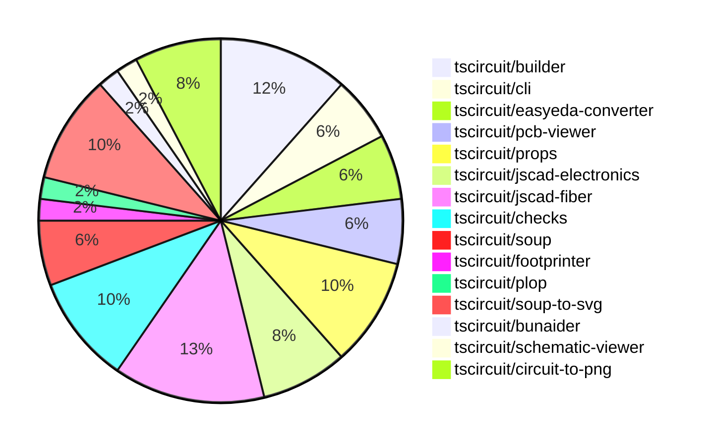

# contribution-tracker

Generates weekly contribution overviews for tscircuit contributors. Check out all
the [contribution overviews here](./contribution-overviews/)

* All PRs in the tscircuit org are scanned/summarized via Claude Haiku
* Claude classifies each Diff/PR as a Major, Minor or Tiny contribution
* All the PRs, summaries, and classifications are organized into charts and tables

The current week is shown below. There are 3 major sections:

* [Contributor Overview](#contributor-overview)
* [PRs by Repository](#prs-by-repository)
* [PRs by Contributor](#changes-by-contributor)

## Current Week

<!-- START_CURRENT_WEEK -->

# Contribution Overview 2024-07-20

## PRs by Repository

## Contributor Overview

| Contributor | 🐳 Major | 🐙 Minor | 🐌 Tiny |
|-------------|-------|-------|-------|
| andrii-balitskyi | 4 | 2 | 0 |
| seveibar | 11 | 11 | 0 |
| imrishabh18 | 8 | 3 | 0 |
| tscircuitbot | 2 | 1 | 0 |
| DamilolaAlao | 0 | 1 | 0 |
| syedbarimanjan | 0 | 0 | 1 |
| Slaviiiii | 4 | 1 | 0 |
| r-bt | 2 | 0 | 1 |

## Changes by Repository

### [tscircuit/builder](https://github.com/tscircuit/builder)

| PR # | Impact | Contributor | Description |
|------|--------|-------------|-------------|
| [#82](https://github.com/tscircuit/builder/pull/82) | 🐳 Major | andrii-balitskyi | Set the `y` coordinate of `cad_component` to `180` when it's on the bottom layer. |
| [#84](https://github.com/tscircuit/builder/pull/84) | 🐳 Major | seveibar | Add a GitHub Actions workflow to automatically fix issues labeled as 'aider' |
| [#80](https://github.com/tscircuit/builder/pull/80) | 🐳 Major | seveibar | The pull request handles PCB routes when finding the center of bounds, and also handles the case when there are no available points in the bounds. |
| [#81](https://github.com/tscircuit/builder/pull/81) | 🐙 Minor | seveibar | Adds a new function `buildPcbTraceElements` to the library for exporting PCB trace elements for benchmarking. |
| [#79](https://github.com/tscircuit/builder/pull/79) | 🐙 Minor | seveibar | Adds support for `pcbX` and `pcbY` properties in the `<board />` component, deprecating the use of `center_x`, `center_y`, and `center`. |
| [#78](https://github.com/tscircuit/builder/pull/78) | 🐙 Minor | seveibar | Add a development guide for the `@tscircuit/builder` library, including instructions on running tests and making changes. |

### [tscircuit/cli](https://github.com/tscircuit/cli)

| PR # | Impact | Contributor | Description |
|------|--------|-------------|-------------|
| [#107](https://github.com/tscircuit/cli/pull/107) | 🐳 Major | andrii-balitskyi | Add biome and formatbot workflow |
| [#108](https://github.com/tscircuit/cli/pull/108) | 🐳 Major | andrii-balitskyi | Ensure that .npmignore is read when publishing packages to include or exclude files. |
| [#111](https://github.com/tscircuit/cli/pull/111) | 🐙 Minor | DamilolaAlao | Add a new command "go" to open the TSCircuit Getting Started tutorial in the browser. |

### [tscircuit/easyeda-converter](https://github.com/tscircuit/easyeda-converter)

| PR # | Impact | Contributor | Description |
|------|--------|-------------|-------------|
| [#35](https://github.com/tscircuit/easyeda-converter/pull/35) | 🐳 Major | andrii-balitskyi | Ensure that the model object URL resolves when generating TypeScript components. |
| [#34](https://github.com/tscircuit/easyeda-converter/pull/34) | 🐙 Minor | andrii-balitskyi | Make `SMT` and `jlcOnSale` properties optional in `EasyEdaJsonSchema`. |
| [#33](https://github.com/tscircuit/easyeda-converter/pull/33) | 🐙 Minor | andrii-balitskyi | When specifying `-t tsx`, the base component filename is now derived from the manufacturer part number instead of the input file name. |

### [tscircuit/pcb-viewer](https://github.com/tscircuit/pcb-viewer)

| PR # | Impact | Contributor | Description |
|------|--------|-------------|-------------|
| [#28](https://github.com/tscircuit/pcb-viewer/pull/28) | 🐳 Major | seveibar | Add a new GitHub workflow to build the project on push and pull request events and fix a build issue in the `edit-events.ts` file. |
| [#30](https://github.com/tscircuit/pcb-viewer/pull/30) | 🐳 Major | tscircuitbot | Add support for displaying error diamonds at error location |
| [#26](https://github.com/tscircuit/pcb-viewer/pull/26) | 🐙 Minor | seveibar | The pull request fixes a deprecated import of `@tscircuit/builder` and replaces it with `@tscircuit/soup`. |

### [tscircuit/props](https://github.com/tscircuit/props)

| PR # | Impact | Contributor | Description |
|------|--------|-------------|-------------|
| [#12](https://github.com/tscircuit/props/pull/12) | 🐳 Major | seveibar | Add a GitHub workflow to automatically fix issues labeled as 'aider' using the bunaider tool. |
| [#10](https://github.com/tscircuit/props/pull/10) | 🐳 Major | seveibar | Add a GitHub Actions workflow to automatically format code in pull requests. |
| [#8](https://github.com/tscircuit/props/pull/8) | 🐙 Minor | seveibar | Make `pinLabels` and `schPortArrangement` optional properties in the component builder. |
| [#9](https://github.com/tscircuit/props/pull/9) | 🐙 Minor | imrishabh18 | Add manufacturer part number to the `bugProps` component in the TypeScript code. |
| [#13](https://github.com/tscircuit/props/pull/13) | 🐙 Minor | tscircuitbot | Adds a new `routingDisabled` option to the `GroupProps` type. |

### [tscircuit/jscad-electronics](https://github.com/tscircuit/jscad-electronics)

| PR # | Impact | Contributor | Description |
|------|--------|-------------|-------------|
| [#7](https://github.com/tscircuit/jscad-electronics/pull/7) | 🐳 Major | seveibar | Add footprint pads for sizing and a 0603 resistor footprint with 3D model |
| [#10](https://github.com/tscircuit/jscad-electronics/pull/10) | 🐳 Major | Slaviiiii | Implement the 0402 component in the jscad-fiber library. |
| [#8](https://github.com/tscircuit/jscad-electronics/pull/8) | 🐳 Major | Slaviiiii | Add support for the A0603 resistor footprint and the ExtrudedPads component to render PCB footprints. |
| [#9](https://github.com/tscircuit/jscad-electronics/pull/9) | 🐙 Minor | Slaviiiii | Add a new 0805 component to the project |

### [tscircuit/jscad-fiber](https://github.com/tscircuit/jscad-fiber)

| PR # | Impact | Contributor | Description |
|------|--------|-------------|-------------|
| [#34](https://github.com/tscircuit/jscad-fiber/pull/34) | 🐳 Major | seveibar | Enable `<Cuboid offset={{...}} color="blue" />` by adding `withOffsetProp` and `withColorProp` higher-order components. |
| [#37](https://github.com/tscircuit/jscad-fiber/pull/37) | 🐳 Major | Slaviiiii | Add a Rotate component to the library, which allows rotating a geometric object by a specified set of angles. |
| [#29](https://github.com/tscircuit/jscad-fiber/pull/29) | 🐳 Major | Slaviiiii | Implement union and translate wrappers |
| [#26](https://github.com/tscircuit/jscad-fiber/pull/26) | 🐳 Major | r-bt | Adds a new `JSCadThreeMesh` component to render JSCAD geometry using `react-three-fiber`. |
| [#22](https://github.com/tscircuit/jscad-fiber/pull/22) | 🐳 Major | r-bt | Adds a new `<custom>` component that supports rendering custom geometry |
| [#28](https://github.com/tscircuit/jscad-fiber/pull/28) | 🐙 Minor | seveibar | Ignore the `package.json` file in the format check and fix issues with the status checks. |
| [#24](https://github.com/tscircuit/jscad-fiber/pull/24) | 🐌 Tiny | r-bt | Bump the version number in the `package.json` file to publish a new version on npm. |

### [tscircuit/checks](https://github.com/tscircuit/checks)

| PR # | Impact | Contributor | Description |
|------|--------|-------------|-------------|
| [#6](https://github.com/tscircuit/checks/pull/6) | 🐳 Major | seveibar | Fix a bug in the `tracesOverlap` function to return the intersection point instead of just a boolean |
| [#5](https://github.com/tscircuit/checks/pull/5) | 🐳 Major | seveibar | Add a hack that allows missing `start_pcb_port_ids` and `end_pcb_port_ids` to not break overlap testing when a trace only contains two ports. |
| [#4](https://github.com/tscircuit/checks/pull/4) | 🐳 Major | seveibar | This pull request fixes an issue where the start and end port IDs were not correctly added to the trace, and it adds a regression test case. |
| [#3](https://github.com/tscircuit/checks/pull/3) | 🐳 Major | seveibar | Implement nonoverlapping checks, add NetManager system for detecting connected traces, and add workflow files for building, formatting, and publishing. |
| [#8](https://github.com/tscircuit/checks/pull/8) | 🐳 Major | tscircuitbot | Fix for issue #7 by improving the logic for checking if PCB ports are connected. |

### [tscircuit/soup](https://github.com/tscircuit/soup)

| PR # | Impact | Contributor | Description |
|------|--------|-------------|-------------|
| [#14](https://github.com/tscircuit/soup/pull/14) | 🐙 Minor | seveibar | Add "center" to pcb_trace_error and add biome.json |
| [#13](https://github.com/tscircuit/soup/pull/13) | 🐙 Minor | imrishabh18 | Add manufacturer part number to source component base |
| [#12](https://github.com/tscircuit/soup/pull/12) | 🐌 Tiny | syedbarimanjan | The change matches the export declaration to the file name in the `cad/index.ts` file. |

### [tscircuit/footprinter](https://github.com/tscircuit/footprinter)

| PR # | Impact | Contributor | Description |
|------|--------|-------------|-------------|
| [#12](https://github.com/tscircuit/footprinter/pull/12) | 🐙 Minor | seveibar | Update the build system to target the "esnext" version of JavaScript and set the module resolution to "Bundler" to avoid issues with the Vite bundler and the lodash library. |

### [tscircuit/plop](https://github.com/tscircuit/plop)

| PR # | Impact | Contributor | Description |
|------|--------|-------------|-------------|
| [#2](https://github.com/tscircuit/plop/pull/2) | 🐙 Minor | seveibar | Fix looking for biome dependency inside of dependencies rather than devDependencies |

### [tscircuit/soup-to-svg](https://github.com/tscircuit/soup-to-svg)

| PR # | Impact | Contributor | Description |
|------|--------|-------------|-------------|
| [#6](https://github.com/tscircuit/soup-to-svg/pull/6) | 🐳 Major | imrishabh18 | Introduced a new function `pcbSoupToSvg` to render a PCB circuit as SVG. |
| [#5](https://github.com/tscircuit/soup-to-svg/pull/5) | 🐳 Major | imrishabh18 | Storybook added to the project |
| [#3](https://github.com/tscircuit/soup-to-svg/pull/3) | 🐳 Major | imrishabh18 | The pull request adds a script to generate an SVG output from a Soup data structure. |
| [#8](https://github.com/tscircuit/soup-to-svg/pull/8) | 🐙 Minor | seveibar | Rename the package from "@tscircuit/soup-to-svg" to "circuit-to-svg" and update the description to "Convert Circuit JSON to SVG". |
| [#9](https://github.com/tscircuit/soup-to-svg/pull/9) | 🐙 Minor | imrishabh18 | Add a GitHub workflow to publish the project to npm |

### [tscircuit/bunaider](https://github.com/tscircuit/bunaider)

| PR # | Impact | Contributor | Description |
|------|--------|-------------|-------------|
| [#4](https://github.com/tscircuit/bunaider/pull/4) | 🐙 Minor | seveibar | Update the CLI version to match the package.json version |

### [tscircuit/schematic-viewer](https://github.com/tscircuit/schematic-viewer)

| PR # | Impact | Contributor | Description |
|------|--------|-------------|-------------|
| [#47](https://github.com/tscircuit/schematic-viewer/pull/47) | 🐳 Major | imrishabh18 | Adds the manufacturer part number to the SchematicBug component and displays it as text. |

### [tscircuit/circuit-to-png](https://github.com/tscircuit/circuit-to-png)

| PR # | Impact | Contributor | Description |
|------|--------|-------------|-------------|
| [#7](https://github.com/tscircuit/circuit-to-png/pull/7) | 🐳 Major | imrishabh18 | Add a GitHub Actions workflow to publish the project to NPM |
| [#6](https://github.com/tscircuit/circuit-to-png/pull/6) | 🐳 Major | imrishabh18 | Refactor the circuitToPng function to accept both PCB and schematic circuits |
| [#4](https://github.com/tscircuit/circuit-to-png/pull/4) | 🐳 Major | imrishabh18 | Adds a new function `soupToPng` that converts a circuit represented as a soup of elements to a PNG image. |
| [#2](https://github.com/tscircuit/circuit-to-png/pull/2) | 🐳 Major | imrishabh18 | Initializes the repository and sets up the project structure, including the .gitignore file, README, package.json, and TypeScript configuration. |

## Changes by Contributor

### [andrii-balitskyi](https://github.com/andrii-balitskyi)

| PR # | Impact | Description |
|------|--------|-------------|
| [#82](https://github.com/tscircuit/builder/pull/82) | 🐳 Major | Set the `y` coordinate of `cad_component` to `180` when it's on the bottom layer. |
| [#107](https://github.com/tscircuit/cli/pull/107) | 🐳 Major | Add biome and formatbot workflow |
| [#108](https://github.com/tscircuit/cli/pull/108) | 🐳 Major | Ensure that .npmignore is read when publishing packages to include or exclude files. |
| [#35](https://github.com/tscircuit/easyeda-converter/pull/35) | 🐳 Major | Ensure that the model object URL resolves when generating TypeScript components. |
| [#34](https://github.com/tscircuit/easyeda-converter/pull/34) | 🐙 Minor | Make `SMT` and `jlcOnSale` properties optional in `EasyEdaJsonSchema`. |
| [#33](https://github.com/tscircuit/easyeda-converter/pull/33) | 🐙 Minor | When specifying `-t tsx`, the base component filename is now derived from the manufacturer part number instead of the input file name. |

### [seveibar](https://github.com/seveibar)

| PR # | Impact | Description |
|------|--------|-------------|
| [#84](https://github.com/tscircuit/builder/pull/84) | 🐳 Major | Add a GitHub Actions workflow to automatically fix issues labeled as 'aider' |
| [#80](https://github.com/tscircuit/builder/pull/80) | 🐳 Major | The pull request handles PCB routes when finding the center of bounds, and also handles the case when there are no available points in the bounds. |
| [#28](https://github.com/tscircuit/pcb-viewer/pull/28) | 🐳 Major | Add a new GitHub workflow to build the project on push and pull request events and fix a build issue in the `edit-events.ts` file. |
| [#12](https://github.com/tscircuit/props/pull/12) | 🐳 Major | Add a GitHub workflow to automatically fix issues labeled as 'aider' using the bunaider tool. |
| [#10](https://github.com/tscircuit/props/pull/10) | 🐳 Major | Add a GitHub Actions workflow to automatically format code in pull requests. |
| [#7](https://github.com/tscircuit/jscad-electronics/pull/7) | 🐳 Major | Add footprint pads for sizing and a 0603 resistor footprint with 3D model |
| [#34](https://github.com/tscircuit/jscad-fiber/pull/34) | 🐳 Major | Enable `<Cuboid offset={{...}} color="blue" />` by adding `withOffsetProp` and `withColorProp` higher-order components. |
| [#6](https://github.com/tscircuit/checks/pull/6) | 🐳 Major | Fix a bug in the `tracesOverlap` function to return the intersection point instead of just a boolean |
| [#5](https://github.com/tscircuit/checks/pull/5) | 🐳 Major | Add a hack that allows missing `start_pcb_port_ids` and `end_pcb_port_ids` to not break overlap testing when a trace only contains two ports. |
| [#4](https://github.com/tscircuit/checks/pull/4) | 🐳 Major | This pull request fixes an issue where the start and end port IDs were not correctly added to the trace, and it adds a regression test case. |
| [#3](https://github.com/tscircuit/checks/pull/3) | 🐳 Major | Implement nonoverlapping checks, add NetManager system for detecting connected traces, and add workflow files for building, formatting, and publishing. |
| [#81](https://github.com/tscircuit/builder/pull/81) | 🐙 Minor | Adds a new function `buildPcbTraceElements` to the library for exporting PCB trace elements for benchmarking. |
| [#79](https://github.com/tscircuit/builder/pull/79) | 🐙 Minor | Adds support for `pcbX` and `pcbY` properties in the `<board />` component, deprecating the use of `center_x`, `center_y`, and `center`. |
| [#78](https://github.com/tscircuit/builder/pull/78) | 🐙 Minor | Add a development guide for the `@tscircuit/builder` library, including instructions on running tests and making changes. |
| [#26](https://github.com/tscircuit/pcb-viewer/pull/26) | 🐙 Minor | The pull request fixes a deprecated import of `@tscircuit/builder` and replaces it with `@tscircuit/soup`. |
| [#14](https://github.com/tscircuit/soup/pull/14) | 🐙 Minor | Add "center" to pcb_trace_error and add biome.json |
| [#8](https://github.com/tscircuit/props/pull/8) | 🐙 Minor | Make `pinLabels` and `schPortArrangement` optional properties in the component builder. |
| [#12](https://github.com/tscircuit/footprinter/pull/12) | 🐙 Minor | Update the build system to target the "esnext" version of JavaScript and set the module resolution to "Bundler" to avoid issues with the Vite bundler and the lodash library. |
| [#28](https://github.com/tscircuit/jscad-fiber/pull/28) | 🐙 Minor | Ignore the `package.json` file in the format check and fix issues with the status checks. |
| [#2](https://github.com/tscircuit/plop/pull/2) | 🐙 Minor | Fix looking for biome dependency inside of dependencies rather than devDependencies |
| [#8](https://github.com/tscircuit/soup-to-svg/pull/8) | 🐙 Minor | Rename the package from "@tscircuit/soup-to-svg" to "circuit-to-svg" and update the description to "Convert Circuit JSON to SVG". |
| [#4](https://github.com/tscircuit/bunaider/pull/4) | 🐙 Minor | Update the CLI version to match the package.json version |

### [imrishabh18](https://github.com/imrishabh18)

| PR # | Impact | Description |
|------|--------|-------------|
| [#47](https://github.com/tscircuit/schematic-viewer/pull/47) | 🐳 Major | Adds the manufacturer part number to the SchematicBug component and displays it as text. |
| [#6](https://github.com/tscircuit/soup-to-svg/pull/6) | 🐳 Major | Introduced a new function `pcbSoupToSvg` to render a PCB circuit as SVG. |
| [#5](https://github.com/tscircuit/soup-to-svg/pull/5) | 🐳 Major | Storybook added to the project |
| [#3](https://github.com/tscircuit/soup-to-svg/pull/3) | 🐳 Major | The pull request adds a script to generate an SVG output from a Soup data structure. |
| [#7](https://github.com/tscircuit/circuit-to-png/pull/7) | 🐳 Major | Add a GitHub Actions workflow to publish the project to NPM |
| [#6](https://github.com/tscircuit/circuit-to-png/pull/6) | 🐳 Major | Refactor the circuitToPng function to accept both PCB and schematic circuits |
| [#4](https://github.com/tscircuit/circuit-to-png/pull/4) | 🐳 Major | Adds a new function `soupToPng` that converts a circuit represented as a soup of elements to a PNG image. |
| [#2](https://github.com/tscircuit/circuit-to-png/pull/2) | 🐳 Major | Initializes the repository and sets up the project structure, including the .gitignore file, README, package.json, and TypeScript configuration. |
| [#13](https://github.com/tscircuit/soup/pull/13) | 🐙 Minor | Add manufacturer part number to source component base |
| [#9](https://github.com/tscircuit/props/pull/9) | 🐙 Minor | Add manufacturer part number to the `bugProps` component in the TypeScript code. |
| [#9](https://github.com/tscircuit/soup-to-svg/pull/9) | 🐙 Minor | Add a GitHub workflow to publish the project to npm |

### [tscircuitbot](https://github.com/tscircuitbot)

| PR # | Impact | Description |
|------|--------|-------------|
| [#30](https://github.com/tscircuit/pcb-viewer/pull/30) | 🐳 Major | Add support for displaying error diamonds at error location |
| [#8](https://github.com/tscircuit/checks/pull/8) | 🐳 Major | Fix for issue #7 by improving the logic for checking if PCB ports are connected. |
| [#13](https://github.com/tscircuit/props/pull/13) | 🐙 Minor | Adds a new `routingDisabled` option to the `GroupProps` type. |

### [DamilolaAlao](https://github.com/DamilolaAlao)

| PR # | Impact | Description |
|------|--------|-------------|
| [#111](https://github.com/tscircuit/cli/pull/111) | 🐙 Minor | Add a new command "go" to open the TSCircuit Getting Started tutorial in the browser. |

### [syedbarimanjan](https://github.com/syedbarimanjan)

| PR # | Impact | Description |
|------|--------|-------------|
| [#12](https://github.com/tscircuit/soup/pull/12) | 🐌 Tiny | The change matches the export declaration to the file name in the `cad/index.ts` file. |

### [Slaviiiii](https://github.com/Slaviiiii)

| PR # | Impact | Description |
|------|--------|-------------|
| [#10](https://github.com/tscircuit/jscad-electronics/pull/10) | 🐳 Major | Implement the 0402 component in the jscad-fiber library. |
| [#8](https://github.com/tscircuit/jscad-electronics/pull/8) | 🐳 Major | Add support for the A0603 resistor footprint and the ExtrudedPads component to render PCB footprints. |
| [#37](https://github.com/tscircuit/jscad-fiber/pull/37) | 🐳 Major | Add a Rotate component to the library, which allows rotating a geometric object by a specified set of angles. |
| [#29](https://github.com/tscircuit/jscad-fiber/pull/29) | 🐳 Major | Implement union and translate wrappers |
| [#9](https://github.com/tscircuit/jscad-electronics/pull/9) | 🐙 Minor | Add a new 0805 component to the project |

### [r-bt](https://github.com/r-bt)

| PR # | Impact | Description |
|------|--------|-------------|
| [#26](https://github.com/tscircuit/jscad-fiber/pull/26) | 🐳 Major | Adds a new `JSCadThreeMesh` component to render JSCAD geometry using `react-three-fiber`. |
| [#22](https://github.com/tscircuit/jscad-fiber/pull/22) | 🐳 Major | Adds a new `<custom>` component that supports rendering custom geometry |
| [#24](https://github.com/tscircuit/jscad-fiber/pull/24) | 🐌 Tiny | Bump the version number in the `package.json` file to publish a new version on npm. |

<!-- END_CURRENT_WEEK -->
