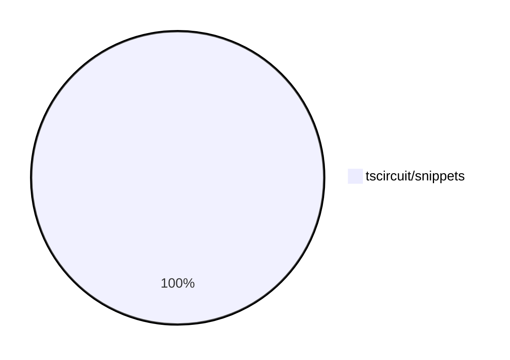

# contribution-tracker

Generates weekly contribution overviews for tscircuit contributors. Check out all
the [contribution overviews here](./contribution-overviews/)

* All PRs in the tscircuit org are scanned/summarized via Claude Haiku
* Claude classifies each Diff/PR as a Major, Minor or Tiny contribution
* All the PRs, summaries, and classifications are organized into charts and tables

The current week is shown below. There are 3 major sections:

* [Contributor Overview](#contributor-overview)
* [PRs by Repository](#prs-by-repository)
* [PRs by Contributor](#changes-by-contributor)

## Current Week

<!-- START_CURRENT_WEEK -->

# Contribution Overview 2024-12-04

## PRs by Repository

## Contributor Overview

| Contributor | 🐳 Major | 🐙 Minor | 🐌 Tiny | ⭐ | Issues Created |
|-------------|---------|---------|---------|-----|----------------|
| [seveibar](#seveibar) | 0 | 3 | 1 | ⭐⭐ | 17 |
| [imrishabh18](#imrishabh18) | 0 | 2 | 2 | ⭐⭐ | 4 |
| [RohittCodes](#RohittCodes) | 2 | 3 | 0 | ⭐⭐ | 1 |
| [ShiboSoftwareDev](#ShiboSoftwareDev) | 0 | 1 | 0 | ⭐ | 1 |
| [Anshgrover23](#Anshgrover23) | 0 | 2 | 0 | ⭐ | 0 |
| [techmannih](#techmannih) | 0 | 2 | 0 | ⭐ | 0 |
| [Abse2001](#Abse2001) | 0 | 0 | 1 |  | 1 |
| [mrudulpatil18](#mrudulpatil18) | 0 | 1 | 0 |  | 0 |

## Review Table

[reviews-received-hover]: ## "Number of reviews received for PRs for this contributor"
[approvals-received-hover]: ## "Number of approvals received for PRs this contributor authored"
[rejections-received-hover]: ## "Number of rejections received for PRs this contributor authored"
[prs-opened-hover]: ## "Number of PRs opened by this contributor"
[issues-created-hover]: ## "Number of issues created by this contributor"
[bountied-issues-hover]: ## "Number of issues this contributor created with a bounty"
[bountied-issue-$-hover]: ## "Total bounty amount placed on issues authored by this contributor"

| Contributor | Reviews Received | Approvals Received | Rejections Received | PRs Opened | PRs Merged | Issues Created | Bountied Issues | Bountied Issue $ |
|---|---|---|---|---|---|---|---|---|
| [Anshgrover23](#Anshgrover23) | 3 | 2 | 0 | 3 | 2 | 0 | 0 | 0 |
| [seveibar](#seveibar) | 0 | 0 | 0 | 4 | 4 | 17 | 13 | 218 |
| [imrishabh18](#imrishabh18) | 1 | 1 | 0 | 5 | 4 | 4 | 3 | 70 |
| [techmannih](#techmannih) | 6 | 2 | 1 | 3 | 2 | 0 | 0 | 0 |
| [RohittCodes](#RohittCodes) | 28 | 6 | 9 | 6 | 5 | 1 | 1 | 5 |
| [Abse2001](#Abse2001) | 0 | 0 | 0 | 1 | 1 | 1 | 1 | 15 |
| [ShiboSoftwareDev](#ShiboSoftwareDev) | 4 | 1 | 3 | 1 | 1 | 1 | 1 | 40 |
| [mrudulpatil18](#mrudulpatil18) | 1 | 1 | 0 | 1 | 1 | 0 | 0 | 0 |

## Changes by Repository

### [tscircuit/snippets](https://github.com/tscircuit/snippets)

| PR # | Impact | Contributor | Description |
|------|--------|-------------|-------------|
| [#269](https://github.com/tscircuit/snippets/pull/269) | 🐳 Major | RohittCodes | Refactored the manual_edit_json template ingestion into the database and added playwright tests for the manual edits functionality. |
| [#327](https://github.com/tscircuit/snippets/pull/327) | 🐳 Major | RohittCodes | Adds support for dynamic container height in PCB, schematic, and CAD viewers. |
| [#365](https://github.com/tscircuit/snippets/pull/365) | 🐙 Minor | Anshgrover23 | Split `footprint-dialog.spec.ts` into multiple files for better organization and maintainability. |
| [#351](https://github.com/tscircuit/snippets/pull/351) | 🐙 Minor | Anshgrover23 | Fixes the regular expression to support underscores in the package names. |
| [#363](https://github.com/tscircuit/snippets/pull/363) | 🐙 Minor | seveibar | Improves the Playwright test runtime and fixes a manual edits test |
| [#358](https://github.com/tscircuit/snippets/pull/358) | 🐙 Minor | seveibar | Update the `dsn-converter` dependency and add it to the autoupdate list in the `renovate.json` file. |
| [#355](https://github.com/tscircuit/snippets/pull/355) | 🐙 Minor | seveibar | This pull request adds a new dialog component to view the TypeScript files in the code editor. |
| [#373](https://github.com/tscircuit/snippets/pull/373) | 🐙 Minor | imrishabh18 | Revert the update to the `@tscircuit/core` dependency from version `0.0.223` to `0.0.221`. |
| [#372](https://github.com/tscircuit/snippets/pull/372) | 🐙 Minor | imrishabh18 | Update the `@tscircuit/core` dependency to version `0.0.223` |
| [#307](https://github.com/tscircuit/snippets/pull/307) | 🐙 Minor | RohittCodes | Refactors the search links functionality to open links in a new tab if the current location is "/editor" or "/ai", and use the Link component from the wouter library to navigate to the editor page otherwise. |
| [#297](https://github.com/tscircuit/snippets/pull/297) | 🐙 Minor | RohittCodes | Added a timeout and introduced a finally block to fix the rename snippet dialog. |
| [#341](https://github.com/tscircuit/snippets/pull/341) | 🐙 Minor | RohittCodes | Increased the timeout for the Playwright tests from 5 minutes to 10 minutes. |
| [#339](https://github.com/tscircuit/snippets/pull/339) | 🐙 Minor | ShiboSoftwareDev | Automatically runs the code when entering a snippet editor. |
| [#350](https://github.com/tscircuit/snippets/pull/350) | 🐙 Minor | techmannih | Add retries for flaky tests |
| [#338](https://github.com/tscircuit/snippets/pull/338) | 🐙 Minor | techmannih | Fixes the issue of multiple cursors when `ctrl+click` is triggered. |
| [#330](https://github.com/tscircuit/snippets/pull/330) | 🐙 Minor | mrudulpatil18 | Added a static skeleton page with fixed data to mimic the normal components during loading. |
| [#357](https://github.com/tscircuit/snippets/pull/357) | 🐌 Tiny | seveibar | Update Playwright snapshots |
| [#375](https://github.com/tscircuit/snippets/pull/375) | 🐌 Tiny | imrishabh18 | Update the version of the `@tscircuit/core` dependency from `0.0.223` to `0.0.225`. |
| [#369](https://github.com/tscircuit/snippets/pull/369) | 🐌 Tiny | imrishabh18 | Updates the version of the `dsn-converter` dependency in the `package.json` file. |
| [#356](https://github.com/tscircuit/snippets/pull/356) | 🐌 Tiny | Abse2001 | Updated the version of the "@tscircuit/core" dependency from 0.0.217 to 0.0.219. |

## Changes by Contributor

### [Anshgrover23](https://github.com/Anshgrover23)

| PR # | Impact | Description |
|------|--------|-------------|
| [#365](https://github.com/tscircuit/snippets/pull/365) | 🐙 Minor | Split `footprint-dialog.spec.ts` into multiple files for better organization and maintainability. |
| [#351](https://github.com/tscircuit/snippets/pull/351) | 🐙 Minor | Fixes the regular expression to support underscores in the package names. |

### [seveibar](https://github.com/seveibar)

| PR # | Impact | Description |
|------|--------|-------------|
| [#363](https://github.com/tscircuit/snippets/pull/363) | 🐙 Minor | Improves the Playwright test runtime and fixes a manual edits test |
| [#358](https://github.com/tscircuit/snippets/pull/358) | 🐙 Minor | Update the `dsn-converter` dependency and add it to the autoupdate list in the `renovate.json` file. |
| [#355](https://github.com/tscircuit/snippets/pull/355) | 🐙 Minor | This pull request adds a new dialog component to view the TypeScript files in the code editor. |
| [#357](https://github.com/tscircuit/snippets/pull/357) | 🐌 Tiny | Update Playwright snapshots |

### [imrishabh18](https://github.com/imrishabh18)

| PR # | Impact | Description |
|------|--------|-------------|
| [#373](https://github.com/tscircuit/snippets/pull/373) | 🐙 Minor | Revert the update to the `@tscircuit/core` dependency from version `0.0.223` to `0.0.221`. |
| [#372](https://github.com/tscircuit/snippets/pull/372) | 🐙 Minor | Update the `@tscircuit/core` dependency to version `0.0.223` |
| [#375](https://github.com/tscircuit/snippets/pull/375) | 🐌 Tiny | Update the version of the `@tscircuit/core` dependency from `0.0.223` to `0.0.225`. |
| [#369](https://github.com/tscircuit/snippets/pull/369) | 🐌 Tiny | Updates the version of the `dsn-converter` dependency in the `package.json` file. |

### [RohittCodes](https://github.com/RohittCodes)

| PR # | Impact | Description |
|------|--------|-------------|
| [#269](https://github.com/tscircuit/snippets/pull/269) | 🐳 Major | Refactored the manual_edit_json template ingestion into the database and added playwright tests for the manual edits functionality. |
| [#327](https://github.com/tscircuit/snippets/pull/327) | 🐳 Major | Adds support for dynamic container height in PCB, schematic, and CAD viewers. |
| [#307](https://github.com/tscircuit/snippets/pull/307) | 🐙 Minor | Refactors the search links functionality to open links in a new tab if the current location is "/editor" or "/ai", and use the Link component from the wouter library to navigate to the editor page otherwise. |
| [#297](https://github.com/tscircuit/snippets/pull/297) | 🐙 Minor | Added a timeout and introduced a finally block to fix the rename snippet dialog. |
| [#341](https://github.com/tscircuit/snippets/pull/341) | 🐙 Minor | Increased the timeout for the Playwright tests from 5 minutes to 10 minutes. |

### [Abse2001](https://github.com/Abse2001)

| PR # | Impact | Description |
|------|--------|-------------|
| [#356](https://github.com/tscircuit/snippets/pull/356) | 🐌 Tiny | Updated the version of the "@tscircuit/core" dependency from 0.0.217 to 0.0.219. |

### [ShiboSoftwareDev](https://github.com/ShiboSoftwareDev)

| PR # | Impact | Description |
|------|--------|-------------|
| [#339](https://github.com/tscircuit/snippets/pull/339) | 🐙 Minor | Automatically runs the code when entering a snippet editor. |

### [techmannih](https://github.com/techmannih)

| PR # | Impact | Description |
|------|--------|-------------|
| [#350](https://github.com/tscircuit/snippets/pull/350) | 🐙 Minor | Add retries for flaky tests |
| [#338](https://github.com/tscircuit/snippets/pull/338) | 🐙 Minor | Fixes the issue of multiple cursors when `ctrl+click` is triggered. |

### [mrudulpatil18](https://github.com/mrudulpatil18)

| PR # | Impact | Description |
|------|--------|-------------|
| [#330](https://github.com/tscircuit/snippets/pull/330) | 🐙 Minor | Added a static skeleton page with fixed data to mimic the normal components during loading. |

<!-- END_CURRENT_WEEK -->
