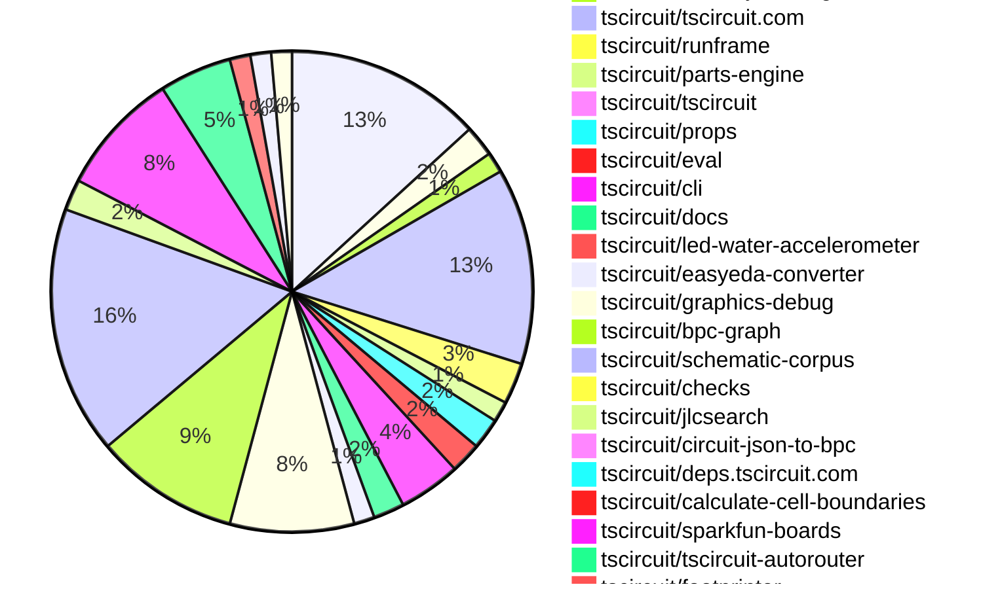
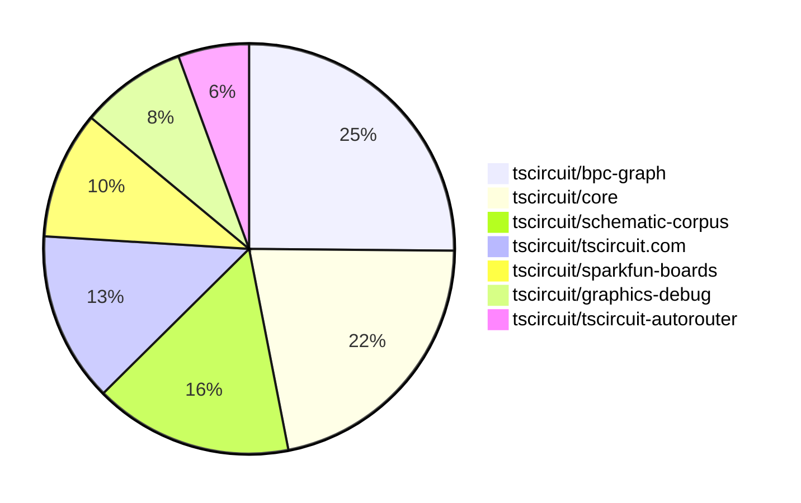

# contribution-tracker

[contributions.tscircuit.com](https://contributions.tscircuit.com) ・ [tscircuit.com](https://tscircuit.com) ・ [Contribution Overviews](./contribution-overviews/) ・ [Changelogs](./changelogs/)

Generates weekly contribution overviews for tscircuit contributors. Check out all
the [contribution overviews here](./contribution-overviews/)
You can find AI-generated monthly changelogs in the [changelogs directory](./changelogs/).

- All PRs in the tscircuit org are scanned/summarized via an LLM
- The LLM classifies each Diff/PR as into a set of attributes for scoring
- All the PRs, summaries, and classifications are organized into charts and tables for [the website](https://contributions.tscircuit.com)

## Getting Started

### Prerequisites

- [Bun](https://bun.sh/) runtime
- `.env` file with required API keys:
  ```
  GITHUB_TOKEN=your_github_token
  OPENAI_API_KEY=your_openai_api_key
  DISCORD_TOKEN=your_discord_token (optional, for Discord integration)
  SLACK_BOT_TOKEN=your_slack_token (optional, for Slack integration)
  ```

### Available Scripts

#### Core Generation Scripts

- `bun run generate:weekly` - Generate current week's contribution overview
- `bun run generate:monthly` - Generate current month's contribution overview
- `bun run generate:changelog` - Generate monthly changelog from PRs

#### Analysis & Testing

- `bun run analyze-pr` - Analyze a single PR (interactive prompt)
- `bun run test:github` - Test GitHub API integration

#### Notifications & Sync

- `bun run notifications:issues` - Send notifications for new issues
- `bun run notifications:pr` - Send notifications for new PRs
- `bun run sync:discord` - Sync contributor roles with Discord

#### Data Export

- `bun run export:sponsorship` - Generate sponsorship data CSV

#### Development

- `bun run dev` - Start development server for web UI
- `bun run build` - Build for production
- `bun run format` - Format code with Biome

### Usage Examples

```bash
# Generate this week's contribution overview
bun run generate:weekly

# Generate current month's overview
bun run generate:monthly

# Analyze a specific PR
bun run analyze-pr

# Test your GitHub token setup
bun run test:github
```

The current week is shown below. There are 3 major sections:

- [Contributor Overview](#contributor-overview)
- [PRs by Repository](#prs-by-repository)
- [PRs by Contributor](#changes-by-contributor)

## Current Week

<!-- START_CURRENT_WEEK -->

# Contribution Overview 2025-06-25

## PRs by Repository



## Contributor Overview

| Contributor | 🐳 Major | 🐙 Minor | 🐌 Tiny | ⭐ | Issues Created | Discussion Contributions |
|-------------|---------|---------|---------|-----|----------------|--------------------------|
| [seveibar](#seveibar) | 16 | 7 | 28 | ⭐⭐⭐ | 5 | 0🔹 0🔶 0💎 |
| [imrishabh18](#imrishabh18) | 3 | 3 | 15 | ⭐⭐ | 1 | 0🔹 0🔶 0💎 |
| [Anshgrover23](#Anshgrover23) | 2 | 1 | 18 | ⭐⭐ | 9 | 0🔹 0🔶 0💎 |
| [ShiboSoftwareDev](#ShiboSoftwareDev) | 1 | 1 | 9 | ⭐⭐ | 7 | 0🔹 0🔶 0💎 |
| [techmannih](#techmannih) | 0 | 2 | 12 | ⭐⭐ | 2 | 0🔹 0🔶 0💎 |
| [Abse2001](#Abse2001) | 1 | 0 | 10 | ⭐⭐ | 1 | 0🔹 0🔶 0💎 |
| [ArnavK-09](#ArnavK-09) | 0 | 4 | 11 | ⭐⭐ | 7 | 0🔹 0🔶 0💎 |
| [ricohageman](#ricohageman) | 1 | 0 | 0 |  | 0 | 0🔹 0🔶 0💎 |
| [MustafaMulla29](#MustafaMulla29) | 0 | 0 | 3 |  | 6 | 0🔹 0🔶 0💎 |
| [andrii-balitskyi](#andrii-balitskyi) | 0 | 0 | 1 |  | 0 | 0🔹 0🔶 0💎 |
| [tscircuitbot](#tscircuitbot) | 0 | 0 | 1 |  | 0 | 0🔹 0🔶 0💎 |

### Discussion Contribution Legend

- 🔹 Normal Comments: Basic participation with minimal effort
- 🔶 Great Informative Comments: Thoughtful participation that adds value
- 💎 Incredible Comments: Exceptional participation with high-quality content

## Review Table

[reviews-received-hover]: ## "Number of reviews received for PRs for this contributor"
[approvals-received-hover]: ## "Number of approvals received for PRs this contributor authored"
[rejections-received-hover]: ## "Number of rejections received for PRs this contributor authored"
[prs-opened-hover]: ## "Number of PRs opened by this contributor"
[issues-created-hover]: ## "Number of issues created by this contributor"
[bountied-issues-hover]: ## "Number of issues this contributor created with a bounty"
[bountied-issue-$-hover]: ## "Total bounty amount placed on issues authored by this contributor"

| Contributor | Reviews Received | Approvals Received | Rejections Received | Approvals | Rejections | PRs Opened | PRs Merged | Issues Created | Bountied Issues | Bountied Issue $ |
|---|---|---|---|---|---|---|---|---|---|---|
| [seveibar](#seveibar) | 6 | 1 | 0 | 41 | 4 | 66 | 51 | 5 | 2 | 50 |
| [imrishabh18](#imrishabh18) | 18 | 9 | 0 | 9 | 2 | 23 | 21 | 1 | 0 | 0 |
| [graphite-app[bot]](#graphite-app[bot]) | 0 | 0 | 0 | 0 | 0 | 0 | 0 | 0 | 0 | 0 |
| [techmannih](#techmannih) | 47 | 20 | 7 | 1 | 4 | 26 | 14 | 2 | 0 | 0 |
| [Anshgrover23](#Anshgrover23) | 30 | 21 | 4 | 3 | 6 | 25 | 21 | 9 | 0 | 0 |
| [ShiboSoftwareDev](#ShiboSoftwareDev) | 12 | 9 | 0 | 13 | 2 | 15 | 11 | 7 | 1 | 5 |
| [MustafaMulla29](#MustafaMulla29) | 8 | 3 | 4 | 0 | 0 | 7 | 3 | 6 | 0 | 0 |
| [ArnavK-09](#ArnavK-09) | 22 | 14 | 1 | 2 | 0 | 17 | 15 | 7 | 0 | 0 |
| [Abse2001](#Abse2001) | 5 | 3 | 1 | 13 | 0 | 13 | 11 | 1 | 0 | 0 |
| [andrii-balitskyi](#andrii-balitskyi) | 2 | 1 | 1 | 0 | 0 | 2 | 1 | 0 | 0 | 0 |
| [tscircuitbot](#tscircuitbot) | 0 | 0 | 0 | 0 | 0 | 32 | 1 | 0 | 0 | 0 |
| [ricohageman](#ricohageman) | 1 | 1 | 0 | 0 | 0 | 1 | 1 | 0 | 0 | 0 |
| [cursor[bot]](#cursor[bot]) | 0 | 0 | 0 | 0 | 0 | 0 | 0 | 0 | 0 | 0 |

## Top 7 Repositories by Contribution Points



## Changes by Repository

### [tscircuit/core](https://github.com/tscircuit/core)

| PR # | Impact | Contributor | Description |
|------|--------|-------------|-------------|
| [#1002](https://github.com/tscircuit/core/pull/1002) | 🐳 Major | imrishabh18 | Fixes autorouting bug where subcircuits could have multiple traces routed between the same pins, causing redundant or incorrect PCB traces. |
| [#1016](https://github.com/tscircuit/core/pull/1016) | 🐳 Major | seveibar | Rewrites the schematic match-adapt layout algorithm to use BPC graphs, enabling more robust and flexible schematic auto-layout for groups using a corpus of graph templates. |
| [#1004](https://github.com/tscircuit/core/pull/1004) | 🐳 Major | seveibar | Fixes incorrect placement of schematic netlabel centers by computing their offset based on anchor side and text size, ensuring accurate netlabel positioning in schematics. |
| [#1003](https://github.com/tscircuit/core/pull/1003) | 🐳 Major | seveibar | Fixes incorrect assignment of source_net_id on schematic net labels, ensuring they reference the correct net object instead of just the net name. |
| [#976](https://github.com/tscircuit/core/pull/976) | 🐳 Major | seveibar | Net labels in schematics now automatically orient themselves based on the position of the connected port, fixing incorrect net label placement and orientation. |
| [#1008](https://github.com/tscircuit/core/pull/1008) | 🐳 Major | ShiboSoftwareDev | Fixes incorrect calculation of PCB board center when an outline is provided, ensuring the center is derived from the outline's bounding box rather than defaulting to origin or offsets. |
| [#1015](https://github.com/tscircuit/core/pull/1015) | 🐙 Minor | seveibar | Maps `schOrientation` prop to schematic symbol rotation and adds tests for polarized capacitor orientations, removing outdated orientation tests. |
| [#1000](https://github.com/tscircuit/core/pull/1000) | 🐙 Minor | ShiboSoftwareDev | Adds support for generating PCB routing obstacles for rectangular, circular, and polygonal cutout components, ensuring autorouter avoids these regions. |

<details>
<summary>🐌 Tiny Contributions (11)</summary>

| PR # | Impact | Contributor | Description |
|------|--------|-------------|-------------|
| [#1013](https://github.com/tscircuit/core/pull/1013) | 🐌 Tiny | imrishabh18 | Pins the css-select dependency to version 5.1.0 to avoid breaking type errors caused by newer versions. |
| [#998](https://github.com/tscircuit/core/pull/998) | 🐌 Tiny | imrishabh18 | Adds project name, version, and URL to the PCB silkscreen when `printBoardInformationToSilkscreen` is enabled in the platform config. |
| [#997](https://github.com/tscircuit/core/pull/997) | 🐌 Tiny | imrishabh18 | Adds a skipped test that reproduces the bug where duplicate traces are generated between the same pins inside a subcircuit (see https://github.com/tscircuit/tscircuit/issues/693) |
| [#992](https://github.com/tscircuit/core/pull/992) | 🐌 Tiny | imrishabh18 | Allows users to specify a custom schematic symbol name for <solderjumper /> components via the symbolName prop. |
| [#989](https://github.com/tscircuit/core/pull/989) | 🐌 Tiny | imrishabh18 | Adds support for a new `bridged` prop to the SolderJumper component, allowing all pins to be internally connected when set, and updates tests to verify this behavior. |
| [#1005](https://github.com/tscircuit/core/pull/1005) | 🐌 Tiny | seveibar | Removes the fallback 'TODO_REMOVE_THIS' placeholder from PrimitiveComponent name getter and ensures NormalComponent footprint generation uses a fallback name if needed. |
| [#995](https://github.com/tscircuit/core/pull/995) | 🐌 Tiny | Anshgrover23 | Adds a test to verify that the <Led/> component correctly creates traces for specified connections (GND and VCC) in a board, ensuring the connections prop is handled as expected. |
| [#999](https://github.com/tscircuit/core/pull/999) | 🐌 Tiny | ShiboSoftwareDev | Updates @tscircuit/footprinter dependency from ^0.0.182 to ^0.0.186 and updates test snapshots to reflect floating point precision changes (e.g., 0.6000000000000001 to 0.6) in PCB component dimensions. |
| [#1014](https://github.com/tscircuit/core/pull/1014) | 🐌 Tiny | techmannih | Updates the schematic-symbols dependency and adds a test for testpoint components with netlabels in schematics, ensuring correct netlabel connections and error-free rendering. |
| [#1009](https://github.com/tscircuit/core/pull/1009) | 🐌 Tiny | MustafaMulla29 | Adds a test that reproduces the issue where jumper pin netlabels do not connect as expected in PCB and schematic snapshots. |
| [#996](https://github.com/tscircuit/core/pull/996) | 🐌 Tiny | Abse2001 | Adds support for selectors of test points (TP) such as sel.TP1.pin1, allowing users to reference test point pins in selector expressions. |

</details>

### [tscircuit/circuit-to-svg](https://github.com/tscircuit/circuit-to-svg)

| PR # | Impact | Contributor | Description |
|------|--------|-------------|-------------|
| [#268](https://github.com/tscircuit/circuit-to-svg/pull/268) | 🐳 Major | imrishabh18 | Allows PCB silkscreen text to contain newlines by rendering each line as a separate <tspan> in the SVG output, and adds a test for this capability. |
| [#276](https://github.com/tscircuit/circuit-to-svg/pull/276) | 🐙 Minor | seveibar | Removes overline rendering from net labels and reduces font size for negated pin labels (e.g., those starting with 'N_') in schematic SVG output. |

<details>
<summary>🐌 Tiny Contributions (1)</summary>

| PR # | Impact | Contributor | Description |
|------|--------|-------------|-------------|
| [#270](https://github.com/tscircuit/circuit-to-svg/pull/270) | 🐌 Tiny | ShiboSoftwareDev | Adds rendering of pads, pins, and holes to the assembly SVG output, allowing users to visually identify these features in generated assembly diagrams. |

</details>

### [tscircuit/circuit-json-to-gerber](https://github.com/tscircuit/circuit-json-to-gerber)

| PR # | Impact | Contributor | Description |
|------|--------|-------------|-------------|
| [#45](https://github.com/tscircuit/circuit-json-to-gerber/pull/45) | 🐳 Major | imrishabh18 | Fixes incorrect alignment of silkscreen text in Gerber output by supporting additional anchor alignments and the `anchor_side` property, with tests verifying correct behavior. |

<details>
<summary>🐌 Tiny Contributions (1)</summary>

| PR # | Impact | Contributor | Description |
|------|--------|-------------|-------------|
| [#44](https://github.com/tscircuit/circuit-json-to-gerber/pull/44) | 🐌 Tiny | seveibar | Adds support for all nine text anchor alignments (top_left, top_center, top_right, center_left, center, center_right, bottom_left, bottom_center, bottom_right) in Gerber conversion, and covers them with new silkscreen text test snapshots. |

</details>

### [tscircuit/tscircuit.com](https://github.com/tscircuit/tscircuit.com)

| PR # | Impact | Contributor | Description |
|------|--------|-------------|-------------|
| [#1370](https://github.com/tscircuit/tscircuit.com/pull/1370) | 🐙 Minor | imrishabh18 | Prevents mutation of cached package list when sorting packages on the dashboard, ensuring package cache integrity. |
| [#1325](https://github.com/tscircuit/tscircuit.com/pull/1325) | 🐙 Minor | seveibar | Caches TypeScript standard library files in the browser using IndexedDB and loads them when the code editor mounts, reducing load times for users. |
| [#1388](https://github.com/tscircuit/tscircuit.com/pull/1388) | 🐙 Minor | ArnavK-09 | Adds a VSCode-style global find and replace dialog (Ctrl+Shift+F) to the code editor, allowing users to search and replace text across all files in a project with support for regex, case sensitivity, and whole word matching. |
| [#1381](https://github.com/tscircuit/tscircuit.com/pull/1381) | 🐙 Minor | ArnavK-09 | Prevents navigation to a 404 error page when a user clicks a file or edit button before the package has finished loading on the View Package page. |
| [#1378](https://github.com/tscircuit/tscircuit.com/pull/1378) | 🐙 Minor | ArnavK-09 | Completely redesigns the Cmd+K command menu with improved search, keyboard navigation, categorized options, and visual enhancements for package and template selection. |

<details>
<summary>🐌 Tiny Contributions (14)</summary>

| PR # | Impact | Contributor | Description |
|------|--------|-------------|-------------|
| [#1394](https://github.com/tscircuit/tscircuit.com/pull/1394) | 🐌 Tiny | imrishabh18 | Updates the @tscircuit/runframe dependency from version ^0.0.647 to ^0.0.653 in package.json |
| [#1393](https://github.com/tscircuit/tscircuit.com/pull/1393) | 🐌 Tiny | imrishabh18 | Adds a tooltip to the AI autocomplete button in the code editor header, describing its function to users. |
| [#1371](https://github.com/tscircuit/tscircuit.com/pull/1371) | 🐌 Tiny | imrishabh18 | Packages on the dashboard page are now sorted by most recently updated or created after fetching, ensuring consistent order for users. |
| [#1389](https://github.com/tscircuit/tscircuit.com/pull/1389) | 🐌 Tiny | Anshgrover23 | Updates the circuit-to-svg package from version ^0.0.160 to ^0.0.163 in package.json. No user-facing changes or new features are introduced; this is solely a dependency version bump. |
| [#1395](https://github.com/tscircuit/tscircuit.com/pull/1395) | 🐌 Tiny | techmannih | Updates @tscircuit/footprinter dependency from version 0.0.176 to 0.0.186; no user-facing changes or new features introduced. |
| [#1387](https://github.com/tscircuit/tscircuit.com/pull/1387) | 🐌 Tiny | ArnavK-09 | Updates several dependencies in package.json to newer versions, including @tscircuit/core, @tscircuit/pcb-viewer, @tscircuit/props, @tscircuit/runframe, circuit-json-to-bom-csv, circuit-json-to-gerber, and circuit-json-to-pnp-csv. No new features or bug fixes are introduced in this PR. |
| [#1382](https://github.com/tscircuit/tscircuit.com/pull/1382) | 🐌 Tiny | ArnavK-09 | Adds a native share option to the package card dropdown, allowing users to share package links using device-native sharing or clipboard fallback. |
| [#1384](https://github.com/tscircuit/tscircuit.com/pull/1384) | 🐌 Tiny | ArnavK-09 | Limits the height of the code editor and RunFrame components to 98% of the viewport height and updates the @tscircuit/runframe dependency version. |
| [#1383](https://github.com/tscircuit/tscircuit.com/pull/1383) | 🐌 Tiny | ArnavK-09 | Removes extra horizontal spacing from highlighted characters in the command menu. |
| [#1379](https://github.com/tscircuit/tscircuit.com/pull/1379) | 🐌 Tiny | ArnavK-09 | Refines layout and Tailwind classes for improved responsiveness and display of the package build details, header, and preview on different screen sizes (fixes #1340) |
| [#1374](https://github.com/tscircuit/tscircuit.com/pull/1374) | 🐌 Tiny | ArnavK-09 | Fixes bug where package settings dialog would not show for package owners if their GitHub account ID did not match the stored creator_account_id, by switching to compare GitHub usernames instead. |
| [#1373](https://github.com/tscircuit/tscircuit.com/pull/1373) | 🐌 Tiny | ArnavK-09 | Restricts the ability to generate or re-generate AI reviews to only the package owner, preventing other authenticated users from accessing this functionality. |
| [#1372](https://github.com/tscircuit/tscircuit.com/pull/1372) | 🐌 Tiny | ArnavK-09 | Adds a toggle button to the CodeEditorHeader allowing users to enable or disable a mock AI autocomplete feature in the code editor interface. |
| [#1368](https://github.com/tscircuit/tscircuit.com/pull/1368) | 🐌 Tiny | andrii-balitskyi | Shows a loading spinner immediately after requesting an AI review and maintains local loading state during the request, ensuring users receive immediate feedback when initiating an AI review. |

</details>

### [tscircuit/runframe](https://github.com/tscircuit/runframe)

| PR # | Impact | Contributor | Description |
|------|--------|-------------|-------------|
| [#830](https://github.com/tscircuit/runframe/pull/830) | 🐙 Minor | imrishabh18 | Fixes RunFrame loading an outdated @tscircuit/eval version due to jsdelivr caching by explicitly fetching and using the latest version when required. |
| [#820](https://github.com/tscircuit/runframe/pull/820) | 🐙 Minor | ArnavK-09 | 

 |

<details>
<summary>🐌 Tiny Contributions (2)</summary>

| PR # | Impact | Contributor | Description |
|------|--------|-------------|-------------|
| [#824](https://github.com/tscircuit/runframe/pull/824) | 🐌 Tiny | ArnavK-09 | Fixes bug where the active tab in CircuitJsonPreview is lost and always resets to 'pcb' after an error, now restoring the last active tab after error is resolved. |
| [#823](https://github.com/tscircuit/runframe/pull/823) | 🐌 Tiny | ArnavK-09 | # before / after


 |

</details>

### [tscircuit/parts-engine](https://github.com/tscircuit/parts-engine)

| PR # | Impact | Contributor | Description |
|------|--------|-------------|-------------|
| [#9](https://github.com/tscircuit/parts-engine/pull/9) | 🐙 Minor | imrishabh18 | Fixes bug where resistor and capacitor searches used absolute values instead of value+SI unit, ensuring correct part matching for e.g. 1uF vs 1F. |
| [#8](https://github.com/tscircuit/parts-engine/pull/8) | 🐙 Minor | Anshgrover23 | Fixes bug where findPart would throw an error if fuses is undefined by defaulting to an empty array before mapping. |

### [tscircuit/tscircuit](https://github.com/tscircuit/tscircuit)


<details>
<summary>🐌 Tiny Contributions (1)</summary>

| PR # | Impact | Contributor | Description |
|------|--------|-------------|-------------|
| [#694](https://github.com/tscircuit/tscircuit/pull/694) | 🐌 Tiny | imrishabh18 | Updates @tscircuit/core to v0.0.526 and @tscircuit/eval to v0.0.240 in package.json and bun.lockb, with no other code or feature changes. |

</details>

### [tscircuit/props](https://github.com/tscircuit/props)

| PR # | Impact | Contributor | Description |
|------|--------|-------------|-------------|
| [#308](https://github.com/tscircuit/props/pull/308) | 🐙 Minor | seveibar | Adds an optional pinAttributes property to CommonComponentProps and propagates pin label generics to component prop interfaces, allowing users to specify per-pin attributes with type safety. |

<details>
<summary>🐌 Tiny Contributions (2)</summary>

| PR # | Impact | Contributor | Description |
|------|--------|-------------|-------------|
| [#307](https://github.com/tscircuit/props/pull/307) | 🐌 Tiny | imrishabh18 | Adds optional board information fields (projectName, version, url, printBoardInformationToSilkscreen) to PlatformConfig and documents them in the README. |
| [#304](https://github.com/tscircuit/props/pull/304) | 🐌 Tiny | Anshgrover23 | Adds an optional 'connections' property to the LED component, allowing users to specify pin connections for LEDs in a structured way. |

</details>

### [tscircuit/eval](https://github.com/tscircuit/eval)


<details>
<summary>🐌 Tiny Contributions (3)</summary>

| PR # | Impact | Contributor | Description |
|------|--------|-------------|-------------|
| [#624](https://github.com/tscircuit/eval/pull/624) | 🐌 Tiny | imrishabh18 | Updates @tscircuit/parts-engine dependency from version 0.0.3 to 0.0.8 and expands the test to check that all components on the board have defined and non-empty JLCPCB supplier part numbers. |
| [#608](https://github.com/tscircuit/eval/pull/608) | 🐌 Tiny | imrishabh18 | Updates @tscircuit/core dependency from ^0.0.510 to ^0.0.526; no user-facing changes or new features are introduced in this repository by this PR. |
| [#619](https://github.com/tscircuit/eval/pull/619) | 🐌 Tiny | tscircuitbot | Automated update of @tscircuit/core to v0.0.532.

This PR was created automatically by the update-tscircuit-core GitHub workflow. |

</details>

### [tscircuit/cli](https://github.com/tscircuit/cli)

| PR # | Impact | Contributor | Description |
|------|--------|-------------|-------------|
| [#253](https://github.com/tscircuit/cli/pull/253) | 🐙 Minor | seveibar | Ensures the CLI uses the user's installed version of tscircuit as a peer dependency instead of bundling its own versions of core/eval, preventing version mismatches and reducing bundle size. |

<details>
<summary>🐌 Tiny Contributions (5)</summary>

| PR # | Impact | Contributor | Description |
|------|--------|-------------|-------------|
| [#252](https://github.com/tscircuit/cli/pull/252) | 🐌 Tiny | imrishabh18 | Updates @tscircuit/eval from 0.0.238 to 0.0.240 and tscircuit from 0.0.505 to 0.0.510 in package.json dependencies. |
| [#255](https://github.com/tscircuit/cli/pull/255) | 🐌 Tiny | Anshgrover23 | Updates the versions of the 'circuit-to-svg' and '@tscircuit/runframe' dependencies in package.json; no user-facing features or bugfixes are introduced. |
| [#251](https://github.com/tscircuit/cli/pull/251) | 🐌 Tiny | ShiboSoftwareDev | Generated GitHub Actions workflows now use Node.js version 22 for setup steps. |
| [#250](https://github.com/tscircuit/cli/pull/250) | 🐌 Tiny | ShiboSoftwareDev | Adds a --ignore-errors flag to the build command, allowing builds to continue even if circuitJson errors are present. |
| [#254](https://github.com/tscircuit/cli/pull/254) | 🐌 Tiny | ArnavK-09 | Updates dependencies @tscircuit/circuit-json-util, @tscircuit/props, and @tscircuit/simple-3d-svg to newer versions, potentially to support height adjustments in runframe, but does not introduce new features or bug fixes in this repository. |

</details>

### [tscircuit/docs](https://github.com/tscircuit/docs)


<details>
<summary>🐌 Tiny Contributions (3)</summary>

| PR # | Impact | Contributor | Description |
|------|--------|-------------|-------------|
| [#93](https://github.com/tscircuit/docs/pull/93) | 🐌 Tiny | imrishabh18 | Replaces placeholder notes in the manual edits guide with embedded YouTube video demonstrations for both schematic and PCB viewer manual edit modes. |
| [#94](https://github.com/tscircuit/docs/pull/94) | 🐌 Tiny | seveibar | Documents the `schOrientation` property for schematic elements, explaining its usage and valid values in the capacitor and layout properties documentation. |
| [#92](https://github.com/tscircuit/docs/pull/92) | 🐌 Tiny | seveibar | Documents usage of `sel.net` for grouping typed nets under a new selector pattern in the documentation. |

</details>

### [tscircuit/led-water-accelerometer](https://github.com/tscircuit/led-water-accelerometer)


<details>
<summary>🐌 Tiny Contributions (1)</summary>

| PR # | Impact | Contributor | Description |
|------|--------|-------------|-------------|
| [#3](https://github.com/tscircuit/led-water-accelerometer/pull/3) | 🐌 Tiny | imrishabh18 | Adds three mounting holes to the PCB and connects the Pico VBUS pin to the V5 net for improved mechanical mounting and correct power distribution to the LED matrix. |

</details>

### [tscircuit/easyeda-converter](https://github.com/tscircuit/easyeda-converter)

| PR # | Impact | Contributor | Description |
|------|--------|-------------|-------------|
| [#269](https://github.com/tscircuit/easyeda-converter/pull/269) | 🐳 Major | seveibar | ## Summary
- add `ViaSchema` to support VIA shapes in packages
- convert VIA elements to pcb_via
- add test for part C46497 which includes VIA
- add snapshot test for pcb vias

## Testing
- `bun test tests/parse-tests/parse-c46497.test.ts`
- `BUN_UPDATE_SNAPSHOTS=1 bun test tests/convert-to-soup-tests/c46497.test.ts`
 |

<details>
<summary>🐌 Tiny Contributions (1)</summary>

| PR # | Impact | Contributor | Description |
|------|--------|-------------|-------------|
| [#270](https://github.com/tscircuit/easyeda-converter/pull/270) | 🐌 Tiny | seveibar | Adds support for converting vias to TSX in generateFootprintTsx, enabling components with vias (e.g., C46497) to be converted to TypeScript representations including via elements. |

</details>

### [tscircuit/graphics-debug](https://github.com/tscircuit/graphics-debug)

| PR # | Impact | Contributor | Description |
|------|--------|-------------|-------------|
| [#65](https://github.com/tscircuit/graphics-debug/pull/65) | 🐳 Major | seveibar | Fixes graphics grid row Y offset so that rows are no longer reversed, ensuring correct visual order in grid rendering. |

<details>
<summary>🐌 Tiny Contributions (11)</summary>

| PR # | Impact | Contributor | Description |
|------|--------|-------------|-------------|
| [#68](https://github.com/tscircuit/graphics-debug/pull/68) | 🐌 Tiny | seveibar | Adds an option to display titles above each graphic when stacking graphics horizontally using stackGraphicsHorizontally, documents the option in the README, and adds a snapshot test for the new feature. |
| [#67](https://github.com/tscircuit/graphics-debug/pull/67) | 🐌 Tiny | seveibar | Changes the default value of the includeTextLabels option in getSvgFromGraphicsObject to false, so text labels are not included in SVG output unless explicitly requested. |
| [#64](https://github.com/tscircuit/graphics-debug/pull/64) | 🐌 Tiny | seveibar | Rectangle label text is now aligned to the top of the rectangle and rendered at 3x the previous size; also updates @types/bun dependency. |
| [#66](https://github.com/tscircuit/graphics-debug/pull/66) | 🐌 Tiny | seveibar | Allows users to customize SVG width and height in getSvgFromGraphicsObject via new svgWidth and svgHeight parameters. |
| [#63](https://github.com/tscircuit/graphics-debug/pull/63) | 🐌 Tiny | seveibar | Calculates rectangle label font size dynamically based on rectangle dimensions and adds a test to verify label font scaling in SVG output. |
| [#62](https://github.com/tscircuit/graphics-debug/pull/62) | 🐌 Tiny | seveibar | Allows users to specify fixed or relative gaps between cells when generating graphics grids using createGraphicsGrid. |
| [#61](https://github.com/tscircuit/graphics-debug/pull/61) | 🐌 Tiny | seveibar | Adds a createGraphicsGrid method to arrange multiple graphics objects in a grid layout, with tests and export updates. |
| [#60](https://github.com/tscircuit/graphics-debug/pull/60) | 🐌 Tiny | seveibar | Adds stackGraphicsHorizontally and stackGraphicsVertically functions to allow users to combine multiple graphics objects by translation, exports these utilities from the library, documents their usage in the README, and adds tests for the new stacking utilities. |
| [#59](https://github.com/tscircuit/graphics-debug/pull/59) | 🐌 Tiny | seveibar | Accurately calculates text bounds and font scaling in graphics rendering by accounting for text width/height, applying transform matrix scaling to font size, exposing font size ratios, and updating related tests. |
| [#58](https://github.com/tscircuit/graphics-debug/pull/58) | 🐌 Tiny | seveibar | Adds support for text objects in graphics, allowing users to include, render, and manipulate text elements in SVG, canvas, and interactive graphics components. |
| [#57](https://github.com/tscircuit/graphics-debug/pull/57) | 🐌 Tiny | seveibar | Adds a mergeGraphics function to combine two GraphicsObject instances, exports it from the library, documents its usage, and adds tests for merging graphics data. |

</details>

### [tscircuit/bpc-graph](https://github.com/tscircuit/bpc-graph)

| PR # | Impact | Contributor | Description |
|------|--------|-------------|-------------|
| [#20](https://github.com/tscircuit/bpc-graph/pull/20) | 🐳 Major | seveibar | Adds example code and documentation for computing Weisfeiler-Leman graph distance between BPC graphs, and introduces utilities for visualizing flat BPC graph representations. |
| [#18](https://github.com/tscircuit/bpc-graph/pull/18) | 🐳 Major | seveibar | Fixes incorrect assignment of positions to floating boxes in BPC graphs and adds a README image demonstrating automatic layout of floating boxes to fixed positions. |
| [#12](https://github.com/tscircuit/bpc-graph/pull/12) | 🐳 Major | seveibar | Introduces partitioning and renetworking functions to enable heuristic graph cuts, adds edges between pins and box centers in flat BPC graphs for improved WL Distance scoring, and provides new utilities and tests for subgraph extraction and merging. |
| [#11](https://github.com/tscircuit/bpc-graph/pull/11) | 🐳 Major | seveibar | Adds subgraph partitioning and re-networking utilities for BPC graphs, enabling extraction and manipulation of box-side subgraphs and conditional network splitting, with comprehensive tests and integration with schematic corpus matching. |
| [#10](https://github.com/tscircuit/bpc-graph/pull/10) | 🐳 Major | seveibar | Adds utilities to extract, merge, and analyze connectivity of individual box sides in a BpcGraph, including a function to find isolated or connected groups of box sides, with tests. |
| [#9](https://github.com/tscircuit/bpc-graph/pull/9) | 🐳 Major | seveibar | Fixes incorrect pin and box mapping in net adaptation logic and adds comprehensive snapshot tests for BPC graph adaptation |
| [#8](https://github.com/tscircuit/bpc-graph/pull/8) | 🐳 Major | seveibar | - **page tweaking**
- **more work on improving graphics representation for the matching/distance debugging**
- **more visualization for matching**
- **setup for simple edit operations setup** |
| [#7](https://github.com/tscircuit/bpc-graph/pull/7) | 🐳 Major | seveibar | - **Operation Costs, Solve for Graph Transform with A*, heuristic matching function (#2)**
- **v0.0.7**
- **rewrite test input to make a color change more reasonable**
- **v0.0.8**
- **feat: add corpus matcher page**
- **fix corpus matching page**
- **tailwind loading**
- **add mouse hover**
- **corpus match with hovering**
- **remove other bpc matching page**
- **add match button**
- **add preview for texxt area**
- **v0.0.9**
- **add "adapted match" display on the corpus match page**
- **add ignoreTopMatch, possibly fix adaptation**
- **fix ignore top match logic**
- **introduce placeholder test**
- **repro infinite load bug**
- **v0.0.10**
- **Match-Adapt against Corpus (#5)**
- **v0.0.11**
- **Flat BPC Graph (#6)**
- **working on adjacency matrix**
- **add getComparisonGraphics and start eigenvec comparison suite**
- **get comparison svg working**
- **flat bpc construction**
- **adjacency matrix**
- **more readable matrices** |
| [#6](https://github.com/tscircuit/bpc-graph/pull/6) | 🐳 Major | seveibar | Renames and refactors the network similarity algorithm to use a new flat BPC graph type, updates all usages, and introduces the FlatBpcGraph data structure for non-hierarchical graph comparison. |
| [#5](https://github.com/tscircuit/bpc-graph/pull/5) | 🐳 Major | seveibar | Adds a corpus matcher page that allows users to match and adapt schematic graphs against a corpus using an A* graph transformation algorithm with heuristic matching, including interactive UI features such as mouse hover and preview, and extensive logging for debugging and analysis. |
| [#13](https://github.com/tscircuit/bpc-graph/pull/13) | 🐙 Minor | seveibar | Adds comprehensive API documentation and usage examples to the README, and introduces snapshot-based example tests under tests/readme for bpc-graph users. |

<details>
<summary>🐌 Tiny Contributions (3)</summary>

| PR # | Impact | Contributor | Description |
|------|--------|-------------|-------------|
| [#19](https://github.com/tscircuit/bpc-graph/pull/19) | 🐌 Tiny | seveibar | Adds a usage example and visual snapshot for mergeBoxSideSubgraphs in the README and test suite |
| [#17](https://github.com/tscircuit/bpc-graph/pull/17) | 🐌 Tiny | seveibar | Updates the README with a more comprehensive and illustrative example for the renetworkWithCondition function, adds improved code samples, diagrams, and supporting tests to clarify usage for users. |
| [#4](https://github.com/tscircuit/bpc-graph/pull/4) | 🐌 Tiny | seveibar | Adds a new page that allows users to compare a BPC graph against a set of reference designs from the schematic corpus, displaying similarity distances for each match. |

</details>

### [tscircuit/schematic-corpus](https://github.com/tscircuit/schematic-corpus)

| PR # | Impact | Contributor | Description |
|------|--------|-------------|-------------|
| [#36](https://github.com/tscircuit/schematic-corpus/pull/36) | 🐳 Major | Anshgrover23 | Adds a new schematic and PCB design (design029) featuring a 9-pin header, two LEDs, and two resistors to the schematic-corpus repository. |
| [#37](https://github.com/tscircuit/schematic-corpus/pull/37) | 🐙 Minor | seveibar | Adds a new interactive gallery site for browsing schematic and BPC graph SVGs in the schematic-corpus, including build scripts and improved preview features. |

<details>
<summary>🐌 Tiny Contributions (22)</summary>

| PR # | Impact | Contributor | Description |
|------|--------|-------------|-------------|
| [#25](https://github.com/tscircuit/schematic-corpus/pull/25) | 🐌 Tiny | seveibar | Generates and saves SVG graphics for BPC (Box Pin Color) graphs alongside BPC JSON files for each design in the schematic corpus. |
| [#11](https://github.com/tscircuit/schematic-corpus/pull/11) | 🐌 Tiny | seveibar | Updates dependencies to newer versions of circuit-json-to-bpc and tscircuit, potentially enabling BPC generation to include netlabels if supported by the updated packages. |
| [#34](https://github.com/tscircuit/schematic-corpus/pull/34) | 🐌 Tiny | Anshgrover23 | Adds a new schematic design (design026) featuring a jumper (U1), two capacitors (C6, C16), and netlabels for V3_3 and GND, to the schematic-corpus repository. |
| [#32](https://github.com/tscircuit/schematic-corpus/pull/32) | 🐌 Tiny | Anshgrover23 | Adds a new schematic and board design (design024) featuring a 10-pin jumper (JP12) with labeled net connections for D8, D9, D10, COPI, CIPO, SCK, GND, AREF, A4, and A5, and makes minor netlabel corrections in design018 and design019. |
| [#24](https://github.com/tscircuit/schematic-corpus/pull/24) | 🐌 Tiny | Anshgrover23 | Adds a new schematic design (design022) featuring a 1k resistor, red LED, and solder jumper connected between V3_3 and GND, to the schematic-corpus repository. |
| [#22](https://github.com/tscircuit/schematic-corpus/pull/22) | 🐌 Tiny | Anshgrover23 | Adds a new schematic design (design021) to the schematic-corpus repository, featuring a board with a pinrow8 jumper and labeled nets (VIN, GND, V5, VDD, N_RESET). |
| [#10](https://github.com/tscircuit/schematic-corpus/pull/10) | 🐌 Tiny | Anshgrover23 | Adds a new example circuit design (design 18) to the schematic-corpus repository, featuring a 4-pin jumper with labeled nets and a netlabel for GND. |
| [#35](https://github.com/tscircuit/schematic-corpus/pull/35) | 🐌 Tiny | techmannih | Adds a new schematic design (design028) to the schematic-corpus repository, featuring a simple board with a chip and labeled nets for V5 and GND. |
| [#33](https://github.com/tscircuit/schematic-corpus/pull/33) | 🐌 Tiny | techmannih | Adds a new schematic design (design027) to the schematic-corpus repository, featuring a board with a pinrow8 jumper and labeled nets for VIN, GND, V5, V3_3, VCC, and N_RESET. |
| [#31](https://github.com/tscircuit/schematic-corpus/pull/31) | 🐌 Tiny | techmannih | Updates design025 to add a third pin to U1 and relabels net connections to VCC, COPI, and GND with adjusted positions. |
| [#27](https://github.com/tscircuit/schematic-corpus/pull/27) | 🐌 Tiny | techmannih | Adds a new schematic design (design025) to the schematic-corpus repository, featuring a 10mm x 10mm board with a chip (U1) and two netlabels (A6, A7) connected to its pins. |
| [#26](https://github.com/tscircuit/schematic-corpus/pull/26) | 🐌 Tiny | techmannih | Adds a new schematic design (design023) featuring a 10mm x 10mm board with a resistor and LED circuit to the schematic-corpus repository. |
| [#21](https://github.com/tscircuit/schematic-corpus/pull/21) | 🐌 Tiny | techmannih | Adds a new schematic design (design020) to the schematic-corpus repository, featuring a 4-pin chip with labeled nets (SCL, SDA, V3_3, GND). |
| [#20](https://github.com/tscircuit/schematic-corpus/pull/20) | 🐌 Tiny | Abse2001 | Adds a new schematic design file 'design019.circuit.tsx' featuring a 16-pin chip with labeled net connections for V3_3, GND, RESET, address, SPI, and UART signals. |
| [#19](https://github.com/tscircuit/schematic-corpus/pull/19) | 🐌 Tiny | Abse2001 | Adds a new schematic design (design017) to the schematic-corpus repository, defining a component with 12 pins and associated netlabels for each pin. |
| [#18](https://github.com/tscircuit/schematic-corpus/pull/18) | 🐌 Tiny | Abse2001 | Adds a new schematic design (design017) to the schematic-corpus repository, featuring a single chip with labeled nets for V3_3, SCL, SDA, and GND. |
| [#17](https://github.com/tscircuit/schematic-corpus/pull/17) | 🐌 Tiny | Abse2001 | Adds a new schematic design (design016) to the schematic-corpus repository, featuring a 9-pin chip with labeled SDIO and power nets. |
| [#16](https://github.com/tscircuit/schematic-corpus/pull/16) | 🐌 Tiny | Abse2001 | Adds a new schematic design (design015) to the schematic-corpus repository, featuring a switch, capacitor, resistor, and labeled nets (V3_3, RESET, GND). |
| [#15](https://github.com/tscircuit/schematic-corpus/pull/15) | 🐌 Tiny | Abse2001 | Adds a new schematic design (design014) featuring a switch (SW1) with labeled nets BOOT0 and V3_3 to the schematic-corpus repository. |
| [#14](https://github.com/tscircuit/schematic-corpus/pull/14) | 🐌 Tiny | Abse2001 | Adds a new schematic design (design013) with two diodes and labeled nets (V_USB, VIN, V_BATT) to the schematic-corpus repository. |
| [#13](https://github.com/tscircuit/schematic-corpus/pull/13) | 🐌 Tiny | Abse2001 | Adds a new schematic design (design012) featuring four 0.1uF capacitors with specific manual placements and netlabels for V3_3 and GND, to the schematic-corpus repository. |
| [#12](https://github.com/tscircuit/schematic-corpus/pull/12) | 🐌 Tiny | Abse2001 | Adds a new 32.768kHz crystal oscillator circuit design with two 15pF capacitors and ground netlabels to the schematic-corpus repository. |

</details>

### [tscircuit/checks](https://github.com/tscircuit/checks)


<details>
<summary>🐌 Tiny Contributions (1)</summary>

| PR # | Impact | Contributor | Description |
|------|--------|-------------|-------------|
| [#52](https://github.com/tscircuit/checks/pull/52) | 🐌 Tiny | seveibar | Adds a runAllChecks utility function that executes all available PCB checks on tscircuit code, exports it, and provides a unit test for validation. |

</details>

### [tscircuit/jlcsearch](https://github.com/tscircuit/jlcsearch)


<details>
<summary>🐌 Tiny Contributions (3)</summary>

| PR # | Impact | Contributor | Description |
|------|--------|-------------|-------------|
| [#62](https://github.com/tscircuit/jlcsearch/pull/62) | 🐌 Tiny | seveibar | Adds a measurement filter dropdown and query parameter to the Gas Sensors page, allowing users to filter gas sensors by the type of measurement (e.g., CO₂, oxygen, methane) they support. |
| [#61](https://github.com/tscircuit/jlcsearch/pull/61) | 🐌 Tiny | seveibar | Adds gas sensor measurement capability flags and a new gas sensor listing page with API and tests, allowing users to see which gases each sensor can detect. |
| [#60](https://github.com/tscircuit/jlcsearch/pull/60) | 🐌 Tiny | seveibar | Adds a searchable Boost DC-DC converter listing page and API endpoint, including database modeling, filtering, and tests, and links it from the site index. |

</details>

### [tscircuit/circuit-json-to-bpc](https://github.com/tscircuit/circuit-json-to-bpc)


<details>
<summary>🐌 Tiny Contributions (1)</summary>

| PR # | Impact | Contributor | Description |
|------|--------|-------------|-------------|
| [#2](https://github.com/tscircuit/circuit-json-to-bpc/pull/2) | 🐌 Tiny | seveibar | Converts schematic net labels in circuit JSON to boxes with pins in the BPC graph output, updating dependencies and adding a test for this conversion. |

</details>

### [tscircuit/deps.tscircuit.com](https://github.com/tscircuit/deps.tscircuit.com)


<details>
<summary>🐌 Tiny Contributions (1)</summary>

| PR # | Impact | Contributor | Description |
|------|--------|-------------|-------------|
| [#23](https://github.com/tscircuit/deps.tscircuit.com/pull/23) | 🐌 Tiny | seveibar | Adds @tscircuit/cli as a downstream dependency, categorizes it as 'Downstream', updates the dependency graph, and adds a test to verify its categorization. |

</details>

### [tscircuit/calculate-cell-boundaries](https://github.com/tscircuit/calculate-cell-boundaries)


<details>
<summary>🐌 Tiny Contributions (1)</summary>

| PR # | Impact | Contributor | Description |
|------|--------|-------------|-------------|
| [#7](https://github.com/tscircuit/calculate-cell-boundaries/pull/7) | 🐌 Tiny | seveibar | ## Summary
- move algorithm internals out of `claude` folder
- rename `types.ts` used inside the algorithm to `internalTypes.ts`
- update imports across the library
- rename example component to `cell-boundaries.tsx`

## Testing
- `bun test tests`

------
https://chatgpt.com/codex/tasks/task_b_685b1fae28dc832e87e86168ce78c1be |

</details>

### [tscircuit/sparkfun-boards](https://github.com/tscircuit/sparkfun-boards)

| PR # | Impact | Contributor | Description |
|------|--------|-------------|-------------|
| [#18](https://github.com/tscircuit/sparkfun-boards/pull/18) | 🐳 Major | Anshgrover23 | Adds a new board definition, schematic, and footprint for the SparkFun Human Presence and Motion Sensor - STHS34PF80 (Qwiic), including symbol, layout, and snapshot. |
| [#29](https://github.com/tscircuit/sparkfun-boards/pull/29) | 🐳 Major | Abse2001 | Introduces the SparkFun Transceiver Breakout - MAX3232 board, including schematic, PCB layout, footprints, and supporting files. |

<details>
<summary>🐌 Tiny Contributions (10)</summary>

| PR # | Impact | Contributor | Description |
|------|--------|-------------|-------------|
| [#33](https://github.com/tscircuit/sparkfun-boards/pull/33) | 🐌 Tiny | Anshgrover23 | Moves the JST04_1MM_RA jumper footprint definition into a separate file and updates references to use the new import, with no functional changes for users. |
| [#32](https://github.com/tscircuit/sparkfun-boards/pull/32) | 🐌 Tiny | Anshgrover23 | Adds 'snapshot' and 'snapshot:update' scripts to package.json for running and updating tsci snapshots via npm scripts. |
| [#16](https://github.com/tscircuit/sparkfun-boards/pull/16) | 🐌 Tiny | Anshgrover23 | Adds a README file with a link to the official SparkFun product page for the SparkFun RFM69 Breakout (915MHz) board directory. |
| [#24](https://github.com/tscircuit/sparkfun-boards/pull/24) | 🐌 Tiny | Anshgrover23 | No description provided |
| [#30](https://github.com/tscircuit/sparkfun-boards/pull/30) | 🐌 Tiny | ShiboSoftwareDev | No description provided |
| [#25](https://github.com/tscircuit/sparkfun-boards/pull/25) | 🐌 Tiny | ShiboSoftwareDev | Fixes GitHub Actions workflows by updating Node.js to v22 and bumping tscircuit dependencies, enabling successful snapshot verification for user changes. |
| [#31](https://github.com/tscircuit/sparkfun-boards/pull/31) | 🐌 Tiny | techmannih | Adds a README file with a link to the official SparkFun product page for the SparkFun USB to Serial Breakout - FT232RL board directory. |
| [#12](https://github.com/tscircuit/sparkfun-boards/pull/12) | 🐌 Tiny | techmannih | Fixes incorrect pin labeling and net connections for the SparkFun USB-to-Serial Breakout FT232RL board, introduces a dedicated switch component with proper footprint, and updates schematic/PCB connectivity for accuracy. |
| [#37](https://github.com/tscircuit/sparkfun-boards/pull/37) | 🐌 Tiny | MustafaMulla29 | No description provided |
| [#21](https://github.com/tscircuit/sparkfun-boards/pull/21) | 🐌 Tiny | MustafaMulla29 | No description provided |

</details>

### [tscircuit/tscircuit-autorouter](https://github.com/tscircuit/tscircuit-autorouter)

| PR # | Impact | Contributor | Description |
|------|--------|-------------|-------------|
| [#180](https://github.com/tscircuit/tscircuit-autorouter/pull/180) | 🐳 Major | ricohageman | Fixes incorrect cache hits in the autorouter by rounding delta coordinates to a higher precision, preventing subtle errors in repeated unraveled section solves. |

<details>
<summary>🐌 Tiny Contributions (6)</summary>

| PR # | Impact | Contributor | Description |
|------|--------|-------------|-------------|
| [#172](https://github.com/tscircuit/tscircuit-autorouter/pull/172) | 🐌 Tiny | Anshgrover23 | Adds new test fixtures to reproduce autorouting hypersolver bugs described in #134, enabling easier debugging and future fixes. |
| [#171](https://github.com/tscircuit/tscircuit-autorouter/pull/171) | 🐌 Tiny | Anshgrover23 | Adds two new high-density autorouting bug reproduction fixtures (highdensity70, highdensity71) for debugging and testing hyperdensity routing issues (see #141) |
| [#170](https://github.com/tscircuit/tscircuit-autorouter/pull/170) | 🐌 Tiny | Anshgrover23 | Updates biome.json to exclude all JSON files in examples/assets/ from formatting, consolidating previous explicit exclusions into a wildcard pattern. |
| [#165](https://github.com/tscircuit/tscircuit-autorouter/pull/165) | 🐌 Tiny | Anshgrover23 | Adds new test fixtures to reproduce hyperdensity solver bugs (see #163) for debugging and future bugfixing. |
| [#168](https://github.com/tscircuit/tscircuit-autorouter/pull/168) | 🐌 Tiny | Anshgrover23 | Adds a new test fixture and JSON asset to reproduce the bug described in #167, providing a comprehensive reproduction case for debugging high-density autorouting issues involving nodeWithPortPoints. |
| [#177](https://github.com/tscircuit/tscircuit-autorouter/pull/177) | 🐌 Tiny | techmannih | Adds high-density test fixtures for nodes cn2776 and cn1722, including JSON data and React fixture files for use with HyperHighDensityDebugger. |

</details>

### [tscircuit/footprinter](https://github.com/tscircuit/footprinter)

| PR # | Impact | Contributor | Description |
|------|--------|-------------|-------------|
| [#306](https://github.com/tscircuit/footprinter/pull/306) | 🐙 Minor | techmannih | Corrects the pad and body dimensions for the 1210 (3225 metric) footprint to match standard specifications, addressing issue #304. |

<details>
<summary>🐌 Tiny Contributions (1)</summary>

| PR # | Impact | Contributor | Description |
|------|--------|-------------|-------------|
| [#307](https://github.com/tscircuit/footprinter/pull/307) | 🐌 Tiny | ShiboSoftwareDev | Adds a 'nopinlabels' option to the pinrow footprint definition and builder, allowing users to omit silkscreen pin labels when generating pinrow footprints. |

</details>

### [tscircuit/3d-viewer](https://github.com/tscircuit/3d-viewer)


<details>
<summary>🐌 Tiny Contributions (2)</summary>

| PR # | Impact | Contributor | Description |
|------|--------|-------------|-------------|
| [#365](https://github.com/tscircuit/3d-viewer/pull/365) | 🐌 Tiny | ShiboSoftwareDev | Allows users to define circuit boards using JSX children in the Manifold 3D viewer, not just with circuitJson objects. |
| [#364](https://github.com/tscircuit/3d-viewer/pull/364) | 🐌 Tiny | ShiboSoftwareDev | Fixes bug where 3D viewer fails to render or errors when loading empty circuit boards by gracefully handling zero-dimension or outline-less boards. |

</details>

### [tscircuit/schematic-symbols](https://github.com/tscircuit/schematic-symbols)

| PR # | Impact | Contributor | Description |
|------|--------|-------------|-------------|
| [#315](https://github.com/tscircuit/schematic-symbols/pull/315) | 🐙 Minor | techmannih | Reduces the size of the testpoint schematic symbol for more compact schematic layouts. |

<details>
<summary>🐌 Tiny Contributions (1)</summary>

| PR # | Impact | Contributor | Description |
|------|--------|-------------|-------------|
| [#316](https://github.com/tscircuit/schematic-symbols/pull/316) | 🐌 Tiny | techmannih | Adds a new 'not_connected' schematic symbol with support for up, down, left, and right orientations, making it available for use in schematics. |

</details>

## Changes by Contributor

### [imrishabh18](https://github.com/imrishabh18)

| PR # | Impact | Description |
|------|--------|-------------|
| [#1002](https://github.com/tscircuit/core/pull/1002) | 🐳 Major | Fixes autorouting bug where subcircuits could have multiple traces routed between the same pins, causing redundant or incorrect PCB traces. |
| [#268](https://github.com/tscircuit/circuit-to-svg/pull/268) | 🐳 Major | Allows PCB silkscreen text to contain newlines by rendering each line as a separate <tspan> in the SVG output, and adds a test for this capability. |
| [#45](https://github.com/tscircuit/circuit-json-to-gerber/pull/45) | 🐳 Major | Fixes incorrect alignment of silkscreen text in Gerber output by supporting additional anchor alignments and the `anchor_side` property, with tests verifying correct behavior. |
| [#1370](https://github.com/tscircuit/tscircuit.com/pull/1370) | 🐙 Minor | Prevents mutation of cached package list when sorting packages on the dashboard, ensuring package cache integrity. |
| [#830](https://github.com/tscircuit/runframe/pull/830) | 🐙 Minor | Fixes RunFrame loading an outdated @tscircuit/eval version due to jsdelivr caching by explicitly fetching and using the latest version when required. |
| [#9](https://github.com/tscircuit/parts-engine/pull/9) | 🐙 Minor | Fixes bug where resistor and capacitor searches used absolute values instead of value+SI unit, ensuring correct part matching for e.g. 1uF vs 1F. |

<details>
<summary>🐌 Tiny Contributions (15)</summary>

| PR # | Impact | Description |
|------|--------|-------------|
| [#694](https://github.com/tscircuit/tscircuit/pull/694) | 🐌 Tiny | Updates @tscircuit/core to v0.0.526 and @tscircuit/eval to v0.0.240 in package.json and bun.lockb, with no other code or feature changes. |
| [#307](https://github.com/tscircuit/props/pull/307) | 🐌 Tiny | Adds optional board information fields (projectName, version, url, printBoardInformationToSilkscreen) to PlatformConfig and documents them in the README. |
| [#1013](https://github.com/tscircuit/core/pull/1013) | 🐌 Tiny | Pins the css-select dependency to version 5.1.0 to avoid breaking type errors caused by newer versions. |
| [#998](https://github.com/tscircuit/core/pull/998) | 🐌 Tiny | Adds project name, version, and URL to the PCB silkscreen when `printBoardInformationToSilkscreen` is enabled in the platform config. |
| [#997](https://github.com/tscircuit/core/pull/997) | 🐌 Tiny | Adds a skipped test that reproduces the bug where duplicate traces are generated between the same pins inside a subcircuit (see https://github.com/tscircuit/tscircuit/issues/693) |
| [#992](https://github.com/tscircuit/core/pull/992) | 🐌 Tiny | Allows users to specify a custom schematic symbol name for <solderjumper /> components via the symbolName prop. |
| [#989](https://github.com/tscircuit/core/pull/989) | 🐌 Tiny | Adds support for a new `bridged` prop to the SolderJumper component, allowing all pins to be internally connected when set, and updates tests to verify this behavior. |
| [#1394](https://github.com/tscircuit/tscircuit.com/pull/1394) | 🐌 Tiny | Updates the @tscircuit/runframe dependency from version ^0.0.647 to ^0.0.653 in package.json |
| [#1393](https://github.com/tscircuit/tscircuit.com/pull/1393) | 🐌 Tiny | Adds a tooltip to the AI autocomplete button in the code editor header, describing its function to users. |
| [#1371](https://github.com/tscircuit/tscircuit.com/pull/1371) | 🐌 Tiny | Packages on the dashboard page are now sorted by most recently updated or created after fetching, ensuring consistent order for users. |
| [#624](https://github.com/tscircuit/eval/pull/624) | 🐌 Tiny | Updates @tscircuit/parts-engine dependency from version 0.0.3 to 0.0.8 and expands the test to check that all components on the board have defined and non-empty JLCPCB supplier part numbers. |
| [#608](https://github.com/tscircuit/eval/pull/608) | 🐌 Tiny | Updates @tscircuit/core dependency from ^0.0.510 to ^0.0.526; no user-facing changes or new features are introduced in this repository by this PR. |
| [#252](https://github.com/tscircuit/cli/pull/252) | 🐌 Tiny | Updates @tscircuit/eval from 0.0.238 to 0.0.240 and tscircuit from 0.0.505 to 0.0.510 in package.json dependencies. |
| [#93](https://github.com/tscircuit/docs/pull/93) | 🐌 Tiny | Replaces placeholder notes in the manual edits guide with embedded YouTube video demonstrations for both schematic and PCB viewer manual edit modes. |
| [#3](https://github.com/tscircuit/led-water-accelerometer/pull/3) | 🐌 Tiny | Adds three mounting holes to the PCB and connects the Pico VBUS pin to the V5 net for improved mechanical mounting and correct power distribution to the LED matrix. |

</details>

### [seveibar](https://github.com/seveibar)

| PR # | Impact | Description |
|------|--------|-------------|
| [#269](https://github.com/tscircuit/easyeda-converter/pull/269) | 🐳 Major | ## Summary
- add `ViaSchema` to support VIA shapes in packages
- convert VIA elements to pcb_via
- add test for part C46497 which includes VIA
- add snapshot test for pcb vias

## Testing
- `bun test tests/parse-tests/parse-c46497.test.ts`
- `BUN_UPDATE_SNAPSHOTS=1 bun test tests/convert-to-soup-tests/c46497.test.ts`
 |
| [#1016](https://github.com/tscircuit/core/pull/1016) | 🐳 Major | Rewrites the schematic match-adapt layout algorithm to use BPC graphs, enabling more robust and flexible schematic auto-layout for groups using a corpus of graph templates. |
| [#1004](https://github.com/tscircuit/core/pull/1004) | 🐳 Major | Fixes incorrect placement of schematic netlabel centers by computing their offset based on anchor side and text size, ensuring accurate netlabel positioning in schematics. |
| [#1003](https://github.com/tscircuit/core/pull/1003) | 🐳 Major | Fixes incorrect assignment of source_net_id on schematic net labels, ensuring they reference the correct net object instead of just the net name. |
| [#976](https://github.com/tscircuit/core/pull/976) | 🐳 Major | Net labels in schematics now automatically orient themselves based on the position of the connected port, fixing incorrect net label placement and orientation. |
| [#65](https://github.com/tscircuit/graphics-debug/pull/65) | 🐳 Major | Fixes graphics grid row Y offset so that rows are no longer reversed, ensuring correct visual order in grid rendering. |
| [#20](https://github.com/tscircuit/bpc-graph/pull/20) | 🐳 Major | Adds example code and documentation for computing Weisfeiler-Leman graph distance between BPC graphs, and introduces utilities for visualizing flat BPC graph representations. |
| [#18](https://github.com/tscircuit/bpc-graph/pull/18) | 🐳 Major | Fixes incorrect assignment of positions to floating boxes in BPC graphs and adds a README image demonstrating automatic layout of floating boxes to fixed positions. |
| [#12](https://github.com/tscircuit/bpc-graph/pull/12) | 🐳 Major | Introduces partitioning and renetworking functions to enable heuristic graph cuts, adds edges between pins and box centers in flat BPC graphs for improved WL Distance scoring, and provides new utilities and tests for subgraph extraction and merging. |
| [#11](https://github.com/tscircuit/bpc-graph/pull/11) | 🐳 Major | Adds subgraph partitioning and re-networking utilities for BPC graphs, enabling extraction and manipulation of box-side subgraphs and conditional network splitting, with comprehensive tests and integration with schematic corpus matching. |
| [#10](https://github.com/tscircuit/bpc-graph/pull/10) | 🐳 Major | Adds utilities to extract, merge, and analyze connectivity of individual box sides in a BpcGraph, including a function to find isolated or connected groups of box sides, with tests. |
| [#9](https://github.com/tscircuit/bpc-graph/pull/9) | 🐳 Major | Fixes incorrect pin and box mapping in net adaptation logic and adds comprehensive snapshot tests for BPC graph adaptation |
| [#8](https://github.com/tscircuit/bpc-graph/pull/8) | 🐳 Major | - **page tweaking**
- **more work on improving graphics representation for the matching/distance debugging**
- **more visualization for matching**
- **setup for simple edit operations setup** |
| [#7](https://github.com/tscircuit/bpc-graph/pull/7) | 🐳 Major | - **Operation Costs, Solve for Graph Transform with A*, heuristic matching function (#2)**
- **v0.0.7**
- **rewrite test input to make a color change more reasonable**
- **v0.0.8**
- **feat: add corpus matcher page**
- **fix corpus matching page**
- **tailwind loading**
- **add mouse hover**
- **corpus match with hovering**
- **remove other bpc matching page**
- **add match button**
- **add preview for texxt area**
- **v0.0.9**
- **add "adapted match" display on the corpus match page**
- **add ignoreTopMatch, possibly fix adaptation**
- **fix ignore top match logic**
- **introduce placeholder test**
- **repro infinite load bug**
- **v0.0.10**
- **Match-Adapt against Corpus (#5)**
- **v0.0.11**
- **Flat BPC Graph (#6)**
- **working on adjacency matrix**
- **add getComparisonGraphics and start eigenvec comparison suite**
- **get comparison svg working**
- **flat bpc construction**
- **adjacency matrix**
- **more readable matrices** |
| [#6](https://github.com/tscircuit/bpc-graph/pull/6) | 🐳 Major | Renames and refactors the network similarity algorithm to use a new flat BPC graph type, updates all usages, and introduces the FlatBpcGraph data structure for non-hierarchical graph comparison. |
| [#5](https://github.com/tscircuit/bpc-graph/pull/5) | 🐳 Major | Adds a corpus matcher page that allows users to match and adapt schematic graphs against a corpus using an A* graph transformation algorithm with heuristic matching, including interactive UI features such as mouse hover and preview, and extensive logging for debugging and analysis. |
| [#308](https://github.com/tscircuit/props/pull/308) | 🐙 Minor | Adds an optional pinAttributes property to CommonComponentProps and propagates pin label generics to component prop interfaces, allowing users to specify per-pin attributes with type safety. |
| [#1015](https://github.com/tscircuit/core/pull/1015) | 🐙 Minor | Maps `schOrientation` prop to schematic symbol rotation and adds tests for polarized capacitor orientations, removing outdated orientation tests. |
| [#276](https://github.com/tscircuit/circuit-to-svg/pull/276) | 🐙 Minor | Removes overline rendering from net labels and reduces font size for negated pin labels (e.g., those starting with 'N_') in schematic SVG output. |
| [#1325](https://github.com/tscircuit/tscircuit.com/pull/1325) | 🐙 Minor | Caches TypeScript standard library files in the browser using IndexedDB and loads them when the code editor mounts, reducing load times for users. |
| [#253](https://github.com/tscircuit/cli/pull/253) | 🐙 Minor | Ensures the CLI uses the user's installed version of tscircuit as a peer dependency instead of bundling its own versions of core/eval, preventing version mismatches and reducing bundle size. |
| [#13](https://github.com/tscircuit/bpc-graph/pull/13) | 🐙 Minor | Adds comprehensive API documentation and usage examples to the README, and introduces snapshot-based example tests under tests/readme for bpc-graph users. |
| [#37](https://github.com/tscircuit/schematic-corpus/pull/37) | 🐙 Minor | Adds a new interactive gallery site for browsing schematic and BPC graph SVGs in the schematic-corpus, including build scripts and improved preview features. |

<details>
<summary>🐌 Tiny Contributions (28)</summary>

| PR # | Impact | Description |
|------|--------|-------------|
| [#270](https://github.com/tscircuit/easyeda-converter/pull/270) | 🐌 Tiny | Adds support for converting vias to TSX in generateFootprintTsx, enabling components with vias (e.g., C46497) to be converted to TypeScript representations including via elements. |
| [#1005](https://github.com/tscircuit/core/pull/1005) | 🐌 Tiny | Removes the fallback 'TODO_REMOVE_THIS' placeholder from PrimitiveComponent name getter and ensures NormalComponent footprint generation uses a fallback name if needed. |
| [#52](https://github.com/tscircuit/checks/pull/52) | 🐌 Tiny | Adds a runAllChecks utility function that executes all available PCB checks on tscircuit code, exports it, and provides a unit test for validation. |
| [#44](https://github.com/tscircuit/circuit-json-to-gerber/pull/44) | 🐌 Tiny | Adds support for all nine text anchor alignments (top_left, top_center, top_right, center_left, center, center_right, bottom_left, bottom_center, bottom_right) in Gerber conversion, and covers them with new silkscreen text test snapshots. |
| [#62](https://github.com/tscircuit/jlcsearch/pull/62) | 🐌 Tiny | Adds a measurement filter dropdown and query parameter to the Gas Sensors page, allowing users to filter gas sensors by the type of measurement (e.g., CO₂, oxygen, methane) they support. |
| [#61](https://github.com/tscircuit/jlcsearch/pull/61) | 🐌 Tiny | Adds gas sensor measurement capability flags and a new gas sensor listing page with API and tests, allowing users to see which gases each sensor can detect. |
| [#60](https://github.com/tscircuit/jlcsearch/pull/60) | 🐌 Tiny | Adds a searchable Boost DC-DC converter listing page and API endpoint, including database modeling, filtering, and tests, and links it from the site index. |
| [#68](https://github.com/tscircuit/graphics-debug/pull/68) | 🐌 Tiny | Adds an option to display titles above each graphic when stacking graphics horizontally using stackGraphicsHorizontally, documents the option in the README, and adds a snapshot test for the new feature. |
| [#67](https://github.com/tscircuit/graphics-debug/pull/67) | 🐌 Tiny | Changes the default value of the includeTextLabels option in getSvgFromGraphicsObject to false, so text labels are not included in SVG output unless explicitly requested. |
| [#64](https://github.com/tscircuit/graphics-debug/pull/64) | 🐌 Tiny | Rectangle label text is now aligned to the top of the rectangle and rendered at 3x the previous size; also updates @types/bun dependency. |
| [#66](https://github.com/tscircuit/graphics-debug/pull/66) | 🐌 Tiny | Allows users to customize SVG width and height in getSvgFromGraphicsObject via new svgWidth and svgHeight parameters. |
| [#63](https://github.com/tscircuit/graphics-debug/pull/63) | 🐌 Tiny | Calculates rectangle label font size dynamically based on rectangle dimensions and adds a test to verify label font scaling in SVG output. |
| [#62](https://github.com/tscircuit/graphics-debug/pull/62) | 🐌 Tiny | Allows users to specify fixed or relative gaps between cells when generating graphics grids using createGraphicsGrid. |
| [#61](https://github.com/tscircuit/graphics-debug/pull/61) | 🐌 Tiny | Adds a createGraphicsGrid method to arrange multiple graphics objects in a grid layout, with tests and export updates. |
| [#60](https://github.com/tscircuit/graphics-debug/pull/60) | 🐌 Tiny | Adds stackGraphicsHorizontally and stackGraphicsVertically functions to allow users to combine multiple graphics objects by translation, exports these utilities from the library, documents their usage in the README, and adds tests for the new stacking utilities. |
| [#59](https://github.com/tscircuit/graphics-debug/pull/59) | 🐌 Tiny | Accurately calculates text bounds and font scaling in graphics rendering by accounting for text width/height, applying transform matrix scaling to font size, exposing font size ratios, and updating related tests. |
| [#58](https://github.com/tscircuit/graphics-debug/pull/58) | 🐌 Tiny | Adds support for text objects in graphics, allowing users to include, render, and manipulate text elements in SVG, canvas, and interactive graphics components. |
| [#57](https://github.com/tscircuit/graphics-debug/pull/57) | 🐌 Tiny | Adds a mergeGraphics function to combine two GraphicsObject instances, exports it from the library, documents its usage, and adds tests for merging graphics data. |
| [#94](https://github.com/tscircuit/docs/pull/94) | 🐌 Tiny | Documents the `schOrientation` property for schematic elements, explaining its usage and valid values in the capacitor and layout properties documentation. |
| [#92](https://github.com/tscircuit/docs/pull/92) | 🐌 Tiny | Documents usage of `sel.net` for grouping typed nets under a new selector pattern in the documentation. |
| [#19](https://github.com/tscircuit/bpc-graph/pull/19) | 🐌 Tiny | Adds a usage example and visual snapshot for mergeBoxSideSubgraphs in the README and test suite |
| [#17](https://github.com/tscircuit/bpc-graph/pull/17) | 🐌 Tiny | Updates the README with a more comprehensive and illustrative example for the renetworkWithCondition function, adds improved code samples, diagrams, and supporting tests to clarify usage for users. |
| [#4](https://github.com/tscircuit/bpc-graph/pull/4) | 🐌 Tiny | Adds a new page that allows users to compare a BPC graph against a set of reference designs from the schematic corpus, displaying similarity distances for each match. |
| [#2](https://github.com/tscircuit/circuit-json-to-bpc/pull/2) | 🐌 Tiny | Converts schematic net labels in circuit JSON to boxes with pins in the BPC graph output, updating dependencies and adding a test for this conversion. |
| [#25](https://github.com/tscircuit/schematic-corpus/pull/25) | 🐌 Tiny | Generates and saves SVG graphics for BPC (Box Pin Color) graphs alongside BPC JSON files for each design in the schematic corpus. |
| [#11](https://github.com/tscircuit/schematic-corpus/pull/11) | 🐌 Tiny | Updates dependencies to newer versions of circuit-json-to-bpc and tscircuit, potentially enabling BPC generation to include netlabels if supported by the updated packages. |
| [#23](https://github.com/tscircuit/deps.tscircuit.com/pull/23) | 🐌 Tiny | Adds @tscircuit/cli as a downstream dependency, categorizes it as 'Downstream', updates the dependency graph, and adds a test to verify its categorization. |
| [#7](https://github.com/tscircuit/calculate-cell-boundaries/pull/7) | 🐌 Tiny | ## Summary
- move algorithm internals out of `claude` folder
- rename `types.ts` used inside the algorithm to `internalTypes.ts`
- update imports across the library
- rename example component to `cell-boundaries.tsx`

## Testing
- `bun test tests`

------
https://chatgpt.com/codex/tasks/task_b_685b1fae28dc832e87e86168ce78c1be |

</details>

### [Anshgrover23](https://github.com/Anshgrover23)

| PR # | Impact | Description |
|------|--------|-------------|
| [#18](https://github.com/tscircuit/sparkfun-boards/pull/18) | 🐳 Major | Adds a new board definition, schematic, and footprint for the SparkFun Human Presence and Motion Sensor - STHS34PF80 (Qwiic), including symbol, layout, and snapshot. |
| [#36](https://github.com/tscircuit/schematic-corpus/pull/36) | 🐳 Major | Adds a new schematic and PCB design (design029) featuring a 9-pin header, two LEDs, and two resistors to the schematic-corpus repository. |
| [#8](https://github.com/tscircuit/parts-engine/pull/8) | 🐙 Minor | Fixes bug where findPart would throw an error if fuses is undefined by defaulting to an empty array before mapping. |

<details>
<summary>🐌 Tiny Contributions (18)</summary>

| PR # | Impact | Description |
|------|--------|-------------|
| [#304](https://github.com/tscircuit/props/pull/304) | 🐌 Tiny | Adds an optional 'connections' property to the LED component, allowing users to specify pin connections for LEDs in a structured way. |
| [#995](https://github.com/tscircuit/core/pull/995) | 🐌 Tiny | Adds a test to verify that the <Led/> component correctly creates traces for specified connections (GND and VCC) in a board, ensuring the connections prop is handled as expected. |
| [#1389](https://github.com/tscircuit/tscircuit.com/pull/1389) | 🐌 Tiny | Updates the circuit-to-svg package from version ^0.0.160 to ^0.0.163 in package.json. No user-facing changes or new features are introduced; this is solely a dependency version bump. |
| [#255](https://github.com/tscircuit/cli/pull/255) | 🐌 Tiny | Updates the versions of the 'circuit-to-svg' and '@tscircuit/runframe' dependencies in package.json; no user-facing features or bugfixes are introduced. |
| [#172](https://github.com/tscircuit/tscircuit-autorouter/pull/172) | 🐌 Tiny | Adds new test fixtures to reproduce autorouting hypersolver bugs described in #134, enabling easier debugging and future fixes. |
| [#171](https://github.com/tscircuit/tscircuit-autorouter/pull/171) | 🐌 Tiny | Adds two new high-density autorouting bug reproduction fixtures (highdensity70, highdensity71) for debugging and testing hyperdensity routing issues (see #141) |
| [#170](https://github.com/tscircuit/tscircuit-autorouter/pull/170) | 🐌 Tiny | Updates biome.json to exclude all JSON files in examples/assets/ from formatting, consolidating previous explicit exclusions into a wildcard pattern. |
| [#165](https://github.com/tscircuit/tscircuit-autorouter/pull/165) | 🐌 Tiny | Adds new test fixtures to reproduce hyperdensity solver bugs (see #163) for debugging and future bugfixing. |
| [#168](https://github.com/tscircuit/tscircuit-autorouter/pull/168) | 🐌 Tiny | Adds a new test fixture and JSON asset to reproduce the bug described in #167, providing a comprehensive reproduction case for debugging high-density autorouting issues involving nodeWithPortPoints. |
| [#33](https://github.com/tscircuit/sparkfun-boards/pull/33) | 🐌 Tiny | Moves the JST04_1MM_RA jumper footprint definition into a separate file and updates references to use the new import, with no functional changes for users. |
| [#32](https://github.com/tscircuit/sparkfun-boards/pull/32) | 🐌 Tiny | Adds 'snapshot' and 'snapshot:update' scripts to package.json for running and updating tsci snapshots via npm scripts. |
| [#16](https://github.com/tscircuit/sparkfun-boards/pull/16) | 🐌 Tiny | Adds a README file with a link to the official SparkFun product page for the SparkFun RFM69 Breakout (915MHz) board directory. |
| [#24](https://github.com/tscircuit/sparkfun-boards/pull/24) | 🐌 Tiny | No description provided |
| [#34](https://github.com/tscircuit/schematic-corpus/pull/34) | 🐌 Tiny | Adds a new schematic design (design026) featuring a jumper (U1), two capacitors (C6, C16), and netlabels for V3_3 and GND, to the schematic-corpus repository. |
| [#32](https://github.com/tscircuit/schematic-corpus/pull/32) | 🐌 Tiny | Adds a new schematic and board design (design024) featuring a 10-pin jumper (JP12) with labeled net connections for D8, D9, D10, COPI, CIPO, SCK, GND, AREF, A4, and A5, and makes minor netlabel corrections in design018 and design019. |
| [#24](https://github.com/tscircuit/schematic-corpus/pull/24) | 🐌 Tiny | Adds a new schematic design (design022) featuring a 1k resistor, red LED, and solder jumper connected between V3_3 and GND, to the schematic-corpus repository. |
| [#22](https://github.com/tscircuit/schematic-corpus/pull/22) | 🐌 Tiny | Adds a new schematic design (design021) to the schematic-corpus repository, featuring a board with a pinrow8 jumper and labeled nets (VIN, GND, V5, VDD, N_RESET). |
| [#10](https://github.com/tscircuit/schematic-corpus/pull/10) | 🐌 Tiny | Adds a new example circuit design (design 18) to the schematic-corpus repository, featuring a 4-pin jumper with labeled nets and a netlabel for GND. |

</details>

### [ShiboSoftwareDev](https://github.com/ShiboSoftwareDev)

| PR # | Impact | Description |
|------|--------|-------------|
| [#1008](https://github.com/tscircuit/core/pull/1008) | 🐳 Major | Fixes incorrect calculation of PCB board center when an outline is provided, ensuring the center is derived from the outline's bounding box rather than defaulting to origin or offsets. |
| [#1000](https://github.com/tscircuit/core/pull/1000) | 🐙 Minor | Adds support for generating PCB routing obstacles for rectangular, circular, and polygonal cutout components, ensuring autorouter avoids these regions. |

<details>
<summary>🐌 Tiny Contributions (9)</summary>

| PR # | Impact | Description |
|------|--------|-------------|
| [#307](https://github.com/tscircuit/footprinter/pull/307) | 🐌 Tiny | Adds a 'nopinlabels' option to the pinrow footprint definition and builder, allowing users to omit silkscreen pin labels when generating pinrow footprints. |
| [#365](https://github.com/tscircuit/3d-viewer/pull/365) | 🐌 Tiny | Allows users to define circuit boards using JSX children in the Manifold 3D viewer, not just with circuitJson objects. |
| [#364](https://github.com/tscircuit/3d-viewer/pull/364) | 🐌 Tiny | Fixes bug where 3D viewer fails to render or errors when loading empty circuit boards by gracefully handling zero-dimension or outline-less boards. |
| [#999](https://github.com/tscircuit/core/pull/999) | 🐌 Tiny | Updates @tscircuit/footprinter dependency from ^0.0.182 to ^0.0.186 and updates test snapshots to reflect floating point precision changes (e.g., 0.6000000000000001 to 0.6) in PCB component dimensions. |
| [#270](https://github.com/tscircuit/circuit-to-svg/pull/270) | 🐌 Tiny | Adds rendering of pads, pins, and holes to the assembly SVG output, allowing users to visually identify these features in generated assembly diagrams. |
| [#251](https://github.com/tscircuit/cli/pull/251) | 🐌 Tiny | Generated GitHub Actions workflows now use Node.js version 22 for setup steps. |
| [#250](https://github.com/tscircuit/cli/pull/250) | 🐌 Tiny | Adds a --ignore-errors flag to the build command, allowing builds to continue even if circuitJson errors are present. |
| [#30](https://github.com/tscircuit/sparkfun-boards/pull/30) | 🐌 Tiny | No description provided |
| [#25](https://github.com/tscircuit/sparkfun-boards/pull/25) | 🐌 Tiny | Fixes GitHub Actions workflows by updating Node.js to v22 and bumping tscircuit dependencies, enabling successful snapshot verification for user changes. |

</details>

### [techmannih](https://github.com/techmannih)

| PR # | Impact | Description |
|------|--------|-------------|
| [#306](https://github.com/tscircuit/footprinter/pull/306) | 🐙 Minor | Corrects the pad and body dimensions for the 1210 (3225 metric) footprint to match standard specifications, addressing issue #304. |
| [#315](https://github.com/tscircuit/schematic-symbols/pull/315) | 🐙 Minor | Reduces the size of the testpoint schematic symbol for more compact schematic layouts. |

<details>
<summary>🐌 Tiny Contributions (12)</summary>

| PR # | Impact | Description |
|------|--------|-------------|
| [#1014](https://github.com/tscircuit/core/pull/1014) | 🐌 Tiny | Updates the schematic-symbols dependency and adds a test for testpoint components with netlabels in schematics, ensuring correct netlabel connections and error-free rendering. |
| [#316](https://github.com/tscircuit/schematic-symbols/pull/316) | 🐌 Tiny | Adds a new 'not_connected' schematic symbol with support for up, down, left, and right orientations, making it available for use in schematics. |
| [#1395](https://github.com/tscircuit/tscircuit.com/pull/1395) | 🐌 Tiny | Updates @tscircuit/footprinter dependency from version 0.0.176 to 0.0.186; no user-facing changes or new features introduced. |
| [#177](https://github.com/tscircuit/tscircuit-autorouter/pull/177) | 🐌 Tiny | Adds high-density test fixtures for nodes cn2776 and cn1722, including JSON data and React fixture files for use with HyperHighDensityDebugger. |
| [#31](https://github.com/tscircuit/sparkfun-boards/pull/31) | 🐌 Tiny | Adds a README file with a link to the official SparkFun product page for the SparkFun USB to Serial Breakout - FT232RL board directory. |
| [#12](https://github.com/tscircuit/sparkfun-boards/pull/12) | 🐌 Tiny | Fixes incorrect pin labeling and net connections for the SparkFun USB-to-Serial Breakout FT232RL board, introduces a dedicated switch component with proper footprint, and updates schematic/PCB connectivity for accuracy. |
| [#35](https://github.com/tscircuit/schematic-corpus/pull/35) | 🐌 Tiny | Adds a new schematic design (design028) to the schematic-corpus repository, featuring a simple board with a chip and labeled nets for V5 and GND. |
| [#33](https://github.com/tscircuit/schematic-corpus/pull/33) | 🐌 Tiny | Adds a new schematic design (design027) to the schematic-corpus repository, featuring a board with a pinrow8 jumper and labeled nets for VIN, GND, V5, V3_3, VCC, and N_RESET. |
| [#31](https://github.com/tscircuit/schematic-corpus/pull/31) | 🐌 Tiny | Updates design025 to add a third pin to U1 and relabels net connections to VCC, COPI, and GND with adjusted positions. |
| [#27](https://github.com/tscircuit/schematic-corpus/pull/27) | 🐌 Tiny | Adds a new schematic design (design025) to the schematic-corpus repository, featuring a 10mm x 10mm board with a chip (U1) and two netlabels (A6, A7) connected to its pins. |
| [#26](https://github.com/tscircuit/schematic-corpus/pull/26) | 🐌 Tiny | Adds a new schematic design (design023) featuring a 10mm x 10mm board with a resistor and LED circuit to the schematic-corpus repository. |
| [#21](https://github.com/tscircuit/schematic-corpus/pull/21) | 🐌 Tiny | Adds a new schematic design (design020) to the schematic-corpus repository, featuring a 4-pin chip with labeled nets (SCL, SDA, V3_3, GND). |

</details>

### [MustafaMulla29](https://github.com/MustafaMulla29)


<details>
<summary>🐌 Tiny Contributions (3)</summary>

| PR # | Impact | Description |
|------|--------|-------------|
| [#1009](https://github.com/tscircuit/core/pull/1009) | 🐌 Tiny | Adds a test that reproduces the issue where jumper pin netlabels do not connect as expected in PCB and schematic snapshots. |
| [#37](https://github.com/tscircuit/sparkfun-boards/pull/37) | 🐌 Tiny | No description provided |
| [#21](https://github.com/tscircuit/sparkfun-boards/pull/21) | 🐌 Tiny | No description provided |

</details>

### [Abse2001](https://github.com/Abse2001)

| PR # | Impact | Description |
|------|--------|-------------|
| [#29](https://github.com/tscircuit/sparkfun-boards/pull/29) | 🐳 Major | Introduces the SparkFun Transceiver Breakout - MAX3232 board, including schematic, PCB layout, footprints, and supporting files. |

<details>
<summary>🐌 Tiny Contributions (10)</summary>

| PR # | Impact | Description |
|------|--------|-------------|
| [#996](https://github.com/tscircuit/core/pull/996) | 🐌 Tiny | Adds support for selectors of test points (TP) such as sel.TP1.pin1, allowing users to reference test point pins in selector expressions. |
| [#20](https://github.com/tscircuit/schematic-corpus/pull/20) | 🐌 Tiny | Adds a new schematic design file 'design019.circuit.tsx' featuring a 16-pin chip with labeled net connections for V3_3, GND, RESET, address, SPI, and UART signals. |
| [#19](https://github.com/tscircuit/schematic-corpus/pull/19) | 🐌 Tiny | Adds a new schematic design (design017) to the schematic-corpus repository, defining a component with 12 pins and associated netlabels for each pin. |
| [#18](https://github.com/tscircuit/schematic-corpus/pull/18) | 🐌 Tiny | Adds a new schematic design (design017) to the schematic-corpus repository, featuring a single chip with labeled nets for V3_3, SCL, SDA, and GND. |
| [#17](https://github.com/tscircuit/schematic-corpus/pull/17) | 🐌 Tiny | Adds a new schematic design (design016) to the schematic-corpus repository, featuring a 9-pin chip with labeled SDIO and power nets. |
| [#16](https://github.com/tscircuit/schematic-corpus/pull/16) | 🐌 Tiny | Adds a new schematic design (design015) to the schematic-corpus repository, featuring a switch, capacitor, resistor, and labeled nets (V3_3, RESET, GND). |
| [#15](https://github.com/tscircuit/schematic-corpus/pull/15) | 🐌 Tiny | Adds a new schematic design (design014) featuring a switch (SW1) with labeled nets BOOT0 and V3_3 to the schematic-corpus repository. |
| [#14](https://github.com/tscircuit/schematic-corpus/pull/14) | 🐌 Tiny | Adds a new schematic design (design013) with two diodes and labeled nets (V_USB, VIN, V_BATT) to the schematic-corpus repository. |
| [#13](https://github.com/tscircuit/schematic-corpus/pull/13) | 🐌 Tiny | Adds a new schematic design (design012) featuring four 0.1uF capacitors with specific manual placements and netlabels for V3_3 and GND, to the schematic-corpus repository. |
| [#12](https://github.com/tscircuit/schematic-corpus/pull/12) | 🐌 Tiny | Adds a new 32.768kHz crystal oscillator circuit design with two 15pF capacitors and ground netlabels to the schematic-corpus repository. |

</details>

### [ArnavK-09](https://github.com/ArnavK-09)

| PR # | Impact | Description |
|------|--------|-------------|
| [#1388](https://github.com/tscircuit/tscircuit.com/pull/1388) | 🐙 Minor | Adds a VSCode-style global find and replace dialog (Ctrl+Shift+F) to the code editor, allowing users to search and replace text across all files in a project with support for regex, case sensitivity, and whole word matching. |
| [#1381](https://github.com/tscircuit/tscircuit.com/pull/1381) | 🐙 Minor | Prevents navigation to a 404 error page when a user clicks a file or edit button before the package has finished loading on the View Package page. |
| [#1378](https://github.com/tscircuit/tscircuit.com/pull/1378) | 🐙 Minor | Completely redesigns the Cmd+K command menu with improved search, keyboard navigation, categorized options, and visual enhancements for package and template selection. |
| [#820](https://github.com/tscircuit/runframe/pull/820) | 🐙 Minor | 

 |

<details>
<summary>🐌 Tiny Contributions (11)</summary>

| PR # | Impact | Description |
|------|--------|-------------|
| [#1387](https://github.com/tscircuit/tscircuit.com/pull/1387) | 🐌 Tiny | Updates several dependencies in package.json to newer versions, including @tscircuit/core, @tscircuit/pcb-viewer, @tscircuit/props, @tscircuit/runframe, circuit-json-to-bom-csv, circuit-json-to-gerber, and circuit-json-to-pnp-csv. No new features or bug fixes are introduced in this PR. |
| [#1382](https://github.com/tscircuit/tscircuit.com/pull/1382) | 🐌 Tiny | Adds a native share option to the package card dropdown, allowing users to share package links using device-native sharing or clipboard fallback. |
| [#1384](https://github.com/tscircuit/tscircuit.com/pull/1384) | 🐌 Tiny | Limits the height of the code editor and RunFrame components to 98% of the viewport height and updates the @tscircuit/runframe dependency version. |
| [#1383](https://github.com/tscircuit/tscircuit.com/pull/1383) | 🐌 Tiny | Removes extra horizontal spacing from highlighted characters in the command menu. |
| [#1379](https://github.com/tscircuit/tscircuit.com/pull/1379) | 🐌 Tiny | Refines layout and Tailwind classes for improved responsiveness and display of the package build details, header, and preview on different screen sizes (fixes #1340) |
| [#1374](https://github.com/tscircuit/tscircuit.com/pull/1374) | 🐌 Tiny | Fixes bug where package settings dialog would not show for package owners if their GitHub account ID did not match the stored creator_account_id, by switching to compare GitHub usernames instead. |
| [#1373](https://github.com/tscircuit/tscircuit.com/pull/1373) | 🐌 Tiny | Restricts the ability to generate or re-generate AI reviews to only the package owner, preventing other authenticated users from accessing this functionality. |
| [#1372](https://github.com/tscircuit/tscircuit.com/pull/1372) | 🐌 Tiny | Adds a toggle button to the CodeEditorHeader allowing users to enable or disable a mock AI autocomplete feature in the code editor interface. |
| [#824](https://github.com/tscircuit/runframe/pull/824) | 🐌 Tiny | Fixes bug where the active tab in CircuitJsonPreview is lost and always resets to 'pcb' after an error, now restoring the last active tab after error is resolved. |
| [#823](https://github.com/tscircuit/runframe/pull/823) | 🐌 Tiny | # before / after


 |
| [#254](https://github.com/tscircuit/cli/pull/254) | 🐌 Tiny | Updates dependencies @tscircuit/circuit-json-util, @tscircuit/props, and @tscircuit/simple-3d-svg to newer versions, potentially to support height adjustments in runframe, but does not introduce new features or bug fixes in this repository. |

</details>

### [andrii-balitskyi](https://github.com/andrii-balitskyi)


<details>
<summary>🐌 Tiny Contributions (1)</summary>

| PR # | Impact | Description |
|------|--------|-------------|
| [#1368](https://github.com/tscircuit/tscircuit.com/pull/1368) | 🐌 Tiny | Shows a loading spinner immediately after requesting an AI review and maintains local loading state during the request, ensuring users receive immediate feedback when initiating an AI review. |

</details>

### [tscircuitbot](https://github.com/tscircuitbot)


<details>
<summary>🐌 Tiny Contributions (1)</summary>

| PR # | Impact | Description |
|------|--------|-------------|
| [#619](https://github.com/tscircuit/eval/pull/619) | 🐌 Tiny | Automated update of @tscircuit/core to v0.0.532.

This PR was created automatically by the update-tscircuit-core GitHub workflow. |

</details>

### [ricohageman](https://github.com/ricohageman)

| PR # | Impact | Description |
|------|--------|-------------|
| [#180](https://github.com/tscircuit/tscircuit-autorouter/pull/180) | 🐳 Major | Fixes incorrect cache hits in the autorouter by rounding delta coordinates to a higher precision, preventing subtle errors in repeated unraveled section solves. |

## Repository Owners

| Repository | Codeowners |
|------------|------------|
| [circuit-json-to-gerber](https://github.com/tscircuit/circuit-json-to-gerber/blob/main/.github/CODEOWNERS) | [seveibar](https://github.com/seveibar), [ShiboSoftwareDev](https://github.com/ShiboSoftwareDev) |
| [tscircuit.com](https://github.com/tscircuit/tscircuit.com/blob/main/.github/CODEOWNERS) | [seveibar](https://github.com/seveibar), [imrishabh18](https://github.com/imrishabh18) |
| [cli](https://github.com/tscircuit/cli/blob/main/.github/CODEOWNERS) | [seveibar](https://github.com/seveibar), [imrishabh18](https://github.com/imrishabh18), [ArnavK-09](https://github.com/ArnavK-09) |
| [circuit-to-svg](https://github.com/tscircuit/circuit-to-svg/blob/main/.github/CODEOWNERS) | [imrishabh18](https://github.com/imrishabh18) |
| [footprinter](https://github.com/tscircuit/footprinter/blob/main/.github/CODEOWNERS) | [techmannih](https://github.com/techmannih) |

## Repos by Owner

| User | Repo |
|------|------|
| [seveibar](https://github.com/seveibar) | [circuit-json-to-gerber](https://github.com/tscircuit/circuit-json-to-gerber/blob/main/.github/CODEOWNERS) |
|  | [tscircuit.com](https://github.com/tscircuit/tscircuit.com/blob/main/.github/CODEOWNERS) |
|  | [cli](https://github.com/tscircuit/cli/blob/main/.github/CODEOWNERS) |
| [imrishabh18](https://github.com/imrishabh18) | [circuit-to-svg](https://github.com/tscircuit/circuit-to-svg/blob/main/.github/CODEOWNERS) |
|  | [tscircuit.com](https://github.com/tscircuit/tscircuit.com/blob/main/.github/CODEOWNERS) |
|  | [cli](https://github.com/tscircuit/cli/blob/main/.github/CODEOWNERS) |
| [techmannih](https://github.com/techmannih) | [footprinter](https://github.com/tscircuit/footprinter/blob/main/.github/CODEOWNERS) |
| [ShiboSoftwareDev](https://github.com/ShiboSoftwareDev) | [circuit-json-to-gerber](https://github.com/tscircuit/circuit-json-to-gerber/blob/main/.github/CODEOWNERS) |
| [ArnavK-09](https://github.com/ArnavK-09) | [cli](https://github.com/tscircuit/cli/blob/main/.github/CODEOWNERS) |


<!-- END_CURRENT_WEEK -->
