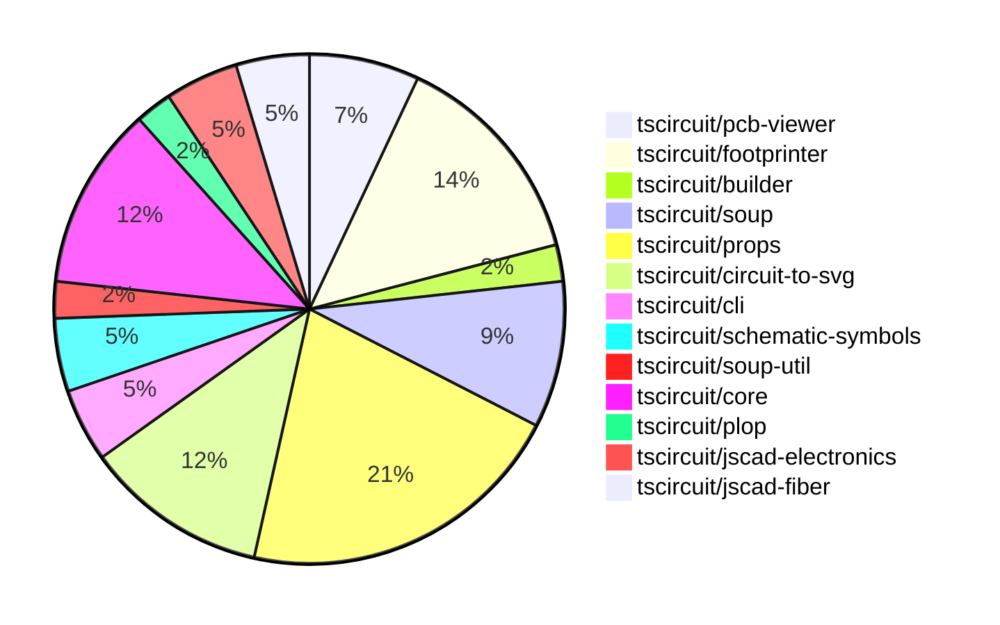

# contribution-tracker

Generates weekly contribution overviews for tscircuit contributors. Check out all
the [contribution overviews here](./contribution-overviews/)

* All PRs in the tscircuit org are scanned/summarized via Claude Haiku
* Claude classifies each Diff/PR as a Major, Minor or Tiny contribution
* All the PRs, summaries, and classifications are organized into charts and tables

The current week is shown below. There are 3 major sections:

* [Contributor Overview](#contributor-overview)
* [PRs by Repository](#prs-by-repository)
* [PRs by Contributor](#changes-by-contributor)

## Current Week

<!-- START_CURRENT_WEEK -->

# Contribution Overview 2024-08-24

## PRs by Repository

## Contributor Overview

| Contributor | 🐳 Major | 🐙 Minor | 🐌 Tiny |
|-------------|-------|-------|-------|
| ShiboSoftwareDev | 2 | 4 | 0 |
| imrishabh18 | 3 | 2 | 0 |
| seveibar | 12 | 6 | 0 |
| anas-sarkez | 2 | 5 | 2 |
| abhijitxy | 4 | 0 | 0 |

## Changes by Repository

### [tscircuit/pcb-viewer](https://github.com/tscircuit/pcb-viewer)

| PR # | Impact | Contributor | Description |
|------|--------|-------------|-------------|
| [#43](https://github.com/tscircuit/pcb-viewer/pull/43) | 🐳 Major | ShiboSoftwareDev | Added the pcb_board outline feature and tests |
| [#42](https://github.com/tscircuit/pcb-viewer/pull/42) | 🐳 Major | imrishabh18 | Add polygon rendering inside the Trace component |
| [#40](https://github.com/tscircuit/pcb-viewer/pull/40) | 🐳 Major | imrishabh18 | Adds support for trace-hint on plated-hole components |

### [tscircuit/footprinter](https://github.com/tscircuit/footprinter)

| PR # | Impact | Contributor | Description |
|------|--------|-------------|-------------|
| [#19](https://github.com/tscircuit/footprinter/pull/19) | 🐳 Major | ShiboSoftwareDev | Added footprints for ms-012 and ms-013 components |
| [#24](https://github.com/tscircuit/footprinter/pull/24) | 🐳 Major | anas-sarkez | Added SOT723 component definition. |
| [#23](https://github.com/tscircuit/footprinter/pull/23) | 🐳 Major | anas-sarkez | Added SOT563 function and test |
| [#25](https://github.com/tscircuit/footprinter/pull/25) | 🐙 Minor | anas-sarkez | Fixed silkscreen issue of some components |
| [#21](https://github.com/tscircuit/footprinter/pull/21) | 🐙 Minor | anas-sarkez | Added more tests for the `bga` feature. |
| [#20](https://github.com/tscircuit/footprinter/pull/20) | 🐙 Minor | anas-sarkez | Added some missing tests and snapshots |

### [tscircuit/builder](https://github.com/tscircuit/builder)

| PR # | Impact | Contributor | Description |
|------|--------|-------------|-------------|
| [#105](https://github.com/tscircuit/builder/pull/105) | 🐙 Minor | ShiboSoftwareDev | Added optional `outline` prop to `board-builder` to draw the board with an outline if it has at least three elements. |

### [tscircuit/soup](https://github.com/tscircuit/soup)

| PR # | Impact | Contributor | Description |
|------|--------|-------------|-------------|
| [#30](https://github.com/tscircuit/soup/pull/30) | 🐳 Major | seveibar | Add support for customizing the styles of pins in the schematic component. |
| [#29](https://github.com/tscircuit/soup/pull/29) | 🐙 Minor | ShiboSoftwareDev | Make `pcb_board_id` and `route_thickness_mode` optional in the PCB board and trace models |
| [#28](https://github.com/tscircuit/soup/pull/28) | 🐙 Minor | ShiboSoftwareDev | Added an optional `outline` property of type `z.array(point)` to the PCB board definition. |
| [#31](https://github.com/tscircuit/soup/pull/31) | 🐙 Minor | imrishabh18 | Change the default mode for `trace` to `constant` instead of `interpolated`. |

### [tscircuit/props](https://github.com/tscircuit/props)

| PR # | Impact | Contributor | Description |
|------|--------|-------------|-------------|
| [#32](https://github.com/tscircuit/props/pull/32) | 🐳 Major | seveibar | This pull request refactors the project by splitting the code into multiple files, separating props from zod types, and adding a type check to ensure parity. |
| [#31](https://github.com/tscircuit/props/pull/31) | 🐳 Major | seveibar | Add testing and template for new structure |
| [#25](https://github.com/tscircuit/props/pull/25) | 🐙 Minor | ShiboSoftwareDev | Added an optional `outline` property to the `boardProps` object. |
| [#34](https://github.com/tscircuit/props/pull/34) | 🐙 Minor | imrishabh18 | Add symbol name as a prop to the CommonComponentProps type. |
| [#33](https://github.com/tscircuit/props/pull/33) | 🐙 Minor | seveibar | Remove the "auto" options for some parameters in the chip component. |
| [#29](https://github.com/tscircuit/props/pull/29) | 🟣 | seveibar | Update the formatbot GitHub Action to not run against forks. |
| [#30](https://github.com/tscircuit/props/pull/30) | 🐳 Major | seveibar | Revert build system to use --dts, add `schPinStyle` and other schematic box improvements, and add support for camelCase route hint points. |
| [#24](https://github.com/tscircuit/props/pull/24) | 🐙 Minor | seveibar | Modify the `pinLabels` type to accept both numbers and strings to fix React parsing issues. |
| [#22](https://github.com/tscircuit/props/pull/22) | 🐙 Minor | seveibar | Make the `for` prop in `<tracehint>` component optional to support a new syntax where the `<tracehint>` is nested inside a `<trace>` component. |

### [tscircuit/circuit-to-svg](https://github.com/tscircuit/circuit-to-svg)

| PR # | Impact | Contributor | Description |
|------|--------|-------------|-------------|
| [#25](https://github.com/tscircuit/circuit-to-svg/pull/25) | 🐳 Major | imrishabh18 | Integrate schematic symbols by using the `circuitJsonToSchematicSvg` function, which returns a Promise that needs to be parsed by `svgson`. |
| [#29](https://github.com/tscircuit/circuit-to-svg/pull/29) | 🐙 Minor | anas-sarkez | Integrated custom silkscreen with adjustable stroke width for PCB boundary. |
| [#27](https://github.com/tscircuit/circuit-to-svg/pull/27) | 🐙 Minor | anas-sarkez | Updated the silkscreen of the printed circuit board (PCB). |
| [#31](https://github.com/tscircuit/circuit-to-svg/pull/31) | 🐌 Tiny | anas-sarkez | Removed the console log for null elements in the `pcb-soup-to-svg.ts` file. |
| [#30](https://github.com/tscircuit/circuit-to-svg/pull/30) | 🐌 Tiny | anas-sarkez | Removed console logs that were printing SVG object data. |

### [tscircuit/cli](https://github.com/tscircuit/cli)

| PR # | Impact | Contributor | Description |
|------|--------|-------------|-------------|
| [#131](https://github.com/tscircuit/cli/pull/131) | 🐳 Major | seveibar | Add support for the @tscircuit/core beta in the CLI |
| [#130](https://github.com/tscircuit/cli/pull/130) | 🐙 Minor | seveibar | Updated the `export-gerbers.ts` file to change the `flip_y_axis` option to `false` for both Gerber and Excellon drill commands. |

### [tscircuit/schematic-symbols](https://github.com/tscircuit/schematic-symbols)

| PR # | Impact | Contributor | Description |
|------|--------|-------------|-------------|
| [#12](https://github.com/tscircuit/schematic-symbols/pull/12) | 🐳 Major | seveibar | Reorganizes the build system to generate files more explicitly for the project. |
| [#10](https://github.com/tscircuit/schematic-symbols/pull/10) | 🐳 Major | seveibar | Introduced a new function `getInnerSvg` to export the inner SVG elements without the surrounding SVG tag. |

### [tscircuit/soup-util](https://github.com/tscircuit/soup-util)

| PR # | Impact | Contributor | Description |
|------|--------|-------------|-------------|
| [#9](https://github.com/tscircuit/soup-util/pull/9) | 🐙 Minor | seveibar | Allow creating soup util with validation turned on |

### [tscircuit/core](https://github.com/tscircuit/core)

| PR # | Impact | Contributor | Description |
|------|--------|-------------|-------------|
| [#14](https://github.com/tscircuit/core/pull/14) | 🐳 Major | seveibar | Introduce support for reporting bundle and install size in the GitHub Actions workflow. |
| [#13](https://github.com/tscircuit/core/pull/13) | 🐳 Major | seveibar | Introduce a GitHub Actions workflow to track the bundle size of the project and report the difference between the base branch and the pull request branch. |
| [#10](https://github.com/tscircuit/core/pull/10) | 🐳 Major | seveibar | Introduce a new Chip component with support for various properties and rendering of source, schematic, and PCB components. |
| [#6](https://github.com/tscircuit/core/pull/6) | 🐳 Major | seveibar | Introduce a new feature to support trace hints in the Trace class |
| [#4](https://github.com/tscircuit/core/pull/4) | 🐳 Major | seveibar |  |

### [tscircuit/plop](https://github.com/tscircuit/plop)

| PR # | Impact | Contributor | Description |
|------|--------|-------------|-------------|
| [#4](https://github.com/tscircuit/plop/pull/4) | 🐙 Minor | seveibar | Update the formatbot workflow to not run against forks. |

### [tscircuit/jscad-electronics](https://github.com/tscircuit/jscad-electronics)

| PR # | Impact | Contributor | Description |
|------|--------|-------------|-------------|
| [#16](https://github.com/tscircuit/jscad-electronics/pull/16) | 🐳 Major | abhijitxy | Implement a BGA (Ball Grid Array) component with various configurable properties and support for missing balls. |
| [#14](https://github.com/tscircuit/jscad-electronics/pull/14) | 🐳 Major | abhijitxy | Implement SOT-23-3P Component |

### [tscircuit/jscad-fiber](https://github.com/tscircuit/jscad-fiber)

| PR # | Impact | Contributor | Description |
|------|--------|-------------|-------------|
| [#73](https://github.com/tscircuit/jscad-fiber/pull/73) | 🐳 Major | abhijitxy | Introduce a degree to radian conversion function for rotating 3D objects |
| [#72](https://github.com/tscircuit/jscad-fiber/pull/72) | 🐳 Major | abhijitxy | Implemented the Rotate component to support string input for rotation angles in addition to existing Point3 and array formats. |

## Changes by Contributor

### [ShiboSoftwareDev](https://github.com/ShiboSoftwareDev)

| PR # | Impact | Description |
|------|--------|-------------|
| [#43](https://github.com/tscircuit/pcb-viewer/pull/43) | 🐳 Major | Added the pcb_board outline feature and tests |
| [#19](https://github.com/tscircuit/footprinter/pull/19) | 🐳 Major | Added footprints for ms-012 and ms-013 components |
| [#105](https://github.com/tscircuit/builder/pull/105) | 🐙 Minor | Added optional `outline` prop to `board-builder` to draw the board with an outline if it has at least three elements. |
| [#29](https://github.com/tscircuit/soup/pull/29) | 🐙 Minor | Make `pcb_board_id` and `route_thickness_mode` optional in the PCB board and trace models |
| [#28](https://github.com/tscircuit/soup/pull/28) | 🐙 Minor | Added an optional `outline` property of type `z.array(point)` to the PCB board definition. |
| [#25](https://github.com/tscircuit/props/pull/25) | 🐙 Minor | Added an optional `outline` property to the `boardProps` object. |

### [imrishabh18](https://github.com/imrishabh18)

| PR # | Impact | Description |
|------|--------|-------------|
| [#42](https://github.com/tscircuit/pcb-viewer/pull/42) | 🐳 Major | Add polygon rendering inside the Trace component |
| [#40](https://github.com/tscircuit/pcb-viewer/pull/40) | 🐳 Major | Adds support for trace-hint on plated-hole components |
| [#25](https://github.com/tscircuit/circuit-to-svg/pull/25) | 🐳 Major | Integrate schematic symbols by using the `circuitJsonToSchematicSvg` function, which returns a Promise that needs to be parsed by `svgson`. |
| [#31](https://github.com/tscircuit/soup/pull/31) | 🐙 Minor | Change the default mode for `trace` to `constant` instead of `interpolated`. |
| [#34](https://github.com/tscircuit/props/pull/34) | 🐙 Minor | Add symbol name as a prop to the CommonComponentProps type. |

### [seveibar](https://github.com/seveibar)

| PR # | Impact | Description |
|------|--------|-------------|
| [#131](https://github.com/tscircuit/cli/pull/131) | 🐳 Major | Add support for the @tscircuit/core beta in the CLI |
| [#30](https://github.com/tscircuit/soup/pull/30) | 🐳 Major | Add support for customizing the styles of pins in the schematic component. |
| [#32](https://github.com/tscircuit/props/pull/32) | 🐳 Major | This pull request refactors the project by splitting the code into multiple files, separating props from zod types, and adding a type check to ensure parity. |
| [#31](https://github.com/tscircuit/props/pull/31) | 🐳 Major | Add testing and template for new structure |
| [#12](https://github.com/tscircuit/schematic-symbols/pull/12) | 🐳 Major | Reorganizes the build system to generate files more explicitly for the project. |
| [#10](https://github.com/tscircuit/schematic-symbols/pull/10) | 🐳 Major | Introduced a new function `getInnerSvg` to export the inner SVG elements without the surrounding SVG tag. |
| [#130](https://github.com/tscircuit/cli/pull/130) | 🐙 Minor | Updated the `export-gerbers.ts` file to change the `flip_y_axis` option to `false` for both Gerber and Excellon drill commands. |
| [#9](https://github.com/tscircuit/soup-util/pull/9) | 🐙 Minor | Allow creating soup util with validation turned on |
| [#33](https://github.com/tscircuit/props/pull/33) | 🐙 Minor | Remove the "auto" options for some parameters in the chip component. |
| [#29](https://github.com/tscircuit/props/pull/29) | 🟣 | Update the formatbot GitHub Action to not run against forks. |
| [#30](https://github.com/tscircuit/props/pull/30) | 🐳 Major | Revert build system to use --dts, add `schPinStyle` and other schematic box improvements, and add support for camelCase route hint points. |
| [#14](https://github.com/tscircuit/core/pull/14) | 🐳 Major | Introduce support for reporting bundle and install size in the GitHub Actions workflow. |
| [#13](https://github.com/tscircuit/core/pull/13) | 🐳 Major | Introduce a GitHub Actions workflow to track the bundle size of the project and report the difference between the base branch and the pull request branch. |
| [#10](https://github.com/tscircuit/core/pull/10) | 🐳 Major | Introduce a new Chip component with support for various properties and rendering of source, schematic, and PCB components. |
| [#6](https://github.com/tscircuit/core/pull/6) | 🐳 Major | Introduce a new feature to support trace hints in the Trace class |
| [#4](https://github.com/tscircuit/core/pull/4) | 🐳 Major |  |
| [#24](https://github.com/tscircuit/props/pull/24) | 🐙 Minor | Modify the `pinLabels` type to accept both numbers and strings to fix React parsing issues. |
| [#22](https://github.com/tscircuit/props/pull/22) | 🐙 Minor | Make the `for` prop in `<tracehint>` component optional to support a new syntax where the `<tracehint>` is nested inside a `<trace>` component. |
| [#4](https://github.com/tscircuit/plop/pull/4) | 🐙 Minor | Update the formatbot workflow to not run against forks. |

### [anas-sarkez](https://github.com/anas-sarkez)

| PR # | Impact | Description |
|------|--------|-------------|
| [#24](https://github.com/tscircuit/footprinter/pull/24) | 🐳 Major | Added SOT723 component definition. |
| [#23](https://github.com/tscircuit/footprinter/pull/23) | 🐳 Major | Added SOT563 function and test |
| [#25](https://github.com/tscircuit/footprinter/pull/25) | 🐙 Minor | Fixed silkscreen issue of some components |
| [#21](https://github.com/tscircuit/footprinter/pull/21) | 🐙 Minor | Added more tests for the `bga` feature. |
| [#20](https://github.com/tscircuit/footprinter/pull/20) | 🐙 Minor | Added some missing tests and snapshots |
| [#29](https://github.com/tscircuit/circuit-to-svg/pull/29) | 🐙 Minor | Integrated custom silkscreen with adjustable stroke width for PCB boundary. |
| [#27](https://github.com/tscircuit/circuit-to-svg/pull/27) | 🐙 Minor | Updated the silkscreen of the printed circuit board (PCB). |
| [#31](https://github.com/tscircuit/circuit-to-svg/pull/31) | 🐌 Tiny | Removed the console log for null elements in the `pcb-soup-to-svg.ts` file. |
| [#30](https://github.com/tscircuit/circuit-to-svg/pull/30) | 🐌 Tiny | Removed console logs that were printing SVG object data. |

### [abhijitxy](https://github.com/abhijitxy)

| PR # | Impact | Description |
|------|--------|-------------|
| [#16](https://github.com/tscircuit/jscad-electronics/pull/16) | 🐳 Major | Implement a BGA (Ball Grid Array) component with various configurable properties and support for missing balls. |
| [#14](https://github.com/tscircuit/jscad-electronics/pull/14) | 🐳 Major | Implement SOT-23-3P Component |
| [#73](https://github.com/tscircuit/jscad-fiber/pull/73) | 🐳 Major | Introduce a degree to radian conversion function for rotating 3D objects |
| [#72](https://github.com/tscircuit/jscad-fiber/pull/72) | 🐳 Major | Implemented the Rotate component to support string input for rotation angles in addition to existing Point3 and array formats. |

<!-- END_CURRENT_WEEK -->
