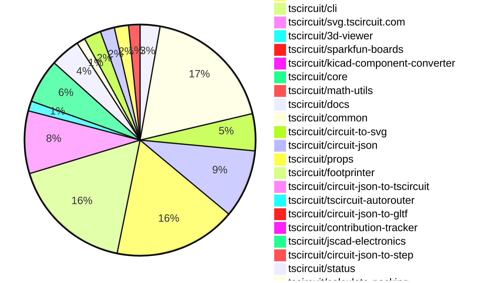
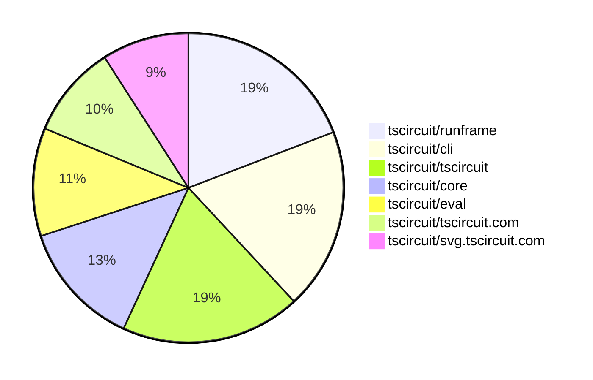

# contribution-tracker

[contributions.tscircuit.com](https://contributions.tscircuit.com) ・ [tscircuit.com](https://tscircuit.com) ・ [Contribution Overviews](./contribution-overviews/) ・ [Changelogs](./changelogs/)

Generates weekly contribution overviews for tscircuit contributors. Check out all
the [contribution overviews here](./contribution-overviews/)
You can find AI-generated monthly changelogs in the [changelogs directory](./changelogs/).

- All PRs in the tscircuit org are scanned/summarized via an LLM
- The LLM classifies each Diff/PR as into a set of attributes for scoring
- All the PRs, summaries, and classifications are organized into charts and tables for [the website](https://contributions.tscircuit.com)

> Want to run locally? See the [Development Section](#development)

The current week is shown below. There are 4 major sections:

- [Contributor Overview](#contributor-overview)
- [PRs by Repository](#prs-by-repository)
- [PRs by Contributor](#changes-by-contributor)
- [Scoring & Sponsorship System](#scoring--sponsorship-system)

## Current Week

<!-- START_CURRENT_WEEK -->

# Contribution Overview 2025-10-15

## PRs by Repository



## Contributor Overview

| Contributor | 🐳 Major | 🐙 Minor | 🐌 Tiny | ⭐ | Score | Discussion Contributions |
|-------------|---------|---------|---------|-----|----------------|--------------------------|
| [seveibar](#seveibar) | 6 | 39 | 26 | 👑 | 75 | 1🔹 0🔶 0💎 |
| [imrishabh18](#imrishabh18) | 5 | 12 | 10 | 👑 | 57 | 0🔹 0🔶 0💎 |
| [Abse2001](#Abse2001) | 3 | 8 | 5 | ⭐⭐⭐ | 39 | 0🔹 0🔶 0💎 |
| [ArnavK-09](#ArnavK-09) | 5 | 4 | 5 | ⭐⭐⭐ | 37 | 1🔹 0🔶 0💎 |
| [MustafaMulla29](#MustafaMulla29) | 2 | 9 | 3 | ⭐⭐⭐ | 33 | 0🔹 0🔶 0💎 |
| [ShiboSoftwareDev](#ShiboSoftwareDev) | 1 | 9 | 3 | ⭐⭐ | 29 | 0🔹 0🔶 0💎 |
| [techmannih](#techmannih) | 1 | 6 | 4 | ⭐⭐ | 25 | 0🔹 0🔶 0💎 |
| [tscircuitbot](#tscircuitbot) | 0 | 0 | 349 | ⭐⭐ | 18 | 0🔹 0🔶 0💎 |
| [Ayushjhawar8](#Ayushjhawar8) | 2 | 1 | 4 | ⭐⭐ | 14 | 0🔹 0🔶 0💎 |
| [Asymtode712](#Asymtode712) | 0 | 4 | 1 | ⭐ | 9 | 0🔹 0🔶 0💎 |
| [Excellencedev](#Excellencedev) | 1 | 1 | 0 | ⭐ | 7 | 0🔹 0🔶 0💎 |
| [Heinrich-XIAO](#Heinrich-XIAO) | 0 | 2 | 2 | ⭐ | 6 | 0🔹 0🔶 0💎 |
| [fctpe](#fctpe) | 1 | 0 | 0 | ⭐ | 4 | 0🔹 0🔶 0💎 |
| [Prachi-kushwaha](#Prachi-kushwaha) | 0 | 1 | 0 |  | 2 | 0🔹 0🔶 0💎 |
| [nailoo](#nailoo) | 0 | 0 | 1 |  | 1 | 0🔹 0🔶 0💎 |
| [theajmalrazaq](#theajmalrazaq) | 0 | 0 | 1 |  | 1 | 0🔹 0🔶 0💎 |

> Note: AI evaluates PRs and assigns 1-3 star ratings automatically. 4 and 5 star ratings require manual staff review.

### Discussion Contribution Legend

- 🔹 Normal Comments: Basic participation with minimal effort
- 🔶 Great Informative Comments: Thoughtful participation that adds value
- 💎 Incredible Comments: Exceptional participation with high-quality content

## Review Table

[reviews-received-hover]: ## "Number of reviews received for PRs for this contributor"
[approvals-received-hover]: ## "Number of approvals received for PRs this contributor authored"
[rejections-received-hover]: ## "Number of rejections received for PRs this contributor authored"
[prs-opened-hover]: ## "Number of PRs opened by this contributor"
[issues-created-hover]: ## "Number of issues created by this contributor"
[bountied-issues-hover]: ## "Number of issues this contributor created with a bounty"
[bountied-issue-$-hover]: ## "Total bounty amount placed on issues authored by this contributor"

| Contributor | Reviews Received | Approvals Received | Rejections Received | Approvals | Rejections | PRs Opened | PRs Merged | Score | Issues Created | Bountied Issues | Bountied Issue $ |
|---|---|---|---|---|---|---|---|---|---|---|---|
| [tscircuitbot](#tscircuitbot) | 1 | 0 | 0 | 0 | 0 | 406 | 360 | 18 | 0 | 0 | 0 |
| [Abse2001](#Abse2001) | 37 | 14 | 0 | 5 | 0 | 21 | 16 | 39 | 0 | 0 | 0 |
| [seveibar](#seveibar) | 37 | 5 | 0 | 89 | 13 | 92 | 72 | 75 | 0 | 0 | 0 |
| [techmannih](#techmannih) | 19 | 12 | 2 | 3 | 2 | 13 | 11 | 25 | 0 | 0 | 0 |
| [MustafaMulla29](#MustafaMulla29) | 26 | 15 | 5 | 1 | 3 | 20 | 14 | 33 | 0 | 0 | 0 |
| [imrishabh18](#imrishabh18) | 29 | 11 | 0 | 2 | 3 | 30 | 28 | 57 | 0 | 0 | 0 |
| [ShiboSoftwareDev](#ShiboSoftwareDev) | 15 | 11 | 0 | 3 | 0 | 14 | 13 | 29 | 0 | 0 | 0 |
| [Asymtode712](#Asymtode712) | 9 | 6 | 1 | 0 | 0 | 6 | 5 | 9 | 0 | 0 | 0 |
| [fctpe](#fctpe) | 10 | 1 | 1 | 0 | 0 | 3 | 1 | 4 | 0 | 0 | 0 |
| [Quanta-Naut](#Quanta-Naut) | 10 | 1 | 4 | 0 | 0 | 3 | 0 | 0 | 0 | 0 | 0 |
| [Excellencedev](#Excellencedev) | 24 | 2 | 3 | 0 | 0 | 13 | 2 | 7 | 0 | 0 | 0 |
| [ArnavK-09](#ArnavK-09) | 21 | 12 | 0 | 2 | 0 | 17 | 14 | 37 | 0 | 0 | 0 |
| [nailoo](#nailoo) | 12 | 3 | 1 | 0 | 0 | 5 | 1 | 1 | 0 | 0 | 0 |
| [MAVRICK-1](#MAVRICK-1) | 1 | 0 | 0 | 0 | 0 | 1 | 0 | 0 | 0 | 0 | 0 |
| [Sukuna0007Abhi](#Sukuna0007Abhi) | 1 | 0 | 1 | 0 | 0 | 1 | 0 | 0 | 0 | 0 | 0 |
| [Ayushjhawar8](#Ayushjhawar8) | 7 | 6 | 0 | 0 | 0 | 8 | 7 | 14 | 0 | 0 | 0 |
| [Heinrich-XIAO](#Heinrich-XIAO) | 5 | 4 | 0 | 0 | 0 | 5 | 4 | 6 | 0 | 0 | 0 |
| [theajmalrazaq](#theajmalrazaq) | 2 | 1 | 0 | 0 | 0 | 1 | 1 | 1 | 0 | 0 | 0 |
| [Pranjal6955](#Pranjal6955) | 0 | 0 | 0 | 0 | 0 | 1 | 0 | 0 | 0 | 0 | 0 |
| [Incharajayaram](#Incharajayaram) | 1 | 0 | 1 | 0 | 0 | 1 | 0 | 0 | 0 | 0 | 0 |
| [7908837174](#7908837174) | 2 | 0 | 1 | 0 | 0 | 1 | 0 | 0 | 0 | 0 | 0 |
| [BenraouaneSoufiane](#BenraouaneSoufiane) | 0 | 0 | 0 | 0 | 0 | 2 | 0 | 0 | 0 | 0 | 0 |
| [watzon](#watzon) | 0 | 0 | 0 | 0 | 0 | 1 | 0 | 0 | 0 | 0 | 0 |
| [0hmX](#0hmX) | 2 | 0 | 1 | 0 | 0 | 1 | 0 | 0 | 0 | 0 | 0 |
| [Prachi-kushwaha](#Prachi-kushwaha) | 1 | 1 | 0 | 0 | 0 | 1 | 1 | 2 | 0 | 0 | 0 |

## Top 7 Repositories by Contribution Points



## Scoring & Sponsorship System

### Overview

PRs are analyzed by AI and assigned a **star rating (1-3 stars)**. 4 and 5 star ratings can only be manually assigned by staff. Weekly scores use `2^(starRating - 1)` per PR (capped at 12 PRs per rating), plus review/discussion points.

### Weekly Score → Star String

| Score Range | Star String | Count Value |
|------------|-------------|-------------|
| 0-3 | (empty) | 0 stars |
| 4-10 | ⭐ | 1 star |
| 11-30 | ⭐⭐ | 2 stars |
| 31-50 | ⭐⭐⭐ | 3 stars |
| 51-75 | 👑 | 1 crowns |
| 76-100 | 👑👑 | 2 crowns |
| 101+ | 👑👑👑 | 3 crowns |

> Crowns count as 3 stars for sponsorship.

### Monthly Sponsorship Calculation

The sponsorship system calculates monthly payments based on your **weekly star counts** over the complete weeks in that month (typically 4-5 weeks, Wednesday-Tuesday format).

**Step 1: Collect Weekly Stars**
- All complete weeks in the month are analyzed
- Each week's star string is converted to a numeric count (1 ⭐ = 1 star, 👑 = 3 stars)
- Example: `[2, 2, 2, 1, 0]` means 2 stars in week 1, 2 stars in week 2, etc.

**Step 2: Calculate Metrics**
- **Median stars**: The median value of all weekly star counts
- **Min stars**: The minimum weekly star count
- **Max stars**: The maximum weekly star count
- **High score**: The maximum raw weekly score (0-100+ range from the scoring table) from any week in the month

**Step 3: Determine Base Amount**
The sponsorship amount is calculated based on these metrics (checked in order):

| Condition | Base Amount |
|-----------|-------------|
| `minStarCount >= 3` | **$500** |
| `medianStars >= 3` | **$450** |
| `medianStars >= 2.5` | **$300** |
| `medianStars >= 2` | **$200** |
| `medianStars >= 1.5` | **$100** |
| `medianStars >= 1` | **$75** |
| `maxStarCount >= 2` | **$25** |
| `maxStarCount >= 1` | **$15** |
| `highScore >= 3` (and all stars = 0) | **$5** |


| Maintainer Level | Monthly Bonus |
|------------------|---------------|
| Level 1 | **$200** |
| Level 2 | **$350** |
| Level 3 | **$500** |

**Final Amount** = Base Amount + Maintainer Bonus


## Changes by Repository

### [tscircuit/pcb-viewer](https://github.com/tscircuit/pcb-viewer)

| PR # | Impact | Rating | Contributor | Description |
|------|--------|--------|-------------|-------------|
| [#417](https://github.com/tscircuit/pcb-viewer/pull/417) | 🐙 Minor | ⭐⭐ | Abse2001 | Fixes polygon pad hover highlighting and prevents stroke bleeding by improving hit detection and normalizing coordinates. |
| [#412](https://github.com/tscircuit/pcb-viewer/pull/412) | 🐙 Minor | ⭐⭐ | techmannih | Adds support for corner radius in SMT pad rendering, allowing for rounded corners in PCB designs. |
| [#401](https://github.com/tscircuit/pcb-viewer/pull/401) | 🐙 Minor | ⭐⭐ | techmannih | Adds functionality to render fabrication note dimensions in the PCB viewer, allowing users to visualize dimensions directly on the PCB layout. |
| [#410](https://github.com/tscircuit/pcb-viewer/pull/410) | 🐙 Minor | ⭐⭐ | MustafaMulla29 | Adds functionality to display the anchor position of a PCB group on the canvas, enhancing visual representation of PCB layouts. |
| [#406](https://github.com/tscircuit/pcb-viewer/pull/406) | 🐙 Minor | ⭐⭐ | imrishabh18 | Adds support for color overrides in PCB note shapes, allowing users to specify colors for lines, rectangles, paths, text, and dimensions. |
| [#402](https://github.com/tscircuit/pcb-viewer/pull/402) | 🐙 Minor | ⭐⭐ | imrishabh18 | Adds support for various PCB note elements including lines, rectangles, paths, dimensions, and text in the PCB viewer. |

<details>
<summary>🐌 Tiny Contributions (8)</summary>

| PR # | Impact | Contributor | Description |
|------|--------|-------------|-------------|
| [#418](https://github.com/tscircuit/pcb-viewer/pull/418) | 🐌 Tiny | tscircuitbot | Automated package update |
| [#415](https://github.com/tscircuit/pcb-viewer/pull/415) | 🐌 Tiny | tscircuitbot | Automated package update |
| [#413](https://github.com/tscircuit/pcb-viewer/pull/413) | 🐌 Tiny | tscircuitbot | Automated package update |
| [#411](https://github.com/tscircuit/pcb-viewer/pull/411) | 🐌 Tiny | tscircuitbot | Automated package update |
| [#407](https://github.com/tscircuit/pcb-viewer/pull/407) | 🐌 Tiny | tscircuitbot | Automated package update |
| [#405](https://github.com/tscircuit/pcb-viewer/pull/405) | 🐌 Tiny | tscircuitbot | Automated package update |
| [#403](https://github.com/tscircuit/pcb-viewer/pull/403) | 🐌 Tiny | tscircuitbot | Automated package update |
| [#414](https://github.com/tscircuit/pcb-viewer/pull/414) | 🐌 Tiny | seveibar | Changes the rendering of selector hover text to use a more compact syntax, omitting unnamed components and port hints. |

</details>

### [tscircuit/tscircuit](https://github.com/tscircuit/tscircuit)


<details>
<summary>🐌 Tiny Contributions (93)</summary>

| PR # | Impact | Contributor | Description |
|------|--------|-------------|-------------|
| [#1129](https://github.com/tscircuit/tscircuit/pull/1129) | 🐌 Tiny | tscircuitbot | Automated package update |
| [#1128](https://github.com/tscircuit/tscircuit/pull/1128) | 🐌 Tiny | tscircuitbot | Automated package update |
| [#1127](https://github.com/tscircuit/tscircuit/pull/1127) | 🐌 Tiny | tscircuitbot | Automated package update |
| [#1126](https://github.com/tscircuit/tscircuit/pull/1126) | 🐌 Tiny | tscircuitbot | Updates the tscircuitcli package from version 0.1.365 to 0.1.366 and the tscircuitrunframe package from version 0.0.1130 to 0.0.1131 in package.json |
| [#1125](https://github.com/tscircuit/tscircuit/pull/1125) | 🐌 Tiny | tscircuitbot | Automated package update |
| [#1124](https://github.com/tscircuit/tscircuit/pull/1124) | 🐌 Tiny | tscircuitbot | Automated package update |
| [#1123](https://github.com/tscircuit/tscircuit/pull/1123) | 🐌 Tiny | tscircuitbot | Automated package update |
| [#1122](https://github.com/tscircuit/tscircuit/pull/1122) | 🐌 Tiny | tscircuitbot | Automated package update |
| [#1120](https://github.com/tscircuit/tscircuit/pull/1120) | 🐌 Tiny | tscircuitbot | Updates the package version from 0.0.795 to 0.0.796 in package.json |
| [#1119](https://github.com/tscircuit/tscircuit/pull/1119) | 🐌 Tiny | tscircuitbot | Automated package update |
| [#1118](https://github.com/tscircuit/tscircuit/pull/1118) | 🐌 Tiny | tscircuitbot | Automated package update |
| [#1117](https://github.com/tscircuit/tscircuit/pull/1117) | 🐌 Tiny | tscircuitbot | Automated package update |
| [#1116](https://github.com/tscircuit/tscircuit/pull/1116) | 🐌 Tiny | tscircuitbot | Automated package update |
| [#1115](https://github.com/tscircuit/tscircuit/pull/1115) | 🐌 Tiny | tscircuitbot | Automated package update |
| [#1114](https://github.com/tscircuit/tscircuit/pull/1114) | 🐌 Tiny | tscircuitbot | Automated package update |
| [#1113](https://github.com/tscircuit/tscircuit/pull/1113) | 🐌 Tiny | tscircuitbot | Automated package update |
| [#1112](https://github.com/tscircuit/tscircuit/pull/1112) | 🐌 Tiny | tscircuitbot | Automated package update |
| [#1111](https://github.com/tscircuit/tscircuit/pull/1111) | 🐌 Tiny | tscircuitbot | Updates the tscircuitcli package to version 0.1.359 in the package.json file |
| [#1110](https://github.com/tscircuit/tscircuit/pull/1110) | 🐌 Tiny | tscircuitbot | Updates the package version from 0.0.790 to 0.0.791 in package.json |
| [#1109](https://github.com/tscircuit/tscircuit/pull/1109) | 🐌 Tiny | tscircuitbot | Updates the tscircuitcli package to version 0.1.358 in the package.json file |
| [#1108](https://github.com/tscircuit/tscircuit/pull/1108) | 🐌 Tiny | tscircuitbot | Automated package update |
| [#1107](https://github.com/tscircuit/tscircuit/pull/1107) | 🐌 Tiny | tscircuitbot | Automated package update |
| [#1105](https://github.com/tscircuit/tscircuit/pull/1105) | 🐌 Tiny | tscircuitbot | Updates the tscircuitcli package version from 0.1.355 to 0.1.356 in package.json |
| [#1104](https://github.com/tscircuit/tscircuit/pull/1104) | 🐌 Tiny | tscircuitbot | Automated package update |
| [#1103](https://github.com/tscircuit/tscircuit/pull/1103) | 🐌 Tiny | tscircuitbot | Automated package update |
| [#1102](https://github.com/tscircuit/tscircuit/pull/1102) | 🐌 Tiny | tscircuitbot | Automated package update |
| [#1101](https://github.com/tscircuit/tscircuit/pull/1101) | 🐌 Tiny | tscircuitbot | Automated package update |
| [#1100](https://github.com/tscircuit/tscircuit/pull/1100) | 🐌 Tiny | tscircuitbot | Automated package update |
| [#1099](https://github.com/tscircuit/tscircuit/pull/1099) | 🐌 Tiny | tscircuitbot | Updates the tscircuitcli and other related package versions in package.json |
| [#1098](https://github.com/tscircuit/tscircuit/pull/1098) | 🐌 Tiny | tscircuitbot | Automated package update |
| [#1097](https://github.com/tscircuit/tscircuit/pull/1097) | 🐌 Tiny | tscircuitbot | Automated package update |
| [#1095](https://github.com/tscircuit/tscircuit/pull/1095) | 🐌 Tiny | tscircuitbot | Automated package update |
| [#1094](https://github.com/tscircuit/tscircuit/pull/1094) | 🐌 Tiny | tscircuitbot | Automated package update |
| [#1093](https://github.com/tscircuit/tscircuit/pull/1093) | 🐌 Tiny | tscircuitbot | Automated package update |
| [#1092](https://github.com/tscircuit/tscircuit/pull/1092) | 🐌 Tiny | tscircuitbot | Automated package update |
| [#1091](https://github.com/tscircuit/tscircuit/pull/1091) | 🐌 Tiny | tscircuitbot | Updates the package version from 0.0.781 to 0.0.782 in package.json |
| [#1090](https://github.com/tscircuit/tscircuit/pull/1090) | 🐌 Tiny | tscircuitbot | Updates package versions in package.json for tscircuitcli, tscircuitcore, tscircuiteval, tscircuitprops, tscircuitrunframe, and circuit-json. |
| [#1085](https://github.com/tscircuit/tscircuit/pull/1085) | 🐌 Tiny | tscircuitbot | Updates the package version from 0.0.780 to 0.0.781 in package.json |
| [#1084](https://github.com/tscircuit/tscircuit/pull/1084) | 🐌 Tiny | tscircuitbot | Updates the tscircuitcli package from version 0.1.347 to 0.1.348 and the tscircuitrunframe package from version 0.0.1116 to 0.0.1117 in package.json |
| [#1083](https://github.com/tscircuit/tscircuit/pull/1083) | 🐌 Tiny | tscircuitbot | Automated package update |
| [#1082](https://github.com/tscircuit/tscircuit/pull/1082) | 🐌 Tiny | tscircuitbot | Updates the tscircuitcli package version from 0.1.346 to 0.1.347 in package.json |
| [#1079](https://github.com/tscircuit/tscircuit/pull/1079) | 🐌 Tiny | tscircuitbot | Automated package update |
| [#1078](https://github.com/tscircuit/tscircuit/pull/1078) | 🐌 Tiny | tscircuitbot | Updates the versions of several dependencies in the package.json file. |
| [#1073](https://github.com/tscircuit/tscircuit/pull/1073) | 🐌 Tiny | tscircuitbot | Automated package update |
| [#1072](https://github.com/tscircuit/tscircuit/pull/1072) | 🐌 Tiny | tscircuitbot | Updates the tscircuitcli package from version 0.1.344 to 0.1.345 and the tscircuitrunframe package from version 0.0.1114 to 0.0.1115 in package.json |
| [#1071](https://github.com/tscircuit/tscircuit/pull/1071) | 🐌 Tiny | tscircuitbot | Automated package update |
| [#1069](https://github.com/tscircuit/tscircuit/pull/1069) | 🐌 Tiny | tscircuitbot | Updates the package version from 0.0.775 to 0.0.776 in package.json |
| [#1068](https://github.com/tscircuit/tscircuit/pull/1068) | 🐌 Tiny | tscircuitbot | Automated package update |
| [#1067](https://github.com/tscircuit/tscircuit/pull/1067) | 🐌 Tiny | tscircuitbot | Automated package update |
| [#1066](https://github.com/tscircuit/tscircuit/pull/1066) | 🐌 Tiny | tscircuitbot | Automated package update |
| [#1064](https://github.com/tscircuit/tscircuit/pull/1064) | 🐌 Tiny | tscircuitbot | Updates the tscircuitcli package from version 0.1.341 to 0.1.342 and the tscircuitrunframe package from version 0.0.1111 to 0.0.1112 in package.json |
| [#1063](https://github.com/tscircuit/tscircuit/pull/1063) | 🐌 Tiny | tscircuitbot | Updates the package version from 0.0.772 to 0.0.773 in package.json |
| [#1062](https://github.com/tscircuit/tscircuit/pull/1062) | 🐌 Tiny | tscircuitbot | Updates the tscircuitcli and tscircuiteval packages to their latest versions. |
| [#1061](https://github.com/tscircuit/tscircuit/pull/1061) | 🐌 Tiny | tscircuitbot | Automated package update |
| [#1060](https://github.com/tscircuit/tscircuit/pull/1060) | 🐌 Tiny | tscircuitbot | Updates the tscircuitcli package from version 0.1.339 to 0.1.340 and the tscircuitrunframe package from version 0.0.1110 to 0.0.1111 in package.json |
| [#1059](https://github.com/tscircuit/tscircuit/pull/1059) | 🐌 Tiny | tscircuitbot | Automated package update |
| [#1058](https://github.com/tscircuit/tscircuit/pull/1058) | 🐌 Tiny | tscircuitbot | Updates the tscircuitcli package to version 0.1.339 in package.json |
| [#1057](https://github.com/tscircuit/tscircuit/pull/1057) | 🐌 Tiny | tscircuitbot | Automated package update |
| [#1056](https://github.com/tscircuit/tscircuit/pull/1056) | 🐌 Tiny | tscircuitbot | Updates the tscircuitcli package from version 0.1.337 to 0.1.338 and the tscircuitrunframe package from version 0.0.1109 to 0.0.1110 in package.json |
| [#1055](https://github.com/tscircuit/tscircuit/pull/1055) | 🐌 Tiny | tscircuitbot | Automated package update |
| [#1054](https://github.com/tscircuit/tscircuit/pull/1054) | 🐌 Tiny | tscircuitbot | Updates the tscircuitcli package from version 0.1.336 to 0.1.337 and the tscircuitrunframe package from version 0.0.1108 to 0.0.1109 in package.json |
| [#1053](https://github.com/tscircuit/tscircuit/pull/1053) | 🐌 Tiny | tscircuitbot | Automated package update |
| [#1052](https://github.com/tscircuit/tscircuit/pull/1052) | 🐌 Tiny | tscircuitbot | Updates the tscircuitcli and other related package versions in package.json |
| [#1051](https://github.com/tscircuit/tscircuit/pull/1051) | 🐌 Tiny | tscircuitbot | Automated package update |
| [#1050](https://github.com/tscircuit/tscircuit/pull/1050) | 🐌 Tiny | tscircuitbot | Updates the tscircuitcli and tscircuiteval packages to their latest versions. |
| [#1049](https://github.com/tscircuit/tscircuit/pull/1049) | 🐌 Tiny | tscircuitbot | Updates the package version from 0.0.765 to 0.0.766 in package.json |
| [#1048](https://github.com/tscircuit/tscircuit/pull/1048) | 🐌 Tiny | tscircuitbot | Updates the tscircuitcli package from version 0.1.333 to 0.1.334 and the tscircuitrunframe package from version 0.0.1103 to 0.0.1104 in package.json |
| [#1047](https://github.com/tscircuit/tscircuit/pull/1047) | 🐌 Tiny | tscircuitbot | Automated package update |
| [#1046](https://github.com/tscircuit/tscircuit/pull/1046) | 🐌 Tiny | tscircuitbot | Updates the tscircuitcli and tscircuiteval packages to their latest versions. |
| [#1045](https://github.com/tscircuit/tscircuit/pull/1045) | 🐌 Tiny | tscircuitbot | Automated package update |
| [#1044](https://github.com/tscircuit/tscircuit/pull/1044) | 🐌 Tiny | tscircuitbot | Updates the tscircuitcli package from version 0.1.331 to 0.1.332 and the tscircuitrunframe package from version 0.0.1101 to 0.0.1102 in package.json |
| [#1043](https://github.com/tscircuit/tscircuit/pull/1043) | 🐌 Tiny | tscircuitbot | Automated package update |
| [#1042](https://github.com/tscircuit/tscircuit/pull/1042) | 🐌 Tiny | tscircuitbot | Updates the tscircuitcli package from version 0.1.330 to 0.1.331 and the tscircuitrunframe package from version 0.0.1100 to 0.0.1101 in package.json |
| [#1041](https://github.com/tscircuit/tscircuit/pull/1041) | 🐌 Tiny | tscircuitbot | Automated package update |
| [#1040](https://github.com/tscircuit/tscircuit/pull/1040) | 🐌 Tiny | tscircuitbot | Updates the tscircuitcli package from version 0.1.329 to 0.1.330 and the tscircuitrunframe package from version 0.0.1099 to 0.0.1100 in package.json |
| [#1038](https://github.com/tscircuit/tscircuit/pull/1038) | 🐌 Tiny | tscircuitbot | Automated package update |
| [#1037](https://github.com/tscircuit/tscircuit/pull/1037) | 🐌 Tiny | tscircuitbot | Updates the tscircuitcli package from version 0.1.328 to 0.1.329 and the tscircuitrunframe package from version 0.0.1098 to 0.0.1099. |
| [#1036](https://github.com/tscircuit/tscircuit/pull/1036) | 🐌 Tiny | tscircuitbot | Automated package update |
| [#1035](https://github.com/tscircuit/tscircuit/pull/1035) | 🐌 Tiny | tscircuitbot | Updates the versions of the tscircuitcli, tscircuitcore, and tscircuiteval packages in package.json |
| [#1034](https://github.com/tscircuit/tscircuit/pull/1034) | 🐌 Tiny | tscircuitbot | Automated package version bump from 0.0.758 to 0.0.759 |
| [#1032](https://github.com/tscircuit/tscircuit/pull/1032) | 🐌 Tiny | tscircuitbot | Automated package update |
| [#1031](https://github.com/tscircuit/tscircuit/pull/1031) | 🐌 Tiny | tscircuitbot | Automated package update |
| [#1030](https://github.com/tscircuit/tscircuit/pull/1030) | 🐌 Tiny | tscircuitbot | Automated package update |
| [#1029](https://github.com/tscircuit/tscircuit/pull/1029) | 🐌 Tiny | tscircuitbot | Updates the version of the tscircuitcli, tscircuitcore, and tscircuiteval packages in package.json |
| [#1028](https://github.com/tscircuit/tscircuit/pull/1028) | 🐌 Tiny | tscircuitbot | Automated package update |
| [#1027](https://github.com/tscircuit/tscircuit/pull/1027) | 🐌 Tiny | tscircuitbot | Updates the tscircuitcli package from version 0.1.324 to 0.1.325 and the tscircuitrunframe package from version 0.0.1095 to 0.0.1096. |
| [#1026](https://github.com/tscircuit/tscircuit/pull/1026) | 🐌 Tiny | tscircuitbot | Automated package update |
| [#1025](https://github.com/tscircuit/tscircuit/pull/1025) | 🐌 Tiny | tscircuitbot | Updates the tscircuitcli package from version 0.1.323 to 0.1.324 and the tscircuitrunframe package from version 0.0.1094 to 0.0.1095. |
| [#1024](https://github.com/tscircuit/tscircuit/pull/1024) | 🐌 Tiny | tscircuitbot | Automated package update |
| [#1023](https://github.com/tscircuit/tscircuit/pull/1023) | 🐌 Tiny | tscircuitbot | Automated package update |
| [#1021](https://github.com/tscircuit/tscircuit/pull/1021) | 🐌 Tiny | tscircuitbot | Automated package update |
| [#1070](https://github.com/tscircuit/tscircuit/pull/1070) | 🐌 Tiny | imrishabh18 | Adds a step to close existing PRs authored by tscircuitbot before running updates. |
| [#1033](https://github.com/tscircuit/tscircuit/pull/1033) | 🐌 Tiny | imrishabh18 | Adds a GitHub Actions workflow to send Slack notifications for failed automated package update PRs. |

</details>

### [tscircuit/tscircuit.com](https://github.com/tscircuit/tscircuit.com)

| PR # | Impact | Rating | Contributor | Description |
|------|--------|--------|-------------|-------------|
| [#1827](https://github.com/tscircuit/tscircuit.com/pull/1827) | 🐳 Major | ⭐⭐⭐ | seveibar | Replaces deprecated package image endpoints with preview image URLs across package previews, updates shared preview hook and related components to consume the new preview fields, and ensures editor pages and discovery surfaces render social cards and thumbnails from stored preview URLs. |
| [#1817](https://github.com/tscircuit/tscircuit.com/pull/1817) | 🐳 Major | ⭐⭐⭐ | ArnavK-09 | Adds latest preview image URLs for PCB, schematic, and CAD to the package schema and mapping in the API. |
| [#1809](https://github.com/tscircuit/tscircuit.com/pull/1809) | 🐳 Major | ⭐⭐⭐ | ArnavK-09 | Adds a new GET apiorgsget_member endpoint to retrieve member details by org_id or org_name and account_id, including user permissions, and implements error handling for non-existent organizations and members. |
| [#1812](https://github.com/tscircuit/tscircuit.com/pull/1812) | 🐳 Major | ⭐⭐⭐ | ArnavK-09 | Prevents the display of skeleton loading indicators when the build status is an error, improving user experience during failed loads. |
| [#1811](https://github.com/tscircuit/tscircuit.com/pull/1811) | 🐳 Major | ⭐⭐⭐ | ArnavK-09 | Adds a new autocomplete API endpoint for code suggestions based on user input in the CodeEditor component. |
| [#1793](https://github.com/tscircuit/tscircuit.com/pull/1793) | 🐳 Major | ⭐⭐⭐ | ArnavK-09 | Prevents flickering and unnecessary refetching of organization members in the application. |
| [#1821](https://github.com/tscircuit/tscircuit.com/pull/1821) | 🐙 Minor | ⭐⭐ | seveibar | Marks the initial package release as ready_to_build once files are uploaded for a new package |
| [#1825](https://github.com/tscircuit/tscircuit.com/pull/1825) | 🐙 Minor | ⭐⭐ | ArnavK-09 | Refactors the PackageCard component to utilize the latest_image_url properties for package image previews instead of a base URL, improving the way images are fetched and displayed. |
| [#1810](https://github.com/tscircuit/tscircuit.com/pull/1810) | 🐙 Minor | ⭐⭐ | ArnavK-09 | Prevents continuous requests by modifying query parameters and caching behavior in the CmdKMenu component. |
| [#1808](https://github.com/tscircuit/tscircuit.com/pull/1808) | 🐙 Minor | ⭐⭐ | ArnavK-09 | Adds role display functionality for organization members and improves member management UI. |

<details>
<summary>🐌 Tiny Contributions (16)</summary>

| PR # | Impact | Contributor | Description |
|------|--------|-------------|-------------|
| [#1824](https://github.com/tscircuit/tscircuit.com/pull/1824) | 🐌 Tiny | tscircuitbot | Automated package update |
| [#1822](https://github.com/tscircuit/tscircuit.com/pull/1822) | 🐌 Tiny | tscircuitbot | Automated package update |
| [#1819](https://github.com/tscircuit/tscircuit.com/pull/1819) | 🐌 Tiny | tscircuitbot | Automated package update |
| [#1816](https://github.com/tscircuit/tscircuit.com/pull/1816) | 🐌 Tiny | tscircuitbot | Automated package update |
| [#1815](https://github.com/tscircuit/tscircuit.com/pull/1815) | 🐌 Tiny | tscircuitbot | Automated package update |
| [#1814](https://github.com/tscircuit/tscircuit.com/pull/1814) | 🐌 Tiny | tscircuitbot | Updates the tscircuiteval package from version 0.0.407 to 0.0.408 |
| [#1813](https://github.com/tscircuit/tscircuit.com/pull/1813) | 🐌 Tiny | tscircuitbot | Updates the tscircuiteval package to version 0.0.407 in the package.json file. |
| [#1804](https://github.com/tscircuit/tscircuit.com/pull/1804) | 🐌 Tiny | tscircuitbot | Automated package update |
| [#1802](https://github.com/tscircuit/tscircuit.com/pull/1802) | 🐌 Tiny | tscircuitbot | Automated package update |
| [#1801](https://github.com/tscircuit/tscircuit.com/pull/1801) | 🐌 Tiny | tscircuitbot | Updates the tscircuiteval package from version 0.0.402 to 0.0.403 |
| [#1800](https://github.com/tscircuit/tscircuit.com/pull/1800) | 🐌 Tiny | tscircuitbot | Automated package update |
| [#1799](https://github.com/tscircuit/tscircuit.com/pull/1799) | 🐌 Tiny | tscircuitbot | Updates the tscircuiteval package from version 0.0.400 to 0.0.401 |
| [#1798](https://github.com/tscircuit/tscircuit.com/pull/1798) | 🐌 Tiny | tscircuitbot | Updates the tscircuiteval package from version 0.0.399 to 0.0.400 |
| [#1797](https://github.com/tscircuit/tscircuit.com/pull/1797) | 🐌 Tiny | tscircuitbot | Updates the tscircuiteval package from version 0.0.325 to 0.0.399 in the package.json file. |
| [#1795](https://github.com/tscircuit/tscircuit.com/pull/1795) | 🐌 Tiny | seveibar | Add a GitHub Actions workflow to automate dependency updates for the tscircuiteval package, including closing existing PRs and creating new ones for updates. |
| [#1807](https://github.com/tscircuit/tscircuit.com/pull/1807) | 🐌 Tiny | theajmalrazaq | Fixes external links issue in mobile navbar by ensuring external links open in a new tab with appropriate security attributes. |

</details>

### [tscircuit/eval](https://github.com/tscircuit/eval)

| PR # | Impact | Rating | Contributor | Description |
|------|--------|--------|-------------|-------------|
| [#1286](https://github.com/tscircuit/eval/pull/1286) | 🐳 Major | ⭐⭐⭐ | seveibar | Adds detailed logging for import failures, providing clearer error messages and context for unresolved imports in the execution context. |
| [#1302](https://github.com/tscircuit/eval/pull/1302) | 🐙 Minor | ⭐⭐ | seveibar | Detects circular dependencies in local imports and surfaces a clear error when such dependencies are formed, along with a regression test to ensure detection functionality. |
| [#1288](https://github.com/tscircuit/eval/pull/1288) | 🐙 Minor | ⭐⭐ | seveibar | Rely on the execution contexts tsconfig during file resolution instead of recomputing it from the filesystem map |
| [#1281](https://github.com/tscircuit/eval/pull/1281) | 🐙 Minor | ⭐⭐ | seveibar | Throws an error when a TypeScript config path alias matches but the corresponding file cannot be resolved, preventing fallback to npm. |
| [#1318](https://github.com/tscircuit/eval/pull/1318) | 🐙 Minor | ⭐⭐ | ShiboSoftwareDev | Enhances tsconfig.json parsing by stripping comments and providing clearer error messages for malformed configurations. |
| [#1292](https://github.com/tscircuit/eval/pull/1292) | 🐙 Minor | ⭐⭐ | Excellencedev | Fixes issue 1282 by making sure dont need to specify paths in tsconfig in order to import files from the root directory |

<details>
<summary>🐌 Tiny Contributions (42)</summary>

| PR # | Impact | Contributor | Description |
|------|--------|-------------|-------------|
| [#1356](https://github.com/tscircuit/eval/pull/1356) | 🐌 Tiny | tscircuitbot | Automated package update |
| [#1355](https://github.com/tscircuit/eval/pull/1355) | 🐌 Tiny | tscircuitbot | Updates the package versions in package.json to their latest compatible versions. |
| [#1353](https://github.com/tscircuit/eval/pull/1353) | 🐌 Tiny | tscircuitbot | Automated package update |
| [#1352](https://github.com/tscircuit/eval/pull/1352) | 🐌 Tiny | tscircuitbot | Automated package update |
| [#1350](https://github.com/tscircuit/eval/pull/1350) | 🐌 Tiny | tscircuitbot | Automated package update |
| [#1349](https://github.com/tscircuit/eval/pull/1349) | 🐌 Tiny | tscircuitbot | Automated package update |
| [#1341](https://github.com/tscircuit/eval/pull/1341) | 🐌 Tiny | tscircuitbot | Automated package update |
| [#1339](https://github.com/tscircuit/eval/pull/1339) | 🐌 Tiny | tscircuitbot | Automated package update |
| [#1333](https://github.com/tscircuit/eval/pull/1333) | 🐌 Tiny | tscircuitbot | Automated package update |
| [#1332](https://github.com/tscircuit/eval/pull/1332) | 🐌 Tiny | tscircuitbot | Automated package update |
| [#1330](https://github.com/tscircuit/eval/pull/1330) | 🐌 Tiny | tscircuitbot | Automated package update |
| [#1329](https://github.com/tscircuit/eval/pull/1329) | 🐌 Tiny | tscircuitbot | Automated package update |
| [#1327](https://github.com/tscircuit/eval/pull/1327) | 🐌 Tiny | tscircuitbot | Automated package update |
| [#1326](https://github.com/tscircuit/eval/pull/1326) | 🐌 Tiny | tscircuitbot | Automated package update |
| [#1324](https://github.com/tscircuit/eval/pull/1324) | 🐌 Tiny | tscircuitbot | Automated package update |
| [#1323](https://github.com/tscircuit/eval/pull/1323) | 🐌 Tiny | tscircuitbot | Automated package update |
| [#1319](https://github.com/tscircuit/eval/pull/1319) | 🐌 Tiny | tscircuitbot | Automated package update |
| [#1316](https://github.com/tscircuit/eval/pull/1316) | 🐌 Tiny | tscircuitbot | Automated package update |
| [#1315](https://github.com/tscircuit/eval/pull/1315) | 🐌 Tiny | tscircuitbot | Automated package update |
| [#1313](https://github.com/tscircuit/eval/pull/1313) | 🐌 Tiny | tscircuitbot | Automated package update |
| [#1312](https://github.com/tscircuit/eval/pull/1312) | 🐌 Tiny | tscircuitbot | Updates the version of the tscircuitcore package from 0.0.797 to 0.0.798 in package.json |
| [#1310](https://github.com/tscircuit/eval/pull/1310) | 🐌 Tiny | tscircuitbot | Automated package update |
| [#1309](https://github.com/tscircuit/eval/pull/1309) | 🐌 Tiny | tscircuitbot | Automated package update |
| [#1303](https://github.com/tscircuit/eval/pull/1303) | 🐌 Tiny | tscircuitbot | Automated package update |
| [#1299](https://github.com/tscircuit/eval/pull/1299) | 🐌 Tiny | tscircuitbot | Automated package update |
| [#1298](https://github.com/tscircuit/eval/pull/1298) | 🐌 Tiny | tscircuitbot | Updates the version of the tscircuitcore package from 0.0.792 to 0.0.793 in package.json |
| [#1296](https://github.com/tscircuit/eval/pull/1296) | 🐌 Tiny | tscircuitbot | Automated package update |
| [#1294](https://github.com/tscircuit/eval/pull/1294) | 🐌 Tiny | tscircuitbot | Automated package update |
| [#1291](https://github.com/tscircuit/eval/pull/1291) | 🐌 Tiny | tscircuitbot | Automated package update |
| [#1289](https://github.com/tscircuit/eval/pull/1289) | 🐌 Tiny | tscircuitbot | Automated package update |
| [#1287](https://github.com/tscircuit/eval/pull/1287) | 🐌 Tiny | tscircuitbot | Automated package update |
| [#1283](https://github.com/tscircuit/eval/pull/1283) | 🐌 Tiny | tscircuitbot | Automated package update |
| [#1280](https://github.com/tscircuit/eval/pull/1280) | 🐌 Tiny | tscircuitbot | Automated package update |
| [#1279](https://github.com/tscircuit/eval/pull/1279) | 🐌 Tiny | tscircuitbot | Updates the version of the tscircuitcore package from 0.0.791 to 0.0.792 in package.json |
| [#1277](https://github.com/tscircuit/eval/pull/1277) | 🐌 Tiny | tscircuitbot | Automated package update |
| [#1276](https://github.com/tscircuit/eval/pull/1276) | 🐌 Tiny | tscircuitbot | Updates the version of the tscircuitcore package from 0.0.790 to 0.0.791 in package.json |
| [#1274](https://github.com/tscircuit/eval/pull/1274) | 🐌 Tiny | tscircuitbot | Automated package update |
| [#1273](https://github.com/tscircuit/eval/pull/1273) | 🐌 Tiny | tscircuitbot | Updates the version of the tscircuitcore package from 0.0.789 to 0.0.790 in package.json |
| [#1271](https://github.com/tscircuit/eval/pull/1271) | 🐌 Tiny | tscircuitbot | Automated package update |
| [#1270](https://github.com/tscircuit/eval/pull/1270) | 🐌 Tiny | tscircuitbot | Updates package dependencies to their latest versions |
| [#1290](https://github.com/tscircuit/eval/pull/1290) | 🐌 Tiny | seveibar | Adds the UPSTREAM_PACKAGES_TO_UPDATE environment variable to the release workflow, allowing for more specific control over which upstream packages are updated during the release process. |
| [#1295](https://github.com/tscircuit/eval/pull/1295) | 🐌 Tiny | imrishabh18 | Updates the kicad-component-converter dependency from version 0.1.22 to 0.1.27 in package.json |

</details>

### [tscircuit/runframe](https://github.com/tscircuit/runframe)

| PR # | Impact | Rating | Contributor | Description |
|------|--------|--------|-------------|-------------|
| [#1382](https://github.com/tscircuit/runframe/pull/1382) | 🐳 Major | ⭐⭐⭐ | ShiboSoftwareDev | Adds INITIAL_FILES_UPLOADED event to prevent rendering before all initial files are available, addressing race conditions and import errors in RunFrame. |
| [#1486](https://github.com/tscircuit/runframe/pull/1486) | 🐳 Major | ⭐⭐⭐ | Ayushjhawar8 | Adds functionality to save favorite files to local storage and sets the current directory to the current file by default in the file selector component. |
| [#1439](https://github.com/tscircuit/runframe/pull/1439) | 🐙 Minor | ⭐⭐ | seveibar | Filters the RunFrame board selector using includeBoardFiles parsed from tscircuit.config.json and adds a fallback mechanism for invalid configurations. |
| [#1435](https://github.com/tscircuit/runframe/pull/1435) | 🐙 Minor | ⭐⭐ | seveibar | Fixes the issue where debug downloads display Object object instead of readable object content by stringifying non-string debug outputs. |
| [#1468](https://github.com/tscircuit/runframe/pull/1468) | 🐙 Minor | ⭐⭐ | Asymtode712 | Removes deleted files from the file dropdown by implementing a new event handling mechanism for file deletion events. |

<details>
<summary>🐌 Tiny Contributions (81)</summary>

| PR # | Impact | Contributor | Description |
|------|--------|-------------|-------------|
| [#1523](https://github.com/tscircuit/runframe/pull/1523) | 🐌 Tiny | tscircuitbot | Automated package update |
| [#1522](https://github.com/tscircuit/runframe/pull/1522) | 🐌 Tiny | tscircuitbot | Updates the tscircuiteval package from version 0.0.413 to 0.0.414 |
| [#1521](https://github.com/tscircuit/runframe/pull/1521) | 🐌 Tiny | tscircuitbot | Automated package update |
| [#1520](https://github.com/tscircuit/runframe/pull/1520) | 🐌 Tiny | tscircuitbot | Updates the tscircuiteval package to version 0.0.413 in the package.json file. |
| [#1519](https://github.com/tscircuit/runframe/pull/1519) | 🐌 Tiny | tscircuitbot | Automated package update to version 0.0.1133 |
| [#1518](https://github.com/tscircuit/runframe/pull/1518) | 🐌 Tiny | tscircuitbot | Updates the tscircuiteval package to version 0.0.412 |
| [#1517](https://github.com/tscircuit/runframe/pull/1517) | 🐌 Tiny | tscircuitbot | Automated package update |
| [#1516](https://github.com/tscircuit/runframe/pull/1516) | 🐌 Tiny | tscircuitbot | Updates the tscircuit3d-viewer package to version 0.0.418 in the package.json file. |
| [#1515](https://github.com/tscircuit/runframe/pull/1515) | 🐌 Tiny | tscircuitbot | Automated package update |
| [#1514](https://github.com/tscircuit/runframe/pull/1514) | 🐌 Tiny | tscircuitbot | Updates the tscircuitpcb-viewer package from version 1.11.234 to 1.11.235 |
| [#1513](https://github.com/tscircuit/runframe/pull/1513) | 🐌 Tiny | tscircuitbot | Automated package update to version 0.0.1130 |
| [#1512](https://github.com/tscircuit/runframe/pull/1512) | 🐌 Tiny | tscircuitbot | Updates the tscircuiteval package from version 0.0.410 to 0.0.411 |
| [#1511](https://github.com/tscircuit/runframe/pull/1511) | 🐌 Tiny | tscircuitbot | Automated package update |
| [#1510](https://github.com/tscircuit/runframe/pull/1510) | 🐌 Tiny | tscircuitbot | Updates the tscircuit3d-viewer package from version 0.0.416 to 0.0.417 |
| [#1508](https://github.com/tscircuit/runframe/pull/1508) | 🐌 Tiny | tscircuitbot | Automated package update |
| [#1507](https://github.com/tscircuit/runframe/pull/1507) | 🐌 Tiny | tscircuitbot | Updates the tscircuiteval package from version 0.0.409 to 0.0.410 |
| [#1506](https://github.com/tscircuit/runframe/pull/1506) | 🐌 Tiny | tscircuitbot | Automated package update |
| [#1505](https://github.com/tscircuit/runframe/pull/1505) | 🐌 Tiny | tscircuitbot | Updates the tscircuiteval package from version 0.0.408 to 0.0.409 |
| [#1504](https://github.com/tscircuit/runframe/pull/1504) | 🐌 Tiny | tscircuitbot | Automated package update |
| [#1503](https://github.com/tscircuit/runframe/pull/1503) | 🐌 Tiny | tscircuitbot | Updates the tscircuiteval package from version 0.0.407 to 0.0.408 |
| [#1502](https://github.com/tscircuit/runframe/pull/1502) | 🐌 Tiny | tscircuitbot | Automated package update to version 0.0.1125 |
| [#1501](https://github.com/tscircuit/runframe/pull/1501) | 🐌 Tiny | tscircuitbot | Updates the tscircuiteval package to version 0.0.407 |
| [#1499](https://github.com/tscircuit/runframe/pull/1499) | 🐌 Tiny | tscircuitbot | Automated package update to version 0.0.1124 |
| [#1498](https://github.com/tscircuit/runframe/pull/1498) | 🐌 Tiny | tscircuitbot | Updates the tscircuit3d-viewer package to version 0.0.416 in the package.json file. |
| [#1497](https://github.com/tscircuit/runframe/pull/1497) | 🐌 Tiny | tscircuitbot | Automated package update |
| [#1496](https://github.com/tscircuit/runframe/pull/1496) | 🐌 Tiny | tscircuitbot | Updates the tscircuit3d-viewer package to version 0.0.415 in package.json |
| [#1495](https://github.com/tscircuit/runframe/pull/1495) | 🐌 Tiny | tscircuitbot | Automated package update |
| [#1494](https://github.com/tscircuit/runframe/pull/1494) | 🐌 Tiny | tscircuitbot | Automated package update |
| [#1493](https://github.com/tscircuit/runframe/pull/1493) | 🐌 Tiny | tscircuitbot | Updates the package version from 0.0.1120 to 0.0.1121 in package.json |
| [#1492](https://github.com/tscircuit/runframe/pull/1492) | 🐌 Tiny | tscircuitbot | Updates the tscircuitpcb-viewer package from version 1.11.233 to 1.11.234 |
| [#1491](https://github.com/tscircuit/runframe/pull/1491) | 🐌 Tiny | tscircuitbot | Automated package update |
| [#1490](https://github.com/tscircuit/runframe/pull/1490) | 🐌 Tiny | tscircuitbot | Updates the tscircuiteval package from version 0.0.403 to 0.0.404 |
| [#1489](https://github.com/tscircuit/runframe/pull/1489) | 🐌 Tiny | tscircuitbot | Automated package update to version 0.0.1119 |
| [#1488](https://github.com/tscircuit/runframe/pull/1488) | 🐌 Tiny | tscircuitbot | Updates the tscircuiteval package to version 0.0.403 in the package.json file. |
| [#1487](https://github.com/tscircuit/runframe/pull/1487) | 🐌 Tiny | tscircuitbot | Updates the package version from 0.0.1117 to 0.0.1118 in package.json |
| [#1484](https://github.com/tscircuit/runframe/pull/1484) | 🐌 Tiny | tscircuitbot | Automated package update to version 0.0.1117 |
| [#1483](https://github.com/tscircuit/runframe/pull/1483) | 🐌 Tiny | tscircuitbot | Updates the tscircuitpcb-viewer package from version 1.11.232 to 1.11.233 |
| [#1482](https://github.com/tscircuit/runframe/pull/1482) | 🐌 Tiny | tscircuitbot | Updates the package version from 0.0.1115 to 0.0.1116 in package.json |
| [#1481](https://github.com/tscircuit/runframe/pull/1481) | 🐌 Tiny | tscircuitbot | Updates the tscircuiteval package to version 0.0.402 in the package.json file. |
| [#1480](https://github.com/tscircuit/runframe/pull/1480) | 🐌 Tiny | tscircuitbot | Updates the package version from 0.0.1114 to 0.0.1115 in package.json |
| [#1479](https://github.com/tscircuit/runframe/pull/1479) | 🐌 Tiny | tscircuitbot | Automated package update to version 0.0.1114 |
| [#1478](https://github.com/tscircuit/runframe/pull/1478) | 🐌 Tiny | tscircuitbot | Updates the tscircuiteval package to version 0.0.401 in the package.json file. |
| [#1477](https://github.com/tscircuit/runframe/pull/1477) | 🐌 Tiny | tscircuitbot | Automated package version bump from 0.0.1112 to 0.0.1113 |
| [#1476](https://github.com/tscircuit/runframe/pull/1476) | 🐌 Tiny | tscircuitbot | Updates the tscircuiteval package to version 0.0.400 |
| [#1475](https://github.com/tscircuit/runframe/pull/1475) | 🐌 Tiny | tscircuitbot | Updates the package version from 0.0.1111 to 0.0.1112 in package.json |
| [#1474](https://github.com/tscircuit/runframe/pull/1474) | 🐌 Tiny | tscircuitbot | Updates the tscircuiteval package to version 0.0.399 |
| [#1473](https://github.com/tscircuit/runframe/pull/1473) | 🐌 Tiny | tscircuitbot | Automated package update |
| [#1472](https://github.com/tscircuit/runframe/pull/1472) | 🐌 Tiny | tscircuitbot | Updates the tscircuitpcb-viewer package from version 1.11.231 to 1.11.232 |
| [#1471](https://github.com/tscircuit/runframe/pull/1471) | 🐌 Tiny | tscircuitbot | Automated package update |
| [#1469](https://github.com/tscircuit/runframe/pull/1469) | 🐌 Tiny | tscircuitbot | Automated package update |
| [#1467](https://github.com/tscircuit/runframe/pull/1467) | 🐌 Tiny | tscircuitbot | Updates the package version from 0.0.1107 to 0.0.1108 in package.json |
| [#1466](https://github.com/tscircuit/runframe/pull/1466) | 🐌 Tiny | tscircuitbot | Updates the tscircuiteval package to version 0.0.398 in package.json |
| [#1465](https://github.com/tscircuit/runframe/pull/1465) | 🐌 Tiny | tscircuitbot | Automated package update |
| [#1464](https://github.com/tscircuit/runframe/pull/1464) | 🐌 Tiny | tscircuitbot | Updates the tscircuit3d-viewer package to version 0.0.414 in package.json |
| [#1463](https://github.com/tscircuit/runframe/pull/1463) | 🐌 Tiny | tscircuitbot | Automated package update |
| [#1462](https://github.com/tscircuit/runframe/pull/1462) | 🐌 Tiny | tscircuitbot | Updates the tscircuiteval package to version 0.0.397 in the package.json file. |
| [#1461](https://github.com/tscircuit/runframe/pull/1461) | 🐌 Tiny | tscircuitbot | Automated package update |
| [#1459](https://github.com/tscircuit/runframe/pull/1459) | 🐌 Tiny | tscircuitbot | Updates the tscircuiteval package to version 0.0.396 in the package.json file. |
| [#1458](https://github.com/tscircuit/runframe/pull/1458) | 🐌 Tiny | tscircuitbot | Updates the package version from 0.0.1103 to 0.0.1104 in package.json |
| [#1457](https://github.com/tscircuit/runframe/pull/1457) | 🐌 Tiny | tscircuitbot | Updates the tscircuitpcb-viewer package from version 1.11.230 to 1.11.231 |
| [#1456](https://github.com/tscircuit/runframe/pull/1456) | 🐌 Tiny | tscircuitbot | Automated package update |
| [#1455](https://github.com/tscircuit/runframe/pull/1455) | 🐌 Tiny | tscircuitbot | Updates the tscircuiteval package to version 0.0.395 |
| [#1454](https://github.com/tscircuit/runframe/pull/1454) | 🐌 Tiny | tscircuitbot | Automated package update |
| [#1453](https://github.com/tscircuit/runframe/pull/1453) | 🐌 Tiny | tscircuitbot | Updates the tscircuitpcb-viewer package from version 1.11.229 to 1.11.230 |
| [#1452](https://github.com/tscircuit/runframe/pull/1452) | 🐌 Tiny | tscircuitbot | Automated package update |
| [#1451](https://github.com/tscircuit/runframe/pull/1451) | 🐌 Tiny | tscircuitbot | Updates the tscircuit3d-viewer package from version 0.0.412 to 0.0.413 |
| [#1450](https://github.com/tscircuit/runframe/pull/1450) | 🐌 Tiny | tscircuitbot | Automated package update |
| [#1449](https://github.com/tscircuit/runframe/pull/1449) | 🐌 Tiny | tscircuitbot | Updates the tscircuitpcb-viewer package from version 1.11.228 to 1.11.229 |
| [#1448](https://github.com/tscircuit/runframe/pull/1448) | 🐌 Tiny | tscircuitbot | Updates the package version from 0.0.1098 to 0.0.1099 in package.json |
| [#1447](https://github.com/tscircuit/runframe/pull/1447) | 🐌 Tiny | tscircuitbot | Updates the tscircuiteval package to version 0.0.394 |
| [#1446](https://github.com/tscircuit/runframe/pull/1446) | 🐌 Tiny | tscircuitbot | Automated package update |
| [#1445](https://github.com/tscircuit/runframe/pull/1445) | 🐌 Tiny | tscircuitbot | Updates the tscircuiteval package to version 0.0.393 in the package.json file. |
| [#1444](https://github.com/tscircuit/runframe/pull/1444) | 🐌 Tiny | tscircuitbot | Automated package update |
| [#1443](https://github.com/tscircuit/runframe/pull/1443) | 🐌 Tiny | tscircuitbot | Updates the tscircuiteval package to version 0.0.392 in the package.json file. |
| [#1442](https://github.com/tscircuit/runframe/pull/1442) | 🐌 Tiny | tscircuitbot | Updates the package version from 0.0.1095 to 0.0.1096 in package.json |
| [#1441](https://github.com/tscircuit/runframe/pull/1441) | 🐌 Tiny | tscircuitbot | Automated package update |
| [#1440](https://github.com/tscircuit/runframe/pull/1440) | 🐌 Tiny | tscircuitbot | Updates the tscircuit3d-viewer package from version 0.0.411 to 0.0.412 |
| [#1438](https://github.com/tscircuit/runframe/pull/1438) | 🐌 Tiny | tscircuitbot | Automated package update |
| [#1437](https://github.com/tscircuit/runframe/pull/1437) | 🐌 Tiny | tscircuitbot | Automated package update |
| [#1436](https://github.com/tscircuit/runframe/pull/1436) | 🐌 Tiny | tscircuitbot | Updates the package version from 0.0.1092 to 0.0.1093 in package.json |
| [#1470](https://github.com/tscircuit/runframe/pull/1470) | 🐌 Tiny | Ayushjhawar8 | img width1074 height561 altimage srchttps:github.comuser-attachmentsassets6ebe85ed-b5b4-4868-9c7e-512f0563b88d  img width1071 height510 altimage srchttps:github.comuser-attachmentsassets400fe2bf-b35b-4232-bee9-aa3ecdd54960 |

</details>

### [tscircuit/cli](https://github.com/tscircuit/cli)

| PR # | Impact | Rating | Contributor | Description |
|------|--------|--------|-------------|-------------|
| [#660](https://github.com/tscircuit/cli/pull/660) | 🐳 Major | ⭐⭐⭐ | seveibar | Adds support for filtering directory builds based on configured includeBoardFiles patterns and improves error handling for unmatched files. |
| [#657](https://github.com/tscircuit/cli/pull/657) | 🐙 Minor | ⭐⭐ | seveibar | Add a --all-images flag to the build command to generate preview images for every successful build output. |
| [#642](https://github.com/tscircuit/cli/pull/642) | 🐙 Minor | ⭐⭐ | seveibar | Implements individual error handling for generating circuit JSON, PCB SVG, schematic SVG, and 3D snapshots, improving robustness in snapshot generation. |
| [#649](https://github.com/tscircuit/cli/pull/649) | 🐙 Minor | ⭐⭐ | MustafaMulla29 | Allows users to specify a custom directory for snapshot outputs in the tscircuit configuration file, enhancing flexibility in project organization. |
| [#636](https://github.com/tscircuit/cli/pull/636) | 🐙 Minor | ⭐⭐ | ShiboSoftwareDev | Resolves a race condition in the dev server where the front-end runframe could attempt to render a circuit before all of its dependent files were available. |
| [#618](https://github.com/tscircuit/cli/pull/618) | 🐙 Minor | ⭐⭐ | Asymtode712 | Adds handling for FILE_DELETED events to synchronize file deletions in the DevServer, including a new FileDeletedEvent interface and event listener. |

<details>
<summary>🐌 Tiny Contributions (80)</summary>

| PR # | Impact | Contributor | Description |
|------|--------|-------------|-------------|
| [#685](https://github.com/tscircuit/cli/pull/685) | 🐌 Tiny | tscircuitbot | Automated package update |
| [#684](https://github.com/tscircuit/cli/pull/684) | 🐌 Tiny | tscircuitbot | Updates the tscircuitrunframe package from version 0.0.1134 to 0.0.1135 |
| [#683](https://github.com/tscircuit/cli/pull/683) | 🐌 Tiny | tscircuitbot | Automated package update |
| [#682](https://github.com/tscircuit/cli/pull/682) | 🐌 Tiny | tscircuitbot | Automated package update |
| [#681](https://github.com/tscircuit/cli/pull/681) | 🐌 Tiny | tscircuitbot | Automated package update |
| [#680](https://github.com/tscircuit/cli/pull/680) | 🐌 Tiny | tscircuitbot | Updates the tscircuitrunframe package to version 0.0.1133 |
| [#679](https://github.com/tscircuit/cli/pull/679) | 🐌 Tiny | tscircuitbot | Automated package update |
| [#678](https://github.com/tscircuit/cli/pull/678) | 🐌 Tiny | tscircuitbot | Updates the tscircuitrunframe package from version 0.0.1131 to 0.0.1132 |
| [#677](https://github.com/tscircuit/cli/pull/677) | 🐌 Tiny | tscircuitbot | Automated package update |
| [#676](https://github.com/tscircuit/cli/pull/676) | 🐌 Tiny | tscircuitbot | Updates the tscircuitrunframe package from version 0.0.1130 to 0.0.1131 |
| [#675](https://github.com/tscircuit/cli/pull/675) | 🐌 Tiny | tscircuitbot | Automated package update |
| [#674](https://github.com/tscircuit/cli/pull/674) | 🐌 Tiny | tscircuitbot | Updates the tscircuitrunframe package from version 0.0.1129 to 0.0.1130 |
| [#673](https://github.com/tscircuit/cli/pull/673) | 🐌 Tiny | tscircuitbot | Automated package update |
| [#672](https://github.com/tscircuit/cli/pull/672) | 🐌 Tiny | tscircuitbot | Updates the tscircuitrunframe package from version 0.0.1128 to 0.0.1129 |
| [#671](https://github.com/tscircuit/cli/pull/671) | 🐌 Tiny | tscircuitbot | Automated package update |
| [#670](https://github.com/tscircuit/cli/pull/670) | 🐌 Tiny | tscircuitbot | Updates the tscircuitrunframe package from version 0.0.1127 to 0.0.1128 |
| [#669](https://github.com/tscircuit/cli/pull/669) | 🐌 Tiny | tscircuitbot | Automated package update |
| [#668](https://github.com/tscircuit/cli/pull/668) | 🐌 Tiny | tscircuitbot | Automated package update |
| [#667](https://github.com/tscircuit/cli/pull/667) | 🐌 Tiny | tscircuitbot | Automated package update |
| [#666](https://github.com/tscircuit/cli/pull/666) | 🐌 Tiny | tscircuitbot | Updates the tscircuitrunframe package from version 0.0.1125 to 0.0.1126 |
| [#665](https://github.com/tscircuit/cli/pull/665) | 🐌 Tiny | tscircuitbot | Automated package update |
| [#664](https://github.com/tscircuit/cli/pull/664) | 🐌 Tiny | tscircuitbot | Updates the tscircuitrunframe package from version 0.0.1123 to 0.0.1125 |
| [#663](https://github.com/tscircuit/cli/pull/663) | 🐌 Tiny | tscircuitbot | Automated package update |
| [#662](https://github.com/tscircuit/cli/pull/662) | 🐌 Tiny | tscircuitbot | Automated package update |
| [#661](https://github.com/tscircuit/cli/pull/661) | 🐌 Tiny | tscircuitbot | Automated package update |
| [#658](https://github.com/tscircuit/cli/pull/658) | 🐌 Tiny | tscircuitbot | Automated package update |
| [#656](https://github.com/tscircuit/cli/pull/656) | 🐌 Tiny | tscircuitbot | Automated package update |
| [#654](https://github.com/tscircuit/cli/pull/654) | 🐌 Tiny | tscircuitbot | Updates the tscircuitrunframe package from version 0.0.1122 to 0.0.1123 |
| [#653](https://github.com/tscircuit/cli/pull/653) | 🐌 Tiny | tscircuitbot | Automated package update |
| [#652](https://github.com/tscircuit/cli/pull/652) | 🐌 Tiny | tscircuitbot | Updates the tscircuitrunframe package to version 0.0.1122 in the package.json file. |
| [#651](https://github.com/tscircuit/cli/pull/651) | 🐌 Tiny | tscircuitbot | Automated package update |
| [#650](https://github.com/tscircuit/cli/pull/650) | 🐌 Tiny | tscircuitbot | Updates the tscircuitrunframe package from version 0.0.1120 to 0.0.1121 |
| [#648](https://github.com/tscircuit/cli/pull/648) | 🐌 Tiny | tscircuitbot | Automated package update |
| [#646](https://github.com/tscircuit/cli/pull/646) | 🐌 Tiny | tscircuitbot | Automated package update |
| [#645](https://github.com/tscircuit/cli/pull/645) | 🐌 Tiny | tscircuitbot | Updates the tscircuitrunframe package to version 0.0.1120 |
| [#644](https://github.com/tscircuit/cli/pull/644) | 🐌 Tiny | tscircuitbot | Automated package update |
| [#643](https://github.com/tscircuit/cli/pull/643) | 🐌 Tiny | tscircuitbot | Updates the tscircuitrunframe package from version 0.0.1118 to 0.0.1119 |
| [#641](https://github.com/tscircuit/cli/pull/641) | 🐌 Tiny | tscircuitbot | Automated package update to version 0.1.349 |
| [#640](https://github.com/tscircuit/cli/pull/640) | 🐌 Tiny | tscircuitbot | Updates the tscircuitrunframe package from version 0.0.1117 to 0.0.1118 |
| [#639](https://github.com/tscircuit/cli/pull/639) | 🐌 Tiny | tscircuitbot | Automated package update |
| [#638](https://github.com/tscircuit/cli/pull/638) | 🐌 Tiny | tscircuitbot | Updates the tscircuitrunframe package to version 0.0.1117 |
| [#637](https://github.com/tscircuit/cli/pull/637) | 🐌 Tiny | tscircuitbot | Automated package update |
| [#635](https://github.com/tscircuit/cli/pull/635) | 🐌 Tiny | tscircuitbot | Automated package update |
| [#634](https://github.com/tscircuit/cli/pull/634) | 🐌 Tiny | tscircuitbot | Updates the tscircuitrunframe package to version 0.0.1116 |
| [#633](https://github.com/tscircuit/cli/pull/633) | 🐌 Tiny | tscircuitbot | Automated package update |
| [#632](https://github.com/tscircuit/cli/pull/632) | 🐌 Tiny | tscircuitbot | Updates the tscircuitrunframe package from version 0.0.1114 to 0.0.1115 |
| [#631](https://github.com/tscircuit/cli/pull/631) | 🐌 Tiny | tscircuitbot | Automated package update |
| [#630](https://github.com/tscircuit/cli/pull/630) | 🐌 Tiny | tscircuitbot | Updates the tscircuitrunframe package from version 0.0.1113 to 0.0.1114 |
| [#628](https://github.com/tscircuit/cli/pull/628) | 🐌 Tiny | tscircuitbot | Updates the tscircuitrunframe package from version 0.0.1112 to 0.0.1113 |
| [#629](https://github.com/tscircuit/cli/pull/629) | 🐌 Tiny | tscircuitbot | Automated package update |
| [#627](https://github.com/tscircuit/cli/pull/627) | 🐌 Tiny | tscircuitbot | Automated package update |
| [#626](https://github.com/tscircuit/cli/pull/626) | 🐌 Tiny | tscircuitbot | Updates the tscircuitrunframe package from version 0.0.1111 to 0.0.1112 |
| [#625](https://github.com/tscircuit/cli/pull/625) | 🐌 Tiny | tscircuitbot | Automated package update |
| [#623](https://github.com/tscircuit/cli/pull/623) | 🐌 Tiny | tscircuitbot | Automated package update |
| [#622](https://github.com/tscircuit/cli/pull/622) | 🐌 Tiny | tscircuitbot | Updates the tscircuitrunframe package from version 0.0.1110 to 0.0.1111 |
| [#621](https://github.com/tscircuit/cli/pull/621) | 🐌 Tiny | tscircuitbot | Automated package update |
| [#620](https://github.com/tscircuit/cli/pull/620) | 🐌 Tiny | tscircuitbot | Automated package update |
| [#619](https://github.com/tscircuit/cli/pull/619) | 🐌 Tiny | tscircuitbot | Automated package update |
| [#617](https://github.com/tscircuit/cli/pull/617) | 🐌 Tiny | tscircuitbot | Automated package update |
| [#616](https://github.com/tscircuit/cli/pull/616) | 🐌 Tiny | tscircuitbot | Updates the tscircuitrunframe package from version 0.0.1108 to 0.0.1109 |
| [#613](https://github.com/tscircuit/cli/pull/613) | 🐌 Tiny | tscircuitbot | Automated package update |
| [#612](https://github.com/tscircuit/cli/pull/612) | 🐌 Tiny | tscircuitbot | Updates the tscircuitrunframe package from version 0.0.1107 to 0.0.1108 |
| [#611](https://github.com/tscircuit/cli/pull/611) | 🐌 Tiny | tscircuitbot | Automated package update |
| [#610](https://github.com/tscircuit/cli/pull/610) | 🐌 Tiny | tscircuitbot | Updates the tscircuitrunframe package from version 0.0.1104 to 0.0.1107 |
| [#607](https://github.com/tscircuit/cli/pull/607) | 🐌 Tiny | tscircuitbot | Automated package update to version 0.1.334 |
| [#606](https://github.com/tscircuit/cli/pull/606) | 🐌 Tiny | tscircuitbot | Updates the tscircuitrunframe package from version 0.0.1103 to 0.0.1104 |
| [#605](https://github.com/tscircuit/cli/pull/605) | 🐌 Tiny | tscircuitbot | Automated package update |
| [#604](https://github.com/tscircuit/cli/pull/604) | 🐌 Tiny | tscircuitbot | Updates the tscircuitrunframe package from version 0.0.1102 to 0.0.1103 |
| [#603](https://github.com/tscircuit/cli/pull/603) | 🐌 Tiny | tscircuitbot | Automated package update |
| [#602](https://github.com/tscircuit/cli/pull/602) | 🐌 Tiny | tscircuitbot | Updates the tscircuitrunframe package from version 0.0.1101 to 0.0.1102 |
| [#601](https://github.com/tscircuit/cli/pull/601) | 🐌 Tiny | tscircuitbot | Automated package update |
| [#600](https://github.com/tscircuit/cli/pull/600) | 🐌 Tiny | tscircuitbot | Updates the tscircuitrunframe package from version 0.0.1099 to 0.0.1101 in the package.json file. |
| [#599](https://github.com/tscircuit/cli/pull/599) | 🐌 Tiny | tscircuitbot | Automated package update |
| [#597](https://github.com/tscircuit/cli/pull/597) | 🐌 Tiny | tscircuitbot | Automated package update |
| [#596](https://github.com/tscircuit/cli/pull/596) | 🐌 Tiny | tscircuitbot | Updates the tscircuitrunframe package from version 0.0.1098 to 0.0.1099 |
| [#595](https://github.com/tscircuit/cli/pull/595) | 🐌 Tiny | tscircuitbot | Automated package update |
| [#624](https://github.com/tscircuit/cli/pull/624) | 🐌 Tiny | imrishabh18 | Adds an environment variable for the GitHub Actions workflow to close existing pull requests by the bot and fixes indentation in the workflow file. |
| [#594](https://github.com/tscircuit/cli/pull/594) | 🐌 Tiny | imrishabh18 | Adds a GitHub Actions workflow to send Slack notifications for failed automated package update PRs. |
| [#655](https://github.com/tscircuit/cli/pull/655) | 🐌 Tiny | ArnavK-09 | Updates the local server URL output to include the file path when available, enhancing the clarity of the output for users. |
| [#591](https://github.com/tscircuit/cli/pull/591) | 🐌 Tiny | ArnavK-09 | Fixes the project relative path for the glb files in the package.json to ensure correct file resolution. |

</details>

### [tscircuit/svg.tscircuit.com](https://github.com/tscircuit/svg.tscircuit.com)

| PR # | Impact | Rating | Contributor | Description |
|------|--------|--------|-------------|-------------|
| [#472](https://github.com/tscircuit/svg.tscircuit.com/pull/472) | 🐙 Minor | ⭐⭐ | seveibar | Disables the parts engine by using the PlatformConfig type for project configuration updates. |

<details>
<summary>🐌 Tiny Contributions (43)</summary>

| PR # | Impact | Contributor | Description |
|------|--------|-------------|-------------|
| [#476](https://github.com/tscircuit/svg.tscircuit.com/pull/476) | 🐌 Tiny | tscircuitbot | Automated package update |
| [#475](https://github.com/tscircuit/svg.tscircuit.com/pull/475) | 🐌 Tiny | tscircuitbot | Updates the tscircuit package version from 0.0.796 to 0.0.797 in package.json |
| [#471](https://github.com/tscircuit/svg.tscircuit.com/pull/471) | 🐌 Tiny | tscircuitbot | Automated package update |
| [#470](https://github.com/tscircuit/svg.tscircuit.com/pull/470) | 🐌 Tiny | tscircuitbot | Updates the tscircuit package version from 0.0.794 to 0.0.795 in package.json |
| [#469](https://github.com/tscircuit/svg.tscircuit.com/pull/469) | 🐌 Tiny | tscircuitbot | Updates the tscircuit package version from 0.0.793 to 0.0.794 in package.json |
| [#468](https://github.com/tscircuit/svg.tscircuit.com/pull/468) | 🐌 Tiny | tscircuitbot | Automated package update |
| [#467](https://github.com/tscircuit/svg.tscircuit.com/pull/467) | 🐌 Tiny | tscircuitbot | Updates the tscircuit package version from 0.0.791 to 0.0.792 in package.json |
| [#466](https://github.com/tscircuit/svg.tscircuit.com/pull/466) | 🐌 Tiny | tscircuitbot | Updates the tscircuit package version from 0.0.790 to 0.0.791 in package.json |
| [#465](https://github.com/tscircuit/svg.tscircuit.com/pull/465) | 🐌 Tiny | tscircuitbot | Updates the tscircuit package version from 0.0.788 to 0.0.790 in package.json |
| [#464](https://github.com/tscircuit/svg.tscircuit.com/pull/464) | 🐌 Tiny | tscircuitbot | Updates the tscircuit package version from 0.0.787 to 0.0.788 in package.json |
| [#463](https://github.com/tscircuit/svg.tscircuit.com/pull/463) | 🐌 Tiny | tscircuitbot | Updates the tscircuit package version from 0.0.786 to 0.0.787 in package.json |
| [#462](https://github.com/tscircuit/svg.tscircuit.com/pull/462) | 🐌 Tiny | tscircuitbot | Automated package update |
| [#461](https://github.com/tscircuit/svg.tscircuit.com/pull/461) | 🐌 Tiny | tscircuitbot | Updates the tscircuit package version from 0.0.784 to 0.0.785 in package.json |
| [#460](https://github.com/tscircuit/svg.tscircuit.com/pull/460) | 🐌 Tiny | tscircuitbot | Automated package update |
| [#459](https://github.com/tscircuit/svg.tscircuit.com/pull/459) | 🐌 Tiny | tscircuitbot | Updates the tscircuit package version from 0.0.782 to 0.0.783 in package.json |
| [#458](https://github.com/tscircuit/svg.tscircuit.com/pull/458) | 🐌 Tiny | tscircuitbot | Updates the tscircuit package version from 0.0.781 to 0.0.782 in package.json |
| [#457](https://github.com/tscircuit/svg.tscircuit.com/pull/457) | 🐌 Tiny | tscircuitbot | Updates the tscircuit package version from 0.0.780 to 0.0.781 in package.json |
| [#456](https://github.com/tscircuit/svg.tscircuit.com/pull/456) | 🐌 Tiny | tscircuitbot | Updates the tscircuit package version from 0.0.779 to 0.0.780 in package.json |
| [#455](https://github.com/tscircuit/svg.tscircuit.com/pull/455) | 🐌 Tiny | tscircuitbot | Updates the tscircuit package version from 0.0.778 to 0.0.779 in package.json |
| [#453](https://github.com/tscircuit/svg.tscircuit.com/pull/453) | 🐌 Tiny | tscircuitbot | Updates the tscircuit package version from 0.0.777 to 0.0.778 in package.json |
| [#452](https://github.com/tscircuit/svg.tscircuit.com/pull/452) | 🐌 Tiny | tscircuitbot | Updates the tscircuit package version from 0.0.776 to 0.0.777 in package.json |
| [#451](https://github.com/tscircuit/svg.tscircuit.com/pull/451) | 🐌 Tiny | tscircuitbot | Updates the tscircuit package version from 0.0.775 to 0.0.776 in package.json |
| [#450](https://github.com/tscircuit/svg.tscircuit.com/pull/450) | 🐌 Tiny | tscircuitbot | Updates the tscircuit package version from 0.0.773 to 0.0.775 in package.json |
| [#449](https://github.com/tscircuit/svg.tscircuit.com/pull/449) | 🐌 Tiny | tscircuitbot | Updates the tscircuit package version from 0.0.772 to 0.0.773 in package.json |
| [#448](https://github.com/tscircuit/svg.tscircuit.com/pull/448) | 🐌 Tiny | tscircuitbot | Updates the tscircuit package version from 0.0.771 to 0.0.772 in package.json |
| [#447](https://github.com/tscircuit/svg.tscircuit.com/pull/447) | 🐌 Tiny | tscircuitbot | Automated package update |
| [#446](https://github.com/tscircuit/svg.tscircuit.com/pull/446) | 🐌 Tiny | tscircuitbot | Updates the tscircuit package version from 0.0.769 to 0.0.770 in package.json |
| [#445](https://github.com/tscircuit/svg.tscircuit.com/pull/445) | 🐌 Tiny | tscircuitbot | Updates the tscircuit package version from 0.0.768 to 0.0.769 in package.json |
| [#444](https://github.com/tscircuit/svg.tscircuit.com/pull/444) | 🐌 Tiny | tscircuitbot | Updates the tscircuit package version from 0.0.767 to 0.0.768 in package.json |
| [#443](https://github.com/tscircuit/svg.tscircuit.com/pull/443) | 🐌 Tiny | tscircuitbot | Updates the tscircuit package version from 0.0.766 to 0.0.767 in package.json |
| [#442](https://github.com/tscircuit/svg.tscircuit.com/pull/442) | 🐌 Tiny | tscircuitbot | Automated package update |
| [#441](https://github.com/tscircuit/svg.tscircuit.com/pull/441) | 🐌 Tiny | tscircuitbot | Automated package update |
| [#440](https://github.com/tscircuit/svg.tscircuit.com/pull/440) | 🐌 Tiny | tscircuitbot | Updates the tscircuit package version from 0.0.762 to 0.0.763 in package.json |
| [#439](https://github.com/tscircuit/svg.tscircuit.com/pull/439) | 🐌 Tiny | tscircuitbot | Updates the tscircuit package version from 0.0.761 to 0.0.762 in package.json |
| [#438](https://github.com/tscircuit/svg.tscircuit.com/pull/438) | 🐌 Tiny | tscircuitbot | Updates the tscircuit package version from 0.0.760 to 0.0.761 in package.json |
| [#437](https://github.com/tscircuit/svg.tscircuit.com/pull/437) | 🐌 Tiny | tscircuitbot | Updates the tscircuit package version from 0.0.758 to 0.0.760 in package.json |
| [#434](https://github.com/tscircuit/svg.tscircuit.com/pull/434) | 🐌 Tiny | tscircuitbot | Updates the tscircuit package version from 0.0.757 to 0.0.758 in package.json |
| [#433](https://github.com/tscircuit/svg.tscircuit.com/pull/433) | 🐌 Tiny | tscircuitbot | Updates the tscircuit package version from 0.0.756 to 0.0.757 in package.json |
| [#432](https://github.com/tscircuit/svg.tscircuit.com/pull/432) | 🐌 Tiny | tscircuitbot | Automated package update |
| [#431](https://github.com/tscircuit/svg.tscircuit.com/pull/431) | 🐌 Tiny | tscircuitbot | Updates the tscircuit package version from 0.0.754 to 0.0.755 in package.json |
| [#430](https://github.com/tscircuit/svg.tscircuit.com/pull/430) | 🐌 Tiny | tscircuitbot | Updates the tscircuit package version from 0.0.752 to 0.0.754 in package.json |
| [#473](https://github.com/tscircuit/svg.tscircuit.com/pull/473) | 🐌 Tiny | seveibar | Fixes async loading of circuit footprints and updates related snapshots in the testing suite. |
| [#435](https://github.com/tscircuit/svg.tscircuit.com/pull/435) | 🐌 Tiny | MustafaMulla29 | Updates the circuit-json-to-gltf dependency to version 0.0.26 to fix the pill hole issue and adds a test to verify the correct rendering of the pill-shaped hole in 3D SVG. |

</details>

### [tscircuit/3d-viewer](https://github.com/tscircuit/3d-viewer)

| PR # | Impact | Rating | Contributor | Description |
|------|--------|--------|-------------|-------------|
| [#528](https://github.com/tscircuit/3d-viewer/pull/528) | 🐳 Major | ⭐⭐⭐ | Abse2001 | Fixes the geometry processing for non-plated holes to ensure they fully cut through plated holes and reduces the thickness of plated pads for better alignment. |
| [#525](https://github.com/tscircuit/3d-viewer/pull/525) | 🐳 Major | ⭐⭐⭐ | Abse2001 | Add hole offset support for plated holes with rectangular pads, allowing custom hole offsets for improved alignment and realism in 3D and PCB geometries. |
| [#527](https://github.com/tscircuit/3d-viewer/pull/527) | 🐳 Major | ⭐⭐⭐ | MustafaMulla29 | Adds functionality to configure the visibility of different layers and objects in the 3D viewer, allowing users to toggle the display of specific components such as board body, copper layers, and silkscreens. |
| [#530](https://github.com/tscircuit/3d-viewer/pull/530) | 🐙 Minor | ⭐⭐ | Abse2001 | Fixes rendering of circular plated holes in the manifold viewer by switching to use hole_diameter for proper clearance and copper rendering. |
| [#526](https://github.com/tscircuit/3d-viewer/pull/526) | 🐙 Minor | ⭐⭐ | Abse2001 | Fixes a bug where hole_offset_x or hole_offset_y being undefined caused the board rendering to fail for plated holes. Defaults offsets to 0 when not provided to ensure stable geometry generation for circular and pill-shaped plated holes. |
| [#522](https://github.com/tscircuit/3d-viewer/pull/522) | 🐙 Minor | ⭐⭐ | MustafaMulla29 | Adds support for pill and rotated pill hole shapes in PCB design, allowing for more versatile hole configurations. |

<details>
<summary>🐌 Tiny Contributions (1)</summary>

| PR # | Impact | Contributor | Description |
|------|--------|-------------|-------------|
| [#529](https://github.com/tscircuit/3d-viewer/pull/529) | 🐌 Tiny | techmannih | Adds support for corner radius in surface mount technology (SMT) pads, allowing for more flexible design options in PCB layouts. |

</details>

### [tscircuit/sparkfun-boards](https://github.com/tscircuit/sparkfun-boards)

| PR # | Impact | Rating | Contributor | Description |
|------|--------|--------|-------------|-------------|
| [#187](https://github.com/tscircuit/sparkfun-boards/pull/187) | 🐳 Major | ⭐⭐⭐ | Abse2001 | Introduces a new circuit board for the SparkFun Current Sensor Breakout ACS723, including its schematic and footprint. |

### [tscircuit/kicad-component-converter](https://github.com/tscircuit/kicad-component-converter)

| PR # | Impact | Rating | Contributor | Description |
|------|--------|--------|-------------|-------------|
| [#149](https://github.com/tscircuit/kicad-component-converter/pull/149) | 🐳 Major | ⭐⭐⭐ | seveibar | Adds functionality to detect closed polygons from Edge.Cuts segments in KiCad files and convert them into pcb_cutout elements in the circuit JSON. |
| [#158](https://github.com/tscircuit/kicad-component-converter/pull/158) | 🐙 Minor | ⭐⭐ | Abse2001 | Parses KiCad JSON to extract the font size of the component reference text from fp_texts, ensuring accurate rendering on the silkscreen layer. |
| [#154](https://github.com/tscircuit/kicad-component-converter/pull/154) | 🐙 Minor | ⭐⭐ | seveibar | Fixes the handling of fabrication text layers in the conversion process by distinguishing between fabrication notes and silkscreen text based on layer attributes. |
| [#151](https://github.com/tscircuit/kicad-component-converter/pull/151) | 🐙 Minor | ⭐⭐ | imrishabh18 | Adds support for user-defined layers in KiCad by converting them to pcb_note_line and pcb_note_path elements in the tscircuit format. |

<details>
<summary>🐌 Tiny Contributions (1)</summary>

| PR # | Impact | Contributor | Description |
|------|--------|-------------|-------------|
| [#155](https://github.com/tscircuit/kicad-component-converter/pull/155) | 🐌 Tiny | imrishabh18 | Updates the circuit-json-to-tscircuit package version from 0.0.8 to 0.0.10 in package.json |

</details>

### [tscircuit/core](https://github.com/tscircuit/core)

| PR # | Impact | Rating | Contributor | Description |
|------|--------|--------|-------------|-------------|
| [#1536](https://github.com/tscircuit/core/pull/1536) | 🐳 Major | ⭐⭐⭐ | imrishabh18 | Calculates the minimum flex container size based on the outline of a group if available, otherwise defaults to width and height. |
| [#1530](https://github.com/tscircuit/core/pull/1530) | 🐳 Major | ⭐⭐⭐ | imrishabh18 | Adds support for packing groups within specified width and height bounds in PCB layout. |
| [#1512](https://github.com/tscircuit/core/pull/1512) | 🐳 Major | ⭐⭐⭐ | imrishabh18 | Fixes the issue where relative components are incorrectly passed as obstacles in the packing calculation, ensuring accurate layout packing for PCB designs. |
| [#1551](https://github.com/tscircuit/core/pull/1551) | 🐙 Minor | ⭐⭐ | Abse2001 | Adds a test for packing components outside the bounds of a PCB in the circuit rendering engine. |
| [#1548](https://github.com/tscircuit/core/pull/1548) | 🐙 Minor | ⭐⭐ | Abse2001 | Adds handling for pcb_smtpad elements with shape: pill in createComponentsFromCircuitJson to properly construct SmtPad components with rounded ends and includes a new repro test for SOIC-8 pill pad rendering. |
| [#1554](https://github.com/tscircuit/core/pull/1554) | 🐙 Minor | ⭐⭐ | seveibar | Updates the circuit JSON to GLTF format and modifies snapshot images for various components in the testing suite. |
| [#1553](https://github.com/tscircuit/core/pull/1553) | 🐙 Minor | ⭐⭐ | seveibar | Fixes rotation calculations for 3D previews to align with OpenGL conventions, ensuring accurate rendering of components in different layers. |
| [#1552](https://github.com/tscircuit/core/pull/1552) | 🐙 Minor | ⭐⭐ | seveibar | Avoids generating rounded outlines when the border radius is below 0.01mm by falling back to a rectangle and adds a regression test to verify that tiny radii produce a rectangular outline. |
| [#1550](https://github.com/tscircuit/core/pull/1550) | 🐙 Minor | ⭐⭐ | seveibar | Update default camera position for 3D snapshot tests to improve rendering accuracy and consistency. |
| [#1541](https://github.com/tscircuit/core/pull/1541) | 🐙 Minor | ⭐⭐ | seveibar | Adds a new panel  component that enforces rules for containing boards and must be the root element of the circuit. |
| [#1543](https://github.com/tscircuit/core/pull/1543) | 🐙 Minor | ⭐⭐ | seveibar | Derives 3D camera preset positions from circuit geometry to ensure deterministic camera positions for presets like bottom_angled and disables GLTF board textures by default for the snapshot helper. |
| [#1540](https://github.com/tscircuit/core/pull/1540) | 🐙 Minor | ⭐⭐ | seveibar | Moves the simple 3D snapshot matcher implementation into a dedicated extend-expect-3d-matcher module, simplifying the PCBschematic snapshot helper to only handle SVG snapshots and ensuring shared test fixture loads both circuit and 3D matcher extensions. |
| [#1527](https://github.com/tscircuit/core/pull/1527) | 🐙 Minor | ⭐⭐ | seveibar | Ensures that when the doNotPlace property is set to true for a chip, no CAD component is created, and adds a test to verify this behavior. |
| [#1525](https://github.com/tscircuit/core/pull/1525) | 🐙 Minor | ⭐⭐ | seveibar | Adds a regression test for pcbPath selectors that set a 0.5 mm trace thickness and captures the PCB snapshot for the thicker selector-driven manual route. |
| [#1520](https://github.com/tscircuit/core/pull/1520) | 🐙 Minor | ⭐⭐ | seveibar | Adds support for using string selectors in the pcbPath for traces, allowing for more flexible routing based on component pins. |
| [#1509](https://github.com/tscircuit/core/pull/1509) | 🐙 Minor | ⭐⭐ | seveibar | Reads the board components parsed thickness when calculating board thickness, updates tscircuitprops to 0.0.363 to expose zOffsetFromSurface, and adds a cadmodel surface offset test that sets an explicit board thickness. |
| [#1539](https://github.com/tscircuit/core/pull/1539) | 🐙 Minor | ⭐⭐ | techmannih | Adds support for the rotated_rect shape in the SmtPad component, allowing for the specification of width, height, and counter-clockwise rotation. |
| [#1535](https://github.com/tscircuit/core/pull/1535) | 🐙 Minor | ⭐⭐ | techmannih | Adds support for corner radius in rectangular surface mount pads, allowing for more customizable pad shapes. |
| [#1529](https://github.com/tscircuit/core/pull/1529) | 🐙 Minor | ⭐⭐ | techmannih | Fixes the rotation of SMT pads on the bottom layer to ensure correct rendering and placement. |
| [#1546](https://github.com/tscircuit/core/pull/1546) | 🐙 Minor | ⭐⭐ | MustafaMulla29 | Converts rectangular SMT pads to rotated rectangles when a PCB rotation is specified, ensuring correct rendering and solder paste generation. |
| [#1538](https://github.com/tscircuit/core/pull/1538) | 🐙 Minor | ⭐⭐ | MustafaMulla29 | Passes model_step_url when stepUrl is provided in the cadmodel, ensuring correct URL handling for CAD components. |
| [#1513](https://github.com/tscircuit/core/pull/1513) | 🐙 Minor | ⭐⭐ | MustafaMulla29 | Adds support for anchor_position and anchor_alignment properties in pcb_group, allowing for more precise positioning of PCB components based on specified anchor points. |
| [#1514](https://github.com/tscircuit/core/pull/1514) | 🐙 Minor | ⭐⭐ | imrishabh18 | Fixes incorrect board width and height calculations when an outline is provided, ensuring accurate dimensions based on user-defined parameters. |
| [#1515](https://github.com/tscircuit/core/pull/1515) | 🐙 Minor | ⭐⭐ | imrishabh18 | Fixes the selector usage for the PcbNoteDimension component to ensure correct rendering of PCB note dimensions based on component selectors. |
| [#1511](https://github.com/tscircuit/core/pull/1511) | 🐙 Minor | ⭐⭐ | imrishabh18 | Adds the PcbNoteText component for rendering text notes on PCB layouts with customizable properties such as font, size, and color. |
| [#1533](https://github.com/tscircuit/core/pull/1533) | 🐙 Minor | ⭐⭐ | ShiboSoftwareDev | Adds simulation capabilities for the switch component, allowing it to be used in SPICE analyses with new simulation properties and comprehensive tests. |
| [#1526](https://github.com/tscircuit/core/pull/1526) | 🐙 Minor | ⭐⭐ | Asymtode712 | Validates component layer placement, allowing only top or bottom layers, and emits an error for invalid layers while defaulting to top. |
| [#1510](https://github.com/tscircuit/core/pull/1510) | 🐙 Minor | ⭐⭐ | ArnavK-09 | Updated CadModel to use constructAssetUrl for better URL management and improved cache-busting logic for model URLs, along with tests for handling relative paths correctly. |

<details>
<summary>🐌 Tiny Contributions (3)</summary>

| PR # | Impact | Contributor | Description |
|------|--------|-------------|-------------|
| [#1528](https://github.com/tscircuit/core/pull/1528) | 🐌 Tiny | Abse2001 | Fixes CAD rotation logic to ensure accurate alignment with PCB component rotation during packing and layer flips, including normalization and handling for bottom-layer flips, and adds tests to verify alignment. |
| [#1549](https://github.com/tscircuit/core/pull/1549) | 🐌 Tiny | seveibar | Adds a unit test that verifies components can consume values from a React context provider in a circuit rendering. |
| [#1537](https://github.com/tscircuit/core/pull/1537) | 🐌 Tiny | techmannih | Removes image upload and failure capture steps from the test workflow, simplifying the process. |

</details>

### [tscircuit/math-utils](https://github.com/tscircuit/math-utils)

| PR # | Impact | Rating | Contributor | Description |
|------|--------|--------|-------------|-------------|
| [#25](https://github.com/tscircuit/math-utils/pull/25) | 🐙 Minor | ⭐⭐ | Abse2001 | Adds a normalizeDegrees helper that cleanly wraps any angle into the 0, 360) range using a modulo-based formula, ensuring stable rotation calculations and avoiding negative or -0 results. |
| [#26](https://github.com/tscircuit/math-utils/pull/26) | 🐙 Minor | ⭐⭐ | imrishabh18 | Calculates the bounding rectangle from an array of points and returns the bounds object or null if the array is empty |

### [tscircuit/docs](https://github.com/tscircuit/docs)

| PR # | Impact | Rating | Contributor | Description |
|------|--------|--------|-------------|-------------|
| [#269](https://github.com/tscircuit/docs/pull/269) | 🐙 Minor | ⭐⭐ | Abse2001 | Fixes the issue where the polygon smtpad is not rendered in the 3D view of the application. |
| [#242](https://github.com/tscircuit/docs/pull/242) | 🐙 Minor | ⭐⭐ | Ayushjhawar8 | Adjusts the mobile sidebar width for better visibility on smaller screens. |

<details>
<summary>🐌 Tiny Contributions (19)</summary>

| PR # | Impact | Contributor | Description |
|------|--------|-------------|-------------|
| [#274](https://github.com/tscircuit/docs/pull/274) | 🐌 Tiny | seveibar | Removes references to memoization from the React context guide and simplifies provider examples by passing the value directly without useMemo. |
| [#273](https://github.com/tscircuit/docs/pull/273) | 🐌 Tiny | seveibar | Adds a CircuitPreview example to the React context guide and removes the testing guidance section. |
| [#272](https://github.com/tscircuit/docs/pull/272) | 🐌 Tiny | seveibar | Add a TypeScript guide covering how to use React Context to avoid prop drilling in tscircuit projects, documenting typed providerconsumer patterns, memoizing context values, and testing tips for context consumers. |
| [#267](https://github.com/tscircuit/docs/pull/267) | 🐌 Tiny | seveibar | Adds documentation for the optional path argument in the tsci build command and the --all-images flag for outputting all renderable images. |
| [#265](https://github.com/tscircuit/docs/pull/265) | 🐌 Tiny | seveibar | Documents how to place components on the bottom copper layer in the layout properties guide |
| [#264](https://github.com/tscircuit/docs/pull/264) | 🐌 Tiny | seveibar | Switches the manual pcbPath example back to simplified selectors for fromto and aligns the pcbPath array entries with simplified selector syntax. |
| [#263](https://github.com/tscircuit/docs/pull/263) | 🐌 Tiny | seveibar | Clarifies the usage of the layers prop in the board  component, specifying that it commonly uses a numeric value and documenting advanced array customization. |
| [#261](https://github.com/tscircuit/docs/pull/261) | 🐌 Tiny | seveibar | Replaces the reference to Normal Component with user-facing guidance about customizing symbols via the symbol prop. |
| [#255](https://github.com/tscircuit/docs/pull/255) | 🐌 Tiny | seveibar | Adds tscircuit.com as a downstream target of tscircuiteval in the package dependency diagram. |
| [#253](https://github.com/tscircuit/docs/pull/253) | 🐌 Tiny | seveibar | Clarifies that includeBoardFiles accepts file paths or glob strings and streamlines its use cases, updating the example glob pattern to modules.board.tsx and noting that glob resolution is relative to the project root, matching mainEntrypoint. |
| [#252](https://github.com/tscircuit/docs/pull/252) | 🐌 Tiny | seveibar | Documents the behavior of the obstructsWithinBounds prop for chip placement in PCB design, including an example of its usage. |
| [#248](https://github.com/tscircuit/docs/pull/248) | 🐌 Tiny | seveibar | Removes the redundant overview heading from the group  element documentation, drops the unused key prop from the props table, and updates the LED footprint example to 0603. |
| [#249](https://github.com/tscircuit/docs/pull/249) | 🐌 Tiny | seveibar | Decrease markdown table font sizing to improve fit within content areas |
| [#246](https://github.com/tscircuit/docs/pull/246) | 🐌 Tiny | seveibar | Adds a props table covering core group  options and documents grid and flex specific layout props with CircuitPreview examples. |
| [#244](https://github.com/tscircuit/docs/pull/244) | 🐌 Tiny | MustafaMulla29 | Adds documentation for the pill shape and rotation properties of the hole  element in the circuit design library. |
| [#259](https://github.com/tscircuit/docs/pull/259) | 🐌 Tiny | imrishabh18 | Add documentation for new PCB note elements including lines, paths, rectangles, and text annotations. |
| [#258](https://github.com/tscircuit/docs/pull/258) | 🐌 Tiny | imrishabh18 | Adds documentation for the pcbnotedimension  element, which allows users to add dimension annotations to PCB designs. |
| [#256](https://github.com/tscircuit/docs/pull/256) | 🐌 Tiny | Ayushjhawar8 | Fixes the table layout to be more responsive and visually consistent across all devices by adjusting font sizes, padding, and table properties. |
| [#262](https://github.com/tscircuit/docs/pull/262) | 🐌 Tiny | Ayushjhawar8 | Fixes white space issues and improves the formatting of code elements within markdown tables. |

</details>

### [tscircuit/common](https://github.com/tscircuit/common)

| PR # | Impact | Rating | Contributor | Description |
|------|--------|--------|-------------|-------------|
| [#36](https://github.com/tscircuit/common/pull/36) | 🐙 Minor | ⭐⭐ | Prachi-kushwaha | Adds support for the SparkFun ProMicroBoard (both 5v and 3.3v) including its circuit and footprint implementation. |

<details>
<summary>🐌 Tiny Contributions (5)</summary>

| PR # | Impact | Contributor | Description |
|------|--------|-------------|-------------|
| [#39](https://github.com/tscircuit/common/pull/39) | 🐌 Tiny | Abse2001 | Updates the CODEOWNERS file to include both seveibar and Abse2001 as code owners for the repository. |
| [#38](https://github.com/tscircuit/common/pull/38) | 🐌 Tiny | Abse2001 | Updates the tscircuit dependency version from 0.0.766 to 0.0.800 in package.json |
| [#37](https://github.com/tscircuit/common/pull/37) | 🐌 Tiny | Abse2001 | Adds a GitHub Actions workflow for automatic verification of tsci snapshots on every push to main and pull requests, ensuring visual and structural consistency of circuits. |
| [#34](https://github.com/tscircuit/common/pull/34) | 🐌 Tiny | Abse2001 | Adds a new pcbGap property to board properties and repositions the Xiao RP2040 pads to the bottom side of the board for accurate alignment, along with updating SVG and 3D snapshots to reflect these changes. |
| [#35](https://github.com/tscircuit/common/pull/35) | 🐌 Tiny | seveibar | Adds the doNotPlace attribute to common boards to prevent placement of components in certain areas. |

</details>

### [tscircuit/circuit-to-svg](https://github.com/tscircuit/circuit-to-svg)

| PR # | Impact | Rating | Contributor | Description |
|------|--------|--------|-------------|-------------|
| [#390](https://github.com/tscircuit/circuit-to-svg/pull/390) | 🐳 Major | ⭐⭐⭐ | seveibar | Adds support for rendering pcb_panel elements, updates to the latest circuit-json release, and includes a snapshot test for solder mask rendering. |
| [#383](https://github.com/tscircuit/circuit-to-svg/pull/383) | 🐳 Major | ⭐⭐⭐ | seveibar | Includes pcb cutout shapes when determining PCB SVG bounds so polygon cutouts contribute to the transform and adds a regression test covering polygon-only cutouts to prevent NaN transforms |
| [#387](https://github.com/tscircuit/circuit-to-svg/pull/387) | 🐳 Major | ⭐⭐⭐ | techmannih | Adds support for corner radius in rectangular SMT pads, allowing for rounded corners in SVG rendering. |
| [#391](https://github.com/tscircuit/circuit-to-svg/pull/391) | 🐳 Major | ⭐⭐⭐ | imrishabh18 | Adds support for rendering PCB group outlines as dashed paths, validates outlines before rendering, and includes a dedicated snapshot for PCB group outline rendering with showPcbGroups enabled. |
| [#389](https://github.com/tscircuit/circuit-to-svg/pull/389) | 🐳 Major | ⭐⭐⭐ | imrishabh18 | Adds the option to visualize PCB groups in the SVG output, allowing users to see grouped components as dashed rectangles. |
| [#388](https://github.com/tscircuit/circuit-to-svg/pull/388) | 🐳 Major | ⭐⭐⭐ | fctpe | Add SVG rendering support for pcb_courtyard_rect elements, rendering courtyards as yellow dashed rectangles. |
| [#393](https://github.com/tscircuit/circuit-to-svg/pull/393) | 🐳 Major | ⭐⭐⭐ | Ayushjhawar8 | Adds text wrapping for long legend names in the graph legend to improve readability. |
| [#392](https://github.com/tscircuit/circuit-to-svg/pull/392) | 🐙 Minor | ⭐⭐ | seveibar | Fixes PCB panel rendering by preventing soldermask fill, ensuring the panel interior remains transparent. |
| [#386](https://github.com/tscircuit/circuit-to-svg/pull/386) | 🐙 Minor | ⭐⭐ | ShiboSoftwareDev | Fixes the simulation graph labels to correctly use the simulation voltage probe name instead of a fallback name. |
| [#384](https://github.com/tscircuit/circuit-to-svg/pull/384) | 🐙 Minor | ⭐⭐ | ShiboSoftwareDev | This change updates the simulation graph generation to prioritize the name from an associated simulation_voltage_probe for the legend label, formatting it as V(probe_name) for more meaningful labels. |

<details>
<summary>🐌 Tiny Contributions (2)</summary>

| PR # | Impact | Contributor | Description |
|------|--------|-------------|-------------|
| [#385](https://github.com/tscircuit/circuit-to-svg/pull/385) | 🐌 Tiny | imrishabh18 | Changes the color for the user layer to align with KiCad specifications by replacing default color values with a color map reference. |
| [#394](https://github.com/tscircuit/circuit-to-svg/pull/394) | 🐌 Tiny | Ayushjhawar8 | Adjusts legend label font size and positioning for better visibility and organization in simulation graphs. |

</details>

### [tscircuit/circuit-json](https://github.com/tscircuit/circuit-json)

| PR # | Impact | Rating | Contributor | Description |
|------|--------|--------|-------------|-------------|
| [#325](https://github.com/tscircuit/circuit-json/pull/325) | 🐙 Minor | ⭐⭐ | seveibar | Adds a PCB courtyard polygon element with Zod schema and type definitions, exports the new element through PCB unions and circuit element aggregations, and documents and tests courtyard polygon parsing behavior. |
| [#319](https://github.com/tscircuit/circuit-json/pull/319) | 🐙 Minor | ⭐⭐ | seveibar | Add a pcb_panel component with dimensions and solder mask defaults, export the new panel and include it in PCB and any_circuit_element unions, allow pcb_board to reference an associated panel and cover with unit tests |
| [#317](https://github.com/tscircuit/circuit-json/pull/317) | 🐙 Minor | ⭐⭐ | techmannih | Adds corner_radius support for rectangular and rotated-rect SMT pads in the PCB design. |
| [#315](https://github.com/tscircuit/circuit-json/pull/315) | 🐙 Minor | ⭐⭐ | MustafaMulla29 | Adds anchor_position and anchor_alignment properties to the pcb_group interface for better positioning and alignment of PCB groups. |
| [#321](https://github.com/tscircuit/circuit-json/pull/321) | 🐙 Minor | ⭐⭐ | imrishabh18 | Allows the width and height fields of the pcb_group to be optional in the schema and type, and adds a unit test to ensure parsing works when only an outline is provided. |
| [#320](https://github.com/tscircuit/circuit-json/pull/320) | 🐙 Minor | ⭐⭐ | imrishabh18 | Allows pcb_group schema to accept optional outlines consistent with pcb_board and validates outline parsing via pcb_group anchor test |
| [#324](https://github.com/tscircuit/circuit-json/pull/324) | 🐙 Minor | ⭐⭐ | ShiboSoftwareDev | Adds an optional source_component_id to the simulation_switch element, allowing a simulation switch to be associated with a source_component for improved traceability. |
| [#316](https://github.com/tscircuit/circuit-json/pull/316) | 🐙 Minor | ⭐⭐ | ShiboSoftwareDev | Adds a new optional field simulation_voltage_probe_id to the SimulationTransientVoltageGraph interface for enhanced voltage graph simulation. |
| [#318](https://github.com/tscircuit/circuit-json/pull/318) | 🐙 Minor | ⭐⭐ | Asymtode712 | Adds a new error schema for invalid layer placement, including source_component_id, layer name, and descriptive message, along with tests to verify its functionality. |

<details>
<summary>🐌 Tiny Contributions (1)</summary>

| PR # | Impact | Contributor | Description |
|------|--------|-------------|-------------|
| [#323](https://github.com/tscircuit/circuit-json/pull/323) | 🐌 Tiny | seveibar | Removes stroke and fill related properties from pcb_courtyard_rect, updates documentation to match the simplified courtyard rectangle definition, and adjusts courtyard schema tests to assert the removed properties are absent. |

</details>

### [tscircuit/props](https://github.com/tscircuit/props)

| PR # | Impact | Rating | Contributor | Description |
|------|--------|--------|-------------|-------------|
| [#464](https://github.com/tscircuit/props/pull/464) | 🐙 Minor | ⭐⭐ | seveibar | Adds a strictly typed connections prop to the testpoint component, updates documentation, and extends test coverage for connections parsing and validation. |
| [#463](https://github.com/tscircuit/props/pull/463) | 🐙 Minor | ⭐⭐ | seveibar | Add an optional spiceEngine field to analog simulation props with autocomplete hints for supported engines and defaultSpiceEngine to platform and project configuration typing and documentation. |
| [#461](https://github.com/tscircuit/props/pull/461) | 🐙 Minor | ⭐⭐ | seveibar | Adds an optional circuitJson prop to the subcircuit component to allow for precompiled boards. |
| [#460](https://github.com/tscircuit/props/pull/460) | 🐙 Minor | ⭐⭐ | seveibar | Adds new layout properties pcbOffsetX, pcbOffsetY, and renames positionMode to pcbPositionMode for better clarity and compatibility. |
| [#458](https://github.com/tscircuit/props/pull/458) | 🐙 Minor | ⭐⭐ | seveibar | Allows trace pcbPath definitions to mix coordinate points and pin selector strings, adds coverage to ensure selector strings are accepted when parsing trace props, and regenerates documentation after schema updates. |
| [#457](https://github.com/tscircuit/props/pull/457) | 🐙 Minor | ⭐⭐ | seveibar | Add a panel component definition with required width and height along with an optional noSolderMask flag and export the panel component with updated documentation. |
| [#455](https://github.com/tscircuit/props/pull/455) | 🐙 Minor | ⭐⭐ | seveibar | Add a doubleSidedAssembly option to the board  component props and schema, and regenerate the documentation and component type outputs to include the new property. |
| [#452](https://github.com/tscircuit/props/pull/452) | 🐙 Minor | ⭐⭐ | seveibar | Add optional simulator configuration props to the switch component type definitions and regenerate the component documentation to describe the new simulator props |

<details>
<summary>🐌 Tiny Contributions (2)</summary>

| PR # | Impact | Contributor | Description |
|------|--------|-------------|-------------|
| [#456](https://github.com/tscircuit/props/pull/456) | 🐌 Tiny | techmannih | Adds cornerRadius support for rectangular and rotated-rect SMT pads in the component library. |
| [#459](https://github.com/tscircuit/props/pull/459) | 🐌 Tiny | MustafaMulla29 | Adds a snapshotsDir property to customize the output directory for snapshots in the tsci snapshot functionality. |

</details>

### [tscircuit/footprinter](https://github.com/tscircuit/footprinter)

| PR # | Impact | Rating | Contributor | Description |
|------|--------|--------|-------------|-------------|
| [#387](https://github.com/tscircuit/footprinter/pull/387) | 🐙 Minor | ⭐⭐ | seveibar | Normalizes function name casing by converting parsed function tokens to lowercase before looking up footprinter handlers, and adds a regression test to ensure uppercase footprinter strings resolve correctly. |

### [tscircuit/circuit-json-to-tscircuit](https://github.com/tscircuit/circuit-json-to-tscircuit)

| PR # | Impact | Rating | Contributor | Description |
|------|--------|--------|-------------|-------------|
| [#14](https://github.com/tscircuit/circuit-json-to-tscircuit/pull/14) | 🐙 Minor | ⭐⭐ | seveibar | Adds support for PCB cutouts in various shapes (rectangle, circle, polygon) to the footprint generation process. |

<details>
<summary>🐌 Tiny Contributions (3)</summary>

| PR # | Impact | Contributor | Description |
|------|--------|-------------|-------------|
| [#15](https://github.com/tscircuit/circuit-json-to-tscircuit/pull/15) | 🐌 Tiny | seveibar | Converts pcb_note_ circuit JSON elements into their corresponding pcbnote JSX primitives during footprint generation and adds a regression test covering pcb note text, rect, path, line, and dimension mappings. |
| [#13](https://github.com/tscircuit/circuit-json-to-tscircuit/pull/13) | 🐌 Tiny | seveibar | Remove lockfile and update dependencies for core and circuit-json packages |
| [#16](https://github.com/tscircuit/circuit-json-to-tscircuit/pull/16) | 🐌 Tiny | imrishabh18 | Fixes npm release process and refactors the afterEach cleanup method in test fixtures to use a global deferred cleanup function. |

</details>

### [tscircuit/tscircuit-autorouter](https://github.com/tscircuit/tscircuit-autorouter)

| PR # | Impact | Rating | Contributor | Description |
|------|--------|--------|-------------|-------------|
| [#288](https://github.com/tscircuit/tscircuit-autorouter/pull/288) | 🐙 Minor | ⭐⭐ | seveibar | Adds an optional nominalTraceWidth field to SimpleRouteConnection |

### [tscircuit/circuit-json-to-gltf](https://github.com/tscircuit/circuit-json-to-gltf)

| PR # | Impact | Rating | Contributor | Description |
|------|--------|--------|-------------|-------------|
| [#62](https://github.com/tscircuit/circuit-json-to-gltf/pull/62) | 🐙 Minor | ⭐⭐ | seveibar | Adds a test for rendering silkscreen text in GLTF format, highlighting a mirroring issue in the output. |
| [#61](https://github.com/tscircuit/circuit-json-to-gltf/pull/61) | 🐙 Minor | ⭐⭐ | seveibar | Adds support for hole offsets in PCB geometry calculations to account for cases where holes are offset from pad centers. |
| [#60](https://github.com/tscircuit/circuit-json-to-gltf/pull/60) | 🐙 Minor | ⭐⭐ | seveibar | Fixes OBJ model rendering issues by adjusting coordinate transformations and bounding box visibility for JLCPCB CAD models. |
| [#58](https://github.com/tscircuit/circuit-json-to-gltf/pull/58) | 🐙 Minor | ⭐⭐ | seveibar | Fixes CAD model rotation on the bottom of the board and adds a snapshot test for verification. |
| [#63](https://github.com/tscircuit/circuit-json-to-gltf/pull/63) | 🐙 Minor | ⭐⭐ | MustafaMulla29 | Fixes the camera position in 3D rendering to align with the center of the circuit board, improving the visual representation of the board in the 3D view. |
| [#53](https://github.com/tscircuit/circuit-json-to-gltf/pull/53) | 🐙 Minor | ⭐⭐ | MustafaMulla29 | Adds support for pill and rotated pill-shaped holes in the PCB geometry generation, allowing for more complex hole shapes in circuit designs. |

<details>
<summary>🐌 Tiny Contributions (2)</summary>

| PR # | Impact | Contributor | Description |
|------|--------|-------------|-------------|
| [#59](https://github.com/tscircuit/circuit-json-to-gltf/pull/59) | 🐌 Tiny | seveibar | This pull request introduces a new CAD model example for JLCPCB with a flipped model representation. It includes updates to the testing framework to accommodate the new model and ensures that the snapshot testing is robust against rendering variations. |
| [#57](https://github.com/tscircuit/circuit-json-to-gltf/pull/57) | 🐌 Tiny | seveibar | Adds snapshot tests for top and bottom GLTF rendering of PCB models to ensure correct visual output. |

</details>

### [tscircuit/contribution-tracker](https://github.com/tscircuit/contribution-tracker)

| PR # | Impact | Rating | Contributor | Description |
|------|--------|--------|-------------|-------------|
| [#228](https://github.com/tscircuit/contribution-tracker/pull/228) | 🐳 Major | ⭐⭐⭐ | Excellencedev | This implements the requested feature from issue 227 to automatically comment on PRs with their contribution level and a link to the contribution tracker. |

<details>
<summary>🐌 Tiny Contributions (4)</summary>

| PR # | Impact | Contributor | Description |
|------|--------|-------------|-------------|
| [#230](https://github.com/tscircuit/contribution-tracker/pull/230) | 🐌 Tiny | seveibar | Changes the maintainer designation for Abse2001 from maintainer1 to maintainer2 in the maintainers list. |
| [#235](https://github.com/tscircuit/contribution-tracker/pull/235) | 🐌 Tiny | ArnavK-09 | Rearranges GitHub secret tokens in the discord-notifications.yml workflow file for improved clarity and functionality. |
| [#234](https://github.com/tscircuit/contribution-tracker/pull/234) | 🐌 Tiny | ArnavK-09 | Changes the GitHub Actions workflow to use a different GitHub token for posting notifications to Discord. |
| [#233](https://github.com/tscircuit/contribution-tracker/pull/233) | 🐌 Tiny | ArnavK-09 | Fixes the GitHub bot token usage in the Discord notification workflow and updates the environment configuration for better integration. |

</details>

### [tscircuit/jscad-electronics](https://github.com/tscircuit/jscad-electronics)


<details>
<summary>🐌 Tiny Contributions (3)</summary>

| PR # | Impact | Contributor | Description |
|------|--------|-------------|-------------|
| [#142](https://github.com/tscircuit/jscad-electronics/pull/142) | 🐌 Tiny | techmannih | Adds support for the QFN32 CAD model by introducing a new example component and modifying the Footprinter3D to handle the QFN footprint with optional thermal pad support. |
| [#148](https://github.com/tscircuit/jscad-electronics/pull/148) | 🐌 Tiny | Asymtode712 | Adds support for the SMA model by implementing a new component with a three-part lead structure and improved rendering functionality. |
| [#151](https://github.com/tscircuit/jscad-electronics/pull/151) | 🐌 Tiny | nailoo | Adds support for the SMB electronic component model by introducing a new React component and updating the Footprinter3D to include it. |

</details>

### [tscircuit/circuit-json-to-step](https://github.com/tscircuit/circuit-json-to-step)

| PR # | Impact | Rating | Contributor | Description |
|------|--------|--------|-------------|-------------|
| [#14](https://github.com/tscircuit/circuit-json-to-step/pull/14) | 🐳 Major | ⭐⭐⭐ | MustafaMulla29 | ref https:github.comtscircuittscircuitissues1076 |

### [tscircuit/status](https://github.com/tscircuit/status)

| PR # | Impact | Rating | Contributor | Description |
|------|--------|--------|-------------|-------------|
| [#54](https://github.com/tscircuit/status/pull/54) | 🐙 Minor | ⭐⭐ | imrishabh18 | Changes the user code health check to use a basic test file instead of extracting and uploading multiple files from a zip archive. |

### [tscircuit/calculate-packing](https://github.com/tscircuit/calculate-packing)

| PR # | Impact | Rating | Contributor | Description |
|------|--------|--------|-------------|-------------|
| [#60](https://github.com/tscircuit/calculate-packing/pull/60) | 🐙 Minor | ⭐⭐ | imrishabh18 | Fixes issue where component placement did not respect defined bounds, leading to potential layout errors. |

### [tscircuit/circuit-json-to-kicad](https://github.com/tscircuit/circuit-json-to-kicad)

| PR # | Impact | Rating | Contributor | Description |
|------|--------|--------|-------------|-------------|
| [#28](https://github.com/tscircuit/circuit-json-to-kicad/pull/28) | 🐙 Minor | ⭐⭐ | imrishabh18 | Adds dynamic sizing of schematic paper size based on content dimensions, improving layout for various schematic sizes. |

### [tscircuit/circuit-json-to-spice](https://github.com/tscircuit/circuit-json-to-spice)

| PR # | Impact | Rating | Contributor | Description |
|------|--------|--------|-------------|-------------|
| [#15](https://github.com/tscircuit/circuit-json-to-spice/pull/15) | 🐙 Minor | ⭐⭐ | ShiboSoftwareDev | This updates circuitJsonToSpice to link simulation_switch elements to their corresponding source_component switch using the source_component_id. |

### [tscircuit/spicey](https://github.com/tscircuit/spicey)

| PR # | Impact | Rating | Contributor | Description |
|------|--------|--------|-------------|-------------|
| [#11](https://github.com/tscircuit/spicey/pull/11) | 🐙 Minor | ⭐⭐ | ShiboSoftwareDev | Adds support for Vt (threshold voltage) and Vh (hysteresis voltage) parameters in the .MODEL definition for voltage-controlled switches, enabling accurate calculation of Von and Voff. |

<details>
<summary>🐌 Tiny Contributions (3)</summary>

| PR # | Impact | Contributor | Description |
|------|--------|-------------|-------------|
| [#13](https://github.com/tscircuit/spicey/pull/13) | 🐌 Tiny | ShiboSoftwareDev | Refactors the codebase to improve modularity by breaking down large files and functions into smaller, more focused units. |
| [#12](https://github.com/tscircuit/spicey/pull/12) | 🐌 Tiny | ShiboSoftwareDev | Refactors transient analysis tests by extracting common logic for running ngspice into a reusable helper function, reducing code duplication in tests. |
| [#10](https://github.com/tscircuit/spicey/pull/10) | 🐌 Tiny | ShiboSoftwareDev | Changes graph titles to use V(node) notation instead of the previous format. |

</details>

### [tscircuit/issue-roulette](https://github.com/tscircuit/issue-roulette)

| PR # | Impact | Rating | Contributor | Description |
|------|--------|--------|-------------|-------------|
| [#26](https://github.com/tscircuit/issue-roulette/pull/26) | 🐙 Minor | ⭐⭐ | Heinrich-XIAO | Removes the limit on the number of issues sent, which previously restricted the functionality of the issue roulette feature. |
| [#25](https://github.com/tscircuit/issue-roulette/pull/25) | 🐙 Minor | ⭐⭐ | Heinrich-XIAO | Fetches all issues from all repositories in the tscircuit organization instead of limiting to the first 100 repositories and issues. |

<details>
<summary>🐌 Tiny Contributions (2)</summary>

| PR # | Impact | Contributor | Description |
|------|--------|-------------|-------------|
| [#29](https://github.com/tscircuit/issue-roulette/pull/29) | 🐌 Tiny | Heinrich-XIAO | Fixes a build error occurring during Vercel deployment due to an unhandled promise rejection when fetching GitHub issues. |
| [#28](https://github.com/tscircuit/issue-roulette/pull/28) | 🐌 Tiny | Heinrich-XIAO | This fixes 27 by not including archived repos. |

</details>

## Changes by Contributor

### [tscircuitbot](https://github.com/tscircuitbot)


<details>
<summary>🐌 Tiny Contributions (349)</summary>

| PR # | Impact | Description |
|------|--------|-------------|
| [#418](https://github.com/tscircuit/pcb-viewer/pull/418) | 🐌 Tiny | Automated package update |
| [#415](https://github.com/tscircuit/pcb-viewer/pull/415) | 🐌 Tiny | Automated package update |
| [#413](https://github.com/tscircuit/pcb-viewer/pull/413) | 🐌 Tiny | Automated package update |
| [#411](https://github.com/tscircuit/pcb-viewer/pull/411) | 🐌 Tiny | Automated package update |
| [#407](https://github.com/tscircuit/pcb-viewer/pull/407) | 🐌 Tiny | Automated package update |
| [#405](https://github.com/tscircuit/pcb-viewer/pull/405) | 🐌 Tiny | Automated package update |
| [#403](https://github.com/tscircuit/pcb-viewer/pull/403) | 🐌 Tiny | Automated package update |
| [#1129](https://github.com/tscircuit/tscircuit/pull/1129) | 🐌 Tiny | Automated package update |
| [#1128](https://github.com/tscircuit/tscircuit/pull/1128) | 🐌 Tiny | Automated package update |
| [#1127](https://github.com/tscircuit/tscircuit/pull/1127) | 🐌 Tiny | Automated package update |
| [#1126](https://github.com/tscircuit/tscircuit/pull/1126) | 🐌 Tiny | Updates the tscircuitcli package from version 0.1.365 to 0.1.366 and the tscircuitrunframe package from version 0.0.1130 to 0.0.1131 in package.json |
| [#1125](https://github.com/tscircuit/tscircuit/pull/1125) | 🐌 Tiny | Automated package update |
| [#1124](https://github.com/tscircuit/tscircuit/pull/1124) | 🐌 Tiny | Automated package update |
| [#1123](https://github.com/tscircuit/tscircuit/pull/1123) | 🐌 Tiny | Automated package update |
| [#1122](https://github.com/tscircuit/tscircuit/pull/1122) | 🐌 Tiny | Automated package update |
| [#1120](https://github.com/tscircuit/tscircuit/pull/1120) | 🐌 Tiny | Updates the package version from 0.0.795 to 0.0.796 in package.json |
| [#1119](https://github.com/tscircuit/tscircuit/pull/1119) | 🐌 Tiny | Automated package update |
| [#1118](https://github.com/tscircuit/tscircuit/pull/1118) | 🐌 Tiny | Automated package update |
| [#1117](https://github.com/tscircuit/tscircuit/pull/1117) | 🐌 Tiny | Automated package update |
| [#1116](https://github.com/tscircuit/tscircuit/pull/1116) | 🐌 Tiny | Automated package update |
| [#1115](https://github.com/tscircuit/tscircuit/pull/1115) | 🐌 Tiny | Automated package update |
| [#1114](https://github.com/tscircuit/tscircuit/pull/1114) | 🐌 Tiny | Automated package update |
| [#1113](https://github.com/tscircuit/tscircuit/pull/1113) | 🐌 Tiny | Automated package update |
| [#1112](https://github.com/tscircuit/tscircuit/pull/1112) | 🐌 Tiny | Automated package update |
| [#1111](https://github.com/tscircuit/tscircuit/pull/1111) | 🐌 Tiny | Updates the tscircuitcli package to version 0.1.359 in the package.json file |
| [#1110](https://github.com/tscircuit/tscircuit/pull/1110) | 🐌 Tiny | Updates the package version from 0.0.790 to 0.0.791 in package.json |
| [#1109](https://github.com/tscircuit/tscircuit/pull/1109) | 🐌 Tiny | Updates the tscircuitcli package to version 0.1.358 in the package.json file |
| [#1108](https://github.com/tscircuit/tscircuit/pull/1108) | 🐌 Tiny | Automated package update |
| [#1107](https://github.com/tscircuit/tscircuit/pull/1107) | 🐌 Tiny | Automated package update |
| [#1105](https://github.com/tscircuit/tscircuit/pull/1105) | 🐌 Tiny | Updates the tscircuitcli package version from 0.1.355 to 0.1.356 in package.json |
| [#1104](https://github.com/tscircuit/tscircuit/pull/1104) | 🐌 Tiny | Automated package update |
| [#1103](https://github.com/tscircuit/tscircuit/pull/1103) | 🐌 Tiny | Automated package update |
| [#1102](https://github.com/tscircuit/tscircuit/pull/1102) | 🐌 Tiny | Automated package update |
| [#1101](https://github.com/tscircuit/tscircuit/pull/1101) | 🐌 Tiny | Automated package update |
| [#1100](https://github.com/tscircuit/tscircuit/pull/1100) | 🐌 Tiny | Automated package update |
| [#1099](https://github.com/tscircuit/tscircuit/pull/1099) | 🐌 Tiny | Updates the tscircuitcli and other related package versions in package.json |
| [#1098](https://github.com/tscircuit/tscircuit/pull/1098) | 🐌 Tiny | Automated package update |
| [#1097](https://github.com/tscircuit/tscircuit/pull/1097) | 🐌 Tiny | Automated package update |
| [#1095](https://github.com/tscircuit/tscircuit/pull/1095) | 🐌 Tiny | Automated package update |
| [#1094](https://github.com/tscircuit/tscircuit/pull/1094) | 🐌 Tiny | Automated package update |
| [#1093](https://github.com/tscircuit/tscircuit/pull/1093) | 🐌 Tiny | Automated package update |
| [#1092](https://github.com/tscircuit/tscircuit/pull/1092) | 🐌 Tiny | Automated package update |
| [#1091](https://github.com/tscircuit/tscircuit/pull/1091) | 🐌 Tiny | Updates the package version from 0.0.781 to 0.0.782 in package.json |
| [#1090](https://github.com/tscircuit/tscircuit/pull/1090) | 🐌 Tiny | Updates package versions in package.json for tscircuitcli, tscircuitcore, tscircuiteval, tscircuitprops, tscircuitrunframe, and circuit-json. |
| [#1085](https://github.com/tscircuit/tscircuit/pull/1085) | 🐌 Tiny | Updates the package version from 0.0.780 to 0.0.781 in package.json |
| [#1084](https://github.com/tscircuit/tscircuit/pull/1084) | 🐌 Tiny | Updates the tscircuitcli package from version 0.1.347 to 0.1.348 and the tscircuitrunframe package from version 0.0.1116 to 0.0.1117 in package.json |
| [#1083](https://github.com/tscircuit/tscircuit/pull/1083) | 🐌 Tiny | Automated package update |
| [#1082](https://github.com/tscircuit/tscircuit/pull/1082) | 🐌 Tiny | Updates the tscircuitcli package version from 0.1.346 to 0.1.347 in package.json |
| [#1079](https://github.com/tscircuit/tscircuit/pull/1079) | 🐌 Tiny | Automated package update |
| [#1078](https://github.com/tscircuit/tscircuit/pull/1078) | 🐌 Tiny | Updates the versions of several dependencies in the package.json file. |
| [#1073](https://github.com/tscircuit/tscircuit/pull/1073) | 🐌 Tiny | Automated package update |
| [#1072](https://github.com/tscircuit/tscircuit/pull/1072) | 🐌 Tiny | Updates the tscircuitcli package from version 0.1.344 to 0.1.345 and the tscircuitrunframe package from version 0.0.1114 to 0.0.1115 in package.json |
| [#1071](https://github.com/tscircuit/tscircuit/pull/1071) | 🐌 Tiny | Automated package update |
| [#1069](https://github.com/tscircuit/tscircuit/pull/1069) | 🐌 Tiny | Updates the package version from 0.0.775 to 0.0.776 in package.json |
| [#1068](https://github.com/tscircuit/tscircuit/pull/1068) | 🐌 Tiny | Automated package update |
| [#1067](https://github.com/tscircuit/tscircuit/pull/1067) | 🐌 Tiny | Automated package update |
| [#1066](https://github.com/tscircuit/tscircuit/pull/1066) | 🐌 Tiny | Automated package update |
| [#1064](https://github.com/tscircuit/tscircuit/pull/1064) | 🐌 Tiny | Updates the tscircuitcli package from version 0.1.341 to 0.1.342 and the tscircuitrunframe package from version 0.0.1111 to 0.0.1112 in package.json |
| [#1063](https://github.com/tscircuit/tscircuit/pull/1063) | 🐌 Tiny | Updates the package version from 0.0.772 to 0.0.773 in package.json |
| [#1062](https://github.com/tscircuit/tscircuit/pull/1062) | 🐌 Tiny | Updates the tscircuitcli and tscircuiteval packages to their latest versions. |
| [#1061](https://github.com/tscircuit/tscircuit/pull/1061) | 🐌 Tiny | Automated package update |
| [#1060](https://github.com/tscircuit/tscircuit/pull/1060) | 🐌 Tiny | Updates the tscircuitcli package from version 0.1.339 to 0.1.340 and the tscircuitrunframe package from version 0.0.1110 to 0.0.1111 in package.json |
| [#1059](https://github.com/tscircuit/tscircuit/pull/1059) | 🐌 Tiny | Automated package update |
| [#1058](https://github.com/tscircuit/tscircuit/pull/1058) | 🐌 Tiny | Updates the tscircuitcli package to version 0.1.339 in package.json |
| [#1057](https://github.com/tscircuit/tscircuit/pull/1057) | 🐌 Tiny | Automated package update |
| [#1056](https://github.com/tscircuit/tscircuit/pull/1056) | 🐌 Tiny | Updates the tscircuitcli package from version 0.1.337 to 0.1.338 and the tscircuitrunframe package from version 0.0.1109 to 0.0.1110 in package.json |
| [#1055](https://github.com/tscircuit/tscircuit/pull/1055) | 🐌 Tiny | Automated package update |
| [#1054](https://github.com/tscircuit/tscircuit/pull/1054) | 🐌 Tiny | Updates the tscircuitcli package from version 0.1.336 to 0.1.337 and the tscircuitrunframe package from version 0.0.1108 to 0.0.1109 in package.json |
| [#1053](https://github.com/tscircuit/tscircuit/pull/1053) | 🐌 Tiny | Automated package update |
| [#1052](https://github.com/tscircuit/tscircuit/pull/1052) | 🐌 Tiny | Updates the tscircuitcli and other related package versions in package.json |
| [#1051](https://github.com/tscircuit/tscircuit/pull/1051) | 🐌 Tiny | Automated package update |
| [#1050](https://github.com/tscircuit/tscircuit/pull/1050) | 🐌 Tiny | Updates the tscircuitcli and tscircuiteval packages to their latest versions. |
| [#1049](https://github.com/tscircuit/tscircuit/pull/1049) | 🐌 Tiny | Updates the package version from 0.0.765 to 0.0.766 in package.json |
| [#1048](https://github.com/tscircuit/tscircuit/pull/1048) | 🐌 Tiny | Updates the tscircuitcli package from version 0.1.333 to 0.1.334 and the tscircuitrunframe package from version 0.0.1103 to 0.0.1104 in package.json |
| [#1047](https://github.com/tscircuit/tscircuit/pull/1047) | 🐌 Tiny | Automated package update |
| [#1046](https://github.com/tscircuit/tscircuit/pull/1046) | 🐌 Tiny | Updates the tscircuitcli and tscircuiteval packages to their latest versions. |
| [#1045](https://github.com/tscircuit/tscircuit/pull/1045) | 🐌 Tiny | Automated package update |
| [#1044](https://github.com/tscircuit/tscircuit/pull/1044) | 🐌 Tiny | Updates the tscircuitcli package from version 0.1.331 to 0.1.332 and the tscircuitrunframe package from version 0.0.1101 to 0.0.1102 in package.json |
| [#1043](https://github.com/tscircuit/tscircuit/pull/1043) | 🐌 Tiny | Automated package update |
| [#1042](https://github.com/tscircuit/tscircuit/pull/1042) | 🐌 Tiny | Updates the tscircuitcli package from version 0.1.330 to 0.1.331 and the tscircuitrunframe package from version 0.0.1100 to 0.0.1101 in package.json |
| [#1041](https://github.com/tscircuit/tscircuit/pull/1041) | 🐌 Tiny | Automated package update |
| [#1040](https://github.com/tscircuit/tscircuit/pull/1040) | 🐌 Tiny | Updates the tscircuitcli package from version 0.1.329 to 0.1.330 and the tscircuitrunframe package from version 0.0.1099 to 0.0.1100 in package.json |
| [#1038](https://github.com/tscircuit/tscircuit/pull/1038) | 🐌 Tiny | Automated package update |
| [#1037](https://github.com/tscircuit/tscircuit/pull/1037) | 🐌 Tiny | Updates the tscircuitcli package from version 0.1.328 to 0.1.329 and the tscircuitrunframe package from version 0.0.1098 to 0.0.1099. |
| [#1036](https://github.com/tscircuit/tscircuit/pull/1036) | 🐌 Tiny | Automated package update |
| [#1035](https://github.com/tscircuit/tscircuit/pull/1035) | 🐌 Tiny | Updates the versions of the tscircuitcli, tscircuitcore, and tscircuiteval packages in package.json |
| [#1034](https://github.com/tscircuit/tscircuit/pull/1034) | 🐌 Tiny | Automated package version bump from 0.0.758 to 0.0.759 |
| [#1032](https://github.com/tscircuit/tscircuit/pull/1032) | 🐌 Tiny | Automated package update |
| [#1031](https://github.com/tscircuit/tscircuit/pull/1031) | 🐌 Tiny | Automated package update |
| [#1030](https://github.com/tscircuit/tscircuit/pull/1030) | 🐌 Tiny | Automated package update |
| [#1029](https://github.com/tscircuit/tscircuit/pull/1029) | 🐌 Tiny | Updates the version of the tscircuitcli, tscircuitcore, and tscircuiteval packages in package.json |
| [#1028](https://github.com/tscircuit/tscircuit/pull/1028) | 🐌 Tiny | Automated package update |
| [#1027](https://github.com/tscircuit/tscircuit/pull/1027) | 🐌 Tiny | Updates the tscircuitcli package from version 0.1.324 to 0.1.325 and the tscircuitrunframe package from version 0.0.1095 to 0.0.1096. |
| [#1026](https://github.com/tscircuit/tscircuit/pull/1026) | 🐌 Tiny | Automated package update |
| [#1025](https://github.com/tscircuit/tscircuit/pull/1025) | 🐌 Tiny | Updates the tscircuitcli package from version 0.1.323 to 0.1.324 and the tscircuitrunframe package from version 0.0.1094 to 0.0.1095. |
| [#1024](https://github.com/tscircuit/tscircuit/pull/1024) | 🐌 Tiny | Automated package update |
| [#1023](https://github.com/tscircuit/tscircuit/pull/1023) | 🐌 Tiny | Automated package update |
| [#1021](https://github.com/tscircuit/tscircuit/pull/1021) | 🐌 Tiny | Automated package update |
| [#1824](https://github.com/tscircuit/tscircuit.com/pull/1824) | 🐌 Tiny | Automated package update |
| [#1822](https://github.com/tscircuit/tscircuit.com/pull/1822) | 🐌 Tiny | Automated package update |
| [#1819](https://github.com/tscircuit/tscircuit.com/pull/1819) | 🐌 Tiny | Automated package update |
| [#1816](https://github.com/tscircuit/tscircuit.com/pull/1816) | 🐌 Tiny | Automated package update |
| [#1815](https://github.com/tscircuit/tscircuit.com/pull/1815) | 🐌 Tiny | Automated package update |
| [#1814](https://github.com/tscircuit/tscircuit.com/pull/1814) | 🐌 Tiny | Updates the tscircuiteval package from version 0.0.407 to 0.0.408 |
| [#1813](https://github.com/tscircuit/tscircuit.com/pull/1813) | 🐌 Tiny | Updates the tscircuiteval package to version 0.0.407 in the package.json file. |
| [#1804](https://github.com/tscircuit/tscircuit.com/pull/1804) | 🐌 Tiny | Automated package update |
| [#1802](https://github.com/tscircuit/tscircuit.com/pull/1802) | 🐌 Tiny | Automated package update |
| [#1801](https://github.com/tscircuit/tscircuit.com/pull/1801) | 🐌 Tiny | Updates the tscircuiteval package from version 0.0.402 to 0.0.403 |
| [#1800](https://github.com/tscircuit/tscircuit.com/pull/1800) | 🐌 Tiny | Automated package update |
| [#1799](https://github.com/tscircuit/tscircuit.com/pull/1799) | 🐌 Tiny | Updates the tscircuiteval package from version 0.0.400 to 0.0.401 |
| [#1798](https://github.com/tscircuit/tscircuit.com/pull/1798) | 🐌 Tiny | Updates the tscircuiteval package from version 0.0.399 to 0.0.400 |
| [#1797](https://github.com/tscircuit/tscircuit.com/pull/1797) | 🐌 Tiny | Updates the tscircuiteval package from version 0.0.325 to 0.0.399 in the package.json file. |
| [#1356](https://github.com/tscircuit/eval/pull/1356) | 🐌 Tiny | Automated package update |
| [#1355](https://github.com/tscircuit/eval/pull/1355) | 🐌 Tiny | Updates the package versions in package.json to their latest compatible versions. |
| [#1353](https://github.com/tscircuit/eval/pull/1353) | 🐌 Tiny | Automated package update |
| [#1352](https://github.com/tscircuit/eval/pull/1352) | 🐌 Tiny | Automated package update |
| [#1350](https://github.com/tscircuit/eval/pull/1350) | 🐌 Tiny | Automated package update |
| [#1349](https://github.com/tscircuit/eval/pull/1349) | 🐌 Tiny | Automated package update |
| [#1341](https://github.com/tscircuit/eval/pull/1341) | 🐌 Tiny | Automated package update |
| [#1339](https://github.com/tscircuit/eval/pull/1339) | 🐌 Tiny | Automated package update |
| [#1333](https://github.com/tscircuit/eval/pull/1333) | 🐌 Tiny | Automated package update |
| [#1332](https://github.com/tscircuit/eval/pull/1332) | 🐌 Tiny | Automated package update |
| [#1330](https://github.com/tscircuit/eval/pull/1330) | 🐌 Tiny | Automated package update |
| [#1329](https://github.com/tscircuit/eval/pull/1329) | 🐌 Tiny | Automated package update |
| [#1327](https://github.com/tscircuit/eval/pull/1327) | 🐌 Tiny | Automated package update |
| [#1326](https://github.com/tscircuit/eval/pull/1326) | 🐌 Tiny | Automated package update |
| [#1324](https://github.com/tscircuit/eval/pull/1324) | 🐌 Tiny | Automated package update |
| [#1323](https://github.com/tscircuit/eval/pull/1323) | 🐌 Tiny | Automated package update |
| [#1319](https://github.com/tscircuit/eval/pull/1319) | 🐌 Tiny | Automated package update |
| [#1316](https://github.com/tscircuit/eval/pull/1316) | 🐌 Tiny | Automated package update |
| [#1315](https://github.com/tscircuit/eval/pull/1315) | 🐌 Tiny | Automated package update |
| [#1313](https://github.com/tscircuit/eval/pull/1313) | 🐌 Tiny | Automated package update |
| [#1312](https://github.com/tscircuit/eval/pull/1312) | 🐌 Tiny | Updates the version of the tscircuitcore package from 0.0.797 to 0.0.798 in package.json |
| [#1310](https://github.com/tscircuit/eval/pull/1310) | 🐌 Tiny | Automated package update |
| [#1309](https://github.com/tscircuit/eval/pull/1309) | 🐌 Tiny | Automated package update |
| [#1303](https://github.com/tscircuit/eval/pull/1303) | 🐌 Tiny | Automated package update |
| [#1299](https://github.com/tscircuit/eval/pull/1299) | 🐌 Tiny | Automated package update |
| [#1298](https://github.com/tscircuit/eval/pull/1298) | 🐌 Tiny | Updates the version of the tscircuitcore package from 0.0.792 to 0.0.793 in package.json |
| [#1296](https://github.com/tscircuit/eval/pull/1296) | 🐌 Tiny | Automated package update |
| [#1294](https://github.com/tscircuit/eval/pull/1294) | 🐌 Tiny | Automated package update |
| [#1291](https://github.com/tscircuit/eval/pull/1291) | 🐌 Tiny | Automated package update |
| [#1289](https://github.com/tscircuit/eval/pull/1289) | 🐌 Tiny | Automated package update |
| [#1287](https://github.com/tscircuit/eval/pull/1287) | 🐌 Tiny | Automated package update |
| [#1283](https://github.com/tscircuit/eval/pull/1283) | 🐌 Tiny | Automated package update |
| [#1280](https://github.com/tscircuit/eval/pull/1280) | 🐌 Tiny | Automated package update |
| [#1279](https://github.com/tscircuit/eval/pull/1279) | 🐌 Tiny | Updates the version of the tscircuitcore package from 0.0.791 to 0.0.792 in package.json |
| [#1277](https://github.com/tscircuit/eval/pull/1277) | 🐌 Tiny | Automated package update |
| [#1276](https://github.com/tscircuit/eval/pull/1276) | 🐌 Tiny | Updates the version of the tscircuitcore package from 0.0.790 to 0.0.791 in package.json |
| [#1274](https://github.com/tscircuit/eval/pull/1274) | 🐌 Tiny | Automated package update |
| [#1273](https://github.com/tscircuit/eval/pull/1273) | 🐌 Tiny | Updates the version of the tscircuitcore package from 0.0.789 to 0.0.790 in package.json |
| [#1271](https://github.com/tscircuit/eval/pull/1271) | 🐌 Tiny | Automated package update |
| [#1270](https://github.com/tscircuit/eval/pull/1270) | 🐌 Tiny | Updates package dependencies to their latest versions |
| [#1523](https://github.com/tscircuit/runframe/pull/1523) | 🐌 Tiny | Automated package update |
| [#1522](https://github.com/tscircuit/runframe/pull/1522) | 🐌 Tiny | Updates the tscircuiteval package from version 0.0.413 to 0.0.414 |
| [#1521](https://github.com/tscircuit/runframe/pull/1521) | 🐌 Tiny | Automated package update |
| [#1520](https://github.com/tscircuit/runframe/pull/1520) | 🐌 Tiny | Updates the tscircuiteval package to version 0.0.413 in the package.json file. |
| [#1519](https://github.com/tscircuit/runframe/pull/1519) | 🐌 Tiny | Automated package update to version 0.0.1133 |
| [#1518](https://github.com/tscircuit/runframe/pull/1518) | 🐌 Tiny | Updates the tscircuiteval package to version 0.0.412 |
| [#1517](https://github.com/tscircuit/runframe/pull/1517) | 🐌 Tiny | Automated package update |
| [#1516](https://github.com/tscircuit/runframe/pull/1516) | 🐌 Tiny | Updates the tscircuit3d-viewer package to version 0.0.418 in the package.json file. |
| [#1515](https://github.com/tscircuit/runframe/pull/1515) | 🐌 Tiny | Automated package update |
| [#1514](https://github.com/tscircuit/runframe/pull/1514) | 🐌 Tiny | Updates the tscircuitpcb-viewer package from version 1.11.234 to 1.11.235 |
| [#1513](https://github.com/tscircuit/runframe/pull/1513) | 🐌 Tiny | Automated package update to version 0.0.1130 |
| [#1512](https://github.com/tscircuit/runframe/pull/1512) | 🐌 Tiny | Updates the tscircuiteval package from version 0.0.410 to 0.0.411 |
| [#1511](https://github.com/tscircuit/runframe/pull/1511) | 🐌 Tiny | Automated package update |
| [#1510](https://github.com/tscircuit/runframe/pull/1510) | 🐌 Tiny | Updates the tscircuit3d-viewer package from version 0.0.416 to 0.0.417 |
| [#1508](https://github.com/tscircuit/runframe/pull/1508) | 🐌 Tiny | Automated package update |
| [#1507](https://github.com/tscircuit/runframe/pull/1507) | 🐌 Tiny | Updates the tscircuiteval package from version 0.0.409 to 0.0.410 |
| [#1506](https://github.com/tscircuit/runframe/pull/1506) | 🐌 Tiny | Automated package update |
| [#1505](https://github.com/tscircuit/runframe/pull/1505) | 🐌 Tiny | Updates the tscircuiteval package from version 0.0.408 to 0.0.409 |
| [#1504](https://github.com/tscircuit/runframe/pull/1504) | 🐌 Tiny | Automated package update |
| [#1503](https://github.com/tscircuit/runframe/pull/1503) | 🐌 Tiny | Updates the tscircuiteval package from version 0.0.407 to 0.0.408 |
| [#1502](https://github.com/tscircuit/runframe/pull/1502) | 🐌 Tiny | Automated package update to version 0.0.1125 |
| [#1501](https://github.com/tscircuit/runframe/pull/1501) | 🐌 Tiny | Updates the tscircuiteval package to version 0.0.407 |
| [#1499](https://github.com/tscircuit/runframe/pull/1499) | 🐌 Tiny | Automated package update to version 0.0.1124 |
| [#1498](https://github.com/tscircuit/runframe/pull/1498) | 🐌 Tiny | Updates the tscircuit3d-viewer package to version 0.0.416 in the package.json file. |
| [#1497](https://github.com/tscircuit/runframe/pull/1497) | 🐌 Tiny | Automated package update |
| [#1496](https://github.com/tscircuit/runframe/pull/1496) | 🐌 Tiny | Updates the tscircuit3d-viewer package to version 0.0.415 in package.json |
| [#1495](https://github.com/tscircuit/runframe/pull/1495) | 🐌 Tiny | Automated package update |
| [#1494](https://github.com/tscircuit/runframe/pull/1494) | 🐌 Tiny | Automated package update |
| [#1493](https://github.com/tscircuit/runframe/pull/1493) | 🐌 Tiny | Updates the package version from 0.0.1120 to 0.0.1121 in package.json |
| [#1492](https://github.com/tscircuit/runframe/pull/1492) | 🐌 Tiny | Updates the tscircuitpcb-viewer package from version 1.11.233 to 1.11.234 |
| [#1491](https://github.com/tscircuit/runframe/pull/1491) | 🐌 Tiny | Automated package update |
| [#1490](https://github.com/tscircuit/runframe/pull/1490) | 🐌 Tiny | Updates the tscircuiteval package from version 0.0.403 to 0.0.404 |
| [#1489](https://github.com/tscircuit/runframe/pull/1489) | 🐌 Tiny | Automated package update to version 0.0.1119 |
| [#1488](https://github.com/tscircuit/runframe/pull/1488) | 🐌 Tiny | Updates the tscircuiteval package to version 0.0.403 in the package.json file. |
| [#1487](https://github.com/tscircuit/runframe/pull/1487) | 🐌 Tiny | Updates the package version from 0.0.1117 to 0.0.1118 in package.json |
| [#1484](https://github.com/tscircuit/runframe/pull/1484) | 🐌 Tiny | Automated package update to version 0.0.1117 |
| [#1483](https://github.com/tscircuit/runframe/pull/1483) | 🐌 Tiny | Updates the tscircuitpcb-viewer package from version 1.11.232 to 1.11.233 |
| [#1482](https://github.com/tscircuit/runframe/pull/1482) | 🐌 Tiny | Updates the package version from 0.0.1115 to 0.0.1116 in package.json |
| [#1481](https://github.com/tscircuit/runframe/pull/1481) | 🐌 Tiny | Updates the tscircuiteval package to version 0.0.402 in the package.json file. |
| [#1480](https://github.com/tscircuit/runframe/pull/1480) | 🐌 Tiny | Updates the package version from 0.0.1114 to 0.0.1115 in package.json |
| [#1479](https://github.com/tscircuit/runframe/pull/1479) | 🐌 Tiny | Automated package update to version 0.0.1114 |
| [#1478](https://github.com/tscircuit/runframe/pull/1478) | 🐌 Tiny | Updates the tscircuiteval package to version 0.0.401 in the package.json file. |
| [#1477](https://github.com/tscircuit/runframe/pull/1477) | 🐌 Tiny | Automated package version bump from 0.0.1112 to 0.0.1113 |
| [#1476](https://github.com/tscircuit/runframe/pull/1476) | 🐌 Tiny | Updates the tscircuiteval package to version 0.0.400 |
| [#1475](https://github.com/tscircuit/runframe/pull/1475) | 🐌 Tiny | Updates the package version from 0.0.1111 to 0.0.1112 in package.json |
| [#1474](https://github.com/tscircuit/runframe/pull/1474) | 🐌 Tiny | Updates the tscircuiteval package to version 0.0.399 |
| [#1473](https://github.com/tscircuit/runframe/pull/1473) | 🐌 Tiny | Automated package update |
| [#1472](https://github.com/tscircuit/runframe/pull/1472) | 🐌 Tiny | Updates the tscircuitpcb-viewer package from version 1.11.231 to 1.11.232 |
| [#1471](https://github.com/tscircuit/runframe/pull/1471) | 🐌 Tiny | Automated package update |
| [#1469](https://github.com/tscircuit/runframe/pull/1469) | 🐌 Tiny | Automated package update |
| [#1467](https://github.com/tscircuit/runframe/pull/1467) | 🐌 Tiny | Updates the package version from 0.0.1107 to 0.0.1108 in package.json |
| [#1466](https://github.com/tscircuit/runframe/pull/1466) | 🐌 Tiny | Updates the tscircuiteval package to version 0.0.398 in package.json |
| [#1465](https://github.com/tscircuit/runframe/pull/1465) | 🐌 Tiny | Automated package update |
| [#1464](https://github.com/tscircuit/runframe/pull/1464) | 🐌 Tiny | Updates the tscircuit3d-viewer package to version 0.0.414 in package.json |
| [#1463](https://github.com/tscircuit/runframe/pull/1463) | 🐌 Tiny | Automated package update |
| [#1462](https://github.com/tscircuit/runframe/pull/1462) | 🐌 Tiny | Updates the tscircuiteval package to version 0.0.397 in the package.json file. |
| [#1461](https://github.com/tscircuit/runframe/pull/1461) | 🐌 Tiny | Automated package update |
| [#1459](https://github.com/tscircuit/runframe/pull/1459) | 🐌 Tiny | Updates the tscircuiteval package to version 0.0.396 in the package.json file. |
| [#1458](https://github.com/tscircuit/runframe/pull/1458) | 🐌 Tiny | Updates the package version from 0.0.1103 to 0.0.1104 in package.json |
| [#1457](https://github.com/tscircuit/runframe/pull/1457) | 🐌 Tiny | Updates the tscircuitpcb-viewer package from version 1.11.230 to 1.11.231 |
| [#1456](https://github.com/tscircuit/runframe/pull/1456) | 🐌 Tiny | Automated package update |
| [#1455](https://github.com/tscircuit/runframe/pull/1455) | 🐌 Tiny | Updates the tscircuiteval package to version 0.0.395 |
| [#1454](https://github.com/tscircuit/runframe/pull/1454) | 🐌 Tiny | Automated package update |
| [#1453](https://github.com/tscircuit/runframe/pull/1453) | 🐌 Tiny | Updates the tscircuitpcb-viewer package from version 1.11.229 to 1.11.230 |
| [#1452](https://github.com/tscircuit/runframe/pull/1452) | 🐌 Tiny | Automated package update |
| [#1451](https://github.com/tscircuit/runframe/pull/1451) | 🐌 Tiny | Updates the tscircuit3d-viewer package from version 0.0.412 to 0.0.413 |
| [#1450](https://github.com/tscircuit/runframe/pull/1450) | 🐌 Tiny | Automated package update |
| [#1449](https://github.com/tscircuit/runframe/pull/1449) | 🐌 Tiny | Updates the tscircuitpcb-viewer package from version 1.11.228 to 1.11.229 |
| [#1448](https://github.com/tscircuit/runframe/pull/1448) | 🐌 Tiny | Updates the package version from 0.0.1098 to 0.0.1099 in package.json |
| [#1447](https://github.com/tscircuit/runframe/pull/1447) | 🐌 Tiny | Updates the tscircuiteval package to version 0.0.394 |
| [#1446](https://github.com/tscircuit/runframe/pull/1446) | 🐌 Tiny | Automated package update |
| [#1445](https://github.com/tscircuit/runframe/pull/1445) | 🐌 Tiny | Updates the tscircuiteval package to version 0.0.393 in the package.json file. |
| [#1444](https://github.com/tscircuit/runframe/pull/1444) | 🐌 Tiny | Automated package update |
| [#1443](https://github.com/tscircuit/runframe/pull/1443) | 🐌 Tiny | Updates the tscircuiteval package to version 0.0.392 in the package.json file. |
| [#1442](https://github.com/tscircuit/runframe/pull/1442) | 🐌 Tiny | Updates the package version from 0.0.1095 to 0.0.1096 in package.json |
| [#1441](https://github.com/tscircuit/runframe/pull/1441) | 🐌 Tiny | Automated package update |
| [#1440](https://github.com/tscircuit/runframe/pull/1440) | 🐌 Tiny | Updates the tscircuit3d-viewer package from version 0.0.411 to 0.0.412 |
| [#1438](https://github.com/tscircuit/runframe/pull/1438) | 🐌 Tiny | Automated package update |
| [#1437](https://github.com/tscircuit/runframe/pull/1437) | 🐌 Tiny | Automated package update |
| [#1436](https://github.com/tscircuit/runframe/pull/1436) | 🐌 Tiny | Updates the package version from 0.0.1092 to 0.0.1093 in package.json |
| [#685](https://github.com/tscircuit/cli/pull/685) | 🐌 Tiny | Automated package update |
| [#684](https://github.com/tscircuit/cli/pull/684) | 🐌 Tiny | Updates the tscircuitrunframe package from version 0.0.1134 to 0.0.1135 |
| [#683](https://github.com/tscircuit/cli/pull/683) | 🐌 Tiny | Automated package update |
| [#682](https://github.com/tscircuit/cli/pull/682) | 🐌 Tiny | Automated package update |
| [#681](https://github.com/tscircuit/cli/pull/681) | 🐌 Tiny | Automated package update |
| [#680](https://github.com/tscircuit/cli/pull/680) | 🐌 Tiny | Updates the tscircuitrunframe package to version 0.0.1133 |
| [#679](https://github.com/tscircuit/cli/pull/679) | 🐌 Tiny | Automated package update |
| [#678](https://github.com/tscircuit/cli/pull/678) | 🐌 Tiny | Updates the tscircuitrunframe package from version 0.0.1131 to 0.0.1132 |
| [#677](https://github.com/tscircuit/cli/pull/677) | 🐌 Tiny | Automated package update |
| [#676](https://github.com/tscircuit/cli/pull/676) | 🐌 Tiny | Updates the tscircuitrunframe package from version 0.0.1130 to 0.0.1131 |
| [#675](https://github.com/tscircuit/cli/pull/675) | 🐌 Tiny | Automated package update |
| [#674](https://github.com/tscircuit/cli/pull/674) | 🐌 Tiny | Updates the tscircuitrunframe package from version 0.0.1129 to 0.0.1130 |
| [#673](https://github.com/tscircuit/cli/pull/673) | 🐌 Tiny | Automated package update |
| [#672](https://github.com/tscircuit/cli/pull/672) | 🐌 Tiny | Updates the tscircuitrunframe package from version 0.0.1128 to 0.0.1129 |
| [#671](https://github.com/tscircuit/cli/pull/671) | 🐌 Tiny | Automated package update |
| [#670](https://github.com/tscircuit/cli/pull/670) | 🐌 Tiny | Updates the tscircuitrunframe package from version 0.0.1127 to 0.0.1128 |
| [#669](https://github.com/tscircuit/cli/pull/669) | 🐌 Tiny | Automated package update |
| [#668](https://github.com/tscircuit/cli/pull/668) | 🐌 Tiny | Automated package update |
| [#667](https://github.com/tscircuit/cli/pull/667) | 🐌 Tiny | Automated package update |
| [#666](https://github.com/tscircuit/cli/pull/666) | 🐌 Tiny | Updates the tscircuitrunframe package from version 0.0.1125 to 0.0.1126 |
| [#665](https://github.com/tscircuit/cli/pull/665) | 🐌 Tiny | Automated package update |
| [#664](https://github.com/tscircuit/cli/pull/664) | 🐌 Tiny | Updates the tscircuitrunframe package from version 0.0.1123 to 0.0.1125 |
| [#663](https://github.com/tscircuit/cli/pull/663) | 🐌 Tiny | Automated package update |
| [#662](https://github.com/tscircuit/cli/pull/662) | 🐌 Tiny | Automated package update |
| [#661](https://github.com/tscircuit/cli/pull/661) | 🐌 Tiny | Automated package update |
| [#658](https://github.com/tscircuit/cli/pull/658) | 🐌 Tiny | Automated package update |
| [#656](https://github.com/tscircuit/cli/pull/656) | 🐌 Tiny | Automated package update |
| [#654](https://github.com/tscircuit/cli/pull/654) | 🐌 Tiny | Updates the tscircuitrunframe package from version 0.0.1122 to 0.0.1123 |
| [#653](https://github.com/tscircuit/cli/pull/653) | 🐌 Tiny | Automated package update |
| [#652](https://github.com/tscircuit/cli/pull/652) | 🐌 Tiny | Updates the tscircuitrunframe package to version 0.0.1122 in the package.json file. |
| [#651](https://github.com/tscircuit/cli/pull/651) | 🐌 Tiny | Automated package update |
| [#650](https://github.com/tscircuit/cli/pull/650) | 🐌 Tiny | Updates the tscircuitrunframe package from version 0.0.1120 to 0.0.1121 |
| [#648](https://github.com/tscircuit/cli/pull/648) | 🐌 Tiny | Automated package update |
| [#646](https://github.com/tscircuit/cli/pull/646) | 🐌 Tiny | Automated package update |
| [#645](https://github.com/tscircuit/cli/pull/645) | 🐌 Tiny | Updates the tscircuitrunframe package to version 0.0.1120 |
| [#644](https://github.com/tscircuit/cli/pull/644) | 🐌 Tiny | Automated package update |
| [#643](https://github.com/tscircuit/cli/pull/643) | 🐌 Tiny | Updates the tscircuitrunframe package from version 0.0.1118 to 0.0.1119 |
| [#641](https://github.com/tscircuit/cli/pull/641) | 🐌 Tiny | Automated package update to version 0.1.349 |
| [#640](https://github.com/tscircuit/cli/pull/640) | 🐌 Tiny | Updates the tscircuitrunframe package from version 0.0.1117 to 0.0.1118 |
| [#639](https://github.com/tscircuit/cli/pull/639) | 🐌 Tiny | Automated package update |
| [#638](https://github.com/tscircuit/cli/pull/638) | 🐌 Tiny | Updates the tscircuitrunframe package to version 0.0.1117 |
| [#637](https://github.com/tscircuit/cli/pull/637) | 🐌 Tiny | Automated package update |
| [#635](https://github.com/tscircuit/cli/pull/635) | 🐌 Tiny | Automated package update |
| [#634](https://github.com/tscircuit/cli/pull/634) | 🐌 Tiny | Updates the tscircuitrunframe package to version 0.0.1116 |
| [#633](https://github.com/tscircuit/cli/pull/633) | 🐌 Tiny | Automated package update |
| [#632](https://github.com/tscircuit/cli/pull/632) | 🐌 Tiny | Updates the tscircuitrunframe package from version 0.0.1114 to 0.0.1115 |
| [#631](https://github.com/tscircuit/cli/pull/631) | 🐌 Tiny | Automated package update |
| [#630](https://github.com/tscircuit/cli/pull/630) | 🐌 Tiny | Updates the tscircuitrunframe package from version 0.0.1113 to 0.0.1114 |
| [#628](https://github.com/tscircuit/cli/pull/628) | 🐌 Tiny | Updates the tscircuitrunframe package from version 0.0.1112 to 0.0.1113 |
| [#629](https://github.com/tscircuit/cli/pull/629) | 🐌 Tiny | Automated package update |
| [#627](https://github.com/tscircuit/cli/pull/627) | 🐌 Tiny | Automated package update |
| [#626](https://github.com/tscircuit/cli/pull/626) | 🐌 Tiny | Updates the tscircuitrunframe package from version 0.0.1111 to 0.0.1112 |
| [#625](https://github.com/tscircuit/cli/pull/625) | 🐌 Tiny | Automated package update |
| [#623](https://github.com/tscircuit/cli/pull/623) | 🐌 Tiny | Automated package update |
| [#622](https://github.com/tscircuit/cli/pull/622) | 🐌 Tiny | Updates the tscircuitrunframe package from version 0.0.1110 to 0.0.1111 |
| [#621](https://github.com/tscircuit/cli/pull/621) | 🐌 Tiny | Automated package update |
| [#620](https://github.com/tscircuit/cli/pull/620) | 🐌 Tiny | Automated package update |
| [#619](https://github.com/tscircuit/cli/pull/619) | 🐌 Tiny | Automated package update |
| [#617](https://github.com/tscircuit/cli/pull/617) | 🐌 Tiny | Automated package update |
| [#616](https://github.com/tscircuit/cli/pull/616) | 🐌 Tiny | Updates the tscircuitrunframe package from version 0.0.1108 to 0.0.1109 |
| [#613](https://github.com/tscircuit/cli/pull/613) | 🐌 Tiny | Automated package update |
| [#612](https://github.com/tscircuit/cli/pull/612) | 🐌 Tiny | Updates the tscircuitrunframe package from version 0.0.1107 to 0.0.1108 |
| [#611](https://github.com/tscircuit/cli/pull/611) | 🐌 Tiny | Automated package update |
| [#610](https://github.com/tscircuit/cli/pull/610) | 🐌 Tiny | Updates the tscircuitrunframe package from version 0.0.1104 to 0.0.1107 |
| [#607](https://github.com/tscircuit/cli/pull/607) | 🐌 Tiny | Automated package update to version 0.1.334 |
| [#606](https://github.com/tscircuit/cli/pull/606) | 🐌 Tiny | Updates the tscircuitrunframe package from version 0.0.1103 to 0.0.1104 |
| [#605](https://github.com/tscircuit/cli/pull/605) | 🐌 Tiny | Automated package update |
| [#604](https://github.com/tscircuit/cli/pull/604) | 🐌 Tiny | Updates the tscircuitrunframe package from version 0.0.1102 to 0.0.1103 |
| [#603](https://github.com/tscircuit/cli/pull/603) | 🐌 Tiny | Automated package update |
| [#602](https://github.com/tscircuit/cli/pull/602) | 🐌 Tiny | Updates the tscircuitrunframe package from version 0.0.1101 to 0.0.1102 |
| [#601](https://github.com/tscircuit/cli/pull/601) | 🐌 Tiny | Automated package update |
| [#600](https://github.com/tscircuit/cli/pull/600) | 🐌 Tiny | Updates the tscircuitrunframe package from version 0.0.1099 to 0.0.1101 in the package.json file. |
| [#599](https://github.com/tscircuit/cli/pull/599) | 🐌 Tiny | Automated package update |
| [#597](https://github.com/tscircuit/cli/pull/597) | 🐌 Tiny | Automated package update |
| [#596](https://github.com/tscircuit/cli/pull/596) | 🐌 Tiny | Updates the tscircuitrunframe package from version 0.0.1098 to 0.0.1099 |
| [#595](https://github.com/tscircuit/cli/pull/595) | 🐌 Tiny | Automated package update |
| [#476](https://github.com/tscircuit/svg.tscircuit.com/pull/476) | 🐌 Tiny | Automated package update |
| [#475](https://github.com/tscircuit/svg.tscircuit.com/pull/475) | 🐌 Tiny | Updates the tscircuit package version from 0.0.796 to 0.0.797 in package.json |
| [#471](https://github.com/tscircuit/svg.tscircuit.com/pull/471) | 🐌 Tiny | Automated package update |
| [#470](https://github.com/tscircuit/svg.tscircuit.com/pull/470) | 🐌 Tiny | Updates the tscircuit package version from 0.0.794 to 0.0.795 in package.json |
| [#469](https://github.com/tscircuit/svg.tscircuit.com/pull/469) | 🐌 Tiny | Updates the tscircuit package version from 0.0.793 to 0.0.794 in package.json |
| [#468](https://github.com/tscircuit/svg.tscircuit.com/pull/468) | 🐌 Tiny | Automated package update |
| [#467](https://github.com/tscircuit/svg.tscircuit.com/pull/467) | 🐌 Tiny | Updates the tscircuit package version from 0.0.791 to 0.0.792 in package.json |
| [#466](https://github.com/tscircuit/svg.tscircuit.com/pull/466) | 🐌 Tiny | Updates the tscircuit package version from 0.0.790 to 0.0.791 in package.json |
| [#465](https://github.com/tscircuit/svg.tscircuit.com/pull/465) | 🐌 Tiny | Updates the tscircuit package version from 0.0.788 to 0.0.790 in package.json |
| [#464](https://github.com/tscircuit/svg.tscircuit.com/pull/464) | 🐌 Tiny | Updates the tscircuit package version from 0.0.787 to 0.0.788 in package.json |
| [#463](https://github.com/tscircuit/svg.tscircuit.com/pull/463) | 🐌 Tiny | Updates the tscircuit package version from 0.0.786 to 0.0.787 in package.json |
| [#462](https://github.com/tscircuit/svg.tscircuit.com/pull/462) | 🐌 Tiny | Automated package update |
| [#461](https://github.com/tscircuit/svg.tscircuit.com/pull/461) | 🐌 Tiny | Updates the tscircuit package version from 0.0.784 to 0.0.785 in package.json |
| [#460](https://github.com/tscircuit/svg.tscircuit.com/pull/460) | 🐌 Tiny | Automated package update |
| [#459](https://github.com/tscircuit/svg.tscircuit.com/pull/459) | 🐌 Tiny | Updates the tscircuit package version from 0.0.782 to 0.0.783 in package.json |
| [#458](https://github.com/tscircuit/svg.tscircuit.com/pull/458) | 🐌 Tiny | Updates the tscircuit package version from 0.0.781 to 0.0.782 in package.json |
| [#457](https://github.com/tscircuit/svg.tscircuit.com/pull/457) | 🐌 Tiny | Updates the tscircuit package version from 0.0.780 to 0.0.781 in package.json |
| [#456](https://github.com/tscircuit/svg.tscircuit.com/pull/456) | 🐌 Tiny | Updates the tscircuit package version from 0.0.779 to 0.0.780 in package.json |
| [#455](https://github.com/tscircuit/svg.tscircuit.com/pull/455) | 🐌 Tiny | Updates the tscircuit package version from 0.0.778 to 0.0.779 in package.json |
| [#453](https://github.com/tscircuit/svg.tscircuit.com/pull/453) | 🐌 Tiny | Updates the tscircuit package version from 0.0.777 to 0.0.778 in package.json |
| [#452](https://github.com/tscircuit/svg.tscircuit.com/pull/452) | 🐌 Tiny | Updates the tscircuit package version from 0.0.776 to 0.0.777 in package.json |
| [#451](https://github.com/tscircuit/svg.tscircuit.com/pull/451) | 🐌 Tiny | Updates the tscircuit package version from 0.0.775 to 0.0.776 in package.json |
| [#450](https://github.com/tscircuit/svg.tscircuit.com/pull/450) | 🐌 Tiny | Updates the tscircuit package version from 0.0.773 to 0.0.775 in package.json |
| [#449](https://github.com/tscircuit/svg.tscircuit.com/pull/449) | 🐌 Tiny | Updates the tscircuit package version from 0.0.772 to 0.0.773 in package.json |
| [#448](https://github.com/tscircuit/svg.tscircuit.com/pull/448) | 🐌 Tiny | Updates the tscircuit package version from 0.0.771 to 0.0.772 in package.json |
| [#447](https://github.com/tscircuit/svg.tscircuit.com/pull/447) | 🐌 Tiny | Automated package update |
| [#446](https://github.com/tscircuit/svg.tscircuit.com/pull/446) | 🐌 Tiny | Updates the tscircuit package version from 0.0.769 to 0.0.770 in package.json |
| [#445](https://github.com/tscircuit/svg.tscircuit.com/pull/445) | 🐌 Tiny | Updates the tscircuit package version from 0.0.768 to 0.0.769 in package.json |
| [#444](https://github.com/tscircuit/svg.tscircuit.com/pull/444) | 🐌 Tiny | Updates the tscircuit package version from 0.0.767 to 0.0.768 in package.json |
| [#443](https://github.com/tscircuit/svg.tscircuit.com/pull/443) | 🐌 Tiny | Updates the tscircuit package version from 0.0.766 to 0.0.767 in package.json |
| [#442](https://github.com/tscircuit/svg.tscircuit.com/pull/442) | 🐌 Tiny | Automated package update |
| [#441](https://github.com/tscircuit/svg.tscircuit.com/pull/441) | 🐌 Tiny | Automated package update |
| [#440](https://github.com/tscircuit/svg.tscircuit.com/pull/440) | 🐌 Tiny | Updates the tscircuit package version from 0.0.762 to 0.0.763 in package.json |
| [#439](https://github.com/tscircuit/svg.tscircuit.com/pull/439) | 🐌 Tiny | Updates the tscircuit package version from 0.0.761 to 0.0.762 in package.json |
| [#438](https://github.com/tscircuit/svg.tscircuit.com/pull/438) | 🐌 Tiny | Updates the tscircuit package version from 0.0.760 to 0.0.761 in package.json |
| [#437](https://github.com/tscircuit/svg.tscircuit.com/pull/437) | 🐌 Tiny | Updates the tscircuit package version from 0.0.758 to 0.0.760 in package.json |
| [#434](https://github.com/tscircuit/svg.tscircuit.com/pull/434) | 🐌 Tiny | Updates the tscircuit package version from 0.0.757 to 0.0.758 in package.json |
| [#433](https://github.com/tscircuit/svg.tscircuit.com/pull/433) | 🐌 Tiny | Updates the tscircuit package version from 0.0.756 to 0.0.757 in package.json |
| [#432](https://github.com/tscircuit/svg.tscircuit.com/pull/432) | 🐌 Tiny | Automated package update |
| [#431](https://github.com/tscircuit/svg.tscircuit.com/pull/431) | 🐌 Tiny | Updates the tscircuit package version from 0.0.754 to 0.0.755 in package.json |
| [#430](https://github.com/tscircuit/svg.tscircuit.com/pull/430) | 🐌 Tiny | Updates the tscircuit package version from 0.0.752 to 0.0.754 in package.json |

</details>

### [Abse2001](https://github.com/Abse2001)

| PRs # | Impact | Rating | Description |
|------|--------|--------|-------------|
| [#528](https://github.com/tscircuit/3d-viewer/pull/528) | 🐳 Major | ⭐⭐⭐ | Fixes the geometry processing for non-plated holes to ensure they fully cut through plated holes and reduces the thickness of plated pads for better alignment. |
| [#525](https://github.com/tscircuit/3d-viewer/pull/525) | 🐳 Major | ⭐⭐⭐ | Add hole offset support for plated holes with rectangular pads, allowing custom hole offsets for improved alignment and realism in 3D and PCB geometries. |
| [#187](https://github.com/tscircuit/sparkfun-boards/pull/187) | 🐳 Major | ⭐⭐⭐ | Introduces a new circuit board for the SparkFun Current Sensor Breakout ACS723, including its schematic and footprint. |
| [#417](https://github.com/tscircuit/pcb-viewer/pull/417) | 🐙 Minor | ⭐⭐ | Fixes polygon pad hover highlighting and prevents stroke bleeding by improving hit detection and normalizing coordinates. |
| [#158](https://github.com/tscircuit/kicad-component-converter/pull/158) | 🐙 Minor | ⭐⭐ | Parses KiCad JSON to extract the font size of the component reference text from fp_texts, ensuring accurate rendering on the silkscreen layer. |
| [#530](https://github.com/tscircuit/3d-viewer/pull/530) | 🐙 Minor | ⭐⭐ | Fixes rendering of circular plated holes in the manifold viewer by switching to use hole_diameter for proper clearance and copper rendering. |
| [#526](https://github.com/tscircuit/3d-viewer/pull/526) | 🐙 Minor | ⭐⭐ | Fixes a bug where hole_offset_x or hole_offset_y being undefined caused the board rendering to fail for plated holes. Defaults offsets to 0 when not provided to ensure stable geometry generation for circular and pill-shaped plated holes. |
| [#1551](https://github.com/tscircuit/core/pull/1551) | 🐙 Minor | ⭐⭐ | Adds a test for packing components outside the bounds of a PCB in the circuit rendering engine. |
| [#1548](https://github.com/tscircuit/core/pull/1548) | 🐙 Minor | ⭐⭐ | Adds handling for pcb_smtpad elements with shape: pill in createComponentsFromCircuitJson to properly construct SmtPad components with rounded ends and includes a new repro test for SOIC-8 pill pad rendering. |
| [#25](https://github.com/tscircuit/math-utils/pull/25) | 🐙 Minor | ⭐⭐ | Adds a normalizeDegrees helper that cleanly wraps any angle into the 0, 360) range using a modulo-based formula, ensuring stable rotation calculations and avoiding negative or -0 results. |
| [#269](https://github.com/tscircuit/docs/pull/269) | 🐙 Minor | ⭐⭐ | Fixes the issue where the polygon smtpad is not rendered in the 3D view of the application. |

<details>
<summary>🐌 Tiny Contributions (5)</summary>

| PR # | Impact | Description |
|------|--------|-------------|
| [#1528](https://github.com/tscircuit/core/pull/1528) | 🐌 Tiny | Fixes CAD rotation logic to ensure accurate alignment with PCB component rotation during packing and layer flips, including normalization and handling for bottom-layer flips, and adds tests to verify alignment. |
| [#39](https://github.com/tscircuit/common/pull/39) | 🐌 Tiny | Updates the CODEOWNERS file to include both seveibar and Abse2001 as code owners for the repository. |
| [#38](https://github.com/tscircuit/common/pull/38) | 🐌 Tiny | Updates the tscircuit dependency version from 0.0.766 to 0.0.800 in package.json |
| [#37](https://github.com/tscircuit/common/pull/37) | 🐌 Tiny | Adds a GitHub Actions workflow for automatic verification of tsci snapshots on every push to main and pull requests, ensuring visual and structural consistency of circuits. |
| [#34](https://github.com/tscircuit/common/pull/34) | 🐌 Tiny | Adds a new pcbGap property to board properties and repositions the Xiao RP2040 pads to the bottom side of the board for accurate alignment, along with updating SVG and 3D snapshots to reflect these changes. |

</details>

### [seveibar](https://github.com/seveibar)

| PRs # | Impact | Rating | Description |
|------|--------|--------|-------------|
| [#149](https://github.com/tscircuit/kicad-component-converter/pull/149) | 🐳 Major | ⭐⭐⭐ | Adds functionality to detect closed polygons from Edge.Cuts segments in KiCad files and convert them into pcb_cutout elements in the circuit JSON. |
| [#390](https://github.com/tscircuit/circuit-to-svg/pull/390) | 🐳 Major | ⭐⭐⭐ | Adds support for rendering pcb_panel elements, updates to the latest circuit-json release, and includes a snapshot test for solder mask rendering. |
| [#383](https://github.com/tscircuit/circuit-to-svg/pull/383) | 🐳 Major | ⭐⭐⭐ | Includes pcb cutout shapes when determining PCB SVG bounds so polygon cutouts contribute to the transform and adds a regression test covering polygon-only cutouts to prevent NaN transforms |
| [#1827](https://github.com/tscircuit/tscircuit.com/pull/1827) | 🐳 Major | ⭐⭐⭐ | Replaces deprecated package image endpoints with preview image URLs across package previews, updates shared preview hook and related components to consume the new preview fields, and ensures editor pages and discovery surfaces render social cards and thumbnails from stored preview URLs. |
| [#1286](https://github.com/tscircuit/eval/pull/1286) | 🐳 Major | ⭐⭐⭐ | Adds detailed logging for import failures, providing clearer error messages and context for unresolved imports in the execution context. |
| [#660](https://github.com/tscircuit/cli/pull/660) | 🐳 Major | ⭐⭐⭐ | Adds support for filtering directory builds based on configured includeBoardFiles patterns and improves error handling for unmatched files. |
| [#325](https://github.com/tscircuit/circuit-json/pull/325) | 🐙 Minor | ⭐⭐ | Adds a PCB courtyard polygon element with Zod schema and type definitions, exports the new element through PCB unions and circuit element aggregations, and documents and tests courtyard polygon parsing behavior. |
| [#319](https://github.com/tscircuit/circuit-json/pull/319) | 🐙 Minor | ⭐⭐ | Add a pcb_panel component with dimensions and solder mask defaults, export the new panel and include it in PCB and any_circuit_element unions, allow pcb_board to reference an associated panel and cover with unit tests |
| [#464](https://github.com/tscircuit/props/pull/464) | 🐙 Minor | ⭐⭐ | Adds a strictly typed connections prop to the testpoint component, updates documentation, and extends test coverage for connections parsing and validation. |
| [#463](https://github.com/tscircuit/props/pull/463) | 🐙 Minor | ⭐⭐ | Add an optional spiceEngine field to analog simulation props with autocomplete hints for supported engines and defaultSpiceEngine to platform and project configuration typing and documentation. |
| [#461](https://github.com/tscircuit/props/pull/461) | 🐙 Minor | ⭐⭐ | Adds an optional circuitJson prop to the subcircuit component to allow for precompiled boards. |
| [#460](https://github.com/tscircuit/props/pull/460) | 🐙 Minor | ⭐⭐ | Adds new layout properties pcbOffsetX, pcbOffsetY, and renames positionMode to pcbPositionMode for better clarity and compatibility. |
| [#458](https://github.com/tscircuit/props/pull/458) | 🐙 Minor | ⭐⭐ | Allows trace pcbPath definitions to mix coordinate points and pin selector strings, adds coverage to ensure selector strings are accepted when parsing trace props, and regenerates documentation after schema updates. |
| [#457](https://github.com/tscircuit/props/pull/457) | 🐙 Minor | ⭐⭐ | Add a panel component definition with required width and height along with an optional noSolderMask flag and export the panel component with updated documentation. |
| [#455](https://github.com/tscircuit/props/pull/455) | 🐙 Minor | ⭐⭐ | Add a doubleSidedAssembly option to the board  component props and schema, and regenerate the documentation and component type outputs to include the new property. |
| [#452](https://github.com/tscircuit/props/pull/452) | 🐙 Minor | ⭐⭐ | Add optional simulator configuration props to the switch component type definitions and regenerate the component documentation to describe the new simulator props |
| [#387](https://github.com/tscircuit/footprinter/pull/387) | 🐙 Minor | ⭐⭐ | Normalizes function name casing by converting parsed function tokens to lowercase before looking up footprinter handlers, and adds a regression test to ensure uppercase footprinter strings resolve correctly. |
| [#154](https://github.com/tscircuit/kicad-component-converter/pull/154) | 🐙 Minor | ⭐⭐ | Fixes the handling of fabrication text layers in the conversion process by distinguishing between fabrication notes and silkscreen text based on layer attributes. |
| [#1554](https://github.com/tscircuit/core/pull/1554) | 🐙 Minor | ⭐⭐ | Updates the circuit JSON to GLTF format and modifies snapshot images for various components in the testing suite. |
| [#1553](https://github.com/tscircuit/core/pull/1553) | 🐙 Minor | ⭐⭐ | Fixes rotation calculations for 3D previews to align with OpenGL conventions, ensuring accurate rendering of components in different layers. |
| [#1552](https://github.com/tscircuit/core/pull/1552) | 🐙 Minor | ⭐⭐ | Avoids generating rounded outlines when the border radius is below 0.01mm by falling back to a rectangle and adds a regression test to verify that tiny radii produce a rectangular outline. |
| [#1550](https://github.com/tscircuit/core/pull/1550) | 🐙 Minor | ⭐⭐ | Update default camera position for 3D snapshot tests to improve rendering accuracy and consistency. |
| [#1541](https://github.com/tscircuit/core/pull/1541) | 🐙 Minor | ⭐⭐ | Adds a new panel  component that enforces rules for containing boards and must be the root element of the circuit. |
| [#1543](https://github.com/tscircuit/core/pull/1543) | 🐙 Minor | ⭐⭐ | Derives 3D camera preset positions from circuit geometry to ensure deterministic camera positions for presets like bottom_angled and disables GLTF board textures by default for the snapshot helper. |
| [#1540](https://github.com/tscircuit/core/pull/1540) | 🐙 Minor | ⭐⭐ | Moves the simple 3D snapshot matcher implementation into a dedicated extend-expect-3d-matcher module, simplifying the PCBschematic snapshot helper to only handle SVG snapshots and ensuring shared test fixture loads both circuit and 3D matcher extensions. |
| [#1527](https://github.com/tscircuit/core/pull/1527) | 🐙 Minor | ⭐⭐ | Ensures that when the doNotPlace property is set to true for a chip, no CAD component is created, and adds a test to verify this behavior. |
| [#1525](https://github.com/tscircuit/core/pull/1525) | 🐙 Minor | ⭐⭐ | Adds a regression test for pcbPath selectors that set a 0.5 mm trace thickness and captures the PCB snapshot for the thicker selector-driven manual route. |
| [#1520](https://github.com/tscircuit/core/pull/1520) | 🐙 Minor | ⭐⭐ | Adds support for using string selectors in the pcbPath for traces, allowing for more flexible routing based on component pins. |
| [#1509](https://github.com/tscircuit/core/pull/1509) | 🐙 Minor | ⭐⭐ | Reads the board components parsed thickness when calculating board thickness, updates tscircuitprops to 0.0.363 to expose zOffsetFromSurface, and adds a cadmodel surface offset test that sets an explicit board thickness. |
| [#392](https://github.com/tscircuit/circuit-to-svg/pull/392) | 🐙 Minor | ⭐⭐ | Fixes PCB panel rendering by preventing soldermask fill, ensuring the panel interior remains transparent. |
| [#1821](https://github.com/tscircuit/tscircuit.com/pull/1821) | 🐙 Minor | ⭐⭐ | Marks the initial package release as ready_to_build once files are uploaded for a new package |
| [#1302](https://github.com/tscircuit/eval/pull/1302) | 🐙 Minor | ⭐⭐ | Detects circular dependencies in local imports and surfaces a clear error when such dependencies are formed, along with a regression test to ensure detection functionality. |
| [#1288](https://github.com/tscircuit/eval/pull/1288) | 🐙 Minor | ⭐⭐ | Rely on the execution contexts tsconfig during file resolution instead of recomputing it from the filesystem map |
| [#1281](https://github.com/tscircuit/eval/pull/1281) | 🐙 Minor | ⭐⭐ | Throws an error when a TypeScript config path alias matches but the corresponding file cannot be resolved, preventing fallback to npm. |
| [#1439](https://github.com/tscircuit/runframe/pull/1439) | 🐙 Minor | ⭐⭐ | Filters the RunFrame board selector using includeBoardFiles parsed from tscircuit.config.json and adds a fallback mechanism for invalid configurations. |
| [#1435](https://github.com/tscircuit/runframe/pull/1435) | 🐙 Minor | ⭐⭐ | Fixes the issue where debug downloads display Object object instead of readable object content by stringifying non-string debug outputs. |
| [#657](https://github.com/tscircuit/cli/pull/657) | 🐙 Minor | ⭐⭐ | Add a --all-images flag to the build command to generate preview images for every successful build output. |
| [#642](https://github.com/tscircuit/cli/pull/642) | 🐙 Minor | ⭐⭐ | Implements individual error handling for generating circuit JSON, PCB SVG, schematic SVG, and 3D snapshots, improving robustness in snapshot generation. |
| [#14](https://github.com/tscircuit/circuit-json-to-tscircuit/pull/14) | 🐙 Minor | ⭐⭐ | Adds support for PCB cutouts in various shapes (rectangle, circle, polygon) to the footprint generation process. |
| [#472](https://github.com/tscircuit/svg.tscircuit.com/pull/472) | 🐙 Minor | ⭐⭐ | Disables the parts engine by using the PlatformConfig type for project configuration updates. |
| [#288](https://github.com/tscircuit/tscircuit-autorouter/pull/288) | 🐙 Minor | ⭐⭐ | Adds an optional nominalTraceWidth field to SimpleRouteConnection |
| [#62](https://github.com/tscircuit/circuit-json-to-gltf/pull/62) | 🐙 Minor | ⭐⭐ | Adds a test for rendering silkscreen text in GLTF format, highlighting a mirroring issue in the output. |
| [#61](https://github.com/tscircuit/circuit-json-to-gltf/pull/61) | 🐙 Minor | ⭐⭐ | Adds support for hole offsets in PCB geometry calculations to account for cases where holes are offset from pad centers. |
| [#60](https://github.com/tscircuit/circuit-json-to-gltf/pull/60) | 🐙 Minor | ⭐⭐ | Fixes OBJ model rendering issues by adjusting coordinate transformations and bounding box visibility for JLCPCB CAD models. |
| [#58](https://github.com/tscircuit/circuit-json-to-gltf/pull/58) | 🐙 Minor | ⭐⭐ | Fixes CAD model rotation on the bottom of the board and adds a snapshot test for verification. |

<details>
<summary>🐌 Tiny Contributions (26)</summary>

| PR # | Impact | Description |
|------|--------|-------------|
| [#414](https://github.com/tscircuit/pcb-viewer/pull/414) | 🐌 Tiny | Changes the rendering of selector hover text to use a more compact syntax, omitting unnamed components and port hints. |
| [#323](https://github.com/tscircuit/circuit-json/pull/323) | 🐌 Tiny | Removes stroke and fill related properties from pcb_courtyard_rect, updates documentation to match the simplified courtyard rectangle definition, and adjusts courtyard schema tests to assert the removed properties are absent. |
| [#1549](https://github.com/tscircuit/core/pull/1549) | 🐌 Tiny | Adds a unit test that verifies components can consume values from a React context provider in a circuit rendering. |
| [#230](https://github.com/tscircuit/contribution-tracker/pull/230) | 🐌 Tiny | Changes the maintainer designation for Abse2001 from maintainer1 to maintainer2 in the maintainers list. |
| [#1795](https://github.com/tscircuit/tscircuit.com/pull/1795) | 🐌 Tiny | Add a GitHub Actions workflow to automate dependency updates for the tscircuiteval package, including closing existing PRs and creating new ones for updates. |
| [#1290](https://github.com/tscircuit/eval/pull/1290) | 🐌 Tiny | Adds the UPSTREAM_PACKAGES_TO_UPDATE environment variable to the release workflow, allowing for more specific control over which upstream packages are updated during the release process. |
| [#15](https://github.com/tscircuit/circuit-json-to-tscircuit/pull/15) | 🐌 Tiny | Converts pcb_note_ circuit JSON elements into their corresponding pcbnote JSX primitives during footprint generation and adds a regression test covering pcb note text, rect, path, line, and dimension mappings. |
| [#13](https://github.com/tscircuit/circuit-json-to-tscircuit/pull/13) | 🐌 Tiny | Remove lockfile and update dependencies for core and circuit-json packages |
| [#473](https://github.com/tscircuit/svg.tscircuit.com/pull/473) | 🐌 Tiny | Fixes async loading of circuit footprints and updates related snapshots in the testing suite. |
| [#274](https://github.com/tscircuit/docs/pull/274) | 🐌 Tiny | Removes references to memoization from the React context guide and simplifies provider examples by passing the value directly without useMemo. |
| [#273](https://github.com/tscircuit/docs/pull/273) | 🐌 Tiny | Adds a CircuitPreview example to the React context guide and removes the testing guidance section. |
| [#272](https://github.com/tscircuit/docs/pull/272) | 🐌 Tiny | Add a TypeScript guide covering how to use React Context to avoid prop drilling in tscircuit projects, documenting typed providerconsumer patterns, memoizing context values, and testing tips for context consumers. |
| [#267](https://github.com/tscircuit/docs/pull/267) | 🐌 Tiny | Adds documentation for the optional path argument in the tsci build command and the --all-images flag for outputting all renderable images. |
| [#265](https://github.com/tscircuit/docs/pull/265) | 🐌 Tiny | Documents how to place components on the bottom copper layer in the layout properties guide |
| [#264](https://github.com/tscircuit/docs/pull/264) | 🐌 Tiny | Switches the manual pcbPath example back to simplified selectors for fromto and aligns the pcbPath array entries with simplified selector syntax. |
| [#263](https://github.com/tscircuit/docs/pull/263) | 🐌 Tiny | Clarifies the usage of the layers prop in the board  component, specifying that it commonly uses a numeric value and documenting advanced array customization. |
| [#261](https://github.com/tscircuit/docs/pull/261) | 🐌 Tiny | Replaces the reference to Normal Component with user-facing guidance about customizing symbols via the symbol prop. |
| [#255](https://github.com/tscircuit/docs/pull/255) | 🐌 Tiny | Adds tscircuit.com as a downstream target of tscircuiteval in the package dependency diagram. |
| [#253](https://github.com/tscircuit/docs/pull/253) | 🐌 Tiny | Clarifies that includeBoardFiles accepts file paths or glob strings and streamlines its use cases, updating the example glob pattern to modules.board.tsx and noting that glob resolution is relative to the project root, matching mainEntrypoint. |
| [#252](https://github.com/tscircuit/docs/pull/252) | 🐌 Tiny | Documents the behavior of the obstructsWithinBounds prop for chip placement in PCB design, including an example of its usage. |
| [#248](https://github.com/tscircuit/docs/pull/248) | 🐌 Tiny | Removes the redundant overview heading from the group  element documentation, drops the unused key prop from the props table, and updates the LED footprint example to 0603. |
| [#249](https://github.com/tscircuit/docs/pull/249) | 🐌 Tiny | Decrease markdown table font sizing to improve fit within content areas |
| [#246](https://github.com/tscircuit/docs/pull/246) | 🐌 Tiny | Adds a props table covering core group  options and documents grid and flex specific layout props with CircuitPreview examples. |
| [#59](https://github.com/tscircuit/circuit-json-to-gltf/pull/59) | 🐌 Tiny | This pull request introduces a new CAD model example for JLCPCB with a flipped model representation. It includes updates to the testing framework to accommodate the new model and ensures that the snapshot testing is robust against rendering variations. |
| [#57](https://github.com/tscircuit/circuit-json-to-gltf/pull/57) | 🐌 Tiny | Adds snapshot tests for top and bottom GLTF rendering of PCB models to ensure correct visual output. |
| [#35](https://github.com/tscircuit/common/pull/35) | 🐌 Tiny | Adds the doNotPlace attribute to common boards to prevent placement of components in certain areas. |

</details>

### [techmannih](https://github.com/techmannih)

| PRs # | Impact | Rating | Description |
|------|--------|--------|-------------|
| [#387](https://github.com/tscircuit/circuit-to-svg/pull/387) | 🐳 Major | ⭐⭐⭐ | Adds support for corner radius in rectangular SMT pads, allowing for rounded corners in SVG rendering. |
| [#412](https://github.com/tscircuit/pcb-viewer/pull/412) | 🐙 Minor | ⭐⭐ | Adds support for corner radius in SMT pad rendering, allowing for rounded corners in PCB designs. |
| [#401](https://github.com/tscircuit/pcb-viewer/pull/401) | 🐙 Minor | ⭐⭐ | Adds functionality to render fabrication note dimensions in the PCB viewer, allowing users to visualize dimensions directly on the PCB layout. |
| [#317](https://github.com/tscircuit/circuit-json/pull/317) | 🐙 Minor | ⭐⭐ | Adds corner_radius support for rectangular and rotated-rect SMT pads in the PCB design. |
| [#1539](https://github.com/tscircuit/core/pull/1539) | 🐙 Minor | ⭐⭐ | Adds support for the rotated_rect shape in the SmtPad component, allowing for the specification of width, height, and counter-clockwise rotation. |
| [#1535](https://github.com/tscircuit/core/pull/1535) | 🐙 Minor | ⭐⭐ | Adds support for corner radius in rectangular surface mount pads, allowing for more customizable pad shapes. |
| [#1529](https://github.com/tscircuit/core/pull/1529) | 🐙 Minor | ⭐⭐ | Fixes the rotation of SMT pads on the bottom layer to ensure correct rendering and placement. |

<details>
<summary>🐌 Tiny Contributions (4)</summary>

| PR # | Impact | Description |
|------|--------|-------------|
| [#456](https://github.com/tscircuit/props/pull/456) | 🐌 Tiny | Adds cornerRadius support for rectangular and rotated-rect SMT pads in the component library. |
| [#529](https://github.com/tscircuit/3d-viewer/pull/529) | 🐌 Tiny | Adds support for corner radius in surface mount technology (SMT) pads, allowing for more flexible design options in PCB layouts. |
| [#1537](https://github.com/tscircuit/core/pull/1537) | 🐌 Tiny | Removes image upload and failure capture steps from the test workflow, simplifying the process. |
| [#142](https://github.com/tscircuit/jscad-electronics/pull/142) | 🐌 Tiny | Adds support for the QFN32 CAD model by introducing a new example component and modifying the Footprinter3D to handle the QFN footprint with optional thermal pad support. |

</details>

### [MustafaMulla29](https://github.com/MustafaMulla29)

| PRs # | Impact | Rating | Description |
|------|--------|--------|-------------|
| [#527](https://github.com/tscircuit/3d-viewer/pull/527) | 🐳 Major | ⭐⭐⭐ | Adds functionality to configure the visibility of different layers and objects in the 3D viewer, allowing users to toggle the display of specific components such as board body, copper layers, and silkscreens. |
| [#14](https://github.com/tscircuit/circuit-json-to-step/pull/14) | 🐳 Major | ⭐⭐⭐ | ref https:github.comtscircuittscircuitissues1076 |
| [#410](https://github.com/tscircuit/pcb-viewer/pull/410) | 🐙 Minor | ⭐⭐ | Adds functionality to display the anchor position of a PCB group on the canvas, enhancing visual representation of PCB layouts. |
| [#315](https://github.com/tscircuit/circuit-json/pull/315) | 🐙 Minor | ⭐⭐ | Adds anchor_position and anchor_alignment properties to the pcb_group interface for better positioning and alignment of PCB groups. |
| [#522](https://github.com/tscircuit/3d-viewer/pull/522) | 🐙 Minor | ⭐⭐ | Adds support for pill and rotated pill hole shapes in PCB design, allowing for more versatile hole configurations. |
| [#1546](https://github.com/tscircuit/core/pull/1546) | 🐙 Minor | ⭐⭐ | Converts rectangular SMT pads to rotated rectangles when a PCB rotation is specified, ensuring correct rendering and solder paste generation. |
| [#1538](https://github.com/tscircuit/core/pull/1538) | 🐙 Minor | ⭐⭐ | Passes model_step_url when stepUrl is provided in the cadmodel, ensuring correct URL handling for CAD components. |
| [#1513](https://github.com/tscircuit/core/pull/1513) | 🐙 Minor | ⭐⭐ | Adds support for anchor_position and anchor_alignment properties in pcb_group, allowing for more precise positioning of PCB components based on specified anchor points. |
| [#649](https://github.com/tscircuit/cli/pull/649) | 🐙 Minor | ⭐⭐ | Allows users to specify a custom directory for snapshot outputs in the tscircuit configuration file, enhancing flexibility in project organization. |
| [#63](https://github.com/tscircuit/circuit-json-to-gltf/pull/63) | 🐙 Minor | ⭐⭐ | Fixes the camera position in 3D rendering to align with the center of the circuit board, improving the visual representation of the board in the 3D view. |
| [#53](https://github.com/tscircuit/circuit-json-to-gltf/pull/53) | 🐙 Minor | ⭐⭐ | Adds support for pill and rotated pill-shaped holes in the PCB geometry generation, allowing for more complex hole shapes in circuit designs. |

<details>
<summary>🐌 Tiny Contributions (3)</summary>

| PR # | Impact | Description |
|------|--------|-------------|
| [#459](https://github.com/tscircuit/props/pull/459) | 🐌 Tiny | Adds a snapshotsDir property to customize the output directory for snapshots in the tsci snapshot functionality. |
| [#435](https://github.com/tscircuit/svg.tscircuit.com/pull/435) | 🐌 Tiny | Updates the circuit-json-to-gltf dependency to version 0.0.26 to fix the pill hole issue and adds a test to verify the correct rendering of the pill-shaped hole in 3D SVG. |
| [#244](https://github.com/tscircuit/docs/pull/244) | 🐌 Tiny | Adds documentation for the pill shape and rotation properties of the hole  element in the circuit design library. |

</details>

### [imrishabh18](https://github.com/imrishabh18)

| PRs # | Impact | Rating | Description |
|------|--------|--------|-------------|
| [#1536](https://github.com/tscircuit/core/pull/1536) | 🐳 Major | ⭐⭐⭐ | Calculates the minimum flex container size based on the outline of a group if available, otherwise defaults to width and height. |
| [#1530](https://github.com/tscircuit/core/pull/1530) | 🐳 Major | ⭐⭐⭐ | Adds support for packing groups within specified width and height bounds in PCB layout. |
| [#1512](https://github.com/tscircuit/core/pull/1512) | 🐳 Major | ⭐⭐⭐ | Fixes the issue where relative components are incorrectly passed as obstacles in the packing calculation, ensuring accurate layout packing for PCB designs. |
| [#391](https://github.com/tscircuit/circuit-to-svg/pull/391) | 🐳 Major | ⭐⭐⭐ | Adds support for rendering PCB group outlines as dashed paths, validates outlines before rendering, and includes a dedicated snapshot for PCB group outline rendering with showPcbGroups enabled. |
| [#389](https://github.com/tscircuit/circuit-to-svg/pull/389) | 🐳 Major | ⭐⭐⭐ | Adds the option to visualize PCB groups in the SVG output, allowing users to see grouped components as dashed rectangles. |
| [#406](https://github.com/tscircuit/pcb-viewer/pull/406) | 🐙 Minor | ⭐⭐ | Adds support for color overrides in PCB note shapes, allowing users to specify colors for lines, rectangles, paths, text, and dimensions. |
| [#402](https://github.com/tscircuit/pcb-viewer/pull/402) | 🐙 Minor | ⭐⭐ | Adds support for various PCB note elements including lines, rectangles, paths, dimensions, and text in the PCB viewer. |
| [#321](https://github.com/tscircuit/circuit-json/pull/321) | 🐙 Minor | ⭐⭐ | Allows the width and height fields of the pcb_group to be optional in the schema and type, and adds a unit test to ensure parsing works when only an outline is provided. |
| [#320](https://github.com/tscircuit/circuit-json/pull/320) | 🐙 Minor | ⭐⭐ | Allows pcb_group schema to accept optional outlines consistent with pcb_board and validates outline parsing via pcb_group anchor test |
| [#151](https://github.com/tscircuit/kicad-component-converter/pull/151) | 🐙 Minor | ⭐⭐ | Adds support for user-defined layers in KiCad by converting them to pcb_note_line and pcb_note_path elements in the tscircuit format. |
| [#1514](https://github.com/tscircuit/core/pull/1514) | 🐙 Minor | ⭐⭐ | Fixes incorrect board width and height calculations when an outline is provided, ensuring accurate dimensions based on user-defined parameters. |
| [#1515](https://github.com/tscircuit/core/pull/1515) | 🐙 Minor | ⭐⭐ | Fixes the selector usage for the PcbNoteDimension component to ensure correct rendering of PCB note dimensions based on component selectors. |
| [#1511](https://github.com/tscircuit/core/pull/1511) | 🐙 Minor | ⭐⭐ | Adds the PcbNoteText component for rendering text notes on PCB layouts with customizable properties such as font, size, and color. |
| [#26](https://github.com/tscircuit/math-utils/pull/26) | 🐙 Minor | ⭐⭐ | Calculates the bounding rectangle from an array of points and returns the bounds object or null if the array is empty |
| [#54](https://github.com/tscircuit/status/pull/54) | 🐙 Minor | ⭐⭐ | Changes the user code health check to use a basic test file instead of extracting and uploading multiple files from a zip archive. |
| [#60](https://github.com/tscircuit/calculate-packing/pull/60) | 🐙 Minor | ⭐⭐ | Fixes issue where component placement did not respect defined bounds, leading to potential layout errors. |
| [#28](https://github.com/tscircuit/circuit-json-to-kicad/pull/28) | 🐙 Minor | ⭐⭐ | Adds dynamic sizing of schematic paper size based on content dimensions, improving layout for various schematic sizes. |

<details>
<summary>🐌 Tiny Contributions (10)</summary>

| PR # | Impact | Description |
|------|--------|-------------|
| [#1070](https://github.com/tscircuit/tscircuit/pull/1070) | 🐌 Tiny | Adds a step to close existing PRs authored by tscircuitbot before running updates. |
| [#1033](https://github.com/tscircuit/tscircuit/pull/1033) | 🐌 Tiny | Adds a GitHub Actions workflow to send Slack notifications for failed automated package update PRs. |
| [#155](https://github.com/tscircuit/kicad-component-converter/pull/155) | 🐌 Tiny | Updates the circuit-json-to-tscircuit package version from 0.0.8 to 0.0.10 in package.json |
| [#385](https://github.com/tscircuit/circuit-to-svg/pull/385) | 🐌 Tiny | Changes the color for the user layer to align with KiCad specifications by replacing default color values with a color map reference. |
| [#1295](https://github.com/tscircuit/eval/pull/1295) | 🐌 Tiny | Updates the kicad-component-converter dependency from version 0.1.22 to 0.1.27 in package.json |
| [#624](https://github.com/tscircuit/cli/pull/624) | 🐌 Tiny | Adds an environment variable for the GitHub Actions workflow to close existing pull requests by the bot and fixes indentation in the workflow file. |
| [#594](https://github.com/tscircuit/cli/pull/594) | 🐌 Tiny | Adds a GitHub Actions workflow to send Slack notifications for failed automated package update PRs. |
| [#16](https://github.com/tscircuit/circuit-json-to-tscircuit/pull/16) | 🐌 Tiny | Fixes npm release process and refactors the afterEach cleanup method in test fixtures to use a global deferred cleanup function. |
| [#259](https://github.com/tscircuit/docs/pull/259) | 🐌 Tiny | Add documentation for new PCB note elements including lines, paths, rectangles, and text annotations. |
| [#258](https://github.com/tscircuit/docs/pull/258) | 🐌 Tiny | Adds documentation for the pcbnotedimension  element, which allows users to add dimension annotations to PCB designs. |

</details>

### [ShiboSoftwareDev](https://github.com/ShiboSoftwareDev)

| PRs # | Impact | Rating | Description |
|------|--------|--------|-------------|
| [#1382](https://github.com/tscircuit/runframe/pull/1382) | 🐳 Major | ⭐⭐⭐ | Adds INITIAL_FILES_UPLOADED event to prevent rendering before all initial files are available, addressing race conditions and import errors in RunFrame. |
| [#324](https://github.com/tscircuit/circuit-json/pull/324) | 🐙 Minor | ⭐⭐ | Adds an optional source_component_id to the simulation_switch element, allowing a simulation switch to be associated with a source_component for improved traceability. |
| [#316](https://github.com/tscircuit/circuit-json/pull/316) | 🐙 Minor | ⭐⭐ | Adds a new optional field simulation_voltage_probe_id to the SimulationTransientVoltageGraph interface for enhanced voltage graph simulation. |
| [#1533](https://github.com/tscircuit/core/pull/1533) | 🐙 Minor | ⭐⭐ | Adds simulation capabilities for the switch component, allowing it to be used in SPICE analyses with new simulation properties and comprehensive tests. |
| [#386](https://github.com/tscircuit/circuit-to-svg/pull/386) | 🐙 Minor | ⭐⭐ | Fixes the simulation graph labels to correctly use the simulation voltage probe name instead of a fallback name. |
| [#384](https://github.com/tscircuit/circuit-to-svg/pull/384) | 🐙 Minor | ⭐⭐ | This change updates the simulation graph generation to prioritize the name from an associated simulation_voltage_probe for the legend label, formatting it as V(probe_name) for more meaningful labels. |
| [#1318](https://github.com/tscircuit/eval/pull/1318) | 🐙 Minor | ⭐⭐ | Enhances tsconfig.json parsing by stripping comments and providing clearer error messages for malformed configurations. |
| [#15](https://github.com/tscircuit/circuit-json-to-spice/pull/15) | 🐙 Minor | ⭐⭐ | This updates circuitJsonToSpice to link simulation_switch elements to their corresponding source_component switch using the source_component_id. |
| [#636](https://github.com/tscircuit/cli/pull/636) | 🐙 Minor | ⭐⭐ | Resolves a race condition in the dev server where the front-end runframe could attempt to render a circuit before all of its dependent files were available. |
| [#11](https://github.com/tscircuit/spicey/pull/11) | 🐙 Minor | ⭐⭐ | Adds support for Vt (threshold voltage) and Vh (hysteresis voltage) parameters in the .MODEL definition for voltage-controlled switches, enabling accurate calculation of Von and Voff. |

<details>
<summary>🐌 Tiny Contributions (3)</summary>

| PR # | Impact | Description |
|------|--------|-------------|
| [#13](https://github.com/tscircuit/spicey/pull/13) | 🐌 Tiny | Refactors the codebase to improve modularity by breaking down large files and functions into smaller, more focused units. |
| [#12](https://github.com/tscircuit/spicey/pull/12) | 🐌 Tiny | Refactors transient analysis tests by extracting common logic for running ngspice into a reusable helper function, reducing code duplication in tests. |
| [#10](https://github.com/tscircuit/spicey/pull/10) | 🐌 Tiny | Changes graph titles to use V(node) notation instead of the previous format. |

</details>

### [Asymtode712](https://github.com/Asymtode712)

| PRs # | Impact | Rating | Description |
|------|--------|--------|-------------|
| [#318](https://github.com/tscircuit/circuit-json/pull/318) | 🐙 Minor | ⭐⭐ | Adds a new error schema for invalid layer placement, including source_component_id, layer name, and descriptive message, along with tests to verify its functionality. |
| [#1526](https://github.com/tscircuit/core/pull/1526) | 🐙 Minor | ⭐⭐ | Validates component layer placement, allowing only top or bottom layers, and emits an error for invalid layers while defaulting to top. |
| [#1468](https://github.com/tscircuit/runframe/pull/1468) | 🐙 Minor | ⭐⭐ | Removes deleted files from the file dropdown by implementing a new event handling mechanism for file deletion events. |
| [#618](https://github.com/tscircuit/cli/pull/618) | 🐙 Minor | ⭐⭐ | Adds handling for FILE_DELETED events to synchronize file deletions in the DevServer, including a new FileDeletedEvent interface and event listener. |

<details>
<summary>🐌 Tiny Contributions (1)</summary>

| PR # | Impact | Description |
|------|--------|-------------|
| [#148](https://github.com/tscircuit/jscad-electronics/pull/148) | 🐌 Tiny | Adds support for the SMA model by implementing a new component with a three-part lead structure and improved rendering functionality. |

</details>

### [ArnavK-09](https://github.com/ArnavK-09)

| PRs # | Impact | Rating | Description |
|------|--------|--------|-------------|
| [#1817](https://github.com/tscircuit/tscircuit.com/pull/1817) | 🐳 Major | ⭐⭐⭐ | Adds latest preview image URLs for PCB, schematic, and CAD to the package schema and mapping in the API. |
| [#1809](https://github.com/tscircuit/tscircuit.com/pull/1809) | 🐳 Major | ⭐⭐⭐ | Adds a new GET apiorgsget_member endpoint to retrieve member details by org_id or org_name and account_id, including user permissions, and implements error handling for non-existent organizations and members. |
| [#1812](https://github.com/tscircuit/tscircuit.com/pull/1812) | 🐳 Major | ⭐⭐⭐ | Prevents the display of skeleton loading indicators when the build status is an error, improving user experience during failed loads. |
| [#1811](https://github.com/tscircuit/tscircuit.com/pull/1811) | 🐳 Major | ⭐⭐⭐ | Adds a new autocomplete API endpoint for code suggestions based on user input in the CodeEditor component. |
| [#1793](https://github.com/tscircuit/tscircuit.com/pull/1793) | 🐳 Major | ⭐⭐⭐ | Prevents flickering and unnecessary refetching of organization members in the application. |
| [#1510](https://github.com/tscircuit/core/pull/1510) | 🐙 Minor | ⭐⭐ | Updated CadModel to use constructAssetUrl for better URL management and improved cache-busting logic for model URLs, along with tests for handling relative paths correctly. |
| [#1825](https://github.com/tscircuit/tscircuit.com/pull/1825) | 🐙 Minor | ⭐⭐ | Refactors the PackageCard component to utilize the latest_image_url properties for package image previews instead of a base URL, improving the way images are fetched and displayed. |
| [#1810](https://github.com/tscircuit/tscircuit.com/pull/1810) | 🐙 Minor | ⭐⭐ | Prevents continuous requests by modifying query parameters and caching behavior in the CmdKMenu component. |
| [#1808](https://github.com/tscircuit/tscircuit.com/pull/1808) | 🐙 Minor | ⭐⭐ | Adds role display functionality for organization members and improves member management UI. |

<details>
<summary>🐌 Tiny Contributions (5)</summary>

| PR # | Impact | Description |
|------|--------|-------------|
| [#235](https://github.com/tscircuit/contribution-tracker/pull/235) | 🐌 Tiny | Rearranges GitHub secret tokens in the discord-notifications.yml workflow file for improved clarity and functionality. |
| [#234](https://github.com/tscircuit/contribution-tracker/pull/234) | 🐌 Tiny | Changes the GitHub Actions workflow to use a different GitHub token for posting notifications to Discord. |
| [#233](https://github.com/tscircuit/contribution-tracker/pull/233) | 🐌 Tiny | Fixes the GitHub bot token usage in the Discord notification workflow and updates the environment configuration for better integration. |
| [#655](https://github.com/tscircuit/cli/pull/655) | 🐌 Tiny | Updates the local server URL output to include the file path when available, enhancing the clarity of the output for users. |
| [#591](https://github.com/tscircuit/cli/pull/591) | 🐌 Tiny | Fixes the project relative path for the glb files in the package.json to ensure correct file resolution. |

</details>

### [nailoo](https://github.com/nailoo)


<details>
<summary>🐌 Tiny Contributions (1)</summary>

| PR # | Impact | Description |
|------|--------|-------------|
| [#151](https://github.com/tscircuit/jscad-electronics/pull/151) | 🐌 Tiny | Adds support for the SMB electronic component model by introducing a new React component and updating the Footprinter3D to include it. |

</details>

### [Excellencedev](https://github.com/Excellencedev)

| PRs # | Impact | Rating | Description |
|------|--------|--------|-------------|
| [#228](https://github.com/tscircuit/contribution-tracker/pull/228) | 🐳 Major | ⭐⭐⭐ | This implements the requested feature from issue 227 to automatically comment on PRs with their contribution level and a link to the contribution tracker. |
| [#1292](https://github.com/tscircuit/eval/pull/1292) | 🐙 Minor | ⭐⭐ | Fixes issue 1282 by making sure dont need to specify paths in tsconfig in order to import files from the root directory |

### [fctpe](https://github.com/fctpe)

| PRs # | Impact | Rating | Description |
|------|--------|--------|-------------|
| [#388](https://github.com/tscircuit/circuit-to-svg/pull/388) | 🐳 Major | ⭐⭐⭐ | Add SVG rendering support for pcb_courtyard_rect elements, rendering courtyards as yellow dashed rectangles. |

### [Ayushjhawar8](https://github.com/Ayushjhawar8)

| PRs # | Impact | Rating | Description |
|------|--------|--------|-------------|
| [#393](https://github.com/tscircuit/circuit-to-svg/pull/393) | 🐳 Major | ⭐⭐⭐ | Adds text wrapping for long legend names in the graph legend to improve readability. |
| [#1486](https://github.com/tscircuit/runframe/pull/1486) | 🐳 Major | ⭐⭐⭐ | Adds functionality to save favorite files to local storage and sets the current directory to the current file by default in the file selector component. |
| [#242](https://github.com/tscircuit/docs/pull/242) | 🐙 Minor | ⭐⭐ | Adjusts the mobile sidebar width for better visibility on smaller screens. |

<details>
<summary>🐌 Tiny Contributions (4)</summary>

| PR # | Impact | Description |
|------|--------|-------------|
| [#394](https://github.com/tscircuit/circuit-to-svg/pull/394) | 🐌 Tiny | Adjusts legend label font size and positioning for better visibility and organization in simulation graphs. |
| [#1470](https://github.com/tscircuit/runframe/pull/1470) | 🐌 Tiny | img width1074 height561 altimage srchttps:github.comuser-attachmentsassets6ebe85ed-b5b4-4868-9c7e-512f0563b88d  img width1071 height510 altimage srchttps:github.comuser-attachmentsassets400fe2bf-b35b-4232-bee9-aa3ecdd54960 |
| [#256](https://github.com/tscircuit/docs/pull/256) | 🐌 Tiny | Fixes the table layout to be more responsive and visually consistent across all devices by adjusting font sizes, padding, and table properties. |
| [#262](https://github.com/tscircuit/docs/pull/262) | 🐌 Tiny | Fixes white space issues and improves the formatting of code elements within markdown tables. |

</details>

### [theajmalrazaq](https://github.com/theajmalrazaq)


<details>
<summary>🐌 Tiny Contributions (1)</summary>

| PR # | Impact | Description |
|------|--------|-------------|
| [#1807](https://github.com/tscircuit/tscircuit.com/pull/1807) | 🐌 Tiny | Fixes external links issue in mobile navbar by ensuring external links open in a new tab with appropriate security attributes. |

</details>

### [Heinrich-XIAO](https://github.com/Heinrich-XIAO)

| PRs # | Impact | Rating | Description |
|------|--------|--------|-------------|
| [#26](https://github.com/tscircuit/issue-roulette/pull/26) | 🐙 Minor | ⭐⭐ | Removes the limit on the number of issues sent, which previously restricted the functionality of the issue roulette feature. |
| [#25](https://github.com/tscircuit/issue-roulette/pull/25) | 🐙 Minor | ⭐⭐ | Fetches all issues from all repositories in the tscircuit organization instead of limiting to the first 100 repositories and issues. |

<details>
<summary>🐌 Tiny Contributions (2)</summary>

| PR # | Impact | Description |
|------|--------|-------------|
| [#29](https://github.com/tscircuit/issue-roulette/pull/29) | 🐌 Tiny | Fixes a build error occurring during Vercel deployment due to an unhandled promise rejection when fetching GitHub issues. |
| [#28](https://github.com/tscircuit/issue-roulette/pull/28) | 🐌 Tiny | This fixes 27 by not including archived repos. |

</details>

### [Prachi-kushwaha](https://github.com/Prachi-kushwaha)

| PRs # | Impact | Rating | Description |
|------|--------|--------|-------------|
| [#36](https://github.com/tscircuit/common/pull/36) | 🐙 Minor | ⭐⭐ | Adds support for the SparkFun ProMicroBoard (both 5v and 3.3v) including its circuit and footprint implementation. |

## Repository Owners

| Repository | Codeowners |
|------------|------------|
| [builder](https://github.com/tscircuit/builder/blob/main/.github/CODEOWNERS) | [seveibar](https://github.com/seveibar)
| [pcb-viewer](https://github.com/tscircuit/pcb-viewer/blob/main/.github/CODEOWNERS) | [seveibar](https://github.com/seveibar), [ShiboSoftwareDev](https://github.com/ShiboSoftwareDev)
| [footprints-old](https://github.com/tscircuit/footprints-old/blob/main/.github/CODEOWNERS) | [seveibar](https://github.com/seveibar)
| [footprinter](https://github.com/tscircuit/footprinter/blob/main/.github/CODEOWNERS) | [seveibar](https://github.com/seveibar), [techmannih](https://github.com/techmannih)
| [3d-viewer](https://github.com/tscircuit/3d-viewer/blob/main/.github/CODEOWNERS) | [ShiboSoftwareDev](https://github.com/ShiboSoftwareDev)
| [winterspec](https://github.com/tscircuit/winterspec/blob/main/.github/CODEOWNERS) | [seveibar](https://github.com/seveibar), [ShiboSoftwareDev](https://github.com/ShiboSoftwareDev)
| [jscad-electronics](https://github.com/tscircuit/jscad-electronics/blob/main/.github/CODEOWNERS) | [seveibar](https://github.com/seveibar), [abhijitxy](https://github.com/abhijitxy), [anas-sarkez](https://github.com/anas-sarkez)
| [circuit-to-svg](https://github.com/tscircuit/circuit-to-svg/blob/main/.github/CODEOWNERS) | [imrishabh18](https://github.com/imrishabh18)
| [schematic-symbols](https://github.com/tscircuit/schematic-symbols/blob/main/.github/CODEOWNERS) | [seveibar](https://github.com/seveibar), [imrishabh18](https://github.com/imrishabh18), [techmannih](https://github.com/techmannih)
| [circuit-json-to-gerber](https://github.com/tscircuit/circuit-json-to-gerber/blob/main/.github/CODEOWNERS) | [seveibar](https://github.com/seveibar), [ShiboSoftwareDev](https://github.com/ShiboSoftwareDev)
| [tscircuit.com](https://github.com/tscircuit/tscircuit.com/blob/main/.github/CODEOWNERS) | [seveibar](https://github.com/seveibar), [imrishabh18](https://github.com/imrishabh18)
| [issue-roulette](https://github.com/tscircuit/issue-roulette/blob/main/.github/CODEOWNERS) | [Anshgrover23](https://github.com/Anshgrover23)
| [sparkfun-boards](https://github.com/tscircuit/sparkfun-boards/blob/main/.github/CODEOWNERS) | [ShiboSoftwareDev](https://github.com/ShiboSoftwareDev), [Abse2001](https://github.com/Abse2001), [MustafaMulla29](https://github.com/MustafaMulla29), [Anshgrover23](https://github.com/Anshgrover23), [techmannih](https://github.com/techmannih)
| [schematic-corpus](https://github.com/tscircuit/schematic-corpus/blob/main/.github/CODEOWNERS) | [Abse2001](https://github.com/Abse2001)
| [common](https://github.com/tscircuit/common/blob/main/.github/CODEOWNERS) | [seveibar](https://github.com/seveibar), [Abse2001](https://github.com/Abse2001)

## Repositories by Owner

| User | Repo |
|------|------|
| [seveibar](https://github.com/seveibar) | [builder](https://github.com/tscircuit/builder/blob/main/.github/CODEOWNERS) |
|  | [pcb-viewer](https://github.com/tscircuit/pcb-viewer/blob/main/.github/CODEOWNERS) |
|  | [footprints-old](https://github.com/tscircuit/footprints-old/blob/main/.github/CODEOWNERS) |
|  | [footprinter](https://github.com/tscircuit/footprinter/blob/main/.github/CODEOWNERS) |
|  | [winterspec](https://github.com/tscircuit/winterspec/blob/main/.github/CODEOWNERS) |
|  | [jscad-electronics](https://github.com/tscircuit/jscad-electronics/blob/main/.github/CODEOWNERS) |
|  | [schematic-symbols](https://github.com/tscircuit/schematic-symbols/blob/main/.github/CODEOWNERS) |
|  | [circuit-json-to-gerber](https://github.com/tscircuit/circuit-json-to-gerber/blob/main/.github/CODEOWNERS) |
|  | [tscircuit.com](https://github.com/tscircuit/tscircuit.com/blob/main/.github/CODEOWNERS) |
|  | [common](https://github.com/tscircuit/common/blob/main/.github/CODEOWNERS) |
| [ShiboSoftwareDev](https://github.com/ShiboSoftwareDev) | [pcb-viewer](https://github.com/tscircuit/pcb-viewer/blob/main/.github/CODEOWNERS) |
|  | [3d-viewer](https://github.com/tscircuit/3d-viewer/blob/main/.github/CODEOWNERS) |
|  | [winterspec](https://github.com/tscircuit/winterspec/blob/main/.github/CODEOWNERS) |
|  | [circuit-json-to-gerber](https://github.com/tscircuit/circuit-json-to-gerber/blob/main/.github/CODEOWNERS) |
|  | [sparkfun-boards](https://github.com/tscircuit/sparkfun-boards/blob/main/.github/CODEOWNERS) |
| [techmannih](https://github.com/techmannih) | [footprinter](https://github.com/tscircuit/footprinter/blob/main/.github/CODEOWNERS) |
|  | [schematic-symbols](https://github.com/tscircuit/schematic-symbols/blob/main/.github/CODEOWNERS) |
|  | [sparkfun-boards](https://github.com/tscircuit/sparkfun-boards/blob/main/.github/CODEOWNERS) |
| [abhijitxy](https://github.com/abhijitxy) | [jscad-electronics](https://github.com/tscircuit/jscad-electronics/blob/main/.github/CODEOWNERS) |
| [anas-sarkez](https://github.com/anas-sarkez) | [jscad-electronics](https://github.com/tscircuit/jscad-electronics/blob/main/.github/CODEOWNERS) |
| [imrishabh18](https://github.com/imrishabh18) | [circuit-to-svg](https://github.com/tscircuit/circuit-to-svg/blob/main/.github/CODEOWNERS) |
|  | [schematic-symbols](https://github.com/tscircuit/schematic-symbols/blob/main/.github/CODEOWNERS) |
|  | [tscircuit.com](https://github.com/tscircuit/tscircuit.com/blob/main/.github/CODEOWNERS) |
| [Anshgrover23](https://github.com/Anshgrover23) | [issue-roulette](https://github.com/tscircuit/issue-roulette/blob/main/.github/CODEOWNERS) |
|  | [sparkfun-boards](https://github.com/tscircuit/sparkfun-boards/blob/main/.github/CODEOWNERS) |
| [Abse2001](https://github.com/Abse2001) | [sparkfun-boards](https://github.com/tscircuit/sparkfun-boards/blob/main/.github/CODEOWNERS) |
|  | [schematic-corpus](https://github.com/tscircuit/schematic-corpus/blob/main/.github/CODEOWNERS) |
|  | [common](https://github.com/tscircuit/common/blob/main/.github/CODEOWNERS) |
| [MustafaMulla29](https://github.com/MustafaMulla29) | [sparkfun-boards](https://github.com/tscircuit/sparkfun-boards/blob/main/.github/CODEOWNERS) |


<!-- END_CURRENT_WEEK -->


## Development

### Prerequisites

- [Bun](https://bun.sh/) runtime
- `.env` file with required API keys:
  ```
  GITHUB_TOKEN=your_github_token
  OPENAI_API_KEY=your_openai_api_key
  DISCORD_TOKEN=your_discord_token (optional, for Discord integration)
  SLACK_BOT_TOKEN=your_slack_token (optional, for Slack integration)
  ```

### Available Scripts

#### Core Generation Scripts

- `bun run generate:weekly` - Generate current week's contribution overview
- `bun run generate:monthly` - Generate current month's contribution overview
- `bun run generate:changelog` - Generate monthly changelog from PRs

#### Analysis & Testing

- `bun run analyze-pr` - Analyze a single PR (interactive prompt)
- `bun run test:github` - Test GitHub API integration

#### Notifications & Sync

- `bun run notifications:issues` - Send notifications for new issues
- `bun run notifications:pr` - Send notifications for new PRs
- `bun run sync:discord` - Sync contributor roles with Discord

#### Data Export

- `bun run export:sponsorship` - Generate sponsorship data CSV

#### Development

- `bun run dev` - Start development server for web UI
- `bun run build` - Build for production
- `bun run format` - Format code with Biome

### Usage Examples

```bash
# Generate this week's contribution overview
bun run generate:weekly

# Generate current month's overview
bun run generate:monthly

# Analyze a specific PR
bun run analyze-pr

# Test your GitHub token setup
bun run test:github
```
