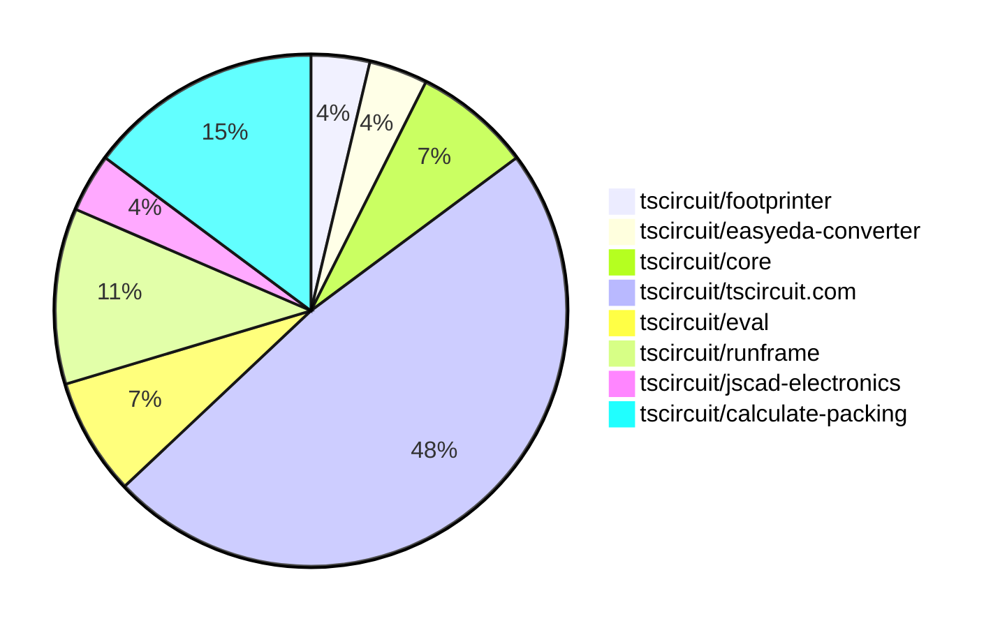
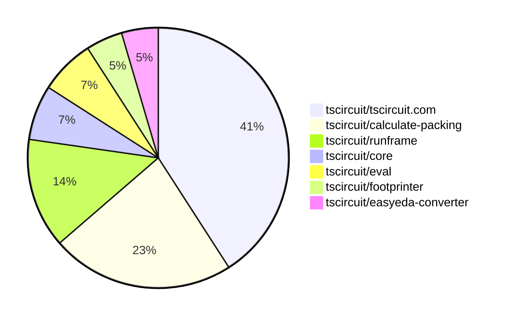

# contribution-tracker

[contributions.tscircuit.com](https://contributions.tscircuit.com) ・ [tscircuit.com](https://tscircuit.com) ・ [Contribution Overviews](./contribution-overviews/) ・ [Changelogs](./changelogs/)

Generates weekly contribution overviews for tscircuit contributors. Check out all
the [contribution overviews here](./contribution-overviews/)
You can find AI-generated monthly changelogs in the [changelogs directory](./changelogs/).

- All PRs in the tscircuit org are scanned/summarized via an LLM
- The LLM classifies each Diff/PR as into a set of attributes for scoring
- All the PRs, summaries, and classifications are organized into charts and tables for [the website](https://contributions.tscircuit.com)

> Want to run locally? See the [Development Section](#development)

The current week is shown below. There are 3 major sections:

- [Contributor Overview](#contributor-overview)
- [PRs by Repository](#prs-by-repository)
- [PRs by Contributor](#changes-by-contributor)

## Current Week

<!-- START_CURRENT_WEEK -->

# Contribution Overview 2025-08-20

## PRs by Repository



## Contributor Overview

| Contributor | 🐳 Major | 🐙 Minor | 🐌 Tiny | ⭐ | Score | Discussion Contributions |
|-------------|---------|---------|---------|-----|----------------|--------------------------|
| [seveibar](#seveibar) | 2 | 0 | 2 | ⭐⭐ | 21 | 0🔹 0🔶 0💎 |
| [ArnavK-09](#ArnavK-09) | 1 | 2 | 5 | ⭐⭐ | 14 | 0🔹 0🔶 0💎 |
| [abimaelmartell](#abimaelmartell) | 1 | 1 | 3 | ⭐⭐ | 12 | 0🔹 0🔶 0💎 |
| [imrishabh18](#imrishabh18) | 0 | 1 | 7 | ⭐ | 10 | 0🔹 0🔶 0💎 |
| [techmannih](#techmannih) | 0 | 1 | 0 |  | 3 | 0🔹 0🔶 0💎 |
| [pxlpal](#pxlpal) | 0 | 1 | 0 |  | 2 | 0🔹 0🔶 0💎 |

### Discussion Contribution Legend

- 🔹 Normal Comments: Basic participation with minimal effort
- 🔶 Great Informative Comments: Thoughtful participation that adds value
- 💎 Incredible Comments: Exceptional participation with high-quality content

## Review Table

[reviews-received-hover]: ## "Number of reviews received for PRs for this contributor"
[approvals-received-hover]: ## "Number of approvals received for PRs this contributor authored"
[rejections-received-hover]: ## "Number of rejections received for PRs this contributor authored"
[prs-opened-hover]: ## "Number of PRs opened by this contributor"
[issues-created-hover]: ## "Number of issues created by this contributor"
[bountied-issues-hover]: ## "Number of issues this contributor created with a bounty"
[bountied-issue-$-hover]: ## "Total bounty amount placed on issues authored by this contributor"

| Contributor | Reviews Received | Approvals Received | Rejections Received | Approvals | Rejections | PRs Opened | PRs Merged | Score | Issues Created | Bountied Issues | Bountied Issue $ |
|---|---|---|---|---|---|---|---|---|---|---|---|
| [pxlpal](#pxlpal) | 2 | 1 | 1 | 0 | 0 | 2 | 1 | 2 | 0 | 0 | 0 |
| [seveibar](#seveibar) | 0 | 0 | 0 | 13 | 2 | 7 | 4 | 21 | 0 | 0 | 0 |
| [techmannih](#techmannih) | 5 | 1 | 0 | 0 | 0 | 2 | 1 | 3 | 0 | 0 | 0 |
| [graphite-app[bot]](#graphite-app[bot]) | 0 | 0 | 0 | 0 | 0 | 0 | 0 | 0 | 0 | 0 | 0 |
| [imrishabh18](#imrishabh18) | 14 | 6 | 1 | 0 | 1 | 14 | 8 | 10 | 0 | 0 | 0 |
| [ArnavK-09](#ArnavK-09) | 12 | 8 | 1 | 1 | 0 | 9 | 8 | 14 | 0 | 0 | 0 |
| [abimaelmartell](#abimaelmartell) | 2 | 1 | 0 | 3 | 0 | 7 | 5 | 12 | 0 | 0 | 0 |
| [tscircuitbot](#tscircuitbot) | 0 | 0 | 0 | 0 | 0 | 4 | 0 | 0 | 0 | 0 | 0 |

## Top 7 Repositories by Contribution Points



## Changes by Repository

### [tscircuit/footprinter](https://github.com/tscircuit/footprinter)

| PR # | Impact | Rating | Contributor | Description |
|------|--------|--------|-------------|-------------|
| [#364](https://github.com/tscircuit/footprinter/pull/364) | 🐙 Minor | ⭐⭐ | techmannih | Fixes string parsing to ignore empty or invalid segments, enhancing the robustness of footprint string handling. |

### [tscircuit/easyeda-converter](https://github.com/tscircuit/easyeda-converter)

| PR # | Impact | Rating | Contributor | Description |
|------|--------|--------|-------------|-------------|
| [#312](https://github.com/tscircuit/easyeda-converter/pull/312) | 🐙 Minor | ⭐⭐ | pxlpal | Fixes CAD rotation issues when converting EasyEDA models to circuit JSON format, ensuring correct orientation based on Z rotation values. |

### [tscircuit/core](https://github.com/tscircuit/core)

| PR # | Impact | Rating | Contributor | Description |
|------|--------|--------|-------------|-------------|
| [#1168](https://github.com/tscircuit/core/pull/1168) | 🐙 Minor | ⭐⭐ | imrishabh18 | Calculates the dimensions of a schematic group based on its components when explicit dimensions are not provided, ensuring proper layout in the flex system. |

<details>
<summary>🐌 Tiny Contributions (1)</summary>

| PR # | Impact | Contributor | Description |
|------|--------|-------------|-------------|
| [#1166](https://github.com/tscircuit/core/pull/1166) | 🐌 Tiny | imrishabh18 | Add support for grouping in grid layout and refactor the layout method for better readability and maintainability. |

</details>

### [tscircuit/tscircuit.com](https://github.com/tscircuit/tscircuit.com)

| PR # | Impact | Rating | Contributor | Description |
|------|--------|--------|-------------|-------------|
| [#1593](https://github.com/tscircuit/tscircuit.com/pull/1593) | 🐳 Major | ⭐⭐⭐ | abimaelmartell | Eliminates duplicate API requests for package release data by standardizing the use of a shared hook across components, improving caching and performance. |
| [#1600](https://github.com/tscircuit/tscircuit.com/pull/1600) | 🐙 Minor | ⭐⭐ | ArnavK-09 | Fixes intermittent file loading issues in the file management system |
| [#1601](https://github.com/tscircuit/tscircuit.com/pull/1601) | 🐙 Minor | ⭐⭐ | abimaelmartell | Fixes a race condition that occurs when loading files, ensuring that the loading state accurately reflects the status of file retrieval. |

<details>
<summary>🐌 Tiny Contributions (10)</summary>

| PR # | Impact | Contributor | Description |
|------|--------|-------------|-------------|
| [#1605](https://github.com/tscircuit/tscircuit.com/pull/1605) | 🐌 Tiny | imrishabh18 | Hides rename and delete actions in the file tree for packages not owned by the current user, and renames the file modification flag to canModifyFiles. |
| [#1597](https://github.com/tscircuit/tscircuit.com/pull/1597) | 🐌 Tiny | imrishabh18 | Fixes the GitHub repository selector dropdown styling to ensure it matches the trigger width and stays aligned, while wrapping repository options in CommandList for consistent styling and behavior. |
| [#1596](https://github.com/tscircuit/tscircuit.com/pull/1596) | 🐌 Tiny | imrishabh18 | Hides the file menu next to the Run button in the editor interface to streamline user experience. |
| [#1602](https://github.com/tscircuit/tscircuit.com/pull/1602) | 🐌 Tiny | ArnavK-09 | Fixes loading issues in RunFrame by updating the runframe dependency version to ensure proper functionality during file loading. |
| [#1599](https://github.com/tscircuit/tscircuit.com/pull/1599) | 🐌 Tiny | ArnavK-09 | Fixes the base URL for the registry API and improves logging for package loading operations. |
| [#1604](https://github.com/tscircuit/tscircuit.com/pull/1604) | 🐌 Tiny | ArnavK-09 | Updates loading indicators in Datasheet and Quickstart pages to use a new Loader component with adjusted styling. |
| [#1598](https://github.com/tscircuit/tscircuit.com/pull/1598) | 🐌 Tiny | ArnavK-09 | Fixes layout issues in the CmdKMenu component by adjusting Tailwind CSS classes for better responsiveness and visual alignment. |
| [#1595](https://github.com/tscircuit/tscircuit.com/pull/1595) | 🐌 Tiny | abimaelmartell | Changes the API for fetching package files from POST to GET, updating client hooks and components accordingly. |
| [#1594](https://github.com/tscircuit/tscircuit.com/pull/1594) | 🐌 Tiny | abimaelmartell | Avoid unnecessary package_filesget call by listing release files first and load LICENSE file content only when present in release. |
| [#1592](https://github.com/tscircuit/tscircuit.com/pull/1592) | 🐌 Tiny | abimaelmartell | Change package_filesget endpoint to use GET with query parameters, update client hooks and scripts accordingly, and align tests with new GET behavior. |

</details>

### [tscircuit/eval](https://github.com/tscircuit/eval)

| PR # | Impact | Rating | Contributor | Description |
|------|--------|--------|-------------|-------------|
| [#855](https://github.com/tscircuit/eval/pull/855) | 🐙 Minor | ⭐⭐ | ArnavK-09 | Fixes the prioritization of default exports over named exports in component rendering. |

<details>
<summary>🐌 Tiny Contributions (1)</summary>

| PR # | Impact | Contributor | Description |
|------|--------|-------------|-------------|
| [#853](https://github.com/tscircuit/eval/pull/853) | 🐌 Tiny | imrishabh18 | Add fetchProxy to the worker to route all fetch requests through the main thread, enabling functionality in restricted environments where worker fetch requests are blocked. |

</details>

### [tscircuit/runframe](https://github.com/tscircuit/runframe)

| PR # | Impact | Rating | Contributor | Description |
|------|--------|--------|-------------|-------------|
| [#1020](https://github.com/tscircuit/runframe/pull/1020) | 🐳 Major | ⭐⭐⭐ | ArnavK-09 | https:runframe-git-a18-tscircuit.vercel.app?fixtureId7B22path223A22examples2Fexample23-files-loading-skeleton.fixture.tsx227D |

<details>
<summary>🐌 Tiny Contributions (2)</summary>

| PR # | Impact | Contributor | Description |
|------|--------|-------------|-------------|
| [#1022](https://github.com/tscircuit/runframe/pull/1022) | 🐌 Tiny | imrishabh18 | Enables the fetch proxy for web workers in standalone bundles by adding a new optional property to the RunFrame component and related components. |
| [#1018](https://github.com/tscircuit/runframe/pull/1018) | 🐌 Tiny | imrishabh18 | Adds an option to control the visibility of the file menu in the RunFrame component based on the showFileMenu prop. |

</details>

### [tscircuit/jscad-electronics](https://github.com/tscircuit/jscad-electronics)


<details>
<summary>🐌 Tiny Contributions (1)</summary>

| PR # | Impact | Contributor | Description |
|------|--------|-------------|-------------|
| [#107](https://github.com/tscircuit/jscad-electronics/pull/107) | 🐌 Tiny | ArnavK-09 | Updates dependencies in package.json and fixes type casting in BGA component rendering. |

</details>

### [tscircuit/calculate-packing](https://github.com/tscircuit/calculate-packing)

| PR # | Impact | Rating | Contributor | Description |
|------|--------|--------|-------------|-------------|
| [#26](https://github.com/tscircuit/calculate-packing/pull/26) | 🐳 Major | ⭐⭐⭐ | seveibar | This pull request addresses an issue with invalid outline generation in the constructOutline function. It introduces a new approach that enhances stability and correctness in generating outlines from packed components. The changes include the addition of new utility functions for bounding calculations and improved error handling during polygon operations. |
| [#23](https://github.com/tscircuit/calculate-packing/pull/23) | 🐳 Major | ⭐⭐⭐ | seveibar | pack placement strategy wip pack solver 2 single component pack solver init add packsolver2 test with error remove stroke widths that were making things less visible, add test identifying insideoutside of outline for componentToPlace using poitnInOutline always show pads of outline segment while being solved switch PackSolver2 as the default for PackDebugger improve pointInOutline to match segment style. Improve normal calculation fix normal segment placement placeholder for viable outline segment computation add largest rect insideoutside bounds solver add largest rect outside outline solver improve visual and fix last-minute offset when irls is solved |

<details>
<summary>🐌 Tiny Contributions (2)</summary>

| PR # | Impact | Contributor | Description |
|------|--------|-------------|-------------|
| [#25](https://github.com/tscircuit/calculate-packing/pull/25) | 🐌 Tiny | seveibar | Adds getConstructorParams method to PackSolver2 and modifies it in SingleComponentPackSolver to return parameters in a more streamlined format. |
| [#24](https://github.com/tscircuit/calculate-packing/pull/24) | 🐌 Tiny | seveibar | Adds PackSolver2 to the exports in the index file, making it available for use in other modules. |

</details>

## Changes by Contributor

### [techmannih](https://github.com/techmannih)

| PRs # | Impact | Rating | Description |
|------|--------|--------|-------------|
| [#364](https://github.com/tscircuit/footprinter/pull/364) | 🐙 Minor | ⭐⭐ | Fixes string parsing to ignore empty or invalid segments, enhancing the robustness of footprint string handling. |

### [pxlpal](https://github.com/pxlpal)

| PRs # | Impact | Rating | Description |
|------|--------|--------|-------------|
| [#312](https://github.com/tscircuit/easyeda-converter/pull/312) | 🐙 Minor | ⭐⭐ | Fixes CAD rotation issues when converting EasyEDA models to circuit JSON format, ensuring correct orientation based on Z rotation values. |

### [imrishabh18](https://github.com/imrishabh18)

| PRs # | Impact | Rating | Description |
|------|--------|--------|-------------|
| [#1168](https://github.com/tscircuit/core/pull/1168) | 🐙 Minor | ⭐⭐ | Calculates the dimensions of a schematic group based on its components when explicit dimensions are not provided, ensuring proper layout in the flex system. |

<details>
<summary>🐌 Tiny Contributions (7)</summary>

| PR # | Impact | Description |
|------|--------|-------------|
| [#1166](https://github.com/tscircuit/core/pull/1166) | 🐌 Tiny | Add support for grouping in grid layout and refactor the layout method for better readability and maintainability. |
| [#1605](https://github.com/tscircuit/tscircuit.com/pull/1605) | 🐌 Tiny | Hides rename and delete actions in the file tree for packages not owned by the current user, and renames the file modification flag to canModifyFiles. |
| [#1597](https://github.com/tscircuit/tscircuit.com/pull/1597) | 🐌 Tiny | Fixes the GitHub repository selector dropdown styling to ensure it matches the trigger width and stays aligned, while wrapping repository options in CommandList for consistent styling and behavior. |
| [#1596](https://github.com/tscircuit/tscircuit.com/pull/1596) | 🐌 Tiny | Hides the file menu next to the Run button in the editor interface to streamline user experience. |
| [#853](https://github.com/tscircuit/eval/pull/853) | 🐌 Tiny | Add fetchProxy to the worker to route all fetch requests through the main thread, enabling functionality in restricted environments where worker fetch requests are blocked. |
| [#1022](https://github.com/tscircuit/runframe/pull/1022) | 🐌 Tiny | Enables the fetch proxy for web workers in standalone bundles by adding a new optional property to the RunFrame component and related components. |
| [#1018](https://github.com/tscircuit/runframe/pull/1018) | 🐌 Tiny | Adds an option to control the visibility of the file menu in the RunFrame component based on the showFileMenu prop. |

</details>

### [ArnavK-09](https://github.com/ArnavK-09)

| PRs # | Impact | Rating | Description |
|------|--------|--------|-------------|
| [#1020](https://github.com/tscircuit/runframe/pull/1020) | 🐳 Major | ⭐⭐⭐ | https:runframe-git-a18-tscircuit.vercel.app?fixtureId7B22path223A22examples2Fexample23-files-loading-skeleton.fixture.tsx227D |
| [#1600](https://github.com/tscircuit/tscircuit.com/pull/1600) | 🐙 Minor | ⭐⭐ | Fixes intermittent file loading issues in the file management system |
| [#855](https://github.com/tscircuit/eval/pull/855) | 🐙 Minor | ⭐⭐ | Fixes the prioritization of default exports over named exports in component rendering. |

<details>
<summary>🐌 Tiny Contributions (5)</summary>

| PR # | Impact | Description |
|------|--------|-------------|
| [#107](https://github.com/tscircuit/jscad-electronics/pull/107) | 🐌 Tiny | Updates dependencies in package.json and fixes type casting in BGA component rendering. |
| [#1602](https://github.com/tscircuit/tscircuit.com/pull/1602) | 🐌 Tiny | Fixes loading issues in RunFrame by updating the runframe dependency version to ensure proper functionality during file loading. |
| [#1599](https://github.com/tscircuit/tscircuit.com/pull/1599) | 🐌 Tiny | Fixes the base URL for the registry API and improves logging for package loading operations. |
| [#1604](https://github.com/tscircuit/tscircuit.com/pull/1604) | 🐌 Tiny | Updates loading indicators in Datasheet and Quickstart pages to use a new Loader component with adjusted styling. |
| [#1598](https://github.com/tscircuit/tscircuit.com/pull/1598) | 🐌 Tiny | Fixes layout issues in the CmdKMenu component by adjusting Tailwind CSS classes for better responsiveness and visual alignment. |

</details>

### [abimaelmartell](https://github.com/abimaelmartell)

| PRs # | Impact | Rating | Description |
|------|--------|--------|-------------|
| [#1593](https://github.com/tscircuit/tscircuit.com/pull/1593) | 🐳 Major | ⭐⭐⭐ | Eliminates duplicate API requests for package release data by standardizing the use of a shared hook across components, improving caching and performance. |
| [#1601](https://github.com/tscircuit/tscircuit.com/pull/1601) | 🐙 Minor | ⭐⭐ | Fixes a race condition that occurs when loading files, ensuring that the loading state accurately reflects the status of file retrieval. |

<details>
<summary>🐌 Tiny Contributions (3)</summary>

| PR # | Impact | Description |
|------|--------|-------------|
| [#1595](https://github.com/tscircuit/tscircuit.com/pull/1595) | 🐌 Tiny | Changes the API for fetching package files from POST to GET, updating client hooks and components accordingly. |
| [#1594](https://github.com/tscircuit/tscircuit.com/pull/1594) | 🐌 Tiny | Avoid unnecessary package_filesget call by listing release files first and load LICENSE file content only when present in release. |
| [#1592](https://github.com/tscircuit/tscircuit.com/pull/1592) | 🐌 Tiny | Change package_filesget endpoint to use GET with query parameters, update client hooks and scripts accordingly, and align tests with new GET behavior. |

</details>

### [seveibar](https://github.com/seveibar)

| PRs # | Impact | Rating | Description |
|------|--------|--------|-------------|
| [#26](https://github.com/tscircuit/calculate-packing/pull/26) | 🐳 Major | ⭐⭐⭐ | This pull request addresses an issue with invalid outline generation in the constructOutline function. It introduces a new approach that enhances stability and correctness in generating outlines from packed components. The changes include the addition of new utility functions for bounding calculations and improved error handling during polygon operations. |
| [#23](https://github.com/tscircuit/calculate-packing/pull/23) | 🐳 Major | ⭐⭐⭐ | pack placement strategy wip pack solver 2 single component pack solver init add packsolver2 test with error remove stroke widths that were making things less visible, add test identifying insideoutside of outline for componentToPlace using poitnInOutline always show pads of outline segment while being solved switch PackSolver2 as the default for PackDebugger improve pointInOutline to match segment style. Improve normal calculation fix normal segment placement placeholder for viable outline segment computation add largest rect insideoutside bounds solver add largest rect outside outline solver improve visual and fix last-minute offset when irls is solved |

<details>
<summary>🐌 Tiny Contributions (2)</summary>

| PR # | Impact | Description |
|------|--------|-------------|
| [#25](https://github.com/tscircuit/calculate-packing/pull/25) | 🐌 Tiny | Adds getConstructorParams method to PackSolver2 and modifies it in SingleComponentPackSolver to return parameters in a more streamlined format. |
| [#24](https://github.com/tscircuit/calculate-packing/pull/24) | 🐌 Tiny | Adds PackSolver2 to the exports in the index file, making it available for use in other modules. |

</details>

## Repository Owners

| Repository | Codeowners |
|------------|------------|
| [builder](https://github.com/tscircuit/builder/blob/main/.github/CODEOWNERS) | [seveibar](https://github.com/seveibar)
| [pcb-viewer](https://github.com/tscircuit/pcb-viewer/blob/main/.github/CODEOWNERS) | [seveibar](https://github.com/seveibar), [ShiboSoftwareDev](https://github.com/ShiboSoftwareDev)
| [footprints-old](https://github.com/tscircuit/footprints-old/blob/main/.github/CODEOWNERS) | [seveibar](https://github.com/seveibar)
| [footprinter](https://github.com/tscircuit/footprinter/blob/main/.github/CODEOWNERS) | [seveibar](https://github.com/seveibar), [techmannih](https://github.com/techmannih)
| [3d-viewer](https://github.com/tscircuit/3d-viewer/blob/main/.github/CODEOWNERS) | [ShiboSoftwareDev](https://github.com/ShiboSoftwareDev)
| [winterspec](https://github.com/tscircuit/winterspec/blob/main/.github/CODEOWNERS) | [seveibar](https://github.com/seveibar), [ShiboSoftwareDev](https://github.com/ShiboSoftwareDev)
| [jscad-electronics](https://github.com/tscircuit/jscad-electronics/blob/main/.github/CODEOWNERS) | [seveibar](https://github.com/seveibar), [abhijitxy](https://github.com/abhijitxy), [anas-sarkez](https://github.com/anas-sarkez)
| [circuit-to-svg](https://github.com/tscircuit/circuit-to-svg/blob/main/.github/CODEOWNERS) | [imrishabh18](https://github.com/imrishabh18)
| [schematic-symbols](https://github.com/tscircuit/schematic-symbols/blob/main/.github/CODEOWNERS) | [seveibar](https://github.com/seveibar), [imrishabh18](https://github.com/imrishabh18), [techmannih](https://github.com/techmannih)
| [circuit-json-to-gerber](https://github.com/tscircuit/circuit-json-to-gerber/blob/main/.github/CODEOWNERS) | [seveibar](https://github.com/seveibar), [ShiboSoftwareDev](https://github.com/ShiboSoftwareDev)
| [tscircuit.com](https://github.com/tscircuit/tscircuit.com/blob/main/.github/CODEOWNERS) | [seveibar](https://github.com/seveibar), [imrishabh18](https://github.com/imrishabh18)
| [cli](https://github.com/tscircuit/cli/blob/main/.github/CODEOWNERS) | [seveibar](https://github.com/seveibar), [imrishabh18](https://github.com/imrishabh18), [ArnavK-09](https://github.com/ArnavK-09)
| [issue-roulette](https://github.com/tscircuit/issue-roulette/blob/main/.github/CODEOWNERS) | [Anshgrover23](https://github.com/Anshgrover23)
| [sparkfun-boards](https://github.com/tscircuit/sparkfun-boards/blob/main/.github/CODEOWNERS) | [ShiboSoftwareDev](https://github.com/ShiboSoftwareDev), [Abse2001](https://github.com/Abse2001), [MustafaMulla29](https://github.com/MustafaMulla29), [Anshgrover23](https://github.com/Anshgrover23), [techmannih](https://github.com/techmannih)
| [schematic-corpus](https://github.com/tscircuit/schematic-corpus/blob/main/.github/CODEOWNERS) | [Abse2001](https://github.com/Abse2001)

## Repositories by Owner

| User | Repo |
|------|------|
| [seveibar](https://github.com/seveibar) | [builder](https://github.com/tscircuit/builder/blob/main/.github/CODEOWNERS) |
|  | [pcb-viewer](https://github.com/tscircuit/pcb-viewer/blob/main/.github/CODEOWNERS) |
|  | [footprints-old](https://github.com/tscircuit/footprints-old/blob/main/.github/CODEOWNERS) |
|  | [footprinter](https://github.com/tscircuit/footprinter/blob/main/.github/CODEOWNERS) |
|  | [winterspec](https://github.com/tscircuit/winterspec/blob/main/.github/CODEOWNERS) |
|  | [jscad-electronics](https://github.com/tscircuit/jscad-electronics/blob/main/.github/CODEOWNERS) |
|  | [schematic-symbols](https://github.com/tscircuit/schematic-symbols/blob/main/.github/CODEOWNERS) |
|  | [circuit-json-to-gerber](https://github.com/tscircuit/circuit-json-to-gerber/blob/main/.github/CODEOWNERS) |
|  | [tscircuit.com](https://github.com/tscircuit/tscircuit.com/blob/main/.github/CODEOWNERS) |
|  | [cli](https://github.com/tscircuit/cli/blob/main/.github/CODEOWNERS) |
| [ShiboSoftwareDev](https://github.com/ShiboSoftwareDev) | [pcb-viewer](https://github.com/tscircuit/pcb-viewer/blob/main/.github/CODEOWNERS) |
|  | [3d-viewer](https://github.com/tscircuit/3d-viewer/blob/main/.github/CODEOWNERS) |
|  | [winterspec](https://github.com/tscircuit/winterspec/blob/main/.github/CODEOWNERS) |
|  | [circuit-json-to-gerber](https://github.com/tscircuit/circuit-json-to-gerber/blob/main/.github/CODEOWNERS) |
|  | [sparkfun-boards](https://github.com/tscircuit/sparkfun-boards/blob/main/.github/CODEOWNERS) |
| [techmannih](https://github.com/techmannih) | [footprinter](https://github.com/tscircuit/footprinter/blob/main/.github/CODEOWNERS) |
|  | [schematic-symbols](https://github.com/tscircuit/schematic-symbols/blob/main/.github/CODEOWNERS) |
|  | [sparkfun-boards](https://github.com/tscircuit/sparkfun-boards/blob/main/.github/CODEOWNERS) |
| [abhijitxy](https://github.com/abhijitxy) | [jscad-electronics](https://github.com/tscircuit/jscad-electronics/blob/main/.github/CODEOWNERS) |
| [anas-sarkez](https://github.com/anas-sarkez) | [jscad-electronics](https://github.com/tscircuit/jscad-electronics/blob/main/.github/CODEOWNERS) |
| [imrishabh18](https://github.com/imrishabh18) | [circuit-to-svg](https://github.com/tscircuit/circuit-to-svg/blob/main/.github/CODEOWNERS) |
|  | [schematic-symbols](https://github.com/tscircuit/schematic-symbols/blob/main/.github/CODEOWNERS) |
|  | [tscircuit.com](https://github.com/tscircuit/tscircuit.com/blob/main/.github/CODEOWNERS) |
|  | [cli](https://github.com/tscircuit/cli/blob/main/.github/CODEOWNERS) |
| [ArnavK-09](https://github.com/ArnavK-09) | [cli](https://github.com/tscircuit/cli/blob/main/.github/CODEOWNERS) |
| [Anshgrover23](https://github.com/Anshgrover23) | [issue-roulette](https://github.com/tscircuit/issue-roulette/blob/main/.github/CODEOWNERS) |
|  | [sparkfun-boards](https://github.com/tscircuit/sparkfun-boards/blob/main/.github/CODEOWNERS) |
| [Abse2001](https://github.com/Abse2001) | [sparkfun-boards](https://github.com/tscircuit/sparkfun-boards/blob/main/.github/CODEOWNERS) |
|  | [schematic-corpus](https://github.com/tscircuit/schematic-corpus/blob/main/.github/CODEOWNERS) |
| [MustafaMulla29](https://github.com/MustafaMulla29) | [sparkfun-boards](https://github.com/tscircuit/sparkfun-boards/blob/main/.github/CODEOWNERS) |


<!-- END_CURRENT_WEEK -->


## Development

### Prerequisites

- [Bun](https://bun.sh/) runtime
- `.env` file with required API keys:
  ```
  GITHUB_TOKEN=your_github_token
  OPENAI_API_KEY=your_openai_api_key
  DISCORD_TOKEN=your_discord_token (optional, for Discord integration)
  SLACK_BOT_TOKEN=your_slack_token (optional, for Slack integration)
  ```

### Available Scripts

#### Core Generation Scripts

- `bun run generate:weekly` - Generate current week's contribution overview
- `bun run generate:monthly` - Generate current month's contribution overview
- `bun run generate:changelog` - Generate monthly changelog from PRs

#### Analysis & Testing

- `bun run analyze-pr` - Analyze a single PR (interactive prompt)
- `bun run test:github` - Test GitHub API integration

#### Notifications & Sync

- `bun run notifications:issues` - Send notifications for new issues
- `bun run notifications:pr` - Send notifications for new PRs
- `bun run sync:discord` - Sync contributor roles with Discord

#### Data Export

- `bun run export:sponsorship` - Generate sponsorship data CSV

#### Development

- `bun run dev` - Start development server for web UI
- `bun run build` - Build for production
- `bun run format` - Format code with Biome

### Usage Examples

```bash
# Generate this week's contribution overview
bun run generate:weekly

# Generate current month's overview
bun run generate:monthly

# Analyze a specific PR
bun run analyze-pr

# Test your GitHub token setup
bun run test:github
```
