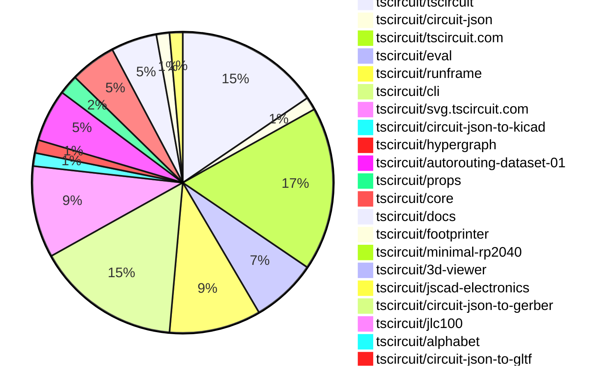

# contribution tracker

[contributions.tscircuit.com](https://contributions.tscircuit.com) ・ [tscircuit.com](https://tscircuit.com) ・ [Contribution Overviews](./contribution-overviews/) ・ [Changelogs](./changelogs/)

Generates weekly contribution overviews for tscircuit contributors. Check out all
the [contribution overviews here](./contribution-overviews/)
You can find AI-generated monthly changelogs in the [changelogs directory](./changelogs/)

- All PRs in the tscircuit org are scanned/summarized via an LLM
- The LLM classifies each Diff/PR as into a set of attributes for scoring
- All the PRs, summaries, and classifications are organized into charts and tables for [the website](https://contributions.tscircuit.com)

> Want to run locally? See the [Development Section](#development)

## Current Week

<!-- START_CURRENT_WEEK -->

# Contribution Overview 2026-02-10

The current week is shown below. There are 3 major sections:

- [Contributor Overview](#contributor-overview)
- [PRs by Repository](#prs-by-repository)
- [PRs by Contributor](#changes-by-contributor)
- [Scoring & Sponsorship Details](/docs/sponsorship-calculation-explanation.md)

## PRs by Repository



## Contributor Overview

| Contributor | 🐳 Major | 🐙 Minor | 🐌 Tiny | ⭐ | Discussion Contributions |
|-------------|---------|---------|---------|-----|--------------------------|
| [seveibar](#seveibar) | 1 | 6 | 5 | ⭐⭐ | 0🔹 0🔶 0💎 |
| [MustafaMulla29](#MustafaMulla29) | 2 | 3 | 3 | ⭐⭐ | 0🔹 0🔶 0💎 |
| [ShiboSoftwareDev](#ShiboSoftwareDev) | 1 | 3 | 2 | ⭐⭐ | 0🔹 0🔶 0💎 |
| [ArnavK-09](#ArnavK-09) | 2 | 2 | 2 | ⭐⭐ | 0🔹 0🔶 0💎 |
| [tscircuitbot](#tscircuitbot) | 0 | 0 | 95 | ⭐⭐ | 0🔹 0🔶 0💎 |
| [imrishabh18](#imrishabh18) | 0 | 4 | 3 | ⭐⭐ | 0🔹 0🔶 0💎 |
| [techmannih](#techmannih) | 2 | 0 | 1 | ⭐⭐ | 0🔹 0🔶 0💎 |
| [rushabhcodes](#rushabhcodes) | 1 | 1 | 1 | ⭐ | 0🔹 0🔶 0💎 |
| [nailoo](#nailoo) | 0 | 0 | 3 | ⭐ | 0🔹 0🔶 0💎 |
| [AnasSarkiz](#AnasSarkiz) | 0 | 2 | 0 | ⭐ | 0🔹 0🔶 0💎 |
| [0hmX](#0hmX) | 0 | 1 | 1 | ⭐ | 0🔹 0🔶 0💎 |
| [Abse2001](#Abse2001) | 0 | 0 | 1 |  | 0🔹 0🔶 0💎 |

> Note: AI evaluates PRs and assigns 1-3 star ratings automatically. 4 and 5 star ratings require manual staff review.

### Discussion Contribution Legend

- 🔹 Normal Comments: Basic participation with minimal effort
- 🔶 Great Informative Comments: Thoughtful participation that adds value
- 💎 Incredible Comments: Exceptional participation with high-quality content

## Review Table

[reviews-received-hover]: ## "Number of reviews received for PRs for this contributor"
[approvals-received-hover]: ## "Number of approvals received for PRs this contributor authored"
[rejections-received-hover]: ## "Number of rejections received for PRs this contributor authored"
[prs-opened-hover]: ## "Number of PRs opened by this contributor"
[issues-created-hover]: ## "Number of issues created by this contributor"

| Contributor | Reviews Received | Approvals Received | Rejections Received | Approvals | Rejections | PRs Opened | PRs Merged | Issues Created |
|---|---|---|---|---|---|---|---|---|
| [nailoo](#nailoo) | 8 | 5 | 1 | 1 | 1 | 6 | 3 | 0 |
| [imrishabh18](#imrishabh18) | 0 | 0 | 0 | 1 | 0 | 8 | 7 | 0 |
| [Abse2001](#Abse2001) | 1 | 1 | 0 | 4 | 0 | 1 | 1 | 0 |
| [rushabhcodes](#rushabhcodes) | 19 | 6 | 2 | 0 | 0 | 6 | 3 | 0 |
| [buildingvibes](#buildingvibes) | 12 | 0 | 1 | 0 | 0 | 25 | 0 | 0 |
| [tscircuitbot](#tscircuitbot) | 0 | 0 | 0 | 0 | 0 | 105 | 95 | 0 |
| [MustafaMulla29](#MustafaMulla29) | 12 | 9 | 1 | 0 | 1 | 11 | 8 | 0 |
| [seveibar](#seveibar) | 4 | 0 | 0 | 25 | 5 | 13 | 12 | 0 |
| [techmannih](#techmannih) | 5 | 3 | 0 | 2 | 2 | 3 | 3 | 0 |
| [Devesh36](#Devesh36) | 0 | 0 | 0 | 1 | 0 | 0 | 0 | 0 |
| [shehaban](#shehaban) | 5 | 1 | 2 | 0 | 0 | 1 | 0 | 0 |
| [ShiboSoftwareDev](#ShiboSoftwareDev) | 6 | 6 | 0 | 2 | 0 | 7 | 6 | 0 |
| [cryptoaibot1738728800](#cryptoaibot1738728800) | 1 | 0 | 1 | 0 | 0 | 1 | 0 | 0 |
| [ArnavK-09](#ArnavK-09) | 8 | 4 | 0 | 1 | 0 | 7 | 6 | 0 |
| [Rhan2020](#Rhan2020) | 0 | 0 | 0 | 0 | 0 | 1 | 0 | 0 |
| [AnasSarkiz](#AnasSarkiz) | 2 | 2 | 0 | 0 | 0 | 2 | 2 | 0 |
| [0hmX](#0hmX) | 10 | 2 | 0 | 2 | 0 | 4 | 2 | 0 |
| [xiuqiang1995](#xiuqiang1995) | 1 | 0 | 1 | 0 | 0 | 1 | 0 | 0 |

## Changes by Repository

### [tscircuit/tscircuit](https://github.com/tscircuit/tscircuit)


<details>
<summary>🐌 Tiny Contributions (22)</summary>

| PR # | Impact | Contributor | Description |
|------|--------|-------------|-------------|
| [#2176](https://github.com/tscircuit/tscircuit/pull/2176) | 🐌 Tiny | tscircuitbot | Automated package update |
| [#2175](https://github.com/tscircuit/tscircuit/pull/2175) | 🐌 Tiny | tscircuitbot | Updates the tscircuitcli package from version 0.1.910 to 0.1.911 |
| [#2173](https://github.com/tscircuit/tscircuit/pull/2173) | 🐌 Tiny | tscircuitbot | Automated package update |
| [#2172](https://github.com/tscircuit/tscircuit/pull/2172) | 🐌 Tiny | tscircuitbot | Updates the tscircuitcli package from version 0.1.909 to 0.1.910 |
| [#2171](https://github.com/tscircuit/tscircuit/pull/2171) | 🐌 Tiny | tscircuitbot | Updates the package version from 0.0.1292 to 0.0.1293 in package.json |
| [#2170](https://github.com/tscircuit/tscircuit/pull/2170) | 🐌 Tiny | tscircuitbot | Automated package update |
| [#2169](https://github.com/tscircuit/tscircuit/pull/2169) | 🐌 Tiny | tscircuitbot | Automated package update |
| [#2168](https://github.com/tscircuit/tscircuit/pull/2168) | 🐌 Tiny | tscircuitbot | Updates the tscircuitcli package from version 0.1.907 to 0.1.908 and the tscircuitrunframe package from version 0.0.1595 to 0.0.1596. |
| [#2167](https://github.com/tscircuit/tscircuit/pull/2167) | 🐌 Tiny | tscircuitbot | Automated package update |
| [#2166](https://github.com/tscircuit/tscircuit/pull/2166) | 🐌 Tiny | tscircuitbot | Automated package update |
| [#2157](https://github.com/tscircuit/tscircuit/pull/2157) | 🐌 Tiny | tscircuitbot | Updates the tscircuitcli package from version 0.1.902 to 0.1.903 and the tscircuitrunframe package from version 0.0.1590 to 0.0.1591 in package.json |
| [#2161](https://github.com/tscircuit/tscircuit/pull/2161) | 🐌 Tiny | tscircuitbot | Automated package update |
| [#2159](https://github.com/tscircuit/tscircuit/pull/2159) | 🐌 Tiny | tscircuitbot | Automated package update |
| [#2165](https://github.com/tscircuit/tscircuit/pull/2165) | 🐌 Tiny | tscircuitbot | Automated package update |
| [#2155](https://github.com/tscircuit/tscircuit/pull/2155) | 🐌 Tiny | tscircuitbot | Updates the tscircuitcli package to version 0.1.902 in package.json |
| [#2160](https://github.com/tscircuit/tscircuit/pull/2160) | 🐌 Tiny | tscircuitbot | Updates the package version from 0.0.1287 to 0.0.1288 in package.json |
| [#2162](https://github.com/tscircuit/tscircuit/pull/2162) | 🐌 Tiny | tscircuitbot | Automated package update |
| [#2156](https://github.com/tscircuit/tscircuit/pull/2156) | 🐌 Tiny | tscircuitbot | Automated package update |
| [#2158](https://github.com/tscircuit/tscircuit/pull/2158) | 🐌 Tiny | tscircuitbot | Automated package update |
| [#2153](https://github.com/tscircuit/tscircuit/pull/2153) | 🐌 Tiny | tscircuitbot | Updates the tscircuitcli package to version 0.1.901 in package.json |
| [#2154](https://github.com/tscircuit/tscircuit/pull/2154) | 🐌 Tiny | tscircuitbot | Automated package update |
| [#2164](https://github.com/tscircuit/tscircuit/pull/2164) | 🐌 Tiny | tscircuitbot | Automated package update |

</details>

### [tscircuit/circuit-json](https://github.com/tscircuit/circuit-json)

| PR # | Impact | Rating | Contributor | Description |
|------|--------|--------|-------------|-------------|
| [#464](https://github.com/tscircuit/circuit-json/pull/464) | 🐙 Minor | ⭐⭐ | seveibar | Adds an optional is_allowed_to_be_off_board field to the pcb_component schema and TypeScript interface, allowing components to indicate they may be placed off the PCB. |

<details>
<summary>🐌 Tiny Contributions (1)</summary>

| PR # | Impact | Contributor | Description |
|------|--------|-------------|-------------|
| [#465](https://github.com/tscircuit/circuit-json/pull/465) | 🐌 Tiny | tscircuitbot | Automated package update |

</details>

### [tscircuit/tscircuit.com](https://github.com/tscircuit/tscircuit.com)

| PR # | Impact | Rating | Contributor | Description |
|------|--------|--------|-------------|-------------|
| [#2707](https://github.com/tscircuit/tscircuit.com/pull/2707) | 🐳 Major | ⭐⭐⭐ | seveibar | Adds an analog simulation image and code example to the landing page, enhancing user guidance for analog simulations. |
| [#2721](https://github.com/tscircuit/tscircuit.com/pull/2721) | 🐳 Major | ⭐⭐⭐ | ArnavK-09 | Adds interactive breadcrumbs to the files view for improved directory navigation, allowing users to easily navigate back through directory levels. |
| [#2719](https://github.com/tscircuit/tscircuit.com/pull/2719) | 🐳 Major | ⭐⭐⭐ | ArnavK-09 | Changes the UI to implement organization search functionality instead of account search, updating related components and queries accordingly. |
| [#2702](https://github.com/tscircuit/tscircuit.com/pull/2702) | 🐙 Minor | ⭐⭐ | imrishabh18 | Modifies the file path to include dist when searching for files in external packages. |
| [#2698](https://github.com/tscircuit/tscircuit.com/pull/2698) | 🐙 Minor | ⭐⭐ | imrishabh18 | Normalizes CAD asset URLs in circuit JSON to correctly fetch assets from the package registry instead of treating them as same-package files. |
| [#2720](https://github.com/tscircuit/tscircuit.com/pull/2720) | 🐙 Minor | ⭐⭐ | ArnavK-09 | Replaces the manual check for the existence of circuit.json with a hook that determines if the circuit JSON is found and loading status. |
| [#2717](https://github.com/tscircuit/tscircuit.com/pull/2717) | 🐙 Minor | ⭐⭐ | ArnavK-09 | Modifies the organization search API to remove user permission checks and streamline the response structure. |

<details>
<summary>🐌 Tiny Contributions (18)</summary>

| PR # | Impact | Contributor | Description |
|------|--------|-------------|-------------|
| [#2726](https://github.com/tscircuit/tscircuit.com/pull/2726) | 🐌 Tiny | tscircuitbot | Updates the tscircuitrunframe package from version 0.0.1596 to 0.0.1597 |
| [#2725](https://github.com/tscircuit/tscircuit.com/pull/2725) | 🐌 Tiny | tscircuitbot | Updates the tscircuiteval package from version 0.0.630 to 0.0.631 |
| [#2724](https://github.com/tscircuit/tscircuit.com/pull/2724) | 🐌 Tiny | tscircuitbot | Automated package update |
| [#2723](https://github.com/tscircuit/tscircuit.com/pull/2723) | 🐌 Tiny | tscircuitbot | Updates the tscircuitrunframe package from version 0.0.1595 to 0.0.1596 |
| [#2718](https://github.com/tscircuit/tscircuit.com/pull/2718) | 🐌 Tiny | tscircuitbot | Automated package update to version 0.0.195 |
| [#2715](https://github.com/tscircuit/tscircuit.com/pull/2715) | 🐌 Tiny | tscircuitbot | Automated package update |
| [#2714](https://github.com/tscircuit/tscircuit.com/pull/2714) | 🐌 Tiny | tscircuitbot | Updates the tscircuiteval package to version 0.0.629 in package.json |
| [#2704](https://github.com/tscircuit/tscircuit.com/pull/2704) | 🐌 Tiny | tscircuitbot | Automated package update |
| [#2711](https://github.com/tscircuit/tscircuit.com/pull/2711) | 🐌 Tiny | tscircuitbot | Automated package update |
| [#2712](https://github.com/tscircuit/tscircuit.com/pull/2712) | 🐌 Tiny | tscircuitbot | Updates the tscircuitrunframe package from version 0.0.1593 to 0.0.1594 |
| [#2709](https://github.com/tscircuit/tscircuit.com/pull/2709) | 🐌 Tiny | tscircuitbot | Updates the tscircuitrunframe package from version 0.0.1592 to 0.0.1593 |
| [#2708](https://github.com/tscircuit/tscircuit.com/pull/2708) | 🐌 Tiny | tscircuitbot | Automated package update |
| [#2703](https://github.com/tscircuit/tscircuit.com/pull/2703) | 🐌 Tiny | tscircuitbot | Automated package update |
| [#2706](https://github.com/tscircuit/tscircuit.com/pull/2706) | 🐌 Tiny | seveibar | Add KiCad image and fix optimized image to support PNGs |
| [#2705](https://github.com/tscircuit/tscircuit.com/pull/2705) | 🐌 Tiny | ShiboSoftwareDev | Updates the version of the circuit-json-to-gerber dependency from 0.0.46 to 0.0.47 in package.json |
| [#2713](https://github.com/tscircuit/tscircuit.com/pull/2713) | 🐌 Tiny | imrishabh18 | Changes the log display to show stderr messages in red color for better visibility. |
| [#2722](https://github.com/tscircuit/tscircuit.com/pull/2722) | 🐌 Tiny | ArnavK-09 | Makes the Analog Simulation section responsive by preventing its code block from overflowing on mobile. |
| [#2716](https://github.com/tscircuit/tscircuit.com/pull/2716) | 🐌 Tiny | ArnavK-09 | Removes a CSS transform property from the ReleaseDeploymentDetails component, potentially improving layout consistency. |

</details>

### [tscircuit/eval](https://github.com/tscircuit/eval)


<details>
<summary>🐌 Tiny Contributions (10)</summary>

| PR # | Impact | Contributor | Description |
|------|--------|-------------|-------------|
| [#2022](https://github.com/tscircuit/eval/pull/2022) | 🐌 Tiny | tscircuitbot | Automated package update |
| [#2021](https://github.com/tscircuit/eval/pull/2021) | 🐌 Tiny | tscircuitbot | Automated package update |
| [#2019](https://github.com/tscircuit/eval/pull/2019) | 🐌 Tiny | tscircuitbot | Automated package update to version 0.0.630 |
| [#2018](https://github.com/tscircuit/eval/pull/2018) | 🐌 Tiny | tscircuitbot | Automated package update |
| [#2010](https://github.com/tscircuit/eval/pull/2010) | 🐌 Tiny | tscircuitbot | Automated package update |
| [#2009](https://github.com/tscircuit/eval/pull/2009) | 🐌 Tiny | tscircuitbot | Updates various package dependencies to their latest versions |
| [#2016](https://github.com/tscircuit/eval/pull/2016) | 🐌 Tiny | tscircuitbot | Automated package update |
| [#2015](https://github.com/tscircuit/eval/pull/2015) | 🐌 Tiny | tscircuitbot | Automated package update |
| [#2013](https://github.com/tscircuit/eval/pull/2013) | 🐌 Tiny | tscircuitbot | Automated package update |
| [#2012](https://github.com/tscircuit/eval/pull/2012) | 🐌 Tiny | tscircuitbot | Automated package update |

</details>

### [tscircuit/runframe](https://github.com/tscircuit/runframe)


<details>
<summary>🐌 Tiny Contributions (14)</summary>

| PR # | Impact | Contributor | Description |
|------|--------|-------------|-------------|
| [#2616](https://github.com/tscircuit/runframe/pull/2616) | 🐌 Tiny | tscircuitbot | Automated package update |
| [#2615](https://github.com/tscircuit/runframe/pull/2615) | 🐌 Tiny | tscircuitbot | Updates the tscircuiteval package from version 0.0.629 to 0.0.631 in the package.json file. |
| [#2614](https://github.com/tscircuit/runframe/pull/2614) | 🐌 Tiny | tscircuitbot | Automated package update |
| [#2613](https://github.com/tscircuit/runframe/pull/2613) | 🐌 Tiny | tscircuitbot | Updates the circuit-json-to-kicad package from version 0.0.71 to 0.0.72 in package.json |
| [#2611](https://github.com/tscircuit/runframe/pull/2611) | 🐌 Tiny | tscircuitbot | Automated package update |
| [#2610](https://github.com/tscircuit/runframe/pull/2610) | 🐌 Tiny | tscircuitbot | Updates the tscircuiteval package to version 0.0.629 in the package.json file. |
| [#2609](https://github.com/tscircuit/runframe/pull/2609) | 🐌 Tiny | tscircuitbot | Automated package update |
| [#2608](https://github.com/tscircuit/runframe/pull/2608) | 🐌 Tiny | tscircuitbot | Updates the tscircuiteval package to version 0.0.628 in the package.json file |
| [#2607](https://github.com/tscircuit/runframe/pull/2607) | 🐌 Tiny | tscircuitbot | Automated package update |
| [#2606](https://github.com/tscircuit/runframe/pull/2606) | 🐌 Tiny | tscircuitbot | Updates the tscircuiteval package to version 0.0.627 in the package.json file. |
| [#2605](https://github.com/tscircuit/runframe/pull/2605) | 🐌 Tiny | tscircuitbot | Automated package update |
| [#2604](https://github.com/tscircuit/runframe/pull/2604) | 🐌 Tiny | tscircuitbot | Updates the circuit-json-to-gerber package from version 0.0.46 to 0.0.47 in package.json |
| [#2603](https://github.com/tscircuit/runframe/pull/2603) | 🐌 Tiny | tscircuitbot | Automated package update |
| [#2602](https://github.com/tscircuit/runframe/pull/2602) | 🐌 Tiny | tscircuitbot | Updates the tscircuit3d-viewer package from version 0.0.511 to 0.0.512 |

</details>

### [tscircuit/cli](https://github.com/tscircuit/cli)

| PR # | Impact | Rating | Contributor | Description |
|------|--------|--------|-------------|-------------|
| [#1952](https://github.com/tscircuit/cli/pull/1952) | 🐙 Minor | ⭐⭐ | MustafaMulla29 | Adds a --glbs flag to the build command to generate GLB 3D model files for every successful build. |

<details>
<summary>🐌 Tiny Contributions (21)</summary>

| PR # | Impact | Contributor | Description |
|------|--------|-------------|-------------|
| [#1974](https://github.com/tscircuit/cli/pull/1974) | 🐌 Tiny | tscircuitbot | Automated package update |
| [#1972](https://github.com/tscircuit/cli/pull/1972) | 🐌 Tiny | tscircuitbot | Automated package update |
| [#1970](https://github.com/tscircuit/cli/pull/1970) | 🐌 Tiny | tscircuitbot | Automated package update |
| [#1969](https://github.com/tscircuit/cli/pull/1969) | 🐌 Tiny | tscircuitbot | Updates the tscircuitrunframe package from version 0.0.1596 to 0.0.1597 |
| [#1968](https://github.com/tscircuit/cli/pull/1968) | 🐌 Tiny | tscircuitbot | Updates the package version from v0.1.907 to v0.1.908 in package.json |
| [#1967](https://github.com/tscircuit/cli/pull/1967) | 🐌 Tiny | tscircuitbot | Updates the tscircuitrunframe package from version 0.0.1595 to 0.0.1596 |
| [#1966](https://github.com/tscircuit/cli/pull/1966) | 🐌 Tiny | tscircuitbot | Updates the package version from v0.1.906 to v0.1.907 in package.json |
| [#1965](https://github.com/tscircuit/cli/pull/1965) | 🐌 Tiny | tscircuitbot | Updates the tscircuitrunframe package from version 0.0.1594 to 0.0.1595 |
| [#1963](https://github.com/tscircuit/cli/pull/1963) | 🐌 Tiny | tscircuitbot | Updates the tscircuitrunframe package from version 0.0.1593 to 0.0.1594 |
| [#1953](https://github.com/tscircuit/cli/pull/1953) | 🐌 Tiny | tscircuitbot | Updates the package version from 0.1.900 to 0.1.901 in package.json |
| [#1964](https://github.com/tscircuit/cli/pull/1964) | 🐌 Tiny | tscircuitbot | Updates the package version from v0.1.905 to v0.1.906 in package.json |
| [#1960](https://github.com/tscircuit/cli/pull/1960) | 🐌 Tiny | tscircuitbot | Updates the tscircuitrunframe package from version 0.0.1592 to 0.0.1593 |
| [#1958](https://github.com/tscircuit/cli/pull/1958) | 🐌 Tiny | tscircuitbot | Updates the tscircuitrunframe package from version 0.0.1591 to 0.0.1592 |
| [#1955](https://github.com/tscircuit/cli/pull/1955) | 🐌 Tiny | tscircuitbot | Updates the package version from 0.1.901 to 0.1.902 in package.json |
| [#1959](https://github.com/tscircuit/cli/pull/1959) | 🐌 Tiny | tscircuitbot | Updates the package version from v0.1.903 to v0.1.904 in package.json |
| [#1956](https://github.com/tscircuit/cli/pull/1956) | 🐌 Tiny | tscircuitbot | Updates the tscircuitrunframe package from version 0.0.1590 to 0.0.1591 |
| [#1957](https://github.com/tscircuit/cli/pull/1957) | 🐌 Tiny | tscircuitbot | Automated package update |
| [#1961](https://github.com/tscircuit/cli/pull/1961) | 🐌 Tiny | tscircuitbot | Updates the package version from v0.1.904 to v0.1.905 in package.json |
| [#1954](https://github.com/tscircuit/cli/pull/1954) | 🐌 Tiny | MustafaMulla29 | Updates the circuit-json-to-kicad dependency version from 0.0.52 to 0.0.71 in package.json and adjusts the test cases accordingly. |
| [#1973](https://github.com/tscircuit/cli/pull/1973) | 🐌 Tiny | imrishabh18 | Fixes TS2688 type error by ensuring tsconfig.json is present and tscircuit is listed as a dependency in package.json |
| [#1971](https://github.com/tscircuit/cli/pull/1971) | 🐌 Tiny | imrishabh18 | Fixes the issue of missing tsconfig.json which causes Rollup to throw type errors during cloud builds. |

</details>

### [tscircuit/svg.tscircuit.com](https://github.com/tscircuit/svg.tscircuit.com)

| PR # | Impact | Rating | Contributor | Description |
|------|--------|--------|-------------|-------------|
| [#978](https://github.com/tscircuit/svg.tscircuit.com/pull/978) | 🐳 Major | ⭐⭐⭐ | techmannih | Adds tests for PCB courtyard rendering, including support for circles, outlines, and rectangles in SVG format. |
| [#979](https://github.com/tscircuit/svg.tscircuit.com/pull/979) | 🐳 Major | ⭐⭐⭐ | techmannih | Adds support for rendering PCB courtyards in the SVG output by introducing a new parameter to control their visibility. |
| [#976](https://github.com/tscircuit/svg.tscircuit.com/pull/976) | 🐙 Minor | ⭐⭐ | AnasSarkiz | Adds an end-to-end 3D PNG snapshot test that verifies STEP-based cadmodel support is fully functional in the 3D rendering pipeline. |

<details>
<summary>🐌 Tiny Contributions (11)</summary>

| PR # | Impact | Contributor | Description |
|------|--------|-------------|-------------|
| [#984](https://github.com/tscircuit/svg.tscircuit.com/pull/984) | 🐌 Tiny | tscircuitbot | Updates the tscircuit package version from 0.0.1294 to 0.0.1295 in package.json |
| [#983](https://github.com/tscircuit/svg.tscircuit.com/pull/983) | 🐌 Tiny | tscircuitbot | Updates the tscircuit package version from 0.0.1293 to 0.0.1294 in package.json |
| [#982](https://github.com/tscircuit/svg.tscircuit.com/pull/982) | 🐌 Tiny | tscircuitbot | Updates the tscircuit package from version 0.0.1292 to 0.0.1293 in package.json |
| [#981](https://github.com/tscircuit/svg.tscircuit.com/pull/981) | 🐌 Tiny | tscircuitbot | Updates the tscircuit package version from 0.0.1291 to 0.0.1292 in package.json |
| [#980](https://github.com/tscircuit/svg.tscircuit.com/pull/980) | 🐌 Tiny | tscircuitbot | Updates the tscircuit package version from 0.0.1290 to 0.0.1291 in package.json |
| [#971](https://github.com/tscircuit/svg.tscircuit.com/pull/971) | 🐌 Tiny | tscircuitbot | Updates the tscircuit package version from 0.0.1284 to 0.0.1285 in package.json |
| [#974](https://github.com/tscircuit/svg.tscircuit.com/pull/974) | 🐌 Tiny | tscircuitbot | Updates the tscircuit package version from 0.0.1287 to 0.0.1288 in package.json |
| [#972](https://github.com/tscircuit/svg.tscircuit.com/pull/972) | 🐌 Tiny | tscircuitbot | Updates the tscircuit package version from 0.0.1285 to 0.0.1286 in package.json |
| [#975](https://github.com/tscircuit/svg.tscircuit.com/pull/975) | 🐌 Tiny | tscircuitbot | Updates the tscircuit package version from 0.0.1288 to 0.0.1289 in package.json |
| [#977](https://github.com/tscircuit/svg.tscircuit.com/pull/977) | 🐌 Tiny | tscircuitbot | Updates the tscircuit package version from 0.0.1289 to 0.0.1290 in package.json |
| [#973](https://github.com/tscircuit/svg.tscircuit.com/pull/973) | 🐌 Tiny | tscircuitbot | Updates the tscircuit package version from 0.0.1286 to 0.0.1287 in package.json |

</details>

### [tscircuit/circuit-json-to-kicad](https://github.com/tscircuit/circuit-json-to-kicad)


<details>
<summary>🐌 Tiny Contributions (2)</summary>

| PR # | Impact | Contributor | Description |
|------|--------|-------------|-------------|
| [#133](https://github.com/tscircuit/circuit-json-to-kicad/pull/133) | 🐌 Tiny | tscircuitbot | Automated package update |
| [#132](https://github.com/tscircuit/circuit-json-to-kicad/pull/132) | 🐌 Tiny | techmannih | Add a test case for custom symbol pins in schematic conversion to ensure proper handling of schematic components and their connections. |

</details>

### [tscircuit/hypergraph](https://github.com/tscircuit/hypergraph)

| PR # | Impact | Rating | Contributor | Description |
|------|--------|--------|-------------|-------------|
| [#39](https://github.com/tscircuit/hypergraph/pull/39) | 🐙 Minor | ⭐⭐ | 0hmX | Adds functionality to allow users to select specific routes for partial ripping instead of ripping all conflicting routes by default. |

<details>
<summary>🐌 Tiny Contributions (1)</summary>

| PR # | Impact | Contributor | Description |
|------|--------|-------------|-------------|
| [#44](https://github.com/tscircuit/hypergraph/pull/44) | 🐌 Tiny | tscircuitbot | Automated package update |

</details>

### [tscircuit/autorouting-dataset-01](https://github.com/tscircuit/autorouting-dataset-01)

| PR # | Impact | Rating | Contributor | Description |
|------|--------|--------|-------------|-------------|
| [#58](https://github.com/tscircuit/autorouting-dataset-01/pull/58) | 🐳 Major | ⭐⭐⭐ | MustafaMulla29 | Adds functionality to bundle the autorouter and extract source code for HTML output, enhancing the usability of the autorouter in web environments. |
| [#52](https://github.com/tscircuit/autorouting-dataset-01/pull/52) | 🐳 Major | ⭐⭐⭐ | MustafaMulla29 | Adds a command-line interface (CLI) for benchmarking custom autorouters against a dataset, including auto-detection of solver exports and HTML result output. |
| [#53](https://github.com/tscircuit/autorouting-dataset-01/pull/53) | 🐙 Minor | ⭐⭐ | imrishabh18 | Adds a new property previewComponentPath to the tscircuit configuration file, allowing users to specify a path for a preview component. |

<details>
<summary>🐌 Tiny Contributions (5)</summary>

| PR # | Impact | Contributor | Description |
|------|--------|-------------|-------------|
| [#59](https://github.com/tscircuit/autorouting-dataset-01/pull/59) | 🐌 Tiny | tscircuitbot | Automated package update |
| [#57](https://github.com/tscircuit/autorouting-dataset-01/pull/57) | 🐌 Tiny | tscircuitbot | Automated package update |
| [#55](https://github.com/tscircuit/autorouting-dataset-01/pull/55) | 🐌 Tiny | tscircuitbot | Automated package update |
| [#54](https://github.com/tscircuit/autorouting-dataset-01/pull/54) | 🐌 Tiny | tscircuitbot | Automated package update |
| [#56](https://github.com/tscircuit/autorouting-dataset-01/pull/56) | 🐌 Tiny | 0hmX | Adds circuit001 to the includeBoardFiles in the configuration, allowing it to be included in the board files for the autorouting process. |

</details>

### [tscircuit/props](https://github.com/tscircuit/props)

| PR # | Impact | Rating | Contributor | Description |
|------|--------|--------|-------------|-------------|
| [#591](https://github.com/tscircuit/props/pull/591) | 🐙 Minor | ⭐⭐ | seveibar | Adds an allowOffBoard property to components to enable them to hang off the board, preventing DRC errors for components like USB ports or displays. |

<details>
<summary>🐌 Tiny Contributions (2)</summary>

| PR # | Impact | Contributor | Description |
|------|--------|-------------|-------------|
| [#590](https://github.com/tscircuit/props/pull/590) | 🐌 Tiny | seveibar | Add an optional schStemLength: number property to portProps in libcomponentsport.ts to control the visual stem length of port  in schematics. |
| [#589](https://github.com/tscircuit/props/pull/589) | 🐌 Tiny | seveibar | Allows mountedboard  to accept a curated subset of chip-style props (footprint-related and common chip metadata) so mounted modules can carry pin labels, part numbers, and schematic pin arrangements. |

</details>

### [tscircuit/core](https://github.com/tscircuit/core)

| PR # | Impact | Rating | Contributor | Description |
|------|--------|--------|-------------|-------------|
| [#1919](https://github.com/tscircuit/core/pull/1919) | 🐳 Major | ⭐⭐⭐ | ShiboSoftwareDev | Creates database records for DRC connectivity by establishing internal connections between pins in the NormalComponent class. |
| [#1924](https://github.com/tscircuit/core/pull/1924) | 🐙 Minor | ⭐⭐ | seveibar | Adds support for configuring jumper types in the autorouter, allowing for more flexible routing options. |
| [#1920](https://github.com/tscircuit/core/pull/1920) | 🐙 Minor | ⭐⭐ | seveibar | Fixes errors caused by premature evaluation of pcbXpcbY calculations for chips before they are attached to a board, ensuring correct placement and avoiding creation errors. |
| [#1925](https://github.com/tscircuit/core/pull/1925) | 🐙 Minor | ⭐⭐ | ShiboSoftwareDev | Refactors the rendering process of isolated subcircuits to utilize a synchronous runRenderCycle method, improving the handling of render phases and eliminating reliance on asynchronous effects. |
| [#1921](https://github.com/tscircuit/core/pull/1921) | 🐙 Minor | ⭐⭐ | ShiboSoftwareDev | Adds isolated rendering functionality for subcircuits, allowing them to render independently with caching enabled. |
| [#1918](https://github.com/tscircuit/core/pull/1918) | 🐙 Minor | ⭐⭐ | MustafaMulla29 | Adds a new MountedBoard component that integrates with the existing Board component and manages PCB board entries for mounted configurations. |
| [#1922](https://github.com/tscircuit/core/pull/1922) | 🐙 Minor | ⭐⭐ | MustafaMulla29 | Modifies the _getBoard() function to recognize both Board and MountedBoard components, ensuring that components inside MountedBoard are associated correctly with it instead of the parent carrier board. |

### [tscircuit/docs](https://github.com/tscircuit/docs)

| PR # | Impact | Rating | Contributor | Description |
|------|--------|--------|-------------|-------------|
| [#443](https://github.com/tscircuit/docs/pull/443) | 🐙 Minor | ⭐⭐ | seveibar | Fixes rendering error in CircuitPreview example by replacing invalid JSX placeholder with a valid self-closing element. |
| [#441](https://github.com/tscircuit/docs/pull/441) | 🐙 Minor | ⭐⭐ | seveibar | Adds links to the SPICE simulation guide in the analogsimulation documentation to provide users with step-by-step examples and best practices. |

<details>
<summary>🐌 Tiny Contributions (5)</summary>

| PR # | Impact | Contributor | Description |
|------|--------|-------------|-------------|
| [#439](https://github.com/tscircuit/docs/pull/439) | 🐌 Tiny | nailoo | Disables the schematic view for the silkscreentext element in the documentation, ensuring that users only see the PCB view. |
| [#440](https://github.com/tscircuit/docs/pull/440) | 🐌 Tiny | nailoo | Disables the schematic view for the silkscreenrect element in the documentation. |
| [#442](https://github.com/tscircuit/docs/pull/442) | 🐌 Tiny | ShiboSoftwareDev | Fixes incorrect inductor value in boost-converter example from 1mH to 1H |
| [#437](https://github.com/tscircuit/docs/pull/437) | 🐌 Tiny | MustafaMulla29 | Adds documentation for installing tscircuit component libraries directly into KiCad using the Plugin and Content Manager (PCM) with cloud-hosted repository URLs. |
| [#438](https://github.com/tscircuit/docs/pull/438) | 🐌 Tiny | MustafaMulla29 | Updates the tsci build documentation to include all available options and modifies the configuration documentation to reflect new build output options. |

</details>

### [tscircuit/footprinter](https://github.com/tscircuit/footprinter)


<details>
<summary>🐌 Tiny Contributions (2)</summary>

| PR # | Impact | Contributor | Description |
|------|--------|-------------|-------------|
| [#505](https://github.com/tscircuit/footprinter/pull/505) | 🐌 Tiny | seveibar | Removes legacy support for _shnumber forms, making sh a boolean and preserving pin-count derivation from jstN_sh or num_pins parameter. |
| [#503](https://github.com/tscircuit/footprinter/pull/503) | 🐌 Tiny | nailoo | Fixes the footprint parameters for the SOD-123F package and adds a KiCad parity test to ensure consistency with the KiCad library. |

</details>

### [tscircuit/minimal-rp2040](https://github.com/tscircuit/minimal-rp2040)


<details>
<summary>🐌 Tiny Contributions (1)</summary>

| PR # | Impact | Contributor | Description |
|------|--------|-------------|-------------|
| [#3](https://github.com/tscircuit/minimal-rp2040/pull/3) | 🐌 Tiny | seveibar | Adds new components for a 2.4 SPI touchscreen display, MOSFET, and tactile buttons to the RP2040 display board. |

</details>

### [tscircuit/3d-viewer](https://github.com/tscircuit/3d-viewer)

| PR # | Impact | Rating | Contributor | Description |
|------|--------|--------|-------------|-------------|
| [#682](https://github.com/tscircuit/3d-viewer/pull/682) | 🐳 Major | ⭐⭐⭐ | rushabhcodes | Fixes z-offset calculation for CAD components to ensure accurate positioning relative to the PCB surface and adds a visual testing story for the zOffsetFromSurface property. |

### [tscircuit/jscad-electronics](https://github.com/tscircuit/jscad-electronics)

| PR # | Impact | Rating | Contributor | Description |
|------|--------|--------|-------------|-------------|
| [#270](https://github.com/tscircuit/jscad-electronics/pull/270) | 🐙 Minor | ⭐⭐ | rushabhcodes | Adds support for customizing the screen overlay dimensions and position in the MountedPcbModule component by introducing new props and footprint string parameters. |

<details>
<summary>🐌 Tiny Contributions (1)</summary>

| PR # | Impact | Contributor | Description |
|------|--------|-------------|-------------|
| [#269](https://github.com/tscircuit/jscad-electronics/pull/269) | 🐌 Tiny | rushabhcodes | Updates the tscircuitfootprinter development dependency in package.json to a newer version for compatibility and access to the latest features and fixes. |

</details>

### [tscircuit/circuit-json-to-gerber](https://github.com/tscircuit/circuit-json-to-gerber)

| PR # | Impact | Rating | Contributor | Description |
|------|--------|--------|-------------|-------------|
| [#75](https://github.com/tscircuit/circuit-json-to-gerber/pull/75) | 🐙 Minor | ⭐⭐ | ShiboSoftwareDev | This pull request modifies the behavior of the Gerber command conversion process to skip rendering PCB board edges when a panel exists. This change is intended to improve the output of the Gerber files by ensuring that only the panel outline is rendered, avoiding potential overlaps or confusion in the output files. |

### [tscircuit/jlc100](https://github.com/tscircuit/jlc100)

| PR # | Impact | Rating | Contributor | Description |
|------|--------|--------|-------------|-------------|
| [#4](https://github.com/tscircuit/jlc100/pull/4) | 🐙 Minor | ⭐⭐ | imrishabh18 | Adds a new configuration option previewComponentPath to the tscircuit configuration file, allowing users to specify a path for preview components. |

### [tscircuit/alphabet](https://github.com/tscircuit/alphabet)


<details>
<summary>🐌 Tiny Contributions (1)</summary>

| PR # | Impact | Contributor | Description |
|------|--------|-------------|-------------|
| [#41](https://github.com/tscircuit/alphabet/pull/41) | 🐌 Tiny | Abse2001 | This PR refactors the SVG font pipeline to use DejaVu Sans Mono as the reference font and enforces strict monospace behavior across all glyphs. It replaces the previous Arial-based metric alignment, standardizes advance widths to ensure uniform character spacing, normalizes horizontal scaling, and improves baseline and descender consistency. Stroke weight and glyph positioning have been slightly refined for better visual balance, and snapshots were regenerated to reflect the updated metric system. |

</details>

### [tscircuit/circuit-json-to-gltf](https://github.com/tscircuit/circuit-json-to-gltf)

| PR # | Impact | Rating | Contributor | Description |
|------|--------|--------|-------------|-------------|
| [#115](https://github.com/tscircuit/circuit-json-to-gltf/pull/115) | 🐙 Minor | ⭐⭐ | AnasSarkiz | Add a STEP file loader using occt-import-js to tessellate STEP geometry into triangle meshes and wire model_step_url through the full 3D conversion pipeline. |

## Changes by Contributor

### [tscircuitbot](https://github.com/tscircuitbot)


<details>
<summary>🐌 Tiny Contributions (95)</summary>

| PR # | Impact | Description |
|------|--------|-------------|
| [#2176](https://github.com/tscircuit/tscircuit/pull/2176) | 🐌 Tiny | Automated package update |
| [#2175](https://github.com/tscircuit/tscircuit/pull/2175) | 🐌 Tiny | Updates the tscircuitcli package from version 0.1.910 to 0.1.911 |
| [#2173](https://github.com/tscircuit/tscircuit/pull/2173) | 🐌 Tiny | Automated package update |
| [#2172](https://github.com/tscircuit/tscircuit/pull/2172) | 🐌 Tiny | Updates the tscircuitcli package from version 0.1.909 to 0.1.910 |
| [#2171](https://github.com/tscircuit/tscircuit/pull/2171) | 🐌 Tiny | Updates the package version from 0.0.1292 to 0.0.1293 in package.json |
| [#2170](https://github.com/tscircuit/tscircuit/pull/2170) | 🐌 Tiny | Automated package update |
| [#2169](https://github.com/tscircuit/tscircuit/pull/2169) | 🐌 Tiny | Automated package update |
| [#2168](https://github.com/tscircuit/tscircuit/pull/2168) | 🐌 Tiny | Updates the tscircuitcli package from version 0.1.907 to 0.1.908 and the tscircuitrunframe package from version 0.0.1595 to 0.0.1596. |
| [#2167](https://github.com/tscircuit/tscircuit/pull/2167) | 🐌 Tiny | Automated package update |
| [#2166](https://github.com/tscircuit/tscircuit/pull/2166) | 🐌 Tiny | Automated package update |
| [#2157](https://github.com/tscircuit/tscircuit/pull/2157) | 🐌 Tiny | Updates the tscircuitcli package from version 0.1.902 to 0.1.903 and the tscircuitrunframe package from version 0.0.1590 to 0.0.1591 in package.json |
| [#2161](https://github.com/tscircuit/tscircuit/pull/2161) | 🐌 Tiny | Automated package update |
| [#2159](https://github.com/tscircuit/tscircuit/pull/2159) | 🐌 Tiny | Automated package update |
| [#2165](https://github.com/tscircuit/tscircuit/pull/2165) | 🐌 Tiny | Automated package update |
| [#2155](https://github.com/tscircuit/tscircuit/pull/2155) | 🐌 Tiny | Updates the tscircuitcli package to version 0.1.902 in package.json |
| [#2160](https://github.com/tscircuit/tscircuit/pull/2160) | 🐌 Tiny | Updates the package version from 0.0.1287 to 0.0.1288 in package.json |
| [#2162](https://github.com/tscircuit/tscircuit/pull/2162) | 🐌 Tiny | Automated package update |
| [#2156](https://github.com/tscircuit/tscircuit/pull/2156) | 🐌 Tiny | Automated package update |
| [#2158](https://github.com/tscircuit/tscircuit/pull/2158) | 🐌 Tiny | Automated package update |
| [#2153](https://github.com/tscircuit/tscircuit/pull/2153) | 🐌 Tiny | Updates the tscircuitcli package to version 0.1.901 in package.json |
| [#2154](https://github.com/tscircuit/tscircuit/pull/2154) | 🐌 Tiny | Automated package update |
| [#2164](https://github.com/tscircuit/tscircuit/pull/2164) | 🐌 Tiny | Automated package update |
| [#465](https://github.com/tscircuit/circuit-json/pull/465) | 🐌 Tiny | Automated package update |
| [#2726](https://github.com/tscircuit/tscircuit.com/pull/2726) | 🐌 Tiny | Updates the tscircuitrunframe package from version 0.0.1596 to 0.0.1597 |
| [#2725](https://github.com/tscircuit/tscircuit.com/pull/2725) | 🐌 Tiny | Updates the tscircuiteval package from version 0.0.630 to 0.0.631 |
| [#2724](https://github.com/tscircuit/tscircuit.com/pull/2724) | 🐌 Tiny | Automated package update |
| [#2723](https://github.com/tscircuit/tscircuit.com/pull/2723) | 🐌 Tiny | Updates the tscircuitrunframe package from version 0.0.1595 to 0.0.1596 |
| [#2718](https://github.com/tscircuit/tscircuit.com/pull/2718) | 🐌 Tiny | Automated package update to version 0.0.195 |
| [#2715](https://github.com/tscircuit/tscircuit.com/pull/2715) | 🐌 Tiny | Automated package update |
| [#2714](https://github.com/tscircuit/tscircuit.com/pull/2714) | 🐌 Tiny | Updates the tscircuiteval package to version 0.0.629 in package.json |
| [#2704](https://github.com/tscircuit/tscircuit.com/pull/2704) | 🐌 Tiny | Automated package update |
| [#2711](https://github.com/tscircuit/tscircuit.com/pull/2711) | 🐌 Tiny | Automated package update |
| [#2712](https://github.com/tscircuit/tscircuit.com/pull/2712) | 🐌 Tiny | Updates the tscircuitrunframe package from version 0.0.1593 to 0.0.1594 |
| [#2709](https://github.com/tscircuit/tscircuit.com/pull/2709) | 🐌 Tiny | Updates the tscircuitrunframe package from version 0.0.1592 to 0.0.1593 |
| [#2708](https://github.com/tscircuit/tscircuit.com/pull/2708) | 🐌 Tiny | Automated package update |
| [#2703](https://github.com/tscircuit/tscircuit.com/pull/2703) | 🐌 Tiny | Automated package update |
| [#2022](https://github.com/tscircuit/eval/pull/2022) | 🐌 Tiny | Automated package update |
| [#2021](https://github.com/tscircuit/eval/pull/2021) | 🐌 Tiny | Automated package update |
| [#2019](https://github.com/tscircuit/eval/pull/2019) | 🐌 Tiny | Automated package update to version 0.0.630 |
| [#2018](https://github.com/tscircuit/eval/pull/2018) | 🐌 Tiny | Automated package update |
| [#2010](https://github.com/tscircuit/eval/pull/2010) | 🐌 Tiny | Automated package update |
| [#2009](https://github.com/tscircuit/eval/pull/2009) | 🐌 Tiny | Updates various package dependencies to their latest versions |
| [#2016](https://github.com/tscircuit/eval/pull/2016) | 🐌 Tiny | Automated package update |
| [#2015](https://github.com/tscircuit/eval/pull/2015) | 🐌 Tiny | Automated package update |
| [#2013](https://github.com/tscircuit/eval/pull/2013) | 🐌 Tiny | Automated package update |
| [#2012](https://github.com/tscircuit/eval/pull/2012) | 🐌 Tiny | Automated package update |
| [#2616](https://github.com/tscircuit/runframe/pull/2616) | 🐌 Tiny | Automated package update |
| [#2615](https://github.com/tscircuit/runframe/pull/2615) | 🐌 Tiny | Updates the tscircuiteval package from version 0.0.629 to 0.0.631 in the package.json file. |
| [#2614](https://github.com/tscircuit/runframe/pull/2614) | 🐌 Tiny | Automated package update |
| [#2613](https://github.com/tscircuit/runframe/pull/2613) | 🐌 Tiny | Updates the circuit-json-to-kicad package from version 0.0.71 to 0.0.72 in package.json |
| [#2611](https://github.com/tscircuit/runframe/pull/2611) | 🐌 Tiny | Automated package update |
| [#2610](https://github.com/tscircuit/runframe/pull/2610) | 🐌 Tiny | Updates the tscircuiteval package to version 0.0.629 in the package.json file. |
| [#2609](https://github.com/tscircuit/runframe/pull/2609) | 🐌 Tiny | Automated package update |
| [#2608](https://github.com/tscircuit/runframe/pull/2608) | 🐌 Tiny | Updates the tscircuiteval package to version 0.0.628 in the package.json file |
| [#2607](https://github.com/tscircuit/runframe/pull/2607) | 🐌 Tiny | Automated package update |
| [#2606](https://github.com/tscircuit/runframe/pull/2606) | 🐌 Tiny | Updates the tscircuiteval package to version 0.0.627 in the package.json file. |
| [#2605](https://github.com/tscircuit/runframe/pull/2605) | 🐌 Tiny | Automated package update |
| [#2604](https://github.com/tscircuit/runframe/pull/2604) | 🐌 Tiny | Updates the circuit-json-to-gerber package from version 0.0.46 to 0.0.47 in package.json |
| [#2603](https://github.com/tscircuit/runframe/pull/2603) | 🐌 Tiny | Automated package update |
| [#2602](https://github.com/tscircuit/runframe/pull/2602) | 🐌 Tiny | Updates the tscircuit3d-viewer package from version 0.0.511 to 0.0.512 |
| [#1974](https://github.com/tscircuit/cli/pull/1974) | 🐌 Tiny | Automated package update |
| [#1972](https://github.com/tscircuit/cli/pull/1972) | 🐌 Tiny | Automated package update |
| [#1970](https://github.com/tscircuit/cli/pull/1970) | 🐌 Tiny | Automated package update |
| [#1969](https://github.com/tscircuit/cli/pull/1969) | 🐌 Tiny | Updates the tscircuitrunframe package from version 0.0.1596 to 0.0.1597 |
| [#1968](https://github.com/tscircuit/cli/pull/1968) | 🐌 Tiny | Updates the package version from v0.1.907 to v0.1.908 in package.json |
| [#1967](https://github.com/tscircuit/cli/pull/1967) | 🐌 Tiny | Updates the tscircuitrunframe package from version 0.0.1595 to 0.0.1596 |
| [#1966](https://github.com/tscircuit/cli/pull/1966) | 🐌 Tiny | Updates the package version from v0.1.906 to v0.1.907 in package.json |
| [#1965](https://github.com/tscircuit/cli/pull/1965) | 🐌 Tiny | Updates the tscircuitrunframe package from version 0.0.1594 to 0.0.1595 |
| [#1963](https://github.com/tscircuit/cli/pull/1963) | 🐌 Tiny | Updates the tscircuitrunframe package from version 0.0.1593 to 0.0.1594 |
| [#1953](https://github.com/tscircuit/cli/pull/1953) | 🐌 Tiny | Updates the package version from 0.1.900 to 0.1.901 in package.json |
| [#1964](https://github.com/tscircuit/cli/pull/1964) | 🐌 Tiny | Updates the package version from v0.1.905 to v0.1.906 in package.json |
| [#1960](https://github.com/tscircuit/cli/pull/1960) | 🐌 Tiny | Updates the tscircuitrunframe package from version 0.0.1592 to 0.0.1593 |
| [#1958](https://github.com/tscircuit/cli/pull/1958) | 🐌 Tiny | Updates the tscircuitrunframe package from version 0.0.1591 to 0.0.1592 |
| [#1955](https://github.com/tscircuit/cli/pull/1955) | 🐌 Tiny | Updates the package version from 0.1.901 to 0.1.902 in package.json |
| [#1959](https://github.com/tscircuit/cli/pull/1959) | 🐌 Tiny | Updates the package version from v0.1.903 to v0.1.904 in package.json |
| [#1956](https://github.com/tscircuit/cli/pull/1956) | 🐌 Tiny | Updates the tscircuitrunframe package from version 0.0.1590 to 0.0.1591 |
| [#1957](https://github.com/tscircuit/cli/pull/1957) | 🐌 Tiny | Automated package update |
| [#1961](https://github.com/tscircuit/cli/pull/1961) | 🐌 Tiny | Updates the package version from v0.1.904 to v0.1.905 in package.json |
| [#984](https://github.com/tscircuit/svg.tscircuit.com/pull/984) | 🐌 Tiny | Updates the tscircuit package version from 0.0.1294 to 0.0.1295 in package.json |
| [#983](https://github.com/tscircuit/svg.tscircuit.com/pull/983) | 🐌 Tiny | Updates the tscircuit package version from 0.0.1293 to 0.0.1294 in package.json |
| [#982](https://github.com/tscircuit/svg.tscircuit.com/pull/982) | 🐌 Tiny | Updates the tscircuit package from version 0.0.1292 to 0.0.1293 in package.json |
| [#981](https://github.com/tscircuit/svg.tscircuit.com/pull/981) | 🐌 Tiny | Updates the tscircuit package version from 0.0.1291 to 0.0.1292 in package.json |
| [#980](https://github.com/tscircuit/svg.tscircuit.com/pull/980) | 🐌 Tiny | Updates the tscircuit package version from 0.0.1290 to 0.0.1291 in package.json |
| [#971](https://github.com/tscircuit/svg.tscircuit.com/pull/971) | 🐌 Tiny | Updates the tscircuit package version from 0.0.1284 to 0.0.1285 in package.json |
| [#974](https://github.com/tscircuit/svg.tscircuit.com/pull/974) | 🐌 Tiny | Updates the tscircuit package version from 0.0.1287 to 0.0.1288 in package.json |
| [#972](https://github.com/tscircuit/svg.tscircuit.com/pull/972) | 🐌 Tiny | Updates the tscircuit package version from 0.0.1285 to 0.0.1286 in package.json |
| [#975](https://github.com/tscircuit/svg.tscircuit.com/pull/975) | 🐌 Tiny | Updates the tscircuit package version from 0.0.1288 to 0.0.1289 in package.json |
| [#977](https://github.com/tscircuit/svg.tscircuit.com/pull/977) | 🐌 Tiny | Updates the tscircuit package version from 0.0.1289 to 0.0.1290 in package.json |
| [#973](https://github.com/tscircuit/svg.tscircuit.com/pull/973) | 🐌 Tiny | Updates the tscircuit package version from 0.0.1286 to 0.0.1287 in package.json |
| [#133](https://github.com/tscircuit/circuit-json-to-kicad/pull/133) | 🐌 Tiny | Automated package update |
| [#44](https://github.com/tscircuit/hypergraph/pull/44) | 🐌 Tiny | Automated package update |
| [#59](https://github.com/tscircuit/autorouting-dataset-01/pull/59) | 🐌 Tiny | Automated package update |
| [#57](https://github.com/tscircuit/autorouting-dataset-01/pull/57) | 🐌 Tiny | Automated package update |
| [#55](https://github.com/tscircuit/autorouting-dataset-01/pull/55) | 🐌 Tiny | Automated package update |
| [#54](https://github.com/tscircuit/autorouting-dataset-01/pull/54) | 🐌 Tiny | Automated package update |

</details>

### [seveibar](https://github.com/seveibar)

| PRs # | Impact | Rating | Description |
|------|--------|--------|-------------|
| [#2707](https://github.com/tscircuit/tscircuit.com/pull/2707) | 🐳 Major | ⭐⭐⭐ | Adds an analog simulation image and code example to the landing page, enhancing user guidance for analog simulations. |
| [#464](https://github.com/tscircuit/circuit-json/pull/464) | 🐙 Minor | ⭐⭐ | Adds an optional is_allowed_to_be_off_board field to the pcb_component schema and TypeScript interface, allowing components to indicate they may be placed off the PCB. |
| [#591](https://github.com/tscircuit/props/pull/591) | 🐙 Minor | ⭐⭐ | Adds an allowOffBoard property to components to enable them to hang off the board, preventing DRC errors for components like USB ports or displays. |
| [#1924](https://github.com/tscircuit/core/pull/1924) | 🐙 Minor | ⭐⭐ | Adds support for configuring jumper types in the autorouter, allowing for more flexible routing options. |
| [#1920](https://github.com/tscircuit/core/pull/1920) | 🐙 Minor | ⭐⭐ | Fixes errors caused by premature evaluation of pcbXpcbY calculations for chips before they are attached to a board, ensuring correct placement and avoiding creation errors. |
| [#443](https://github.com/tscircuit/docs/pull/443) | 🐙 Minor | ⭐⭐ | Fixes rendering error in CircuitPreview example by replacing invalid JSX placeholder with a valid self-closing element. |
| [#441](https://github.com/tscircuit/docs/pull/441) | 🐙 Minor | ⭐⭐ | Adds links to the SPICE simulation guide in the analogsimulation documentation to provide users with step-by-step examples and best practices. |

<details>
<summary>🐌 Tiny Contributions (5)</summary>

| PR # | Impact | Description |
|------|--------|-------------|
| [#590](https://github.com/tscircuit/props/pull/590) | 🐌 Tiny | Add an optional schStemLength: number property to portProps in libcomponentsport.ts to control the visual stem length of port  in schematics. |
| [#589](https://github.com/tscircuit/props/pull/589) | 🐌 Tiny | Allows mountedboard  to accept a curated subset of chip-style props (footprint-related and common chip metadata) so mounted modules can carry pin labels, part numbers, and schematic pin arrangements. |
| [#505](https://github.com/tscircuit/footprinter/pull/505) | 🐌 Tiny | Removes legacy support for _shnumber forms, making sh a boolean and preserving pin-count derivation from jstN_sh or num_pins parameter. |
| [#2706](https://github.com/tscircuit/tscircuit.com/pull/2706) | 🐌 Tiny | Add KiCad image and fix optimized image to support PNGs |
| [#3](https://github.com/tscircuit/minimal-rp2040/pull/3) | 🐌 Tiny | Adds new components for a 2.4 SPI touchscreen display, MOSFET, and tactile buttons to the RP2040 display board. |

</details>

### [nailoo](https://github.com/nailoo)


<details>
<summary>🐌 Tiny Contributions (3)</summary>

| PR # | Impact | Description |
|------|--------|-------------|
| [#503](https://github.com/tscircuit/footprinter/pull/503) | 🐌 Tiny | Fixes the footprint parameters for the SOD-123F package and adds a KiCad parity test to ensure consistency with the KiCad library. |
| [#439](https://github.com/tscircuit/docs/pull/439) | 🐌 Tiny | Disables the schematic view for the silkscreentext element in the documentation, ensuring that users only see the PCB view. |
| [#440](https://github.com/tscircuit/docs/pull/440) | 🐌 Tiny | Disables the schematic view for the silkscreenrect element in the documentation. |

</details>

### [rushabhcodes](https://github.com/rushabhcodes)

| PRs # | Impact | Rating | Description |
|------|--------|--------|-------------|
| [#682](https://github.com/tscircuit/3d-viewer/pull/682) | 🐳 Major | ⭐⭐⭐ | Fixes z-offset calculation for CAD components to ensure accurate positioning relative to the PCB surface and adds a visual testing story for the zOffsetFromSurface property. |
| [#270](https://github.com/tscircuit/jscad-electronics/pull/270) | 🐙 Minor | ⭐⭐ | Adds support for customizing the screen overlay dimensions and position in the MountedPcbModule component by introducing new props and footprint string parameters. |

<details>
<summary>🐌 Tiny Contributions (1)</summary>

| PR # | Impact | Description |
|------|--------|-------------|
| [#269](https://github.com/tscircuit/jscad-electronics/pull/269) | 🐌 Tiny | Updates the tscircuitfootprinter development dependency in package.json to a newer version for compatibility and access to the latest features and fixes. |

</details>

### [ShiboSoftwareDev](https://github.com/ShiboSoftwareDev)

| PRs # | Impact | Rating | Description |
|------|--------|--------|-------------|
| [#1919](https://github.com/tscircuit/core/pull/1919) | 🐳 Major | ⭐⭐⭐ | Creates database records for DRC connectivity by establishing internal connections between pins in the NormalComponent class. |
| [#1925](https://github.com/tscircuit/core/pull/1925) | 🐙 Minor | ⭐⭐ | Refactors the rendering process of isolated subcircuits to utilize a synchronous runRenderCycle method, improving the handling of render phases and eliminating reliance on asynchronous effects. |
| [#1921](https://github.com/tscircuit/core/pull/1921) | 🐙 Minor | ⭐⭐ | Adds isolated rendering functionality for subcircuits, allowing them to render independently with caching enabled. |
| [#75](https://github.com/tscircuit/circuit-json-to-gerber/pull/75) | 🐙 Minor | ⭐⭐ | This pull request modifies the behavior of the Gerber command conversion process to skip rendering PCB board edges when a panel exists. This change is intended to improve the output of the Gerber files by ensuring that only the panel outline is rendered, avoiding potential overlaps or confusion in the output files. |

<details>
<summary>🐌 Tiny Contributions (2)</summary>

| PR # | Impact | Description |
|------|--------|-------------|
| [#2705](https://github.com/tscircuit/tscircuit.com/pull/2705) | 🐌 Tiny | Updates the version of the circuit-json-to-gerber dependency from 0.0.46 to 0.0.47 in package.json |
| [#442](https://github.com/tscircuit/docs/pull/442) | 🐌 Tiny | Fixes incorrect inductor value in boost-converter example from 1mH to 1H |

</details>

### [MustafaMulla29](https://github.com/MustafaMulla29)

| PRs # | Impact | Rating | Description |
|------|--------|--------|-------------|
| [#58](https://github.com/tscircuit/autorouting-dataset-01/pull/58) | 🐳 Major | ⭐⭐⭐ | Adds functionality to bundle the autorouter and extract source code for HTML output, enhancing the usability of the autorouter in web environments. |
| [#52](https://github.com/tscircuit/autorouting-dataset-01/pull/52) | 🐳 Major | ⭐⭐⭐ | Adds a command-line interface (CLI) for benchmarking custom autorouters against a dataset, including auto-detection of solver exports and HTML result output. |
| [#1918](https://github.com/tscircuit/core/pull/1918) | 🐙 Minor | ⭐⭐ | Adds a new MountedBoard component that integrates with the existing Board component and manages PCB board entries for mounted configurations. |
| [#1922](https://github.com/tscircuit/core/pull/1922) | 🐙 Minor | ⭐⭐ | Modifies the _getBoard() function to recognize both Board and MountedBoard components, ensuring that components inside MountedBoard are associated correctly with it instead of the parent carrier board. |
| [#1952](https://github.com/tscircuit/cli/pull/1952) | 🐙 Minor | ⭐⭐ | Adds a --glbs flag to the build command to generate GLB 3D model files for every successful build. |

<details>
<summary>🐌 Tiny Contributions (3)</summary>

| PR # | Impact | Description |
|------|--------|-------------|
| [#1954](https://github.com/tscircuit/cli/pull/1954) | 🐌 Tiny | Updates the circuit-json-to-kicad dependency version from 0.0.52 to 0.0.71 in package.json and adjusts the test cases accordingly. |
| [#437](https://github.com/tscircuit/docs/pull/437) | 🐌 Tiny | Adds documentation for installing tscircuit component libraries directly into KiCad using the Plugin and Content Manager (PCM) with cloud-hosted repository URLs. |
| [#438](https://github.com/tscircuit/docs/pull/438) | 🐌 Tiny | Updates the tsci build documentation to include all available options and modifies the configuration documentation to reflect new build output options. |

</details>

### [imrishabh18](https://github.com/imrishabh18)

| PRs # | Impact | Rating | Description |
|------|--------|--------|-------------|
| [#2702](https://github.com/tscircuit/tscircuit.com/pull/2702) | 🐙 Minor | ⭐⭐ | Modifies the file path to include dist when searching for files in external packages. |
| [#2698](https://github.com/tscircuit/tscircuit.com/pull/2698) | 🐙 Minor | ⭐⭐ | Normalizes CAD asset URLs in circuit JSON to correctly fetch assets from the package registry instead of treating them as same-package files. |
| [#53](https://github.com/tscircuit/autorouting-dataset-01/pull/53) | 🐙 Minor | ⭐⭐ | Adds a new property previewComponentPath to the tscircuit configuration file, allowing users to specify a path for a preview component. |
| [#4](https://github.com/tscircuit/jlc100/pull/4) | 🐙 Minor | ⭐⭐ | Adds a new configuration option previewComponentPath to the tscircuit configuration file, allowing users to specify a path for preview components. |

<details>
<summary>🐌 Tiny Contributions (3)</summary>

| PR # | Impact | Description |
|------|--------|-------------|
| [#2713](https://github.com/tscircuit/tscircuit.com/pull/2713) | 🐌 Tiny | Changes the log display to show stderr messages in red color for better visibility. |
| [#1973](https://github.com/tscircuit/cli/pull/1973) | 🐌 Tiny | Fixes TS2688 type error by ensuring tsconfig.json is present and tscircuit is listed as a dependency in package.json |
| [#1971](https://github.com/tscircuit/cli/pull/1971) | 🐌 Tiny | Fixes the issue of missing tsconfig.json which causes Rollup to throw type errors during cloud builds. |

</details>

### [ArnavK-09](https://github.com/ArnavK-09)

| PRs # | Impact | Rating | Description |
|------|--------|--------|-------------|
| [#2721](https://github.com/tscircuit/tscircuit.com/pull/2721) | 🐳 Major | ⭐⭐⭐ | Adds interactive breadcrumbs to the files view for improved directory navigation, allowing users to easily navigate back through directory levels. |
| [#2719](https://github.com/tscircuit/tscircuit.com/pull/2719) | 🐳 Major | ⭐⭐⭐ | Changes the UI to implement organization search functionality instead of account search, updating related components and queries accordingly. |
| [#2720](https://github.com/tscircuit/tscircuit.com/pull/2720) | 🐙 Minor | ⭐⭐ | Replaces the manual check for the existence of circuit.json with a hook that determines if the circuit JSON is found and loading status. |
| [#2717](https://github.com/tscircuit/tscircuit.com/pull/2717) | 🐙 Minor | ⭐⭐ | Modifies the organization search API to remove user permission checks and streamline the response structure. |

<details>
<summary>🐌 Tiny Contributions (2)</summary>

| PR # | Impact | Description |
|------|--------|-------------|
| [#2722](https://github.com/tscircuit/tscircuit.com/pull/2722) | 🐌 Tiny | Makes the Analog Simulation section responsive by preventing its code block from overflowing on mobile. |
| [#2716](https://github.com/tscircuit/tscircuit.com/pull/2716) | 🐌 Tiny | Removes a CSS transform property from the ReleaseDeploymentDetails component, potentially improving layout consistency. |

</details>

### [Abse2001](https://github.com/Abse2001)


<details>
<summary>🐌 Tiny Contributions (1)</summary>

| PR # | Impact | Description |
|------|--------|-------------|
| [#41](https://github.com/tscircuit/alphabet/pull/41) | 🐌 Tiny | This PR refactors the SVG font pipeline to use DejaVu Sans Mono as the reference font and enforces strict monospace behavior across all glyphs. It replaces the previous Arial-based metric alignment, standardizes advance widths to ensure uniform character spacing, normalizes horizontal scaling, and improves baseline and descender consistency. Stroke weight and glyph positioning have been slightly refined for better visual balance, and snapshots were regenerated to reflect the updated metric system. |

</details>

### [techmannih](https://github.com/techmannih)

| PRs # | Impact | Rating | Description |
|------|--------|--------|-------------|
| [#978](https://github.com/tscircuit/svg.tscircuit.com/pull/978) | 🐳 Major | ⭐⭐⭐ | Adds tests for PCB courtyard rendering, including support for circles, outlines, and rectangles in SVG format. |
| [#979](https://github.com/tscircuit/svg.tscircuit.com/pull/979) | 🐳 Major | ⭐⭐⭐ | Adds support for rendering PCB courtyards in the SVG output by introducing a new parameter to control their visibility. |

<details>
<summary>🐌 Tiny Contributions (1)</summary>

| PR # | Impact | Description |
|------|--------|-------------|
| [#132](https://github.com/tscircuit/circuit-json-to-kicad/pull/132) | 🐌 Tiny | Add a test case for custom symbol pins in schematic conversion to ensure proper handling of schematic components and their connections. |

</details>

### [AnasSarkiz](https://github.com/AnasSarkiz)

| PRs # | Impact | Rating | Description |
|------|--------|--------|-------------|
| [#976](https://github.com/tscircuit/svg.tscircuit.com/pull/976) | 🐙 Minor | ⭐⭐ | Adds an end-to-end 3D PNG snapshot test that verifies STEP-based cadmodel support is fully functional in the 3D rendering pipeline. |
| [#115](https://github.com/tscircuit/circuit-json-to-gltf/pull/115) | 🐙 Minor | ⭐⭐ | Add a STEP file loader using occt-import-js to tessellate STEP geometry into triangle meshes and wire model_step_url through the full 3D conversion pipeline. |

### [0hmX](https://github.com/0hmX)

| PRs # | Impact | Rating | Description |
|------|--------|--------|-------------|
| [#39](https://github.com/tscircuit/hypergraph/pull/39) | 🐙 Minor | ⭐⭐ | Adds functionality to allow users to select specific routes for partial ripping instead of ripping all conflicting routes by default. |

<details>
<summary>🐌 Tiny Contributions (1)</summary>

| PR # | Impact | Description |
|------|--------|-------------|
| [#56](https://github.com/tscircuit/autorouting-dataset-01/pull/56) | 🐌 Tiny | Adds circuit001 to the includeBoardFiles in the configuration, allowing it to be included in the board files for the autorouting process. |

</details>

## Repository Owners

| Repository | Codeowners |
|------------|------------|
| [builder](https://github.com/tscircuit/builder/blob/main/.github/CODEOWNERS) | [seveibar](https://github.com/seveibar)
| [pcb-viewer](https://github.com/tscircuit/pcb-viewer/blob/main/.github/CODEOWNERS) | [seveibar](https://github.com/seveibar), [ShiboSoftwareDev](https://github.com/ShiboSoftwareDev), [Abse2001](https://github.com/Abse2001)
| [footprints-old](https://github.com/tscircuit/footprints-old/blob/main/.github/CODEOWNERS) | [seveibar](https://github.com/seveibar)
| [footprinter](https://github.com/tscircuit/footprinter/blob/main/.github/CODEOWNERS) | [seveibar](https://github.com/seveibar), [techmannih](https://github.com/techmannih)
| [3d-viewer](https://github.com/tscircuit/3d-viewer/blob/main/.github/CODEOWNERS) | [ShiboSoftwareDev](https://github.com/ShiboSoftwareDev), [Abse2001](https://github.com/Abse2001)
| [winterspec](https://github.com/tscircuit/winterspec/blob/main/.github/CODEOWNERS) | [seveibar](https://github.com/seveibar), [ShiboSoftwareDev](https://github.com/ShiboSoftwareDev)
| [jscad-electronics](https://github.com/tscircuit/jscad-electronics/blob/main/.github/CODEOWNERS) | [seveibar](https://github.com/seveibar), [techmannih](https://github.com/techmannih), [ShiboSoftwareDev](https://github.com/ShiboSoftwareDev), [anas-sarkez](https://github.com/anas-sarkez)
| [circuit-to-svg](https://github.com/tscircuit/circuit-to-svg/blob/main/.github/CODEOWNERS) | [imrishabh18](https://github.com/imrishabh18)
| [schematic-symbols](https://github.com/tscircuit/schematic-symbols/blob/main/.github/CODEOWNERS) | [seveibar](https://github.com/seveibar), [imrishabh18](https://github.com/imrishabh18), [techmannih](https://github.com/techmannih)
| [circuit-json-to-gerber](https://github.com/tscircuit/circuit-json-to-gerber/blob/main/.github/CODEOWNERS) | [seveibar](https://github.com/seveibar), [ShiboSoftwareDev](https://github.com/ShiboSoftwareDev)
| [tscircuit.com](https://github.com/tscircuit/tscircuit.com/blob/main/.github/CODEOWNERS) | [seveibar](https://github.com/seveibar), [imrishabh18](https://github.com/imrishabh18)
| [issue-roulette](https://github.com/tscircuit/issue-roulette/blob/main/.github/CODEOWNERS) | [Anshgrover23](https://github.com/Anshgrover23)
| [sparkfun-boards](https://github.com/tscircuit/sparkfun-boards/blob/main/.github/CODEOWNERS) | [ShiboSoftwareDev](https://github.com/ShiboSoftwareDev), [Abse2001](https://github.com/Abse2001), [MustafaMulla29](https://github.com/MustafaMulla29), [Anshgrover23](https://github.com/Anshgrover23), [techmannih](https://github.com/techmannih)
| [schematic-corpus](https://github.com/tscircuit/schematic-corpus/blob/main/.github/CODEOWNERS) | [Abse2001](https://github.com/Abse2001)
| [copper-pour-solver](https://github.com/tscircuit/copper-pour-solver/blob/main/.github/CODEOWNERS) | [seveibar](https://github.com/seveibar), [ShiboSoftwareDev](https://github.com/ShiboSoftwareDev)
| [common](https://github.com/tscircuit/common/blob/main/.github/CODEOWNERS) | [seveibar](https://github.com/seveibar), [Abse2001](https://github.com/Abse2001)
| [circuit-to-canvas](https://github.com/tscircuit/circuit-to-canvas/blob/main/.github/CODEOWNERS) | [ShiboSoftwareDev](https://github.com/ShiboSoftwareDev), [Abse2001](https://github.com/Abse2001), [techmannih](https://github.com/techmannih)
| [circuit-json-to-lbrn](https://github.com/tscircuit/circuit-json-to-lbrn/blob/main/.github/CODEOWNERS) | [AnasSarkiz](https://github.com/AnasSarkiz)
| [pcbburn.com](https://github.com/tscircuit/pcbburn.com/blob/main/.github/CODEOWNERS) | [AnasSarkiz](https://github.com/AnasSarkiz)

## Repositories by Owner

| User | Repo |
|------|------|
| [seveibar](https://github.com/seveibar) | [builder](https://github.com/tscircuit/builder/blob/main/.github/CODEOWNERS) |
|  | [pcb-viewer](https://github.com/tscircuit/pcb-viewer/blob/main/.github/CODEOWNERS) |
|  | [footprints-old](https://github.com/tscircuit/footprints-old/blob/main/.github/CODEOWNERS) |
|  | [footprinter](https://github.com/tscircuit/footprinter/blob/main/.github/CODEOWNERS) |
|  | [winterspec](https://github.com/tscircuit/winterspec/blob/main/.github/CODEOWNERS) |
|  | [jscad-electronics](https://github.com/tscircuit/jscad-electronics/blob/main/.github/CODEOWNERS) |
|  | [schematic-symbols](https://github.com/tscircuit/schematic-symbols/blob/main/.github/CODEOWNERS) |
|  | [circuit-json-to-gerber](https://github.com/tscircuit/circuit-json-to-gerber/blob/main/.github/CODEOWNERS) |
|  | [tscircuit.com](https://github.com/tscircuit/tscircuit.com/blob/main/.github/CODEOWNERS) |
|  | [copper-pour-solver](https://github.com/tscircuit/copper-pour-solver/blob/main/.github/CODEOWNERS) |
|  | [common](https://github.com/tscircuit/common/blob/main/.github/CODEOWNERS) |
| [ShiboSoftwareDev](https://github.com/ShiboSoftwareDev) | [pcb-viewer](https://github.com/tscircuit/pcb-viewer/blob/main/.github/CODEOWNERS) |
|  | [3d-viewer](https://github.com/tscircuit/3d-viewer/blob/main/.github/CODEOWNERS) |
|  | [winterspec](https://github.com/tscircuit/winterspec/blob/main/.github/CODEOWNERS) |
|  | [jscad-electronics](https://github.com/tscircuit/jscad-electronics/blob/main/.github/CODEOWNERS) |
|  | [circuit-json-to-gerber](https://github.com/tscircuit/circuit-json-to-gerber/blob/main/.github/CODEOWNERS) |
|  | [sparkfun-boards](https://github.com/tscircuit/sparkfun-boards/blob/main/.github/CODEOWNERS) |
|  | [copper-pour-solver](https://github.com/tscircuit/copper-pour-solver/blob/main/.github/CODEOWNERS) |
|  | [circuit-to-canvas](https://github.com/tscircuit/circuit-to-canvas/blob/main/.github/CODEOWNERS) |
| [Abse2001](https://github.com/Abse2001) | [pcb-viewer](https://github.com/tscircuit/pcb-viewer/blob/main/.github/CODEOWNERS) |
|  | [3d-viewer](https://github.com/tscircuit/3d-viewer/blob/main/.github/CODEOWNERS) |
|  | [sparkfun-boards](https://github.com/tscircuit/sparkfun-boards/blob/main/.github/CODEOWNERS) |
|  | [schematic-corpus](https://github.com/tscircuit/schematic-corpus/blob/main/.github/CODEOWNERS) |
|  | [common](https://github.com/tscircuit/common/blob/main/.github/CODEOWNERS) |
|  | [circuit-to-canvas](https://github.com/tscircuit/circuit-to-canvas/blob/main/.github/CODEOWNERS) |
| [techmannih](https://github.com/techmannih) | [footprinter](https://github.com/tscircuit/footprinter/blob/main/.github/CODEOWNERS) |
|  | [jscad-electronics](https://github.com/tscircuit/jscad-electronics/blob/main/.github/CODEOWNERS) |
|  | [schematic-symbols](https://github.com/tscircuit/schematic-symbols/blob/main/.github/CODEOWNERS) |
|  | [sparkfun-boards](https://github.com/tscircuit/sparkfun-boards/blob/main/.github/CODEOWNERS) |
|  | [circuit-to-canvas](https://github.com/tscircuit/circuit-to-canvas/blob/main/.github/CODEOWNERS) |
| [anas-sarkez](https://github.com/anas-sarkez) | [jscad-electronics](https://github.com/tscircuit/jscad-electronics/blob/main/.github/CODEOWNERS) |
| [imrishabh18](https://github.com/imrishabh18) | [circuit-to-svg](https://github.com/tscircuit/circuit-to-svg/blob/main/.github/CODEOWNERS) |
|  | [schematic-symbols](https://github.com/tscircuit/schematic-symbols/blob/main/.github/CODEOWNERS) |
|  | [tscircuit.com](https://github.com/tscircuit/tscircuit.com/blob/main/.github/CODEOWNERS) |
| [Anshgrover23](https://github.com/Anshgrover23) | [issue-roulette](https://github.com/tscircuit/issue-roulette/blob/main/.github/CODEOWNERS) |
|  | [sparkfun-boards](https://github.com/tscircuit/sparkfun-boards/blob/main/.github/CODEOWNERS) |
| [MustafaMulla29](https://github.com/MustafaMulla29) | [sparkfun-boards](https://github.com/tscircuit/sparkfun-boards/blob/main/.github/CODEOWNERS) |
| [AnasSarkiz](https://github.com/AnasSarkiz) | [circuit-json-to-lbrn](https://github.com/tscircuit/circuit-json-to-lbrn/blob/main/.github/CODEOWNERS) |
|  | [pcbburn.com](https://github.com/tscircuit/pcbburn.com/blob/main/.github/CODEOWNERS) |


<!-- END_CURRENT_WEEK -->


## Development

### Prerequisites

- [Bun](https://bun.sh/) runtime
- `.env` file with required API keys:
  ```
  GITHUB_TOKEN=your_github_token
  OPENAI_API_KEY=your_openai_api_key
  DISCORD_TOKEN=your_discord_token (optional, for Discord integration)
  SLACK_BOT_TOKEN=your_slack_token (optional, for Slack integration)
  ```

### Available Scripts

#### Core Generation Scripts

- `bun run generate:weekly` - Generate current week's contribution overview
- `bun run generate:monthly` - Generate current month's contribution overview
- `bun run generate:changelog` - Generate monthly changelog from PRs

#### Analysis & Testing

- `bun run analyze-pr` - Analyze a single PR (interactive prompt)
- `bun run test:github` - Test GitHub API integration

#### Notifications & Sync

- `bun run notifications:issues` - Send notifications for new issues
- `bun run notifications:pr` - Send notifications for new PRs
- `bun run sync:discord` - Sync contributor roles with Discord

#### Data Export

- `bun run export:sponsorship` - Generate sponsorship data CSV

#### Development

- `bun run dev` - Start development server for web UI
- `bun run build` - Build for production
- `bun run format` - Format code with Biome

### Usage Examples

```bash
# Generate this week's contribution overview
bun run generate:weekly

# Generate current month's overview
bun run generate:monthly

# Analyze a specific PR
bun run analyze-pr

# Test your GitHub token setup
bun run test:github
```
