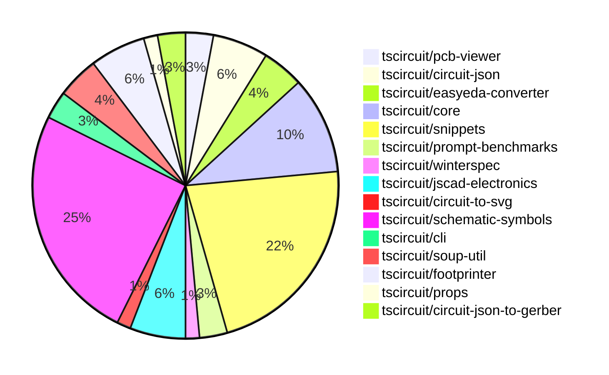

# contribution-tracker

Generates weekly contribution overviews for tscircuit contributors. Check out all
the [contribution overviews here](./contribution-overviews/)

* All PRs in the tscircuit org are scanned/summarized via Claude Haiku
* Claude classifies each Diff/PR as a Major, Minor or Tiny contribution
* All the PRs, summaries, and classifications are organized into charts and tables

The current week is shown below. There are 3 major sections:

* [Contributor Overview](#contributor-overview)
* [PRs by Repository](#prs-by-repository)
* [PRs by Contributor](#changes-by-contributor)

## Current Week

<!-- START_CURRENT_WEEK -->

# Contribution Overview 2024-10-05

## PRs by Repository

## Contributor Overview

| Contributor | 🐳 Major | 🐙 Minor | 🐌 Tiny |
|-------------|-------|-------|-------|
| seveibar | 18 | 4 | 0 |
| imrishabh18 | 3 | 6 | 2 |
| DhairyaMajmudar | 3 | 2 | 0 |
| anas-sarkez | 1 | 4 | 0 |
| ShiboSoftwareDev | 4 | 2 | 0 |
| andrii-balitskyi | 1 | 0 | 0 |
| aman1376 | 6 | 0 | 0 |
| Complexlity | 0 | 1 | 0 |
| 0xkafkaa | 4 | 0 | 0 |
| Timer00 | 1 | 0 | 0 |
| bbland1 | 3 | 1 | 0 |
| PALLAVIKHEDLE | 1 | 0 | 0 |

## Changes by Repository

### [tscircuit/pcb-viewer](https://github.com/tscircuit/pcb-viewer)

| PR # | Impact | Contributor | Description |
|------|--------|-------------|-------------|
| [#71](https://github.com/tscircuit/pcb-viewer/pull/71) | 🐳 Major | seveibar | Reverts the "Convert children rendering to core" change, as it broke the PCB viewer's bounds computation. |
| [#70](https://github.com/tscircuit/pcb-viewer/pull/70) | 🐳 Major | seveibar | Convert children rendering to core |

### [tscircuit/circuit-json](https://github.com/tscircuit/circuit-json)

| PR # | Impact | Contributor | Description |
|------|--------|-------------|-------------|
| [#55](https://github.com/tscircuit/circuit-json/pull/55) | 🐳 Major | seveibar | Add a GitHub Actions workflow to run tests for the project using the Bun runtime. |
| [#56](https://github.com/tscircuit/circuit-json/pull/56) | 🐳 Major | ShiboSoftwareDev | Introduce a new `pcb_solder_paste` component to the PCB definition. |
| [#58](https://github.com/tscircuit/circuit-json/pull/58) | 🐙 Minor | imrishabh18 | Added an optional `display_value` property to the `SourceComponentBase` type. |
| [#57](https://github.com/tscircuit/circuit-json/pull/57) | 🐙 Minor | anas-sarkez | Add mil unit and format script |

### [tscircuit/easyeda-converter](https://github.com/tscircuit/easyeda-converter)

| PR # | Impact | Contributor | Description |
|------|--------|-------------|-------------|
| [#46](https://github.com/tscircuit/easyeda-converter/pull/46) | 🐳 Major | seveibar | Convert the project to use ECMAScript modules (ESM) instead of CommonJS modules. |
| [#45](https://github.com/tscircuit/easyeda-converter/pull/45) | 🐳 Major | seveibar | Migrate the project to use `circuit-json` and `@tscircuit/soup-util` libraries, remove the `builder` dependency, and provide more usage details in the README. |
| [#44](https://github.com/tscircuit/easyeda-converter/pull/44) | 🐳 Major | andrii-balitskyi | Fix build and add typecheck workflow |

### [tscircuit/core](https://github.com/tscircuit/core)

| PR # | Impact | Contributor | Description |
|------|--------|-------------|-------------|
| [#149](https://github.com/tscircuit/core/pull/149) | 🐳 Major | seveibar | Introduce the `useRenderedCircuit` hook and set up a test system for hooks. |
| [#137](https://github.com/tscircuit/core/pull/137) | 🐳 Major | seveibar | Improve the error handling for invalid props in the `PrimitiveComponent` class by throwing a custom `InvalidProps` error with detailed information about the invalid props. |
| [#139](https://github.com/tscircuit/core/pull/139) | 🐳 Major | imrishabh18 | Fix chip placement in the schematic box by updating the calculation of the schematic box dimensions. |
| [#136](https://github.com/tscircuit/core/pull/136) | 🐳 Major | ShiboSoftwareDev | Creates a new component `pcb_solder_paste` from the `smtpads` component. |
| [#143](https://github.com/tscircuit/core/pull/143) | 🐙 Minor | imrishabh18 | Update the `@tscircuit/soup-util` package to a smaller bundle size |
| [#141](https://github.com/tscircuit/core/pull/141) | 🐙 Minor | imrishabh18 | Update dependencies to use the latest version of footprinter without lodash |
| [#138](https://github.com/tscircuit/core/pull/138) | 🐙 Minor | ShiboSoftwareDev | Inherit `pcb_smt_pad _setPositionFromLayout` behaviour in `pcb_solder_paste`. |

### [tscircuit/snippets](https://github.com/tscircuit/snippets)

| PR # | Impact | Contributor | Description |
|------|--------|-------------|-------------|
| [#45](https://github.com/tscircuit/snippets/pull/45) | 🐳 Major | seveibar | This change adds the ability to save the DTS (definition file) content along with the code snippet in the database. |
| [#42](https://github.com/tscircuit/snippets/pull/42) | 🐳 Major | seveibar | The change adds support for storing and retrieving compiled JavaScript code in the database schema and updates the create and update snippet API endpoints to handle the new field. |
| [#40](https://github.com/tscircuit/snippets/pull/40) | 🐳 Major | seveibar |  |
| [#35](https://github.com/tscircuit/snippets/pull/35) | 🐳 Major | seveibar | Revert the "new button hover changes" pull request due to issues with the scroll bar and dropdown menu behavior. |
| [#39](https://github.com/tscircuit/snippets/pull/39) | 🐳 Major | seveibar | Introduce a TypeScript-powered code editor with advanced features |
| [#36](https://github.com/tscircuit/snippets/pull/36) | 🐳 Major | seveibar | Introduce a fake API switch functionality |
| [#32](https://github.com/tscircuit/snippets/pull/32) | 🐳 Major | seveibar | Adds a feature to generate code snippets from JLCPCB part numbers. |
| [#23](https://github.com/tscircuit/snippets/pull/23) | 🐳 Major | seveibar | Introduces various improvements and fixes for the AI chat interface, including link improvements, a new snippet link component, and a button to open the editor for the current snippet. |
| [#12](https://github.com/tscircuit/snippets/pull/12) | 🐳 Major | seveibar | Add new schema types for Session, LoginPage, and Account, and update the Snippet schema. |
| [#37](https://github.com/tscircuit/snippets/pull/37) | 🐳 Major | DhairyaMajmudar | Home page made responsive, HTML tags in footer updated, related to issue #25 |
| [#33](https://github.com/tscircuit/snippets/pull/33) | 🐳 Major | PALLAVIKHEDLE | Adds a hover-activated dropdown to the "New" button, which navigates to the "/editor" page when clicked. |
| [#21](https://github.com/tscircuit/snippets/pull/21) | 🐙 Minor | seveibar | The pull request adds an empty state for the AI chat interface and displays the account balance in the header. |
| [#13](https://github.com/tscircuit/snippets/pull/13) | 🐙 Minor | seveibar | Formats the repository, adds Vercel rewrites, and makes minor fixes. |
| [#28](https://github.com/tscircuit/snippets/pull/28) | 🐙 Minor | DhairyaMajmudar | Adds strict camelCase naming convention for constants in the biome.json file. |
| [#10](https://github.com/tscircuit/snippets/pull/10) | 🐙 Minor | DhairyaMajmudar | The pull request adds a click event to the cross button that will now hide the Onboarding Tips section. |

### [tscircuit/prompt-benchmarks](https://github.com/tscircuit/prompt-benchmarks)

| PR # | Impact | Contributor | Description |
|------|--------|-------------|-------------|
| [#3](https://github.com/tscircuit/prompt-benchmarks/pull/3) | 🐳 Major | seveibar | Adds a new function `safeCompileDts` to safely compile TypeScript code to a declaration file (`.d.ts`) using a virtual TypeScript environment and type acquisition from CDN or Node.js modules. |
| [#2](https://github.com/tscircuit/prompt-benchmarks/pull/2) | 🐳 Major | seveibar | Adds support for running generated code and testing with a threshold acceptance. |

### [tscircuit/winterspec](https://github.com/tscircuit/winterspec)

| PR # | Impact | Contributor | Description |
|------|--------|-------------|-------------|
| [#12](https://github.com/tscircuit/winterspec/pull/12) | 🐙 Minor | seveibar | Fix an issue in the way the routes directory is loaded, and make some minor fixes to test fixtures and licensing information. |

### [tscircuit/jscad-electronics](https://github.com/tscircuit/jscad-electronics)

| PR # | Impact | Contributor | Description |
|------|--------|-------------|-------------|
| [#61](https://github.com/tscircuit/jscad-electronics/pull/61) | 🐙 Minor | seveibar | Add CODEOWNERS file to specify code owners for the repository. |
| [#62](https://github.com/tscircuit/jscad-electronics/pull/62) | 🟣 | anas-sarkez | Updated the `soup` dependency to `circuit-json`. |
| [#58](https://github.com/tscircuit/jscad-electronics/pull/58) | 🐳 Major | anas-sarkez | Updated the dimensions and positions of the leads and body of the SOT-23, SOT-563, and SOT-723 component models to better match their actual footprints. |
| [#60](https://github.com/tscircuit/jscad-electronics/pull/60) | 🐙 Minor | anas-sarkez | Added a 'showGrid' property to all test examples. |

### [tscircuit/circuit-to-svg](https://github.com/tscircuit/circuit-to-svg)

| PR # | Impact | Contributor | Description |
|------|--------|-------------|-------------|
| [#82](https://github.com/tscircuit/circuit-to-svg/pull/82) | 🐳 Major | imrishabh18 | Fixes the placement of chip ports in the schematic SVG generation |

### [tscircuit/schematic-symbols](https://github.com/tscircuit/schematic-symbols)

| PR # | Impact | Contributor | Description |
|------|--------|-------------|-------------|
| [#135](https://github.com/tscircuit/schematic-symbols/pull/135) | 🐳 Major | imrishabh18 | Adding support for cubic bezier curve (C command) in the `svgPathToPoints()` function. |
| [#154](https://github.com/tscircuit/schematic-symbols/pull/154) | 🐳 Major | aman1376 | Adds a new JSON file for a p-channel E-MOSFET transistor symbol and creates an SVG file for the same. |
| [#151](https://github.com/tscircuit/schematic-symbols/pull/151) | 🐳 Major | aman1376 | Add a new n-channel depletion-mode MOSFET transistor symbol |
| [#152](https://github.com/tscircuit/schematic-symbols/pull/152) | 🐳 Major | aman1376 | Add a new p-channel MOSFET transistor asset with SVG and JSON definitions. |
| [#150](https://github.com/tscircuit/schematic-symbols/pull/150) | 🐳 Major | aman1376 | Add a new SVG file and JSON data for an NJFET transistor symbol. |
| [#149](https://github.com/tscircuit/schematic-symbols/pull/149) | 🐳 Major | aman1376 | Adds a new PJFET transistor symbol with associated paths, texts, and reference blocks. |
| [#130](https://github.com/tscircuit/schematic-symbols/pull/130) | 🐳 Major | aman1376 | Introduce a new TypeScript type `BaseSymbolName` that represents the list of base symbol names. |
| [#145](https://github.com/tscircuit/schematic-symbols/pull/145) | 🐳 Major | 0xkafkaa | Add a new SVG image and JSON data for a crystal symbol. |
| [#146](https://github.com/tscircuit/schematic-symbols/pull/146) | 🐳 Major | 0xkafkaa | Add a new resonator asset to the project |
| [#137](https://github.com/tscircuit/schematic-symbols/pull/137) | 🐳 Major | 0xkafkaa | Add a new component "step_recovery_diode" to the project. |
| [#133](https://github.com/tscircuit/schematic-symbols/pull/133) | 🐳 Major | 0xkafkaa | Adds a new JSON file for a Gunn diode component and updates the corresponding SVG file. |
| [#136](https://github.com/tscircuit/schematic-symbols/pull/136) | 🐳 Major | Timer00 | Adds snapshot tests for SVG symbols to ensure consistent rendering. |
| [#132](https://github.com/tscircuit/schematic-symbols/pull/132) | 🐳 Major | bbland1 | Center diamond update |
| [#110](https://github.com/tscircuit/schematic-symbols/pull/110) | 🐳 Major | bbland1 | Add a new SVG and TypeScript file for a diac symbol. |
| [#111](https://github.com/tscircuit/schematic-symbols/pull/111) | 🐳 Major | bbland1 | Create an SVG and TypeScript file for a unijunction transistor symbol. |
| [#102](https://github.com/tscircuit/schematic-symbols/pull/102) | 🐙 Minor | Complexlity | Add text primitive type to the generated TypeScript file for SVG groups. |
| [#131](https://github.com/tscircuit/schematic-symbols/pull/131) | 🐙 Minor | bbland1 | Fixing the reference ({REF}) position in the diac symbol |

### [tscircuit/cli](https://github.com/tscircuit/cli)

| PR # | Impact | Contributor | Description |
|------|--------|-------------|-------------|
| [#215](https://github.com/tscircuit/cli/pull/215) | 🐳 Major | DhairyaMajmudar | Refactoring files for better using typescript types by removing `any` keywords and replacing suitable types and removing unused imports. |
| [#226](https://github.com/tscircuit/cli/pull/226) | 🐙 Minor | imrishabh18 | Update the `circuit-to-svg` dependency to a newer version to resolve installation warnings and dependency issues. |

### [tscircuit/soup-util](https://github.com/tscircuit/soup-util)

| PR # | Impact | Contributor | Description |
|------|--------|-------------|-------------|
| [#18](https://github.com/tscircuit/soup-util/pull/18) | 🐙 Minor | imrishabh18 | Update the `circuit-json` dependency to the latest version `0.0.85`. |
| [#19](https://github.com/tscircuit/soup-util/pull/19) | 🐌 Tiny | imrishabh18 | Update the package lock file to ensure consistent dependencies across environments. |
| [#17](https://github.com/tscircuit/soup-util/pull/17) | 🐌 Tiny | imrishabh18 | Remove unused dependency "@types/bun" |

### [tscircuit/footprinter](https://github.com/tscircuit/footprinter)

| PR # | Impact | Contributor | Description |
|------|--------|-------------|-------------|
| [#48](https://github.com/tscircuit/footprinter/pull/48) | 🐳 Major | DhairyaMajmudar | Adding SOT363 circuit |
| [#55](https://github.com/tscircuit/footprinter/pull/55) | 🐙 Minor | imrishabh18 | Update the `@tscircuit/mm` dependency to the latest version without the `lodash` dependency. |
| [#58](https://github.com/tscircuit/footprinter/pull/58) | 🐙 Minor | anas-sarkez | Modified test files and added preload |
| [#56](https://github.com/tscircuit/footprinter/pull/56) | 🐙 Minor | anas-sarkez | Migrate from ava to bun test |

### [tscircuit/props](https://github.com/tscircuit/props)

| PR # | Impact | Contributor | Description |
|------|--------|-------------|-------------|
| [#56](https://github.com/tscircuit/props/pull/56) | 🐳 Major | ShiboSoftwareDev | Introduce a new component for solder paste with support for rectangular and circular shapes. |

### [tscircuit/circuit-json-to-gerber](https://github.com/tscircuit/circuit-json-to-gerber)

| PR # | Impact | Contributor | Description |
|------|--------|-------------|-------------|
| [#18](https://github.com/tscircuit/circuit-json-to-gerber/pull/18) | 🐳 Major | ShiboSoftwareDev | Implemented the `pcb_solder_paste` feature to handle solder paste elements in the Gerber file generation process. |
| [#19](https://github.com/tscircuit/circuit-json-to-gerber/pull/19) | 🐙 Minor | ShiboSoftwareDev | Fixed an issue with the excellon-drill snapshot test where the file contents were being concatenated instead of diffing correctly. |

## Changes by Contributor

### [seveibar](https://github.com/seveibar)

| PR # | Impact | Description |
|------|--------|-------------|
| [#71](https://github.com/tscircuit/pcb-viewer/pull/71) | 🐳 Major | Reverts the "Convert children rendering to core" change, as it broke the PCB viewer's bounds computation. |
| [#70](https://github.com/tscircuit/pcb-viewer/pull/70) | 🐳 Major | Convert children rendering to core |
| [#55](https://github.com/tscircuit/circuit-json/pull/55) | 🐳 Major | Add a GitHub Actions workflow to run tests for the project using the Bun runtime. |
| [#46](https://github.com/tscircuit/easyeda-converter/pull/46) | 🐳 Major | Convert the project to use ECMAScript modules (ESM) instead of CommonJS modules. |
| [#45](https://github.com/tscircuit/easyeda-converter/pull/45) | 🐳 Major | Migrate the project to use `circuit-json` and `@tscircuit/soup-util` libraries, remove the `builder` dependency, and provide more usage details in the README. |
| [#149](https://github.com/tscircuit/core/pull/149) | 🐳 Major | Introduce the `useRenderedCircuit` hook and set up a test system for hooks. |
| [#137](https://github.com/tscircuit/core/pull/137) | 🐳 Major | Improve the error handling for invalid props in the `PrimitiveComponent` class by throwing a custom `InvalidProps` error with detailed information about the invalid props. |
| [#45](https://github.com/tscircuit/snippets/pull/45) | 🐳 Major | This change adds the ability to save the DTS (definition file) content along with the code snippet in the database. |
| [#42](https://github.com/tscircuit/snippets/pull/42) | 🐳 Major | The change adds support for storing and retrieving compiled JavaScript code in the database schema and updates the create and update snippet API endpoints to handle the new field. |
| [#40](https://github.com/tscircuit/snippets/pull/40) | 🐳 Major |  |
| [#35](https://github.com/tscircuit/snippets/pull/35) | 🐳 Major | Revert the "new button hover changes" pull request due to issues with the scroll bar and dropdown menu behavior. |
| [#39](https://github.com/tscircuit/snippets/pull/39) | 🐳 Major | Introduce a TypeScript-powered code editor with advanced features |
| [#36](https://github.com/tscircuit/snippets/pull/36) | 🐳 Major | Introduce a fake API switch functionality |
| [#32](https://github.com/tscircuit/snippets/pull/32) | 🐳 Major | Adds a feature to generate code snippets from JLCPCB part numbers. |
| [#23](https://github.com/tscircuit/snippets/pull/23) | 🐳 Major | Introduces various improvements and fixes for the AI chat interface, including link improvements, a new snippet link component, and a button to open the editor for the current snippet. |
| [#12](https://github.com/tscircuit/snippets/pull/12) | 🐳 Major | Add new schema types for Session, LoginPage, and Account, and update the Snippet schema. |
| [#3](https://github.com/tscircuit/prompt-benchmarks/pull/3) | 🐳 Major | Adds a new function `safeCompileDts` to safely compile TypeScript code to a declaration file (`.d.ts`) using a virtual TypeScript environment and type acquisition from CDN or Node.js modules. |
| [#2](https://github.com/tscircuit/prompt-benchmarks/pull/2) | 🐳 Major | Adds support for running generated code and testing with a threshold acceptance. |
| [#12](https://github.com/tscircuit/winterspec/pull/12) | 🐙 Minor | Fix an issue in the way the routes directory is loaded, and make some minor fixes to test fixtures and licensing information. |
| [#61](https://github.com/tscircuit/jscad-electronics/pull/61) | 🐙 Minor | Add CODEOWNERS file to specify code owners for the repository. |
| [#21](https://github.com/tscircuit/snippets/pull/21) | 🐙 Minor | The pull request adds an empty state for the AI chat interface and displays the account balance in the header. |
| [#13](https://github.com/tscircuit/snippets/pull/13) | 🐙 Minor | Formats the repository, adds Vercel rewrites, and makes minor fixes. |

### [imrishabh18](https://github.com/imrishabh18)

| PR # | Impact | Description |
|------|--------|-------------|
| [#139](https://github.com/tscircuit/core/pull/139) | 🐳 Major | Fix chip placement in the schematic box by updating the calculation of the schematic box dimensions. |
| [#82](https://github.com/tscircuit/circuit-to-svg/pull/82) | 🐳 Major | Fixes the placement of chip ports in the schematic SVG generation |
| [#135](https://github.com/tscircuit/schematic-symbols/pull/135) | 🐳 Major | Adding support for cubic bezier curve (C command) in the `svgPathToPoints()` function. |
| [#226](https://github.com/tscircuit/cli/pull/226) | 🐙 Minor | Update the `circuit-to-svg` dependency to a newer version to resolve installation warnings and dependency issues. |
| [#58](https://github.com/tscircuit/circuit-json/pull/58) | 🐙 Minor | Added an optional `display_value` property to the `SourceComponentBase` type. |
| [#18](https://github.com/tscircuit/soup-util/pull/18) | 🐙 Minor | Update the `circuit-json` dependency to the latest version `0.0.85`. |
| [#55](https://github.com/tscircuit/footprinter/pull/55) | 🐙 Minor | Update the `@tscircuit/mm` dependency to the latest version without the `lodash` dependency. |
| [#143](https://github.com/tscircuit/core/pull/143) | 🐙 Minor | Update the `@tscircuit/soup-util` package to a smaller bundle size |
| [#141](https://github.com/tscircuit/core/pull/141) | 🐙 Minor | Update dependencies to use the latest version of footprinter without lodash |
| [#19](https://github.com/tscircuit/soup-util/pull/19) | 🐌 Tiny | Update the package lock file to ensure consistent dependencies across environments. |
| [#17](https://github.com/tscircuit/soup-util/pull/17) | 🐌 Tiny | Remove unused dependency "@types/bun" |

### [DhairyaMajmudar](https://github.com/DhairyaMajmudar)

| PR # | Impact | Description |
|------|--------|-------------|
| [#215](https://github.com/tscircuit/cli/pull/215) | 🐳 Major | Refactoring files for better using typescript types by removing `any` keywords and replacing suitable types and removing unused imports. |
| [#48](https://github.com/tscircuit/footprinter/pull/48) | 🐳 Major | Adding SOT363 circuit |
| [#37](https://github.com/tscircuit/snippets/pull/37) | 🐳 Major | Home page made responsive, HTML tags in footer updated, related to issue #25 |
| [#28](https://github.com/tscircuit/snippets/pull/28) | 🐙 Minor | Adds strict camelCase naming convention for constants in the biome.json file. |
| [#10](https://github.com/tscircuit/snippets/pull/10) | 🐙 Minor | The pull request adds a click event to the cross button that will now hide the Onboarding Tips section. |

### [anas-sarkez](https://github.com/anas-sarkez)

| PR # | Impact | Description |
|------|--------|-------------|
| [#57](https://github.com/tscircuit/circuit-json/pull/57) | 🐙 Minor | Add mil unit and format script |
| [#58](https://github.com/tscircuit/footprinter/pull/58) | 🐙 Minor | Modified test files and added preload |
| [#56](https://github.com/tscircuit/footprinter/pull/56) | 🐙 Minor | Migrate from ava to bun test |
| [#62](https://github.com/tscircuit/jscad-electronics/pull/62) | 🟣 | Updated the `soup` dependency to `circuit-json`. |
| [#58](https://github.com/tscircuit/jscad-electronics/pull/58) | 🐳 Major | Updated the dimensions and positions of the leads and body of the SOT-23, SOT-563, and SOT-723 component models to better match their actual footprints. |
| [#60](https://github.com/tscircuit/jscad-electronics/pull/60) | 🐙 Minor | Added a 'showGrid' property to all test examples. |

### [ShiboSoftwareDev](https://github.com/ShiboSoftwareDev)

| PR # | Impact | Description |
|------|--------|-------------|
| [#56](https://github.com/tscircuit/circuit-json/pull/56) | 🐳 Major | Introduce a new `pcb_solder_paste` component to the PCB definition. |
| [#56](https://github.com/tscircuit/props/pull/56) | 🐳 Major | Introduce a new component for solder paste with support for rectangular and circular shapes. |
| [#136](https://github.com/tscircuit/core/pull/136) | 🐳 Major | Creates a new component `pcb_solder_paste` from the `smtpads` component. |
| [#18](https://github.com/tscircuit/circuit-json-to-gerber/pull/18) | 🐳 Major | Implemented the `pcb_solder_paste` feature to handle solder paste elements in the Gerber file generation process. |
| [#138](https://github.com/tscircuit/core/pull/138) | 🐙 Minor | Inherit `pcb_smt_pad _setPositionFromLayout` behaviour in `pcb_solder_paste`. |
| [#19](https://github.com/tscircuit/circuit-json-to-gerber/pull/19) | 🐙 Minor | Fixed an issue with the excellon-drill snapshot test where the file contents were being concatenated instead of diffing correctly. |

### [andrii-balitskyi](https://github.com/andrii-balitskyi)

| PR # | Impact | Description |
|------|--------|-------------|
| [#44](https://github.com/tscircuit/easyeda-converter/pull/44) | 🐳 Major | Fix build and add typecheck workflow |

### [aman1376](https://github.com/aman1376)

| PR # | Impact | Description |
|------|--------|-------------|
| [#154](https://github.com/tscircuit/schematic-symbols/pull/154) | 🐳 Major | Adds a new JSON file for a p-channel E-MOSFET transistor symbol and creates an SVG file for the same. |
| [#151](https://github.com/tscircuit/schematic-symbols/pull/151) | 🐳 Major | Add a new n-channel depletion-mode MOSFET transistor symbol |
| [#152](https://github.com/tscircuit/schematic-symbols/pull/152) | 🐳 Major | Add a new p-channel MOSFET transistor asset with SVG and JSON definitions. |
| [#150](https://github.com/tscircuit/schematic-symbols/pull/150) | 🐳 Major | Add a new SVG file and JSON data for an NJFET transistor symbol. |
| [#149](https://github.com/tscircuit/schematic-symbols/pull/149) | 🐳 Major | Adds a new PJFET transistor symbol with associated paths, texts, and reference blocks. |
| [#130](https://github.com/tscircuit/schematic-symbols/pull/130) | 🐳 Major | Introduce a new TypeScript type `BaseSymbolName` that represents the list of base symbol names. |

### [Complexlity](https://github.com/Complexlity)

| PR # | Impact | Description |
|------|--------|-------------|
| [#102](https://github.com/tscircuit/schematic-symbols/pull/102) | 🐙 Minor | Add text primitive type to the generated TypeScript file for SVG groups. |

### [0xkafkaa](https://github.com/0xkafkaa)

| PR # | Impact | Description |
|------|--------|-------------|
| [#145](https://github.com/tscircuit/schematic-symbols/pull/145) | 🐳 Major | Add a new SVG image and JSON data for a crystal symbol. |
| [#146](https://github.com/tscircuit/schematic-symbols/pull/146) | 🐳 Major | Add a new resonator asset to the project |
| [#137](https://github.com/tscircuit/schematic-symbols/pull/137) | 🐳 Major | Add a new component "step_recovery_diode" to the project. |
| [#133](https://github.com/tscircuit/schematic-symbols/pull/133) | 🐳 Major | Adds a new JSON file for a Gunn diode component and updates the corresponding SVG file. |

### [Timer00](https://github.com/Timer00)

| PR # | Impact | Description |
|------|--------|-------------|
| [#136](https://github.com/tscircuit/schematic-symbols/pull/136) | 🐳 Major | Adds snapshot tests for SVG symbols to ensure consistent rendering. |

### [bbland1](https://github.com/bbland1)

| PR # | Impact | Description |
|------|--------|-------------|
| [#132](https://github.com/tscircuit/schematic-symbols/pull/132) | 🐳 Major | Center diamond update |
| [#110](https://github.com/tscircuit/schematic-symbols/pull/110) | 🐳 Major | Add a new SVG and TypeScript file for a diac symbol. |
| [#111](https://github.com/tscircuit/schematic-symbols/pull/111) | 🐳 Major | Create an SVG and TypeScript file for a unijunction transistor symbol. |
| [#131](https://github.com/tscircuit/schematic-symbols/pull/131) | 🐙 Minor | Fixing the reference ({REF}) position in the diac symbol |

### [PALLAVIKHEDLE](https://github.com/PALLAVIKHEDLE)

| PR # | Impact | Description |
|------|--------|-------------|
| [#33](https://github.com/tscircuit/snippets/pull/33) | 🐳 Major | Adds a hover-activated dropdown to the "New" button, which navigates to the "/editor" page when clicked. |

<!-- END_CURRENT_WEEK -->
