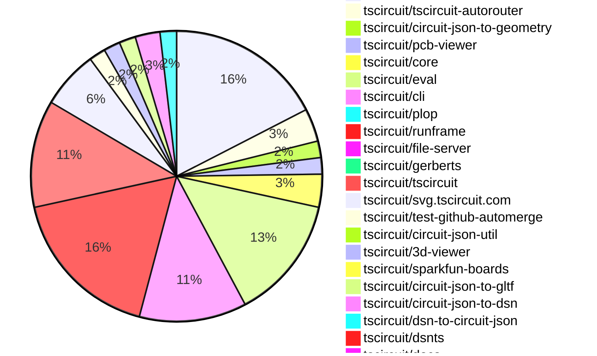
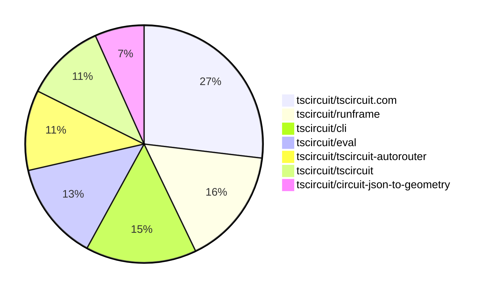

# contribution-tracker

[contributions.tscircuit.com](https://contributions.tscircuit.com) ・ [tscircuit.com](https://tscircuit.com) ・ [Contribution Overviews](./contribution-overviews/) ・ [Changelogs](./changelogs/)

Generates weekly contribution overviews for tscircuit contributors. Check out all
the [contribution overviews here](./contribution-overviews/)
You can find AI-generated monthly changelogs in the [changelogs directory](./changelogs/).

- All PRs in the tscircuit org are scanned/summarized via an LLM
- The LLM classifies each Diff/PR as into a set of attributes for scoring
- All the PRs, summaries, and classifications are organized into charts and tables for [the website](https://contributions.tscircuit.com)

> Want to run locally? See the [Development Section](#development)

The current week is shown below. There are 4 major sections:

- [Contributor Overview](#contributor-overview)
- [PRs by Repository](#prs-by-repository)
- [PRs by Contributor](#changes-by-contributor)
- [Scoring & Sponsorship System](#scoring--sponsorship-system)

## Current Week

<!-- START_CURRENT_WEEK -->

# Contribution Overview 2025-12-03

The current week is shown below. There are 4 major sections:

- [Contributor Overview](#contributor-overview)
- [PRs by Repository](#prs-by-repository)
- [PRs by Contributor](#changes-by-contributor)
- [Scoring & Sponsorship System](#scoring--sponsorship-system)

## PRs by Repository



## Contributor Overview

| Contributor | 🐳 Major | 🐙 Minor | 🐌 Tiny | ⭐ | Score | Discussion Contributions |
|-------------|---------|---------|---------|-----|----------------|--------------------------|
| [seveibar](#seveibar) | 7 | 6 | 10 | 👑 | 51 | 0🔹 0🔶 0💎 |
| [imrishabh18](#imrishabh18) | 3 | 3 | 2 | ⭐⭐ | 21 | 0🔹 0🔶 0💎 |
| [tscircuitbot](#tscircuitbot) | 0 | 0 | 65 | ⭐⭐ | 13 | 0🔹 0🔶 0💎 |
| [rushabhcodes](#rushabhcodes) | 2 | 0 | 0 | ⭐ | 10 | 0🔹 0🔶 0💎 |
| [Abse2001](#Abse2001) | 0 | 3 | 1 | ⭐ | 7 | 0🔹 0🔶 0💎 |
| [RaghavArora14](#RaghavArora14) | 1 | 1 | 0 | ⭐ | 7 | 0🔹 0🔶 0💎 |
| [techmannih](#techmannih) | 0 | 0 | 2 | ⭐ | 5 | 0🔹 0🔶 0💎 |
| [MustafaMulla29](#MustafaMulla29) | 0 | 1 | 3 | ⭐ | 5 | 0🔹 0🔶 0💎 |
| [0hmX](#0hmX) | 1 | 0 | 1 | ⭐ | 4.5 | 0🔹 0🔶 0💎 |
| [Ayushjhawar8](#Ayushjhawar8) | 0 | 2 | 0 | ⭐ | 4 | 0🔹 0🔶 0💎 |
| [pxlpal](#pxlpal) | 0 | 1 | 1 |  | 3 | 0🔹 0🔶 0💎 |

> Note: AI evaluates PRs and assigns 1-3 star ratings automatically. 4 and 5 star ratings require manual staff review.

### Discussion Contribution Legend

- 🔹 Normal Comments: Basic participation with minimal effort
- 🔶 Great Informative Comments: Thoughtful participation that adds value
- 💎 Incredible Comments: Exceptional participation with high-quality content

## Review Table

[reviews-received-hover]: ## "Number of reviews received for PRs for this contributor"
[approvals-received-hover]: ## "Number of approvals received for PRs this contributor authored"
[rejections-received-hover]: ## "Number of rejections received for PRs this contributor authored"
[prs-opened-hover]: ## "Number of PRs opened by this contributor"
[issues-created-hover]: ## "Number of issues created by this contributor"
[bountied-issues-hover]: ## "Number of issues this contributor created with a bounty"
[bountied-issue-$-hover]: ## "Total bounty amount placed on issues authored by this contributor"

| Contributor | Reviews Received | Approvals Received | Rejections Received | Approvals | Rejections | PRs Opened | PRs Merged | Score | Issues Created | Bountied Issues | Bountied Issue $ |
|---|---|---|---|---|---|---|---|---|---|---|---|
| [techmannih](#techmannih) | 6 | 4 | 0 | 1 | 0 | 7 | 2 | 5 | 0 | 0 | 0 |
| [seveibar](#seveibar) | 3 | 0 | 0 | 20 | 4 | 29 | 23 | 51 | 0 | 0 | 0 |
| [tscircuitbot](#tscircuitbot) | 0 | 0 | 0 | 0 | 0 | 85 | 65 | 13 | 0 | 0 | 0 |
| [Devesh36](#Devesh36) | 5 | 0 | 1 | 0 | 0 | 2 | 0 | 0 | 0 | 0 | 0 |
| [rushabhcodes](#rushabhcodes) | 17 | 6 | 0 | 0 | 0 | 7 | 2 | 10 | 0 | 0 | 0 |
| [Lulzx](#Lulzx) | 0 | 0 | 0 | 0 | 0 | 5 | 0 | 0 | 0 | 0 | 0 |
| [Abse2001](#Abse2001) | 6 | 5 | 0 | 0 | 0 | 5 | 4 | 7 | 0 | 0 | 0 |
| [AnasSarkiz](#AnasSarkiz) | 7 | 2 | 2 | 0 | 0 | 3 | 0 | 0 | 0 | 0 | 0 |
| [MustafaMulla29](#MustafaMulla29) | 7 | 3 | 1 | 0 | 0 | 9 | 4 | 5 | 0 | 0 | 0 |
| [Ayushjhawar8](#Ayushjhawar8) | 7 | 2 | 1 | 0 | 0 | 4 | 2 | 4 | 0 | 0 | 0 |
| [Aqil-Ahmad](#Aqil-Ahmad) | 0 | 0 | 0 | 0 | 0 | 1 | 0 | 0 | 0 | 0 | 0 |
| [RaghavArora14](#RaghavArora14) | 9 | 4 | 0 | 1 | 0 | 3 | 2 | 7 | 0 | 0 | 0 |
| [ArnavK-09](#ArnavK-09) | 0 | 0 | 0 | 1 | 0 | 0 | 0 | 0 | 0 | 0 | 0 |
| [ShiboSoftwareDev](#ShiboSoftwareDev) | 0 | 0 | 0 | 4 | 0 | 0 | 0 | 0 | 0 | 0 | 0 |
| [pxlpal](#pxlpal) | 1 | 1 | 0 | 0 | 0 | 2 | 2 | 3 | 0 | 0 | 0 |
| [imrishabh18](#imrishabh18) | 6 | 1 | 0 | 3 | 1 | 8 | 8 | 21 | 0 | 0 | 0 |
| [0hmX](#0hmX) | 4 | 2 | 0 | 0 | 0 | 2 | 2 | 4.5 | 0 | 0 | 0 |

## Top 7 Repositories by Contribution Points



## Scoring & Sponsorship System

### Overview

PRs are analyzed by AI and assigned a **star rating (1-3 stars)**. 4 and 5 star ratings can only be manually assigned by staff. Weekly scores use `2^(starRating - 1)` per PR (capped at 12 PRs per rating), plus review/discussion points.

### Weekly Score → Star String

| Score Range | Star String | Count Value |
|------------|-------------|-------------|
| 0-3 | (empty) | 0 stars |
| 4-10 | ⭐ | 1 star |
| 11-30 | ⭐⭐ | 2 stars |
| 31-50 | ⭐⭐⭐ | 3 stars |
| 51-75 | 👑 | 1 crown |
| 76-100 | 👑👑 | 2 crowns |
| 101+ | 👑👑👑 | 3 crowns |

> Crowns count as 3 stars for sponsorship.

### Monthly Sponsorship Calculation

The sponsorship system calculates monthly payments based on your **weekly star counts** over the complete weeks in that month (typically 4-5 weeks, Wednesday-Tuesday format).

**Step 1: Collect Weekly Stars**
- All complete weeks in the month are analyzed
- Each week's star string is converted to a numeric count (⭐ = 1 star, ⭐⭐⭐ = 3 stars)
- Example: `[2, 2, 2, 1, 0]` means 2 stars in week 1, 2 stars in week 2, etc.

**Step 2: Calculate Metrics**
- **Median stars**: The median value of all weekly star counts
- **Min stars**: The minimum weekly star count
- **Max stars**: The maximum weekly star count
- **High score**: The maximum raw weekly score (0-100+ range from the scoring table) from any week in the month

**Step 3: Determine Base Amount**
The sponsorship amount is calculated based on these metrics (checked in order):

| Condition | Base Amount |
|-----------|-------------|
| `minStarCount >= 3` | **$500** |
| `medianStars >= 3` | **$450** |
| `medianStars >= 2.5` | **$300** |
| `medianStars >= 2` | **$200** |
| `medianStars >= 1.5` | **$100** |
| `medianStars >= 1` | **$75** |
| `maxStarCount >= 2` | **$25** |
| `maxStarCount >= 1` | **$15** |
| `highScore >= 3` (and all stars = 0) | **$5** |

| Maintainer Level | Monthly Bonus |
|------------------|---------------|
| Level 1 | **$200** |
| Level 2 | **$350** |
| Level 3 | **$500** |

**Final Amount** = Base Amount + Maintainer Bonus

## Changes by Repository

### [tscircuit/tscircuit.com](https://github.com/tscircuit/tscircuit.com)

| PR # | Impact | Rating | Contributor | Description |
|------|--------|--------|-------------|-------------|
| [#2130](https://github.com/tscircuit/tscircuit.com/pull/2130) | 🐳 Major | ⭐⭐⭐ | seveibar | Add avatar_url support to organization schemas and mapping in the fake API, implement POST orgsupload_avatar for the fake server storing image data and returning updated orgs, expose an organization settings dialog and hook to upload avatars from the UI. |
| [#2124](https://github.com/tscircuit/tscircuit.com/pull/2124) | 🐳 Major | ⭐⭐⭐ | seveibar | Add a GitHub connection card on the organization settings page to allow owners to initiate the installation flow directly from the organization view, handle installation completion with a confirmation toast and data refresh, and expose a refetch helper for reuse after connecting. |
| [#2122](https://github.com/tscircuit/tscircuit.com/pull/2122) | 🐳 Major | ⭐⭐⭐ | seveibar | Adds an Orgs submenu to the header account dropdown, listing organizations the user belongs to and linking to each org page. |
| [#2123](https://github.com/tscircuit/tscircuit.com/pull/2123) | 🐙 Minor | ⭐⭐ | seveibar | Displays full package names in the dashboard quick-edit list, including organization or owner scope, and shows package owner scope on dashboard package cards for clearer context. |
| [#2120](https://github.com/tscircuit/tscircuit.com/pull/2120) | 🐙 Minor | ⭐⭐ | seveibar | Load circuit-json-to-gerber dynamically from jsdelivr when generating fabrication downloads and remove the bundled circuit-json-to-gerber dependency from the project. |
| [#2106](https://github.com/tscircuit/tscircuit.com/pull/2106) | 🐙 Minor | ⭐⭐ | RaghavArora14 | Fixes z-index issues in dialog components to prevent overlay problems with the orientation cube. |
| [#2117](https://github.com/tscircuit/tscircuit.com/pull/2117) | 🐙 Minor | ⭐⭐ | pxlpal | Adds account_id to the redirect URL for creating a new GitHub installation, improving the installation process by associating it with the users account. |

<details>
<summary>🐌 Tiny Contributions (12)</summary>

| PR # | Impact | Contributor | Description |
|------|--------|-------------|-------------|
| [#2125](https://github.com/tscircuit/tscircuit.com/pull/2125) | 🐌 Tiny | seveibar | Removes the Order button and associated dialog from the package header, along with cleaning up unused order-related imports and props. |
| [#2131](https://github.com/tscircuit/tscircuit.com/pull/2131) | 🐌 Tiny | tscircuitbot | Automated package update to version 0.0.153 |
| [#2129](https://github.com/tscircuit/tscircuit.com/pull/2129) | 🐌 Tiny | tscircuitbot | Updates the tscircuiteval package from version 0.0.521 to 0.0.522 in the package.json file. |
| [#2128](https://github.com/tscircuit/tscircuit.com/pull/2128) | 🐌 Tiny | tscircuitbot | Automated package update |
| [#2126](https://github.com/tscircuit/tscircuit.com/pull/2126) | 🐌 Tiny | tscircuitbot | Updates the tscircuiteval package from version 0.0.519 to 0.0.520 |
| [#2119](https://github.com/tscircuit/tscircuit.com/pull/2119) | 🐌 Tiny | tscircuitbot | Automated package update |
| [#2118](https://github.com/tscircuit/tscircuit.com/pull/2118) | 🐌 Tiny | tscircuitbot | Updates the tscircuiteval package from version 0.0.517 to 0.0.518 |
| [#2116](https://github.com/tscircuit/tscircuit.com/pull/2116) | 🐌 Tiny | tscircuitbot | Updates the tscircuiteval package from version 0.0.516 to 0.0.517 |
| [#2115](https://github.com/tscircuit/tscircuit.com/pull/2115) | 🐌 Tiny | tscircuitbot | Automated package update |
| [#2113](https://github.com/tscircuit/tscircuit.com/pull/2113) | 🐌 Tiny | tscircuitbot | Updates the tscircuiteval package from version 0.0.514 to 0.0.515 |
| [#2121](https://github.com/tscircuit/tscircuit.com/pull/2121) | 🐌 Tiny | pxlpal | Fixes the package author extraction to use the organization name prefix instead of the GitHub username for org packages. |
| [#2108](https://github.com/tscircuit/tscircuit.com/pull/2108) | 🐌 Tiny | techmannih | Updates the tscircuit3d-viewer package to version 0.0.448 in the package.json file. |

</details>

### [tscircuit/tscircuit-autorouter](https://github.com/tscircuit/tscircuit-autorouter)

| PR # | Impact | Rating | Contributor | Description |
|------|--------|--------|-------------|-------------|
| [#362](https://github.com/tscircuit/tscircuit-autorouter/pull/362) | 🐳 Major | ⭐⭐⭐ | seveibar | Add MultiLayerConnectionPoint and refactor to support MultiLayerConnectionPoint in routing solvers and utilities |
| [#360](https://github.com/tscircuit/tscircuit-autorouter/pull/360) | 🐳 Major | ⭐⭐⭐ | seveibar | Fixes the issue where high density nodes were not being downloaded correctly due to incorrect label matching in the autorouting debugger. |
| [#358](https://github.com/tscircuit/tscircuit-autorouter/pull/358) | 🐳 Major | ⭐⭐⭐ | 0hmX | Refactors the route stitching logic and fixes layer assignment issues in the unravel solver by removing the RouteDirectionFixSubSolver, improving route stitching selection with a scoring system, adding Z-lock constraints for target nodes, and handling edge cases in the SingleSimplifiedPathSolver. |

<details>
<summary>🐌 Tiny Contributions (1)</summary>

| PR # | Impact | Contributor | Description |
|------|--------|-------------|-------------|
| [#359](https://github.com/tscircuit/tscircuit-autorouter/pull/359) | 🐌 Tiny | 0hmX | Adds a new bug report fixture and corresponding test for autorouting issues related to a specific bug report. |

</details>

### [tscircuit/circuit-json-to-geometry](https://github.com/tscircuit/circuit-json-to-geometry)

| PR # | Impact | Rating | Contributor | Description |
|------|--------|--------|-------------|-------------|
| [#2](https://github.com/tscircuit/circuit-json-to-geometry/pull/2) | 🐳 Major | ⭐⭐⭐ | seveibar | Add SVG snapshot tests for circuit elements including board outlines, pads, traces, cutouts, and plated holes, along with a helper to render circuit geometry layers into SVG for testing purposes. |
| [#1](https://github.com/tscircuit/circuit-json-to-geometry/pull/1) | 🐳 Major | ⭐⭐⭐ | seveibar | Add a convertCircuitJsonToGeometry entrypoint that builds Flatten polygons for board outline, copper, and cutouts, along with a basic geometry smoke test and formatting support via biome. |

### [tscircuit/pcb-viewer](https://github.com/tscircuit/pcb-viewer)

| PR # | Impact | Rating | Contributor | Description |
|------|--------|--------|-------------|-------------|
| [#515](https://github.com/tscircuit/pcb-viewer/pull/515) | 🐙 Minor | ⭐⭐ | seveibar | Offsets lowercase alphabet glyphs using the library baseline instead of centered positioning, includes baseline offset in text metrics to account for descender depth, and adds tests confirming baseline placement and descender rendering for lowercase text. |

<details>
<summary>🐌 Tiny Contributions (1)</summary>

| PR # | Impact | Contributor | Description |
|------|--------|-------------|-------------|
| [#516](https://github.com/tscircuit/pcb-viewer/pull/516) | 🐌 Tiny | tscircuitbot | Automated package update |

</details>

### [tscircuit/core](https://github.com/tscircuit/core)

| PR # | Impact | Rating | Contributor | Description |
|------|--------|--------|-------------|-------------|
| [#1711](https://github.com/tscircuit/core/pull/1711) | 🐙 Minor | ⭐⭐ | seveibar | Checks renderable children for incomplete async effects to ensure traversal is shared across component types and removes redundant Group override as the base class now handles children. |
| [#1713](https://github.com/tscircuit/core/pull/1713) | 🐙 Minor | ⭐⭐ | Abse2001 | Refactors board inflation logic to rely on pcb_board entries only. Replaces inflateSourceBoard with the new inflatePcbBoard and updates inflateCircuitJson accordingly. |
| [#1710](https://github.com/tscircuit/core/pull/1710) | 🐙 Minor | ⭐⭐ | Abse2001 | Adds a new inflateSourceBoard inflator that creates a Board component from source_board entries in circuit-json. Prevents double-inflation when a board is already present. Wires board inflation into inflateCircuitJson to ensure boards render correctly in subcircuits. |

<details>
<summary>🐌 Tiny Contributions (1)</summary>

| PR # | Impact | Contributor | Description |
|------|--------|-------------|-------------|
| [#1714](https://github.com/tscircuit/core/pull/1714) | 🐌 Tiny | Abse2001 | Upgrades tscircuitcircuit-json-util to the latest version, which includes fixes for polygon-shaped SMT pad packing. Ensures correct boundsgeometry handling so polygon pads pack properly during PCB layout. |

</details>

### [tscircuit/eval](https://github.com/tscircuit/eval)

| PR # | Impact | Rating | Contributor | Description |
|------|--------|--------|-------------|-------------|
| [#1623](https://github.com/tscircuit/eval/pull/1623) | 🐙 Minor | ⭐⭐ | seveibar | Refactors the import mechanism for npm packages to utilize CDN instead of local imports, enhancing module resolution. |

<details>
<summary>🐌 Tiny Contributions (14)</summary>

| PR # | Impact | Contributor | Description |
|------|--------|-------------|-------------|
| [#1654](https://github.com/tscircuit/eval/pull/1654) | 🐌 Tiny | seveibar | Removes comments from code before extracting import statements to ensure accurate analysis of imports. |
| [#1638](https://github.com/tscircuit/eval/pull/1638) | 🐌 Tiny | seveibar | Adds zod as a development dependency to ensure compatibility with the core version. |
| [#1656](https://github.com/tscircuit/eval/pull/1656) | 🐌 Tiny | tscircuitbot | Automated package update |
| [#1655](https://github.com/tscircuit/eval/pull/1655) | 🐌 Tiny | tscircuitbot | Automated package update |
| [#1653](https://github.com/tscircuit/eval/pull/1653) | 🐌 Tiny | tscircuitbot | Automated package update to version 0.0.520 |
| [#1652](https://github.com/tscircuit/eval/pull/1652) | 🐌 Tiny | tscircuitbot | Automated package update |
| [#1651](https://github.com/tscircuit/eval/pull/1651) | 🐌 Tiny | tscircuitbot | Automated package update |
| [#1649](https://github.com/tscircuit/eval/pull/1649) | 🐌 Tiny | tscircuitbot | Automated package update |
| [#1648](https://github.com/tscircuit/eval/pull/1648) | 🐌 Tiny | tscircuitbot | Automated package update |
| [#1646](https://github.com/tscircuit/eval/pull/1646) | 🐌 Tiny | tscircuitbot | Automated package update |
| [#1645](https://github.com/tscircuit/eval/pull/1645) | 🐌 Tiny | tscircuitbot | Updates the version of the tscircuitcore package from 0.0.897 to 0.0.898 in package.json |
| [#1643](https://github.com/tscircuit/eval/pull/1643) | 🐌 Tiny | tscircuitbot | Automated package update |
| [#1642](https://github.com/tscircuit/eval/pull/1642) | 🐌 Tiny | tscircuitbot | Updates the version of the tscircuitcore package from 0.0.896 to 0.0.897 in package.json |
| [#1639](https://github.com/tscircuit/eval/pull/1639) | 🐌 Tiny | tscircuitbot | Automated package update to version 0.0.515 |

</details>

### [tscircuit/cli](https://github.com/tscircuit/cli)

| PR # | Impact | Rating | Contributor | Description |
|------|--------|--------|-------------|-------------|
| [#1239](https://github.com/tscircuit/cli/pull/1239) | 🐙 Minor | ⭐⭐ | seveibar | Changes the transpile process to ignore includeBoardFiles globs and prioritize the detected main entrypoint for building. |
| [#1246](https://github.com/tscircuit/cli/pull/1246) | 🐙 Minor | ⭐⭐ | Ayushjhawar8 | Fixes the issue where the tsci search command displays vundefined for packages with missing version information. |
| [#1257](https://github.com/tscircuit/cli/pull/1257) | 🐙 Minor | ⭐⭐ | imrishabh18 | Fixes the issue where the fetch() function in the gltf library does not support local file paths, by converting them to file URLs for compatibility. |
| [#1225](https://github.com/tscircuit/cli/pull/1225) | 🐙 Minor | ⭐⭐ | imrishabh18 | Add browser test functionality that supports linking packages with bun, allowing for comprehensive testing of multi-package scenarios. |
| [#1240](https://github.com/tscircuit/cli/pull/1240) | 🐙 Minor | ⭐⭐ | MustafaMulla29 | Fixes the issue where KiCad .kicad_mod files are not uploaded when they are imported from packages without a package.json file. |

<details>
<summary>🐌 Tiny Contributions (8)</summary>

| PR # | Impact | Contributor | Description |
|------|--------|-------------|-------------|
| [#1235](https://github.com/tscircuit/cli/pull/1235) | 🐌 Tiny | seveibar | Sets the CLIs tscircuit peer dependency back to a wildcard while keeping the libonly dev dependency. |
| [#1232](https://github.com/tscircuit/cli/pull/1232) | 🐌 Tiny | seveibar | Specifies the installation of Chromium for Playwright in the CI workflow. |
| [#1255](https://github.com/tscircuit/cli/pull/1255) | 🐌 Tiny | tscircuitbot | Updates the tscircuitrunframe package to version 0.0.1347 in the package.json file. |
| [#1252](https://github.com/tscircuit/cli/pull/1252) | 🐌 Tiny | tscircuitbot | Updates the tscircuitrunframe package version from 0.0.1344 to 0.0.1346 in package.json |
| [#1248](https://github.com/tscircuit/cli/pull/1248) | 🐌 Tiny | tscircuitbot | Updates the tscircuitrunframe package to version 0.0.1344 |
| [#1236](https://github.com/tscircuit/cli/pull/1236) | 🐌 Tiny | tscircuitbot | Automated README update with latest CLI usage output. |
| [#1243](https://github.com/tscircuit/cli/pull/1243) | 🐌 Tiny | MustafaMulla29 | Updates the package version in package.json from 0.1.591 to 0.1.601 |
| [#1244](https://github.com/tscircuit/cli/pull/1244) | 🐌 Tiny | MustafaMulla29 | Updates the package version from 0.1.601 to 0.1.602 in package.json |

</details>

### [tscircuit/plop](https://github.com/tscircuit/plop)


<details>
<summary>🐌 Tiny Contributions (1)</summary>

| PR # | Impact | Contributor | Description |
|------|--------|-------------|-------------|
| [#26](https://github.com/tscircuit/plop/pull/26) | 🐌 Tiny | seveibar | Adds a post-release step to read the updated package version and include the package version in bun-pver-release PR titles and commit messages. |

</details>

### [tscircuit/runframe](https://github.com/tscircuit/runframe)


<details>
<summary>🐌 Tiny Contributions (19)</summary>

| PR # | Impact | Contributor | Description |
|------|--------|-------------|-------------|
| [#1973](https://github.com/tscircuit/runframe/pull/1973) | 🐌 Tiny | seveibar | Updates the version output step in the release workflow to use a multiline script for clearer quoting and writes the resolved package version to the GitHub output file. |
| [#1964](https://github.com/tscircuit/runframe/pull/1964) | 🐌 Tiny | seveibar | Capture the package version after running pver release and include the version number in the automated bump PR commit message and title |
| [#1982](https://github.com/tscircuit/runframe/pull/1982) | 🐌 Tiny | tscircuitbot | Automated package update |
| [#1981](https://github.com/tscircuit/runframe/pull/1981) | 🐌 Tiny | tscircuitbot | Updates the tscircuit3d-viewer package from version 0.0.450 to 0.0.451 |
| [#1979](https://github.com/tscircuit/runframe/pull/1979) | 🐌 Tiny | tscircuitbot | Automated package update |
| [#1978](https://github.com/tscircuit/runframe/pull/1978) | 🐌 Tiny | tscircuitbot | Updates the tscircuiteval package to version 0.0.521 in the package.json file. |
| [#1976](https://github.com/tscircuit/runframe/pull/1976) | 🐌 Tiny | tscircuitbot | Automated package update |
| [#1975](https://github.com/tscircuit/runframe/pull/1975) | 🐌 Tiny | tscircuitbot | Updates the tscircuiteval package from version 0.0.519 to 0.0.520 |
| [#1974](https://github.com/tscircuit/runframe/pull/1974) | 🐌 Tiny | tscircuitbot | Automated package update |
| [#1972](https://github.com/tscircuit/runframe/pull/1972) | 🐌 Tiny | tscircuitbot | Updates the circuit-json-to-gerber package from version 0.0.43 to 0.0.44 |
| [#1971](https://github.com/tscircuit/runframe/pull/1971) | 🐌 Tiny | tscircuitbot | Updates the circuit-json-to-gerber package from version 0.0.42 to 0.0.43 |
| [#1970](https://github.com/tscircuit/runframe/pull/1970) | 🐌 Tiny | tscircuitbot | Automated package update |
| [#1969](https://github.com/tscircuit/runframe/pull/1969) | 🐌 Tiny | tscircuitbot | Updates the tscircuiteval package to version 0.0.518 in the package.json file. |
| [#1968](https://github.com/tscircuit/runframe/pull/1968) | 🐌 Tiny | tscircuitbot | Updates the tscircuiteval package from version 0.0.516 to 0.0.517 |
| [#1967](https://github.com/tscircuit/runframe/pull/1967) | 🐌 Tiny | tscircuitbot | Updates the tscircuiteval package from version 0.0.515 to 0.0.516 |
| [#1966](https://github.com/tscircuit/runframe/pull/1966) | 🐌 Tiny | tscircuitbot | Updates the tscircuit3d-viewer package to version 0.0.450 |
| [#1965](https://github.com/tscircuit/runframe/pull/1965) | 🐌 Tiny | tscircuitbot | Updates the tscircuitpcb-viewer package from version 1.11.273 to 1.11.275 |
| [#1963](https://github.com/tscircuit/runframe/pull/1963) | 🐌 Tiny | tscircuitbot | Automated package update |
| [#1962](https://github.com/tscircuit/runframe/pull/1962) | 🐌 Tiny | tscircuitbot | Updates the tscircuiteval package from version 0.0.514 to 0.0.515 |

</details>

### [tscircuit/file-server](https://github.com/tscircuit/file-server)


<details>
<summary>🐌 Tiny Contributions (1)</summary>

| PR # | Impact | Contributor | Description |
|------|--------|-------------|-------------|
| [#25](https://github.com/tscircuit/file-server/pull/25) | 🐌 Tiny | seveibar | Changes the dependency management by making zod a peer dependency instead of a regular dependency in the package.json file. |

</details>

### [tscircuit/gerberts](https://github.com/tscircuit/gerberts)


<details>
<summary>🐌 Tiny Contributions (1)</summary>

| PR # | Impact | Contributor | Description |
|------|--------|-------------|-------------|
| [#1](https://github.com/tscircuit/gerberts/pull/1) | 🐌 Tiny | seveibar | Adds documentation for rendering parsed Gerber files to SVG and applies formatting across the codebase with the Biome formatter. |

</details>

### [tscircuit/tscircuit](https://github.com/tscircuit/tscircuit)


<details>
<summary>🐌 Tiny Contributions (13)</summary>

| PR # | Impact | Contributor | Description |
|------|--------|-------------|-------------|
| [#1583](https://github.com/tscircuit/tscircuit/pull/1583) | 🐌 Tiny | tscircuitbot | Automated package update |
| [#1582](https://github.com/tscircuit/tscircuit/pull/1582) | 🐌 Tiny | tscircuitbot | Automated package update |
| [#1578](https://github.com/tscircuit/tscircuit/pull/1578) | 🐌 Tiny | tscircuitbot | Automated package update |
| [#1577](https://github.com/tscircuit/tscircuit/pull/1577) | 🐌 Tiny | tscircuitbot | Automated package update |
| [#1575](https://github.com/tscircuit/tscircuit/pull/1575) | 🐌 Tiny | tscircuitbot | Automated package update |
| [#1574](https://github.com/tscircuit/tscircuit/pull/1574) | 🐌 Tiny | tscircuitbot | Updates the package version from 0.0.1010 to 0.0.1011 in package.json |
| [#1573](https://github.com/tscircuit/tscircuit/pull/1573) | 🐌 Tiny | tscircuitbot | Updates the tscircuitcli package to version 0.1.603 |
| [#1572](https://github.com/tscircuit/tscircuit/pull/1572) | 🐌 Tiny | tscircuitbot | Automated package update |
| [#1571](https://github.com/tscircuit/tscircuit/pull/1571) | 🐌 Tiny | tscircuitbot | Updates the tscircuitcli package to version 0.1.602 |
| [#1570](https://github.com/tscircuit/tscircuit/pull/1570) | 🐌 Tiny | tscircuitbot | Automated package update |
| [#1569](https://github.com/tscircuit/tscircuit/pull/1569) | 🐌 Tiny | tscircuitbot | Updates the tscircuitcli package to version 0.1.601 in package.json |
| [#1568](https://github.com/tscircuit/tscircuit/pull/1568) | 🐌 Tiny | tscircuitbot | Automated package update |
| [#1567](https://github.com/tscircuit/tscircuit/pull/1567) | 🐌 Tiny | tscircuitbot | Automated package update |

</details>

### [tscircuit/svg.tscircuit.com](https://github.com/tscircuit/svg.tscircuit.com)


<details>
<summary>🐌 Tiny Contributions (7)</summary>

| PR # | Impact | Contributor | Description |
|------|--------|-------------|-------------|
| [#701](https://github.com/tscircuit/svg.tscircuit.com/pull/701) | 🐌 Tiny | tscircuitbot | Updates the tscircuit package version from 0.0.1014 to 0.0.1015 in package.json |
| [#700](https://github.com/tscircuit/svg.tscircuit.com/pull/700) | 🐌 Tiny | tscircuitbot | Updates the tscircuit package version from 0.0.1013 to 0.0.1014 in package.json |
| [#699](https://github.com/tscircuit/svg.tscircuit.com/pull/699) | 🐌 Tiny | tscircuitbot | Automated package update |
| [#698](https://github.com/tscircuit/svg.tscircuit.com/pull/698) | 🐌 Tiny | tscircuitbot | Updates the tscircuit package version from 0.0.1010 to 0.0.1011 in package.json |
| [#697](https://github.com/tscircuit/svg.tscircuit.com/pull/697) | 🐌 Tiny | tscircuitbot | Updates the tscircuit package version from 0.0.1009 to 0.0.1010 in package.json |
| [#696](https://github.com/tscircuit/svg.tscircuit.com/pull/696) | 🐌 Tiny | tscircuitbot | Updates the tscircuit package version from 0.0.1008 to 0.0.1009 in package.json |
| [#695](https://github.com/tscircuit/svg.tscircuit.com/pull/695) | 🐌 Tiny | tscircuitbot | Updates the tscircuit package version from 0.0.1007 to 0.0.1008 in package.json |

</details>

### [tscircuit/test-github-automerge](https://github.com/tscircuit/test-github-automerge)


<details>
<summary>🐌 Tiny Contributions (2)</summary>

| PR # | Impact | Contributor | Description |
|------|--------|-------------|-------------|
| [#8](https://github.com/tscircuit/test-github-automerge/pull/8) | 🐌 Tiny | tscircuitbot | Updates the tscircuitcircuit-json-util package from version 0.0.72 to 0.0.73 in the project dependencies. |
| [#7](https://github.com/tscircuit/test-github-automerge/pull/7) | 🐌 Tiny | tscircuitbot | Updates the tscircuitcircuit-json-util package from version 0.0.72 to 0.0.73 in the project dependencies. |

</details>

### [tscircuit/circuit-json-util](https://github.com/tscircuit/circuit-json-util)

| PR # | Impact | Rating | Contributor | Description |
|------|--------|--------|-------------|-------------|
| [#71](https://github.com/tscircuit/circuit-json-util/pull/71) | 🐙 Minor | ⭐⭐ | Abse2001 | Adds support for polygon-shaped SMT pads in both bounds and transform utilities, fixing PCB Auto Packing not working on polygon pads in core. |

### [tscircuit/3d-viewer](https://github.com/tscircuit/3d-viewer)

| PR # | Impact | Rating | Contributor | Description |
|------|--------|--------|-------------|-------------|
| [#592](https://github.com/tscircuit/3d-viewer/pull/592) | 🐳 Major | ⭐⭐⭐ | rushabhcodes | Refactors the via geometry generation logic to improve the accuracy and visual representation of PCB vias, fixes a bug in drill hole processing, and adds new Storybook stories for testing and demonstration. |
| [#589](https://github.com/tscircuit/3d-viewer/pull/589) | 🐙 Minor | ⭐⭐ | Ayushjhawar8 | Adds support for translucent models by introducing a transparency feature to various 3D model components. |

### [tscircuit/sparkfun-boards](https://github.com/tscircuit/sparkfun-boards)

| PR # | Impact | Rating | Contributor | Description |
|------|--------|--------|-------------|-------------|
| [#215](https://github.com/tscircuit/sparkfun-boards/pull/215) | 🐳 Major | ⭐⭐⭐ | rushabhcodes | Adds a new board definition for the SparkFun Photo Interrupter Breakout Board (GP1A57HRJ00F), including a custom component definition and a new board layout with supporting components. |

### [tscircuit/circuit-json-to-gltf](https://github.com/tscircuit/circuit-json-to-gltf)

| PR # | Impact | Rating | Contributor | Description |
|------|--------|--------|-------------|-------------|
| [#89](https://github.com/tscircuit/circuit-json-to-gltf/pull/89) | 🐳 Major | ⭐⭐⭐ | RaghavArora14 | Implements copper pour soldermask differentiation in GLTF rendering by integrating the two-layer soldermask approach from circuit-to-svg, ensuring copper pours render correctly based on their covered_with_solder_mask flag. |

<details>
<summary>🐌 Tiny Contributions (1)</summary>

| PR # | Impact | Contributor | Description |
|------|--------|-------------|-------------|
| [#93](https://github.com/tscircuit/circuit-json-to-gltf/pull/93) | 🐌 Tiny | techmannih | Adds a reproduction test for the CAD model Z-coordinate position offset issue in the rendering process. |

</details>

### [tscircuit/circuit-json-to-dsn](https://github.com/tscircuit/circuit-json-to-dsn)

| PR # | Impact | Rating | Contributor | Description |
|------|--------|--------|-------------|-------------|
| [#6](https://github.com/tscircuit/circuit-json-to-dsn/pull/6) | 🐳 Major | ⭐⭐⭐ | imrishabh18 | Fixes the library class to include via padstack definitions and updates layer naming conventions to use F.Cu for the top layer and B.Cu for the bottom layer. |
| [#7](https://github.com/tscircuit/circuit-json-to-dsn/pull/7) | 🐙 Minor | ⭐⭐ | imrishabh18 | Fixes incorrect rotation handling of components in DSN format by applying modulo 90 to the rotation value. |

<details>
<summary>🐌 Tiny Contributions (1)</summary>

| PR # | Impact | Contributor | Description |
|------|--------|-------------|-------------|
| [#8](https://github.com/tscircuit/circuit-json-to-dsn/pull/8) | 🐌 Tiny | imrishabh18 | This pull request adds a new motor driver test and updates the test workflow to include the new test. It also includes some minor formatting changes in the codebase. |

</details>

### [tscircuit/dsn-to-circuit-json](https://github.com/tscircuit/dsn-to-circuit-json)

| PR # | Impact | Rating | Contributor | Description |
|------|--------|--------|-------------|-------------|
| [#1](https://github.com/tscircuit/dsn-to-circuit-json/pull/1) | 🐳 Major | ⭐⭐⭐ | imrishabh18 | Add DsnToCircuitJsonConverter class for converting Spectra DSN files to Circuit JSON format, including multiple conversion stages and basic tests. |
| [#2](https://github.com/tscircuit/dsn-to-circuit-json/pull/2) | 🐳 Major | ⭐⭐⭐ | imrishabh18 | Adds handling for missing padstacks and fixes board dimensions in the conversion process from DSN to Circuit JSON. |

### [tscircuit/dsnts](https://github.com/tscircuit/dsnts)


<details>
<summary>🐌 Tiny Contributions (1)</summary>

| PR # | Impact | Contributor | Description |
|------|--------|-------------|-------------|
| [#8](https://github.com/tscircuit/dsnts/pull/8) | 🐌 Tiny | imrishabh18 | Fixes the net name output format to ensure the net name appears on the same line as the opening parenthesis in the output string. |

</details>

### [tscircuit/docs](https://github.com/tscircuit/docs)


<details>
<summary>🐌 Tiny Contributions (1)</summary>

| PR # | Impact | Contributor | Description |
|------|--------|-------------|-------------|
| [#362](https://github.com/tscircuit/docs/pull/362) | 🐌 Tiny | MustafaMulla29 | Adds documentation for installing KiCad libraries from GitHub using the tsci command, including TypeScript support and configuration details. |

</details>

## Changes by Contributor

### [seveibar](https://github.com/seveibar)

| PRs # | Impact | Rating | Description |
|------|--------|--------|-------------|
| [#2130](https://github.com/tscircuit/tscircuit.com/pull/2130) | 🐳 Major | ⭐⭐⭐ | Add avatar_url support to organization schemas and mapping in the fake API, implement POST orgsupload_avatar for the fake server storing image data and returning updated orgs, expose an organization settings dialog and hook to upload avatars from the UI. |
| [#2124](https://github.com/tscircuit/tscircuit.com/pull/2124) | 🐳 Major | ⭐⭐⭐ | Add a GitHub connection card on the organization settings page to allow owners to initiate the installation flow directly from the organization view, handle installation completion with a confirmation toast and data refresh, and expose a refetch helper for reuse after connecting. |
| [#2122](https://github.com/tscircuit/tscircuit.com/pull/2122) | 🐳 Major | ⭐⭐⭐ | Adds an Orgs submenu to the header account dropdown, listing organizations the user belongs to and linking to each org page. |
| [#362](https://github.com/tscircuit/tscircuit-autorouter/pull/362) | 🐳 Major | ⭐⭐⭐ | Add MultiLayerConnectionPoint and refactor to support MultiLayerConnectionPoint in routing solvers and utilities |
| [#360](https://github.com/tscircuit/tscircuit-autorouter/pull/360) | 🐳 Major | ⭐⭐⭐ | Fixes the issue where high density nodes were not being downloaded correctly due to incorrect label matching in the autorouting debugger. |
| [#2](https://github.com/tscircuit/circuit-json-to-geometry/pull/2) | 🐳 Major | ⭐⭐⭐ | Add SVG snapshot tests for circuit elements including board outlines, pads, traces, cutouts, and plated holes, along with a helper to render circuit geometry layers into SVG for testing purposes. |
| [#1](https://github.com/tscircuit/circuit-json-to-geometry/pull/1) | 🐳 Major | ⭐⭐⭐ | Add a convertCircuitJsonToGeometry entrypoint that builds Flatten polygons for board outline, copper, and cutouts, along with a basic geometry smoke test and formatting support via biome. |
| [#515](https://github.com/tscircuit/pcb-viewer/pull/515) | 🐙 Minor | ⭐⭐ | Offsets lowercase alphabet glyphs using the library baseline instead of centered positioning, includes baseline offset in text metrics to account for descender depth, and adds tests confirming baseline placement and descender rendering for lowercase text. |
| [#1711](https://github.com/tscircuit/core/pull/1711) | 🐙 Minor | ⭐⭐ | Checks renderable children for incomplete async effects to ensure traversal is shared across component types and removes redundant Group override as the base class now handles children. |
| [#2123](https://github.com/tscircuit/tscircuit.com/pull/2123) | 🐙 Minor | ⭐⭐ | Displays full package names in the dashboard quick-edit list, including organization or owner scope, and shows package owner scope on dashboard package cards for clearer context. |
| [#2120](https://github.com/tscircuit/tscircuit.com/pull/2120) | 🐙 Minor | ⭐⭐ | Load circuit-json-to-gerber dynamically from jsdelivr when generating fabrication downloads and remove the bundled circuit-json-to-gerber dependency from the project. |
| [#1623](https://github.com/tscircuit/eval/pull/1623) | 🐙 Minor | ⭐⭐ | Refactors the import mechanism for npm packages to utilize CDN instead of local imports, enhancing module resolution. |
| [#1239](https://github.com/tscircuit/cli/pull/1239) | 🐙 Minor | ⭐⭐ | Changes the transpile process to ignore includeBoardFiles globs and prioritize the detected main entrypoint for building. |

<details>
<summary>🐌 Tiny Contributions (10)</summary>

| PR # | Impact | Description |
|------|--------|-------------|
| [#26](https://github.com/tscircuit/plop/pull/26) | 🐌 Tiny | Adds a post-release step to read the updated package version and include the package version in bun-pver-release PR titles and commit messages. |
| [#2125](https://github.com/tscircuit/tscircuit.com/pull/2125) | 🐌 Tiny | Removes the Order button and associated dialog from the package header, along with cleaning up unused order-related imports and props. |
| [#1654](https://github.com/tscircuit/eval/pull/1654) | 🐌 Tiny | Removes comments from code before extracting import statements to ensure accurate analysis of imports. |
| [#1638](https://github.com/tscircuit/eval/pull/1638) | 🐌 Tiny | Adds zod as a development dependency to ensure compatibility with the core version. |
| [#1973](https://github.com/tscircuit/runframe/pull/1973) | 🐌 Tiny | Updates the version output step in the release workflow to use a multiline script for clearer quoting and writes the resolved package version to the GitHub output file. |
| [#1964](https://github.com/tscircuit/runframe/pull/1964) | 🐌 Tiny | Capture the package version after running pver release and include the version number in the automated bump PR commit message and title |
| [#1235](https://github.com/tscircuit/cli/pull/1235) | 🐌 Tiny | Sets the CLIs tscircuit peer dependency back to a wildcard while keeping the libonly dev dependency. |
| [#1232](https://github.com/tscircuit/cli/pull/1232) | 🐌 Tiny | Specifies the installation of Chromium for Playwright in the CI workflow. |
| [#25](https://github.com/tscircuit/file-server/pull/25) | 🐌 Tiny | Changes the dependency management by making zod a peer dependency instead of a regular dependency in the package.json file. |
| [#1](https://github.com/tscircuit/gerberts/pull/1) | 🐌 Tiny | Adds documentation for rendering parsed Gerber files to SVG and applies formatting across the codebase with the Biome formatter. |

</details>

### [tscircuitbot](https://github.com/tscircuitbot)


<details>
<summary>🐌 Tiny Contributions (65)</summary>

| PR # | Impact | Description |
|------|--------|-------------|
| [#516](https://github.com/tscircuit/pcb-viewer/pull/516) | 🐌 Tiny | Automated package update |
| [#1583](https://github.com/tscircuit/tscircuit/pull/1583) | 🐌 Tiny | Automated package update |
| [#1582](https://github.com/tscircuit/tscircuit/pull/1582) | 🐌 Tiny | Automated package update |
| [#1578](https://github.com/tscircuit/tscircuit/pull/1578) | 🐌 Tiny | Automated package update |
| [#1577](https://github.com/tscircuit/tscircuit/pull/1577) | 🐌 Tiny | Automated package update |
| [#1575](https://github.com/tscircuit/tscircuit/pull/1575) | 🐌 Tiny | Automated package update |
| [#1574](https://github.com/tscircuit/tscircuit/pull/1574) | 🐌 Tiny | Updates the package version from 0.0.1010 to 0.0.1011 in package.json |
| [#1573](https://github.com/tscircuit/tscircuit/pull/1573) | 🐌 Tiny | Updates the tscircuitcli package to version 0.1.603 |
| [#1572](https://github.com/tscircuit/tscircuit/pull/1572) | 🐌 Tiny | Automated package update |
| [#1571](https://github.com/tscircuit/tscircuit/pull/1571) | 🐌 Tiny | Updates the tscircuitcli package to version 0.1.602 |
| [#1570](https://github.com/tscircuit/tscircuit/pull/1570) | 🐌 Tiny | Automated package update |
| [#1569](https://github.com/tscircuit/tscircuit/pull/1569) | 🐌 Tiny | Updates the tscircuitcli package to version 0.1.601 in package.json |
| [#1568](https://github.com/tscircuit/tscircuit/pull/1568) | 🐌 Tiny | Automated package update |
| [#1567](https://github.com/tscircuit/tscircuit/pull/1567) | 🐌 Tiny | Automated package update |
| [#2131](https://github.com/tscircuit/tscircuit.com/pull/2131) | 🐌 Tiny | Automated package update to version 0.0.153 |
| [#2129](https://github.com/tscircuit/tscircuit.com/pull/2129) | 🐌 Tiny | Updates the tscircuiteval package from version 0.0.521 to 0.0.522 in the package.json file. |
| [#2128](https://github.com/tscircuit/tscircuit.com/pull/2128) | 🐌 Tiny | Automated package update |
| [#2126](https://github.com/tscircuit/tscircuit.com/pull/2126) | 🐌 Tiny | Updates the tscircuiteval package from version 0.0.519 to 0.0.520 |
| [#2119](https://github.com/tscircuit/tscircuit.com/pull/2119) | 🐌 Tiny | Automated package update |
| [#2118](https://github.com/tscircuit/tscircuit.com/pull/2118) | 🐌 Tiny | Updates the tscircuiteval package from version 0.0.517 to 0.0.518 |
| [#2116](https://github.com/tscircuit/tscircuit.com/pull/2116) | 🐌 Tiny | Updates the tscircuiteval package from version 0.0.516 to 0.0.517 |
| [#2115](https://github.com/tscircuit/tscircuit.com/pull/2115) | 🐌 Tiny | Automated package update |
| [#2113](https://github.com/tscircuit/tscircuit.com/pull/2113) | 🐌 Tiny | Updates the tscircuiteval package from version 0.0.514 to 0.0.515 |
| [#1656](https://github.com/tscircuit/eval/pull/1656) | 🐌 Tiny | Automated package update |
| [#1655](https://github.com/tscircuit/eval/pull/1655) | 🐌 Tiny | Automated package update |
| [#1653](https://github.com/tscircuit/eval/pull/1653) | 🐌 Tiny | Automated package update to version 0.0.520 |
| [#1652](https://github.com/tscircuit/eval/pull/1652) | 🐌 Tiny | Automated package update |
| [#1651](https://github.com/tscircuit/eval/pull/1651) | 🐌 Tiny | Automated package update |
| [#1649](https://github.com/tscircuit/eval/pull/1649) | 🐌 Tiny | Automated package update |
| [#1648](https://github.com/tscircuit/eval/pull/1648) | 🐌 Tiny | Automated package update |
| [#1646](https://github.com/tscircuit/eval/pull/1646) | 🐌 Tiny | Automated package update |
| [#1645](https://github.com/tscircuit/eval/pull/1645) | 🐌 Tiny | Updates the version of the tscircuitcore package from 0.0.897 to 0.0.898 in package.json |
| [#1643](https://github.com/tscircuit/eval/pull/1643) | 🐌 Tiny | Automated package update |
| [#1642](https://github.com/tscircuit/eval/pull/1642) | 🐌 Tiny | Updates the version of the tscircuitcore package from 0.0.896 to 0.0.897 in package.json |
| [#1639](https://github.com/tscircuit/eval/pull/1639) | 🐌 Tiny | Automated package update to version 0.0.515 |
| [#1982](https://github.com/tscircuit/runframe/pull/1982) | 🐌 Tiny | Automated package update |
| [#1981](https://github.com/tscircuit/runframe/pull/1981) | 🐌 Tiny | Updates the tscircuit3d-viewer package from version 0.0.450 to 0.0.451 |
| [#1979](https://github.com/tscircuit/runframe/pull/1979) | 🐌 Tiny | Automated package update |
| [#1978](https://github.com/tscircuit/runframe/pull/1978) | 🐌 Tiny | Updates the tscircuiteval package to version 0.0.521 in the package.json file. |
| [#1976](https://github.com/tscircuit/runframe/pull/1976) | 🐌 Tiny | Automated package update |
| [#1975](https://github.com/tscircuit/runframe/pull/1975) | 🐌 Tiny | Updates the tscircuiteval package from version 0.0.519 to 0.0.520 |
| [#1974](https://github.com/tscircuit/runframe/pull/1974) | 🐌 Tiny | Automated package update |
| [#1972](https://github.com/tscircuit/runframe/pull/1972) | 🐌 Tiny | Updates the circuit-json-to-gerber package from version 0.0.43 to 0.0.44 |
| [#1971](https://github.com/tscircuit/runframe/pull/1971) | 🐌 Tiny | Updates the circuit-json-to-gerber package from version 0.0.42 to 0.0.43 |
| [#1970](https://github.com/tscircuit/runframe/pull/1970) | 🐌 Tiny | Automated package update |
| [#1969](https://github.com/tscircuit/runframe/pull/1969) | 🐌 Tiny | Updates the tscircuiteval package to version 0.0.518 in the package.json file. |
| [#1968](https://github.com/tscircuit/runframe/pull/1968) | 🐌 Tiny | Updates the tscircuiteval package from version 0.0.516 to 0.0.517 |
| [#1967](https://github.com/tscircuit/runframe/pull/1967) | 🐌 Tiny | Updates the tscircuiteval package from version 0.0.515 to 0.0.516 |
| [#1966](https://github.com/tscircuit/runframe/pull/1966) | 🐌 Tiny | Updates the tscircuit3d-viewer package to version 0.0.450 |
| [#1965](https://github.com/tscircuit/runframe/pull/1965) | 🐌 Tiny | Updates the tscircuitpcb-viewer package from version 1.11.273 to 1.11.275 |
| [#1963](https://github.com/tscircuit/runframe/pull/1963) | 🐌 Tiny | Automated package update |
| [#1962](https://github.com/tscircuit/runframe/pull/1962) | 🐌 Tiny | Updates the tscircuiteval package from version 0.0.514 to 0.0.515 |
| [#1255](https://github.com/tscircuit/cli/pull/1255) | 🐌 Tiny | Updates the tscircuitrunframe package to version 0.0.1347 in the package.json file. |
| [#1252](https://github.com/tscircuit/cli/pull/1252) | 🐌 Tiny | Updates the tscircuitrunframe package version from 0.0.1344 to 0.0.1346 in package.json |
| [#1248](https://github.com/tscircuit/cli/pull/1248) | 🐌 Tiny | Updates the tscircuitrunframe package to version 0.0.1344 |
| [#1236](https://github.com/tscircuit/cli/pull/1236) | 🐌 Tiny | Automated README update with latest CLI usage output. |
| [#701](https://github.com/tscircuit/svg.tscircuit.com/pull/701) | 🐌 Tiny | Updates the tscircuit package version from 0.0.1014 to 0.0.1015 in package.json |
| [#700](https://github.com/tscircuit/svg.tscircuit.com/pull/700) | 🐌 Tiny | Updates the tscircuit package version from 0.0.1013 to 0.0.1014 in package.json |
| [#699](https://github.com/tscircuit/svg.tscircuit.com/pull/699) | 🐌 Tiny | Automated package update |
| [#698](https://github.com/tscircuit/svg.tscircuit.com/pull/698) | 🐌 Tiny | Updates the tscircuit package version from 0.0.1010 to 0.0.1011 in package.json |
| [#697](https://github.com/tscircuit/svg.tscircuit.com/pull/697) | 🐌 Tiny | Updates the tscircuit package version from 0.0.1009 to 0.0.1010 in package.json |
| [#696](https://github.com/tscircuit/svg.tscircuit.com/pull/696) | 🐌 Tiny | Updates the tscircuit package version from 0.0.1008 to 0.0.1009 in package.json |
| [#695](https://github.com/tscircuit/svg.tscircuit.com/pull/695) | 🐌 Tiny | Updates the tscircuit package version from 0.0.1007 to 0.0.1008 in package.json |
| [#8](https://github.com/tscircuit/test-github-automerge/pull/8) | 🐌 Tiny | Updates the tscircuitcircuit-json-util package from version 0.0.72 to 0.0.73 in the project dependencies. |
| [#7](https://github.com/tscircuit/test-github-automerge/pull/7) | 🐌 Tiny | Updates the tscircuitcircuit-json-util package from version 0.0.72 to 0.0.73 in the project dependencies. |

</details>

### [Abse2001](https://github.com/Abse2001)

| PRs # | Impact | Rating | Description |
|------|--------|--------|-------------|
| [#71](https://github.com/tscircuit/circuit-json-util/pull/71) | 🐙 Minor | ⭐⭐ | Adds support for polygon-shaped SMT pads in both bounds and transform utilities, fixing PCB Auto Packing not working on polygon pads in core. |
| [#1713](https://github.com/tscircuit/core/pull/1713) | 🐙 Minor | ⭐⭐ | Refactors board inflation logic to rely on pcb_board entries only. Replaces inflateSourceBoard with the new inflatePcbBoard and updates inflateCircuitJson accordingly. |
| [#1710](https://github.com/tscircuit/core/pull/1710) | 🐙 Minor | ⭐⭐ | Adds a new inflateSourceBoard inflator that creates a Board component from source_board entries in circuit-json. Prevents double-inflation when a board is already present. Wires board inflation into inflateCircuitJson to ensure boards render correctly in subcircuits. |

<details>
<summary>🐌 Tiny Contributions (1)</summary>

| PR # | Impact | Description |
|------|--------|-------------|
| [#1714](https://github.com/tscircuit/core/pull/1714) | 🐌 Tiny | Upgrades tscircuitcircuit-json-util to the latest version, which includes fixes for polygon-shaped SMT pad packing. Ensures correct boundsgeometry handling so polygon pads pack properly during PCB layout. |

</details>

### [Ayushjhawar8](https://github.com/Ayushjhawar8)

| PRs # | Impact | Rating | Description |
|------|--------|--------|-------------|
| [#589](https://github.com/tscircuit/3d-viewer/pull/589) | 🐙 Minor | ⭐⭐ | Adds support for translucent models by introducing a transparency feature to various 3D model components. |
| [#1246](https://github.com/tscircuit/cli/pull/1246) | 🐙 Minor | ⭐⭐ | Fixes the issue where the tsci search command displays vundefined for packages with missing version information. |

### [rushabhcodes](https://github.com/rushabhcodes)

| PRs # | Impact | Rating | Description |
|------|--------|--------|-------------|
| [#592](https://github.com/tscircuit/3d-viewer/pull/592) | 🐳 Major | ⭐⭐⭐ | Refactors the via geometry generation logic to improve the accuracy and visual representation of PCB vias, fixes a bug in drill hole processing, and adds new Storybook stories for testing and demonstration. |
| [#215](https://github.com/tscircuit/sparkfun-boards/pull/215) | 🐳 Major | ⭐⭐⭐ | Adds a new board definition for the SparkFun Photo Interrupter Breakout Board (GP1A57HRJ00F), including a custom component definition and a new board layout with supporting components. |

### [RaghavArora14](https://github.com/RaghavArora14)

| PRs # | Impact | Rating | Description |
|------|--------|--------|-------------|
| [#89](https://github.com/tscircuit/circuit-json-to-gltf/pull/89) | 🐳 Major | ⭐⭐⭐ | Implements copper pour soldermask differentiation in GLTF rendering by integrating the two-layer soldermask approach from circuit-to-svg, ensuring copper pours render correctly based on their covered_with_solder_mask flag. |
| [#2106](https://github.com/tscircuit/tscircuit.com/pull/2106) | 🐙 Minor | ⭐⭐ | Fixes z-index issues in dialog components to prevent overlay problems with the orientation cube. |

### [pxlpal](https://github.com/pxlpal)

| PRs # | Impact | Rating | Description |
|------|--------|--------|-------------|
| [#2117](https://github.com/tscircuit/tscircuit.com/pull/2117) | 🐙 Minor | ⭐⭐ | Adds account_id to the redirect URL for creating a new GitHub installation, improving the installation process by associating it with the users account. |

<details>
<summary>🐌 Tiny Contributions (1)</summary>

| PR # | Impact | Description |
|------|--------|-------------|
| [#2121](https://github.com/tscircuit/tscircuit.com/pull/2121) | 🐌 Tiny | Fixes the package author extraction to use the organization name prefix instead of the GitHub username for org packages. |

</details>

### [techmannih](https://github.com/techmannih)


<details>
<summary>🐌 Tiny Contributions (2)</summary>

| PR # | Impact | Description |
|------|--------|-------------|
| [#2108](https://github.com/tscircuit/tscircuit.com/pull/2108) | 🐌 Tiny | Updates the tscircuit3d-viewer package to version 0.0.448 in the package.json file. |
| [#93](https://github.com/tscircuit/circuit-json-to-gltf/pull/93) | 🐌 Tiny | Adds a reproduction test for the CAD model Z-coordinate position offset issue in the rendering process. |

</details>

### [imrishabh18](https://github.com/imrishabh18)

| PRs # | Impact | Rating | Description |
|------|--------|--------|-------------|
| [#6](https://github.com/tscircuit/circuit-json-to-dsn/pull/6) | 🐳 Major | ⭐⭐⭐ | Fixes the library class to include via padstack definitions and updates layer naming conventions to use F.Cu for the top layer and B.Cu for the bottom layer. |
| [#1](https://github.com/tscircuit/dsn-to-circuit-json/pull/1) | 🐳 Major | ⭐⭐⭐ | Add DsnToCircuitJsonConverter class for converting Spectra DSN files to Circuit JSON format, including multiple conversion stages and basic tests. |
| [#2](https://github.com/tscircuit/dsn-to-circuit-json/pull/2) | 🐳 Major | ⭐⭐⭐ | Adds handling for missing padstacks and fixes board dimensions in the conversion process from DSN to Circuit JSON. |
| [#1257](https://github.com/tscircuit/cli/pull/1257) | 🐙 Minor | ⭐⭐ | Fixes the issue where the fetch() function in the gltf library does not support local file paths, by converting them to file URLs for compatibility. |
| [#1225](https://github.com/tscircuit/cli/pull/1225) | 🐙 Minor | ⭐⭐ | Add browser test functionality that supports linking packages with bun, allowing for comprehensive testing of multi-package scenarios. |
| [#7](https://github.com/tscircuit/circuit-json-to-dsn/pull/7) | 🐙 Minor | ⭐⭐ | Fixes incorrect rotation handling of components in DSN format by applying modulo 90 to the rotation value. |

<details>
<summary>🐌 Tiny Contributions (2)</summary>

| PR # | Impact | Description |
|------|--------|-------------|
| [#8](https://github.com/tscircuit/dsnts/pull/8) | 🐌 Tiny | Fixes the net name output format to ensure the net name appears on the same line as the opening parenthesis in the output string. |
| [#8](https://github.com/tscircuit/circuit-json-to-dsn/pull/8) | 🐌 Tiny | This pull request adds a new motor driver test and updates the test workflow to include the new test. It also includes some minor formatting changes in the codebase. |

</details>

### [MustafaMulla29](https://github.com/MustafaMulla29)

| PRs # | Impact | Rating | Description |
|------|--------|--------|-------------|
| [#1240](https://github.com/tscircuit/cli/pull/1240) | 🐙 Minor | ⭐⭐ | Fixes the issue where KiCad .kicad_mod files are not uploaded when they are imported from packages without a package.json file. |

<details>
<summary>🐌 Tiny Contributions (3)</summary>

| PR # | Impact | Description |
|------|--------|-------------|
| [#1243](https://github.com/tscircuit/cli/pull/1243) | 🐌 Tiny | Updates the package version in package.json from 0.1.591 to 0.1.601 |
| [#1244](https://github.com/tscircuit/cli/pull/1244) | 🐌 Tiny | Updates the package version from 0.1.601 to 0.1.602 in package.json |
| [#362](https://github.com/tscircuit/docs/pull/362) | 🐌 Tiny | Adds documentation for installing KiCad libraries from GitHub using the tsci command, including TypeScript support and configuration details. |

</details>

### [0hmX](https://github.com/0hmX)

| PRs # | Impact | Rating | Description |
|------|--------|--------|-------------|
| [#358](https://github.com/tscircuit/tscircuit-autorouter/pull/358) | 🐳 Major | ⭐⭐⭐ | Refactors the route stitching logic and fixes layer assignment issues in the unravel solver by removing the RouteDirectionFixSubSolver, improving route stitching selection with a scoring system, adding Z-lock constraints for target nodes, and handling edge cases in the SingleSimplifiedPathSolver. |

<details>
<summary>🐌 Tiny Contributions (1)</summary>

| PR # | Impact | Description |
|------|--------|-------------|
| [#359](https://github.com/tscircuit/tscircuit-autorouter/pull/359) | 🐌 Tiny | Adds a new bug report fixture and corresponding test for autorouting issues related to a specific bug report. |

</details>

## Repository Owners

| Repository | Codeowners |
|------------|------------|
| [builder](https://github.com/tscircuit/builder/blob/main/.github/CODEOWNERS) | [seveibar](https://github.com/seveibar)
| [pcb-viewer](https://github.com/tscircuit/pcb-viewer/blob/main/.github/CODEOWNERS) | [seveibar](https://github.com/seveibar), [ShiboSoftwareDev](https://github.com/ShiboSoftwareDev)
| [footprints-old](https://github.com/tscircuit/footprints-old/blob/main/.github/CODEOWNERS) | [seveibar](https://github.com/seveibar)
| [footprinter](https://github.com/tscircuit/footprinter/blob/main/.github/CODEOWNERS) | [seveibar](https://github.com/seveibar), [techmannih](https://github.com/techmannih)
| [3d-viewer](https://github.com/tscircuit/3d-viewer/blob/main/.github/CODEOWNERS) | [ShiboSoftwareDev](https://github.com/ShiboSoftwareDev)
| [winterspec](https://github.com/tscircuit/winterspec/blob/main/.github/CODEOWNERS) | [seveibar](https://github.com/seveibar), [ShiboSoftwareDev](https://github.com/ShiboSoftwareDev)
| [jscad-electronics](https://github.com/tscircuit/jscad-electronics/blob/main/.github/CODEOWNERS) | [seveibar](https://github.com/seveibar), [techmannih](https://github.com/techmannih), [ShiboSoftwareDev](https://github.com/ShiboSoftwareDev), [anas-sarkez](https://github.com/anas-sarkez)
| [circuit-to-svg](https://github.com/tscircuit/circuit-to-svg/blob/main/.github/CODEOWNERS) | [imrishabh18](https://github.com/imrishabh18)
| [schematic-symbols](https://github.com/tscircuit/schematic-symbols/blob/main/.github/CODEOWNERS) | [seveibar](https://github.com/seveibar), [imrishabh18](https://github.com/imrishabh18), [techmannih](https://github.com/techmannih)
| [circuit-json-to-gerber](https://github.com/tscircuit/circuit-json-to-gerber/blob/main/.github/CODEOWNERS) | [seveibar](https://github.com/seveibar), [ShiboSoftwareDev](https://github.com/ShiboSoftwareDev)
| [tscircuit.com](https://github.com/tscircuit/tscircuit.com/blob/main/.github/CODEOWNERS) | [seveibar](https://github.com/seveibar), [imrishabh18](https://github.com/imrishabh18)
| [issue-roulette](https://github.com/tscircuit/issue-roulette/blob/main/.github/CODEOWNERS) | [Anshgrover23](https://github.com/Anshgrover23)
| [sparkfun-boards](https://github.com/tscircuit/sparkfun-boards/blob/main/.github/CODEOWNERS) | [ShiboSoftwareDev](https://github.com/ShiboSoftwareDev), [Abse2001](https://github.com/Abse2001), [MustafaMulla29](https://github.com/MustafaMulla29), [Anshgrover23](https://github.com/Anshgrover23), [techmannih](https://github.com/techmannih)
| [schematic-corpus](https://github.com/tscircuit/schematic-corpus/blob/main/.github/CODEOWNERS) | [Abse2001](https://github.com/Abse2001)
| [copper-pour-solver](https://github.com/tscircuit/copper-pour-solver/blob/main/.github/CODEOWNERS) | [seveibar](https://github.com/seveibar), [ShiboSoftwareDev](https://github.com/ShiboSoftwareDev)
| [common](https://github.com/tscircuit/common/blob/main/.github/CODEOWNERS) | [seveibar](https://github.com/seveibar), [Abse2001](https://github.com/Abse2001)

## Repositories by Owner

| User | Repo |
|------|------|
| [seveibar](https://github.com/seveibar) | [builder](https://github.com/tscircuit/builder/blob/main/.github/CODEOWNERS) |
|  | [pcb-viewer](https://github.com/tscircuit/pcb-viewer/blob/main/.github/CODEOWNERS) |
|  | [footprints-old](https://github.com/tscircuit/footprints-old/blob/main/.github/CODEOWNERS) |
|  | [footprinter](https://github.com/tscircuit/footprinter/blob/main/.github/CODEOWNERS) |
|  | [winterspec](https://github.com/tscircuit/winterspec/blob/main/.github/CODEOWNERS) |
|  | [jscad-electronics](https://github.com/tscircuit/jscad-electronics/blob/main/.github/CODEOWNERS) |
|  | [schematic-symbols](https://github.com/tscircuit/schematic-symbols/blob/main/.github/CODEOWNERS) |
|  | [circuit-json-to-gerber](https://github.com/tscircuit/circuit-json-to-gerber/blob/main/.github/CODEOWNERS) |
|  | [tscircuit.com](https://github.com/tscircuit/tscircuit.com/blob/main/.github/CODEOWNERS) |
|  | [copper-pour-solver](https://github.com/tscircuit/copper-pour-solver/blob/main/.github/CODEOWNERS) |
|  | [common](https://github.com/tscircuit/common/blob/main/.github/CODEOWNERS) |
| [ShiboSoftwareDev](https://github.com/ShiboSoftwareDev) | [pcb-viewer](https://github.com/tscircuit/pcb-viewer/blob/main/.github/CODEOWNERS) |
|  | [3d-viewer](https://github.com/tscircuit/3d-viewer/blob/main/.github/CODEOWNERS) |
|  | [winterspec](https://github.com/tscircuit/winterspec/blob/main/.github/CODEOWNERS) |
|  | [jscad-electronics](https://github.com/tscircuit/jscad-electronics/blob/main/.github/CODEOWNERS) |
|  | [circuit-json-to-gerber](https://github.com/tscircuit/circuit-json-to-gerber/blob/main/.github/CODEOWNERS) |
|  | [sparkfun-boards](https://github.com/tscircuit/sparkfun-boards/blob/main/.github/CODEOWNERS) |
|  | [copper-pour-solver](https://github.com/tscircuit/copper-pour-solver/blob/main/.github/CODEOWNERS) |
| [techmannih](https://github.com/techmannih) | [footprinter](https://github.com/tscircuit/footprinter/blob/main/.github/CODEOWNERS) |
|  | [jscad-electronics](https://github.com/tscircuit/jscad-electronics/blob/main/.github/CODEOWNERS) |
|  | [schematic-symbols](https://github.com/tscircuit/schematic-symbols/blob/main/.github/CODEOWNERS) |
|  | [sparkfun-boards](https://github.com/tscircuit/sparkfun-boards/blob/main/.github/CODEOWNERS) |
| [anas-sarkez](https://github.com/anas-sarkez) | [jscad-electronics](https://github.com/tscircuit/jscad-electronics/blob/main/.github/CODEOWNERS) |
| [imrishabh18](https://github.com/imrishabh18) | [circuit-to-svg](https://github.com/tscircuit/circuit-to-svg/blob/main/.github/CODEOWNERS) |
|  | [schematic-symbols](https://github.com/tscircuit/schematic-symbols/blob/main/.github/CODEOWNERS) |
|  | [tscircuit.com](https://github.com/tscircuit/tscircuit.com/blob/main/.github/CODEOWNERS) |
| [Anshgrover23](https://github.com/Anshgrover23) | [issue-roulette](https://github.com/tscircuit/issue-roulette/blob/main/.github/CODEOWNERS) |
|  | [sparkfun-boards](https://github.com/tscircuit/sparkfun-boards/blob/main/.github/CODEOWNERS) |
| [Abse2001](https://github.com/Abse2001) | [sparkfun-boards](https://github.com/tscircuit/sparkfun-boards/blob/main/.github/CODEOWNERS) |
|  | [schematic-corpus](https://github.com/tscircuit/schematic-corpus/blob/main/.github/CODEOWNERS) |
|  | [common](https://github.com/tscircuit/common/blob/main/.github/CODEOWNERS) |
| [MustafaMulla29](https://github.com/MustafaMulla29) | [sparkfun-boards](https://github.com/tscircuit/sparkfun-boards/blob/main/.github/CODEOWNERS) |


<!-- END_CURRENT_WEEK -->


## Development

### Prerequisites

- [Bun](https://bun.sh/) runtime
- `.env` file with required API keys:
  ```
  GITHUB_TOKEN=your_github_token
  OPENAI_API_KEY=your_openai_api_key
  DISCORD_TOKEN=your_discord_token (optional, for Discord integration)
  SLACK_BOT_TOKEN=your_slack_token (optional, for Slack integration)
  ```

### Available Scripts

#### Core Generation Scripts

- `bun run generate:weekly` - Generate current week's contribution overview
- `bun run generate:monthly` - Generate current month's contribution overview
- `bun run generate:changelog` - Generate monthly changelog from PRs

#### Analysis & Testing

- `bun run analyze-pr` - Analyze a single PR (interactive prompt)
- `bun run test:github` - Test GitHub API integration

#### Notifications & Sync

- `bun run notifications:issues` - Send notifications for new issues
- `bun run notifications:pr` - Send notifications for new PRs
- `bun run sync:discord` - Sync contributor roles with Discord

#### Data Export

- `bun run export:sponsorship` - Generate sponsorship data CSV

#### Development

- `bun run dev` - Start development server for web UI
- `bun run build` - Build for production
- `bun run format` - Format code with Biome

### Usage Examples

```bash
# Generate this week's contribution overview
bun run generate:weekly

# Generate current month's overview
bun run generate:monthly

# Analyze a specific PR
bun run analyze-pr

# Test your GitHub token setup
bun run test:github
```
