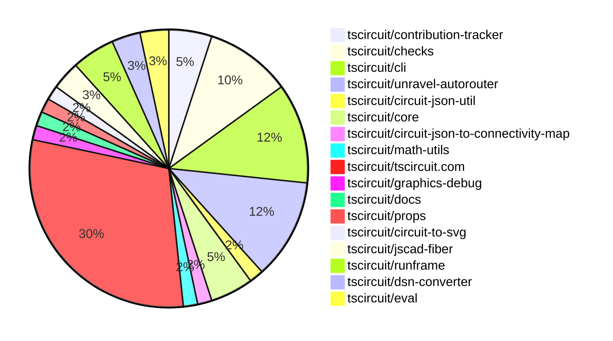

# contribution-tracker

Generates weekly contribution overviews for tscircuit contributors. Check out all
the [contribution overviews here](./contribution-overviews/)

* All PRs in the tscircuit org are scanned/summarized via Claude Haiku
* Claude classifies each Diff/PR as a Major, Minor or Tiny contribution
* All the PRs, summaries, and classifications are organized into charts and tables

The current week is shown below. There are 3 major sections:

* [Contributor Overview](#contributor-overview)
* [PRs by Repository](#prs-by-repository)
* [PRs by Contributor](#changes-by-contributor)

## Current Week

<!-- START_CURRENT_WEEK -->

# Contribution Overview 2025-03-26

## PRs by Repository

## Contributor Overview

| Contributor | 🐳 Major | 🐙 Minor | 🐌 Tiny | ⭐ | Issues Created | Discussion Contributions |
|-------------|---------|---------|---------|-----|----------------|--------------------------|
| [seveibar](#seveibar) | 8 | 19 | 4 | 👑👑 | 35 | 3🔹 3🔶 0💎 |
| [imrishabh18](#imrishabh18) | 3 | 10 | 1 | ⭐⭐⭐ | 6 | 0🔹 0🔶 0💎 |
| [Anshgrover23](#Anshgrover23) | 1 | 2 | 0 | ⭐⭐ | 3 | 2🔹 0🔶 0💎 |
| [ArnavK-09](#ArnavK-09) | 1 | 2 | 1 | ⭐⭐ | 2 | 1🔹 0🔶 0💎 |
| [MustafaMulla29](#MustafaMulla29) | 0 | 1 | 0 |  | 0 | 0🔹 0🔶 0💎 |
| [oldbear26](#oldbear26) | 0 | 1 | 0 |  | 0 | 0🔹 0🔶 0💎 |
| [Ayushjhawar8](#Ayushjhawar8) | 0 | 1 | 0 |  | 0 | 2🔹 0🔶 0💎 |
| [tscircuitbot](#tscircuitbot) | 0 | 0 | 2 |  | 0 | 0🔹 0🔶 0💎 |
| [dhvll](#dhvll) | 0 | 1 | 0 |  | 0 | 0🔹 0🔶 0💎 |
| [gurjeetsinghvirdee](#gurjeetsinghvirdee) | 0 | 0 | 0 | - | 0 | 0🔹 1🔶 0💎 |

### Discussion Contribution Legend

- 🔹 Participating: Basic participation with minimal effort
- 🔶 Very Active: Thoughtful participation that adds value
- 💎 Extremely Active: Exceptional participation with high-quality content

## Review Table

[reviews-received-hover]: ## "Number of reviews received for PRs for this contributor"
[approvals-received-hover]: ## "Number of approvals received for PRs this contributor authored"
[rejections-received-hover]: ## "Number of rejections received for PRs this contributor authored"
[prs-opened-hover]: ## "Number of PRs opened by this contributor"
[issues-created-hover]: ## "Number of issues created by this contributor"
[bountied-issues-hover]: ## "Number of issues this contributor created with a bounty"
[bountied-issue-$-hover]: ## "Total bounty amount placed on issues authored by this contributor"

| Contributor | Reviews Received | Approvals Received | Rejections Received | Approvals | Rejections | PRs Opened | PRs Merged | Issues Created | Bountied Issues | Bountied Issue $ |
|---|---|---|---|---|---|---|---|---|---|---|
| [seveibar](#seveibar) | 1 | 0 | 0 | 17 | 4 | 35 | 31 | 35 | 27 | 403 |
| [techmannih](#techmannih) | 5 | 0 | 2 | 0 | 0 | 2 | 0 | 2 | 1 | 3 |
| [Anshgrover23](#Anshgrover23) | 4 | 3 | 1 | 2 | 9 | 4 | 3 | 3 | 1 | 10 |
| [Ayushjhawar8](#Ayushjhawar8) | 5 | 0 | 1 | 0 | 0 | 2 | 1 | 0 | 0 | 0 |
| [onyedikachi-david](#onyedikachi-david) | 3 | 0 | 3 | 0 | 0 | 3 | 0 | 0 | 0 | 0 |
| [oldbear26](#oldbear26) | 1 | 1 | 0 | 0 | 0 | 2 | 2 | 0 | 0 | 0 |
| [ArnavK-09](#ArnavK-09) | 6 | 6 | 0 | 0 | 2 | 5 | 4 | 2 | 1 | 10 |
| [copilot-pull-request-reviewer[bot]](#copilot-pull-request-reviewer[bot]) | 0 | 0 | 0 | 0 | 0 | 0 | 0 | 0 | 0 | 0 |
| [imrishabh18](#imrishabh18) | 6 | 5 | 0 | 1 | 3 | 16 | 15 | 6 | 6 | 30 |
| [Rishikesh63](#Rishikesh63) | 0 | 0 | 0 | 0 | 0 | 1 | 0 | 0 | 0 | 0 |
| [MustafaMulla29](#MustafaMulla29) | 18 | 4 | 5 | 0 | 0 | 4 | 1 | 0 | 0 | 0 |
| [guptadeepak8](#guptadeepak8) | 3 | 0 | 3 | 0 | 0 | 2 | 0 | 0 | 0 | 0 |
| [tscircuitbot](#tscircuitbot) | 0 | 0 | 0 | 0 | 0 | 6 | 2 | 0 | 0 | 0 |
| [owuzo](#owuzo) | 1 | 0 | 1 | 0 | 0 | 1 | 0 | 0 | 0 | 0 |
| [jyoti-ranjan-jena](#jyoti-ranjan-jena) | 0 | 0 | 0 | 0 | 0 | 1 | 0 | 0 | 0 | 0 |
| [dhvll](#dhvll) | 3 | 1 | 1 | 0 | 0 | 1 | 1 | 0 | 0 | 0 |
| [deekshatomer](#deekshatomer) | 2 | 0 | 1 | 0 | 0 | 1 | 0 | 0 | 0 | 0 |
| [gurjeetsinghvirdee](#gurjeetsinghvirdee) | 0 | 0 | 0 | 0 | 0 | 0 | 0 | 0 | 0 | 0 |

## Changes by Repository

### [tscircuit/contribution-tracker](https://github.com/tscircuit/contribution-tracker)

| PR # | Impact | Contributor | Description | Milestone Aligned |
|------|--------|-------------|-------------|-------------------|
| [#107](https://github.com/tscircuit/contribution-tracker/pull/107) | 🐳 Major | seveibar | Updates the script to generate sponsorship CSV to be more idempotent and ensure the correct weeks are picked up. | ❌ |
| [#108](https://github.com/tscircuit/contribution-tracker/pull/108) | 🐳 Major | ArnavK-09 |  | ❌ |
| [#105](https://github.com/tscircuit/contribution-tracker/pull/105) | 🐙 Minor | ArnavK-09 | Downgrade the file-system-cache dependency to a stable version 2.3.0 | ✅ |

### [tscircuit/checks](https://github.com/tscircuit/checks)

| PR # | Impact | Contributor | Description | Milestone Aligned |
|------|--------|-------------|-------------|-------------------|
| [#21](https://github.com/tscircuit/checks/pull/21) | 🐳 Major | seveibar | The pull request incorporates layer information and improves the pcb_via test in the DRC (Design Rule Check) check. | ✅ |
| [#28](https://github.com/tscircuit/checks/pull/28) | 🐙 Minor | seveibar | Adds support for better centers when colliding with things that aren't segments | ✅ |
| [#26](https://github.com/tscircuit/checks/pull/26) | 🐙 Minor | seveibar | Fixes a bug in the DRC calculation for circular obstacles near 45 degree segments. | ✅ |
| [#25](https://github.com/tscircuit/checks/pull/25) | 🐙 Minor | seveibar | Use `pcb_trace_id` in objects (like vias) when determining if two IDs are connected. | ✅ |
| [#23](https://github.com/tscircuit/checks/pull/23) | 🐙 Minor | seveibar | Update circuit JSON utility and add a test to ensure correct handling of via margin. | ✅ |
| [#22](https://github.com/tscircuit/checks/pull/22) | 🐙 Minor | seveibar | Improves the overlapping trace message and error.center | ✅ |

### [tscircuit/cli](https://github.com/tscircuit/cli)

| PR # | Impact | Contributor | Description | Milestone Aligned |
|------|--------|-------------|-------------|-------------------|
| [#146](https://github.com/tscircuit/cli/pull/146) | 🐳 Major | seveibar | Fixes many issues with pushing snippets and adds a "setup" script to install the repository to the global `tsci`. | ✅ |
| [#143](https://github.com/tscircuit/cli/pull/143) | 🐳 Major | seveibar | Introduces a better detection mechanism for the entrypoint file in a tscircuit project, and adds the ability to save the detected entrypoint to the project configuration file. | ✅ |
| [#147](https://github.com/tscircuit/cli/pull/147) | 🐙 Minor | seveibar | Fix an issue where the CLI config was being reset whenever tests ran and tests were sharing the same config. | ✅ |
| [#145](https://github.com/tscircuit/cli/pull/145) | 🐙 Minor | seveibar | Set a default version of "0.0.1" for `tsci push` if no version is detected in the `package.json` file. | ✅ |
| [#135](https://github.com/tscircuit/cli/pull/135) | 🐙 Minor | ArnavK-09 |  | ✅ |
| [#124](https://github.com/tscircuit/cli/pull/124) | 🐙 Minor | dhvll | Adds a new `tsci add` command for importing tscircuit components. | ✅ |
| [#132](https://github.com/tscircuit/cli/pull/132) | 🐌 Tiny | ArnavK-09 | The onSuccess callback now destructures the outputDestination parameter for clarity and consistency with the codebase's style. | ✅ |

### [tscircuit/unravel-autorouter](https://github.com/tscircuit/unravel-autorouter)

| PR # | Impact | Contributor | Description | Milestone Aligned |
|------|--------|-------------|-------------|-------------------|
| [#88](https://github.com/tscircuit/unravel-autorouter/pull/88) | 🐳 Major | seveibar | Fix for vias sometimes being disconnected during path simplification | ✅ |
| [#85](https://github.com/tscircuit/unravel-autorouter/pull/85) | 🐳 Major | seveibar | Adds a welcome page that allows users to upload or paste a simple route JSON file to test the autorouter. | ❌ |
| [#81](https://github.com/tscircuit/unravel-autorouter/pull/81) | 🐳 Major | seveibar | Final DRC Fixes, Fixes for Segment Creation, Deduping Segments, and SegmentTree margin for path simplification, compute Pf for further nodes than necessary in the UnravelMultiSectionSolver(hack) | ✅ |
| [#80](https://github.com/tscircuit/unravel-autorouter/pull/80) | 🐳 Major | seveibar | This pull request adds a button for running DRC checks, fixes many DRC issues, and improves the simplified path solver to take into account trace thickness when computing margin. | ✅ |
| [#87](https://github.com/tscircuit/unravel-autorouter/pull/87) | 🐙 Minor | seveibar | Fix bad routing issue in simplification when tail is forced forward | ❌ |
| [#86](https://github.com/tscircuit/unravel-autorouter/pull/86) | 🐙 Minor | seveibar |  | ✅ |
| [#82](https://github.com/tscircuit/unravel-autorouter/pull/82) | 🐌 Tiny | imrishabh18 | The pull request adds a JSON file that defines a 3D model of the letter "S" made up of LED lights. | ✅ |

### [tscircuit/circuit-json-util](https://github.com/tscircuit/circuit-json-util)

| PR # | Impact | Contributor | Description | Milestone Aligned |
|------|--------|-------------|-------------|-------------------|
| [#30](https://github.com/tscircuit/circuit-json-util/pull/30) | 🐙 Minor | seveibar | Correctly compute the bounds for PCB elements with vias. | ✅ |

### [tscircuit/core](https://github.com/tscircuit/core)

| PR # | Impact | Contributor | Description | Milestone Aligned |
|------|--------|-------------|-------------|-------------------|
| [#722](https://github.com/tscircuit/core/pull/722) | 🐙 Minor | seveibar | Update the dependency for the Capacity Autorouter library to version 0.0.49 | ✅ |
| [#718](https://github.com/tscircuit/core/pull/718) | 🐙 Minor | seveibar | Update the version of the `@tscircuit/capacity-autorouter` dependency in the `package.json` file. | ✅ |
| [#721](https://github.com/tscircuit/core/pull/721) | 🐙 Minor | Anshgrover23 | Add a new "connection" prop to the diode component. | ✅ |

### [tscircuit/circuit-json-to-connectivity-map](https://github.com/tscircuit/circuit-json-to-connectivity-map)

| PR # | Impact | Contributor | Description | Milestone Aligned |
|------|--------|-------------|-------------|-------------------|
| [#9](https://github.com/tscircuit/circuit-json-to-connectivity-map/pull/9) | 🐙 Minor | seveibar | Adds support for PCB vias when computing full connectivity net | ✅ |

### [tscircuit/math-utils](https://github.com/tscircuit/math-utils)

| PR # | Impact | Contributor | Description | Milestone Aligned |
|------|--------|-------------|-------------|-------------------|
| [#7](https://github.com/tscircuit/math-utils/pull/7) | 🐙 Minor | seveibar | Implement a function to calculate the minimum distance from a line segment to a circle. | ❌ |

### [tscircuit/tscircuit.com](https://github.com/tscircuit/tscircuit.com)

| PR # | Impact | Contributor | Description | Milestone Aligned |
|------|--------|-------------|-------------|-------------------|
| [#778](https://github.com/tscircuit/tscircuit.com/pull/778) | 🐳 Major | imrishabh18 | Change the `/move_orders_forward` endpoint to update the status of all orders that are not finished. | ✅ |
| [#772](https://github.com/tscircuit/tscircuit.com/pull/772) | 🐙 Minor | seveibar | Reduce the cache control header for HTML files to prevent white pages and forced refreshes. | ❌ |
| [#770](https://github.com/tscircuit/tscircuit.com/pull/770) | 🐙 Minor | seveibar | Add opengraph images and fix image URLs | ✅ |
| [#769](https://github.com/tscircuit/tscircuit.com/pull/769) | 🐙 Minor | seveibar | Modify SEO tags in middleware to improve the website's search engine optimization. | ❌ |
| [#754](https://github.com/tscircuit/tscircuit.com/pull/754) | 🐙 Minor | seveibar |  | ❌ |
| [#777](https://github.com/tscircuit/tscircuit.com/pull/777) | 🐙 Minor | imrishabh18 | Add a new endpoint `/api/_fake/move_orders_forward` to update the order state by moving to the next step, and refactor the `/api/orders/get` endpoint to use the existing order state if it exists. | ✅ |
| [#775](https://github.com/tscircuit/tscircuit.com/pull/775) | 🐙 Minor | imrishabh18 | Add a tooltip to the snippet type icon to display the type label. | ✅ |
| [#763](https://github.com/tscircuit/tscircuit.com/pull/763) | 🐙 Minor | imrishabh18 | Update the build script to remove the `build:tsup` and `build:fake-api` scripts and add new `build:fake-api:tsup` and `build:fake-api:bundle` scripts. | ❌ |
| [#762](https://github.com/tscircuit/tscircuit.com/pull/762) | 🐙 Minor | imrishabh18 | Adds tests to verify the order state before the simulate error scenario | ✅ |
| [#761](https://github.com/tscircuit/tscircuit.com/pull/761) | 🐙 Minor | imrishabh18 | Modify logic for `/order/create` and support polling for `/order/get` | ✅ |
| [#760](https://github.com/tscircuit/tscircuit.com/pull/760) | 🐙 Minor | imrishabh18 | This pull request adds new schemas for JLCPCB-related data, including `JlcpcbOrderState` and `JlcpcbOrderStepRun`, to the database schema. | ❌ |
| [#758](https://github.com/tscircuit/tscircuit.com/pull/758) | 🐙 Minor | imrishabh18 | Update the `/order/create` route to handle simulated scenarios. | ❌ |
| [#765](https://github.com/tscircuit/tscircuit.com/pull/765) | 🐙 Minor | Ayushjhawar8 | Adds a page title and image tag to the editor and view-snippet pages. | ✅ |
| [#757](https://github.com/tscircuit/tscircuit.com/pull/757) | 🐙 Minor | MustafaMulla29 | Changed "Snippets" to "Packages" and used the correct "javascript-time-ago" package instead of "timeago.js". | ❌ |
| [#773](https://github.com/tscircuit/tscircuit.com/pull/773) | 🐌 Tiny | seveibar | Migrate from unpkg to jsdelivr for prettier dependency | ✅ |
| [#771](https://github.com/tscircuit/tscircuit.com/pull/771) | 🐌 Tiny | seveibar | Add a default opengraph image to the website | ✅ |
| [#766](https://github.com/tscircuit/tscircuit.com/pull/766) | 🐌 Tiny | seveibar | Removes a console log line in the `find-package-release-id.ts` file. | ✅ |
| [#759](https://github.com/tscircuit/tscircuit.com/pull/759) | 🟣 | imrishabh18 | Add all the scenarios to fake | ✅ |

### [tscircuit/graphics-debug](https://github.com/tscircuit/graphics-debug)

| PR # | Impact | Contributor | Description | Milestone Aligned |
|------|--------|-------------|-------------|-------------------|
| [#51](https://github.com/tscircuit/graphics-debug/pull/51) | 🐙 Minor | seveibar | Adds a "Show last step" checkbox to the InteractiveGraphics component. | ✅ |

### [tscircuit/docs](https://github.com/tscircuit/docs)

| PR # | Impact | Contributor | Description | Milestone Aligned |
|------|--------|-------------|-------------|-------------------|
| [#25](https://github.com/tscircuit/docs/pull/25) | 🐌 Tiny | seveibar | The pull request adds documentation for the Simple Route JSON (SRJ) format, which is a lightweight representation of a PCB routing problem used by the tscircuit autorouters. | ❌ |

### [tscircuit/props](https://github.com/tscircuit/props)

| PR # | Impact | Contributor | Description | Milestone Aligned |
|------|--------|-------------|-------------|-------------------|
| [#202](https://github.com/tscircuit/props/pull/202) | 🐳 Major | Anshgrover23 | Add a `connections` prop to the `diode` component to allow specifying connections for the anode, cathode, and other pins. | ✅ |

### [tscircuit/circuit-to-svg](https://github.com/tscircuit/circuit-to-svg)

| PR # | Impact | Contributor | Description | Milestone Aligned |
|------|--------|-------------|-------------|-------------------|
| [#196](https://github.com/tscircuit/circuit-to-svg/pull/196) | 🐙 Minor | Anshgrover23 | Add rounded line caps to silkscreen paths | ✅ |

### [tscircuit/jscad-fiber](https://github.com/tscircuit/jscad-fiber)

| PR # | Impact | Contributor | Description | Milestone Aligned |
|------|--------|-------------|-------------|-------------------|
| [#106](https://github.com/tscircuit/jscad-fiber/pull/106) | 🐙 Minor | oldbear26 | Add directory prefix to example wrapper URL when in GitHub Pages | ✅ |
| [#100](https://github.com/tscircuit/jscad-fiber/pull/100) | 🟣 | oldbear26 | The pull request changes the structure of the cosmos fixtures and the Vite plugin logic to address issues with the code previewer in production. | ❌ |

### [tscircuit/runframe](https://github.com/tscircuit/runframe)

| PR # | Impact | Contributor | Description | Milestone Aligned |
|------|--------|-------------|-------------|-------------------|
| [#401](https://github.com/tscircuit/runframe/pull/401) | 🐳 Major | imrishabh18 | Add a new UI component for the full order flow, including a shipping address form and order summary. | ❌ |
| [#395](https://github.com/tscircuit/runframe/pull/395) | 🐳 Major | imrishabh18 | The pull request introduces the initial implementation of the order flow feature, including creating orders, fetching order state, and displaying the order progress. | ✅ |
| [#398](https://github.com/tscircuit/runframe/pull/398) | 🐙 Minor | imrishabh18 | Removes the "simulate" option from the dialog box to fixture, and moves it to the `RunFrameForCli` component. | ✅ |

### [tscircuit/dsn-converter](https://github.com/tscircuit/dsn-converter)

| PR # | Impact | Contributor | Description | Milestone Aligned |
|------|--------|-------------|-------------|-------------------|
| [#107](https://github.com/tscircuit/dsn-converter/pull/107) | 🐙 Minor | imrishabh18 | Fix a radius to diameter conversion issue in the code. | ✅ |
| [#106](https://github.com/tscircuit/dsn-converter/pull/106) | 🐙 Minor | imrishabh18 | Fixes the padstack name for the 'smtpad' shape 'circle' in the 'process-components-and-pads.ts' file. | ✅ |

### [tscircuit/eval](https://github.com/tscircuit/eval)

| PR # | Impact | Contributor | Description | Milestone Aligned |
|------|--------|-------------|-------------|-------------------|
| [#181](https://github.com/tscircuit/eval/pull/181) | 🐌 Tiny | tscircuitbot | Update the "@tscircuit/core" dependency to version 0.0.361. | ✅ |
| [#174](https://github.com/tscircuit/eval/pull/174) | 🐌 Tiny | tscircuitbot | Update @tscircuit/core dependency to version 0.0.359 | ✅ |

## Changes by Contributor

### [seveibar](https://github.com/seveibar)

| PR # | Impact | Description | Milestone Aligned |
|------|--------|-------------|-------------------|
| [#107](https://github.com/tscircuit/contribution-tracker/pull/107) | 🐳 Major | Updates the script to generate sponsorship CSV to be more idempotent and ensure the correct weeks are picked up. | ❌ |
| [#21](https://github.com/tscircuit/checks/pull/21) | 🐳 Major | The pull request incorporates layer information and improves the pcb_via test in the DRC (Design Rule Check) check. | ✅ |
| [#146](https://github.com/tscircuit/cli/pull/146) | 🐳 Major | Fixes many issues with pushing snippets and adds a "setup" script to install the repository to the global `tsci`. | ✅ |
| [#143](https://github.com/tscircuit/cli/pull/143) | 🐳 Major | Introduces a better detection mechanism for the entrypoint file in a tscircuit project, and adds the ability to save the detected entrypoint to the project configuration file. | ✅ |
| [#88](https://github.com/tscircuit/unravel-autorouter/pull/88) | 🐳 Major | Fix for vias sometimes being disconnected during path simplification | ✅ |
| [#85](https://github.com/tscircuit/unravel-autorouter/pull/85) | 🐳 Major | Adds a welcome page that allows users to upload or paste a simple route JSON file to test the autorouter. | ❌ |
| [#81](https://github.com/tscircuit/unravel-autorouter/pull/81) | 🐳 Major | Final DRC Fixes, Fixes for Segment Creation, Deduping Segments, and SegmentTree margin for path simplification, compute Pf for further nodes than necessary in the UnravelMultiSectionSolver(hack) | ✅ |
| [#80](https://github.com/tscircuit/unravel-autorouter/pull/80) | 🐳 Major | This pull request adds a button for running DRC checks, fixes many DRC issues, and improves the simplified path solver to take into account trace thickness when computing margin. | ✅ |
| [#30](https://github.com/tscircuit/circuit-json-util/pull/30) | 🐙 Minor | Correctly compute the bounds for PCB elements with vias. | ✅ |
| [#722](https://github.com/tscircuit/core/pull/722) | 🐙 Minor | Update the dependency for the Capacity Autorouter library to version 0.0.49 | ✅ |
| [#718](https://github.com/tscircuit/core/pull/718) | 🐙 Minor | Update the version of the `@tscircuit/capacity-autorouter` dependency in the `package.json` file. | ✅ |
| [#28](https://github.com/tscircuit/checks/pull/28) | 🐙 Minor | Adds support for better centers when colliding with things that aren't segments | ✅ |
| [#26](https://github.com/tscircuit/checks/pull/26) | 🐙 Minor | Fixes a bug in the DRC calculation for circular obstacles near 45 degree segments. | ✅ |
| [#25](https://github.com/tscircuit/checks/pull/25) | 🐙 Minor | Use `pcb_trace_id` in objects (like vias) when determining if two IDs are connected. | ✅ |
| [#23](https://github.com/tscircuit/checks/pull/23) | 🐙 Minor | Update circuit JSON utility and add a test to ensure correct handling of via margin. | ✅ |
| [#22](https://github.com/tscircuit/checks/pull/22) | 🐙 Minor | Improves the overlapping trace message and error.center | ✅ |
| [#9](https://github.com/tscircuit/circuit-json-to-connectivity-map/pull/9) | 🐙 Minor | Adds support for PCB vias when computing full connectivity net | ✅ |
| [#7](https://github.com/tscircuit/math-utils/pull/7) | 🐙 Minor | Implement a function to calculate the minimum distance from a line segment to a circle. | ❌ |
| [#772](https://github.com/tscircuit/tscircuit.com/pull/772) | 🐙 Minor | Reduce the cache control header for HTML files to prevent white pages and forced refreshes. | ❌ |
| [#770](https://github.com/tscircuit/tscircuit.com/pull/770) | 🐙 Minor | Add opengraph images and fix image URLs | ✅ |
| [#769](https://github.com/tscircuit/tscircuit.com/pull/769) | 🐙 Minor | Modify SEO tags in middleware to improve the website's search engine optimization. | ❌ |
| [#754](https://github.com/tscircuit/tscircuit.com/pull/754) | 🐙 Minor |  | ❌ |
| [#51](https://github.com/tscircuit/graphics-debug/pull/51) | 🐙 Minor | Adds a "Show last step" checkbox to the InteractiveGraphics component. | ✅ |
| [#147](https://github.com/tscircuit/cli/pull/147) | 🐙 Minor | Fix an issue where the CLI config was being reset whenever tests ran and tests were sharing the same config. | ✅ |
| [#145](https://github.com/tscircuit/cli/pull/145) | 🐙 Minor | Set a default version of "0.0.1" for `tsci push` if no version is detected in the `package.json` file. | ✅ |
| [#87](https://github.com/tscircuit/unravel-autorouter/pull/87) | 🐙 Minor | Fix bad routing issue in simplification when tail is forced forward | ❌ |
| [#86](https://github.com/tscircuit/unravel-autorouter/pull/86) | 🐙 Minor |  | ✅ |
| [#773](https://github.com/tscircuit/tscircuit.com/pull/773) | 🐌 Tiny | Migrate from unpkg to jsdelivr for prettier dependency | ✅ |
| [#771](https://github.com/tscircuit/tscircuit.com/pull/771) | 🐌 Tiny | Add a default opengraph image to the website | ✅ |
| [#766](https://github.com/tscircuit/tscircuit.com/pull/766) | 🐌 Tiny | Removes a console log line in the `find-package-release-id.ts` file. | ✅ |
| [#25](https://github.com/tscircuit/docs/pull/25) | 🐌 Tiny | The pull request adds documentation for the Simple Route JSON (SRJ) format, which is a lightweight representation of a PCB routing problem used by the tscircuit autorouters. | ❌ |

### [Anshgrover23](https://github.com/Anshgrover23)

| PR # | Impact | Description | Milestone Aligned |
|------|--------|-------------|-------------------|
| [#202](https://github.com/tscircuit/props/pull/202) | 🐳 Major | Add a `connections` prop to the `diode` component to allow specifying connections for the anode, cathode, and other pins. | ✅ |
| [#721](https://github.com/tscircuit/core/pull/721) | 🐙 Minor | Add a new "connection" prop to the diode component. | ✅ |
| [#196](https://github.com/tscircuit/circuit-to-svg/pull/196) | 🐙 Minor | Add rounded line caps to silkscreen paths | ✅ |

### [oldbear26](https://github.com/oldbear26)

| PR # | Impact | Description | Milestone Aligned |
|------|--------|-------------|-------------------|
| [#106](https://github.com/tscircuit/jscad-fiber/pull/106) | 🐙 Minor | Add directory prefix to example wrapper URL when in GitHub Pages | ✅ |
| [#100](https://github.com/tscircuit/jscad-fiber/pull/100) | 🟣 | The pull request changes the structure of the cosmos fixtures and the Vite plugin logic to address issues with the code previewer in production. | ❌ |

### [ArnavK-09](https://github.com/ArnavK-09)

| PR # | Impact | Description | Milestone Aligned |
|------|--------|-------------|-------------------|
| [#108](https://github.com/tscircuit/contribution-tracker/pull/108) | 🐳 Major |  | ❌ |
| [#105](https://github.com/tscircuit/contribution-tracker/pull/105) | 🐙 Minor | Downgrade the file-system-cache dependency to a stable version 2.3.0 | ✅ |
| [#135](https://github.com/tscircuit/cli/pull/135) | 🐙 Minor |  | ✅ |
| [#132](https://github.com/tscircuit/cli/pull/132) | 🐌 Tiny | The onSuccess callback now destructures the outputDestination parameter for clarity and consistency with the codebase's style. | ✅ |

### [imrishabh18](https://github.com/imrishabh18)

| PR # | Impact | Description | Milestone Aligned |
|------|--------|-------------|-------------------|
| [#778](https://github.com/tscircuit/tscircuit.com/pull/778) | 🐳 Major | Change the `/move_orders_forward` endpoint to update the status of all orders that are not finished. | ✅ |
| [#401](https://github.com/tscircuit/runframe/pull/401) | 🐳 Major | Add a new UI component for the full order flow, including a shipping address form and order summary. | ❌ |
| [#395](https://github.com/tscircuit/runframe/pull/395) | 🐳 Major | The pull request introduces the initial implementation of the order flow feature, including creating orders, fetching order state, and displaying the order progress. | ✅ |
| [#107](https://github.com/tscircuit/dsn-converter/pull/107) | 🐙 Minor | Fix a radius to diameter conversion issue in the code. | ✅ |
| [#106](https://github.com/tscircuit/dsn-converter/pull/106) | 🐙 Minor | Fixes the padstack name for the 'smtpad' shape 'circle' in the 'process-components-and-pads.ts' file. | ✅ |
| [#777](https://github.com/tscircuit/tscircuit.com/pull/777) | 🐙 Minor | Add a new endpoint `/api/_fake/move_orders_forward` to update the order state by moving to the next step, and refactor the `/api/orders/get` endpoint to use the existing order state if it exists. | ✅ |
| [#775](https://github.com/tscircuit/tscircuit.com/pull/775) | 🐙 Minor | Add a tooltip to the snippet type icon to display the type label. | ✅ |
| [#763](https://github.com/tscircuit/tscircuit.com/pull/763) | 🐙 Minor | Update the build script to remove the `build:tsup` and `build:fake-api` scripts and add new `build:fake-api:tsup` and `build:fake-api:bundle` scripts. | ❌ |
| [#762](https://github.com/tscircuit/tscircuit.com/pull/762) | 🐙 Minor | Adds tests to verify the order state before the simulate error scenario | ✅ |
| [#761](https://github.com/tscircuit/tscircuit.com/pull/761) | 🐙 Minor | Modify logic for `/order/create` and support polling for `/order/get` | ✅ |
| [#760](https://github.com/tscircuit/tscircuit.com/pull/760) | 🐙 Minor | This pull request adds new schemas for JLCPCB-related data, including `JlcpcbOrderState` and `JlcpcbOrderStepRun`, to the database schema. | ❌ |
| [#759](https://github.com/tscircuit/tscircuit.com/pull/759) | 🟣 | Add all the scenarios to fake | ✅ |
| [#758](https://github.com/tscircuit/tscircuit.com/pull/758) | 🐙 Minor | Update the `/order/create` route to handle simulated scenarios. | ❌ |
| [#398](https://github.com/tscircuit/runframe/pull/398) | 🐙 Minor | Removes the "simulate" option from the dialog box to fixture, and moves it to the `RunFrameForCli` component. | ✅ |
| [#82](https://github.com/tscircuit/unravel-autorouter/pull/82) | 🐌 Tiny | The pull request adds a JSON file that defines a 3D model of the letter "S" made up of LED lights. | ✅ |

### [Ayushjhawar8](https://github.com/Ayushjhawar8)

| PR # | Impact | Description | Milestone Aligned |
|------|--------|-------------|-------------------|
| [#765](https://github.com/tscircuit/tscircuit.com/pull/765) | 🐙 Minor | Adds a page title and image tag to the editor and view-snippet pages. | ✅ |

### [MustafaMulla29](https://github.com/MustafaMulla29)

| PR # | Impact | Description | Milestone Aligned |
|------|--------|-------------|-------------------|
| [#757](https://github.com/tscircuit/tscircuit.com/pull/757) | 🐙 Minor | Changed "Snippets" to "Packages" and used the correct "javascript-time-ago" package instead of "timeago.js". | ❌ |

### [tscircuitbot](https://github.com/tscircuitbot)

| PR # | Impact | Description | Milestone Aligned |
|------|--------|-------------|-------------------|
| [#181](https://github.com/tscircuit/eval/pull/181) | 🐌 Tiny | Update the "@tscircuit/core" dependency to version 0.0.361. | ✅ |
| [#174](https://github.com/tscircuit/eval/pull/174) | 🐌 Tiny | Update @tscircuit/core dependency to version 0.0.359 | ✅ |

### [dhvll](https://github.com/dhvll)

| PR # | Impact | Description | Milestone Aligned |
|------|--------|-------------|-------------------|
| [#124](https://github.com/tscircuit/cli/pull/124) | 🐙 Minor | Adds a new `tsci add` command for importing tscircuit components. | ✅ |

<!-- END_CURRENT_WEEK -->
