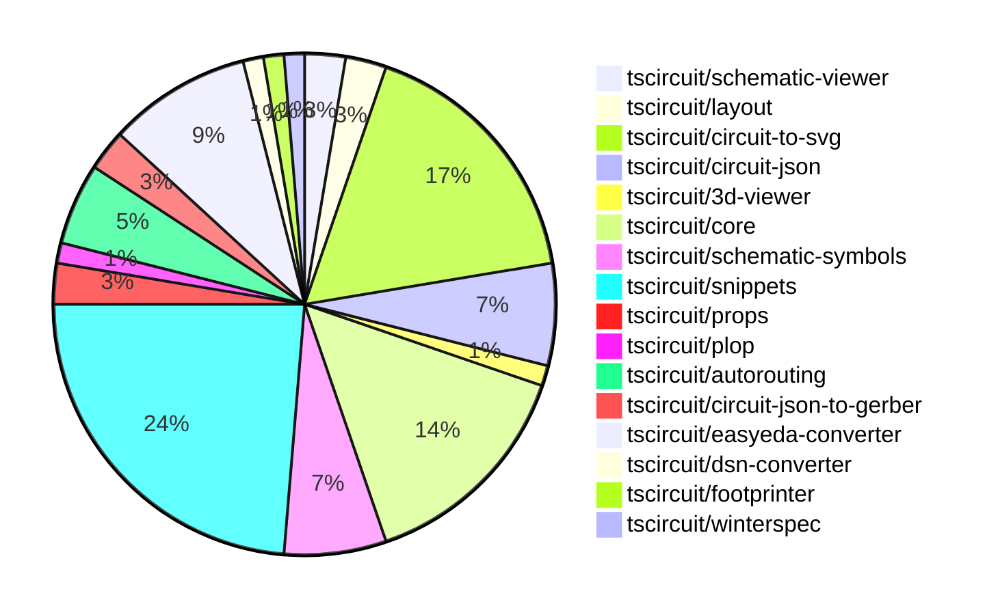

# contribution-tracker

Generates weekly contribution overviews for tscircuit contributors. Check out all
the [contribution overviews here](./contribution-overviews/)

* All PRs in the tscircuit org are scanned/summarized via Claude Haiku
* Claude classifies each Diff/PR as a Major, Minor or Tiny contribution
* All the PRs, summaries, and classifications are organized into charts and tables

The current week is shown below. There are 3 major sections:

* [Contributor Overview](#contributor-overview)
* [PRs by Repository](#prs-by-repository)
* [PRs by Contributor](#changes-by-contributor)

## Current Week

<!-- START_CURRENT_WEEK -->

# Contribution Overview 2024-10-23

## PRs by Repository

## Contributor Overview

| Contributor | 🐳 Major | 🐙 Minor | 🐌 Tiny | ⭐ |
|-------------|-------|-------|-------|-------|
| [seveibar](#seveibar) | 16 | 17 | 0 | 👑👑 |
| [imrishabh18](#imrishabh18) | 3 | 17 | 1 | ⭐⭐⭐ |
| [andrii-balitskyi](#andrii-balitskyi) | 0 | 7 | 0 | ⭐⭐ |
| [Abse2001](#Abse2001) | 2 | 2 | 0 | ⭐⭐ |
| [ni9999](#ni9999) | 1 | 2 | 0 | ⭐ |
| [aman1376](#aman1376) | 1 | 1 | 0 | ⭐ |
| [ShiboSoftwareDev](#ShiboSoftwareDev) | 1 | 0 | 0 | ⭐ |
| [mrudulpatil18](#mrudulpatil18) | 0 | 2 | 0 | ⭐ |
| [TSP06](#TSP06) | 0 | 1 | 0 |  |
| [SufyaanKhateeb](#SufyaanKhateeb) | 0 | 1 | 0 |  |

## Changes by Repository

### [tscircuit/schematic-viewer](https://github.com/tscircuit/schematic-viewer)

| PR # | Impact | Contributor | Description |
|------|--------|-------------|-------------|
| [#68](https://github.com/tscircuit/schematic-viewer/pull/68) | 🐳 Major | imrishabh18 | Ports the schematic design to match the KiCAD design. |
| [#67](https://github.com/tscircuit/schematic-viewer/pull/67) | 🐙 Minor | imrishabh18 | The pull request fixes the port position and format using the Biome tool. |

### [tscircuit/layout](https://github.com/tscircuit/layout)

| PR # | Impact | Contributor | Description |
|------|--------|-------------|-------------|
| [#3](https://github.com/tscircuit/layout/pull/3) | 🐳 Major | imrishabh18 | Refactor the code to use `circuit-json` instead of `@tscircuit/soup` |
| [#4](https://github.com/tscircuit/layout/pull/4) | 🐙 Minor | imrishabh18 | Fix types in the `manual-layout-pcb.ts` file. |

### [tscircuit/circuit-to-svg](https://github.com/tscircuit/circuit-to-svg)

| PR # | Impact | Contributor | Description |
|------|--------|-------------|-------------|
| [#96](https://github.com/tscircuit/circuit-to-svg/pull/96) | 🐳 Major | imrishabh18 | Refactors the code to use the `transform` function from the `transformation-matrix` library instead of the `viewbox` property, which provides more flexibility in rendering the schematic. |
| [#95](https://github.com/tscircuit/circuit-to-svg/pull/95) | 🐳 Major | seveibar | Refactors the schematic drawing to remove the usage of `viewport` and `flipY`, and relies on the `transform` matrix for computing all positions. |
| [#92](https://github.com/tscircuit/circuit-to-svg/pull/92) | 🐳 Major | seveibar | Adds the ability to draw schematic debug objects (rectangles and lines) in the schematic SVG. |
| [#101](https://github.com/tscircuit/circuit-to-svg/pull/101) | 🐙 Minor | imrishabh18 | Hides the ports on the center of the schematic component |
| [#100](https://github.com/tscircuit/circuit-to-svg/pull/100) | 🐙 Minor | imrishabh18 | Fixing a bug with port position by removing the negative Y direction scaling |
| [#90](https://github.com/tscircuit/circuit-to-svg/pull/90) | 🐙 Minor | imrishabh18 | Reverts a change that broke the position of pins |
| [#99](https://github.com/tscircuit/circuit-to-svg/pull/99) | 🐙 Minor | seveibar | Fixes a schematic trace issue by adjusting the x-coordinates of the trace points. |
| [#98](https://github.com/tscircuit/circuit-to-svg/pull/98) | 🐙 Minor | seveibar | Fixes a bug in the `create-svg-objects-from-sch-debug-object.ts` file, which is responsible for creating SVG objects from a debug object. |
| [#97](https://github.com/tscircuit/circuit-to-svg/pull/97) | 🐙 Minor | seveibar | Fixes issues with undefined `pinNumber` and finding the pin number for schematic ports. |
| [#94](https://github.com/tscircuit/circuit-to-svg/pull/94) | 🐙 Minor | seveibar | Introduces a new feature to add labeled grid to the schematic SVG. |
| [#93](https://github.com/tscircuit/circuit-to-svg/pull/93) | 🐙 Minor | seveibar | Adds support for drawing a grid and labeled points to the schematic SVG conversion |
| [#89](https://github.com/tscircuit/circuit-to-svg/pull/89) | 🐙 Minor | Abse2001 | Updated the version of the `schematic-symbols` dependency from `0.0.79` to `0.0.90`. |
| [#102](https://github.com/tscircuit/circuit-to-svg/pull/102) | 🐙 Minor | ni9999 | Updates the documentation in the readme.md file to reflect changes in the API and usage. |

### [tscircuit/circuit-json](https://github.com/tscircuit/circuit-json)

| PR # | Impact | Contributor | Description |
|------|--------|-------------|-------------|
| [#62](https://github.com/tscircuit/circuit-json/pull/62) | 🐳 Major | seveibar | Adds a new script to generate a documentation file for schematic component types. |
| [#65](https://github.com/tscircuit/circuit-json/pull/65) | 🐙 Minor | imrishabh18 | Added a new color property to the SchematicTextInput type. |
| [#64](https://github.com/tscircuit/circuit-json/pull/64) | 🐙 Minor | seveibar | Add useful meta information, true index, side of component etc. to schematic_port |
| [#61](https://github.com/tscircuit/circuit-json/pull/61) | 🐙 Minor | seveibar | Introduce a new `schematic_debug_object` type and associated types for representing debug information in schematics. |
| [#60](https://github.com/tscircuit/circuit-json/pull/60) | 🐙 Minor | Abse2001 | Added export for `source_simple_inductor` component |

### [tscircuit/3d-viewer](https://github.com/tscircuit/3d-viewer)

| PR # | Impact | Contributor | Description |
|------|--------|-------------|-------------|
| [#29](https://github.com/tscircuit/3d-viewer/pull/29) | 🐙 Minor | imrishabh18 | Updated the dependency "@tscircuit/core" from version 0.0.97 to 0.0.136 |

### [tscircuit/core](https://github.com/tscircuit/core)

| PR # | Impact | Contributor | Description |
|------|--------|-------------|-------------|
| [#212](https://github.com/tscircuit/core/pull/212) | 🐳 Major | seveibar | Improve the `createUseComponent` function by enhancing the types for the `useComponent` function and allowing the `pins` parameter to accept different formats. |
| [#210](https://github.com/tscircuit/core/pull/210) | 🐳 Major | seveibar | Introduces asynchronous autorouting support with the ability to specify an autorouting server URL. |
| [#209](https://github.com/tscircuit/core/pull/209) | 🐳 Major | seveibar | Implements a "dirty render phase" mechanism to improve rendering performance in the `Circuit` class, and introduces a new `renderUntilSettled` method to wait for all asynchronous effects to complete. |
| [#198](https://github.com/tscircuit/core/pull/198) | 🐳 Major | seveibar | Adds support for pill-shaped plated holes and provides more AI context for the `tscircuit` React props. |
| [#194](https://github.com/tscircuit/core/pull/194) | 🐳 Major | seveibar | Adds support for rendering schematic debug objects, switches to a better autorouter, and updates the circuit-to-svg dependency. |
| [#196](https://github.com/tscircuit/core/pull/196) | 🐳 Major | Abse2001 | Implemented the `<Inductor/>` component |
| [#211](https://github.com/tscircuit/core/pull/211) | 🐙 Minor | imrishabh18 | Fix the issue of getting the ports from the footprint when the schPortArrangement is not defined. |
| [#206](https://github.com/tscircuit/core/pull/206) | 🐙 Minor | imrishabh18 | Adding the missing trace space between the ports and route |
| [#201](https://github.com/tscircuit/core/pull/201) | 🐙 Minor | imrishabh18 | Fixes an issue where the `getPortPositionByPinNumber` function was returning incorrect values for non-existent pins. |
| [#200](https://github.com/tscircuit/core/pull/200) | 🐙 Minor | imrishabh18 | Added ports as obstacles and enabled routing to work. |
| [#199](https://github.com/tscircuit/core/pull/199) | 🐙 Minor | imrishabh18 | Fixes an issue where the port position was not being properly adjusted on the edge of the chip. |

### [tscircuit/schematic-symbols](https://github.com/tscircuit/schematic-symbols)

| PR # | Impact | Contributor | Description |
|------|--------|-------------|-------------|
| [#185](https://github.com/tscircuit/schematic-symbols/pull/185) | 🐳 Major | Abse2001 | Implemented SVG Arc support and added inductor symbol |
| [#187](https://github.com/tscircuit/schematic-symbols/pull/187) | 🐳 Major | aman1376 | Adds a new illuminated push button symbol with normally open configuration. |
| [#184](https://github.com/tscircuit/schematic-symbols/pull/184) | 🐙 Minor | imrishabh18 | Updates the lockfile, fixing issues with npm publish |
| [#182](https://github.com/tscircuit/schematic-symbols/pull/182) | 🐙 Minor | TSP06 | Added a new ground symbol to the project. |
| [#183](https://github.com/tscircuit/schematic-symbols/pull/183) | 🐌 Tiny | imrishabh18 | Update .gitignore to ignore `.diff.png` files |

### [tscircuit/snippets](https://github.com/tscircuit/snippets)

| PR # | Impact | Contributor | Description |
|------|--------|-------------|-------------|
| [#125](https://github.com/tscircuit/snippets/pull/125) | 🐳 Major | ni9999 | Implemented a "Fork" button on the ViewSnippetHeader component that allows users to create a forked version of the current snippet. |
| [#143](https://github.com/tscircuit/snippets/pull/143) | 🐙 Minor | imrishabh18 | Updates the position of the circuit on movement in manual-edits |
| [#141](https://github.com/tscircuit/snippets/pull/141) | 🐙 Minor | imrishabh18 | Fix a bug related to updating the code editor when the current file changes |
| [#134](https://github.com/tscircuit/snippets/pull/134) | 🐙 Minor | imrishabh18 | Adds a new file "manual-edits.json" to the dropdown menu in the CodeEditor component. |
| [#131](https://github.com/tscircuit/snippets/pull/131) | 🐙 Minor | imrishabh18 | Integrates a schematic viewer into the application. |
| [#155](https://github.com/tscircuit/snippets/pull/155) | 🐙 Minor | seveibar | Disable automatic closing bracket insertion in the CodeEditor component |
| [#154](https://github.com/tscircuit/snippets/pull/154) | 🐙 Minor | seveibar | Fix a bug where clicking "go to definition" removed dashes from the import name. |
| [#150](https://github.com/tscircuit/snippets/pull/150) | 🐙 Minor | seveibar | Move Toast to Bottom Right, Fix Sticky Preview, Improve Dropdown Color for CodeEditor files, Add FS Map from CDN to fix some type issues |
| [#149](https://github.com/tscircuit/snippets/pull/149) | 🐙 Minor | seveibar | Fix createUseComponent types, Improve toast position, sticky preview, improve code editor header filename select box color |
| [#147](https://github.com/tscircuit/snippets/pull/147) | 🐙 Minor | seveibar | Update easyeda to fix esp32 import, smaller file header, Schematic Viewer Height Improvement, Sticky Preview |
| [#138](https://github.com/tscircuit/snippets/pull/138) | 🐙 Minor | seveibar | Reverts the code reload check and adds a test to ensure the snippet loads correctly on the editor page. |
| [#126](https://github.com/tscircuit/snippets/pull/126) | 🐙 Minor | seveibar | Updates dependencies for the Pill Holes project. |
| [#122](https://github.com/tscircuit/snippets/pull/122) | 🐙 Minor | seveibar |  |
| [#124](https://github.com/tscircuit/snippets/pull/124) | 🐙 Minor | andrii-balitskyi | Fix the width of the SearchableSelect options to match the width of the trigger button. |
| [#127](https://github.com/tscircuit/snippets/pull/127) | 🐙 Minor | ni9999 | Add a "Download Schematic SVG" option to the download dropdown menu. |
| [#121](https://github.com/tscircuit/snippets/pull/121) | 🐙 Minor | mrudulpatil18 | Fixes the search filtering issue in the Command palette by rewriting the logic and using Fuzzy search to improve the search results. |
| [#137](https://github.com/tscircuit/snippets/pull/137) | 🐙 Minor | mrudulpatil18 | Adds the snippet type to the URL for the copy URL functionality. |
| [#144](https://github.com/tscircuit/snippets/pull/144) | 🐙 Minor | SufyaanKhateeb | Fix the profile page header to say "My Profile" when the current user is viewing their profile and fix the "My Profile" link in the footer to show up only when logged in. |

### [tscircuit/props](https://github.com/tscircuit/props)

| PR # | Impact | Contributor | Description |
|------|--------|-------------|-------------|
| [#67](https://github.com/tscircuit/props/pull/67) | 🐳 Major | seveibar | This pull request adds a comprehensive overview of all the prop types available in the `@tscircuit/props` package, including detailed type definitions and examples of how to use the corresponding Zod validators. |
| [#66](https://github.com/tscircuit/props/pull/66) | 🐙 Minor | seveibar | Adds support for "pill" shaped plated holes in the PCB component specification. |

### [tscircuit/plop](https://github.com/tscircuit/plop)

| PR # | Impact | Contributor | Description |
|------|--------|-------------|-------------|
| [#5](https://github.com/tscircuit/plop/pull/5) | 🐳 Major | seveibar | Checks for the latest version of the package, adds support for remote files to better support AI context summarization, and updates the release workflow to use Bun instead of npm. |

### [tscircuit/autorouting](https://github.com/tscircuit/autorouting)

| PR # | Impact | Contributor | Description |
|------|--------|-------------|-------------|
| [#89](https://github.com/tscircuit/autorouting/pull/89) | 🐳 Major | seveibar |  |
| [#88](https://github.com/tscircuit/autorouting/pull/88) | 🐳 Major | seveibar | Remove path loop fix to simplify output routes |
| [#85](https://github.com/tscircuit/autorouting/pull/85) | 🐳 Major | seveibar | Switches the deployed application to use NextJS instead of the previous setup. |
| [#84](https://github.com/tscircuit/autorouting/pull/84) | 🐳 Major | seveibar | Adds support for pasting SimpleRouteJson on the homepage to convert it to the internal soup format. |

### [tscircuit/circuit-json-to-gerber](https://github.com/tscircuit/circuit-json-to-gerber)

| PR # | Impact | Contributor | Description |
|------|--------|-------------|-------------|
| [#26](https://github.com/tscircuit/circuit-json-to-gerber/pull/26) | 🐳 Major | seveibar |  |
| [#25](https://github.com/tscircuit/circuit-json-to-gerber/pull/25) | 🐳 Major | seveibar | Adds a new specification for PCB components and related elements. |

### [tscircuit/easyeda-converter](https://github.com/tscircuit/easyeda-converter)

| PR # | Impact | Contributor | Description |
|------|--------|-------------|-------------|
| [#89](https://github.com/tscircuit/easyeda-converter/pull/89) | 🐙 Minor | seveibar | Normalize pin labels to preserve the original pin numbers |
| [#94](https://github.com/tscircuit/easyeda-converter/pull/94) | 🐙 Minor | andrii-balitskyi | Correctly parse right-facing (end) pins from raw EasyEDA JSON |
| [#93](https://github.com/tscircuit/easyeda-converter/pull/93) | 🐙 Minor | andrii-balitskyi | Sort pin labels in ascending order |
| [#91](https://github.com/tscircuit/easyeda-converter/pull/91) | 🐙 Minor | andrii-balitskyi | Include duplicate pin name in pin label array, remove pinNames from component template |
| [#85](https://github.com/tscircuit/easyeda-converter/pull/85) | 🐙 Minor | andrii-balitskyi | Converts string pin numbers to type number when converting to TSX |
| [#83](https://github.com/tscircuit/easyeda-converter/pull/83) | 🐙 Minor | andrii-balitskyi | Converts oval pads with hole radius to pill-shaped plated holes in the EasyEDA to TSCircuit JSON converter. |
| [#84](https://github.com/tscircuit/easyeda-converter/pull/84) | 🐙 Minor | andrii-balitskyi | Fixes the calculation of stroke width for tracks and arcs in the EasyEDA to TSCircuit converter. |

### [tscircuit/dsn-converter](https://github.com/tscircuit/dsn-converter)

| PR # | Impact | Contributor | Description |
|------|--------|-------------|-------------|
| [#8](https://github.com/tscircuit/dsn-converter/pull/8) | 🟣 | seveibar | Major refactor to improve code separation, add tests, build, release, stringification, and usage examples in the README. |

### [tscircuit/footprinter](https://github.com/tscircuit/footprinter)

| PR # | Impact | Contributor | Description |
|------|--------|-------------|-------------|
| [#72](https://github.com/tscircuit/footprinter/pull/72) | 🐙 Minor | aman1376 | Adds a new circuit element "lqfp" to the library. |

### [tscircuit/winterspec](https://github.com/tscircuit/winterspec)

| PR # | Impact | Contributor | Description |
|------|--------|-------------|-------------|
| [#20](https://github.com/tscircuit/winterspec/pull/20) | 🐳 Major | ShiboSoftwareDev | Adds support for Windows, fixes Linux/Mac issues, and updates the CODEOWNERS file. |

## Changes by Contributor

### [imrishabh18](https://github.com/imrishabh18)

| PR # | Impact | Description |
|------|--------|-------------|
| [#68](https://github.com/tscircuit/schematic-viewer/pull/68) | 🐳 Major | Ports the schematic design to match the KiCAD design. |
| [#3](https://github.com/tscircuit/layout/pull/3) | 🐳 Major | Refactor the code to use `circuit-json` instead of `@tscircuit/soup` |
| [#96](https://github.com/tscircuit/circuit-to-svg/pull/96) | 🐳 Major | Refactors the code to use the `transform` function from the `transformation-matrix` library instead of the `viewbox` property, which provides more flexibility in rendering the schematic. |
| [#67](https://github.com/tscircuit/schematic-viewer/pull/67) | 🐙 Minor | The pull request fixes the port position and format using the Biome tool. |
| [#65](https://github.com/tscircuit/circuit-json/pull/65) | 🐙 Minor | Added a new color property to the SchematicTextInput type. |
| [#4](https://github.com/tscircuit/layout/pull/4) | 🐙 Minor | Fix types in the `manual-layout-pcb.ts` file. |
| [#29](https://github.com/tscircuit/3d-viewer/pull/29) | 🐙 Minor | Updated the dependency "@tscircuit/core" from version 0.0.97 to 0.0.136 |
| [#211](https://github.com/tscircuit/core/pull/211) | 🐙 Minor | Fix the issue of getting the ports from the footprint when the schPortArrangement is not defined. |
| [#206](https://github.com/tscircuit/core/pull/206) | 🐙 Minor | Adding the missing trace space between the ports and route |
| [#201](https://github.com/tscircuit/core/pull/201) | 🐙 Minor | Fixes an issue where the `getPortPositionByPinNumber` function was returning incorrect values for non-existent pins. |
| [#200](https://github.com/tscircuit/core/pull/200) | 🐙 Minor | Added ports as obstacles and enabled routing to work. |
| [#199](https://github.com/tscircuit/core/pull/199) | 🐙 Minor | Fixes an issue where the port position was not being properly adjusted on the edge of the chip. |
| [#101](https://github.com/tscircuit/circuit-to-svg/pull/101) | 🐙 Minor | Hides the ports on the center of the schematic component |
| [#100](https://github.com/tscircuit/circuit-to-svg/pull/100) | 🐙 Minor | Fixing a bug with port position by removing the negative Y direction scaling |
| [#90](https://github.com/tscircuit/circuit-to-svg/pull/90) | 🐙 Minor | Reverts a change that broke the position of pins |
| [#184](https://github.com/tscircuit/schematic-symbols/pull/184) | 🐙 Minor | Updates the lockfile, fixing issues with npm publish |
| [#143](https://github.com/tscircuit/snippets/pull/143) | 🐙 Minor | Updates the position of the circuit on movement in manual-edits |
| [#141](https://github.com/tscircuit/snippets/pull/141) | 🐙 Minor | Fix a bug related to updating the code editor when the current file changes |
| [#134](https://github.com/tscircuit/snippets/pull/134) | 🐙 Minor | Adds a new file "manual-edits.json" to the dropdown menu in the CodeEditor component. |
| [#131](https://github.com/tscircuit/snippets/pull/131) | 🐙 Minor | Integrates a schematic viewer into the application. |
| [#183](https://github.com/tscircuit/schematic-symbols/pull/183) | 🐌 Tiny | Update .gitignore to ignore `.diff.png` files |

### [seveibar](https://github.com/seveibar)

| PR # | Impact | Description |
|------|--------|-------------|
| [#62](https://github.com/tscircuit/circuit-json/pull/62) | 🐳 Major | Adds a new script to generate a documentation file for schematic component types. |
| [#67](https://github.com/tscircuit/props/pull/67) | 🐳 Major | This pull request adds a comprehensive overview of all the prop types available in the `@tscircuit/props` package, including detailed type definitions and examples of how to use the corresponding Zod validators. |
| [#212](https://github.com/tscircuit/core/pull/212) | 🐳 Major | Improve the `createUseComponent` function by enhancing the types for the `useComponent` function and allowing the `pins` parameter to accept different formats. |
| [#210](https://github.com/tscircuit/core/pull/210) | 🐳 Major | Introduces asynchronous autorouting support with the ability to specify an autorouting server URL. |
| [#209](https://github.com/tscircuit/core/pull/209) | 🐳 Major | Implements a "dirty render phase" mechanism to improve rendering performance in the `Circuit` class, and introduces a new `renderUntilSettled` method to wait for all asynchronous effects to complete. |
| [#198](https://github.com/tscircuit/core/pull/198) | 🐳 Major | Adds support for pill-shaped plated holes and provides more AI context for the `tscircuit` React props. |
| [#194](https://github.com/tscircuit/core/pull/194) | 🐳 Major | Adds support for rendering schematic debug objects, switches to a better autorouter, and updates the circuit-to-svg dependency. |
| [#5](https://github.com/tscircuit/plop/pull/5) | 🐳 Major | Checks for the latest version of the package, adds support for remote files to better support AI context summarization, and updates the release workflow to use Bun instead of npm. |
| [#95](https://github.com/tscircuit/circuit-to-svg/pull/95) | 🐳 Major | Refactors the schematic drawing to remove the usage of `viewport` and `flipY`, and relies on the `transform` matrix for computing all positions. |
| [#92](https://github.com/tscircuit/circuit-to-svg/pull/92) | 🐳 Major | Adds the ability to draw schematic debug objects (rectangles and lines) in the schematic SVG. |
| [#89](https://github.com/tscircuit/autorouting/pull/89) | 🐳 Major |  |
| [#88](https://github.com/tscircuit/autorouting/pull/88) | 🐳 Major | Remove path loop fix to simplify output routes |
| [#85](https://github.com/tscircuit/autorouting/pull/85) | 🐳 Major | Switches the deployed application to use NextJS instead of the previous setup. |
| [#84](https://github.com/tscircuit/autorouting/pull/84) | 🐳 Major | Adds support for pasting SimpleRouteJson on the homepage to convert it to the internal soup format. |
| [#26](https://github.com/tscircuit/circuit-json-to-gerber/pull/26) | 🐳 Major |  |
| [#25](https://github.com/tscircuit/circuit-json-to-gerber/pull/25) | 🐳 Major | Adds a new specification for PCB components and related elements. |
| [#64](https://github.com/tscircuit/circuit-json/pull/64) | 🐙 Minor | Add useful meta information, true index, side of component etc. to schematic_port |
| [#61](https://github.com/tscircuit/circuit-json/pull/61) | 🐙 Minor | Introduce a new `schematic_debug_object` type and associated types for representing debug information in schematics. |
| [#66](https://github.com/tscircuit/props/pull/66) | 🐙 Minor | Adds support for "pill" shaped plated holes in the PCB component specification. |
| [#89](https://github.com/tscircuit/easyeda-converter/pull/89) | 🐙 Minor | Normalize pin labels to preserve the original pin numbers |
| [#99](https://github.com/tscircuit/circuit-to-svg/pull/99) | 🐙 Minor | Fixes a schematic trace issue by adjusting the x-coordinates of the trace points. |
| [#98](https://github.com/tscircuit/circuit-to-svg/pull/98) | 🐙 Minor | Fixes a bug in the `create-svg-objects-from-sch-debug-object.ts` file, which is responsible for creating SVG objects from a debug object. |
| [#97](https://github.com/tscircuit/circuit-to-svg/pull/97) | 🐙 Minor | Fixes issues with undefined `pinNumber` and finding the pin number for schematic ports. |
| [#94](https://github.com/tscircuit/circuit-to-svg/pull/94) | 🐙 Minor | Introduces a new feature to add labeled grid to the schematic SVG. |
| [#93](https://github.com/tscircuit/circuit-to-svg/pull/93) | 🐙 Minor | Adds support for drawing a grid and labeled points to the schematic SVG conversion |
| [#8](https://github.com/tscircuit/dsn-converter/pull/8) | 🟣 | Major refactor to improve code separation, add tests, build, release, stringification, and usage examples in the README. |
| [#155](https://github.com/tscircuit/snippets/pull/155) | 🐙 Minor | Disable automatic closing bracket insertion in the CodeEditor component |
| [#154](https://github.com/tscircuit/snippets/pull/154) | 🐙 Minor | Fix a bug where clicking "go to definition" removed dashes from the import name. |
| [#150](https://github.com/tscircuit/snippets/pull/150) | 🐙 Minor | Move Toast to Bottom Right, Fix Sticky Preview, Improve Dropdown Color for CodeEditor files, Add FS Map from CDN to fix some type issues |
| [#149](https://github.com/tscircuit/snippets/pull/149) | 🐙 Minor | Fix createUseComponent types, Improve toast position, sticky preview, improve code editor header filename select box color |
| [#147](https://github.com/tscircuit/snippets/pull/147) | 🐙 Minor | Update easyeda to fix esp32 import, smaller file header, Schematic Viewer Height Improvement, Sticky Preview |
| [#138](https://github.com/tscircuit/snippets/pull/138) | 🐙 Minor | Reverts the code reload check and adds a test to ensure the snippet loads correctly on the editor page. |
| [#126](https://github.com/tscircuit/snippets/pull/126) | 🐙 Minor | Updates dependencies for the Pill Holes project. |
| [#122](https://github.com/tscircuit/snippets/pull/122) | 🐙 Minor |  |

### [Abse2001](https://github.com/Abse2001)

| PR # | Impact | Description |
|------|--------|-------------|
| [#196](https://github.com/tscircuit/core/pull/196) | 🐳 Major | Implemented the `<Inductor/>` component |
| [#185](https://github.com/tscircuit/schematic-symbols/pull/185) | 🐳 Major | Implemented SVG Arc support and added inductor symbol |
| [#60](https://github.com/tscircuit/circuit-json/pull/60) | 🐙 Minor | Added export for `source_simple_inductor` component |
| [#89](https://github.com/tscircuit/circuit-to-svg/pull/89) | 🐙 Minor | Updated the version of the `schematic-symbols` dependency from `0.0.79` to `0.0.90`. |

### [aman1376](https://github.com/aman1376)

| PR # | Impact | Description |
|------|--------|-------------|
| [#187](https://github.com/tscircuit/schematic-symbols/pull/187) | 🐳 Major | Adds a new illuminated push button symbol with normally open configuration. |
| [#72](https://github.com/tscircuit/footprinter/pull/72) | 🐙 Minor | Adds a new circuit element "lqfp" to the library. |

### [andrii-balitskyi](https://github.com/andrii-balitskyi)

| PR # | Impact | Description |
|------|--------|-------------|
| [#94](https://github.com/tscircuit/easyeda-converter/pull/94) | 🐙 Minor | Correctly parse right-facing (end) pins from raw EasyEDA JSON |
| [#93](https://github.com/tscircuit/easyeda-converter/pull/93) | 🐙 Minor | Sort pin labels in ascending order |
| [#91](https://github.com/tscircuit/easyeda-converter/pull/91) | 🐙 Minor | Include duplicate pin name in pin label array, remove pinNames from component template |
| [#85](https://github.com/tscircuit/easyeda-converter/pull/85) | 🐙 Minor | Converts string pin numbers to type number when converting to TSX |
| [#83](https://github.com/tscircuit/easyeda-converter/pull/83) | 🐙 Minor | Converts oval pads with hole radius to pill-shaped plated holes in the EasyEDA to TSCircuit JSON converter. |
| [#84](https://github.com/tscircuit/easyeda-converter/pull/84) | 🐙 Minor | Fixes the calculation of stroke width for tracks and arcs in the EasyEDA to TSCircuit converter. |
| [#124](https://github.com/tscircuit/snippets/pull/124) | 🐙 Minor | Fix the width of the SearchableSelect options to match the width of the trigger button. |

### [ShiboSoftwareDev](https://github.com/ShiboSoftwareDev)

| PR # | Impact | Description |
|------|--------|-------------|
| [#20](https://github.com/tscircuit/winterspec/pull/20) | 🐳 Major | Adds support for Windows, fixes Linux/Mac issues, and updates the CODEOWNERS file. |

### [ni9999](https://github.com/ni9999)

| PR # | Impact | Description |
|------|--------|-------------|
| [#125](https://github.com/tscircuit/snippets/pull/125) | 🐳 Major | Implemented a "Fork" button on the ViewSnippetHeader component that allows users to create a forked version of the current snippet. |
| [#102](https://github.com/tscircuit/circuit-to-svg/pull/102) | 🐙 Minor | Updates the documentation in the readme.md file to reflect changes in the API and usage. |
| [#127](https://github.com/tscircuit/snippets/pull/127) | 🐙 Minor | Add a "Download Schematic SVG" option to the download dropdown menu. |

### [TSP06](https://github.com/TSP06)

| PR # | Impact | Description |
|------|--------|-------------|
| [#182](https://github.com/tscircuit/schematic-symbols/pull/182) | 🐙 Minor | Added a new ground symbol to the project. |

### [mrudulpatil18](https://github.com/mrudulpatil18)

| PR # | Impact | Description |
|------|--------|-------------|
| [#121](https://github.com/tscircuit/snippets/pull/121) | 🐙 Minor | Fixes the search filtering issue in the Command palette by rewriting the logic and using Fuzzy search to improve the search results. |
| [#137](https://github.com/tscircuit/snippets/pull/137) | 🐙 Minor | Adds the snippet type to the URL for the copy URL functionality. |

### [SufyaanKhateeb](https://github.com/SufyaanKhateeb)

| PR # | Impact | Description |
|------|--------|-------------|
| [#144](https://github.com/tscircuit/snippets/pull/144) | 🐙 Minor | Fix the profile page header to say "My Profile" when the current user is viewing their profile and fix the "My Profile" link in the footer to show up only when logged in. |

<!-- END_CURRENT_WEEK -->
