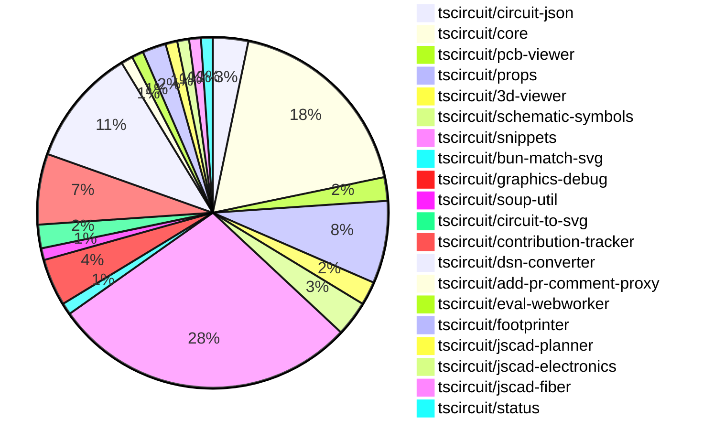

# contribution-tracker

Generates weekly contribution overviews for tscircuit contributors. Check out all
the [contribution overviews here](./contribution-overviews/)

* All PRs in the tscircuit org are scanned/summarized via Claude Haiku
* Claude classifies each Diff/PR as a Major, Minor or Tiny contribution
* All the PRs, summaries, and classifications are organized into charts and tables

The current week is shown below. There are 3 major sections:

* [Contributor Overview](#contributor-overview)
* [PRs by Repository](#prs-by-repository)
* [PRs by Contributor](#changes-by-contributor)

## Current Week

<!-- START_CURRENT_WEEK -->

# Contribution Overview 2024-11-20

## PRs by Repository

## Contributor Overview

| Contributor | 🐳 Major | 🐙 Minor | 🐌 Tiny | ⭐ | Issues Created |
|-------------|---------|---------|---------|-----|----------------|
| [ShiboSoftwareDev](#ShiboSoftwareDev) | 5 | 13 | 3 | ⭐⭐⭐ |
| [imrishabh18](#imrishabh18) | 3 | 15 | 0 | ⭐⭐⭐ |
| [anas-sarkez](#anas-sarkez) | 4 | 7 | 0 | ⭐⭐ |
| [Abse2001](#Abse2001) | 2 | 10 | 1 | ⭐⭐ |
| [seveibar](#seveibar) | 1 | 11 | 1 | ⭐⭐ |
| [RohittCodes](#RohittCodes) | 0 | 6 | 0 | ⭐⭐ |
| [Anshgrover23](#Anshgrover23) | 0 | 5 | 0 | ⭐ |
| [mrudulpatil18](#mrudulpatil18) | 0 | 3 | 0 | ⭐ |
| [kom-senapati](#kom-senapati) | 1 | 0 | 0 | ⭐ |
| [hunxjunedo](#hunxjunedo) | 0 | 1 | 0 |  |

## Review Table

| Contributor | Reviews Received | Approvals | Rejections | Changes Requested | PRs Opened | PRs Closed | Issues created |
|-------------|------------------|-----------|------------|-------------------|------------|------------|----------------|
| [Abse2001](https://github.com/Abse2001) | 16 | 12 | 5 | 2 | 13 | 13 | 0 |
| [ShiboSoftwareDev](https://github.com/ShiboSoftwareDev) | 27 | 20 | 16 | 2 | 30 | 29 | 0 |
| [seveibar](https://github.com/seveibar) | 0 | 0 | 0 | 0 | 14 | 13 | 0 |
| [imrishabh18](https://github.com/imrishabh18) | 10 | 5 | 5 | 2 | 20 | 18 | 0 |
| [anas-sarkez](https://github.com/anas-sarkez) | 33 | 12 | 5 | 6 | 13 | 12 | 0 |
| [Anshgrover23](https://github.com/Anshgrover23) | 11 | 4 | 4 | 5 | 9 | 8 | 0 |
| [mrudulpatil18](https://github.com/mrudulpatil18) | 5 | 4 | 0 | 1 | 6 | 4 | 0 |
| [kom-senapati](https://github.com/kom-senapati) | 2 | 1 | 0 | 1 | 1 | 1 | 0 |
| [divanshu-go](https://github.com/divanshu-go) | 1 | 0 | 0 | 1 | 1 | 0 | 0 |
| [melmathari](https://github.com/melmathari) | 8 | 1 | 3 | 2 | 5 | 4 | 0 |
| [hunxjunedo](https://github.com/hunxjunedo) | 2 | 1 | 1 | 0 | 1 | 1 | 0 |
| [RohittCodes](https://github.com/RohittCodes) | 54 | 7 | 3 | 12 | 10 | 7 | 0 |
| [vishwamartur](https://github.com/vishwamartur) | 1 | 0 | 1 | 1 | 1 | 1 | 0 |

## Changes by Repository

### [tscircuit/circuit-json](https://github.com/tscircuit/circuit-json)

| PR # | Impact | Contributor | Description |
|------|--------|-------------|-------------|
| [#83](https://github.com/tscircuit/circuit-json/pull/83) | 🐳 Major | Abse2001 | Implemented the `source_simple_pin_header` feature, which adds a new type of circuit element to the system. |
| [#84](https://github.com/tscircuit/circuit-json/pull/84) | 🐙 Minor | Abse2001 | Added the `.optional()` modifier to the `gender` field in the `source_simple_pin_header` schema. |
| [#82](https://github.com/tscircuit/circuit-json/pull/82) | 🐙 Minor | ShiboSoftwareDev | Added a new "rotated_rect" shape for SMT pads. |

### [tscircuit/core](https://github.com/tscircuit/core)

| PR # | Impact | Contributor | Description |
|------|--------|-------------|-------------|
| [#342](https://github.com/tscircuit/core/pull/342) | 🐳 Major | Abse2001 | Fixed manufacturer Part Number should go below refdes for four-sided pin layouts, handled three pin layouts and added tests for it. |
| [#364](https://github.com/tscircuit/core/pull/364) | 🐳 Major | ShiboSoftwareDev | Adds support for rotated_rect shape for SMT pads in the PCB representation. |
| [#336](https://github.com/tscircuit/core/pull/336) | 🐳 Major | seveibar | Changes the default format for async autorouting from SimpleRouteJson to CircuitJson, also includes fixes and testing for the async autorouter. |
| [#362](https://github.com/tscircuit/core/pull/362) | 🐳 Major | anas-sarkez | Implemented a new event `renderable:renderLifecycle:anyEvent` to make it easier to listen to renderable events. |
| [#351](https://github.com/tscircuit/core/pull/351) | 🐙 Minor | Abse2001 | Added `pin_count` and `gender` properties to the `<pinheader />` component. |
| [#339](https://github.com/tscircuit/core/pull/339) | 🐙 Minor | Abse2001 | Implemented the `getInheritedProperty` method on the `PrimitiveComponent` class to retrieve a property from the current component or its ancestors. |
| [#369](https://github.com/tscircuit/core/pull/369) | 🐙 Minor | ShiboSoftwareDev | Added a test case to check the rendering of normal and rotated SMT pads. |
| [#368](https://github.com/tscircuit/core/pull/368) | 🐙 Minor | ShiboSoftwareDev | Fixes a bug where rectangular SMT pads were not drawn correctly when the component was rotated by 90 degrees. |
| [#357](https://github.com/tscircuit/core/pull/357) | 🐙 Minor | seveibar | Add a function to get the client's origin and use it to add a cache-bust parameter to the model URLs to avoid CORS issues. |
| [#349](https://github.com/tscircuit/core/pull/349) | 🐙 Minor | imrishabh18 | Add a new component called "Crystal" to the library. |
| [#350](https://github.com/tscircuit/core/pull/350) | 🐙 Minor | imrishabh18 | Adds the "circuit-to-svg" package as a dev dependency to reduce bundle size. |
| [#333](https://github.com/tscircuit/core/pull/333) | 🐙 Minor | imrishabh18 | Adds caching of the PCB trace to improve rendering performance. |
| [#358](https://github.com/tscircuit/core/pull/358) | 🐙 Minor | anas-sarkez | Updated the footprinter dependency to the newest version (0.0.89). |
| [#352](https://github.com/tscircuit/core/pull/352) | 🐙 Minor | anas-sarkez | Implemented `getCurrentRenderPhase` and `getRenderGraph` methods for debugging |
| [#338](https://github.com/tscircuit/core/pull/338) | 🐙 Minor | anas-sarkez | Added support for schematic_box components to trace obstacles |
| [#363](https://github.com/tscircuit/core/pull/363) | 🐙 Minor | Anshgrover23 | Fixes the issue where the `bundle-size.yml` file doesn't run on pull requests from forks. |
| [#367](https://github.com/tscircuit/core/pull/367) | 🐌 Tiny | Abse2001 | This pull request skips two test cases related to remote autorouting in the Kicad project. |

### [tscircuit/pcb-viewer](https://github.com/tscircuit/pcb-viewer)

| PR # | Impact | Contributor | Description |
|------|--------|-------------|-------------|
| [#83](https://github.com/tscircuit/pcb-viewer/pull/83) | 🐙 Minor | Abse2001 | Fixed a type error by adding a non-nullable assertion to a property access. |
| [#82](https://github.com/tscircuit/pcb-viewer/pull/82) | 🐙 Minor | ShiboSoftwareDev | Adds a "format" script to the package.json file to format code using the "biome format" tool. |

### [tscircuit/props](https://github.com/tscircuit/props)

| PR # | Impact | Contributor | Description |
|------|--------|-------------|-------------|
| [#108](https://github.com/tscircuit/props/pull/108) | 🐙 Minor | Abse2001 | Set the default gender of the pin header to "male" |
| [#104](https://github.com/tscircuit/props/pull/104) | 🐙 Minor | ShiboSoftwareDev | Adds support for rotated rectangular SMT pads in the `smtpad` component. |
| [#105](https://github.com/tscircuit/props/pull/105) | 🐙 Minor | seveibar | Add "sequential-trace" and "subcircuit" autorouter presets |
| [#103](https://github.com/tscircuit/props/pull/103) | 🐙 Minor | seveibar | Adds an `autorouter` property to the `SubcircuitGroupProps` interface and defines the `AutorouterConfig` and `AutorouterProp` types. |
| [#106](https://github.com/tscircuit/props/pull/106) | 🐙 Minor | imrishabh18 | Adds the export for the "crystal" component and fixes the npm publish lock file. |
| [#102](https://github.com/tscircuit/props/pull/102) | 🐙 Minor | imrishabh18 | Adds export to the `PcbRouteCache` interface in the `group.ts` file. |
| [#101](https://github.com/tscircuit/props/pull/101) | 🐙 Minor | imrishabh18 | Add `pcbRouteCache` property to `SubcircuitGroupProps` interface |

### [tscircuit/3d-viewer](https://github.com/tscircuit/3d-viewer)

| PR # | Impact | Contributor | Description |
|------|--------|-------------|-------------|
| [#47](https://github.com/tscircuit/3d-viewer/pull/47) | 🐙 Minor | Abse2001 | Fixes misaligned 3D viewer components |
| [#46](https://github.com/tscircuit/3d-viewer/pull/46) | 🐙 Minor | Abse2001 | Updates the jscad-electronics dependency to version 0.0.22 |

### [tscircuit/schematic-symbols](https://github.com/tscircuit/schematic-symbols)

| PR # | Impact | Contributor | Description |
|------|--------|-------------|-------------|
| [#215](https://github.com/tscircuit/schematic-symbols/pull/215) | 🐙 Minor | Abse2001 | Improved the normally open and closed push buttons symbols |
| [#212](https://github.com/tscircuit/schematic-symbols/pull/212) | 🐙 Minor | Abse2001 | Creates a new function `approximateBezier` to improve 'C' case handling and adds a new symbol `capacitor_polarised` |
| [#211](https://github.com/tscircuit/schematic-symbols/pull/211) | 🐙 Minor | hunxjunedo | Fixes the y-coordinates of various points in the SPST switch, constant current diode, and darlington pair transistor symbols. |

### [tscircuit/snippets](https://github.com/tscircuit/snippets)

| PR # | Impact | Contributor | Description |
|------|--------|-------------|-------------|
| [#294](https://github.com/tscircuit/snippets/pull/294) | 🐳 Major | ShiboSoftwareDev | The pull request adds a workflow to build the main branch and compare the bundle size differences between the PR branch and the main branch. |
| [#291](https://github.com/tscircuit/snippets/pull/291) | 🐳 Major | ShiboSoftwareDev | Updates the GitHub Actions workflow to analyze the bundle size and generate a report. |
| [#280](https://github.com/tscircuit/snippets/pull/280) | 🐙 Minor | Abse2001 | Implement Capacitor BOM Search |
| [#282](https://github.com/tscircuit/snippets/pull/282) | 🐙 Minor | ShiboSoftwareDev | Implemented pin header BOM generation |
| [#277](https://github.com/tscircuit/snippets/pull/277) | 🐙 Minor | ShiboSoftwareDev | Adds a new ErrorFallback component to display detailed error messages when the 3D viewer fails to load. |
| [#267](https://github.com/tscircuit/snippets/pull/267) | 🐙 Minor | ShiboSoftwareDev | Adds a spinner icon to the run button when the code is running |
| [#257](https://github.com/tscircuit/snippets/pull/257) | 🐙 Minor | ShiboSoftwareDev | Adds footprint insertion QoL improvements, such as a dropdown menu for different insert options and improved error handling. |
| [#264](https://github.com/tscircuit/snippets/pull/264) | 🐙 Minor | seveibar | Improve the keying for circuit JSON to handle changes in the JSON structure. |
| [#263](https://github.com/tscircuit/snippets/pull/263) | 🐙 Minor | seveibar | Update the core dependency to enable cloud autorouting |
| [#242](https://github.com/tscircuit/snippets/pull/242) | 🐙 Minor | seveibar | Redirect the "/playground" URL to the "/editor" page with a "blank-circuit-board" template. |
| [#258](https://github.com/tscircuit/snippets/pull/258) | 🐙 Minor | seveibar | Skips parts engine test on CI |
| [#252](https://github.com/tscircuit/snippets/pull/252) | 🐙 Minor | seveibar | Reverts a change that caused a regression where every snippet has red underlines until the user modifies it. |
| [#303](https://github.com/tscircuit/snippets/pull/303) | 🐙 Minor | imrishabh18 | Add a new development login page to the application. |
| [#298](https://github.com/tscircuit/snippets/pull/298) | 🐙 Minor | imrishabh18 | Fix an issue where the `auth generate` command fails when not using `localhost` as the domain. |
| [#287](https://github.com/tscircuit/snippets/pull/287) | 🐙 Minor | anas-sarkez | Fixed responsiveness issue in EditorNav component |
| [#302](https://github.com/tscircuit/snippets/pull/302) | 🐙 Minor | Anshgrover23 | Fixes a regex issue that prevented proper import of names with dashes in the CodeEditor component. |
| [#285](https://github.com/tscircuit/snippets/pull/285) | 🐙 Minor | RohittCodes | Adds a fullscreen toggle button to the preview content component. |
| [#245](https://github.com/tscircuit/snippets/pull/245) | 🐙 Minor | RohittCodes | Removes the deletion of the "template" URL parameter to preserve it during navigation. |
| [#202](https://github.com/tscircuit/snippets/pull/202) | 🐙 Minor | RohittCodes | Adds an endpoint to remove the star from a snippet. |
| [#270](https://github.com/tscircuit/snippets/pull/270) | 🐙 Minor | RohittCodes | Fixes the exact cursor position without reflecting the code and its types. |
| [#268](https://github.com/tscircuit/snippets/pull/268) | 🐙 Minor | RohittCodes | Fixes an issue where `manualEditsFileContent` was not being initialized with the `manual_edit_json` when the page loaded, causing the "Unsaved Changes" issue. |
| [#248](https://github.com/tscircuit/snippets/pull/248) | 🐙 Minor | RohittCodes | Adds a new field `manual_edits_json` to the `snippets.manual_edits_json` schema and implements an update function for it. |
| [#236](https://github.com/tscircuit/snippets/pull/236) | 🐙 Minor | mrudulpatil18 | Update the iframe embedding link to use the /preview endpoint instead of the old /embed endpoint. |
| [#306](https://github.com/tscircuit/snippets/pull/306) | 🐌 Tiny | ShiboSoftwareDev | Updated the `@tscircuit/3d-viewer` dependency to version `0.0.44`. |
| [#304](https://github.com/tscircuit/snippets/pull/304) | 🐌 Tiny | ShiboSoftwareDev | Removed an extra workflow file |
| [#254](https://github.com/tscircuit/snippets/pull/254) | 🐌 Tiny | seveibar | Add a GitHub stars badge to the landing page |

### [tscircuit/bun-match-svg](https://github.com/tscircuit/bun-match-svg)

| PR # | Impact | Contributor | Description |
|------|--------|-------------|-------------|
| [#4](https://github.com/tscircuit/bun-match-svg/pull/4) | 🐳 Major | ShiboSoftwareDev | Implemented a CLI tool that initializes the project in other repositories. |

### [tscircuit/graphics-debug](https://github.com/tscircuit/graphics-debug)

| PR # | Impact | Contributor | Description |
|------|--------|-------------|-------------|
| [#10](https://github.com/tscircuit/graphics-debug/pull/10) | 🐳 Major | ShiboSoftwareDev | Introduce a table that lists all graphics objects, with highlighting when hovering over table entries. |
| [#9](https://github.com/tscircuit/graphics-debug/pull/9) | 🐙 Minor | ShiboSoftwareDev | Adds error handling to the graphics parsing functionality and displays the error message to the user. |
| [#8](https://github.com/tscircuit/graphics-debug/pull/8) | 🐙 Minor | mrudulpatil18 | The pull request fixes a problem with how SVGs are handled when using `dangerouslySetInnerHTML` by adding a custom `SVGRenderer` component that correctly handles CDATA from SVGs. |
| [#7](https://github.com/tscircuit/graphics-debug/pull/7) | 🐙 Minor | mrudulpatil18 | Added a "See Example" button to the graphics debug viewer to load a sample graphics input for visualization |

### [tscircuit/soup-util](https://github.com/tscircuit/soup-util)

| PR # | Impact | Contributor | Description |
|------|--------|-------------|-------------|
| [#25](https://github.com/tscircuit/soup-util/pull/25) | 🐙 Minor | ShiboSoftwareDev | Updates the `circuit-json` dependency to version `^0.0.106` |

### [tscircuit/circuit-to-svg](https://github.com/tscircuit/circuit-to-svg)

| PR # | Impact | Contributor | Description |
|------|--------|-------------|-------------|
| [#137](https://github.com/tscircuit/circuit-to-svg/pull/137) | 🐙 Minor | ShiboSoftwareDev | Rotate the SMT pads counter-clockwise instead of clockwise. |
| [#136](https://github.com/tscircuit/circuit-to-svg/pull/136) | 🐙 Minor | ShiboSoftwareDev | Adds support for rendering rotated rectangular SMT pads in the SVG representation of a PCB. |

### [tscircuit/contribution-tracker](https://github.com/tscircuit/contribution-tracker)

| PR # | Impact | Contributor | Description |
|------|--------|-------------|-------------|
| [#6](https://github.com/tscircuit/contribution-tracker/pull/6) | 🐳 Major | kom-senapati |  |
| [#12](https://github.com/tscircuit/contribution-tracker/pull/12) | 🐙 Minor | imrishabh18 | Reverts the "Fix review table" change made in tscircuit/contribution-tracker#11. |
| [#8](https://github.com/tscircuit/contribution-tracker/pull/8) | 🐙 Minor | anas-sarkez | Adds a new column "Issues Created" to the reviews table, displaying the number of issues created by each contributor. |
| [#13](https://github.com/tscircuit/contribution-tracker/pull/13) | 🐙 Minor | Anshgrover23 | Fix issue #7 by updating the review table in the generated Markdown. |
| [#11](https://github.com/tscircuit/contribution-tracker/pull/11) | 🐙 Minor | Anshgrover23 | Fixes the review table in the pull request, addressing issues #7 and #9. |
| [#14](https://github.com/tscircuit/contribution-tracker/pull/14) | 🐌 Tiny | ShiboSoftwareDev | Fixed the review table formatting by changing the column name "Issues Created" to "Issues created". |

### [tscircuit/dsn-converter](https://github.com/tscircuit/dsn-converter)

| PR # | Impact | Contributor | Description |
|------|--------|-------------|-------------|
| [#32](https://github.com/tscircuit/dsn-converter/pull/32) | 🐳 Major | imrishabh18 | Fix the conversion of `pcb_trace` and `source_net` to a network of DSN. |
| [#31](https://github.com/tscircuit/dsn-converter/pull/31) | 🐳 Major | imrishabh18 | Adds a new function `processChips` to convert 'simple_chip' components from 'circuit-json' format to 'dsn-json' format. |
| [#29](https://github.com/tscircuit/dsn-converter/pull/29) | 🐳 Major | imrishabh18 | This pull request groups the components and images together in the DSN file format. |
| [#26](https://github.com/tscircuit/dsn-converter/pull/26) | 🐙 Minor | seveibar | Adjust the scale factor for converting DSN session to circuit JSON from 1/1000 to 1/10000. |
| [#35](https://github.com/tscircuit/dsn-converter/pull/35) | 🐙 Minor | imrishabh18 | Fixes the trace IDs to ensure they are unique and consistent across the project. |
| [#34](https://github.com/tscircuit/dsn-converter/pull/34) | 🐙 Minor | imrishabh18 | Add a format bot to automatically format the code in the repository. |
| [#33](https://github.com/tscircuit/dsn-converter/pull/33) | 🐙 Minor | imrishabh18 | Adds a test to check the motor driver DSN format and fixes the parseDsnJson function for conversion. |
| [#30](https://github.com/tscircuit/dsn-converter/pull/30) | 🐙 Minor | imrishabh18 | Plated holes for the components are grouped together and images are added only once (similar to KiCad format). |
| [#28](https://github.com/tscircuit/dsn-converter/pull/28) | 🐙 Minor | imrishabh18 | Fix the plated hole DSN file format and net. |
| [#27](https://github.com/tscircuit/dsn-converter/pull/27) | 🐙 Minor | imrishabh18 | Fixes a scaling issue in the session data by adjusting the transformation factor for traces. |

### [tscircuit/add-pr-comment-proxy](https://github.com/tscircuit/add-pr-comment-proxy)

| PR # | Impact | Contributor | Description |
|------|--------|-------------|-------------|
| [#6](https://github.com/tscircuit/add-pr-comment-proxy/pull/6) | 🐙 Minor | seveibar | Ports the project to Vercel (a cloud hosting platform) |

### [tscircuit/eval-webworker](https://github.com/tscircuit/eval-webworker)

| PR # | Impact | Contributor | Description |
|------|--------|-------------|-------------|
| [#5](https://github.com/tscircuit/eval-webworker/pull/5) | 🐙 Minor | seveibar | Add Workflows, Fix Test, Publish v0.0.1 |

### [tscircuit/footprinter](https://github.com/tscircuit/footprinter)

| PR # | Impact | Contributor | Description |
|------|--------|-------------|-------------|
| [#86](https://github.com/tscircuit/footprinter/pull/86) | 🐳 Major | anas-sarkez | Refactor the `Stampboard` and `Stampreceiver` functions to have separate pins for each SMD pad and hole. |
| [#83](https://github.com/tscircuit/footprinter/pull/83) | 🐙 Minor | anas-sarkez | Refactors all footprinter functions by updating their scheme, setting a default value of num_pins. |

### [tscircuit/jscad-planner](https://github.com/tscircuit/jscad-planner)

| PR # | Impact | Contributor | Description |
|------|--------|-------------|-------------|
| [#4](https://github.com/tscircuit/jscad-planner/pull/4) | 🐳 Major | anas-sarkez | Added support for the "hull" and "hullChain" operations in the JSCAD implementation, along with their corresponding types and tests. |

### [tscircuit/jscad-electronics](https://github.com/tscircuit/jscad-electronics)

| PR # | Impact | Contributor | Description |
|------|--------|-------------|-------------|
| [#81](https://github.com/tscircuit/jscad-electronics/pull/81) | 🐳 Major | anas-sarkez | Implemented `SOT235` `(SOT-23-5)` 3D component and added an example for the `Footprinter3d` component. |

### [tscircuit/jscad-fiber](https://github.com/tscircuit/jscad-fiber)

| PR # | Impact | Contributor | Description |
|------|--------|-------------|-------------|
| [#91](https://github.com/tscircuit/jscad-fiber/pull/91) | 🐙 Minor | anas-sarkez | Add an `ExampleWrapper` component with code toggle functionality to the examples |

### [tscircuit/status](https://github.com/tscircuit/status)

| PR # | Impact | Contributor | Description |
|------|--------|-------------|-------------|
| [#3](https://github.com/tscircuit/status/pull/3) | 🐙 Minor | Anshgrover23 | Fix an issue where bars were getting cut off in the visualization |

## Changes by Contributor

### [Abse2001](https://github.com/Abse2001)

| PR # | Impact | Description |
|------|--------|-------------|
| [#83](https://github.com/tscircuit/circuit-json/pull/83) | 🐳 Major | Implemented the `source_simple_pin_header` feature, which adds a new type of circuit element to the system. |
| [#342](https://github.com/tscircuit/core/pull/342) | 🐳 Major | Fixed manufacturer Part Number should go below refdes for four-sided pin layouts, handled three pin layouts and added tests for it. |
| [#83](https://github.com/tscircuit/pcb-viewer/pull/83) | 🐙 Minor | Fixed a type error by adding a non-nullable assertion to a property access. |
| [#84](https://github.com/tscircuit/circuit-json/pull/84) | 🐙 Minor | Added the `.optional()` modifier to the `gender` field in the `source_simple_pin_header` schema. |
| [#108](https://github.com/tscircuit/props/pull/108) | 🐙 Minor | Set the default gender of the pin header to "male" |
| [#47](https://github.com/tscircuit/3d-viewer/pull/47) | 🐙 Minor | Fixes misaligned 3D viewer components |
| [#46](https://github.com/tscircuit/3d-viewer/pull/46) | 🐙 Minor | Updates the jscad-electronics dependency to version 0.0.22 |
| [#351](https://github.com/tscircuit/core/pull/351) | 🐙 Minor | Added `pin_count` and `gender` properties to the `<pinheader />` component. |
| [#339](https://github.com/tscircuit/core/pull/339) | 🐙 Minor | Implemented the `getInheritedProperty` method on the `PrimitiveComponent` class to retrieve a property from the current component or its ancestors. |
| [#215](https://github.com/tscircuit/schematic-symbols/pull/215) | 🐙 Minor | Improved the normally open and closed push buttons symbols |
| [#212](https://github.com/tscircuit/schematic-symbols/pull/212) | 🐙 Minor | Creates a new function `approximateBezier` to improve 'C' case handling and adds a new symbol `capacitor_polarised` |
| [#280](https://github.com/tscircuit/snippets/pull/280) | 🐙 Minor | Implement Capacitor BOM Search |
| [#367](https://github.com/tscircuit/core/pull/367) | 🐌 Tiny | This pull request skips two test cases related to remote autorouting in the Kicad project. |

### [ShiboSoftwareDev](https://github.com/ShiboSoftwareDev)

| PR # | Impact | Description |
|------|--------|-------------|
| [#364](https://github.com/tscircuit/core/pull/364) | 🐳 Major | Adds support for rotated_rect shape for SMT pads in the PCB representation. |
| [#4](https://github.com/tscircuit/bun-match-svg/pull/4) | 🐳 Major | Implemented a CLI tool that initializes the project in other repositories. |
| [#294](https://github.com/tscircuit/snippets/pull/294) | 🐳 Major | The pull request adds a workflow to build the main branch and compare the bundle size differences between the PR branch and the main branch. |
| [#291](https://github.com/tscircuit/snippets/pull/291) | 🐳 Major | Updates the GitHub Actions workflow to analyze the bundle size and generate a report. |
| [#10](https://github.com/tscircuit/graphics-debug/pull/10) | 🐳 Major | Introduce a table that lists all graphics objects, with highlighting when hovering over table entries. |
| [#82](https://github.com/tscircuit/pcb-viewer/pull/82) | 🐙 Minor | Adds a "format" script to the package.json file to format code using the "biome format" tool. |
| [#82](https://github.com/tscircuit/circuit-json/pull/82) | 🐙 Minor | Added a new "rotated_rect" shape for SMT pads. |
| [#25](https://github.com/tscircuit/soup-util/pull/25) | 🐙 Minor | Updates the `circuit-json` dependency to version `^0.0.106` |
| [#104](https://github.com/tscircuit/props/pull/104) | 🐙 Minor | Adds support for rotated rectangular SMT pads in the `smtpad` component. |
| [#369](https://github.com/tscircuit/core/pull/369) | 🐙 Minor | Added a test case to check the rendering of normal and rotated SMT pads. |
| [#368](https://github.com/tscircuit/core/pull/368) | 🐙 Minor | Fixes a bug where rectangular SMT pads were not drawn correctly when the component was rotated by 90 degrees. |
| [#137](https://github.com/tscircuit/circuit-to-svg/pull/137) | 🐙 Minor | Rotate the SMT pads counter-clockwise instead of clockwise. |
| [#136](https://github.com/tscircuit/circuit-to-svg/pull/136) | 🐙 Minor | Adds support for rendering rotated rectangular SMT pads in the SVG representation of a PCB. |
| [#282](https://github.com/tscircuit/snippets/pull/282) | 🐙 Minor | Implemented pin header BOM generation |
| [#277](https://github.com/tscircuit/snippets/pull/277) | 🐙 Minor | Adds a new ErrorFallback component to display detailed error messages when the 3D viewer fails to load. |
| [#267](https://github.com/tscircuit/snippets/pull/267) | 🐙 Minor | Adds a spinner icon to the run button when the code is running |
| [#257](https://github.com/tscircuit/snippets/pull/257) | 🐙 Minor | Adds footprint insertion QoL improvements, such as a dropdown menu for different insert options and improved error handling. |
| [#9](https://github.com/tscircuit/graphics-debug/pull/9) | 🐙 Minor | Adds error handling to the graphics parsing functionality and displays the error message to the user. |
| [#14](https://github.com/tscircuit/contribution-tracker/pull/14) | 🐌 Tiny | Fixed the review table formatting by changing the column name "Issues Created" to "Issues created". |
| [#306](https://github.com/tscircuit/snippets/pull/306) | 🐌 Tiny | Updated the `@tscircuit/3d-viewer` dependency to version `0.0.44`. |
| [#304](https://github.com/tscircuit/snippets/pull/304) | 🐌 Tiny | Removed an extra workflow file |

### [seveibar](https://github.com/seveibar)

| PR # | Impact | Description |
|------|--------|-------------|
| [#336](https://github.com/tscircuit/core/pull/336) | 🐳 Major | Changes the default format for async autorouting from SimpleRouteJson to CircuitJson, also includes fixes and testing for the async autorouter. |
| [#105](https://github.com/tscircuit/props/pull/105) | 🐙 Minor | Add "sequential-trace" and "subcircuit" autorouter presets |
| [#103](https://github.com/tscircuit/props/pull/103) | 🐙 Minor | Adds an `autorouter` property to the `SubcircuitGroupProps` interface and defines the `AutorouterConfig` and `AutorouterProp` types. |
| [#357](https://github.com/tscircuit/core/pull/357) | 🐙 Minor | Add a function to get the client's origin and use it to add a cache-bust parameter to the model URLs to avoid CORS issues. |
| [#26](https://github.com/tscircuit/dsn-converter/pull/26) | 🐙 Minor | Adjust the scale factor for converting DSN session to circuit JSON from 1/1000 to 1/10000. |
| [#264](https://github.com/tscircuit/snippets/pull/264) | 🐙 Minor | Improve the keying for circuit JSON to handle changes in the JSON structure. |
| [#263](https://github.com/tscircuit/snippets/pull/263) | 🐙 Minor | Update the core dependency to enable cloud autorouting |
| [#242](https://github.com/tscircuit/snippets/pull/242) | 🐙 Minor | Redirect the "/playground" URL to the "/editor" page with a "blank-circuit-board" template. |
| [#258](https://github.com/tscircuit/snippets/pull/258) | 🐙 Minor | Skips parts engine test on CI |
| [#252](https://github.com/tscircuit/snippets/pull/252) | 🐙 Minor | Reverts a change that caused a regression where every snippet has red underlines until the user modifies it. |
| [#6](https://github.com/tscircuit/add-pr-comment-proxy/pull/6) | 🐙 Minor | Ports the project to Vercel (a cloud hosting platform) |
| [#5](https://github.com/tscircuit/eval-webworker/pull/5) | 🐙 Minor | Add Workflows, Fix Test, Publish v0.0.1 |
| [#254](https://github.com/tscircuit/snippets/pull/254) | 🐌 Tiny | Add a GitHub stars badge to the landing page |

### [imrishabh18](https://github.com/imrishabh18)

| PR # | Impact | Description |
|------|--------|-------------|
| [#32](https://github.com/tscircuit/dsn-converter/pull/32) | 🐳 Major | Fix the conversion of `pcb_trace` and `source_net` to a network of DSN. |
| [#31](https://github.com/tscircuit/dsn-converter/pull/31) | 🐳 Major | Adds a new function `processChips` to convert 'simple_chip' components from 'circuit-json' format to 'dsn-json' format. |
| [#29](https://github.com/tscircuit/dsn-converter/pull/29) | 🐳 Major | This pull request groups the components and images together in the DSN file format. |
| [#106](https://github.com/tscircuit/props/pull/106) | 🐙 Minor | Adds the export for the "crystal" component and fixes the npm publish lock file. |
| [#102](https://github.com/tscircuit/props/pull/102) | 🐙 Minor | Adds export to the `PcbRouteCache` interface in the `group.ts` file. |
| [#101](https://github.com/tscircuit/props/pull/101) | 🐙 Minor | Add `pcbRouteCache` property to `SubcircuitGroupProps` interface |
| [#349](https://github.com/tscircuit/core/pull/349) | 🐙 Minor | Add a new component called "Crystal" to the library. |
| [#350](https://github.com/tscircuit/core/pull/350) | 🐙 Minor | Adds the "circuit-to-svg" package as a dev dependency to reduce bundle size. |
| [#333](https://github.com/tscircuit/core/pull/333) | 🐙 Minor | Adds caching of the PCB trace to improve rendering performance. |
| [#12](https://github.com/tscircuit/contribution-tracker/pull/12) | 🐙 Minor | Reverts the "Fix review table" change made in tscircuit/contribution-tracker#11. |
| [#35](https://github.com/tscircuit/dsn-converter/pull/35) | 🐙 Minor | Fixes the trace IDs to ensure they are unique and consistent across the project. |
| [#34](https://github.com/tscircuit/dsn-converter/pull/34) | 🐙 Minor | Add a format bot to automatically format the code in the repository. |
| [#33](https://github.com/tscircuit/dsn-converter/pull/33) | 🐙 Minor | Adds a test to check the motor driver DSN format and fixes the parseDsnJson function for conversion. |
| [#30](https://github.com/tscircuit/dsn-converter/pull/30) | 🐙 Minor | Plated holes for the components are grouped together and images are added only once (similar to KiCad format). |
| [#28](https://github.com/tscircuit/dsn-converter/pull/28) | 🐙 Minor | Fix the plated hole DSN file format and net. |
| [#27](https://github.com/tscircuit/dsn-converter/pull/27) | 🐙 Minor | Fixes a scaling issue in the session data by adjusting the transformation factor for traces. |
| [#303](https://github.com/tscircuit/snippets/pull/303) | 🐙 Minor | Add a new development login page to the application. |
| [#298](https://github.com/tscircuit/snippets/pull/298) | 🐙 Minor | Fix an issue where the `auth generate` command fails when not using `localhost` as the domain. |

### [anas-sarkez](https://github.com/anas-sarkez)

| PR # | Impact | Description |
|------|--------|-------------|
| [#86](https://github.com/tscircuit/footprinter/pull/86) | 🐳 Major | Refactor the `Stampboard` and `Stampreceiver` functions to have separate pins for each SMD pad and hole. |
| [#4](https://github.com/tscircuit/jscad-planner/pull/4) | 🐳 Major | Added support for the "hull" and "hullChain" operations in the JSCAD implementation, along with their corresponding types and tests. |
| [#362](https://github.com/tscircuit/core/pull/362) | 🐳 Major | Implemented a new event `renderable:renderLifecycle:anyEvent` to make it easier to listen to renderable events. |
| [#81](https://github.com/tscircuit/jscad-electronics/pull/81) | 🐳 Major | Implemented `SOT235` `(SOT-23-5)` 3D component and added an example for the `Footprinter3d` component. |
| [#83](https://github.com/tscircuit/footprinter/pull/83) | 🐙 Minor | Refactors all footprinter functions by updating their scheme, setting a default value of num_pins. |
| [#358](https://github.com/tscircuit/core/pull/358) | 🐙 Minor | Updated the footprinter dependency to the newest version (0.0.89). |
| [#352](https://github.com/tscircuit/core/pull/352) | 🐙 Minor | Implemented `getCurrentRenderPhase` and `getRenderGraph` methods for debugging |
| [#338](https://github.com/tscircuit/core/pull/338) | 🐙 Minor | Added support for schematic_box components to trace obstacles |
| [#91](https://github.com/tscircuit/jscad-fiber/pull/91) | 🐙 Minor | Add an `ExampleWrapper` component with code toggle functionality to the examples |
| [#8](https://github.com/tscircuit/contribution-tracker/pull/8) | 🐙 Minor | Adds a new column "Issues Created" to the reviews table, displaying the number of issues created by each contributor. |
| [#287](https://github.com/tscircuit/snippets/pull/287) | 🐙 Minor | Fixed responsiveness issue in EditorNav component |

### [Anshgrover23](https://github.com/Anshgrover23)

| PR # | Impact | Description |
|------|--------|-------------|
| [#363](https://github.com/tscircuit/core/pull/363) | 🐙 Minor | Fixes the issue where the `bundle-size.yml` file doesn't run on pull requests from forks. |
| [#13](https://github.com/tscircuit/contribution-tracker/pull/13) | 🐙 Minor | Fix issue #7 by updating the review table in the generated Markdown. |
| [#11](https://github.com/tscircuit/contribution-tracker/pull/11) | 🐙 Minor | Fixes the review table in the pull request, addressing issues #7 and #9. |
| [#302](https://github.com/tscircuit/snippets/pull/302) | 🐙 Minor | Fixes a regex issue that prevented proper import of names with dashes in the CodeEditor component. |
| [#3](https://github.com/tscircuit/status/pull/3) | 🐙 Minor | Fix an issue where bars were getting cut off in the visualization |

### [kom-senapati](https://github.com/kom-senapati)

| PR # | Impact | Description |
|------|--------|-------------|
| [#6](https://github.com/tscircuit/contribution-tracker/pull/6) | 🐳 Major |  |

### [hunxjunedo](https://github.com/hunxjunedo)

| PR # | Impact | Description |
|------|--------|-------------|
| [#211](https://github.com/tscircuit/schematic-symbols/pull/211) | 🐙 Minor | Fixes the y-coordinates of various points in the SPST switch, constant current diode, and darlington pair transistor symbols. |

### [RohittCodes](https://github.com/RohittCodes)

| PR # | Impact | Description |
|------|--------|-------------|
| [#285](https://github.com/tscircuit/snippets/pull/285) | 🐙 Minor | Adds a fullscreen toggle button to the preview content component. |
| [#245](https://github.com/tscircuit/snippets/pull/245) | 🐙 Minor | Removes the deletion of the "template" URL parameter to preserve it during navigation. |
| [#202](https://github.com/tscircuit/snippets/pull/202) | 🐙 Minor | Adds an endpoint to remove the star from a snippet. |
| [#270](https://github.com/tscircuit/snippets/pull/270) | 🐙 Minor | Fixes the exact cursor position without reflecting the code and its types. |
| [#268](https://github.com/tscircuit/snippets/pull/268) | 🐙 Minor | Fixes an issue where `manualEditsFileContent` was not being initialized with the `manual_edit_json` when the page loaded, causing the "Unsaved Changes" issue. |
| [#248](https://github.com/tscircuit/snippets/pull/248) | 🐙 Minor | Adds a new field `manual_edits_json` to the `snippets.manual_edits_json` schema and implements an update function for it. |

### [mrudulpatil18](https://github.com/mrudulpatil18)

| PR # | Impact | Description |
|------|--------|-------------|
| [#236](https://github.com/tscircuit/snippets/pull/236) | 🐙 Minor | Update the iframe embedding link to use the /preview endpoint instead of the old /embed endpoint. |
| [#8](https://github.com/tscircuit/graphics-debug/pull/8) | 🐙 Minor | The pull request fixes a problem with how SVGs are handled when using `dangerouslySetInnerHTML` by adding a custom `SVGRenderer` component that correctly handles CDATA from SVGs. |
| [#7](https://github.com/tscircuit/graphics-debug/pull/7) | 🐙 Minor | Added a "See Example" button to the graphics debug viewer to load a sample graphics input for visualization |

<!-- END_CURRENT_WEEK -->
