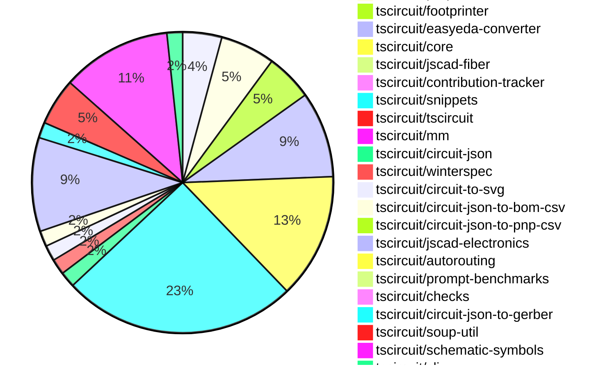

# contribution-tracker

Generates weekly contribution overviews for tscircuit contributors. Check out all
the [contribution overviews here](./contribution-overviews/)

* All PRs in the tscircuit org are scanned/summarized via Claude Haiku
* Claude classifies each Diff/PR as a Major, Minor or Tiny contribution
* All the PRs, summaries, and classifications are organized into charts and tables

The current week is shown below. There are 3 major sections:

* [Contributor Overview](#contributor-overview)
* [PRs by Repository](#prs-by-repository)
* [PRs by Contributor](#changes-by-contributor)

## Current Week

<!-- START_CURRENT_WEEK -->

# Contribution Overview 2024-10-09

## PRs by Repository

## Contributor Overview

| Contributor | 🐳 Major | 🐙 Minor | 🐌 Tiny | ⭐ |
|-------------|-------|-------|-------|-------|
| [seveibar](#seveibar) | 18 | 38 | 5 | 👑👑👑 |
| [imrishabh18](#imrishabh18) | 2 | 14 | 2 | ⭐⭐⭐ |
| [anas-sarkez](#anas-sarkez) | 4 | 6 | 0 | ⭐⭐ |
| [andrii-balitskyi](#andrii-balitskyi) | 6 | 1 | 0 | ⭐⭐ |
| [aman1376](#aman1376) | 3 | 1 | 0 | ⭐⭐ |
| [mrudulpatil18](#mrudulpatil18) | 1 | 5 | 0 | ⭐⭐ |
| [ShiboSoftwareDev](#ShiboSoftwareDev) | 0 | 3 | 2 | ⭐ |
| [Abse2001](#Abse2001) | 0 | 4 | 0 | ⭐ |
| [ni9999](#ni9999) | 0 | 2 | 0 | ⭐ |
| [anugcodes](#anugcodes) | 0 | 2 | 0 | ⭐ |
| [MandeepPaul](#MandeepPaul) | 1 | 0 | 0 | ⭐ |
| [qalbun-salim](#qalbun-salim) | 0 | 1 | 0 |  |
| [sarthak-kumar-shailendra](#sarthak-kumar-shailendra) | 0 | 1 | 0 |  |
| [bbland1](#bbland1) | 0 | 1 | 0 |  |
| [0SlowPoke0](#0SlowPoke0) | 0 | 1 | 0 |  |
| [kom-senapati](#kom-senapati) | 0 | 1 | 0 |  |
| [theajmalrazaq](#theajmalrazaq) | 0 | 1 | 0 |  |

## Changes by Repository

### [tscircuit/pcb-viewer](https://github.com/tscircuit/pcb-viewer)

| PR # | Impact | Contributor | Description |
|------|--------|-------------|-------------|
| [#71](https://github.com/tscircuit/pcb-viewer/pull/71) | 🐳 Major | seveibar | Reverts a previous change that broke the PCB viewer's bounds computation. |
| [#74](https://github.com/tscircuit/pcb-viewer/pull/74) | 🐙 Minor | imrishabh18 | Refactor/remove builder |
| [#73](https://github.com/tscircuit/pcb-viewer/pull/73) | 🐙 Minor | imrishabh18 | Refactor: remove builder |
| [#76](https://github.com/tscircuit/pcb-viewer/pull/76) | 🐌 Tiny | seveibar | Formatting and minor fix for silkscreen path story so that it renders |
| [#75](https://github.com/tscircuit/pcb-viewer/pull/75) | 🐌 Tiny | ShiboSoftwareDev | Added a CODEOWNERS file to the repository, which specifies the code owners for the entire repository. |

### [tscircuit/props](https://github.com/tscircuit/props)

| PR # | Impact | Contributor | Description |
|------|--------|-------------|-------------|
| [#63](https://github.com/tscircuit/props/pull/63) | 🐳 Major | seveibar | Add battery component type, battery props, and set default unit to mAh |
| [#65](https://github.com/tscircuit/props/pull/65) | 🐙 Minor | seveibar | Adds a new prop `schAutoLayoutEnabled` to the `<group />` component to enable automatic layout of the schematic for the group. |
| [#61](https://github.com/tscircuit/props/pull/61) | 🐙 Minor | seveibar | Revert the addition of "schWidth", "schHeight", "pcbWidth", and "pcbHeight" props, and replace them with "width" and "height" props. |
| [#62](https://github.com/tscircuit/props/pull/62) | 🐙 Minor | imrishabh18 | Reverts changes to `width` and `height` properties in `commonComponentProps` and `commonLayoutProps`. |
| [#60](https://github.com/tscircuit/props/pull/60) | 🐙 Minor | imrishabh18 | Adds `schWidth` and `schHeight` properties to the `commonLayoutProps` interface, replacing the existing `width` and `height` properties. |
| [#58](https://github.com/tscircuit/props/pull/58) | 🐙 Minor | imrishabh18 | Add width and height properties for components |
| [#59](https://github.com/tscircuit/props/pull/59) | 🐌 Tiny | imrishabh18 | Updated the lockfile to the latest version. |

### [tscircuit/footprinter](https://github.com/tscircuit/footprinter)

| PR # | Impact | Contributor | Description |
|------|--------|-------------|-------------|
| [#67](https://github.com/tscircuit/footprinter/pull/67) | 🐳 Major | seveibar | Introduce an automatic gallery generation feature for SVG snapshots. |
| [#63](https://github.com/tscircuit/footprinter/pull/63) | 🐳 Major | seveibar | Removes the `bun` dependency, which was causing a massive increase in bundle size. |
| [#66](https://github.com/tscircuit/footprinter/pull/66) | 🐙 Minor | seveibar | Introduce a new pushbutton footprint and update the circuit-to-svg dependency. |
| [#61](https://github.com/tscircuit/footprinter/pull/61) | 🐙 Minor | seveibar | Adds error handling for invalid footprint function strings in the `footprinter` module. |
| [#60](https://github.com/tscircuit/footprinter/pull/60) | 🐙 Minor | bbland1 | Adds types for parameters returned using `.json()`. |
| [#62](https://github.com/tscircuit/footprinter/pull/62) | 🐙 Minor | anas-sarkez | The pull request modifies and fixes the default value of the `qfp` parameter according to the data sheet. |

### [tscircuit/easyeda-converter](https://github.com/tscircuit/easyeda-converter)

| PR # | Impact | Contributor | Description |
|------|--------|-------------|-------------|
| [#59](https://github.com/tscircuit/easyeda-converter/pull/59) | 🐳 Major | seveibar | Fix Hole Creation, Add snapshot testing |
| [#74](https://github.com/tscircuit/easyeda-converter/pull/74) | 🐙 Minor | seveibar | The pull request fixes the C490691 import and adds a script for quickly adding tests for parts. |
| [#71](https://github.com/tscircuit/easyeda-converter/pull/71) | 🐙 Minor | seveibar | Fixes a bug in the Arc Imports by improving the regular expression used to parse the arc data. |
| [#66](https://github.com/tscircuit/easyeda-converter/pull/66) | 🐙 Minor | seveibar | Adds the `supplierPartNumbers` prop to the `soupTypescriptComponentTemplate` function and the `Chip` component. |
| [#64](https://github.com/tscircuit/easyeda-converter/pull/64) | 🐙 Minor | seveibar | Adds support for parsing and handling 'PATH' shapes in the EasyEDA converter. |
| [#62](https://github.com/tscircuit/easyeda-converter/pull/62) | 🐙 Minor | seveibar | Fix the pcb_component offset and add a check for large dimensions in the test |
| [#61](https://github.com/tscircuit/easyeda-converter/pull/61) | 🐙 Minor | seveibar | Fixes a bug that caused the y-axis to be flipped twice, resulting in an incorrect display. |
| [#60](https://github.com/tscircuit/easyeda-converter/pull/60) | 🐙 Minor | seveibar | New Footprint tsx Generation Mechanism for more stable units, support for <hole /> |
| [#56](https://github.com/tscircuit/easyeda-converter/pull/56) | 🐙 Minor | seveibar | Adds a benchmark script to test the conversion of various EasyEDA JSON files to different formats. |
| [#49](https://github.com/tscircuit/easyeda-converter/pull/49) | 🐙 Minor | andrii-balitskyi | Allows the `number` and `pinNumber` props in the `PadSchema` and `PinShapeOutputSchema`, respectively, to accept both string and number values. |
| [#54](https://github.com/tscircuit/easyeda-converter/pull/54) | 🐌 Tiny | seveibar | Importing `createUseComponent` from `@tscircuit/core` instead of `tscircuit` |

### [tscircuit/core](https://github.com/tscircuit/core)

| PR # | Impact | Contributor | Description |
|------|--------|-------------|-------------|
| [#177](https://github.com/tscircuit/core/pull/177) | 🐳 Major | seveibar | Introduces a new `<battery />` component with various functionalities. |
| [#176](https://github.com/tscircuit/core/pull/176) | 🐳 Major | seveibar | Fixes the rotation of SMT pads and keepouts when `pcbRotation={-90}` is set. |
| [#173](https://github.com/tscircuit/core/pull/173) | 🐳 Major | seveibar | Add support for shared pin labels in NormalComponent and Chip |
| [#157](https://github.com/tscircuit/core/pull/157) | 🐳 Major | seveibar | Introduce a new function `createUseComponent` that creates a React component with the ability to automatically create traces based on the component's pins. |
| [#151](https://github.com/tscircuit/core/pull/151) | 🐳 Major | imrishabh18 | Adds a new `Via` component to the library |
| [#169](https://github.com/tscircuit/core/pull/169) | 🐳 Major | imrishabh18 | Add new components "PowerSource" and "NetAlias" to the project |
| [#165](https://github.com/tscircuit/core/pull/165) | 🐙 Minor | seveibar | Fixes a trace layer issue for explicitly defined SMTpads. |
| [#163](https://github.com/tscircuit/core/pull/163) | 🐙 Minor | seveibar | Fixes the rotation of a CAD component based on the layer it is placed on. |
| [#161](https://github.com/tscircuit/core/pull/161) | 🐙 Minor | seveibar | Adds support for `cadModel.positionOffset` to allow adjusting the position of CAD models. |
| [#159](https://github.com/tscircuit/core/pull/159) | 🐙 Minor | seveibar | Adds support for creating a `pcb_hole` component from the circuit element soup. |
| [#158](https://github.com/tscircuit/core/pull/158) | 🐙 Minor | seveibar | Export `createUseComponent` function from the library. |
| [#170](https://github.com/tscircuit/core/pull/170) | 🐙 Minor | imrishabh18 | Add schX and schY properties to the NetAlias component to specify the position of the net label in the schematic. |
| [#155](https://github.com/tscircuit/core/pull/155) | 🐙 Minor | imrishabh18 | Add aliases "left" and "right" to the ports of Capacitor and Resistor components. |
| [#153](https://github.com/tscircuit/core/pull/153) | 🐙 Minor | imrishabh18 | Added two new primitive components, SilkscreenCircle and SilkscreenRect, for rendering silkscreen elements on PCBs. |
| [#182](https://github.com/tscircuit/core/pull/182) | 🐙 Minor | Abse2001 | Fixed the `toMatchSchematicSnapshot` test for the `Battery` component by updating the `schematicSymbolName` prop to use the correct value. |
| [#166](https://github.com/tscircuit/core/pull/166) | 🐌 Tiny | seveibar | Update the version of the `@tscircuit/footprinter` dependency from `0.0.70` to `0.0.71`. |

### [tscircuit/jscad-fiber](https://github.com/tscircuit/jscad-fiber)

| PR # | Impact | Contributor | Description |
|------|--------|-------------|-------------|
| [#84](https://github.com/tscircuit/jscad-fiber/pull/84) | 🐳 Major | seveibar | Implements the `subtract` operation for the JsCad library, allowing the subtraction of one or more geometries from another. |

### [tscircuit/contribution-tracker](https://github.com/tscircuit/contribution-tracker)

| PR # | Impact | Contributor | Description |
|------|--------|-------------|-------------|
| [#4](https://github.com/tscircuit/contribution-tracker/pull/4) | 🐳 Major | seveibar | Adds nicknames, star system, and better sorting functionality. |

### [tscircuit/snippets](https://github.com/tscircuit/snippets)

| PR # | Impact | Contributor | Description |
|------|--------|-------------|-------------|
| [#65](https://github.com/tscircuit/snippets/pull/65) | 🐳 Major | seveibar | Footprinter Fixes, Import Caching for runtime imports |
| [#61](https://github.com/tscircuit/snippets/pull/61) | 🐳 Major | seveibar | Adds the ability to delete a code snippet. |
| [#56](https://github.com/tscircuit/snippets/pull/56) | 🐳 Major | seveibar | Allow anonymous mutations for logged-in users, generally do not create a snippet unless the save button is pressed, various fixes, refactor for reuse, Playwright snapshot testing, loading/404 pages |
| [#84](https://github.com/tscircuit/snippets/pull/84) | 🐙 Minor | seveibar | Fixes the tab indent behavior in the CodeEditor component |
| [#80](https://github.com/tscircuit/snippets/pull/80) | 🐙 Minor | seveibar | Fixes JLCPCB imports with arc issues, updates for shared pin label support, and fixes errors in local development to show JLCPCB import errors. |
| [#74](https://github.com/tscircuit/snippets/pull/74) | 🐙 Minor | seveibar | Updates dependencies and fixes downloads for fabrication files. |
| [#73](https://github.com/tscircuit/snippets/pull/73) | 🐙 Minor | seveibar | Adds functionality to download fabrication files (Gerber, Pick-and-Place, and Bill of Materials) for the circuit design. |
| [#67](https://github.com/tscircuit/snippets/pull/67) | 🐙 Minor | seveibar | Fix a bug related to importing modules on the first run of the application. |
| [#66](https://github.com/tscircuit/snippets/pull/66) | 🐙 Minor | seveibar | Updates the `@tscircuit/core` dependency to version `0.0.116` to fix a bun dependency issue and address a routing issue. |
| [#63](https://github.com/tscircuit/snippets/pull/63) | 🐙 Minor | seveibar | Update easyeda dependency to fix issue importing diode |
| [#62](https://github.com/tscircuit/snippets/pull/62) | 🐙 Minor | seveibar | Add a new snippet that outputs a square waveform using the a555timer, and fix recursive importing by adding a depth limit and error handling. |
| [#58](https://github.com/tscircuit/snippets/pull/58) | 🐙 Minor | seveibar | Fixes an issue with the early hook return in the AI page test. |
| [#57](https://github.com/tscircuit/snippets/pull/57) | 🐙 Minor | seveibar | Adds the ability to rename a code snippet within the application. |
| [#54](https://github.com/tscircuit/snippets/pull/54) | 🟣 | seveibar |  |
| [#53](https://github.com/tscircuit/snippets/pull/53) | 🐳 Major | seveibar | Add core to runtime, add format button, 404 snippet page, minor fixes |
| [#52](https://github.com/tscircuit/snippets/pull/52) | 🐳 Major | seveibar | Adds anonymous user editing functionality, improves the user experience for the AI chat and code editor pages when not logged in, and fixes issues with the code editor scrolling. |
| [#48](https://github.com/tscircuit/snippets/pull/48) | 🐳 Major | seveibar | Imports the Runner part 1, which also fixes the dashboard always loading from a hardcoded "seveibar/" path. |
| [#82](https://github.com/tscircuit/snippets/pull/82) | 🐳 Major | andrii-balitskyi | Allows editing of shipping information in user profile settings. |
| [#68](https://github.com/tscircuit/snippets/pull/68) | 🐳 Major | andrii-balitskyi | Adds tests for the order-related APIs, including creating, getting, listing, and updating orders, as well as uploading and getting order files. |
| [#78](https://github.com/tscircuit/snippets/pull/78) | 🐳 Major | andrii-balitskyi | Adds a "Submit Order" button to the editor nav bar and creates a "Create Order" dialog to allow users to submit orders for their circuit boards. |
| [#69](https://github.com/tscircuit/snippets/pull/69) | 🐳 Major | andrii-balitskyi | Introduces a new page `/orders/{order_id}` to view the details of an order. |
| [#46](https://github.com/tscircuit/snippets/pull/46) | 🐳 Major | andrii-balitskyi | Introduces the initial ordering API and UI, including the addition of order and order file resources, endpoints for managing orders and order files, and the addition of a "My Orders" page and order management functionality in the profile dropdown. |
| [#77](https://github.com/tscircuit/snippets/pull/77) | 🐳 Major | mrudulpatil18 | Adds a search component to the header that allows users to search for code snippets and view the results in a dropdown. |
| [#51](https://github.com/tscircuit/snippets/pull/51) | 🐙 Minor | seveibar | Fix code editor scrolling overflow and support exporting hooks |
| [#50](https://github.com/tscircuit/snippets/pull/50) | 🐙 Minor | seveibar | Refactors the code for explicit runs and fixes importing issues. |
| [#45](https://github.com/tscircuit/snippets/pull/45) | 🐙 Minor | seveibar | Adds the ability to save the DTS (TypeScript definition) content to the database along with the code snippet. |
| [#49](https://github.com/tscircuit/snippets/pull/49) | 🐙 Minor | Abse2001 | Added a download function for the circuitJson download button. |
| [#43](https://github.com/tscircuit/snippets/pull/43) | 🐙 Minor | mrudulpatil18 | Persists the visibility of onboarding tips in the global store and updates the LandingHero component to use the global store for controlling the visibility. |
| [#86](https://github.com/tscircuit/snippets/pull/86) | 🐙 Minor | kom-senapati | Update the page title to include the snippet name and owner. |
| [#85](https://github.com/tscircuit/snippets/pull/85) | 🐙 Minor | theajmalrazaq | Fixes the search box rendering issue in small views and improves the dashboard responsiveness. |

### [tscircuit/tscircuit](https://github.com/tscircuit/tscircuit)

| PR # | Impact | Contributor | Description |
|------|--------|-------------|-------------|
| [#465](https://github.com/tscircuit/tscircuit/pull/465) | 🐙 Minor | seveibar | Switches the CLI runtime from Node.js to Bun. |

### [tscircuit/mm](https://github.com/tscircuit/mm)

| PR # | Impact | Contributor | Description |
|------|--------|-------------|-------------|
| [#5](https://github.com/tscircuit/mm/pull/5) | 🐙 Minor | seveibar | Add a `mil2mm` function to convert mil (thousandths of an inch) to millimeters. |

### [tscircuit/circuit-json](https://github.com/tscircuit/circuit-json)

| PR # | Impact | Contributor | Description |
|------|--------|-------------|-------------|
| [#59](https://github.com/tscircuit/circuit-json/pull/59) | 🐙 Minor | seveibar | Adds a new circuit element called "simple_battery" with a capacity field. |
| [#58](https://github.com/tscircuit/circuit-json/pull/58) | 🐙 Minor | imrishabh18 | Adds an optional `display_value` field to the `SourceComponentBase` type. |

### [tscircuit/winterspec](https://github.com/tscircuit/winterspec)

| PR # | Impact | Contributor | Description |
|------|--------|-------------|-------------|
| [#12](https://github.com/tscircuit/winterspec/pull/12) | 🐙 Minor | seveibar | Fix an issue with the routes directory loading in the smoke test. |
| [#17](https://github.com/tscircuit/winterspec/pull/17) | 🐙 Minor | ShiboSoftwareDev | Fixes an esbuild bug that caused the repository to not work on Windows by modifying the filepaths in the build step to always use Unix-based filepaths. |

### [tscircuit/circuit-to-svg](https://github.com/tscircuit/circuit-to-svg)

| PR # | Impact | Contributor | Description |
|------|--------|-------------|-------------|
| [#87](https://github.com/tscircuit/circuit-to-svg/pull/87) | 🐙 Minor | seveibar | Fix silkscreen paths being erroneously closed |
| [#86](https://github.com/tscircuit/circuit-to-svg/pull/86) | 🐙 Minor | Abse2001 | The pull request updates the schematic-symbols to fix the battery in the core and formats the code. |

### [tscircuit/circuit-json-to-bom-csv](https://github.com/tscircuit/circuit-json-to-bom-csv)

| PR # | Impact | Contributor | Description |
|------|--------|-------------|-------------|
| [#3](https://github.com/tscircuit/circuit-json-to-bom-csv/pull/3) | 🐙 Minor | seveibar | Adds support for mixed-supplier BOM configuration. |
| [#2](https://github.com/tscircuit/circuit-json-to-bom-csv/pull/2) | 🐙 Minor | seveibar | Adds a test directory, a test for bom conversion with real sample data, and fixes a minor issue with invalid source components by switching to source_component.name designators. |

### [tscircuit/circuit-json-to-pnp-csv](https://github.com/tscircuit/circuit-json-to-pnp-csv)

| PR # | Impact | Contributor | Description |
|------|--------|-------------|-------------|
| [#2](https://github.com/tscircuit/circuit-json-to-pnp-csv/pull/2) | 🐙 Minor | seveibar | Fixes the designator logic and adds a test for a nine-key keyboard. |

### [tscircuit/jscad-electronics](https://github.com/tscircuit/jscad-electronics)

| PR # | Impact | Contributor | Description |
|------|--------|-------------|-------------|
| [#75](https://github.com/tscircuit/jscad-electronics/pull/75) | 🐳 Major | anas-sarkez | Implemented a 3D model for a pin row component and refactored the footprint plated holes |
| [#68](https://github.com/tscircuit/jscad-electronics/pull/68) | 🐳 Major | anas-sarkez | Implementing a 3D component for a USB-C female port |
| [#67](https://github.com/tscircuit/jscad-electronics/pull/67) | 🐳 Major | anas-sarkez | Implementing a USB-A female connector component with customizable dimensions and colors. |
| [#65](https://github.com/tscircuit/jscad-electronics/pull/65) | 🐳 Major | anas-sarkez | Refactor the QFP component to support customizable pitch, lead width, and body dimensions, and add a QFP 128 3D footprint. |
| [#76](https://github.com/tscircuit/jscad-electronics/pull/76) | 🐙 Minor | anas-sarkez | Added a new example for the "pin row 6" footprinter3D component. |
| [#72](https://github.com/tscircuit/jscad-electronics/pull/72) | 🐙 Minor | anas-sarkez | Refactored the USB-C component to use the Subtract operation for the curved metal casing, replacing complex calculations. |
| [#71](https://github.com/tscircuit/jscad-electronics/pull/71) | 🐙 Minor | anas-sarkez | Updated the jscad-fiber dependency to version 0.0.68 and subtracted a curved slice from the sides of the smdLED component. |
| [#69](https://github.com/tscircuit/jscad-electronics/pull/69) | 🐙 Minor | anas-sarkez | Implementing SmdLED packages with different colors |
| [#64](https://github.com/tscircuit/jscad-electronics/pull/64) | 🐙 Minor | anas-sarkez | Added a new example for a DIP 16 wide footprinter3d and fixed the length of the DIP model. |
| [#66](https://github.com/tscircuit/jscad-electronics/pull/66) | 🐙 Minor | ni9999 | Adds a new `AxialCapacitor` component that can be rendered in either a vertical or horizontal orientation. |
| [#59](https://github.com/tscircuit/jscad-electronics/pull/59) | 🐙 Minor | ni9999 | Added an Axial LED component to the project. |
| [#70](https://github.com/tscircuit/jscad-electronics/pull/70) | 🐌 Tiny | seveibar | Add anas as a codeowner |

### [tscircuit/autorouting](https://github.com/tscircuit/autorouting)

| PR # | Impact | Contributor | Description |
|------|--------|-------------|-------------|
| [#81](https://github.com/tscircuit/autorouting/pull/81) | 🐌 Tiny | seveibar | Updates the types for the dependencies used in the project. |

### [tscircuit/prompt-benchmarks](https://github.com/tscircuit/prompt-benchmarks)

| PR # | Impact | Contributor | Description |
|------|--------|-------------|-------------|
| [#3](https://github.com/tscircuit/prompt-benchmarks/pull/3) | 🐳 Major | seveibar | Adds a new function `safeCompileDts` to safely compile TypeScript code to a declaration file (`.d.ts`) in a virtual environment. |

### [tscircuit/checks](https://github.com/tscircuit/checks)

| PR # | Impact | Contributor | Description |
|------|--------|-------------|-------------|
| [#17](https://github.com/tscircuit/checks/pull/17) | 🐙 Minor | ShiboSoftwareDev | Refactored to use circuit-json types instead of tscircuit/soup types. |

### [tscircuit/circuit-json-to-gerber](https://github.com/tscircuit/circuit-json-to-gerber)

| PR # | Impact | Contributor | Description |
|------|--------|-------------|-------------|
| [#22](https://github.com/tscircuit/circuit-json-to-gerber/pull/22) | 🐙 Minor | ShiboSoftwareDev | Implemented silkscreen path |
| [#20](https://github.com/tscircuit/circuit-json-to-gerber/pull/20) | 🐌 Tiny | ShiboSoftwareDev | Adds a CODEOWNERS file to specify code reviewers for the repository. |

### [tscircuit/soup-util](https://github.com/tscircuit/soup-util)

| PR # | Impact | Contributor | Description |
|------|--------|-------------|-------------|
| [#23](https://github.com/tscircuit/soup-util/pull/23) | 🐙 Minor | imrishabh18 | Fixed a type issue in the `find-bounds-and-center.ts` file, ensuring that the `debugObjects[0]` property access uses the non-nullable assertion operator (`!`) to handle potentially undefined values. |
| [#22](https://github.com/tscircuit/soup-util/pull/22) | 🐙 Minor | imrishabh18 | Revert the previous change that exported the function. |
| [#21](https://github.com/tscircuit/soup-util/pull/21) | 🐙 Minor | imrishabh18 | Exports the `find-bounds-and-center` function from the library. |
| [#20](https://github.com/tscircuit/soup-util/pull/20) | 🐙 Minor | imrishabh18 | Ports the `findBoundsAndCenter` function from the `builder` repository to this repository. |
| [#19](https://github.com/tscircuit/soup-util/pull/19) | 🟣 | imrishabh18 | N/A |
| [#18](https://github.com/tscircuit/soup-util/pull/18) | 🐌 Tiny | imrishabh18 | Update the `circuit-json` dependency to the latest version (`0.0.85`) |

### [tscircuit/schematic-symbols](https://github.com/tscircuit/schematic-symbols)

| PR # | Impact | Contributor | Description |
|------|--------|-------------|-------------|
| [#176](https://github.com/tscircuit/schematic-symbols/pull/176) | 🐳 Major | aman1376 | Adds a new light-dependent resistor symbol to the project. |
| [#162](https://github.com/tscircuit/schematic-symbols/pull/162) | 🐳 Major | aman1376 | Adds a new JSON file `dpst_switch.json` and an SVG file `dpst_switch.svg` for a DPST (Double Pole Single Throw) switch symbol. |
| [#168](https://github.com/tscircuit/schematic-symbols/pull/168) | 🐳 Major | aman1376 | Add a new n-channel E-MOSFET transistor symbol in JSON and SVG formats. |
| [#169](https://github.com/tscircuit/schematic-symbols/pull/169) | 🐳 Major | MandeepPaul | Introduces a new JSON file for a "Mushroom Head Normally Open Momentary" component. |
| [#172](https://github.com/tscircuit/schematic-symbols/pull/172) | 🐙 Minor | imrishabh18 | Fixes the calculation of the height for the SPDT switch and other components |
| [#174](https://github.com/tscircuit/schematic-symbols/pull/174) | 🐙 Minor | Abse2001 | Added a battery symbol |
| [#158](https://github.com/tscircuit/schematic-symbols/pull/158) | 🐙 Minor | aman1376 | Adds a new SPST switch symbol. |
| [#153](https://github.com/tscircuit/schematic-symbols/pull/153) | 🐙 Minor | mrudulpatil18 | Added a rectifier diode symbol to the project. |
| [#166](https://github.com/tscircuit/schematic-symbols/pull/166) | 🐙 Minor | mrudulpatil18 | Added a count of unique symbols and a GitHub stars badge to the header of the schematic symbols webpage. |
| [#161](https://github.com/tscircuit/schematic-symbols/pull/161) | 🐙 Minor | mrudulpatil18 | Added a new PNP bipolar transistor component |
| [#156](https://github.com/tscircuit/schematic-symbols/pull/156) | 🐙 Minor | mrudulpatil18 | Adds an NPN bipolar transistor symbol with various paths and reference blocks. |
| [#167](https://github.com/tscircuit/schematic-symbols/pull/167) | 🐙 Minor | anugcodes | Adds the symbol for a Darlington pair transistor. |
| [#160](https://github.com/tscircuit/schematic-symbols/pull/160) | 🐙 Minor | anugcodes | Added a new SPDT (Single Pole Double Throw) switch component to the project. |
| [#157](https://github.com/tscircuit/schematic-symbols/pull/157) | 🐙 Minor | 0SlowPoke0 | Adds a new SVG symbol for a filled diode. |

### [tscircuit/cli](https://github.com/tscircuit/cli)

| PR # | Impact | Contributor | Description |
|------|--------|-------------|-------------|
| [#210](https://github.com/tscircuit/cli/pull/210) | 🐳 Major | andrii-balitskyi | Add a new `gen jlcpcb <jlcpcbPartNumberOrUrl>` command to generate JLCPCB-specific files. |
| [#217](https://github.com/tscircuit/cli/pull/217) | 🐙 Minor | qalbun-salim | Add a new command `pnp_csv` to the CLI that exports a PnP (Pick and Place) CSV file from an example project. |

### [tscircuit/docs](https://github.com/tscircuit/docs)

| PR # | Impact | Contributor | Description |
|------|--------|-------------|-------------|
| [#28](https://github.com/tscircuit/docs/pull/28) | 🐙 Minor | sarthak-kumar-shailendra | Update the Twitter icon to the new X icon |

## Changes by Contributor

### [seveibar](https://github.com/seveibar)

| PR # | Impact | Description |
|------|--------|-------------|
| [#71](https://github.com/tscircuit/pcb-viewer/pull/71) | 🐳 Major | Reverts a previous change that broke the PCB viewer's bounds computation. |
| [#63](https://github.com/tscircuit/props/pull/63) | 🐳 Major | Add battery component type, battery props, and set default unit to mAh |
| [#67](https://github.com/tscircuit/footprinter/pull/67) | 🐳 Major | Introduce an automatic gallery generation feature for SVG snapshots. |
| [#63](https://github.com/tscircuit/footprinter/pull/63) | 🐳 Major | Removes the `bun` dependency, which was causing a massive increase in bundle size. |
| [#59](https://github.com/tscircuit/easyeda-converter/pull/59) | 🐳 Major | Fix Hole Creation, Add snapshot testing |
| [#177](https://github.com/tscircuit/core/pull/177) | 🐳 Major | Introduces a new `<battery />` component with various functionalities. |
| [#176](https://github.com/tscircuit/core/pull/176) | 🐳 Major | Fixes the rotation of SMT pads and keepouts when `pcbRotation={-90}` is set. |
| [#173](https://github.com/tscircuit/core/pull/173) | 🐳 Major | Add support for shared pin labels in NormalComponent and Chip |
| [#157](https://github.com/tscircuit/core/pull/157) | 🐳 Major | Introduce a new function `createUseComponent` that creates a React component with the ability to automatically create traces based on the component's pins. |
| [#84](https://github.com/tscircuit/jscad-fiber/pull/84) | 🐳 Major | Implements the `subtract` operation for the JsCad library, allowing the subtraction of one or more geometries from another. |
| [#4](https://github.com/tscircuit/contribution-tracker/pull/4) | 🐳 Major | Adds nicknames, star system, and better sorting functionality. |
| [#65](https://github.com/tscircuit/snippets/pull/65) | 🐳 Major | Footprinter Fixes, Import Caching for runtime imports |
| [#61](https://github.com/tscircuit/snippets/pull/61) | 🐳 Major | Adds the ability to delete a code snippet. |
| [#56](https://github.com/tscircuit/snippets/pull/56) | 🐳 Major | Allow anonymous mutations for logged-in users, generally do not create a snippet unless the save button is pressed, various fixes, refactor for reuse, Playwright snapshot testing, loading/404 pages |
| [#465](https://github.com/tscircuit/tscircuit/pull/465) | 🐙 Minor | Switches the CLI runtime from Node.js to Bun. |
| [#5](https://github.com/tscircuit/mm/pull/5) | 🐙 Minor | Add a `mil2mm` function to convert mil (thousandths of an inch) to millimeters. |
| [#59](https://github.com/tscircuit/circuit-json/pull/59) | 🐙 Minor | Adds a new circuit element called "simple_battery" with a capacity field. |
| [#65](https://github.com/tscircuit/props/pull/65) | 🐙 Minor | Adds a new prop `schAutoLayoutEnabled` to the `<group />` component to enable automatic layout of the schematic for the group. |
| [#61](https://github.com/tscircuit/props/pull/61) | 🐙 Minor | Revert the addition of "schWidth", "schHeight", "pcbWidth", and "pcbHeight" props, and replace them with "width" and "height" props. |
| [#66](https://github.com/tscircuit/footprinter/pull/66) | 🐙 Minor | Introduce a new pushbutton footprint and update the circuit-to-svg dependency. |
| [#61](https://github.com/tscircuit/footprinter/pull/61) | 🐙 Minor | Adds error handling for invalid footprint function strings in the `footprinter` module. |
| [#74](https://github.com/tscircuit/easyeda-converter/pull/74) | 🐙 Minor | The pull request fixes the C490691 import and adds a script for quickly adding tests for parts. |
| [#71](https://github.com/tscircuit/easyeda-converter/pull/71) | 🐙 Minor | Fixes a bug in the Arc Imports by improving the regular expression used to parse the arc data. |
| [#66](https://github.com/tscircuit/easyeda-converter/pull/66) | 🐙 Minor | Adds the `supplierPartNumbers` prop to the `soupTypescriptComponentTemplate` function and the `Chip` component. |
| [#64](https://github.com/tscircuit/easyeda-converter/pull/64) | 🐙 Minor | Adds support for parsing and handling 'PATH' shapes in the EasyEDA converter. |
| [#62](https://github.com/tscircuit/easyeda-converter/pull/62) | 🐙 Minor | Fix the pcb_component offset and add a check for large dimensions in the test |
| [#61](https://github.com/tscircuit/easyeda-converter/pull/61) | 🐙 Minor | Fixes a bug that caused the y-axis to be flipped twice, resulting in an incorrect display. |
| [#60](https://github.com/tscircuit/easyeda-converter/pull/60) | 🐙 Minor | New Footprint tsx Generation Mechanism for more stable units, support for <hole /> |
| [#56](https://github.com/tscircuit/easyeda-converter/pull/56) | 🐙 Minor | Adds a benchmark script to test the conversion of various EasyEDA JSON files to different formats. |
| [#12](https://github.com/tscircuit/winterspec/pull/12) | 🐙 Minor | Fix an issue with the routes directory loading in the smoke test. |
| [#165](https://github.com/tscircuit/core/pull/165) | 🐙 Minor | Fixes a trace layer issue for explicitly defined SMTpads. |
| [#163](https://github.com/tscircuit/core/pull/163) | 🐙 Minor | Fixes the rotation of a CAD component based on the layer it is placed on. |
| [#161](https://github.com/tscircuit/core/pull/161) | 🐙 Minor | Adds support for `cadModel.positionOffset` to allow adjusting the position of CAD models. |
| [#159](https://github.com/tscircuit/core/pull/159) | 🐙 Minor | Adds support for creating a `pcb_hole` component from the circuit element soup. |
| [#158](https://github.com/tscircuit/core/pull/158) | 🐙 Minor | Export `createUseComponent` function from the library. |
| [#87](https://github.com/tscircuit/circuit-to-svg/pull/87) | 🐙 Minor | Fix silkscreen paths being erroneously closed |
| [#3](https://github.com/tscircuit/circuit-json-to-bom-csv/pull/3) | 🐙 Minor | Adds support for mixed-supplier BOM configuration. |
| [#2](https://github.com/tscircuit/circuit-json-to-bom-csv/pull/2) | 🐙 Minor | Adds a test directory, a test for bom conversion with real sample data, and fixes a minor issue with invalid source components by switching to source_component.name designators. |
| [#2](https://github.com/tscircuit/circuit-json-to-pnp-csv/pull/2) | 🐙 Minor | Fixes the designator logic and adds a test for a nine-key keyboard. |
| [#84](https://github.com/tscircuit/snippets/pull/84) | 🐙 Minor | Fixes the tab indent behavior in the CodeEditor component |
| [#80](https://github.com/tscircuit/snippets/pull/80) | 🐙 Minor | Fixes JLCPCB imports with arc issues, updates for shared pin label support, and fixes errors in local development to show JLCPCB import errors. |
| [#74](https://github.com/tscircuit/snippets/pull/74) | 🐙 Minor | Updates dependencies and fixes downloads for fabrication files. |
| [#73](https://github.com/tscircuit/snippets/pull/73) | 🐙 Minor | Adds functionality to download fabrication files (Gerber, Pick-and-Place, and Bill of Materials) for the circuit design. |
| [#67](https://github.com/tscircuit/snippets/pull/67) | 🐙 Minor | Fix a bug related to importing modules on the first run of the application. |
| [#66](https://github.com/tscircuit/snippets/pull/66) | 🐙 Minor | Updates the `@tscircuit/core` dependency to version `0.0.116` to fix a bun dependency issue and address a routing issue. |
| [#63](https://github.com/tscircuit/snippets/pull/63) | 🐙 Minor | Update easyeda dependency to fix issue importing diode |
| [#62](https://github.com/tscircuit/snippets/pull/62) | 🐙 Minor | Add a new snippet that outputs a square waveform using the a555timer, and fix recursive importing by adding a depth limit and error handling. |
| [#58](https://github.com/tscircuit/snippets/pull/58) | 🐙 Minor | Fixes an issue with the early hook return in the AI page test. |
| [#57](https://github.com/tscircuit/snippets/pull/57) | 🐙 Minor | Adds the ability to rename a code snippet within the application. |
| [#76](https://github.com/tscircuit/pcb-viewer/pull/76) | 🐌 Tiny | Formatting and minor fix for silkscreen path story so that it renders |
| [#54](https://github.com/tscircuit/easyeda-converter/pull/54) | 🐌 Tiny | Importing `createUseComponent` from `@tscircuit/core` instead of `tscircuit` |
| [#166](https://github.com/tscircuit/core/pull/166) | 🐌 Tiny | Update the version of the `@tscircuit/footprinter` dependency from `0.0.70` to `0.0.71`. |
| [#70](https://github.com/tscircuit/jscad-electronics/pull/70) | 🐌 Tiny | Add anas as a codeowner |
| [#81](https://github.com/tscircuit/autorouting/pull/81) | 🐌 Tiny | Updates the types for the dependencies used in the project. |
| [#54](https://github.com/tscircuit/snippets/pull/54) | 🟣 |  |
| [#53](https://github.com/tscircuit/snippets/pull/53) | 🐳 Major | Add core to runtime, add format button, 404 snippet page, minor fixes |
| [#52](https://github.com/tscircuit/snippets/pull/52) | 🐳 Major | Adds anonymous user editing functionality, improves the user experience for the AI chat and code editor pages when not logged in, and fixes issues with the code editor scrolling. |
| [#48](https://github.com/tscircuit/snippets/pull/48) | 🐳 Major | Imports the Runner part 1, which also fixes the dashboard always loading from a hardcoded "seveibar/" path. |
| [#3](https://github.com/tscircuit/prompt-benchmarks/pull/3) | 🐳 Major | Adds a new function `safeCompileDts` to safely compile TypeScript code to a declaration file (`.d.ts`) in a virtual environment. |
| [#51](https://github.com/tscircuit/snippets/pull/51) | 🐙 Minor | Fix code editor scrolling overflow and support exporting hooks |
| [#50](https://github.com/tscircuit/snippets/pull/50) | 🐙 Minor | Refactors the code for explicit runs and fixes importing issues. |
| [#45](https://github.com/tscircuit/snippets/pull/45) | 🐙 Minor | Adds the ability to save the DTS (TypeScript definition) content to the database along with the code snippet. |

### [ShiboSoftwareDev](https://github.com/ShiboSoftwareDev)

| PR # | Impact | Description |
|------|--------|-------------|
| [#17](https://github.com/tscircuit/winterspec/pull/17) | 🐙 Minor | Fixes an esbuild bug that caused the repository to not work on Windows by modifying the filepaths in the build step to always use Unix-based filepaths. |
| [#17](https://github.com/tscircuit/checks/pull/17) | 🐙 Minor | Refactored to use circuit-json types instead of tscircuit/soup types. |
| [#22](https://github.com/tscircuit/circuit-json-to-gerber/pull/22) | 🐙 Minor | Implemented silkscreen path |
| [#75](https://github.com/tscircuit/pcb-viewer/pull/75) | 🐌 Tiny | Added a CODEOWNERS file to the repository, which specifies the code owners for the entire repository. |
| [#20](https://github.com/tscircuit/circuit-json-to-gerber/pull/20) | 🐌 Tiny | Adds a CODEOWNERS file to specify code reviewers for the repository. |

### [imrishabh18](https://github.com/imrishabh18)

| PR # | Impact | Description |
|------|--------|-------------|
| [#151](https://github.com/tscircuit/core/pull/151) | 🐳 Major | Adds a new `Via` component to the library |
| [#74](https://github.com/tscircuit/pcb-viewer/pull/74) | 🐙 Minor | Refactor/remove builder |
| [#73](https://github.com/tscircuit/pcb-viewer/pull/73) | 🐙 Minor | Refactor: remove builder |
| [#58](https://github.com/tscircuit/circuit-json/pull/58) | 🐙 Minor | Adds an optional `display_value` field to the `SourceComponentBase` type. |
| [#23](https://github.com/tscircuit/soup-util/pull/23) | 🐙 Minor | Fixed a type issue in the `find-bounds-and-center.ts` file, ensuring that the `debugObjects[0]` property access uses the non-nullable assertion operator (`!`) to handle potentially undefined values. |
| [#22](https://github.com/tscircuit/soup-util/pull/22) | 🐙 Minor | Revert the previous change that exported the function. |
| [#21](https://github.com/tscircuit/soup-util/pull/21) | 🐙 Minor | Exports the `find-bounds-and-center` function from the library. |
| [#20](https://github.com/tscircuit/soup-util/pull/20) | 🐙 Minor | Ports the `findBoundsAndCenter` function from the `builder` repository to this repository. |
| [#19](https://github.com/tscircuit/soup-util/pull/19) | 🟣 | N/A |
| [#169](https://github.com/tscircuit/core/pull/169) | 🐳 Major | Add new components "PowerSource" and "NetAlias" to the project |
| [#62](https://github.com/tscircuit/props/pull/62) | 🐙 Minor | Reverts changes to `width` and `height` properties in `commonComponentProps` and `commonLayoutProps`. |
| [#60](https://github.com/tscircuit/props/pull/60) | 🐙 Minor | Adds `schWidth` and `schHeight` properties to the `commonLayoutProps` interface, replacing the existing `width` and `height` properties. |
| [#58](https://github.com/tscircuit/props/pull/58) | 🐙 Minor | Add width and height properties for components |
| [#170](https://github.com/tscircuit/core/pull/170) | 🐙 Minor | Add schX and schY properties to the NetAlias component to specify the position of the net label in the schematic. |
| [#155](https://github.com/tscircuit/core/pull/155) | 🐙 Minor | Add aliases "left" and "right" to the ports of Capacitor and Resistor components. |
| [#153](https://github.com/tscircuit/core/pull/153) | 🐙 Minor | Added two new primitive components, SilkscreenCircle and SilkscreenRect, for rendering silkscreen elements on PCBs. |
| [#172](https://github.com/tscircuit/schematic-symbols/pull/172) | 🐙 Minor | Fixes the calculation of the height for the SPDT switch and other components |
| [#18](https://github.com/tscircuit/soup-util/pull/18) | 🐌 Tiny | Update the `circuit-json` dependency to the latest version (`0.0.85`) |
| [#59](https://github.com/tscircuit/props/pull/59) | 🐌 Tiny | Updated the lockfile to the latest version. |

### [andrii-balitskyi](https://github.com/andrii-balitskyi)

| PR # | Impact | Description |
|------|--------|-------------|
| [#210](https://github.com/tscircuit/cli/pull/210) | 🐳 Major | Add a new `gen jlcpcb <jlcpcbPartNumberOrUrl>` command to generate JLCPCB-specific files. |
| [#82](https://github.com/tscircuit/snippets/pull/82) | 🐳 Major | Allows editing of shipping information in user profile settings. |
| [#68](https://github.com/tscircuit/snippets/pull/68) | 🐳 Major | Adds tests for the order-related APIs, including creating, getting, listing, and updating orders, as well as uploading and getting order files. |
| [#78](https://github.com/tscircuit/snippets/pull/78) | 🐳 Major | Adds a "Submit Order" button to the editor nav bar and creates a "Create Order" dialog to allow users to submit orders for their circuit boards. |
| [#69](https://github.com/tscircuit/snippets/pull/69) | 🐳 Major | Introduces a new page `/orders/{order_id}` to view the details of an order. |
| [#46](https://github.com/tscircuit/snippets/pull/46) | 🐳 Major | Introduces the initial ordering API and UI, including the addition of order and order file resources, endpoints for managing orders and order files, and the addition of a "My Orders" page and order management functionality in the profile dropdown. |
| [#49](https://github.com/tscircuit/easyeda-converter/pull/49) | 🐙 Minor | Allows the `number` and `pinNumber` props in the `PadSchema` and `PinShapeOutputSchema`, respectively, to accept both string and number values. |

### [qalbun-salim](https://github.com/qalbun-salim)

| PR # | Impact | Description |
|------|--------|-------------|
| [#217](https://github.com/tscircuit/cli/pull/217) | 🐙 Minor | Add a new command `pnp_csv` to the CLI that exports a PnP (Pick and Place) CSV file from an example project. |

### [sarthak-kumar-shailendra](https://github.com/sarthak-kumar-shailendra)

| PR # | Impact | Description |
|------|--------|-------------|
| [#28](https://github.com/tscircuit/docs/pull/28) | 🐙 Minor | Update the Twitter icon to the new X icon |

### [bbland1](https://github.com/bbland1)

| PR # | Impact | Description |
|------|--------|-------------|
| [#60](https://github.com/tscircuit/footprinter/pull/60) | 🐙 Minor | Adds types for parameters returned using `.json()`. |

### [anas-sarkez](https://github.com/anas-sarkez)

| PR # | Impact | Description |
|------|--------|-------------|
| [#75](https://github.com/tscircuit/jscad-electronics/pull/75) | 🐳 Major | Implemented a 3D model for a pin row component and refactored the footprint plated holes |
| [#68](https://github.com/tscircuit/jscad-electronics/pull/68) | 🐳 Major | Implementing a 3D component for a USB-C female port |
| [#67](https://github.com/tscircuit/jscad-electronics/pull/67) | 🐳 Major | Implementing a USB-A female connector component with customizable dimensions and colors. |
| [#65](https://github.com/tscircuit/jscad-electronics/pull/65) | 🐳 Major | Refactor the QFP component to support customizable pitch, lead width, and body dimensions, and add a QFP 128 3D footprint. |
| [#62](https://github.com/tscircuit/footprinter/pull/62) | 🐙 Minor | The pull request modifies and fixes the default value of the `qfp` parameter according to the data sheet. |
| [#76](https://github.com/tscircuit/jscad-electronics/pull/76) | 🐙 Minor | Added a new example for the "pin row 6" footprinter3D component. |
| [#72](https://github.com/tscircuit/jscad-electronics/pull/72) | 🐙 Minor | Refactored the USB-C component to use the Subtract operation for the curved metal casing, replacing complex calculations. |
| [#71](https://github.com/tscircuit/jscad-electronics/pull/71) | 🐙 Minor | Updated the jscad-fiber dependency to version 0.0.68 and subtracted a curved slice from the sides of the smdLED component. |
| [#69](https://github.com/tscircuit/jscad-electronics/pull/69) | 🐙 Minor | Implementing SmdLED packages with different colors |
| [#64](https://github.com/tscircuit/jscad-electronics/pull/64) | 🐙 Minor | Added a new example for a DIP 16 wide footprinter3d and fixed the length of the DIP model. |

### [Abse2001](https://github.com/Abse2001)

| PR # | Impact | Description |
|------|--------|-------------|
| [#182](https://github.com/tscircuit/core/pull/182) | 🐙 Minor | Fixed the `toMatchSchematicSnapshot` test for the `Battery` component by updating the `schematicSymbolName` prop to use the correct value. |
| [#86](https://github.com/tscircuit/circuit-to-svg/pull/86) | 🐙 Minor | The pull request updates the schematic-symbols to fix the battery in the core and formats the code. |
| [#174](https://github.com/tscircuit/schematic-symbols/pull/174) | 🐙 Minor | Added a battery symbol |
| [#49](https://github.com/tscircuit/snippets/pull/49) | 🐙 Minor | Added a download function for the circuitJson download button. |

### [ni9999](https://github.com/ni9999)

| PR # | Impact | Description |
|------|--------|-------------|
| [#66](https://github.com/tscircuit/jscad-electronics/pull/66) | 🐙 Minor | Adds a new `AxialCapacitor` component that can be rendered in either a vertical or horizontal orientation. |
| [#59](https://github.com/tscircuit/jscad-electronics/pull/59) | 🐙 Minor | Added an Axial LED component to the project. |

### [aman1376](https://github.com/aman1376)

| PR # | Impact | Description |
|------|--------|-------------|
| [#176](https://github.com/tscircuit/schematic-symbols/pull/176) | 🐳 Major | Adds a new light-dependent resistor symbol to the project. |
| [#162](https://github.com/tscircuit/schematic-symbols/pull/162) | 🐳 Major | Adds a new JSON file `dpst_switch.json` and an SVG file `dpst_switch.svg` for a DPST (Double Pole Single Throw) switch symbol. |
| [#168](https://github.com/tscircuit/schematic-symbols/pull/168) | 🐳 Major | Add a new n-channel E-MOSFET transistor symbol in JSON and SVG formats. |
| [#158](https://github.com/tscircuit/schematic-symbols/pull/158) | 🐙 Minor | Adds a new SPST switch symbol. |

### [mrudulpatil18](https://github.com/mrudulpatil18)

| PR # | Impact | Description |
|------|--------|-------------|
| [#77](https://github.com/tscircuit/snippets/pull/77) | 🐳 Major | Adds a search component to the header that allows users to search for code snippets and view the results in a dropdown. |
| [#153](https://github.com/tscircuit/schematic-symbols/pull/153) | 🐙 Minor | Added a rectifier diode symbol to the project. |
| [#166](https://github.com/tscircuit/schematic-symbols/pull/166) | 🐙 Minor | Added a count of unique symbols and a GitHub stars badge to the header of the schematic symbols webpage. |
| [#161](https://github.com/tscircuit/schematic-symbols/pull/161) | 🐙 Minor | Added a new PNP bipolar transistor component |
| [#156](https://github.com/tscircuit/schematic-symbols/pull/156) | 🐙 Minor | Adds an NPN bipolar transistor symbol with various paths and reference blocks. |
| [#43](https://github.com/tscircuit/snippets/pull/43) | 🐙 Minor | Persists the visibility of onboarding tips in the global store and updates the LandingHero component to use the global store for controlling the visibility. |

### [anugcodes](https://github.com/anugcodes)

| PR # | Impact | Description |
|------|--------|-------------|
| [#167](https://github.com/tscircuit/schematic-symbols/pull/167) | 🐙 Minor | Adds the symbol for a Darlington pair transistor. |
| [#160](https://github.com/tscircuit/schematic-symbols/pull/160) | 🐙 Minor | Added a new SPDT (Single Pole Double Throw) switch component to the project. |

### [MandeepPaul](https://github.com/MandeepPaul)

| PR # | Impact | Description |
|------|--------|-------------|
| [#169](https://github.com/tscircuit/schematic-symbols/pull/169) | 🐳 Major | Introduces a new JSON file for a "Mushroom Head Normally Open Momentary" component. |

### [0SlowPoke0](https://github.com/0SlowPoke0)

| PR # | Impact | Description |
|------|--------|-------------|
| [#157](https://github.com/tscircuit/schematic-symbols/pull/157) | 🐙 Minor | Adds a new SVG symbol for a filled diode. |

### [kom-senapati](https://github.com/kom-senapati)

| PR # | Impact | Description |
|------|--------|-------------|
| [#86](https://github.com/tscircuit/snippets/pull/86) | 🐙 Minor | Update the page title to include the snippet name and owner. |

### [theajmalrazaq](https://github.com/theajmalrazaq)

| PR # | Impact | Description |
|------|--------|-------------|
| [#85](https://github.com/tscircuit/snippets/pull/85) | 🐙 Minor | Fixes the search box rendering issue in small views and improves the dashboard responsiveness. |

<!-- END_CURRENT_WEEK -->
