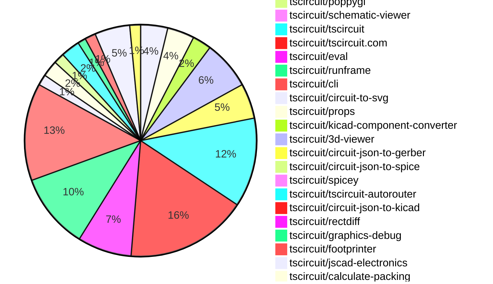
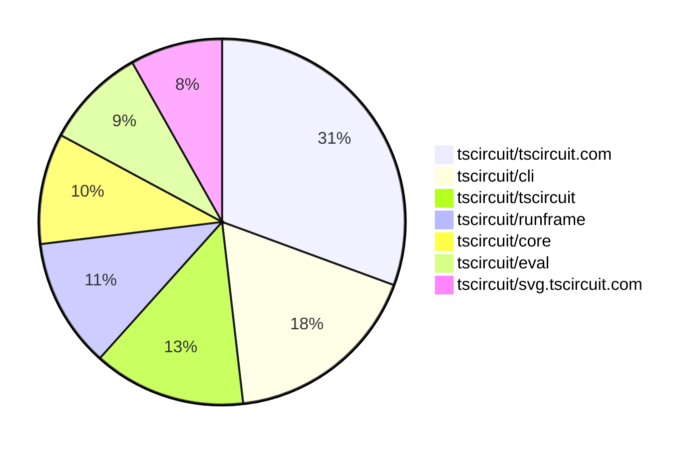

# contribution-tracker

[contributions.tscircuit.com](https://contributions.tscircuit.com) ・ [tscircuit.com](https://tscircuit.com) ・ [Contribution Overviews](./contribution-overviews/) ・ [Changelogs](./changelogs/)

Generates weekly contribution overviews for tscircuit contributors. Check out all
the [contribution overviews here](./contribution-overviews/)
You can find AI-generated monthly changelogs in the [changelogs directory](./changelogs/).

- All PRs in the tscircuit org are scanned/summarized via an LLM
- The LLM classifies each Diff/PR as into a set of attributes for scoring
- All the PRs, summaries, and classifications are organized into charts and tables for [the website](https://contributions.tscircuit.com)

> Want to run locally? See the [Development Section](#development)

The current week is shown below. There are 4 major sections:

- [Contributor Overview](#contributor-overview)
- [PRs by Repository](#prs-by-repository)
- [PRs by Contributor](#changes-by-contributor)
- [Scoring & Sponsorship System](#scoring--sponsorship-system)

## Current Week

<!-- START_CURRENT_WEEK -->

# Contribution Overview 2025-11-12

The current week is shown below. There are 4 major sections:

- [Contributor Overview](#contributor-overview)
- [PRs by Repository](#prs-by-repository)
- [PRs by Contributor](#changes-by-contributor)
- [Scoring & Sponsorship System](#scoring--sponsorship-system)

## PRs by Repository



## Contributor Overview

| Contributor | 🐳 Major | 🐙 Minor | 🐌 Tiny | ⭐ | Score | Discussion Contributions |
|-------------|---------|---------|---------|-----|----------------|--------------------------|
| [ShiboSoftwareDev](#ShiboSoftwareDev) | 3 | 13 | 8 | 👑 | 58 | 0🔹 0🔶 0💎 |
| [seveibar](#seveibar) | 4 | 4 | 10 | ⭐⭐⭐ | 49 | 0🔹 0🔶 0💎 |
| [ArnavK-09](#ArnavK-09) | 7 | 5 | 8 | ⭐⭐⭐ | 46 | 0🔹 0🔶 0💎 |
| [techmannih](#techmannih) | 3 | 2 | 5 | ⭐⭐⭐ | 33 | 0🔹 0🔶 0💎 |
| [imrishabh18](#imrishabh18) | 2 | 6 | 8 | ⭐⭐⭐ | 33 | 0🔹 0🔶 0💎 |
| [Ayushjhawar8](#Ayushjhawar8) | 2 | 7 | 1 | ⭐⭐ | 24 | 0🔹 0🔶 0💎 |
| [rushabhcodes](#rushabhcodes) | 0 | 2 | 11 | ⭐⭐ | 20 | 0🔹 0🔶 0💎 |
| [Abse2001](#Abse2001) | 3 | 1 | 2 | ⭐⭐ | 18 | 0🔹 0🔶 0💎 |
| [0hmX](#0hmX) | 3 | 0 | 4 | ⭐⭐ | 16 | 0🔹 0🔶 0💎 |
| [tscircuitbot](#tscircuitbot) | 0 | 0 | 145 | ⭐⭐ | 13.5 | 0🔹 0🔶 0💎 |
| [baeoc](#baeoc) | 0 | 1 | 4 | ⭐⭐ | 11 | 0🔹 0🔶 0💎 |
| [nailoo](#nailoo) | 0 | 1 | 3 | ⭐ | 10 | 0🔹 0🔶 0💎 |
| [RaghavArora14](#RaghavArora14) | 0 | 0 | 4 | ⭐ | 6 | 0🔹 0🔶 0💎 |
| [pxlpal](#pxlpal) | 1 | 0 | 0 | ⭐ | 4 | 0🔹 0🔶 0💎 |

> Note: AI evaluates PRs and assigns 1-3 star ratings automatically. 4 and 5 star ratings require manual staff review.

### Discussion Contribution Legend

- 🔹 Normal Comments: Basic participation with minimal effort
- 🔶 Great Informative Comments: Thoughtful participation that adds value
- 💎 Incredible Comments: Exceptional participation with high-quality content

## Review Table

[reviews-received-hover]: ## "Number of reviews received for PRs for this contributor"
[approvals-received-hover]: ## "Number of approvals received for PRs this contributor authored"
[rejections-received-hover]: ## "Number of rejections received for PRs this contributor authored"
[prs-opened-hover]: ## "Number of PRs opened by this contributor"
[issues-created-hover]: ## "Number of issues created by this contributor"
[bountied-issues-hover]: ## "Number of issues this contributor created with a bounty"
[bountied-issue-$-hover]: ## "Total bounty amount placed on issues authored by this contributor"

| Contributor | Reviews Received | Approvals Received | Rejections Received | Approvals | Rejections | PRs Opened | PRs Merged | Score | Issues Created | Bountied Issues | Bountied Issue $ |
|---|---|---|---|---|---|---|---|---|---|---|---|
| [Ayushjhawar8](#Ayushjhawar8) | 35 | 9 | 1 | 0 | 0 | 13 | 10 | 24 | 0 | 0 | 0 |
| [seveibar](#seveibar) | 8 | 0 | 0 | 64 | 9 | 27 | 18 | 49 | 0 | 0 | 0 |
| [tscircuitbot](#tscircuitbot) | 0 | 0 | 0 | 0 | 0 | 165 | 145 | 13.5 | 0 | 0 | 0 |
| [techmannih](#techmannih) | 19 | 10 | 0 | 8 | 1 | 12 | 10 | 33 | 0 | 0 | 0 |
| [imrishabh18](#imrishabh18) | 16 | 8 | 0 | 4 | 0 | 18 | 17 | 33 | 0 | 0 | 0 |
| [ShiboSoftwareDev](#ShiboSoftwareDev) | 27 | 17 | 1 | 13 | 0 | 27 | 24 | 58 | 0 | 0 | 0 |
| [rushabhcodes](#rushabhcodes) | 37 | 19 | 1 | 4 | 2 | 17 | 13 | 20 | 0 | 0 | 0 |
| [nailoo](#nailoo) | 8 | 4 | 2 | 2 | 2 | 5 | 4 | 10 | 0 | 0 | 0 |
| [RaghavArora14](#RaghavArora14) | 26 | 11 | 3 | 0 | 0 | 8 | 4 | 6 | 0 | 0 | 0 |
| [ArnavK-09](#ArnavK-09) | 8 | 2 | 0 | 0 | 0 | 23 | 21 | 46 | 0 | 0 | 0 |
| [Abse2001](#Abse2001) | 11 | 5 | 2 | 2 | 1 | 8 | 6 | 18 | 0 | 0 | 0 |
| [baeoc](#baeoc) | 9 | 6 | 0 | 1 | 2 | 5 | 5 | 11 | 0 | 0 | 0 |
| [Dasdebsankar54](#Dasdebsankar54) | 5 | 0 | 2 | 0 | 0 | 2 | 0 | 0 | 0 | 0 | 0 |
| [pxlpal](#pxlpal) | 1 | 1 | 0 | 0 | 0 | 1 | 1 | 4 | 0 | 0 | 0 |
| [0hmX](#0hmX) | 26 | 4 | 1 | 0 | 0 | 16 | 7 | 16 | 0 | 0 | 0 |
| [arduano](#arduano) | 4 | 0 | 2 | 0 | 0 | 1 | 0 | 0 | 0 | 0 | 0 |
| [Heinrich-XIAO](#Heinrich-XIAO) | 1 | 1 | 0 | 0 | 0 | 1 | 0 | 0 | 0 | 0 | 0 |
| [MustafaMulla29](#MustafaMulla29) | 0 | 0 | 0 | 0 | 0 | 0 | 0 | 0 | 0 | 0 | 0 |
| [Kunal-Darekar](#Kunal-Darekar) | 0 | 0 | 0 | 0 | 0 | 1 | 0 | 0 | 0 | 0 | 0 |
| [Enity300](#Enity300) | 3 | 1 | 2 | 0 | 0 | 1 | 0 | 0 | 0 | 0 | 0 |

## Top 7 Repositories by Contribution Points



## Scoring & Sponsorship System

### Overview

PRs are analyzed by AI and assigned a **star rating (1-3 stars)**. 4 and 5 star ratings can only be manually assigned by staff. Weekly scores use `2^(starRating - 1)` per PR (capped at 12 PRs per rating), plus review/discussion points.

### Weekly Score → Star String

| Score Range | Star String | Count Value |
|------------|-------------|-------------|
| 0-3 | (empty) | 0 stars |
| 4-10 | ⭐ | 1 star |
| 11-30 | ⭐⭐ | 2 stars |
| 31-50 | ⭐⭐⭐ | 3 stars |
| 51-75 | 👑 | 1 crown |
| 76-100 | 👑👑 | 2 crowns |
| 101+ | 👑👑👑 | 3 crowns |

> Crowns count as 3 stars for sponsorship.

### Monthly Sponsorship Calculation

The sponsorship system calculates monthly payments based on your **weekly star counts** over the complete weeks in that month (typically 4-5 weeks, Wednesday-Tuesday format).

**Step 1: Collect Weekly Stars**
- All complete weeks in the month are analyzed
- Each week's star string is converted to a numeric count (⭐ = 1 star, ⭐⭐⭐ = 3 stars)
- Example: `[2, 2, 2, 1, 0]` means 2 stars in week 1, 2 stars in week 2, etc.

**Step 2: Calculate Metrics**
- **Median stars**: The median value of all weekly star counts
- **Min stars**: The minimum weekly star count
- **Max stars**: The maximum weekly star count
- **High score**: The maximum raw weekly score (0-100+ range from the scoring table) from any week in the month

**Step 3: Determine Base Amount**
The sponsorship amount is calculated based on these metrics (checked in order):

| Condition | Base Amount |
|-----------|-------------|
| `minStarCount >= 3` | **$500** |
| `medianStars >= 3` | **$450** |
| `medianStars >= 2.5` | **$300** |
| `medianStars >= 2` | **$200** |
| `medianStars >= 1.5` | **$100** |
| `medianStars >= 1` | **$75** |
| `maxStarCount >= 2` | **$25** |
| `maxStarCount >= 1` | **$15** |
| `highScore >= 3` (and all stars = 0) | **$5** |

| Maintainer Level | Monthly Bonus |
|------------------|---------------|
| Level 1 | **$200** |
| Level 2 | **$350** |
| Level 3 | **$500** |

**Final Amount** = Base Amount + Maintainer Bonus

## Changes by Repository

### [tscircuit/pcb-viewer](https://github.com/tscircuit/pcb-viewer)

| PR # | Impact | Rating | Contributor | Description |
|------|--------|--------|-------------|-------------|
| [#477](https://github.com/tscircuit/pcb-viewer/pull/477) | 🐳 Major | ⭐⭐⭐ | Ayushjhawar8 | Adds a diagonal label for measurements in the DimensionOverlay component, displaying the distance in a visually distinct manner. |
| [#480](https://github.com/tscircuit/pcb-viewer/pull/480) | 🐙 Minor | ⭐⭐ | Ayushjhawar8 | Fixes incorrect snap points for rotated primitives in the PCB viewer, ensuring accurate alignment during design. |
| [#476](https://github.com/tscircuit/pcb-viewer/pull/476) | 🐙 Minor | ⭐⭐ | Ayushjhawar8 | Add origin snapping point for the dimension tool, allowing the PCB origin to be an always-available snapping target alongside element-derived anchors. |
| [#472](https://github.com/tscircuit/pcb-viewer/pull/472) | 🐙 Minor | ⭐⭐ | techmannih | Adds support for rectangular holes in PCB designs, allowing users to define rectangular hole shapes with specified dimensions in the PCB viewer. |

<details>
<summary>🐌 Tiny Contributions (6)</summary>

| PR # | Impact | Contributor | Description |
|------|--------|-------------|-------------|
| [#481](https://github.com/tscircuit/pcb-viewer/pull/481) | 🐌 Tiny | tscircuitbot | Automated package update |
| [#479](https://github.com/tscircuit/pcb-viewer/pull/479) | 🐌 Tiny | tscircuitbot | Automated package update |
| [#478](https://github.com/tscircuit/pcb-viewer/pull/478) | 🐌 Tiny | tscircuitbot | Automated package update |
| [#475](https://github.com/tscircuit/pcb-viewer/pull/475) | 🐌 Tiny | tscircuitbot | Automated package update |
| [#474](https://github.com/tscircuit/pcb-viewer/pull/474) | 🐌 Tiny | tscircuitbot | Automated package update |
| [#473](https://github.com/tscircuit/pcb-viewer/pull/473) | 🐌 Tiny | techmannih | Adds a center property to the PCB panel configuration, allowing for precise positioning of components within the panel. |

</details>

### [tscircuit/core](https://github.com/tscircuit/core)

| PR # | Impact | Rating | Contributor | Description |
|------|--------|--------|-------------|-------------|
| [#1650](https://github.com/tscircuit/core/pull/1650) | 🐳 Major | ⭐⭐⭐ | Ayushjhawar8 | Adds pcb_panel records with width, height, center, and solder mask coverage info, and upgrades circuit-json to v0.0.307. |
| [#1659](https://github.com/tscircuit/core/pull/1659) | 🐳 Major | ⭐⭐⭐ | techmannih | Adds support for a new hole shape with a polygon pad in the PlatedHole component, allowing for more complex PCB designs. |
| [#1655](https://github.com/tscircuit/core/pull/1655) | 🐙 Minor | ⭐⭐ | ShiboSoftwareDev | Adds a new SPICE analysis test for a half-bridge rectifier circuit using ngspice as the simulation engine. |
| [#1656](https://github.com/tscircuit/core/pull/1656) | 🐙 Minor | ⭐⭐ | ShiboSoftwareDev | Add support for inflating traces from subcircuit circuitJson, allowing pre-wired subcircuits to respect internal connections upon instantiation. |
| [#1651](https://github.com/tscircuit/core/pull/1651) | 🐙 Minor | ⭐⭐ | ShiboSoftwareDev | Adds support for inflating diode components when defined within a circuitJson property of a subcircuit. |
| [#1649](https://github.com/tscircuit/core/pull/1649) | 🐙 Minor | ⭐⭐ | ShiboSoftwareDev | Adds support for inflating inductor components when defined within a circuitJson property of a subcircuit. |
| [#1648](https://github.com/tscircuit/core/pull/1648) | 🐙 Minor | ⭐⭐ | ShiboSoftwareDev | Adds support for inflating capacitor components from circuitJson when used in a subcircuit |
| [#1653](https://github.com/tscircuit/core/pull/1653) | 🐙 Minor | ⭐⭐ | seveibar | Includes the component name and provided net identifier in the validation error messages for net names containing  or -. |
| [#1652](https://github.com/tscircuit/core/pull/1652) | 🐙 Minor | ⭐⭐ | seveibar | Fixes SmtPad rendering issue when port hints are omitted by defaulting to an empty hint list and adds regression tests for this functionality. |
| [#1663](https://github.com/tscircuit/core/pull/1663) | 🐙 Minor | ⭐⭐ | Abse2001 | Adds the ability for subcircuits to inflate transistor components from Circuit JSON. |

### [tscircuit/circuit-json](https://github.com/tscircuit/circuit-json)

| PR # | Impact | Rating | Contributor | Description |
|------|--------|--------|-------------|-------------|
| [#345](https://github.com/tscircuit/circuit-json/pull/345) | 🐳 Major | ⭐⭐⭐ | techmannih | Adds a new PCB hole type with a polygon pad schema and interface for enhanced design flexibility. |
| [#349](https://github.com/tscircuit/circuit-json/pull/349) | 🐳 Major | ⭐⭐⭐ | ShiboSoftwareDev | Removes redundant name field from schematic_voltage_probe and simulation_voltage_probe since its inherited from the source component, updates simulation_transient_voltage_graph to reference source_component_id instead of schematic_voltage_probe_id and simulation_voltage_probe_id for cleaner data model, and updates tests to reflect the new structure. |
| [#350](https://github.com/tscircuit/circuit-json/pull/350) | 🐙 Minor | ⭐⭐ | Ayushjhawar8 | Adds optional pcb_board_id and pcb_panel_id fields to the pcb_cutout interface for enhanced PCB cutout identification. |
| [#344](https://github.com/tscircuit/circuit-json/pull/344) | 🐙 Minor | ⭐⭐ | Ayushjhawar8 | Adds a required center point to the pcb_panel schema and TypeScript interface, and updates tests to include the center position. |
| [#351](https://github.com/tscircuit/circuit-json/pull/351) | 🐙 Minor | ⭐⭐ | ShiboSoftwareDev | Adds an optional color property to simulation voltage probes, schematic voltage probes, and simulation transient voltage graphs, enabling custom color styling for voltage measurements in visualizations. |
| [#348](https://github.com/tscircuit/circuit-json/pull/348) | 🐙 Minor | ⭐⭐ | ShiboSoftwareDev | Add new source_simple_voltage_probe component to represent voltage probes at the source level and add source_component_id field to simulation_voltage_probe and schematic_voltage_probe for linking. |
| [#347](https://github.com/tscircuit/circuit-json/pull/347) | 🐙 Minor | ⭐⭐ | ShiboSoftwareDev | Adds an optional name property to SchematicVoltageProbe for identifying simulation results associated with that probe. |

### [tscircuit/svg.tscircuit.com](https://github.com/tscircuit/svg.tscircuit.com)

| PR # | Impact | Rating | Contributor | Description |
|------|--------|--------|-------------|-------------|
| [#588](https://github.com/tscircuit/svg.tscircuit.com/pull/588) | 🐙 Minor | ⭐⭐ | Ayushjhawar8 | Changes the grid and section colors in the 3D PNG rendering function and allows for a customizable background color via query parameters. |
| [#580](https://github.com/tscircuit/svg.tscircuit.com/pull/580) | 🐙 Minor | ⭐⭐ | imrishabh18 | Adds an offset y position to the infinite grid rendering functionality, allowing for better positioning in 3D views. |

<details>
<summary>🐌 Tiny Contributions (16)</summary>

| PR # | Impact | Contributor | Description |
|------|--------|-------------|-------------|
| [#596](https://github.com/tscircuit/svg.tscircuit.com/pull/596) | 🐌 Tiny | tscircuitbot | Updates the tscircuit package version from 0.0.906 to 0.0.907 in package.json |
| [#595](https://github.com/tscircuit/svg.tscircuit.com/pull/595) | 🐌 Tiny | tscircuitbot | Updates the tscircuit package version from 0.0.905 to 0.0.906 in package.json |
| [#594](https://github.com/tscircuit/svg.tscircuit.com/pull/594) | 🐌 Tiny | tscircuitbot | Updates the tscircuit package version from 0.0.904 to 0.0.905 in package.json |
| [#593](https://github.com/tscircuit/svg.tscircuit.com/pull/593) | 🐌 Tiny | tscircuitbot | Updates the tscircuit package version from 0.0.902 to 0.0.904 in package.json |
| [#592](https://github.com/tscircuit/svg.tscircuit.com/pull/592) | 🐌 Tiny | tscircuitbot | Updates the tscircuit package version from 0.0.901 to 0.0.902 in package.json |
| [#591](https://github.com/tscircuit/svg.tscircuit.com/pull/591) | 🐌 Tiny | tscircuitbot | Updates the tscircuit package version from 0.0.900 to 0.0.901 in package.json |
| [#590](https://github.com/tscircuit/svg.tscircuit.com/pull/590) | 🐌 Tiny | tscircuitbot | Updates the tscircuit package version from 0.0.899 to 0.0.900 in package.json |
| [#589](https://github.com/tscircuit/svg.tscircuit.com/pull/589) | 🐌 Tiny | tscircuitbot | Updates the tscircuit package version from 0.0.898 to 0.0.899 in package.json |
| [#587](https://github.com/tscircuit/svg.tscircuit.com/pull/587) | 🐌 Tiny | tscircuitbot | Updates the tscircuit package version from 0.0.897 to 0.0.898 in package.json |
| [#586](https://github.com/tscircuit/svg.tscircuit.com/pull/586) | 🐌 Tiny | tscircuitbot | Updates the tscircuit package version from 0.0.896 to 0.0.897 in package.json |
| [#585](https://github.com/tscircuit/svg.tscircuit.com/pull/585) | 🐌 Tiny | tscircuitbot | Updates the tscircuit package version from 0.0.895 to 0.0.896 in package.json |
| [#584](https://github.com/tscircuit/svg.tscircuit.com/pull/584) | 🐌 Tiny | tscircuitbot | Updates the tscircuit package version from 0.0.893 to 0.0.895 in package.json |
| [#583](https://github.com/tscircuit/svg.tscircuit.com/pull/583) | 🐌 Tiny | tscircuitbot | Automated package update |
| [#582](https://github.com/tscircuit/svg.tscircuit.com/pull/582) | 🐌 Tiny | tscircuitbot | Updates the tscircuit package version from 0.0.891 to 0.0.892 in package.json |
| [#581](https://github.com/tscircuit/svg.tscircuit.com/pull/581) | 🐌 Tiny | tscircuitbot | Automated package update |
| [#579](https://github.com/tscircuit/svg.tscircuit.com/pull/579) | 🐌 Tiny | imrishabh18 | Updates the circuit-json-to-gltf package to version 0.0.37, fixing the issue of overlapping infinite grid rendering in the application. |

</details>

### [tscircuit/docs](https://github.com/tscircuit/docs)

| PR # | Impact | Rating | Contributor | Description |
|------|--------|--------|-------------|-------------|
| [#329](https://github.com/tscircuit/docs/pull/329) | 🐳 Major | ⭐⭐⭐ | ShiboSoftwareDev | Adds a verticalStack prop to the CircuitPreview component, allowing for a vertical layout with the image preview on top of the code editor, and updates SPICE simulation examples to utilize this layout while hiding PCB and 3D tabs. |
| [#335](https://github.com/tscircuit/docs/pull/335) | 🐙 Minor | ⭐⭐ | Ayushjhawar8 | Fixes the issue of infinite grid lines in the 3D rendering of PCBs by adding a background color parameter to the SVG generation URL. |
| [#332](https://github.com/tscircuit/docs/pull/332) | 🐙 Minor | ⭐⭐ | baeoc | Fixes rendering issues in 3D and PCB views by adding a board tag to the VAI component. |

<details>
<summary>🐌 Tiny Contributions (10)</summary>

| PR # | Impact | Contributor | Description |
|------|--------|-------------|-------------|
| [#330](https://github.com/tscircuit/docs/pull/330) | 🐌 Tiny | imrishabh18 | Updates the flowchart to include the connection from Runframe to tscircuit.com in the documentation. |
| [#333](https://github.com/tscircuit/docs/pull/333) | 🐌 Tiny | ShiboSoftwareDev | Adds a new SPICE simulation example for a half-wave rectifier circuit and introduces a new Diodes category in the documentation. |
| [#328](https://github.com/tscircuit/docs/pull/328) | 🐌 Tiny | ShiboSoftwareDev | Adds a new documentation page with an example of using a switch  component in a SPICE simulation and updates the introduction to include details on the switch  components simulation-specific properties. |
| [#326](https://github.com/tscircuit/docs/pull/326) | 🐌 Tiny | ShiboSoftwareDev | Refactors the SPICE simulation documentation by moving it from the Advanced section to a new, dedicated SPICE Simulation category within the Guides, splitting the content into separate files for better organization and direct linking to examples. |
| [#325](https://github.com/tscircuit/docs/pull/325) | 🐌 Tiny | ShiboSoftwareDev | Adds an RC charging circuit example to the SPICE simulation documentation and clarifies the default spice engine used in the documentation. |
| [#336](https://github.com/tscircuit/docs/pull/336) | 🐌 Tiny | seveibar | Replaces references to kicad-mod-converter with kicad-component-converter and documents the ability to import .kicad_mod files directly in TSX. |
| [#327](https://github.com/tscircuit/docs/pull/327) | 🐌 Tiny | seveibar | Add a board property reference table that includes schematicDisabled and move the schematic-disabled guidance into a tip callout with the existing example. |
| [#331](https://github.com/tscircuit/docs/pull/331) | 🐌 Tiny | nailoo | Fixes rendering issues in the 3D view by adding a board tag to the silkscreen rectangle component. |
| [#324](https://github.com/tscircuit/docs/pull/324) | 🐌 Tiny | nailoo | Fixes the PCB and 3D view representation for the Manufacturer Part Number documentation by adding a name attribute to the diode component. |
| [#334](https://github.com/tscircuit/docs/pull/334) | 🐌 Tiny | baeoc | Fixes rendering issue in 3D view by adding a board tag to the silkscreencircle component. |

</details>

### [tscircuit/poppygl](https://github.com/tscircuit/poppygl)

| PR # | Impact | Rating | Contributor | Description |
|------|--------|--------|-------------|-------------|
| [#21](https://github.com/tscircuit/poppygl/pull/21) | 🐙 Minor | ⭐⭐ | Ayushjhawar8 | Adds support to parse hex string for backgroundColor in rendering options, allowing users to specify background colors in hex format. |

### [tscircuit/schematic-viewer](https://github.com/tscircuit/schematic-viewer)


<details>
<summary>🐌 Tiny Contributions (1)</summary>

| PR # | Impact | Contributor | Description |
|------|--------|-------------|-------------|
| [#146](https://github.com/tscircuit/schematic-viewer/pull/146) | 🐌 Tiny | Ayushjhawar8 | Add descriptive tooltips to the schematic viewers control icons to explain their actions |

</details>

### [tscircuit/tscircuit](https://github.com/tscircuit/tscircuit)


<details>
<summary>🐌 Tiny Contributions (33)</summary>

| PR # | Impact | Contributor | Description |
|------|--------|-------------|-------------|
| [#1356](https://github.com/tscircuit/tscircuit/pull/1356) | 🐌 Tiny | tscircuitbot | Automated package update |
| [#1355](https://github.com/tscircuit/tscircuit/pull/1355) | 🐌 Tiny | tscircuitbot | Updates the tscircuitcli package to version 0.1.498 in the package.json file. |
| [#1354](https://github.com/tscircuit/tscircuit/pull/1354) | 🐌 Tiny | tscircuitbot | Automated package update |
| [#1353](https://github.com/tscircuit/tscircuit/pull/1353) | 🐌 Tiny | tscircuitbot | Updates the tscircuitcli package to version 0.1.497 in the package.json file. |
| [#1352](https://github.com/tscircuit/tscircuit/pull/1352) | 🐌 Tiny | tscircuitbot | Automated package update |
| [#1351](https://github.com/tscircuit/tscircuit/pull/1351) | 🐌 Tiny | tscircuitbot | Automated package update |
| [#1350](https://github.com/tscircuit/tscircuit/pull/1350) | 🐌 Tiny | tscircuitbot | Automated package update |
| [#1349](https://github.com/tscircuit/tscircuit/pull/1349) | 🐌 Tiny | tscircuitbot | Updates the tscircuitcli package from version 0.1.494 to 0.1.495 and the tscircuitrunframe package from version 0.0.1255 to 0.0.1256 in package.json |
| [#1347](https://github.com/tscircuit/tscircuit/pull/1347) | 🐌 Tiny | tscircuitbot | Automated package update |
| [#1346](https://github.com/tscircuit/tscircuit/pull/1346) | 🐌 Tiny | tscircuitbot | Automated package update |
| [#1345](https://github.com/tscircuit/tscircuit/pull/1345) | 🐌 Tiny | tscircuitbot | Automated package update |
| [#1344](https://github.com/tscircuit/tscircuit/pull/1344) | 🐌 Tiny | tscircuitbot | Automated package update |
| [#1343](https://github.com/tscircuit/tscircuit/pull/1343) | 🐌 Tiny | tscircuitbot | Automated package update |
| [#1342](https://github.com/tscircuit/tscircuit/pull/1342) | 🐌 Tiny | tscircuitbot | Automated package update |
| [#1341](https://github.com/tscircuit/tscircuit/pull/1341) | 🐌 Tiny | tscircuitbot | Automated package update |
| [#1340](https://github.com/tscircuit/tscircuit/pull/1340) | 🐌 Tiny | tscircuitbot | Automated package update |
| [#1339](https://github.com/tscircuit/tscircuit/pull/1339) | 🐌 Tiny | tscircuitbot | Automated package update |
| [#1338](https://github.com/tscircuit/tscircuit/pull/1338) | 🐌 Tiny | tscircuitbot | Automated package update |
| [#1337](https://github.com/tscircuit/tscircuit/pull/1337) | 🐌 Tiny | tscircuitbot | Updates the tscircuitcli package from version 0.1.488 to 0.1.489 and the tscircuitrunframe package from version 0.0.1249 to 0.0.1250 in package.json |
| [#1335](https://github.com/tscircuit/tscircuit/pull/1335) | 🐌 Tiny | tscircuitbot | Automated package update |
| [#1334](https://github.com/tscircuit/tscircuit/pull/1334) | 🐌 Tiny | tscircuitbot | Automated package update |
| [#1333](https://github.com/tscircuit/tscircuit/pull/1333) | 🐌 Tiny | tscircuitbot | Automated package update |
| [#1332](https://github.com/tscircuit/tscircuit/pull/1332) | 🐌 Tiny | tscircuitbot | Automated package update |
| [#1331](https://github.com/tscircuit/tscircuit/pull/1331) | 🐌 Tiny | tscircuitbot | Automated package update |
| [#1328](https://github.com/tscircuit/tscircuit/pull/1328) | 🐌 Tiny | tscircuitbot | Automated package update |
| [#1327](https://github.com/tscircuit/tscircuit/pull/1327) | 🐌 Tiny | tscircuitbot | Automated package update |
| [#1326](https://github.com/tscircuit/tscircuit/pull/1326) | 🐌 Tiny | tscircuitbot | Automated package update |
| [#1325](https://github.com/tscircuit/tscircuit/pull/1325) | 🐌 Tiny | tscircuitbot | Automated package update |
| [#1324](https://github.com/tscircuit/tscircuit/pull/1324) | 🐌 Tiny | tscircuitbot | Automated package update |
| [#1323](https://github.com/tscircuit/tscircuit/pull/1323) | 🐌 Tiny | tscircuitbot | Automated package update |
| [#1322](https://github.com/tscircuit/tscircuit/pull/1322) | 🐌 Tiny | tscircuitbot | Automated package update |
| [#1321](https://github.com/tscircuit/tscircuit/pull/1321) | 🐌 Tiny | tscircuitbot | Automated package update |
| [#1330](https://github.com/tscircuit/tscircuit/pull/1330) | 🐌 Tiny | imrishabh18 | Updates the versions of the tscircuitcli and tscircuiteval dependencies in package.json |

</details>

### [tscircuit/tscircuit.com](https://github.com/tscircuit/tscircuit.com)

| PR # | Impact | Rating | Contributor | Description |
|------|--------|--------|-------------|-------------|
| [#2004](https://github.com/tscircuit/tscircuit.com/pull/2004) | 🐳 Major | ⭐⭐⭐ | imrishabh18 | Fixes the image preview functionality by fetching images from package files instead of relying on URLs. |
| [#2032](https://github.com/tscircuit/tscircuit.com/pull/2032) | 🐳 Major | ⭐⭐⭐ | ArnavK-09 | Changes the organization setting from name to tscircuit_handle in the organization settings page and related hooks. |
| [#2025](https://github.com/tscircuit/tscircuit.com/pull/2025) | 🐳 Major | ⭐⭐⭐ | ArnavK-09 | Adds organization debug information to the settings page, including details like Organization ID, Owner Account ID, and Member Count. |
| [#2019](https://github.com/tscircuit/tscircuit.com/pull/2019) | 🐳 Major | ⭐⭐⭐ | ArnavK-09 | Changes organization filtering to use account_id instead of github_handle for unauthenticated users, enhancing the APIs flexibility in user organization retrieval. |
| [#2018](https://github.com/tscircuit/tscircuit.com/pull/2018) | 🐳 Major | ⭐⭐⭐ | ArnavK-09 | Prevents the display of a double dialog in the editor when the tscircuit handle is not set, prompting the user to set it before saving a package. |
| [#2009](https://github.com/tscircuit/tscircuit.com/pull/2009) | 🐳 Major | ⭐⭐⭐ | ArnavK-09 | Adds an optional tscircuit_handle parameter to the account retrieval process, allowing for more flexible package star management. |
| [#1998](https://github.com/tscircuit/tscircuit.com/pull/1998) | 🐳 Major | ⭐⭐⭐ | ArnavK-09 | Adds functionality for managing tscircuit_handle, including validation, updates, and a dialog for users to set their handle if not already done. |
| [#1992](https://github.com/tscircuit/tscircuit.com/pull/1992) | 🐳 Major | ⭐⭐⭐ | pxlpal | Adds support for updating the user handle and redirects users to a settings page if the handle is not set after authentication. |
| [#2035](https://github.com/tscircuit/tscircuit.com/pull/2035) | 🐙 Minor | ⭐⭐ | imrishabh18 | Fixes error handling to display full error messages from the backend instead of generic messages. |
| [#2036](https://github.com/tscircuit/tscircuit.com/pull/2036) | 🐙 Minor | ⭐⭐ | ArnavK-09 | Fixes logic for authentication checks in the organization list API to ensure proper handling of unauthenticated requests with filters. |
| [#2031](https://github.com/tscircuit/tscircuit.com/pull/2031) | 🐙 Minor | ⭐⭐ | ArnavK-09 | Changes routing to use tscircuit_handle instead of organization name, affecting how organizations are identified in the application. |
| [#2011](https://github.com/tscircuit/tscircuit.com/pull/2011) | 🐙 Minor | ⭐⭐ | ArnavK-09 | Adds an optional tscircuit_handle parameter to the account retrieval API, allowing users to fetch accounts using this handle. |
| [#2016](https://github.com/tscircuit/tscircuit.com/pull/2016) | 🐙 Minor | ⭐⭐ | ArnavK-09 | Changes the organization creation form to use tscircuit_handle instead of account_id and updates validation messages and layout for better responsiveness. |
| [#2007](https://github.com/tscircuit/tscircuit.com/pull/2007) | 🐙 Minor | ⭐⭐ | ArnavK-09 | Fixes an error that occurs during the sign-out process in the application. |

<details>
<summary>🐌 Tiny Contributions (31)</summary>

| PR # | Impact | Contributor | Description |
|------|--------|-------------|-------------|
| [#2037](https://github.com/tscircuit/tscircuit.com/pull/2037) | 🐌 Tiny | tscircuitbot | Automated package update |
| [#2033](https://github.com/tscircuit/tscircuit.com/pull/2033) | 🐌 Tiny | tscircuitbot | Automated package update to version 0.0.147 |
| [#2027](https://github.com/tscircuit/tscircuit.com/pull/2027) | 🐌 Tiny | tscircuitbot | Automated package update |
| [#2023](https://github.com/tscircuit/tscircuit.com/pull/2023) | 🐌 Tiny | tscircuitbot | Automated package update to version 0.0.145 |
| [#2021](https://github.com/tscircuit/tscircuit.com/pull/2021) | 🐌 Tiny | tscircuitbot | Updates the tscircuiteval package from version 0.0.475 to 0.0.476 |
| [#2020](https://github.com/tscircuit/tscircuit.com/pull/2020) | 🐌 Tiny | tscircuitbot | Automated package update |
| [#2017](https://github.com/tscircuit/tscircuit.com/pull/2017) | 🐌 Tiny | tscircuitbot | Automated package update to version 0.0.143 |
| [#2012](https://github.com/tscircuit/tscircuit.com/pull/2012) | 🐌 Tiny | tscircuitbot | Automated package update |
| [#2006](https://github.com/tscircuit/tscircuit.com/pull/2006) | 🐌 Tiny | tscircuitbot | Updates the tscircuiteval package from version 0.0.474 to 0.0.475 |
| [#2005](https://github.com/tscircuit/tscircuit.com/pull/2005) | 🐌 Tiny | tscircuitbot | Automated package update to version 0.0.141 |
| [#2003](https://github.com/tscircuit/tscircuit.com/pull/2003) | 🐌 Tiny | tscircuitbot | Updates the tscircuiteval package from version 0.0.473 to 0.0.474 |
| [#2002](https://github.com/tscircuit/tscircuit.com/pull/2002) | 🐌 Tiny | tscircuitbot | Automated package update |
| [#2001](https://github.com/tscircuit/tscircuit.com/pull/2001) | 🐌 Tiny | tscircuitbot | Updates the tscircuiteval package from version 0.0.471 to 0.0.472 |
| [#2000](https://github.com/tscircuit/tscircuit.com/pull/2000) | 🐌 Tiny | tscircuitbot | Automated package update |
| [#1994](https://github.com/tscircuit/tscircuit.com/pull/1994) | 🐌 Tiny | tscircuitbot | Updates the tscircuiteval package to version 0.0.471 in the package.json file. |
| [#1993](https://github.com/tscircuit/tscircuit.com/pull/1993) | 🐌 Tiny | tscircuitbot | Updates the tscircuiteval package to version 0.0.470 in package.json |
| [#1990](https://github.com/tscircuit/tscircuit.com/pull/1990) | 🐌 Tiny | tscircuitbot | Updates the tscircuiteval package to version 0.0.469 in the package.json file. |
| [#1988](https://github.com/tscircuit/tscircuit.com/pull/1988) | 🐌 Tiny | tscircuitbot | Automated package update |
| [#1987](https://github.com/tscircuit/tscircuit.com/pull/1987) | 🐌 Tiny | tscircuitbot | Automated package update |
| [#1996](https://github.com/tscircuit/tscircuit.com/pull/1996) | 🐌 Tiny | techmannih | Updates the tscircuitpcb-viewer package to version 1.11.256 in the package.json file. |
| [#1997](https://github.com/tscircuit/tscircuit.com/pull/1997) | 🐌 Tiny | techmannih | Updates the tscircuit3d-viewer dependency to version 0.0.435 in package.json |
| [#1991](https://github.com/tscircuit/tscircuit.com/pull/1991) | 🐌 Tiny | imrishabh18 | Removes the build step status list from the releases sidebar on the package view page and eliminates the transpilation and circuit JSON build status helpers that fed the sidebar list. |
| [#1981](https://github.com/tscircuit/tscircuit.com/pull/1981) | 🐌 Tiny | imrishabh18 | Removes the logs section for transpilation, circuit JSON build, and image generation from the package release overview, retaining only user code logs. |
| [#2030](https://github.com/tscircuit/tscircuit.com/pull/2030) | 🐌 Tiny | ArnavK-09 | Fixes minor logic errors in filtering organizations based on user account and improves the handling of session state in the HeaderLogin component. |
| [#2034](https://github.com/tscircuit/tscircuit.com/pull/2034) | 🐌 Tiny | ArnavK-09 | Updates the visibility of organization profile tabs based on the users session state, showing or hiding tabs accordingly. |
| [#2026](https://github.com/tscircuit/tscircuit.com/pull/2026) | 🐌 Tiny | ArnavK-09 | Refactors the organization update logic in settings to improve validation and error handling for organization name and display name. |
| [#2024](https://github.com/tscircuit/tscircuit.com/pull/2024) | 🐌 Tiny | ArnavK-09 | Fixes overflow issue in the organization header component by adjusting Tailwind CSS classes for proper layout. |
| [#2013](https://github.com/tscircuit/tscircuit.com/pull/2013) | 🐌 Tiny | ArnavK-09 | Refines the dashboard layout for new organization accounts, enhancing user interface elements and overall presentation. |
| [#2014](https://github.com/tscircuit/tscircuit.com/pull/2014) | 🐌 Tiny | ArnavK-09 | Fixes error handling in the useAxios hook to correctly retrieve error codes from the response data. |
| [#2015](https://github.com/tscircuit/tscircuit.com/pull/2015) | 🐌 Tiny | ArnavK-09 | Changes the organization creation form to use handle instead of name and enhances layout responsiveness for better user experience. |
| [#2008](https://github.com/tscircuit/tscircuit.com/pull/2008) | 🐌 Tiny | ArnavK-09 | Replaces the existing avatar component with a new GithubAvatarWithFallback component for improved user avatar handling in user settings. |

</details>

### [tscircuit/eval](https://github.com/tscircuit/eval)

| PR # | Impact | Rating | Contributor | Description |
|------|--------|--------|-------------|-------------|
| [#1516](https://github.com/tscircuit/eval/pull/1516) | 🐙 Minor | ⭐⭐ | imrishabh18 | Adds support for a custom node modules resolver to allow dynamic resolution of modules not present in the filesystem map. |
| [#1495](https://github.com/tscircuit/eval/pull/1495) | 🐙 Minor | ⭐⭐ | imrishabh18 | Add support for importing kicad_pcb files directly into the circuit simulation environment. |

<details>
<summary>🐌 Tiny Contributions (18)</summary>

| PR # | Impact | Contributor | Description |
|------|--------|-------------|-------------|
| [#1528](https://github.com/tscircuit/eval/pull/1528) | 🐌 Tiny | tscircuitbot | Automated package update to version 0.0.476 |
| [#1527](https://github.com/tscircuit/eval/pull/1527) | 🐌 Tiny | tscircuitbot | Automated package update |
| [#1525](https://github.com/tscircuit/eval/pull/1525) | 🐌 Tiny | tscircuitbot | Automated package update |
| [#1524](https://github.com/tscircuit/eval/pull/1524) | 🐌 Tiny | tscircuitbot | Automated package update |
| [#1522](https://github.com/tscircuit/eval/pull/1522) | 🐌 Tiny | tscircuitbot | Automated package update |
| [#1521](https://github.com/tscircuit/eval/pull/1521) | 🐌 Tiny | tscircuitbot | Automated package update |
| [#1520](https://github.com/tscircuit/eval/pull/1520) | 🐌 Tiny | tscircuitbot | Automated package update |
| [#1518](https://github.com/tscircuit/eval/pull/1518) | 🐌 Tiny | tscircuitbot | Automated package update |
| [#1517](https://github.com/tscircuit/eval/pull/1517) | 🐌 Tiny | tscircuitbot | Automated package update |
| [#1515](https://github.com/tscircuit/eval/pull/1515) | 🐌 Tiny | tscircuitbot | Automated package update |
| [#1514](https://github.com/tscircuit/eval/pull/1514) | 🐌 Tiny | tscircuitbot | Automated package update |
| [#1511](https://github.com/tscircuit/eval/pull/1511) | 🐌 Tiny | tscircuitbot | Automated package update |
| [#1510](https://github.com/tscircuit/eval/pull/1510) | 🐌 Tiny | tscircuitbot | Automated package update |
| [#1508](https://github.com/tscircuit/eval/pull/1508) | 🐌 Tiny | tscircuitbot | Automated package update |
| [#1507](https://github.com/tscircuit/eval/pull/1507) | 🐌 Tiny | tscircuitbot | Automated package update |
| [#1506](https://github.com/tscircuit/eval/pull/1506) | 🐌 Tiny | tscircuitbot | Updates the version of the tscircuitcore package from 0.0.860 to 0.0.861 in package.json |
| [#1504](https://github.com/tscircuit/eval/pull/1504) | 🐌 Tiny | tscircuitbot | Automated package update |
| [#1503](https://github.com/tscircuit/eval/pull/1503) | 🐌 Tiny | tscircuitbot | Updates the version of the tscircuitcore package from 0.0.859 to 0.0.860 in package.json |

</details>

### [tscircuit/runframe](https://github.com/tscircuit/runframe)


<details>
<summary>🐌 Tiny Contributions (28)</summary>

| PR # | Impact | Contributor | Description |
|------|--------|-------------|-------------|
| [#1791](https://github.com/tscircuit/runframe/pull/1791) | 🐌 Tiny | tscircuitbot | Updates the package version from 0.0.1256 to 0.0.1257 in package.json |
| [#1790](https://github.com/tscircuit/runframe/pull/1790) | 🐌 Tiny | tscircuitbot | Updates the tscircuitpcb-viewer package from version 1.11.260 to 1.11.261 |
| [#1788](https://github.com/tscircuit/runframe/pull/1788) | 🐌 Tiny | tscircuitbot | Automated package update to version 0.0.1256 |
| [#1786](https://github.com/tscircuit/runframe/pull/1786) | 🐌 Tiny | tscircuitbot | Automated package update |
| [#1784](https://github.com/tscircuit/runframe/pull/1784) | 🐌 Tiny | tscircuitbot | Updates the package version from 0.0.1253 to 0.0.1254 in package.json |
| [#1783](https://github.com/tscircuit/runframe/pull/1783) | 🐌 Tiny | tscircuitbot | Automated package update |
| [#1782](https://github.com/tscircuit/runframe/pull/1782) | 🐌 Tiny | tscircuitbot | Automated package version bump from 0.0.1252 to 0.0.1253 |
| [#1781](https://github.com/tscircuit/runframe/pull/1781) | 🐌 Tiny | tscircuitbot | Updates the tscircuitpcb-viewer package from version 1.11.259 to 1.11.260 |
| [#1779](https://github.com/tscircuit/runframe/pull/1779) | 🐌 Tiny | tscircuitbot | Automated package update |
| [#1778](https://github.com/tscircuit/runframe/pull/1778) | 🐌 Tiny | tscircuitbot | Updates the tscircuitpcb-viewer package from version 1.11.258 to 1.11.259 |
| [#1776](https://github.com/tscircuit/runframe/pull/1776) | 🐌 Tiny | tscircuitbot | Automated package update |
| [#1772](https://github.com/tscircuit/runframe/pull/1772) | 🐌 Tiny | tscircuitbot | Automated package update |
| [#1771](https://github.com/tscircuit/runframe/pull/1771) | 🐌 Tiny | tscircuitbot | Updates the tscircuitpcb-viewer package from version 1.11.257 to 1.11.258 |
| [#1770](https://github.com/tscircuit/runframe/pull/1770) | 🐌 Tiny | tscircuitbot | Updates the package version from 0.0.1248 to 0.0.1249 in package.json |
| [#1769](https://github.com/tscircuit/runframe/pull/1769) | 🐌 Tiny | tscircuitbot | Updates the tscircuitpcb-viewer package from version 1.11.256 to 1.11.257 |
| [#1767](https://github.com/tscircuit/runframe/pull/1767) | 🐌 Tiny | tscircuitbot | Automated package update |
| [#1766](https://github.com/tscircuit/runframe/pull/1766) | 🐌 Tiny | tscircuitbot | Automated package update for tscircuit3d-viewer from version 0.0.434 to 0.0.435 |
| [#1763](https://github.com/tscircuit/runframe/pull/1763) | 🐌 Tiny | tscircuitbot | Automated package update |
| [#1762](https://github.com/tscircuit/runframe/pull/1762) | 🐌 Tiny | tscircuitbot | Updates the tscircuiteval package to version 0.0.468 in the package.json file. |
| [#1761](https://github.com/tscircuit/runframe/pull/1761) | 🐌 Tiny | tscircuitbot | Automated package update |
| [#1760](https://github.com/tscircuit/runframe/pull/1760) | 🐌 Tiny | tscircuitbot | Updates the tscircuiteval package to version 0.0.467 in the package.json file. |
| [#1759](https://github.com/tscircuit/runframe/pull/1759) | 🐌 Tiny | tscircuitbot | Updates the package version from 0.0.1244 to 0.0.1245 in package.json |
| [#1758](https://github.com/tscircuit/runframe/pull/1758) | 🐌 Tiny | tscircuitbot | Updates the tscircuitschematic-viewer package from version 2.0.48 to 2.0.49 |
| [#1756](https://github.com/tscircuit/runframe/pull/1756) | 🐌 Tiny | tscircuitbot | Automated package update |
| [#1775](https://github.com/tscircuit/runframe/pull/1775) | 🐌 Tiny | imrishabh18 | Updates the UPSTREAM_REPOS environment variable to include tscircuit.com, allowing for integration with the specified repository. |
| [#1785](https://github.com/tscircuit/runframe/pull/1785) | 🐌 Tiny | seveibar | Ensures RunFrame pushEvent uses the shared API_BASE so event creation requests hit the correct path |
| [#1755](https://github.com/tscircuit/runframe/pull/1755) | 🐌 Tiny | seveibar | Updates the circuit-json-to-kicad dependency to version 0.0.25 and refreshes the lockfile to track the new version. |
| [#1787](https://github.com/tscircuit/runframe/pull/1787) | 🐌 Tiny | Abse2001 | Fixes GLTF export mirroring issue caused by incorrect axis handling during export, ensuring correct board orientation in external viewers. |

</details>

### [tscircuit/cli](https://github.com/tscircuit/cli)

| PR # | Impact | Rating | Contributor | Description |
|------|--------|--------|-------------|-------------|
| [#923](https://github.com/tscircuit/cli/pull/923) | 🐳 Major | ⭐⭐⭐ | imrishabh18 | Adds support for the tsci install command to install project dependencies and generate a package.json file if needed. |
| [#941](https://github.com/tscircuit/cli/pull/941) | 🐳 Major | ⭐⭐⭐ | ArnavK-09 | Adds support for generating KiCad project files and footprint libraries from circuit JSON data, enabling users to create KiCad-compatible designs directly from the CLI. |
| [#954](https://github.com/tscircuit/cli/pull/954) | 🐙 Minor | ⭐⭐ | imrishabh18 | Adds support for local packages to be used by the circuit during development, allowing for the upload of local node_modules dependencies when files change. |

<details>
<summary>🐌 Tiny Contributions (33)</summary>

| PR # | Impact | Contributor | Description |
|------|--------|-------------|-------------|
| [#955](https://github.com/tscircuit/cli/pull/955) | 🐌 Tiny | tscircuitbot | Automated package update |
| [#952](https://github.com/tscircuit/cli/pull/952) | 🐌 Tiny | tscircuitbot | Automated package update |
| [#951](https://github.com/tscircuit/cli/pull/951) | 🐌 Tiny | tscircuitbot | Automated package update |
| [#950](https://github.com/tscircuit/cli/pull/950) | 🐌 Tiny | tscircuitbot | Updates the tscircuitrunframe package from version 0.0.1256 to 0.0.1257 |
| [#949](https://github.com/tscircuit/cli/pull/949) | 🐌 Tiny | tscircuitbot | Automated package update |
| [#948](https://github.com/tscircuit/cli/pull/948) | 🐌 Tiny | tscircuitbot | Updates the tscircuitrunframe package from version 0.0.1255 to 0.0.1256 |
| [#947](https://github.com/tscircuit/cli/pull/947) | 🐌 Tiny | tscircuitbot | Automated package update |
| [#946](https://github.com/tscircuit/cli/pull/946) | 🐌 Tiny | tscircuitbot | Updates the tscircuitrunframe package from version 0.0.1254 to 0.0.1255 |
| [#945](https://github.com/tscircuit/cli/pull/945) | 🐌 Tiny | tscircuitbot | Automated package update |
| [#944](https://github.com/tscircuit/cli/pull/944) | 🐌 Tiny | tscircuitbot | Updates the tscircuitrunframe package from version 0.0.1253 to 0.0.1254 |
| [#943](https://github.com/tscircuit/cli/pull/943) | 🐌 Tiny | tscircuitbot | Automated package update |
| [#942](https://github.com/tscircuit/cli/pull/942) | 🐌 Tiny | tscircuitbot | Automated package update |
| [#940](https://github.com/tscircuit/cli/pull/940) | 🐌 Tiny | tscircuitbot | Automated package update |
| [#939](https://github.com/tscircuit/cli/pull/939) | 🐌 Tiny | tscircuitbot | Updates the tscircuitrunframe package from version 0.0.1251 to 0.0.1252 |
| [#938](https://github.com/tscircuit/cli/pull/938) | 🐌 Tiny | tscircuitbot | Automated package update |
| [#937](https://github.com/tscircuit/cli/pull/937) | 🐌 Tiny | tscircuitbot | Updates the tscircuitrunframe package from version 0.0.1250 to 0.0.1251 |
| [#936](https://github.com/tscircuit/cli/pull/936) | 🐌 Tiny | tscircuitbot | Automated package update |
| [#935](https://github.com/tscircuit/cli/pull/935) | 🐌 Tiny | tscircuitbot | Updates the tscircuitrunframe package from version 0.0.1249 to 0.0.1250 |
| [#934](https://github.com/tscircuit/cli/pull/934) | 🐌 Tiny | tscircuitbot | Automated package update |
| [#933](https://github.com/tscircuit/cli/pull/933) | 🐌 Tiny | tscircuitbot | Automated package update |
| [#932](https://github.com/tscircuit/cli/pull/932) | 🐌 Tiny | tscircuitbot | Automated package update |
| [#931](https://github.com/tscircuit/cli/pull/931) | 🐌 Tiny | tscircuitbot | Updates the tscircuitrunframe package to version 0.0.1248 |
| [#930](https://github.com/tscircuit/cli/pull/930) | 🐌 Tiny | tscircuitbot | Automated package update |
| [#928](https://github.com/tscircuit/cli/pull/928) | 🐌 Tiny | tscircuitbot | Automated package update |
| [#927](https://github.com/tscircuit/cli/pull/927) | 🐌 Tiny | tscircuitbot | Automated package update |
| [#926](https://github.com/tscircuit/cli/pull/926) | 🐌 Tiny | tscircuitbot | Automated package update |
| [#925](https://github.com/tscircuit/cli/pull/925) | 🐌 Tiny | tscircuitbot | Automated package update |
| [#924](https://github.com/tscircuit/cli/pull/924) | 🐌 Tiny | tscircuitbot | Updates the tscircuitrunframe package from version 0.0.1245 to 0.0.1246 |
| [#922](https://github.com/tscircuit/cli/pull/922) | 🐌 Tiny | tscircuitbot | Automated package update |
| [#921](https://github.com/tscircuit/cli/pull/921) | 🐌 Tiny | tscircuitbot | Updates the tscircuitrunframe package to version 0.0.1245 |
| [#920](https://github.com/tscircuit/cli/pull/920) | 🐌 Tiny | tscircuitbot | Automated package update |
| [#919](https://github.com/tscircuit/cli/pull/919) | 🐌 Tiny | tscircuitbot | Updates the tscircuitrunframe package from version 0.0.1242 to 0.0.1244 |
| [#929](https://github.com/tscircuit/cli/pull/929) | 🐌 Tiny | imrishabh18 | Adds tscircuit as a development dependency in package.json to facilitate development processes. |

</details>

### [tscircuit/circuit-to-svg](https://github.com/tscircuit/circuit-to-svg)

| PR # | Impact | Rating | Contributor | Description |
|------|--------|--------|-------------|-------------|
| [#420](https://github.com/tscircuit/circuit-to-svg/pull/420) | 🐳 Major | ⭐⭐⭐ | techmannih | Adds support for rendering plated holes with polygon pads in SVG format, including various hole shapes such as circle, oval, pill, and rotated pill. |
| [#422](https://github.com/tscircuit/circuit-to-svg/pull/422) | 🐳 Major | ⭐⭐⭐ | ShiboSoftwareDev | Updates the schematic SVG rendering to support the name property on schematic voltage probes, displaying the name as the probes label and formatting it with voltage if present. |

<details>
<summary>🐌 Tiny Contributions (2)</summary>

| PR # | Impact | Contributor | Description |
|------|--------|-------------|-------------|
| [#421](https://github.com/tscircuit/circuit-to-svg/pull/421) | 🐌 Tiny | techmannih | Adds center coordinates for PCB panels in the panel configuration. |
| [#423](https://github.com/tscircuit/circuit-to-svg/pull/423) | 🐌 Tiny | ShiboSoftwareDev | Adjusts the alignment of schematic voltage probe labels to be left-aligned and modifies the arrow position to point to the name when both name and voltage are present. |

</details>

### [tscircuit/props](https://github.com/tscircuit/props)

| PR # | Impact | Rating | Contributor | Description |
|------|--------|--------|-------------|-------------|
| [#497](https://github.com/tscircuit/props/pull/497) | 🐙 Minor | ⭐⭐ | techmannih | Adds the HoleWithPolygonPadPlatedHoleProps interface to define properties for a new type of plated hole with polygon pads in PCB layouts. |
| [#495](https://github.com/tscircuit/props/pull/495) | 🐙 Minor | ⭐⭐ | imrishabh18 | Adds a new property nodeModulesResolver to the PlatformConfig interface, allowing for custom resolution of module paths. |
| [#501](https://github.com/tscircuit/props/pull/501) | 🐙 Minor | ⭐⭐ | ShiboSoftwareDev | Adds an optional color prop to the VoltageProbe component to allow customization of voltage probe colors in circuit visualizations |
| [#494](https://github.com/tscircuit/props/pull/494) | 🐙 Minor | ⭐⭐ | seveibar | Add an optional circuitJson property to the footprint  component API and schema |

<details>
<summary>🐌 Tiny Contributions (2)</summary>

| PR # | Impact | Contributor | Description |
|------|--------|-------------|-------------|
| [#496](https://github.com/tscircuit/props/pull/496) | 🐌 Tiny | imrishabh18 | Changes the return type of nodeModulesResolver to allow null when modules are not found, improving error handling. |
| [#499](https://github.com/tscircuit/props/pull/499) | 🐌 Tiny | seveibar | Add curated footprinter string examples so the footprint prop can offer autocomplete suggestions that include every defaulted property, wire the new examples into the public exports, update the footprint prop typing, and refresh the type-focused test. |

</details>

### [tscircuit/kicad-component-converter](https://github.com/tscircuit/kicad-component-converter)


<details>
<summary>🐌 Tiny Contributions (2)</summary>

| PR # | Impact | Contributor | Description |
|------|--------|-------------|-------------|
| [#169](https://github.com/tscircuit/kicad-component-converter/pull/169) | 🐌 Tiny | techmannih | Fixes drill hole alignment for the RP2040 footprint in the KiCad component converter. |
| [#166](https://github.com/tscircuit/kicad-component-converter/pull/166) | 🐌 Tiny | seveibar | Adds the RP2040 Zero footprint fixture and a test that captures an SVG snapshot of the footprint. |

</details>

### [tscircuit/3d-viewer](https://github.com/tscircuit/3d-viewer)

| PR # | Impact | Rating | Contributor | Description |
|------|--------|--------|-------------|-------------|
| [#570](https://github.com/tscircuit/3d-viewer/pull/570) | 🐙 Minor | ⭐⭐ | ShiboSoftwareDev | Adds support for rendering pcb_panel elements in the 3D viewer, allowing the viewer to render the panel outline instead of individual board outlines while displaying all components, pads, traces, and silkscreen at their correct positions. |

<details>
<summary>🐌 Tiny Contributions (1)</summary>

| PR # | Impact | Contributor | Description |
|------|--------|-------------|-------------|
| [#569](https://github.com/tscircuit/3d-viewer/pull/569) | 🐌 Tiny | seveibar | This pull request introduces an orthogonal camera option to the 3D viewer, allowing users to switch between perspective and orthographic views. It also refactors the camera controller to use a context-based approach, improving the overall architecture and maintainability of the code. The changes include updates to various components to support the new camera type and ensure that camera settings are persisted in local storage. |

</details>

### [tscircuit/circuit-json-to-gerber](https://github.com/tscircuit/circuit-json-to-gerber)

| PR # | Impact | Rating | Contributor | Description |
|------|--------|--------|-------------|-------------|
| [#65](https://github.com/tscircuit/circuit-json-to-gerber/pull/65) | 🐙 Minor | ⭐⭐ | ShiboSoftwareDev | Adds support for rendering PCB panels containing multiple boards. |

### [tscircuit/circuit-json-to-spice](https://github.com/tscircuit/circuit-json-to-spice)

| PR # | Impact | Rating | Contributor | Description |
|------|--------|--------|-------------|-------------|
| [#24](https://github.com/tscircuit/circuit-json-to-spice/pull/24) | 🐙 Minor | ⭐⭐ | ShiboSoftwareDev | Fixes node name case in PRINT statements to match probe names exactly, ensuring consistency between node naming in the netlist and PRINT output. |
| [#23](https://github.com/tscircuit/circuit-json-to-spice/pull/23) | 🐙 Minor | ⭐⭐ | ShiboSoftwareDev | Modifies SPICE netlist generation to use names from simulation_voltage_probe elements for node naming, ensuring more readable and predictable netlists. |

<details>
<summary>🐌 Tiny Contributions (2)</summary>

| PR # | Impact | Contributor | Description |
|------|--------|-------------|-------------|
| [#21](https://github.com/tscircuit/circuit-json-to-spice/pull/21) | 🐌 Tiny | ShiboSoftwareDev | Updates the versions of dependencies in package.json to the latest compatible versions. |
| [#22](https://github.com/tscircuit/circuit-json-to-spice/pull/22) | 🐌 Tiny | ShiboSoftwareDev | Increases the timeout for bun tests in the workflow configuration to prevent premature test failures. |

</details>

### [tscircuit/spicey](https://github.com/tscircuit/spicey)


<details>
<summary>🐌 Tiny Contributions (1)</summary>

| PR # | Impact | Contributor | Description |
|------|--------|-------------|-------------|
| [#19](https://github.com/tscircuit/spicey/pull/19) | 🐌 Tiny | ShiboSoftwareDev | Removes the V() wrapper from simulation graph names to display node names as received, resulting in cleaner graph displays. |

</details>

### [tscircuit/tscircuit-autorouter](https://github.com/tscircuit/tscircuit-autorouter)

| PR # | Impact | Rating | Contributor | Description |
|------|--------|--------|-------------|-------------|
| [#316](https://github.com/tscircuit/tscircuit-autorouter/pull/316) | 🐳 Major | ⭐⭐⭐ | seveibar | Propagates SimpleRouteJson.minViaDiameter through the autorouting pipeline to ensure high-density solvers and stitchers honor configurable via sizing, updates capacity estimation, intra-node, and via possibility solvers to accept injected via diameters, and refreshes utilities and simplified path visualization to render vias with the configured diameter. |
| [#314](https://github.com/tscircuit/tscircuit-autorouter/pull/314) | 🐳 Major | ⭐⭐⭐ | seveibar | Add manual bug report ID input fallback to allow users to load reports when the URL lacks parameters, enabling parsing of URLs or raw IDs from user input and updating the page state accordingly. |
| [#318](https://github.com/tscircuit/tscircuit-autorouter/pull/318) | 🐳 Major | ⭐⭐⭐ | 0hmX | Keeps the original node in the straw nodes list if no new straw nodes are created during the autorouting process. |

<details>
<summary>🐌 Tiny Contributions (4)</summary>

| PR # | Impact | Contributor | Description |
|------|--------|-------------|-------------|
| [#313](https://github.com/tscircuit/tscircuit-autorouter/pull/313) | 🐌 Tiny | seveibar | This pull request introduces a new test template and adds a bug report fixture for testing purposes. The new files include a JSON representation of a bug report and a corresponding React component that utilizes this data for testing the autorouting pipeline. |
| [#312](https://github.com/tscircuit/tscircuit-autorouter/pull/312) | 🐌 Tiny | 0hmX | Updates the test template for bug report tests to use the AutoroutingPipelineSolver and snapshot testing. |
| [#311](https://github.com/tscircuit/tscircuit-autorouter/pull/311) | 🐌 Tiny | 0hmX | ref: https:github.comtscircuittscircuit-autorouterissues296 |
| [#303](https://github.com/tscircuit/tscircuit-autorouter/pull/303) | 🐌 Tiny | 0hmX | Updates the bun version in multiple GitHub workflows from latest to 1.3.1 for consistent dependency management. |

</details>

### [tscircuit/circuit-json-to-kicad](https://github.com/tscircuit/circuit-json-to-kicad)

| PR # | Impact | Rating | Contributor | Description |
|------|--------|--------|-------------|-------------|
| [#33](https://github.com/tscircuit/circuit-json-to-kicad/pull/33) | 🐳 Major | ⭐⭐⭐ | seveibar | Builds the KiCad net list from source netstraces keyed by each subcircuit_connectivity_map_key, propagates connectivity-derived net metadata to traces, vias, and footprint pads so rats nests appear in KiCad, and adds a regression test that asserts nets are created from connectivity keys and referenced across pads, segments, and vias. |

<details>
<summary>🐌 Tiny Contributions (1)</summary>

| PR # | Impact | Contributor | Description |
|------|--------|-------------|-------------|
| [#34](https://github.com/tscircuit/circuit-json-to-kicad/pull/34) | 🐌 Tiny | seveibar | Add a web interface for uploading Circuit JSON files and converting them to KiCad format, along with improvements for generating deterministic UUIDs for components. |

</details>

### [tscircuit/rectdiff](https://github.com/tscircuit/rectdiff)

| PR # | Impact | Rating | Contributor | Description |
|------|--------|--------|-------------|-------------|
| [#1](https://github.com/tscircuit/rectdiff/pull/1) | 🐳 Major | ⭐⭐⭐ | seveibar | This pull request introduces several enhancements and fixes to the RectDiffSolver and related components. Key changes include improvements to the rendering of 3D visualizations, adjustments to the handling of mesh nodes, and optimizations in the solvers logic for better performance and accuracy. The changes aim to enhance the user experience and improve the overall functionality of the rectdiff library. |

### [tscircuit/graphics-debug](https://github.com/tscircuit/graphics-debug)

| PR # | Impact | Rating | Contributor | Description |
|------|--------|--------|-------------|-------------|
| [#80](https://github.com/tscircuit/graphics-debug/pull/80) | 🐳 Major | ⭐⭐⭐ | 0hmX | Adds support for rendering arrows in the graphics library, including properties for start and end points, color, and optional double-sided heads. |
| [#81](https://github.com/tscircuit/graphics-debug/pull/81) | 🐙 Minor | ⭐⭐ | seveibar | Fixes SVG line stroke width scaling by applying the transformation matrix to the stroke width when rendering SVG elements. |

<details>
<summary>🐌 Tiny Contributions (1)</summary>

| PR # | Impact | Contributor | Description |
|------|--------|-------------|-------------|
| [#82](https://github.com/tscircuit/graphics-debug/pull/82) | 🐌 Tiny | seveibar | Changes the default background color to white in the SVG generation function and updates related snapshots in tests. |

</details>

### [tscircuit/footprinter](https://github.com/tscircuit/footprinter)

| PR # | Impact | Rating | Contributor | Description |
|------|--------|--------|-------------|-------------|
| [#421](https://github.com/tscircuit/footprinter/pull/421) | 🐙 Minor | ⭐⭐ | rushabhcodes | Adds support for the SOT-963 package to the codebase, including implementation, export, and comprehensive tests to ensure parity with KiCad and correct SVG output. |

<details>
<summary>🐌 Tiny Contributions (3)</summary>

| PR # | Impact | Contributor | Description |
|------|--------|-------------|-------------|
| [#420](https://github.com/tscircuit/footprinter/pull/420) | 🐌 Tiny | rushabhcodes | Changes the default width of SOT-89 from 4.80mm to 4.20mm, adjusts pad positions, updates SVG snapshots, and creates new test files for footprint validation against KiCad. |
| [#418](https://github.com/tscircuit/footprinter/pull/418) | 🐌 Tiny | rushabhcodes | Updates the SOT-363 footprint parameters and adds a test for visual parity with KiCads footprint using automated SVG comparisons. |
| [#424](https://github.com/tscircuit/footprinter/pull/424) | 🐌 Tiny | RaghavArora14 | Adds support for the SOT-886 (XSON6) package by introducing a new footprint definition and related functionality in the footprinter module. |

</details>

### [tscircuit/jscad-electronics](https://github.com/tscircuit/jscad-electronics)

| PR # | Impact | Rating | Contributor | Description |
|------|--------|--------|-------------|-------------|
| [#228](https://github.com/tscircuit/jscad-electronics/pull/228) | 🐙 Minor | ⭐⭐ | rushabhcodes | Adjusts the notch position calculation for several component footprint renderers to ensure the notch is placed on the correct side of the body by inverting the x coordinate for the notchPosition property. |
| [#232](https://github.com/tscircuit/jscad-electronics/pull/232) | 🐙 Minor | ⭐⭐ | nailoo | Fixes CAD model rendering issue where models intersect with pads instead of being positioned on top of them. |

<details>
<summary>🐌 Tiny Contributions (11)</summary>

| PR # | Impact | Contributor | Description |
|------|--------|-------------|-------------|
| [#233](https://github.com/tscircuit/jscad-electronics/pull/233) | 🐌 Tiny | rushabhcodes | Adds support for the SOD-323FL diode package, enabling rendering and testing of its 3D footprint with an example and automated test. |
| [#225](https://github.com/tscircuit/jscad-electronics/pull/225) | 🐌 Tiny | rushabhcodes | Adds support for the SOD323F diode package, including its 3D model implementation, integration into the renderer, and example and snapshot tests. |
| [#224](https://github.com/tscircuit/jscad-electronics/pull/224) | 🐌 Tiny | rushabhcodes | Adds support for the SOD323 diode package, enabling rendering and usage in 3D models and related tests. |
| [#223](https://github.com/tscircuit/jscad-electronics/pull/223) | 🐌 Tiny | rushabhcodes | Adds support for the SOD-128 diode footprint, including its 3D model, integration into footprint selection, and test coverage. |
| [#222](https://github.com/tscircuit/jscad-electronics/pull/222) | 🐌 Tiny | rushabhcodes | Adds support for the SOD123W diode package to the 3D footprint rendering system, including implementation of the new component, integration into footprint selection logic, and addition of a snapshot test for rendering verification. |
| [#221](https://github.com/tscircuit/jscad-electronics/pull/221) | 🐌 Tiny | rushabhcodes | Adds support for the SOT23W footprint, including 3D rendering and snapshot tests for the component. |
| [#217](https://github.com/tscircuit/jscad-electronics/pull/217) | 🐌 Tiny | rushabhcodes | Adds support for the SOT-457 surface-mount package to the 3D footprint rendering system, including a new component, integration into rendering logic, and corresponding tests and examples. |
| [#214](https://github.com/tscircuit/jscad-electronics/pull/214) | 🐌 Tiny | rushabhcodes | Adds support for the TO92 package to the 3D footprint rendering library, including implementation of the TO92 component, integration into the footprint renderer, and addition of an example and snapshot test. |
| [#219](https://github.com/tscircuit/jscad-electronics/pull/219) | 🐌 Tiny | rushabhcodes | Adds support for the SOT-363 surface-mount package to the 3D footprint rendering system, including a new component, example usage, and snapshot test for visual regression. |
| [#226](https://github.com/tscircuit/jscad-electronics/pull/226) | 🐌 Tiny | RaghavArora14 | Implements pin 1 color differentiation in ExtrudedPads component to make it easier to visually verify correct component orientation. |
| [#212](https://github.com/tscircuit/jscad-electronics/pull/212) | 🐌 Tiny | RaghavArora14 | Adds support for the MS-013 MSOP package to the 3D footprint rendering system by introducing a new component, integrating it into the renderer, and providing example usage and tests. |

</details>

### [tscircuit/calculate-packing](https://github.com/tscircuit/calculate-packing)

| PR # | Impact | Rating | Contributor | Description |
|------|--------|--------|-------------|-------------|
| [#68](https://github.com/tscircuit/calculate-packing/pull/68) | 🐳 Major | ⭐⭐⭐ | Abse2001 | This PR improves the packing pipeline by automatically detecting board-level elements that are not part of the component tree and adding them as packing obstacles. Key Changes Introduced getElementsOutsideTree() to detect plated holes and other PCB elements not included in the circuit tree. Added these elements to packOutput.obstacles, ensuring pack solvers respect board-level geometry. Defaulted opts.obstacles to an empty array for safer merging. Updated repro pages and tests to demonstrate the new behavior. This ensures pack placement no longer overlaps with board-level plated holes or outline geometry, fixing incorrect placements and improving solver stability. |

<details>
<summary>🐌 Tiny Contributions (1)</summary>

| PR # | Impact | Contributor | Description |
|------|--------|-------------|-------------|
| [#69](https://github.com/tscircuit/calculate-packing/pull/69) | 🐌 Tiny | RaghavArora14 | Removes examples that are not loading from the algorithm visualizations. |

</details>

### [tscircuit/kicad-to-circuit-json](https://github.com/tscircuit/kicad-to-circuit-json)

| PR # | Impact | Rating | Contributor | Description |
|------|--------|--------|-------------|-------------|
| [#25](https://github.com/tscircuit/kicad-to-circuit-json/pull/25) | 🐳 Major | ⭐⭐⭐ | Abse2001 | Adds a dedicated infer-component-type module for component-type detection and transistor polarity identification in KiCad footprint processing. |
| [#24](https://github.com/tscircuit/kicad-to-circuit-json/pull/24) | 🐳 Major | ⭐⭐⭐ | Abse2001 | This PR enhances the KiCad-to-CircuitJSON converter by introducing full source_component creation, automatic referencevalue extraction, component-type inference, and stable UUID-based mapping. It also fixes source-port assignment by correctly linking ports to their corresponding source_component_id. New helpers were added for reading footprint referencesvalues, inferring component types, and tracking footprint UUID  source component relationships. |

### [tscircuit/sparkfun-boards](https://github.com/tscircuit/sparkfun-boards)


<details>
<summary>🐌 Tiny Contributions (1)</summary>

| PR # | Impact | Contributor | Description |
|------|--------|-------------|-------------|
| [#204](https://github.com/tscircuit/sparkfun-boards/pull/204) | 🐌 Tiny | Abse2001 | This pull request updates the tscircuit dependency to enhance the PCB schematic and 3D snapshots for various SparkFun boards. The changes include modifications to the 3D snapshot images and PCB representations, ensuring better visualization and accuracy in the design files. |

</details>

### [tscircuit/circuit-json-to-gltf](https://github.com/tscircuit/circuit-json-to-gltf)


<details>
<summary>🐌 Tiny Contributions (4)</summary>

| PR # | Impact | Contributor | Description |
|------|--------|-------------|-------------|
| [#80](https://github.com/tscircuit/circuit-json-to-gltf/pull/80) | 🐌 Tiny | nailoo | Updates the circuit-json dependency to version 0.0.309 and modifies related code to handle non-null assertions for width and height properties in PCB calculations. |
| [#79](https://github.com/tscircuit/circuit-json-to-gltf/pull/79) | 🐌 Tiny | baeoc | Adds a test case that reproduces the rendering of a silkscreen circle in the circuit board. |
| [#77](https://github.com/tscircuit/circuit-json-to-gltf/pull/77) | 🐌 Tiny | baeoc | Adds a test to reproduce the behavior of silkscreen text font sizing in circuit rendering. |
| [#78](https://github.com/tscircuit/circuit-json-to-gltf/pull/78) | 🐌 Tiny | baeoc | Updates the bun version in the GitHub workflow configuration to 1.3.1 from the latest version. |

</details>

### [tscircuit/schematic-trace-solver](https://github.com/tscircuit/schematic-trace-solver)

| PR # | Impact | Rating | Contributor | Description |
|------|--------|--------|-------------|-------------|
| [#97](https://github.com/tscircuit/schematic-trace-solver/pull/97) | 🐳 Major | ⭐⭐⭐ | 0hmX | Fixes the issue of trace looping in schematic trace routing by implementing a two-phase overlap avoidance strategy. |

### [tscircuit/trace-capacity-visualizer](https://github.com/tscircuit/trace-capacity-visualizer)


<details>
<summary>🐌 Tiny Contributions (1)</summary>

| PR # | Impact | Contributor | Description |
|------|--------|-------------|-------------|
| [#1](https://github.com/tscircuit/trace-capacity-visualizer/pull/1) | 🐌 Tiny | 0hmX | Initial setup of project files including configuration for development tools and a basic example page. |

</details>

## Changes by Contributor

### [Ayushjhawar8](https://github.com/Ayushjhawar8)

| PRs # | Impact | Rating | Description |
|------|--------|--------|-------------|
| [#477](https://github.com/tscircuit/pcb-viewer/pull/477) | 🐳 Major | ⭐⭐⭐ | Adds a diagonal label for measurements in the DimensionOverlay component, displaying the distance in a visually distinct manner. |
| [#1650](https://github.com/tscircuit/core/pull/1650) | 🐳 Major | ⭐⭐⭐ | Adds pcb_panel records with width, height, center, and solder mask coverage info, and upgrades circuit-json to v0.0.307. |
| [#480](https://github.com/tscircuit/pcb-viewer/pull/480) | 🐙 Minor | ⭐⭐ | Fixes incorrect snap points for rotated primitives in the PCB viewer, ensuring accurate alignment during design. |
| [#476](https://github.com/tscircuit/pcb-viewer/pull/476) | 🐙 Minor | ⭐⭐ | Add origin snapping point for the dimension tool, allowing the PCB origin to be an always-available snapping target alongside element-derived anchors. |
| [#350](https://github.com/tscircuit/circuit-json/pull/350) | 🐙 Minor | ⭐⭐ | Adds optional pcb_board_id and pcb_panel_id fields to the pcb_cutout interface for enhanced PCB cutout identification. |
| [#344](https://github.com/tscircuit/circuit-json/pull/344) | 🐙 Minor | ⭐⭐ | Adds a required center point to the pcb_panel schema and TypeScript interface, and updates tests to include the center position. |
| [#588](https://github.com/tscircuit/svg.tscircuit.com/pull/588) | 🐙 Minor | ⭐⭐ | Changes the grid and section colors in the 3D PNG rendering function and allows for a customizable background color via query parameters. |
| [#335](https://github.com/tscircuit/docs/pull/335) | 🐙 Minor | ⭐⭐ | Fixes the issue of infinite grid lines in the 3D rendering of PCBs by adding a background color parameter to the SVG generation URL. |
| [#21](https://github.com/tscircuit/poppygl/pull/21) | 🐙 Minor | ⭐⭐ | Adds support to parse hex string for backgroundColor in rendering options, allowing users to specify background colors in hex format. |

<details>
<summary>🐌 Tiny Contributions (1)</summary>

| PR # | Impact | Description |
|------|--------|-------------|
| [#146](https://github.com/tscircuit/schematic-viewer/pull/146) | 🐌 Tiny | Add descriptive tooltips to the schematic viewers control icons to explain their actions |

</details>

### [tscircuitbot](https://github.com/tscircuitbot)


<details>
<summary>🐌 Tiny Contributions (145)</summary>

| PR # | Impact | Description |
|------|--------|-------------|
| [#481](https://github.com/tscircuit/pcb-viewer/pull/481) | 🐌 Tiny | Automated package update |
| [#479](https://github.com/tscircuit/pcb-viewer/pull/479) | 🐌 Tiny | Automated package update |
| [#478](https://github.com/tscircuit/pcb-viewer/pull/478) | 🐌 Tiny | Automated package update |
| [#475](https://github.com/tscircuit/pcb-viewer/pull/475) | 🐌 Tiny | Automated package update |
| [#474](https://github.com/tscircuit/pcb-viewer/pull/474) | 🐌 Tiny | Automated package update |
| [#1356](https://github.com/tscircuit/tscircuit/pull/1356) | 🐌 Tiny | Automated package update |
| [#1355](https://github.com/tscircuit/tscircuit/pull/1355) | 🐌 Tiny | Updates the tscircuitcli package to version 0.1.498 in the package.json file. |
| [#1354](https://github.com/tscircuit/tscircuit/pull/1354) | 🐌 Tiny | Automated package update |
| [#1353](https://github.com/tscircuit/tscircuit/pull/1353) | 🐌 Tiny | Updates the tscircuitcli package to version 0.1.497 in the package.json file. |
| [#1352](https://github.com/tscircuit/tscircuit/pull/1352) | 🐌 Tiny | Automated package update |
| [#1351](https://github.com/tscircuit/tscircuit/pull/1351) | 🐌 Tiny | Automated package update |
| [#1350](https://github.com/tscircuit/tscircuit/pull/1350) | 🐌 Tiny | Automated package update |
| [#1349](https://github.com/tscircuit/tscircuit/pull/1349) | 🐌 Tiny | Updates the tscircuitcli package from version 0.1.494 to 0.1.495 and the tscircuitrunframe package from version 0.0.1255 to 0.0.1256 in package.json |
| [#1347](https://github.com/tscircuit/tscircuit/pull/1347) | 🐌 Tiny | Automated package update |
| [#1346](https://github.com/tscircuit/tscircuit/pull/1346) | 🐌 Tiny | Automated package update |
| [#1345](https://github.com/tscircuit/tscircuit/pull/1345) | 🐌 Tiny | Automated package update |
| [#1344](https://github.com/tscircuit/tscircuit/pull/1344) | 🐌 Tiny | Automated package update |
| [#1343](https://github.com/tscircuit/tscircuit/pull/1343) | 🐌 Tiny | Automated package update |
| [#1342](https://github.com/tscircuit/tscircuit/pull/1342) | 🐌 Tiny | Automated package update |
| [#1341](https://github.com/tscircuit/tscircuit/pull/1341) | 🐌 Tiny | Automated package update |
| [#1340](https://github.com/tscircuit/tscircuit/pull/1340) | 🐌 Tiny | Automated package update |
| [#1339](https://github.com/tscircuit/tscircuit/pull/1339) | 🐌 Tiny | Automated package update |
| [#1338](https://github.com/tscircuit/tscircuit/pull/1338) | 🐌 Tiny | Automated package update |
| [#1337](https://github.com/tscircuit/tscircuit/pull/1337) | 🐌 Tiny | Updates the tscircuitcli package from version 0.1.488 to 0.1.489 and the tscircuitrunframe package from version 0.0.1249 to 0.0.1250 in package.json |
| [#1335](https://github.com/tscircuit/tscircuit/pull/1335) | 🐌 Tiny | Automated package update |
| [#1334](https://github.com/tscircuit/tscircuit/pull/1334) | 🐌 Tiny | Automated package update |
| [#1333](https://github.com/tscircuit/tscircuit/pull/1333) | 🐌 Tiny | Automated package update |
| [#1332](https://github.com/tscircuit/tscircuit/pull/1332) | 🐌 Tiny | Automated package update |
| [#1331](https://github.com/tscircuit/tscircuit/pull/1331) | 🐌 Tiny | Automated package update |
| [#1328](https://github.com/tscircuit/tscircuit/pull/1328) | 🐌 Tiny | Automated package update |
| [#1327](https://github.com/tscircuit/tscircuit/pull/1327) | 🐌 Tiny | Automated package update |
| [#1326](https://github.com/tscircuit/tscircuit/pull/1326) | 🐌 Tiny | Automated package update |
| [#1325](https://github.com/tscircuit/tscircuit/pull/1325) | 🐌 Tiny | Automated package update |
| [#1324](https://github.com/tscircuit/tscircuit/pull/1324) | 🐌 Tiny | Automated package update |
| [#1323](https://github.com/tscircuit/tscircuit/pull/1323) | 🐌 Tiny | Automated package update |
| [#1322](https://github.com/tscircuit/tscircuit/pull/1322) | 🐌 Tiny | Automated package update |
| [#1321](https://github.com/tscircuit/tscircuit/pull/1321) | 🐌 Tiny | Automated package update |
| [#2037](https://github.com/tscircuit/tscircuit.com/pull/2037) | 🐌 Tiny | Automated package update |
| [#2033](https://github.com/tscircuit/tscircuit.com/pull/2033) | 🐌 Tiny | Automated package update to version 0.0.147 |
| [#2027](https://github.com/tscircuit/tscircuit.com/pull/2027) | 🐌 Tiny | Automated package update |
| [#2023](https://github.com/tscircuit/tscircuit.com/pull/2023) | 🐌 Tiny | Automated package update to version 0.0.145 |
| [#2021](https://github.com/tscircuit/tscircuit.com/pull/2021) | 🐌 Tiny | Updates the tscircuiteval package from version 0.0.475 to 0.0.476 |
| [#2020](https://github.com/tscircuit/tscircuit.com/pull/2020) | 🐌 Tiny | Automated package update |
| [#2017](https://github.com/tscircuit/tscircuit.com/pull/2017) | 🐌 Tiny | Automated package update to version 0.0.143 |
| [#2012](https://github.com/tscircuit/tscircuit.com/pull/2012) | 🐌 Tiny | Automated package update |
| [#2006](https://github.com/tscircuit/tscircuit.com/pull/2006) | 🐌 Tiny | Updates the tscircuiteval package from version 0.0.474 to 0.0.475 |
| [#2005](https://github.com/tscircuit/tscircuit.com/pull/2005) | 🐌 Tiny | Automated package update to version 0.0.141 |
| [#2003](https://github.com/tscircuit/tscircuit.com/pull/2003) | 🐌 Tiny | Updates the tscircuiteval package from version 0.0.473 to 0.0.474 |
| [#2002](https://github.com/tscircuit/tscircuit.com/pull/2002) | 🐌 Tiny | Automated package update |
| [#2001](https://github.com/tscircuit/tscircuit.com/pull/2001) | 🐌 Tiny | Updates the tscircuiteval package from version 0.0.471 to 0.0.472 |
| [#2000](https://github.com/tscircuit/tscircuit.com/pull/2000) | 🐌 Tiny | Automated package update |
| [#1994](https://github.com/tscircuit/tscircuit.com/pull/1994) | 🐌 Tiny | Updates the tscircuiteval package to version 0.0.471 in the package.json file. |
| [#1993](https://github.com/tscircuit/tscircuit.com/pull/1993) | 🐌 Tiny | Updates the tscircuiteval package to version 0.0.470 in package.json |
| [#1990](https://github.com/tscircuit/tscircuit.com/pull/1990) | 🐌 Tiny | Updates the tscircuiteval package to version 0.0.469 in the package.json file. |
| [#1988](https://github.com/tscircuit/tscircuit.com/pull/1988) | 🐌 Tiny | Automated package update |
| [#1987](https://github.com/tscircuit/tscircuit.com/pull/1987) | 🐌 Tiny | Automated package update |
| [#1528](https://github.com/tscircuit/eval/pull/1528) | 🐌 Tiny | Automated package update to version 0.0.476 |
| [#1527](https://github.com/tscircuit/eval/pull/1527) | 🐌 Tiny | Automated package update |
| [#1525](https://github.com/tscircuit/eval/pull/1525) | 🐌 Tiny | Automated package update |
| [#1524](https://github.com/tscircuit/eval/pull/1524) | 🐌 Tiny | Automated package update |
| [#1522](https://github.com/tscircuit/eval/pull/1522) | 🐌 Tiny | Automated package update |
| [#1521](https://github.com/tscircuit/eval/pull/1521) | 🐌 Tiny | Automated package update |
| [#1520](https://github.com/tscircuit/eval/pull/1520) | 🐌 Tiny | Automated package update |
| [#1518](https://github.com/tscircuit/eval/pull/1518) | 🐌 Tiny | Automated package update |
| [#1517](https://github.com/tscircuit/eval/pull/1517) | 🐌 Tiny | Automated package update |
| [#1515](https://github.com/tscircuit/eval/pull/1515) | 🐌 Tiny | Automated package update |
| [#1514](https://github.com/tscircuit/eval/pull/1514) | 🐌 Tiny | Automated package update |
| [#1511](https://github.com/tscircuit/eval/pull/1511) | 🐌 Tiny | Automated package update |
| [#1510](https://github.com/tscircuit/eval/pull/1510) | 🐌 Tiny | Automated package update |
| [#1508](https://github.com/tscircuit/eval/pull/1508) | 🐌 Tiny | Automated package update |
| [#1507](https://github.com/tscircuit/eval/pull/1507) | 🐌 Tiny | Automated package update |
| [#1506](https://github.com/tscircuit/eval/pull/1506) | 🐌 Tiny | Updates the version of the tscircuitcore package from 0.0.860 to 0.0.861 in package.json |
| [#1504](https://github.com/tscircuit/eval/pull/1504) | 🐌 Tiny | Automated package update |
| [#1503](https://github.com/tscircuit/eval/pull/1503) | 🐌 Tiny | Updates the version of the tscircuitcore package from 0.0.859 to 0.0.860 in package.json |
| [#1791](https://github.com/tscircuit/runframe/pull/1791) | 🐌 Tiny | Updates the package version from 0.0.1256 to 0.0.1257 in package.json |
| [#1790](https://github.com/tscircuit/runframe/pull/1790) | 🐌 Tiny | Updates the tscircuitpcb-viewer package from version 1.11.260 to 1.11.261 |
| [#1788](https://github.com/tscircuit/runframe/pull/1788) | 🐌 Tiny | Automated package update to version 0.0.1256 |
| [#1786](https://github.com/tscircuit/runframe/pull/1786) | 🐌 Tiny | Automated package update |
| [#1784](https://github.com/tscircuit/runframe/pull/1784) | 🐌 Tiny | Updates the package version from 0.0.1253 to 0.0.1254 in package.json |
| [#1783](https://github.com/tscircuit/runframe/pull/1783) | 🐌 Tiny | Automated package update |
| [#1782](https://github.com/tscircuit/runframe/pull/1782) | 🐌 Tiny | Automated package version bump from 0.0.1252 to 0.0.1253 |
| [#1781](https://github.com/tscircuit/runframe/pull/1781) | 🐌 Tiny | Updates the tscircuitpcb-viewer package from version 1.11.259 to 1.11.260 |
| [#1779](https://github.com/tscircuit/runframe/pull/1779) | 🐌 Tiny | Automated package update |
| [#1778](https://github.com/tscircuit/runframe/pull/1778) | 🐌 Tiny | Updates the tscircuitpcb-viewer package from version 1.11.258 to 1.11.259 |
| [#1776](https://github.com/tscircuit/runframe/pull/1776) | 🐌 Tiny | Automated package update |
| [#1772](https://github.com/tscircuit/runframe/pull/1772) | 🐌 Tiny | Automated package update |
| [#1771](https://github.com/tscircuit/runframe/pull/1771) | 🐌 Tiny | Updates the tscircuitpcb-viewer package from version 1.11.257 to 1.11.258 |
| [#1770](https://github.com/tscircuit/runframe/pull/1770) | 🐌 Tiny | Updates the package version from 0.0.1248 to 0.0.1249 in package.json |
| [#1769](https://github.com/tscircuit/runframe/pull/1769) | 🐌 Tiny | Updates the tscircuitpcb-viewer package from version 1.11.256 to 1.11.257 |
| [#1767](https://github.com/tscircuit/runframe/pull/1767) | 🐌 Tiny | Automated package update |
| [#1766](https://github.com/tscircuit/runframe/pull/1766) | 🐌 Tiny | Automated package update for tscircuit3d-viewer from version 0.0.434 to 0.0.435 |
| [#1763](https://github.com/tscircuit/runframe/pull/1763) | 🐌 Tiny | Automated package update |
| [#1762](https://github.com/tscircuit/runframe/pull/1762) | 🐌 Tiny | Updates the tscircuiteval package to version 0.0.468 in the package.json file. |
| [#1761](https://github.com/tscircuit/runframe/pull/1761) | 🐌 Tiny | Automated package update |
| [#1760](https://github.com/tscircuit/runframe/pull/1760) | 🐌 Tiny | Updates the tscircuiteval package to version 0.0.467 in the package.json file. |
| [#1759](https://github.com/tscircuit/runframe/pull/1759) | 🐌 Tiny | Updates the package version from 0.0.1244 to 0.0.1245 in package.json |
| [#1758](https://github.com/tscircuit/runframe/pull/1758) | 🐌 Tiny | Updates the tscircuitschematic-viewer package from version 2.0.48 to 2.0.49 |
| [#1756](https://github.com/tscircuit/runframe/pull/1756) | 🐌 Tiny | Automated package update |
| [#955](https://github.com/tscircuit/cli/pull/955) | 🐌 Tiny | Automated package update |
| [#952](https://github.com/tscircuit/cli/pull/952) | 🐌 Tiny | Automated package update |
| [#951](https://github.com/tscircuit/cli/pull/951) | 🐌 Tiny | Automated package update |
| [#950](https://github.com/tscircuit/cli/pull/950) | 🐌 Tiny | Updates the tscircuitrunframe package from version 0.0.1256 to 0.0.1257 |
| [#949](https://github.com/tscircuit/cli/pull/949) | 🐌 Tiny | Automated package update |
| [#948](https://github.com/tscircuit/cli/pull/948) | 🐌 Tiny | Updates the tscircuitrunframe package from version 0.0.1255 to 0.0.1256 |
| [#947](https://github.com/tscircuit/cli/pull/947) | 🐌 Tiny | Automated package update |
| [#946](https://github.com/tscircuit/cli/pull/946) | 🐌 Tiny | Updates the tscircuitrunframe package from version 0.0.1254 to 0.0.1255 |
| [#945](https://github.com/tscircuit/cli/pull/945) | 🐌 Tiny | Automated package update |
| [#944](https://github.com/tscircuit/cli/pull/944) | 🐌 Tiny | Updates the tscircuitrunframe package from version 0.0.1253 to 0.0.1254 |
| [#943](https://github.com/tscircuit/cli/pull/943) | 🐌 Tiny | Automated package update |
| [#942](https://github.com/tscircuit/cli/pull/942) | 🐌 Tiny | Automated package update |
| [#940](https://github.com/tscircuit/cli/pull/940) | 🐌 Tiny | Automated package update |
| [#939](https://github.com/tscircuit/cli/pull/939) | 🐌 Tiny | Updates the tscircuitrunframe package from version 0.0.1251 to 0.0.1252 |
| [#938](https://github.com/tscircuit/cli/pull/938) | 🐌 Tiny | Automated package update |
| [#937](https://github.com/tscircuit/cli/pull/937) | 🐌 Tiny | Updates the tscircuitrunframe package from version 0.0.1250 to 0.0.1251 |
| [#936](https://github.com/tscircuit/cli/pull/936) | 🐌 Tiny | Automated package update |
| [#935](https://github.com/tscircuit/cli/pull/935) | 🐌 Tiny | Updates the tscircuitrunframe package from version 0.0.1249 to 0.0.1250 |
| [#934](https://github.com/tscircuit/cli/pull/934) | 🐌 Tiny | Automated package update |
| [#933](https://github.com/tscircuit/cli/pull/933) | 🐌 Tiny | Automated package update |
| [#932](https://github.com/tscircuit/cli/pull/932) | 🐌 Tiny | Automated package update |
| [#931](https://github.com/tscircuit/cli/pull/931) | 🐌 Tiny | Updates the tscircuitrunframe package to version 0.0.1248 |
| [#930](https://github.com/tscircuit/cli/pull/930) | 🐌 Tiny | Automated package update |
| [#928](https://github.com/tscircuit/cli/pull/928) | 🐌 Tiny | Automated package update |
| [#927](https://github.com/tscircuit/cli/pull/927) | 🐌 Tiny | Automated package update |
| [#926](https://github.com/tscircuit/cli/pull/926) | 🐌 Tiny | Automated package update |
| [#925](https://github.com/tscircuit/cli/pull/925) | 🐌 Tiny | Automated package update |
| [#924](https://github.com/tscircuit/cli/pull/924) | 🐌 Tiny | Updates the tscircuitrunframe package from version 0.0.1245 to 0.0.1246 |
| [#922](https://github.com/tscircuit/cli/pull/922) | 🐌 Tiny | Automated package update |
| [#921](https://github.com/tscircuit/cli/pull/921) | 🐌 Tiny | Updates the tscircuitrunframe package to version 0.0.1245 |
| [#920](https://github.com/tscircuit/cli/pull/920) | 🐌 Tiny | Automated package update |
| [#919](https://github.com/tscircuit/cli/pull/919) | 🐌 Tiny | Updates the tscircuitrunframe package from version 0.0.1242 to 0.0.1244 |
| [#596](https://github.com/tscircuit/svg.tscircuit.com/pull/596) | 🐌 Tiny | Updates the tscircuit package version from 0.0.906 to 0.0.907 in package.json |
| [#595](https://github.com/tscircuit/svg.tscircuit.com/pull/595) | 🐌 Tiny | Updates the tscircuit package version from 0.0.905 to 0.0.906 in package.json |
| [#594](https://github.com/tscircuit/svg.tscircuit.com/pull/594) | 🐌 Tiny | Updates the tscircuit package version from 0.0.904 to 0.0.905 in package.json |
| [#593](https://github.com/tscircuit/svg.tscircuit.com/pull/593) | 🐌 Tiny | Updates the tscircuit package version from 0.0.902 to 0.0.904 in package.json |
| [#592](https://github.com/tscircuit/svg.tscircuit.com/pull/592) | 🐌 Tiny | Updates the tscircuit package version from 0.0.901 to 0.0.902 in package.json |
| [#591](https://github.com/tscircuit/svg.tscircuit.com/pull/591) | 🐌 Tiny | Updates the tscircuit package version from 0.0.900 to 0.0.901 in package.json |
| [#590](https://github.com/tscircuit/svg.tscircuit.com/pull/590) | 🐌 Tiny | Updates the tscircuit package version from 0.0.899 to 0.0.900 in package.json |
| [#589](https://github.com/tscircuit/svg.tscircuit.com/pull/589) | 🐌 Tiny | Updates the tscircuit package version from 0.0.898 to 0.0.899 in package.json |
| [#587](https://github.com/tscircuit/svg.tscircuit.com/pull/587) | 🐌 Tiny | Updates the tscircuit package version from 0.0.897 to 0.0.898 in package.json |
| [#586](https://github.com/tscircuit/svg.tscircuit.com/pull/586) | 🐌 Tiny | Updates the tscircuit package version from 0.0.896 to 0.0.897 in package.json |
| [#585](https://github.com/tscircuit/svg.tscircuit.com/pull/585) | 🐌 Tiny | Updates the tscircuit package version from 0.0.895 to 0.0.896 in package.json |
| [#584](https://github.com/tscircuit/svg.tscircuit.com/pull/584) | 🐌 Tiny | Updates the tscircuit package version from 0.0.893 to 0.0.895 in package.json |
| [#583](https://github.com/tscircuit/svg.tscircuit.com/pull/583) | 🐌 Tiny | Automated package update |
| [#582](https://github.com/tscircuit/svg.tscircuit.com/pull/582) | 🐌 Tiny | Updates the tscircuit package version from 0.0.891 to 0.0.892 in package.json |
| [#581](https://github.com/tscircuit/svg.tscircuit.com/pull/581) | 🐌 Tiny | Automated package update |

</details>

### [techmannih](https://github.com/techmannih)

| PRs # | Impact | Rating | Description |
|------|--------|--------|-------------|
| [#345](https://github.com/tscircuit/circuit-json/pull/345) | 🐳 Major | ⭐⭐⭐ | Adds a new PCB hole type with a polygon pad schema and interface for enhanced design flexibility. |
| [#1659](https://github.com/tscircuit/core/pull/1659) | 🐳 Major | ⭐⭐⭐ | Adds support for a new hole shape with a polygon pad in the PlatedHole component, allowing for more complex PCB designs. |
| [#420](https://github.com/tscircuit/circuit-to-svg/pull/420) | 🐳 Major | ⭐⭐⭐ | Adds support for rendering plated holes with polygon pads in SVG format, including various hole shapes such as circle, oval, pill, and rotated pill. |
| [#472](https://github.com/tscircuit/pcb-viewer/pull/472) | 🐙 Minor | ⭐⭐ | Adds support for rectangular holes in PCB designs, allowing users to define rectangular hole shapes with specified dimensions in the PCB viewer. |
| [#497](https://github.com/tscircuit/props/pull/497) | 🐙 Minor | ⭐⭐ | Adds the HoleWithPolygonPadPlatedHoleProps interface to define properties for a new type of plated hole with polygon pads in PCB layouts. |

<details>
<summary>🐌 Tiny Contributions (5)</summary>

| PR # | Impact | Description |
|------|--------|-------------|
| [#473](https://github.com/tscircuit/pcb-viewer/pull/473) | 🐌 Tiny | Adds a center property to the PCB panel configuration, allowing for precise positioning of components within the panel. |
| [#169](https://github.com/tscircuit/kicad-component-converter/pull/169) | 🐌 Tiny | Fixes drill hole alignment for the RP2040 footprint in the KiCad component converter. |
| [#421](https://github.com/tscircuit/circuit-to-svg/pull/421) | 🐌 Tiny | Adds center coordinates for PCB panels in the panel configuration. |
| [#1996](https://github.com/tscircuit/tscircuit.com/pull/1996) | 🐌 Tiny | Updates the tscircuitpcb-viewer package to version 1.11.256 in the package.json file. |
| [#1997](https://github.com/tscircuit/tscircuit.com/pull/1997) | 🐌 Tiny | Updates the tscircuit3d-viewer dependency to version 0.0.435 in package.json |

</details>

### [imrishabh18](https://github.com/imrishabh18)

| PRs # | Impact | Rating | Description |
|------|--------|--------|-------------|
| [#2004](https://github.com/tscircuit/tscircuit.com/pull/2004) | 🐳 Major | ⭐⭐⭐ | Fixes the image preview functionality by fetching images from package files instead of relying on URLs. |
| [#923](https://github.com/tscircuit/cli/pull/923) | 🐳 Major | ⭐⭐⭐ | Adds support for the tsci install command to install project dependencies and generate a package.json file if needed. |
| [#495](https://github.com/tscircuit/props/pull/495) | 🐙 Minor | ⭐⭐ | Adds a new property nodeModulesResolver to the PlatformConfig interface, allowing for custom resolution of module paths. |
| [#2035](https://github.com/tscircuit/tscircuit.com/pull/2035) | 🐙 Minor | ⭐⭐ | Fixes error handling to display full error messages from the backend instead of generic messages. |
| [#1516](https://github.com/tscircuit/eval/pull/1516) | 🐙 Minor | ⭐⭐ | Adds support for a custom node modules resolver to allow dynamic resolution of modules not present in the filesystem map. |
| [#1495](https://github.com/tscircuit/eval/pull/1495) | 🐙 Minor | ⭐⭐ | Add support for importing kicad_pcb files directly into the circuit simulation environment. |
| [#954](https://github.com/tscircuit/cli/pull/954) | 🐙 Minor | ⭐⭐ | Adds support for local packages to be used by the circuit during development, allowing for the upload of local node_modules dependencies when files change. |
| [#580](https://github.com/tscircuit/svg.tscircuit.com/pull/580) | 🐙 Minor | ⭐⭐ | Adds an offset y position to the infinite grid rendering functionality, allowing for better positioning in 3D views. |

<details>
<summary>🐌 Tiny Contributions (8)</summary>

| PR # | Impact | Description |
|------|--------|-------------|
| [#1330](https://github.com/tscircuit/tscircuit/pull/1330) | 🐌 Tiny | Updates the versions of the tscircuitcli and tscircuiteval dependencies in package.json |
| [#496](https://github.com/tscircuit/props/pull/496) | 🐌 Tiny | Changes the return type of nodeModulesResolver to allow null when modules are not found, improving error handling. |
| [#1991](https://github.com/tscircuit/tscircuit.com/pull/1991) | 🐌 Tiny | Removes the build step status list from the releases sidebar on the package view page and eliminates the transpilation and circuit JSON build status helpers that fed the sidebar list. |
| [#1981](https://github.com/tscircuit/tscircuit.com/pull/1981) | 🐌 Tiny | Removes the logs section for transpilation, circuit JSON build, and image generation from the package release overview, retaining only user code logs. |
| [#1775](https://github.com/tscircuit/runframe/pull/1775) | 🐌 Tiny | Updates the UPSTREAM_REPOS environment variable to include tscircuit.com, allowing for integration with the specified repository. |
| [#929](https://github.com/tscircuit/cli/pull/929) | 🐌 Tiny | Adds tscircuit as a development dependency in package.json to facilitate development processes. |
| [#579](https://github.com/tscircuit/svg.tscircuit.com/pull/579) | 🐌 Tiny | Updates the circuit-json-to-gltf package to version 0.0.37, fixing the issue of overlapping infinite grid rendering in the application. |
| [#330](https://github.com/tscircuit/docs/pull/330) | 🐌 Tiny | Updates the flowchart to include the connection from Runframe to tscircuit.com in the documentation. |

</details>

### [ShiboSoftwareDev](https://github.com/ShiboSoftwareDev)

| PRs # | Impact | Rating | Description |
|------|--------|--------|-------------|
| [#349](https://github.com/tscircuit/circuit-json/pull/349) | 🐳 Major | ⭐⭐⭐ | Removes redundant name field from schematic_voltage_probe and simulation_voltage_probe since its inherited from the source component, updates simulation_transient_voltage_graph to reference source_component_id instead of schematic_voltage_probe_id and simulation_voltage_probe_id for cleaner data model, and updates tests to reflect the new structure. |
| [#422](https://github.com/tscircuit/circuit-to-svg/pull/422) | 🐳 Major | ⭐⭐⭐ | Updates the schematic SVG rendering to support the name property on schematic voltage probes, displaying the name as the probes label and formatting it with voltage if present. |
| [#329](https://github.com/tscircuit/docs/pull/329) | 🐳 Major | ⭐⭐⭐ | Adds a verticalStack prop to the CircuitPreview component, allowing for a vertical layout with the image preview on top of the code editor, and updates SPICE simulation examples to utilize this layout while hiding PCB and 3D tabs. |
| [#351](https://github.com/tscircuit/circuit-json/pull/351) | 🐙 Minor | ⭐⭐ | Adds an optional color property to simulation voltage probes, schematic voltage probes, and simulation transient voltage graphs, enabling custom color styling for voltage measurements in visualizations. |
| [#348](https://github.com/tscircuit/circuit-json/pull/348) | 🐙 Minor | ⭐⭐ | Add new source_simple_voltage_probe component to represent voltage probes at the source level and add source_component_id field to simulation_voltage_probe and schematic_voltage_probe for linking. |
| [#347](https://github.com/tscircuit/circuit-json/pull/347) | 🐙 Minor | ⭐⭐ | Adds an optional name property to SchematicVoltageProbe for identifying simulation results associated with that probe. |
| [#501](https://github.com/tscircuit/props/pull/501) | 🐙 Minor | ⭐⭐ | Adds an optional color prop to the VoltageProbe component to allow customization of voltage probe colors in circuit visualizations |
| [#570](https://github.com/tscircuit/3d-viewer/pull/570) | 🐙 Minor | ⭐⭐ | Adds support for rendering pcb_panel elements in the 3D viewer, allowing the viewer to render the panel outline instead of individual board outlines while displaying all components, pads, traces, and silkscreen at their correct positions. |
| [#1655](https://github.com/tscircuit/core/pull/1655) | 🐙 Minor | ⭐⭐ | Adds a new SPICE analysis test for a half-bridge rectifier circuit using ngspice as the simulation engine. |
| [#1656](https://github.com/tscircuit/core/pull/1656) | 🐙 Minor | ⭐⭐ | Add support for inflating traces from subcircuit circuitJson, allowing pre-wired subcircuits to respect internal connections upon instantiation. |
| [#1651](https://github.com/tscircuit/core/pull/1651) | 🐙 Minor | ⭐⭐ | Adds support for inflating diode components when defined within a circuitJson property of a subcircuit. |
| [#1649](https://github.com/tscircuit/core/pull/1649) | 🐙 Minor | ⭐⭐ | Adds support for inflating inductor components when defined within a circuitJson property of a subcircuit. |
| [#1648](https://github.com/tscircuit/core/pull/1648) | 🐙 Minor | ⭐⭐ | Adds support for inflating capacitor components from circuitJson when used in a subcircuit |
| [#65](https://github.com/tscircuit/circuit-json-to-gerber/pull/65) | 🐙 Minor | ⭐⭐ | Adds support for rendering PCB panels containing multiple boards. |
| [#24](https://github.com/tscircuit/circuit-json-to-spice/pull/24) | 🐙 Minor | ⭐⭐ | Fixes node name case in PRINT statements to match probe names exactly, ensuring consistency between node naming in the netlist and PRINT output. |
| [#23](https://github.com/tscircuit/circuit-json-to-spice/pull/23) | 🐙 Minor | ⭐⭐ | Modifies SPICE netlist generation to use names from simulation_voltage_probe elements for node naming, ensuring more readable and predictable netlists. |

<details>
<summary>🐌 Tiny Contributions (8)</summary>

| PR # | Impact | Description |
|------|--------|-------------|
| [#423](https://github.com/tscircuit/circuit-to-svg/pull/423) | 🐌 Tiny | Adjusts the alignment of schematic voltage probe labels to be left-aligned and modifies the arrow position to point to the name when both name and voltage are present. |
| [#21](https://github.com/tscircuit/circuit-json-to-spice/pull/21) | 🐌 Tiny | Updates the versions of dependencies in package.json to the latest compatible versions. |
| [#22](https://github.com/tscircuit/circuit-json-to-spice/pull/22) | 🐌 Tiny | Increases the timeout for bun tests in the workflow configuration to prevent premature test failures. |
| [#333](https://github.com/tscircuit/docs/pull/333) | 🐌 Tiny | Adds a new SPICE simulation example for a half-wave rectifier circuit and introduces a new Diodes category in the documentation. |
| [#328](https://github.com/tscircuit/docs/pull/328) | 🐌 Tiny | Adds a new documentation page with an example of using a switch  component in a SPICE simulation and updates the introduction to include details on the switch  components simulation-specific properties. |
| [#326](https://github.com/tscircuit/docs/pull/326) | 🐌 Tiny | Refactors the SPICE simulation documentation by moving it from the Advanced section to a new, dedicated SPICE Simulation category within the Guides, splitting the content into separate files for better organization and direct linking to examples. |
| [#325](https://github.com/tscircuit/docs/pull/325) | 🐌 Tiny | Adds an RC charging circuit example to the SPICE simulation documentation and clarifies the default spice engine used in the documentation. |
| [#19](https://github.com/tscircuit/spicey/pull/19) | 🐌 Tiny | Removes the V() wrapper from simulation graph names to display node names as received, resulting in cleaner graph displays. |

</details>

### [seveibar](https://github.com/seveibar)

| PRs # | Impact | Rating | Description |
|------|--------|--------|-------------|
| [#316](https://github.com/tscircuit/tscircuit-autorouter/pull/316) | 🐳 Major | ⭐⭐⭐ | Propagates SimpleRouteJson.minViaDiameter through the autorouting pipeline to ensure high-density solvers and stitchers honor configurable via sizing, updates capacity estimation, intra-node, and via possibility solvers to accept injected via diameters, and refreshes utilities and simplified path visualization to render vias with the configured diameter. |
| [#314](https://github.com/tscircuit/tscircuit-autorouter/pull/314) | 🐳 Major | ⭐⭐⭐ | Add manual bug report ID input fallback to allow users to load reports when the URL lacks parameters, enabling parsing of URLs or raw IDs from user input and updating the page state accordingly. |
| [#33](https://github.com/tscircuit/circuit-json-to-kicad/pull/33) | 🐳 Major | ⭐⭐⭐ | Builds the KiCad net list from source netstraces keyed by each subcircuit_connectivity_map_key, propagates connectivity-derived net metadata to traces, vias, and footprint pads so rats nests appear in KiCad, and adds a regression test that asserts nets are created from connectivity keys and referenced across pads, segments, and vias. |
| [#1](https://github.com/tscircuit/rectdiff/pull/1) | 🐳 Major | ⭐⭐⭐ | This pull request introduces several enhancements and fixes to the RectDiffSolver and related components. Key changes include improvements to the rendering of 3D visualizations, adjustments to the handling of mesh nodes, and optimizations in the solvers logic for better performance and accuracy. The changes aim to enhance the user experience and improve the overall functionality of the rectdiff library. |
| [#494](https://github.com/tscircuit/props/pull/494) | 🐙 Minor | ⭐⭐ | Add an optional circuitJson property to the footprint  component API and schema |
| [#1653](https://github.com/tscircuit/core/pull/1653) | 🐙 Minor | ⭐⭐ | Includes the component name and provided net identifier in the validation error messages for net names containing  or -. |
| [#1652](https://github.com/tscircuit/core/pull/1652) | 🐙 Minor | ⭐⭐ | Fixes SmtPad rendering issue when port hints are omitted by defaulting to an empty hint list and adds regression tests for this functionality. |
| [#81](https://github.com/tscircuit/graphics-debug/pull/81) | 🐙 Minor | ⭐⭐ | Fixes SVG line stroke width scaling by applying the transformation matrix to the stroke width when rendering SVG elements. |

<details>
<summary>🐌 Tiny Contributions (10)</summary>

| PR # | Impact | Description |
|------|--------|-------------|
| [#499](https://github.com/tscircuit/props/pull/499) | 🐌 Tiny | Add curated footprinter string examples so the footprint prop can offer autocomplete suggestions that include every defaulted property, wire the new examples into the public exports, update the footprint prop typing, and refresh the type-focused test. |
| [#166](https://github.com/tscircuit/kicad-component-converter/pull/166) | 🐌 Tiny | Adds the RP2040 Zero footprint fixture and a test that captures an SVG snapshot of the footprint. |
| [#569](https://github.com/tscircuit/3d-viewer/pull/569) | 🐌 Tiny | This pull request introduces an orthogonal camera option to the 3D viewer, allowing users to switch between perspective and orthographic views. It also refactors the camera controller to use a context-based approach, improving the overall architecture and maintainability of the code. The changes include updates to various components to support the new camera type and ensure that camera settings are persisted in local storage. |
| [#82](https://github.com/tscircuit/graphics-debug/pull/82) | 🐌 Tiny | Changes the default background color to white in the SVG generation function and updates related snapshots in tests. |
| [#1785](https://github.com/tscircuit/runframe/pull/1785) | 🐌 Tiny | Ensures RunFrame pushEvent uses the shared API_BASE so event creation requests hit the correct path |
| [#1755](https://github.com/tscircuit/runframe/pull/1755) | 🐌 Tiny | Updates the circuit-json-to-kicad dependency to version 0.0.25 and refreshes the lockfile to track the new version. |
| [#336](https://github.com/tscircuit/docs/pull/336) | 🐌 Tiny | Replaces references to kicad-mod-converter with kicad-component-converter and documents the ability to import .kicad_mod files directly in TSX. |
| [#327](https://github.com/tscircuit/docs/pull/327) | 🐌 Tiny | Add a board property reference table that includes schematicDisabled and move the schematic-disabled guidance into a tip callout with the existing example. |
| [#313](https://github.com/tscircuit/tscircuit-autorouter/pull/313) | 🐌 Tiny | This pull request introduces a new test template and adds a bug report fixture for testing purposes. The new files include a JSON representation of a bug report and a corresponding React component that utilizes this data for testing the autorouting pipeline. |
| [#34](https://github.com/tscircuit/circuit-json-to-kicad/pull/34) | 🐌 Tiny | Add a web interface for uploading Circuit JSON files and converting them to KiCad format, along with improvements for generating deterministic UUIDs for components. |

</details>

### [rushabhcodes](https://github.com/rushabhcodes)

| PRs # | Impact | Rating | Description |
|------|--------|--------|-------------|
| [#421](https://github.com/tscircuit/footprinter/pull/421) | 🐙 Minor | ⭐⭐ | Adds support for the SOT-963 package to the codebase, including implementation, export, and comprehensive tests to ensure parity with KiCad and correct SVG output. |
| [#228](https://github.com/tscircuit/jscad-electronics/pull/228) | 🐙 Minor | ⭐⭐ | Adjusts the notch position calculation for several component footprint renderers to ensure the notch is placed on the correct side of the body by inverting the x coordinate for the notchPosition property. |

<details>
<summary>🐌 Tiny Contributions (11)</summary>

| PR # | Impact | Description |
|------|--------|-------------|
| [#420](https://github.com/tscircuit/footprinter/pull/420) | 🐌 Tiny | Changes the default width of SOT-89 from 4.80mm to 4.20mm, adjusts pad positions, updates SVG snapshots, and creates new test files for footprint validation against KiCad. |
| [#418](https://github.com/tscircuit/footprinter/pull/418) | 🐌 Tiny | Updates the SOT-363 footprint parameters and adds a test for visual parity with KiCads footprint using automated SVG comparisons. |
| [#233](https://github.com/tscircuit/jscad-electronics/pull/233) | 🐌 Tiny | Adds support for the SOD-323FL diode package, enabling rendering and testing of its 3D footprint with an example and automated test. |
| [#225](https://github.com/tscircuit/jscad-electronics/pull/225) | 🐌 Tiny | Adds support for the SOD323F diode package, including its 3D model implementation, integration into the renderer, and example and snapshot tests. |
| [#224](https://github.com/tscircuit/jscad-electronics/pull/224) | 🐌 Tiny | Adds support for the SOD323 diode package, enabling rendering and usage in 3D models and related tests. |
| [#223](https://github.com/tscircuit/jscad-electronics/pull/223) | 🐌 Tiny | Adds support for the SOD-128 diode footprint, including its 3D model, integration into footprint selection, and test coverage. |
| [#222](https://github.com/tscircuit/jscad-electronics/pull/222) | 🐌 Tiny | Adds support for the SOD123W diode package to the 3D footprint rendering system, including implementation of the new component, integration into footprint selection logic, and addition of a snapshot test for rendering verification. |
| [#221](https://github.com/tscircuit/jscad-electronics/pull/221) | 🐌 Tiny | Adds support for the SOT23W footprint, including 3D rendering and snapshot tests for the component. |
| [#217](https://github.com/tscircuit/jscad-electronics/pull/217) | 🐌 Tiny | Adds support for the SOT-457 surface-mount package to the 3D footprint rendering system, including a new component, integration into rendering logic, and corresponding tests and examples. |
| [#214](https://github.com/tscircuit/jscad-electronics/pull/214) | 🐌 Tiny | Adds support for the TO92 package to the 3D footprint rendering library, including implementation of the TO92 component, integration into the footprint renderer, and addition of an example and snapshot test. |
| [#219](https://github.com/tscircuit/jscad-electronics/pull/219) | 🐌 Tiny | Adds support for the SOT-363 surface-mount package to the 3D footprint rendering system, including a new component, example usage, and snapshot test for visual regression. |

</details>

### [RaghavArora14](https://github.com/RaghavArora14)


<details>
<summary>🐌 Tiny Contributions (4)</summary>

| PR # | Impact | Description |
|------|--------|-------------|
| [#424](https://github.com/tscircuit/footprinter/pull/424) | 🐌 Tiny | Adds support for the SOT-886 (XSON6) package by introducing a new footprint definition and related functionality in the footprinter module. |
| [#226](https://github.com/tscircuit/jscad-electronics/pull/226) | 🐌 Tiny | Implements pin 1 color differentiation in ExtrudedPads component to make it easier to visually verify correct component orientation. |
| [#212](https://github.com/tscircuit/jscad-electronics/pull/212) | 🐌 Tiny | Adds support for the MS-013 MSOP package to the 3D footprint rendering system by introducing a new component, integrating it into the renderer, and providing example usage and tests. |
| [#69](https://github.com/tscircuit/calculate-packing/pull/69) | 🐌 Tiny | Removes examples that are not loading from the algorithm visualizations. |

</details>

### [Abse2001](https://github.com/Abse2001)

| PRs # | Impact | Rating | Description |
|------|--------|--------|-------------|
| [#68](https://github.com/tscircuit/calculate-packing/pull/68) | 🐳 Major | ⭐⭐⭐ | This PR improves the packing pipeline by automatically detecting board-level elements that are not part of the component tree and adding them as packing obstacles. Key Changes Introduced getElementsOutsideTree() to detect plated holes and other PCB elements not included in the circuit tree. Added these elements to packOutput.obstacles, ensuring pack solvers respect board-level geometry. Defaulted opts.obstacles to an empty array for safer merging. Updated repro pages and tests to demonstrate the new behavior. This ensures pack placement no longer overlaps with board-level plated holes or outline geometry, fixing incorrect placements and improving solver stability. |
| [#25](https://github.com/tscircuit/kicad-to-circuit-json/pull/25) | 🐳 Major | ⭐⭐⭐ | Adds a dedicated infer-component-type module for component-type detection and transistor polarity identification in KiCad footprint processing. |
| [#24](https://github.com/tscircuit/kicad-to-circuit-json/pull/24) | 🐳 Major | ⭐⭐⭐ | This PR enhances the KiCad-to-CircuitJSON converter by introducing full source_component creation, automatic referencevalue extraction, component-type inference, and stable UUID-based mapping. It also fixes source-port assignment by correctly linking ports to their corresponding source_component_id. New helpers were added for reading footprint referencesvalues, inferring component types, and tracking footprint UUID  source component relationships. |
| [#1663](https://github.com/tscircuit/core/pull/1663) | 🐙 Minor | ⭐⭐ | Adds the ability for subcircuits to inflate transistor components from Circuit JSON. |

<details>
<summary>🐌 Tiny Contributions (2)</summary>

| PR # | Impact | Description |
|------|--------|-------------|
| [#1787](https://github.com/tscircuit/runframe/pull/1787) | 🐌 Tiny | Fixes GLTF export mirroring issue caused by incorrect axis handling during export, ensuring correct board orientation in external viewers. |
| [#204](https://github.com/tscircuit/sparkfun-boards/pull/204) | 🐌 Tiny | This pull request updates the tscircuit dependency to enhance the PCB schematic and 3D snapshots for various SparkFun boards. The changes include modifications to the 3D snapshot images and PCB representations, ensuring better visualization and accuracy in the design files. |

</details>

### [nailoo](https://github.com/nailoo)

| PRs # | Impact | Rating | Description |
|------|--------|--------|-------------|
| [#232](https://github.com/tscircuit/jscad-electronics/pull/232) | 🐙 Minor | ⭐⭐ | Fixes CAD model rendering issue where models intersect with pads instead of being positioned on top of them. |

<details>
<summary>🐌 Tiny Contributions (3)</summary>

| PR # | Impact | Description |
|------|--------|-------------|
| [#331](https://github.com/tscircuit/docs/pull/331) | 🐌 Tiny | Fixes rendering issues in the 3D view by adding a board tag to the silkscreen rectangle component. |
| [#324](https://github.com/tscircuit/docs/pull/324) | 🐌 Tiny | Fixes the PCB and 3D view representation for the Manufacturer Part Number documentation by adding a name attribute to the diode component. |
| [#80](https://github.com/tscircuit/circuit-json-to-gltf/pull/80) | 🐌 Tiny | Updates the circuit-json dependency to version 0.0.309 and modifies related code to handle non-null assertions for width and height properties in PCB calculations. |

</details>

### [ArnavK-09](https://github.com/ArnavK-09)

| PRs # | Impact | Rating | Description |
|------|--------|--------|-------------|
| [#2032](https://github.com/tscircuit/tscircuit.com/pull/2032) | 🐳 Major | ⭐⭐⭐ | Changes the organization setting from name to tscircuit_handle in the organization settings page and related hooks. |
| [#2025](https://github.com/tscircuit/tscircuit.com/pull/2025) | 🐳 Major | ⭐⭐⭐ | Adds organization debug information to the settings page, including details like Organization ID, Owner Account ID, and Member Count. |
| [#2019](https://github.com/tscircuit/tscircuit.com/pull/2019) | 🐳 Major | ⭐⭐⭐ | Changes organization filtering to use account_id instead of github_handle for unauthenticated users, enhancing the APIs flexibility in user organization retrieval. |
| [#2018](https://github.com/tscircuit/tscircuit.com/pull/2018) | 🐳 Major | ⭐⭐⭐ | Prevents the display of a double dialog in the editor when the tscircuit handle is not set, prompting the user to set it before saving a package. |
| [#2009](https://github.com/tscircuit/tscircuit.com/pull/2009) | 🐳 Major | ⭐⭐⭐ | Adds an optional tscircuit_handle parameter to the account retrieval process, allowing for more flexible package star management. |
| [#1998](https://github.com/tscircuit/tscircuit.com/pull/1998) | 🐳 Major | ⭐⭐⭐ | Adds functionality for managing tscircuit_handle, including validation, updates, and a dialog for users to set their handle if not already done. |
| [#941](https://github.com/tscircuit/cli/pull/941) | 🐳 Major | ⭐⭐⭐ | Adds support for generating KiCad project files and footprint libraries from circuit JSON data, enabling users to create KiCad-compatible designs directly from the CLI. |
| [#2036](https://github.com/tscircuit/tscircuit.com/pull/2036) | 🐙 Minor | ⭐⭐ | Fixes logic for authentication checks in the organization list API to ensure proper handling of unauthenticated requests with filters. |
| [#2031](https://github.com/tscircuit/tscircuit.com/pull/2031) | 🐙 Minor | ⭐⭐ | Changes routing to use tscircuit_handle instead of organization name, affecting how organizations are identified in the application. |
| [#2011](https://github.com/tscircuit/tscircuit.com/pull/2011) | 🐙 Minor | ⭐⭐ | Adds an optional tscircuit_handle parameter to the account retrieval API, allowing users to fetch accounts using this handle. |
| [#2016](https://github.com/tscircuit/tscircuit.com/pull/2016) | 🐙 Minor | ⭐⭐ | Changes the organization creation form to use tscircuit_handle instead of account_id and updates validation messages and layout for better responsiveness. |
| [#2007](https://github.com/tscircuit/tscircuit.com/pull/2007) | 🐙 Minor | ⭐⭐ | Fixes an error that occurs during the sign-out process in the application. |

<details>
<summary>🐌 Tiny Contributions (8)</summary>

| PR # | Impact | Description |
|------|--------|-------------|
| [#2030](https://github.com/tscircuit/tscircuit.com/pull/2030) | 🐌 Tiny | Fixes minor logic errors in filtering organizations based on user account and improves the handling of session state in the HeaderLogin component. |
| [#2034](https://github.com/tscircuit/tscircuit.com/pull/2034) | 🐌 Tiny | Updates the visibility of organization profile tabs based on the users session state, showing or hiding tabs accordingly. |
| [#2026](https://github.com/tscircuit/tscircuit.com/pull/2026) | 🐌 Tiny | Refactors the organization update logic in settings to improve validation and error handling for organization name and display name. |
| [#2024](https://github.com/tscircuit/tscircuit.com/pull/2024) | 🐌 Tiny | Fixes overflow issue in the organization header component by adjusting Tailwind CSS classes for proper layout. |
| [#2013](https://github.com/tscircuit/tscircuit.com/pull/2013) | 🐌 Tiny | Refines the dashboard layout for new organization accounts, enhancing user interface elements and overall presentation. |
| [#2014](https://github.com/tscircuit/tscircuit.com/pull/2014) | 🐌 Tiny | Fixes error handling in the useAxios hook to correctly retrieve error codes from the response data. |
| [#2015](https://github.com/tscircuit/tscircuit.com/pull/2015) | 🐌 Tiny | Changes the organization creation form to use handle instead of name and enhances layout responsiveness for better user experience. |
| [#2008](https://github.com/tscircuit/tscircuit.com/pull/2008) | 🐌 Tiny | Replaces the existing avatar component with a new GithubAvatarWithFallback component for improved user avatar handling in user settings. |

</details>

### [pxlpal](https://github.com/pxlpal)

| PRs # | Impact | Rating | Description |
|------|--------|--------|-------------|
| [#1992](https://github.com/tscircuit/tscircuit.com/pull/1992) | 🐳 Major | ⭐⭐⭐ | Adds support for updating the user handle and redirects users to a settings page if the handle is not set after authentication. |

### [0hmX](https://github.com/0hmX)

| PRs # | Impact | Rating | Description |
|------|--------|--------|-------------|
| [#80](https://github.com/tscircuit/graphics-debug/pull/80) | 🐳 Major | ⭐⭐⭐ | Adds support for rendering arrows in the graphics library, including properties for start and end points, color, and optional double-sided heads. |
| [#318](https://github.com/tscircuit/tscircuit-autorouter/pull/318) | 🐳 Major | ⭐⭐⭐ | Keeps the original node in the straw nodes list if no new straw nodes are created during the autorouting process. |
| [#97](https://github.com/tscircuit/schematic-trace-solver/pull/97) | 🐳 Major | ⭐⭐⭐ | Fixes the issue of trace looping in schematic trace routing by implementing a two-phase overlap avoidance strategy. |

<details>
<summary>🐌 Tiny Contributions (4)</summary>

| PR # | Impact | Description |
|------|--------|-------------|
| [#312](https://github.com/tscircuit/tscircuit-autorouter/pull/312) | 🐌 Tiny | Updates the test template for bug report tests to use the AutoroutingPipelineSolver and snapshot testing. |
| [#311](https://github.com/tscircuit/tscircuit-autorouter/pull/311) | 🐌 Tiny | ref: https:github.comtscircuittscircuit-autorouterissues296 |
| [#303](https://github.com/tscircuit/tscircuit-autorouter/pull/303) | 🐌 Tiny | Updates the bun version in multiple GitHub workflows from latest to 1.3.1 for consistent dependency management. |
| [#1](https://github.com/tscircuit/trace-capacity-visualizer/pull/1) | 🐌 Tiny | Initial setup of project files including configuration for development tools and a basic example page. |

</details>

### [baeoc](https://github.com/baeoc)

| PRs # | Impact | Rating | Description |
|------|--------|--------|-------------|
| [#332](https://github.com/tscircuit/docs/pull/332) | 🐙 Minor | ⭐⭐ | Fixes rendering issues in 3D and PCB views by adding a board tag to the VAI component. |

<details>
<summary>🐌 Tiny Contributions (4)</summary>

| PR # | Impact | Description |
|------|--------|-------------|
| [#334](https://github.com/tscircuit/docs/pull/334) | 🐌 Tiny | Fixes rendering issue in 3D view by adding a board tag to the silkscreencircle component. |
| [#79](https://github.com/tscircuit/circuit-json-to-gltf/pull/79) | 🐌 Tiny | Adds a test case that reproduces the rendering of a silkscreen circle in the circuit board. |
| [#77](https://github.com/tscircuit/circuit-json-to-gltf/pull/77) | 🐌 Tiny | Adds a test to reproduce the behavior of silkscreen text font sizing in circuit rendering. |
| [#78](https://github.com/tscircuit/circuit-json-to-gltf/pull/78) | 🐌 Tiny | Updates the bun version in the GitHub workflow configuration to 1.3.1 from the latest version. |

</details>

## Repository Owners

| Repository | Codeowners |
|------------|------------|
| [builder](https://github.com/tscircuit/builder/blob/main/.github/CODEOWNERS) | [seveibar](https://github.com/seveibar)
| [pcb-viewer](https://github.com/tscircuit/pcb-viewer/blob/main/.github/CODEOWNERS) | [seveibar](https://github.com/seveibar), [ShiboSoftwareDev](https://github.com/ShiboSoftwareDev)
| [footprints-old](https://github.com/tscircuit/footprints-old/blob/main/.github/CODEOWNERS) | [seveibar](https://github.com/seveibar)
| [footprinter](https://github.com/tscircuit/footprinter/blob/main/.github/CODEOWNERS) | [seveibar](https://github.com/seveibar), [techmannih](https://github.com/techmannih)
| [3d-viewer](https://github.com/tscircuit/3d-viewer/blob/main/.github/CODEOWNERS) | [ShiboSoftwareDev](https://github.com/ShiboSoftwareDev)
| [winterspec](https://github.com/tscircuit/winterspec/blob/main/.github/CODEOWNERS) | [seveibar](https://github.com/seveibar), [ShiboSoftwareDev](https://github.com/ShiboSoftwareDev)
| [jscad-electronics](https://github.com/tscircuit/jscad-electronics/blob/main/.github/CODEOWNERS) | [seveibar](https://github.com/seveibar), [techmannih](https://github.com/techmannih), [ShiboSoftwareDev](https://github.com/ShiboSoftwareDev), [anas-sarkez](https://github.com/anas-sarkez)
| [circuit-to-svg](https://github.com/tscircuit/circuit-to-svg/blob/main/.github/CODEOWNERS) | [imrishabh18](https://github.com/imrishabh18)
| [schematic-symbols](https://github.com/tscircuit/schematic-symbols/blob/main/.github/CODEOWNERS) | [seveibar](https://github.com/seveibar), [imrishabh18](https://github.com/imrishabh18), [techmannih](https://github.com/techmannih)
| [circuit-json-to-gerber](https://github.com/tscircuit/circuit-json-to-gerber/blob/main/.github/CODEOWNERS) | [seveibar](https://github.com/seveibar), [ShiboSoftwareDev](https://github.com/ShiboSoftwareDev)
| [tscircuit.com](https://github.com/tscircuit/tscircuit.com/blob/main/.github/CODEOWNERS) | [seveibar](https://github.com/seveibar), [imrishabh18](https://github.com/imrishabh18)
| [issue-roulette](https://github.com/tscircuit/issue-roulette/blob/main/.github/CODEOWNERS) | [Anshgrover23](https://github.com/Anshgrover23)
| [sparkfun-boards](https://github.com/tscircuit/sparkfun-boards/blob/main/.github/CODEOWNERS) | [ShiboSoftwareDev](https://github.com/ShiboSoftwareDev), [Abse2001](https://github.com/Abse2001), [MustafaMulla29](https://github.com/MustafaMulla29), [Anshgrover23](https://github.com/Anshgrover23), [techmannih](https://github.com/techmannih)
| [schematic-corpus](https://github.com/tscircuit/schematic-corpus/blob/main/.github/CODEOWNERS) | [Abse2001](https://github.com/Abse2001)
| [copper-pour-solver](https://github.com/tscircuit/copper-pour-solver/blob/main/.github/CODEOWNERS) | [seveibar](https://github.com/seveibar), [ShiboSoftwareDev](https://github.com/ShiboSoftwareDev)
| [common](https://github.com/tscircuit/common/blob/main/.github/CODEOWNERS) | [seveibar](https://github.com/seveibar), [Abse2001](https://github.com/Abse2001)

## Repositories by Owner

| User | Repo |
|------|------|
| [seveibar](https://github.com/seveibar) | [builder](https://github.com/tscircuit/builder/blob/main/.github/CODEOWNERS) |
|  | [pcb-viewer](https://github.com/tscircuit/pcb-viewer/blob/main/.github/CODEOWNERS) |
|  | [footprints-old](https://github.com/tscircuit/footprints-old/blob/main/.github/CODEOWNERS) |
|  | [footprinter](https://github.com/tscircuit/footprinter/blob/main/.github/CODEOWNERS) |
|  | [winterspec](https://github.com/tscircuit/winterspec/blob/main/.github/CODEOWNERS) |
|  | [jscad-electronics](https://github.com/tscircuit/jscad-electronics/blob/main/.github/CODEOWNERS) |
|  | [schematic-symbols](https://github.com/tscircuit/schematic-symbols/blob/main/.github/CODEOWNERS) |
|  | [circuit-json-to-gerber](https://github.com/tscircuit/circuit-json-to-gerber/blob/main/.github/CODEOWNERS) |
|  | [tscircuit.com](https://github.com/tscircuit/tscircuit.com/blob/main/.github/CODEOWNERS) |
|  | [copper-pour-solver](https://github.com/tscircuit/copper-pour-solver/blob/main/.github/CODEOWNERS) |
|  | [common](https://github.com/tscircuit/common/blob/main/.github/CODEOWNERS) |
| [ShiboSoftwareDev](https://github.com/ShiboSoftwareDev) | [pcb-viewer](https://github.com/tscircuit/pcb-viewer/blob/main/.github/CODEOWNERS) |
|  | [3d-viewer](https://github.com/tscircuit/3d-viewer/blob/main/.github/CODEOWNERS) |
|  | [winterspec](https://github.com/tscircuit/winterspec/blob/main/.github/CODEOWNERS) |
|  | [jscad-electronics](https://github.com/tscircuit/jscad-electronics/blob/main/.github/CODEOWNERS) |
|  | [circuit-json-to-gerber](https://github.com/tscircuit/circuit-json-to-gerber/blob/main/.github/CODEOWNERS) |
|  | [sparkfun-boards](https://github.com/tscircuit/sparkfun-boards/blob/main/.github/CODEOWNERS) |
|  | [copper-pour-solver](https://github.com/tscircuit/copper-pour-solver/blob/main/.github/CODEOWNERS) |
| [techmannih](https://github.com/techmannih) | [footprinter](https://github.com/tscircuit/footprinter/blob/main/.github/CODEOWNERS) |
|  | [jscad-electronics](https://github.com/tscircuit/jscad-electronics/blob/main/.github/CODEOWNERS) |
|  | [schematic-symbols](https://github.com/tscircuit/schematic-symbols/blob/main/.github/CODEOWNERS) |
|  | [sparkfun-boards](https://github.com/tscircuit/sparkfun-boards/blob/main/.github/CODEOWNERS) |
| [anas-sarkez](https://github.com/anas-sarkez) | [jscad-electronics](https://github.com/tscircuit/jscad-electronics/blob/main/.github/CODEOWNERS) |
| [imrishabh18](https://github.com/imrishabh18) | [circuit-to-svg](https://github.com/tscircuit/circuit-to-svg/blob/main/.github/CODEOWNERS) |
|  | [schematic-symbols](https://github.com/tscircuit/schematic-symbols/blob/main/.github/CODEOWNERS) |
|  | [tscircuit.com](https://github.com/tscircuit/tscircuit.com/blob/main/.github/CODEOWNERS) |
| [Anshgrover23](https://github.com/Anshgrover23) | [issue-roulette](https://github.com/tscircuit/issue-roulette/blob/main/.github/CODEOWNERS) |
|  | [sparkfun-boards](https://github.com/tscircuit/sparkfun-boards/blob/main/.github/CODEOWNERS) |
| [Abse2001](https://github.com/Abse2001) | [sparkfun-boards](https://github.com/tscircuit/sparkfun-boards/blob/main/.github/CODEOWNERS) |
|  | [schematic-corpus](https://github.com/tscircuit/schematic-corpus/blob/main/.github/CODEOWNERS) |
|  | [common](https://github.com/tscircuit/common/blob/main/.github/CODEOWNERS) |
| [MustafaMulla29](https://github.com/MustafaMulla29) | [sparkfun-boards](https://github.com/tscircuit/sparkfun-boards/blob/main/.github/CODEOWNERS) |


<!-- END_CURRENT_WEEK -->


## Development

### Prerequisites

- [Bun](https://bun.sh/) runtime
- `.env` file with required API keys:
  ```
  GITHUB_TOKEN=your_github_token
  OPENAI_API_KEY=your_openai_api_key
  DISCORD_TOKEN=your_discord_token (optional, for Discord integration)
  SLACK_BOT_TOKEN=your_slack_token (optional, for Slack integration)
  ```

### Available Scripts

#### Core Generation Scripts

- `bun run generate:weekly` - Generate current week's contribution overview
- `bun run generate:monthly` - Generate current month's contribution overview
- `bun run generate:changelog` - Generate monthly changelog from PRs

#### Analysis & Testing

- `bun run analyze-pr` - Analyze a single PR (interactive prompt)
- `bun run test:github` - Test GitHub API integration

#### Notifications & Sync

- `bun run notifications:issues` - Send notifications for new issues
- `bun run notifications:pr` - Send notifications for new PRs
- `bun run sync:discord` - Sync contributor roles with Discord

#### Data Export

- `bun run export:sponsorship` - Generate sponsorship data CSV

#### Development

- `bun run dev` - Start development server for web UI
- `bun run build` - Build for production
- `bun run format` - Format code with Biome

### Usage Examples

```bash
# Generate this week's contribution overview
bun run generate:weekly

# Generate current month's overview
bun run generate:monthly

# Analyze a specific PR
bun run analyze-pr

# Test your GitHub token setup
bun run test:github
```
