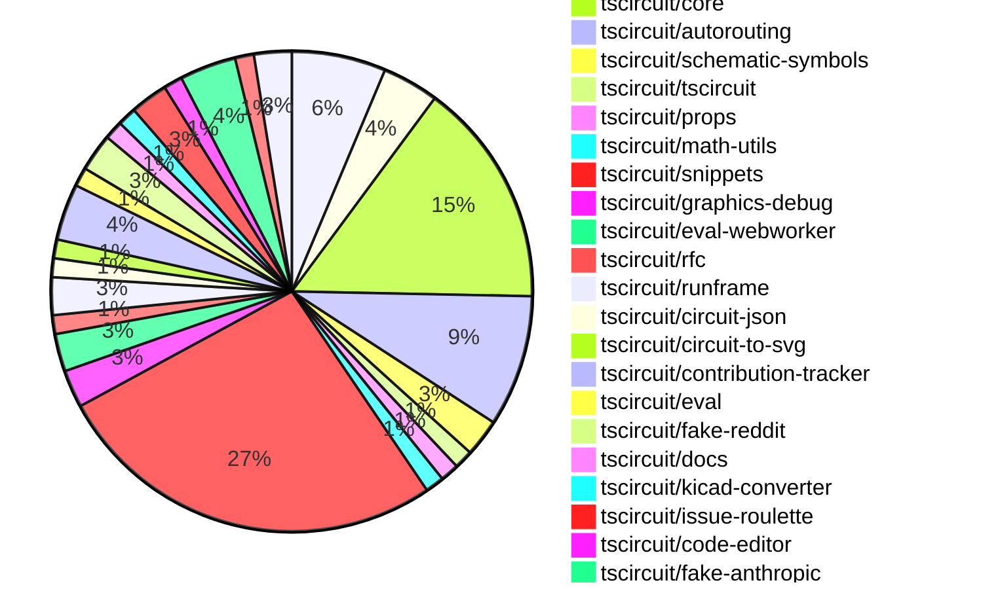

# contribution-tracker

Generates weekly contribution overviews for tscircuit contributors. Check out all
the [contribution overviews here](./contribution-overviews/)

* All PRs in the tscircuit org are scanned/summarized via Claude Haiku
* Claude classifies each Diff/PR as a Major, Minor or Tiny contribution
* All the PRs, summaries, and classifications are organized into charts and tables

The current week is shown below. There are 3 major sections:

* [Contributor Overview](#contributor-overview)
* [PRs by Repository](#prs-by-repository)
* [PRs by Contributor](#changes-by-contributor)

## Current Week

<!-- START_CURRENT_WEEK -->

# Contribution Overview 2025-01-08

## PRs by Repository

## Contributor Overview

| Contributor | 🐳 Major | 🐙 Minor | 🐌 Tiny | ⭐ | Issues Created |
|-------------|---------|---------|---------|-----|----------------|
| [seveibar](#seveibar) | 10 | 21 | 2 | 👑👑👑 | 70 |
| [Anshgrover23](#Anshgrover23) | 4 | 12 | 0 | ⭐⭐⭐ | 9 |
| [ShiboSoftwareDev](#ShiboSoftwareDev) | 1 | 5 | 1 | ⭐⭐⭐ | 11 |
| [Abse2001](#Abse2001) | 2 | 1 | 1 | ⭐⭐ | 5 |
| [imrishabh18](#imrishabh18) | 1 | 4 | 1 | ⭐⭐ | 5 |
| [techmannih](#techmannih) | 1 | 5 | 0 | ⭐⭐ | 2 |
| [kom-senapati](#kom-senapati) | 1 | 2 | 0 | ⭐ | 2 |
| [bhuvan-crypto](#bhuvan-crypto) | 0 | 1 | 0 |  | 0 |
| [DevGajjar28](#DevGajjar28) | 0 | 1 | 0 |  | 1 |

## Review Table

[reviews-received-hover]: ## "Number of reviews received for PRs for this contributor"
[approvals-received-hover]: ## "Number of approvals received for PRs this contributor authored"
[rejections-received-hover]: ## "Number of rejections received for PRs this contributor authored"
[prs-opened-hover]: ## "Number of PRs opened by this contributor"
[issues-created-hover]: ## "Number of issues created by this contributor"
[bountied-issues-hover]: ## "Number of issues this contributor created with a bounty"
[bountied-issue-$-hover]: ## "Total bounty amount placed on issues authored by this contributor"

| Contributor | Reviews Received | Approvals Received | Rejections Received | Approvals | Rejections | PRs Opened | PRs Merged | Issues Created | Bountied Issues | Bountied Issue $ |
|---|---|---|---|---|---|---|---|---|---|---|
| [Abse2001](#Abse2001) | 15 | 4 | 0 | 4 | 6 | 5 | 4 | 5 | 1 | 10 |
| [seveibar](#seveibar) | 0 | 0 | 0 | 39 | 12 | 40 | 34 | 70 | 49 | 640 |
| [kom-senapati](#kom-senapati) | 6 | 2 | 3 | 0 | 0 | 7 | 3 | 2 | 1 | 2 |
| [techmannih](#techmannih) | 30 | 10 | 7 | 0 | 0 | 10 | 6 | 2 | 0 | 0 |
| [Anshgrover23](#Anshgrover23) | 59 | 18 | 10 | 0 | 6 | 19 | 17 | 9 | 1 | 2 |
| [chaadiic](#chaadiic) | 3 | 1 | 1 | 0 | 0 | 1 | 0 | 0 | 0 | 0 |
| [yashksaini-coder](#yashksaini-coder) | 2 | 0 | 1 | 0 | 0 | 1 | 0 | 0 | 0 | 0 |
| [imrishabh18](#imrishabh18) | 9 | 1 | 1 | 1 | 3 | 6 | 6 | 5 | 0 | 0 |
| [ShiboSoftwareDev](#ShiboSoftwareDev) | 10 | 7 | 0 | 1 | 0 | 10 | 7 | 11 | 6 | 80 |
| [bhuvan-crypto](#bhuvan-crypto) | 3 | 1 | 2 | 0 | 0 | 3 | 1 | 0 | 0 | 0 |
| [devin-ai-integration[bot]](#devin-ai-integration[bot]) | 0 | 0 | 0 | 0 | 0 | 1 | 0 | 0 | 0 | 0 |
| [ArnavK-09](#ArnavK-09) | 3 | 0 | 2 | 0 | 0 | 1 | 0 | 0 | 0 | 0 |
| [DevGajjar28](#DevGajjar28) | 1 | 1 | 0 | 0 | 0 | 2 | 1 | 1 | 1 | 2 |
| [abhishek818](#abhishek818) | 2 | 0 | 0 | 0 | 0 | 1 | 0 | 0 | 0 | 0 |

## Changes by Repository

### [tscircuit/autorouting.com](https://github.com/tscircuit/autorouting.com)

| PR # | Impact | Contributor | Description |
|------|--------|-------------|-------------|
| [#23](https://github.com/tscircuit/autorouting.com/pull/23) | 🐳 Major | Abse2001 | Implemented the `autorouting run --autorouter freerouting` command to run the FreeRouting autorouter on a circuit file or dataset. |
| [#21](https://github.com/tscircuit/autorouting.com/pull/21) | 🐳 Major | Abse2001 | Adds a new CLI command to download datasets from the platform to the local filesystem. |
| [#14](https://github.com/tscircuit/autorouting.com/pull/14) | 🐙 Minor | seveibar | Revert the addition of the main logo animation |
| [#16](https://github.com/tscircuit/autorouting.com/pull/16) | 🐙 Minor | Anshgrover23 | Adds an autorouting animation on the main page. |
| [#24](https://github.com/tscircuit/autorouting.com/pull/24) | 🐌 Tiny | Abse2001 | Added an early return statement to the `run-autorouter.ts` file when the `isDataset` flag is false. |

### [tscircuit/pcb-viewer](https://github.com/tscircuit/pcb-viewer)

| PR # | Impact | Contributor | Description |
|------|--------|-------------|-------------|
| [#114](https://github.com/tscircuit/pcb-viewer/pull/114) | 🐙 Minor | Abse2001 | Adds a performance test for the contribution board feature |
| [#122](https://github.com/tscircuit/pcb-viewer/pull/122) | 🐙 Minor | seveibar | Update the `use-mouse-matrix-transform` dependency to version 1.3.0 for better ESM compatibility. |
| [#121](https://github.com/tscircuit/pcb-viewer/pull/121) | 🐙 Minor | seveibar | Changed the build script to use `--platform browser` to build for the browser, avoiding the import of `webcrypto`. |

### [tscircuit/core](https://github.com/tscircuit/core)

| PR # | Impact | Contributor | Description |
|------|--------|-------------|-------------|
| [#520](https://github.com/tscircuit/core/pull/520) | 🐳 Major | seveibar | Fixes issues with `getSimpleRouteJsonFromCircuitJson` function, including handling of no-obstacles and bad connectivity map. |
| [#503](https://github.com/tscircuit/core/pull/503) | 🐳 Major | seveibar | Adds support for displaying multiple net labels on the same pin. |
| [#499](https://github.com/tscircuit/core/pull/499) | 🐳 Major | seveibar | Introduce schematic trace shortcuts and optimize margins |
| [#492](https://github.com/tscircuit/core/pull/492) | 🐳 Major | seveibar | Refactors the code that generates obstacles for the schematic autorouter. |
| [#509](https://github.com/tscircuit/core/pull/509) | 🐳 Major | techmannih | Fixes a bug in the `createSchematicTraceJunctions` function that incorrectly calculated the intersection point between two schematic traces. |
| [#519](https://github.com/tscircuit/core/pull/519) | 🐙 Minor | seveibar | Adds a new function `getSimpleRouteJsonFromCircuitJson` to the public exports. |
| [#506](https://github.com/tscircuit/core/pull/506) | 🐙 Minor | seveibar | Fix and refactor for NaN in schematic trace |
| [#501](https://github.com/tscircuit/core/pull/501) | 🐙 Minor | seveibar | Attempts to catch an infinite loop case that is crashing some circuits in the `createSchematicTraceCrossingSegments` function. |
| [#489](https://github.com/tscircuit/core/pull/489) | 🐙 Minor | seveibar | Avoid performing PcbRouteNetIslands when routing is disabled, and export types from Renderable. |
| [#515](https://github.com/tscircuit/core/pull/515) | 🐙 Minor | Anshgrover23 | Fixes an issue where capacitors don't render with negative schematic rotation angles. |
| [#511](https://github.com/tscircuit/core/pull/511) | 🐙 Minor | Anshgrover23 | Adds the ability to use `React.createElement` directly in the library without requiring an explicit import. |
| [#514](https://github.com/tscircuit/core/pull/514) | 🐙 Minor | imrishabh18 | Fix better error message for the schRotation invalid value |

### [tscircuit/autorouting](https://github.com/tscircuit/autorouting)

| PR # | Impact | Contributor | Description |
|------|--------|-------------|-------------|
| [#108](https://github.com/tscircuit/autorouting/pull/108) | 🐳 Major | seveibar | Rewrites the `shortenPathWithShortcuts` function for clarity and fixes edge cases where the wrong shortcut was selected. |
| [#107](https://github.com/tscircuit/autorouting/pull/107) | 🐳 Major | seveibar | Improves debugging of paths and fixes an issue with shortcuts not working. |
| [#106](https://github.com/tscircuit/autorouting/pull/106) | 🐳 Major | seveibar | Adds more SVG elements to the image, including several rectangular elements that highlight and annotate certain regions of the image. |
| [#105](https://github.com/tscircuit/autorouting/pull/105) | 🐳 Major | seveibar | Fixes a bug in the multilayer autorouter where it was not handling collisions properly when shortening paths. |
| [#103](https://github.com/tscircuit/autorouting/pull/103) | 🐳 Major | seveibar | Add support for Shorten Path with Shortcuts |
| [#109](https://github.com/tscircuit/autorouting/pull/109) | 🐙 Minor | seveibar | Adds a fallback value for the `MAX_ITERATIONS` option if it is not provided in the constructor. |
| [#104](https://github.com/tscircuit/autorouting/pull/104) | 🐙 Minor | seveibar | Fix bug with path collisions for simplifying paths |

### [tscircuit/schematic-symbols](https://github.com/tscircuit/schematic-symbols)

| PR # | Impact | Contributor | Description |
|------|--------|-------------|-------------|
| [#232](https://github.com/tscircuit/schematic-symbols/pull/232) | 🐳 Major | seveibar | Automatically compute the size of resistor and capacitor symbols based on their primitives |
| [#234](https://github.com/tscircuit/schematic-symbols/pull/234) | 🐙 Minor | techmannih | The pull request fixes the text orientation and port labels for the capacitor_left symbol. |

### [tscircuit/tscircuit](https://github.com/tscircuit/tscircuit)

| PR # | Impact | Contributor | Description |
|------|--------|-------------|-------------|
| [#497](https://github.com/tscircuit/tscircuit/pull/497) | 🐙 Minor | seveibar | Update CLI and core to latest versions, switch to daily updates |

### [tscircuit/props](https://github.com/tscircuit/props)

| PR # | Impact | Contributor | Description |
|------|--------|-------------|-------------|
| [#145](https://github.com/tscircuit/props/pull/145) | 🐙 Minor | seveibar | Adds a new optional property `schTraceAutoLabelEnabled` to the `Group` component to control whether net labels are automatically created for complex traces. |

### [tscircuit/math-utils](https://github.com/tscircuit/math-utils)

| PR # | Impact | Contributor | Description |
|------|--------|-------------|-------------|
| [#4](https://github.com/tscircuit/math-utils/pull/4) | 🐙 Minor | seveibar | Added row and column properties to the GridCellPositions type. |

### [tscircuit/snippets](https://github.com/tscircuit/snippets)

| PR # | Impact | Contributor | Description |
|------|--------|-------------|-------------|
| [#536](https://github.com/tscircuit/snippets/pull/536) | 🐳 Major | ShiboSoftwareDev | The pull request adds image optimization functionality, including dynamic resizing, compression, prefetching, and a loading blur animation. |
| [#560](https://github.com/tscircuit/snippets/pull/560) | 🐙 Minor | seveibar | Adds a new feature to download simple route JSON from the circuit JSON. |
| [#542](https://github.com/tscircuit/snippets/pull/542) | 🐙 Minor | seveibar | Fixes the base URL and view snippets page |
| [#515](https://github.com/tscircuit/snippets/pull/515) | 🐙 Minor | seveibar | Add math utils as a pre-supplied import in the use-run-tsx hook. |
| [#506](https://github.com/tscircuit/snippets/pull/506) | 🐙 Minor | seveibar | Update the `@tscircuit/pcb-viewer` package to version `1.11.12` and the `use-mouse-matrix-transform` package to version `1.3.0`, and add special CORS handling for alternate registry URL when the response status is `undefined` or `413`. |
| [#505](https://github.com/tscircuit/snippets/pull/505) | 🐙 Minor | seveibar | Fixes the retry with alternate registry server functionality |
| [#503](https://github.com/tscircuit/snippets/pull/503) | 🐙 Minor | seveibar | Adds a fallback to a non-Vercel URL for large payloads when the Vercel URL fails due to request size limits. |
| [#557](https://github.com/tscircuit/snippets/pull/557) | 🐙 Minor | techmannih | Adds a new `useMyChip` hook and updates the `MyChip` component to include pin labels. |
| [#518](https://github.com/tscircuit/snippets/pull/518) | 🐙 Minor | techmannih | Fixes the star button functionality for a code snippet. |
| [#545](https://github.com/tscircuit/snippets/pull/545) | 🐙 Minor | Anshgrover23 | Fixes timing issues in Playwright tests by increasing the wait time for network requests to complete. |
| [#528](https://github.com/tscircuit/snippets/pull/528) | 🐙 Minor | Anshgrover23 | The pull request fixes an issue where a user's changes to a snippet are dropped when they hit the "Fork" button. |
| [#514](https://github.com/tscircuit/snippets/pull/514) | 🐙 Minor | Anshgrover23 | Adds support for generating KiCAD Pro files in addition to KiCAD PCB files. |
| [#565](https://github.com/tscircuit/snippets/pull/565) | 🐙 Minor | bhuvan-crypto | Fixed the mobile responsive design of the settings page. |
| [#556](https://github.com/tscircuit/snippets/pull/556) | 🐙 Minor | ShiboSoftwareDev | Added accessibility fields and eliminated layout shift on the landing page. |
| [#554](https://github.com/tscircuit/snippets/pull/554) | 🐙 Minor | ShiboSoftwareDev | Introduce a new `PrefetchPageLink` component that wraps links and prefetches the linked pages as they appear in the viewport. |
| [#543](https://github.com/tscircuit/snippets/pull/543) | 🐙 Minor | ShiboSoftwareDev | Improve SEO by adding a robots.txt file and generating a sitemap for crawlers. |
| [#531](https://github.com/tscircuit/snippets/pull/531) | 🐙 Minor | ShiboSoftwareDev | Improves site performance by lazy loading pages and adding error handling. |
| [#548](https://github.com/tscircuit/snippets/pull/548) | 🐙 Minor | kom-senapati | Fix for home page images to make them responsive with width and height attributes. |
| [#538](https://github.com/tscircuit/snippets/pull/538) | 🐙 Minor | DevGajjar28 | Fix issue where text goes out of the text box |
| [#512](https://github.com/tscircuit/snippets/pull/512) | 🐌 Tiny | seveibar | Fixes the order of the `AUTOLOAD_SNIPPETS` environment variable in the `dev` script of the `package.json` file. |
| [#553](https://github.com/tscircuit/snippets/pull/553) | 🐌 Tiny | ShiboSoftwareDev | Add .gitignore rule to ignore sitemap.xml |

### [tscircuit/graphics-debug](https://github.com/tscircuit/graphics-debug)

| PR # | Impact | Contributor | Description |
|------|--------|-------------|-------------|
| [#12](https://github.com/tscircuit/graphics-debug/pull/12) | 🐙 Minor | seveibar | Fixes a bug in the cartesian coordinate system handling for rectangles in the SVG rendering. |
| [#14](https://github.com/tscircuit/graphics-debug/pull/14) | 🐙 Minor | Anshgrover23 | Adds support for custom stroke color and width in the `Line` type and updates the `getSvgFromGraphicsObject` function to use the new properties. |

### [tscircuit/eval-webworker](https://github.com/tscircuit/eval-webworker)

| PR # | Impact | Contributor | Description |
|------|--------|-------------|-------------|
| [#72](https://github.com/tscircuit/eval-webworker/pull/72) | 🐙 Minor | seveibar | Update the `@tscircuit/core` dependency to version `0.0.261` to fix a NaN issue. |
| [#71](https://github.com/tscircuit/eval-webworker/pull/71) | 🐙 Minor | Anshgrover23 | Adds a `clearEventListeners()` function to the `CircuitWebWorker` interface and its implementation to remove all registered event listeners. |

### [tscircuit/rfc](https://github.com/tscircuit/rfc)

| PR # | Impact | Contributor | Description |
|------|--------|-------------|-------------|
| [#3](https://github.com/tscircuit/rfc/pull/3) | 🐌 Tiny | seveibar | Adds a `.gitignore` file for a directory called `assets/2025-01-10-registry-bundling-and-transpilation` and creates a few sample files within that directory. |

### [tscircuit/runframe](https://github.com/tscircuit/runframe)

| PR # | Impact | Contributor | Description |
|------|--------|-------------|-------------|
| [#111](https://github.com/tscircuit/runframe/pull/111) | 🟣 | seveibar |  |
| [#108](https://github.com/tscircuit/runframe/pull/108) | 🐙 Minor | seveibar | Add a new tab to the circuit preview to display render logs. |

### [tscircuit/circuit-json](https://github.com/tscircuit/circuit-json)

| PR # | Impact | Contributor | Description |
|------|--------|-------------|-------------|
| [#120](https://github.com/tscircuit/circuit-json/pull/120) | 🐙 Minor | techmannih | Add a new pill-shaped SMT pad type for PCB design. |

### [tscircuit/circuit-to-svg](https://github.com/tscircuit/circuit-to-svg)

| PR # | Impact | Contributor | Description |
|------|--------|-------------|-------------|
| [#163](https://github.com/tscircuit/circuit-to-svg/pull/163) | 🐙 Minor | techmannih | Adds support for pill-shaped SMT pads in the Circuit JSON specification |

### [tscircuit/contribution-tracker](https://github.com/tscircuit/contribution-tracker)

| PR # | Impact | Contributor | Description |
|------|--------|-------------|-------------|
| [#30](https://github.com/tscircuit/contribution-tracker/pull/30) | 🐳 Major | Anshgrover23 | Adds a cache to the Claude-Anthropic API client to reduce the number of API requests and improve performance. |
| [#28](https://github.com/tscircuit/contribution-tracker/pull/28) | 🐳 Major | Anshgrover23 | Implement caching for GitHub API calls to improve performance of the markdown generation process. |
| [#32](https://github.com/tscircuit/contribution-tracker/pull/32) | 🐙 Minor | Anshgrover23 | Fix a bug in the contribution tracker where it was tracking more than a week's worth of data. |

### [tscircuit/eval](https://github.com/tscircuit/eval)

| PR # | Impact | Contributor | Description |
|------|--------|-------------|-------------|
| [#3](https://github.com/tscircuit/eval/pull/3) | 🐳 Major | Anshgrover23 | Introduce CircuitEvaluator and match all tests with its new implementation |

### [tscircuit/fake-reddit](https://github.com/tscircuit/fake-reddit)

| PR # | Impact | Contributor | Description |
|------|--------|-------------|-------------|
| [#3](https://github.com/tscircuit/fake-reddit/pull/3) | 🐳 Major | Anshgrover23 | Adds new endpoints for submitting posts and getting posts, including authentication middleware and database schema |
| [#4](https://github.com/tscircuit/fake-reddit/pull/4) | 🐙 Minor | imrishabh18 | Add workflows for building, testing, and type-checking the project using Bun. |

### [tscircuit/docs](https://github.com/tscircuit/docs)

| PR # | Impact | Contributor | Description |
|------|--------|-------------|-------------|
| [#53](https://github.com/tscircuit/docs/pull/53) | 🐙 Minor | Anshgrover23 | Adds documentation for new components (transistor, inductor, LED, power source) and updates the trace documentation. |

### [tscircuit/kicad-converter](https://github.com/tscircuit/kicad-converter)

| PR # | Impact | Contributor | Description |
|------|--------|-------------|-------------|
| [#12](https://github.com/tscircuit/kicad-converter/pull/12) | 🐙 Minor | Anshgrover23 | Add kicad-pro to index to enable adding kicad_project download. |

### [tscircuit/issue-roulette](https://github.com/tscircuit/issue-roulette)

| PR # | Impact | Contributor | Description |
|------|--------|-------------|-------------|
| [#4](https://github.com/tscircuit/issue-roulette/pull/4) | 🟣 | Anshgrover23 | Adds server-side rendering (SSR) functionality to the application. |
| [#2](https://github.com/tscircuit/issue-roulette/pull/2) | 🐙 Minor | Anshgrover23 | Adds a new API route to fetch open, unassigned issues from GitHub repositories. |

### [tscircuit/code-editor](https://github.com/tscircuit/code-editor)

| PR # | Impact | Contributor | Description |
|------|--------|-------------|-------------|
| [#3](https://github.com/tscircuit/code-editor/pull/3) | 🐳 Major | imrishabh18 | The proposed changes introduce a new code editor component `TscircuitCodeEditor` with a comprehensive set of props and a custom store implementation using Zustand. |

### [tscircuit/fake-anthropic](https://github.com/tscircuit/fake-anthropic)

| PR # | Impact | Contributor | Description |
|------|--------|-------------|-------------|
| [#5](https://github.com/tscircuit/fake-anthropic/pull/5) | 🐙 Minor | imrishabh18 | Update the bun-pver-release.yml workflow to include the `bun run build` step. |
| [#4](https://github.com/tscircuit/fake-anthropic/pull/4) | 🐙 Minor | imrishabh18 | Adds workflows for building, testing, and publishing the project with Bun. |
| [#3](https://github.com/tscircuit/fake-anthropic/pull/3) | 🐌 Tiny | imrishabh18 | Removes the unused `immer` middleware from the `zustand` store. |

### [tscircuit/pr-evaluation-benchmark](https://github.com/tscircuit/pr-evaluation-benchmark)

| PR # | Impact | Contributor | Description |
|------|--------|-------------|-------------|
| [#2](https://github.com/tscircuit/pr-evaluation-benchmark/pull/2) | 🐙 Minor | ShiboSoftwareDev | Adds an initial PR evaluation benchmark with an example prompt using the Anthropic API. |

### [tscircuit/cli](https://github.com/tscircuit/cli)

| PR # | Impact | Contributor | Description |
|------|--------|-------------|-------------|
| [#21](https://github.com/tscircuit/cli/pull/21) | 🐳 Major | kom-senapati | Introduces the `tsci init` command to initialize a new TSCircuit project in the current directory. |
| [#19](https://github.com/tscircuit/cli/pull/19) | 🐙 Minor | kom-senapati | Add support for default entrypoint in dev command |

## Changes by Contributor

### [Abse2001](https://github.com/Abse2001)

| PR # | Impact | Description |
|------|--------|-------------|
| [#23](https://github.com/tscircuit/autorouting.com/pull/23) | 🐳 Major | Implemented the `autorouting run --autorouter freerouting` command to run the FreeRouting autorouter on a circuit file or dataset. |
| [#21](https://github.com/tscircuit/autorouting.com/pull/21) | 🐳 Major | Adds a new CLI command to download datasets from the platform to the local filesystem. |
| [#114](https://github.com/tscircuit/pcb-viewer/pull/114) | 🐙 Minor | Adds a performance test for the contribution board feature |
| [#24](https://github.com/tscircuit/autorouting.com/pull/24) | 🐌 Tiny | Added an early return statement to the `run-autorouter.ts` file when the `isDataset` flag is false. |

### [seveibar](https://github.com/seveibar)

| PR # | Impact | Description |
|------|--------|-------------|
| [#520](https://github.com/tscircuit/core/pull/520) | 🐳 Major | Fixes issues with `getSimpleRouteJsonFromCircuitJson` function, including handling of no-obstacles and bad connectivity map. |
| [#503](https://github.com/tscircuit/core/pull/503) | 🐳 Major | Adds support for displaying multiple net labels on the same pin. |
| [#499](https://github.com/tscircuit/core/pull/499) | 🐳 Major | Introduce schematic trace shortcuts and optimize margins |
| [#492](https://github.com/tscircuit/core/pull/492) | 🐳 Major | Refactors the code that generates obstacles for the schematic autorouter. |
| [#108](https://github.com/tscircuit/autorouting/pull/108) | 🐳 Major | Rewrites the `shortenPathWithShortcuts` function for clarity and fixes edge cases where the wrong shortcut was selected. |
| [#107](https://github.com/tscircuit/autorouting/pull/107) | 🐳 Major | Improves debugging of paths and fixes an issue with shortcuts not working. |
| [#106](https://github.com/tscircuit/autorouting/pull/106) | 🐳 Major | Adds more SVG elements to the image, including several rectangular elements that highlight and annotate certain regions of the image. |
| [#105](https://github.com/tscircuit/autorouting/pull/105) | 🐳 Major | Fixes a bug in the multilayer autorouter where it was not handling collisions properly when shortening paths. |
| [#103](https://github.com/tscircuit/autorouting/pull/103) | 🐳 Major | Add support for Shorten Path with Shortcuts |
| [#232](https://github.com/tscircuit/schematic-symbols/pull/232) | 🐳 Major | Automatically compute the size of resistor and capacitor symbols based on their primitives |
| [#122](https://github.com/tscircuit/pcb-viewer/pull/122) | 🐙 Minor | Update the `use-mouse-matrix-transform` dependency to version 1.3.0 for better ESM compatibility. |
| [#121](https://github.com/tscircuit/pcb-viewer/pull/121) | 🐙 Minor | Changed the build script to use `--platform browser` to build for the browser, avoiding the import of `webcrypto`. |
| [#497](https://github.com/tscircuit/tscircuit/pull/497) | 🐙 Minor | Update CLI and core to latest versions, switch to daily updates |
| [#145](https://github.com/tscircuit/props/pull/145) | 🐙 Minor | Adds a new optional property `schTraceAutoLabelEnabled` to the `Group` component to control whether net labels are automatically created for complex traces. |
| [#519](https://github.com/tscircuit/core/pull/519) | 🐙 Minor | Adds a new function `getSimpleRouteJsonFromCircuitJson` to the public exports. |
| [#506](https://github.com/tscircuit/core/pull/506) | 🐙 Minor | Fix and refactor for NaN in schematic trace |
| [#501](https://github.com/tscircuit/core/pull/501) | 🐙 Minor | Attempts to catch an infinite loop case that is crashing some circuits in the `createSchematicTraceCrossingSegments` function. |
| [#489](https://github.com/tscircuit/core/pull/489) | 🐙 Minor | Avoid performing PcbRouteNetIslands when routing is disabled, and export types from Renderable. |
| [#109](https://github.com/tscircuit/autorouting/pull/109) | 🐙 Minor | Adds a fallback value for the `MAX_ITERATIONS` option if it is not provided in the constructor. |
| [#104](https://github.com/tscircuit/autorouting/pull/104) | 🐙 Minor | Fix bug with path collisions for simplifying paths |
| [#14](https://github.com/tscircuit/autorouting.com/pull/14) | 🐙 Minor | Revert the addition of the main logo animation |
| [#4](https://github.com/tscircuit/math-utils/pull/4) | 🐙 Minor | Added row and column properties to the GridCellPositions type. |
| [#560](https://github.com/tscircuit/snippets/pull/560) | 🐙 Minor | Adds a new feature to download simple route JSON from the circuit JSON. |
| [#542](https://github.com/tscircuit/snippets/pull/542) | 🐙 Minor | Fixes the base URL and view snippets page |
| [#515](https://github.com/tscircuit/snippets/pull/515) | 🐙 Minor | Add math utils as a pre-supplied import in the use-run-tsx hook. |
| [#506](https://github.com/tscircuit/snippets/pull/506) | 🐙 Minor | Update the `@tscircuit/pcb-viewer` package to version `1.11.12` and the `use-mouse-matrix-transform` package to version `1.3.0`, and add special CORS handling for alternate registry URL when the response status is `undefined` or `413`. |
| [#505](https://github.com/tscircuit/snippets/pull/505) | 🐙 Minor | Fixes the retry with alternate registry server functionality |
| [#503](https://github.com/tscircuit/snippets/pull/503) | 🐙 Minor | Adds a fallback to a non-Vercel URL for large payloads when the Vercel URL fails due to request size limits. |
| [#12](https://github.com/tscircuit/graphics-debug/pull/12) | 🐙 Minor | Fixes a bug in the cartesian coordinate system handling for rectangles in the SVG rendering. |
| [#72](https://github.com/tscircuit/eval-webworker/pull/72) | 🐙 Minor | Update the `@tscircuit/core` dependency to version `0.0.261` to fix a NaN issue. |
| [#3](https://github.com/tscircuit/rfc/pull/3) | 🐌 Tiny | Adds a `.gitignore` file for a directory called `assets/2025-01-10-registry-bundling-and-transpilation` and creates a few sample files within that directory. |
| [#512](https://github.com/tscircuit/snippets/pull/512) | 🐌 Tiny | Fixes the order of the `AUTOLOAD_SNIPPETS` environment variable in the `dev` script of the `package.json` file. |
| [#111](https://github.com/tscircuit/runframe/pull/111) | 🟣 |  |
| [#108](https://github.com/tscircuit/runframe/pull/108) | 🐙 Minor | Add a new tab to the circuit preview to display render logs. |

### [techmannih](https://github.com/techmannih)

| PR # | Impact | Description |
|------|--------|-------------|
| [#509](https://github.com/tscircuit/core/pull/509) | 🐳 Major | Fixes a bug in the `createSchematicTraceJunctions` function that incorrectly calculated the intersection point between two schematic traces. |
| [#120](https://github.com/tscircuit/circuit-json/pull/120) | 🐙 Minor | Add a new pill-shaped SMT pad type for PCB design. |
| [#163](https://github.com/tscircuit/circuit-to-svg/pull/163) | 🐙 Minor | Adds support for pill-shaped SMT pads in the Circuit JSON specification |
| [#234](https://github.com/tscircuit/schematic-symbols/pull/234) | 🐙 Minor | The pull request fixes the text orientation and port labels for the capacitor_left symbol. |
| [#557](https://github.com/tscircuit/snippets/pull/557) | 🐙 Minor | Adds a new `useMyChip` hook and updates the `MyChip` component to include pin labels. |
| [#518](https://github.com/tscircuit/snippets/pull/518) | 🐙 Minor | Fixes the star button functionality for a code snippet. |

### [Anshgrover23](https://github.com/Anshgrover23)

| PR # | Impact | Description |
|------|--------|-------------|
| [#30](https://github.com/tscircuit/contribution-tracker/pull/30) | 🐳 Major | Adds a cache to the Claude-Anthropic API client to reduce the number of API requests and improve performance. |
| [#28](https://github.com/tscircuit/contribution-tracker/pull/28) | 🐳 Major | Implement caching for GitHub API calls to improve performance of the markdown generation process. |
| [#3](https://github.com/tscircuit/eval/pull/3) | 🐳 Major | Introduce CircuitEvaluator and match all tests with its new implementation |
| [#3](https://github.com/tscircuit/fake-reddit/pull/3) | 🐳 Major | Adds new endpoints for submitting posts and getting posts, including authentication middleware and database schema |
| [#53](https://github.com/tscircuit/docs/pull/53) | 🐙 Minor | Adds documentation for new components (transistor, inductor, LED, power source) and updates the trace documentation. |
| [#515](https://github.com/tscircuit/core/pull/515) | 🐙 Minor | Fixes an issue where capacitors don't render with negative schematic rotation angles. |
| [#511](https://github.com/tscircuit/core/pull/511) | 🐙 Minor | Adds the ability to use `React.createElement` directly in the library without requiring an explicit import. |
| [#32](https://github.com/tscircuit/contribution-tracker/pull/32) | 🐙 Minor | Fix a bug in the contribution tracker where it was tracking more than a week's worth of data. |
| [#16](https://github.com/tscircuit/autorouting.com/pull/16) | 🐙 Minor | Adds an autorouting animation on the main page. |
| [#12](https://github.com/tscircuit/kicad-converter/pull/12) | 🐙 Minor | Add kicad-pro to index to enable adding kicad_project download. |
| [#545](https://github.com/tscircuit/snippets/pull/545) | 🐙 Minor | Fixes timing issues in Playwright tests by increasing the wait time for network requests to complete. |
| [#528](https://github.com/tscircuit/snippets/pull/528) | 🐙 Minor | The pull request fixes an issue where a user's changes to a snippet are dropped when they hit the "Fork" button. |
| [#514](https://github.com/tscircuit/snippets/pull/514) | 🐙 Minor | Adds support for generating KiCAD Pro files in addition to KiCAD PCB files. |
| [#14](https://github.com/tscircuit/graphics-debug/pull/14) | 🐙 Minor | Adds support for custom stroke color and width in the `Line` type and updates the `getSvgFromGraphicsObject` function to use the new properties. |
| [#71](https://github.com/tscircuit/eval-webworker/pull/71) | 🐙 Minor | Adds a `clearEventListeners()` function to the `CircuitWebWorker` interface and its implementation to remove all registered event listeners. |
| [#4](https://github.com/tscircuit/issue-roulette/pull/4) | 🟣 | Adds server-side rendering (SSR) functionality to the application. |
| [#2](https://github.com/tscircuit/issue-roulette/pull/2) | 🐙 Minor | Adds a new API route to fetch open, unassigned issues from GitHub repositories. |

### [imrishabh18](https://github.com/imrishabh18)

| PR # | Impact | Description |
|------|--------|-------------|
| [#3](https://github.com/tscircuit/code-editor/pull/3) | 🐳 Major | The proposed changes introduce a new code editor component `TscircuitCodeEditor` with a comprehensive set of props and a custom store implementation using Zustand. |
| [#514](https://github.com/tscircuit/core/pull/514) | 🐙 Minor | Fix better error message for the schRotation invalid value |
| [#5](https://github.com/tscircuit/fake-anthropic/pull/5) | 🐙 Minor | Update the bun-pver-release.yml workflow to include the `bun run build` step. |
| [#4](https://github.com/tscircuit/fake-anthropic/pull/4) | 🐙 Minor | Adds workflows for building, testing, and publishing the project with Bun. |
| [#4](https://github.com/tscircuit/fake-reddit/pull/4) | 🐙 Minor | Add workflows for building, testing, and type-checking the project using Bun. |
| [#3](https://github.com/tscircuit/fake-anthropic/pull/3) | 🐌 Tiny | Removes the unused `immer` middleware from the `zustand` store. |

### [bhuvan-crypto](https://github.com/bhuvan-crypto)

| PR # | Impact | Description |
|------|--------|-------------|
| [#565](https://github.com/tscircuit/snippets/pull/565) | 🐙 Minor | Fixed the mobile responsive design of the settings page. |

### [ShiboSoftwareDev](https://github.com/ShiboSoftwareDev)

| PR # | Impact | Description |
|------|--------|-------------|
| [#536](https://github.com/tscircuit/snippets/pull/536) | 🐳 Major | The pull request adds image optimization functionality, including dynamic resizing, compression, prefetching, and a loading blur animation. |
| [#556](https://github.com/tscircuit/snippets/pull/556) | 🐙 Minor | Added accessibility fields and eliminated layout shift on the landing page. |
| [#554](https://github.com/tscircuit/snippets/pull/554) | 🐙 Minor | Introduce a new `PrefetchPageLink` component that wraps links and prefetches the linked pages as they appear in the viewport. |
| [#543](https://github.com/tscircuit/snippets/pull/543) | 🐙 Minor | Improve SEO by adding a robots.txt file and generating a sitemap for crawlers. |
| [#531](https://github.com/tscircuit/snippets/pull/531) | 🐙 Minor | Improves site performance by lazy loading pages and adding error handling. |
| [#2](https://github.com/tscircuit/pr-evaluation-benchmark/pull/2) | 🐙 Minor | Adds an initial PR evaluation benchmark with an example prompt using the Anthropic API. |
| [#553](https://github.com/tscircuit/snippets/pull/553) | 🐌 Tiny | Add .gitignore rule to ignore sitemap.xml |

### [kom-senapati](https://github.com/kom-senapati)

| PR # | Impact | Description |
|------|--------|-------------|
| [#21](https://github.com/tscircuit/cli/pull/21) | 🐳 Major | Introduces the `tsci init` command to initialize a new TSCircuit project in the current directory. |
| [#548](https://github.com/tscircuit/snippets/pull/548) | 🐙 Minor | Fix for home page images to make them responsive with width and height attributes. |
| [#19](https://github.com/tscircuit/cli/pull/19) | 🐙 Minor | Add support for default entrypoint in dev command |

### [DevGajjar28](https://github.com/DevGajjar28)

| PR # | Impact | Description |
|------|--------|-------------|
| [#538](https://github.com/tscircuit/snippets/pull/538) | 🐙 Minor | Fix issue where text goes out of the text box |

<!-- END_CURRENT_WEEK -->
