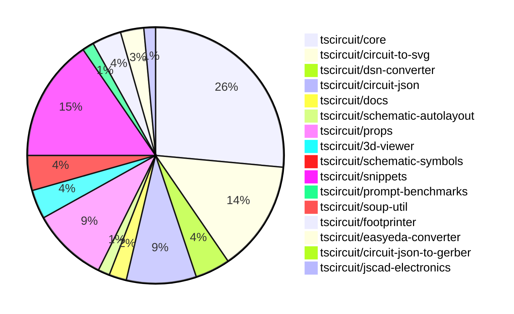

# contribution-tracker

Generates weekly contribution overviews for tscircuit contributors. Check out all
the [contribution overviews here](./contribution-overviews/)

* All PRs in the tscircuit org are scanned/summarized via Claude Haiku
* Claude classifies each Diff/PR as a Major, Minor or Tiny contribution
* All the PRs, summaries, and classifications are organized into charts and tables

The current week is shown below. There are 3 major sections:

* [Contributor Overview](#contributor-overview)
* [PRs by Repository](#prs-by-repository)
* [PRs by Contributor](#changes-by-contributor)

## Current Week

<!-- START_CURRENT_WEEK -->

# Contribution Overview 2024-11-06

## PRs by Repository

## Contributor Overview

| Contributor | 🐳 Major | 🐙 Minor | 🐌 Tiny | ⭐ |
|-------------|-------|-------|-------|-------|
| [seveibar](#seveibar) | 14 | 56 | 1 | 👑👑👑 |
| [imrishabh18](#imrishabh18) | 6 | 20 | 1 | 👑 |
| [anas-sarkez](#anas-sarkez) | 7 | 2 | 0 | ⭐⭐⭐ |
| [ShiboSoftwareDev](#ShiboSoftwareDev) | 2 | 10 | 1 | ⭐⭐ |
| [mrudulpatil18](#mrudulpatil18) | 0 | 4 | 0 | ⭐ |
| [DhairyaMajmudar](#DhairyaMajmudar) | 1 | 1 | 0 | ⭐ |
| [Abse2001](#Abse2001) | 0 | 3 | 0 | ⭐ |
| [RohittCodes](#RohittCodes) | 1 | 1 | 0 | ⭐ |
| [andrii-balitskyi](#andrii-balitskyi) | 0 | 2 | 1 | ⭐ |
| [tscircuitbot](#tscircuitbot) | 0 | 1 | 0 |  |
| [Anshgrover23](#Anshgrover23) | 0 | 1 | 0 |  |
| [kom-senapati](#kom-senapati) | 0 | 1 | 0 |  |
| [ahmedhalac](#ahmedhalac) | 0 | 1 | 0 |  |

## Changes by Repository

### [tscircuit/core](https://github.com/tscircuit/core)

| PR # | Impact | Contributor | Description |
|------|--------|-------------|-------------|
| [#300](https://github.com/tscircuit/core/pull/300) | 🐳 Major | imrishabh18 | Adds a new `Potentiometer` component to the project. |
| [#297](https://github.com/tscircuit/core/pull/297) | 🐳 Major | seveibar | The code changes address complex crossings in schematic traces by creating a more robust algorithm for handling intersections and generating appropriate crossing segments. |
| [#292](https://github.com/tscircuit/core/pull/292) | 🐳 Major | seveibar | Allow `schPortArrangement` to accept strings in addition to numbers. |
| [#274](https://github.com/tscircuit/core/pull/274) | 🐳 Major | seveibar | The pull request adds a new feature to the "Parts Engine" that automatically populates the "supplier_part_numbers" field of the "source_component" based on the information provided by the parts engine. |
| [#264](https://github.com/tscircuit/core/pull/264) | 🐳 Major | seveibar | Adds support for schematic symbol rotation by introducing new methods to determine the appropriate schematic symbol name based on the rotation angle. |
| [#260](https://github.com/tscircuit/core/pull/260) | 🐳 Major | seveibar | Adds support for junctions in the schematic trace implementation. |
| [#257](https://github.com/tscircuit/core/pull/257) | 🐳 Major | seveibar | Implement source_trace.subcircuit_connectivity_map_key, a feature that generates a unique key for each subcircuit trace based on the subcircuit name and the connected source trace net. |
| [#253](https://github.com/tscircuit/core/pull/253) | 🐳 Major | DhairyaMajmudar | Adds error handling for missing footprint in the `NormalComponent` class. |
| [#268](https://github.com/tscircuit/core/pull/268) | 🐳 Major | ShiboSoftwareDev | Added capacitor, inductor, diode, and LED schematic rotation support. |
| [#295](https://github.com/tscircuit/core/pull/295) | 🐙 Minor | imrishabh18 | Fixes the issue of the pin header width not adjusting properly when the label is not present. |
| [#294](https://github.com/tscircuit/core/pull/294) | 🐙 Minor | imrishabh18 | Adds a new `facingDirection` prop to the `PinHeader` component and updates the corresponding schematic layout. |
| [#270](https://github.com/tscircuit/core/pull/270) | 🐙 Minor | imrishabh18 | Normalize pin labels moved from easyeda to core |
| [#245](https://github.com/tscircuit/core/pull/245) | 🐙 Minor | imrishabh18 | Fixes an issue where port dots were appearing on the center of the chip when a port arrangement was present. |
| [#309](https://github.com/tscircuit/core/pull/309) | 🐙 Minor | seveibar | Fixes the type inference for pin numbers in the `createUseComponent` hooks. |
| [#305](https://github.com/tscircuit/core/pull/305) | 🐙 Minor | seveibar | Update the schematic-symbols package to version 0.0.98 |
| [#303](https://github.com/tscircuit/core/pull/303) | 🐙 Minor | seveibar | Adds directional symbol names to the PrimitiveComponent class. |
| [#299](https://github.com/tscircuit/core/pull/299) | 🐙 Minor | seveibar | Fix a bug in the simplified overshot check for schematic trace crossing segments. |
| [#296](https://github.com/tscircuit/core/pull/296) | 🐙 Minor | seveibar | Fix the facing direction of net labels |
| [#287](https://github.com/tscircuit/core/pull/287) | 🐙 Minor | seveibar | Adds a new SVG file containing a schematic diagram of complex component crossings. |
| [#285](https://github.com/tscircuit/core/pull/285) | 🐙 Minor | seveibar | Fixes a bug where the stub edges were not appearing for some edges in the schematic trace component. |
| [#284](https://github.com/tscircuit/core/pull/284) | 🐙 Minor | seveibar | Fixes a visual bug in the crossing direction calculation for schematic traces. |
| [#283](https://github.com/tscircuit/core/pull/283) | 🐙 Minor | seveibar | Increase the line thickness of traces in the schematic to prevent overlap. |
| [#277](https://github.com/tscircuit/core/pull/277) | 🐙 Minor | seveibar | Adapt parts engine to use footprinterString |
| [#262](https://github.com/tscircuit/core/pull/262) | 🐙 Minor | seveibar | Fixes an issue where props were not being parsed correctly for the schematic component rotation. |
| [#261](https://github.com/tscircuit/core/pull/261) | 🐙 Minor | seveibar | Add anchor_position to schematic_net_label, and add net labels when a schematic trace is connected to a net on one side. |
| [#252](https://github.com/tscircuit/core/pull/252) | 🐙 Minor | seveibar | Adds the `is_crossing` property and splits schematic trace segments to enable the "trace hop" feature. |
| [#251](https://github.com/tscircuit/core/pull/251) | 🐙 Minor | seveibar | Fixes trace overlap by pushing traces away from other traces. |
| [#247](https://github.com/tscircuit/core/pull/247) | 🐙 Minor | seveibar | Add display_pin_label to schematic ports and symbol_display_value to schematic components |
| [#315](https://github.com/tscircuit/core/pull/315) | 🐙 Minor | ShiboSoftwareDev | Fixed a bug where non-port elements were being added as ports for custom footprints. |
| [#314](https://github.com/tscircuit/core/pull/314) | 🐙 Minor | ShiboSoftwareDev | Fixed the rendering of the battery symbol. |
| [#269](https://github.com/tscircuit/core/pull/269) | 🐙 Minor | ShiboSoftwareDev | The change makes the `schematic_port.facing_direction` more accurate by using the `localPortInfo.side` property to determine the facing direction. |
| [#259](https://github.com/tscircuit/core/pull/259) | 🐙 Minor | ShiboSoftwareDev | Schematic box components now expand to fit the label text. |
| [#244](https://github.com/tscircuit/core/pull/244) | 🐙 Minor | andrii-balitskyi | Add a GitHub Actions workflow to automatically format code changes in pull requests. |
| [#243](https://github.com/tscircuit/core/pull/243) | 🐙 Minor | andrii-balitskyi | Add a new `useLed` hook to the library. |
| [#275](https://github.com/tscircuit/core/pull/275) | 🐌 Tiny | imrishabh18 | Reduced the dependency size of the `@tscircuit/schematic-autolayout` package from `^0.0.5` to `^0.0.6`. |
| [#242](https://github.com/tscircuit/core/pull/242) | 🐌 Tiny | andrii-balitskyi | Adds a test for the `useDiode` hook, which was previously added in another pull request. |

### [tscircuit/circuit-to-svg](https://github.com/tscircuit/circuit-to-svg)

| PR # | Impact | Contributor | Description |
|------|--------|-------------|-------------|
| [#106](https://github.com/tscircuit/circuit-to-svg/pull/106) | 🐳 Major | imrishabh18 | Adds support for displaying schematic net labels in the SVG output. |
| [#117](https://github.com/tscircuit/circuit-to-svg/pull/117) | 🐳 Major | seveibar | Adds nonexistent symbol handling and error message when symbol ports don't align. |
| [#113](https://github.com/tscircuit/circuit-to-svg/pull/113) | 🐳 Major | seveibar | This pull request adds a comprehensive set of text metrics for the Arial font, including width, height, ascent, descent, left, and right values for each character. |
| [#112](https://github.com/tscircuit/circuit-to-svg/pull/112) | 🐳 Major | seveibar | Adds junction support, improves drawing of crossings in the schematic trace. |
| [#110](https://github.com/tscircuit/circuit-to-svg/pull/110) | 🐳 Major | seveibar | Introduces the initial implementation of crossing trace in the schematic SVG object creation function. |
| [#120](https://github.com/tscircuit/circuit-to-svg/pull/120) | 🐙 Minor | imrishabh18 | Fixed the top and bottom anchor position for the SVG net label |
| [#115](https://github.com/tscircuit/circuit-to-svg/pull/115) | 🐙 Minor | imrishabh18 | Use the source port name for the pin text instead of the pin number. |
| [#130](https://github.com/tscircuit/circuit-to-svg/pull/130) | 🐙 Minor | seveibar | Fixes the scaling of the outline for the traces and improves the hovering experience over the traces. |
| [#129](https://github.com/tscircuit/circuit-to-svg/pull/129) | 🐙 Minor | seveibar | Fixes an issue where the pin number text gets offset with large bounds. |
| [#127](https://github.com/tscircuit/circuit-to-svg/pull/127) | 🐙 Minor | seveibar | Move `circuit-json` and `schematic-symbols` from `dependencies` to `peerDependencies`. |
| [#126](https://github.com/tscircuit/circuit-to-svg/pull/126) | 🐙 Minor | seveibar | Fix grid not appearing at boundaries and fix traces not being used in bounds calculation. |
| [#124](https://github.com/tscircuit/circuit-to-svg/pull/124) | 🐙 Minor | seveibar | Changes the trace color on hover and makes the paths rounded. |
| [#116](https://github.com/tscircuit/circuit-to-svg/pull/116) | 🐙 Minor | seveibar | Reverts the previous change to use the source port name for the pin text |
| [#111](https://github.com/tscircuit/circuit-to-svg/pull/111) | 🐙 Minor | seveibar | Fix labelled points not appearing at correct position and make the font sans-serif. |
| [#109](https://github.com/tscircuit/circuit-to-svg/pull/109) | 🐙 Minor | seveibar | Fix schematic port label name, fix anchoring of bottom text on components, and update core dependency |
| [#108](https://github.com/tscircuit/circuit-to-svg/pull/108) | 🐙 Minor | seveibar | Change the way symbol values are displayed in the generated SVG objects. |
| [#107](https://github.com/tscircuit/circuit-to-svg/pull/107) | 🐙 Minor | seveibar | Add a GitHub Actions workflow to check the code formatting using the Bun CLI and add a `noConsole` rule to the Biome config. |
| [#114](https://github.com/tscircuit/circuit-to-svg/pull/114) | 🐙 Minor | ShiboSoftwareDev | Adds an option to draw PCB trace errors in the SVG output. |
| [#121](https://github.com/tscircuit/circuit-to-svg/pull/121) | 🐌 Tiny | seveibar | Reverts the previous change that fixed the top and bottom anchor position. |

### [tscircuit/dsn-converter](https://github.com/tscircuit/dsn-converter)

| PR # | Impact | Contributor | Description |
|------|--------|-------------|-------------|
| [#19](https://github.com/tscircuit/dsn-converter/pull/19) | 🐳 Major | imrishabh18 | Adds support for plated holes in the PCB design, including the ability to specify their location, size, and connection to the "MountingHoles" net. |
| [#16](https://github.com/tscircuit/dsn-converter/pull/16) | 🐳 Major | imrishabh18 | Fixes a bug by converting circuit JSON to DSN file format. |
| [#15](https://github.com/tscircuit/dsn-converter/pull/15) | 🐳 Major | imrishabh18 | Add support for the polygon shape in the `convert-padstacks-to-smtpads.ts` file. |
| [#13](https://github.com/tscircuit/dsn-converter/pull/13) | 🐳 Major | imrishabh18 | Introduces a new feature to convert circuit JSON data to DSN JSON format. |
| [#18](https://github.com/tscircuit/dsn-converter/pull/18) | 🐙 Minor | imrishabh18 | Removes processing of PCB traces as it is not needed since the freerouting's autorouter will be used. |
| [#14](https://github.com/tscircuit/dsn-converter/pull/14) | 🐙 Minor | seveibar | Update the README.md file with additional content and examples for the DSN-Converter library. |

### [tscircuit/circuit-json](https://github.com/tscircuit/circuit-json)

| PR # | Impact | Contributor | Description |
|------|--------|-------------|-------------|
| [#78](https://github.com/tscircuit/circuit-json/pull/78) | 🐳 Major | seveibar | Adds a new document "SOURCE_COMPONENT_OVERVIEW.md" that provides an overview of the source component types in the Circuit JSON specification. |
| [#80](https://github.com/tscircuit/circuit-json/pull/80) | 🐙 Minor | imrishabh18 | Adds the ability to export a potentiometer circuit element. |
| [#79](https://github.com/tscircuit/circuit-json/pull/79) | 🐙 Minor | imrishabh18 | Adds support for a simple potentiometer component |
| [#74](https://github.com/tscircuit/circuit-json/pull/74) | 🐙 Minor | seveibar | Add `anchor_position` and `symbol_name` fields to the `SchematicNetLabel` type. |
| [#63](https://github.com/tscircuit/circuit-json/pull/63) | 🐙 Minor | seveibar | Improves the definition of the schematic debug object by using explicit interfaces instead of Zod types. |
| [#73](https://github.com/tscircuit/circuit-json/pull/73) | 🐙 Minor | seveibar | Add junctions to the `SchematicTrace` type. |
| [#72](https://github.com/tscircuit/circuit-json/pull/72) | 🐙 Minor | seveibar | Add `is_crossing` field to `SchematicTraceEdge` interface and update the `schematic_trace` schema to include it. |
| [#70](https://github.com/tscircuit/circuit-json/pull/70) | 🐙 Minor | seveibar | Fixes the parsing of unitless resistance values in the `convert-si-unit-to-number` function. |
| [#69](https://github.com/tscircuit/circuit-json/pull/69) | 🐙 Minor | seveibar | Refactors the schematic component to use a zodless type, adds a new `symbol_display_value` property. |
| [#68](https://github.com/tscircuit/circuit-json/pull/68) | 🐙 Minor | seveibar | Add an optional `display_pin_label` property to the `SchematicPort` interface. |
| [#77](https://github.com/tscircuit/circuit-json/pull/77) | 🐙 Minor | DhairyaMajmudar | Adds a new PCBMissingFootprintError component to the project. |
| [#76](https://github.com/tscircuit/circuit-json/pull/76) | 🐙 Minor | Abse2001 | Added a new circuit element for a simple push button |

### [tscircuit/docs](https://github.com/tscircuit/docs)

| PR # | Impact | Contributor | Description |
|------|--------|-------------|-------------|
| [#37](https://github.com/tscircuit/docs/pull/37) | 🐙 Minor | imrishabh18 | Adds documentation for the motor driver circuit. |
| [#36](https://github.com/tscircuit/docs/pull/36) | 🐙 Minor | ShiboSoftwareDev | Adds a new tutorial circuit for a pushbutton-LED circuit with schematic, PCB, and 3D views. |
| [#38](https://github.com/tscircuit/docs/pull/38) | 🐌 Tiny | ShiboSoftwareDev | Fix a typo in the pushbutton-led-circuit tutorial |

### [tscircuit/schematic-autolayout](https://github.com/tscircuit/schematic-autolayout)

| PR # | Impact | Contributor | Description |
|------|--------|-------------|-------------|
| [#4](https://github.com/tscircuit/schematic-autolayout/pull/4) | 🐙 Minor | imrishabh18 | Adds an auto publish workflow to the repository that will publish the package to npm when a new commit is pushed to the main branch. |
| [#3](https://github.com/tscircuit/schematic-autolayout/pull/3) | 🐙 Minor | imrishabh18 | Update dependency from npm to bun, shift dependency to devDependency, use `tsup-node` for bundling, and remove `builder`. |

### [tscircuit/props](https://github.com/tscircuit/props)

| PR # | Impact | Contributor | Description |
|------|--------|-------------|-------------|
| [#96](https://github.com/tscircuit/props/pull/96) | 🐙 Minor | imrishabh18 | Add a new potentiometer component |
| [#93](https://github.com/tscircuit/props/pull/93) | 🐙 Minor | imrishabh18 | Adds a new property to the `PinHeader` component to specify the direction the header is facing. |
| [#80](https://github.com/tscircuit/props/pull/80) | 🐙 Minor | imrishabh18 | Refactors the code to replace `@tscircuit/soup` dependencies with `circuit-json` dependencies. |
| [#79](https://github.com/tscircuit/props/pull/79) | 🐙 Minor | imrishabh18 | Add support for string-based pins in the `PinSideDefinition` interface |
| [#92](https://github.com/tscircuit/props/pull/92) | 🐙 Minor | seveibar | Allow strings and numbers to be defined together for pinLabels and improve `expectTypesMatch` errors |
| [#90](https://github.com/tscircuit/props/pull/90) | 🐙 Minor | seveibar | Allows providing a `footprinterString` inside the `PartsEngine` definition to enhance the `findPart` function. |
| [#89](https://github.com/tscircuit/props/pull/89) | 🐙 Minor | seveibar | Add a new configuration option `minTraceWidth` to subcircuits. |
| [#88](https://github.com/tscircuit/props/pull/88) | 🐙 Minor | seveibar | Fix the schRotation property for netalias component. |
| [#87](https://github.com/tscircuit/props/pull/87) | 🐙 Minor | seveibar | Introduces a new `partsEngine` prop, refactors the `board` component, and fixes the `netalias` schX definition. |
| [#83](https://github.com/tscircuit/props/pull/83) | 🐙 Minor | seveibar | Add `netAlias` component props |
| [#82](https://github.com/tscircuit/props/pull/82) | 🐙 Minor | seveibar | Change the type of `pinLabels` in the `ChipProps` interface to accept readonly arrays of strings. |
| [#84](https://github.com/tscircuit/props/pull/84) | 🐙 Minor | Abse2001 | Adds a new component called `push-button` and exports it from the library |
| [#86](https://github.com/tscircuit/props/pull/86) | 🐙 Minor | tscircuitbot | Add a new optional boolean property `polarized` with a default value of `false` to the `CapacitorProps` interface and the `capacitorProps` schema. |

### [tscircuit/3d-viewer](https://github.com/tscircuit/3d-viewer)

| PR # | Impact | Contributor | Description |
|------|--------|-------------|-------------|
| [#38](https://github.com/tscircuit/3d-viewer/pull/38) | 🐳 Major | anas-sarkez | The change adds support for pill-shaped board cutouts (holes) in the 3D viewer. |
| [#40](https://github.com/tscircuit/3d-viewer/pull/40) | 🐙 Minor | imrishabh18 | Reverts the update to the fiber version, as it is breaking the 3D viewer. |
| [#33](https://github.com/tscircuit/3d-viewer/pull/33) | 🐙 Minor | ShiboSoftwareDev | Adds a hover effect to components in the CAD viewer, highlighting the selected component and displaying its name in a tooltip. |
| [#34](https://github.com/tscircuit/3d-viewer/pull/34) | 🐙 Minor | ShiboSoftwareDev | Changed the highlight color of 3D models to blue. |
| [#39](https://github.com/tscircuit/3d-viewer/pull/39) | 🐙 Minor | anas-sarkez | Update dependencies for the project, including updates to `@tscircuit/core`, `@tscircuit/react-fiber`, `jscad-electronics`, and `jscad-fiber`. |

### [tscircuit/schematic-symbols](https://github.com/tscircuit/schematic-symbols)

| PR # | Impact | Contributor | Description |
|------|--------|-------------|-------------|
| [#195](https://github.com/tscircuit/schematic-symbols/pull/195) | 🐳 Major | anas-sarkez | Changes the LED symbol to have up, right, left, and down orientations instead of just horizontal and vertical. |
| [#194](https://github.com/tscircuit/schematic-symbols/pull/194) | 🐳 Major | anas-sarkez | Refactor the `rotateAnchor` function to handle all orientations (up, down, left, right) instead of just the "right" orientation. |
| [#190](https://github.com/tscircuit/schematic-symbols/pull/190) | 🐳 Major | anas-sarkez | Diode components now have left/right/up/down variants instead of horizontal/vertical variants. |
| [#197](https://github.com/tscircuit/schematic-symbols/pull/197) | 🐙 Minor | imrishabh18 | Fix the label position of a potentiometer symbol. |
| [#199](https://github.com/tscircuit/schematic-symbols/pull/199) | 🐙 Minor | seveibar | Adds new capacitor symbols for different directions (down, left, right, up) |
| [#198](https://github.com/tscircuit/schematic-symbols/pull/198) | 🐙 Minor | anas-sarkez | Implemented functions to flip LED arrow symbols over the X and Y axes. |

### [tscircuit/snippets](https://github.com/tscircuit/snippets)

| PR # | Impact | Contributor | Description |
|------|--------|-------------|-------------|
| [#192](https://github.com/tscircuit/snippets/pull/192) | 🐳 Major | seveibar | Add BOM (Bill of Materials) table view and dropdown menu for selecting preview content views. |
| [#186](https://github.com/tscircuit/snippets/pull/186) | 🐳 Major | seveibar | Integrates the Parts Engine and refactors the test locations |
| [#178](https://github.com/tscircuit/snippets/pull/178) | 🐳 Major | RohittCodes | Adds a zoom effect to the schematic view. |
| [#235](https://github.com/tscircuit/snippets/pull/235) | 🐙 Minor | imrishabh18 | Fixes a 3D view issue by updating the version of the "@tscircuit/3d-viewer" dependency. |
| [#208](https://github.com/tscircuit/snippets/pull/208) | 🐙 Minor | imrishabh18 | Adds a new feature to download the DSN file for the circuit. |
| [#220](https://github.com/tscircuit/snippets/pull/220) | 🐙 Minor | seveibar | Update the core and circuit-to-svg dependencies to fix capacitor rotation issues. |
| [#213](https://github.com/tscircuit/snippets/pull/213) | 🐙 Minor | seveibar | Improves the reloading of the PCB view by introducing a new `circuitJsonKey` property to handle changes in the circuit JSON. |
| [#196](https://github.com/tscircuit/snippets/pull/196) | 🐙 Minor | seveibar | Support async circuit rendering and open BOM links in new tabs |
| [#188](https://github.com/tscircuit/snippets/pull/188) | 🐙 Minor | seveibar | Update core library to version 0.0.170 and add automatic package update system via Renovate config |
| [#185](https://github.com/tscircuit/snippets/pull/185) | 🐙 Minor | seveibar | Add a new API endpoint to fetch trending snippets based on recent star counts. |
| [#173](https://github.com/tscircuit/snippets/pull/173) | 🐙 Minor | seveibar | Update dependencies in the package.json file |
| [#169](https://github.com/tscircuit/snippets/pull/169) | 🐙 Minor | seveibar | Update dependencies (core and circuit-to-svg), swap schematic viewer to circuit to svg with mouse controls |
| [#183](https://github.com/tscircuit/snippets/pull/183) | 🐙 Minor | Abse2001 | Update dependencies for the project |
| [#176](https://github.com/tscircuit/snippets/pull/176) | 🐙 Minor | mrudulpatil18 | Adds keyboard navigation and selection functionality to the CmdK menu, along with a footer section with usage instructions. |
| [#179](https://github.com/tscircuit/snippets/pull/179) | 🐙 Minor | mrudulpatil18 | Added a /preview route to view the `<PreviewContent>` component and modified the sidebar to allow copying embed code for this route. |
| [#206](https://github.com/tscircuit/snippets/pull/206) | 🐙 Minor | mrudulpatil18 |  |
| [#170](https://github.com/tscircuit/snippets/pull/170) | 🐙 Minor | mrudulpatil18 | Adds the ability to change the snippet type (board, package, model, footprint) in the snippet editor. |
| [#233](https://github.com/tscircuit/snippets/pull/233) | 🐙 Minor | Anshgrover23 | Fixes an issue where hovering over traces in the circuit diagram does not change the color. |
| [#218](https://github.com/tscircuit/snippets/pull/218) | 🐙 Minor | kom-senapati | Adds a utility function to get the React TypeScript syntax error message and uses it in the `use-run-tsx` hook to display the error message. |
| [#182](https://github.com/tscircuit/snippets/pull/182) | 🐙 Minor | RohittCodes | Refactor the search text component to fix issues with the initial xs and md devices, which were hidden. |
| [#184](https://github.com/tscircuit/snippets/pull/184) | 🐙 Minor | ahmedhalac | Added copy to clipboard functionality for snippet embed code, import code, and install command. |

### [tscircuit/prompt-benchmarks](https://github.com/tscircuit/prompt-benchmarks)

| PR # | Impact | Contributor | Description |
|------|--------|-------------|-------------|
| [#5](https://github.com/tscircuit/prompt-benchmarks/pull/5) | 🐳 Major | seveibar | This pull request introduces the integration of tscircuit snippets for prompt generation, along with refactoring of sample and name. |
| [#4](https://github.com/tscircuit/prompt-benchmarks/pull/4) | 🐙 Minor | seveibar | Adds new circuit board and module samples. |

### [tscircuit/soup-util](https://github.com/tscircuit/soup-util)

| PR # | Impact | Contributor | Description |
|------|--------|-------------|-------------|
| [#24](https://github.com/tscircuit/soup-util/pull/24) | 🐙 Minor | seveibar | Fix the update method to correctly update the right objects. |

### [tscircuit/footprinter](https://github.com/tscircuit/footprinter)

| PR # | Impact | Contributor | Description |
|------|--------|-------------|-------------|
| [#78](https://github.com/tscircuit/footprinter/pull/78) | 🐳 Major | anas-sarkez | Implemented the sot235 (sot23-5) footprint with testing. |
| [#81](https://github.com/tscircuit/footprinter/pull/81) | 🐙 Minor | seveibar | Add a new test case for a quad-style PCB with a custom-sized thermal pad. |
| [#80](https://github.com/tscircuit/footprinter/pull/80) | 🐙 Minor | seveibar | Changes the default outer diameter of plated holes from 1.2mm to 1.5mm. |
| [#77](https://github.com/tscircuit/footprinter/pull/77) | 🐙 Minor | ShiboSoftwareDev | The change moves the `getFootprintNames` function from a standalone export to a method of the `footprinter` object. |
| [#76](https://github.com/tscircuit/footprinter/pull/76) | 🐙 Minor | ShiboSoftwareDev | Adds a new method `getFootprintNames()` to the Footprinter class to get an array of footprint names. |

### [tscircuit/easyeda-converter](https://github.com/tscircuit/easyeda-converter)

| PR # | Impact | Contributor | Description |
|------|--------|-------------|-------------|
| [#112](https://github.com/tscircuit/easyeda-converter/pull/112) | 🐙 Minor | seveibar | Ensures that short part numbers fetch correctly from the EasyEDA API. |
| [#108](https://github.com/tscircuit/easyeda-converter/pull/108) | 🐙 Minor | seveibar | Add the `manufacturerPartNumber` prop to the `soupTypescriptComponentTemplate` function and the component. |
| [#107](https://github.com/tscircuit/easyeda-converter/pull/107) | 🐙 Minor | seveibar | Change supplier from LCSC to JLCPCB |
| [#101](https://github.com/tscircuit/easyeda-converter/pull/101) | 🐙 Minor | seveibar | Removes the `schPinSpacing` property from the `SoupTypescriptComponentTemplate` component. |

### [tscircuit/circuit-json-to-gerber](https://github.com/tscircuit/circuit-json-to-gerber)

| PR # | Impact | Contributor | Description |
|------|--------|-------------|-------------|
| [#27](https://github.com/tscircuit/circuit-json-to-gerber/pull/27) | 🐳 Major | ShiboSoftwareDev | Added support for silkscreen text rendering in the Gerber file generation. |

### [tscircuit/jscad-electronics](https://github.com/tscircuit/jscad-electronics)

| PR # | Impact | Contributor | Description |
|------|--------|-------------|-------------|
| [#79](https://github.com/tscircuit/jscad-electronics/pull/79) | 🐳 Major | anas-sarkez | Implemented a 3D component for a stamp board with customizable parameters such as body width, lead count, and inner holes. |
| [#78](https://github.com/tscircuit/jscad-electronics/pull/78) | 🐳 Major | anas-sarkez | Refactored the QFN 3D element and added a new QFN Footprinter3d example. |

## Changes by Contributor

### [imrishabh18](https://github.com/imrishabh18)

| PR # | Impact | Description |
|------|--------|-------------|
| [#300](https://github.com/tscircuit/core/pull/300) | 🐳 Major | Adds a new `Potentiometer` component to the project. |
| [#106](https://github.com/tscircuit/circuit-to-svg/pull/106) | 🐳 Major | Adds support for displaying schematic net labels in the SVG output. |
| [#19](https://github.com/tscircuit/dsn-converter/pull/19) | 🐳 Major | Adds support for plated holes in the PCB design, including the ability to specify their location, size, and connection to the "MountingHoles" net. |
| [#16](https://github.com/tscircuit/dsn-converter/pull/16) | 🐳 Major | Fixes a bug by converting circuit JSON to DSN file format. |
| [#15](https://github.com/tscircuit/dsn-converter/pull/15) | 🐳 Major | Add support for the polygon shape in the `convert-padstacks-to-smtpads.ts` file. |
| [#13](https://github.com/tscircuit/dsn-converter/pull/13) | 🐳 Major | Introduces a new feature to convert circuit JSON data to DSN JSON format. |
| [#80](https://github.com/tscircuit/circuit-json/pull/80) | 🐙 Minor | Adds the ability to export a potentiometer circuit element. |
| [#79](https://github.com/tscircuit/circuit-json/pull/79) | 🐙 Minor | Adds support for a simple potentiometer component |
| [#37](https://github.com/tscircuit/docs/pull/37) | 🐙 Minor | Adds documentation for the motor driver circuit. |
| [#4](https://github.com/tscircuit/schematic-autolayout/pull/4) | 🐙 Minor | Adds an auto publish workflow to the repository that will publish the package to npm when a new commit is pushed to the main branch. |
| [#3](https://github.com/tscircuit/schematic-autolayout/pull/3) | 🐙 Minor | Update dependency from npm to bun, shift dependency to devDependency, use `tsup-node` for bundling, and remove `builder`. |
| [#96](https://github.com/tscircuit/props/pull/96) | 🐙 Minor | Add a new potentiometer component |
| [#93](https://github.com/tscircuit/props/pull/93) | 🐙 Minor | Adds a new property to the `PinHeader` component to specify the direction the header is facing. |
| [#80](https://github.com/tscircuit/props/pull/80) | 🐙 Minor | Refactors the code to replace `@tscircuit/soup` dependencies with `circuit-json` dependencies. |
| [#79](https://github.com/tscircuit/props/pull/79) | 🐙 Minor | Add support for string-based pins in the `PinSideDefinition` interface |
| [#40](https://github.com/tscircuit/3d-viewer/pull/40) | 🐙 Minor | Reverts the update to the fiber version, as it is breaking the 3D viewer. |
| [#295](https://github.com/tscircuit/core/pull/295) | 🐙 Minor | Fixes the issue of the pin header width not adjusting properly when the label is not present. |
| [#294](https://github.com/tscircuit/core/pull/294) | 🐙 Minor | Adds a new `facingDirection` prop to the `PinHeader` component and updates the corresponding schematic layout. |
| [#270](https://github.com/tscircuit/core/pull/270) | 🐙 Minor | Normalize pin labels moved from easyeda to core |
| [#245](https://github.com/tscircuit/core/pull/245) | 🐙 Minor | Fixes an issue where port dots were appearing on the center of the chip when a port arrangement was present. |
| [#120](https://github.com/tscircuit/circuit-to-svg/pull/120) | 🐙 Minor | Fixed the top and bottom anchor position for the SVG net label |
| [#115](https://github.com/tscircuit/circuit-to-svg/pull/115) | 🐙 Minor | Use the source port name for the pin text instead of the pin number. |
| [#197](https://github.com/tscircuit/schematic-symbols/pull/197) | 🐙 Minor | Fix the label position of a potentiometer symbol. |
| [#18](https://github.com/tscircuit/dsn-converter/pull/18) | 🐙 Minor | Removes processing of PCB traces as it is not needed since the freerouting's autorouter will be used. |
| [#235](https://github.com/tscircuit/snippets/pull/235) | 🐙 Minor | Fixes a 3D view issue by updating the version of the "@tscircuit/3d-viewer" dependency. |
| [#208](https://github.com/tscircuit/snippets/pull/208) | 🐙 Minor | Adds a new feature to download the DSN file for the circuit. |
| [#275](https://github.com/tscircuit/core/pull/275) | 🐌 Tiny | Reduced the dependency size of the `@tscircuit/schematic-autolayout` package from `^0.0.5` to `^0.0.6`. |

### [seveibar](https://github.com/seveibar)

| PR # | Impact | Description |
|------|--------|-------------|
| [#78](https://github.com/tscircuit/circuit-json/pull/78) | 🐳 Major | Adds a new document "SOURCE_COMPONENT_OVERVIEW.md" that provides an overview of the source component types in the Circuit JSON specification. |
| [#297](https://github.com/tscircuit/core/pull/297) | 🐳 Major | The code changes address complex crossings in schematic traces by creating a more robust algorithm for handling intersections and generating appropriate crossing segments. |
| [#292](https://github.com/tscircuit/core/pull/292) | 🐳 Major | Allow `schPortArrangement` to accept strings in addition to numbers. |
| [#274](https://github.com/tscircuit/core/pull/274) | 🐳 Major | The pull request adds a new feature to the "Parts Engine" that automatically populates the "supplier_part_numbers" field of the "source_component" based on the information provided by the parts engine. |
| [#264](https://github.com/tscircuit/core/pull/264) | 🐳 Major | Adds support for schematic symbol rotation by introducing new methods to determine the appropriate schematic symbol name based on the rotation angle. |
| [#260](https://github.com/tscircuit/core/pull/260) | 🐳 Major | Adds support for junctions in the schematic trace implementation. |
| [#257](https://github.com/tscircuit/core/pull/257) | 🐳 Major | Implement source_trace.subcircuit_connectivity_map_key, a feature that generates a unique key for each subcircuit trace based on the subcircuit name and the connected source trace net. |
| [#117](https://github.com/tscircuit/circuit-to-svg/pull/117) | 🐳 Major | Adds nonexistent symbol handling and error message when symbol ports don't align. |
| [#113](https://github.com/tscircuit/circuit-to-svg/pull/113) | 🐳 Major | This pull request adds a comprehensive set of text metrics for the Arial font, including width, height, ascent, descent, left, and right values for each character. |
| [#112](https://github.com/tscircuit/circuit-to-svg/pull/112) | 🐳 Major | Adds junction support, improves drawing of crossings in the schematic trace. |
| [#110](https://github.com/tscircuit/circuit-to-svg/pull/110) | 🐳 Major | Introduces the initial implementation of crossing trace in the schematic SVG object creation function. |
| [#192](https://github.com/tscircuit/snippets/pull/192) | 🐳 Major | Add BOM (Bill of Materials) table view and dropdown menu for selecting preview content views. |
| [#186](https://github.com/tscircuit/snippets/pull/186) | 🐳 Major | Integrates the Parts Engine and refactors the test locations |
| [#5](https://github.com/tscircuit/prompt-benchmarks/pull/5) | 🐳 Major | This pull request introduces the integration of tscircuit snippets for prompt generation, along with refactoring of sample and name. |
| [#74](https://github.com/tscircuit/circuit-json/pull/74) | 🐙 Minor | Add `anchor_position` and `symbol_name` fields to the `SchematicNetLabel` type. |
| [#63](https://github.com/tscircuit/circuit-json/pull/63) | 🐙 Minor | Improves the definition of the schematic debug object by using explicit interfaces instead of Zod types. |
| [#73](https://github.com/tscircuit/circuit-json/pull/73) | 🐙 Minor | Add junctions to the `SchematicTrace` type. |
| [#72](https://github.com/tscircuit/circuit-json/pull/72) | 🐙 Minor | Add `is_crossing` field to `SchematicTraceEdge` interface and update the `schematic_trace` schema to include it. |
| [#70](https://github.com/tscircuit/circuit-json/pull/70) | 🐙 Minor | Fixes the parsing of unitless resistance values in the `convert-si-unit-to-number` function. |
| [#69](https://github.com/tscircuit/circuit-json/pull/69) | 🐙 Minor | Refactors the schematic component to use a zodless type, adds a new `symbol_display_value` property. |
| [#68](https://github.com/tscircuit/circuit-json/pull/68) | 🐙 Minor | Add an optional `display_pin_label` property to the `SchematicPort` interface. |
| [#24](https://github.com/tscircuit/soup-util/pull/24) | 🐙 Minor | Fix the update method to correctly update the right objects. |
| [#92](https://github.com/tscircuit/props/pull/92) | 🐙 Minor | Allow strings and numbers to be defined together for pinLabels and improve `expectTypesMatch` errors |
| [#90](https://github.com/tscircuit/props/pull/90) | 🐙 Minor | Allows providing a `footprinterString` inside the `PartsEngine` definition to enhance the `findPart` function. |
| [#89](https://github.com/tscircuit/props/pull/89) | 🐙 Minor | Add a new configuration option `minTraceWidth` to subcircuits. |
| [#88](https://github.com/tscircuit/props/pull/88) | 🐙 Minor | Fix the schRotation property for netalias component. |
| [#87](https://github.com/tscircuit/props/pull/87) | 🐙 Minor | Introduces a new `partsEngine` prop, refactors the `board` component, and fixes the `netalias` schX definition. |
| [#83](https://github.com/tscircuit/props/pull/83) | 🐙 Minor | Add `netAlias` component props |
| [#82](https://github.com/tscircuit/props/pull/82) | 🐙 Minor | Change the type of `pinLabels` in the `ChipProps` interface to accept readonly arrays of strings. |
| [#81](https://github.com/tscircuit/footprinter/pull/81) | 🐙 Minor | Add a new test case for a quad-style PCB with a custom-sized thermal pad. |
| [#80](https://github.com/tscircuit/footprinter/pull/80) | 🐙 Minor | Changes the default outer diameter of plated holes from 1.2mm to 1.5mm. |
| [#112](https://github.com/tscircuit/easyeda-converter/pull/112) | 🐙 Minor | Ensures that short part numbers fetch correctly from the EasyEDA API. |
| [#108](https://github.com/tscircuit/easyeda-converter/pull/108) | 🐙 Minor | Add the `manufacturerPartNumber` prop to the `soupTypescriptComponentTemplate` function and the component. |
| [#107](https://github.com/tscircuit/easyeda-converter/pull/107) | 🐙 Minor | Change supplier from LCSC to JLCPCB |
| [#101](https://github.com/tscircuit/easyeda-converter/pull/101) | 🐙 Minor | Removes the `schPinSpacing` property from the `SoupTypescriptComponentTemplate` component. |
| [#309](https://github.com/tscircuit/core/pull/309) | 🐙 Minor | Fixes the type inference for pin numbers in the `createUseComponent` hooks. |
| [#305](https://github.com/tscircuit/core/pull/305) | 🐙 Minor | Update the schematic-symbols package to version 0.0.98 |
| [#303](https://github.com/tscircuit/core/pull/303) | 🐙 Minor | Adds directional symbol names to the PrimitiveComponent class. |
| [#299](https://github.com/tscircuit/core/pull/299) | 🐙 Minor | Fix a bug in the simplified overshot check for schematic trace crossing segments. |
| [#296](https://github.com/tscircuit/core/pull/296) | 🐙 Minor | Fix the facing direction of net labels |
| [#287](https://github.com/tscircuit/core/pull/287) | 🐙 Minor | Adds a new SVG file containing a schematic diagram of complex component crossings. |
| [#285](https://github.com/tscircuit/core/pull/285) | 🐙 Minor | Fixes a bug where the stub edges were not appearing for some edges in the schematic trace component. |
| [#284](https://github.com/tscircuit/core/pull/284) | 🐙 Minor | Fixes a visual bug in the crossing direction calculation for schematic traces. |
| [#283](https://github.com/tscircuit/core/pull/283) | 🐙 Minor | Increase the line thickness of traces in the schematic to prevent overlap. |
| [#277](https://github.com/tscircuit/core/pull/277) | 🐙 Minor | Adapt parts engine to use footprinterString |
| [#262](https://github.com/tscircuit/core/pull/262) | 🐙 Minor | Fixes an issue where props were not being parsed correctly for the schematic component rotation. |
| [#261](https://github.com/tscircuit/core/pull/261) | 🐙 Minor | Add anchor_position to schematic_net_label, and add net labels when a schematic trace is connected to a net on one side. |
| [#252](https://github.com/tscircuit/core/pull/252) | 🐙 Minor | Adds the `is_crossing` property and splits schematic trace segments to enable the "trace hop" feature. |
| [#251](https://github.com/tscircuit/core/pull/251) | 🐙 Minor | Fixes trace overlap by pushing traces away from other traces. |
| [#247](https://github.com/tscircuit/core/pull/247) | 🐙 Minor | Add display_pin_label to schematic ports and symbol_display_value to schematic components |
| [#130](https://github.com/tscircuit/circuit-to-svg/pull/130) | 🐙 Minor | Fixes the scaling of the outline for the traces and improves the hovering experience over the traces. |
| [#129](https://github.com/tscircuit/circuit-to-svg/pull/129) | 🐙 Minor | Fixes an issue where the pin number text gets offset with large bounds. |
| [#127](https://github.com/tscircuit/circuit-to-svg/pull/127) | 🐙 Minor | Move `circuit-json` and `schematic-symbols` from `dependencies` to `peerDependencies`. |
| [#126](https://github.com/tscircuit/circuit-to-svg/pull/126) | 🐙 Minor | Fix grid not appearing at boundaries and fix traces not being used in bounds calculation. |
| [#124](https://github.com/tscircuit/circuit-to-svg/pull/124) | 🐙 Minor | Changes the trace color on hover and makes the paths rounded. |
| [#116](https://github.com/tscircuit/circuit-to-svg/pull/116) | 🐙 Minor | Reverts the previous change to use the source port name for the pin text |
| [#111](https://github.com/tscircuit/circuit-to-svg/pull/111) | 🐙 Minor | Fix labelled points not appearing at correct position and make the font sans-serif. |
| [#109](https://github.com/tscircuit/circuit-to-svg/pull/109) | 🐙 Minor | Fix schematic port label name, fix anchoring of bottom text on components, and update core dependency |
| [#108](https://github.com/tscircuit/circuit-to-svg/pull/108) | 🐙 Minor | Change the way symbol values are displayed in the generated SVG objects. |
| [#107](https://github.com/tscircuit/circuit-to-svg/pull/107) | 🐙 Minor | Add a GitHub Actions workflow to check the code formatting using the Bun CLI and add a `noConsole` rule to the Biome config. |
| [#199](https://github.com/tscircuit/schematic-symbols/pull/199) | 🐙 Minor | Adds new capacitor symbols for different directions (down, left, right, up) |
| [#14](https://github.com/tscircuit/dsn-converter/pull/14) | 🐙 Minor | Update the README.md file with additional content and examples for the DSN-Converter library. |
| [#220](https://github.com/tscircuit/snippets/pull/220) | 🐙 Minor | Update the core and circuit-to-svg dependencies to fix capacitor rotation issues. |
| [#213](https://github.com/tscircuit/snippets/pull/213) | 🐙 Minor | Improves the reloading of the PCB view by introducing a new `circuitJsonKey` property to handle changes in the circuit JSON. |
| [#196](https://github.com/tscircuit/snippets/pull/196) | 🐙 Minor | Support async circuit rendering and open BOM links in new tabs |
| [#188](https://github.com/tscircuit/snippets/pull/188) | 🐙 Minor | Update core library to version 0.0.170 and add automatic package update system via Renovate config |
| [#185](https://github.com/tscircuit/snippets/pull/185) | 🐙 Minor | Add a new API endpoint to fetch trending snippets based on recent star counts. |
| [#173](https://github.com/tscircuit/snippets/pull/173) | 🐙 Minor | Update dependencies in the package.json file |
| [#169](https://github.com/tscircuit/snippets/pull/169) | 🐙 Minor | Update dependencies (core and circuit-to-svg), swap schematic viewer to circuit to svg with mouse controls |
| [#4](https://github.com/tscircuit/prompt-benchmarks/pull/4) | 🐙 Minor | Adds new circuit board and module samples. |
| [#121](https://github.com/tscircuit/circuit-to-svg/pull/121) | 🐌 Tiny | Reverts the previous change that fixed the top and bottom anchor position. |

### [DhairyaMajmudar](https://github.com/DhairyaMajmudar)

| PR # | Impact | Description |
|------|--------|-------------|
| [#253](https://github.com/tscircuit/core/pull/253) | 🐳 Major | Adds error handling for missing footprint in the `NormalComponent` class. |
| [#77](https://github.com/tscircuit/circuit-json/pull/77) | 🐙 Minor | Adds a new PCBMissingFootprintError component to the project. |

### [Abse2001](https://github.com/Abse2001)

| PR # | Impact | Description |
|------|--------|-------------|
| [#76](https://github.com/tscircuit/circuit-json/pull/76) | 🐙 Minor | Added a new circuit element for a simple push button |
| [#84](https://github.com/tscircuit/props/pull/84) | 🐙 Minor | Adds a new component called `push-button` and exports it from the library |
| [#183](https://github.com/tscircuit/snippets/pull/183) | 🐙 Minor | Update dependencies for the project |

### [ShiboSoftwareDev](https://github.com/ShiboSoftwareDev)

| PR # | Impact | Description |
|------|--------|-------------|
| [#268](https://github.com/tscircuit/core/pull/268) | 🐳 Major | Added capacitor, inductor, diode, and LED schematic rotation support. |
| [#27](https://github.com/tscircuit/circuit-json-to-gerber/pull/27) | 🐳 Major | Added support for silkscreen text rendering in the Gerber file generation. |
| [#36](https://github.com/tscircuit/docs/pull/36) | 🐙 Minor | Adds a new tutorial circuit for a pushbutton-LED circuit with schematic, PCB, and 3D views. |
| [#77](https://github.com/tscircuit/footprinter/pull/77) | 🐙 Minor | The change moves the `getFootprintNames` function from a standalone export to a method of the `footprinter` object. |
| [#76](https://github.com/tscircuit/footprinter/pull/76) | 🐙 Minor | Adds a new method `getFootprintNames()` to the Footprinter class to get an array of footprint names. |
| [#33](https://github.com/tscircuit/3d-viewer/pull/33) | 🐙 Minor | Adds a hover effect to components in the CAD viewer, highlighting the selected component and displaying its name in a tooltip. |
| [#34](https://github.com/tscircuit/3d-viewer/pull/34) | 🐙 Minor | Changed the highlight color of 3D models to blue. |
| [#315](https://github.com/tscircuit/core/pull/315) | 🐙 Minor | Fixed a bug where non-port elements were being added as ports for custom footprints. |
| [#314](https://github.com/tscircuit/core/pull/314) | 🐙 Minor | Fixed the rendering of the battery symbol. |
| [#269](https://github.com/tscircuit/core/pull/269) | 🐙 Minor | The change makes the `schematic_port.facing_direction` more accurate by using the `localPortInfo.side` property to determine the facing direction. |
| [#259](https://github.com/tscircuit/core/pull/259) | 🐙 Minor | Schematic box components now expand to fit the label text. |
| [#114](https://github.com/tscircuit/circuit-to-svg/pull/114) | 🐙 Minor | Adds an option to draw PCB trace errors in the SVG output. |
| [#38](https://github.com/tscircuit/docs/pull/38) | 🐌 Tiny | Fix a typo in the pushbutton-led-circuit tutorial |

### [tscircuitbot](https://github.com/tscircuitbot)

| PR # | Impact | Description |
|------|--------|-------------|
| [#86](https://github.com/tscircuit/props/pull/86) | 🐙 Minor | Add a new optional boolean property `polarized` with a default value of `false` to the `CapacitorProps` interface and the `capacitorProps` schema. |

### [anas-sarkez](https://github.com/anas-sarkez)

| PR # | Impact | Description |
|------|--------|-------------|
| [#78](https://github.com/tscircuit/footprinter/pull/78) | 🐳 Major | Implemented the sot235 (sot23-5) footprint with testing. |
| [#38](https://github.com/tscircuit/3d-viewer/pull/38) | 🐳 Major | The change adds support for pill-shaped board cutouts (holes) in the 3D viewer. |
| [#79](https://github.com/tscircuit/jscad-electronics/pull/79) | 🐳 Major | Implemented a 3D component for a stamp board with customizable parameters such as body width, lead count, and inner holes. |
| [#78](https://github.com/tscircuit/jscad-electronics/pull/78) | 🐳 Major | Refactored the QFN 3D element and added a new QFN Footprinter3d example. |
| [#195](https://github.com/tscircuit/schematic-symbols/pull/195) | 🐳 Major | Changes the LED symbol to have up, right, left, and down orientations instead of just horizontal and vertical. |
| [#194](https://github.com/tscircuit/schematic-symbols/pull/194) | 🐳 Major | Refactor the `rotateAnchor` function to handle all orientations (up, down, left, right) instead of just the "right" orientation. |
| [#190](https://github.com/tscircuit/schematic-symbols/pull/190) | 🐳 Major | Diode components now have left/right/up/down variants instead of horizontal/vertical variants. |
| [#39](https://github.com/tscircuit/3d-viewer/pull/39) | 🐙 Minor | Update dependencies for the project, including updates to `@tscircuit/core`, `@tscircuit/react-fiber`, `jscad-electronics`, and `jscad-fiber`. |
| [#198](https://github.com/tscircuit/schematic-symbols/pull/198) | 🐙 Minor | Implemented functions to flip LED arrow symbols over the X and Y axes. |

### [andrii-balitskyi](https://github.com/andrii-balitskyi)

| PR # | Impact | Description |
|------|--------|-------------|
| [#244](https://github.com/tscircuit/core/pull/244) | 🐙 Minor | Add a GitHub Actions workflow to automatically format code changes in pull requests. |
| [#243](https://github.com/tscircuit/core/pull/243) | 🐙 Minor | Add a new `useLed` hook to the library. |
| [#242](https://github.com/tscircuit/core/pull/242) | 🐌 Tiny | Adds a test for the `useDiode` hook, which was previously added in another pull request. |

### [mrudulpatil18](https://github.com/mrudulpatil18)

| PR # | Impact | Description |
|------|--------|-------------|
| [#176](https://github.com/tscircuit/snippets/pull/176) | 🐙 Minor | Adds keyboard navigation and selection functionality to the CmdK menu, along with a footer section with usage instructions. |
| [#179](https://github.com/tscircuit/snippets/pull/179) | 🐙 Minor | Added a /preview route to view the `<PreviewContent>` component and modified the sidebar to allow copying embed code for this route. |
| [#206](https://github.com/tscircuit/snippets/pull/206) | 🐙 Minor |  |
| [#170](https://github.com/tscircuit/snippets/pull/170) | 🐙 Minor | Adds the ability to change the snippet type (board, package, model, footprint) in the snippet editor. |

### [Anshgrover23](https://github.com/Anshgrover23)

| PR # | Impact | Description |
|------|--------|-------------|
| [#233](https://github.com/tscircuit/snippets/pull/233) | 🐙 Minor | Fixes an issue where hovering over traces in the circuit diagram does not change the color. |

### [kom-senapati](https://github.com/kom-senapati)

| PR # | Impact | Description |
|------|--------|-------------|
| [#218](https://github.com/tscircuit/snippets/pull/218) | 🐙 Minor | Adds a utility function to get the React TypeScript syntax error message and uses it in the `use-run-tsx` hook to display the error message. |

### [RohittCodes](https://github.com/RohittCodes)

| PR # | Impact | Description |
|------|--------|-------------|
| [#178](https://github.com/tscircuit/snippets/pull/178) | 🐳 Major | Adds a zoom effect to the schematic view. |
| [#182](https://github.com/tscircuit/snippets/pull/182) | 🐙 Minor | Refactor the search text component to fix issues with the initial xs and md devices, which were hidden. |

### [ahmedhalac](https://github.com/ahmedhalac)

| PR # | Impact | Description |
|------|--------|-------------|
| [#184](https://github.com/tscircuit/snippets/pull/184) | 🐙 Minor | Added copy to clipboard functionality for snippet embed code, import code, and install command. |

<!-- END_CURRENT_WEEK -->
