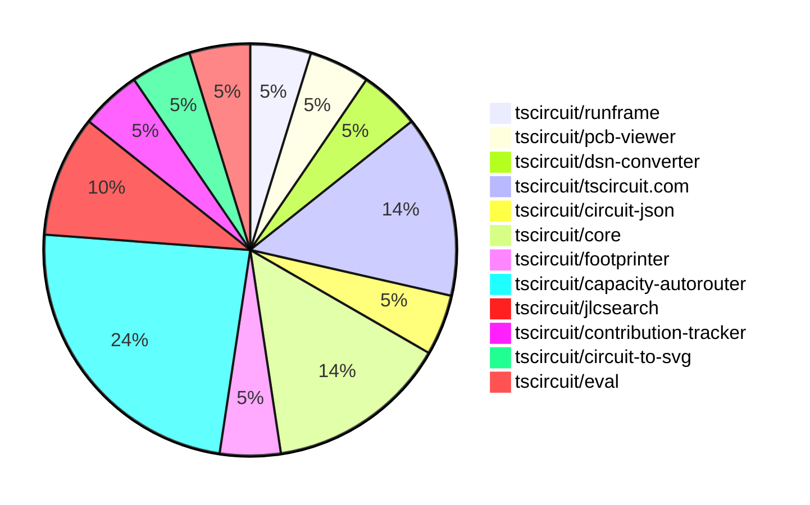

# contribution-tracker

Generates weekly contribution overviews for tscircuit contributors. Check out all
the [contribution overviews here](./contribution-overviews/)

* All PRs in the tscircuit org are scanned/summarized via Claude Haiku
* Claude classifies each Diff/PR as a Major, Minor or Tiny contribution
* All the PRs, summaries, and classifications are organized into charts and tables

The current week is shown below. There are 3 major sections:

* [Contributor Overview](#contributor-overview)
* [PRs by Repository](#prs-by-repository)
* [PRs by Contributor](#changes-by-contributor)

## Current Week

<!-- START_CURRENT_WEEK -->

# Contribution Overview 2025-03-05

## PRs by Repository

## Contributor Overview

| Contributor | 🐳 Major | 🐙 Minor | 🐌 Tiny | ⭐ | Issues Created |
|-------------|---------|---------|---------|-----|----------------|
| [seveibar](#seveibar) | 5 | 1 | 0 | ⭐⭐ | 24 |
| [imrishabh18](#imrishabh18) | 2 | 4 | 0 | ⭐⭐ | 8 |
| [ArnavK-09](#ArnavK-09) | 1 | 1 | 1 | ⭐ | 0 |
| [Abse2001](#Abse2001) | 1 | 1 | 0 | ⭐ | 0 |
| [Ayushjhawar8](#Ayushjhawar8) | 0 | 1 | 0 |  | 1 |
| [Anshgrover23](#Anshgrover23) | 0 | 1 | 0 |  | 3 |
| [MustafaMulla29](#MustafaMulla29) | 0 | 1 | 0 |  | 2 |
| [tscircuitbot](#tscircuitbot) | 0 | 0 | 1 |  | 0 |

## Review Table

[reviews-received-hover]: ## "Number of reviews received for PRs for this contributor"
[approvals-received-hover]: ## "Number of approvals received for PRs this contributor authored"
[rejections-received-hover]: ## "Number of rejections received for PRs this contributor authored"
[prs-opened-hover]: ## "Number of PRs opened by this contributor"
[issues-created-hover]: ## "Number of issues created by this contributor"
[bountied-issues-hover]: ## "Number of issues this contributor created with a bounty"
[bountied-issue-$-hover]: ## "Total bounty amount placed on issues authored by this contributor"

| Contributor | Reviews Received | Approvals Received | Rejections Received | Approvals | Rejections | PRs Opened | PRs Merged | Issues Created | Bountied Issues | Bountied Issue $ |
|---|---|---|---|---|---|---|---|---|---|---|
| [imrishabh18](#imrishabh18) | 6 | 2 | 0 | 3 | 1 | 9 | 6 | 8 | 4 | 25 |
| [seveibar](#seveibar) | 0 | 0 | 0 | 9 | 2 | 8 | 6 | 24 | 15 | 267 |
| [Abse2001](#Abse2001) | 2 | 2 | 0 | 0 | 0 | 2 | 2 | 0 | 0 | 0 |
| [ShiboSoftwareDev](#ShiboSoftwareDev) | 1 | 0 | 0 | 0 | 0 | 2 | 0 | 1 | 1 | 10 |
| [MustafaMulla29](#MustafaMulla29) | 8 | 2 | 2 | 0 | 0 | 3 | 1 | 2 | 0 | 0 |
| [techmannih](#techmannih) | 2 | 0 | 2 | 1 | 3 | 7 | 0 | 5 | 1 | 5 |
| [Rishikesh63](#Rishikesh63) | 2 | 0 | 1 | 0 | 0 | 2 | 0 | 1 | 0 | 0 |
| [Ayushjhawar8](#Ayushjhawar8) | 4 | 3 | 0 | 0 | 0 | 3 | 1 | 1 | 1 | 10 |
| [Husainj](#Husainj) | 1 | 0 | 1 | 0 | 0 | 1 | 0 | 0 | 0 | 0 |
| [Anshgrover23](#Anshgrover23) | 1 | 1 | 0 | 0 | 1 | 1 | 1 | 3 | 1 | 5 |
| [ArnavK-09](#ArnavK-09) | 2 | 2 | 0 | 0 | 0 | 3 | 3 | 0 | 0 | 0 |
| [kom-senapati](#kom-senapati) | 7 | 1 | 1 | 0 | 0 | 1 | 0 | 0 | 0 | 0 |
| [PatanSharuKhan](#PatanSharuKhan) | 0 | 0 | 0 | 0 | 0 | 3 | 0 | 0 | 0 | 0 |
| [tscircuitbot](#tscircuitbot) | 0 | 0 | 0 | 0 | 0 | 1 | 1 | 0 | 0 | 0 |

## Changes by Repository

### [tscircuit/runframe](https://github.com/tscircuit/runframe)

| PR # | Impact | Contributor | Description |
|------|--------|-------------|-------------|
| [#323](https://github.com/tscircuit/runframe/pull/323) | 🐳 Major | Abse2001 | Adds a feature to emit `onEditEvent` with an example and debounces the events to only emit the last one after dragging ends. |

### [tscircuit/pcb-viewer](https://github.com/tscircuit/pcb-viewer)

| PR # | Impact | Contributor | Description |
|------|--------|-------------|-------------|
| [#191](https://github.com/tscircuit/pcb-viewer/pull/191) | 🐙 Minor | Abse2001 | Changes the type of `EditEvent` from a union of `EditPcbComponentLocationEvent` and `EditTraceHintEvent` to just `ManualEditEvent`. |

### [tscircuit/dsn-converter](https://github.com/tscircuit/dsn-converter)

| PR # | Impact | Contributor | Description |
|------|--------|-------------|-------------|
| [#101](https://github.com/tscircuit/dsn-converter/pull/101) | 🐳 Major | imrishabh18 | Add trace thickness information from the circuit JSON to the DSN file. |

### [tscircuit/tscircuit.com](https://github.com/tscircuit/tscircuit.com)

| PR # | Impact | Contributor | Description |
|------|--------|-------------|-------------|
| [#714](https://github.com/tscircuit/tscircuit.com/pull/714) | 🐳 Major | imrishabh18 | Adds a new `/update` endpoint to the package fake API that allows updating existing packages, including privacy settings. |
| [#718](https://github.com/tscircuit/tscircuit.com/pull/718) | 🐙 Minor | imrishabh18 | Adds the support for users to have private snippets. |
| [#722](https://github.com/tscircuit/tscircuit.com/pull/722) | 🐙 Minor | Anshgrover23 | Fixes playwright tests for the editor page and footprint dialog |

### [tscircuit/circuit-json](https://github.com/tscircuit/circuit-json)

| PR # | Impact | Contributor | Description |
|------|--------|-------------|-------------|
| [#161](https://github.com/tscircuit/circuit-json/pull/161) | 🐙 Minor | imrishabh18 | Add `min_trace_thickness` property to `source_trace` object |

### [tscircuit/core](https://github.com/tscircuit/core)

| PR # | Impact | Contributor | Description |
|------|--------|-------------|-------------|
| [#696](https://github.com/tscircuit/core/pull/696) | 🐙 Minor | imrishabh18 | Add thickness to `source_trace` in the Trace component. |
| [#691](https://github.com/tscircuit/core/pull/691) | 🐙 Minor | imrishabh18 | Fix a hover bug for traces by setting the `source_trace_id` property of the `pcb_trace` object. |
| [#692](https://github.com/tscircuit/core/pull/692) | 🐙 Minor | seveibar | Update the version of the capacity autorouter dependency. |

### [tscircuit/footprinter](https://github.com/tscircuit/footprinter)

| PR # | Impact | Contributor | Description |
|------|--------|-------------|-------------|
| [#235](https://github.com/tscircuit/footprinter/pull/235) | 🐙 Minor | MustafaMulla29 | Implemented the MSOP-8 component footprint. |

### [tscircuit/capacity-autorouter](https://github.com/tscircuit/capacity-autorouter)

| PR # | Impact | Contributor | Description |
|------|--------|-------------|-------------|
| [#37](https://github.com/tscircuit/capacity-autorouter/pull/37) | 🐳 Major | seveibar | Adds a detailed JSON configuration for a keyboard design, including obstacles, trace widths, and layer count. |
| [#35](https://github.com/tscircuit/capacity-autorouter/pull/35) | 🐳 Major | seveibar | The pull request changes the implementation of the Edge Solver to only solve between layer-compatible nodes and generate single layer nodes when there's a single-layer obstacle. |
| [#34](https://github.com/tscircuit/capacity-autorouter/pull/34) | 🐳 Major | seveibar | Replace CapacitySegmentPointOptimizer with UnravelMultiSectionSolver, many fixes and optimizations with a 10x speed increase and higher quality. |
| [#33](https://github.com/tscircuit/capacity-autorouter/pull/33) | 🐳 Major | seveibar | Introduces a new UnravelSectionSolver with A* algorithm for path planning. |
| [#32](https://github.com/tscircuit/capacity-autorouter/pull/32) | 🐳 Major | seveibar | Fix major issues in Capacity Segment Optimization |

### [tscircuit/jlcsearch](https://github.com/tscircuit/jlcsearch)

| PR # | Impact | Contributor | Description |
|------|--------|-------------|-------------|
| [#36](https://github.com/tscircuit/jlcsearch/pull/36) | 🐳 Major | ArnavK-09 | Introduces a new API endpoint `/api/search` for searching components with support for full-text search, filtering by package, and limiting the number of results. |
| [#39](https://github.com/tscircuit/jlcsearch/pull/39) | 🐌 Tiny | ArnavK-09 | Removes a surplus log statement from a search API test. |

### [tscircuit/contribution-tracker](https://github.com/tscircuit/contribution-tracker)

| PR # | Impact | Contributor | Description |
|------|--------|-------------|-------------|
| [#97](https://github.com/tscircuit/contribution-tracker/pull/97) | 🐙 Minor | ArnavK-09 | Upload the Anthropic cache to GitHub Actions |

### [tscircuit/circuit-to-svg](https://github.com/tscircuit/circuit-to-svg)

| PR # | Impact | Contributor | Description |
|------|--------|-------------|-------------|
| [#191](https://github.com/tscircuit/circuit-to-svg/pull/191) | 🐙 Minor | Ayushjhawar8 | The pull request fixes an issue where the bottom layer silkscreen elements were not visually distinguishable, and adds different colors for the top (yellow) and bottom (blue) silkscreen elements. |

### [tscircuit/eval](https://github.com/tscircuit/eval)

| PR # | Impact | Contributor | Description |
|------|--------|-------------|-------------|
| [#135](https://github.com/tscircuit/eval/pull/135) | 🐌 Tiny | tscircuitbot | Update @tscircuit/core to v0.0.348 |

## Changes by Contributor

### [Abse2001](https://github.com/Abse2001)

| PR # | Impact | Description |
|------|--------|-------------|
| [#323](https://github.com/tscircuit/runframe/pull/323) | 🐳 Major | Adds a feature to emit `onEditEvent` with an example and debounces the events to only emit the last one after dragging ends. |
| [#191](https://github.com/tscircuit/pcb-viewer/pull/191) | 🐙 Minor | Changes the type of `EditEvent` from a union of `EditPcbComponentLocationEvent` and `EditTraceHintEvent` to just `ManualEditEvent`. |

### [imrishabh18](https://github.com/imrishabh18)

| PR # | Impact | Description |
|------|--------|-------------|
| [#101](https://github.com/tscircuit/dsn-converter/pull/101) | 🐳 Major | Add trace thickness information from the circuit JSON to the DSN file. |
| [#714](https://github.com/tscircuit/tscircuit.com/pull/714) | 🐳 Major | Adds a new `/update` endpoint to the package fake API that allows updating existing packages, including privacy settings. |
| [#161](https://github.com/tscircuit/circuit-json/pull/161) | 🐙 Minor | Add `min_trace_thickness` property to `source_trace` object |
| [#696](https://github.com/tscircuit/core/pull/696) | 🐙 Minor | Add thickness to `source_trace` in the Trace component. |
| [#691](https://github.com/tscircuit/core/pull/691) | 🐙 Minor | Fix a hover bug for traces by setting the `source_trace_id` property of the `pcb_trace` object. |
| [#718](https://github.com/tscircuit/tscircuit.com/pull/718) | 🐙 Minor | Adds the support for users to have private snippets. |

### [MustafaMulla29](https://github.com/MustafaMulla29)

| PR # | Impact | Description |
|------|--------|-------------|
| [#235](https://github.com/tscircuit/footprinter/pull/235) | 🐙 Minor | Implemented the MSOP-8 component footprint. |

### [seveibar](https://github.com/seveibar)

| PR # | Impact | Description |
|------|--------|-------------|
| [#37](https://github.com/tscircuit/capacity-autorouter/pull/37) | 🐳 Major | Adds a detailed JSON configuration for a keyboard design, including obstacles, trace widths, and layer count. |
| [#35](https://github.com/tscircuit/capacity-autorouter/pull/35) | 🐳 Major | The pull request changes the implementation of the Edge Solver to only solve between layer-compatible nodes and generate single layer nodes when there's a single-layer obstacle. |
| [#34](https://github.com/tscircuit/capacity-autorouter/pull/34) | 🐳 Major | Replace CapacitySegmentPointOptimizer with UnravelMultiSectionSolver, many fixes and optimizations with a 10x speed increase and higher quality. |
| [#33](https://github.com/tscircuit/capacity-autorouter/pull/33) | 🐳 Major | Introduces a new UnravelSectionSolver with A* algorithm for path planning. |
| [#32](https://github.com/tscircuit/capacity-autorouter/pull/32) | 🐳 Major | Fix major issues in Capacity Segment Optimization |
| [#692](https://github.com/tscircuit/core/pull/692) | 🐙 Minor | Update the version of the capacity autorouter dependency. |

### [ArnavK-09](https://github.com/ArnavK-09)

| PR # | Impact | Description |
|------|--------|-------------|
| [#36](https://github.com/tscircuit/jlcsearch/pull/36) | 🐳 Major | Introduces a new API endpoint `/api/search` for searching components with support for full-text search, filtering by package, and limiting the number of results. |
| [#97](https://github.com/tscircuit/contribution-tracker/pull/97) | 🐙 Minor | Upload the Anthropic cache to GitHub Actions |
| [#39](https://github.com/tscircuit/jlcsearch/pull/39) | 🐌 Tiny | Removes a surplus log statement from a search API test. |

### [Ayushjhawar8](https://github.com/Ayushjhawar8)

| PR # | Impact | Description |
|------|--------|-------------|
| [#191](https://github.com/tscircuit/circuit-to-svg/pull/191) | 🐙 Minor | The pull request fixes an issue where the bottom layer silkscreen elements were not visually distinguishable, and adds different colors for the top (yellow) and bottom (blue) silkscreen elements. |

### [Anshgrover23](https://github.com/Anshgrover23)

| PR # | Impact | Description |
|------|--------|-------------|
| [#722](https://github.com/tscircuit/tscircuit.com/pull/722) | 🐙 Minor | Fixes playwright tests for the editor page and footprint dialog |

### [tscircuitbot](https://github.com/tscircuitbot)

| PR # | Impact | Description |
|------|--------|-------------|
| [#135](https://github.com/tscircuit/eval/pull/135) | 🐌 Tiny | Update @tscircuit/core to v0.0.348 |

<!-- END_CURRENT_WEEK -->
