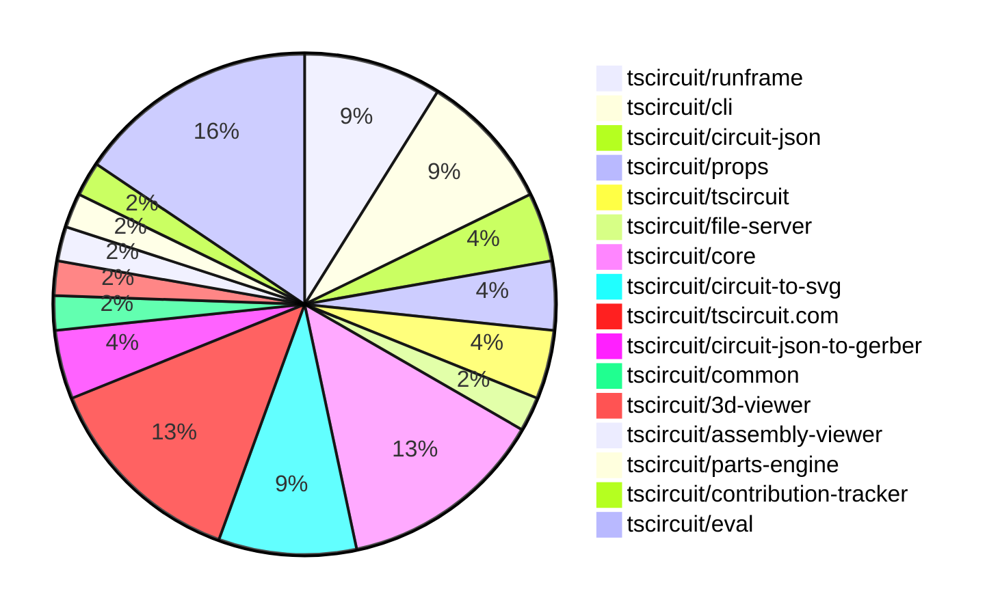
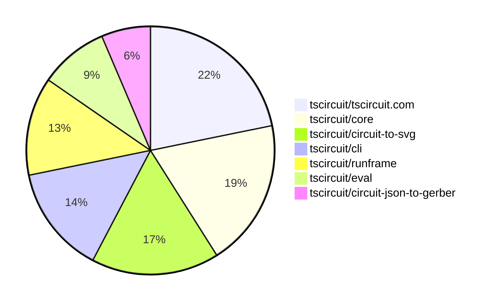

# contribution-tracker

[contributions.tscircuit.com](https://contributions.tscircuit.com) ・ [tscircuit.com](https://tscircuit.com) ・ [Contribution Overviews](./contribution-overviews/) ・ [Changelogs](./changelogs/)

Generates weekly contribution overviews for tscircuit contributors. Check out all
the [contribution overviews here](./contribution-overviews/)
You can find AI-generated monthly changelogs in the [changelogs directory](./changelogs/).

- All PRs in the tscircuit org are scanned/summarized via an LLM
- The LLM classifies each Diff/PR as into a set of attributes for scoring
- All the PRs, summaries, and classifications are organized into charts and tables for [the website](https://contributions.tscircuit.com)

> Want to run locally? See the [Development Section](#development)

The current week is shown below. There are 3 major sections:

- [Contributor Overview](#contributor-overview)
- [PRs by Repository](#prs-by-repository)
- [PRs by Contributor](#changes-by-contributor)

## Current Week

<!-- START_CURRENT_WEEK -->

# Contribution Overview 2025-09-17

## PRs by Repository



## Contributor Overview

| Contributor | 🐳 Major | 🐙 Minor | 🐌 Tiny | ⭐ | Score | Discussion Contributions |
|-------------|---------|---------|---------|-----|----------------|--------------------------|
| [seveibar](#seveibar) | 2 | 3 | 2 | ⭐⭐ | 28 | 0🔹 0🔶 0💎 |
| [imrishabh18](#imrishabh18) | 4 | 3 | 2 | ⭐⭐ | 25 | 0🔹 0🔶 0💎 |
| [ShiboSoftwareDev](#ShiboSoftwareDev) | 4 | 2 | 1 | ⭐⭐ | 25 | 0🔹 0🔶 0💎 |
| [ArnavK-09](#ArnavK-09) | 1 | 3 | 4 | ⭐⭐ | 17 | 0🔹 0🔶 0💎 |
| [Abse2001](#Abse2001) | 2 | 0 | 2 | ⭐ | 10 | 0🔹 0🔶 0💎 |
| [tscircuitbot](#tscircuitbot) | 0 | 0 | 5 | ⭐ | 5 | 0🔹 0🔶 0💎 |
| [MustafaMulla29](#MustafaMulla29) | 1 | 0 | 0 | ⭐ | 4 | 0🔹 0🔶 0💎 |
| [nailoo](#nailoo) | 1 | 0 | 0 | ⭐ | 4 | 0🔹 0🔶 0💎 |
| [0hmX](#0hmX) | 0 | 0 | 1 |  | 1 | 0🔹 0🔶 0💎 |
| [Ayushjhawar8](#Ayushjhawar8) | 0 | 0 | 1 |  | 1 | 0🔹 0🔶 0💎 |
| [devroy10](#devroy10) | 0 | 0 | 1 |  | 1 | 0🔹 0🔶 0💎 |

### Discussion Contribution Legend

- 🔹 Normal Comments: Basic participation with minimal effort
- 🔶 Great Informative Comments: Thoughtful participation that adds value
- 💎 Incredible Comments: Exceptional participation with high-quality content

## Review Table

[reviews-received-hover]: ## "Number of reviews received for PRs for this contributor"
[approvals-received-hover]: ## "Number of approvals received for PRs this contributor authored"
[rejections-received-hover]: ## "Number of rejections received for PRs this contributor authored"
[prs-opened-hover]: ## "Number of PRs opened by this contributor"
[issues-created-hover]: ## "Number of issues created by this contributor"
[bountied-issues-hover]: ## "Number of issues this contributor created with a bounty"
[bountied-issue-$-hover]: ## "Total bounty amount placed on issues authored by this contributor"

| Contributor | Reviews Received | Approvals Received | Rejections Received | Approvals | Rejections | PRs Opened | PRs Merged | Score | Issues Created | Bountied Issues | Bountied Issue $ |
|---|---|---|---|---|---|---|---|---|---|---|---|
| [sahil-ansari01](#sahil-ansari01) | 5 | 0 | 0 | 0 | 0 | 18 | 0 | 0 | 0 | 0 | 0 |
| [seveibar](#seveibar) | 2 | 0 | 0 | 24 | 3 | 13 | 8 | 28 | 0 | 0 | 0 |
| [imrishabh18](#imrishabh18) | 12 | 2 | 0 | 1 | 0 | 12 | 9 | 25 | 0 | 0 | 0 |
| [sparkybug](#sparkybug) | 0 | 0 | 0 | 0 | 0 | 1 | 0 | 0 | 0 | 0 | 0 |
| [Abse2001](#Abse2001) | 5 | 5 | 0 | 0 | 0 | 7 | 4 | 10 | 0 | 0 | 0 |
| [MustafaMulla29](#MustafaMulla29) | 0 | 0 | 0 | 0 | 0 | 1 | 1 | 4 | 0 | 0 | 0 |
| [dhvll](#dhvll) | 0 | 0 | 0 | 0 | 0 | 1 | 0 | 0 | 0 | 0 | 0 |
| [nailoo](#nailoo) | 11 | 1 | 1 | 0 | 0 | 3 | 1 | 4 | 0 | 0 | 0 |
| [0hmX](#0hmX) | 1 | 1 | 0 | 0 | 0 | 1 | 1 | 1 | 0 | 0 | 0 |
| [Copilot](#Copilot) | 0 | 0 | 0 | 0 | 0 | 1 | 0 | 0 | 0 | 0 | 0 |
| [lessuselesss](#lessuselesss) | 7 | 0 | 0 | 0 | 0 | 3 | 0 | 0 | 0 | 0 | 0 |
| [AnasSarkiz](#AnasSarkiz) | 2 | 0 | 1 | 0 | 0 | 1 | 0 | 0 | 0 | 0 | 0 |
| [ShiboSoftwareDev](#ShiboSoftwareDev) | 13 | 7 | 0 | 0 | 0 | 8 | 7 | 25 | 0 | 0 | 0 |
| [ArnavK-09](#ArnavK-09) | 19 | 9 | 0 | 3 | 0 | 10 | 8 | 17 | 0 | 0 | 0 |
| [techmannih](#techmannih) | 0 | 0 | 0 | 0 | 0 | 1 | 0 | 0 | 0 | 0 | 0 |
| [tscircuitbot](#tscircuitbot) | 0 | 0 | 0 | 0 | 0 | 11 | 5 | 5 | 0 | 0 | 0 |
| [pxlpal](#pxlpal) | 9 | 1 | 1 | 0 | 0 | 1 | 0 | 0 | 0 | 0 | 0 |
| [Ayushjhawar8](#Ayushjhawar8) | 2 | 1 | 0 | 0 | 0 | 2 | 1 | 1 | 0 | 0 | 0 |
| [AJ0070](#AJ0070) | 2 | 0 | 0 | 0 | 0 | 1 | 0 | 0 | 0 | 0 | 0 |
| [vishwamartur](#vishwamartur) | 0 | 0 | 0 | 0 | 0 | 1 | 0 | 0 | 0 | 0 | 0 |
| [devroy10](#devroy10) | 1 | 1 | 0 | 0 | 0 | 1 | 1 | 1 | 0 | 0 | 0 |

## Top 7 Repositories by Contribution Points



## Changes by Repository

### [tscircuit/runframe](https://github.com/tscircuit/runframe)

| PR # | Impact | Rating | Contributor | Description |
|------|--------|--------|-------------|-------------|
| [#1167](https://github.com/tscircuit/runframe/pull/1167) | 🐳 Major | ⭐⭐⭐ | seveibar | Persist the selected main component in the URL hash for the CLI, allowing for better state management and user experience when navigating the application. |
| [#1178](https://github.com/tscircuit/runframe/pull/1178) | 🐳 Major | ⭐⭐⭐ | ShiboSoftwareDev | Adds a new Pinout tab to the runframe which displays pins that have been explicitly marked for inclusion in the boards pinout. |

<details>
<summary>🐌 Tiny Contributions (2)</summary>

| PR # | Impact | Contributor | Description |
|------|--------|-------------|-------------|
| [#1169](https://github.com/tscircuit/runframe/pull/1169) | 🐌 Tiny | Ayushjhawar8 | When you type, it prioritizes files in your current directory at the top Files from other directories show below with their full paths Search clears automatically when you close the dropdown No more clutter from section titles since the breadcrumbs provide sufficient context |
| [#1170](https://github.com/tscircuit/runframe/pull/1170) | 🐌 Tiny | devroy10 | fixes 1168  Summary Centers the file selector without absolute positioning and constrains its width with truncation so it no longer overlaps or hides the PCBSchematic3D tabs on narrow viewports.  Changes libcomponentsRunFrameWithApiRunFrameWithApi.tsx Replace absolute-centered wrapper with flex-centered wrapper so the selector participates in layout. libcomponentsRunFrameWithApifile-selector-combobox.tsx Add responsive max-width, ellipsis truncation, and keep natural width otherwise.  Rationale Absolute positioning caused the file selector to float above and obscure the tabs at small widths. Letting it flow in flex with truncation keeps all controls accessible.  Screenshots Before: selector overlaps 3D tab and content. After: selector centered; tabs remain visible; long paths truncated with ellipsis.  Testing Manually verified at 3201440 px widths. Verified popover search and selection still work. No linter errors.  Risks Extremely narrow widths may still feel tight. Tabs now remain tappable, but we may want a future responsive collapse as CircuitJsonPreview cuts off to the right on smaller screens.  Follow-ups Discuss whether the CircuitJsonPreview should move into a kebab menu on xs widths to keep it fully selectable. |

</details>

### [tscircuit/cli](https://github.com/tscircuit/cli)

| PR # | Impact | Rating | Contributor | Description |
|------|--------|--------|-------------|-------------|
| [#362](https://github.com/tscircuit/cli/pull/362) | 🐳 Major | ⭐⭐⭐ | seveibar | Stops printing shipping information from tsci auth whoami while keeping accountsession basics and falls back to fetching account data only when the stored account id is missing. |
| [#356](https://github.com/tscircuit/cli/pull/356) | 🐳 Major | ⭐⭐⭐ | ShiboSoftwareDev | Add simulate command for running SPICE simulations and export command for saving simulation results in SPICE and CSV formats. |
| [#361](https://github.com/tscircuit/cli/pull/361) | 🐙 Minor | ⭐⭐ | seveibar | Adds support for uploading binary assets by detecting known binary file extensions and encoding them in base64, along with API changes and regression tests for binary asset propagation. |

<details>
<summary>🐌 Tiny Contributions (1)</summary>

| PR # | Impact | Contributor | Description |
|------|--------|-------------|-------------|
| [#360](https://github.com/tscircuit/cli/pull/360) | 🐌 Tiny | ArnavK-09 | Fixes the interactive command handling for cloning directories by adding user prompts for existing directories. |

</details>

### [tscircuit/circuit-json](https://github.com/tscircuit/circuit-json)

| PR # | Impact | Rating | Contributor | Description |
|------|--------|--------|-------------|-------------|
| [#287](https://github.com/tscircuit/circuit-json/pull/287) | 🐙 Minor | ⭐⭐ | seveibar | Adds optional rats_nest_color to pcb_trace definitions and docs, introduces pcb_net type with optional source_net_id and rats_nest_color, and documents new type with targeted parsing tests. |
| [#291](https://github.com/tscircuit/circuit-json/pull/291) | 🐙 Minor | ⭐⭐ | imrishabh18 | Add an is_box_with_pins flag to schematic components with a default of true, update documentation, and add tests for the new flag. |

### [tscircuit/props](https://github.com/tscircuit/props)

| PR # | Impact | Rating | Contributor | Description |
|------|--------|--------|-------------|-------------|
| [#417](https://github.com/tscircuit/props/pull/417) | 🐙 Minor | ⭐⭐ | seveibar | Adds optional ratsNestColor attribute to traces, nets, and pin attributes, allowing for color customization in circuit layouts. |

<details>
<summary>🐌 Tiny Contributions (1)</summary>

| PR # | Impact | Contributor | Description |
|------|--------|-------------|-------------|
| [#416](https://github.com/tscircuit/props/pull/416) | 🐌 Tiny | Abse2001 | Adds holeOffsetX and holeOffsetY properties to the PillPlatedHoleProps interface for better positioning of plated holes in PCB layouts |

</details>

### [tscircuit/tscircuit](https://github.com/tscircuit/tscircuit)


<details>
<summary>🐌 Tiny Contributions (2)</summary>

| PR # | Impact | Contributor | Description |
|------|--------|-------------|-------------|
| [#801](https://github.com/tscircuit/tscircuit/pull/801) | 🐌 Tiny | seveibar | Copies static asset declarations into the distribution folder during the build process and restores the dependency sync script import pattern while adding a type stub for tscircuitcorepackage.json. |
| [#799](https://github.com/tscircuit/tscircuit/pull/799) | 🐌 Tiny | imrishabh18 | Updates the version of the tscircuitprops and circuit-json dependencies in package.json |

</details>

### [tscircuit/file-server](https://github.com/tscircuit/file-server)


<details>
<summary>🐌 Tiny Contributions (1)</summary>

| PR # | Impact | Contributor | Description |
|------|--------|-------------|-------------|
| [#22](https://github.com/tscircuit/file-server/pull/22) | 🐌 Tiny | seveibar | Documents how to upload binary assets using the filesupsert endpoint, including example payload and response details. |

</details>

### [tscircuit/core](https://github.com/tscircuit/core)

| PR # | Impact | Rating | Contributor | Description |
|------|--------|--------|-------------|-------------|
| [#1375](https://github.com/tscircuit/core/pull/1375) | 🐳 Major | ⭐⭐⭐ | imrishabh18 | Adds support for custom schematic symbols using the symbol tag, allowing users to define schematic components with custom shapes and properties. |
| [#1370](https://github.com/tscircuit/core/pull/1370) | 🐳 Major | ⭐⭐⭐ | Abse2001 | Normalizes hole offsets for plated holes in rectangular pads and removes legacy handling for PCB hole offsets. |
| [#1386](https://github.com/tscircuit/core/pull/1386) | 🐙 Minor | ⭐⭐ | imrishabh18 | Removes the custom_symbol from the schematic component, ensuring that only predefined symbols are used in the schematic representation. |
| [#1367](https://github.com/tscircuit/core/pull/1367) | 🐙 Minor | ⭐⭐ | ShiboSoftwareDev | Adds support for the includeInBoardPinout property within pinAttributes, allowing ports with this attribute to be marked as board pinouts in the circuit output. |
| [#1369](https://github.com/tscircuit/core/pull/1369) | 🐙 Minor | ⭐⭐ | ArnavK-09 | Adds support for loading and handling circuitjson footprints in the PCB rendering process. |

<details>
<summary>🐌 Tiny Contributions (1)</summary>

| PR # | Impact | Contributor | Description |
|------|--------|-------------|-------------|
| [#1388](https://github.com/tscircuit/core/pull/1388) | 🐌 Tiny | 0hmX | Updates the version of the schematic-trace-solver dependency from 0.0.37 to 0.0.38 in package.json |

</details>

### [tscircuit/circuit-to-svg](https://github.com/tscircuit/circuit-to-svg)

| PR # | Impact | Rating | Contributor | Description |
|------|--------|--------|-------------|-------------|
| [#326](https://github.com/tscircuit/circuit-to-svg/pull/326) | 🐳 Major | ⭐⭐⭐⭐ | ShiboSoftwareDev | This PR introduces a new SVG generator, convertCircuitJsonToPinoutSvg, to create pinout diagrams from circuit-json. This feature is designed to produce clear, human-readable reference diagrams for physical board connections.  New Top-Level Converter: Adds convertCircuitJsonToPinoutSvg to the public API, which generates a complete SVG string.  Automatic Label Layout:  Ports marked with is_board_pinout: true are identified and labeled.  Labels are automatically grouped by the nearest board edge (top, bottom, left, right).  A layout algorithm organizes labels along each edge, using staggering and elbow connectors for leader lines to ensure clarity and avoid overlap.  Board Element Rendering: The diagram renders key physical features from the circuit-json, including:  pcb_board with complex outlines and cutouts.  pcb_smtpad (rect, circle, polygon, etc.).  pcb_plated_hole (circle, pill, etc.).  pcb_hole.  A representation of pcb_component footprints.  Comprehensive Testing: Unit tests with SVG snapshot validation have been added to cover various board shapes and pin configurations. |
| [#324](https://github.com/tscircuit/circuit-to-svg/pull/324) | 🐳 Major | ⭐⭐⭐ | imrishabh18 | Prevents the creation of a schematic box when the component is defined to use React symbols, ensuring correct rendering of schematic components without unnecessary boxes. |
| [#323](https://github.com/tscircuit/circuit-to-svg/pull/323) | 🐳 Major | ⭐⭐⭐ | imrishabh18 | Adds support for generating SVG snapshots of schematic elements including lines, rectangles, arcs, and circles. |

<details>
<summary>🐌 Tiny Contributions (1)</summary>

| PR # | Impact | Contributor | Description |
|------|--------|-------------|-------------|
| [#327](https://github.com/tscircuit/circuit-to-svg/pull/327) | 🐌 Tiny | ShiboSoftwareDev | Refactors the pinout SVG generation logic by organizing utility functions and encapsulating complex label position calculations for improved code readability and maintainability. |

</details>

### [tscircuit/tscircuit.com](https://github.com/tscircuit/tscircuit.com)

| PR # | Impact | Rating | Contributor | Description |
|------|--------|--------|-------------|-------------|
| [#1681](https://github.com/tscircuit/tscircuit.com/pull/1681) | 🐳 Major | ⭐⭐⭐ | imrishabh18 | Fixes the issue where the editor displays stale content after file deletion due to cache not being invalidated properly. |
| [#1683](https://github.com/tscircuit/tscircuit.com/pull/1683) | 🐳 Major | ⭐⭐⭐ | ArnavK-09 | Adds an organization settings page that allows users to manage organization details and members, including adding and removing members, and updating organization information. |
| [#1679](https://github.com/tscircuit/tscircuit.com/pull/1679) | 🐳 Major | ⭐⭐⭐ | nailoo | Fixes the package renaming process to ensure the updated package state is correctly reflected in the application after renaming. |
| [#1682](https://github.com/tscircuit/tscircuit.com/pull/1682) | 🐙 Minor | ⭐⭐ | imrishabh18 | Fixes the issue where clicking on the empty space in the sidebar does not de-select the currently selected file. |
| [#1684](https://github.com/tscircuit/tscircuit.com/pull/1684) | 🐙 Minor | ⭐⭐ | ArnavK-09 | Adds functionality to update organization display names in the fake production API. |

<details>
<summary>🐌 Tiny Contributions (1)</summary>

| PR # | Impact | Contributor | Description |
|------|--------|-------------|-------------|
| [#1680](https://github.com/tscircuit/tscircuit.com/pull/1680) | 🐌 Tiny | ArnavK-09 | Fixes inconsistency in package renaming functionality by ensuring the correct name is returned and displayed after a rename operation. |

</details>

### [tscircuit/circuit-json-to-gerber](https://github.com/tscircuit/circuit-json-to-gerber)

| PR # | Impact | Rating | Contributor | Description |
|------|--------|--------|-------------|-------------|
| [#58](https://github.com/tscircuit/circuit-json-to-gerber/pull/58) | 🐳 Major | ⭐⭐⭐ | Abse2001 | Adds support for pill and circle holes with offsets, introduces support for rotated pill holes, and refactors the Gerber SVG snapshot logic. |

<details>
<summary>🐌 Tiny Contributions (1)</summary>

| PR # | Impact | Contributor | Description |
|------|--------|-------------|-------------|
| [#55](https://github.com/tscircuit/circuit-json-to-gerber/pull/55) | 🐌 Tiny | imrishabh18 | Honor ccw_rotation when drawing pill plated holes so the flash and line operations follow the rotated axis and extend the pill hole test to cover rotated examples and refresh the corresponding snapshots. |

</details>

### [tscircuit/common](https://github.com/tscircuit/common)


<details>
<summary>🐌 Tiny Contributions (1)</summary>

| PR # | Impact | Contributor | Description |
|------|--------|-------------|-------------|
| [#13](https://github.com/tscircuit/common/pull/13) | 🐌 Tiny | Abse2001 | claim 2 closes 2 |

</details>

### [tscircuit/3d-viewer](https://github.com/tscircuit/3d-viewer)

| PR # | Impact | Rating | Contributor | Description |
|------|--------|--------|-------------|-------------|
| [#496](https://github.com/tscircuit/3d-viewer/pull/496) | 🐳 Major | ⭐⭐⭐ | MustafaMulla29 | Fixes the zoom functionality in the 3D view to zoom in at the cursor position instead of the center of the view. |

### [tscircuit/assembly-viewer](https://github.com/tscircuit/assembly-viewer)

| PR # | Impact | Rating | Contributor | Description |
|------|--------|--------|-------------|-------------|
| [#8](https://github.com/tscircuit/assembly-viewer/pull/8) | 🐳 Major | ⭐⭐⭐ | ShiboSoftwareDev | Add PinoutViewer component that renders a pinout diagram using circuit-to-svg library. |

### [tscircuit/parts-engine](https://github.com/tscircuit/parts-engine)

| PR # | Impact | Rating | Contributor | Description |
|------|--------|--------|-------------|-------------|
| [#13](https://github.com/tscircuit/parts-engine/pull/13) | 🐙 Minor | ⭐⭐ | ShiboSoftwareDev | Adds support for sourcing JLC parts using KiCad footprint strings by implementing a helper function to parse KiCad formats into standard package names for JLCPCB API. |

### [tscircuit/contribution-tracker](https://github.com/tscircuit/contribution-tracker)

| PR # | Impact | Rating | Contributor | Description |
|------|--------|--------|-------------|-------------|
| [#222](https://github.com/tscircuit/contribution-tracker/pull/222) | 🐙 Minor | ⭐⭐ | ArnavK-09 | Adds a feature to send notifications to a Discord channel when a user is crowned as the top contributor for the week. |

### [tscircuit/eval](https://github.com/tscircuit/eval)


<details>
<summary>🐌 Tiny Contributions (7)</summary>

| PR # | Impact | Contributor | Description |
|------|--------|-------------|-------------|
| [#1089](https://github.com/tscircuit/eval/pull/1089) | 🐌 Tiny | ArnavK-09 | Adds multiple steps to the GitHub Actions workflow to wait for various test checks to complete before merging a pull request. |
| [#1083](https://github.com/tscircuit/eval/pull/1083) | 🐌 Tiny | ArnavK-09 | Adds an auto-merge workflow for pull requests created by the tscircuitbot, enabling automatic merging of specific PRs after required checks are completed. |
| [#1096](https://github.com/tscircuit/eval/pull/1096) | 🐌 Tiny | tscircuitbot | Updates the tscircuitcore dependency from version 0.0.738 to 0.0.739 in the package.json file. |
| [#1093](https://github.com/tscircuit/eval/pull/1093) | 🐌 Tiny | tscircuitbot | Automated update of tscircuitcore to v0.0.738. |
| [#1092](https://github.com/tscircuit/eval/pull/1092) | 🐌 Tiny | tscircuitbot | Updates the tscircuitcore package from version 0.0.736 to 0.0.737 and updates the tscircuitprops package from version 0.0.334 to 0.0.335, as well as the circuit-to-svg package from version 0.0.194 to 0.0.196. |
| [#1090](https://github.com/tscircuit/eval/pull/1090) | 🐌 Tiny | tscircuitbot | Updates the tscircuitcore dependency to version 0.0.736 in the package.json file. |
| [#1087](https://github.com/tscircuit/eval/pull/1087) | 🐌 Tiny | tscircuitbot | Automated update of tscircuitcore to v0.0.735. |

</details>

## Changes by Contributor

### [seveibar](https://github.com/seveibar)

| PRs # | Impact | Rating | Description |
|------|--------|--------|-------------|
| [#1167](https://github.com/tscircuit/runframe/pull/1167) | 🐳 Major | ⭐⭐⭐ | Persist the selected main component in the URL hash for the CLI, allowing for better state management and user experience when navigating the application. |
| [#362](https://github.com/tscircuit/cli/pull/362) | 🐳 Major | ⭐⭐⭐ | Stops printing shipping information from tsci auth whoami while keeping accountsession basics and falls back to fetching account data only when the stored account id is missing. |
| [#287](https://github.com/tscircuit/circuit-json/pull/287) | 🐙 Minor | ⭐⭐ | Adds optional rats_nest_color to pcb_trace definitions and docs, introduces pcb_net type with optional source_net_id and rats_nest_color, and documents new type with targeted parsing tests. |
| [#417](https://github.com/tscircuit/props/pull/417) | 🐙 Minor | ⭐⭐ | Adds optional ratsNestColor attribute to traces, nets, and pin attributes, allowing for color customization in circuit layouts. |
| [#361](https://github.com/tscircuit/cli/pull/361) | 🐙 Minor | ⭐⭐ | Adds support for uploading binary assets by detecting known binary file extensions and encoding them in base64, along with API changes and regression tests for binary asset propagation. |

<details>
<summary>🐌 Tiny Contributions (2)</summary>

| PR # | Impact | Description |
|------|--------|-------------|
| [#801](https://github.com/tscircuit/tscircuit/pull/801) | 🐌 Tiny | Copies static asset declarations into the distribution folder during the build process and restores the dependency sync script import pattern while adding a type stub for tscircuitcorepackage.json. |
| [#22](https://github.com/tscircuit/file-server/pull/22) | 🐌 Tiny | Documents how to upload binary assets using the filesupsert endpoint, including example payload and response details. |

</details>

### [imrishabh18](https://github.com/imrishabh18)

| PRs # | Impact | Rating | Description |
|------|--------|--------|-------------|
| [#1375](https://github.com/tscircuit/core/pull/1375) | 🐳 Major | ⭐⭐⭐ | Adds support for custom schematic symbols using the symbol tag, allowing users to define schematic components with custom shapes and properties. |
| [#324](https://github.com/tscircuit/circuit-to-svg/pull/324) | 🐳 Major | ⭐⭐⭐ | Prevents the creation of a schematic box when the component is defined to use React symbols, ensuring correct rendering of schematic components without unnecessary boxes. |
| [#323](https://github.com/tscircuit/circuit-to-svg/pull/323) | 🐳 Major | ⭐⭐⭐ | Adds support for generating SVG snapshots of schematic elements including lines, rectangles, arcs, and circles. |
| [#1681](https://github.com/tscircuit/tscircuit.com/pull/1681) | 🐳 Major | ⭐⭐⭐ | Fixes the issue where the editor displays stale content after file deletion due to cache not being invalidated properly. |
| [#291](https://github.com/tscircuit/circuit-json/pull/291) | 🐙 Minor | ⭐⭐ | Add an is_box_with_pins flag to schematic components with a default of true, update documentation, and add tests for the new flag. |
| [#1386](https://github.com/tscircuit/core/pull/1386) | 🐙 Minor | ⭐⭐ | Removes the custom_symbol from the schematic component, ensuring that only predefined symbols are used in the schematic representation. |
| [#1682](https://github.com/tscircuit/tscircuit.com/pull/1682) | 🐙 Minor | ⭐⭐ | Fixes the issue where clicking on the empty space in the sidebar does not de-select the currently selected file. |

<details>
<summary>🐌 Tiny Contributions (2)</summary>

| PR # | Impact | Description |
|------|--------|-------------|
| [#799](https://github.com/tscircuit/tscircuit/pull/799) | 🐌 Tiny | Updates the version of the tscircuitprops and circuit-json dependencies in package.json |
| [#55](https://github.com/tscircuit/circuit-json-to-gerber/pull/55) | 🐌 Tiny | Honor ccw_rotation when drawing pill plated holes so the flash and line operations follow the rotated axis and extend the pill hole test to cover rotated examples and refresh the corresponding snapshots. |

</details>

### [Abse2001](https://github.com/Abse2001)

| PRs # | Impact | Rating | Description |
|------|--------|--------|-------------|
| [#1370](https://github.com/tscircuit/core/pull/1370) | 🐳 Major | ⭐⭐⭐ | Normalizes hole offsets for plated holes in rectangular pads and removes legacy handling for PCB hole offsets. |
| [#58](https://github.com/tscircuit/circuit-json-to-gerber/pull/58) | 🐳 Major | ⭐⭐⭐ | Adds support for pill and circle holes with offsets, introduces support for rotated pill holes, and refactors the Gerber SVG snapshot logic. |

<details>
<summary>🐌 Tiny Contributions (2)</summary>

| PR # | Impact | Description |
|------|--------|-------------|
| [#416](https://github.com/tscircuit/props/pull/416) | 🐌 Tiny | Adds holeOffsetX and holeOffsetY properties to the PillPlatedHoleProps interface for better positioning of plated holes in PCB layouts |
| [#13](https://github.com/tscircuit/common/pull/13) | 🐌 Tiny | claim 2 closes 2 |

</details>

### [MustafaMulla29](https://github.com/MustafaMulla29)

| PRs # | Impact | Rating | Description |
|------|--------|--------|-------------|
| [#496](https://github.com/tscircuit/3d-viewer/pull/496) | 🐳 Major | ⭐⭐⭐ | Fixes the zoom functionality in the 3D view to zoom in at the cursor position instead of the center of the view. |

### [0hmX](https://github.com/0hmX)


<details>
<summary>🐌 Tiny Contributions (1)</summary>

| PR # | Impact | Description |
|------|--------|-------------|
| [#1388](https://github.com/tscircuit/core/pull/1388) | 🐌 Tiny | Updates the version of the schematic-trace-solver dependency from 0.0.37 to 0.0.38 in package.json |

</details>

### [ShiboSoftwareDev](https://github.com/ShiboSoftwareDev)

| PRs # | Impact | Rating | Description |
|------|--------|--------|-------------|
| [#326](https://github.com/tscircuit/circuit-to-svg/pull/326) | 🐳 Major | ⭐⭐⭐⭐ | This PR introduces a new SVG generator, convertCircuitJsonToPinoutSvg, to create pinout diagrams from circuit-json. This feature is designed to produce clear, human-readable reference diagrams for physical board connections.  New Top-Level Converter: Adds convertCircuitJsonToPinoutSvg to the public API, which generates a complete SVG string.  Automatic Label Layout:  Ports marked with is_board_pinout: true are identified and labeled.  Labels are automatically grouped by the nearest board edge (top, bottom, left, right).  A layout algorithm organizes labels along each edge, using staggering and elbow connectors for leader lines to ensure clarity and avoid overlap.  Board Element Rendering: The diagram renders key physical features from the circuit-json, including:  pcb_board with complex outlines and cutouts.  pcb_smtpad (rect, circle, polygon, etc.).  pcb_plated_hole (circle, pill, etc.).  pcb_hole.  A representation of pcb_component footprints.  Comprehensive Testing: Unit tests with SVG snapshot validation have been added to cover various board shapes and pin configurations. |
| [#1178](https://github.com/tscircuit/runframe/pull/1178) | 🐳 Major | ⭐⭐⭐ | Adds a new Pinout tab to the runframe which displays pins that have been explicitly marked for inclusion in the boards pinout. |
| [#356](https://github.com/tscircuit/cli/pull/356) | 🐳 Major | ⭐⭐⭐ | Add simulate command for running SPICE simulations and export command for saving simulation results in SPICE and CSV formats. |
| [#8](https://github.com/tscircuit/assembly-viewer/pull/8) | 🐳 Major | ⭐⭐⭐ | Add PinoutViewer component that renders a pinout diagram using circuit-to-svg library. |
| [#1367](https://github.com/tscircuit/core/pull/1367) | 🐙 Minor | ⭐⭐ | Adds support for the includeInBoardPinout property within pinAttributes, allowing ports with this attribute to be marked as board pinouts in the circuit output. |
| [#13](https://github.com/tscircuit/parts-engine/pull/13) | 🐙 Minor | ⭐⭐ | Adds support for sourcing JLC parts using KiCad footprint strings by implementing a helper function to parse KiCad formats into standard package names for JLCPCB API. |

<details>
<summary>🐌 Tiny Contributions (1)</summary>

| PR # | Impact | Description |
|------|--------|-------------|
| [#327](https://github.com/tscircuit/circuit-to-svg/pull/327) | 🐌 Tiny | Refactors the pinout SVG generation logic by organizing utility functions and encapsulating complex label position calculations for improved code readability and maintainability. |

</details>

### [ArnavK-09](https://github.com/ArnavK-09)

| PRs # | Impact | Rating | Description |
|------|--------|--------|-------------|
| [#1683](https://github.com/tscircuit/tscircuit.com/pull/1683) | 🐳 Major | ⭐⭐⭐ | Adds an organization settings page that allows users to manage organization details and members, including adding and removing members, and updating organization information. |
| [#1369](https://github.com/tscircuit/core/pull/1369) | 🐙 Minor | ⭐⭐ | Adds support for loading and handling circuitjson footprints in the PCB rendering process. |
| [#222](https://github.com/tscircuit/contribution-tracker/pull/222) | 🐙 Minor | ⭐⭐ | Adds a feature to send notifications to a Discord channel when a user is crowned as the top contributor for the week. |
| [#1684](https://github.com/tscircuit/tscircuit.com/pull/1684) | 🐙 Minor | ⭐⭐ | Adds functionality to update organization display names in the fake production API. |

<details>
<summary>🐌 Tiny Contributions (4)</summary>

| PR # | Impact | Description |
|------|--------|-------------|
| [#1680](https://github.com/tscircuit/tscircuit.com/pull/1680) | 🐌 Tiny | Fixes inconsistency in package renaming functionality by ensuring the correct name is returned and displayed after a rename operation. |
| [#1089](https://github.com/tscircuit/eval/pull/1089) | 🐌 Tiny | Adds multiple steps to the GitHub Actions workflow to wait for various test checks to complete before merging a pull request. |
| [#1083](https://github.com/tscircuit/eval/pull/1083) | 🐌 Tiny | Adds an auto-merge workflow for pull requests created by the tscircuitbot, enabling automatic merging of specific PRs after required checks are completed. |
| [#360](https://github.com/tscircuit/cli/pull/360) | 🐌 Tiny | Fixes the interactive command handling for cloning directories by adding user prompts for existing directories. |

</details>

### [nailoo](https://github.com/nailoo)

| PRs # | Impact | Rating | Description |
|------|--------|--------|-------------|
| [#1679](https://github.com/tscircuit/tscircuit.com/pull/1679) | 🐳 Major | ⭐⭐⭐ | Fixes the package renaming process to ensure the updated package state is correctly reflected in the application after renaming. |

### [tscircuitbot](https://github.com/tscircuitbot)


<details>
<summary>🐌 Tiny Contributions (5)</summary>

| PR # | Impact | Description |
|------|--------|-------------|
| [#1096](https://github.com/tscircuit/eval/pull/1096) | 🐌 Tiny | Updates the tscircuitcore dependency from version 0.0.738 to 0.0.739 in the package.json file. |
| [#1093](https://github.com/tscircuit/eval/pull/1093) | 🐌 Tiny | Automated update of tscircuitcore to v0.0.738. |
| [#1092](https://github.com/tscircuit/eval/pull/1092) | 🐌 Tiny | Updates the tscircuitcore package from version 0.0.736 to 0.0.737 and updates the tscircuitprops package from version 0.0.334 to 0.0.335, as well as the circuit-to-svg package from version 0.0.194 to 0.0.196. |
| [#1090](https://github.com/tscircuit/eval/pull/1090) | 🐌 Tiny | Updates the tscircuitcore dependency to version 0.0.736 in the package.json file. |
| [#1087](https://github.com/tscircuit/eval/pull/1087) | 🐌 Tiny | Automated update of tscircuitcore to v0.0.735. |

</details>

### [Ayushjhawar8](https://github.com/Ayushjhawar8)


<details>
<summary>🐌 Tiny Contributions (1)</summary>

| PR # | Impact | Description |
|------|--------|-------------|
| [#1169](https://github.com/tscircuit/runframe/pull/1169) | 🐌 Tiny | When you type, it prioritizes files in your current directory at the top Files from other directories show below with their full paths Search clears automatically when you close the dropdown No more clutter from section titles since the breadcrumbs provide sufficient context |

</details>

### [devroy10](https://github.com/devroy10)


<details>
<summary>🐌 Tiny Contributions (1)</summary>

| PR # | Impact | Description |
|------|--------|-------------|
| [#1170](https://github.com/tscircuit/runframe/pull/1170) | 🐌 Tiny | fixes 1168  Summary Centers the file selector without absolute positioning and constrains its width with truncation so it no longer overlaps or hides the PCBSchematic3D tabs on narrow viewports.  Changes libcomponentsRunFrameWithApiRunFrameWithApi.tsx Replace absolute-centered wrapper with flex-centered wrapper so the selector participates in layout. libcomponentsRunFrameWithApifile-selector-combobox.tsx Add responsive max-width, ellipsis truncation, and keep natural width otherwise.  Rationale Absolute positioning caused the file selector to float above and obscure the tabs at small widths. Letting it flow in flex with truncation keeps all controls accessible.  Screenshots Before: selector overlaps 3D tab and content. After: selector centered; tabs remain visible; long paths truncated with ellipsis.  Testing Manually verified at 3201440 px widths. Verified popover search and selection still work. No linter errors.  Risks Extremely narrow widths may still feel tight. Tabs now remain tappable, but we may want a future responsive collapse as CircuitJsonPreview cuts off to the right on smaller screens.  Follow-ups Discuss whether the CircuitJsonPreview should move into a kebab menu on xs widths to keep it fully selectable. |

</details>

## Repository Owners

| Repository | Codeowners |
|------------|------------|
| [builder](https://github.com/tscircuit/builder/blob/main/.github/CODEOWNERS) | [seveibar](https://github.com/seveibar)
| [pcb-viewer](https://github.com/tscircuit/pcb-viewer/blob/main/.github/CODEOWNERS) | [seveibar](https://github.com/seveibar), [ShiboSoftwareDev](https://github.com/ShiboSoftwareDev)
| [footprints-old](https://github.com/tscircuit/footprints-old/blob/main/.github/CODEOWNERS) | [seveibar](https://github.com/seveibar)
| [footprinter](https://github.com/tscircuit/footprinter/blob/main/.github/CODEOWNERS) | [seveibar](https://github.com/seveibar), [techmannih](https://github.com/techmannih)
| [3d-viewer](https://github.com/tscircuit/3d-viewer/blob/main/.github/CODEOWNERS) | [ShiboSoftwareDev](https://github.com/ShiboSoftwareDev)
| [winterspec](https://github.com/tscircuit/winterspec/blob/main/.github/CODEOWNERS) | [seveibar](https://github.com/seveibar), [ShiboSoftwareDev](https://github.com/ShiboSoftwareDev)
| [jscad-electronics](https://github.com/tscircuit/jscad-electronics/blob/main/.github/CODEOWNERS) | [seveibar](https://github.com/seveibar), [abhijitxy](https://github.com/abhijitxy), [anas-sarkez](https://github.com/anas-sarkez)
| [circuit-to-svg](https://github.com/tscircuit/circuit-to-svg/blob/main/.github/CODEOWNERS) | [imrishabh18](https://github.com/imrishabh18)
| [schematic-symbols](https://github.com/tscircuit/schematic-symbols/blob/main/.github/CODEOWNERS) | [seveibar](https://github.com/seveibar), [imrishabh18](https://github.com/imrishabh18), [techmannih](https://github.com/techmannih)
| [circuit-json-to-gerber](https://github.com/tscircuit/circuit-json-to-gerber/blob/main/.github/CODEOWNERS) | [seveibar](https://github.com/seveibar), [ShiboSoftwareDev](https://github.com/ShiboSoftwareDev)
| [tscircuit.com](https://github.com/tscircuit/tscircuit.com/blob/main/.github/CODEOWNERS) | [seveibar](https://github.com/seveibar), [imrishabh18](https://github.com/imrishabh18)
| [cli](https://github.com/tscircuit/cli/blob/main/.github/CODEOWNERS) | [seveibar](https://github.com/seveibar), [imrishabh18](https://github.com/imrishabh18), [ArnavK-09](https://github.com/ArnavK-09)
| [issue-roulette](https://github.com/tscircuit/issue-roulette/blob/main/.github/CODEOWNERS) | [Anshgrover23](https://github.com/Anshgrover23)
| [sparkfun-boards](https://github.com/tscircuit/sparkfun-boards/blob/main/.github/CODEOWNERS) | [ShiboSoftwareDev](https://github.com/ShiboSoftwareDev), [Abse2001](https://github.com/Abse2001), [MustafaMulla29](https://github.com/MustafaMulla29), [Anshgrover23](https://github.com/Anshgrover23), [techmannih](https://github.com/techmannih)
| [schematic-corpus](https://github.com/tscircuit/schematic-corpus/blob/main/.github/CODEOWNERS) | [Abse2001](https://github.com/Abse2001)

## Repositories by Owner

| User | Repo |
|------|------|
| [seveibar](https://github.com/seveibar) | [builder](https://github.com/tscircuit/builder/blob/main/.github/CODEOWNERS) |
|  | [pcb-viewer](https://github.com/tscircuit/pcb-viewer/blob/main/.github/CODEOWNERS) |
|  | [footprints-old](https://github.com/tscircuit/footprints-old/blob/main/.github/CODEOWNERS) |
|  | [footprinter](https://github.com/tscircuit/footprinter/blob/main/.github/CODEOWNERS) |
|  | [winterspec](https://github.com/tscircuit/winterspec/blob/main/.github/CODEOWNERS) |
|  | [jscad-electronics](https://github.com/tscircuit/jscad-electronics/blob/main/.github/CODEOWNERS) |
|  | [schematic-symbols](https://github.com/tscircuit/schematic-symbols/blob/main/.github/CODEOWNERS) |
|  | [circuit-json-to-gerber](https://github.com/tscircuit/circuit-json-to-gerber/blob/main/.github/CODEOWNERS) |
|  | [tscircuit.com](https://github.com/tscircuit/tscircuit.com/blob/main/.github/CODEOWNERS) |
|  | [cli](https://github.com/tscircuit/cli/blob/main/.github/CODEOWNERS) |
| [ShiboSoftwareDev](https://github.com/ShiboSoftwareDev) | [pcb-viewer](https://github.com/tscircuit/pcb-viewer/blob/main/.github/CODEOWNERS) |
|  | [3d-viewer](https://github.com/tscircuit/3d-viewer/blob/main/.github/CODEOWNERS) |
|  | [winterspec](https://github.com/tscircuit/winterspec/blob/main/.github/CODEOWNERS) |
|  | [circuit-json-to-gerber](https://github.com/tscircuit/circuit-json-to-gerber/blob/main/.github/CODEOWNERS) |
|  | [sparkfun-boards](https://github.com/tscircuit/sparkfun-boards/blob/main/.github/CODEOWNERS) |
| [techmannih](https://github.com/techmannih) | [footprinter](https://github.com/tscircuit/footprinter/blob/main/.github/CODEOWNERS) |
|  | [schematic-symbols](https://github.com/tscircuit/schematic-symbols/blob/main/.github/CODEOWNERS) |
|  | [sparkfun-boards](https://github.com/tscircuit/sparkfun-boards/blob/main/.github/CODEOWNERS) |
| [abhijitxy](https://github.com/abhijitxy) | [jscad-electronics](https://github.com/tscircuit/jscad-electronics/blob/main/.github/CODEOWNERS) |
| [anas-sarkez](https://github.com/anas-sarkez) | [jscad-electronics](https://github.com/tscircuit/jscad-electronics/blob/main/.github/CODEOWNERS) |
| [imrishabh18](https://github.com/imrishabh18) | [circuit-to-svg](https://github.com/tscircuit/circuit-to-svg/blob/main/.github/CODEOWNERS) |
|  | [schematic-symbols](https://github.com/tscircuit/schematic-symbols/blob/main/.github/CODEOWNERS) |
|  | [tscircuit.com](https://github.com/tscircuit/tscircuit.com/blob/main/.github/CODEOWNERS) |
|  | [cli](https://github.com/tscircuit/cli/blob/main/.github/CODEOWNERS) |
| [ArnavK-09](https://github.com/ArnavK-09) | [cli](https://github.com/tscircuit/cli/blob/main/.github/CODEOWNERS) |
| [Anshgrover23](https://github.com/Anshgrover23) | [issue-roulette](https://github.com/tscircuit/issue-roulette/blob/main/.github/CODEOWNERS) |
|  | [sparkfun-boards](https://github.com/tscircuit/sparkfun-boards/blob/main/.github/CODEOWNERS) |
| [Abse2001](https://github.com/Abse2001) | [sparkfun-boards](https://github.com/tscircuit/sparkfun-boards/blob/main/.github/CODEOWNERS) |
|  | [schematic-corpus](https://github.com/tscircuit/schematic-corpus/blob/main/.github/CODEOWNERS) |
| [MustafaMulla29](https://github.com/MustafaMulla29) | [sparkfun-boards](https://github.com/tscircuit/sparkfun-boards/blob/main/.github/CODEOWNERS) |


<!-- END_CURRENT_WEEK -->


## Development

### Prerequisites

- [Bun](https://bun.sh/) runtime
- `.env` file with required API keys:
  ```
  GITHUB_TOKEN=your_github_token
  OPENAI_API_KEY=your_openai_api_key
  DISCORD_TOKEN=your_discord_token (optional, for Discord integration)
  SLACK_BOT_TOKEN=your_slack_token (optional, for Slack integration)
  ```

### Available Scripts

#### Core Generation Scripts

- `bun run generate:weekly` - Generate current week's contribution overview
- `bun run generate:monthly` - Generate current month's contribution overview
- `bun run generate:changelog` - Generate monthly changelog from PRs

#### Analysis & Testing

- `bun run analyze-pr` - Analyze a single PR (interactive prompt)
- `bun run test:github` - Test GitHub API integration

#### Notifications & Sync

- `bun run notifications:issues` - Send notifications for new issues
- `bun run notifications:pr` - Send notifications for new PRs
- `bun run sync:discord` - Sync contributor roles with Discord

#### Data Export

- `bun run export:sponsorship` - Generate sponsorship data CSV

#### Development

- `bun run dev` - Start development server for web UI
- `bun run build` - Build for production
- `bun run format` - Format code with Biome

### Usage Examples

```bash
# Generate this week's contribution overview
bun run generate:weekly

# Generate current month's overview
bun run generate:monthly

# Analyze a specific PR
bun run analyze-pr

# Test your GitHub token setup
bun run test:github
```
