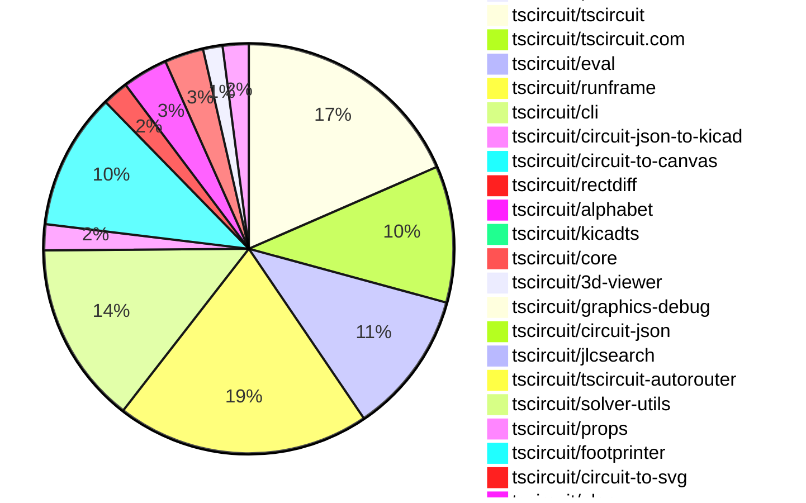
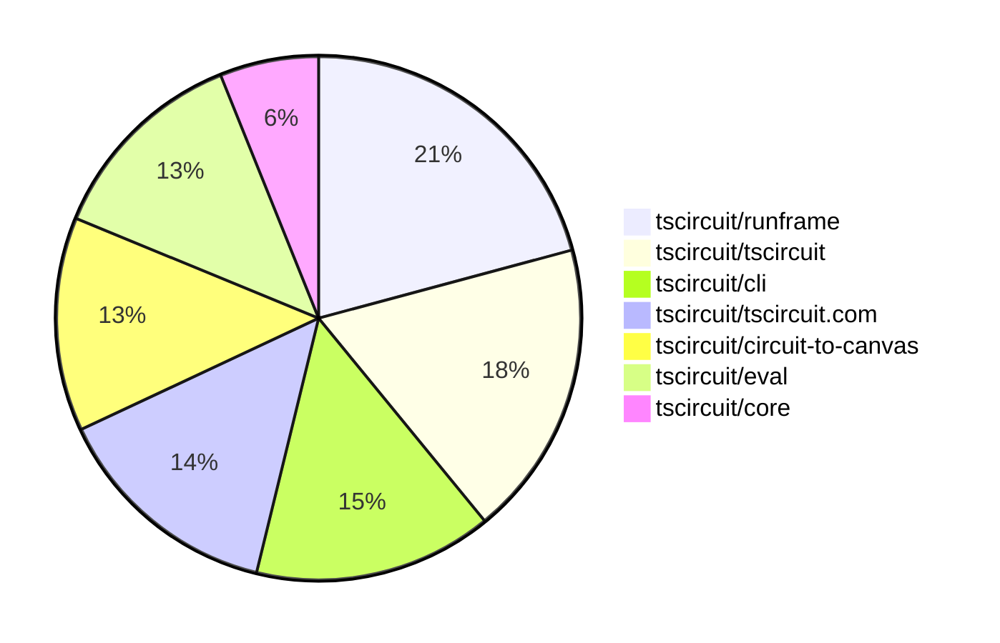

# contribution-tracker

[contributions.tscircuit.com](https://contributions.tscircuit.com) ・ [tscircuit.com](https://tscircuit.com) ・ [Contribution Overviews](./contribution-overviews/) ・ [Changelogs](./changelogs/)

Generates weekly contribution overviews for tscircuit contributors. Check out all
the [contribution overviews here](./contribution-overviews/)
You can find AI-generated monthly changelogs in the [changelogs directory](./changelogs/)

- All PRs in the tscircuit org are scanned/summarized via an LLM
- The LLM classifies each Diff/PR as into a set of attributes for scoring
- All the PRs, summaries, and classifications are organized into charts and tables for [the website](https://contributions.tscircuit.com)

> Want to run locally? See the [Development Section](#development)

The current week is shown below. There are 4 major sections:

- [Contributor Overview](#contributor-overview)
- [PRs by Repository](#prs-by-repository)
- [PRs by Contributor](#changes-by-contributor)
- [Scoring & Sponsorship System](#scoring--sponsorship-system)

## Current Week

<!-- START_CURRENT_WEEK -->

# Contribution Overview 2025-12-17

The current week is shown below. There are 4 major sections:

- [Contributor Overview](#contributor-overview)
- [PRs by Repository](#prs-by-repository)
- [PRs by Contributor](#changes-by-contributor)
- [Scoring & Sponsorship System](#scoring--sponsorship-system)

## PRs by Repository



## Contributor Overview

| Contributor | 🐳 Major | 🐙 Minor | 🐌 Tiny | ⭐ | Score | Discussion Contributions |
|-------------|---------|---------|---------|-----|----------------|--------------------------|
| [seveibar](#seveibar) | 3 | 7 | 6 | ⭐⭐⭐ | 33 | 0🔹 0🔶 0💎 |
| [techmannih](#techmannih) | 0 | 7 | 8 | ⭐⭐ | 26 | 0🔹 0🔶 0💎 |
| [imrishabh18](#imrishabh18) | 0 | 7 | 10 | ⭐⭐ | 25 | 0🔹 0🔶 0💎 |
| [MustafaMulla29](#MustafaMulla29) | 3 | 0 | 3 | ⭐⭐ | 15 | 0🔹 0🔶 0💎 |
| [tscircuitbot](#tscircuitbot) | 0 | 0 | 139 | ⭐⭐ | 12 | 0🔹 0🔶 0💎 |
| [pxlpal](#pxlpal) | 2 | 0 | 0 | ⭐ | 8 | 0🔹 0🔶 0💎 |
| [Ayushjhawar8](#Ayushjhawar8) | 0 | 1 | 4 | ⭐ | 6 | 0🔹 0🔶 0💎 |
| [0hmX](#0hmX) | 1 | 1 | 0 | ⭐ | 6 | 0🔹 0🔶 0💎 |
| [ShiboSoftwareDev](#ShiboSoftwareDev) | 0 | 2 | 0 | ⭐ | 5 | 0🔹 0🔶 0💎 |
| [Abse2001](#Abse2001) | 0 | 2 | 0 | ⭐ | 4 | 0🔹 0🔶 0💎 |
| [Juste-Leo2](#Juste-Leo2) | 0 | 0 | 1 |  | 1 | 0🔹 0🔶 0💎 |

> Note: AI evaluates PRs and assigns 1-3 star ratings automatically. 4 and 5 star ratings require manual staff review.

### Discussion Contribution Legend

- 🔹 Normal Comments: Basic participation with minimal effort
- 🔶 Great Informative Comments: Thoughtful participation that adds value
- 💎 Incredible Comments: Exceptional participation with high-quality content

## Review Table

[reviews-received-hover]: ## "Number of reviews received for PRs for this contributor"
[approvals-received-hover]: ## "Number of approvals received for PRs this contributor authored"
[rejections-received-hover]: ## "Number of rejections received for PRs this contributor authored"
[prs-opened-hover]: ## "Number of PRs opened by this contributor"
[issues-created-hover]: ## "Number of issues created by this contributor"
[bountied-issues-hover]: ## "Number of issues this contributor created with a bounty"
[bountied-issue-$-hover]: ## "Total bounty amount placed on issues authored by this contributor"

| Contributor | Reviews Received | Approvals Received | Rejections Received | Approvals | Rejections | PRs Opened | PRs Merged | Score | Issues Created | Bountied Issues | Bountied Issue $ |
|---|---|---|---|---|---|---|---|---|---|---|---|
| [tscircuitbot](#tscircuitbot) | 5 | 0 | 0 | 0 | 0 | 196 | 139 | 12 | 0 | 0 | 0 |
| [techmannih](#techmannih) | 12 | 9 | 1 | 1 | 1 | 18 | 15 | 26 | 0 | 0 | 0 |
| [imrishabh18](#imrishabh18) | 3 | 1 | 0 | 10 | 1 | 19 | 17 | 25 | 0 | 0 | 0 |
| [MustafaMulla29](#MustafaMulla29) | 13 | 5 | 1 | 0 | 0 | 12 | 6 | 15 | 0 | 0 | 0 |
| [ShiboSoftwareDev](#ShiboSoftwareDev) | 4 | 2 | 1 | 0 | 0 | 3 | 2 | 5 | 0 | 0 | 0 |
| [seveibar](#seveibar) | 4 | 0 | 0 | 23 | 7 | 24 | 16 | 33 | 0 | 0 | 0 |
| [Juste-Leo2](#Juste-Leo2) | 7 | 2 | 0 | 0 | 0 | 2 | 1 | 1 | 0 | 0 | 0 |
| [Abse2001](#Abse2001) | 14 | 3 | 0 | 0 | 0 | 3 | 2 | 4 | 0 | 0 | 0 |
| [Ayushjhawar8](#Ayushjhawar8) | 11 | 6 | 3 | 0 | 0 | 7 | 5 | 6 | 0 | 0 | 0 |
| [pxlpal](#pxlpal) | 2 | 2 | 0 | 0 | 0 | 2 | 2 | 8 | 0 | 0 | 0 |
| [rushabhcodes](#rushabhcodes) | 14 | 1 | 2 | 0 | 0 | 5 | 0 | 0 | 0 | 0 | 0 |
| [shehaban](#shehaban) | 0 | 0 | 0 | 0 | 0 | 1 | 0 | 0 | 0 | 0 | 0 |
| [0hmX](#0hmX) | 9 | 3 | 1 | 0 | 0 | 7 | 2 | 6 | 0 | 0 | 0 |

## Top 7 Repositories by Contribution Points



## Scoring & Sponsorship System

### Overview

PRs are analyzed by AI and assigned a **star rating (1-3 stars)**. 4 and 5 star ratings can only be manually assigned by staff. Weekly scores use `2^(starRating - 1)` per PR (capped at 12 PRs per rating), plus review/discussion points.

### Weekly Score → Star String

| Score Range | Star String | Count Value |
|------------|-------------|-------------|
| 0-3 | (empty) | 0 stars |
| 4-10 | ⭐ | 1 star |
| 11-30 | ⭐⭐ | 2 stars |
| 31-50 | ⭐⭐⭐ | 3 stars |
| 51-75 | 👑 | 1 crown |
| 76-100 | 👑👑 | 2 crowns |
| 101+ | 👑👑👑 | 3 crowns |

> Crowns count as 3 stars for sponsorship.

### Monthly Sponsorship Calculation

The sponsorship system calculates monthly payments based on your **weekly star counts** over the complete weeks in that month (typically 4-5 weeks, Wednesday-Tuesday format).

**Step 1: Collect Weekly Stars**
- All complete weeks in the month are analyzed
- Each week's star string is converted to a numeric count (⭐ = 1 star, ⭐⭐⭐ = 3 stars)
- Example: `[2, 2, 2, 1, 0]` means 2 stars in week 1, 2 stars in week 2, etc.

**Step 2: Calculate Metrics**
- **Median stars**: The median value of all weekly star counts
- **Min stars**: The minimum weekly star count
- **Max stars**: The maximum weekly star count
- **High score**: The maximum raw weekly score (0-100+ range from the scoring table) from any week in the month

**Step 3: Determine Base Amount**
The sponsorship amount is calculated based on these metrics (checked in order):

| Condition | Base Amount |
|-----------|-------------|
| `minStarCount >= 3` | **$700** |
| `medianStars >= 3` | **$550** |
| `medianStars >= 2.5` | **$400** |
| `medianStars >= 2` | **$250** |
| `medianStars >= 1.5` | **$120** |
| `medianStars >= 1` | **$75** |
| `maxStarCount >= 2` | **$45** |
| `maxStarCount >= 1` | **$30** |
| `highScore >= 3` (and all stars = 0) | **$10** |

| Maintainer Level | Monthly Bonus |
|------------------|---------------|
| Level 1 | **$200** |
| Level 2 | **$350** |
| Level 3 | **$500** |
| Level 4 | **$850** |
| Level 5 | **$1300** |
| Level 6 | **$2000** |

**Final Amount** = Base Amount + Maintainer Bonus

## Changes by Repository

### [tscircuit/pcb-viewer](https://github.com/tscircuit/pcb-viewer)


<details>
<summary>🐌 Tiny Contributions (2)</summary>

| PR # | Impact | Contributor | Description |
|------|--------|-------------|-------------|
| [#556](https://github.com/tscircuit/pcb-viewer/pull/556) | 🐌 Tiny | tscircuitbot | Automated package update |
| [#555](https://github.com/tscircuit/pcb-viewer/pull/555) | 🐌 Tiny | techmannih | Removes baseline alignment handling for lowercase letters in text rendering, simplifying the text geometry calculations. |

</details>

### [tscircuit/tscircuit](https://github.com/tscircuit/tscircuit)


<details>
<summary>🐌 Tiny Contributions (36)</summary>

| PR # | Impact | Contributor | Description |
|------|--------|-------------|-------------|
| [#1709](https://github.com/tscircuit/tscircuit/pull/1709) | 🐌 Tiny | tscircuitbot | Automated package update |
| [#1708](https://github.com/tscircuit/tscircuit/pull/1708) | 🐌 Tiny | tscircuitbot | Automated package update |
| [#1707](https://github.com/tscircuit/tscircuit/pull/1707) | 🐌 Tiny | tscircuitbot | Automated package update |
| [#1705](https://github.com/tscircuit/tscircuit/pull/1705) | 🐌 Tiny | tscircuitbot | Automated package update |
| [#1704](https://github.com/tscircuit/tscircuit/pull/1704) | 🐌 Tiny | tscircuitbot | Updates the tscircuitcli package to version 0.1.666 in the package.json file |
| [#1703](https://github.com/tscircuit/tscircuit/pull/1703) | 🐌 Tiny | tscircuitbot | Automated package update |
| [#1702](https://github.com/tscircuit/tscircuit/pull/1702) | 🐌 Tiny | tscircuitbot | Updates the tscircuitcli package and other dependencies to their latest versions. |
| [#1701](https://github.com/tscircuit/tscircuit/pull/1701) | 🐌 Tiny | tscircuitbot | Automated package update |
| [#1699](https://github.com/tscircuit/tscircuit/pull/1699) | 🐌 Tiny | tscircuitbot | Automated package update |
| [#1697](https://github.com/tscircuit/tscircuit/pull/1697) | 🐌 Tiny | tscircuitbot | Automated package update |
| [#1696](https://github.com/tscircuit/tscircuit/pull/1696) | 🐌 Tiny | tscircuitbot | Automated package update |
| [#1695](https://github.com/tscircuit/tscircuit/pull/1695) | 🐌 Tiny | tscircuitbot | Automated package update |
| [#1694](https://github.com/tscircuit/tscircuit/pull/1694) | 🐌 Tiny | tscircuitbot | Updates the tscircuitcli package to version 0.1.663 in the package.json file. |
| [#1693](https://github.com/tscircuit/tscircuit/pull/1693) | 🐌 Tiny | tscircuitbot | Updates the package version from 0.0.1065 to 0.0.1066 in package.json |
| [#1692](https://github.com/tscircuit/tscircuit/pull/1692) | 🐌 Tiny | tscircuitbot | Automated package update |
| [#1691](https://github.com/tscircuit/tscircuit/pull/1691) | 🐌 Tiny | tscircuitbot | Automated package update |
| [#1690](https://github.com/tscircuit/tscircuit/pull/1690) | 🐌 Tiny | tscircuitbot | Updates the tscircuitcli package from version 0.1.660 to 0.1.661 and the tscircuitrunframe package from version 0.0.1416 to 0.0.1417 in package.json |
| [#1676](https://github.com/tscircuit/tscircuit/pull/1676) | 🐌 Tiny | tscircuitbot | Updates the tscircuitcli package from version 0.1.654 to 0.1.655 |
| [#1684](https://github.com/tscircuit/tscircuit/pull/1684) | 🐌 Tiny | tscircuitbot | Automated package update |
| [#1685](https://github.com/tscircuit/tscircuit/pull/1685) | 🐌 Tiny | tscircuitbot | Automated package update |
| [#1677](https://github.com/tscircuit/tscircuit/pull/1677) | 🐌 Tiny | tscircuitbot | Automated package update |
| [#1681](https://github.com/tscircuit/tscircuit/pull/1681) | 🐌 Tiny | tscircuitbot | Automated package update |
| [#1686](https://github.com/tscircuit/tscircuit/pull/1686) | 🐌 Tiny | tscircuitbot | Automated package update |
| [#1689](https://github.com/tscircuit/tscircuit/pull/1689) | 🐌 Tiny | tscircuitbot | Automated package update |
| [#1678](https://github.com/tscircuit/tscircuit/pull/1678) | 🐌 Tiny | tscircuitbot | Automated package update |
| [#1675](https://github.com/tscircuit/tscircuit/pull/1675) | 🐌 Tiny | tscircuitbot | Automated package update |
| [#1682](https://github.com/tscircuit/tscircuit/pull/1682) | 🐌 Tiny | tscircuitbot | Automated package update |
| [#1687](https://github.com/tscircuit/tscircuit/pull/1687) | 🐌 Tiny | tscircuitbot | Automated package update |
| [#1683](https://github.com/tscircuit/tscircuit/pull/1683) | 🐌 Tiny | tscircuitbot | Automated package update |
| [#1688](https://github.com/tscircuit/tscircuit/pull/1688) | 🐌 Tiny | tscircuitbot | Automated package update |
| [#1680](https://github.com/tscircuit/tscircuit/pull/1680) | 🐌 Tiny | tscircuitbot | Updates the tscircuitcli package from version 0.1.656 to 0.1.657 and the tscircuitrunframe package from version 0.0.1411 to 0.0.1412 in package.json |
| [#1679](https://github.com/tscircuit/tscircuit/pull/1679) | 🐌 Tiny | tscircuitbot | Automated package update |
| [#1674](https://github.com/tscircuit/tscircuit/pull/1674) | 🐌 Tiny | tscircuitbot | Automated package update |
| [#1706](https://github.com/tscircuit/tscircuit/pull/1706) | 🐌 Tiny | MustafaMulla29 | Updates the kicadts dependency from version 0.0.22 to 0.0.23 in package.json |
| [#1700](https://github.com/tscircuit/tscircuit/pull/1700) | 🐌 Tiny | imrishabh18 | Updates the graphics-debug dependency version from 0.0.72 to 0.0.73 in package.json |
| [#1698](https://github.com/tscircuit/tscircuit/pull/1698) | 🐌 Tiny | imrishabh18 | Updates the graphics-debug dependency from version 0.0.60 to 0.0.72 in package.json |

</details>

### [tscircuit/tscircuit.com](https://github.com/tscircuit/tscircuit.com)

| PR # | Impact | Rating | Contributor | Description |
|------|--------|--------|-------------|-------------|
| [#2247](https://github.com/tscircuit/tscircuit.com/pull/2247) | 🐳 Major | ⭐⭐⭐ | pxlpal | Fixes the UI issue where the application incorrectly shows the logged-in state after the user session has expired by clearing the session on receiving a 401 error with session-related codes. |
| [#2248](https://github.com/tscircuit/tscircuit.com/pull/2248) | 🐳 Major | ⭐⭐⭐ | pxlpal | Restricts the GitHub connection section to organization managers and displays the number of connected GitHub accounts. |
| [#2281](https://github.com/tscircuit/tscircuit.com/pull/2281) | 🐙 Minor | ⭐⭐ | imrishabh18 | Adds session token authorization to fetch private package files from the npm registry |

<details>
<summary>🐌 Tiny Contributions (18)</summary>

| PR # | Impact | Contributor | Description |
|------|--------|-------------|-------------|
| [#2282](https://github.com/tscircuit/tscircuit.com/pull/2282) | 🐌 Tiny | tscircuitbot | Updates the tscircuiteval package to version 0.0.549 in the package.json file. |
| [#2280](https://github.com/tscircuit/tscircuit.com/pull/2280) | 🐌 Tiny | tscircuitbot | Updates the tscircuitrunframe package from version 0.0.1420 to 0.0.1421 |
| [#2276](https://github.com/tscircuit/tscircuit.com/pull/2276) | 🐌 Tiny | tscircuitbot | Updates the tscircuiteval package from version 0.0.547 to 0.0.548 |
| [#2274](https://github.com/tscircuit/tscircuit.com/pull/2274) | 🐌 Tiny | tscircuitbot | Automated package update |
| [#2270](https://github.com/tscircuit/tscircuit.com/pull/2270) | 🐌 Tiny | tscircuitbot | Updates the tscircuiteval package from version 0.0.545 to 0.0.546 |
| [#2253](https://github.com/tscircuit/tscircuit.com/pull/2253) | 🐌 Tiny | tscircuitbot | Updates the tscircuitrunframe package from version 0.0.1404 to 0.0.1405 |
| [#2251](https://github.com/tscircuit/tscircuit.com/pull/2251) | 🐌 Tiny | tscircuitbot | Automated package update |
| [#2252](https://github.com/tscircuit/tscircuit.com/pull/2252) | 🐌 Tiny | tscircuitbot | Automated package update |
| [#2266](https://github.com/tscircuit/tscircuit.com/pull/2266) | 🐌 Tiny | tscircuitbot | Updates the tscircuiteval package from version 0.0.543 to 0.0.544 |
| [#2250](https://github.com/tscircuit/tscircuit.com/pull/2250) | 🐌 Tiny | tscircuitbot | Updates the tscircuiteval package from version 0.0.538 to 0.0.539 |
| [#2255](https://github.com/tscircuit/tscircuit.com/pull/2255) | 🐌 Tiny | tscircuitbot | Updates the tscircuitrunframe package from version 0.0.1405 to 0.0.1406 |
| [#2268](https://github.com/tscircuit/tscircuit.com/pull/2268) | 🐌 Tiny | tscircuitbot | Automated package update |
| [#2263](https://github.com/tscircuit/tscircuit.com/pull/2263) | 🐌 Tiny | tscircuitbot | Updates the tscircuiteval package from version 0.0.542 to 0.0.543 |
| [#2260](https://github.com/tscircuit/tscircuit.com/pull/2260) | 🐌 Tiny | tscircuitbot | Automated package update |
| [#2249](https://github.com/tscircuit/tscircuit.com/pull/2249) | 🐌 Tiny | tscircuitbot | Automated package update to version 0.0.167 |
| [#2246](https://github.com/tscircuit/tscircuit.com/pull/2246) | 🐌 Tiny | tscircuitbot | Automated package update |
| [#2279](https://github.com/tscircuit/tscircuit.com/pull/2279) | 🐌 Tiny | imrishabh18 | Updates package dependencies and resolves build failures in RunFrame on Vercel. |
| [#2272](https://github.com/tscircuit/tscircuit.com/pull/2272) | 🐌 Tiny | imrishabh18 | Adds a step to close existing pull requests authored by tscircuitbot that are in an open state and have titles starting with chore: before creating a new pull request. |

</details>

### [tscircuit/eval](https://github.com/tscircuit/eval)

| PR # | Impact | Rating | Contributor | Description |
|------|--------|--------|-------------|-------------|
| [#1753](https://github.com/tscircuit/eval/pull/1753) | 🐙 Minor | ⭐⭐ | imrishabh18 | Changes the session token handling to use tscircuitSessionToken instead of sessionToken for authentication in various components. |
| [#1751](https://github.com/tscircuit/eval/pull/1751) | 🐙 Minor | ⭐⭐ | imrishabh18 | Adds support for sessionToken to authenticate and fetch private packages from the tscircuit npm registry. |
| [#1740](https://github.com/tscircuit/eval/pull/1740) | 🐙 Minor | ⭐⭐ | imrishabh18 | Adds a fragment value to the blob URL to preserve the file extension when importing local files. |

<details>
<summary>🐌 Tiny Contributions (19)</summary>

| PR # | Impact | Contributor | Description |
|------|--------|-------------|-------------|
| [#1757](https://github.com/tscircuit/eval/pull/1757) | 🐌 Tiny | tscircuitbot | Automated package update |
| [#1756](https://github.com/tscircuit/eval/pull/1756) | 🐌 Tiny | tscircuitbot | Updates the version of the tscircuitcore package from 0.0.936 to 0.0.937 in package.json |
| [#1754](https://github.com/tscircuit/eval/pull/1754) | 🐌 Tiny | tscircuitbot | Automated package update |
| [#1752](https://github.com/tscircuit/eval/pull/1752) | 🐌 Tiny | tscircuitbot | Automated package update |
| [#1745](https://github.com/tscircuit/eval/pull/1745) | 🐌 Tiny | tscircuitbot | Updates the version of the tscircuitcore package from 0.0.934 to 0.0.935 in package.json |
| [#1742](https://github.com/tscircuit/eval/pull/1742) | 🐌 Tiny | tscircuitbot | Updates the version of the tscircuitcore package from 0.0.933 to 0.0.934 in package.json |
| [#1736](https://github.com/tscircuit/eval/pull/1736) | 🐌 Tiny | tscircuitbot | Updates the package version from 0.0.540 to 0.0.541 in package.json |
| [#1750](https://github.com/tscircuit/eval/pull/1750) | 🐌 Tiny | tscircuitbot | Automated package update |
| [#1749](https://github.com/tscircuit/eval/pull/1749) | 🐌 Tiny | tscircuitbot | Automated package update |
| [#1743](https://github.com/tscircuit/eval/pull/1743) | 🐌 Tiny | tscircuitbot | Automated package update |
| [#1739](https://github.com/tscircuit/eval/pull/1739) | 🐌 Tiny | tscircuitbot | Automated package update |
| [#1738](https://github.com/tscircuit/eval/pull/1738) | 🐌 Tiny | tscircuitbot | Automated package update |
| [#1731](https://github.com/tscircuit/eval/pull/1731) | 🐌 Tiny | tscircuitbot | Automated package update to version 0.0.539 |
| [#1748](https://github.com/tscircuit/eval/pull/1748) | 🐌 Tiny | tscircuitbot | Automated package update |
| [#1746](https://github.com/tscircuit/eval/pull/1746) | 🐌 Tiny | tscircuitbot | Automated package update |
| [#1735](https://github.com/tscircuit/eval/pull/1735) | 🐌 Tiny | tscircuitbot | Updates the version of the tscircuitcore package from 0.0.931 to 0.0.932 in package.json |
| [#1733](https://github.com/tscircuit/eval/pull/1733) | 🐌 Tiny | tscircuitbot | Automated package update |
| [#1732](https://github.com/tscircuit/eval/pull/1732) | 🐌 Tiny | seveibar | Disables full minification of identifiers in the web worker entrypoint to improve readability of debug messages. |
| [#1730](https://github.com/tscircuit/eval/pull/1730) | 🐌 Tiny | seveibar | Updates the core library version and several dependencies in the project. |

</details>

### [tscircuit/runframe](https://github.com/tscircuit/runframe)

| PR # | Impact | Rating | Contributor | Description |
|------|--------|--------|-------------|-------------|
| [#2167](https://github.com/tscircuit/runframe/pull/2167) | 🐙 Minor | ⭐⭐ | imrishabh18 | Passes the sessionToken prop to both web workers in the RunFrame component for improved session management. |
| [#2163](https://github.com/tscircuit/runframe/pull/2163) | 🐙 Minor | ⭐⭐ | imrishabh18 | Adds a new prop to the RunFrame component to pass the tscircuit session token for authentication purposes. |

<details>
<summary>🐌 Tiny Contributions (37)</summary>

| PR # | Impact | Contributor | Description |
|------|--------|-------------|-------------|
| [#2170](https://github.com/tscircuit/runframe/pull/2170) | 🐌 Tiny | tscircuitbot | Automated package update |
| [#2169](https://github.com/tscircuit/runframe/pull/2169) | 🐌 Tiny | tscircuitbot | Updates the tscircuiteval package to version 0.0.549 in the package.json file. |
| [#2168](https://github.com/tscircuit/runframe/pull/2168) | 🐌 Tiny | tscircuitbot | Automated package update |
| [#2164](https://github.com/tscircuit/runframe/pull/2164) | 🐌 Tiny | tscircuitbot | Automated package update |
| [#2162](https://github.com/tscircuit/runframe/pull/2162) | 🐌 Tiny | tscircuitbot | Automated package update |
| [#2161](https://github.com/tscircuit/runframe/pull/2161) | 🐌 Tiny | tscircuitbot | Updates the tscircuiteval package to version 0.0.548 in the package.json file. |
| [#2160](https://github.com/tscircuit/runframe/pull/2160) | 🐌 Tiny | tscircuitbot | Automated package update |
| [#2159](https://github.com/tscircuit/runframe/pull/2159) | 🐌 Tiny | tscircuitbot | Updates the tscircuiteval package to version 0.0.547 in the package.json file. |
| [#2158](https://github.com/tscircuit/runframe/pull/2158) | 🐌 Tiny | tscircuitbot | Automated package update |
| [#2157](https://github.com/tscircuit/runframe/pull/2157) | 🐌 Tiny | tscircuitbot | Updates the tscircuitpcb-viewer package from version 1.11.289 to 1.11.290 |
| [#2149](https://github.com/tscircuit/runframe/pull/2149) | 🐌 Tiny | tscircuitbot | Updates the tscircuiteval package from version 0.0.542 to 0.0.543 |
| [#2144](https://github.com/tscircuit/runframe/pull/2144) | 🐌 Tiny | tscircuitbot | Automated package update |
| [#2135](https://github.com/tscircuit/runframe/pull/2135) | 🐌 Tiny | tscircuitbot | Updates the tscircuiteval package to version 0.0.541 in the package.json file. |
| [#2151](https://github.com/tscircuit/runframe/pull/2151) | 🐌 Tiny | tscircuitbot | Updates the tscircuiteval package to version 0.0.544 in the package.json file. |
| [#2155](https://github.com/tscircuit/runframe/pull/2155) | 🐌 Tiny | tscircuitbot | Updates the tscircuiteval package from version 0.0.545 to 0.0.546 |
| [#2136](https://github.com/tscircuit/runframe/pull/2136) | 🐌 Tiny | tscircuitbot | Automated package update |
| [#2131](https://github.com/tscircuit/runframe/pull/2131) | 🐌 Tiny | tscircuitbot | Automated package update |
| [#2148](https://github.com/tscircuit/runframe/pull/2148) | 🐌 Tiny | tscircuitbot | Automated package update |
| [#2153](https://github.com/tscircuit/runframe/pull/2153) | 🐌 Tiny | tscircuitbot | Updates the tscircuiteval package to version 0.0.545 in the package.json file. |
| [#2139](https://github.com/tscircuit/runframe/pull/2139) | 🐌 Tiny | tscircuitbot | Automated package update |
| [#2132](https://github.com/tscircuit/runframe/pull/2132) | 🐌 Tiny | tscircuitbot | Automated package update |
| [#2145](https://github.com/tscircuit/runframe/pull/2145) | 🐌 Tiny | tscircuitbot | Automated package update |
| [#2152](https://github.com/tscircuit/runframe/pull/2152) | 🐌 Tiny | tscircuitbot | Automated package update |
| [#2137](https://github.com/tscircuit/runframe/pull/2137) | 🐌 Tiny | tscircuitbot | Automated package update |
| [#2150](https://github.com/tscircuit/runframe/pull/2150) | 🐌 Tiny | tscircuitbot | Automated package update |
| [#2156](https://github.com/tscircuit/runframe/pull/2156) | 🐌 Tiny | tscircuitbot | Automated package update |
| [#2134](https://github.com/tscircuit/runframe/pull/2134) | 🐌 Tiny | tscircuitbot | Automated package update |
| [#2142](https://github.com/tscircuit/runframe/pull/2142) | 🐌 Tiny | tscircuitbot | Automated package update |
| [#2154](https://github.com/tscircuit/runframe/pull/2154) | 🐌 Tiny | tscircuitbot | Automated package update |
| [#2141](https://github.com/tscircuit/runframe/pull/2141) | 🐌 Tiny | tscircuitbot | Updates the circuit-json-to-kicad package from version 0.0.28 to 0.0.29 |
| [#2140](https://github.com/tscircuit/runframe/pull/2140) | 🐌 Tiny | tscircuitbot | Updates the circuit-json-to-kicad package version from 0.0.28 to 0.0.29 in package.json |
| [#2133](https://github.com/tscircuit/runframe/pull/2133) | 🐌 Tiny | tscircuitbot | Updates the tscircuiteval package to version 0.0.540 in the package.json file. |
| [#2129](https://github.com/tscircuit/runframe/pull/2129) | 🐌 Tiny | tscircuitbot | Automated package update |
| [#2147](https://github.com/tscircuit/runframe/pull/2147) | 🐌 Tiny | imrishabh18 | Adds a test to verify the loading of a model using a blob URL in the RunFrame component. |
| [#2128](https://github.com/tscircuit/runframe/pull/2128) | 🐌 Tiny | imrishabh18 | Updates the version of the 3D viewer and props, while removing unnecessary development dependencies from the package.json file. |
| [#2130](https://github.com/tscircuit/runframe/pull/2130) | 🐌 Tiny | seveibar | This pull request introduces a new Solvers tab in the CircuitJsonPreview component, allowing users to debug algorithms related to circuit rendering. It includes a new SolversTabContent component that displays solver events and their parameters, enhancing the debugging experience for users. |
| [#2138](https://github.com/tscircuit/runframe/pull/2138) | 🐌 Tiny | seveibar | Adds icons for different solvers in the SolversTabContent component to visually distinguish between them. |

</details>

### [tscircuit/cli](https://github.com/tscircuit/cli)

| PR # | Impact | Rating | Contributor | Description |
|------|--------|--------|-------------|-------------|
| [#1389](https://github.com/tscircuit/cli/pull/1389) | 🐙 Minor | ⭐⭐ | Ayushjhawar8 | Adds support for previewComponentPath in the build process, allowing users to specify a separate component for preview images, which takes precedence over the main entrypoint. |

<details>
<summary>🐌 Tiny Contributions (27)</summary>

| PR # | Impact | Contributor | Description |
|------|--------|-------------|-------------|
| [#1437](https://github.com/tscircuit/cli/pull/1437) | 🐌 Tiny | tscircuitbot | Updates the tscircuitrunframe package to version 0.0.1422 in package.json |
| [#1434](https://github.com/tscircuit/cli/pull/1434) | 🐌 Tiny | tscircuitbot | Automated package update |
| [#1433](https://github.com/tscircuit/cli/pull/1433) | 🐌 Tiny | tscircuitbot | Updates the tscircuitrunframe package from version 0.0.1420 to 0.0.1421 |
| [#1431](https://github.com/tscircuit/cli/pull/1431) | 🐌 Tiny | tscircuitbot | Automated package update |
| [#1427](https://github.com/tscircuit/cli/pull/1427) | 🐌 Tiny | tscircuitbot | Automated package update |
| [#1426](https://github.com/tscircuit/cli/pull/1426) | 🐌 Tiny | tscircuitbot | Updates the tscircuitrunframe package to version 0.0.1420 in package.json |
| [#1425](https://github.com/tscircuit/cli/pull/1425) | 🐌 Tiny | tscircuitbot | Automated package update |
| [#1424](https://github.com/tscircuit/cli/pull/1424) | 🐌 Tiny | tscircuitbot | Updates the tscircuitrunframe package from version 0.0.1418 to 0.0.1419 |
| [#1423](https://github.com/tscircuit/cli/pull/1423) | 🐌 Tiny | tscircuitbot | Automated package update |
| [#1422](https://github.com/tscircuit/cli/pull/1422) | 🐌 Tiny | tscircuitbot | Automated package update |
| [#1421](https://github.com/tscircuit/cli/pull/1421) | 🐌 Tiny | tscircuitbot | Updates the tscircuitrunframe package to version 0.0.1418 in the package.json file |
| [#1420](https://github.com/tscircuit/cli/pull/1420) | 🐌 Tiny | tscircuitbot | Automated package update |
| [#1419](https://github.com/tscircuit/cli/pull/1419) | 🐌 Tiny | tscircuitbot | Updates the tscircuitrunframe package from version 0.0.1416 to 0.0.1417 |
| [#1417](https://github.com/tscircuit/cli/pull/1417) | 🐌 Tiny | tscircuitbot | Updates the tscircuitrunframe package to version 0.0.1416 in package.json |
| [#1416](https://github.com/tscircuit/cli/pull/1416) | 🐌 Tiny | tscircuitbot | Automated package update |
| [#1413](https://github.com/tscircuit/cli/pull/1413) | 🐌 Tiny | tscircuitbot | Updates the tscircuitrunframe package to version 0.0.1414 in the package.json file |
| [#1414](https://github.com/tscircuit/cli/pull/1414) | 🐌 Tiny | tscircuitbot | Automated package update |
| [#1411](https://github.com/tscircuit/cli/pull/1411) | 🐌 Tiny | tscircuitbot | Automated package update |
| [#1410](https://github.com/tscircuit/cli/pull/1410) | 🐌 Tiny | tscircuitbot | Updates the tscircuitrunframe package from version 0.0.1411 to 0.0.1412 |
| [#1408](https://github.com/tscircuit/cli/pull/1408) | 🐌 Tiny | tscircuitbot | Updates the tscircuitrunframe package to version 0.0.1411 in package.json |
| [#1418](https://github.com/tscircuit/cli/pull/1418) | 🐌 Tiny | tscircuitbot | Automated package update |
| [#1407](https://github.com/tscircuit/cli/pull/1407) | 🐌 Tiny | tscircuitbot | Automated package update |
| [#1415](https://github.com/tscircuit/cli/pull/1415) | 🐌 Tiny | tscircuitbot | Automated package update |
| [#1409](https://github.com/tscircuit/cli/pull/1409) | 🐌 Tiny | tscircuitbot | Automated package update |
| [#1430](https://github.com/tscircuit/cli/pull/1430) | 🐌 Tiny | MustafaMulla29 | Updates the kicadts dependency from version 0.0.22 to 0.0.23 in package.json |
| [#1400](https://github.com/tscircuit/cli/pull/1400) | 🐌 Tiny | MustafaMulla29 | Updates the version of the circuit-json-to-kicad dependency from 0.0.3 to 0.0.29 in package.json |
| [#1406](https://github.com/tscircuit/cli/pull/1406) | 🐌 Tiny | seveibar | Fixes dependency resolution in the importFromUserLand function to prefer user or CLI dependencies over Buns auto-install, and increases snapshot CLI test timeouts to accommodate slower runs. |

</details>

### [tscircuit/circuit-json-to-kicad](https://github.com/tscircuit/circuit-json-to-kicad)

| PR # | Impact | Rating | Contributor | Description |
|------|--------|--------|-------------|-------------|
| [#40](https://github.com/tscircuit/circuit-json-to-kicad/pull/40) | 🐳 Major | ⭐⭐⭐ | MustafaMulla29 | img width864 height283 altimage srchttps:github.comuser-attachmentsassets7f375dae-ff7c-4334-80aa-0095332284cb  img width890 height227 altimage srchttps:github.comuser-attachmentsassets11e070ae-c797-4e7a-a454-713ed3250145  img width932 height250 altimage srchttps:github.comuser-attachmentsassetsbcf2cdcd-3c33-46c3-81bc-7437f94c7d17 |
| [#38](https://github.com/tscircuit/circuit-json-to-kicad/pull/38) | 🐳 Major | ⭐⭐⭐ | MustafaMulla29 | Links 3D models to footprints and schematic symbols to footprints in the circuit JSON to KiCad conversion process. |

<details>
<summary>🐌 Tiny Contributions (2)</summary>

| PR # | Impact | Contributor | Description |
|------|--------|-------------|-------------|
| [#41](https://github.com/tscircuit/circuit-json-to-kicad/pull/41) | 🐌 Tiny | tscircuitbot | Automated package update |
| [#39](https://github.com/tscircuit/circuit-json-to-kicad/pull/39) | 🐌 Tiny | tscircuitbot | Automated package update |

</details>

### [tscircuit/circuit-to-canvas](https://github.com/tscircuit/circuit-to-canvas)

| PR # | Impact | Rating | Contributor | Description |
|------|--------|--------|-------------|-------------|
| [#39](https://github.com/tscircuit/circuit-to-canvas/pull/39) | 🐙 Minor | ⭐⭐ | techmannih | Adds functionality to draw PCB note lines in the canvas rendering, including support for custom colors and dashed lines. |
| [#29](https://github.com/tscircuit/circuit-to-canvas/pull/29) | 🐙 Minor | ⭐⭐ | techmannih | Removes special handling for the characters o, O, and 0 in text rendering, simplifying the rendering logic. |
| [#22](https://github.com/tscircuit/circuit-to-canvas/pull/22) | 🐙 Minor | ⭐⭐ | techmannih | Adds support for rendering PCB note paths in the canvas drawing functionality. |
| [#25](https://github.com/tscircuit/circuit-to-canvas/pull/25) | 🐙 Minor | ⭐⭐ | techmannih | Removes baseline alignment adjustments for text rendering in PCB copper and silkscreen layers, simplifying the text layout calculations. |
| [#23](https://github.com/tscircuit/circuit-to-canvas/pull/23) | 🐙 Minor | ⭐⭐ | techmannih | Adds support for rendering PCB note text elements in the canvas drawing context, allowing for customizable text annotations on circuit boards. |

<details>
<summary>🐌 Tiny Contributions (16)</summary>

| PR # | Impact | Contributor | Description |
|------|--------|-------------|-------------|
| [#48](https://github.com/tscircuit/circuit-to-canvas/pull/48) | 🐌 Tiny | tscircuitbot | Automated package update |
| [#47](https://github.com/tscircuit/circuit-to-canvas/pull/47) | 🐌 Tiny | tscircuitbot | Automated package update |
| [#45](https://github.com/tscircuit/circuit-to-canvas/pull/45) | 🐌 Tiny | tscircuitbot | Automated package update |
| [#42](https://github.com/tscircuit/circuit-to-canvas/pull/42) | 🐌 Tiny | tscircuitbot | Updates the package version from 0.0.13 to 0.0.14 in package.json |
| [#31](https://github.com/tscircuit/circuit-to-canvas/pull/31) | 🐌 Tiny | tscircuitbot | Updates the package version from 0.0.8 to 0.0.9 in package.json |
| [#27](https://github.com/tscircuit/circuit-to-canvas/pull/27) | 🐌 Tiny | tscircuitbot | Updates the package version from 0.0.6 to 0.0.7 in package.json |
| [#36](https://github.com/tscircuit/circuit-to-canvas/pull/36) | 🐌 Tiny | tscircuitbot | Automated package update |
| [#34](https://github.com/tscircuit/circuit-to-canvas/pull/34) | 🐌 Tiny | tscircuitbot | Updates the package version from 0.0.10 to 0.0.11 in package.json |
| [#32](https://github.com/tscircuit/circuit-to-canvas/pull/32) | 🐌 Tiny | tscircuitbot | Updates the package version from 0.0.9 to 0.0.10 in package.json |
| [#37](https://github.com/tscircuit/circuit-to-canvas/pull/37) | 🐌 Tiny | tscircuitbot | Updates the package version from 0.0.12 to 0.0.13 in package.json |
| [#30](https://github.com/tscircuit/circuit-to-canvas/pull/30) | 🐌 Tiny | tscircuitbot | Updates the package version from 0.0.7 to 0.0.8 in package.json |
| [#44](https://github.com/tscircuit/circuit-to-canvas/pull/44) | 🐌 Tiny | techmannih | Renames the variable transform to realToCanvasMat across multiple drawing functions to standardize naming conventions and improve code clarity. |
| [#33](https://github.com/tscircuit/circuit-to-canvas/pull/33) | 🐌 Tiny | techmannih | Updates the circuit-json dependency to version 0.0.335 in the package.json file. |
| [#43](https://github.com/tscircuit/circuit-to-canvas/pull/43) | 🐌 Tiny | Ayushjhawar8 | Adds an artifact upload step to the bun test workflow to store test snapshot artifacts after running tests. |
| [#28](https://github.com/tscircuit/circuit-to-canvas/pull/28) | 🐌 Tiny | Ayushjhawar8 | Replaces the canvas dependency with napi-rscanvas and updates all related tests to ensure compatibility with the new library. |
| [#35](https://github.com/tscircuit/circuit-to-canvas/pull/35) | 🐌 Tiny | Ayushjhawar8 | Updates dependencies and resolves type errors in the project. |

</details>

### [tscircuit/rectdiff](https://github.com/tscircuit/rectdiff)

| PR # | Impact | Rating | Contributor | Description |
|------|--------|--------|-------------|-------------|
| [#30](https://github.com/tscircuit/rectdiff/pull/30) | 🐳 Major | ⭐⭐⭐ | 0hmX | Adds a new RectDiffPipeline class that integrates the RectDiffSolver into a pipeline structure for improved routing capabilities. |
| [#28](https://github.com/tscircuit/rectdiff/pull/28) | 🐙 Minor | ⭐⭐ | 0hmX | Removes gap-fill related functions and types from the RectDiffSolver, streamlining the codebase by eliminating unused components. |

<details>
<summary>🐌 Tiny Contributions (2)</summary>

| PR # | Impact | Contributor | Description |
|------|--------|-------------|-------------|
| [#33](https://github.com/tscircuit/rectdiff/pull/33) | 🐌 Tiny | tscircuitbot | Automated package update |
| [#32](https://github.com/tscircuit/rectdiff/pull/32) | 🐌 Tiny | tscircuitbot | Automated package update |

</details>

### [tscircuit/alphabet](https://github.com/tscircuit/alphabet)

| PR # | Impact | Rating | Contributor | Description |
|------|--------|--------|-------------|-------------|
| [#34](https://github.com/tscircuit/alphabet/pull/34) | 🐙 Minor | ⭐⭐ | techmannih | Adds support for the  special character in the SVG alphabet rendering. |
| [#33](https://github.com/tscircuit/alphabet/pull/33) | 🐙 Minor | ⭐⭐ | techmannih | Adds support for the  special character in the SVG alphabet rendering. |

<details>
<summary>🐌 Tiny Contributions (5)</summary>

| PR # | Impact | Contributor | Description |
|------|--------|-------------|-------------|
| [#31](https://github.com/tscircuit/alphabet/pull/31) | 🐌 Tiny | techmannih | Adds a new slanted  special symbol to the font rendering in the TscircuitAlphabet. |
| [#30](https://github.com/tscircuit/alphabet/pull/30) | 🐌 Tiny | techmannih | Adjusts the alignment and stroke spacing of the  glyph in the font rendering. |
| [#29](https://github.com/tscircuit/alphabet/pull/29) | 🐌 Tiny | techmannih | Modifies the SVG representations of the plus and minus signs in the font to improve their visual appearance. |
| [#28](https://github.com/tscircuit/alphabet/pull/28) | 🐌 Tiny | techmannih | Fixes the glyph shape of the parenthesis characters to align with the font-style arcs in the TscircuitAlphabet font. |
| [#27](https://github.com/tscircuit/alphabet/pull/27) | 🐌 Tiny | techmannih | Adds a GitHub Actions workflow for checking code formatting on push and pull request events to the main branch. |

</details>

### [tscircuit/kicadts](https://github.com/tscircuit/kicadts)

| PR # | Impact | Rating | Contributor | Description |
|------|--------|--------|-------------|-------------|
| [#22](https://github.com/tscircuit/kicadts/pull/22) | 🐳 Major | ⭐⭐⭐ | MustafaMulla29 | Adds new classes for handling KiCad symbol libraries, including versioning and generator information, along with support for schematic symbols. |

### [tscircuit/core](https://github.com/tscircuit/core)

| PR # | Impact | Rating | Contributor | Description |
|------|--------|--------|-------------|-------------|
| [#1777](https://github.com/tscircuit/core/pull/1777) | 🐙 Minor | ⭐⭐ | imrishabh18 | Handles blob URL fragments in the getFileExtension function to correctly extract file extensions from URLs containing fragment identifiers. |
| [#1778](https://github.com/tscircuit/core/pull/1778) | 🐙 Minor | ⭐⭐ | ShiboSoftwareDev | Associates Hole primitives with their parents pcb_component_id to ensure correct placement during auto-layout. |
| [#1780](https://github.com/tscircuit/core/pull/1780) | 🐙 Minor | ⭐⭐ | seveibar | Fixes incorrect positioning of silkscreen rectangles in footprints by using the global PCB transform instead of local offsets. |
| [#1772](https://github.com/tscircuit/core/pull/1772) | 🐙 Minor | ⭐⭐ | seveibar | Ensures that the solverName property retains its value after minification by replacing it with a static string in the event emission. |
| [#1774](https://github.com/tscircuit/core/pull/1774) | 🐙 Minor | ⭐⭐ | seveibar | Implement interconnect custom footprint test, add silkscreen text, and fix test to be more explicit |
| [#1775](https://github.com/tscircuit/core/pull/1775) | 🐙 Minor | ⭐⭐ | Abse2001 | Adds a standardized solver:started event emission when the Copper Pour pipeline begins execution, including solver name, input parameters, and component name for improved observability. |

### [tscircuit/3d-viewer](https://github.com/tscircuit/3d-viewer)


<details>
<summary>🐌 Tiny Contributions (3)</summary>

| PR # | Impact | Contributor | Description |
|------|--------|-------------|-------------|
| [#625](https://github.com/tscircuit/3d-viewer/pull/625) | 🐌 Tiny | imrishabh18 | Updates the versions of core, props, and autorouter dependencies in the project. |
| [#626](https://github.com/tscircuit/3d-viewer/pull/626) | 🐌 Tiny | imrishabh18 | Removes development dependencies that are now available in tscircuit and updates the tscircuit package to the latest version. |
| [#627](https://github.com/tscircuit/3d-viewer/pull/627) | 🐌 Tiny | imrishabh18 | Removes the bun.lock file due to issues with lockfile generation. |

</details>

### [tscircuit/graphics-debug](https://github.com/tscircuit/graphics-debug)


<details>
<summary>🐌 Tiny Contributions (1)</summary>

| PR # | Impact | Contributor | Description |
|------|--------|-------------|-------------|
| [#86](https://github.com/tscircuit/graphics-debug/pull/86) | 🐌 Tiny | imrishabh18 | Moves the react-hookresize-observer dependency from devDependencies to dependencies in package.json, ensuring it is included in the production build. |

</details>

### [tscircuit/circuit-json](https://github.com/tscircuit/circuit-json)

| PR # | Impact | Rating | Contributor | Description |
|------|--------|--------|-------------|-------------|
| [#377](https://github.com/tscircuit/circuit-json/pull/377) | 🐙 Minor | ⭐⭐ | ShiboSoftwareDev | Adds an optional pcb_component_id to all pcb_hole types |

### [tscircuit/jlcsearch](https://github.com/tscircuit/jlcsearch)

| PR # | Impact | Rating | Contributor | Description |
|------|--------|--------|-------------|-------------|
| [#112](https://github.com/tscircuit/jlcsearch/pull/112) | 🐳 Major | ⭐⭐⭐ | seveibar | Add a battery holder derived table that normalizes connector type, battery type, and temperature data, expose a Battery Holders page and JSON endpoint with filtering and navigation entry, include battery holder setup in derived table tooling and add route tests |

### [tscircuit/tscircuit-autorouter](https://github.com/tscircuit/tscircuit-autorouter)

| PR # | Impact | Rating | Contributor | Description |
|------|--------|--------|-------------|-------------|
| [#419](https://github.com/tscircuit/tscircuit-autorouter/pull/419) | 🐳 Major | ⭐⭐⭐ | seveibar | Adds a fixture for bug report 25-4b1d55 and implements a short-circuit routing solution for vertical via-only connections in the autorouting system. |

### [tscircuit/solver-utils](https://github.com/tscircuit/solver-utils)

| PR # | Impact | Rating | Contributor | Description |
|------|--------|--------|-------------|-------------|
| [#9](https://github.com/tscircuit/solver-utils/pull/9) | 🐳 Major | ⭐⭐⭐ | seveibar | Adds a PipelineStagesTable component to display the status of each stage in a pipeline solver, enhancing the debugging interface for users. |

<details>
<summary>🐌 Tiny Contributions (1)</summary>

| PR # | Impact | Contributor | Description |
|------|--------|-------------|-------------|
| [#10](https://github.com/tscircuit/solver-utils/pull/10) | 🐌 Tiny | seveibar | Renames and updates the handling of solver interfaces from Step to Stage in the PipelineStagesTable component. |

</details>

### [tscircuit/props](https://github.com/tscircuit/props)

| PR # | Impact | Rating | Contributor | Description |
|------|--------|--------|-------------|-------------|
| [#537](https://github.com/tscircuit/props/pull/537) | 🐙 Minor | ⭐⭐ | seveibar | Adds an optional pinLabels property to InterconnectProps to allow labeling of pins like other components, ensuring runtime schema and TypeScript typings are in sync and documentation reflects the new prop. |
| [#536](https://github.com/tscircuit/props/pull/536) | 🐙 Minor | ⭐⭐ | seveibar | Allows interconnect components to specify internallyConnectedPins in their props schema and documents the new prop in generated component docs |
| [#535](https://github.com/tscircuit/props/pull/535) | 🐙 Minor | ⭐⭐ | seveibar | Adds support for multiple PCB paths in trace properties by introducing a reusable pcbPath schema and a pcbPaths array, along with unit tests for the new functionality. |
| [#534](https://github.com/tscircuit/props/pull/534) | 🐙 Minor | ⭐⭐ | seveibar | Adds connectsTo support to trace properties to allow explicit net connections and regenerates component type and props overview documentation. |

### [tscircuit/footprinter](https://github.com/tscircuit/footprinter)


<details>
<summary>🐌 Tiny Contributions (1)</summary>

| PR # | Impact | Contributor | Description |
|------|--------|-------------|-------------|
| [#446](https://github.com/tscircuit/footprinter/pull/446) | 🐌 Tiny | Juste-Leo2 | Adds a new TO-92L footprint for electronic components based on the Kicad reference. |

</details>

### [tscircuit/circuit-to-svg](https://github.com/tscircuit/circuit-to-svg)

| PR # | Impact | Rating | Contributor | Description |
|------|--------|--------|-------------|-------------|
| [#460](https://github.com/tscircuit/circuit-to-svg/pull/460) | 🐙 Minor | ⭐⭐ | Abse2001 | Removes lowercase-specific baseline adjustments in copper text path generation for consistent glyph positioning. |

### [tscircuit/plop](https://github.com/tscircuit/plop)


<details>
<summary>🐌 Tiny Contributions (1)</summary>

| PR # | Impact | Contributor | Description |
|------|--------|-------------|-------------|
| [#28](https://github.com/tscircuit/plop/pull/28) | 🐌 Tiny | Ayushjhawar8 | Adds a step to upload test snapshot artifacts in the bun test workflow. |

</details>

## Changes by Contributor

### [tscircuitbot](https://github.com/tscircuitbot)


<details>
<summary>🐌 Tiny Contributions (139)</summary>

| PR # | Impact | Description |
|------|--------|-------------|
| [#556](https://github.com/tscircuit/pcb-viewer/pull/556) | 🐌 Tiny | Automated package update |
| [#1709](https://github.com/tscircuit/tscircuit/pull/1709) | 🐌 Tiny | Automated package update |
| [#1708](https://github.com/tscircuit/tscircuit/pull/1708) | 🐌 Tiny | Automated package update |
| [#1707](https://github.com/tscircuit/tscircuit/pull/1707) | 🐌 Tiny | Automated package update |
| [#1705](https://github.com/tscircuit/tscircuit/pull/1705) | 🐌 Tiny | Automated package update |
| [#1704](https://github.com/tscircuit/tscircuit/pull/1704) | 🐌 Tiny | Updates the tscircuitcli package to version 0.1.666 in the package.json file |
| [#1703](https://github.com/tscircuit/tscircuit/pull/1703) | 🐌 Tiny | Automated package update |
| [#1702](https://github.com/tscircuit/tscircuit/pull/1702) | 🐌 Tiny | Updates the tscircuitcli package and other dependencies to their latest versions. |
| [#1701](https://github.com/tscircuit/tscircuit/pull/1701) | 🐌 Tiny | Automated package update |
| [#1699](https://github.com/tscircuit/tscircuit/pull/1699) | 🐌 Tiny | Automated package update |
| [#1697](https://github.com/tscircuit/tscircuit/pull/1697) | 🐌 Tiny | Automated package update |
| [#1696](https://github.com/tscircuit/tscircuit/pull/1696) | 🐌 Tiny | Automated package update |
| [#1695](https://github.com/tscircuit/tscircuit/pull/1695) | 🐌 Tiny | Automated package update |
| [#1694](https://github.com/tscircuit/tscircuit/pull/1694) | 🐌 Tiny | Updates the tscircuitcli package to version 0.1.663 in the package.json file. |
| [#1693](https://github.com/tscircuit/tscircuit/pull/1693) | 🐌 Tiny | Updates the package version from 0.0.1065 to 0.0.1066 in package.json |
| [#1692](https://github.com/tscircuit/tscircuit/pull/1692) | 🐌 Tiny | Automated package update |
| [#1691](https://github.com/tscircuit/tscircuit/pull/1691) | 🐌 Tiny | Automated package update |
| [#1690](https://github.com/tscircuit/tscircuit/pull/1690) | 🐌 Tiny | Updates the tscircuitcli package from version 0.1.660 to 0.1.661 and the tscircuitrunframe package from version 0.0.1416 to 0.0.1417 in package.json |
| [#1676](https://github.com/tscircuit/tscircuit/pull/1676) | 🐌 Tiny | Updates the tscircuitcli package from version 0.1.654 to 0.1.655 |
| [#1684](https://github.com/tscircuit/tscircuit/pull/1684) | 🐌 Tiny | Automated package update |
| [#1685](https://github.com/tscircuit/tscircuit/pull/1685) | 🐌 Tiny | Automated package update |
| [#1677](https://github.com/tscircuit/tscircuit/pull/1677) | 🐌 Tiny | Automated package update |
| [#1681](https://github.com/tscircuit/tscircuit/pull/1681) | 🐌 Tiny | Automated package update |
| [#1686](https://github.com/tscircuit/tscircuit/pull/1686) | 🐌 Tiny | Automated package update |
| [#1689](https://github.com/tscircuit/tscircuit/pull/1689) | 🐌 Tiny | Automated package update |
| [#1678](https://github.com/tscircuit/tscircuit/pull/1678) | 🐌 Tiny | Automated package update |
| [#1675](https://github.com/tscircuit/tscircuit/pull/1675) | 🐌 Tiny | Automated package update |
| [#1682](https://github.com/tscircuit/tscircuit/pull/1682) | 🐌 Tiny | Automated package update |
| [#1687](https://github.com/tscircuit/tscircuit/pull/1687) | 🐌 Tiny | Automated package update |
| [#1683](https://github.com/tscircuit/tscircuit/pull/1683) | 🐌 Tiny | Automated package update |
| [#1688](https://github.com/tscircuit/tscircuit/pull/1688) | 🐌 Tiny | Automated package update |
| [#1680](https://github.com/tscircuit/tscircuit/pull/1680) | 🐌 Tiny | Updates the tscircuitcli package from version 0.1.656 to 0.1.657 and the tscircuitrunframe package from version 0.0.1411 to 0.0.1412 in package.json |
| [#1679](https://github.com/tscircuit/tscircuit/pull/1679) | 🐌 Tiny | Automated package update |
| [#1674](https://github.com/tscircuit/tscircuit/pull/1674) | 🐌 Tiny | Automated package update |
| [#2282](https://github.com/tscircuit/tscircuit.com/pull/2282) | 🐌 Tiny | Updates the tscircuiteval package to version 0.0.549 in the package.json file. |
| [#2280](https://github.com/tscircuit/tscircuit.com/pull/2280) | 🐌 Tiny | Updates the tscircuitrunframe package from version 0.0.1420 to 0.0.1421 |
| [#2276](https://github.com/tscircuit/tscircuit.com/pull/2276) | 🐌 Tiny | Updates the tscircuiteval package from version 0.0.547 to 0.0.548 |
| [#2274](https://github.com/tscircuit/tscircuit.com/pull/2274) | 🐌 Tiny | Automated package update |
| [#2270](https://github.com/tscircuit/tscircuit.com/pull/2270) | 🐌 Tiny | Updates the tscircuiteval package from version 0.0.545 to 0.0.546 |
| [#2253](https://github.com/tscircuit/tscircuit.com/pull/2253) | 🐌 Tiny | Updates the tscircuitrunframe package from version 0.0.1404 to 0.0.1405 |
| [#2251](https://github.com/tscircuit/tscircuit.com/pull/2251) | 🐌 Tiny | Automated package update |
| [#2252](https://github.com/tscircuit/tscircuit.com/pull/2252) | 🐌 Tiny | Automated package update |
| [#2266](https://github.com/tscircuit/tscircuit.com/pull/2266) | 🐌 Tiny | Updates the tscircuiteval package from version 0.0.543 to 0.0.544 |
| [#2250](https://github.com/tscircuit/tscircuit.com/pull/2250) | 🐌 Tiny | Updates the tscircuiteval package from version 0.0.538 to 0.0.539 |
| [#2255](https://github.com/tscircuit/tscircuit.com/pull/2255) | 🐌 Tiny | Updates the tscircuitrunframe package from version 0.0.1405 to 0.0.1406 |
| [#2268](https://github.com/tscircuit/tscircuit.com/pull/2268) | 🐌 Tiny | Automated package update |
| [#2263](https://github.com/tscircuit/tscircuit.com/pull/2263) | 🐌 Tiny | Updates the tscircuiteval package from version 0.0.542 to 0.0.543 |
| [#2260](https://github.com/tscircuit/tscircuit.com/pull/2260) | 🐌 Tiny | Automated package update |
| [#2249](https://github.com/tscircuit/tscircuit.com/pull/2249) | 🐌 Tiny | Automated package update to version 0.0.167 |
| [#2246](https://github.com/tscircuit/tscircuit.com/pull/2246) | 🐌 Tiny | Automated package update |
| [#1757](https://github.com/tscircuit/eval/pull/1757) | 🐌 Tiny | Automated package update |
| [#1756](https://github.com/tscircuit/eval/pull/1756) | 🐌 Tiny | Updates the version of the tscircuitcore package from 0.0.936 to 0.0.937 in package.json |
| [#1754](https://github.com/tscircuit/eval/pull/1754) | 🐌 Tiny | Automated package update |
| [#1752](https://github.com/tscircuit/eval/pull/1752) | 🐌 Tiny | Automated package update |
| [#1745](https://github.com/tscircuit/eval/pull/1745) | 🐌 Tiny | Updates the version of the tscircuitcore package from 0.0.934 to 0.0.935 in package.json |
| [#1742](https://github.com/tscircuit/eval/pull/1742) | 🐌 Tiny | Updates the version of the tscircuitcore package from 0.0.933 to 0.0.934 in package.json |
| [#1736](https://github.com/tscircuit/eval/pull/1736) | 🐌 Tiny | Updates the package version from 0.0.540 to 0.0.541 in package.json |
| [#1750](https://github.com/tscircuit/eval/pull/1750) | 🐌 Tiny | Automated package update |
| [#1749](https://github.com/tscircuit/eval/pull/1749) | 🐌 Tiny | Automated package update |
| [#1743](https://github.com/tscircuit/eval/pull/1743) | 🐌 Tiny | Automated package update |
| [#1739](https://github.com/tscircuit/eval/pull/1739) | 🐌 Tiny | Automated package update |
| [#1738](https://github.com/tscircuit/eval/pull/1738) | 🐌 Tiny | Automated package update |
| [#1731](https://github.com/tscircuit/eval/pull/1731) | 🐌 Tiny | Automated package update to version 0.0.539 |
| [#1748](https://github.com/tscircuit/eval/pull/1748) | 🐌 Tiny | Automated package update |
| [#1746](https://github.com/tscircuit/eval/pull/1746) | 🐌 Tiny | Automated package update |
| [#1735](https://github.com/tscircuit/eval/pull/1735) | 🐌 Tiny | Updates the version of the tscircuitcore package from 0.0.931 to 0.0.932 in package.json |
| [#1733](https://github.com/tscircuit/eval/pull/1733) | 🐌 Tiny | Automated package update |
| [#2170](https://github.com/tscircuit/runframe/pull/2170) | 🐌 Tiny | Automated package update |
| [#2169](https://github.com/tscircuit/runframe/pull/2169) | 🐌 Tiny | Updates the tscircuiteval package to version 0.0.549 in the package.json file. |
| [#2168](https://github.com/tscircuit/runframe/pull/2168) | 🐌 Tiny | Automated package update |
| [#2164](https://github.com/tscircuit/runframe/pull/2164) | 🐌 Tiny | Automated package update |
| [#2162](https://github.com/tscircuit/runframe/pull/2162) | 🐌 Tiny | Automated package update |
| [#2161](https://github.com/tscircuit/runframe/pull/2161) | 🐌 Tiny | Updates the tscircuiteval package to version 0.0.548 in the package.json file. |
| [#2160](https://github.com/tscircuit/runframe/pull/2160) | 🐌 Tiny | Automated package update |
| [#2159](https://github.com/tscircuit/runframe/pull/2159) | 🐌 Tiny | Updates the tscircuiteval package to version 0.0.547 in the package.json file. |
| [#2158](https://github.com/tscircuit/runframe/pull/2158) | 🐌 Tiny | Automated package update |
| [#2157](https://github.com/tscircuit/runframe/pull/2157) | 🐌 Tiny | Updates the tscircuitpcb-viewer package from version 1.11.289 to 1.11.290 |
| [#2149](https://github.com/tscircuit/runframe/pull/2149) | 🐌 Tiny | Updates the tscircuiteval package from version 0.0.542 to 0.0.543 |
| [#2144](https://github.com/tscircuit/runframe/pull/2144) | 🐌 Tiny | Automated package update |
| [#2135](https://github.com/tscircuit/runframe/pull/2135) | 🐌 Tiny | Updates the tscircuiteval package to version 0.0.541 in the package.json file. |
| [#2151](https://github.com/tscircuit/runframe/pull/2151) | 🐌 Tiny | Updates the tscircuiteval package to version 0.0.544 in the package.json file. |
| [#2155](https://github.com/tscircuit/runframe/pull/2155) | 🐌 Tiny | Updates the tscircuiteval package from version 0.0.545 to 0.0.546 |
| [#2136](https://github.com/tscircuit/runframe/pull/2136) | 🐌 Tiny | Automated package update |
| [#2131](https://github.com/tscircuit/runframe/pull/2131) | 🐌 Tiny | Automated package update |
| [#2148](https://github.com/tscircuit/runframe/pull/2148) | 🐌 Tiny | Automated package update |
| [#2153](https://github.com/tscircuit/runframe/pull/2153) | 🐌 Tiny | Updates the tscircuiteval package to version 0.0.545 in the package.json file. |
| [#2139](https://github.com/tscircuit/runframe/pull/2139) | 🐌 Tiny | Automated package update |
| [#2132](https://github.com/tscircuit/runframe/pull/2132) | 🐌 Tiny | Automated package update |
| [#2145](https://github.com/tscircuit/runframe/pull/2145) | 🐌 Tiny | Automated package update |
| [#2152](https://github.com/tscircuit/runframe/pull/2152) | 🐌 Tiny | Automated package update |
| [#2137](https://github.com/tscircuit/runframe/pull/2137) | 🐌 Tiny | Automated package update |
| [#2150](https://github.com/tscircuit/runframe/pull/2150) | 🐌 Tiny | Automated package update |
| [#2156](https://github.com/tscircuit/runframe/pull/2156) | 🐌 Tiny | Automated package update |
| [#2134](https://github.com/tscircuit/runframe/pull/2134) | 🐌 Tiny | Automated package update |
| [#2142](https://github.com/tscircuit/runframe/pull/2142) | 🐌 Tiny | Automated package update |
| [#2154](https://github.com/tscircuit/runframe/pull/2154) | 🐌 Tiny | Automated package update |
| [#2141](https://github.com/tscircuit/runframe/pull/2141) | 🐌 Tiny | Updates the circuit-json-to-kicad package from version 0.0.28 to 0.0.29 |
| [#2140](https://github.com/tscircuit/runframe/pull/2140) | 🐌 Tiny | Updates the circuit-json-to-kicad package version from 0.0.28 to 0.0.29 in package.json |
| [#2133](https://github.com/tscircuit/runframe/pull/2133) | 🐌 Tiny | Updates the tscircuiteval package to version 0.0.540 in the package.json file. |
| [#2129](https://github.com/tscircuit/runframe/pull/2129) | 🐌 Tiny | Automated package update |
| [#1437](https://github.com/tscircuit/cli/pull/1437) | 🐌 Tiny | Updates the tscircuitrunframe package to version 0.0.1422 in package.json |
| [#1434](https://github.com/tscircuit/cli/pull/1434) | 🐌 Tiny | Automated package update |
| [#1433](https://github.com/tscircuit/cli/pull/1433) | 🐌 Tiny | Updates the tscircuitrunframe package from version 0.0.1420 to 0.0.1421 |
| [#1431](https://github.com/tscircuit/cli/pull/1431) | 🐌 Tiny | Automated package update |
| [#1427](https://github.com/tscircuit/cli/pull/1427) | 🐌 Tiny | Automated package update |
| [#1426](https://github.com/tscircuit/cli/pull/1426) | 🐌 Tiny | Updates the tscircuitrunframe package to version 0.0.1420 in package.json |
| [#1425](https://github.com/tscircuit/cli/pull/1425) | 🐌 Tiny | Automated package update |
| [#1424](https://github.com/tscircuit/cli/pull/1424) | 🐌 Tiny | Updates the tscircuitrunframe package from version 0.0.1418 to 0.0.1419 |
| [#1423](https://github.com/tscircuit/cli/pull/1423) | 🐌 Tiny | Automated package update |
| [#1422](https://github.com/tscircuit/cli/pull/1422) | 🐌 Tiny | Automated package update |
| [#1421](https://github.com/tscircuit/cli/pull/1421) | 🐌 Tiny | Updates the tscircuitrunframe package to version 0.0.1418 in the package.json file |
| [#1420](https://github.com/tscircuit/cli/pull/1420) | 🐌 Tiny | Automated package update |
| [#1419](https://github.com/tscircuit/cli/pull/1419) | 🐌 Tiny | Updates the tscircuitrunframe package from version 0.0.1416 to 0.0.1417 |
| [#1417](https://github.com/tscircuit/cli/pull/1417) | 🐌 Tiny | Updates the tscircuitrunframe package to version 0.0.1416 in package.json |
| [#1416](https://github.com/tscircuit/cli/pull/1416) | 🐌 Tiny | Automated package update |
| [#1413](https://github.com/tscircuit/cli/pull/1413) | 🐌 Tiny | Updates the tscircuitrunframe package to version 0.0.1414 in the package.json file |
| [#1414](https://github.com/tscircuit/cli/pull/1414) | 🐌 Tiny | Automated package update |
| [#1411](https://github.com/tscircuit/cli/pull/1411) | 🐌 Tiny | Automated package update |
| [#1410](https://github.com/tscircuit/cli/pull/1410) | 🐌 Tiny | Updates the tscircuitrunframe package from version 0.0.1411 to 0.0.1412 |
| [#1408](https://github.com/tscircuit/cli/pull/1408) | 🐌 Tiny | Updates the tscircuitrunframe package to version 0.0.1411 in package.json |
| [#1418](https://github.com/tscircuit/cli/pull/1418) | 🐌 Tiny | Automated package update |
| [#1407](https://github.com/tscircuit/cli/pull/1407) | 🐌 Tiny | Automated package update |
| [#1415](https://github.com/tscircuit/cli/pull/1415) | 🐌 Tiny | Automated package update |
| [#1409](https://github.com/tscircuit/cli/pull/1409) | 🐌 Tiny | Automated package update |
| [#41](https://github.com/tscircuit/circuit-json-to-kicad/pull/41) | 🐌 Tiny | Automated package update |
| [#39](https://github.com/tscircuit/circuit-json-to-kicad/pull/39) | 🐌 Tiny | Automated package update |
| [#48](https://github.com/tscircuit/circuit-to-canvas/pull/48) | 🐌 Tiny | Automated package update |
| [#47](https://github.com/tscircuit/circuit-to-canvas/pull/47) | 🐌 Tiny | Automated package update |
| [#45](https://github.com/tscircuit/circuit-to-canvas/pull/45) | 🐌 Tiny | Automated package update |
| [#42](https://github.com/tscircuit/circuit-to-canvas/pull/42) | 🐌 Tiny | Updates the package version from 0.0.13 to 0.0.14 in package.json |
| [#31](https://github.com/tscircuit/circuit-to-canvas/pull/31) | 🐌 Tiny | Updates the package version from 0.0.8 to 0.0.9 in package.json |
| [#27](https://github.com/tscircuit/circuit-to-canvas/pull/27) | 🐌 Tiny | Updates the package version from 0.0.6 to 0.0.7 in package.json |
| [#36](https://github.com/tscircuit/circuit-to-canvas/pull/36) | 🐌 Tiny | Automated package update |
| [#34](https://github.com/tscircuit/circuit-to-canvas/pull/34) | 🐌 Tiny | Updates the package version from 0.0.10 to 0.0.11 in package.json |
| [#32](https://github.com/tscircuit/circuit-to-canvas/pull/32) | 🐌 Tiny | Updates the package version from 0.0.9 to 0.0.10 in package.json |
| [#37](https://github.com/tscircuit/circuit-to-canvas/pull/37) | 🐌 Tiny | Updates the package version from 0.0.12 to 0.0.13 in package.json |
| [#30](https://github.com/tscircuit/circuit-to-canvas/pull/30) | 🐌 Tiny | Updates the package version from 0.0.7 to 0.0.8 in package.json |
| [#33](https://github.com/tscircuit/rectdiff/pull/33) | 🐌 Tiny | Automated package update |
| [#32](https://github.com/tscircuit/rectdiff/pull/32) | 🐌 Tiny | Automated package update |

</details>

### [techmannih](https://github.com/techmannih)

| PRs # | Impact | Rating | Description |
|------|--------|--------|-------------|
| [#34](https://github.com/tscircuit/alphabet/pull/34) | 🐙 Minor | ⭐⭐ | Adds support for the  special character in the SVG alphabet rendering. |
| [#33](https://github.com/tscircuit/alphabet/pull/33) | 🐙 Minor | ⭐⭐ | Adds support for the  special character in the SVG alphabet rendering. |
| [#39](https://github.com/tscircuit/circuit-to-canvas/pull/39) | 🐙 Minor | ⭐⭐ | Adds functionality to draw PCB note lines in the canvas rendering, including support for custom colors and dashed lines. |
| [#29](https://github.com/tscircuit/circuit-to-canvas/pull/29) | 🐙 Minor | ⭐⭐ | Removes special handling for the characters o, O, and 0 in text rendering, simplifying the rendering logic. |
| [#22](https://github.com/tscircuit/circuit-to-canvas/pull/22) | 🐙 Minor | ⭐⭐ | Adds support for rendering PCB note paths in the canvas drawing functionality. |
| [#25](https://github.com/tscircuit/circuit-to-canvas/pull/25) | 🐙 Minor | ⭐⭐ | Removes baseline alignment adjustments for text rendering in PCB copper and silkscreen layers, simplifying the text layout calculations. |
| [#23](https://github.com/tscircuit/circuit-to-canvas/pull/23) | 🐙 Minor | ⭐⭐ | Adds support for rendering PCB note text elements in the canvas drawing context, allowing for customizable text annotations on circuit boards. |

<details>
<summary>🐌 Tiny Contributions (8)</summary>

| PR # | Impact | Description |
|------|--------|-------------|
| [#555](https://github.com/tscircuit/pcb-viewer/pull/555) | 🐌 Tiny | Removes baseline alignment handling for lowercase letters in text rendering, simplifying the text geometry calculations. |
| [#31](https://github.com/tscircuit/alphabet/pull/31) | 🐌 Tiny | Adds a new slanted  special symbol to the font rendering in the TscircuitAlphabet. |
| [#30](https://github.com/tscircuit/alphabet/pull/30) | 🐌 Tiny | Adjusts the alignment and stroke spacing of the  glyph in the font rendering. |
| [#29](https://github.com/tscircuit/alphabet/pull/29) | 🐌 Tiny | Modifies the SVG representations of the plus and minus signs in the font to improve their visual appearance. |
| [#28](https://github.com/tscircuit/alphabet/pull/28) | 🐌 Tiny | Fixes the glyph shape of the parenthesis characters to align with the font-style arcs in the TscircuitAlphabet font. |
| [#27](https://github.com/tscircuit/alphabet/pull/27) | 🐌 Tiny | Adds a GitHub Actions workflow for checking code formatting on push and pull request events to the main branch. |
| [#44](https://github.com/tscircuit/circuit-to-canvas/pull/44) | 🐌 Tiny | Renames the variable transform to realToCanvasMat across multiple drawing functions to standardize naming conventions and improve code clarity. |
| [#33](https://github.com/tscircuit/circuit-to-canvas/pull/33) | 🐌 Tiny | Updates the circuit-json dependency to version 0.0.335 in the package.json file. |

</details>

### [MustafaMulla29](https://github.com/MustafaMulla29)

| PRs # | Impact | Rating | Description |
|------|--------|--------|-------------|
| [#22](https://github.com/tscircuit/kicadts/pull/22) | 🐳 Major | ⭐⭐⭐ | Adds new classes for handling KiCad symbol libraries, including versioning and generator information, along with support for schematic symbols. |
| [#40](https://github.com/tscircuit/circuit-json-to-kicad/pull/40) | 🐳 Major | ⭐⭐⭐ | img width864 height283 altimage srchttps:github.comuser-attachmentsassets7f375dae-ff7c-4334-80aa-0095332284cb  img width890 height227 altimage srchttps:github.comuser-attachmentsassets11e070ae-c797-4e7a-a454-713ed3250145  img width932 height250 altimage srchttps:github.comuser-attachmentsassetsbcf2cdcd-3c33-46c3-81bc-7437f94c7d17 |
| [#38](https://github.com/tscircuit/circuit-json-to-kicad/pull/38) | 🐳 Major | ⭐⭐⭐ | Links 3D models to footprints and schematic symbols to footprints in the circuit JSON to KiCad conversion process. |

<details>
<summary>🐌 Tiny Contributions (3)</summary>

| PR # | Impact | Description |
|------|--------|-------------|
| [#1706](https://github.com/tscircuit/tscircuit/pull/1706) | 🐌 Tiny | Updates the kicadts dependency from version 0.0.22 to 0.0.23 in package.json |
| [#1430](https://github.com/tscircuit/cli/pull/1430) | 🐌 Tiny | Updates the kicadts dependency from version 0.0.22 to 0.0.23 in package.json |
| [#1400](https://github.com/tscircuit/cli/pull/1400) | 🐌 Tiny | Updates the version of the circuit-json-to-kicad dependency from 0.0.3 to 0.0.29 in package.json |

</details>

### [imrishabh18](https://github.com/imrishabh18)

| PRs # | Impact | Rating | Description |
|------|--------|--------|-------------|
| [#1777](https://github.com/tscircuit/core/pull/1777) | 🐙 Minor | ⭐⭐ | Handles blob URL fragments in the getFileExtension function to correctly extract file extensions from URLs containing fragment identifiers. |
| [#2281](https://github.com/tscircuit/tscircuit.com/pull/2281) | 🐙 Minor | ⭐⭐ | Adds session token authorization to fetch private package files from the npm registry |
| [#1753](https://github.com/tscircuit/eval/pull/1753) | 🐙 Minor | ⭐⭐ | Changes the session token handling to use tscircuitSessionToken instead of sessionToken for authentication in various components. |
| [#1751](https://github.com/tscircuit/eval/pull/1751) | 🐙 Minor | ⭐⭐ | Adds support for sessionToken to authenticate and fetch private packages from the tscircuit npm registry. |
| [#1740](https://github.com/tscircuit/eval/pull/1740) | 🐙 Minor | ⭐⭐ | Adds a fragment value to the blob URL to preserve the file extension when importing local files. |
| [#2167](https://github.com/tscircuit/runframe/pull/2167) | 🐙 Minor | ⭐⭐ | Passes the sessionToken prop to both web workers in the RunFrame component for improved session management. |
| [#2163](https://github.com/tscircuit/runframe/pull/2163) | 🐙 Minor | ⭐⭐ | Adds a new prop to the RunFrame component to pass the tscircuit session token for authentication purposes. |

<details>
<summary>🐌 Tiny Contributions (10)</summary>

| PR # | Impact | Description |
|------|--------|-------------|
| [#1700](https://github.com/tscircuit/tscircuit/pull/1700) | 🐌 Tiny | Updates the graphics-debug dependency version from 0.0.72 to 0.0.73 in package.json |
| [#1698](https://github.com/tscircuit/tscircuit/pull/1698) | 🐌 Tiny | Updates the graphics-debug dependency from version 0.0.60 to 0.0.72 in package.json |
| [#625](https://github.com/tscircuit/3d-viewer/pull/625) | 🐌 Tiny | Updates the versions of core, props, and autorouter dependencies in the project. |
| [#626](https://github.com/tscircuit/3d-viewer/pull/626) | 🐌 Tiny | Removes development dependencies that are now available in tscircuit and updates the tscircuit package to the latest version. |
| [#627](https://github.com/tscircuit/3d-viewer/pull/627) | 🐌 Tiny | Removes the bun.lock file due to issues with lockfile generation. |
| [#2279](https://github.com/tscircuit/tscircuit.com/pull/2279) | 🐌 Tiny | Updates package dependencies and resolves build failures in RunFrame on Vercel. |
| [#2272](https://github.com/tscircuit/tscircuit.com/pull/2272) | 🐌 Tiny | Adds a step to close existing pull requests authored by tscircuitbot that are in an open state and have titles starting with chore: before creating a new pull request. |
| [#86](https://github.com/tscircuit/graphics-debug/pull/86) | 🐌 Tiny | Moves the react-hookresize-observer dependency from devDependencies to dependencies in package.json, ensuring it is included in the production build. |
| [#2147](https://github.com/tscircuit/runframe/pull/2147) | 🐌 Tiny | Adds a test to verify the loading of a model using a blob URL in the RunFrame component. |
| [#2128](https://github.com/tscircuit/runframe/pull/2128) | 🐌 Tiny | Updates the version of the 3D viewer and props, while removing unnecessary development dependencies from the package.json file. |

</details>

### [ShiboSoftwareDev](https://github.com/ShiboSoftwareDev)

| PRs # | Impact | Rating | Description |
|------|--------|--------|-------------|
| [#377](https://github.com/tscircuit/circuit-json/pull/377) | 🐙 Minor | ⭐⭐ | Adds an optional pcb_component_id to all pcb_hole types |
| [#1778](https://github.com/tscircuit/core/pull/1778) | 🐙 Minor | ⭐⭐ | Associates Hole primitives with their parents pcb_component_id to ensure correct placement during auto-layout. |

### [seveibar](https://github.com/seveibar)

| PRs # | Impact | Rating | Description |
|------|--------|--------|-------------|
| [#112](https://github.com/tscircuit/jlcsearch/pull/112) | 🐳 Major | ⭐⭐⭐ | Add a battery holder derived table that normalizes connector type, battery type, and temperature data, expose a Battery Holders page and JSON endpoint with filtering and navigation entry, include battery holder setup in derived table tooling and add route tests |
| [#419](https://github.com/tscircuit/tscircuit-autorouter/pull/419) | 🐳 Major | ⭐⭐⭐ | Adds a fixture for bug report 25-4b1d55 and implements a short-circuit routing solution for vertical via-only connections in the autorouting system. |
| [#9](https://github.com/tscircuit/solver-utils/pull/9) | 🐳 Major | ⭐⭐⭐ | Adds a PipelineStagesTable component to display the status of each stage in a pipeline solver, enhancing the debugging interface for users. |
| [#537](https://github.com/tscircuit/props/pull/537) | 🐙 Minor | ⭐⭐ | Adds an optional pinLabels property to InterconnectProps to allow labeling of pins like other components, ensuring runtime schema and TypeScript typings are in sync and documentation reflects the new prop. |
| [#536](https://github.com/tscircuit/props/pull/536) | 🐙 Minor | ⭐⭐ | Allows interconnect components to specify internallyConnectedPins in their props schema and documents the new prop in generated component docs |
| [#535](https://github.com/tscircuit/props/pull/535) | 🐙 Minor | ⭐⭐ | Adds support for multiple PCB paths in trace properties by introducing a reusable pcbPath schema and a pcbPaths array, along with unit tests for the new functionality. |
| [#534](https://github.com/tscircuit/props/pull/534) | 🐙 Minor | ⭐⭐ | Adds connectsTo support to trace properties to allow explicit net connections and regenerates component type and props overview documentation. |
| [#1780](https://github.com/tscircuit/core/pull/1780) | 🐙 Minor | ⭐⭐ | Fixes incorrect positioning of silkscreen rectangles in footprints by using the global PCB transform instead of local offsets. |
| [#1772](https://github.com/tscircuit/core/pull/1772) | 🐙 Minor | ⭐⭐ | Ensures that the solverName property retains its value after minification by replacing it with a static string in the event emission. |
| [#1774](https://github.com/tscircuit/core/pull/1774) | 🐙 Minor | ⭐⭐ | Implement interconnect custom footprint test, add silkscreen text, and fix test to be more explicit |

<details>
<summary>🐌 Tiny Contributions (6)</summary>

| PR # | Impact | Description |
|------|--------|-------------|
| [#1732](https://github.com/tscircuit/eval/pull/1732) | 🐌 Tiny | Disables full minification of identifiers in the web worker entrypoint to improve readability of debug messages. |
| [#1730](https://github.com/tscircuit/eval/pull/1730) | 🐌 Tiny | Updates the core library version and several dependencies in the project. |
| [#2130](https://github.com/tscircuit/runframe/pull/2130) | 🐌 Tiny | This pull request introduces a new Solvers tab in the CircuitJsonPreview component, allowing users to debug algorithms related to circuit rendering. It includes a new SolversTabContent component that displays solver events and their parameters, enhancing the debugging experience for users. |
| [#2138](https://github.com/tscircuit/runframe/pull/2138) | 🐌 Tiny | Adds icons for different solvers in the SolversTabContent component to visually distinguish between them. |
| [#1406](https://github.com/tscircuit/cli/pull/1406) | 🐌 Tiny | Fixes dependency resolution in the importFromUserLand function to prefer user or CLI dependencies over Buns auto-install, and increases snapshot CLI test timeouts to accommodate slower runs. |
| [#10](https://github.com/tscircuit/solver-utils/pull/10) | 🐌 Tiny | Renames and updates the handling of solver interfaces from Step to Stage in the PipelineStagesTable component. |

</details>

### [Juste-Leo2](https://github.com/Juste-Leo2)


<details>
<summary>🐌 Tiny Contributions (1)</summary>

| PR # | Impact | Description |
|------|--------|-------------|
| [#446](https://github.com/tscircuit/footprinter/pull/446) | 🐌 Tiny | Adds a new TO-92L footprint for electronic components based on the Kicad reference. |

</details>

### [Abse2001](https://github.com/Abse2001)

| PRs # | Impact | Rating | Description |
|------|--------|--------|-------------|
| [#1775](https://github.com/tscircuit/core/pull/1775) | 🐙 Minor | ⭐⭐ | Adds a standardized solver:started event emission when the Copper Pour pipeline begins execution, including solver name, input parameters, and component name for improved observability. |
| [#460](https://github.com/tscircuit/circuit-to-svg/pull/460) | 🐙 Minor | ⭐⭐ | Removes lowercase-specific baseline adjustments in copper text path generation for consistent glyph positioning. |

### [Ayushjhawar8](https://github.com/Ayushjhawar8)

| PRs # | Impact | Rating | Description |
|------|--------|--------|-------------|
| [#1389](https://github.com/tscircuit/cli/pull/1389) | 🐙 Minor | ⭐⭐ | Adds support for previewComponentPath in the build process, allowing users to specify a separate component for preview images, which takes precedence over the main entrypoint. |

<details>
<summary>🐌 Tiny Contributions (4)</summary>

| PR # | Impact | Description |
|------|--------|-------------|
| [#28](https://github.com/tscircuit/plop/pull/28) | 🐌 Tiny | Adds a step to upload test snapshot artifacts in the bun test workflow. |
| [#43](https://github.com/tscircuit/circuit-to-canvas/pull/43) | 🐌 Tiny | Adds an artifact upload step to the bun test workflow to store test snapshot artifacts after running tests. |
| [#28](https://github.com/tscircuit/circuit-to-canvas/pull/28) | 🐌 Tiny | Replaces the canvas dependency with napi-rscanvas and updates all related tests to ensure compatibility with the new library. |
| [#35](https://github.com/tscircuit/circuit-to-canvas/pull/35) | 🐌 Tiny | Updates dependencies and resolves type errors in the project. |

</details>

### [pxlpal](https://github.com/pxlpal)

| PRs # | Impact | Rating | Description |
|------|--------|--------|-------------|
| [#2247](https://github.com/tscircuit/tscircuit.com/pull/2247) | 🐳 Major | ⭐⭐⭐ | Fixes the UI issue where the application incorrectly shows the logged-in state after the user session has expired by clearing the session on receiving a 401 error with session-related codes. |
| [#2248](https://github.com/tscircuit/tscircuit.com/pull/2248) | 🐳 Major | ⭐⭐⭐ | Restricts the GitHub connection section to organization managers and displays the number of connected GitHub accounts. |

### [0hmX](https://github.com/0hmX)

| PRs # | Impact | Rating | Description |
|------|--------|--------|-------------|
| [#30](https://github.com/tscircuit/rectdiff/pull/30) | 🐳 Major | ⭐⭐⭐ | Adds a new RectDiffPipeline class that integrates the RectDiffSolver into a pipeline structure for improved routing capabilities. |
| [#28](https://github.com/tscircuit/rectdiff/pull/28) | 🐙 Minor | ⭐⭐ | Removes gap-fill related functions and types from the RectDiffSolver, streamlining the codebase by eliminating unused components. |

## Repository Owners

| Repository | Codeowners |
|------------|------------|
| [builder](https://github.com/tscircuit/builder/blob/main/.github/CODEOWNERS) | [seveibar](https://github.com/seveibar)
| [pcb-viewer](https://github.com/tscircuit/pcb-viewer/blob/main/.github/CODEOWNERS) | [seveibar](https://github.com/seveibar), [ShiboSoftwareDev](https://github.com/ShiboSoftwareDev)
| [footprints-old](https://github.com/tscircuit/footprints-old/blob/main/.github/CODEOWNERS) | [seveibar](https://github.com/seveibar)
| [footprinter](https://github.com/tscircuit/footprinter/blob/main/.github/CODEOWNERS) | [seveibar](https://github.com/seveibar), [techmannih](https://github.com/techmannih)
| [3d-viewer](https://github.com/tscircuit/3d-viewer/blob/main/.github/CODEOWNERS) | [ShiboSoftwareDev](https://github.com/ShiboSoftwareDev)
| [winterspec](https://github.com/tscircuit/winterspec/blob/main/.github/CODEOWNERS) | [seveibar](https://github.com/seveibar), [ShiboSoftwareDev](https://github.com/ShiboSoftwareDev)
| [jscad-electronics](https://github.com/tscircuit/jscad-electronics/blob/main/.github/CODEOWNERS) | [seveibar](https://github.com/seveibar), [techmannih](https://github.com/techmannih), [ShiboSoftwareDev](https://github.com/ShiboSoftwareDev), [anas-sarkez](https://github.com/anas-sarkez)
| [circuit-to-svg](https://github.com/tscircuit/circuit-to-svg/blob/main/.github/CODEOWNERS) | [imrishabh18](https://github.com/imrishabh18)
| [schematic-symbols](https://github.com/tscircuit/schematic-symbols/blob/main/.github/CODEOWNERS) | [seveibar](https://github.com/seveibar), [imrishabh18](https://github.com/imrishabh18), [techmannih](https://github.com/techmannih)
| [circuit-json-to-gerber](https://github.com/tscircuit/circuit-json-to-gerber/blob/main/.github/CODEOWNERS) | [seveibar](https://github.com/seveibar), [ShiboSoftwareDev](https://github.com/ShiboSoftwareDev)
| [tscircuit.com](https://github.com/tscircuit/tscircuit.com/blob/main/.github/CODEOWNERS) | [seveibar](https://github.com/seveibar), [imrishabh18](https://github.com/imrishabh18)
| [issue-roulette](https://github.com/tscircuit/issue-roulette/blob/main/.github/CODEOWNERS) | [Anshgrover23](https://github.com/Anshgrover23)
| [sparkfun-boards](https://github.com/tscircuit/sparkfun-boards/blob/main/.github/CODEOWNERS) | [ShiboSoftwareDev](https://github.com/ShiboSoftwareDev), [Abse2001](https://github.com/Abse2001), [MustafaMulla29](https://github.com/MustafaMulla29), [Anshgrover23](https://github.com/Anshgrover23), [techmannih](https://github.com/techmannih)
| [schematic-corpus](https://github.com/tscircuit/schematic-corpus/blob/main/.github/CODEOWNERS) | [Abse2001](https://github.com/Abse2001)
| [copper-pour-solver](https://github.com/tscircuit/copper-pour-solver/blob/main/.github/CODEOWNERS) | [seveibar](https://github.com/seveibar), [ShiboSoftwareDev](https://github.com/ShiboSoftwareDev)
| [common](https://github.com/tscircuit/common/blob/main/.github/CODEOWNERS) | [seveibar](https://github.com/seveibar), [Abse2001](https://github.com/Abse2001)

## Repositories by Owner

| User | Repo |
|------|------|
| [seveibar](https://github.com/seveibar) | [builder](https://github.com/tscircuit/builder/blob/main/.github/CODEOWNERS) |
|  | [pcb-viewer](https://github.com/tscircuit/pcb-viewer/blob/main/.github/CODEOWNERS) |
|  | [footprints-old](https://github.com/tscircuit/footprints-old/blob/main/.github/CODEOWNERS) |
|  | [footprinter](https://github.com/tscircuit/footprinter/blob/main/.github/CODEOWNERS) |
|  | [winterspec](https://github.com/tscircuit/winterspec/blob/main/.github/CODEOWNERS) |
|  | [jscad-electronics](https://github.com/tscircuit/jscad-electronics/blob/main/.github/CODEOWNERS) |
|  | [schematic-symbols](https://github.com/tscircuit/schematic-symbols/blob/main/.github/CODEOWNERS) |
|  | [circuit-json-to-gerber](https://github.com/tscircuit/circuit-json-to-gerber/blob/main/.github/CODEOWNERS) |
|  | [tscircuit.com](https://github.com/tscircuit/tscircuit.com/blob/main/.github/CODEOWNERS) |
|  | [copper-pour-solver](https://github.com/tscircuit/copper-pour-solver/blob/main/.github/CODEOWNERS) |
|  | [common](https://github.com/tscircuit/common/blob/main/.github/CODEOWNERS) |
| [ShiboSoftwareDev](https://github.com/ShiboSoftwareDev) | [pcb-viewer](https://github.com/tscircuit/pcb-viewer/blob/main/.github/CODEOWNERS) |
|  | [3d-viewer](https://github.com/tscircuit/3d-viewer/blob/main/.github/CODEOWNERS) |
|  | [winterspec](https://github.com/tscircuit/winterspec/blob/main/.github/CODEOWNERS) |
|  | [jscad-electronics](https://github.com/tscircuit/jscad-electronics/blob/main/.github/CODEOWNERS) |
|  | [circuit-json-to-gerber](https://github.com/tscircuit/circuit-json-to-gerber/blob/main/.github/CODEOWNERS) |
|  | [sparkfun-boards](https://github.com/tscircuit/sparkfun-boards/blob/main/.github/CODEOWNERS) |
|  | [copper-pour-solver](https://github.com/tscircuit/copper-pour-solver/blob/main/.github/CODEOWNERS) |
| [techmannih](https://github.com/techmannih) | [footprinter](https://github.com/tscircuit/footprinter/blob/main/.github/CODEOWNERS) |
|  | [jscad-electronics](https://github.com/tscircuit/jscad-electronics/blob/main/.github/CODEOWNERS) |
|  | [schematic-symbols](https://github.com/tscircuit/schematic-symbols/blob/main/.github/CODEOWNERS) |
|  | [sparkfun-boards](https://github.com/tscircuit/sparkfun-boards/blob/main/.github/CODEOWNERS) |
| [anas-sarkez](https://github.com/anas-sarkez) | [jscad-electronics](https://github.com/tscircuit/jscad-electronics/blob/main/.github/CODEOWNERS) |
| [imrishabh18](https://github.com/imrishabh18) | [circuit-to-svg](https://github.com/tscircuit/circuit-to-svg/blob/main/.github/CODEOWNERS) |
|  | [schematic-symbols](https://github.com/tscircuit/schematic-symbols/blob/main/.github/CODEOWNERS) |
|  | [tscircuit.com](https://github.com/tscircuit/tscircuit.com/blob/main/.github/CODEOWNERS) |
| [Anshgrover23](https://github.com/Anshgrover23) | [issue-roulette](https://github.com/tscircuit/issue-roulette/blob/main/.github/CODEOWNERS) |
|  | [sparkfun-boards](https://github.com/tscircuit/sparkfun-boards/blob/main/.github/CODEOWNERS) |
| [Abse2001](https://github.com/Abse2001) | [sparkfun-boards](https://github.com/tscircuit/sparkfun-boards/blob/main/.github/CODEOWNERS) |
|  | [schematic-corpus](https://github.com/tscircuit/schematic-corpus/blob/main/.github/CODEOWNERS) |
|  | [common](https://github.com/tscircuit/common/blob/main/.github/CODEOWNERS) |
| [MustafaMulla29](https://github.com/MustafaMulla29) | [sparkfun-boards](https://github.com/tscircuit/sparkfun-boards/blob/main/.github/CODEOWNERS) |


<!-- END_CURRENT_WEEK -->


## Development

### Prerequisites

- [Bun](https://bun.sh/) runtime
- `.env` file with required API keys:
  ```
  GITHUB_TOKEN=your_github_token
  OPENAI_API_KEY=your_openai_api_key
  DISCORD_TOKEN=your_discord_token (optional, for Discord integration)
  SLACK_BOT_TOKEN=your_slack_token (optional, for Slack integration)
  ```

### Available Scripts

#### Core Generation Scripts

- `bun run generate:weekly` - Generate current week's contribution overview
- `bun run generate:monthly` - Generate current month's contribution overview
- `bun run generate:changelog` - Generate monthly changelog from PRs

#### Analysis & Testing

- `bun run analyze-pr` - Analyze a single PR (interactive prompt)
- `bun run test:github` - Test GitHub API integration

#### Notifications & Sync

- `bun run notifications:issues` - Send notifications for new issues
- `bun run notifications:pr` - Send notifications for new PRs
- `bun run sync:discord` - Sync contributor roles with Discord

#### Data Export

- `bun run export:sponsorship` - Generate sponsorship data CSV

#### Development

- `bun run dev` - Start development server for web UI
- `bun run build` - Build for production
- `bun run format` - Format code with Biome

### Usage Examples

```bash
# Generate this week's contribution overview
bun run generate:weekly

# Generate current month's overview
bun run generate:monthly

# Analyze a specific PR
bun run analyze-pr

# Test your GitHub token setup
bun run test:github
```
