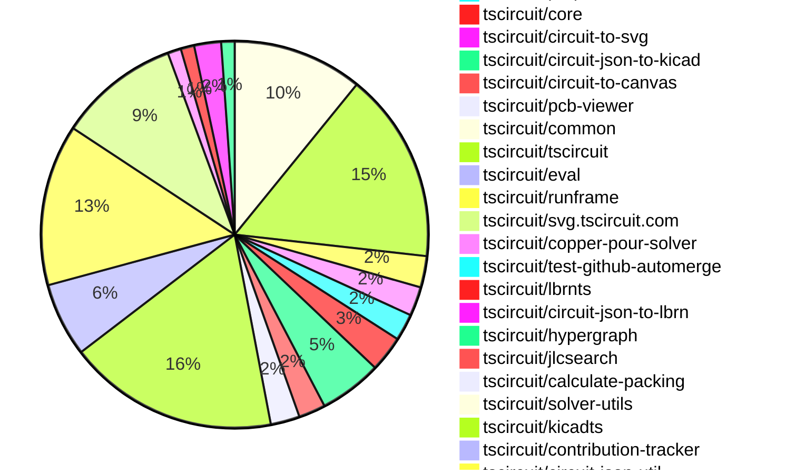

# contribution tracker

[contributions.tscircuit.com](https://contributions.tscircuit.com) ・ [tscircuit.com](https://tscircuit.com) ・ [Contribution Overviews](./contribution-overviews/) ・ [Changelogs](./changelogs/)

Generates weekly contribution overviews for tscircuit contributors. Check out all
the [contribution overviews here](./contribution-overviews/)
You can find AI-generated monthly changelogs in the [changelogs directory](./changelogs/)

- All PRs in the tscircuit org are scanned/summarized via an LLM
- The LLM classifies each Diff/PR as into a set of attributes for scoring
- All the PRs, summaries, and classifications are organized into charts and tables for [the website](https://contributions.tscircuit.com)

> Want to run locally? See the [Development Section](#development)

The current week is shown below. There are 4 major sections:

- [Contributor Overview](#contributor-overview)
- [PRs by Repository](#prs-by-repository)
- [PRs by Contributor](#changes-by-contributor)
- [Scoring & Sponsorship System](#scoring--sponsorship-system)

## Current Week

<!-- START_CURRENT_WEEK -->

# Contribution Overview 2026-01-21

The current week is shown below. There are 3 major sections:

- [Contributor Overview](#contributor-overview)
- [PRs by Repository](#prs-by-repository)
- [PRs by Contributor](#changes-by-contributor)
- [Scoring & Sponsorship Details](/docs/sponsorship-calculation-explanation.md)

## PRs by Repository



## Contributor Overview

| Contributor | 🐳 Major | 🐙 Minor | 🐌 Tiny | ⭐ | Discussion Contributions |
|-------------|---------|---------|---------|-----|--------------------------|
| [seveibar](#seveibar) | 6 | 11 | 7 | 👑 | 0🔹 0🔶 0💎 |
| [MustafaMulla29](#MustafaMulla29) | 6 | 8 | 10 | ⭐⭐⭐ | 0🔹 0🔶 0💎 |
| [ArnavK-09](#ArnavK-09) | 7 | 2 | 5 | ⭐⭐⭐ | 0🔹 0🔶 0💎 |
| [AnasSarkiz](#AnasSarkiz) | 2 | 6 | 10 | ⭐⭐⭐ | 0🔹 0🔶 0💎 |
| [ShiboSoftwareDev](#ShiboSoftwareDev) | 3 | 5 | 3 | ⭐⭐⭐ | 0🔹 0🔶 0💎 |
| [techmannih](#techmannih) | 0 | 13 | 3 | ⭐⭐⭐ | 0🔹 0🔶 0💎 |
| [Abse2001](#Abse2001) | 1 | 8 | 9 | ⭐⭐⭐ | 0🔹 0🔶 0💎 |
| [imrishabh18](#imrishabh18) | 2 | 5 | 6 | ⭐⭐ | 0🔹 0🔶 0💎 |
| [tscircuitbot](#tscircuitbot) | 0 | 0 | 412 | ⭐⭐ | 0🔹 0🔶 0💎 |
| [Ayushjhawar8](#Ayushjhawar8) | 0 | 4 | 3 | ⭐⭐ | 0🔹 0🔶 0💎 |
| [0hmX](#0hmX) | 2 | 0 | 3 | ⭐⭐ | 0🔹 0🔶 0💎 |
| [rushabhcodes](#rushabhcodes) | 1 | 0 | 2 | ⭐ | 0🔹 0🔶 0💎 |
| [shehaban](#shehaban) | 1 | 1 | 0 | ⭐ | 0🔹 0🔶 0💎 |
| [nailoo](#nailoo) | 0 | 0 | 4 | ⭐ | 0🔹 0🔶 0💎 |
| [Excellencedev](#Excellencedev) | 0 | 0 | 2 |  | 0🔹 0🔶 0💎 |
| [Heinrich-XIAO](#Heinrich-XIAO) | 0 | 0 | 1 |  | 0🔹 0🔶 0💎 |

> Note: AI evaluates PRs and assigns 1-3 star ratings automatically. 4 and 5 star ratings require manual staff review.

### Discussion Contribution Legend

- 🔹 Normal Comments: Basic participation with minimal effort
- 🔶 Great Informative Comments: Thoughtful participation that adds value
- 💎 Incredible Comments: Exceptional participation with high-quality content

## Review Table

[reviews-received-hover]: ## "Number of reviews received for PRs for this contributor"
[approvals-received-hover]: ## "Number of approvals received for PRs this contributor authored"
[rejections-received-hover]: ## "Number of rejections received for PRs this contributor authored"
[prs-opened-hover]: ## "Number of PRs opened by this contributor"
[issues-created-hover]: ## "Number of issues created by this contributor"

| Contributor | Reviews Received | Approvals Received | Rejections Received | Approvals | Rejections | PRs Opened | PRs Merged | Issues Created |
|---|---|---|---|---|---|---|---|---|
| [ArnavK-09](#ArnavK-09) | 11 | 9 | 0 | 1 | 1 | 14 | 14 | 0 |
| [seveibar](#seveibar) | 3 | 1 | 0 | 55 | 6 | 35 | 26 | 0 |
| [techmannih](#techmannih) | 25 | 15 | 3 | 7 | 0 | 21 | 16 | 0 |
| [imrishabh18](#imrishabh18) | 11 | 5 | 0 | 16 | 3 | 18 | 13 | 0 |
| [Mukedlii](#Mukedlii) | 3 | 0 | 1 | 0 | 0 | 3 | 0 | 0 |
| [rushabhcodes](#rushabhcodes) | 15 | 5 | 0 | 1 | 4 | 5 | 3 | 0 |
| [Abse2001](#Abse2001) | 21 | 14 | 1 | 3 | 0 | 20 | 18 | 0 |
| [tscircuitbot](#tscircuitbot) | 2 | 0 | 0 | 0 | 0 | 480 | 430 | 0 |
| [AnasSarkiz](#AnasSarkiz) | 2 | 2 | 0 | 4 | 0 | 18 | 18 | 0 |
| [ShiboSoftwareDev](#ShiboSoftwareDev) | 12 | 12 | 0 | 8 | 0 | 11 | 11 | 0 |
| [Ayushjhawar8](#Ayushjhawar8) | 7 | 6 | 0 | 0 | 0 | 8 | 7 | 0 |
| [MustafaMulla29](#MustafaMulla29) | 15 | 10 | 0 | 0 | 0 | 27 | 24 | 0 |
| [shehaban](#shehaban) | 5 | 2 | 1 | 0 | 0 | 3 | 2 | 0 |
| [Excellencedev](#Excellencedev) | 10 | 3 | 1 | 0 | 0 | 5 | 2 | 0 |
| [nailoo](#nailoo) | 18 | 7 | 4 | 0 | 0 | 7 | 4 | 0 |
| [omwanere](#omwanere) | 5 | 0 | 0 | 0 | 0 | 1 | 0 | 0 |
| [bimakw](#bimakw) | 4 | 0 | 1 | 0 | 0 | 3 | 0 | 0 |
| [0hmX](#0hmX) | 6 | 3 | 0 | 0 | 0 | 9 | 7 | 0 |
| [guptadeepak8](#guptadeepak8) | 1 | 0 | 1 | 0 | 0 | 1 | 0 | 0 |
| [Heinrich-XIAO](#Heinrich-XIAO) | 1 | 1 | 0 | 0 | 0 | 1 | 1 | 0 |
| [CodisRedding](#CodisRedding) | 2 | 0 | 1 | 0 | 0 | 1 | 0 | 0 |

## Changes by Repository

### [tscircuit/schematic-viewer](https://github.com/tscircuit/schematic-viewer)

| PR # | Impact | Rating | Contributor | Description |
|------|--------|--------|-------------|-------------|
| [#160](https://github.com/tscircuit/schematic-viewer/pull/160) | 🐳 Major | ⭐⭐⭐ | ArnavK-09 | Adds a toggle option for displaying the grid in the schematic viewer menu, allowing users to show or hide the grid overlay. |

<details>
<summary>🐌 Tiny Contributions (1)</summary>

| PR # | Impact | Contributor | Description |
|------|--------|-------------|-------------|
| [#159](https://github.com/tscircuit/schematic-viewer/pull/159) | 🐌 Tiny | techmannih | Updates the tscircuit dependency to version 0.0.1194 in the package.json file. |

</details>

### [tscircuit/tscircuit.com](https://github.com/tscircuit/tscircuit.com)

| PR # | Impact | Rating | Contributor | Description |
|------|--------|--------|-------------|-------------|
| [#2582](https://github.com/tscircuit/tscircuit.com/pull/2582) | 🐳 Major | ⭐⭐⭐ | ArnavK-09 | Switches the package details settings page to a new implementation, removing the previous dialog-based editing approach and integrating direct navigation to the settings page. |
| [#2581](https://github.com/tscircuit/tscircuit.com/pull/2581) | 🐳 Major | ⭐⭐⭐ | ArnavK-09 | Removes the premature mobile package settings dialog and updates navigation to settings page directly. |
| [#2518](https://github.com/tscircuit/tscircuit.com/pull/2518) | 🐳 Major | ⭐⭐⭐ | ArnavK-09 | Changes the image display in the ReleaseDeploymentDetails component to a tab view, allowing users to click on images to navigate to specific tabs related to CAD, schematic, and PCB previews. |
| [#2559](https://github.com/tscircuit/tscircuit.com/pull/2559) | 🐙 Minor | ⭐⭐ | ArnavK-09 | Fixes the circuit JSON path for the release preview to ensure correct fetching of circuit data. |

<details>
<summary>🐌 Tiny Contributions (54)</summary>

| PR # | Impact | Contributor | Description |
|------|--------|-------------|-------------|
| [#2580](https://github.com/tscircuit/tscircuit.com/pull/2580) | 🐌 Tiny | ArnavK-09 | Adds a new settings page for managing package details including name, description, visibility, and license. |
| [#2558](https://github.com/tscircuit/tscircuit.com/pull/2558) | 🐌 Tiny | ArnavK-09 | Removes tsconfig.json from the list of hidden files in the isHiddenFile utility function. |
| [#2555](https://github.com/tscircuit/tscircuit.com/pull/2555) | 🐌 Tiny | Abse2001 | This PR makes dependency updates deterministic by forcing viewer package versions to stay aligned with tscircuitrunframe. |
| [#2554](https://github.com/tscircuit/tscircuit.com/pull/2554) | 🐌 Tiny | Abse2001 | Fixes rendering and compatibility issues by upgrading PCB and 3D viewer dependencies to support circuit-to-canvas rendering. |
| [#2568](https://github.com/tscircuit/tscircuit.com/pull/2568) | 🐌 Tiny | tscircuitbot | Updates the tscircuiteval package to version 0.0.607 in the package.json file. |
| [#2578](https://github.com/tscircuit/tscircuit.com/pull/2578) | 🐌 Tiny | tscircuitbot | Automated package update |
| [#2570](https://github.com/tscircuit/tscircuit.com/pull/2570) | 🐌 Tiny | tscircuitbot | Updates the tscircuitrunframe package version from 0.0.1529 to 0.0.1531 in package.json |
| [#2576](https://github.com/tscircuit/tscircuit.com/pull/2576) | 🐌 Tiny | tscircuitbot | Updates the tscircuiteval package from version 0.0.608 to 0.0.609 |
| [#2579](https://github.com/tscircuit/tscircuit.com/pull/2579) | 🐌 Tiny | tscircuitbot | Updates the tscircuitrunframe package to version 0.0.1534 |
| [#2572](https://github.com/tscircuit/tscircuit.com/pull/2572) | 🐌 Tiny | tscircuitbot | Updates the tscircuitrunframe package from version 0.0.1531 to 0.0.1532 |
| [#2571](https://github.com/tscircuit/tscircuit.com/pull/2571) | 🐌 Tiny | tscircuitbot | Automated package update |
| [#2577](https://github.com/tscircuit/tscircuit.com/pull/2577) | 🐌 Tiny | tscircuitbot | Updates the tscircuitrunframe package from version 0.0.1532 to 0.0.1533 |
| [#2567](https://github.com/tscircuit/tscircuit.com/pull/2567) | 🐌 Tiny | tscircuitbot | Updates the tscircuitrunframe package from version 0.0.1528 to 0.0.1529 |
| [#2566](https://github.com/tscircuit/tscircuit.com/pull/2566) | 🐌 Tiny | tscircuitbot | Automated package update |
| [#2562](https://github.com/tscircuit/tscircuit.com/pull/2562) | 🐌 Tiny | tscircuitbot | Updates the tscircuitrunframe package from version 0.0.1526 to 0.0.1527 |
| [#2560](https://github.com/tscircuit/tscircuit.com/pull/2560) | 🐌 Tiny | tscircuitbot | Updates the tscircuitrunframe package from version 0.0.1525 to 0.0.1526 |
| [#2557](https://github.com/tscircuit/tscircuit.com/pull/2557) | 🐌 Tiny | tscircuitbot | Automated package update |
| [#2561](https://github.com/tscircuit/tscircuit.com/pull/2561) | 🐌 Tiny | tscircuitbot | Updates the tscircuiteval package from version 0.0.605 to 0.0.606 |
| [#2556](https://github.com/tscircuit/tscircuit.com/pull/2556) | 🐌 Tiny | tscircuitbot | Updates the tscircuitrunframe package from version 0.0.1523 to 0.0.1524 |
| [#2549](https://github.com/tscircuit/tscircuit.com/pull/2549) | 🐌 Tiny | tscircuitbot | Updates the tscircuitrunframe package to version 0.0.1520 |
| [#2546](https://github.com/tscircuit/tscircuit.com/pull/2546) | 🐌 Tiny | tscircuitbot | Updates the tscircuiteval package from version 0.0.602 to 0.0.603 in the package.json file. |
| [#2551](https://github.com/tscircuit/tscircuit.com/pull/2551) | 🐌 Tiny | tscircuitbot | Updates the tscircuitrunframe package from version 0.0.1520 to 0.0.1522 in the package.json file. |
| [#2548](https://github.com/tscircuit/tscircuit.com/pull/2548) | 🐌 Tiny | tscircuitbot | Updates the tscircuitrunframe package from version 0.0.1518 to 0.0.1519 |
| [#2553](https://github.com/tscircuit/tscircuit.com/pull/2553) | 🐌 Tiny | tscircuitbot | Updates the tscircuitrunframe package to version 0.0.1523 |
| [#2547](https://github.com/tscircuit/tscircuit.com/pull/2547) | 🐌 Tiny | tscircuitbot | Updates the tscircuitrunframe package from version 0.0.1516 to 0.0.1518 |
| [#2552](https://github.com/tscircuit/tscircuit.com/pull/2552) | 🐌 Tiny | tscircuitbot | Automated package update |
| [#2550](https://github.com/tscircuit/tscircuit.com/pull/2550) | 🐌 Tiny | tscircuitbot | Updates the tscircuiteval package from version 0.0.603 to 0.0.604 |
| [#2535](https://github.com/tscircuit/tscircuit.com/pull/2535) | 🐌 Tiny | tscircuitbot | Updates the tscircuitrunframe package from version 0.0.1507 to 0.0.1508 |
| [#2539](https://github.com/tscircuit/tscircuit.com/pull/2539) | 🐌 Tiny | tscircuitbot | Automated package update |
| [#2534](https://github.com/tscircuit/tscircuit.com/pull/2534) | 🐌 Tiny | tscircuitbot | Automated package update |
| [#2536](https://github.com/tscircuit/tscircuit.com/pull/2536) | 🐌 Tiny | tscircuitbot | Automated package update |
| [#2543](https://github.com/tscircuit/tscircuit.com/pull/2543) | 🐌 Tiny | tscircuitbot | Updates the tscircuitrunframe package from version 0.0.1514 to 0.0.1515 |
| [#2533](https://github.com/tscircuit/tscircuit.com/pull/2533) | 🐌 Tiny | tscircuitbot | Updates the tscircuitrunframe package from version 0.0.1506 to 0.0.1507 |
| [#2537](https://github.com/tscircuit/tscircuit.com/pull/2537) | 🐌 Tiny | tscircuitbot | Updates the tscircuitrunframe package from version 0.0.1508 to 0.0.1509 |
| [#2540](https://github.com/tscircuit/tscircuit.com/pull/2540) | 🐌 Tiny | tscircuitbot | Updates the tscircuitrunframe package from version 0.0.1509 to 0.0.1511 |
| [#2544](https://github.com/tscircuit/tscircuit.com/pull/2544) | 🐌 Tiny | tscircuitbot | Automated package update |
| [#2541](https://github.com/tscircuit/tscircuit.com/pull/2541) | 🐌 Tiny | tscircuitbot | Updates the tscircuitrunframe package from version 0.0.1511 to 0.0.1513 |
| [#2545](https://github.com/tscircuit/tscircuit.com/pull/2545) | 🐌 Tiny | tscircuitbot | Updates the tscircuitrunframe package from version 0.0.1515 to 0.0.1516 |
| [#2542](https://github.com/tscircuit/tscircuit.com/pull/2542) | 🐌 Tiny | tscircuitbot | Automated package update |
| [#2531](https://github.com/tscircuit/tscircuit.com/pull/2531) | 🐌 Tiny | tscircuitbot | Automated package update for tscircuiteval from version 0.0.597 to 0.0.598 |
| [#2530](https://github.com/tscircuit/tscircuit.com/pull/2530) | 🐌 Tiny | tscircuitbot | Updates the tscircuitrunframe package from version 0.0.1504 to 0.0.1505 |
| [#2532](https://github.com/tscircuit/tscircuit.com/pull/2532) | 🐌 Tiny | tscircuitbot | Updates the tscircuitrunframe package from version 0.0.1505 to 0.0.1506 |
| [#2528](https://github.com/tscircuit/tscircuit.com/pull/2528) | 🐌 Tiny | tscircuitbot | Updates the tscircuitrunframe package from version 0.0.1502 to 0.0.1503 |
| [#2520](https://github.com/tscircuit/tscircuit.com/pull/2520) | 🐌 Tiny | tscircuitbot | Updates the tscircuitrunframe package from version 0.0.1497 to 0.0.1498 |
| [#2524](https://github.com/tscircuit/tscircuit.com/pull/2524) | 🐌 Tiny | tscircuitbot | Automated package update |
| [#2527](https://github.com/tscircuit/tscircuit.com/pull/2527) | 🐌 Tiny | tscircuitbot | Updates the tscircuitrunframe package from version 0.0.1501 to 0.0.1502 |
| [#2522](https://github.com/tscircuit/tscircuit.com/pull/2522) | 🐌 Tiny | tscircuitbot | Updates the tscircuitrunframe package from version 0.0.1498 to 0.0.1499 |
| [#2529](https://github.com/tscircuit/tscircuit.com/pull/2529) | 🐌 Tiny | tscircuitbot | Updates the tscircuitrunframe package from version 0.0.1503 to 0.0.1504 |
| [#2526](https://github.com/tscircuit/tscircuit.com/pull/2526) | 🐌 Tiny | tscircuitbot | Updates the tscircuiteval package from version 0.0.596 to 0.0.597 |
| [#2525](https://github.com/tscircuit/tscircuit.com/pull/2525) | 🐌 Tiny | tscircuitbot | Automated package update |
| [#2521](https://github.com/tscircuit/tscircuit.com/pull/2521) | 🐌 Tiny | tscircuitbot | Automated package update |
| [#2523](https://github.com/tscircuit/tscircuit.com/pull/2523) | 🐌 Tiny | tscircuitbot | Updates the tscircuitrunframe package from version 0.0.1499 to 0.0.1500 |
| [#2573](https://github.com/tscircuit/tscircuit.com/pull/2573) | 🐌 Tiny | MustafaMulla29 | Updates the circuit-to-svg dependency version from 0.0.298 to 0.0.318 in package.json |
| [#2575](https://github.com/tscircuit/tscircuit.com/pull/2575) | 🐌 Tiny | MustafaMulla29 | Updates the circuit-to-svg dependency version from 0.0.318 to 0.0.319 in package.json |

</details>

### [tscircuit/cli](https://github.com/tscircuit/cli)

| PR # | Impact | Rating | Contributor | Description |
|------|--------|--------|-------------|-------------|
| [#1770](https://github.com/tscircuit/cli/pull/1770) | 🐳 Major | ⭐⭐⭐ | ArnavK-09 | Adds support for loading build options from tscircuit.config.json, allowing for more flexible project configurations during the build process. |
| [#1665](https://github.com/tscircuit/cli/pull/1665) | 🐳 Major | ⭐⭐⭐ | ArnavK-09 | Adds an init command to scaffold basic project files and integrate the Claude skill for enhanced AI assistance in tscircuit projects. |
| [#1747](https://github.com/tscircuit/cli/pull/1747) | 🐳 Major | ⭐⭐⭐ | MustafaMulla29 | Add support for generating PCM-compatible paths and identifiers in KiCad library files, ensuring proper formatting for 3D model paths and footprint references. |
| [#1729](https://github.com/tscircuit/cli/pull/1729) | 🐳 Major | ⭐⭐⭐ | MustafaMulla29 | Adds functionality to extract kicadFootprintMetadata from React components without rendering them, supporting nested structures and various child types. |
| [#1684](https://github.com/tscircuit/cli/pull/1684) | 🐳 Major | ⭐⭐⭐ | imrishabh18 | Adds concurrency support for building circuit files using Node.js worker threads, allowing multiple files to be processed in parallel, improving build performance. |
| [#1788](https://github.com/tscircuit/cli/pull/1788) | 🐙 Minor | ⭐⭐ | MustafaMulla29 | Adds a new command line option --kicad-library to generate a KiCad library in the distkicad-library directory. |
| [#1736](https://github.com/tscircuit/cli/pull/1736) | 🐙 Minor | ⭐⭐ | seveibar | Add CLI options to limit tsci search results to specific sources (KiCad, JLCPCBLCSC, or the tscircuit registry) while preserving the original behavior of searching all sources when no filters are supplied. |
| [#1739](https://github.com/tscircuit/cli/pull/1739) | 🐙 Minor | ⭐⭐ | seveibar | Adds support for kicadLibraryName in project configuration and improves the derivation of KiCad library names from project settings and package.json. |
| [#1713](https://github.com/tscircuit/cli/pull/1713) | 🐙 Minor | ⭐⭐ | seveibar | Changes the component instantiation in KiCad library conversion to use a fixed reference name REF instead of component-specific names, ensuring consistent naming in generated circuit JSON and footprints. |
| [#1780](https://github.com/tscircuit/cli/pull/1780) | 🐙 Minor | ⭐⭐ | imrishabh18 | Fixes the order of operations in the build process to ensure that prebuild commands are executed before determining circuit files, preventing missing generated circuit files. |
| [#1675](https://github.com/tscircuit/cli/pull/1675) | 🐙 Minor | ⭐⭐ | imrishabh18 | Fixes infinite recursion of prebuildCommand when buildCommand is executed with the --ci flag |

<details>
<summary>🐌 Tiny Contributions (74)</summary>

| PR # | Impact | Contributor | Description |
|------|--------|-------------|-------------|
| [#1796](https://github.com/tscircuit/cli/pull/1796) | 🐌 Tiny | tscircuitbot | Automated package update |
| [#1784](https://github.com/tscircuit/cli/pull/1784) | 🐌 Tiny | tscircuitbot | Updates the tscircuitrunframe package from version 0.0.1529 to 0.0.1530 |
| [#1786](https://github.com/tscircuit/cli/pull/1786) | 🐌 Tiny | tscircuitbot | Automated package update |
| [#1795](https://github.com/tscircuit/cli/pull/1795) | 🐌 Tiny | tscircuitbot | Updates the tscircuitrunframe package from version 0.0.1533 to 0.0.1534 |
| [#1790](https://github.com/tscircuit/cli/pull/1790) | 🐌 Tiny | tscircuitbot | Updates the tscircuitrunframe package from version 0.0.1531 to 0.0.1532 |
| [#1782](https://github.com/tscircuit/cli/pull/1782) | 🐌 Tiny | tscircuitbot | Updates the tscircuitrunframe package from version 0.0.1528 to 0.0.1529 |
| [#1792](https://github.com/tscircuit/cli/pull/1792) | 🐌 Tiny | tscircuitbot | Updates the tscircuitrunframe package from version 0.0.1532 to 0.0.1533 |
| [#1793](https://github.com/tscircuit/cli/pull/1793) | 🐌 Tiny | tscircuitbot | Automated package update |
| [#1791](https://github.com/tscircuit/cli/pull/1791) | 🐌 Tiny | tscircuitbot | Automated package update |
| [#1789](https://github.com/tscircuit/cli/pull/1789) | 🐌 Tiny | tscircuitbot | Automated package update |
| [#1783](https://github.com/tscircuit/cli/pull/1783) | 🐌 Tiny | tscircuitbot | Updates the package version from v0.1.819 to v0.1.820 in package.json |
| [#1785](https://github.com/tscircuit/cli/pull/1785) | 🐌 Tiny | tscircuitbot | Updates the tscircuitrunframe package from version 0.0.1530 to 0.0.1531 |
| [#1787](https://github.com/tscircuit/cli/pull/1787) | 🐌 Tiny | tscircuitbot | Automated package update |
| [#1781](https://github.com/tscircuit/cli/pull/1781) | 🐌 Tiny | tscircuitbot | Automated package update |
| [#1768](https://github.com/tscircuit/cli/pull/1768) | 🐌 Tiny | tscircuitbot | Updates the tscircuitrunframe package from version 0.0.1524 to 0.0.1525 |
| [#1776](https://github.com/tscircuit/cli/pull/1776) | 🐌 Tiny | tscircuitbot | Automated package update |
| [#1772](https://github.com/tscircuit/cli/pull/1772) | 🐌 Tiny | tscircuitbot | Updates the tscircuitrunframe package from version 0.0.1525 to 0.0.1526 |
| [#1777](https://github.com/tscircuit/cli/pull/1777) | 🐌 Tiny | tscircuitbot | Updates the tscircuitrunframe package from version 0.0.1527 to 0.0.1528 |
| [#1775](https://github.com/tscircuit/cli/pull/1775) | 🐌 Tiny | tscircuitbot | Updates the tscircuitrunframe package from version 0.0.1526 to 0.0.1527 |
| [#1769](https://github.com/tscircuit/cli/pull/1769) | 🐌 Tiny | tscircuitbot | Automated package update |
| [#1773](https://github.com/tscircuit/cli/pull/1773) | 🐌 Tiny | tscircuitbot | Automated package update |
| [#1778](https://github.com/tscircuit/cli/pull/1778) | 🐌 Tiny | tscircuitbot | Automated package update |
| [#1766](https://github.com/tscircuit/cli/pull/1766) | 🐌 Tiny | tscircuitbot | Updates the tscircuitrunframe package from version 0.0.1523 to 0.0.1524 |
| [#1764](https://github.com/tscircuit/cli/pull/1764) | 🐌 Tiny | tscircuitbot | Automated package update |
| [#1767](https://github.com/tscircuit/cli/pull/1767) | 🐌 Tiny | tscircuitbot | Automated package update |
| [#1756](https://github.com/tscircuit/cli/pull/1756) | 🐌 Tiny | tscircuitbot | Updates the tscircuitrunframe package to version 0.0.1520 |
| [#1757](https://github.com/tscircuit/cli/pull/1757) | 🐌 Tiny | tscircuitbot | Automated package update |
| [#1752](https://github.com/tscircuit/cli/pull/1752) | 🐌 Tiny | tscircuitbot | Updates the tscircuitrunframe package from version 0.0.1516 to 0.0.1518 |
| [#1755](https://github.com/tscircuit/cli/pull/1755) | 🐌 Tiny | tscircuitbot | Automated package update |
| [#1758](https://github.com/tscircuit/cli/pull/1758) | 🐌 Tiny | tscircuitbot | Updates the tscircuitrunframe package from version 0.0.1520 to 0.0.1522 |
| [#1760](https://github.com/tscircuit/cli/pull/1760) | 🐌 Tiny | tscircuitbot | Updates the tscircuitrunframe package from version 0.0.1522 to 0.0.1523 |
| [#1754](https://github.com/tscircuit/cli/pull/1754) | 🐌 Tiny | tscircuitbot | Updates the tscircuitrunframe package from version 0.0.1518 to 0.0.1519 |
| [#1753](https://github.com/tscircuit/cli/pull/1753) | 🐌 Tiny | tscircuitbot | Automated package update |
| [#1759](https://github.com/tscircuit/cli/pull/1759) | 🐌 Tiny | tscircuitbot | Automated package update |
| [#1761](https://github.com/tscircuit/cli/pull/1761) | 🐌 Tiny | tscircuitbot | Automated package update |
| [#1749](https://github.com/tscircuit/cli/pull/1749) | 🐌 Tiny | tscircuitbot | Automated package update |
| [#1742](https://github.com/tscircuit/cli/pull/1742) | 🐌 Tiny | tscircuitbot | Automated package update |
| [#1745](https://github.com/tscircuit/cli/pull/1745) | 🐌 Tiny | tscircuitbot | Updates the tscircuitrunframe package from version 0.0.1514 to 0.0.1515 |
| [#1721](https://github.com/tscircuit/cli/pull/1721) | 🐌 Tiny | tscircuitbot | Updates the tscircuitrunframe package from version 0.0.1505 to 0.0.1507 |
| [#1725](https://github.com/tscircuit/cli/pull/1725) | 🐌 Tiny | tscircuitbot | Updates the tscircuitrunframe package from version 0.0.1508 to 0.0.1509 |
| [#1740](https://github.com/tscircuit/cli/pull/1740) | 🐌 Tiny | tscircuitbot | Automated package update |
| [#1746](https://github.com/tscircuit/cli/pull/1746) | 🐌 Tiny | tscircuitbot | Automated package update |
| [#1743](https://github.com/tscircuit/cli/pull/1743) | 🐌 Tiny | tscircuitbot | Updates the tscircuitrunframe package from version 0.0.1513 to 0.0.1514 |
| [#1741](https://github.com/tscircuit/cli/pull/1741) | 🐌 Tiny | tscircuitbot | Updates the tscircuitrunframe package from version 0.0.1512 to 0.0.1513 |
| [#1737](https://github.com/tscircuit/cli/pull/1737) | 🐌 Tiny | tscircuitbot | Automated README update with latest CLI usage output. |
| [#1727](https://github.com/tscircuit/cli/pull/1727) | 🐌 Tiny | tscircuitbot | Automated package update |
| [#1732](https://github.com/tscircuit/cli/pull/1732) | 🐌 Tiny | tscircuitbot | Automated package update |
| [#1748](https://github.com/tscircuit/cli/pull/1748) | 🐌 Tiny | tscircuitbot | Updates the tscircuitrunframe package from version 0.0.1515 to 0.0.1516 |
| [#1744](https://github.com/tscircuit/cli/pull/1744) | 🐌 Tiny | tscircuitbot | Automated package update |
| [#1738](https://github.com/tscircuit/cli/pull/1738) | 🐌 Tiny | tscircuitbot | Automated package update |
| [#1750](https://github.com/tscircuit/cli/pull/1750) | 🐌 Tiny | tscircuitbot | Automated package update |
| [#1723](https://github.com/tscircuit/cli/pull/1723) | 🐌 Tiny | tscircuitbot | Updates the tscircuitrunframe package from version 0.0.1507 to 0.0.1508 |
| [#1734](https://github.com/tscircuit/cli/pull/1734) | 🐌 Tiny | tscircuitbot | Automated package update |
| [#1726](https://github.com/tscircuit/cli/pull/1726) | 🐌 Tiny | tscircuitbot | Automated package update |
| [#1731](https://github.com/tscircuit/cli/pull/1731) | 🐌 Tiny | tscircuitbot | Updates the tscircuitrunframe package from version 0.0.1510 to 0.0.1511 |
| [#1735](https://github.com/tscircuit/cli/pull/1735) | 🐌 Tiny | tscircuitbot | Automated package update |
| [#1733](https://github.com/tscircuit/cli/pull/1733) | 🐌 Tiny | tscircuitbot | Updates the tscircuitrunframe package from version 0.0.1511 to 0.0.1512 |
| [#1730](https://github.com/tscircuit/cli/pull/1730) | 🐌 Tiny | tscircuitbot | Automated package update |
| [#1718](https://github.com/tscircuit/cli/pull/1718) | 🐌 Tiny | tscircuitbot | Updates the tscircuitrunframe package from version 0.0.1504 to 0.0.1505 |
| [#1693](https://github.com/tscircuit/cli/pull/1693) | 🐌 Tiny | tscircuitbot | Updates the tscircuitrunframe package from version 0.0.1500 to 0.0.1501 |
| [#1704](https://github.com/tscircuit/cli/pull/1704) | 🐌 Tiny | tscircuitbot | Updates the tscircuitrunframe package from version 0.0.1502 to 0.0.1503 |
| [#1681](https://github.com/tscircuit/cli/pull/1681) | 🐌 Tiny | tscircuitbot | Automated package update |
| [#1680](https://github.com/tscircuit/cli/pull/1680) | 🐌 Tiny | tscircuitbot | Updates the tscircuitrunframe package from version 0.0.1498 to 0.0.1499 |
| [#1679](https://github.com/tscircuit/cli/pull/1679) | 🐌 Tiny | tscircuitbot | Automated package update |
| [#1678](https://github.com/tscircuit/cli/pull/1678) | 🐌 Tiny | tscircuitbot | Updates the tscircuitrunframe package from version 0.0.1497 to 0.0.1498 |
| [#1702](https://github.com/tscircuit/cli/pull/1702) | 🐌 Tiny | tscircuitbot | Automated package update |
| [#1697](https://github.com/tscircuit/cli/pull/1697) | 🐌 Tiny | tscircuitbot | Updates the tscircuitrunframe package from version 0.0.1501 to 0.0.1502 |
| [#1683](https://github.com/tscircuit/cli/pull/1683) | 🐌 Tiny | tscircuitbot | Automated package update |
| [#1717](https://github.com/tscircuit/cli/pull/1717) | 🐌 Tiny | tscircuitbot | Automated package update |
| [#1763](https://github.com/tscircuit/cli/pull/1763) | 🐌 Tiny | MustafaMulla29 | Replaces all references to kicadFootprintLibrary with kicadLibrary in the build configuration and related tests. |
| [#1710](https://github.com/tscircuit/cli/pull/1710) | 🐌 Tiny | seveibar | Synchronizes the JSON schema with the TypeScript configuration definition, adding a new cloud flag and enforcing compile-time checks to prevent schema mismatches. |
| [#1686](https://github.com/tscircuit/cli/pull/1686) | 🐌 Tiny | imrishabh18 | Fixes the entrypoint worker file for the published package by ensuring the correct file is used based on the environment (development or production). |
| [#1700](https://github.com/tscircuit/cli/pull/1700) | 🐌 Tiny | imrishabh18 | Changes the method of fetching the latest version of the tscircuit package from cdnjs to npmjs. |
| [#1691](https://github.com/tscircuit/cli/pull/1691) | 🐌 Tiny | imrishabh18 | Adds console logs to indicate the progress of various steps in the KiCad PCM build process. |

</details>

### [tscircuit/docs](https://github.com/tscircuit/docs)

| PR # | Impact | Rating | Contributor | Description |
|------|--------|--------|-------------|-------------|
| [#415](https://github.com/tscircuit/docs/pull/415) | 🐳 Major | ⭐⭐⭐ | ArnavK-09 | Exposes markdown for docs if add .md at last |
| [#417](https://github.com/tscircuit/docs/pull/417) | 🐙 Minor | ⭐⭐ | MustafaMulla29 | Adds examples for svgPath and strokeColor properties in the schematicpath component documentation. |

<details>
<summary>🐌 Tiny Contributions (3)</summary>

| PR # | Impact | Contributor | Description |
|------|--------|-------------|-------------|
| [#416](https://github.com/tscircuit/docs/pull/416) | 🐌 Tiny | MustafaMulla29 | Adds a custom NPN transistor symbol and updates the symbol page with new examples for users. |
| [#413](https://github.com/tscircuit/docs/pull/413) | 🐌 Tiny | seveibar | Provides complete documentation for every option exposed by tscircuit.config.json, ensuring the guide matches the runtimeschema and includes previously undocumented cloudbuild-related flags and KiCad options. |
| [#412](https://github.com/tscircuit/docs/pull/412) | 🐌 Tiny | seveibar | Add documentation for the new schematic primitive to let authors draw connected path segments inside custom schematic symbols using schematicpath . |

</details>

### [tscircuit/pcbburn.com](https://github.com/tscircuit/pcbburn.com)

| PR # | Impact | Rating | Contributor | Description |
|------|--------|--------|-------------|-------------|
| [#43](https://github.com/tscircuit/pcbburn.com/pull/43) | 🐳 Major | ⭐⭐⭐ | AnasSarkiz | Adds reusable UI components for loading states, including Skeleton and Spinner, and replaces static image and video elements on the landing page with new loading-aware components. |
| [#50](https://github.com/tscircuit/pcbburn.com/pull/50) | 🐙 Minor | ⭐⭐ | ArnavK-09 | Adds base meta tags and favicon to improve SEO and user experience on the PCBBurn website. |
| [#41](https://github.com/tscircuit/pcbburn.com/pull/41) | 🐙 Minor | ⭐⭐ | AnasSarkiz | Adds support for copper cut fill functionality in PCB burn operations with configurable margin controls. |
| [#42](https://github.com/tscircuit/pcbburn.com/pull/42) | 🐙 Minor | ⭐⭐ | AnasSarkiz | Fixes useNavigate Router context errors in React Cosmos workspace fixtures by wrapping components in a Router context. |

<details>
<summary>🐌 Tiny Contributions (10)</summary>

| PR # | Impact | Contributor | Description |
|------|--------|-------------|-------------|
| [#49](https://github.com/tscircuit/pcbburn.com/pull/49) | 🐌 Tiny | ArnavK-09 | Removes a tag from the header of the BlankWorkspace component in the user interface. |
| [#51](https://github.com/tscircuit/pcbburn.com/pull/51) | 🐌 Tiny | ArnavK-09 | Adds a link to the documentation in the BlankWorkspace component. |
| [#48](https://github.com/tscircuit/pcbburn.com/pull/48) | 🐌 Tiny | Abse2001 | Updates the circuit-to-svg dependency to version 0.0.316 in package.json |
| [#47](https://github.com/tscircuit/pcbburn.com/pull/47) | 🐌 Tiny | AnasSarkiz | Fixes initial load bug where video loader overlay is undersized and spinner misaligned by enforcing a full-size wrapper and ensuring the video element fills its container. |
| [#45](https://github.com/tscircuit/pcbburn.com/pull/45) | 🐌 Tiny | AnasSarkiz | Reworks the landing hero to place the demo video beside the primary messaging and moves CTAs into a unified action row for clearer focus. |
| [#46](https://github.com/tscircuit/pcbburn.com/pull/46) | 🐌 Tiny | AnasSarkiz | Replaces the template README with PCBBurn-specific usage, conversion flow, and settings-panelLBRN option details; removes the unused Features nav link on the landing page; bumps circuit-json-to-lbrn to 0.0.51 in package.json and bun.lock to match the latest dependency. |
| [#44](https://github.com/tscircuit/pcbburn.com/pull/44) | 🐌 Tiny | AnasSarkiz | Updates the versions of lbrnts and circuit-json-to-lbrn in package.json and adds a console log for SVG generation in preview-hooks.tsx |
| [#40](https://github.com/tscircuit/pcbburn.com/pull/40) | 🐌 Tiny | AnasSarkiz | Updates the version of the circuit-json-to-lbrn dependency from 0.0.47 to 0.0.48 in package.json |
| [#39](https://github.com/tscircuit/pcbburn.com/pull/39) | 🐌 Tiny | AnasSarkiz | Designates AnasSarkiz as the code owner for the entire repository, ensuring that they are responsible for code reviews and approvals. |
| [#38](https://github.com/tscircuit/pcbburn.com/pull/38) | 🐌 Tiny | AnasSarkiz | Fixes the LBRN SVG preview rendering issue by awaiting the async convertCircuitJsonToLbrn function, ensuring correct SVG generation instead of a blank canvas. |

</details>

### [tscircuit/status](https://github.com/tscircuit/status)


<details>
<summary>🐌 Tiny Contributions (2)</summary>

| PR # | Impact | Contributor | Description |
|------|--------|-------------|-------------|
| [#64](https://github.com/tscircuit/status/pull/64) | 🐌 Tiny | ArnavK-09 | Removes the health check function for the PNG service from the codebase, eliminating the associated file and its functionality. |
| [#63](https://github.com/tscircuit/status/pull/63) | 🐌 Tiny | imrishabh18 | Removes the health check for the PNG service from the run checks script, streamlining the health check process. |

</details>

### [tscircuit/circuit-json](https://github.com/tscircuit/circuit-json)

| PR # | Impact | Rating | Contributor | Description |
|------|--------|--------|-------------|-------------|
| [#422](https://github.com/tscircuit/circuit-json/pull/422) | 🐙 Minor | ⭐⭐ | techmannih | Adds a simple current source component to the circuit-json library, allowing users to define current sources with various parameters such as current, frequency, and wave shape. |
| [#423](https://github.com/tscircuit/circuit-json/pull/423) | 🐙 Minor | ⭐⭐ | techmannih | Adds an optional pin_variant property to the simple crystal source definition, allowing for two-pin or four-pin configurations. |
| [#416](https://github.com/tscircuit/circuit-json/pull/416) | 🐙 Minor | ⭐⭐ | techmannih | Adds an optional display_name field to the SourceComponentBase interface and schema, allowing for more descriptive identification of source components. |
| [#428](https://github.com/tscircuit/circuit-json/pull/428) | 🐙 Minor | ⭐⭐ | MustafaMulla29 | Adds stroke_color and svg_path properties to the SchematicPath interface, enhancing its functionality for schematic representations. |
| [#426](https://github.com/tscircuit/circuit-json/pull/426) | 🐙 Minor | ⭐⭐ | MustafaMulla29 | Adds a stroke_width property to the SchematicPath interface, allowing for customizable stroke widths in schematic paths. |
| [#418](https://github.com/tscircuit/circuit-json/pull/418) | 🐙 Minor | ⭐⭐ | shehaban | Adds a new boolean property is_drawn_with_inversion_circle to the SchematicPort interface to indicate if the port is drawn with an inversion circle. |

<details>
<summary>🐌 Tiny Contributions (7)</summary>

| PR # | Impact | Contributor | Description |
|------|--------|-------------|-------------|
| [#429](https://github.com/tscircuit/circuit-json/pull/429) | 🐌 Tiny | tscircuitbot | Automated package update |
| [#425](https://github.com/tscircuit/circuit-json/pull/425) | 🐌 Tiny | tscircuitbot | Automated package update |
| [#424](https://github.com/tscircuit/circuit-json/pull/424) | 🐌 Tiny | tscircuitbot | Automated package update |
| [#421](https://github.com/tscircuit/circuit-json/pull/421) | 🐌 Tiny | tscircuitbot | Automated package update |
| [#420](https://github.com/tscircuit/circuit-json/pull/420) | 🐌 Tiny | tscircuitbot | Automated package update |
| [#417](https://github.com/tscircuit/circuit-json/pull/417) | 🐌 Tiny | tscircuitbot | Automated package update |
| [#419](https://github.com/tscircuit/circuit-json/pull/419) | 🐌 Tiny | Excellencedev | Adds a script to check for snake_case naming conventions in the codebase and integrates it into the GitHub workflow for pull requests and pushes to the main branch. |

</details>

### [tscircuit/props](https://github.com/tscircuit/props)

| PR # | Impact | Rating | Contributor | Description |
|------|--------|--------|-------------|-------------|
| [#566](https://github.com/tscircuit/props/pull/566) | 🐳 Major | ⭐⭐⭐ | seveibar | Adds an optional svgPath property to the schematic path props schema, allowing for raw SVG path strings to be used in rendering. |
| [#561](https://github.com/tscircuit/props/pull/561) | 🐳 Major | ⭐⭐⭐ | seveibar | Add support for capturing KiCad schematic symbol metadata, including property blocks and associated types, to enhance component representation in the props types. |
| [#559](https://github.com/tscircuit/props/pull/559) | 🐳 Major | ⭐⭐⭐ | seveibar | Add a structured schema and TypeScript interfaces to capture KiCad footprint metadata, allowing components to include richer footprint information for export and round-trip workflows. |
| [#564](https://github.com/tscircuit/props/pull/564) | 🐙 Minor | ⭐⭐ | techmannih | Adds an optional mfn string property to the CommonComponentProps interface and its schema for specifying the Manufacturer Part Number. |
| [#565](https://github.com/tscircuit/props/pull/565) | 🐙 Minor | ⭐⭐ | techmannih | Adds the manufacturerPartNumber property to the common component properties interface, allowing components to include a manufacturer part number for better identification. |
| [#567](https://github.com/tscircuit/props/pull/567) | 🐙 Minor | ⭐⭐ | seveibar | Add strokeWidth and strokeColor properties to SchematicPathProps to allow styling of schematic path elements. |
| [#558](https://github.com/tscircuit/props/pull/558) | 🐙 Minor | ⭐⭐ | seveibar | Add an optional datasheetUrl field to common component props so components can reference an external datasheet URL. |
| [#556](https://github.com/tscircuit/props/pull/556) | 🐙 Minor | ⭐⭐ | seveibar | Adds an availableJumperTypes option to the autorouter configuration, allowing users to restrict jumper footprint choices, and regenerates documentation to reflect this change. |
| [#555](https://github.com/tscircuit/props/pull/555) | 🐙 Minor | ⭐⭐ | seveibar | Add an optional displayName property to the CommonComponentProps interface and update related documentation and validation schemas accordingly. |
| [#557](https://github.com/tscircuit/props/pull/557) | 🐙 Minor | ⭐⭐ | seveibar | Allows copperpour  to accept an explicit polygon outline so copper pours can follow boardshape outlines similar to the board outline field and support more precise pour geometry. |

<details>
<summary>🐌 Tiny Contributions (2)</summary>

| PR # | Impact | Contributor | Description |
|------|--------|-------------|-------------|
| [#568](https://github.com/tscircuit/props/pull/568) | 🐌 Tiny | MustafaMulla29 | Updates the circuit-json dependency from version 0.0.275 to 0.0.362 in package.json |
| [#569](https://github.com/tscircuit/props/pull/569) | 🐌 Tiny | MustafaMulla29 | Updates the circuit-json dependency to version 0.0.363 in package.json |

</details>

### [tscircuit/core](https://github.com/tscircuit/core)

| PR # | Impact | Rating | Contributor | Description |
|------|--------|--------|-------------|-------------|
| [#1849](https://github.com/tscircuit/core/pull/1849) | 🐳 Major | ⭐⭐⭐ | ShiboSoftwareDev | Introduces isolated Design Rule Checks (DRC) for individual boards within multi-board panels or subcircuits, ensuring precise error isolation and reporting. |
| [#1862](https://github.com/tscircuit/core/pull/1862) | 🐳 Major | ⭐⭐⭐ | imrishabh18 | Tracks asynchronous effects by their rendering phase in the RootCircuit and optimizes checks for Renderable components. |
| [#1846](https://github.com/tscircuit/core/pull/1846) | 🐳 Major | ⭐⭐⭐ | 0hmX | Updates the autorouter dependency to version 0.0.264, introducing uniform port point distribution and a trace width solver. |
| [#1865](https://github.com/tscircuit/core/pull/1865) | 🐙 Minor | ⭐⭐ | techmannih | Enhances type safety in the Crystal and CurrentSource components by replacing any type assertions with specific input types from circuit-json. |
| [#1848](https://github.com/tscircuit/core/pull/1848) | 🐙 Minor | ⭐⭐ | techmannih | Adds a displayName property to normal components for better identification in schematics. |
| [#1854](https://github.com/tscircuit/core/pull/1854) | 🐙 Minor | ⭐⭐ | Abse2001 | Fixes panel rendering by preventing implicit PCB group creation, eliminating unnamed groups and fixing relative positioning issues in auto-layout scenarios. |
| [#1868](https://github.com/tscircuit/core/pull/1868) | 🐙 Minor | ⭐⭐ | MustafaMulla29 | Adds stroke_color and svg_path properties to the SchematicPath component and updates dependencies in package.json |
| [#1866](https://github.com/tscircuit/core/pull/1866) | 🐙 Minor | ⭐⭐ | MustafaMulla29 | Adds support for strokeWidth in SchematicPath and updates dependencies in package.json |
| [#1864](https://github.com/tscircuit/core/pull/1864) | 🐙 Minor | ⭐⭐ | ShiboSoftwareDev | Fixes false DRC errors caused by pcbnoterect and pcbnotetext elements inflating component bounds |
| [#1863](https://github.com/tscircuit/core/pull/1863) | 🐙 Minor | ⭐⭐ | ShiboSoftwareDev | Fixes false positive trace outside board errors in panels and multi-board designs by ensuring the trace boundary check uses the correct parent board instead of defaulting to the first board in the design. |
| [#1847](https://github.com/tscircuit/core/pull/1847) | 🐙 Minor | ⭐⭐ | ShiboSoftwareDev | Fixes outline translation calculation for boards with custom outlines to ensure correct centering for all board types, not just those in panels. |
| [#1856](https://github.com/tscircuit/core/pull/1856) | 🐙 Minor | ⭐⭐ | imrishabh18 | Optimizes the phase lookup by replacing the use of indexOf with a Map for faster access. |

<details>
<summary>🐌 Tiny Contributions (4)</summary>

| PR # | Impact | Contributor | Description |
|------|--------|-------------|-------------|
| [#1855](https://github.com/tscircuit/core/pull/1855) | 🐌 Tiny | ShiboSoftwareDev | Reproduces a CICD failure related to the USB-C flashlight PCB test by enabling a previously skipped test case. |
| [#1851](https://github.com/tscircuit/core/pull/1851) | 🐌 Tiny | ShiboSoftwareDev | Adds a warning for users when manual board positioning is used in automatic panel layouts, indicating that the manual coordinates will be ignored. |
| [#1853](https://github.com/tscircuit/core/pull/1853) | 🐌 Tiny | seveibar | Updates the tscircuitprops dependency to version 0.0.448 to support kicadFootprintMetadata. |
| [#1867](https://github.com/tscircuit/core/pull/1867) | 🐌 Tiny | nailoo | Updates the schematic-symbols dependency to version 0.0.208 in package.json |

</details>

### [tscircuit/circuit-to-svg](https://github.com/tscircuit/circuit-to-svg)

| PR # | Impact | Rating | Contributor | Description |
|------|--------|--------|-------------|-------------|
| [#491](https://github.com/tscircuit/circuit-to-svg/pull/491) | 🐳 Major | ⭐⭐⭐ | MustafaMulla29 | Adds support for svg_path and stroke_color attributes in schematic_path, allowing for more complex SVG rendering in schematics. |
| [#490](https://github.com/tscircuit/circuit-to-svg/pull/490) | 🐳 Major | ⭐⭐⭐ | MustafaMulla29 | Adds support for customizable stroke width in schematic paths, allowing users to specify stroke width directly in the schematic path definition. |
| [#489](https://github.com/tscircuit/circuit-to-svg/pull/489) | 🐳 Major | ⭐⭐⭐ | shehaban | Adds support for inverter bubbles on schematic pins and updates the circuit-json dependency to version 0.0.359. |
| [#487](https://github.com/tscircuit/circuit-to-svg/pull/487) | 🐙 Minor | ⭐⭐ | techmannih | Adds support for using the display_name property of schematic components in SVG rendering, allowing for more descriptive labels in the generated output. |

<details>
<summary>🐌 Tiny Contributions (1)</summary>

| PR # | Impact | Contributor | Description |
|------|--------|-------------|-------------|
| [#492](https://github.com/tscircuit/circuit-to-svg/pull/492) | 🐌 Tiny | MustafaMulla29 | Updates the bun.lock file to reflect the latest dependencies and their versions. |

</details>

### [tscircuit/circuit-json-to-kicad](https://github.com/tscircuit/circuit-json-to-kicad)

| PR # | Impact | Rating | Contributor | Description |
|------|--------|--------|-------------|-------------|
| [#56](https://github.com/tscircuit/circuit-json-to-kicad/pull/56) | 🐳 Major | ⭐⭐⭐ | MustafaMulla29 | Adds support for including metadata in kicad_mod files, allowing for enhanced component properties and attributes. |
| [#65](https://github.com/tscircuit/circuit-json-to-kicad/pull/65) | 🐳 Major | ⭐⭐⭐ | seveibar | Fixes incorrect reference prefixes for components without explicit designators when converting to KiCad, ensuring proper library IDs and placeholders in generated schematics. |
| [#80](https://github.com/tscircuit/circuit-json-to-kicad/pull/80) | 🐙 Minor | ⭐⭐ | techmannih | Adds support for simple switch components in schematic generation. |
| [#82](https://github.com/tscircuit/circuit-json-to-kicad/pull/82) | 🐙 Minor | ⭐⭐ | techmannih | Adds support for circle primitives in the schematic library symbols, allowing for the creation of circle shapes in KiCad from schematic symbols. |
| [#73](https://github.com/tscircuit/circuit-json-to-kicad/pull/73) | 🐙 Minor | ⭐⭐ | techmannih | Fixes regex for matching digits in KiCad reference designators to ensure correct validation of component names. |
| [#76](https://github.com/tscircuit/circuit-json-to-kicad/pull/76) | 🐙 Minor | ⭐⭐ | techmannih | Adds support for simple_led components in schematic generation, allowing for proper representation of LED components in the schematic output. |
| [#63](https://github.com/tscircuit/circuit-json-to-kicad/pull/63) | 🐙 Minor | ⭐⭐ | MustafaMulla29 | Fixes the linkage between symbols and footprints in KiCad by appending PCM_ to the kicadLibraryName and correcting the relative paths for 3D models to the expected format. |
| [#59](https://github.com/tscircuit/circuit-json-to-kicad/pull/59) | 🐙 Minor | ⭐⭐ | MustafaMulla29 | Adds the ability to set version, generator, and generatorVersion in KiCad footprint metadata and updates the tscircuit and kicadts packages to use new types. |
| [#67](https://github.com/tscircuit/circuit-json-to-kicad/pull/67) | 🐙 Minor | ⭐⭐ | seveibar | Enable components to supply kicadSymbolMetadata props and have those properties (pin visibility, pin name offsets, property texteffects, embedded fonts, etc.) applied to generated KiCad symbol library entries during tscircuit  KiCad library conversion. |
| [#58](https://github.com/tscircuit/circuit-json-to-kicad/pull/58) | 🐙 Minor | ⭐⭐ | seveibar | Add introspection to test |

<details>
<summary>🐌 Tiny Contributions (18)</summary>

| PR # | Impact | Contributor | Description |
|------|--------|-------------|-------------|
| [#71](https://github.com/tscircuit/circuit-json-to-kicad/pull/71) | 🐌 Tiny | techmannih | Adds a reproduction test for converting a simple circuit schematic from JSON to KiCad format, including a new test file and assets for validation. |
| [#78](https://github.com/tscircuit/circuit-json-to-kicad/pull/78) | 🐌 Tiny | techmannih | Add a comprehensive test for reproducing and validating the schematic representation of various switch symbol types in the circuit JSON to KiCad conversion process. |
| [#83](https://github.com/tscircuit/circuit-json-to-kicad/pull/83) | 🐌 Tiny | tscircuitbot | Automated package update |
| [#81](https://github.com/tscircuit/circuit-json-to-kicad/pull/81) | 🐌 Tiny | tscircuitbot | Automated package update |
| [#79](https://github.com/tscircuit/circuit-json-to-kicad/pull/79) | 🐌 Tiny | tscircuitbot | Automated package update |
| [#77](https://github.com/tscircuit/circuit-json-to-kicad/pull/77) | 🐌 Tiny | tscircuitbot | Automated package update |
| [#66](https://github.com/tscircuit/circuit-json-to-kicad/pull/66) | 🐌 Tiny | tscircuitbot | Automated package update |
| [#75](https://github.com/tscircuit/circuit-json-to-kicad/pull/75) | 🐌 Tiny | tscircuitbot | Automated package update |
| [#68](https://github.com/tscircuit/circuit-json-to-kicad/pull/68) | 🐌 Tiny | tscircuitbot | Automated package update |
| [#74](https://github.com/tscircuit/circuit-json-to-kicad/pull/74) | 🐌 Tiny | tscircuitbot | Automated package update |
| [#60](https://github.com/tscircuit/circuit-json-to-kicad/pull/60) | 🐌 Tiny | tscircuitbot | Automated package update |
| [#64](https://github.com/tscircuit/circuit-json-to-kicad/pull/64) | 🐌 Tiny | tscircuitbot | Automated package update |
| [#62](https://github.com/tscircuit/circuit-json-to-kicad/pull/62) | 🐌 Tiny | tscircuitbot | Automated package update |
| [#57](https://github.com/tscircuit/circuit-json-to-kicad/pull/57) | 🐌 Tiny | tscircuitbot | Automated package update |
| [#55](https://github.com/tscircuit/circuit-json-to-kicad/pull/55) | 🐌 Tiny | tscircuitbot | Automated package update |
| [#54](https://github.com/tscircuit/circuit-json-to-kicad/pull/54) | 🐌 Tiny | tscircuitbot | Automated package update |
| [#53](https://github.com/tscircuit/circuit-json-to-kicad/pull/53) | 🐌 Tiny | seveibar | Ensure generated .kicad_mod footprints include KiCad-like defaults (descrtags, properties, embedded fonts, and attr) so library output matches real KiCad expectations. Ensure silkscreen text that matches a component name is emitted as a KiCad reference text element so referencevalue text are handled consistently. |
| [#52](https://github.com/tscircuit/circuit-json-to-kicad/pull/52) | 🐌 Tiny | seveibar | Standardizes generated 3D model references in KiCad footprint modules to use project-relative paths instead of KIPRJMOD URIs, ensuring compatibility with projects expecting repository-relative locations. |

</details>

### [tscircuit/circuit-to-canvas](https://github.com/tscircuit/circuit-to-canvas)

| PR # | Impact | Rating | Contributor | Description |
|------|--------|--------|-------------|-------------|
| [#126](https://github.com/tscircuit/circuit-to-canvas/pull/126) | 🐙 Minor | ⭐⭐ | techmannih | Fixes text rendering to support multi-line text input in PCB silkscreen drawings. |
| [#136](https://github.com/tscircuit/circuit-to-canvas/pull/136) | 🐙 Minor | ⭐⭐ | Abse2001 | Refactors PCB trace rendering into a dedicated module and upgrades the renderer to correctly handle variable-width traces, resulting in more accurate copper geometry and visually consistent trace joins. |
| [#130](https://github.com/tscircuit/circuit-to-canvas/pull/130) | 🐙 Minor | ⭐⭐ | Abse2001 | Fixes incorrect silkscreen visualization by rendering transparent fills for outline-only rectangles and adding explicit stroke rendering using stroke_width. |
| [#132](https://github.com/tscircuit/circuit-to-canvas/pull/132) | 🐙 Minor | ⭐⭐ | Abse2001 | Fixes incorrect silkscreen visualization by ensuring silkscreen circles are rendered with proper stroke and fill semantics, aligning with PCB fabrication expectations. |
| [#128](https://github.com/tscircuit/circuit-to-canvas/pull/128) | 🐙 Minor | ⭐⭐ | Abse2001 | Adds support for drawing pcb_panel elements and integrates them into the render pipeline ahead of the board outline, establishing a correct panel  board  copper draw order for accurate visualization of panelized PCB layouts. |

<details>
<summary>🐌 Tiny Contributions (7)</summary>

| PR # | Impact | Contributor | Description |
|------|--------|-------------|-------------|
| [#134](https://github.com/tscircuit/circuit-to-canvas/pull/134) | 🐌 Tiny | Abse2001 | Adds a test for drawing traces with variable widths in the circuit-to-canvas library. |
| [#137](https://github.com/tscircuit/circuit-to-canvas/pull/137) | 🐌 Tiny | tscircuitbot | Automated package update |
| [#135](https://github.com/tscircuit/circuit-to-canvas/pull/135) | 🐌 Tiny | tscircuitbot | Updates the package version from 0.0.58 to 0.0.59 in package.json |
| [#131](https://github.com/tscircuit/circuit-to-canvas/pull/131) | 🐌 Tiny | tscircuitbot | Updates the package version from 0.0.56 to 0.0.57 in package.json |
| [#133](https://github.com/tscircuit/circuit-to-canvas/pull/133) | 🐌 Tiny | tscircuitbot | Updates the package version from 0.0.57 to 0.0.58 in package.json |
| [#127](https://github.com/tscircuit/circuit-to-canvas/pull/127) | 🐌 Tiny | tscircuitbot | Updates the package version from 0.0.54 to 0.0.55 in package.json |
| [#129](https://github.com/tscircuit/circuit-to-canvas/pull/129) | 🐌 Tiny | tscircuitbot | Automated package update |

</details>

### [tscircuit/pcb-viewer](https://github.com/tscircuit/pcb-viewer)

| PR # | Impact | Rating | Contributor | Description |
|------|--------|--------|-------------|-------------|
| [#627](https://github.com/tscircuit/pcb-viewer/pull/627) | 🐳 Major | ⭐⭐⭐ | Abse2001 | Moves PCB trace rendering fully into the circuit-to-canvas pipeline and makes it explicitly layer-aware, ensuring correct rendering order and interactive highlighting for traces. |
| [#622](https://github.com/tscircuit/pcb-viewer/pull/622) | 🐙 Minor | ⭐⭐ | Abse2001 | Fixes structural rendering bug where pcb_panel elements were incorrectly flattened into line primitives, causing inconsistent board outlines and bypassing the Circuit-to-Canvas pipeline. |
| [#616](https://github.com/tscircuit/pcb-viewer/pull/616) | 🐙 Minor | ⭐⭐ | Abse2001 | Adds support for rendering multiple boards within a single panel, ensuring independent drawing and correct order, along with test fixtures for validation. |
| [#618](https://github.com/tscircuit/pcb-viewer/pull/618) | 🐙 Minor | ⭐⭐ | Abse2001 | Fixes the issue where panel outlines are not rendering in the PCB viewer. |

<details>
<summary>🐌 Tiny Contributions (9)</summary>

| PR # | Impact | Contributor | Description |
|------|--------|-------------|-------------|
| [#625](https://github.com/tscircuit/pcb-viewer/pull/625) | 🐌 Tiny | Abse2001 | Updates the circuit-to-canvas dependency to version 0.0.60 in package.json |
| [#624](https://github.com/tscircuit/pcb-viewer/pull/624) | 🐌 Tiny | Abse2001 | Removes unnamed groups from panels in the PCB viewer to enhance clarity and organization. |
| [#620](https://github.com/tscircuit/pcb-viewer/pull/620) | 🐌 Tiny | Abse2001 | Fixes the default fill behavior for silkscreen rectangles and circles in the circuit-to-canvas library, ensuring they default to no fill instead of fill. |
| [#626](https://github.com/tscircuit/pcb-viewer/pull/626) | 🐌 Tiny | tscircuitbot | Automated package update |
| [#628](https://github.com/tscircuit/pcb-viewer/pull/628) | 🐌 Tiny | tscircuitbot | Automated package update |
| [#623](https://github.com/tscircuit/pcb-viewer/pull/623) | 🐌 Tiny | tscircuitbot | Automated package update |
| [#621](https://github.com/tscircuit/pcb-viewer/pull/621) | 🐌 Tiny | tscircuitbot | Automated package update |
| [#619](https://github.com/tscircuit/pcb-viewer/pull/619) | 🐌 Tiny | tscircuitbot | Automated package update |
| [#617](https://github.com/tscircuit/pcb-viewer/pull/617) | 🐌 Tiny | tscircuitbot | Automated package update |

</details>

### [tscircuit/common](https://github.com/tscircuit/common)


<details>
<summary>🐌 Tiny Contributions (2)</summary>

| PR # | Impact | Contributor | Description |
|------|--------|-------------|-------------|
| [#67](https://github.com/tscircuit/common/pull/67) | 🐌 Tiny | Abse2001 | Updates the tscircuit dependency version from 0.0.1212 to 0.0.1220 in package.json |
| [#66](https://github.com/tscircuit/common/pull/66) | 🐌 Tiny | Abse2001 | Updates the tscircuit dependency version from 0.0.1158 to 0.0.1212 in package.json |

</details>

### [tscircuit/tscircuit](https://github.com/tscircuit/tscircuit)


<details>
<summary>🐌 Tiny Contributions (94)</summary>

| PR # | Impact | Contributor | Description |
|------|--------|-------------|-------------|
| [#2008](https://github.com/tscircuit/tscircuit/pull/2008) | 🐌 Tiny | tscircuitbot | Updates the tscircuitcli package from version 0.1.818 to 0.1.820 and the tscircuitrunframe package from version 0.0.1528 to 0.0.1529 in package.json |
| [#2012](https://github.com/tscircuit/tscircuit/pull/2012) | 🐌 Tiny | tscircuitbot | Updates the tscircuitcli package to version 0.1.822 in package.json |
| [#2018](https://github.com/tscircuit/tscircuit/pull/2018) | 🐌 Tiny | tscircuitbot | Updates the version of several dependencies in package.json, including tscircuitcli, tscircuitcore, and tscircuiteval. |
| [#2010](https://github.com/tscircuit/tscircuit/pull/2010) | 🐌 Tiny | tscircuitbot | Automated package update |
| [#2021](https://github.com/tscircuit/tscircuit/pull/2021) | 🐌 Tiny | tscircuitbot | Automated package update |
| [#2014](https://github.com/tscircuit/tscircuit/pull/2014) | 🐌 Tiny | tscircuitbot | Updates the tscircuitcli package to version 0.1.823 |
| [#2013](https://github.com/tscircuit/tscircuit/pull/2013) | 🐌 Tiny | tscircuitbot | Automated package update |
| [#2015](https://github.com/tscircuit/tscircuit/pull/2015) | 🐌 Tiny | tscircuitbot | Automated package update |
| [#2017](https://github.com/tscircuit/tscircuit/pull/2017) | 🐌 Tiny | tscircuitbot | Automated package update |
| [#2009](https://github.com/tscircuit/tscircuit/pull/2009) | 🐌 Tiny | tscircuitbot | Automated package update |
| [#2019](https://github.com/tscircuit/tscircuit/pull/2019) | 🐌 Tiny | tscircuitbot | Automated package update |
| [#2020](https://github.com/tscircuit/tscircuit/pull/2020) | 🐌 Tiny | tscircuitbot | Automated package update |
| [#2016](https://github.com/tscircuit/tscircuit/pull/2016) | 🐌 Tiny | tscircuitbot | Automated package update |
| [#2011](https://github.com/tscircuit/tscircuit/pull/2011) | 🐌 Tiny | tscircuitbot | Automated package update |
| [#2007](https://github.com/tscircuit/tscircuit/pull/2007) | 🐌 Tiny | tscircuitbot | Automated package update |
| [#2006](https://github.com/tscircuit/tscircuit/pull/2006) | 🐌 Tiny | tscircuitbot | Updates the tscircuitcli package to version 0.1.818 in the package.json file. |
| [#1998](https://github.com/tscircuit/tscircuit/pull/1998) | 🐌 Tiny | tscircuitbot | Updates the tscircuitcli package from version 0.1.814 to 0.1.815 and the tscircuitrunframe package from version 0.0.1525 to 0.0.1526 in package.json |
| [#2004](https://github.com/tscircuit/tscircuit/pull/2004) | 🐌 Tiny | tscircuitbot | Updates the tscircuitcli package from version 0.1.816 to 0.1.817 and the tscircuitrunframe package from version 0.0.1527 to 0.0.1528 in package.json |
| [#1997](https://github.com/tscircuit/tscircuit/pull/1997) | 🐌 Tiny | tscircuitbot | Automated package update |
| [#2000](https://github.com/tscircuit/tscircuit/pull/2000) | 🐌 Tiny | tscircuitbot | Automated package update |
| [#2001](https://github.com/tscircuit/tscircuit/pull/2001) | 🐌 Tiny | tscircuitbot | Automated package update |
| [#2005](https://github.com/tscircuit/tscircuit/pull/2005) | 🐌 Tiny | tscircuitbot | Automated package update |
| [#1999](https://github.com/tscircuit/tscircuit/pull/1999) | 🐌 Tiny | tscircuitbot | Automated package update |
| [#1996](https://github.com/tscircuit/tscircuit/pull/1996) | 🐌 Tiny | tscircuitbot | Automated package update |
| [#1992](https://github.com/tscircuit/tscircuit/pull/1992) | 🐌 Tiny | tscircuitbot | Updates the tscircuitcli package from version 0.1.812 to 0.1.813 and the tscircuitrunframe package from version 0.0.1523 to 0.0.1524 in package.json |
| [#1991](https://github.com/tscircuit/tscircuit/pull/1991) | 🐌 Tiny | tscircuitbot | Automated package update |
| [#1993](https://github.com/tscircuit/tscircuit/pull/1993) | 🐌 Tiny | tscircuitbot | Automated package update |
| [#1995](https://github.com/tscircuit/tscircuit/pull/1995) | 🐌 Tiny | tscircuitbot | Automated package update |
| [#1990](https://github.com/tscircuit/tscircuit/pull/1990) | 🐌 Tiny | tscircuitbot | Updates the tscircuitcli package to version 0.1.812 in package.json |
| [#1978](https://github.com/tscircuit/tscircuit/pull/1978) | 🐌 Tiny | tscircuitbot | Automated package update |
| [#1980](https://github.com/tscircuit/tscircuit/pull/1980) | 🐌 Tiny | tscircuitbot | Updates the tscircuitcli package from version 0.1.807 to 0.1.808 and the tscircuitrunframe package from version 0.0.1518 to 0.0.1519 in package.json |
| [#1984](https://github.com/tscircuit/tscircuit/pull/1984) | 🐌 Tiny | tscircuitbot | Updates the tscircuitcli package to version 0.1.809 in package.json |
| [#1987](https://github.com/tscircuit/tscircuit/pull/1987) | 🐌 Tiny | tscircuitbot | Automated package update |
| [#1979](https://github.com/tscircuit/tscircuit/pull/1979) | 🐌 Tiny | tscircuitbot | Updates the package version from 0.0.1200 to 0.0.1201 in package.json |
| [#1985](https://github.com/tscircuit/tscircuit/pull/1985) | 🐌 Tiny | tscircuitbot | Automated package update |
| [#1983](https://github.com/tscircuit/tscircuit/pull/1983) | 🐌 Tiny | tscircuitbot | Automated package update |
| [#1986](https://github.com/tscircuit/tscircuit/pull/1986) | 🐌 Tiny | tscircuitbot | Automated package update |
| [#1988](https://github.com/tscircuit/tscircuit/pull/1988) | 🐌 Tiny | tscircuitbot | Automated package update |
| [#1989](https://github.com/tscircuit/tscircuit/pull/1989) | 🐌 Tiny | tscircuitbot | Automated package update |
| [#1982](https://github.com/tscircuit/tscircuit/pull/1982) | 🐌 Tiny | tscircuitbot | Updates the version of the tscircuitrunframe package from 0.0.1519 to 0.0.1521 in package.json |
| [#1981](https://github.com/tscircuit/tscircuit/pull/1981) | 🐌 Tiny | tscircuitbot | Automated package update |
| [#1945](https://github.com/tscircuit/tscircuit/pull/1945) | 🐌 Tiny | tscircuitbot | Automated package update |
| [#1966](https://github.com/tscircuit/tscircuit/pull/1966) | 🐌 Tiny | tscircuitbot | Automated package update |
| [#1948](https://github.com/tscircuit/tscircuit/pull/1948) | 🐌 Tiny | tscircuitbot | Automated package update |
| [#1953](https://github.com/tscircuit/tscircuit/pull/1953) | 🐌 Tiny | tscircuitbot | Automated package update |
| [#1976](https://github.com/tscircuit/tscircuit/pull/1976) | 🐌 Tiny | tscircuitbot | Updates the tscircuitcli package to version 0.1.806 in package.json |
| [#1969](https://github.com/tscircuit/tscircuit/pull/1969) | 🐌 Tiny | tscircuitbot | Updates the package version from 0.0.1195 to 0.0.1196 |
| [#1954](https://github.com/tscircuit/tscircuit/pull/1954) | 🐌 Tiny | tscircuitbot | Automated package update |
| [#1974](https://github.com/tscircuit/tscircuit/pull/1974) | 🐌 Tiny | tscircuitbot | Automated package update |
| [#1946](https://github.com/tscircuit/tscircuit/pull/1946) | 🐌 Tiny | tscircuitbot | Automated package update |
| [#1944](https://github.com/tscircuit/tscircuit/pull/1944) | 🐌 Tiny | tscircuitbot | Updates the version of the tscircuitcli and tscircuiteval packages in package.json |
| [#1957](https://github.com/tscircuit/tscircuit/pull/1957) | 🐌 Tiny | tscircuitbot | Automated package update |
| [#1975](https://github.com/tscircuit/tscircuit/pull/1975) | 🐌 Tiny | tscircuitbot | Automated package update |
| [#1950](https://github.com/tscircuit/tscircuit/pull/1950) | 🐌 Tiny | tscircuitbot | Automated package update |
| [#1956](https://github.com/tscircuit/tscircuit/pull/1956) | 🐌 Tiny | tscircuitbot | Automated package update |
| [#1967](https://github.com/tscircuit/tscircuit/pull/1967) | 🐌 Tiny | tscircuitbot | Automated package update |
| [#1977](https://github.com/tscircuit/tscircuit/pull/1977) | 🐌 Tiny | tscircuitbot | Automated package update |
| [#1949](https://github.com/tscircuit/tscircuit/pull/1949) | 🐌 Tiny | tscircuitbot | Automated package update |
| [#1972](https://github.com/tscircuit/tscircuit/pull/1972) | 🐌 Tiny | tscircuitbot | Automated package update |
| [#1973](https://github.com/tscircuit/tscircuit/pull/1973) | 🐌 Tiny | tscircuitbot | Automated package update |
| [#1952](https://github.com/tscircuit/tscircuit/pull/1952) | 🐌 Tiny | tscircuitbot | Updates the tscircuitcli package to version 0.1.796 in the package.json file. |
| [#1971](https://github.com/tscircuit/tscircuit/pull/1971) | 🐌 Tiny | tscircuitbot | Automated package update |
| [#1968](https://github.com/tscircuit/tscircuit/pull/1968) | 🐌 Tiny | tscircuitbot | Updates the tscircuitcli package from version 0.1.802 to 0.1.803 and the tscircuitrunframe package from version 0.0.1513 to 0.0.1514 in package.json |
| [#1970](https://github.com/tscircuit/tscircuit/pull/1970) | 🐌 Tiny | tscircuitbot | Automated package update |
| [#1965](https://github.com/tscircuit/tscircuit/pull/1965) | 🐌 Tiny | tscircuitbot | Automated package update |
| [#1955](https://github.com/tscircuit/tscircuit/pull/1955) | 🐌 Tiny | tscircuitbot | Automated package update |
| [#1951](https://github.com/tscircuit/tscircuit/pull/1951) | 🐌 Tiny | tscircuitbot | Automated package update |
| [#1947](https://github.com/tscircuit/tscircuit/pull/1947) | 🐌 Tiny | tscircuitbot | Automated package update |
| [#1942](https://github.com/tscircuit/tscircuit/pull/1942) | 🐌 Tiny | tscircuitbot | Automated package update |
| [#1943](https://github.com/tscircuit/tscircuit/pull/1943) | 🐌 Tiny | tscircuitbot | Automated package update |
| [#1932](https://github.com/tscircuit/tscircuit/pull/1932) | 🐌 Tiny | tscircuitbot | Updates the tscircuitcli package to version 0.1.786 |
| [#1934](https://github.com/tscircuit/tscircuit/pull/1934) | 🐌 Tiny | tscircuitbot | Updates the tscircuitcli package from version 0.1.786 to 0.1.787 and the tscircuitrunframe package from version 0.0.1502 to 0.0.1503 in package.json |
| [#1922](https://github.com/tscircuit/tscircuit/pull/1922) | 🐌 Tiny | tscircuitbot | Automated package update |
| [#1925](https://github.com/tscircuit/tscircuit/pull/1925) | 🐌 Tiny | tscircuitbot | Automated package update |
| [#1938](https://github.com/tscircuit/tscircuit/pull/1938) | 🐌 Tiny | tscircuitbot | Updates the tscircuitcli package from version 0.1.788 to 0.1.789 and the tscircuitrunframe package from version 0.0.1503 to 0.0.1504 in package.json |
| [#1915](https://github.com/tscircuit/tscircuit/pull/1915) | 🐌 Tiny | tscircuitbot | Updates the package version from 0.0.1171 to 0.0.1172 in package.json |
| [#1920](https://github.com/tscircuit/tscircuit/pull/1920) | 🐌 Tiny | tscircuitbot | Updates the tscircuitcli package to version 0.1.780 |
| [#1910](https://github.com/tscircuit/tscircuit/pull/1910) | 🐌 Tiny | tscircuitbot | Updates the tscircuitcli package from version 0.1.774 to 0.1.775 and the tscircuitrunframe package from version 0.0.1497 to 0.0.1498 in package.json |
| [#1926](https://github.com/tscircuit/tscircuit/pull/1926) | 🐌 Tiny | tscircuitbot | Updates the tscircuitcli package to version 0.1.783 in package.json |
| [#1918](https://github.com/tscircuit/tscircuit/pull/1918) | 🐌 Tiny | tscircuitbot | Updates the tscircuitcli package to version 0.1.779 |
| [#1928](https://github.com/tscircuit/tscircuit/pull/1928) | 🐌 Tiny | tscircuitbot | Updates the tscircuitcli package to version 0.1.784 in the package.json file. |
| [#1921](https://github.com/tscircuit/tscircuit/pull/1921) | 🐌 Tiny | tscircuitbot | Automated package update |
| [#1917](https://github.com/tscircuit/tscircuit/pull/1917) | 🐌 Tiny | tscircuitbot | Automated package update |
| [#1924](https://github.com/tscircuit/tscircuit/pull/1924) | 🐌 Tiny | tscircuitbot | Updates the tscircuitcli package from version 0.1.781 to 0.1.782 and the tscircuitrunframe package from version 0.0.1500 to 0.0.1501 in package.json |
| [#1940](https://github.com/tscircuit/tscircuit/pull/1940) | 🐌 Tiny | tscircuitbot | Updates the tscircuitcli package to version 0.1.790 in package.json |
| [#1912](https://github.com/tscircuit/tscircuit/pull/1912) | 🐌 Tiny | tscircuitbot | Automated package update |
| [#1939](https://github.com/tscircuit/tscircuit/pull/1939) | 🐌 Tiny | tscircuitbot | Automated package update |
| [#1911](https://github.com/tscircuit/tscircuit/pull/1911) | 🐌 Tiny | tscircuitbot | Automated package update |
| [#1927](https://github.com/tscircuit/tscircuit/pull/1927) | 🐌 Tiny | tscircuitbot | Automated package update |
| [#1937](https://github.com/tscircuit/tscircuit/pull/1937) | 🐌 Tiny | tscircuitbot | Automated package update |
| [#1935](https://github.com/tscircuit/tscircuit/pull/1935) | 🐌 Tiny | tscircuitbot | Automated package update |
| [#1929](https://github.com/tscircuit/tscircuit/pull/1929) | 🐌 Tiny | tscircuitbot | Automated package update |
| [#1994](https://github.com/tscircuit/tscircuit/pull/1994) | 🐌 Tiny | Ayushjhawar8 | Updates the graphics-debug dependency in package.json from version 0.0.60 to 0.0.76 |
| [#1964](https://github.com/tscircuit/tscircuit/pull/1964) | 🐌 Tiny | MustafaMulla29 | Updates the tscircuitcli dependency version from 0.1.798 to 0.1.801 and modifies build script references in the workflow configuration. |

</details>

### [tscircuit/eval](https://github.com/tscircuit/eval)

| PR # | Impact | Rating | Contributor | Description |
|------|--------|--------|-------------|-------------|
| [#1899](https://github.com/tscircuit/eval/pull/1899) | 🐙 Minor | ⭐⭐ | imrishabh18 | Add support for caching parts engine responses to the filesystem, allowing for faster retrieval of component data and reducing the need for repeated network requests. |

<details>
<summary>🐌 Tiny Contributions (32)</summary>

| PR # | Impact | Contributor | Description |
|------|--------|-------------|-------------|
| [#1927](https://github.com/tscircuit/eval/pull/1927) | 🐌 Tiny | tscircuitbot | Automated package update |
| [#1932](https://github.com/tscircuit/eval/pull/1932) | 🐌 Tiny | tscircuitbot | Automated package update |
| [#1930](https://github.com/tscircuit/eval/pull/1930) | 🐌 Tiny | tscircuitbot | Automated package update to version 0.0.609 |
| [#1929](https://github.com/tscircuit/eval/pull/1929) | 🐌 Tiny | tscircuitbot | Automated package update |
| [#1923](https://github.com/tscircuit/eval/pull/1923) | 🐌 Tiny | tscircuitbot | Automated package update |
| [#1933](https://github.com/tscircuit/eval/pull/1933) | 🐌 Tiny | tscircuitbot | Automated package update |
| [#1926](https://github.com/tscircuit/eval/pull/1926) | 🐌 Tiny | tscircuitbot | Automated package update |
| [#1924](https://github.com/tscircuit/eval/pull/1924) | 🐌 Tiny | tscircuitbot | Automated package update |
| [#1922](https://github.com/tscircuit/eval/pull/1922) | 🐌 Tiny | tscircuitbot | Automated package update |
| [#1919](https://github.com/tscircuit/eval/pull/1919) | 🐌 Tiny | tscircuitbot | Automated package update to version 0.0.604 |
| [#1916](https://github.com/tscircuit/eval/pull/1916) | 🐌 Tiny | tscircuitbot | Automated package update |
| [#1921](https://github.com/tscircuit/eval/pull/1921) | 🐌 Tiny | tscircuitbot | Updates the package version from 0.0.604 to 0.0.605 in package.json |
| [#1920](https://github.com/tscircuit/eval/pull/1920) | 🐌 Tiny | tscircuitbot | Updates the version of the tscircuitcore package from 0.0.987 to 0.0.988 in package.json |
| [#1918](https://github.com/tscircuit/eval/pull/1918) | 🐌 Tiny | tscircuitbot | Automated package update |
| [#1915](https://github.com/tscircuit/eval/pull/1915) | 🐌 Tiny | tscircuitbot | Automated package update |
| [#1913](https://github.com/tscircuit/eval/pull/1913) | 🐌 Tiny | tscircuitbot | Automated package update |
| [#1904](https://github.com/tscircuit/eval/pull/1904) | 🐌 Tiny | tscircuitbot | Updates the version of the tscircuitcore package from 0.0.982 to 0.0.983 in package.json |
| [#1912](https://github.com/tscircuit/eval/pull/1912) | 🐌 Tiny | tscircuitbot | Updates the version of the tscircuitcore package from 0.0.984 to 0.0.985 in package.json |
| [#1910](https://github.com/tscircuit/eval/pull/1910) | 🐌 Tiny | tscircuitbot | Automated package update |
| [#1909](https://github.com/tscircuit/eval/pull/1909) | 🐌 Tiny | tscircuitbot | Automated package update |
| [#1907](https://github.com/tscircuit/eval/pull/1907) | 🐌 Tiny | tscircuitbot | Automated package update |
| [#1905](https://github.com/tscircuit/eval/pull/1905) | 🐌 Tiny | tscircuitbot | Automated package update |
| [#1902](https://github.com/tscircuit/eval/pull/1902) | 🐌 Tiny | tscircuitbot | Automated package update |
| [#1901](https://github.com/tscircuit/eval/pull/1901) | 🐌 Tiny | tscircuitbot | Automated package update |
| [#1893](https://github.com/tscircuit/eval/pull/1893) | 🐌 Tiny | tscircuitbot | Updates the version of the tscircuitcore package from 0.0.978 to 0.0.979 in package.json |
| [#1898](https://github.com/tscircuit/eval/pull/1898) | 🐌 Tiny | tscircuitbot | Automated package update |
| [#1897](https://github.com/tscircuit/eval/pull/1897) | 🐌 Tiny | tscircuitbot | Updates the version of the tscircuitcore package from 0.0.980 to 0.0.981 in package.json |
| [#1894](https://github.com/tscircuit/eval/pull/1894) | 🐌 Tiny | tscircuitbot | Automated package update |
| [#1895](https://github.com/tscircuit/eval/pull/1895) | 🐌 Tiny | tscircuitbot | Automated package update |
| [#1891](https://github.com/tscircuit/eval/pull/1891) | 🐌 Tiny | tscircuitbot | Automated package update |
| [#1890](https://github.com/tscircuit/eval/pull/1890) | 🐌 Tiny | tscircuitbot | Automated package update |
| [#1906](https://github.com/tscircuit/eval/pull/1906) | 🐌 Tiny | imrishabh18 | Prevents unnecessary HTTP calls when port information is absent in the parts engine. |

</details>

### [tscircuit/runframe](https://github.com/tscircuit/runframe)


<details>
<summary>🐌 Tiny Contributions (72)</summary>

| PR # | Impact | Contributor | Description |
|------|--------|-------------|-------------|
| [#2444](https://github.com/tscircuit/runframe/pull/2444) | 🐌 Tiny | tscircuitbot | Updates the circuit-json-to-kicad package from version 0.0.47 to 0.0.48 in package.json |
| [#2449](https://github.com/tscircuit/runframe/pull/2449) | 🐌 Tiny | tscircuitbot | Updates the tscircuiteval package from version 0.0.606 to 0.0.607 |
| [#2453](https://github.com/tscircuit/runframe/pull/2453) | 🐌 Tiny | tscircuitbot | Updates the tscircuiteval package from version 0.0.608 to 0.0.609 in the package.json file. |
| [#2447](https://github.com/tscircuit/runframe/pull/2447) | 🐌 Tiny | tscircuitbot | Updates the circuit-json-to-kicad package from version 0.0.48 to 0.0.49 in package.json |
| [#2454](https://github.com/tscircuit/runframe/pull/2454) | 🐌 Tiny | tscircuitbot | Automated package update |
| [#2456](https://github.com/tscircuit/runframe/pull/2456) | 🐌 Tiny | tscircuitbot | Automated package update |
| [#2452](https://github.com/tscircuit/runframe/pull/2452) | 🐌 Tiny | tscircuitbot | Automated package update |
| [#2450](https://github.com/tscircuit/runframe/pull/2450) | 🐌 Tiny | tscircuitbot | Automated package update |
| [#2455](https://github.com/tscircuit/runframe/pull/2455) | 🐌 Tiny | tscircuitbot | Automated package update |
| [#2451](https://github.com/tscircuit/runframe/pull/2451) | 🐌 Tiny | tscircuitbot | Updates the tscircuiteval package to version 0.0.608 in the package.json file. |
| [#2445](https://github.com/tscircuit/runframe/pull/2445) | 🐌 Tiny | tscircuitbot | Automated package update |
| [#2438](https://github.com/tscircuit/runframe/pull/2438) | 🐌 Tiny | tscircuitbot | Automated package update |
| [#2435](https://github.com/tscircuit/runframe/pull/2435) | 🐌 Tiny | tscircuitbot | Updates the circuit-json-to-kicad package from version 0.0.46 to 0.0.47 |
| [#2439](https://github.com/tscircuit/runframe/pull/2439) | 🐌 Tiny | tscircuitbot | Updates the tscircuiteval package from version 0.0.605 to 0.0.606 |
| [#2436](https://github.com/tscircuit/runframe/pull/2436) | 🐌 Tiny | tscircuitbot | Automated package update |
| [#2440](https://github.com/tscircuit/runframe/pull/2440) | 🐌 Tiny | tscircuitbot | Automated package update |
| [#2442](https://github.com/tscircuit/runframe/pull/2442) | 🐌 Tiny | tscircuitbot | Automated package update |
| [#2441](https://github.com/tscircuit/runframe/pull/2441) | 🐌 Tiny | tscircuitbot | Automated package update |
| [#2432](https://github.com/tscircuit/runframe/pull/2432) | 🐌 Tiny | tscircuitbot | Updates the circuit-json-to-kicad package to version 0.0.46 in package.json |
| [#2433](https://github.com/tscircuit/runframe/pull/2433) | 🐌 Tiny | tscircuitbot | Automated package update |
| [#2429](https://github.com/tscircuit/runframe/pull/2429) | 🐌 Tiny | tscircuitbot | Updates the tscircuiteval package from version 0.0.604 to 0.0.605 in the package.json file. |
| [#2415](https://github.com/tscircuit/runframe/pull/2415) | 🐌 Tiny | tscircuitbot | Updates the circuit-json-to-kicad package from version 0.0.40 to 0.0.41 |
| [#2424](https://github.com/tscircuit/runframe/pull/2424) | 🐌 Tiny | tscircuitbot | Automated package update |
| [#2423](https://github.com/tscircuit/runframe/pull/2423) | 🐌 Tiny | tscircuitbot | Updates the circuit-json-to-kicad package version from 0.0.42 to 0.0.44 in package.json |
| [#2421](https://github.com/tscircuit/runframe/pull/2421) | 🐌 Tiny | tscircuitbot | Automated package update |
| [#2426](https://github.com/tscircuit/runframe/pull/2426) | 🐌 Tiny | tscircuitbot | Automated package update |
| [#2417](https://github.com/tscircuit/runframe/pull/2417) | 🐌 Tiny | tscircuitbot | Updates the tscircuiteval package to version 0.0.603 in the package.json file. |
| [#2416](https://github.com/tscircuit/runframe/pull/2416) | 🐌 Tiny | tscircuitbot | Automated package update |
| [#2418](https://github.com/tscircuit/runframe/pull/2418) | 🐌 Tiny | tscircuitbot | Automated package update |
| [#2427](https://github.com/tscircuit/runframe/pull/2427) | 🐌 Tiny | tscircuitbot | Updates the tscircuiteval package from version 0.0.603 to 0.0.604 |
| [#2428](https://github.com/tscircuit/runframe/pull/2428) | 🐌 Tiny | tscircuitbot | Automated package update |
| [#2430](https://github.com/tscircuit/runframe/pull/2430) | 🐌 Tiny | tscircuitbot | Automated package update |
| [#2420](https://github.com/tscircuit/runframe/pull/2420) | 🐌 Tiny | tscircuitbot | Updates the circuit-json-to-kicad package from version 0.0.41 to 0.0.42 |
| [#2425](https://github.com/tscircuit/runframe/pull/2425) | 🐌 Tiny | tscircuitbot | Updates the circuit-json-to-kicad package from version 0.0.44 to 0.0.45 |
| [#2394](https://github.com/tscircuit/runframe/pull/2394) | 🐌 Tiny | tscircuitbot | Updates the tscircuiteval package from version 0.0.599 to 0.0.600 |
| [#2398](https://github.com/tscircuit/runframe/pull/2398) | 🐌 Tiny | tscircuitbot | Automated package update |
| [#2397](https://github.com/tscircuit/runframe/pull/2397) | 🐌 Tiny | tscircuitbot | Automated package update |
| [#2405](https://github.com/tscircuit/runframe/pull/2405) | 🐌 Tiny | tscircuitbot | Automated package update |
| [#2392](https://github.com/tscircuit/runframe/pull/2392) | 🐌 Tiny | tscircuitbot | Updates the tscircuiteval package from version 0.0.598 to 0.0.599 |
| [#2402](https://github.com/tscircuit/runframe/pull/2402) | 🐌 Tiny | tscircuitbot | Automated package update |
| [#2395](https://github.com/tscircuit/runframe/pull/2395) | 🐌 Tiny | tscircuitbot | Automated package update |
| [#2399](https://github.com/tscircuit/runframe/pull/2399) | 🐌 Tiny | tscircuitbot | Automated package update |
| [#2411](https://github.com/tscircuit/runframe/pull/2411) | 🐌 Tiny | tscircuitbot | Updates the tscircuiteval package to version 0.0.602 in the package.json file. |
| [#2409](https://github.com/tscircuit/runframe/pull/2409) | 🐌 Tiny | tscircuitbot | Updates the tscircuitpcb-viewer package from version 1.11.321 to 1.11.322 |
| [#2401](https://github.com/tscircuit/runframe/pull/2401) | 🐌 Tiny | tscircuitbot | Updates the circuit-json-to-kicad package version from 0.0.38 to 0.0.39 in package.json |
| [#2391](https://github.com/tscircuit/runframe/pull/2391) | 🐌 Tiny | tscircuitbot | Automated package update |
| [#2404](https://github.com/tscircuit/runframe/pull/2404) | 🐌 Tiny | tscircuitbot | Updates the tscircuitschematic-viewer package from version 2.0.52 to 2.0.53 |
| [#2410](https://github.com/tscircuit/runframe/pull/2410) | 🐌 Tiny | tscircuitbot | Automated package update |
| [#2407](https://github.com/tscircuit/runframe/pull/2407) | 🐌 Tiny | tscircuitbot | Updates the circuit-json-to-kicad package from version 0.0.39 to 0.0.40 |
| [#2408](https://github.com/tscircuit/runframe/pull/2408) | 🐌 Tiny | tscircuitbot | Automated package update |
| [#2396](https://github.com/tscircuit/runframe/pull/2396) | 🐌 Tiny | tscircuitbot | Updates the tscircuitpcb-viewer package from version 1.11.320 to 1.11.321 |
| [#2390](https://github.com/tscircuit/runframe/pull/2390) | 🐌 Tiny | tscircuitbot | Updates the circuit-json-to-kicad package from version 0.0.37 to 0.0.38 |
| [#2393](https://github.com/tscircuit/runframe/pull/2393) | 🐌 Tiny | tscircuitbot | Automated package update |
| [#2412](https://github.com/tscircuit/runframe/pull/2412) | 🐌 Tiny | tscircuitbot | Automated package update |
| [#2387](https://github.com/tscircuit/runframe/pull/2387) | 🐌 Tiny | tscircuitbot | Updates the tscircuiteval package to version 0.0.598 in the package.json file. |
| [#2385](https://github.com/tscircuit/runframe/pull/2385) | 🐌 Tiny | tscircuitbot | Updates the circuit-json-to-kicad package version from 0.0.35 to 0.0.37 in package.json |
| [#2388](https://github.com/tscircuit/runframe/pull/2388) | 🐌 Tiny | tscircuitbot | Automated package update |
| [#2378](https://github.com/tscircuit/runframe/pull/2378) | 🐌 Tiny | tscircuitbot | Automated package update |
| [#2372](https://github.com/tscircuit/runframe/pull/2372) | 🐌 Tiny | tscircuitbot | Automated package update |
| [#2380](https://github.com/tscircuit/runframe/pull/2380) | 🐌 Tiny | tscircuitbot | Automated package update |
| [#2382](https://github.com/tscircuit/runframe/pull/2382) | 🐌 Tiny | tscircuitbot | Updates the circuit-json-to-kicad package version from 0.0.34 to 0.0.35 in package.json |
| [#2377](https://github.com/tscircuit/runframe/pull/2377) | 🐌 Tiny | tscircuitbot | Updates the tscircuiteval package from version 0.0.596 to 0.0.597 in the package.json file. |
| [#2379](https://github.com/tscircuit/runframe/pull/2379) | 🐌 Tiny | tscircuitbot | Updates the tscircuitpcb-viewer package from version 1.11.319 to 1.11.320 |
| [#2374](https://github.com/tscircuit/runframe/pull/2374) | 🐌 Tiny | tscircuitbot | Automated package update |
| [#2375](https://github.com/tscircuit/runframe/pull/2375) | 🐌 Tiny | tscircuitbot | Updates the tscircuiteval package from version 0.0.595 to 0.0.596 in the package.json file. |
| [#2373](https://github.com/tscircuit/runframe/pull/2373) | 🐌 Tiny | tscircuitbot | Updates the tscircuitpcb-viewer package from version 1.11.317 to 1.11.319 |
| [#2371](https://github.com/tscircuit/runframe/pull/2371) | 🐌 Tiny | tscircuitbot | Updates the tscircuiteval package version from 0.0.594 to 0.0.595 in package.json |
| [#2370](https://github.com/tscircuit/runframe/pull/2370) | 🐌 Tiny | tscircuitbot | Automated package update |
| [#2383](https://github.com/tscircuit/runframe/pull/2383) | 🐌 Tiny | tscircuitbot | Automated package update |
| [#2376](https://github.com/tscircuit/runframe/pull/2376) | 🐌 Tiny | tscircuitbot | Automated package update |
| [#2437](https://github.com/tscircuit/runframe/pull/2437) | 🐌 Tiny | imrishabh18 | Removes an unused KiCad library file from the repository to clean up the project structure. |
| [#2369](https://github.com/tscircuit/runframe/pull/2369) | 🐌 Tiny | Heinrich-XIAO | Adds https:github.comtscircuittscircuit.comissues2519 |

</details>

### [tscircuit/svg.tscircuit.com](https://github.com/tscircuit/svg.tscircuit.com)


<details>
<summary>🐌 Tiny Contributions (54)</summary>

| PR # | Impact | Contributor | Description |
|------|--------|-------------|-------------|
| [#905](https://github.com/tscircuit/svg.tscircuit.com/pull/905) | 🐌 Tiny | tscircuitbot | Updates the tscircuit package version from 0.0.1219 to 0.0.1220 in package.json |
| [#900](https://github.com/tscircuit/svg.tscircuit.com/pull/900) | 🐌 Tiny | tscircuitbot | Updates the tscircuit package version from 0.0.1216 to 0.0.1217 in package.json |
| [#901](https://github.com/tscircuit/svg.tscircuit.com/pull/901) | 🐌 Tiny | tscircuitbot | Updates the tscircuit package version from 0.0.1217 to 0.0.1218 in package.json |
| [#903](https://github.com/tscircuit/svg.tscircuit.com/pull/903) | 🐌 Tiny | tscircuitbot | Updates the tscircuit package from version 0.0.1218 to 0.0.1219 in package.json |
| [#898](https://github.com/tscircuit/svg.tscircuit.com/pull/898) | 🐌 Tiny | tscircuitbot | Updates the tscircuit package from version 0.0.1214 to 0.0.1215 in package.json |
| [#906](https://github.com/tscircuit/svg.tscircuit.com/pull/906) | 🐌 Tiny | tscircuitbot | Updates the tscircuit package version from 0.0.1220 to 0.0.1221 in package.json |
| [#899](https://github.com/tscircuit/svg.tscircuit.com/pull/899) | 🐌 Tiny | tscircuitbot | Updates the tscircuit package version from 0.0.1215 to 0.0.1216 in package.json |
| [#896](https://github.com/tscircuit/svg.tscircuit.com/pull/896) | 🐌 Tiny | tscircuitbot | Updates the tscircuit package from version 0.0.1213 to 0.0.1214 in package.json |
| [#892](https://github.com/tscircuit/svg.tscircuit.com/pull/892) | 🐌 Tiny | tscircuitbot | Updates the tscircuit package version from 0.0.1209 to 0.0.1210 in package.json |
| [#895](https://github.com/tscircuit/svg.tscircuit.com/pull/895) | 🐌 Tiny | tscircuitbot | Updates the tscircuit package from version 0.0.1212 to 0.0.1213 |
| [#893](https://github.com/tscircuit/svg.tscircuit.com/pull/893) | 🐌 Tiny | tscircuitbot | Updates the tscircuit package version from 0.0.1210 to 0.0.1211 in package.json |
| [#894](https://github.com/tscircuit/svg.tscircuit.com/pull/894) | 🐌 Tiny | tscircuitbot | Updates the tscircuit package from version 0.0.1211 to 0.0.1212 in package.json |
| [#889](https://github.com/tscircuit/svg.tscircuit.com/pull/889) | 🐌 Tiny | tscircuitbot | Updates the tscircuit package version from 0.0.1206 to 0.0.1207 in package.json |
| [#891](https://github.com/tscircuit/svg.tscircuit.com/pull/891) | 🐌 Tiny | tscircuitbot | Updates the tscircuit package from version 0.0.1208 to 0.0.1209 |
| [#890](https://github.com/tscircuit/svg.tscircuit.com/pull/890) | 🐌 Tiny | tscircuitbot | Updates the tscircuit package from version 0.0.1207 to 0.0.1208 in package.json |
| [#887](https://github.com/tscircuit/svg.tscircuit.com/pull/887) | 🐌 Tiny | tscircuitbot | Updates the tscircuit package from version 0.0.1204 to 0.0.1205 |
| [#883](https://github.com/tscircuit/svg.tscircuit.com/pull/883) | 🐌 Tiny | tscircuitbot | Automated package update |
| [#886](https://github.com/tscircuit/svg.tscircuit.com/pull/886) | 🐌 Tiny | tscircuitbot | Updates the tscircuit package from version 0.0.1203 to 0.0.1204 |
| [#888](https://github.com/tscircuit/svg.tscircuit.com/pull/888) | 🐌 Tiny | tscircuitbot | Updates the tscircuit package version from 0.0.1205 to 0.0.1206 in package.json |
| [#885](https://github.com/tscircuit/svg.tscircuit.com/pull/885) | 🐌 Tiny | tscircuitbot | Automated package update |
| [#884](https://github.com/tscircuit/svg.tscircuit.com/pull/884) | 🐌 Tiny | tscircuitbot | Updates the tscircuit package version from 0.0.1201 to 0.0.1202 in package.json |
| [#876](https://github.com/tscircuit/svg.tscircuit.com/pull/876) | 🐌 Tiny | tscircuitbot | Updates the tscircuit package version from 0.0.1193 to 0.0.1194 in package.json |
| [#877](https://github.com/tscircuit/svg.tscircuit.com/pull/877) | 🐌 Tiny | tscircuitbot | Updates the tscircuit package from version 0.0.1194 to 0.0.1195 in package.json |
| [#881](https://github.com/tscircuit/svg.tscircuit.com/pull/881) | 🐌 Tiny | tscircuitbot | Updates the tscircuit package version from 0.0.1198 to 0.0.1199 in package.json |
| [#878](https://github.com/tscircuit/svg.tscircuit.com/pull/878) | 🐌 Tiny | tscircuitbot | Updates the tscircuit package version from 0.0.1195 to 0.0.1196 in package.json |
| [#882](https://github.com/tscircuit/svg.tscircuit.com/pull/882) | 🐌 Tiny | tscircuitbot | Updates the tscircuit package version from 0.0.1199 to 0.0.1200 in package.json |
| [#874](https://github.com/tscircuit/svg.tscircuit.com/pull/874) | 🐌 Tiny | tscircuitbot | Updates the tscircuit package version from 0.0.1191 to 0.0.1192 in package.json |
| [#871](https://github.com/tscircuit/svg.tscircuit.com/pull/871) | 🐌 Tiny | tscircuitbot | Updates the tscircuit package version from 0.0.1188 to 0.0.1189 in package.json |
| [#869](https://github.com/tscircuit/svg.tscircuit.com/pull/869) | 🐌 Tiny | tscircuitbot | Updates the tscircuit package version from 0.0.1186 to 0.0.1187 in package.json |
| [#870](https://github.com/tscircuit/svg.tscircuit.com/pull/870) | 🐌 Tiny | tscircuitbot | Updates the tscircuit package version from 0.0.1187 to 0.0.1188 in package.json |
| [#875](https://github.com/tscircuit/svg.tscircuit.com/pull/875) | 🐌 Tiny | tscircuitbot | Updates the tscircuit package version from 0.0.1192 to 0.0.1193 in package.json |
| [#880](https://github.com/tscircuit/svg.tscircuit.com/pull/880) | 🐌 Tiny | tscircuitbot | Updates the tscircuit package version from 0.0.1197 to 0.0.1198 in package.json |
| [#873](https://github.com/tscircuit/svg.tscircuit.com/pull/873) | 🐌 Tiny | tscircuitbot | Updates the tscircuit package version from 0.0.1190 to 0.0.1191 in package.json |
| [#872](https://github.com/tscircuit/svg.tscircuit.com/pull/872) | 🐌 Tiny | tscircuitbot | Updates the tscircuit package version from 0.0.1189 to 0.0.1190 in package.json |
| [#879](https://github.com/tscircuit/svg.tscircuit.com/pull/879) | 🐌 Tiny | tscircuitbot | Updates the tscircuit package version from 0.0.1196 to 0.0.1197 in package.json |
| [#868](https://github.com/tscircuit/svg.tscircuit.com/pull/868) | 🐌 Tiny | tscircuitbot | Automated package update |
| [#855](https://github.com/tscircuit/svg.tscircuit.com/pull/855) | 🐌 Tiny | tscircuitbot | Updates the tscircuit package from version 0.0.1171 to 0.0.1172 in package.json |
| [#854](https://github.com/tscircuit/svg.tscircuit.com/pull/854) | 🐌 Tiny | tscircuitbot | Updates the tscircuit package version from 0.0.1170 to 0.0.1171 in package.json |
| [#863](https://github.com/tscircuit/svg.tscircuit.com/pull/863) | 🐌 Tiny | tscircuitbot | Updates the tscircuit package version from 0.0.1180 to 0.0.1181 in package.json |
| [#860](https://github.com/tscircuit/svg.tscircuit.com/pull/860) | 🐌 Tiny | tscircuitbot | Updates the tscircuit package version from 0.0.1176 to 0.0.1177 in package.json |
| [#866](https://github.com/tscircuit/svg.tscircuit.com/pull/866) | 🐌 Tiny | tscircuitbot | Updates the tscircuit package from version 0.0.1183 to 0.0.1184 in package.json |
| [#861](https://github.com/tscircuit/svg.tscircuit.com/pull/861) | 🐌 Tiny | tscircuitbot | Updates the tscircuit package from version 0.0.1177 to 0.0.1178 in package.json |
| [#853](https://github.com/tscircuit/svg.tscircuit.com/pull/853) | 🐌 Tiny | tscircuitbot | Updates the tscircuit package version from 0.0.1168 to 0.0.1170 in package.json |
| [#857](https://github.com/tscircuit/svg.tscircuit.com/pull/857) | 🐌 Tiny | tscircuitbot | Updates the tscircuit package version from 0.0.1173 to 0.0.1174 in package.json |
| [#867](https://github.com/tscircuit/svg.tscircuit.com/pull/867) | 🐌 Tiny | tscircuitbot | Updates the tscircuit package version from 0.0.1184 to 0.0.1185 in package.json |
| [#858](https://github.com/tscircuit/svg.tscircuit.com/pull/858) | 🐌 Tiny | tscircuitbot | Updates the tscircuit package from version 0.0.1174 to 0.0.1175 in package.json |
| [#862](https://github.com/tscircuit/svg.tscircuit.com/pull/862) | 🐌 Tiny | tscircuitbot | Updates the tscircuit package version from 0.0.1178 to 0.0.1180 in package.json |
| [#865](https://github.com/tscircuit/svg.tscircuit.com/pull/865) | 🐌 Tiny | tscircuitbot | Automated package update |
| [#864](https://github.com/tscircuit/svg.tscircuit.com/pull/864) | 🐌 Tiny | tscircuitbot | Updates the tscircuit package version from 0.0.1181 to 0.0.1182 in package.json |
| [#859](https://github.com/tscircuit/svg.tscircuit.com/pull/859) | 🐌 Tiny | tscircuitbot | Updates the tscircuit package from version 0.0.1175 to 0.0.1176 in package.json |
| [#856](https://github.com/tscircuit/svg.tscircuit.com/pull/856) | 🐌 Tiny | tscircuitbot | Updates the tscircuit package version from 0.0.1172 to 0.0.1173 in package.json |
| [#902](https://github.com/tscircuit/svg.tscircuit.com/pull/902) | 🐌 Tiny | MustafaMulla29 | Updates the version of the circuit-to-svg dependency from 0.0.317 to 0.0.318 in package.json |
| [#904](https://github.com/tscircuit/svg.tscircuit.com/pull/904) | 🐌 Tiny | MustafaMulla29 | Updates the circuit-to-svg dependency to version 0.0.319 to support strokeColor and svgPath for schematicpath element |
| [#897](https://github.com/tscircuit/svg.tscircuit.com/pull/897) | 🐌 Tiny | seveibar | Updates the circuit-to-svg dependency version from 0.0.278 to 0.0.317 in package.json |

</details>

### [tscircuit/copper-pour-solver](https://github.com/tscircuit/copper-pour-solver)

| PR # | Impact | Rating | Contributor | Description |
|------|--------|--------|-------------|-------------|
| [#28](https://github.com/tscircuit/copper-pour-solver/pull/28) | 🐳 Major | ⭐⭐⭐ | ShiboSoftwareDev | Simplifies connectivity key retrieval by replacing manual filtering and mapping logic with a centralized utility from the circuit-json-to-connectivity-map package. |
| [#30](https://github.com/tscircuit/copper-pour-solver/pull/30) | 🐙 Minor | ⭐⭐ | Ayushjhawar8 | Adds an override for the getSolverName method in the CopperPourPipelineSolver class to return its name as a string. |
| [#32](https://github.com/tscircuit/copper-pour-solver/pull/32) | 🐙 Minor | ⭐⭐ | ShiboSoftwareDev | Adds support for multiple copper pours with custom outlines, allowing bounds to be derived from the pour outline and includes a new test for complex overlapping outlines. |

<details>
<summary>🐌 Tiny Contributions (3)</summary>

| PR # | Impact | Contributor | Description |
|------|--------|-------------|-------------|
| [#33](https://github.com/tscircuit/copper-pour-solver/pull/33) | 🐌 Tiny | tscircuitbot | Automated package update |
| [#31](https://github.com/tscircuit/copper-pour-solver/pull/31) | 🐌 Tiny | tscircuitbot | Automated package update |
| [#29](https://github.com/tscircuit/copper-pour-solver/pull/29) | 🐌 Tiny | tscircuitbot | Automated package update |

</details>

### [tscircuit/test-github-automerge](https://github.com/tscircuit/test-github-automerge)


<details>
<summary>🐌 Tiny Contributions (4)</summary>

| PR # | Impact | Contributor | Description |
|------|--------|-------------|-------------|
| [#11](https://github.com/tscircuit/test-github-automerge/pull/11) | 🐌 Tiny | tscircuitbot | Updates the tscircuitcircuit-json-util package from version 0.0.75 to 0.0.76 in the development dependencies. |
| [#13](https://github.com/tscircuit/test-github-automerge/pull/13) | 🐌 Tiny | tscircuitbot | Updates the tscircuitcircuit-json-util package from version 0.0.76 to 0.0.77 in the development dependencies. |
| [#14](https://github.com/tscircuit/test-github-automerge/pull/14) | 🐌 Tiny | tscircuitbot | Updates the tscircuitcircuit-json-util package from version 0.0.76 to 0.0.77 in the project dependencies. |
| [#12](https://github.com/tscircuit/test-github-automerge/pull/12) | 🐌 Tiny | tscircuitbot | Updates the tscircuitcircuit-json-util package from version 0.0.75 to 0.0.76 |

</details>

### [tscircuit/lbrnts](https://github.com/tscircuit/lbrnts)

| PR # | Impact | Rating | Contributor | Description |
|------|--------|--------|-------------|-------------|
| [#27](https://github.com/tscircuit/lbrnts/pull/27) | 🐳 Major | ⭐⭐⭐ | AnasSarkiz | Refactors the SVG hatch fill implementation to use native SVG pattern elements instead of generating individual line elements per shape, significantly reducing SVG file size and improving rendering performance. |
| [#25](https://github.com/tscircuit/lbrnts/pull/25) | 🐙 Minor | ⭐⭐ | AnasSarkiz | Fixes LightBurn incompatibility by exporting crossHatch property as numeric values (10) instead of string values (truefalse) in XML. |
| [#23](https://github.com/tscircuit/lbrnts/pull/23) | 🐙 Minor | ⭐⭐ | AnasSarkiz | Standardizes ShapeGroup XML output by wrapping child shapes in a Children element to comply with LightBurn requirements while maintaining backward compatibility. |

<details>
<summary>🐌 Tiny Contributions (3)</summary>

| PR # | Impact | Contributor | Description |
|------|--------|-------------|-------------|
| [#28](https://github.com/tscircuit/lbrnts/pull/28) | 🐌 Tiny | tscircuitbot | Automated package update to version 0.0.16 |
| [#24](https://github.com/tscircuit/lbrnts/pull/24) | 🐌 Tiny | tscircuitbot | Updates the package version from 0.0.13 to 0.0.14 in package.json |
| [#26](https://github.com/tscircuit/lbrnts/pull/26) | 🐌 Tiny | tscircuitbot | Automated package update to version 0.0.15 |

</details>

### [tscircuit/circuit-json-to-lbrn](https://github.com/tscircuit/circuit-json-to-lbrn)

| PR # | Impact | Rating | Contributor | Description |
|------|--------|--------|-------------|-------------|
| [#99](https://github.com/tscircuit/circuit-json-to-lbrn/pull/99) | 🐙 Minor | ⭐⭐ | seveibar | Fixes example05 by updating the lbrnts dependency and correcting the copper fill conversion logic in the test. |
| [#109](https://github.com/tscircuit/circuit-json-to-lbrn/pull/109) | 🐙 Minor | ⭐⭐ | AnasSarkiz | Applies cutout.corner_radius to rectangular PCB cutouts so rounded corners render correctly and bumps circuit-json to 0.0.359 to align with new schema fields. |
| [#103](https://github.com/tscircuit/circuit-json-to-lbrn/pull/103) | 🐙 Minor | ⭐⭐ | AnasSarkiz | Fixes SVG preview handling by awaiting the async conversion of circuit JSON to LBRN format, ensuring correct rendering of LightBurn projects. |

<details>
<summary>🐌 Tiny Contributions (9)</summary>

| PR # | Impact | Contributor | Description |
|------|--------|-------------|-------------|
| [#110](https://github.com/tscircuit/circuit-json-to-lbrn/pull/110) | 🐌 Tiny | tscircuitbot | Automated package update |
| [#108](https://github.com/tscircuit/circuit-json-to-lbrn/pull/108) | 🐌 Tiny | tscircuitbot | Automated package update |
| [#106](https://github.com/tscircuit/circuit-json-to-lbrn/pull/106) | 🐌 Tiny | tscircuitbot | Automated package update |
| [#104](https://github.com/tscircuit/circuit-json-to-lbrn/pull/104) | 🐌 Tiny | tscircuitbot | Automated package update |
| [#100](https://github.com/tscircuit/circuit-json-to-lbrn/pull/100) | 🐌 Tiny | tscircuitbot | Automated package update |
| [#102](https://github.com/tscircuit/circuit-json-to-lbrn/pull/102) | 🐌 Tiny | tscircuitbot | Automated package update |
| [#107](https://github.com/tscircuit/circuit-json-to-lbrn/pull/107) | 🐌 Tiny | AnasSarkiz | Updates lbrnts from 0.0.15 to 0.0.16 to optimize cross-hatch pattern generation in SVG output, reducing file size by 99 by using SVG pattern definitions instead of individual line elements. |
| [#101](https://github.com/tscircuit/circuit-json-to-lbrn/pull/101) | 🐌 Tiny | AnasSarkiz | Adds a CODEOWNERS file designating AnasSarkiz as the code owner for all files in the repository |
| [#105](https://github.com/tscircuit/circuit-json-to-lbrn/pull/105) | 🐌 Tiny | AnasSarkiz | Updates the lbrnts dependency to version 0.0.15 to resolve a configuration issue with crossHatch. |

</details>

### [tscircuit/hypergraph](https://github.com/tscircuit/hypergraph)

| PR # | Impact | Rating | Contributor | Description |
|------|--------|--------|-------------|-------------|
| [#32](https://github.com/tscircuit/hypergraph/pull/32) | 🐳 Major | ⭐⭐⭐ | seveibar | Adds a new topology builder for managing regions and ports in circuit design, enabling connections and spatial relationships between components. |
| [#29](https://github.com/tscircuit/hypergraph/pull/29) | 🐳 Major | ⭐⭐⭐ | seveibar | This pull request introduces a new dataset for benchmarking the jumper graph solver, which includes configurations for various connection regions and ports. It aims to enhance the testing and validation of the solvers performance. |
| [#34](https://github.com/tscircuit/hypergraph/pull/34) | 🐙 Minor | ⭐⭐ | Ayushjhawar8 | Adds getSolverName method to HyperGraphSolver and JumperGraphSolver classes and updates the solver-utils dependency to version 0.0.14 |

<details>
<summary>🐌 Tiny Contributions (3)</summary>

| PR # | Impact | Contributor | Description |
|------|--------|-------------|-------------|
| [#35](https://github.com/tscircuit/hypergraph/pull/35) | 🐌 Tiny | tscircuitbot | Updates the package version from 0.0.18 to 0.0.19 in package.json |
| [#33](https://github.com/tscircuit/hypergraph/pull/33) | 🐌 Tiny | tscircuitbot | Updates the package version from 0.0.17 to 0.0.18 in package.json |
| [#31](https://github.com/tscircuit/hypergraph/pull/31) | 🐌 Tiny | tscircuitbot | Automated package update |

</details>

### [tscircuit/jlcsearch](https://github.com/tscircuit/jlcsearch)

| PR # | Impact | Rating | Contributor | Description |
|------|--------|--------|-------------|-------------|
| [#115](https://github.com/tscircuit/jlcsearch/pull/115) | 🐙 Minor | ⭐⭐ | Ayushjhawar8 | Fixes the potentiometer data query to include all potentiometer-related subcategories instead of only those in the Resistors category. |

### [tscircuit/calculate-packing](https://github.com/tscircuit/calculate-packing)

| PR # | Impact | Rating | Contributor | Description |
|------|--------|--------|-------------|-------------|
| [#87](https://github.com/tscircuit/calculate-packing/pull/87) | 🐙 Minor | ⭐⭐ | Ayushjhawar8 | Adds getSolverName method to various solver classes to provide their respective names for better error handling and debugging. |

<details>
<summary>🐌 Tiny Contributions (1)</summary>

| PR # | Impact | Contributor | Description |
|------|--------|-------------|-------------|
| [#88](https://github.com/tscircuit/calculate-packing/pull/88) | 🐌 Tiny | Ayushjhawar8 | Updates the solver-utils dependency to version 0.0.14 and resolves type errors in the PackDebugger component. |

</details>

### [tscircuit/solver-utils](https://github.com/tscircuit/solver-utils)


<details>
<summary>🐌 Tiny Contributions (1)</summary>

| PR # | Impact | Contributor | Description |
|------|--------|-------------|-------------|
| [#17](https://github.com/tscircuit/solver-utils/pull/17) | 🐌 Tiny | Ayushjhawar8 | Refactors the solver name retrieval in various components to use the getSolverName() method for consistency in error messages and file downloads. |

</details>

### [tscircuit/kicadts](https://github.com/tscircuit/kicadts)

| PR # | Impact | Rating | Contributor | Description |
|------|--------|--------|-------------|-------------|
| [#23](https://github.com/tscircuit/kicadts/pull/23) | 🐳 Major | ⭐⭐⭐ | MustafaMulla29 | Adds new classes to handle metadata for footprint version, generator, and generator version in kicad_mod files. |

### [tscircuit/contribution-tracker](https://github.com/tscircuit/contribution-tracker)

| PR # | Impact | Rating | Contributor | Description |
|------|--------|--------|-------------|-------------|
| [#296](https://github.com/tscircuit/contribution-tracker/pull/296) | 🐙 Minor | ⭐⭐ | ShiboSoftwareDev | Only counts reviews for pull requests that have been merged, excluding reviews from non-merged pull requests. |

<details>
<summary>🐌 Tiny Contributions (1)</summary>

| PR # | Impact | Contributor | Description |
|------|--------|-------------|-------------|
| [#295](https://github.com/tscircuit/contribution-tracker/pull/295) | 🐌 Tiny | Excellencedev | Add username to sync discord roles |

</details>

### [tscircuit/circuit-json-util](https://github.com/tscircuit/circuit-json-util)

| PR # | Impact | Rating | Contributor | Description |
|------|--------|--------|-------------|-------------|
| [#75](https://github.com/tscircuit/circuit-json-util/pull/75) | 🐳 Major | ⭐⭐⭐ | ShiboSoftwareDev | Refactored the buildSubtree function to recursively include child subcircuits when querying by subcircuit_id, ensuring complete subtree extraction for hierarchical circuit structures. Added subcircuit_ids and source_board_id options for enhanced flexibility. Included comprehensive tests validating nested subcircuit handling with real-world repro data. This enables proper isolation and manipulation of complex subcircuits, a critical feature for advanced circuit analysis workflows. |

<details>
<summary>🐌 Tiny Contributions (1)</summary>

| PR # | Impact | Contributor | Description |
|------|--------|-------------|-------------|
| [#74](https://github.com/tscircuit/circuit-json-util/pull/74) | 🐌 Tiny | ShiboSoftwareDev | Add GitHub Actions workflow to check code formatting on pushes and PRs to main branch and format entire codebase using Biome formatter, adding trailing commas, fixing indentation, and improving readability. |

</details>

### [tscircuit/footprinter](https://github.com/tscircuit/footprinter)

| PR # | Impact | Rating | Contributor | Description |
|------|--------|--------|-------------|-------------|
| [#486](https://github.com/tscircuit/footprinter/pull/486) | 🐳 Major | ⭐⭐⭐ | rushabhcodes | Refactors and extends the SSOP footprint generator by introducing a new schema for parameters, adding logic for pad and silkscreen generation, and improving type safety and flexibility. |

<details>
<summary>🐌 Tiny Contributions (1)</summary>

| PR # | Impact | Contributor | Description |
|------|--------|-------------|-------------|
| [#490](https://github.com/tscircuit/footprinter/pull/490) | 🐌 Tiny | nailoo | Fixes the footprint dimensions for the SOT343 component by updating pin length and width values. |

</details>

### [tscircuit/schematic-symbols](https://github.com/tscircuit/schematic-symbols)


<details>
<summary>🐌 Tiny Contributions (2)</summary>

| PR # | Impact | Contributor | Description |
|------|--------|-------------|-------------|
| [#379](https://github.com/tscircuit/schematic-symbols/pull/379) | 🐌 Tiny | nailoo | Refactors the SVG paths for the potentiometer2 component by simplifying the paths and unifying the arrow representation. |
| [#376](https://github.com/tscircuit/schematic-symbols/pull/376) | 🐌 Tiny | nailoo | Adds support for all orientations (up, down, left, right) of the push button normally open momentary symbol in the schematic symbols library. |

</details>

### [tscircuit/jscad-electronics](https://github.com/tscircuit/jscad-electronics)


<details>
<summary>🐌 Tiny Contributions (1)</summary>

| PR # | Impact | Contributor | Description |
|------|--------|-------------|-------------|
| [#256](https://github.com/tscircuit/jscad-electronics/pull/256) | 🐌 Tiny | rushabhcodes | Refactors the PinRow component to refine Z coordinate calculations based on smd and rightangle properties, ensuring correct 3D positioning of pins. |

</details>

### [tscircuit/circuit-json-to-gltf](https://github.com/tscircuit/circuit-json-to-gltf)


<details>
<summary>🐌 Tiny Contributions (1)</summary>

| PR # | Impact | Contributor | Description |
|------|--------|-------------|-------------|
| [#111](https://github.com/tscircuit/circuit-json-to-gltf/pull/111) | 🐌 Tiny | rushabhcodes | Updates the jscad-electronics dependency in package.json from version 0.0.53 to 0.0.113 |

</details>

### [tscircuit/parts-engine](https://github.com/tscircuit/parts-engine)

| PR # | Impact | Rating | Contributor | Description |
|------|--------|--------|-------------|-------------|
| [#18](https://github.com/tscircuit/parts-engine/pull/18) | 🐙 Minor | ⭐⭐ | imrishabh18 | Prevents HTTP requests when insufficient details are provided for source components, specifically when jlcpcbPackage or footprinterString are missing. |

### [tscircuit/tscircuit-autorouter](https://github.com/tscircuit/tscircuit-autorouter)

| PR # | Impact | Rating | Contributor | Description |
|------|--------|--------|-------------|-------------|
| [#547](https://github.com/tscircuit/tscircuit-autorouter/pull/547) | 🐳 Major | ⭐⭐⭐ | 0hmX | Modifies the TraceWidthSolver to adjust trace widths based on nominal widths specified in connections, enhancing routing accuracy. |

### [tscircuit/autorouting-dataset-01](https://github.com/tscircuit/autorouting-dataset-01)


<details>
<summary>🐌 Tiny Contributions (3)</summary>

| PR # | Impact | Contributor | Description |
|------|--------|-------------|-------------|
| [#5](https://github.com/tscircuit/autorouting-dataset-01/pull/5) | 🐌 Tiny | 0hmX | close: https:github.comtscircuitautorouting-dataset-01issues2 added biome  bun-pver-release.yml added the feature to generate an index.ts that will reexport all the simple route json |
| [#8](https://github.com/tscircuit/autorouting-dataset-01/pull/8) | 🐌 Tiny | 0hmX | Moves the bun-pver-release.yml file into the .githubworkflows directory for better organization of GitHub Actions workflows. |
| [#6](https://github.com/tscircuit/autorouting-dataset-01/pull/6) | 🐌 Tiny | 0hmX | Moves the bun-pver-release.yml file to the githubworkflows directory for better organization of workflow files. |

</details>

## Changes by Contributor

### [ArnavK-09](https://github.com/ArnavK-09)

| PRs # | Impact | Rating | Description |
|------|--------|--------|-------------|
| [#160](https://github.com/tscircuit/schematic-viewer/pull/160) | 🐳 Major | ⭐⭐⭐ | Adds a toggle option for displaying the grid in the schematic viewer menu, allowing users to show or hide the grid overlay. |
| [#2582](https://github.com/tscircuit/tscircuit.com/pull/2582) | 🐳 Major | ⭐⭐⭐ | Switches the package details settings page to a new implementation, removing the previous dialog-based editing approach and integrating direct navigation to the settings page. |
| [#2581](https://github.com/tscircuit/tscircuit.com/pull/2581) | 🐳 Major | ⭐⭐⭐ | Removes the premature mobile package settings dialog and updates navigation to settings page directly. |
| [#2518](https://github.com/tscircuit/tscircuit.com/pull/2518) | 🐳 Major | ⭐⭐⭐ | Changes the image display in the ReleaseDeploymentDetails component to a tab view, allowing users to click on images to navigate to specific tabs related to CAD, schematic, and PCB previews. |
| [#1770](https://github.com/tscircuit/cli/pull/1770) | 🐳 Major | ⭐⭐⭐ | Adds support for loading build options from tscircuit.config.json, allowing for more flexible project configurations during the build process. |
| [#1665](https://github.com/tscircuit/cli/pull/1665) | 🐳 Major | ⭐⭐⭐ | Adds an init command to scaffold basic project files and integrate the Claude skill for enhanced AI assistance in tscircuit projects. |
| [#415](https://github.com/tscircuit/docs/pull/415) | 🐳 Major | ⭐⭐⭐ | Exposes markdown for docs if add .md at last |
| [#2559](https://github.com/tscircuit/tscircuit.com/pull/2559) | 🐙 Minor | ⭐⭐ | Fixes the circuit JSON path for the release preview to ensure correct fetching of circuit data. |
| [#50](https://github.com/tscircuit/pcbburn.com/pull/50) | 🐙 Minor | ⭐⭐ | Adds base meta tags and favicon to improve SEO and user experience on the PCBBurn website. |

<details>
<summary>🐌 Tiny Contributions (5)</summary>

| PR # | Impact | Description |
|------|--------|-------------|
| [#2580](https://github.com/tscircuit/tscircuit.com/pull/2580) | 🐌 Tiny | Adds a new settings page for managing package details including name, description, visibility, and license. |
| [#2558](https://github.com/tscircuit/tscircuit.com/pull/2558) | 🐌 Tiny | Removes tsconfig.json from the list of hidden files in the isHiddenFile utility function. |
| [#64](https://github.com/tscircuit/status/pull/64) | 🐌 Tiny | Removes the health check function for the PNG service from the codebase, eliminating the associated file and its functionality. |
| [#49](https://github.com/tscircuit/pcbburn.com/pull/49) | 🐌 Tiny | Removes a tag from the header of the BlankWorkspace component in the user interface. |
| [#51](https://github.com/tscircuit/pcbburn.com/pull/51) | 🐌 Tiny | Adds a link to the documentation in the BlankWorkspace component. |

</details>

### [techmannih](https://github.com/techmannih)

| PRs # | Impact | Rating | Description |
|------|--------|--------|-------------|
| [#422](https://github.com/tscircuit/circuit-json/pull/422) | 🐙 Minor | ⭐⭐ | Adds a simple current source component to the circuit-json library, allowing users to define current sources with various parameters such as current, frequency, and wave shape. |
| [#423](https://github.com/tscircuit/circuit-json/pull/423) | 🐙 Minor | ⭐⭐ | Adds an optional pin_variant property to the simple crystal source definition, allowing for two-pin or four-pin configurations. |
| [#416](https://github.com/tscircuit/circuit-json/pull/416) | 🐙 Minor | ⭐⭐ | Adds an optional display_name field to the SourceComponentBase interface and schema, allowing for more descriptive identification of source components. |
| [#564](https://github.com/tscircuit/props/pull/564) | 🐙 Minor | ⭐⭐ | Adds an optional mfn string property to the CommonComponentProps interface and its schema for specifying the Manufacturer Part Number. |
| [#565](https://github.com/tscircuit/props/pull/565) | 🐙 Minor | ⭐⭐ | Adds the manufacturerPartNumber property to the common component properties interface, allowing components to include a manufacturer part number for better identification. |
| [#1865](https://github.com/tscircuit/core/pull/1865) | 🐙 Minor | ⭐⭐ | Enhances type safety in the Crystal and CurrentSource components by replacing any type assertions with specific input types from circuit-json. |
| [#1848](https://github.com/tscircuit/core/pull/1848) | 🐙 Minor | ⭐⭐ | Adds a displayName property to normal components for better identification in schematics. |
| [#487](https://github.com/tscircuit/circuit-to-svg/pull/487) | 🐙 Minor | ⭐⭐ | Adds support for using the display_name property of schematic components in SVG rendering, allowing for more descriptive labels in the generated output. |
| [#80](https://github.com/tscircuit/circuit-json-to-kicad/pull/80) | 🐙 Minor | ⭐⭐ | Adds support for simple switch components in schematic generation. |
| [#82](https://github.com/tscircuit/circuit-json-to-kicad/pull/82) | 🐙 Minor | ⭐⭐ | Adds support for circle primitives in the schematic library symbols, allowing for the creation of circle shapes in KiCad from schematic symbols. |
| [#73](https://github.com/tscircuit/circuit-json-to-kicad/pull/73) | 🐙 Minor | ⭐⭐ | Fixes regex for matching digits in KiCad reference designators to ensure correct validation of component names. |
| [#76](https://github.com/tscircuit/circuit-json-to-kicad/pull/76) | 🐙 Minor | ⭐⭐ | Adds support for simple_led components in schematic generation, allowing for proper representation of LED components in the schematic output. |
| [#126](https://github.com/tscircuit/circuit-to-canvas/pull/126) | 🐙 Minor | ⭐⭐ | Fixes text rendering to support multi-line text input in PCB silkscreen drawings. |

<details>
<summary>🐌 Tiny Contributions (3)</summary>

| PR # | Impact | Description |
|------|--------|-------------|
| [#159](https://github.com/tscircuit/schematic-viewer/pull/159) | 🐌 Tiny | Updates the tscircuit dependency to version 0.0.1194 in the package.json file. |
| [#71](https://github.com/tscircuit/circuit-json-to-kicad/pull/71) | 🐌 Tiny | Adds a reproduction test for converting a simple circuit schematic from JSON to KiCad format, including a new test file and assets for validation. |
| [#78](https://github.com/tscircuit/circuit-json-to-kicad/pull/78) | 🐌 Tiny | Add a comprehensive test for reproducing and validating the schematic representation of various switch symbol types in the circuit JSON to KiCad conversion process. |

</details>

### [Abse2001](https://github.com/Abse2001)

| PRs # | Impact | Rating | Description |
|------|--------|--------|-------------|
| [#627](https://github.com/tscircuit/pcb-viewer/pull/627) | 🐳 Major | ⭐⭐⭐ | Moves PCB trace rendering fully into the circuit-to-canvas pipeline and makes it explicitly layer-aware, ensuring correct rendering order and interactive highlighting for traces. |
| [#622](https://github.com/tscircuit/pcb-viewer/pull/622) | 🐙 Minor | ⭐⭐ | Fixes structural rendering bug where pcb_panel elements were incorrectly flattened into line primitives, causing inconsistent board outlines and bypassing the Circuit-to-Canvas pipeline. |
| [#616](https://github.com/tscircuit/pcb-viewer/pull/616) | 🐙 Minor | ⭐⭐ | Adds support for rendering multiple boards within a single panel, ensuring independent drawing and correct order, along with test fixtures for validation. |
| [#618](https://github.com/tscircuit/pcb-viewer/pull/618) | 🐙 Minor | ⭐⭐ | Fixes the issue where panel outlines are not rendering in the PCB viewer. |
| [#1854](https://github.com/tscircuit/core/pull/1854) | 🐙 Minor | ⭐⭐ | Fixes panel rendering by preventing implicit PCB group creation, eliminating unnamed groups and fixing relative positioning issues in auto-layout scenarios. |
| [#136](https://github.com/tscircuit/circuit-to-canvas/pull/136) | 🐙 Minor | ⭐⭐ | Refactors PCB trace rendering into a dedicated module and upgrades the renderer to correctly handle variable-width traces, resulting in more accurate copper geometry and visually consistent trace joins. |
| [#130](https://github.com/tscircuit/circuit-to-canvas/pull/130) | 🐙 Minor | ⭐⭐ | Fixes incorrect silkscreen visualization by rendering transparent fills for outline-only rectangles and adding explicit stroke rendering using stroke_width. |
| [#132](https://github.com/tscircuit/circuit-to-canvas/pull/132) | 🐙 Minor | ⭐⭐ | Fixes incorrect silkscreen visualization by ensuring silkscreen circles are rendered with proper stroke and fill semantics, aligning with PCB fabrication expectations. |
| [#128](https://github.com/tscircuit/circuit-to-canvas/pull/128) | 🐙 Minor | ⭐⭐ | Adds support for drawing pcb_panel elements and integrates them into the render pipeline ahead of the board outline, establishing a correct panel  board  copper draw order for accurate visualization of panelized PCB layouts. |

<details>
<summary>🐌 Tiny Contributions (9)</summary>

| PR # | Impact | Description |
|------|--------|-------------|
| [#625](https://github.com/tscircuit/pcb-viewer/pull/625) | 🐌 Tiny | Updates the circuit-to-canvas dependency to version 0.0.60 in package.json |
| [#624](https://github.com/tscircuit/pcb-viewer/pull/624) | 🐌 Tiny | Removes unnamed groups from panels in the PCB viewer to enhance clarity and organization. |
| [#620](https://github.com/tscircuit/pcb-viewer/pull/620) | 🐌 Tiny | Fixes the default fill behavior for silkscreen rectangles and circles in the circuit-to-canvas library, ensuring they default to no fill instead of fill. |
| [#2555](https://github.com/tscircuit/tscircuit.com/pull/2555) | 🐌 Tiny | This PR makes dependency updates deterministic by forcing viewer package versions to stay aligned with tscircuitrunframe. |
| [#2554](https://github.com/tscircuit/tscircuit.com/pull/2554) | 🐌 Tiny | Fixes rendering and compatibility issues by upgrading PCB and 3D viewer dependencies to support circuit-to-canvas rendering. |
| [#67](https://github.com/tscircuit/common/pull/67) | 🐌 Tiny | Updates the tscircuit dependency version from 0.0.1212 to 0.0.1220 in package.json |
| [#66](https://github.com/tscircuit/common/pull/66) | 🐌 Tiny | Updates the tscircuit dependency version from 0.0.1158 to 0.0.1212 in package.json |
| [#134](https://github.com/tscircuit/circuit-to-canvas/pull/134) | 🐌 Tiny | Adds a test for drawing traces with variable widths in the circuit-to-canvas library. |
| [#48](https://github.com/tscircuit/pcbburn.com/pull/48) | 🐌 Tiny | Updates the circuit-to-svg dependency to version 0.0.316 in package.json |

</details>

### [tscircuitbot](https://github.com/tscircuitbot)


<details>
<summary>🐌 Tiny Contributions (412)</summary>

| PR # | Impact | Description |
|------|--------|-------------|
| [#626](https://github.com/tscircuit/pcb-viewer/pull/626) | 🐌 Tiny | Automated package update |
| [#628](https://github.com/tscircuit/pcb-viewer/pull/628) | 🐌 Tiny | Automated package update |
| [#623](https://github.com/tscircuit/pcb-viewer/pull/623) | 🐌 Tiny | Automated package update |
| [#621](https://github.com/tscircuit/pcb-viewer/pull/621) | 🐌 Tiny | Automated package update |
| [#619](https://github.com/tscircuit/pcb-viewer/pull/619) | 🐌 Tiny | Automated package update |
| [#617](https://github.com/tscircuit/pcb-viewer/pull/617) | 🐌 Tiny | Automated package update |
| [#2008](https://github.com/tscircuit/tscircuit/pull/2008) | 🐌 Tiny | Updates the tscircuitcli package from version 0.1.818 to 0.1.820 and the tscircuitrunframe package from version 0.0.1528 to 0.0.1529 in package.json |
| [#2012](https://github.com/tscircuit/tscircuit/pull/2012) | 🐌 Tiny | Updates the tscircuitcli package to version 0.1.822 in package.json |
| [#2018](https://github.com/tscircuit/tscircuit/pull/2018) | 🐌 Tiny | Updates the version of several dependencies in package.json, including tscircuitcli, tscircuitcore, and tscircuiteval. |
| [#2010](https://github.com/tscircuit/tscircuit/pull/2010) | 🐌 Tiny | Automated package update |
| [#2021](https://github.com/tscircuit/tscircuit/pull/2021) | 🐌 Tiny | Automated package update |
| [#2014](https://github.com/tscircuit/tscircuit/pull/2014) | 🐌 Tiny | Updates the tscircuitcli package to version 0.1.823 |
| [#2013](https://github.com/tscircuit/tscircuit/pull/2013) | 🐌 Tiny | Automated package update |
| [#2015](https://github.com/tscircuit/tscircuit/pull/2015) | 🐌 Tiny | Automated package update |
| [#2017](https://github.com/tscircuit/tscircuit/pull/2017) | 🐌 Tiny | Automated package update |
| [#2009](https://github.com/tscircuit/tscircuit/pull/2009) | 🐌 Tiny | Automated package update |
| [#2019](https://github.com/tscircuit/tscircuit/pull/2019) | 🐌 Tiny | Automated package update |
| [#2020](https://github.com/tscircuit/tscircuit/pull/2020) | 🐌 Tiny | Automated package update |
| [#2016](https://github.com/tscircuit/tscircuit/pull/2016) | 🐌 Tiny | Automated package update |
| [#2011](https://github.com/tscircuit/tscircuit/pull/2011) | 🐌 Tiny | Automated package update |
| [#2007](https://github.com/tscircuit/tscircuit/pull/2007) | 🐌 Tiny | Automated package update |
| [#2006](https://github.com/tscircuit/tscircuit/pull/2006) | 🐌 Tiny | Updates the tscircuitcli package to version 0.1.818 in the package.json file. |
| [#1998](https://github.com/tscircuit/tscircuit/pull/1998) | 🐌 Tiny | Updates the tscircuitcli package from version 0.1.814 to 0.1.815 and the tscircuitrunframe package from version 0.0.1525 to 0.0.1526 in package.json |
| [#2004](https://github.com/tscircuit/tscircuit/pull/2004) | 🐌 Tiny | Updates the tscircuitcli package from version 0.1.816 to 0.1.817 and the tscircuitrunframe package from version 0.0.1527 to 0.0.1528 in package.json |
| [#1997](https://github.com/tscircuit/tscircuit/pull/1997) | 🐌 Tiny | Automated package update |
| [#2000](https://github.com/tscircuit/tscircuit/pull/2000) | 🐌 Tiny | Automated package update |
| [#2001](https://github.com/tscircuit/tscircuit/pull/2001) | 🐌 Tiny | Automated package update |
| [#2005](https://github.com/tscircuit/tscircuit/pull/2005) | 🐌 Tiny | Automated package update |
| [#1999](https://github.com/tscircuit/tscircuit/pull/1999) | 🐌 Tiny | Automated package update |
| [#1996](https://github.com/tscircuit/tscircuit/pull/1996) | 🐌 Tiny | Automated package update |
| [#1992](https://github.com/tscircuit/tscircuit/pull/1992) | 🐌 Tiny | Updates the tscircuitcli package from version 0.1.812 to 0.1.813 and the tscircuitrunframe package from version 0.0.1523 to 0.0.1524 in package.json |
| [#1991](https://github.com/tscircuit/tscircuit/pull/1991) | 🐌 Tiny | Automated package update |
| [#1993](https://github.com/tscircuit/tscircuit/pull/1993) | 🐌 Tiny | Automated package update |
| [#1995](https://github.com/tscircuit/tscircuit/pull/1995) | 🐌 Tiny | Automated package update |
| [#1990](https://github.com/tscircuit/tscircuit/pull/1990) | 🐌 Tiny | Updates the tscircuitcli package to version 0.1.812 in package.json |
| [#1978](https://github.com/tscircuit/tscircuit/pull/1978) | 🐌 Tiny | Automated package update |
| [#1980](https://github.com/tscircuit/tscircuit/pull/1980) | 🐌 Tiny | Updates the tscircuitcli package from version 0.1.807 to 0.1.808 and the tscircuitrunframe package from version 0.0.1518 to 0.0.1519 in package.json |
| [#1984](https://github.com/tscircuit/tscircuit/pull/1984) | 🐌 Tiny | Updates the tscircuitcli package to version 0.1.809 in package.json |
| [#1987](https://github.com/tscircuit/tscircuit/pull/1987) | 🐌 Tiny | Automated package update |
| [#1979](https://github.com/tscircuit/tscircuit/pull/1979) | 🐌 Tiny | Updates the package version from 0.0.1200 to 0.0.1201 in package.json |
| [#1985](https://github.com/tscircuit/tscircuit/pull/1985) | 🐌 Tiny | Automated package update |
| [#1983](https://github.com/tscircuit/tscircuit/pull/1983) | 🐌 Tiny | Automated package update |
| [#1986](https://github.com/tscircuit/tscircuit/pull/1986) | 🐌 Tiny | Automated package update |
| [#1988](https://github.com/tscircuit/tscircuit/pull/1988) | 🐌 Tiny | Automated package update |
| [#1989](https://github.com/tscircuit/tscircuit/pull/1989) | 🐌 Tiny | Automated package update |
| [#1982](https://github.com/tscircuit/tscircuit/pull/1982) | 🐌 Tiny | Updates the version of the tscircuitrunframe package from 0.0.1519 to 0.0.1521 in package.json |
| [#1981](https://github.com/tscircuit/tscircuit/pull/1981) | 🐌 Tiny | Automated package update |
| [#1945](https://github.com/tscircuit/tscircuit/pull/1945) | 🐌 Tiny | Automated package update |
| [#1966](https://github.com/tscircuit/tscircuit/pull/1966) | 🐌 Tiny | Automated package update |
| [#1948](https://github.com/tscircuit/tscircuit/pull/1948) | 🐌 Tiny | Automated package update |
| [#1953](https://github.com/tscircuit/tscircuit/pull/1953) | 🐌 Tiny | Automated package update |
| [#1976](https://github.com/tscircuit/tscircuit/pull/1976) | 🐌 Tiny | Updates the tscircuitcli package to version 0.1.806 in package.json |
| [#1969](https://github.com/tscircuit/tscircuit/pull/1969) | 🐌 Tiny | Updates the package version from 0.0.1195 to 0.0.1196 |
| [#1954](https://github.com/tscircuit/tscircuit/pull/1954) | 🐌 Tiny | Automated package update |
| [#1974](https://github.com/tscircuit/tscircuit/pull/1974) | 🐌 Tiny | Automated package update |
| [#1946](https://github.com/tscircuit/tscircuit/pull/1946) | 🐌 Tiny | Automated package update |
| [#1944](https://github.com/tscircuit/tscircuit/pull/1944) | 🐌 Tiny | Updates the version of the tscircuitcli and tscircuiteval packages in package.json |
| [#1957](https://github.com/tscircuit/tscircuit/pull/1957) | 🐌 Tiny | Automated package update |
| [#1975](https://github.com/tscircuit/tscircuit/pull/1975) | 🐌 Tiny | Automated package update |
| [#1950](https://github.com/tscircuit/tscircuit/pull/1950) | 🐌 Tiny | Automated package update |
| [#1956](https://github.com/tscircuit/tscircuit/pull/1956) | 🐌 Tiny | Automated package update |
| [#1967](https://github.com/tscircuit/tscircuit/pull/1967) | 🐌 Tiny | Automated package update |
| [#1977](https://github.com/tscircuit/tscircuit/pull/1977) | 🐌 Tiny | Automated package update |
| [#1949](https://github.com/tscircuit/tscircuit/pull/1949) | 🐌 Tiny | Automated package update |
| [#1972](https://github.com/tscircuit/tscircuit/pull/1972) | 🐌 Tiny | Automated package update |
| [#1973](https://github.com/tscircuit/tscircuit/pull/1973) | 🐌 Tiny | Automated package update |
| [#1952](https://github.com/tscircuit/tscircuit/pull/1952) | 🐌 Tiny | Updates the tscircuitcli package to version 0.1.796 in the package.json file. |
| [#1971](https://github.com/tscircuit/tscircuit/pull/1971) | 🐌 Tiny | Automated package update |
| [#1968](https://github.com/tscircuit/tscircuit/pull/1968) | 🐌 Tiny | Updates the tscircuitcli package from version 0.1.802 to 0.1.803 and the tscircuitrunframe package from version 0.0.1513 to 0.0.1514 in package.json |
| [#1970](https://github.com/tscircuit/tscircuit/pull/1970) | 🐌 Tiny | Automated package update |
| [#1965](https://github.com/tscircuit/tscircuit/pull/1965) | 🐌 Tiny | Automated package update |
| [#1955](https://github.com/tscircuit/tscircuit/pull/1955) | 🐌 Tiny | Automated package update |
| [#1951](https://github.com/tscircuit/tscircuit/pull/1951) | 🐌 Tiny | Automated package update |
| [#1947](https://github.com/tscircuit/tscircuit/pull/1947) | 🐌 Tiny | Automated package update |
| [#1942](https://github.com/tscircuit/tscircuit/pull/1942) | 🐌 Tiny | Automated package update |
| [#1943](https://github.com/tscircuit/tscircuit/pull/1943) | 🐌 Tiny | Automated package update |
| [#1932](https://github.com/tscircuit/tscircuit/pull/1932) | 🐌 Tiny | Updates the tscircuitcli package to version 0.1.786 |
| [#1934](https://github.com/tscircuit/tscircuit/pull/1934) | 🐌 Tiny | Updates the tscircuitcli package from version 0.1.786 to 0.1.787 and the tscircuitrunframe package from version 0.0.1502 to 0.0.1503 in package.json |
| [#1922](https://github.com/tscircuit/tscircuit/pull/1922) | 🐌 Tiny | Automated package update |
| [#1925](https://github.com/tscircuit/tscircuit/pull/1925) | 🐌 Tiny | Automated package update |
| [#1938](https://github.com/tscircuit/tscircuit/pull/1938) | 🐌 Tiny | Updates the tscircuitcli package from version 0.1.788 to 0.1.789 and the tscircuitrunframe package from version 0.0.1503 to 0.0.1504 in package.json |
| [#1915](https://github.com/tscircuit/tscircuit/pull/1915) | 🐌 Tiny | Updates the package version from 0.0.1171 to 0.0.1172 in package.json |
| [#1920](https://github.com/tscircuit/tscircuit/pull/1920) | 🐌 Tiny | Updates the tscircuitcli package to version 0.1.780 |
| [#1910](https://github.com/tscircuit/tscircuit/pull/1910) | 🐌 Tiny | Updates the tscircuitcli package from version 0.1.774 to 0.1.775 and the tscircuitrunframe package from version 0.0.1497 to 0.0.1498 in package.json |
| [#1926](https://github.com/tscircuit/tscircuit/pull/1926) | 🐌 Tiny | Updates the tscircuitcli package to version 0.1.783 in package.json |
| [#1918](https://github.com/tscircuit/tscircuit/pull/1918) | 🐌 Tiny | Updates the tscircuitcli package to version 0.1.779 |
| [#1928](https://github.com/tscircuit/tscircuit/pull/1928) | 🐌 Tiny | Updates the tscircuitcli package to version 0.1.784 in the package.json file. |
| [#1921](https://github.com/tscircuit/tscircuit/pull/1921) | 🐌 Tiny | Automated package update |
| [#1917](https://github.com/tscircuit/tscircuit/pull/1917) | 🐌 Tiny | Automated package update |
| [#1924](https://github.com/tscircuit/tscircuit/pull/1924) | 🐌 Tiny | Updates the tscircuitcli package from version 0.1.781 to 0.1.782 and the tscircuitrunframe package from version 0.0.1500 to 0.0.1501 in package.json |
| [#1940](https://github.com/tscircuit/tscircuit/pull/1940) | 🐌 Tiny | Updates the tscircuitcli package to version 0.1.790 in package.json |
| [#1912](https://github.com/tscircuit/tscircuit/pull/1912) | 🐌 Tiny | Automated package update |
| [#1939](https://github.com/tscircuit/tscircuit/pull/1939) | 🐌 Tiny | Automated package update |
| [#1911](https://github.com/tscircuit/tscircuit/pull/1911) | 🐌 Tiny | Automated package update |
| [#1927](https://github.com/tscircuit/tscircuit/pull/1927) | 🐌 Tiny | Automated package update |
| [#1937](https://github.com/tscircuit/tscircuit/pull/1937) | 🐌 Tiny | Automated package update |
| [#1935](https://github.com/tscircuit/tscircuit/pull/1935) | 🐌 Tiny | Automated package update |
| [#1929](https://github.com/tscircuit/tscircuit/pull/1929) | 🐌 Tiny | Automated package update |
| [#429](https://github.com/tscircuit/circuit-json/pull/429) | 🐌 Tiny | Automated package update |
| [#425](https://github.com/tscircuit/circuit-json/pull/425) | 🐌 Tiny | Automated package update |
| [#424](https://github.com/tscircuit/circuit-json/pull/424) | 🐌 Tiny | Automated package update |
| [#421](https://github.com/tscircuit/circuit-json/pull/421) | 🐌 Tiny | Automated package update |
| [#420](https://github.com/tscircuit/circuit-json/pull/420) | 🐌 Tiny | Automated package update |
| [#417](https://github.com/tscircuit/circuit-json/pull/417) | 🐌 Tiny | Automated package update |
| [#2568](https://github.com/tscircuit/tscircuit.com/pull/2568) | 🐌 Tiny | Updates the tscircuiteval package to version 0.0.607 in the package.json file. |
| [#2578](https://github.com/tscircuit/tscircuit.com/pull/2578) | 🐌 Tiny | Automated package update |
| [#2570](https://github.com/tscircuit/tscircuit.com/pull/2570) | 🐌 Tiny | Updates the tscircuitrunframe package version from 0.0.1529 to 0.0.1531 in package.json |
| [#2576](https://github.com/tscircuit/tscircuit.com/pull/2576) | 🐌 Tiny | Updates the tscircuiteval package from version 0.0.608 to 0.0.609 |
| [#2579](https://github.com/tscircuit/tscircuit.com/pull/2579) | 🐌 Tiny | Updates the tscircuitrunframe package to version 0.0.1534 |
| [#2572](https://github.com/tscircuit/tscircuit.com/pull/2572) | 🐌 Tiny | Updates the tscircuitrunframe package from version 0.0.1531 to 0.0.1532 |
| [#2571](https://github.com/tscircuit/tscircuit.com/pull/2571) | 🐌 Tiny | Automated package update |
| [#2577](https://github.com/tscircuit/tscircuit.com/pull/2577) | 🐌 Tiny | Updates the tscircuitrunframe package from version 0.0.1532 to 0.0.1533 |
| [#2567](https://github.com/tscircuit/tscircuit.com/pull/2567) | 🐌 Tiny | Updates the tscircuitrunframe package from version 0.0.1528 to 0.0.1529 |
| [#2566](https://github.com/tscircuit/tscircuit.com/pull/2566) | 🐌 Tiny | Automated package update |
| [#2562](https://github.com/tscircuit/tscircuit.com/pull/2562) | 🐌 Tiny | Updates the tscircuitrunframe package from version 0.0.1526 to 0.0.1527 |
| [#2560](https://github.com/tscircuit/tscircuit.com/pull/2560) | 🐌 Tiny | Updates the tscircuitrunframe package from version 0.0.1525 to 0.0.1526 |
| [#2557](https://github.com/tscircuit/tscircuit.com/pull/2557) | 🐌 Tiny | Automated package update |
| [#2561](https://github.com/tscircuit/tscircuit.com/pull/2561) | 🐌 Tiny | Updates the tscircuiteval package from version 0.0.605 to 0.0.606 |
| [#2556](https://github.com/tscircuit/tscircuit.com/pull/2556) | 🐌 Tiny | Updates the tscircuitrunframe package from version 0.0.1523 to 0.0.1524 |
| [#2549](https://github.com/tscircuit/tscircuit.com/pull/2549) | 🐌 Tiny | Updates the tscircuitrunframe package to version 0.0.1520 |
| [#2546](https://github.com/tscircuit/tscircuit.com/pull/2546) | 🐌 Tiny | Updates the tscircuiteval package from version 0.0.602 to 0.0.603 in the package.json file. |
| [#2551](https://github.com/tscircuit/tscircuit.com/pull/2551) | 🐌 Tiny | Updates the tscircuitrunframe package from version 0.0.1520 to 0.0.1522 in the package.json file. |
| [#2548](https://github.com/tscircuit/tscircuit.com/pull/2548) | 🐌 Tiny | Updates the tscircuitrunframe package from version 0.0.1518 to 0.0.1519 |
| [#2553](https://github.com/tscircuit/tscircuit.com/pull/2553) | 🐌 Tiny | Updates the tscircuitrunframe package to version 0.0.1523 |
| [#2547](https://github.com/tscircuit/tscircuit.com/pull/2547) | 🐌 Tiny | Updates the tscircuitrunframe package from version 0.0.1516 to 0.0.1518 |
| [#2552](https://github.com/tscircuit/tscircuit.com/pull/2552) | 🐌 Tiny | Automated package update |
| [#2550](https://github.com/tscircuit/tscircuit.com/pull/2550) | 🐌 Tiny | Updates the tscircuiteval package from version 0.0.603 to 0.0.604 |
| [#2535](https://github.com/tscircuit/tscircuit.com/pull/2535) | 🐌 Tiny | Updates the tscircuitrunframe package from version 0.0.1507 to 0.0.1508 |
| [#2539](https://github.com/tscircuit/tscircuit.com/pull/2539) | 🐌 Tiny | Automated package update |
| [#2534](https://github.com/tscircuit/tscircuit.com/pull/2534) | 🐌 Tiny | Automated package update |
| [#2536](https://github.com/tscircuit/tscircuit.com/pull/2536) | 🐌 Tiny | Automated package update |
| [#2543](https://github.com/tscircuit/tscircuit.com/pull/2543) | 🐌 Tiny | Updates the tscircuitrunframe package from version 0.0.1514 to 0.0.1515 |
| [#2533](https://github.com/tscircuit/tscircuit.com/pull/2533) | 🐌 Tiny | Updates the tscircuitrunframe package from version 0.0.1506 to 0.0.1507 |
| [#2537](https://github.com/tscircuit/tscircuit.com/pull/2537) | 🐌 Tiny | Updates the tscircuitrunframe package from version 0.0.1508 to 0.0.1509 |
| [#2540](https://github.com/tscircuit/tscircuit.com/pull/2540) | 🐌 Tiny | Updates the tscircuitrunframe package from version 0.0.1509 to 0.0.1511 |
| [#2544](https://github.com/tscircuit/tscircuit.com/pull/2544) | 🐌 Tiny | Automated package update |
| [#2541](https://github.com/tscircuit/tscircuit.com/pull/2541) | 🐌 Tiny | Updates the tscircuitrunframe package from version 0.0.1511 to 0.0.1513 |
| [#2545](https://github.com/tscircuit/tscircuit.com/pull/2545) | 🐌 Tiny | Updates the tscircuitrunframe package from version 0.0.1515 to 0.0.1516 |
| [#2542](https://github.com/tscircuit/tscircuit.com/pull/2542) | 🐌 Tiny | Automated package update |
| [#2531](https://github.com/tscircuit/tscircuit.com/pull/2531) | 🐌 Tiny | Automated package update for tscircuiteval from version 0.0.597 to 0.0.598 |
| [#2530](https://github.com/tscircuit/tscircuit.com/pull/2530) | 🐌 Tiny | Updates the tscircuitrunframe package from version 0.0.1504 to 0.0.1505 |
| [#2532](https://github.com/tscircuit/tscircuit.com/pull/2532) | 🐌 Tiny | Updates the tscircuitrunframe package from version 0.0.1505 to 0.0.1506 |
| [#2528](https://github.com/tscircuit/tscircuit.com/pull/2528) | 🐌 Tiny | Updates the tscircuitrunframe package from version 0.0.1502 to 0.0.1503 |
| [#2520](https://github.com/tscircuit/tscircuit.com/pull/2520) | 🐌 Tiny | Updates the tscircuitrunframe package from version 0.0.1497 to 0.0.1498 |
| [#2524](https://github.com/tscircuit/tscircuit.com/pull/2524) | 🐌 Tiny | Automated package update |
| [#2527](https://github.com/tscircuit/tscircuit.com/pull/2527) | 🐌 Tiny | Updates the tscircuitrunframe package from version 0.0.1501 to 0.0.1502 |
| [#2522](https://github.com/tscircuit/tscircuit.com/pull/2522) | 🐌 Tiny | Updates the tscircuitrunframe package from version 0.0.1498 to 0.0.1499 |
| [#2529](https://github.com/tscircuit/tscircuit.com/pull/2529) | 🐌 Tiny | Updates the tscircuitrunframe package from version 0.0.1503 to 0.0.1504 |
| [#2526](https://github.com/tscircuit/tscircuit.com/pull/2526) | 🐌 Tiny | Updates the tscircuiteval package from version 0.0.596 to 0.0.597 |
| [#2525](https://github.com/tscircuit/tscircuit.com/pull/2525) | 🐌 Tiny | Automated package update |
| [#2521](https://github.com/tscircuit/tscircuit.com/pull/2521) | 🐌 Tiny | Automated package update |
| [#2523](https://github.com/tscircuit/tscircuit.com/pull/2523) | 🐌 Tiny | Updates the tscircuitrunframe package from version 0.0.1499 to 0.0.1500 |
| [#1927](https://github.com/tscircuit/eval/pull/1927) | 🐌 Tiny | Automated package update |
| [#1932](https://github.com/tscircuit/eval/pull/1932) | 🐌 Tiny | Automated package update |
| [#1930](https://github.com/tscircuit/eval/pull/1930) | 🐌 Tiny | Automated package update to version 0.0.609 |
| [#1929](https://github.com/tscircuit/eval/pull/1929) | 🐌 Tiny | Automated package update |
| [#1923](https://github.com/tscircuit/eval/pull/1923) | 🐌 Tiny | Automated package update |
| [#1933](https://github.com/tscircuit/eval/pull/1933) | 🐌 Tiny | Automated package update |
| [#1926](https://github.com/tscircuit/eval/pull/1926) | 🐌 Tiny | Automated package update |
| [#1924](https://github.com/tscircuit/eval/pull/1924) | 🐌 Tiny | Automated package update |
| [#1922](https://github.com/tscircuit/eval/pull/1922) | 🐌 Tiny | Automated package update |
| [#1919](https://github.com/tscircuit/eval/pull/1919) | 🐌 Tiny | Automated package update to version 0.0.604 |
| [#1916](https://github.com/tscircuit/eval/pull/1916) | 🐌 Tiny | Automated package update |
| [#1921](https://github.com/tscircuit/eval/pull/1921) | 🐌 Tiny | Updates the package version from 0.0.604 to 0.0.605 in package.json |
| [#1920](https://github.com/tscircuit/eval/pull/1920) | 🐌 Tiny | Updates the version of the tscircuitcore package from 0.0.987 to 0.0.988 in package.json |
| [#1918](https://github.com/tscircuit/eval/pull/1918) | 🐌 Tiny | Automated package update |
| [#1915](https://github.com/tscircuit/eval/pull/1915) | 🐌 Tiny | Automated package update |
| [#1913](https://github.com/tscircuit/eval/pull/1913) | 🐌 Tiny | Automated package update |
| [#1904](https://github.com/tscircuit/eval/pull/1904) | 🐌 Tiny | Updates the version of the tscircuitcore package from 0.0.982 to 0.0.983 in package.json |
| [#1912](https://github.com/tscircuit/eval/pull/1912) | 🐌 Tiny | Updates the version of the tscircuitcore package from 0.0.984 to 0.0.985 in package.json |
| [#1910](https://github.com/tscircuit/eval/pull/1910) | 🐌 Tiny | Automated package update |
| [#1909](https://github.com/tscircuit/eval/pull/1909) | 🐌 Tiny | Automated package update |
| [#1907](https://github.com/tscircuit/eval/pull/1907) | 🐌 Tiny | Automated package update |
| [#1905](https://github.com/tscircuit/eval/pull/1905) | 🐌 Tiny | Automated package update |
| [#1902](https://github.com/tscircuit/eval/pull/1902) | 🐌 Tiny | Automated package update |
| [#1901](https://github.com/tscircuit/eval/pull/1901) | 🐌 Tiny | Automated package update |
| [#1893](https://github.com/tscircuit/eval/pull/1893) | 🐌 Tiny | Updates the version of the tscircuitcore package from 0.0.978 to 0.0.979 in package.json |
| [#1898](https://github.com/tscircuit/eval/pull/1898) | 🐌 Tiny | Automated package update |
| [#1897](https://github.com/tscircuit/eval/pull/1897) | 🐌 Tiny | Updates the version of the tscircuitcore package from 0.0.980 to 0.0.981 in package.json |
| [#1894](https://github.com/tscircuit/eval/pull/1894) | 🐌 Tiny | Automated package update |
| [#1895](https://github.com/tscircuit/eval/pull/1895) | 🐌 Tiny | Automated package update |
| [#1891](https://github.com/tscircuit/eval/pull/1891) | 🐌 Tiny | Automated package update |
| [#1890](https://github.com/tscircuit/eval/pull/1890) | 🐌 Tiny | Automated package update |
| [#2444](https://github.com/tscircuit/runframe/pull/2444) | 🐌 Tiny | Updates the circuit-json-to-kicad package from version 0.0.47 to 0.0.48 in package.json |
| [#2449](https://github.com/tscircuit/runframe/pull/2449) | 🐌 Tiny | Updates the tscircuiteval package from version 0.0.606 to 0.0.607 |
| [#2453](https://github.com/tscircuit/runframe/pull/2453) | 🐌 Tiny | Updates the tscircuiteval package from version 0.0.608 to 0.0.609 in the package.json file. |
| [#2447](https://github.com/tscircuit/runframe/pull/2447) | 🐌 Tiny | Updates the circuit-json-to-kicad package from version 0.0.48 to 0.0.49 in package.json |
| [#2454](https://github.com/tscircuit/runframe/pull/2454) | 🐌 Tiny | Automated package update |
| [#2456](https://github.com/tscircuit/runframe/pull/2456) | 🐌 Tiny | Automated package update |
| [#2452](https://github.com/tscircuit/runframe/pull/2452) | 🐌 Tiny | Automated package update |
| [#2450](https://github.com/tscircuit/runframe/pull/2450) | 🐌 Tiny | Automated package update |
| [#2455](https://github.com/tscircuit/runframe/pull/2455) | 🐌 Tiny | Automated package update |
| [#2451](https://github.com/tscircuit/runframe/pull/2451) | 🐌 Tiny | Updates the tscircuiteval package to version 0.0.608 in the package.json file. |
| [#2445](https://github.com/tscircuit/runframe/pull/2445) | 🐌 Tiny | Automated package update |
| [#2438](https://github.com/tscircuit/runframe/pull/2438) | 🐌 Tiny | Automated package update |
| [#2435](https://github.com/tscircuit/runframe/pull/2435) | 🐌 Tiny | Updates the circuit-json-to-kicad package from version 0.0.46 to 0.0.47 |
| [#2439](https://github.com/tscircuit/runframe/pull/2439) | 🐌 Tiny | Updates the tscircuiteval package from version 0.0.605 to 0.0.606 |
| [#2436](https://github.com/tscircuit/runframe/pull/2436) | 🐌 Tiny | Automated package update |
| [#2440](https://github.com/tscircuit/runframe/pull/2440) | 🐌 Tiny | Automated package update |
| [#2442](https://github.com/tscircuit/runframe/pull/2442) | 🐌 Tiny | Automated package update |
| [#2441](https://github.com/tscircuit/runframe/pull/2441) | 🐌 Tiny | Automated package update |
| [#2432](https://github.com/tscircuit/runframe/pull/2432) | 🐌 Tiny | Updates the circuit-json-to-kicad package to version 0.0.46 in package.json |
| [#2433](https://github.com/tscircuit/runframe/pull/2433) | 🐌 Tiny | Automated package update |
| [#2429](https://github.com/tscircuit/runframe/pull/2429) | 🐌 Tiny | Updates the tscircuiteval package from version 0.0.604 to 0.0.605 in the package.json file. |
| [#2415](https://github.com/tscircuit/runframe/pull/2415) | 🐌 Tiny | Updates the circuit-json-to-kicad package from version 0.0.40 to 0.0.41 |
| [#2424](https://github.com/tscircuit/runframe/pull/2424) | 🐌 Tiny | Automated package update |
| [#2423](https://github.com/tscircuit/runframe/pull/2423) | 🐌 Tiny | Updates the circuit-json-to-kicad package version from 0.0.42 to 0.0.44 in package.json |
| [#2421](https://github.com/tscircuit/runframe/pull/2421) | 🐌 Tiny | Automated package update |
| [#2426](https://github.com/tscircuit/runframe/pull/2426) | 🐌 Tiny | Automated package update |
| [#2417](https://github.com/tscircuit/runframe/pull/2417) | 🐌 Tiny | Updates the tscircuiteval package to version 0.0.603 in the package.json file. |
| [#2416](https://github.com/tscircuit/runframe/pull/2416) | 🐌 Tiny | Automated package update |
| [#2418](https://github.com/tscircuit/runframe/pull/2418) | 🐌 Tiny | Automated package update |
| [#2427](https://github.com/tscircuit/runframe/pull/2427) | 🐌 Tiny | Updates the tscircuiteval package from version 0.0.603 to 0.0.604 |
| [#2428](https://github.com/tscircuit/runframe/pull/2428) | 🐌 Tiny | Automated package update |
| [#2430](https://github.com/tscircuit/runframe/pull/2430) | 🐌 Tiny | Automated package update |
| [#2420](https://github.com/tscircuit/runframe/pull/2420) | 🐌 Tiny | Updates the circuit-json-to-kicad package from version 0.0.41 to 0.0.42 |
| [#2425](https://github.com/tscircuit/runframe/pull/2425) | 🐌 Tiny | Updates the circuit-json-to-kicad package from version 0.0.44 to 0.0.45 |
| [#2394](https://github.com/tscircuit/runframe/pull/2394) | 🐌 Tiny | Updates the tscircuiteval package from version 0.0.599 to 0.0.600 |
| [#2398](https://github.com/tscircuit/runframe/pull/2398) | 🐌 Tiny | Automated package update |
| [#2397](https://github.com/tscircuit/runframe/pull/2397) | 🐌 Tiny | Automated package update |
| [#2405](https://github.com/tscircuit/runframe/pull/2405) | 🐌 Tiny | Automated package update |
| [#2392](https://github.com/tscircuit/runframe/pull/2392) | 🐌 Tiny | Updates the tscircuiteval package from version 0.0.598 to 0.0.599 |
| [#2402](https://github.com/tscircuit/runframe/pull/2402) | 🐌 Tiny | Automated package update |
| [#2395](https://github.com/tscircuit/runframe/pull/2395) | 🐌 Tiny | Automated package update |
| [#2399](https://github.com/tscircuit/runframe/pull/2399) | 🐌 Tiny | Automated package update |
| [#2411](https://github.com/tscircuit/runframe/pull/2411) | 🐌 Tiny | Updates the tscircuiteval package to version 0.0.602 in the package.json file. |
| [#2409](https://github.com/tscircuit/runframe/pull/2409) | 🐌 Tiny | Updates the tscircuitpcb-viewer package from version 1.11.321 to 1.11.322 |
| [#2401](https://github.com/tscircuit/runframe/pull/2401) | 🐌 Tiny | Updates the circuit-json-to-kicad package version from 0.0.38 to 0.0.39 in package.json |
| [#2391](https://github.com/tscircuit/runframe/pull/2391) | 🐌 Tiny | Automated package update |
| [#2404](https://github.com/tscircuit/runframe/pull/2404) | 🐌 Tiny | Updates the tscircuitschematic-viewer package from version 2.0.52 to 2.0.53 |
| [#2410](https://github.com/tscircuit/runframe/pull/2410) | 🐌 Tiny | Automated package update |
| [#2407](https://github.com/tscircuit/runframe/pull/2407) | 🐌 Tiny | Updates the circuit-json-to-kicad package from version 0.0.39 to 0.0.40 |
| [#2408](https://github.com/tscircuit/runframe/pull/2408) | 🐌 Tiny | Automated package update |
| [#2396](https://github.com/tscircuit/runframe/pull/2396) | 🐌 Tiny | Updates the tscircuitpcb-viewer package from version 1.11.320 to 1.11.321 |
| [#2390](https://github.com/tscircuit/runframe/pull/2390) | 🐌 Tiny | Updates the circuit-json-to-kicad package from version 0.0.37 to 0.0.38 |
| [#2393](https://github.com/tscircuit/runframe/pull/2393) | 🐌 Tiny | Automated package update |
| [#2412](https://github.com/tscircuit/runframe/pull/2412) | 🐌 Tiny | Automated package update |
| [#2387](https://github.com/tscircuit/runframe/pull/2387) | 🐌 Tiny | Updates the tscircuiteval package to version 0.0.598 in the package.json file. |
| [#2385](https://github.com/tscircuit/runframe/pull/2385) | 🐌 Tiny | Updates the circuit-json-to-kicad package version from 0.0.35 to 0.0.37 in package.json |
| [#2388](https://github.com/tscircuit/runframe/pull/2388) | 🐌 Tiny | Automated package update |
| [#2378](https://github.com/tscircuit/runframe/pull/2378) | 🐌 Tiny | Automated package update |
| [#2372](https://github.com/tscircuit/runframe/pull/2372) | 🐌 Tiny | Automated package update |
| [#2380](https://github.com/tscircuit/runframe/pull/2380) | 🐌 Tiny | Automated package update |
| [#2382](https://github.com/tscircuit/runframe/pull/2382) | 🐌 Tiny | Updates the circuit-json-to-kicad package version from 0.0.34 to 0.0.35 in package.json |
| [#2377](https://github.com/tscircuit/runframe/pull/2377) | 🐌 Tiny | Updates the tscircuiteval package from version 0.0.596 to 0.0.597 in the package.json file. |
| [#2379](https://github.com/tscircuit/runframe/pull/2379) | 🐌 Tiny | Updates the tscircuitpcb-viewer package from version 1.11.319 to 1.11.320 |
| [#2374](https://github.com/tscircuit/runframe/pull/2374) | 🐌 Tiny | Automated package update |
| [#2375](https://github.com/tscircuit/runframe/pull/2375) | 🐌 Tiny | Updates the tscircuiteval package from version 0.0.595 to 0.0.596 in the package.json file. |
| [#2373](https://github.com/tscircuit/runframe/pull/2373) | 🐌 Tiny | Updates the tscircuitpcb-viewer package from version 1.11.317 to 1.11.319 |
| [#2371](https://github.com/tscircuit/runframe/pull/2371) | 🐌 Tiny | Updates the tscircuiteval package version from 0.0.594 to 0.0.595 in package.json |
| [#2370](https://github.com/tscircuit/runframe/pull/2370) | 🐌 Tiny | Automated package update |
| [#2383](https://github.com/tscircuit/runframe/pull/2383) | 🐌 Tiny | Automated package update |
| [#2376](https://github.com/tscircuit/runframe/pull/2376) | 🐌 Tiny | Automated package update |
| [#1796](https://github.com/tscircuit/cli/pull/1796) | 🐌 Tiny | Automated package update |
| [#1784](https://github.com/tscircuit/cli/pull/1784) | 🐌 Tiny | Updates the tscircuitrunframe package from version 0.0.1529 to 0.0.1530 |
| [#1786](https://github.com/tscircuit/cli/pull/1786) | 🐌 Tiny | Automated package update |
| [#1795](https://github.com/tscircuit/cli/pull/1795) | 🐌 Tiny | Updates the tscircuitrunframe package from version 0.0.1533 to 0.0.1534 |
| [#1790](https://github.com/tscircuit/cli/pull/1790) | 🐌 Tiny | Updates the tscircuitrunframe package from version 0.0.1531 to 0.0.1532 |
| [#1782](https://github.com/tscircuit/cli/pull/1782) | 🐌 Tiny | Updates the tscircuitrunframe package from version 0.0.1528 to 0.0.1529 |
| [#1792](https://github.com/tscircuit/cli/pull/1792) | 🐌 Tiny | Updates the tscircuitrunframe package from version 0.0.1532 to 0.0.1533 |
| [#1793](https://github.com/tscircuit/cli/pull/1793) | 🐌 Tiny | Automated package update |
| [#1791](https://github.com/tscircuit/cli/pull/1791) | 🐌 Tiny | Automated package update |
| [#1789](https://github.com/tscircuit/cli/pull/1789) | 🐌 Tiny | Automated package update |
| [#1783](https://github.com/tscircuit/cli/pull/1783) | 🐌 Tiny | Updates the package version from v0.1.819 to v0.1.820 in package.json |
| [#1785](https://github.com/tscircuit/cli/pull/1785) | 🐌 Tiny | Updates the tscircuitrunframe package from version 0.0.1530 to 0.0.1531 |
| [#1787](https://github.com/tscircuit/cli/pull/1787) | 🐌 Tiny | Automated package update |
| [#1781](https://github.com/tscircuit/cli/pull/1781) | 🐌 Tiny | Automated package update |
| [#1768](https://github.com/tscircuit/cli/pull/1768) | 🐌 Tiny | Updates the tscircuitrunframe package from version 0.0.1524 to 0.0.1525 |
| [#1776](https://github.com/tscircuit/cli/pull/1776) | 🐌 Tiny | Automated package update |
| [#1772](https://github.com/tscircuit/cli/pull/1772) | 🐌 Tiny | Updates the tscircuitrunframe package from version 0.0.1525 to 0.0.1526 |
| [#1777](https://github.com/tscircuit/cli/pull/1777) | 🐌 Tiny | Updates the tscircuitrunframe package from version 0.0.1527 to 0.0.1528 |
| [#1775](https://github.com/tscircuit/cli/pull/1775) | 🐌 Tiny | Updates the tscircuitrunframe package from version 0.0.1526 to 0.0.1527 |
| [#1769](https://github.com/tscircuit/cli/pull/1769) | 🐌 Tiny | Automated package update |
| [#1773](https://github.com/tscircuit/cli/pull/1773) | 🐌 Tiny | Automated package update |
| [#1778](https://github.com/tscircuit/cli/pull/1778) | 🐌 Tiny | Automated package update |
| [#1766](https://github.com/tscircuit/cli/pull/1766) | 🐌 Tiny | Updates the tscircuitrunframe package from version 0.0.1523 to 0.0.1524 |
| [#1764](https://github.com/tscircuit/cli/pull/1764) | 🐌 Tiny | Automated package update |
| [#1767](https://github.com/tscircuit/cli/pull/1767) | 🐌 Tiny | Automated package update |
| [#1756](https://github.com/tscircuit/cli/pull/1756) | 🐌 Tiny | Updates the tscircuitrunframe package to version 0.0.1520 |
| [#1757](https://github.com/tscircuit/cli/pull/1757) | 🐌 Tiny | Automated package update |
| [#1752](https://github.com/tscircuit/cli/pull/1752) | 🐌 Tiny | Updates the tscircuitrunframe package from version 0.0.1516 to 0.0.1518 |
| [#1755](https://github.com/tscircuit/cli/pull/1755) | 🐌 Tiny | Automated package update |
| [#1758](https://github.com/tscircuit/cli/pull/1758) | 🐌 Tiny | Updates the tscircuitrunframe package from version 0.0.1520 to 0.0.1522 |
| [#1760](https://github.com/tscircuit/cli/pull/1760) | 🐌 Tiny | Updates the tscircuitrunframe package from version 0.0.1522 to 0.0.1523 |
| [#1754](https://github.com/tscircuit/cli/pull/1754) | 🐌 Tiny | Updates the tscircuitrunframe package from version 0.0.1518 to 0.0.1519 |
| [#1753](https://github.com/tscircuit/cli/pull/1753) | 🐌 Tiny | Automated package update |
| [#1759](https://github.com/tscircuit/cli/pull/1759) | 🐌 Tiny | Automated package update |
| [#1761](https://github.com/tscircuit/cli/pull/1761) | 🐌 Tiny | Automated package update |
| [#1749](https://github.com/tscircuit/cli/pull/1749) | 🐌 Tiny | Automated package update |
| [#1742](https://github.com/tscircuit/cli/pull/1742) | 🐌 Tiny | Automated package update |
| [#1745](https://github.com/tscircuit/cli/pull/1745) | 🐌 Tiny | Updates the tscircuitrunframe package from version 0.0.1514 to 0.0.1515 |
| [#1721](https://github.com/tscircuit/cli/pull/1721) | 🐌 Tiny | Updates the tscircuitrunframe package from version 0.0.1505 to 0.0.1507 |
| [#1725](https://github.com/tscircuit/cli/pull/1725) | 🐌 Tiny | Updates the tscircuitrunframe package from version 0.0.1508 to 0.0.1509 |
| [#1740](https://github.com/tscircuit/cli/pull/1740) | 🐌 Tiny | Automated package update |
| [#1746](https://github.com/tscircuit/cli/pull/1746) | 🐌 Tiny | Automated package update |
| [#1743](https://github.com/tscircuit/cli/pull/1743) | 🐌 Tiny | Updates the tscircuitrunframe package from version 0.0.1513 to 0.0.1514 |
| [#1741](https://github.com/tscircuit/cli/pull/1741) | 🐌 Tiny | Updates the tscircuitrunframe package from version 0.0.1512 to 0.0.1513 |
| [#1737](https://github.com/tscircuit/cli/pull/1737) | 🐌 Tiny | Automated README update with latest CLI usage output. |
| [#1727](https://github.com/tscircuit/cli/pull/1727) | 🐌 Tiny | Automated package update |
| [#1732](https://github.com/tscircuit/cli/pull/1732) | 🐌 Tiny | Automated package update |
| [#1748](https://github.com/tscircuit/cli/pull/1748) | 🐌 Tiny | Updates the tscircuitrunframe package from version 0.0.1515 to 0.0.1516 |
| [#1744](https://github.com/tscircuit/cli/pull/1744) | 🐌 Tiny | Automated package update |
| [#1738](https://github.com/tscircuit/cli/pull/1738) | 🐌 Tiny | Automated package update |
| [#1750](https://github.com/tscircuit/cli/pull/1750) | 🐌 Tiny | Automated package update |
| [#1723](https://github.com/tscircuit/cli/pull/1723) | 🐌 Tiny | Updates the tscircuitrunframe package from version 0.0.1507 to 0.0.1508 |
| [#1734](https://github.com/tscircuit/cli/pull/1734) | 🐌 Tiny | Automated package update |
| [#1726](https://github.com/tscircuit/cli/pull/1726) | 🐌 Tiny | Automated package update |
| [#1731](https://github.com/tscircuit/cli/pull/1731) | 🐌 Tiny | Updates the tscircuitrunframe package from version 0.0.1510 to 0.0.1511 |
| [#1735](https://github.com/tscircuit/cli/pull/1735) | 🐌 Tiny | Automated package update |
| [#1733](https://github.com/tscircuit/cli/pull/1733) | 🐌 Tiny | Updates the tscircuitrunframe package from version 0.0.1511 to 0.0.1512 |
| [#1730](https://github.com/tscircuit/cli/pull/1730) | 🐌 Tiny | Automated package update |
| [#1718](https://github.com/tscircuit/cli/pull/1718) | 🐌 Tiny | Updates the tscircuitrunframe package from version 0.0.1504 to 0.0.1505 |
| [#1693](https://github.com/tscircuit/cli/pull/1693) | 🐌 Tiny | Updates the tscircuitrunframe package from version 0.0.1500 to 0.0.1501 |
| [#1704](https://github.com/tscircuit/cli/pull/1704) | 🐌 Tiny | Updates the tscircuitrunframe package from version 0.0.1502 to 0.0.1503 |
| [#1681](https://github.com/tscircuit/cli/pull/1681) | 🐌 Tiny | Automated package update |
| [#1680](https://github.com/tscircuit/cli/pull/1680) | 🐌 Tiny | Updates the tscircuitrunframe package from version 0.0.1498 to 0.0.1499 |
| [#1679](https://github.com/tscircuit/cli/pull/1679) | 🐌 Tiny | Automated package update |
| [#1678](https://github.com/tscircuit/cli/pull/1678) | 🐌 Tiny | Updates the tscircuitrunframe package from version 0.0.1497 to 0.0.1498 |
| [#1702](https://github.com/tscircuit/cli/pull/1702) | 🐌 Tiny | Automated package update |
| [#1697](https://github.com/tscircuit/cli/pull/1697) | 🐌 Tiny | Updates the tscircuitrunframe package from version 0.0.1501 to 0.0.1502 |
| [#1683](https://github.com/tscircuit/cli/pull/1683) | 🐌 Tiny | Automated package update |
| [#1717](https://github.com/tscircuit/cli/pull/1717) | 🐌 Tiny | Automated package update |
| [#905](https://github.com/tscircuit/svg.tscircuit.com/pull/905) | 🐌 Tiny | Updates the tscircuit package version from 0.0.1219 to 0.0.1220 in package.json |
| [#900](https://github.com/tscircuit/svg.tscircuit.com/pull/900) | 🐌 Tiny | Updates the tscircuit package version from 0.0.1216 to 0.0.1217 in package.json |
| [#901](https://github.com/tscircuit/svg.tscircuit.com/pull/901) | 🐌 Tiny | Updates the tscircuit package version from 0.0.1217 to 0.0.1218 in package.json |
| [#903](https://github.com/tscircuit/svg.tscircuit.com/pull/903) | 🐌 Tiny | Updates the tscircuit package from version 0.0.1218 to 0.0.1219 in package.json |
| [#898](https://github.com/tscircuit/svg.tscircuit.com/pull/898) | 🐌 Tiny | Updates the tscircuit package from version 0.0.1214 to 0.0.1215 in package.json |
| [#906](https://github.com/tscircuit/svg.tscircuit.com/pull/906) | 🐌 Tiny | Updates the tscircuit package version from 0.0.1220 to 0.0.1221 in package.json |
| [#899](https://github.com/tscircuit/svg.tscircuit.com/pull/899) | 🐌 Tiny | Updates the tscircuit package version from 0.0.1215 to 0.0.1216 in package.json |
| [#896](https://github.com/tscircuit/svg.tscircuit.com/pull/896) | 🐌 Tiny | Updates the tscircuit package from version 0.0.1213 to 0.0.1214 in package.json |
| [#892](https://github.com/tscircuit/svg.tscircuit.com/pull/892) | 🐌 Tiny | Updates the tscircuit package version from 0.0.1209 to 0.0.1210 in package.json |
| [#895](https://github.com/tscircuit/svg.tscircuit.com/pull/895) | 🐌 Tiny | Updates the tscircuit package from version 0.0.1212 to 0.0.1213 |
| [#893](https://github.com/tscircuit/svg.tscircuit.com/pull/893) | 🐌 Tiny | Updates the tscircuit package version from 0.0.1210 to 0.0.1211 in package.json |
| [#894](https://github.com/tscircuit/svg.tscircuit.com/pull/894) | 🐌 Tiny | Updates the tscircuit package from version 0.0.1211 to 0.0.1212 in package.json |
| [#889](https://github.com/tscircuit/svg.tscircuit.com/pull/889) | 🐌 Tiny | Updates the tscircuit package version from 0.0.1206 to 0.0.1207 in package.json |
| [#891](https://github.com/tscircuit/svg.tscircuit.com/pull/891) | 🐌 Tiny | Updates the tscircuit package from version 0.0.1208 to 0.0.1209 |
| [#890](https://github.com/tscircuit/svg.tscircuit.com/pull/890) | 🐌 Tiny | Updates the tscircuit package from version 0.0.1207 to 0.0.1208 in package.json |
| [#887](https://github.com/tscircuit/svg.tscircuit.com/pull/887) | 🐌 Tiny | Updates the tscircuit package from version 0.0.1204 to 0.0.1205 |
| [#883](https://github.com/tscircuit/svg.tscircuit.com/pull/883) | 🐌 Tiny | Automated package update |
| [#886](https://github.com/tscircuit/svg.tscircuit.com/pull/886) | 🐌 Tiny | Updates the tscircuit package from version 0.0.1203 to 0.0.1204 |
| [#888](https://github.com/tscircuit/svg.tscircuit.com/pull/888) | 🐌 Tiny | Updates the tscircuit package version from 0.0.1205 to 0.0.1206 in package.json |
| [#885](https://github.com/tscircuit/svg.tscircuit.com/pull/885) | 🐌 Tiny | Automated package update |
| [#884](https://github.com/tscircuit/svg.tscircuit.com/pull/884) | 🐌 Tiny | Updates the tscircuit package version from 0.0.1201 to 0.0.1202 in package.json |
| [#876](https://github.com/tscircuit/svg.tscircuit.com/pull/876) | 🐌 Tiny | Updates the tscircuit package version from 0.0.1193 to 0.0.1194 in package.json |
| [#877](https://github.com/tscircuit/svg.tscircuit.com/pull/877) | 🐌 Tiny | Updates the tscircuit package from version 0.0.1194 to 0.0.1195 in package.json |
| [#881](https://github.com/tscircuit/svg.tscircuit.com/pull/881) | 🐌 Tiny | Updates the tscircuit package version from 0.0.1198 to 0.0.1199 in package.json |
| [#878](https://github.com/tscircuit/svg.tscircuit.com/pull/878) | 🐌 Tiny | Updates the tscircuit package version from 0.0.1195 to 0.0.1196 in package.json |
| [#882](https://github.com/tscircuit/svg.tscircuit.com/pull/882) | 🐌 Tiny | Updates the tscircuit package version from 0.0.1199 to 0.0.1200 in package.json |
| [#874](https://github.com/tscircuit/svg.tscircuit.com/pull/874) | 🐌 Tiny | Updates the tscircuit package version from 0.0.1191 to 0.0.1192 in package.json |
| [#871](https://github.com/tscircuit/svg.tscircuit.com/pull/871) | 🐌 Tiny | Updates the tscircuit package version from 0.0.1188 to 0.0.1189 in package.json |
| [#869](https://github.com/tscircuit/svg.tscircuit.com/pull/869) | 🐌 Tiny | Updates the tscircuit package version from 0.0.1186 to 0.0.1187 in package.json |
| [#870](https://github.com/tscircuit/svg.tscircuit.com/pull/870) | 🐌 Tiny | Updates the tscircuit package version from 0.0.1187 to 0.0.1188 in package.json |
| [#875](https://github.com/tscircuit/svg.tscircuit.com/pull/875) | 🐌 Tiny | Updates the tscircuit package version from 0.0.1192 to 0.0.1193 in package.json |
| [#880](https://github.com/tscircuit/svg.tscircuit.com/pull/880) | 🐌 Tiny | Updates the tscircuit package version from 0.0.1197 to 0.0.1198 in package.json |
| [#873](https://github.com/tscircuit/svg.tscircuit.com/pull/873) | 🐌 Tiny | Updates the tscircuit package version from 0.0.1190 to 0.0.1191 in package.json |
| [#872](https://github.com/tscircuit/svg.tscircuit.com/pull/872) | 🐌 Tiny | Updates the tscircuit package version from 0.0.1189 to 0.0.1190 in package.json |
| [#879](https://github.com/tscircuit/svg.tscircuit.com/pull/879) | 🐌 Tiny | Updates the tscircuit package version from 0.0.1196 to 0.0.1197 in package.json |
| [#868](https://github.com/tscircuit/svg.tscircuit.com/pull/868) | 🐌 Tiny | Automated package update |
| [#855](https://github.com/tscircuit/svg.tscircuit.com/pull/855) | 🐌 Tiny | Updates the tscircuit package from version 0.0.1171 to 0.0.1172 in package.json |
| [#854](https://github.com/tscircuit/svg.tscircuit.com/pull/854) | 🐌 Tiny | Updates the tscircuit package version from 0.0.1170 to 0.0.1171 in package.json |
| [#863](https://github.com/tscircuit/svg.tscircuit.com/pull/863) | 🐌 Tiny | Updates the tscircuit package version from 0.0.1180 to 0.0.1181 in package.json |
| [#860](https://github.com/tscircuit/svg.tscircuit.com/pull/860) | 🐌 Tiny | Updates the tscircuit package version from 0.0.1176 to 0.0.1177 in package.json |
| [#866](https://github.com/tscircuit/svg.tscircuit.com/pull/866) | 🐌 Tiny | Updates the tscircuit package from version 0.0.1183 to 0.0.1184 in package.json |
| [#861](https://github.com/tscircuit/svg.tscircuit.com/pull/861) | 🐌 Tiny | Updates the tscircuit package from version 0.0.1177 to 0.0.1178 in package.json |
| [#853](https://github.com/tscircuit/svg.tscircuit.com/pull/853) | 🐌 Tiny | Updates the tscircuit package version from 0.0.1168 to 0.0.1170 in package.json |
| [#857](https://github.com/tscircuit/svg.tscircuit.com/pull/857) | 🐌 Tiny | Updates the tscircuit package version from 0.0.1173 to 0.0.1174 in package.json |
| [#867](https://github.com/tscircuit/svg.tscircuit.com/pull/867) | 🐌 Tiny | Updates the tscircuit package version from 0.0.1184 to 0.0.1185 in package.json |
| [#858](https://github.com/tscircuit/svg.tscircuit.com/pull/858) | 🐌 Tiny | Updates the tscircuit package from version 0.0.1174 to 0.0.1175 in package.json |
| [#862](https://github.com/tscircuit/svg.tscircuit.com/pull/862) | 🐌 Tiny | Updates the tscircuit package version from 0.0.1178 to 0.0.1180 in package.json |
| [#865](https://github.com/tscircuit/svg.tscircuit.com/pull/865) | 🐌 Tiny | Automated package update |
| [#864](https://github.com/tscircuit/svg.tscircuit.com/pull/864) | 🐌 Tiny | Updates the tscircuit package version from 0.0.1181 to 0.0.1182 in package.json |
| [#859](https://github.com/tscircuit/svg.tscircuit.com/pull/859) | 🐌 Tiny | Updates the tscircuit package from version 0.0.1175 to 0.0.1176 in package.json |
| [#856](https://github.com/tscircuit/svg.tscircuit.com/pull/856) | 🐌 Tiny | Updates the tscircuit package version from 0.0.1172 to 0.0.1173 in package.json |
| [#33](https://github.com/tscircuit/copper-pour-solver/pull/33) | 🐌 Tiny | Automated package update |
| [#31](https://github.com/tscircuit/copper-pour-solver/pull/31) | 🐌 Tiny | Automated package update |
| [#29](https://github.com/tscircuit/copper-pour-solver/pull/29) | 🐌 Tiny | Automated package update |
| [#11](https://github.com/tscircuit/test-github-automerge/pull/11) | 🐌 Tiny | Updates the tscircuitcircuit-json-util package from version 0.0.75 to 0.0.76 in the development dependencies. |
| [#13](https://github.com/tscircuit/test-github-automerge/pull/13) | 🐌 Tiny | Updates the tscircuitcircuit-json-util package from version 0.0.76 to 0.0.77 in the development dependencies. |
| [#14](https://github.com/tscircuit/test-github-automerge/pull/14) | 🐌 Tiny | Updates the tscircuitcircuit-json-util package from version 0.0.76 to 0.0.77 in the project dependencies. |
| [#12](https://github.com/tscircuit/test-github-automerge/pull/12) | 🐌 Tiny | Updates the tscircuitcircuit-json-util package from version 0.0.75 to 0.0.76 |
| [#83](https://github.com/tscircuit/circuit-json-to-kicad/pull/83) | 🐌 Tiny | Automated package update |
| [#81](https://github.com/tscircuit/circuit-json-to-kicad/pull/81) | 🐌 Tiny | Automated package update |
| [#79](https://github.com/tscircuit/circuit-json-to-kicad/pull/79) | 🐌 Tiny | Automated package update |
| [#77](https://github.com/tscircuit/circuit-json-to-kicad/pull/77) | 🐌 Tiny | Automated package update |
| [#66](https://github.com/tscircuit/circuit-json-to-kicad/pull/66) | 🐌 Tiny | Automated package update |
| [#75](https://github.com/tscircuit/circuit-json-to-kicad/pull/75) | 🐌 Tiny | Automated package update |
| [#68](https://github.com/tscircuit/circuit-json-to-kicad/pull/68) | 🐌 Tiny | Automated package update |
| [#74](https://github.com/tscircuit/circuit-json-to-kicad/pull/74) | 🐌 Tiny | Automated package update |
| [#60](https://github.com/tscircuit/circuit-json-to-kicad/pull/60) | 🐌 Tiny | Automated package update |
| [#64](https://github.com/tscircuit/circuit-json-to-kicad/pull/64) | 🐌 Tiny | Automated package update |
| [#62](https://github.com/tscircuit/circuit-json-to-kicad/pull/62) | 🐌 Tiny | Automated package update |
| [#57](https://github.com/tscircuit/circuit-json-to-kicad/pull/57) | 🐌 Tiny | Automated package update |
| [#55](https://github.com/tscircuit/circuit-json-to-kicad/pull/55) | 🐌 Tiny | Automated package update |
| [#54](https://github.com/tscircuit/circuit-json-to-kicad/pull/54) | 🐌 Tiny | Automated package update |
| [#137](https://github.com/tscircuit/circuit-to-canvas/pull/137) | 🐌 Tiny | Automated package update |
| [#135](https://github.com/tscircuit/circuit-to-canvas/pull/135) | 🐌 Tiny | Updates the package version from 0.0.58 to 0.0.59 in package.json |
| [#131](https://github.com/tscircuit/circuit-to-canvas/pull/131) | 🐌 Tiny | Updates the package version from 0.0.56 to 0.0.57 in package.json |
| [#133](https://github.com/tscircuit/circuit-to-canvas/pull/133) | 🐌 Tiny | Updates the package version from 0.0.57 to 0.0.58 in package.json |
| [#127](https://github.com/tscircuit/circuit-to-canvas/pull/127) | 🐌 Tiny | Updates the package version from 0.0.54 to 0.0.55 in package.json |
| [#129](https://github.com/tscircuit/circuit-to-canvas/pull/129) | 🐌 Tiny | Automated package update |
| [#28](https://github.com/tscircuit/lbrnts/pull/28) | 🐌 Tiny | Automated package update to version 0.0.16 |
| [#24](https://github.com/tscircuit/lbrnts/pull/24) | 🐌 Tiny | Updates the package version from 0.0.13 to 0.0.14 in package.json |
| [#26](https://github.com/tscircuit/lbrnts/pull/26) | 🐌 Tiny | Automated package update to version 0.0.15 |
| [#110](https://github.com/tscircuit/circuit-json-to-lbrn/pull/110) | 🐌 Tiny | Automated package update |
| [#108](https://github.com/tscircuit/circuit-json-to-lbrn/pull/108) | 🐌 Tiny | Automated package update |
| [#106](https://github.com/tscircuit/circuit-json-to-lbrn/pull/106) | 🐌 Tiny | Automated package update |
| [#104](https://github.com/tscircuit/circuit-json-to-lbrn/pull/104) | 🐌 Tiny | Automated package update |
| [#100](https://github.com/tscircuit/circuit-json-to-lbrn/pull/100) | 🐌 Tiny | Automated package update |
| [#102](https://github.com/tscircuit/circuit-json-to-lbrn/pull/102) | 🐌 Tiny | Automated package update |
| [#35](https://github.com/tscircuit/hypergraph/pull/35) | 🐌 Tiny | Updates the package version from 0.0.18 to 0.0.19 in package.json |
| [#33](https://github.com/tscircuit/hypergraph/pull/33) | 🐌 Tiny | Updates the package version from 0.0.17 to 0.0.18 in package.json |
| [#31](https://github.com/tscircuit/hypergraph/pull/31) | 🐌 Tiny | Automated package update |

</details>

### [Ayushjhawar8](https://github.com/Ayushjhawar8)

| PRs # | Impact | Rating | Description |
|------|--------|--------|-------------|
| [#115](https://github.com/tscircuit/jlcsearch/pull/115) | 🐙 Minor | ⭐⭐ | Fixes the potentiometer data query to include all potentiometer-related subcategories instead of only those in the Resistors category. |
| [#87](https://github.com/tscircuit/calculate-packing/pull/87) | 🐙 Minor | ⭐⭐ | Adds getSolverName method to various solver classes to provide their respective names for better error handling and debugging. |
| [#30](https://github.com/tscircuit/copper-pour-solver/pull/30) | 🐙 Minor | ⭐⭐ | Adds an override for the getSolverName method in the CopperPourPipelineSolver class to return its name as a string. |
| [#34](https://github.com/tscircuit/hypergraph/pull/34) | 🐙 Minor | ⭐⭐ | Adds getSolverName method to HyperGraphSolver and JumperGraphSolver classes and updates the solver-utils dependency to version 0.0.14 |

<details>
<summary>🐌 Tiny Contributions (3)</summary>

| PR # | Impact | Description |
|------|--------|-------------|
| [#1994](https://github.com/tscircuit/tscircuit/pull/1994) | 🐌 Tiny | Updates the graphics-debug dependency in package.json from version 0.0.60 to 0.0.76 |
| [#88](https://github.com/tscircuit/calculate-packing/pull/88) | 🐌 Tiny | Updates the solver-utils dependency to version 0.0.14 and resolves type errors in the PackDebugger component. |
| [#17](https://github.com/tscircuit/solver-utils/pull/17) | 🐌 Tiny | Refactors the solver name retrieval in various components to use the getSolverName() method for consistency in error messages and file downloads. |

</details>

### [MustafaMulla29](https://github.com/MustafaMulla29)

| PRs # | Impact | Rating | Description |
|------|--------|--------|-------------|
| [#491](https://github.com/tscircuit/circuit-to-svg/pull/491) | 🐳 Major | ⭐⭐⭐ | Adds support for svg_path and stroke_color attributes in schematic_path, allowing for more complex SVG rendering in schematics. |
| [#490](https://github.com/tscircuit/circuit-to-svg/pull/490) | 🐳 Major | ⭐⭐⭐ | Adds support for customizable stroke width in schematic paths, allowing users to specify stroke width directly in the schematic path definition. |
| [#1747](https://github.com/tscircuit/cli/pull/1747) | 🐳 Major | ⭐⭐⭐ | Add support for generating PCM-compatible paths and identifiers in KiCad library files, ensuring proper formatting for 3D model paths and footprint references. |
| [#1729](https://github.com/tscircuit/cli/pull/1729) | 🐳 Major | ⭐⭐⭐ | Adds functionality to extract kicadFootprintMetadata from React components without rendering them, supporting nested structures and various child types. |
| [#23](https://github.com/tscircuit/kicadts/pull/23) | 🐳 Major | ⭐⭐⭐ | Adds new classes to handle metadata for footprint version, generator, and generator version in kicad_mod files. |
| [#56](https://github.com/tscircuit/circuit-json-to-kicad/pull/56) | 🐳 Major | ⭐⭐⭐ | Adds support for including metadata in kicad_mod files, allowing for enhanced component properties and attributes. |
| [#428](https://github.com/tscircuit/circuit-json/pull/428) | 🐙 Minor | ⭐⭐ | Adds stroke_color and svg_path properties to the SchematicPath interface, enhancing its functionality for schematic representations. |
| [#426](https://github.com/tscircuit/circuit-json/pull/426) | 🐙 Minor | ⭐⭐ | Adds a stroke_width property to the SchematicPath interface, allowing for customizable stroke widths in schematic paths. |
| [#1868](https://github.com/tscircuit/core/pull/1868) | 🐙 Minor | ⭐⭐ | Adds stroke_color and svg_path properties to the SchematicPath component and updates dependencies in package.json |
| [#1866](https://github.com/tscircuit/core/pull/1866) | 🐙 Minor | ⭐⭐ | Adds support for strokeWidth in SchematicPath and updates dependencies in package.json |
| [#1788](https://github.com/tscircuit/cli/pull/1788) | 🐙 Minor | ⭐⭐ | Adds a new command line option --kicad-library to generate a KiCad library in the distkicad-library directory. |
| [#417](https://github.com/tscircuit/docs/pull/417) | 🐙 Minor | ⭐⭐ | Adds examples for svgPath and strokeColor properties in the schematicpath component documentation. |
| [#63](https://github.com/tscircuit/circuit-json-to-kicad/pull/63) | 🐙 Minor | ⭐⭐ | Fixes the linkage between symbols and footprints in KiCad by appending PCM_ to the kicadLibraryName and correcting the relative paths for 3D models to the expected format. |
| [#59](https://github.com/tscircuit/circuit-json-to-kicad/pull/59) | 🐙 Minor | ⭐⭐ | Adds the ability to set version, generator, and generatorVersion in KiCad footprint metadata and updates the tscircuit and kicadts packages to use new types. |

<details>
<summary>🐌 Tiny Contributions (10)</summary>

| PR # | Impact | Description |
|------|--------|-------------|
| [#1964](https://github.com/tscircuit/tscircuit/pull/1964) | 🐌 Tiny | Updates the tscircuitcli dependency version from 0.1.798 to 0.1.801 and modifies build script references in the workflow configuration. |
| [#568](https://github.com/tscircuit/props/pull/568) | 🐌 Tiny | Updates the circuit-json dependency from version 0.0.275 to 0.0.362 in package.json |
| [#569](https://github.com/tscircuit/props/pull/569) | 🐌 Tiny | Updates the circuit-json dependency to version 0.0.363 in package.json |
| [#492](https://github.com/tscircuit/circuit-to-svg/pull/492) | 🐌 Tiny | Updates the bun.lock file to reflect the latest dependencies and their versions. |
| [#2573](https://github.com/tscircuit/tscircuit.com/pull/2573) | 🐌 Tiny | Updates the circuit-to-svg dependency version from 0.0.298 to 0.0.318 in package.json |
| [#2575](https://github.com/tscircuit/tscircuit.com/pull/2575) | 🐌 Tiny | Updates the circuit-to-svg dependency version from 0.0.318 to 0.0.319 in package.json |
| [#1763](https://github.com/tscircuit/cli/pull/1763) | 🐌 Tiny | Replaces all references to kicadFootprintLibrary with kicadLibrary in the build configuration and related tests. |
| [#902](https://github.com/tscircuit/svg.tscircuit.com/pull/902) | 🐌 Tiny | Updates the version of the circuit-to-svg dependency from 0.0.317 to 0.0.318 in package.json |
| [#904](https://github.com/tscircuit/svg.tscircuit.com/pull/904) | 🐌 Tiny | Updates the circuit-to-svg dependency to version 0.0.319 to support strokeColor and svgPath for schematicpath element |
| [#416](https://github.com/tscircuit/docs/pull/416) | 🐌 Tiny | Adds a custom NPN transistor symbol and updates the symbol page with new examples for users. |

</details>

### [shehaban](https://github.com/shehaban)

| PRs # | Impact | Rating | Description |
|------|--------|--------|-------------|
| [#489](https://github.com/tscircuit/circuit-to-svg/pull/489) | 🐳 Major | ⭐⭐⭐ | Adds support for inverter bubbles on schematic pins and updates the circuit-json dependency to version 0.0.359. |
| [#418](https://github.com/tscircuit/circuit-json/pull/418) | 🐙 Minor | ⭐⭐ | Adds a new boolean property is_drawn_with_inversion_circle to the SchematicPort interface to indicate if the port is drawn with an inversion circle. |

### [Excellencedev](https://github.com/Excellencedev)


<details>
<summary>🐌 Tiny Contributions (2)</summary>

| PR # | Impact | Description |
|------|--------|-------------|
| [#419](https://github.com/tscircuit/circuit-json/pull/419) | 🐌 Tiny | Adds a script to check for snake_case naming conventions in the codebase and integrates it into the GitHub workflow for pull requests and pushes to the main branch. |
| [#295](https://github.com/tscircuit/contribution-tracker/pull/295) | 🐌 Tiny | Add username to sync discord roles |

</details>

### [ShiboSoftwareDev](https://github.com/ShiboSoftwareDev)

| PRs # | Impact | Rating | Description |
|------|--------|--------|-------------|
| [#75](https://github.com/tscircuit/circuit-json-util/pull/75) | 🐳 Major | ⭐⭐⭐ | Refactored the buildSubtree function to recursively include child subcircuits when querying by subcircuit_id, ensuring complete subtree extraction for hierarchical circuit structures. Added subcircuit_ids and source_board_id options for enhanced flexibility. Included comprehensive tests validating nested subcircuit handling with real-world repro data. This enables proper isolation and manipulation of complex subcircuits, a critical feature for advanced circuit analysis workflows. |
| [#1849](https://github.com/tscircuit/core/pull/1849) | 🐳 Major | ⭐⭐⭐ | Introduces isolated Design Rule Checks (DRC) for individual boards within multi-board panels or subcircuits, ensuring precise error isolation and reporting. |
| [#28](https://github.com/tscircuit/copper-pour-solver/pull/28) | 🐳 Major | ⭐⭐⭐ | Simplifies connectivity key retrieval by replacing manual filtering and mapping logic with a centralized utility from the circuit-json-to-connectivity-map package. |
| [#1864](https://github.com/tscircuit/core/pull/1864) | 🐙 Minor | ⭐⭐ | Fixes false DRC errors caused by pcbnoterect and pcbnotetext elements inflating component bounds |
| [#1863](https://github.com/tscircuit/core/pull/1863) | 🐙 Minor | ⭐⭐ | Fixes false positive trace outside board errors in panels and multi-board designs by ensuring the trace boundary check uses the correct parent board instead of defaulting to the first board in the design. |
| [#1847](https://github.com/tscircuit/core/pull/1847) | 🐙 Minor | ⭐⭐ | Fixes outline translation calculation for boards with custom outlines to ensure correct centering for all board types, not just those in panels. |
| [#296](https://github.com/tscircuit/contribution-tracker/pull/296) | 🐙 Minor | ⭐⭐ | Only counts reviews for pull requests that have been merged, excluding reviews from non-merged pull requests. |
| [#32](https://github.com/tscircuit/copper-pour-solver/pull/32) | 🐙 Minor | ⭐⭐ | Adds support for multiple copper pours with custom outlines, allowing bounds to be derived from the pour outline and includes a new test for complex overlapping outlines. |

<details>
<summary>🐌 Tiny Contributions (3)</summary>

| PR # | Impact | Description |
|------|--------|-------------|
| [#74](https://github.com/tscircuit/circuit-json-util/pull/74) | 🐌 Tiny | Add GitHub Actions workflow to check code formatting on pushes and PRs to main branch and format entire codebase using Biome formatter, adding trailing commas, fixing indentation, and improving readability. |
| [#1855](https://github.com/tscircuit/core/pull/1855) | 🐌 Tiny | Reproduces a CICD failure related to the USB-C flashlight PCB test by enabling a previously skipped test case. |
| [#1851](https://github.com/tscircuit/core/pull/1851) | 🐌 Tiny | Adds a warning for users when manual board positioning is used in automatic panel layouts, indicating that the manual coordinates will be ignored. |

</details>

### [seveibar](https://github.com/seveibar)

| PRs # | Impact | Rating | Description |
|------|--------|--------|-------------|
| [#566](https://github.com/tscircuit/props/pull/566) | 🐳 Major | ⭐⭐⭐ | Adds an optional svgPath property to the schematic path props schema, allowing for raw SVG path strings to be used in rendering. |
| [#561](https://github.com/tscircuit/props/pull/561) | 🐳 Major | ⭐⭐⭐ | Add support for capturing KiCad schematic symbol metadata, including property blocks and associated types, to enhance component representation in the props types. |
| [#559](https://github.com/tscircuit/props/pull/559) | 🐳 Major | ⭐⭐⭐ | Add a structured schema and TypeScript interfaces to capture KiCad footprint metadata, allowing components to include richer footprint information for export and round-trip workflows. |
| [#65](https://github.com/tscircuit/circuit-json-to-kicad/pull/65) | 🐳 Major | ⭐⭐⭐ | Fixes incorrect reference prefixes for components without explicit designators when converting to KiCad, ensuring proper library IDs and placeholders in generated schematics. |
| [#32](https://github.com/tscircuit/hypergraph/pull/32) | 🐳 Major | ⭐⭐⭐ | Adds a new topology builder for managing regions and ports in circuit design, enabling connections and spatial relationships between components. |
| [#29](https://github.com/tscircuit/hypergraph/pull/29) | 🐳 Major | ⭐⭐⭐ | This pull request introduces a new dataset for benchmarking the jumper graph solver, which includes configurations for various connection regions and ports. It aims to enhance the testing and validation of the solvers performance. |
| [#567](https://github.com/tscircuit/props/pull/567) | 🐙 Minor | ⭐⭐ | Add strokeWidth and strokeColor properties to SchematicPathProps to allow styling of schematic path elements. |
| [#558](https://github.com/tscircuit/props/pull/558) | 🐙 Minor | ⭐⭐ | Add an optional datasheetUrl field to common component props so components can reference an external datasheet URL. |
| [#556](https://github.com/tscircuit/props/pull/556) | 🐙 Minor | ⭐⭐ | Adds an availableJumperTypes option to the autorouter configuration, allowing users to restrict jumper footprint choices, and regenerates documentation to reflect this change. |
| [#555](https://github.com/tscircuit/props/pull/555) | 🐙 Minor | ⭐⭐ | Add an optional displayName property to the CommonComponentProps interface and update related documentation and validation schemas accordingly. |
| [#557](https://github.com/tscircuit/props/pull/557) | 🐙 Minor | ⭐⭐ | Allows copperpour  to accept an explicit polygon outline so copper pours can follow boardshape outlines similar to the board outline field and support more precise pour geometry. |
| [#1736](https://github.com/tscircuit/cli/pull/1736) | 🐙 Minor | ⭐⭐ | Add CLI options to limit tsci search results to specific sources (KiCad, JLCPCBLCSC, or the tscircuit registry) while preserving the original behavior of searching all sources when no filters are supplied. |
| [#1739](https://github.com/tscircuit/cli/pull/1739) | 🐙 Minor | ⭐⭐ | Adds support for kicadLibraryName in project configuration and improves the derivation of KiCad library names from project settings and package.json. |
| [#1713](https://github.com/tscircuit/cli/pull/1713) | 🐙 Minor | ⭐⭐ | Changes the component instantiation in KiCad library conversion to use a fixed reference name REF instead of component-specific names, ensuring consistent naming in generated circuit JSON and footprints. |
| [#67](https://github.com/tscircuit/circuit-json-to-kicad/pull/67) | 🐙 Minor | ⭐⭐ | Enable components to supply kicadSymbolMetadata props and have those properties (pin visibility, pin name offsets, property texteffects, embedded fonts, etc.) applied to generated KiCad symbol library entries during tscircuit  KiCad library conversion. |
| [#58](https://github.com/tscircuit/circuit-json-to-kicad/pull/58) | 🐙 Minor | ⭐⭐ | Add introspection to test |
| [#99](https://github.com/tscircuit/circuit-json-to-lbrn/pull/99) | 🐙 Minor | ⭐⭐ | Fixes example05 by updating the lbrnts dependency and correcting the copper fill conversion logic in the test. |

<details>
<summary>🐌 Tiny Contributions (7)</summary>

| PR # | Impact | Description |
|------|--------|-------------|
| [#1853](https://github.com/tscircuit/core/pull/1853) | 🐌 Tiny | Updates the tscircuitprops dependency to version 0.0.448 to support kicadFootprintMetadata. |
| [#1710](https://github.com/tscircuit/cli/pull/1710) | 🐌 Tiny | Synchronizes the JSON schema with the TypeScript configuration definition, adding a new cloud flag and enforcing compile-time checks to prevent schema mismatches. |
| [#897](https://github.com/tscircuit/svg.tscircuit.com/pull/897) | 🐌 Tiny | Updates the circuit-to-svg dependency version from 0.0.278 to 0.0.317 in package.json |
| [#413](https://github.com/tscircuit/docs/pull/413) | 🐌 Tiny | Provides complete documentation for every option exposed by tscircuit.config.json, ensuring the guide matches the runtimeschema and includes previously undocumented cloudbuild-related flags and KiCad options. |
| [#412](https://github.com/tscircuit/docs/pull/412) | 🐌 Tiny | Add documentation for the new schematic primitive to let authors draw connected path segments inside custom schematic symbols using schematicpath . |
| [#53](https://github.com/tscircuit/circuit-json-to-kicad/pull/53) | 🐌 Tiny | Ensure generated .kicad_mod footprints include KiCad-like defaults (descrtags, properties, embedded fonts, and attr) so library output matches real KiCad expectations. Ensure silkscreen text that matches a component name is emitted as a KiCad reference text element so referencevalue text are handled consistently. |
| [#52](https://github.com/tscircuit/circuit-json-to-kicad/pull/52) | 🐌 Tiny | Standardizes generated 3D model references in KiCad footprint modules to use project-relative paths instead of KIPRJMOD URIs, ensuring compatibility with projects expecting repository-relative locations. |

</details>

### [nailoo](https://github.com/nailoo)


<details>
<summary>🐌 Tiny Contributions (4)</summary>

| PR # | Impact | Description |
|------|--------|-------------|
| [#490](https://github.com/tscircuit/footprinter/pull/490) | 🐌 Tiny | Fixes the footprint dimensions for the SOT343 component by updating pin length and width values. |
| [#1867](https://github.com/tscircuit/core/pull/1867) | 🐌 Tiny | Updates the schematic-symbols dependency to version 0.0.208 in package.json |
| [#379](https://github.com/tscircuit/schematic-symbols/pull/379) | 🐌 Tiny | Refactors the SVG paths for the potentiometer2 component by simplifying the paths and unifying the arrow representation. |
| [#376](https://github.com/tscircuit/schematic-symbols/pull/376) | 🐌 Tiny | Adds support for all orientations (up, down, left, right) of the push button normally open momentary symbol in the schematic symbols library. |

</details>

### [rushabhcodes](https://github.com/rushabhcodes)

| PRs # | Impact | Rating | Description |
|------|--------|--------|-------------|
| [#486](https://github.com/tscircuit/footprinter/pull/486) | 🐳 Major | ⭐⭐⭐ | Refactors and extends the SSOP footprint generator by introducing a new schema for parameters, adding logic for pad and silkscreen generation, and improving type safety and flexibility. |

<details>
<summary>🐌 Tiny Contributions (2)</summary>

| PR # | Impact | Description |
|------|--------|-------------|
| [#256](https://github.com/tscircuit/jscad-electronics/pull/256) | 🐌 Tiny | Refactors the PinRow component to refine Z coordinate calculations based on smd and rightangle properties, ensuring correct 3D positioning of pins. |
| [#111](https://github.com/tscircuit/circuit-json-to-gltf/pull/111) | 🐌 Tiny | Updates the jscad-electronics dependency in package.json from version 0.0.53 to 0.0.113 |

</details>

### [imrishabh18](https://github.com/imrishabh18)

| PRs # | Impact | Rating | Description |
|------|--------|--------|-------------|
| [#1862](https://github.com/tscircuit/core/pull/1862) | 🐳 Major | ⭐⭐⭐ | Tracks asynchronous effects by their rendering phase in the RootCircuit and optimizes checks for Renderable components. |
| [#1684](https://github.com/tscircuit/cli/pull/1684) | 🐳 Major | ⭐⭐⭐ | Adds concurrency support for building circuit files using Node.js worker threads, allowing multiple files to be processed in parallel, improving build performance. |
| [#1856](https://github.com/tscircuit/core/pull/1856) | 🐙 Minor | ⭐⭐ | Optimizes the phase lookup by replacing the use of indexOf with a Map for faster access. |
| [#1899](https://github.com/tscircuit/eval/pull/1899) | 🐙 Minor | ⭐⭐ | Add support for caching parts engine responses to the filesystem, allowing for faster retrieval of component data and reducing the need for repeated network requests. |
| [#1780](https://github.com/tscircuit/cli/pull/1780) | 🐙 Minor | ⭐⭐ | Fixes the order of operations in the build process to ensure that prebuild commands are executed before determining circuit files, preventing missing generated circuit files. |
| [#1675](https://github.com/tscircuit/cli/pull/1675) | 🐙 Minor | ⭐⭐ | Fixes infinite recursion of prebuildCommand when buildCommand is executed with the --ci flag |
| [#18](https://github.com/tscircuit/parts-engine/pull/18) | 🐙 Minor | ⭐⭐ | Prevents HTTP requests when insufficient details are provided for source components, specifically when jlcpcbPackage or footprinterString are missing. |

<details>
<summary>🐌 Tiny Contributions (6)</summary>

| PR # | Impact | Description |
|------|--------|-------------|
| [#63](https://github.com/tscircuit/status/pull/63) | 🐌 Tiny | Removes the health check for the PNG service from the run checks script, streamlining the health check process. |
| [#1906](https://github.com/tscircuit/eval/pull/1906) | 🐌 Tiny | Prevents unnecessary HTTP calls when port information is absent in the parts engine. |
| [#2437](https://github.com/tscircuit/runframe/pull/2437) | 🐌 Tiny | Removes an unused KiCad library file from the repository to clean up the project structure. |
| [#1686](https://github.com/tscircuit/cli/pull/1686) | 🐌 Tiny | Fixes the entrypoint worker file for the published package by ensuring the correct file is used based on the environment (development or production). |
| [#1700](https://github.com/tscircuit/cli/pull/1700) | 🐌 Tiny | Changes the method of fetching the latest version of the tscircuit package from cdnjs to npmjs. |
| [#1691](https://github.com/tscircuit/cli/pull/1691) | 🐌 Tiny | Adds console logs to indicate the progress of various steps in the KiCad PCM build process. |

</details>

### [0hmX](https://github.com/0hmX)

| PRs # | Impact | Rating | Description |
|------|--------|--------|-------------|
| [#1846](https://github.com/tscircuit/core/pull/1846) | 🐳 Major | ⭐⭐⭐ | Updates the autorouter dependency to version 0.0.264, introducing uniform port point distribution and a trace width solver. |
| [#547](https://github.com/tscircuit/tscircuit-autorouter/pull/547) | 🐳 Major | ⭐⭐⭐ | Modifies the TraceWidthSolver to adjust trace widths based on nominal widths specified in connections, enhancing routing accuracy. |

<details>
<summary>🐌 Tiny Contributions (3)</summary>

| PR # | Impact | Description |
|------|--------|-------------|
| [#5](https://github.com/tscircuit/autorouting-dataset-01/pull/5) | 🐌 Tiny | close: https:github.comtscircuitautorouting-dataset-01issues2 added biome  bun-pver-release.yml added the feature to generate an index.ts that will reexport all the simple route json |
| [#8](https://github.com/tscircuit/autorouting-dataset-01/pull/8) | 🐌 Tiny | Moves the bun-pver-release.yml file into the .githubworkflows directory for better organization of GitHub Actions workflows. |
| [#6](https://github.com/tscircuit/autorouting-dataset-01/pull/6) | 🐌 Tiny | Moves the bun-pver-release.yml file to the githubworkflows directory for better organization of workflow files. |

</details>

### [Heinrich-XIAO](https://github.com/Heinrich-XIAO)


<details>
<summary>🐌 Tiny Contributions (1)</summary>

| PR # | Impact | Description |
|------|--------|-------------|
| [#2369](https://github.com/tscircuit/runframe/pull/2369) | 🐌 Tiny | Adds https:github.comtscircuittscircuit.comissues2519 |

</details>

### [AnasSarkiz](https://github.com/AnasSarkiz)

| PRs # | Impact | Rating | Description |
|------|--------|--------|-------------|
| [#27](https://github.com/tscircuit/lbrnts/pull/27) | 🐳 Major | ⭐⭐⭐ | Refactors the SVG hatch fill implementation to use native SVG pattern elements instead of generating individual line elements per shape, significantly reducing SVG file size and improving rendering performance. |
| [#43](https://github.com/tscircuit/pcbburn.com/pull/43) | 🐳 Major | ⭐⭐⭐ | Adds reusable UI components for loading states, including Skeleton and Spinner, and replaces static image and video elements on the landing page with new loading-aware components. |
| [#25](https://github.com/tscircuit/lbrnts/pull/25) | 🐙 Minor | ⭐⭐ | Fixes LightBurn incompatibility by exporting crossHatch property as numeric values (10) instead of string values (truefalse) in XML. |
| [#23](https://github.com/tscircuit/lbrnts/pull/23) | 🐙 Minor | ⭐⭐ | Standardizes ShapeGroup XML output by wrapping child shapes in a Children element to comply with LightBurn requirements while maintaining backward compatibility. |
| [#109](https://github.com/tscircuit/circuit-json-to-lbrn/pull/109) | 🐙 Minor | ⭐⭐ | Applies cutout.corner_radius to rectangular PCB cutouts so rounded corners render correctly and bumps circuit-json to 0.0.359 to align with new schema fields. |
| [#103](https://github.com/tscircuit/circuit-json-to-lbrn/pull/103) | 🐙 Minor | ⭐⭐ | Fixes SVG preview handling by awaiting the async conversion of circuit JSON to LBRN format, ensuring correct rendering of LightBurn projects. |
| [#41](https://github.com/tscircuit/pcbburn.com/pull/41) | 🐙 Minor | ⭐⭐ | Adds support for copper cut fill functionality in PCB burn operations with configurable margin controls. |
| [#42](https://github.com/tscircuit/pcbburn.com/pull/42) | 🐙 Minor | ⭐⭐ | Fixes useNavigate Router context errors in React Cosmos workspace fixtures by wrapping components in a Router context. |

<details>
<summary>🐌 Tiny Contributions (10)</summary>

| PR # | Impact | Description |
|------|--------|-------------|
| [#107](https://github.com/tscircuit/circuit-json-to-lbrn/pull/107) | 🐌 Tiny | Updates lbrnts from 0.0.15 to 0.0.16 to optimize cross-hatch pattern generation in SVG output, reducing file size by 99 by using SVG pattern definitions instead of individual line elements. |
| [#101](https://github.com/tscircuit/circuit-json-to-lbrn/pull/101) | 🐌 Tiny | Adds a CODEOWNERS file designating AnasSarkiz as the code owner for all files in the repository |
| [#105](https://github.com/tscircuit/circuit-json-to-lbrn/pull/105) | 🐌 Tiny | Updates the lbrnts dependency to version 0.0.15 to resolve a configuration issue with crossHatch. |
| [#47](https://github.com/tscircuit/pcbburn.com/pull/47) | 🐌 Tiny | Fixes initial load bug where video loader overlay is undersized and spinner misaligned by enforcing a full-size wrapper and ensuring the video element fills its container. |
| [#45](https://github.com/tscircuit/pcbburn.com/pull/45) | 🐌 Tiny | Reworks the landing hero to place the demo video beside the primary messaging and moves CTAs into a unified action row for clearer focus. |
| [#46](https://github.com/tscircuit/pcbburn.com/pull/46) | 🐌 Tiny | Replaces the template README with PCBBurn-specific usage, conversion flow, and settings-panelLBRN option details; removes the unused Features nav link on the landing page; bumps circuit-json-to-lbrn to 0.0.51 in package.json and bun.lock to match the latest dependency. |
| [#44](https://github.com/tscircuit/pcbburn.com/pull/44) | 🐌 Tiny | Updates the versions of lbrnts and circuit-json-to-lbrn in package.json and adds a console log for SVG generation in preview-hooks.tsx |
| [#40](https://github.com/tscircuit/pcbburn.com/pull/40) | 🐌 Tiny | Updates the version of the circuit-json-to-lbrn dependency from 0.0.47 to 0.0.48 in package.json |
| [#39](https://github.com/tscircuit/pcbburn.com/pull/39) | 🐌 Tiny | Designates AnasSarkiz as the code owner for the entire repository, ensuring that they are responsible for code reviews and approvals. |
| [#38](https://github.com/tscircuit/pcbburn.com/pull/38) | 🐌 Tiny | Fixes the LBRN SVG preview rendering issue by awaiting the async convertCircuitJsonToLbrn function, ensuring correct SVG generation instead of a blank canvas. |

</details>

## Repository Owners

| Repository | Codeowners |
|------------|------------|
| [builder](https://github.com/tscircuit/builder/blob/main/.github/CODEOWNERS) | [seveibar](https://github.com/seveibar)
| [pcb-viewer](https://github.com/tscircuit/pcb-viewer/blob/main/.github/CODEOWNERS) | [seveibar](https://github.com/seveibar), [ShiboSoftwareDev](https://github.com/ShiboSoftwareDev)
| [footprints-old](https://github.com/tscircuit/footprints-old/blob/main/.github/CODEOWNERS) | [seveibar](https://github.com/seveibar)
| [footprinter](https://github.com/tscircuit/footprinter/blob/main/.github/CODEOWNERS) | [seveibar](https://github.com/seveibar), [techmannih](https://github.com/techmannih)
| [3d-viewer](https://github.com/tscircuit/3d-viewer/blob/main/.github/CODEOWNERS) | [ShiboSoftwareDev](https://github.com/ShiboSoftwareDev)
| [winterspec](https://github.com/tscircuit/winterspec/blob/main/.github/CODEOWNERS) | [seveibar](https://github.com/seveibar), [ShiboSoftwareDev](https://github.com/ShiboSoftwareDev)
| [jscad-electronics](https://github.com/tscircuit/jscad-electronics/blob/main/.github/CODEOWNERS) | [seveibar](https://github.com/seveibar), [techmannih](https://github.com/techmannih), [ShiboSoftwareDev](https://github.com/ShiboSoftwareDev), [anas-sarkez](https://github.com/anas-sarkez)
| [circuit-to-svg](https://github.com/tscircuit/circuit-to-svg/blob/main/.github/CODEOWNERS) | [imrishabh18](https://github.com/imrishabh18)
| [schematic-symbols](https://github.com/tscircuit/schematic-symbols/blob/main/.github/CODEOWNERS) | [seveibar](https://github.com/seveibar), [imrishabh18](https://github.com/imrishabh18), [techmannih](https://github.com/techmannih)
| [circuit-json-to-gerber](https://github.com/tscircuit/circuit-json-to-gerber/blob/main/.github/CODEOWNERS) | [seveibar](https://github.com/seveibar), [ShiboSoftwareDev](https://github.com/ShiboSoftwareDev)
| [tscircuit.com](https://github.com/tscircuit/tscircuit.com/blob/main/.github/CODEOWNERS) | [seveibar](https://github.com/seveibar), [imrishabh18](https://github.com/imrishabh18)
| [issue-roulette](https://github.com/tscircuit/issue-roulette/blob/main/.github/CODEOWNERS) | [Anshgrover23](https://github.com/Anshgrover23)
| [sparkfun-boards](https://github.com/tscircuit/sparkfun-boards/blob/main/.github/CODEOWNERS) | [ShiboSoftwareDev](https://github.com/ShiboSoftwareDev), [Abse2001](https://github.com/Abse2001), [MustafaMulla29](https://github.com/MustafaMulla29), [Anshgrover23](https://github.com/Anshgrover23), [techmannih](https://github.com/techmannih)
| [schematic-corpus](https://github.com/tscircuit/schematic-corpus/blob/main/.github/CODEOWNERS) | [Abse2001](https://github.com/Abse2001)
| [copper-pour-solver](https://github.com/tscircuit/copper-pour-solver/blob/main/.github/CODEOWNERS) | [seveibar](https://github.com/seveibar), [ShiboSoftwareDev](https://github.com/ShiboSoftwareDev)
| [common](https://github.com/tscircuit/common/blob/main/.github/CODEOWNERS) | [seveibar](https://github.com/seveibar), [Abse2001](https://github.com/Abse2001)
| [circuit-json-to-lbrn](https://github.com/tscircuit/circuit-json-to-lbrn/blob/main/.github/CODEOWNERS) | [AnasSarkiz](https://github.com/AnasSarkiz)
| [pcbburn.com](https://github.com/tscircuit/pcbburn.com/blob/main/.github/CODEOWNERS) | [AnasSarkiz](https://github.com/AnasSarkiz)

## Repositories by Owner

| User | Repo |
|------|------|
| [seveibar](https://github.com/seveibar) | [builder](https://github.com/tscircuit/builder/blob/main/.github/CODEOWNERS) |
|  | [pcb-viewer](https://github.com/tscircuit/pcb-viewer/blob/main/.github/CODEOWNERS) |
|  | [footprints-old](https://github.com/tscircuit/footprints-old/blob/main/.github/CODEOWNERS) |
|  | [footprinter](https://github.com/tscircuit/footprinter/blob/main/.github/CODEOWNERS) |
|  | [winterspec](https://github.com/tscircuit/winterspec/blob/main/.github/CODEOWNERS) |
|  | [jscad-electronics](https://github.com/tscircuit/jscad-electronics/blob/main/.github/CODEOWNERS) |
|  | [schematic-symbols](https://github.com/tscircuit/schematic-symbols/blob/main/.github/CODEOWNERS) |
|  | [circuit-json-to-gerber](https://github.com/tscircuit/circuit-json-to-gerber/blob/main/.github/CODEOWNERS) |
|  | [tscircuit.com](https://github.com/tscircuit/tscircuit.com/blob/main/.github/CODEOWNERS) |
|  | [copper-pour-solver](https://github.com/tscircuit/copper-pour-solver/blob/main/.github/CODEOWNERS) |
|  | [common](https://github.com/tscircuit/common/blob/main/.github/CODEOWNERS) |
| [ShiboSoftwareDev](https://github.com/ShiboSoftwareDev) | [pcb-viewer](https://github.com/tscircuit/pcb-viewer/blob/main/.github/CODEOWNERS) |
|  | [3d-viewer](https://github.com/tscircuit/3d-viewer/blob/main/.github/CODEOWNERS) |
|  | [winterspec](https://github.com/tscircuit/winterspec/blob/main/.github/CODEOWNERS) |
|  | [jscad-electronics](https://github.com/tscircuit/jscad-electronics/blob/main/.github/CODEOWNERS) |
|  | [circuit-json-to-gerber](https://github.com/tscircuit/circuit-json-to-gerber/blob/main/.github/CODEOWNERS) |
|  | [sparkfun-boards](https://github.com/tscircuit/sparkfun-boards/blob/main/.github/CODEOWNERS) |
|  | [copper-pour-solver](https://github.com/tscircuit/copper-pour-solver/blob/main/.github/CODEOWNERS) |
| [techmannih](https://github.com/techmannih) | [footprinter](https://github.com/tscircuit/footprinter/blob/main/.github/CODEOWNERS) |
|  | [jscad-electronics](https://github.com/tscircuit/jscad-electronics/blob/main/.github/CODEOWNERS) |
|  | [schematic-symbols](https://github.com/tscircuit/schematic-symbols/blob/main/.github/CODEOWNERS) |
|  | [sparkfun-boards](https://github.com/tscircuit/sparkfun-boards/blob/main/.github/CODEOWNERS) |
| [anas-sarkez](https://github.com/anas-sarkez) | [jscad-electronics](https://github.com/tscircuit/jscad-electronics/blob/main/.github/CODEOWNERS) |
| [imrishabh18](https://github.com/imrishabh18) | [circuit-to-svg](https://github.com/tscircuit/circuit-to-svg/blob/main/.github/CODEOWNERS) |
|  | [schematic-symbols](https://github.com/tscircuit/schematic-symbols/blob/main/.github/CODEOWNERS) |
|  | [tscircuit.com](https://github.com/tscircuit/tscircuit.com/blob/main/.github/CODEOWNERS) |
| [Anshgrover23](https://github.com/Anshgrover23) | [issue-roulette](https://github.com/tscircuit/issue-roulette/blob/main/.github/CODEOWNERS) |
|  | [sparkfun-boards](https://github.com/tscircuit/sparkfun-boards/blob/main/.github/CODEOWNERS) |
| [Abse2001](https://github.com/Abse2001) | [sparkfun-boards](https://github.com/tscircuit/sparkfun-boards/blob/main/.github/CODEOWNERS) |
|  | [schematic-corpus](https://github.com/tscircuit/schematic-corpus/blob/main/.github/CODEOWNERS) |
|  | [common](https://github.com/tscircuit/common/blob/main/.github/CODEOWNERS) |
| [MustafaMulla29](https://github.com/MustafaMulla29) | [sparkfun-boards](https://github.com/tscircuit/sparkfun-boards/blob/main/.github/CODEOWNERS) |
| [AnasSarkiz](https://github.com/AnasSarkiz) | [circuit-json-to-lbrn](https://github.com/tscircuit/circuit-json-to-lbrn/blob/main/.github/CODEOWNERS) |
|  | [pcbburn.com](https://github.com/tscircuit/pcbburn.com/blob/main/.github/CODEOWNERS) |


<!-- END_CURRENT_WEEK -->


## Development

### Prerequisites

- [Bun](https://bun.sh/) runtime
- `.env` file with required API keys:
  ```
  GITHUB_TOKEN=your_github_token
  OPENAI_API_KEY=your_openai_api_key
  DISCORD_TOKEN=your_discord_token (optional, for Discord integration)
  SLACK_BOT_TOKEN=your_slack_token (optional, for Slack integration)
  ```

### Available Scripts

#### Core Generation Scripts

- `bun run generate:weekly` - Generate current week's contribution overview
- `bun run generate:monthly` - Generate current month's contribution overview
- `bun run generate:changelog` - Generate monthly changelog from PRs

#### Analysis & Testing

- `bun run analyze-pr` - Analyze a single PR (interactive prompt)
- `bun run test:github` - Test GitHub API integration

#### Notifications & Sync

- `bun run notifications:issues` - Send notifications for new issues
- `bun run notifications:pr` - Send notifications for new PRs
- `bun run sync:discord` - Sync contributor roles with Discord

#### Data Export

- `bun run export:sponsorship` - Generate sponsorship data CSV

#### Development

- `bun run dev` - Start development server for web UI
- `bun run build` - Build for production
- `bun run format` - Format code with Biome

### Usage Examples

```bash
# Generate this week's contribution overview
bun run generate:weekly

# Generate current month's overview
bun run generate:monthly

# Analyze a specific PR
bun run analyze-pr

# Test your GitHub token setup
bun run test:github
```
