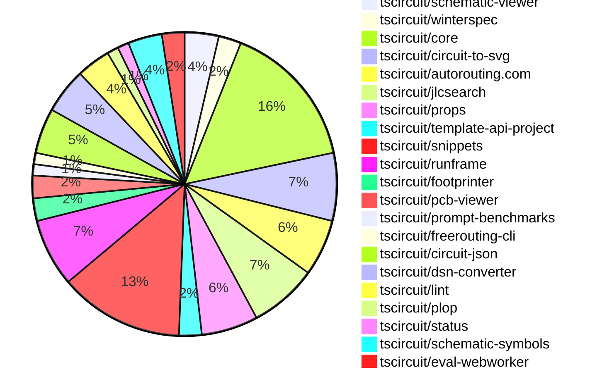

# contribution-tracker

Generates weekly contribution overviews for tscircuit contributors. Check out all
the [contribution overviews here](./contribution-overviews/)

* All PRs in the tscircuit org are scanned/summarized via Claude Haiku
* Claude classifies each Diff/PR as a Major, Minor or Tiny contribution
* All the PRs, summaries, and classifications are organized into charts and tables

The current week is shown below. There are 3 major sections:

* [Contributor Overview](#contributor-overview)
* [PRs by Repository](#prs-by-repository)
* [PRs by Contributor](#changes-by-contributor)

## Current Week

<!-- START_CURRENT_WEEK -->

# Contribution Overview 2024-12-18

## PRs by Repository

## Contributor Overview

| Contributor | 🐳 Major | 🐙 Minor | 🐌 Tiny | ⭐ | Issues Created |
|-------------|---------|---------|---------|-----|----------------|
| [seveibar](#seveibar) | 9 | 12 | 0 | 👑👑 | 83 |
| [imrishabh18](#imrishabh18) | 0 | 14 | 0 | ⭐⭐⭐ | 17 |
| [ShiboSoftwareDev](#ShiboSoftwareDev) | 4 | 4 | 0 | ⭐⭐⭐ | 11 |
| [Abse2001](#Abse2001) | 0 | 9 | 0 | ⭐⭐ | 6 |
| [techmannih](#techmannih) | 1 | 8 | 0 | ⭐⭐ | 2 |
| [Anshgrover23](#Anshgrover23) | 2 | 4 | 0 | ⭐⭐ | 3 |
| [devin-ai-integration[bot]](#devin-ai-integration[bot]) | 0 | 7 | 1 | ⭐⭐ | 0 |
| [AnasSarkiz](#AnasSarkiz) | 1 | 3 | 0 | ⭐ | 0 |
| [rohittcodes](#rohittcodes) | 0 | 3 | 0 | ⭐ | 3 |

## Review Table

[reviews-received-hover]: ## "Number of reviews received for PRs for this contributor"
[approvals-received-hover]: ## "Number of approvals received for PRs this contributor authored"
[rejections-received-hover]: ## "Number of rejections received for PRs this contributor authored"
[prs-opened-hover]: ## "Number of PRs opened by this contributor"
[issues-created-hover]: ## "Number of issues created by this contributor"
[bountied-issues-hover]: ## "Number of issues this contributor created with a bounty"
[bountied-issue-$-hover]: ## "Total bounty amount placed on issues authored by this contributor"

| Contributor | Reviews Received | Approvals Received | Rejections Received | PRs Opened | PRs Merged | Issues Created | Bountied Issues | Bountied Issue $ |
|---|---|---|---|---|---|---|---|---|
| [seveibar](#seveibar) | 1 | 1 | 0 | 23 | 21 | 83 | 33 | 782 |
| [AnasSarkiz](#AnasSarkiz) | 8 | 4 | 0 | 4 | 4 | 0 | 0 | 0 |
| [ShiboSoftwareDev](#ShiboSoftwareDev) | 17 | 9 | 1 | 9 | 8 | 11 | 5 | 210 |
| [Abse2001](#Abse2001) | 29 | 10 | 1 | 11 | 9 | 6 | 5 | 52 |
| [techmannih](#techmannih) | 30 | 12 | 11 | 16 | 9 | 2 | 0 | 0 |
| [devin-ai-integration[bot]](#devin-ai-integration[bot]) | 10 | 6 | 3 | 17 | 9 | 0 | 0 | 0 |
| [Anshgrover23](#Anshgrover23) | 57 | 6 | 14 | 13 | 6 | 3 | 0 | 0 |
| [rohittcodes](#rohittcodes) | 6 | 4 | 0 | 4 | 3 | 3 | 2 | 20 |
| [imrishabh18](#imrishabh18) | 13 | 7 | 0 | 17 | 14 | 17 | 7 | 100 |
| [karthik-nair-20](#karthik-nair-20) | 0 | 0 | 0 | 1 | 0 | 0 | 0 | 0 |
| [Niharika0104](#Niharika0104) | 2 | 0 | 1 | 1 | 0 | 1 | 0 | 0 |
| [DrSensor](#DrSensor) | 0 | 0 | 0 | 1 | 0 | 0 | 0 | 0 |

## Changes by Repository

### [tscircuit/schematic-viewer](https://github.com/tscircuit/schematic-viewer)

| PR # | Impact | Contributor | Description |
|------|--------|-------------|-------------|
| [#73](https://github.com/tscircuit/schematic-viewer/pull/73) | 🐳 Major | seveibar | Adds drag and drop editing functionality to the application. |
| [#75](https://github.com/tscircuit/schematic-viewer/pull/75) | 🐙 Minor | seveibar | Change tscircuit dependencies to peer deps to avoid duplicate installations |
| [#74](https://github.com/tscircuit/schematic-viewer/pull/74) | 🐙 Minor | AnasSarkiz | Updated the versions of `@tscircuit/core` and `circuit-to-svg` to fix the positioning of the reference designator inside the schematic component group. |

### [tscircuit/winterspec](https://github.com/tscircuit/winterspec)

| PR # | Impact | Contributor | Description |
|------|--------|-------------|-------------|
| [#25](https://github.com/tscircuit/winterspec/pull/25) | 🐳 Major | seveibar | Ports the CLI to Commander, adds lots of debug, and avoids bundleRequire when in Bun. |
| [#24](https://github.com/tscircuit/winterspec/pull/24) | 🐙 Minor | seveibar | Adds middleware exports to the `src/middleware/index.ts` file. |

### [tscircuit/core](https://github.com/tscircuit/core)

| PR # | Impact | Contributor | Description |
|------|--------|-------------|-------------|
| [#455](https://github.com/tscircuit/core/pull/455) | 🐳 Major | seveibar | This pull request adds support for schematic manual placements, allowing users to pass in `manualEdits.schematic_placements` to enable schematic drag-and-drop functionality. |
| [#439](https://github.com/tscircuit/core/pull/439) | 🐳 Major | seveibar | Adds the `applyEditEventsToManualEditsFile` function to handle updates to schematic component locations in the manual edits file. |
| [#448](https://github.com/tscircuit/core/pull/448) | 🐙 Minor | seveibar | Adds a new document "RENDERING_RULES_AND_GUIDELINES.md" that outlines the rules and guidelines for rendering in the project. |
| [#447](https://github.com/tscircuit/core/pull/447) | 🐙 Minor | seveibar | Fix the position of schematic components for group offsets. |
| [#436](https://github.com/tscircuit/core/pull/436) | 🐙 Minor | seveibar | Rename "eval_error" event to "external:evalError" |
| [#443](https://github.com/tscircuit/core/pull/443) | 🐙 Minor | AnasSarkiz | Changed the value of `schematic_component_id` of `component_name_text` to fix a reported issue. |
| [#452](https://github.com/tscircuit/core/pull/452) | 🐙 Minor | ShiboSoftwareDev | Update the versions of the `schematic-symbols` and `circuit-to-svg` packages. |
| [#444](https://github.com/tscircuit/core/pull/444) | 🐙 Minor | Abse2001 | Adds the `ccw_rotation` property to the `SilkscreenText` component |
| [#424](https://github.com/tscircuit/core/pull/424) | 🐙 Minor | techmannih | Set up continuous branch release with pkg-pr-new |
| [#428](https://github.com/tscircuit/core/pull/428) | 🐙 Minor | techmannih | Adds a new `SilkscreenLine` component to the library, which allows for the rendering of silkscreen lines on a PCB. |
| [#449](https://github.com/tscircuit/core/pull/449) | 🐙 Minor | imrishabh18 | The pull request adds a new test case to check the transform for a connected resistor and capacitor inside a group. |
| [#437](https://github.com/tscircuit/core/pull/437) | 🐙 Minor | imrishabh18 | Updates the lockfile to ensure dependencies are up-to-date. |
| [#430](https://github.com/tscircuit/core/pull/430) | 🐙 Minor | imrishabh18 | Add a new event type "eval_error" for webworker |

### [tscircuit/circuit-to-svg](https://github.com/tscircuit/circuit-to-svg)

| PR # | Impact | Contributor | Description |
|------|--------|-------------|-------------|
| [#151](https://github.com/tscircuit/circuit-to-svg/pull/151) | 🐳 Major | seveibar | Add support for computing the schematic transform and placing it on the SVG as a data attribute. |
| [#150](https://github.com/tscircuit/circuit-to-svg/pull/150) | 🐙 Minor | seveibar | Add schematic trace ID properties to SVG objects. |
| [#153](https://github.com/tscircuit/circuit-to-svg/pull/153) | 🐙 Minor | AnasSarkiz | Added `sch_componet_name` and `MPN` to the `createSvgObjectsFromSchematicComponentWithBox` function. |
| [#156](https://github.com/tscircuit/circuit-to-svg/pull/156) | 🐙 Minor | ShiboSoftwareDev | Update the dependency for `@tscircuit/core` from a specific commit hash to the latest version `0.0.239`. |
| [#155](https://github.com/tscircuit/circuit-to-svg/pull/155) | 🐙 Minor | ShiboSoftwareDev | Fixed the symbol text position to adjust for large schematic symbols. |
| [#158](https://github.com/tscircuit/circuit-to-svg/pull/158) | 🐙 Minor | Abse2001 | Adjust the position of the ground label symbol text to a temporary fix until the refactor is ready. |

### [tscircuit/autorouting.com](https://github.com/tscircuit/autorouting.com)

| PR # | Impact | Contributor | Description |
|------|--------|-------------|-------------|
| [#4](https://github.com/tscircuit/autorouting.com/pull/4) | 🐳 Major | seveibar |  |
| [#2](https://github.com/tscircuit/autorouting.com/pull/2) | 🐳 Major | seveibar | Significant overhaul to the codebase, including the introduction of a new database schema, middleware, and API routes for datasets, samples, sample files, and autorouters. |
| [#12](https://github.com/tscircuit/autorouting.com/pull/12) | 🐙 Minor | ShiboSoftwareDev | Removed the `force-dynamic` configuration from various pages to allow for prerendering. |
| [#10](https://github.com/tscircuit/autorouting.com/pull/10) | 🐙 Minor | Anshgrover23 | Automatically retry sample uploads up to 3 times on failure. |
| [#9](https://github.com/tscircuit/autorouting.com/pull/9) | 🐙 Minor | Anshgrover23 | Adds a regular progress bar to the ContributeProcessingStep component. |

### [tscircuit/jlcsearch](https://github.com/tscircuit/jlcsearch)

| PR # | Impact | Contributor | Description |
|------|--------|-------------|-------------|
| [#5](https://github.com/tscircuit/jlcsearch/pull/5) | 🐳 Major | seveibar | Add LED drivers table and API endpoint |
| [#3](https://github.com/tscircuit/jlcsearch/pull/3) | 🐳 Major | seveibar | Adds voltage regulators, health check, workflows for testing, and format checking. |
| [#12](https://github.com/tscircuit/jlcsearch/pull/12) | 🐳 Major | Anshgrover23 | Adds a new derived table for MOSFET components, including various attributes like drain-source voltage, continuous drain current, gate threshold voltage, power dissipation, operating temperature, and more. |
| [#11](https://github.com/tscircuit/jlcsearch/pull/11) | 🐙 Minor | devin-ai-integration[bot] | Adds search functionality to the components/list route, allowing users to search for components by description, manufacturer, or LCSC code. |
| [#6](https://github.com/tscircuit/jlcsearch/pull/6) | 🐙 Minor | devin-ai-integration[bot] |  |
| [#4](https://github.com/tscircuit/jlcsearch/pull/4) | 🟣 | devin-ai-integration[bot] | Added JSON support to all remaining endpoints (voltage regulators, microcontrollers, categories, components, and analog multiplexers) with proper tests and formatting. |

### [tscircuit/props](https://github.com/tscircuit/props)

| PR # | Impact | Contributor | Description |
|------|--------|-------------|-------------|
| [#129](https://github.com/tscircuit/props/pull/129) | 🐙 Minor | seveibar | Change the type of `manualEdits` from `ManualEditFile` to `ManualEditsFileInput` in the `SubcircuitGroupProps` interface. |
| [#121](https://github.com/tscircuit/props/pull/121) | 🐙 Minor | seveibar | Fix exports to include manual edit events and provide more consistent edit event type property for PCB trace hint. |
| [#124](https://github.com/tscircuit/props/pull/124) | 🐙 Minor | devin-ai-integration[bot] | Rename `manual_edit_file` to `manual_edits_file` for consistency with the interface name `ManualEditsFile`. |
| [#122](https://github.com/tscircuit/props/pull/122) | 🐙 Minor | devin-ai-integration[bot] | Add TypeScript interface definition for ManualEditsFile to match existing Zod schema |
| [#119](https://github.com/tscircuit/props/pull/119) | 🐙 Minor | techmannih | Adds a new resonator component with properties for frequency, load capacitance, and pin variant. |

### [tscircuit/template-api-project](https://github.com/tscircuit/template-api-project)

| PR # | Impact | Contributor | Description |
|------|--------|-------------|-------------|
| [#3](https://github.com/tscircuit/template-api-project/pull/3) | 🐙 Minor | seveibar | Adds GitHub Actions workflows for formatting, type checking, and testing the Bun project |
| [#2](https://github.com/tscircuit/template-api-project/pull/2) | 🐙 Minor | seveibar | Adds the `@electric-sql/pglite` and `kysely-pglite` dependencies for development, and updates the `pgstrap` dependency to version `1.0.5`. |

### [tscircuit/snippets](https://github.com/tscircuit/snippets)

| PR # | Impact | Contributor | Description |
|------|--------|-------------|-------------|
| [#423](https://github.com/tscircuit/snippets/pull/423) | 🐳 Major | ShiboSoftwareDev | Adds a feature to automatically load snippets from a registry into the development server. |
| [#343](https://github.com/tscircuit/snippets/pull/343) | 🐳 Major | techmannih | Introduces a new blinking LED board template. |
| [#416](https://github.com/tscircuit/snippets/pull/416) | 🐙 Minor | seveibar | Reverts a previous change that caused a bug where an error is shown on every snippet. |
| [#419](https://github.com/tscircuit/snippets/pull/419) | 🐙 Minor | Abse2001 | Added a new snippet example for the Arduino Nano Servo Breakout Board. |
| [#422](https://github.com/tscircuit/snippets/pull/422) | 🐙 Minor | Anshgrover23 | Add `waitForLoadState` to the `view-snippet.spec.ts` test to wait for network requests and animations to complete before taking screenshots. |
| [#406](https://github.com/tscircuit/snippets/pull/406) | 🐙 Minor | rohittcodes | Adds a dialog to edit the description of a code snippet. |
| [#386](https://github.com/tscircuit/snippets/pull/386) | 🐙 Minor | rohittcodes | Adds an error notification when the `manual-edits.json` file is not imported in the `index.tsx` file, and provides a way to manually import the file. |
| [#398](https://github.com/tscircuit/snippets/pull/398) | 🐙 Minor | devin-ai-integration[bot] | Adds a new template for creating a USB-C powered LED flashlight circuit with a push button control. |
| [#407](https://github.com/tscircuit/snippets/pull/407) | 🐙 Minor | techmannih | Update the blinking LED circuit template to change the board size and fix a small typo in the resistance value. |
| [#413](https://github.com/tscircuit/snippets/pull/413) | 🐙 Minor | imrishabh18 | Fix the issue where the manual edit template was not getting imported, causing an error due to an empty string. |
| [#393](https://github.com/tscircuit/snippets/pull/393) | 🐙 Minor | imrishabh18 | Update the `@tscircuit/pcb-viewer` dependency to version `1.10.22`. |

### [tscircuit/runframe](https://github.com/tscircuit/runframe)

| PR # | Impact | Contributor | Description |
|------|--------|-------------|-------------|
| [#48](https://github.com/tscircuit/runframe/pull/48) | 🐙 Minor | seveibar | Adds a new prop `leftHeaderContent` to the `CircuitJsonPreview` and `RunFrame` components to allow adding custom content to the left side of the header. |
| [#46](https://github.com/tscircuit/runframe/pull/46) | 🐙 Minor | imrishabh18 | Adding the CDN for Tailwind CSS and removing the unnecessary changes from the `tailwind.config` file. |
| [#43](https://github.com/tscircuit/runframe/pull/43) | 🐙 Minor | imrishabh18 | Fixes tailwind dark mode issue by removing the CDN, updating the Tailwind config, and generating the CSS using the build script. |
| [#45](https://github.com/tscircuit/runframe/pull/45) | 🐙 Minor | imrishabh18 | Workflow update to automatically commit generated CSS files to the repository. |
| [#44](https://github.com/tscircuit/runframe/pull/44) | 🐙 Minor | imrishabh18 | Updating the version of the package in the package.json file |
| [#19](https://github.com/tscircuit/runframe/pull/19) | 🐙 Minor | imrishabh18 | Adds error handling to the RunFrame component, displaying error messages in the tab. |

### [tscircuit/footprinter](https://github.com/tscircuit/footprinter)

| PR # | Impact | Contributor | Description |
|------|--------|-------------|-------------|
| [#98](https://github.com/tscircuit/footprinter/pull/98) | 🐳 Major | AnasSarkiz | Introduced a new footprint type "breakoutheaders" with various parameters like width, height, left/right/top/bottom headers, pitch, inner and outer hole diameters. |
| [#100](https://github.com/tscircuit/footprinter/pull/100) | 🐙 Minor | devin-ai-integration[bot] | Update DIP footprint inner/outer diameter ratio to 1.5mm. |

### [tscircuit/pcb-viewer](https://github.com/tscircuit/pcb-viewer)

| PR # | Impact | Contributor | Description |
|------|--------|-------------|-------------|
| [#100](https://github.com/tscircuit/pcb-viewer/pull/100) | 🐳 Major | ShiboSoftwareDev | The pull request adds lines between the closest ports in the rats nest overlay, and introduces a visual distinction between ports that are part of a net and those that are not. |
| [#99](https://github.com/tscircuit/pcb-viewer/pull/99) | 🐙 Minor | Abse2001 | Implemented silkscreen text rotation and added a storybook test for it. |

### [tscircuit/prompt-benchmarks](https://github.com/tscircuit/prompt-benchmarks)

| PR # | Impact | Contributor | Description |
|------|--------|-------------|-------------|
| [#12](https://github.com/tscircuit/prompt-benchmarks/pull/12) | 🐳 Major | ShiboSoftwareDev | Refactored the evalite benchmark to use a new architecture suggested by Matt. |

### [tscircuit/freerouting-cli](https://github.com/tscircuit/freerouting-cli)

| PR # | Impact | Contributor | Description |
|------|--------|-------------|-------------|
| [#5](https://github.com/tscircuit/freerouting-cli/pull/5) | 🐳 Major | ShiboSoftwareDev | Adds tests for the freerouting CLI and routing functionality, including a simple routing workflow and handling system status and configuration operations. |

### [tscircuit/circuit-json](https://github.com/tscircuit/circuit-json)

| PR # | Impact | Contributor | Description |
|------|--------|-------------|-------------|
| [#102](https://github.com/tscircuit/circuit-json/pull/102) | 🐳 Major | Anshgrover23 | Implemented a new `source_simple_resonator` circuit element. |
| [#101](https://github.com/tscircuit/circuit-json/pull/101) | 🐙 Minor | Abse2001 | Added a new optional field `ccw_rotation` to the `pcb_silkscreen_text` type. |
| [#108](https://github.com/tscircuit/circuit-json/pull/108) | 🐙 Minor | Anshgrover23 | Adds a linting script to the CI workflow that checks for Zod-related linting issues. |
| [#100](https://github.com/tscircuit/circuit-json/pull/100) | 🐙 Minor | rohittcodes | Adds support for parsing "KΩ" and "KV" SI units, which represent 1,000 ohms and 1,000 volts, respectively. |

### [tscircuit/dsn-converter](https://github.com/tscircuit/dsn-converter)

| PR # | Impact | Contributor | Description |
|------|--------|-------------|-------------|
| [#72](https://github.com/tscircuit/dsn-converter/pull/72) | 🐙 Minor | Abse2001 | Adds support for the Smoothie Board's specific DSN format. |
| [#71](https://github.com/tscircuit/dsn-converter/pull/71) | 🐙 Minor | Abse2001 | The pull request changes the behavior of the `processPin` and `processVis` functions to handle cases where a node cannot be parsed correctly. Instead of throwing an error, the code now logs a warning in the console and skips the offending node. |
| [#74](https://github.com/tscircuit/dsn-converter/pull/74) | 🐙 Minor | imrishabh18 | Fix the issue of duplicate plated holes with the same pin number in the circuit-json-to-dsn-json processing. |
| [#73](https://github.com/tscircuit/dsn-converter/pull/73) | 🐙 Minor | imrishabh18 | Fixes the issue of improper linkage between `source_trace` and `pcb_traces` in the Dsn session converter by processing all connected source port IDs and finding the corresponding source trace. |

### [tscircuit/lint](https://github.com/tscircuit/lint)

| PR # | Impact | Contributor | Description |
|------|--------|-------------|-------------|
| [#7](https://github.com/tscircuit/lint/pull/7) | 🐙 Minor | Abse2001 | Adds a new ESLint rule for enforcing the context-passing pattern for functions with two parameters. |
| [#1](https://github.com/tscircuit/lint/pull/1) | 🐙 Minor | Abse2001 | Adds an ESLint plugin for TSCircuit projects, including rules for banned words and limiting function parameters. |
| [#5](https://github.com/tscircuit/lint/pull/5) | 🐙 Minor | techmannih | Adds support for running the `tscircuit-lint` command using the `bunx` tool. |

### [tscircuit/plop](https://github.com/tscircuit/plop)

| PR # | Impact | Contributor | Description |
|------|--------|-------------|-------------|
| [#6](https://github.com/tscircuit/plop/pull/6) | 🐌 Tiny | devin-ai-integration[bot] | Disables the `noArrayIndexKey` lint rule in the biome.json configuration. |

### [tscircuit/status](https://github.com/tscircuit/status)

| PR # | Impact | Contributor | Description |
|------|--------|-------------|-------------|
| [#5](https://github.com/tscircuit/status/pull/5) | 🐙 Minor | devin-ai-integration[bot] | Improve timestamp sorting and add detailed timestamps to tooltips |

### [tscircuit/schematic-symbols](https://github.com/tscircuit/schematic-symbols)

| PR # | Impact | Contributor | Description |
|------|--------|-------------|-------------|
| [#227](https://github.com/tscircuit/schematic-symbols/pull/227) | 🐙 Minor | techmannih | Fix the position of the text anchors for the capacitor-right symbol. |
| [#229](https://github.com/tscircuit/schematic-symbols/pull/229) | 🐙 Minor | techmannih | Add a new DPDT (Double Pole, Double Throw) switch symbol. |
| [#228](https://github.com/tscircuit/schematic-symbols/pull/228) | 🐙 Minor | techmannih | Fix anchors on resonator |

### [tscircuit/eval-webworker](https://github.com/tscircuit/eval-webworker)

| PR # | Impact | Contributor | Description |
|------|--------|-------------|-------------|
| [#42](https://github.com/tscircuit/eval-webworker/pull/42) | 🐙 Minor | imrishabh18 | Reverts the change to remove the `emitError` function from the `InternalWebWorkerApi` type and the `evalCompiledJs` function. |
| [#33](https://github.com/tscircuit/eval-webworker/pull/33) | 🐙 Minor | imrishabh18 | This pull request adds an `emitError` function to the `webWorkerApi` object, which allows the web worker to emit errors during the evaluation of compiled JavaScript code. |

## Changes by Contributor

### [seveibar](https://github.com/seveibar)

| PR # | Impact | Description |
|------|--------|-------------|
| [#73](https://github.com/tscircuit/schematic-viewer/pull/73) | 🐳 Major | Adds drag and drop editing functionality to the application. |
| [#25](https://github.com/tscircuit/winterspec/pull/25) | 🐳 Major | Ports the CLI to Commander, adds lots of debug, and avoids bundleRequire when in Bun. |
| [#455](https://github.com/tscircuit/core/pull/455) | 🐳 Major | This pull request adds support for schematic manual placements, allowing users to pass in `manualEdits.schematic_placements` to enable schematic drag-and-drop functionality. |
| [#439](https://github.com/tscircuit/core/pull/439) | 🐳 Major | Adds the `applyEditEventsToManualEditsFile` function to handle updates to schematic component locations in the manual edits file. |
| [#151](https://github.com/tscircuit/circuit-to-svg/pull/151) | 🐳 Major | Add support for computing the schematic transform and placing it on the SVG as a data attribute. |
| [#4](https://github.com/tscircuit/autorouting.com/pull/4) | 🐳 Major |  |
| [#2](https://github.com/tscircuit/autorouting.com/pull/2) | 🐳 Major | Significant overhaul to the codebase, including the introduction of a new database schema, middleware, and API routes for datasets, samples, sample files, and autorouters. |
| [#5](https://github.com/tscircuit/jlcsearch/pull/5) | 🐳 Major | Add LED drivers table and API endpoint |
| [#3](https://github.com/tscircuit/jlcsearch/pull/3) | 🐳 Major | Adds voltage regulators, health check, workflows for testing, and format checking. |
| [#75](https://github.com/tscircuit/schematic-viewer/pull/75) | 🐙 Minor | Change tscircuit dependencies to peer deps to avoid duplicate installations |
| [#129](https://github.com/tscircuit/props/pull/129) | 🐙 Minor | Change the type of `manualEdits` from `ManualEditFile` to `ManualEditsFileInput` in the `SubcircuitGroupProps` interface. |
| [#121](https://github.com/tscircuit/props/pull/121) | 🐙 Minor | Fix exports to include manual edit events and provide more consistent edit event type property for PCB trace hint. |
| [#24](https://github.com/tscircuit/winterspec/pull/24) | 🐙 Minor | Adds middleware exports to the `src/middleware/index.ts` file. |
| [#448](https://github.com/tscircuit/core/pull/448) | 🐙 Minor | Adds a new document "RENDERING_RULES_AND_GUIDELINES.md" that outlines the rules and guidelines for rendering in the project. |
| [#447](https://github.com/tscircuit/core/pull/447) | 🐙 Minor | Fix the position of schematic components for group offsets. |
| [#436](https://github.com/tscircuit/core/pull/436) | 🐙 Minor | Rename "eval_error" event to "external:evalError" |
| [#150](https://github.com/tscircuit/circuit-to-svg/pull/150) | 🐙 Minor | Add schematic trace ID properties to SVG objects. |
| [#3](https://github.com/tscircuit/template-api-project/pull/3) | 🐙 Minor | Adds GitHub Actions workflows for formatting, type checking, and testing the Bun project |
| [#2](https://github.com/tscircuit/template-api-project/pull/2) | 🐙 Minor | Adds the `@electric-sql/pglite` and `kysely-pglite` dependencies for development, and updates the `pgstrap` dependency to version `1.0.5`. |
| [#416](https://github.com/tscircuit/snippets/pull/416) | 🐙 Minor | Reverts a previous change that caused a bug where an error is shown on every snippet. |
| [#48](https://github.com/tscircuit/runframe/pull/48) | 🐙 Minor | Adds a new prop `leftHeaderContent` to the `CircuitJsonPreview` and `RunFrame` components to allow adding custom content to the left side of the header. |

### [AnasSarkiz](https://github.com/AnasSarkiz)

| PR # | Impact | Description |
|------|--------|-------------|
| [#98](https://github.com/tscircuit/footprinter/pull/98) | 🐳 Major | Introduced a new footprint type "breakoutheaders" with various parameters like width, height, left/right/top/bottom headers, pitch, inner and outer hole diameters. |
| [#74](https://github.com/tscircuit/schematic-viewer/pull/74) | 🐙 Minor | Updated the versions of `@tscircuit/core` and `circuit-to-svg` to fix the positioning of the reference designator inside the schematic component group. |
| [#443](https://github.com/tscircuit/core/pull/443) | 🐙 Minor | Changed the value of `schematic_component_id` of `component_name_text` to fix a reported issue. |
| [#153](https://github.com/tscircuit/circuit-to-svg/pull/153) | 🐙 Minor | Added `sch_componet_name` and `MPN` to the `createSvgObjectsFromSchematicComponentWithBox` function. |

### [ShiboSoftwareDev](https://github.com/ShiboSoftwareDev)

| PR # | Impact | Description |
|------|--------|-------------|
| [#100](https://github.com/tscircuit/pcb-viewer/pull/100) | 🐳 Major | The pull request adds lines between the closest ports in the rats nest overlay, and introduces a visual distinction between ports that are part of a net and those that are not. |
| [#423](https://github.com/tscircuit/snippets/pull/423) | 🐳 Major | Adds a feature to automatically load snippets from a registry into the development server. |
| [#12](https://github.com/tscircuit/prompt-benchmarks/pull/12) | 🐳 Major | Refactored the evalite benchmark to use a new architecture suggested by Matt. |
| [#5](https://github.com/tscircuit/freerouting-cli/pull/5) | 🐳 Major | Adds tests for the freerouting CLI and routing functionality, including a simple routing workflow and handling system status and configuration operations. |
| [#452](https://github.com/tscircuit/core/pull/452) | 🐙 Minor | Update the versions of the `schematic-symbols` and `circuit-to-svg` packages. |
| [#156](https://github.com/tscircuit/circuit-to-svg/pull/156) | 🐙 Minor | Update the dependency for `@tscircuit/core` from a specific commit hash to the latest version `0.0.239`. |
| [#155](https://github.com/tscircuit/circuit-to-svg/pull/155) | 🐙 Minor | Fixed the symbol text position to adjust for large schematic symbols. |
| [#12](https://github.com/tscircuit/autorouting.com/pull/12) | 🐙 Minor | Removed the `force-dynamic` configuration from various pages to allow for prerendering. |

### [Abse2001](https://github.com/Abse2001)

| PR # | Impact | Description |
|------|--------|-------------|
| [#99](https://github.com/tscircuit/pcb-viewer/pull/99) | 🐙 Minor | Implemented silkscreen text rotation and added a storybook test for it. |
| [#101](https://github.com/tscircuit/circuit-json/pull/101) | 🐙 Minor | Added a new optional field `ccw_rotation` to the `pcb_silkscreen_text` type. |
| [#444](https://github.com/tscircuit/core/pull/444) | 🐙 Minor | Adds the `ccw_rotation` property to the `SilkscreenText` component |
| [#158](https://github.com/tscircuit/circuit-to-svg/pull/158) | 🐙 Minor | Adjust the position of the ground label symbol text to a temporary fix until the refactor is ready. |
| [#72](https://github.com/tscircuit/dsn-converter/pull/72) | 🐙 Minor | Adds support for the Smoothie Board's specific DSN format. |
| [#71](https://github.com/tscircuit/dsn-converter/pull/71) | 🐙 Minor | The pull request changes the behavior of the `processPin` and `processVis` functions to handle cases where a node cannot be parsed correctly. Instead of throwing an error, the code now logs a warning in the console and skips the offending node. |
| [#419](https://github.com/tscircuit/snippets/pull/419) | 🐙 Minor | Added a new snippet example for the Arduino Nano Servo Breakout Board. |
| [#7](https://github.com/tscircuit/lint/pull/7) | 🐙 Minor | Adds a new ESLint rule for enforcing the context-passing pattern for functions with two parameters. |
| [#1](https://github.com/tscircuit/lint/pull/1) | 🐙 Minor | Adds an ESLint plugin for TSCircuit projects, including rules for banned words and limiting function parameters. |

### [Anshgrover23](https://github.com/Anshgrover23)

| PR # | Impact | Description |
|------|--------|-------------|
| [#102](https://github.com/tscircuit/circuit-json/pull/102) | 🐳 Major | Implemented a new `source_simple_resonator` circuit element. |
| [#12](https://github.com/tscircuit/jlcsearch/pull/12) | 🐳 Major | Adds a new derived table for MOSFET components, including various attributes like drain-source voltage, continuous drain current, gate threshold voltage, power dissipation, operating temperature, and more. |
| [#108](https://github.com/tscircuit/circuit-json/pull/108) | 🐙 Minor | Adds a linting script to the CI workflow that checks for Zod-related linting issues. |
| [#10](https://github.com/tscircuit/autorouting.com/pull/10) | 🐙 Minor | Automatically retry sample uploads up to 3 times on failure. |
| [#9](https://github.com/tscircuit/autorouting.com/pull/9) | 🐙 Minor | Adds a regular progress bar to the ContributeProcessingStep component. |
| [#422](https://github.com/tscircuit/snippets/pull/422) | 🐙 Minor | Add `waitForLoadState` to the `view-snippet.spec.ts` test to wait for network requests and animations to complete before taking screenshots. |

### [rohittcodes](https://github.com/rohittcodes)

| PR # | Impact | Description |
|------|--------|-------------|
| [#100](https://github.com/tscircuit/circuit-json/pull/100) | 🐙 Minor | Adds support for parsing "KΩ" and "KV" SI units, which represent 1,000 ohms and 1,000 volts, respectively. |
| [#406](https://github.com/tscircuit/snippets/pull/406) | 🐙 Minor | Adds a dialog to edit the description of a code snippet. |
| [#386](https://github.com/tscircuit/snippets/pull/386) | 🐙 Minor | Adds an error notification when the `manual-edits.json` file is not imported in the `index.tsx` file, and provides a way to manually import the file. |

### [devin-ai-integration[bot]](https://github.com/devin-ai-integration[bot])

| PR # | Impact | Description |
|------|--------|-------------|
| [#124](https://github.com/tscircuit/props/pull/124) | 🐙 Minor | Rename `manual_edit_file` to `manual_edits_file` for consistency with the interface name `ManualEditsFile`. |
| [#122](https://github.com/tscircuit/props/pull/122) | 🐙 Minor | Add TypeScript interface definition for ManualEditsFile to match existing Zod schema |
| [#100](https://github.com/tscircuit/footprinter/pull/100) | 🐙 Minor | Update DIP footprint inner/outer diameter ratio to 1.5mm. |
| [#398](https://github.com/tscircuit/snippets/pull/398) | 🐙 Minor | Adds a new template for creating a USB-C powered LED flashlight circuit with a push button control. |
| [#11](https://github.com/tscircuit/jlcsearch/pull/11) | 🐙 Minor | Adds search functionality to the components/list route, allowing users to search for components by description, manufacturer, or LCSC code. |
| [#6](https://github.com/tscircuit/jlcsearch/pull/6) | 🐙 Minor |  |
| [#6](https://github.com/tscircuit/plop/pull/6) | 🐌 Tiny | Disables the `noArrayIndexKey` lint rule in the biome.json configuration. |
| [#4](https://github.com/tscircuit/jlcsearch/pull/4) | 🟣 | Added JSON support to all remaining endpoints (voltage regulators, microcontrollers, categories, components, and analog multiplexers) with proper tests and formatting. |
| [#5](https://github.com/tscircuit/status/pull/5) | 🐙 Minor | Improve timestamp sorting and add detailed timestamps to tooltips |

### [techmannih](https://github.com/techmannih)

| PR # | Impact | Description |
|------|--------|-------------|
| [#343](https://github.com/tscircuit/snippets/pull/343) | 🐳 Major | Introduces a new blinking LED board template. |
| [#119](https://github.com/tscircuit/props/pull/119) | 🐙 Minor | Adds a new resonator component with properties for frequency, load capacitance, and pin variant. |
| [#424](https://github.com/tscircuit/core/pull/424) | 🐙 Minor | Set up continuous branch release with pkg-pr-new |
| [#428](https://github.com/tscircuit/core/pull/428) | 🐙 Minor | Adds a new `SilkscreenLine` component to the library, which allows for the rendering of silkscreen lines on a PCB. |
| [#227](https://github.com/tscircuit/schematic-symbols/pull/227) | 🐙 Minor | Fix the position of the text anchors for the capacitor-right symbol. |
| [#229](https://github.com/tscircuit/schematic-symbols/pull/229) | 🐙 Minor | Add a new DPDT (Double Pole, Double Throw) switch symbol. |
| [#228](https://github.com/tscircuit/schematic-symbols/pull/228) | 🐙 Minor | Fix anchors on resonator |
| [#407](https://github.com/tscircuit/snippets/pull/407) | 🐙 Minor | Update the blinking LED circuit template to change the board size and fix a small typo in the resistance value. |
| [#5](https://github.com/tscircuit/lint/pull/5) | 🐙 Minor | Adds support for running the `tscircuit-lint` command using the `bunx` tool. |

### [imrishabh18](https://github.com/imrishabh18)

| PR # | Impact | Description |
|------|--------|-------------|
| [#449](https://github.com/tscircuit/core/pull/449) | 🐙 Minor | The pull request adds a new test case to check the transform for a connected resistor and capacitor inside a group. |
| [#437](https://github.com/tscircuit/core/pull/437) | 🐙 Minor | Updates the lockfile to ensure dependencies are up-to-date. |
| [#430](https://github.com/tscircuit/core/pull/430) | 🐙 Minor | Add a new event type "eval_error" for webworker |
| [#74](https://github.com/tscircuit/dsn-converter/pull/74) | 🐙 Minor | Fix the issue of duplicate plated holes with the same pin number in the circuit-json-to-dsn-json processing. |
| [#73](https://github.com/tscircuit/dsn-converter/pull/73) | 🐙 Minor | Fixes the issue of improper linkage between `source_trace` and `pcb_traces` in the Dsn session converter by processing all connected source port IDs and finding the corresponding source trace. |
| [#413](https://github.com/tscircuit/snippets/pull/413) | 🐙 Minor | Fix the issue where the manual edit template was not getting imported, causing an error due to an empty string. |
| [#393](https://github.com/tscircuit/snippets/pull/393) | 🐙 Minor | Update the `@tscircuit/pcb-viewer` dependency to version `1.10.22`. |
| [#42](https://github.com/tscircuit/eval-webworker/pull/42) | 🐙 Minor | Reverts the change to remove the `emitError` function from the `InternalWebWorkerApi` type and the `evalCompiledJs` function. |
| [#33](https://github.com/tscircuit/eval-webworker/pull/33) | 🐙 Minor | This pull request adds an `emitError` function to the `webWorkerApi` object, which allows the web worker to emit errors during the evaluation of compiled JavaScript code. |
| [#46](https://github.com/tscircuit/runframe/pull/46) | 🐙 Minor | Adding the CDN for Tailwind CSS and removing the unnecessary changes from the `tailwind.config` file. |
| [#43](https://github.com/tscircuit/runframe/pull/43) | 🐙 Minor | Fixes tailwind dark mode issue by removing the CDN, updating the Tailwind config, and generating the CSS using the build script. |
| [#45](https://github.com/tscircuit/runframe/pull/45) | 🐙 Minor | Workflow update to automatically commit generated CSS files to the repository. |
| [#44](https://github.com/tscircuit/runframe/pull/44) | 🐙 Minor | Updating the version of the package in the package.json file |
| [#19](https://github.com/tscircuit/runframe/pull/19) | 🐙 Minor | Adds error handling to the RunFrame component, displaying error messages in the tab. |

<!-- END_CURRENT_WEEK -->
