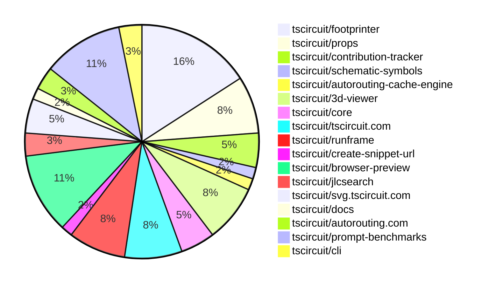

# contribution-tracker

Generates weekly contribution overviews for tscircuit contributors. Check out all
the [contribution overviews here](./contribution-overviews/)

* All PRs in the tscircuit org are scanned/summarized via Claude Haiku
* Claude classifies each Diff/PR as a Major, Minor or Tiny contribution
* All the PRs, summaries, and classifications are organized into charts and tables

The current week is shown below. There are 3 major sections:

* [Contributor Overview](#contributor-overview)
* [PRs by Repository](#prs-by-repository)
* [PRs by Contributor](#changes-by-contributor)

## Current Week

<!-- START_CURRENT_WEEK -->

# Contribution Overview 2025-02-05

## PRs by Repository

## Contributor Overview

| Contributor | 🐳 Major | 🐙 Minor | 🐌 Tiny | ⭐ | Issues Created |
|-------------|---------|---------|---------|-----|----------------|
| [seveibar](#seveibar) | 1 | 8 | 0 | ⭐⭐⭐ | 47 |
| [techmannih](#techmannih) | 2 | 10 | 0 | ⭐⭐⭐ | 15 |
| [imrishabh18](#imrishabh18) | 2 | 8 | 2 | ⭐⭐ | 10 |
| [ShiboSoftwareDev](#ShiboSoftwareDev) | 1 | 5 | 1 | ⭐⭐ | 3 |
| [kom-senapati](#kom-senapati) | 1 | 4 | 1 | ⭐⭐ | 6 |
| [Anshgrover23](#Anshgrover23) | 2 | 2 | 1 | ⭐⭐ | 5 |
| [Rishikesh63](#Rishikesh63) | 0 | 1 | 0 | ⭐ | 2 |
| [Ayushjhawar8](#Ayushjhawar8) | 0 | 3 | 0 | ⭐ | 0 |
| [ArnavK-09](#ArnavK-09) | 1 | 1 | 0 | ⭐ | 1 |
| [Abse2001](#Abse2001) | 0 | 2 | 0 | ⭐ | 1 |
| [PatanSharuKhan](#PatanSharuKhan) | 0 | 1 | 0 |  | 0 |
| [zalabhavy](#zalabhavy) | 0 | 1 | 0 |  | 0 |
| [MustafaMulla29](#MustafaMulla29) | 0 | 1 | 0 |  | 1 |
| [rohittcodes](#rohittcodes) | 0 | 1 | 0 |  | 1 |

## Review Table

[reviews-received-hover]: ## "Number of reviews received for PRs for this contributor"
[approvals-received-hover]: ## "Number of approvals received for PRs this contributor authored"
[rejections-received-hover]: ## "Number of rejections received for PRs this contributor authored"
[prs-opened-hover]: ## "Number of PRs opened by this contributor"
[issues-created-hover]: ## "Number of issues created by this contributor"
[bountied-issues-hover]: ## "Number of issues this contributor created with a bounty"
[bountied-issue-$-hover]: ## "Total bounty amount placed on issues authored by this contributor"

| Contributor | Reviews Received | Approvals Received | Rejections Received | Approvals | Rejections | PRs Opened | PRs Merged | Issues Created | Bountied Issues | Bountied Issue $ |
|---|---|---|---|---|---|---|---|---|---|---|
| [Ayushjhawar8](#Ayushjhawar8) | 11 | 3 | 2 | 0 | 0 | 4 | 3 | 0 | 0 | 0 |
| [seveibar](#seveibar) | 0 | 0 | 0 | 33 | 13 | 9 | 9 | 47 | 38 | 559 |
| [PatanSharuKhan](#PatanSharuKhan) | 2 | 1 | 1 | 0 | 0 | 2 | 1 | 0 | 0 | 0 |
| [techmannih](#techmannih) | 47 | 15 | 13 | 0 | 2 | 23 | 12 | 15 | 8 | 55 |
| [Anshgrover23](#Anshgrover23) | 13 | 4 | 5 | 5 | 17 | 10 | 5 | 5 | 0 | 0 |
| [imrishabh18](#imrishabh18) | 3 | 3 | 0 | 11 | 12 | 15 | 12 | 10 | 1 | 2 |
| [Rishikesh63](#Rishikesh63) | 16 | 3 | 6 | 0 | 0 | 6 | 1 | 2 | 2 | 20 |
| [AnasSarkiz](#AnasSarkiz) | 0 | 0 | 0 | 1 | 1 | 0 | 0 | 0 | 0 | 0 |
| [kom-senapati](#kom-senapati) | 15 | 7 | 3 | 0 | 0 | 9 | 6 | 6 | 3 | 14 |
| [ArnavK-09](#ArnavK-09) | 24 | 2 | 7 | 0 | 0 | 6 | 2 | 1 | 0 | 0 |
| [rohittcodes](#rohittcodes) | 10 | 2 | 2 | 0 | 0 | 2 | 1 | 1 | 0 | 0 |
| [AbhinavTheDev](#AbhinavTheDev) | 1 | 0 | 0 | 0 | 0 | 2 | 0 | 0 | 0 | 0 |
| [zalabhavy](#zalabhavy) | 2 | 1 | 1 | 0 | 0 | 2 | 1 | 0 | 0 | 0 |
| [MustafaMulla29](#MustafaMulla29) | 2 | 1 | 1 | 0 | 0 | 3 | 1 | 1 | 0 | 0 |
| [Abse2001](#Abse2001) | 3 | 2 | 1 | 0 | 0 | 2 | 2 | 1 | 0 | 0 |
| [ajey35](#ajey35) | 2 | 0 | 1 | 0 | 0 | 3 | 0 | 1 | 0 | 0 |
| [ShiboSoftwareDev](#ShiboSoftwareDev) | 7 | 6 | 0 | 0 | 0 | 8 | 7 | 3 | 2 | 22 |
| [18bharathkumar](#18bharathkumar) | 2 | 0 | 2 | 0 | 0 | 3 | 0 | 0 | 0 | 0 |
| [DrSensor](#DrSensor) | 0 | 0 | 0 | 0 | 0 | 0 | 0 | 0 | 0 | 0 |

## Changes by Repository

### [tscircuit/footprinter](https://github.com/tscircuit/footprinter)

| PR # | Impact | Contributor | Description |
|------|--------|-------------|-------------|
| [#152](https://github.com/tscircuit/footprinter/pull/152) | 🐳 Major | techmannih | Adds a new footprint called "melf" to the project. |
| [#132](https://github.com/tscircuit/footprinter/pull/132) | 🐳 Major | techmannih | Implements the "sod523" component, which includes the definition of the component parameters, the generation of the component pads, and the creation of the silkscreen reference and path. |
| [#160](https://github.com/tscircuit/footprinter/pull/160) | 🐙 Minor | techmannih | Adds the 'sod882d' footprint to the project. |
| [#157](https://github.com/tscircuit/footprinter/pull/157) | 🐙 Minor | techmannih | Adds a new micromelf footprint to the codebase. |
| [#142](https://github.com/tscircuit/footprinter/pull/142) | 🐙 Minor | techmannih | Adds the Sod882 footprint to the project. |
| [#146](https://github.com/tscircuit/footprinter/pull/146) | 🐙 Minor | techmannih | Adds a new footprint for the sod323f package. |
| [#144](https://github.com/tscircuit/footprinter/pull/144) | 🐙 Minor | techmannih | Adds a new footprint for the SOD123F component. |
| [#150](https://github.com/tscircuit/footprinter/pull/150) | 🐙 Minor | techmannih | Adds a new footprint for the SOD128 package. |
| [#137](https://github.com/tscircuit/footprinter/pull/137) | 🐙 Minor | techmannih | Adds a new footprint for the SOD723 package. |
| [#128](https://github.com/tscircuit/footprinter/pull/128) | 🐙 Minor | Rishikesh63 | Added support for the SOP-8 package footprint. |

### [tscircuit/props](https://github.com/tscircuit/props)

| PR # | Impact | Contributor | Description |
|------|--------|-------------|-------------|
| [#164](https://github.com/tscircuit/props/pull/164) | 🐙 Minor | techmannih | Improves the `switch` component's props by adding support for different switch types (SPST, SPDT, DPST, DPDT) and automatically setting the corresponding boolean properties. |
| [#165](https://github.com/tscircuit/props/pull/165) | 🐙 Minor | seveibar | Introduce a new configuration option `serverCacheEnabled` to control the server-side caching of PCB routing results. |
| [#158](https://github.com/tscircuit/props/pull/158) | 🐙 Minor | seveibar | Rename `transistorType` to `type` and expand the allowed values to include additional transistor types. |
| [#161](https://github.com/tscircuit/props/pull/161) | 🐙 Minor | Anshgrover23 | Add a new `schFacingDirection` prop to `pinHeaderProps` to specify the schematic facing direction. |
| [#162](https://github.com/tscircuit/props/pull/162) | 🐙 Minor | Anshgrover23 | Fix the transistor test cases to use the correct property name "type" instead of "transistorType". |

### [tscircuit/contribution-tracker](https://github.com/tscircuit/contribution-tracker)

| PR # | Impact | Contributor | Description |
|------|--------|-------------|-------------|
| [#48](https://github.com/tscircuit/contribution-tracker/pull/48) | 🐙 Minor | techmannih | Add GitHub link for top contributors in the ContributorOverview component. |
| [#51](https://github.com/tscircuit/contribution-tracker/pull/51) | 🐙 Minor | kom-senapati | Add faded lines for stars in contributor graph |
| [#55](https://github.com/tscircuit/contribution-tracker/pull/55) | 🐌 Tiny | kom-senapati | Add a small shadow and gap under the contributor graph |

### [tscircuit/schematic-symbols](https://github.com/tscircuit/schematic-symbols)

| PR # | Impact | Contributor | Description |
|------|--------|-------------|-------------|
| [#245](https://github.com/tscircuit/schematic-symbols/pull/245) | 🐙 Minor | techmannih | Adds a 3-pin potentiometer symbol to the library. |

### [tscircuit/autorouting-cache-engine](https://github.com/tscircuit/autorouting-cache-engine)

| PR # | Impact | Contributor | Description |
|------|--------|-------------|-------------|
| [#2](https://github.com/tscircuit/autorouting-cache-engine/pull/2) | 🐳 Major | seveibar | Handles subcircuits in cache key and handling for already-routed traces |

### [tscircuit/3d-viewer](https://github.com/tscircuit/3d-viewer)

| PR # | Impact | Contributor | Description |
|------|--------|-------------|-------------|
| [#151](https://github.com/tscircuit/3d-viewer/pull/151) | 🐳 Major | Anshgrover23 | Replace @tscircuit/soup with circuit-json |
| [#161](https://github.com/tscircuit/3d-viewer/pull/161) | 🐳 Major | imrishabh18 | Introduces a new project structure with three main components: `core`, `react`, and `stories`. |
| [#166](https://github.com/tscircuit/3d-viewer/pull/166) | 🐙 Minor | seveibar | Set the default camera position based on the board size, and make it higher. |
| [#160](https://github.com/tscircuit/3d-viewer/pull/160) | 🐙 Minor | imrishabh18 | Fixes a bug to ensure backwards compatibility with the `circuitJson` parameter in the `soup-to-3d` function. |
| [#157](https://github.com/tscircuit/3d-viewer/pull/157) | 🐌 Tiny | Anshgrover23 | Updates the bun lockfile |

### [tscircuit/core](https://github.com/tscircuit/core)

| PR # | Impact | Contributor | Description |
|------|--------|-------------|-------------|
| [#608](https://github.com/tscircuit/core/pull/608) | 🐙 Minor | seveibar | Adds a new configuration option `serverCacheEnabled` to the autorouter configuration, which allows enabling or disabling server-side caching of autorouting results. |
| [#596](https://github.com/tscircuit/core/pull/596) | 🐙 Minor | imrishabh18 | Adds a test for subcircuit caching in a PCB design |
| [#580](https://github.com/tscircuit/core/pull/580) | 🐙 Minor | Ayushjhawar8 | Improves error handling for components with no PCB connection and missing footprint. |

### [tscircuit/tscircuit.com](https://github.com/tscircuit/tscircuit.com)

| PR # | Impact | Contributor | Description |
|------|--------|-------------|-------------|
| [#647](https://github.com/tscircuit/tscircuit.com/pull/647) | 🐳 Major | kom-senapati | Adds a delete icon and functionality to the profile snippet grid. |
| [#651](https://github.com/tscircuit/tscircuit.com/pull/651) | 🐙 Minor | seveibar | Changes the "Get Started" button on the landing page to link to the docs site instead of the dashboard. |
| [#658](https://github.com/tscircuit/tscircuit.com/pull/658) | 🐙 Minor | PatanSharuKhan | Fix the responsiveness of the Github badge on the landing page |
| [#655](https://github.com/tscircuit/tscircuit.com/pull/655) | 🐙 Minor | zalabhavy | Adds spacing from the right side of the "Get Started" button for smaller device sizes. |
| [#654](https://github.com/tscircuit/tscircuit.com/pull/654) | 🐙 Minor | MustafaMulla29 | Fix screen overflow in the editor page |

### [tscircuit/runframe](https://github.com/tscircuit/runframe)

| PR # | Impact | Contributor | Description |
|------|--------|-------------|-------------|
| [#215](https://github.com/tscircuit/runframe/pull/215) | 🐙 Minor | seveibar | Update the 3D viewer dependency to a newer version and update a related dependency |
| [#212](https://github.com/tscircuit/runframe/pull/212) | 🐙 Minor | imrishabh18 | Adds a standalone CircuitJsonPreview component with a toggle for the right header content. |
| [#211](https://github.com/tscircuit/runframe/pull/211) | 🐙 Minor | imrishabh18 | Add the `autoRotateDisabled` prop for `3d-viewer` component |
| [#207](https://github.com/tscircuit/runframe/pull/207) | 🐙 Minor | Ayushjhawar8 | Fix the issue where the cancel button was overlapping the run button. |
| [#202](https://github.com/tscircuit/runframe/pull/202) | 🐙 Minor | rohittcodes | Adds a fullscreen button for mode toggle in the CircuitJsonPreview component. |

### [tscircuit/create-snippet-url](https://github.com/tscircuit/create-snippet-url)

| PR # | Impact | Contributor | Description |
|------|--------|-------------|-------------|
| [#3](https://github.com/tscircuit/create-snippet-url/pull/3) | 🐙 Minor | seveibar | Adds `createPngUrl` and `createBrowserPreviewUrl` functions, and makes `gzipSync` deterministic by fixing the `mtime` parameter. |

### [tscircuit/browser-preview](https://github.com/tscircuit/browser-preview)

| PR # | Impact | Contributor | Description |
|------|--------|-------------|-------------|
| [#7](https://github.com/tscircuit/browser-preview/pull/7) | 🐳 Major | imrishabh18 | Adds support for passing compressed code in query parameters. |
| [#10](https://github.com/tscircuit/browser-preview/pull/10) | 🐙 Minor | seveibar | Update build scripts to ensure that runframe updates on production |
| [#4](https://github.com/tscircuit/browser-preview/pull/4) | 🐙 Minor | imrishabh18 | Update package dependencies in the bun.lock file. |
| [#1](https://github.com/tscircuit/browser-preview/pull/1) | 🐙 Minor | imrishabh18 | Add circuit JSON preview |
| [#9](https://github.com/tscircuit/browser-preview/pull/9) | 🐙 Minor | kom-senapati | Adds an "Open Example" button to the index page that populates the code textarea with an example code snippet. |
| [#5](https://github.com/tscircuit/browser-preview/pull/5) | 🐌 Tiny | imrishabh18 | Update the header of the preview |
| [#3](https://github.com/tscircuit/browser-preview/pull/3) | 🐌 Tiny | imrishabh18 | Updates the README.md file with a brief description of the project. |

### [tscircuit/jlcsearch](https://github.com/tscircuit/jlcsearch)

| PR # | Impact | Contributor | Description |
|------|--------|-------------|-------------|
| [#32](https://github.com/tscircuit/jlcsearch/pull/32) | 🐳 Major | Anshgrover23 | Introduced a common base component interface to share common properties across different component types. |
| [#30](https://github.com/tscircuit/jlcsearch/pull/30) | 🐙 Minor | Ayushjhawar8 | Fix wrong linking of issues to the tscircuit repository instead of the footprinter repository. |

### [tscircuit/svg.tscircuit.com](https://github.com/tscircuit/svg.tscircuit.com)

| PR # | Impact | Contributor | Description |
|------|--------|-------------|-------------|
| [#40](https://github.com/tscircuit/svg.tscircuit.com/pull/40) | 🐙 Minor | imrishabh18 | Removes the 3D SVG generation code. |
| [#43](https://github.com/tscircuit/svg.tscircuit.com/pull/43) | 🐙 Minor | kom-senapati | Adds a new `view` parameter as an alternative to the existing `svg_type` parameter, with `svg_type` taking precedence. |
| [#42](https://github.com/tscircuit/svg.tscircuit.com/pull/42) | 🐙 Minor | kom-senapati | Add the core package to the project. |

### [tscircuit/docs](https://github.com/tscircuit/docs)

| PR # | Impact | Contributor | Description |
|------|--------|-------------|-------------|
| [#4](https://github.com/tscircuit/docs/pull/4) | 🐙 Minor | imrishabh18 | Adds support for a 3D view of code snippets |

### [tscircuit/autorouting.com](https://github.com/tscircuit/autorouting.com)

| PR # | Impact | Contributor | Description |
|------|--------|-------------|-------------|
| [#32](https://github.com/tscircuit/autorouting.com/pull/32) | 🐙 Minor | Abse2001 | Refactored the CLI to use the Go-style error handling, with improved error messages and error handling. |
| [#31](https://github.com/tscircuit/autorouting.com/pull/31) | 🐙 Minor | Abse2001 | The pull request refactors the download command to use the Golang error style instead of try-catch. |

### [tscircuit/prompt-benchmarks](https://github.com/tscircuit/prompt-benchmarks)

| PR # | Impact | Contributor | Description |
|------|--------|-------------|-------------|
| [#27](https://github.com/tscircuit/prompt-benchmarks/pull/27) | 🐳 Major | ShiboSoftwareDev | Introduces an interface for creating a circuit with streaming and a virtual file system (VFS) for attempts. |
| [#31](https://github.com/tscircuit/prompt-benchmarks/pull/31) | 🐙 Minor | ShiboSoftwareDev | Fixed the library path and now the custom Anthropic client can be used. |
| [#30](https://github.com/tscircuit/prompt-benchmarks/pull/30) | 🐙 Minor | ShiboSoftwareDev | Fixed exports across various modules |
| [#29](https://github.com/tscircuit/prompt-benchmarks/pull/29) | 🐙 Minor | ShiboSoftwareDev | Fixed the export of the `aicoder` module in the library. |
| [#28](https://github.com/tscircuit/prompt-benchmarks/pull/28) | 🐙 Minor | ShiboSoftwareDev | Exports the `aicoder` module and updates the README with information about using the AiCoder interface. |
| [#26](https://github.com/tscircuit/prompt-benchmarks/pull/26) | 🐙 Minor | ShiboSoftwareDev | Updates the README file with more detailed information about the project, including the structure of the benchmarking system and instructions for running the benchmarks. |
| [#25](https://github.com/tscircuit/prompt-benchmarks/pull/25) | 🐌 Tiny | ShiboSoftwareDev | Removes the old benchmark script `benchmark-error-correction.eval.paused.ts`. |

### [tscircuit/cli](https://github.com/tscircuit/cli)

| PR # | Impact | Contributor | Description |
|------|--------|-------------|-------------|
| [#54](https://github.com/tscircuit/cli/pull/54) | 🐳 Major | ArnavK-09 | Adds the ability to save a code snippet to the registry. |
| [#50](https://github.com/tscircuit/cli/pull/50) | 🐙 Minor | ArnavK-09 | Fixes the react type declarations for the project. |

## Changes by Contributor

### [techmannih](https://github.com/techmannih)

| PR # | Impact | Description |
|------|--------|-------------|
| [#152](https://github.com/tscircuit/footprinter/pull/152) | 🐳 Major | Adds a new footprint called "melf" to the project. |
| [#132](https://github.com/tscircuit/footprinter/pull/132) | 🐳 Major | Implements the "sod523" component, which includes the definition of the component parameters, the generation of the component pads, and the creation of the silkscreen reference and path. |
| [#164](https://github.com/tscircuit/props/pull/164) | 🐙 Minor | Improves the `switch` component's props by adding support for different switch types (SPST, SPDT, DPST, DPDT) and automatically setting the corresponding boolean properties. |
| [#160](https://github.com/tscircuit/footprinter/pull/160) | 🐙 Minor | Adds the 'sod882d' footprint to the project. |
| [#157](https://github.com/tscircuit/footprinter/pull/157) | 🐙 Minor | Adds a new micromelf footprint to the codebase. |
| [#142](https://github.com/tscircuit/footprinter/pull/142) | 🐙 Minor | Adds the Sod882 footprint to the project. |
| [#146](https://github.com/tscircuit/footprinter/pull/146) | 🐙 Minor | Adds a new footprint for the sod323f package. |
| [#144](https://github.com/tscircuit/footprinter/pull/144) | 🐙 Minor | Adds a new footprint for the SOD123F component. |
| [#150](https://github.com/tscircuit/footprinter/pull/150) | 🐙 Minor | Adds a new footprint for the SOD128 package. |
| [#137](https://github.com/tscircuit/footprinter/pull/137) | 🐙 Minor | Adds a new footprint for the SOD723 package. |
| [#48](https://github.com/tscircuit/contribution-tracker/pull/48) | 🐙 Minor | Add GitHub link for top contributors in the ContributorOverview component. |
| [#245](https://github.com/tscircuit/schematic-symbols/pull/245) | 🐙 Minor | Adds a 3-pin potentiometer symbol to the library. |

### [seveibar](https://github.com/seveibar)

| PR # | Impact | Description |
|------|--------|-------------|
| [#2](https://github.com/tscircuit/autorouting-cache-engine/pull/2) | 🐳 Major | Handles subcircuits in cache key and handling for already-routed traces |
| [#165](https://github.com/tscircuit/props/pull/165) | 🐙 Minor | Introduce a new configuration option `serverCacheEnabled` to control the server-side caching of PCB routing results. |
| [#158](https://github.com/tscircuit/props/pull/158) | 🐙 Minor | Rename `transistorType` to `type` and expand the allowed values to include additional transistor types. |
| [#166](https://github.com/tscircuit/3d-viewer/pull/166) | 🐙 Minor | Set the default camera position based on the board size, and make it higher. |
| [#608](https://github.com/tscircuit/core/pull/608) | 🐙 Minor | Adds a new configuration option `serverCacheEnabled` to the autorouter configuration, which allows enabling or disabling server-side caching of autorouting results. |
| [#651](https://github.com/tscircuit/tscircuit.com/pull/651) | 🐙 Minor | Changes the "Get Started" button on the landing page to link to the docs site instead of the dashboard. |
| [#215](https://github.com/tscircuit/runframe/pull/215) | 🐙 Minor | Update the 3D viewer dependency to a newer version and update a related dependency |
| [#3](https://github.com/tscircuit/create-snippet-url/pull/3) | 🐙 Minor | Adds `createPngUrl` and `createBrowserPreviewUrl` functions, and makes `gzipSync` deterministic by fixing the `mtime` parameter. |
| [#10](https://github.com/tscircuit/browser-preview/pull/10) | 🐙 Minor | Update build scripts to ensure that runframe updates on production |

### [Anshgrover23](https://github.com/Anshgrover23)

| PR # | Impact | Description |
|------|--------|-------------|
| [#151](https://github.com/tscircuit/3d-viewer/pull/151) | 🐳 Major | Replace @tscircuit/soup with circuit-json |
| [#32](https://github.com/tscircuit/jlcsearch/pull/32) | 🐳 Major | Introduced a common base component interface to share common properties across different component types. |
| [#161](https://github.com/tscircuit/props/pull/161) | 🐙 Minor | Add a new `schFacingDirection` prop to `pinHeaderProps` to specify the schematic facing direction. |
| [#162](https://github.com/tscircuit/props/pull/162) | 🐙 Minor | Fix the transistor test cases to use the correct property name "type" instead of "transistorType". |
| [#157](https://github.com/tscircuit/3d-viewer/pull/157) | 🐌 Tiny | Updates the bun lockfile |

### [Rishikesh63](https://github.com/Rishikesh63)

| PR # | Impact | Description |
|------|--------|-------------|
| [#128](https://github.com/tscircuit/footprinter/pull/128) | 🐙 Minor | Added support for the SOP-8 package footprint. |

### [imrishabh18](https://github.com/imrishabh18)

| PR # | Impact | Description |
|------|--------|-------------|
| [#161](https://github.com/tscircuit/3d-viewer/pull/161) | 🐳 Major | Introduces a new project structure with three main components: `core`, `react`, and `stories`. |
| [#7](https://github.com/tscircuit/browser-preview/pull/7) | 🐳 Major | Adds support for passing compressed code in query parameters. |
| [#160](https://github.com/tscircuit/3d-viewer/pull/160) | 🐙 Minor | Fixes a bug to ensure backwards compatibility with the `circuitJson` parameter in the `soup-to-3d` function. |
| [#596](https://github.com/tscircuit/core/pull/596) | 🐙 Minor | Adds a test for subcircuit caching in a PCB design |
| [#212](https://github.com/tscircuit/runframe/pull/212) | 🐙 Minor | Adds a standalone CircuitJsonPreview component with a toggle for the right header content. |
| [#211](https://github.com/tscircuit/runframe/pull/211) | 🐙 Minor | Add the `autoRotateDisabled` prop for `3d-viewer` component |
| [#40](https://github.com/tscircuit/svg.tscircuit.com/pull/40) | 🐙 Minor | Removes the 3D SVG generation code. |
| [#4](https://github.com/tscircuit/docs/pull/4) | 🐙 Minor | Adds support for a 3D view of code snippets |
| [#4](https://github.com/tscircuit/browser-preview/pull/4) | 🐙 Minor | Update package dependencies in the bun.lock file. |
| [#1](https://github.com/tscircuit/browser-preview/pull/1) | 🐙 Minor | Add circuit JSON preview |
| [#5](https://github.com/tscircuit/browser-preview/pull/5) | 🐌 Tiny | Update the header of the preview |
| [#3](https://github.com/tscircuit/browser-preview/pull/3) | 🐌 Tiny | Updates the README.md file with a brief description of the project. |

### [Ayushjhawar8](https://github.com/Ayushjhawar8)

| PR # | Impact | Description |
|------|--------|-------------|
| [#580](https://github.com/tscircuit/core/pull/580) | 🐙 Minor | Improves error handling for components with no PCB connection and missing footprint. |
| [#30](https://github.com/tscircuit/jlcsearch/pull/30) | 🐙 Minor | Fix wrong linking of issues to the tscircuit repository instead of the footprinter repository. |
| [#207](https://github.com/tscircuit/runframe/pull/207) | 🐙 Minor | Fix the issue where the cancel button was overlapping the run button. |

### [kom-senapati](https://github.com/kom-senapati)

| PR # | Impact | Description |
|------|--------|-------------|
| [#647](https://github.com/tscircuit/tscircuit.com/pull/647) | 🐳 Major | Adds a delete icon and functionality to the profile snippet grid. |
| [#51](https://github.com/tscircuit/contribution-tracker/pull/51) | 🐙 Minor | Add faded lines for stars in contributor graph |
| [#43](https://github.com/tscircuit/svg.tscircuit.com/pull/43) | 🐙 Minor | Adds a new `view` parameter as an alternative to the existing `svg_type` parameter, with `svg_type` taking precedence. |
| [#42](https://github.com/tscircuit/svg.tscircuit.com/pull/42) | 🐙 Minor | Add the core package to the project. |
| [#9](https://github.com/tscircuit/browser-preview/pull/9) | 🐙 Minor | Adds an "Open Example" button to the index page that populates the code textarea with an example code snippet. |
| [#55](https://github.com/tscircuit/contribution-tracker/pull/55) | 🐌 Tiny | Add a small shadow and gap under the contributor graph |

### [Abse2001](https://github.com/Abse2001)

| PR # | Impact | Description |
|------|--------|-------------|
| [#32](https://github.com/tscircuit/autorouting.com/pull/32) | 🐙 Minor | Refactored the CLI to use the Go-style error handling, with improved error messages and error handling. |
| [#31](https://github.com/tscircuit/autorouting.com/pull/31) | 🐙 Minor | The pull request refactors the download command to use the Golang error style instead of try-catch. |

### [PatanSharuKhan](https://github.com/PatanSharuKhan)

| PR # | Impact | Description |
|------|--------|-------------|
| [#658](https://github.com/tscircuit/tscircuit.com/pull/658) | 🐙 Minor | Fix the responsiveness of the Github badge on the landing page |

### [zalabhavy](https://github.com/zalabhavy)

| PR # | Impact | Description |
|------|--------|-------------|
| [#655](https://github.com/tscircuit/tscircuit.com/pull/655) | 🐙 Minor | Adds spacing from the right side of the "Get Started" button for smaller device sizes. |

### [MustafaMulla29](https://github.com/MustafaMulla29)

| PR # | Impact | Description |
|------|--------|-------------|
| [#654](https://github.com/tscircuit/tscircuit.com/pull/654) | 🐙 Minor | Fix screen overflow in the editor page |

### [ShiboSoftwareDev](https://github.com/ShiboSoftwareDev)

| PR # | Impact | Description |
|------|--------|-------------|
| [#27](https://github.com/tscircuit/prompt-benchmarks/pull/27) | 🐳 Major | Introduces an interface for creating a circuit with streaming and a virtual file system (VFS) for attempts. |
| [#31](https://github.com/tscircuit/prompt-benchmarks/pull/31) | 🐙 Minor | Fixed the library path and now the custom Anthropic client can be used. |
| [#30](https://github.com/tscircuit/prompt-benchmarks/pull/30) | 🐙 Minor | Fixed exports across various modules |
| [#29](https://github.com/tscircuit/prompt-benchmarks/pull/29) | 🐙 Minor | Fixed the export of the `aicoder` module in the library. |
| [#28](https://github.com/tscircuit/prompt-benchmarks/pull/28) | 🐙 Minor | Exports the `aicoder` module and updates the README with information about using the AiCoder interface. |
| [#26](https://github.com/tscircuit/prompt-benchmarks/pull/26) | 🐙 Minor | Updates the README file with more detailed information about the project, including the structure of the benchmarking system and instructions for running the benchmarks. |
| [#25](https://github.com/tscircuit/prompt-benchmarks/pull/25) | 🐌 Tiny | Removes the old benchmark script `benchmark-error-correction.eval.paused.ts`. |

### [rohittcodes](https://github.com/rohittcodes)

| PR # | Impact | Description |
|------|--------|-------------|
| [#202](https://github.com/tscircuit/runframe/pull/202) | 🐙 Minor | Adds a fullscreen button for mode toggle in the CircuitJsonPreview component. |

### [ArnavK-09](https://github.com/ArnavK-09)

| PR # | Impact | Description |
|------|--------|-------------|
| [#54](https://github.com/tscircuit/cli/pull/54) | 🐳 Major | Adds the ability to save a code snippet to the registry. |
| [#50](https://github.com/tscircuit/cli/pull/50) | 🐙 Minor | Fixes the react type declarations for the project. |

<!-- END_CURRENT_WEEK -->
