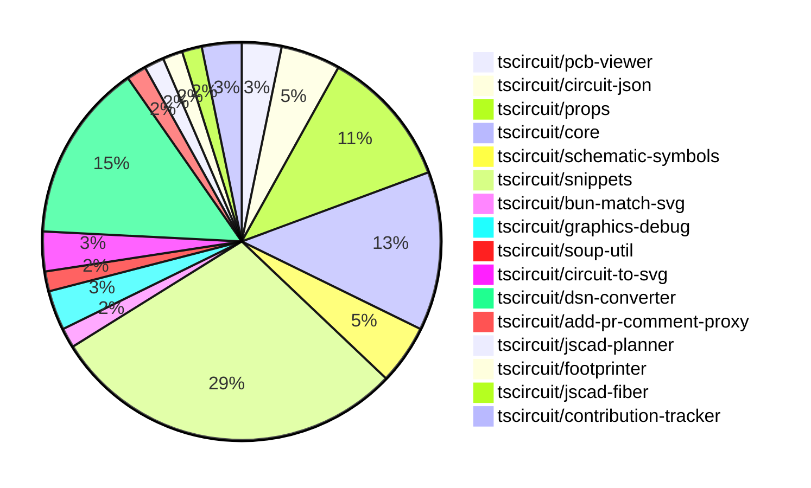

# contribution-tracker

Generates weekly contribution overviews for tscircuit contributors. Check out all
the [contribution overviews here](./contribution-overviews/)

* All PRs in the tscircuit org are scanned/summarized via Claude Haiku
* Claude classifies each Diff/PR as a Major, Minor or Tiny contribution
* All the PRs, summaries, and classifications are organized into charts and tables

The current week is shown below. There are 3 major sections:

* [Contributor Overview](#contributor-overview)
* [PRs by Repository](#prs-by-repository)
* [PRs by Contributor](#changes-by-contributor)

## Current Week

<!-- START_CURRENT_WEEK -->

# Contribution Overview 2024-11-20

## PRs by Repository

## Contributor Overview

| Contributor | 🐳 Major | 🐙 Minor | 🐌 Tiny | ⭐ |
|-------------|-------|-------|-------|-------|
| [imrishabh18](#imrishabh18) | 3 | 11 | 0 | ⭐⭐⭐ |
| [ShiboSoftwareDev](#ShiboSoftwareDev) | 2 | 11 | 0 | ⭐⭐ |
| [seveibar](#seveibar) | 2 | 9 | 0 | ⭐⭐ |
| [Abse2001](#Abse2001) | 0 | 10 | 0 | ⭐⭐ |
| [anas-sarkez](#anas-sarkez) | 1 | 5 | 0 | ⭐⭐ |
| [RohittCodes](#RohittCodes) | 0 | 5 | 0 | ⭐ |
| [hunxjunedo](#hunxjunedo) | 0 | 1 | 0 |  |
| [mrudulpatil18](#mrudulpatil18) | 0 | 1 | 0 |  |
| [kom-senapati](#kom-senapati) | 0 | 0 | 0 |  |

## Review Table

| Contributor | Reviews Received | Approvals | Rejections | Changes Requested | PRs Opened | PRs Closed | Issues Created |
|-------------|------------------|-----------|------------|-------------------|------------|------------|----------------|n| [Abse2001](https://github.com/Abse2001) | 11 | 9 | 5 | 1 | 10 | 10 | undefined |
| [ShiboSoftwareDev](https://github.com/ShiboSoftwareDev) | 18 | 12 | 13 | 2 | 20 | 18 | undefined |
| [seveibar](https://github.com/seveibar) | 0 | 0 | 0 | 0 | 12 | 11 | undefined |
| [imrishabh18](https://github.com/imrishabh18) | 9 | 4 | 3 | 2 | 16 | 14 | undefined |
| [anas-sarkez](https://github.com/anas-sarkez) | 24 | 8 | 6 | 3 | 9 | 6 | undefined |
| [kom-senapati](https://github.com/kom-senapati) | 2 | 1 | 0 | 1 | 1 | 1 | undefined |
| [melmathari](https://github.com/melmathari) | 8 | 1 | 3 | 2 | 5 | 4 | undefined |
| [hunxjunedo](https://github.com/hunxjunedo) | 2 | 1 | 1 | 0 | 1 | 1 | undefined |
| [RohittCodes](https://github.com/RohittCodes) | 45 | 6 | 2 | 7 | 8 | 5 | undefined |
| [mrudulpatil18](https://github.com/mrudulpatil18) | 4 | 4 | 0 | 0 | 3 | 1 | undefined |
| [vishwamartur](https://github.com/vishwamartur) | 1 | 0 | 1 | 1 | 1 | 1 | undefined |

## Changes by Repository

### [tscircuit/pcb-viewer](https://github.com/tscircuit/pcb-viewer)

| PR # | Impact | Contributor | Description |
|------|--------|-------------|-------------|
| [#83](https://github.com/tscircuit/pcb-viewer/pull/83) | 🐙 Minor | Abse2001 | Fixed a type error by adding a non-null assertion operator (`!`) to handle the case where `primitive._element?.pcb_trace_id` may be `undefined`. |
| [#82](https://github.com/tscircuit/pcb-viewer/pull/82) | 🐙 Minor | ShiboSoftwareDev | Adds a new "biome format" script to the package.json file, which allows formatting the code using the "biome format" tool. |

### [tscircuit/circuit-json](https://github.com/tscircuit/circuit-json)

| PR # | Impact | Contributor | Description |
|------|--------|-------------|-------------|
| [#84](https://github.com/tscircuit/circuit-json/pull/84) | 🐙 Minor | Abse2001 | Added the `.optional()` modifier to the `gender` field in the `source_simple_pin_header` type. |
| [#83](https://github.com/tscircuit/circuit-json/pull/83) | 🐙 Minor | Abse2001 | Implemented a new source component called "source_simple_pin_header" in the project. |
| [#82](https://github.com/tscircuit/circuit-json/pull/82) | 🐙 Minor | ShiboSoftwareDev | Adds a new "rotated_rect" shape to the PCB SMT pad type. |

### [tscircuit/props](https://github.com/tscircuit/props)

| PR # | Impact | Contributor | Description |
|------|--------|-------------|-------------|
| [#108](https://github.com/tscircuit/props/pull/108) | 🐙 Minor | Abse2001 | Set the default gender for the pin header component to "male". |
| [#104](https://github.com/tscircuit/props/pull/104) | 🐙 Minor | ShiboSoftwareDev | Add support for rotated rectangular SMT pads in the `smtpad` component. |
| [#105](https://github.com/tscircuit/props/pull/105) | 🐙 Minor | seveibar | Add "sequential-trace" and "subcircuit" autorouter presets |
| [#103](https://github.com/tscircuit/props/pull/103) | 🐙 Minor | seveibar | Adds an "autorouter" property to the SubcircuitGroupProps interface, which can be configured with various options for automated PCB routing. |
| [#106](https://github.com/tscircuit/props/pull/106) | 🐙 Minor | imrishabh18 | Adds export for the "crystal" component and fixes an issue with the npm publish. |
| [#102](https://github.com/tscircuit/props/pull/102) | 🐙 Minor | imrishabh18 | Exports the `PcbRouteCache` interface to be used in the project. |
| [#101](https://github.com/tscircuit/props/pull/101) | 🐙 Minor | imrishabh18 | Adds a new `pcbRouteCache` property to the `SubcircuitGroupProps` interface to store PCB trace information. |

### [tscircuit/core](https://github.com/tscircuit/core)

| PR # | Impact | Contributor | Description |
|------|--------|-------------|-------------|
| [#336](https://github.com/tscircuit/core/pull/336) | 🐳 Major | seveibar | Change the default format for async autorouting from SimpleRouteJson to CircuitJson, and introduce fixes and testing for the async autorouter. |
| [#351](https://github.com/tscircuit/core/pull/351) | 🐙 Minor | Abse2001 | Added `pin_count` and `gender` properties to the `<pinheader />` component. |
| [#342](https://github.com/tscircuit/core/pull/342) | 🐙 Minor | Abse2001 | Fixed manufacturer Part Number should go below refdes for four-sided pin layouts, handled three pin layouts and added tests for it. |
| [#339](https://github.com/tscircuit/core/pull/339) | 🐙 Minor | Abse2001 | Implemented the `getInheritedProperty` method on the `PrimitiveComponent` class to retrieve a property from the component or its parent components. |
| [#349](https://github.com/tscircuit/core/pull/349) | 🐙 Minor | imrishabh18 | Add a new component called "Crystal" to the list of normal components |
| [#350](https://github.com/tscircuit/core/pull/350) | 🐙 Minor | imrishabh18 | Add "circuit-to-svg" as a dev dependency to reduce bundle size |
| [#333](https://github.com/tscircuit/core/pull/333) | 🐙 Minor | imrishabh18 | Adds caching for the PCB trace route to improve performance on re-rendering. |
| [#338](https://github.com/tscircuit/core/pull/338) | 🐙 Minor | anas-sarkez | Added support for adding schematic boxes as obstacles in the Trace component. |

### [tscircuit/schematic-symbols](https://github.com/tscircuit/schematic-symbols)

| PR # | Impact | Contributor | Description |
|------|--------|-------------|-------------|
| [#215](https://github.com/tscircuit/schematic-symbols/pull/215) | 🐙 Minor | Abse2001 | Improved the normally open and closed push buttons symbols by updating the paths and adding circles. |
| [#212](https://github.com/tscircuit/schematic-symbols/pull/212) | 🐙 Minor | Abse2001 | Create a new function `approximateBezier` to improve the handling of 'C' cases and add a new symbol `capacitor_polarized`. |
| [#211](https://github.com/tscircuit/schematic-symbols/pull/211) | 🐙 Minor | hunxjunedo | Fixes the y-coordinates of various symbols in the "SPST_switch", "constant_current_diode", and "darlington_pair_transistor" JSON files. |

### [tscircuit/snippets](https://github.com/tscircuit/snippets)

| PR # | Impact | Contributor | Description |
|------|--------|-------------|-------------|
| [#252](https://github.com/tscircuit/snippets/pull/252) | 🐳 Major | seveibar | Reverts a previous change that caused a regression where every snippet has red underlines until modified. |
| [#280](https://github.com/tscircuit/snippets/pull/280) | 🐙 Minor | Abse2001 | Implement Capacitor BOM Search |
| [#282](https://github.com/tscircuit/snippets/pull/282) | 🐙 Minor | ShiboSoftwareDev | Implemented the generation of a bill of materials (BOM) for pin headers. |
| [#277](https://github.com/tscircuit/snippets/pull/277) | 🐙 Minor | ShiboSoftwareDev | Adds a new ErrorFallback component to display detailed error messages for 3D viewer errors |
| [#267](https://github.com/tscircuit/snippets/pull/267) | 🐙 Minor | ShiboSoftwareDev | Add a spinner icon to the "Run" button when the code is running |
| [#257](https://github.com/tscircuit/snippets/pull/257) | 🐙 Minor | ShiboSoftwareDev | Introduces QOL improvements to the footprint insertion feature, including a dropdown menu for the "Insert" button and enhanced error handling. |
| [#264](https://github.com/tscircuit/snippets/pull/264) | 🐙 Minor | seveibar | Improve the keying for the circuit JSON by including the length of the circuit JSON in the useMemo dependency array. |
| [#263](https://github.com/tscircuit/snippets/pull/263) | 🐙 Minor | seveibar | Update the @tscircuit/core dependency to version 0.0.193 to enable cloud autorouting. |
| [#242](https://github.com/tscircuit/snippets/pull/242) | 🐙 Minor | seveibar | Change the `/playground` route to redirect to the editor with the `blank-circuit-board` template |
| [#258](https://github.com/tscircuit/snippets/pull/258) | 🐙 Minor | seveibar | Skips parts engine test on CI |
| [#254](https://github.com/tscircuit/snippets/pull/254) | 🐙 Minor | seveibar | Adds a GitHub stars badge to the landing page |
| [#287](https://github.com/tscircuit/snippets/pull/287) | 🐙 Minor | anas-sarkez | Fixed responsiveness issue in EditorNav component |
| [#245](https://github.com/tscircuit/snippets/pull/245) | 🐙 Minor | RohittCodes | Removed the deletion of the "template" search parameter to make it persist during navigation. |
| [#202](https://github.com/tscircuit/snippets/pull/202) | 🐙 Minor | RohittCodes | Adds a new route to remove the star from a snippet. |
| [#270](https://github.com/tscircuit/snippets/pull/270) | 🐙 Minor | RohittCodes | Fix the exact cursor position in the code editor without affecting the code or its types. |
| [#268](https://github.com/tscircuit/snippets/pull/268) | 🐙 Minor | RohittCodes | Fix issue where `manualEditsFileContent` wasn't being initialized with `manual_edit_json` on page load, causing `hasUnsavedChanges` to always be true. |
| [#248](https://github.com/tscircuit/snippets/pull/248) | 🐙 Minor | RohittCodes | Adds support for manual edits to the `snippets.manual_edits_json` field in the API and UI. |
| [#236](https://github.com/tscircuit/snippets/pull/236) | 🐙 Minor | mrudulpatil18 | Update the iframe embed link to use the /preview endpoint |

### [tscircuit/bun-match-svg](https://github.com/tscircuit/bun-match-svg)

| PR # | Impact | Contributor | Description |
|------|--------|-------------|-------------|
| [#4](https://github.com/tscircuit/bun-match-svg/pull/4) | 🐳 Major | ShiboSoftwareDev | Implemented a CLI tool that initializes the project in other repositories. |

### [tscircuit/graphics-debug](https://github.com/tscircuit/graphics-debug)

| PR # | Impact | Contributor | Description |
|------|--------|-------------|-------------|
| [#10](https://github.com/tscircuit/graphics-debug/pull/10) | 🐳 Major | ShiboSoftwareDev | This pull request introduces a table that lists all graphics objects, including points, lines, rectangles, and circles, and highlights the corresponding object when hovering over the table entries. |
| [#9](https://github.com/tscircuit/graphics-debug/pull/9) | 🐙 Minor | ShiboSoftwareDev | Adds error handling to the graphics parsing functionality, displaying an error message when the input cannot be parsed or no graphics objects are found. |

### [tscircuit/soup-util](https://github.com/tscircuit/soup-util)

| PR # | Impact | Contributor | Description |
|------|--------|-------------|-------------|
| [#25](https://github.com/tscircuit/soup-util/pull/25) | 🐙 Minor | ShiboSoftwareDev | Updated the `circuit-json` dependency to version `0.0.106`. |

### [tscircuit/circuit-to-svg](https://github.com/tscircuit/circuit-to-svg)

| PR # | Impact | Contributor | Description |
|------|--------|-------------|-------------|
| [#137](https://github.com/tscircuit/circuit-to-svg/pull/137) | 🐙 Minor | ShiboSoftwareDev | Rotate the SMT pads counter-clockwise instead of clockwise. |
| [#136](https://github.com/tscircuit/circuit-to-svg/pull/136) | 🐙 Minor | ShiboSoftwareDev | Adds support for rendering rotated rectangular SMT pads in the PCB SVG visualization. |

### [tscircuit/dsn-converter](https://github.com/tscircuit/dsn-converter)

| PR # | Impact | Contributor | Description |
|------|--------|-------------|-------------|
| [#32](https://github.com/tscircuit/dsn-converter/pull/32) | 🐳 Major | imrishabh18 | Fix the conversion of `pcb_trace` and `source_net` to a network of `dsn`. |
| [#29](https://github.com/tscircuit/dsn-converter/pull/29) | 🐳 Major | imrishabh18 | Introduces a change to group the components and images together like in the KiCAD DSN file format. |
| [#28](https://github.com/tscircuit/dsn-converter/pull/28) | 🐳 Major | imrishabh18 | Fix plated hole DSN file format and net |
| [#26](https://github.com/tscircuit/dsn-converter/pull/26) | 🐙 Minor | seveibar | Adjust the scale factor for converting DSN session to Circuit JSON from 1/1000 to 1/10000 to ensure accurate representation of the circuit elements. |
| [#34](https://github.com/tscircuit/dsn-converter/pull/34) | 🐙 Minor | imrishabh18 | Adds a GitHub Actions workflow to automatically format code using the `@biomejs/biome` package. |
| [#33](https://github.com/tscircuit/dsn-converter/pull/33) | 🐙 Minor | imrishabh18 | Added a test to check the motor driver DSN format and fixed the parseDsnJson function for conversion. |
| [#31](https://github.com/tscircuit/dsn-converter/pull/31) | 🐙 Minor | imrishabh18 | Converts "simple_chip" circuit elements to DSN format components. |
| [#30](https://github.com/tscircuit/dsn-converter/pull/30) | 🐙 Minor | imrishabh18 | Grouped plated holes for components and added images only once, similar to KiCad format. |
| [#27](https://github.com/tscircuit/dsn-converter/pull/27) | 🐙 Minor | imrishabh18 | Fixes a scaling issue in the session by adjusting the conversion factor for traces |

### [tscircuit/add-pr-comment-proxy](https://github.com/tscircuit/add-pr-comment-proxy)

| PR # | Impact | Contributor | Description |
|------|--------|-------------|-------------|
| [#6](https://github.com/tscircuit/add-pr-comment-proxy/pull/6) | 🐙 Minor | seveibar | Ports the project to Vercel, a hosting platform for Next.js applications. |

### [tscircuit/jscad-planner](https://github.com/tscircuit/jscad-planner)

| PR # | Impact | Contributor | Description |
|------|--------|-------------|-------------|
| [#4](https://github.com/tscircuit/jscad-planner/pull/4) | 🐳 Major | anas-sarkez | Added support for `hull` and `hullChain` operations, including their types and tests. |

### [tscircuit/footprinter](https://github.com/tscircuit/footprinter)

| PR # | Impact | Contributor | Description |
|------|--------|-------------|-------------|
| [#83](https://github.com/tscircuit/footprinter/pull/83) | 🐙 Minor | anas-sarkez | Refactor all footprinter functions by updating their scheme, setting the default value of `num_pins` across various component types. |

### [tscircuit/jscad-fiber](https://github.com/tscircuit/jscad-fiber)

| PR # | Impact | Contributor | Description |
|------|--------|-------------|-------------|
| [#91](https://github.com/tscircuit/jscad-fiber/pull/91) | 🐙 Minor | anas-sarkez | Adds the `ExampleWrapper` component with code toggle functionality to the examples |

### [tscircuit/contribution-tracker](https://github.com/tscircuit/contribution-tracker)

| PR # | Impact | Contributor | Description |
|------|--------|-------------|-------------|
| [#8](https://github.com/tscircuit/contribution-tracker/pull/8) | 🐙 Minor | anas-sarkez | Adds a new column "Issues Created" to the Reviews Table to show the number of issues created by each contributor. |
| [#6](https://github.com/tscircuit/contribution-tracker/pull/6) | 🟣 | kom-senapati |  |

## Changes by Contributor

### [Abse2001](https://github.com/Abse2001)

| PR # | Impact | Description |
|------|--------|-------------|
| [#83](https://github.com/tscircuit/pcb-viewer/pull/83) | 🐙 Minor | Fixed a type error by adding a non-null assertion operator (`!`) to handle the case where `primitive._element?.pcb_trace_id` may be `undefined`. |
| [#84](https://github.com/tscircuit/circuit-json/pull/84) | 🐙 Minor | Added the `.optional()` modifier to the `gender` field in the `source_simple_pin_header` type. |
| [#83](https://github.com/tscircuit/circuit-json/pull/83) | 🐙 Minor | Implemented a new source component called "source_simple_pin_header" in the project. |
| [#108](https://github.com/tscircuit/props/pull/108) | 🐙 Minor | Set the default gender for the pin header component to "male". |
| [#351](https://github.com/tscircuit/core/pull/351) | 🐙 Minor | Added `pin_count` and `gender` properties to the `<pinheader />` component. |
| [#342](https://github.com/tscircuit/core/pull/342) | 🐙 Minor | Fixed manufacturer Part Number should go below refdes for four-sided pin layouts, handled three pin layouts and added tests for it. |
| [#339](https://github.com/tscircuit/core/pull/339) | 🐙 Minor | Implemented the `getInheritedProperty` method on the `PrimitiveComponent` class to retrieve a property from the component or its parent components. |
| [#215](https://github.com/tscircuit/schematic-symbols/pull/215) | 🐙 Minor | Improved the normally open and closed push buttons symbols by updating the paths and adding circles. |
| [#212](https://github.com/tscircuit/schematic-symbols/pull/212) | 🐙 Minor | Create a new function `approximateBezier` to improve the handling of 'C' cases and add a new symbol `capacitor_polarized`. |
| [#280](https://github.com/tscircuit/snippets/pull/280) | 🐙 Minor | Implement Capacitor BOM Search |

### [ShiboSoftwareDev](https://github.com/ShiboSoftwareDev)

| PR # | Impact | Description |
|------|--------|-------------|
| [#4](https://github.com/tscircuit/bun-match-svg/pull/4) | 🐳 Major | Implemented a CLI tool that initializes the project in other repositories. |
| [#10](https://github.com/tscircuit/graphics-debug/pull/10) | 🐳 Major | This pull request introduces a table that lists all graphics objects, including points, lines, rectangles, and circles, and highlights the corresponding object when hovering over the table entries. |
| [#82](https://github.com/tscircuit/pcb-viewer/pull/82) | 🐙 Minor | Adds a new "biome format" script to the package.json file, which allows formatting the code using the "biome format" tool. |
| [#82](https://github.com/tscircuit/circuit-json/pull/82) | 🐙 Minor | Adds a new "rotated_rect" shape to the PCB SMT pad type. |
| [#25](https://github.com/tscircuit/soup-util/pull/25) | 🐙 Minor | Updated the `circuit-json` dependency to version `0.0.106`. |
| [#104](https://github.com/tscircuit/props/pull/104) | 🐙 Minor | Add support for rotated rectangular SMT pads in the `smtpad` component. |
| [#137](https://github.com/tscircuit/circuit-to-svg/pull/137) | 🐙 Minor | Rotate the SMT pads counter-clockwise instead of clockwise. |
| [#136](https://github.com/tscircuit/circuit-to-svg/pull/136) | 🐙 Minor | Adds support for rendering rotated rectangular SMT pads in the PCB SVG visualization. |
| [#282](https://github.com/tscircuit/snippets/pull/282) | 🐙 Minor | Implemented the generation of a bill of materials (BOM) for pin headers. |
| [#277](https://github.com/tscircuit/snippets/pull/277) | 🐙 Minor | Adds a new ErrorFallback component to display detailed error messages for 3D viewer errors |
| [#267](https://github.com/tscircuit/snippets/pull/267) | 🐙 Minor | Add a spinner icon to the "Run" button when the code is running |
| [#257](https://github.com/tscircuit/snippets/pull/257) | 🐙 Minor | Introduces QOL improvements to the footprint insertion feature, including a dropdown menu for the "Insert" button and enhanced error handling. |
| [#9](https://github.com/tscircuit/graphics-debug/pull/9) | 🐙 Minor | Adds error handling to the graphics parsing functionality, displaying an error message when the input cannot be parsed or no graphics objects are found. |

### [seveibar](https://github.com/seveibar)

| PR # | Impact | Description |
|------|--------|-------------|
| [#336](https://github.com/tscircuit/core/pull/336) | 🐳 Major | Change the default format for async autorouting from SimpleRouteJson to CircuitJson, and introduce fixes and testing for the async autorouter. |
| [#252](https://github.com/tscircuit/snippets/pull/252) | 🐳 Major | Reverts a previous change that caused a regression where every snippet has red underlines until modified. |
| [#105](https://github.com/tscircuit/props/pull/105) | 🐙 Minor | Add "sequential-trace" and "subcircuit" autorouter presets |
| [#103](https://github.com/tscircuit/props/pull/103) | 🐙 Minor | Adds an "autorouter" property to the SubcircuitGroupProps interface, which can be configured with various options for automated PCB routing. |
| [#26](https://github.com/tscircuit/dsn-converter/pull/26) | 🐙 Minor | Adjust the scale factor for converting DSN session to Circuit JSON from 1/1000 to 1/10000 to ensure accurate representation of the circuit elements. |
| [#264](https://github.com/tscircuit/snippets/pull/264) | 🐙 Minor | Improve the keying for the circuit JSON by including the length of the circuit JSON in the useMemo dependency array. |
| [#263](https://github.com/tscircuit/snippets/pull/263) | 🐙 Minor | Update the @tscircuit/core dependency to version 0.0.193 to enable cloud autorouting. |
| [#242](https://github.com/tscircuit/snippets/pull/242) | 🐙 Minor | Change the `/playground` route to redirect to the editor with the `blank-circuit-board` template |
| [#258](https://github.com/tscircuit/snippets/pull/258) | 🐙 Minor | Skips parts engine test on CI |
| [#254](https://github.com/tscircuit/snippets/pull/254) | 🐙 Minor | Adds a GitHub stars badge to the landing page |
| [#6](https://github.com/tscircuit/add-pr-comment-proxy/pull/6) | 🐙 Minor | Ports the project to Vercel, a hosting platform for Next.js applications. |

### [imrishabh18](https://github.com/imrishabh18)

| PR # | Impact | Description |
|------|--------|-------------|
| [#32](https://github.com/tscircuit/dsn-converter/pull/32) | 🐳 Major | Fix the conversion of `pcb_trace` and `source_net` to a network of `dsn`. |
| [#29](https://github.com/tscircuit/dsn-converter/pull/29) | 🐳 Major | Introduces a change to group the components and images together like in the KiCAD DSN file format. |
| [#28](https://github.com/tscircuit/dsn-converter/pull/28) | 🐳 Major | Fix plated hole DSN file format and net |
| [#106](https://github.com/tscircuit/props/pull/106) | 🐙 Minor | Adds export for the "crystal" component and fixes an issue with the npm publish. |
| [#102](https://github.com/tscircuit/props/pull/102) | 🐙 Minor | Exports the `PcbRouteCache` interface to be used in the project. |
| [#101](https://github.com/tscircuit/props/pull/101) | 🐙 Minor | Adds a new `pcbRouteCache` property to the `SubcircuitGroupProps` interface to store PCB trace information. |
| [#349](https://github.com/tscircuit/core/pull/349) | 🐙 Minor | Add a new component called "Crystal" to the list of normal components |
| [#350](https://github.com/tscircuit/core/pull/350) | 🐙 Minor | Add "circuit-to-svg" as a dev dependency to reduce bundle size |
| [#333](https://github.com/tscircuit/core/pull/333) | 🐙 Minor | Adds caching for the PCB trace route to improve performance on re-rendering. |
| [#34](https://github.com/tscircuit/dsn-converter/pull/34) | 🐙 Minor | Adds a GitHub Actions workflow to automatically format code using the `@biomejs/biome` package. |
| [#33](https://github.com/tscircuit/dsn-converter/pull/33) | 🐙 Minor | Added a test to check the motor driver DSN format and fixed the parseDsnJson function for conversion. |
| [#31](https://github.com/tscircuit/dsn-converter/pull/31) | 🐙 Minor | Converts "simple_chip" circuit elements to DSN format components. |
| [#30](https://github.com/tscircuit/dsn-converter/pull/30) | 🐙 Minor | Grouped plated holes for components and added images only once, similar to KiCad format. |
| [#27](https://github.com/tscircuit/dsn-converter/pull/27) | 🐙 Minor | Fixes a scaling issue in the session by adjusting the conversion factor for traces |

### [anas-sarkez](https://github.com/anas-sarkez)

| PR # | Impact | Description |
|------|--------|-------------|
| [#4](https://github.com/tscircuit/jscad-planner/pull/4) | 🐳 Major | Added support for `hull` and `hullChain` operations, including their types and tests. |
| [#83](https://github.com/tscircuit/footprinter/pull/83) | 🐙 Minor | Refactor all footprinter functions by updating their scheme, setting the default value of `num_pins` across various component types. |
| [#338](https://github.com/tscircuit/core/pull/338) | 🐙 Minor | Added support for adding schematic boxes as obstacles in the Trace component. |
| [#91](https://github.com/tscircuit/jscad-fiber/pull/91) | 🐙 Minor | Adds the `ExampleWrapper` component with code toggle functionality to the examples |
| [#8](https://github.com/tscircuit/contribution-tracker/pull/8) | 🐙 Minor | Adds a new column "Issues Created" to the Reviews Table to show the number of issues created by each contributor. |
| [#287](https://github.com/tscircuit/snippets/pull/287) | 🐙 Minor | Fixed responsiveness issue in EditorNav component |

### [kom-senapati](https://github.com/kom-senapati)

| PR # | Impact | Description |
|------|--------|-------------|
| [#6](https://github.com/tscircuit/contribution-tracker/pull/6) | 🟣 |  |

### [hunxjunedo](https://github.com/hunxjunedo)

| PR # | Impact | Description |
|------|--------|-------------|
| [#211](https://github.com/tscircuit/schematic-symbols/pull/211) | 🐙 Minor | Fixes the y-coordinates of various symbols in the "SPST_switch", "constant_current_diode", and "darlington_pair_transistor" JSON files. |

### [RohittCodes](https://github.com/RohittCodes)

| PR # | Impact | Description |
|------|--------|-------------|
| [#245](https://github.com/tscircuit/snippets/pull/245) | 🐙 Minor | Removed the deletion of the "template" search parameter to make it persist during navigation. |
| [#202](https://github.com/tscircuit/snippets/pull/202) | 🐙 Minor | Adds a new route to remove the star from a snippet. |
| [#270](https://github.com/tscircuit/snippets/pull/270) | 🐙 Minor | Fix the exact cursor position in the code editor without affecting the code or its types. |
| [#268](https://github.com/tscircuit/snippets/pull/268) | 🐙 Minor | Fix issue where `manualEditsFileContent` wasn't being initialized with `manual_edit_json` on page load, causing `hasUnsavedChanges` to always be true. |
| [#248](https://github.com/tscircuit/snippets/pull/248) | 🐙 Minor | Adds support for manual edits to the `snippets.manual_edits_json` field in the API and UI. |

### [mrudulpatil18](https://github.com/mrudulpatil18)

| PR # | Impact | Description |
|------|--------|-------------|
| [#236](https://github.com/tscircuit/snippets/pull/236) | 🐙 Minor | Update the iframe embed link to use the /preview endpoint |

<!-- END_CURRENT_WEEK -->
