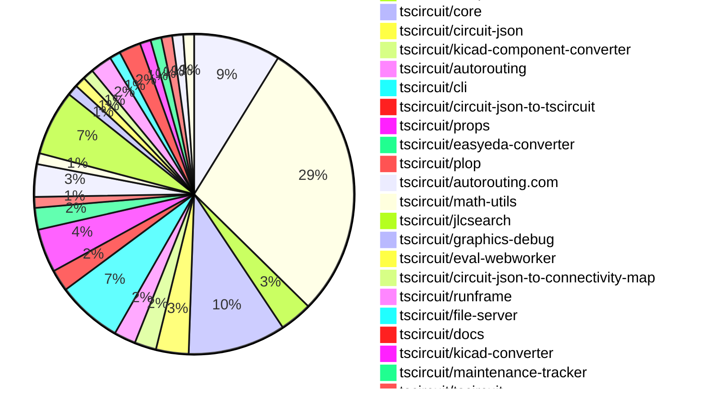

# contribution-tracker

Generates weekly contribution overviews for tscircuit contributors. Check out all
the [contribution overviews here](./contribution-overviews/)

* All PRs in the tscircuit org are scanned/summarized via Claude Haiku
* Claude classifies each Diff/PR as a Major, Minor or Tiny contribution
* All the PRs, summaries, and classifications are organized into charts and tables

The current week is shown below. There are 3 major sections:

* [Contributor Overview](#contributor-overview)
* [PRs by Repository](#prs-by-repository)
* [PRs by Contributor](#changes-by-contributor)

## Current Week

<!-- START_CURRENT_WEEK -->

# Contribution Overview 2025-01-01

## PRs by Repository

## Contributor Overview

| Contributor | 🐳 Major | 🐙 Minor | 🐌 Tiny | ⭐ | Issues Created |
|-------------|---------|---------|---------|-----|----------------|
| [seveibar](#seveibar) | 9 | 34 | 3 | 👑👑👑 | 66 |
| [Anshgrover23](#Anshgrover23) | 5 | 14 | 2 | 👑 | 13 |
| [ShiboSoftwareDev](#ShiboSoftwareDev) | 2 | 3 | 1 | ⭐⭐⭐ | 14 |
| [Abse2001](#Abse2001) | 2 | 5 | 1 | ⭐⭐ | 2 |
| [techmannih](#techmannih) | 0 | 4 | 1 | ⭐ | 2 |
| [DrSensor](#DrSensor) | 1 | 0 | 0 | ⭐ | 0 |
| [devin-ai-integration[bot]](#devin-ai-integration[bot]) | 0 | 1 | 0 |  | 0 |
| [krushnarout](#krushnarout) | 0 | 1 | 0 |  | 0 |
| [oldbear26](#oldbear26) | 0 | 0 | 1 |  | 0 |

## Review Table

[reviews-received-hover]: ## "Number of reviews received for PRs for this contributor"
[approvals-received-hover]: ## "Number of approvals received for PRs this contributor authored"
[rejections-received-hover]: ## "Number of rejections received for PRs this contributor authored"
[prs-opened-hover]: ## "Number of PRs opened by this contributor"
[issues-created-hover]: ## "Number of issues created by this contributor"
[bountied-issues-hover]: ## "Number of issues this contributor created with a bounty"
[bountied-issue-$-hover]: ## "Total bounty amount placed on issues authored by this contributor"

| Contributor | Reviews Received | Approvals Received | Rejections Received | Approvals | Rejections | PRs Opened | PRs Merged | Issues Created | Bountied Issues | Bountied Issue $ |
|---|---|---|---|---|---|---|---|---|---|---|
| [Abse2001](#Abse2001) | 34 | 7 | 0 | 4 | 5 | 10 | 8 | 2 | 0 | 0 |
| [seveibar](#seveibar) | 1 | 0 | 0 | 42 | 15 | 51 | 47 | 66 | 37 | 518 |
| [DrSensor](#DrSensor) | 1 | 1 | 0 | 0 | 0 | 1 | 1 | 0 | 0 | 0 |
| [Anshgrover23](#Anshgrover23) | 60 | 20 | 16 | 0 | 6 | 27 | 21 | 13 | 1 | 4 |
| [techmannih](#techmannih) | 17 | 8 | 6 | 0 | 0 | 10 | 5 | 2 | 0 | 0 |
| [ShiboSoftwareDev](#ShiboSoftwareDev) | 9 | 7 | 1 | 0 | 2 | 9 | 6 | 14 | 8 | 117 |
| [devin-ai-integration[bot]](#devin-ai-integration[bot]) | 3 | 1 | 2 | 0 | 0 | 3 | 1 | 0 | 0 | 0 |
| [chaadiic](#chaadiic) | 1 | 0 | 1 | 0 | 0 | 1 | 0 | 0 | 0 | 0 |
| [oldbear26](#oldbear26) | 4 | 1 | 1 | 0 | 0 | 2 | 1 | 0 | 0 | 0 |
| [krushnarout](#krushnarout) | 2 | 1 | 1 | 0 | 0 | 2 | 1 | 0 | 0 | 0 |

## Changes by Repository

### [tscircuit/pcb-viewer](https://github.com/tscircuit/pcb-viewer)

| PR # | Impact | Contributor | Description |
|------|--------|-------------|-------------|
| [#110](https://github.com/tscircuit/pcb-viewer/pull/110) | 🐳 Major | Abse2001 | Introduces a new "View" dropdown in the toolbar overlay to control the display of traces, with an option to show all trace lengths. |
| [#107](https://github.com/tscircuit/pcb-viewer/pull/107) | 🐳 Major | seveibar | Switch the project to use ESM (ECMAScript Modules) instead of CommonJS, dropping support for CommonJS. |
| [#114](https://github.com/tscircuit/pcb-viewer/pull/114) | 🐙 Minor | Abse2001 | Adds performance test for contribution board |
| [#101](https://github.com/tscircuit/pcb-viewer/pull/101) | 🐙 Minor | Abse2001 | Added a trace length tooltip and handled when the length goes over the maximum length, also added support for hovering over multiple traces. |
| [#122](https://github.com/tscircuit/pcb-viewer/pull/122) | 🐙 Minor | seveibar | Update the `use-mouse-matrix-transform` dependency to version 1.3.0 for better ESM compatibility. |
| [#121](https://github.com/tscircuit/pcb-viewer/pull/121) | 🐙 Minor | seveibar | Changed the build script to target the browser platform instead of the default. |
| [#115](https://github.com/tscircuit/pcb-viewer/pull/115) | 🐙 Minor | seveibar | Adds a large LED matrix circuit JSON file, fixes a memoization issue in the PCBViewer component, and updates the biome.json and package.json files. |
| [#105](https://github.com/tscircuit/pcb-viewer/pull/105) | 🐙 Minor | seveibar | Add Renovate, update circuit json to connectivity map dependency |

### [tscircuit/snippets](https://github.com/tscircuit/snippets)

| PR # | Impact | Contributor | Description |
|------|--------|-------------|-------------|
| [#484](https://github.com/tscircuit/snippets/pull/484) | 🐳 Major | Abse2001 | Introduces a new feature for AI-driven auto-completion in the CodeEditor component. |
| [#498](https://github.com/tscircuit/snippets/pull/498) | 🐳 Major | ShiboSoftwareDev | Enhances the footprint dialog by implementing various improvements, including not displaying passive components as options, adding scrolling on mobile, handling readonly parameters, and special handling for BGA components. |
| [#515](https://github.com/tscircuit/snippets/pull/515) | 🐙 Minor | seveibar | Add `@tscircuit/math-utils` as a pre-supplied import in the `use-run-tsx` hook. |
| [#506](https://github.com/tscircuit/snippets/pull/506) | 🐙 Minor | seveibar | Update the pcb-viewer package and fix the alternate registry handling to handle CORS issues. |
| [#505](https://github.com/tscircuit/snippets/pull/505) | 🐙 Minor | seveibar | Adds support for retrying a failed snippet update with an alternate registry server. |
| [#503](https://github.com/tscircuit/snippets/pull/503) | 🐙 Minor | seveibar | Adds an alternate URL for updating large payloads to avoid the 413 (Request Entity Too Large) error. |
| [#502](https://github.com/tscircuit/snippets/pull/502) | 🐙 Minor | seveibar | Adds support for downloading GLTF files from the circuit preview. |
| [#493](https://github.com/tscircuit/snippets/pull/493) | 🐙 Minor | seveibar | Improve the search component to display a better UI and handle different types of URLs when opening the search results. |
| [#487](https://github.com/tscircuit/snippets/pull/487) | 🐙 Minor | seveibar | Reverts a fix for card misalignment that broke a bunch of pages. |
| [#488](https://github.com/tscircuit/snippets/pull/488) | 🐙 Minor | seveibar | Fix the `snippetType` property to handle cases where `templateFromUrl` is `null`. |
| [#468](https://github.com/tscircuit/snippets/pull/468) | 🐙 Minor | seveibar | Improve the layout and display of the landing page's bullet points on mobile devices. |
| [#463](https://github.com/tscircuit/snippets/pull/463) | 🐙 Minor | seveibar | Adds analytics tracking using Vercel Analytics and PostHog, and adds a cookie consent banner. |
| [#514](https://github.com/tscircuit/snippets/pull/514) | 🐙 Minor | Anshgrover23 | Adds a new file, `kicad_pro`, to the KiCad project. |
| [#492](https://github.com/tscircuit/snippets/pull/492) | 🐙 Minor | Anshgrover23 | Fixes the selector used to click the ellipsis menu in the update-description.spec.ts file. |
| [#490](https://github.com/tscircuit/snippets/pull/490) | 🐙 Minor | Anshgrover23 | Fix tests and skip manual edits for now |
| [#482](https://github.com/tscircuit/snippets/pull/482) | 🐙 Minor | Anshgrover23 | Adds a new option to download the KiCad PCB files in a zip archive. |
| [#460](https://github.com/tscircuit/snippets/pull/460) | 🐙 Minor | Anshgrover23 | Fix the search component to display search results in a scrollable container |
| [#458](https://github.com/tscircuit/snippets/pull/458) | 🐙 Minor | Anshgrover23 | Fixes the Playwright tests, including waiting for elements, clicking on specific labels, and removing unnecessary code. |
| [#489](https://github.com/tscircuit/snippets/pull/489) | 🐙 Minor | techmannih | Fixes the alignment of the landing page cards. |
| [#478](https://github.com/tscircuit/snippets/pull/478) | 🐙 Minor | techmannih | Fixes a card misalignment issue by adding a `hover:shadow-lg transition-shadow duration-200 h-full` class to the card component. |
| [#475](https://github.com/tscircuit/snippets/pull/475) | 🐙 Minor | techmannih | Adds a new button to the download menu to download the assembly SVG of the circuit. |
| [#465](https://github.com/tscircuit/snippets/pull/465) | 🐙 Minor | krushnarout | Adds a new "HeaderDropdown" component to the landing page header for logged-in users. |
| [#512](https://github.com/tscircuit/snippets/pull/512) | 🐌 Tiny | seveibar | Fixes the order of the AUTOLOAD_SNIPPETS environment variable in the "dev" script. |
| [#483](https://github.com/tscircuit/snippets/pull/483) | 🐌 Tiny | seveibar | Update the Discord link in the header component |
| [#472](https://github.com/tscircuit/snippets/pull/472) | 🐌 Tiny | Anshgrover23 | Add Algora bounty badge to README |
| [#500](https://github.com/tscircuit/snippets/pull/500) | 🐌 Tiny | oldbear26 | Add type declaration for manual-edits.json in ATA |

### [tscircuit/footprinter](https://github.com/tscircuit/footprinter)

| PR # | Impact | Contributor | Description |
|------|--------|-------------|-------------|
| [#108](https://github.com/tscircuit/footprinter/pull/108) | 🐙 Minor | Abse2001 | Added a default value of `false` for the `legsoutside` parameter in the `quad` function. |
| [#105](https://github.com/tscircuit/footprinter/pull/105) | 🐙 Minor | ShiboSoftwareDev | Changes the parameter types of `pushbutton` function from `number` to `length` in the TypeScript code. |
| [#104](https://github.com/tscircuit/footprinter/pull/104) | 🐌 Tiny | ShiboSoftwareDev | Removed the `num_pins` property from the `axial` component, as it always had a value of 2. |

### [tscircuit/core](https://github.com/tscircuit/core)

| PR # | Impact | Contributor | Description |
|------|--------|-------------|-------------|
| [#480](https://github.com/tscircuit/core/pull/480) | 🐳 Major | seveibar | Allows duplicate port hints for overlapping PCB primitive elements, which fixes some KiCAD conversion issues. |
| [#481](https://github.com/tscircuit/core/pull/481) | 🐳 Major | ShiboSoftwareDev | Adds a new MOSFET component to the circuit library |
| [#487](https://github.com/tscircuit/core/pull/487) | 🐙 Minor | Abse2001 | Implemented `<board />` `outlineOffsetX` and `outlineOffsetY` properties to allow offsetting the PCB outline. |
| [#479](https://github.com/tscircuit/core/pull/479) | 🐙 Minor | Abse2001 | Added a new function `getTraceDisplayName` to generate a display name for a trace based on the connected ports and nets. |
| [#492](https://github.com/tscircuit/core/pull/492) | 🐙 Minor | seveibar | Refactors the code that generates schematic obstacles for traces, making it more modular and easier to maintain. |
| [#489](https://github.com/tscircuit/core/pull/489) | 🐙 Minor | seveibar | Optimizes the performance of the PcbRouteNetIslands function by avoiding unnecessary computations when routing is disabled. |
| [#488](https://github.com/tscircuit/core/pull/488) | 🐙 Minor | seveibar | Rename `asyncEffectComplete` to `asyncEffect:end`, add `asyncEffect:start`, and refactor the emit function to avoid ambiguity. |
| [#475](https://github.com/tscircuit/core/pull/475) | 🐙 Minor | seveibar | The pull request introduces support for non-numeric pin labels in the `schPinStyle` property, and also includes some code formatting changes. |
| [#478](https://github.com/tscircuit/core/pull/478) | 🐙 Minor | Anshgrover23 | Added a check for `noSchematicRepresentation` property to skip the schematic rendering for the Chip component. |

### [tscircuit/circuit-json](https://github.com/tscircuit/circuit-json)

| PR # | Impact | Contributor | Description |
|------|--------|-------------|-------------|
| [#119](https://github.com/tscircuit/circuit-json/pull/119) | 🐙 Minor | Anshgrover23 | Ensures accurate rounding for capacitance values by rounding to 12 significant digits. |
| [#116](https://github.com/tscircuit/circuit-json/pull/116) | 🐙 Minor | ShiboSoftwareDev | Added a new `source_simple_mosfet` component to the circuit element library. |
| [#115](https://github.com/tscircuit/circuit-json/pull/115) | 🐌 Tiny | Abse2001 | Added an optional `display_name` property to the `source_trace` type. |

### [tscircuit/kicad-component-converter](https://github.com/tscircuit/kicad-component-converter)

| PR # | Impact | Contributor | Description |
|------|--------|-------------|-------------|
| [#110](https://github.com/tscircuit/kicad-component-converter/pull/110) | 🐳 Major | seveibar | Convert Kicad Mod files into Circuit JSON on the website |
| [#112](https://github.com/tscircuit/kicad-component-converter/pull/112) | 🐙 Minor | seveibar | Adds a new feature to allow opening the generated TSCircuit code in a code snippet viewer. |

### [tscircuit/autorouting](https://github.com/tscircuit/autorouting)

| PR # | Impact | Contributor | Description |
|------|--------|-------------|-------------|
| [#104](https://github.com/tscircuit/autorouting/pull/104) | 🐳 Major | seveibar | Fixes a bug with path collisions for simplifying paths |
| [#103](https://github.com/tscircuit/autorouting/pull/103) | 🐳 Major | seveibar | Adds support for Shorten Path with Shortcuts |

### [tscircuit/cli](https://github.com/tscircuit/cli)

| PR # | Impact | Contributor | Description |
|------|--------|-------------|-------------|
| [#12](https://github.com/tscircuit/cli/pull/12) | 🐳 Major | seveibar | Establish CLI patterns, implement authentication to prepare for snippets sync |
| [#10](https://github.com/tscircuit/cli/pull/10) | 🐳 Major | seveibar | Adds a schematic drag and drop feature, dynamic loading of runframe, and events watcher on the CLI. |
| [#15](https://github.com/tscircuit/cli/pull/15) | 🐳 Major | seveibar | Refactor for DevServer class state management, add basic test for DevServer initialization, and add File Server API Types. |
| [#16](https://github.com/tscircuit/cli/pull/16) | 🐙 Minor | seveibar | Adds a new command to the CLI for exporting circuit JSON files. |
| [#13](https://github.com/tscircuit/cli/pull/13) | 🐙 Minor | seveibar | Adds a new "clone" command to the CLI, allowing users to quickly download code snippets from the tscircuit registry. |
| [#11](https://github.com/tscircuit/cli/pull/11) | 🐙 Minor | seveibar | Fix Module Import issue in cli build |

### [tscircuit/circuit-json-to-tscircuit](https://github.com/tscircuit/circuit-json-to-tscircuit)

| PR # | Impact | Contributor | Description |
|------|--------|-------------|-------------|
| [#2](https://github.com/tscircuit/circuit-json-to-tscircuit/pull/2) | 🐳 Major | seveibar | Add initial GitHub Actions workflows for format checking, type checking, testing, and publishing to npm. |
| [#3](https://github.com/tscircuit/circuit-json-to-tscircuit/pull/3) | 🐙 Minor | seveibar | Adds more README information and removes empty lines from the output. |

### [tscircuit/props](https://github.com/tscircuit/props)

| PR # | Impact | Contributor | Description |
|------|--------|-------------|-------------|
| [#144](https://github.com/tscircuit/props/pull/144) | 🐙 Minor | seveibar | Rename `pcbOffsetX` and `pcbOffsetY` to `outlineOffsetX` and `outlineOffsetY` respectively in the `board` component. |
| [#141](https://github.com/tscircuit/props/pull/141) | 🐙 Minor | Anshgrover23 | Add a new `noSchematicRepresentation` property to the `chipProps` type and update the tests to handle this new property. |
| [#138](https://github.com/tscircuit/props/pull/138) | 🐙 Minor | ShiboSoftwareDev | Updates the `channelType` and `mosfetMode` properties in the `MosfetProps` interface and the corresponding `mosfetProps` schema. |
| [#143](https://github.com/tscircuit/props/pull/143) | 🐙 Minor | devin-ai-integration[bot] | Add `pcbOffsetX` and `pcbOffsetY` properties to the `board` component to allow offsetting the board's PCB position. |

### [tscircuit/easyeda-converter](https://github.com/tscircuit/easyeda-converter)

| PR # | Impact | Contributor | Description |
|------|--------|-------------|-------------|
| [#146](https://github.com/tscircuit/easyeda-converter/pull/146) | 🐙 Minor | seveibar | Add support for parsing silkscreen text in the EasyEDA to TSCircuit Soup JSON conversion process. |
| [#141](https://github.com/tscircuit/easyeda-converter/pull/141) | 🐙 Minor | seveibar | Adds instructions to the README for adding a new part test |

### [tscircuit/plop](https://github.com/tscircuit/plop)

| PR # | Impact | Contributor | Description |
|------|--------|-------------|-------------|
| [#7](https://github.com/tscircuit/plop/pull/7) | 🐙 Minor | seveibar | Allow bot token for bypassing branch protection on version commit |

### [tscircuit/autorouting.com](https://github.com/tscircuit/autorouting.com)

| PR # | Impact | Contributor | Description |
|------|--------|-------------|-------------|
| [#14](https://github.com/tscircuit/autorouting.com/pull/14) | 🐙 Minor | seveibar | Reverts the addition of a main logo animation |
| [#16](https://github.com/tscircuit/autorouting.com/pull/16) | 🐙 Minor | Anshgrover23 | Adds an autorouting animation to the main page of the application. |
| [#13](https://github.com/tscircuit/autorouting.com/pull/13) | 🐙 Minor | Anshgrover23 | Add main logo animation to the homepage |

### [tscircuit/math-utils](https://github.com/tscircuit/math-utils)

| PR # | Impact | Contributor | Description |
|------|--------|-------------|-------------|
| [#4](https://github.com/tscircuit/math-utils/pull/4) | 🐙 Minor | seveibar | Adds `row` and `col` properties to the `GridCellPositions` type. |

### [tscircuit/jlcsearch](https://github.com/tscircuit/jlcsearch)

| PR # | Impact | Contributor | Description |
|------|--------|-------------|-------------|
| [#25](https://github.com/tscircuit/jlcsearch/pull/25) | 🐳 Major | Anshgrover23 | Adds a new derived table `lcd_display` that extracts and parses LCD display information from the `components` table. |
| [#23](https://github.com/tscircuit/jlcsearch/pull/23) | 🐳 Major | Anshgrover23 | Adds a new section for "LED Dot Matrix Displays Modules" in the routes index page and creates a new route for listing LED dot matrix display components. |
| [#22](https://github.com/tscircuit/jlcsearch/pull/22) | 🐳 Major | Anshgrover23 | Adds the OLED Display modules page to the application, including a table to display OLED Display components with various filters and a JSON API endpoint. |
| [#24](https://github.com/tscircuit/jlcsearch/pull/24) | 🐳 Major | Anshgrover23 | Adds a new derived table for LED segment display modules, including columns for package, positions, type, size, and color. |
| [#14](https://github.com/tscircuit/jlcsearch/pull/14) | 🐳 Major | Anshgrover23 |  |
| [#16](https://github.com/tscircuit/jlcsearch/pull/16) | 🐙 Minor | seveibar | Add posthog analytics script |

### [tscircuit/graphics-debug](https://github.com/tscircuit/graphics-debug)

| PR # | Impact | Contributor | Description |
|------|--------|-------------|-------------|
| [#12](https://github.com/tscircuit/graphics-debug/pull/12) | 🐙 Minor | seveibar | Fixes a bug in the cartesian coordinate handling for rectangles in the `getSvgFromGraphicsObject` function. |

### [tscircuit/eval-webworker](https://github.com/tscircuit/eval-webworker)

| PR # | Impact | Contributor | Description |
|------|--------|-------------|-------------|
| [#62](https://github.com/tscircuit/eval-webworker/pull/62) | 🐙 Minor | seveibar | Adds event listener rebinding to the `on` function in the `types.ts` file and updates the `webworker/index.ts` file to handle event listener registration and binding. |

### [tscircuit/circuit-json-to-connectivity-map](https://github.com/tscircuit/circuit-json-to-connectivity-map)

| PR # | Impact | Contributor | Description |
|------|--------|-------------|-------------|
| [#7](https://github.com/tscircuit/circuit-json-to-connectivity-map/pull/7) | 🐌 Tiny | seveibar | Update the version of the `@tscircuit/math-utils` dependency from `0.0.4` to `0.0.9`. |

### [tscircuit/runframe](https://github.com/tscircuit/runframe)

| PR # | Impact | Contributor | Description |
|------|--------|-------------|-------------|
| [#111](https://github.com/tscircuit/runframe/pull/111) | 🟣 | seveibar |  |
| [#108](https://github.com/tscircuit/runframe/pull/108) | 🐙 Minor | seveibar | Adds a new "Render Log" tab to the CircuitJsonPreview component, which displays the render log information with phase timings. |

### [tscircuit/file-server](https://github.com/tscircuit/file-server)

| PR # | Impact | Contributor | Description |
|------|--------|-------------|-------------|
| [#4](https://github.com/tscircuit/file-server/pull/4) | 🐙 Minor | seveibar | Refactor Event name, start lib exports, add initiator support |

### [tscircuit/docs](https://github.com/tscircuit/docs)

| PR # | Impact | Contributor | Description |
|------|--------|-------------|-------------|
| [#53](https://github.com/tscircuit/docs/pull/53) | 🐙 Minor | Anshgrover23 | Adds documentation for new components (transistor, inductor, LED, and power source) and updates the trace documentation. |
| [#46](https://github.com/tscircuit/docs/pull/46) | 🐌 Tiny | techmannih | Typo and terminology clarification in the description of the `<trace />` component |

### [tscircuit/kicad-converter](https://github.com/tscircuit/kicad-converter)

| PR # | Impact | Contributor | Description |
|------|--------|-------------|-------------|
| [#12](https://github.com/tscircuit/kicad-converter/pull/12) | 🐙 Minor | Anshgrover23 | Add `kicad-pro` to the library index |

### [tscircuit/maintenance-tracker](https://github.com/tscircuit/maintenance-tracker)

| PR # | Impact | Contributor | Description |
|------|--------|-------------|-------------|
| [#4](https://github.com/tscircuit/maintenance-tracker/pull/4) | 🐙 Minor | Anshgrover23 | Treat skipped checks as successful checks. |

### [tscircuit/tscircuit](https://github.com/tscircuit/tscircuit)

| PR # | Impact | Contributor | Description |
|------|--------|-------------|-------------|
| [#493](https://github.com/tscircuit/tscircuit/pull/493) | 🐌 Tiny | Anshgrover23 | Added Algora badges to the README.md |

### [tscircuit/schematic-symbols](https://github.com/tscircuit/schematic-symbols)

| PR # | Impact | Contributor | Description |
|------|--------|-------------|-------------|
| [#231](https://github.com/tscircuit/schematic-symbols/pull/231) | 🐙 Minor | techmannih | Adds a new opamp symbol. |

### [tscircuit/3d-viewer](https://github.com/tscircuit/3d-viewer)

| PR # | Impact | Contributor | Description |
|------|--------|-------------|-------------|
| [#96](https://github.com/tscircuit/3d-viewer/pull/96) | 🐳 Major | DrSensor | Add hooks for exporting to gltf |

## Changes by Contributor

### [Abse2001](https://github.com/Abse2001)

| PR # | Impact | Description |
|------|--------|-------------|
| [#110](https://github.com/tscircuit/pcb-viewer/pull/110) | 🐳 Major | Introduces a new "View" dropdown in the toolbar overlay to control the display of traces, with an option to show all trace lengths. |
| [#484](https://github.com/tscircuit/snippets/pull/484) | 🐳 Major | Introduces a new feature for AI-driven auto-completion in the CodeEditor component. |
| [#114](https://github.com/tscircuit/pcb-viewer/pull/114) | 🐙 Minor | Adds performance test for contribution board |
| [#101](https://github.com/tscircuit/pcb-viewer/pull/101) | 🐙 Minor | Added a trace length tooltip and handled when the length goes over the maximum length, also added support for hovering over multiple traces. |
| [#108](https://github.com/tscircuit/footprinter/pull/108) | 🐙 Minor | Added a default value of `false` for the `legsoutside` parameter in the `quad` function. |
| [#487](https://github.com/tscircuit/core/pull/487) | 🐙 Minor | Implemented `<board />` `outlineOffsetX` and `outlineOffsetY` properties to allow offsetting the PCB outline. |
| [#479](https://github.com/tscircuit/core/pull/479) | 🐙 Minor | Added a new function `getTraceDisplayName` to generate a display name for a trace based on the connected ports and nets. |
| [#115](https://github.com/tscircuit/circuit-json/pull/115) | 🐌 Tiny | Added an optional `display_name` property to the `source_trace` type. |

### [seveibar](https://github.com/seveibar)

| PR # | Impact | Description |
|------|--------|-------------|
| [#107](https://github.com/tscircuit/pcb-viewer/pull/107) | 🐳 Major | Switch the project to use ESM (ECMAScript Modules) instead of CommonJS, dropping support for CommonJS. |
| [#110](https://github.com/tscircuit/kicad-component-converter/pull/110) | 🐳 Major | Convert Kicad Mod files into Circuit JSON on the website |
| [#480](https://github.com/tscircuit/core/pull/480) | 🐳 Major | Allows duplicate port hints for overlapping PCB primitive elements, which fixes some KiCAD conversion issues. |
| [#104](https://github.com/tscircuit/autorouting/pull/104) | 🐳 Major | Fixes a bug with path collisions for simplifying paths |
| [#103](https://github.com/tscircuit/autorouting/pull/103) | 🐳 Major | Adds support for Shorten Path with Shortcuts |
| [#12](https://github.com/tscircuit/cli/pull/12) | 🐳 Major | Establish CLI patterns, implement authentication to prepare for snippets sync |
| [#10](https://github.com/tscircuit/cli/pull/10) | 🐳 Major | Adds a schematic drag and drop feature, dynamic loading of runframe, and events watcher on the CLI. |
| [#2](https://github.com/tscircuit/circuit-json-to-tscircuit/pull/2) | 🐳 Major | Add initial GitHub Actions workflows for format checking, type checking, testing, and publishing to npm. |
| [#122](https://github.com/tscircuit/pcb-viewer/pull/122) | 🐙 Minor | Update the `use-mouse-matrix-transform` dependency to version 1.3.0 for better ESM compatibility. |
| [#121](https://github.com/tscircuit/pcb-viewer/pull/121) | 🐙 Minor | Changed the build script to target the browser platform instead of the default. |
| [#115](https://github.com/tscircuit/pcb-viewer/pull/115) | 🐙 Minor | Adds a large LED matrix circuit JSON file, fixes a memoization issue in the PCBViewer component, and updates the biome.json and package.json files. |
| [#105](https://github.com/tscircuit/pcb-viewer/pull/105) | 🐙 Minor | Add Renovate, update circuit json to connectivity map dependency |
| [#144](https://github.com/tscircuit/props/pull/144) | 🐙 Minor | Rename `pcbOffsetX` and `pcbOffsetY` to `outlineOffsetX` and `outlineOffsetY` respectively in the `board` component. |
| [#112](https://github.com/tscircuit/kicad-component-converter/pull/112) | 🐙 Minor | Adds a new feature to allow opening the generated TSCircuit code in a code snippet viewer. |
| [#146](https://github.com/tscircuit/easyeda-converter/pull/146) | 🐙 Minor | Add support for parsing silkscreen text in the EasyEDA to TSCircuit Soup JSON conversion process. |
| [#141](https://github.com/tscircuit/easyeda-converter/pull/141) | 🐙 Minor | Adds instructions to the README for adding a new part test |
| [#492](https://github.com/tscircuit/core/pull/492) | 🐙 Minor | Refactors the code that generates schematic obstacles for traces, making it more modular and easier to maintain. |
| [#489](https://github.com/tscircuit/core/pull/489) | 🐙 Minor | Optimizes the performance of the PcbRouteNetIslands function by avoiding unnecessary computations when routing is disabled. |
| [#488](https://github.com/tscircuit/core/pull/488) | 🐙 Minor | Rename `asyncEffectComplete` to `asyncEffect:end`, add `asyncEffect:start`, and refactor the emit function to avoid ambiguity. |
| [#475](https://github.com/tscircuit/core/pull/475) | 🐙 Minor | The pull request introduces support for non-numeric pin labels in the `schPinStyle` property, and also includes some code formatting changes. |
| [#7](https://github.com/tscircuit/plop/pull/7) | 🐙 Minor | Allow bot token for bypassing branch protection on version commit |
| [#14](https://github.com/tscircuit/autorouting.com/pull/14) | 🐙 Minor | Reverts the addition of a main logo animation |
| [#4](https://github.com/tscircuit/math-utils/pull/4) | 🐙 Minor | Adds `row` and `col` properties to the `GridCellPositions` type. |
| [#515](https://github.com/tscircuit/snippets/pull/515) | 🐙 Minor | Add `@tscircuit/math-utils` as a pre-supplied import in the `use-run-tsx` hook. |
| [#506](https://github.com/tscircuit/snippets/pull/506) | 🐙 Minor | Update the pcb-viewer package and fix the alternate registry handling to handle CORS issues. |
| [#505](https://github.com/tscircuit/snippets/pull/505) | 🐙 Minor | Adds support for retrying a failed snippet update with an alternate registry server. |
| [#503](https://github.com/tscircuit/snippets/pull/503) | 🐙 Minor | Adds an alternate URL for updating large payloads to avoid the 413 (Request Entity Too Large) error. |
| [#502](https://github.com/tscircuit/snippets/pull/502) | 🐙 Minor | Adds support for downloading GLTF files from the circuit preview. |
| [#493](https://github.com/tscircuit/snippets/pull/493) | 🐙 Minor | Improve the search component to display a better UI and handle different types of URLs when opening the search results. |
| [#487](https://github.com/tscircuit/snippets/pull/487) | 🐙 Minor | Reverts a fix for card misalignment that broke a bunch of pages. |
| [#488](https://github.com/tscircuit/snippets/pull/488) | 🐙 Minor | Fix the `snippetType` property to handle cases where `templateFromUrl` is `null`. |
| [#468](https://github.com/tscircuit/snippets/pull/468) | 🐙 Minor | Improve the layout and display of the landing page's bullet points on mobile devices. |
| [#463](https://github.com/tscircuit/snippets/pull/463) | 🐙 Minor | Adds analytics tracking using Vercel Analytics and PostHog, and adds a cookie consent banner. |
| [#16](https://github.com/tscircuit/jlcsearch/pull/16) | 🐙 Minor | Add posthog analytics script |
| [#12](https://github.com/tscircuit/graphics-debug/pull/12) | 🐙 Minor | Fixes a bug in the cartesian coordinate handling for rectangles in the `getSvgFromGraphicsObject` function. |
| [#62](https://github.com/tscircuit/eval-webworker/pull/62) | 🐙 Minor | Adds event listener rebinding to the `on` function in the `types.ts` file and updates the `webworker/index.ts` file to handle event listener registration and binding. |
| [#7](https://github.com/tscircuit/circuit-json-to-connectivity-map/pull/7) | 🐌 Tiny | Update the version of the `@tscircuit/math-utils` dependency from `0.0.4` to `0.0.9`. |
| [#512](https://github.com/tscircuit/snippets/pull/512) | 🐌 Tiny | Fixes the order of the AUTOLOAD_SNIPPETS environment variable in the "dev" script. |
| [#483](https://github.com/tscircuit/snippets/pull/483) | 🐌 Tiny | Update the Discord link in the header component |
| [#111](https://github.com/tscircuit/runframe/pull/111) | 🟣 |  |
| [#15](https://github.com/tscircuit/cli/pull/15) | 🐳 Major | Refactor for DevServer class state management, add basic test for DevServer initialization, and add File Server API Types. |
| [#108](https://github.com/tscircuit/runframe/pull/108) | 🐙 Minor | Adds a new "Render Log" tab to the CircuitJsonPreview component, which displays the render log information with phase timings. |
| [#16](https://github.com/tscircuit/cli/pull/16) | 🐙 Minor | Adds a new command to the CLI for exporting circuit JSON files. |
| [#13](https://github.com/tscircuit/cli/pull/13) | 🐙 Minor | Adds a new "clone" command to the CLI, allowing users to quickly download code snippets from the tscircuit registry. |
| [#11](https://github.com/tscircuit/cli/pull/11) | 🐙 Minor | Fix Module Import issue in cli build |
| [#4](https://github.com/tscircuit/file-server/pull/4) | 🐙 Minor | Refactor Event name, start lib exports, add initiator support |
| [#3](https://github.com/tscircuit/circuit-json-to-tscircuit/pull/3) | 🐙 Minor | Adds more README information and removes empty lines from the output. |

### [Anshgrover23](https://github.com/Anshgrover23)

| PR # | Impact | Description |
|------|--------|-------------|
| [#25](https://github.com/tscircuit/jlcsearch/pull/25) | 🐳 Major | Adds a new derived table `lcd_display` that extracts and parses LCD display information from the `components` table. |
| [#23](https://github.com/tscircuit/jlcsearch/pull/23) | 🐳 Major | Adds a new section for "LED Dot Matrix Displays Modules" in the routes index page and creates a new route for listing LED dot matrix display components. |
| [#22](https://github.com/tscircuit/jlcsearch/pull/22) | 🐳 Major | Adds the OLED Display modules page to the application, including a table to display OLED Display components with various filters and a JSON API endpoint. |
| [#24](https://github.com/tscircuit/jlcsearch/pull/24) | 🐳 Major | Adds a new derived table for LED segment display modules, including columns for package, positions, type, size, and color. |
| [#14](https://github.com/tscircuit/jlcsearch/pull/14) | 🐳 Major |  |
| [#119](https://github.com/tscircuit/circuit-json/pull/119) | 🐙 Minor | Ensures accurate rounding for capacitance values by rounding to 12 significant digits. |
| [#53](https://github.com/tscircuit/docs/pull/53) | 🐙 Minor | Adds documentation for new components (transistor, inductor, LED, and power source) and updates the trace documentation. |
| [#141](https://github.com/tscircuit/props/pull/141) | 🐙 Minor | Add a new `noSchematicRepresentation` property to the `chipProps` type and update the tests to handle this new property. |
| [#478](https://github.com/tscircuit/core/pull/478) | 🐙 Minor | Added a check for `noSchematicRepresentation` property to skip the schematic rendering for the Chip component. |
| [#16](https://github.com/tscircuit/autorouting.com/pull/16) | 🐙 Minor | Adds an autorouting animation to the main page of the application. |
| [#13](https://github.com/tscircuit/autorouting.com/pull/13) | 🐙 Minor | Add main logo animation to the homepage |
| [#12](https://github.com/tscircuit/kicad-converter/pull/12) | 🐙 Minor | Add `kicad-pro` to the library index |
| [#514](https://github.com/tscircuit/snippets/pull/514) | 🐙 Minor | Adds a new file, `kicad_pro`, to the KiCad project. |
| [#492](https://github.com/tscircuit/snippets/pull/492) | 🐙 Minor | Fixes the selector used to click the ellipsis menu in the update-description.spec.ts file. |
| [#490](https://github.com/tscircuit/snippets/pull/490) | 🐙 Minor | Fix tests and skip manual edits for now |
| [#482](https://github.com/tscircuit/snippets/pull/482) | 🐙 Minor | Adds a new option to download the KiCad PCB files in a zip archive. |
| [#460](https://github.com/tscircuit/snippets/pull/460) | 🐙 Minor | Fix the search component to display search results in a scrollable container |
| [#458](https://github.com/tscircuit/snippets/pull/458) | 🐙 Minor | Fixes the Playwright tests, including waiting for elements, clicking on specific labels, and removing unnecessary code. |
| [#4](https://github.com/tscircuit/maintenance-tracker/pull/4) | 🐙 Minor | Treat skipped checks as successful checks. |
| [#493](https://github.com/tscircuit/tscircuit/pull/493) | 🐌 Tiny | Added Algora badges to the README.md |
| [#472](https://github.com/tscircuit/snippets/pull/472) | 🐌 Tiny | Add Algora bounty badge to README |

### [ShiboSoftwareDev](https://github.com/ShiboSoftwareDev)

| PR # | Impact | Description |
|------|--------|-------------|
| [#481](https://github.com/tscircuit/core/pull/481) | 🐳 Major | Adds a new MOSFET component to the circuit library |
| [#498](https://github.com/tscircuit/snippets/pull/498) | 🐳 Major | Enhances the footprint dialog by implementing various improvements, including not displaying passive components as options, adding scrolling on mobile, handling readonly parameters, and special handling for BGA components. |
| [#116](https://github.com/tscircuit/circuit-json/pull/116) | 🐙 Minor | Added a new `source_simple_mosfet` component to the circuit element library. |
| [#138](https://github.com/tscircuit/props/pull/138) | 🐙 Minor | Updates the `channelType` and `mosfetMode` properties in the `MosfetProps` interface and the corresponding `mosfetProps` schema. |
| [#105](https://github.com/tscircuit/footprinter/pull/105) | 🐙 Minor | Changes the parameter types of `pushbutton` function from `number` to `length` in the TypeScript code. |
| [#104](https://github.com/tscircuit/footprinter/pull/104) | 🐌 Tiny | Removed the `num_pins` property from the `axial` component, as it always had a value of 2. |

### [techmannih](https://github.com/techmannih)

| PR # | Impact | Description |
|------|--------|-------------|
| [#231](https://github.com/tscircuit/schematic-symbols/pull/231) | 🐙 Minor | Adds a new opamp symbol. |
| [#489](https://github.com/tscircuit/snippets/pull/489) | 🐙 Minor | Fixes the alignment of the landing page cards. |
| [#478](https://github.com/tscircuit/snippets/pull/478) | 🐙 Minor | Fixes a card misalignment issue by adding a `hover:shadow-lg transition-shadow duration-200 h-full` class to the card component. |
| [#475](https://github.com/tscircuit/snippets/pull/475) | 🐙 Minor | Adds a new button to the download menu to download the assembly SVG of the circuit. |
| [#46](https://github.com/tscircuit/docs/pull/46) | 🐌 Tiny | Typo and terminology clarification in the description of the `<trace />` component |

### [devin-ai-integration[bot]](https://github.com/devin-ai-integration[bot])

| PR # | Impact | Description |
|------|--------|-------------|
| [#143](https://github.com/tscircuit/props/pull/143) | 🐙 Minor | Add `pcbOffsetX` and `pcbOffsetY` properties to the `board` component to allow offsetting the board's PCB position. |

### [DrSensor](https://github.com/DrSensor)

| PR # | Impact | Description |
|------|--------|-------------|
| [#96](https://github.com/tscircuit/3d-viewer/pull/96) | 🐳 Major | Add hooks for exporting to gltf |

### [oldbear26](https://github.com/oldbear26)

| PR # | Impact | Description |
|------|--------|-------------|
| [#500](https://github.com/tscircuit/snippets/pull/500) | 🐌 Tiny | Add type declaration for manual-edits.json in ATA |

### [krushnarout](https://github.com/krushnarout)

| PR # | Impact | Description |
|------|--------|-------------|
| [#465](https://github.com/tscircuit/snippets/pull/465) | 🐙 Minor | Adds a new "HeaderDropdown" component to the landing page header for logged-in users. |

<!-- END_CURRENT_WEEK -->
