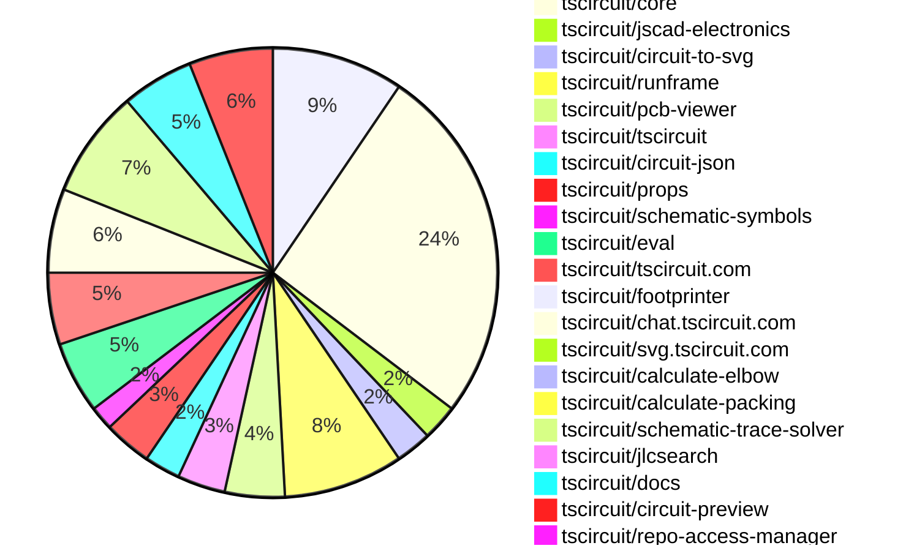
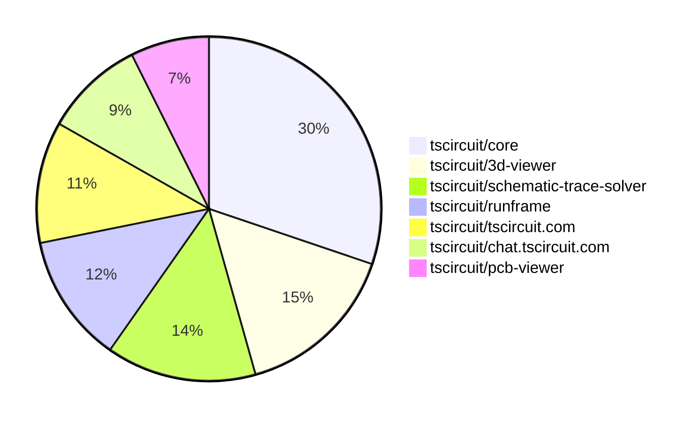

# contribution-tracker

[contributions.tscircuit.com](https://contributions.tscircuit.com) ・ [tscircuit.com](https://tscircuit.com) ・ [Contribution Overviews](./contribution-overviews/) ・ [Changelogs](./changelogs/)

Generates weekly contribution overviews for tscircuit contributors. Check out all
the [contribution overviews here](./contribution-overviews/)
You can find AI-generated monthly changelogs in the [changelogs directory](./changelogs/).

- All PRs in the tscircuit org are scanned/summarized via an LLM
- The LLM classifies each Diff/PR as into a set of attributes for scoring
- All the PRs, summaries, and classifications are organized into charts and tables for [the website](https://contributions.tscircuit.com)

> Want to run locally? See the [Development Section](#development)

The current week is shown below. There are 3 major sections:

- [Contributor Overview](#contributor-overview)
- [PRs by Repository](#prs-by-repository)
- [PRs by Contributor](#changes-by-contributor)

## Current Week

<!-- START_CURRENT_WEEK -->

# Contribution Overview 2025-08-27

## PRs by Repository



## Contributor Overview

| Contributor | 🐳 Major | 🐙 Minor | 🐌 Tiny | ⭐ | Score | Discussion Contributions |
|-------------|---------|---------|---------|-----|----------------|--------------------------|
| [seveibar](#seveibar) | 7 | 9 | 27 | 👑 | 71 | 0🔹 0🔶 0💎 |
| [imrishabh18](#imrishabh18) | 3 | 6 | 16 | ⭐⭐⭐ | 40 | 0🔹 0🔶 0💎 |
| [ShiboSoftwareDev](#ShiboSoftwareDev) | 1 | 5 | 17 | ⭐⭐ | 27 | 0🔹 0🔶 0💎 |
| [ArnavK-09](#ArnavK-09) | 3 | 2 | 3 | ⭐⭐ | 19 | 0🔹 0🔶 0💎 |
| [abimaelmartell](#abimaelmartell) | 3 | 2 | 1 | ⭐⭐ | 17 | 0🔹 0🔶 0💎 |
| [MustafaMulla29](#MustafaMulla29) | 1 | 1 | 5 | ⭐⭐ | 12 | 0🔹 0🔶 0💎 |
| [baeoc](#baeoc) | 1 | 2 | 0 | ⭐ | 10 | 0🔹 0🔶 0💎 |
| [techmannih](#techmannih) | 0 | 1 | 0 | ⭐ | 7 | 0🔹 0🔶 0💎 |
| [AnasSarkiz](#AnasSarkiz) | 0 | 1 | 1 | ⭐ | 4 | 0🔹 0🔶 0💎 |
| [tscircuitbot](#tscircuitbot) | 0 | 0 | 4 | ⭐ | 4 | 0🔹 0🔶 0💎 |
| [pxlpal](#pxlpal) | 1 | 0 | 0 | ⭐ | 4 | 0🔹 0🔶 0💎 |

### Discussion Contribution Legend

- 🔹 Normal Comments: Basic participation with minimal effort
- 🔶 Great Informative Comments: Thoughtful participation that adds value
- 💎 Incredible Comments: Exceptional participation with high-quality content

## Review Table

[reviews-received-hover]: ## "Number of reviews received for PRs for this contributor"
[approvals-received-hover]: ## "Number of approvals received for PRs this contributor authored"
[rejections-received-hover]: ## "Number of rejections received for PRs this contributor authored"
[prs-opened-hover]: ## "Number of PRs opened by this contributor"
[issues-created-hover]: ## "Number of issues created by this contributor"
[bountied-issues-hover]: ## "Number of issues this contributor created with a bounty"
[bountied-issue-$-hover]: ## "Total bounty amount placed on issues authored by this contributor"

| Contributor | Reviews Received | Approvals Received | Rejections Received | Approvals | Rejections | PRs Opened | PRs Merged | Score | Issues Created | Bountied Issues | Bountied Issue $ |
|---|---|---|---|---|---|---|---|---|---|---|---|
| [ShiboSoftwareDev](#ShiboSoftwareDev) | 36 | 25 | 0 | 2 | 0 | 23 | 23 | 27 | 0 | 0 | 0 |
| [seveibar](#seveibar) | 23 | 0 | 0 | 59 | 10 | 51 | 45 | 71 | 0 | 0 | 0 |
| [abimaelmartell](#abimaelmartell) | 9 | 5 | 0 | 0 | 0 | 6 | 6 | 17 | 0 | 0 | 0 |
| [graphite-app[bot]](#graphite-app[bot]) | 0 | 0 | 0 | 0 | 0 | 0 | 0 | 0 | 0 | 0 | 0 |
| [ArnavK-09](#ArnavK-09) | 12 | 8 | 0 | 0 | 0 | 8 | 8 | 19 | 0 | 0 | 0 |
| [imrishabh18](#imrishabh18) | 25 | 13 | 1 | 6 | 3 | 34 | 27 | 40 | 0 | 0 | 0 |
| [MustafaMulla29](#MustafaMulla29) | 23 | 9 | 1 | 0 | 0 | 11 | 7 | 12 | 0 | 0 | 0 |
| [chatgpt-codex-connector[bot]](#chatgpt-codex-connector[bot]) | 0 | 0 | 0 | 0 | 0 | 0 | 0 | 0 | 0 | 0 | 0 |
| [techmannih](#techmannih) | 7 | 1 | 1 | 3 | 0 | 5 | 1 | 7 | 0 | 0 | 0 |
| [baeoc](#baeoc) | 25 | 6 | 7 | 0 | 0 | 11 | 3 | 10 | 0 | 0 | 0 |
| [AnasSarkiz](#AnasSarkiz) | 6 | 3 | 2 | 0 | 0 | 5 | 2 | 4 | 0 | 0 | 0 |
| [gsharma101](#gsharma101) | 6 | 0 | 1 | 0 | 0 | 2 | 0 | 0 | 0 | 0 | 0 |
| [Anshgrover23](#Anshgrover23) | 0 | 0 | 0 | 1 | 0 | 0 | 0 | 0 | 0 | 0 | 0 |
| [abcds07](#abcds07) | 3 | 0 | 0 | 0 | 0 | 2 | 0 | 0 | 0 | 0 | 0 |
| [tscircuitbot](#tscircuitbot) | 0 | 0 | 0 | 0 | 0 | 53 | 4 | 4 | 0 | 0 | 0 |
| [pxlpal](#pxlpal) | 1 | 1 | 0 | 0 | 0 | 1 | 1 | 4 | 0 | 0 | 0 |
| [Copilot](#Copilot) | 0 | 0 | 0 | 0 | 0 | 1 | 0 | 0 | 0 | 0 | 0 |

## Top 7 Repositories by Contribution Points



## Changes by Repository

### [tscircuit/3d-viewer](https://github.com/tscircuit/3d-viewer)

| PR # | Impact | Rating | Contributor | Description |
|------|--------|--------|-------------|-------------|
| [#428](https://github.com/tscircuit/3d-viewer/pull/428) | 🐳 Major | ⭐⭐⭐ | ShiboSoftwareDev | Migrates the project to use vanilla jscad-electronics instead of jscad-fiber, removing the dependency on React reconciler for rendering 3D models. |
| [#441](https://github.com/tscircuit/3d-viewer/pull/441) | 🐳 Major | ⭐⭐⭐ | seveibar | Add context menu functionality on mobile devices that triggers on long press and closes when tapping outside. |
| [#438](https://github.com/tscircuit/3d-viewer/pull/438) | 🐳 Major | ⭐⭐⭐ | MustafaMulla29 | Adds a Download GLTF option to the right-click context menu for exporting 3D models in GLTF format. |
| [#430](https://github.com/tscircuit/3d-viewer/pull/430) | 🐙 Minor | ⭐⭐ | ShiboSoftwareDev | Fixes issue where JSCAD models do not render due to missing polygons or sides, and improves error handling for 3D model rendering. |
| [#432](https://github.com/tscircuit/3d-viewer/pull/432) | 🐙 Minor | ⭐⭐ | seveibar | Fixes the issue of duplicate canvas creation by ensuring existing canvases are removed before creating a new WebGL renderer. |
| [#439](https://github.com/tscircuit/3d-viewer/pull/439) | 🐙 Minor | ⭐⭐ | MustafaMulla29 | Fixes the tooltips DOM position calculation to ensure the tooltip appears correctly aligned with the 3D point on the screen. |

<details>
<summary>🐌 Tiny Contributions (5)</summary>

| PR # | Impact | Contributor | Description |
|------|--------|-------------|-------------|
| [#431](https://github.com/tscircuit/3d-viewer/pull/431) | 🐌 Tiny | ShiboSoftwareDev | Loads the Manifold module and its WebAssembly file from a script tag instead of directly importing it, allowing for dynamic loading and improved error handling. |
| [#423](https://github.com/tscircuit/3d-viewer/pull/423) | 🐌 Tiny | ShiboSoftwareDev | Changes the way manifold-3d is imported by loading it from a CDN instead of bundling the WASM file, which optimizes the build process and reduces the bundle size. |
| [#443](https://github.com/tscircuit/3d-viewer/pull/443) | 🐌 Tiny | seveibar | Avoids injecting Manifold script if window.ManifoldModule, window.MANIFOLD, or window.MANIFOLD_MODULE already exists, using existing globals during load and declaring optional typings for them. |
| [#442](https://github.com/tscircuit/3d-viewer/pull/442) | 🐌 Tiny | seveibar | Adds a Download GLTF option to the viewer context menu and exposes the root three.js object globally for GLTF exporting. |
| [#426](https://github.com/tscircuit/3d-viewer/pull/426) | 🐌 Tiny | imrishabh18 | Adds support for the circular_hole_with_rect_pad shape in the manifold processing, allowing for the creation of circular holes with rectangular pads in PCB designs. |

</details>

### [tscircuit/core](https://github.com/tscircuit/core)

| PR # | Impact | Rating | Contributor | Description |
|------|--------|--------|-------------|-------------|
| [#1198](https://github.com/tscircuit/core/pull/1198) | 🐳 Major | ⭐⭐⭐ | seveibar | Fixes net label rendering issue where labels are not drawn for traces without a source net or assigned display name. |
| [#1224](https://github.com/tscircuit/core/pull/1224) | 🐙 Minor | ⭐⭐ | ShiboSoftwareDev | Fixes net label application to ports on the main board connected to nets defined within child subcircuits. |
| [#1209](https://github.com/tscircuit/core/pull/1209) | 🐙 Minor | ⭐⭐ | seveibar | Adds reproduction of the 555 timer chip and fixes PCB packing to prevent components from being packed inside each other. |
| [#1199](https://github.com/tscircuit/core/pull/1199) | 🐙 Minor | ⭐⭐ | seveibar | Fixes MSP overreach by adjusting maxMspPairDistance and refactoring transistor tests for improved accuracy in schematic rendering. |
| [#1196](https://github.com/tscircuit/core/pull/1196) | 🐙 Minor | ⭐⭐ | seveibar | Fixes missing net label placements in schematic rendering when using the match-adapt feature. |
| [#1194](https://github.com/tscircuit/core/pull/1194) | 🐙 Minor | ⭐⭐ | seveibar | Removes duplicate netlabels from the schematic display, ensuring that only unique labels are rendered at each anchor position. |
| [#1189](https://github.com/tscircuit/core/pull/1189) | 🐙 Minor | ⭐⭐ | seveibar | Fixes regression in schematic trace routing that caused failures in rendering net labels for jumper connections. |
| [#1207](https://github.com/tscircuit/core/pull/1207) | 🐙 Minor | ⭐⭐ | imrishabh18 | Fixes the PCB layout behavior to ensure that explicit positions set on components (pcbX and pcbY) take precedence over the automatic flex layout. |
| [#1183](https://github.com/tscircuit/core/pull/1183) | 🐙 Minor | ⭐⭐ | imrishabh18 | Fixes the tree construction and child ordering for groups with pcbFlex by utilizing group.child, ensuring proper layout and positioning of components on the PCB. |
| [#1179](https://github.com/tscircuit/core/pull/1179) | 🐙 Minor | ⭐⭐ | imrishabh18 | Fixes the issue where connections are incorrectly assigned to unnamed chips, defaulting to the first chips connection instead. |
| [#1169](https://github.com/tscircuit/core/pull/1169) | 🐙 Minor | ⭐⭐ | imrishabh18 | Fixes rendering failure of the component when invalid pin labels are provided, allowing valid labels to render while excluding invalid ones with warnings. |
| [#1227](https://github.com/tscircuit/core/pull/1227) | 🐙 Minor | ⭐⭐ | AnasSarkiz | Fixes the issue of duplicate overlapping net labels in schematic rendering due to improper coordination between label placement algorithms. |
| [#1193](https://github.com/tscircuit/core/pull/1193) | 🐙 Minor | ⭐⭐ | baeoc | Fixes incorrect mapping of the emitter pin to the collector pin for NPN transistors in the Transistor component. |

<details>
<summary>🐌 Tiny Contributions (17)</summary>

| PR # | Impact | Contributor | Description |
|------|--------|-------------|-------------|
| [#1233](https://github.com/tscircuit/core/pull/1233) | 🐌 Tiny | ShiboSoftwareDev | Modifies the grid layout algorithm to exclude child components with explicit schX or schY properties, ensuring manually positioned components are unaffected by automatic layout. |
| [#1223](https://github.com/tscircuit/core/pull/1223) | 🐌 Tiny | ShiboSoftwareDev | Updates the circuit-json dependency version from 0.0.235 to 0.0.236 in package.json |
| [#1212](https://github.com/tscircuit/core/pull/1212) | 🐌 Tiny | ShiboSoftwareDev | Adds functionality to the voltagesource component to generate square wave signals, including a duty cycle parameter. |
| [#1235](https://github.com/tscircuit/core/pull/1235) | 🐌 Tiny | seveibar | Add a 3x3 switch matrix schematic reproduction with per-key diodes and capture a schematic snapshot for header and matrix wiring. |
| [#1222](https://github.com/tscircuit/core/pull/1222) | 🐌 Tiny | seveibar | Enhances error messages for components with invalid props by including the component name and type in the error text. |
| [#1219](https://github.com/tscircuit/core/pull/1219) | 🐌 Tiny | seveibar | Fixes PinHeader connections by ensuring ports are named from pinLabels and adds regression tests for PinHeader connections. |
| [#1218](https://github.com/tscircuit/core/pull/1218) | 🐌 Tiny | seveibar | Updates the minicssgrid dependency to version 0.0.9 in package.json |
| [#1211](https://github.com/tscircuit/core/pull/1211) | 🐌 Tiny | seveibar | Allows PinHeader to compute pin count from record pin labels and adds tests for record-style pinLabels. |
| [#1210](https://github.com/tscircuit/core/pull/1210) | 🐌 Tiny | seveibar | Adds warnings for unconnected required pins in circuit designs, enhancing error detection for users. |
| [#1200](https://github.com/tscircuit/core/pull/1200) | 🐌 Tiny | seveibar | Enables the MSP schematic trace solver feature in the circuit simulation environment. |
| [#1192](https://github.com/tscircuit/core/pull/1192) | 🐌 Tiny | seveibar | Fixes missing net label placements in the MSP schematic trace routing, addressing a regression issue. |
| [#1217](https://github.com/tscircuit/core/pull/1217) | 🐌 Tiny | imrishabh18 | Fixes the creation of CAD components for pinheaders when an explicit footprint is not provided by using an implied footprint instead. |
| [#1216](https://github.com/tscircuit/core/pull/1216) | 🐌 Tiny | imrishabh18 | Adds default behavior for packing PCB components when multiple direct children are present without explicit PCB coordinates. |
| [#1208](https://github.com/tscircuit/core/pull/1208) | 🐌 Tiny | imrishabh18 | Adds the source_trace_not_connected_error to circuit-json to handle cases where traces are not connected to ports properly. |
| [#1191](https://github.com/tscircuit/core/pull/1191) | 🐌 Tiny | imrishabh18 | Fixes failing test error in GitHub CI action by correcting import paths in test files. |
| [#1225](https://github.com/tscircuit/core/pull/1225) | 🐌 Tiny | MustafaMulla29 | Adds a test case for automatic schematic generation in the circuit rendering system. |
| [#1190](https://github.com/tscircuit/core/pull/1190) | 🐌 Tiny | MustafaMulla29 | Removes the schematic-corpus and related code from the project, impacting how schematics are handled and represented. |

</details>

### [tscircuit/jscad-electronics](https://github.com/tscircuit/jscad-electronics)

| PR # | Impact | Rating | Contributor | Description |
|------|--------|--------|-------------|-------------|
| [#109](https://github.com/tscircuit/jscad-electronics/pull/109) | 🐙 Minor | ⭐⭐ | ShiboSoftwareDev | Removes the dependency on jscad-fiber by implementing createJSCADRenderer and convertCSGToThreeGeom functions directly. |

<details>
<summary>🐌 Tiny Contributions (2)</summary>

| PR # | Impact | Contributor | Description |
|------|--------|-------------|-------------|
| [#110](https://github.com/tscircuit/jscad-electronics/pull/110) | 🐌 Tiny | ShiboSoftwareDev | Makes jscad-fiber an optional peer dependency to prevent auto-installation when importing the vanilla version of jscad-electronics |
| [#113](https://github.com/tscircuit/jscad-electronics/pull/113) | 🐌 Tiny | AnasSarkiz | Adds a new 3D component representation for the SOD523 electronic component, including its footprint and example usage in the library. |

</details>

### [tscircuit/circuit-to-svg](https://github.com/tscircuit/circuit-to-svg)

| PR # | Impact | Rating | Contributor | Description |
|------|--------|--------|-------------|-------------|
| [#298](https://github.com/tscircuit/circuit-to-svg/pull/298) | 🐳 Major | ⭐⭐⭐ | baeoc | Draws reference designators on schematic above schematic traces to improve visibility and clarity. |
| [#300](https://github.com/tscircuit/circuit-to-svg/pull/300) | 🐙 Minor | ⭐⭐ | ShiboSoftwareDev | Adds input and output arrows to schematic ports for better visual representation of connections. |

<details>
<summary>🐌 Tiny Contributions (1)</summary>

| PR # | Impact | Contributor | Description |
|------|--------|-------------|-------------|
| [#299](https://github.com/tscircuit/circuit-to-svg/pull/299) | 🐌 Tiny | ShiboSoftwareDev | Updates the tscircuit dependency to remove jscad-fiber as a nested dependency. |

</details>

### [tscircuit/runframe](https://github.com/tscircuit/runframe)

| PR # | Impact | Rating | Contributor | Description |
|------|--------|--------|-------------|-------------|
| [#1043](https://github.com/tscircuit/runframe/pull/1043) | 🐳 Major | ⭐⭐⭐ | imrishabh18 | Enables file downloads in a new tab when the application is running inside an iframe sandbox, improving usability for JSON and ZIP file downloads. |
| [#1033](https://github.com/tscircuit/runframe/pull/1033) | 🐳 Major | ⭐⭐⭐ | pxlpal | Refactors the ImportComponentDialog to handle component importing and toast messaging internally, allowing for custom headers to be passed to JLCPCB proxy requests and simplifying its usage in FileMenuLeftHeader. |
| [#1052](https://github.com/tscircuit/runframe/pull/1052) | 🐙 Minor | ⭐⭐ | ShiboSoftwareDev | Enables SPICE simulation functionality and adds a voltage divider test circuit example in the RunFrame component. |
| [#1037](https://github.com/tscircuit/runframe/pull/1037) | 🐙 Minor | ⭐⭐ | imrishabh18 | Fixes an issue where circuit JSON was incorrectly fetched from runframeStore when in a standalone bundle context. |

<details>
<summary>🐌 Tiny Contributions (6)</summary>

| PR # | Impact | Contributor | Description |
|------|--------|-------------|-------------|
| [#1049](https://github.com/tscircuit/runframe/pull/1049) | 🐌 Tiny | ShiboSoftwareDev | Updates the 3D viewer dependency to version 0.0.346 in the package.json file |
| [#1048](https://github.com/tscircuit/runframe/pull/1048) | 🐌 Tiny | ShiboSoftwareDev | Removes the jscad-fiber dependency from the project and updates related dependencies in package.json |
| [#1032](https://github.com/tscircuit/runframe/pull/1032) | 🐌 Tiny | ShiboSoftwareDev | This pull request updates the project to use React version 19, which includes various performance improvements and new features. |
| [#1053](https://github.com/tscircuit/runframe/pull/1053) | 🐌 Tiny | seveibar | Updates the tscircuit3d-viewer package to version 0.0.354 in the package.json file. |
| [#1050](https://github.com/tscircuit/runframe/pull/1050) | 🐌 Tiny | imrishabh18 | Fixes broken height of iframe in the 3D viewer component by updating the dependency version of tscircuit3d-viewer. |
| [#1040](https://github.com/tscircuit/runframe/pull/1040) | 🐌 Tiny | imrishabh18 | Provides a fallback mechanism for circuitJson when storeCircuitJson is not available, ensuring that props.circuitJson is used instead. |

</details>

### [tscircuit/pcb-viewer](https://github.com/tscircuit/pcb-viewer)

| PR # | Impact | Rating | Contributor | Description |
|------|--------|--------|-------------|-------------|
| [#356](https://github.com/tscircuit/pcb-viewer/pull/356) | 🐳 Major | ⭐⭐⭐ | abimaelmartell | Refactors the computation of circuitJsonKey in PCBViewer to use a new utility that generates a stable, content-based key from PCB element bounds and IDs, ensuring keys change only with meaningful PCB content changes. |
| [#360](https://github.com/tscircuit/pcb-viewer/pull/360) | 🐳 Major | ⭐⭐⭐ | ArnavK-09 | Integrates local storage functionality to persist PCB groups visibility settings for users. |

<details>
<summary>🐌 Tiny Contributions (3)</summary>

| PR # | Impact | Contributor | Description |
|------|--------|-------------|-------------|
| [#362](https://github.com/tscircuit/pcb-viewer/pull/362) | 🐌 Tiny | ShiboSoftwareDev | Updates the tscircuit dependency version from 0.0.603 to 0.0.606 in package.json |
| [#361](https://github.com/tscircuit/pcb-viewer/pull/361) | 🐌 Tiny | abimaelmartell | Removes the private field from package.json, allowing the package to be published. |
| [#359](https://github.com/tscircuit/pcb-viewer/pull/359) | 🐌 Tiny | ArnavK-09 | Sets the default visibility of PCB groups to true, correcting a previous misconfiguration that could confuse users expecting to see grouped PCB elements by default. |

</details>

### [tscircuit/tscircuit](https://github.com/tscircuit/tscircuit)


<details>
<summary>🐌 Tiny Contributions (4)</summary>

| PR # | Impact | Contributor | Description |
|------|--------|-------------|-------------|
| [#747](https://github.com/tscircuit/tscircuit/pull/747) | 🐌 Tiny | ShiboSoftwareDev | Removes the jscad-fiber dependency and updates the tscircuiteval package version from 0.0.293 to 0.0.294. |
| [#746](https://github.com/tscircuit/tscircuit/pull/746) | 🐌 Tiny | seveibar | Updates several major package dependencies and adds the connectivity-map package for enhanced connectivity features. |
| [#745](https://github.com/tscircuit/tscircuit/pull/745) | 🐌 Tiny | imrishabh18 | Updates the version of the tscircuitcore dependency from 0.0.651 to 0.0.659 in package.json |
| [#744](https://github.com/tscircuit/tscircuit/pull/744) | 🐌 Tiny | MustafaMulla29 | Updates the core and eval packages to newer versions and removes the schematic-corpus dependency from the project. |

</details>

### [tscircuit/circuit-json](https://github.com/tscircuit/circuit-json)


<details>
<summary>🐌 Tiny Contributions (3)</summary>

| PR # | Impact | Contributor | Description |
|------|--------|-------------|-------------|
| [#260](https://github.com/tscircuit/circuit-json/pull/260) | 🐌 Tiny | ShiboSoftwareDev | Adds new properties to the schematic port interface to support drawing arrows for input and output ports |
| [#258](https://github.com/tscircuit/circuit-json/pull/258) | 🐌 Tiny | ShiboSoftwareDev | Adds a duty cycle parameter to the AC voltage source simulation, allowing users to specify the duty cycle as a percentage or decimal value. |
| [#259](https://github.com/tscircuit/circuit-json/pull/259) | 🐌 Tiny | seveibar | Add source_pin_missing_trace_warning schema for detecting unconnected component pins and export new warning type with documentation in README. |

</details>

### [tscircuit/props](https://github.com/tscircuit/props)


<details>
<summary>🐌 Tiny Contributions (4)</summary>

| PR # | Impact | Contributor | Description |
|------|--------|-------------|-------------|
| [#361](https://github.com/tscircuit/props/pull/361) | 🐌 Tiny | ShiboSoftwareDev | Adds a duty cycle property to the VoltageSource component, allowing users to specify the duty cycle as a percentage or a decimal value. |
| [#364](https://github.com/tscircuit/props/pull/364) | 🐌 Tiny | seveibar | Add voltage and standard properties to the battery component, along with documentation and tests for parsing these properties. |
| [#363](https://github.com/tscircuit/props/pull/363) | 🐌 Tiny | seveibar | Allows pinLabels on PinHeader to accept a record of labels or an array, adds tests for this functionality, and updates documentation accordingly. |
| [#362](https://github.com/tscircuit/props/pull/362) | 🐌 Tiny | seveibar | Adds an optional schMaxTraceDistance property to SubcircuitGroupProps, documents the new property, regenerates props references, and tests parsing of schMaxTraceDistance. |

</details>

### [tscircuit/schematic-symbols](https://github.com/tscircuit/schematic-symbols)

| PR # | Impact | Rating | Contributor | Description |
|------|--------|--------|-------------|-------------|
| [#357](https://github.com/tscircuit/schematic-symbols/pull/357) | 🐙 Minor | ⭐⭐ | techmannih | Fixes pin numbering to follow the counter-clockwise convention for the opamp with power symbol. |

<details>
<summary>🐌 Tiny Contributions (1)</summary>

| PR # | Impact | Contributor | Description |
|------|--------|-------------|-------------|
| [#354](https://github.com/tscircuit/schematic-symbols/pull/354) | 🐌 Tiny | ShiboSoftwareDev | Adds a new schematic symbol for a square wave generator to the library. |

</details>

### [tscircuit/eval](https://github.com/tscircuit/eval)


<details>
<summary>🐌 Tiny Contributions (6)</summary>

| PR # | Impact | Contributor | Description |
|------|--------|-------------|-------------|
| [#917](https://github.com/tscircuit/eval/pull/917) | 🐌 Tiny | ShiboSoftwareDev | removes jscad-fiber from dependencies and execution context |
| [#887](https://github.com/tscircuit/eval/pull/887) | 🐌 Tiny | MustafaMulla29 | Updates the core library version, installs the schematic-trace-solver package, and removes the schematic-corpus dependency from the project. |
| [#931](https://github.com/tscircuit/eval/pull/931) | 🐌 Tiny | tscircuitbot | Automated update of tscircuitcore to v0.0.672. |
| [#919](https://github.com/tscircuit/eval/pull/919) | 🐌 Tiny | tscircuitbot | Automated update of tscircuitcore to v0.0.666. |
| [#908](https://github.com/tscircuit/eval/pull/908) | 🐌 Tiny | tscircuitbot | Updates the tscircuitcore dependency to version 0.0.661 in the package.json file. |
| [#907](https://github.com/tscircuit/eval/pull/907) | 🐌 Tiny | tscircuitbot | Automated update of tscircuitcore to v0.0.660. |

</details>

### [tscircuit/tscircuit.com](https://github.com/tscircuit/tscircuit.com)

| PR # | Impact | Rating | Contributor | Description |
|------|--------|--------|-------------|-------------|
| [#1617](https://github.com/tscircuit/tscircuit.com/pull/1617) | 🐳 Major | ⭐⭐⭐ | abimaelmartell | Displays SVG images in the package view alongside PNG images, enhancing the visual representation of package components. |
| [#1613](https://github.com/tscircuit/tscircuit.com/pull/1613) | 🐳 Major | ⭐⭐⭐ | abimaelmartell | Fetches schematic, PCB, and 3D images for package releases and displays them above the build overview. |
| [#1618](https://github.com/tscircuit/tscircuit.com/pull/1618) | 🐳 Major | ⭐⭐⭐ | imrishabh18 | Fixes regression where starring a package did not update the UI to reflect the change in star status. |
| [#1614](https://github.com/tscircuit/tscircuit.com/pull/1614) | 🐙 Minor | ⭐⭐ | abimaelmartell | Expose image generation build info in API and schema, show image generation logs on preview and build details pages, and test that package releases return image generation fields. |
| [#1620](https://github.com/tscircuit/tscircuit.com/pull/1620) | 🐙 Minor | ⭐⭐ | imrishabh18 | Fixes a bug where hooks were conditionally run, ensuring consistent behavior in the usePackageStarring hook. |

<details>
<summary>🐌 Tiny Contributions (1)</summary>

| PR # | Impact | Contributor | Description |
|------|--------|-------------|-------------|
| [#1616](https://github.com/tscircuit/tscircuit.com/pull/1616) | 🐌 Tiny | ArnavK-09 | Adjusts the background colors of images in the release detail page based on the view type (PCB or schematic). |

</details>

### [tscircuit/footprinter](https://github.com/tscircuit/footprinter)

| PR # | Impact | Rating | Contributor | Description |
|------|--------|--------|-------------|-------------|
| [#365](https://github.com/tscircuit/footprinter/pull/365) | 🐙 Minor | ⭐⭐ | abimaelmartell | Fixes the alignment of m2host pads by adjusting their positioning calculations in the m2host function. |

### [tscircuit/chat.tscircuit.com](https://github.com/tscircuit/chat.tscircuit.com)

| PR # | Impact | Rating | Contributor | Description |
|------|--------|--------|-------------|-------------|
| [#38](https://github.com/tscircuit/chat.tscircuit.com/pull/38) | 🐳 Major | ⭐⭐⭐ | ArnavK-09 | Adds functionality to handle package references in the input field, allowing users to add and remove package attachments dynamically based on input changes. |
| [#36](https://github.com/tscircuit/chat.tscircuit.com/pull/36) | 🐳 Major | ⭐⭐⭐ | ArnavK-09 | Adds mobile compatibility for  input detection in PureMultimodalInput, updates attachment preview to allow Ctrlclick for opening links in a new tab, and improves accessibility by adding aria-describedby to TscircuitPackageSelector. |
| [#40](https://github.com/tscircuit/chat.tscircuit.com/pull/40) | 🐙 Minor | ⭐⭐ | ArnavK-09 | Adjusts the layout and styling of block messages for better user experience, including responsive design changes and improved message display. |

<details>
<summary>🐌 Tiny Contributions (4)</summary>

| PR # | Impact | Contributor | Description |
|------|--------|-------------|-------------|
| [#35](https://github.com/tscircuit/chat.tscircuit.com/pull/35) | 🐌 Tiny | ArnavK-09 | Fixes toast icons color for better visibility in both white and dark modes. |
| [#41](https://github.com/tscircuit/chat.tscircuit.com/pull/41) | 🐌 Tiny | imrishabh18 | Modifies the document creation and update functions to include a selected model ID for improved model handling. |
| [#39](https://github.com/tscircuit/chat.tscircuit.com/pull/39) | 🐌 Tiny | imrishabh18 | Adds the gpt-5-nano model option to the chat application, allowing users to select this model for their chat interactions. |
| [#34](https://github.com/tscircuit/chat.tscircuit.com/pull/34) | 🐌 Tiny | imrishabh18 | Add the option for 555 timer as one of the suggested actions |

</details>

### [tscircuit/svg.tscircuit.com](https://github.com/tscircuit/svg.tscircuit.com)

| PR # | Impact | Rating | Contributor | Description |
|------|--------|--------|-------------|-------------|
| [#290](https://github.com/tscircuit/svg.tscircuit.com/pull/290) | 🐙 Minor | ⭐⭐ | ArnavK-09 | Add background coloropacity and default zoom multiplier parameters to the 3D SVG conversion function to provide more control over the output visualization |

### [tscircuit/calculate-elbow](https://github.com/tscircuit/calculate-elbow)

| PR # | Impact | Rating | Contributor | Description |
|------|--------|--------|-------------|-------------|
| [#11](https://github.com/tscircuit/calculate-elbow/pull/11) | 🐳 Major | ⭐⭐⭐ | seveibar | Fixes small floating point errors causing incorrect path construction in elbow calculations |

### [tscircuit/calculate-packing](https://github.com/tscircuit/calculate-packing)

| PR # | Impact | Rating | Contributor | Description |
|------|--------|--------|-------------|-------------|
| [#29](https://github.com/tscircuit/calculate-packing/pull/29) | 🐳 Major | ⭐⭐⭐ | seveibar | This pull request introduces a new feature that adds a center pad to components, which helps prevent them from packing inside other components. This is achieved by modifying the buildPackedComponent function to include an optional parameter shouldAddInnerObstacles, which, when set to true, creates an inner pad that represents the inside of the component. This change is expected to improve the layout and organization of components in the circuit design. |

### [tscircuit/schematic-trace-solver](https://github.com/tscircuit/schematic-trace-solver)

| PR # | Impact | Rating | Contributor | Description |
|------|--------|--------|-------------|-------------|
| [#22](https://github.com/tscircuit/schematic-trace-solver/pull/22) | 🐳 Major | ⭐⭐⭐ | seveibar | Fixes the issue where diagonal traces appear in the schematic trace solver, ensuring that only orthogonal paths are generated during the routing process. |
| [#17](https://github.com/tscircuit/schematic-trace-solver/pull/17) | 🐳 Major | ⭐⭐⭐ | seveibar | Orders single-line solver candidate paths by path length so shorter traces are tried first and tests that the solver selects the shortest available candidate path. |
| [#16](https://github.com/tscircuit/schematic-trace-solver/pull/16) | 🐳 Major | ⭐⭐⭐ | seveibar | Adds a PasteInput page, introduces download functionality for page.tsx and test.ts files, and fixes floating point issues in calculate elbow for near-axis aligned traces. |
| [#15](https://github.com/tscircuit/schematic-trace-solver/pull/15) | 🐙 Minor | ⭐⭐ | seveibar | Adds netId, mspConnectionPairIds, and pinIds to the NetLabelPlacement interface to enhance net label placement functionality. |
| [#13](https://github.com/tscircuit/schematic-trace-solver/pull/13) | 🐙 Minor | ⭐⭐ | seveibar | Fixes MSP connection pair solver to return all pairs and adds logging for better debugging. |
| [#21](https://github.com/tscircuit/schematic-trace-solver/pull/21) | 🐙 Minor | ⭐⭐ | baeoc | Fixes missing net label for trace group island in Example07, addressing issue 19. |

<details>
<summary>🐌 Tiny Contributions (3)</summary>

| PR # | Impact | Contributor | Description |
|------|--------|-------------|-------------|
| [#24](https://github.com/tscircuit/schematic-trace-solver/pull/24) | 🐌 Tiny | seveibar | Fixes the issue of MSP connection pairs being created over distances that exceed the maximum allowed distance, preventing long traces in schematic connections. |
| [#18](https://github.com/tscircuit/schematic-trace-solver/pull/18) | 🐌 Tiny | seveibar | Adds a reproduction example for a missing net label issue in the schematic trace solver. |
| [#14](https://github.com/tscircuit/schematic-trace-solver/pull/14) | 🐌 Tiny | seveibar | Adds pinIds to the SolvedTracePath interface to enhance trace path identification in schematic solving. |

</details>

### [tscircuit/jlcsearch](https://github.com/tscircuit/jlcsearch)

| PR # | Impact | Rating | Contributor | Description |
|------|--------|--------|-------------|-------------|
| [#83](https://github.com/tscircuit/jlcsearch/pull/83) | 🐙 Minor | ⭐⭐ | seveibar | Add list and JSON routes for ARM-based microcontrollers, document ARM processor search, and link from home page. |

### [tscircuit/docs](https://github.com/tscircuit/docs)

| PR # | Impact | Rating | Contributor | Description |
|------|--------|--------|-------------|-------------|
| [#115](https://github.com/tscircuit/docs/pull/115) | 🐳 Major | ⭐⭐⭐ | imrishabh18 | Adds a guide for using tscircuit with ChatGPT, including code snippets and instructions for rendering circuits in the ChatGPT Canvas. |

<details>
<summary>🐌 Tiny Contributions (5)</summary>

| PR # | Impact | Contributor | Description |
|------|--------|-------------|-------------|
| [#121](https://github.com/tscircuit/docs/pull/121) | 🐌 Tiny | seveibar | Fixes backtick escaping in the ChatGPT prompt documentation to ensure proper rendering of code snippets. |
| [#120](https://github.com/tscircuit/docs/pull/120) | 🐌 Tiny | seveibar | Updates the ChatGPT guide with the latest tscircuit syntax and introduces a script to automate fetching the latest guide content from GitHub. |
| [#117](https://github.com/tscircuit/docs/pull/117) | 🐌 Tiny | seveibar | Updates ChatGPT instructions to remove babel dependency and provides detailed context for using tscircuit effectively within ChatGPT. |
| [#116](https://github.com/tscircuit/docs/pull/116) | 🐌 Tiny | seveibar | Removes references to the matchAdapt algorithm from the automatic schematic layout guide and describes layout using a pattern matching and packing algorithm instead. |
| [#118](https://github.com/tscircuit/docs/pull/118) | 🐌 Tiny | imrishabh18 | Moves the ChatGPT usage guide to the quickstart section for better accessibility and organization. |

</details>

### [tscircuit/circuit-preview](https://github.com/tscircuit/circuit-preview)


<details>
<summary>🐌 Tiny Contributions (7)</summary>

| PR # | Impact | Contributor | Description |
|------|--------|-------------|-------------|
| [#14](https://github.com/tscircuit/circuit-preview/pull/14) | 🐌 Tiny | seveibar | Updates dependencies for RunFrame, tscircuit, and 3d-viewer, potentially addressing issues with missing chips in the rendering process. |
| [#10](https://github.com/tscircuit/circuit-preview/pull/10) | 🐌 Tiny | seveibar | Refactors the CircuitPreview component to accept circuitReactElement prop instead of circuit, improving the components clarity and usage. |
| [#9](https://github.com/tscircuit/circuit-preview/pull/9) | 🐌 Tiny | seveibar | Adds TODOs and emits warnings for circuit issues to assist in debugging and correction by ChatGPT. |
| [#8](https://github.com/tscircuit/circuit-preview/pull/8) | 🐌 Tiny | seveibar | Integrates Babel standalone into the project, allowing for the removal of Babel from installation instructions. |
| [#12](https://github.com/tscircuit/circuit-preview/pull/12) | 🐌 Tiny | imrishabh18 | Updates the tscircuitrunframe dependency to version 0.0.844 in package.json |
| [#11](https://github.com/tscircuit/circuit-preview/pull/11) | 🐌 Tiny | imrishabh18 | Updates the tscircuitrunframe dependency version from 0.0.835 to 0.0.841 in package.json |
| [#7](https://github.com/tscircuit/circuit-preview/pull/7) | 🐌 Tiny | imrishabh18 | Adds configuration for Cosmos to enable preview functionality during deployment. |

</details>

### [tscircuit/repo-access-manager](https://github.com/tscircuit/repo-access-manager)


<details>
<summary>🐌 Tiny Contributions (1)</summary>

| PR # | Impact | Contributor | Description |
|------|--------|-------------|-------------|
| [#3](https://github.com/tscircuit/repo-access-manager/pull/3) | 🐌 Tiny | imrishabh18 | Refactors the repository access management by consolidating multiple YAML files into a single repositories.yml file for easier management of repository permissions. |

</details>

### [tscircuit/matchpack](https://github.com/tscircuit/matchpack)


<details>
<summary>🐌 Tiny Contributions (1)</summary>

| PR # | Impact | Contributor | Description |
|------|--------|-------------|-------------|
| [#11](https://github.com/tscircuit/matchpack/pull/11) | 🐌 Tiny | MustafaMulla29 | Adds a reproduction page for the SI7021 schematic with input data for layout debugging. |

</details>

## Changes by Contributor

### [ShiboSoftwareDev](https://github.com/ShiboSoftwareDev)

| PRs # | Impact | Rating | Description |
|------|--------|--------|-------------|
| [#428](https://github.com/tscircuit/3d-viewer/pull/428) | 🐳 Major | ⭐⭐⭐ | Migrates the project to use vanilla jscad-electronics instead of jscad-fiber, removing the dependency on React reconciler for rendering 3D models. |
| [#430](https://github.com/tscircuit/3d-viewer/pull/430) | 🐙 Minor | ⭐⭐ | Fixes issue where JSCAD models do not render due to missing polygons or sides, and improves error handling for 3D model rendering. |
| [#1224](https://github.com/tscircuit/core/pull/1224) | 🐙 Minor | ⭐⭐ | Fixes net label application to ports on the main board connected to nets defined within child subcircuits. |
| [#109](https://github.com/tscircuit/jscad-electronics/pull/109) | 🐙 Minor | ⭐⭐ | Removes the dependency on jscad-fiber by implementing createJSCADRenderer and convertCSGToThreeGeom functions directly. |
| [#300](https://github.com/tscircuit/circuit-to-svg/pull/300) | 🐙 Minor | ⭐⭐ | Adds input and output arrows to schematic ports for better visual representation of connections. |
| [#1052](https://github.com/tscircuit/runframe/pull/1052) | 🐙 Minor | ⭐⭐ | Enables SPICE simulation functionality and adds a voltage divider test circuit example in the RunFrame component. |

<details>
<summary>🐌 Tiny Contributions (17)</summary>

| PR # | Impact | Description |
|------|--------|-------------|
| [#362](https://github.com/tscircuit/pcb-viewer/pull/362) | 🐌 Tiny | Updates the tscircuit dependency version from 0.0.603 to 0.0.606 in package.json |
| [#747](https://github.com/tscircuit/tscircuit/pull/747) | 🐌 Tiny | Removes the jscad-fiber dependency and updates the tscircuiteval package version from 0.0.293 to 0.0.294. |
| [#260](https://github.com/tscircuit/circuit-json/pull/260) | 🐌 Tiny | Adds new properties to the schematic port interface to support drawing arrows for input and output ports |
| [#258](https://github.com/tscircuit/circuit-json/pull/258) | 🐌 Tiny | Adds a duty cycle parameter to the AC voltage source simulation, allowing users to specify the duty cycle as a percentage or decimal value. |
| [#361](https://github.com/tscircuit/props/pull/361) | 🐌 Tiny | Adds a duty cycle property to the VoltageSource component, allowing users to specify the duty cycle as a percentage or a decimal value. |
| [#431](https://github.com/tscircuit/3d-viewer/pull/431) | 🐌 Tiny | Loads the Manifold module and its WebAssembly file from a script tag instead of directly importing it, allowing for dynamic loading and improved error handling. |
| [#423](https://github.com/tscircuit/3d-viewer/pull/423) | 🐌 Tiny | Changes the way manifold-3d is imported by loading it from a CDN instead of bundling the WASM file, which optimizes the build process and reduces the bundle size. |
| [#1233](https://github.com/tscircuit/core/pull/1233) | 🐌 Tiny | Modifies the grid layout algorithm to exclude child components with explicit schX or schY properties, ensuring manually positioned components are unaffected by automatic layout. |
| [#1223](https://github.com/tscircuit/core/pull/1223) | 🐌 Tiny | Updates the circuit-json dependency version from 0.0.235 to 0.0.236 in package.json |
| [#1212](https://github.com/tscircuit/core/pull/1212) | 🐌 Tiny | Adds functionality to the voltagesource component to generate square wave signals, including a duty cycle parameter. |
| [#110](https://github.com/tscircuit/jscad-electronics/pull/110) | 🐌 Tiny | Makes jscad-fiber an optional peer dependency to prevent auto-installation when importing the vanilla version of jscad-electronics |
| [#299](https://github.com/tscircuit/circuit-to-svg/pull/299) | 🐌 Tiny | Updates the tscircuit dependency to remove jscad-fiber as a nested dependency. |
| [#354](https://github.com/tscircuit/schematic-symbols/pull/354) | 🐌 Tiny | Adds a new schematic symbol for a square wave generator to the library. |
| [#917](https://github.com/tscircuit/eval/pull/917) | 🐌 Tiny | removes jscad-fiber from dependencies and execution context |
| [#1049](https://github.com/tscircuit/runframe/pull/1049) | 🐌 Tiny | Updates the 3D viewer dependency to version 0.0.346 in the package.json file |
| [#1048](https://github.com/tscircuit/runframe/pull/1048) | 🐌 Tiny | Removes the jscad-fiber dependency from the project and updates related dependencies in package.json |
| [#1032](https://github.com/tscircuit/runframe/pull/1032) | 🐌 Tiny | This pull request updates the project to use React version 19, which includes various performance improvements and new features. |

</details>

### [abimaelmartell](https://github.com/abimaelmartell)

| PRs # | Impact | Rating | Description |
|------|--------|--------|-------------|
| [#356](https://github.com/tscircuit/pcb-viewer/pull/356) | 🐳 Major | ⭐⭐⭐ | Refactors the computation of circuitJsonKey in PCBViewer to use a new utility that generates a stable, content-based key from PCB element bounds and IDs, ensuring keys change only with meaningful PCB content changes. |
| [#1617](https://github.com/tscircuit/tscircuit.com/pull/1617) | 🐳 Major | ⭐⭐⭐ | Displays SVG images in the package view alongside PNG images, enhancing the visual representation of package components. |
| [#1613](https://github.com/tscircuit/tscircuit.com/pull/1613) | 🐳 Major | ⭐⭐⭐ | Fetches schematic, PCB, and 3D images for package releases and displays them above the build overview. |
| [#365](https://github.com/tscircuit/footprinter/pull/365) | 🐙 Minor | ⭐⭐ | Fixes the alignment of m2host pads by adjusting their positioning calculations in the m2host function. |
| [#1614](https://github.com/tscircuit/tscircuit.com/pull/1614) | 🐙 Minor | ⭐⭐ | Expose image generation build info in API and schema, show image generation logs on preview and build details pages, and test that package releases return image generation fields. |

<details>
<summary>🐌 Tiny Contributions (1)</summary>

| PR # | Impact | Description |
|------|--------|-------------|
| [#361](https://github.com/tscircuit/pcb-viewer/pull/361) | 🐌 Tiny | Removes the private field from package.json, allowing the package to be published. |

</details>

### [ArnavK-09](https://github.com/ArnavK-09)

| PRs # | Impact | Rating | Description |
|------|--------|--------|-------------|
| [#360](https://github.com/tscircuit/pcb-viewer/pull/360) | 🐳 Major | ⭐⭐⭐ | Integrates local storage functionality to persist PCB groups visibility settings for users. |
| [#38](https://github.com/tscircuit/chat.tscircuit.com/pull/38) | 🐳 Major | ⭐⭐⭐ | Adds functionality to handle package references in the input field, allowing users to add and remove package attachments dynamically based on input changes. |
| [#36](https://github.com/tscircuit/chat.tscircuit.com/pull/36) | 🐳 Major | ⭐⭐⭐ | Adds mobile compatibility for  input detection in PureMultimodalInput, updates attachment preview to allow Ctrlclick for opening links in a new tab, and improves accessibility by adding aria-describedby to TscircuitPackageSelector. |
| [#290](https://github.com/tscircuit/svg.tscircuit.com/pull/290) | 🐙 Minor | ⭐⭐ | Add background coloropacity and default zoom multiplier parameters to the 3D SVG conversion function to provide more control over the output visualization |
| [#40](https://github.com/tscircuit/chat.tscircuit.com/pull/40) | 🐙 Minor | ⭐⭐ | Adjusts the layout and styling of block messages for better user experience, including responsive design changes and improved message display. |

<details>
<summary>🐌 Tiny Contributions (3)</summary>

| PR # | Impact | Description |
|------|--------|-------------|
| [#359](https://github.com/tscircuit/pcb-viewer/pull/359) | 🐌 Tiny | Sets the default visibility of PCB groups to true, correcting a previous misconfiguration that could confuse users expecting to see grouped PCB elements by default. |
| [#1616](https://github.com/tscircuit/tscircuit.com/pull/1616) | 🐌 Tiny | Adjusts the background colors of images in the release detail page based on the view type (PCB or schematic). |
| [#35](https://github.com/tscircuit/chat.tscircuit.com/pull/35) | 🐌 Tiny | Fixes toast icons color for better visibility in both white and dark modes. |

</details>

### [seveibar](https://github.com/seveibar)

| PRs # | Impact | Rating | Description |
|------|--------|--------|-------------|
| [#441](https://github.com/tscircuit/3d-viewer/pull/441) | 🐳 Major | ⭐⭐⭐ | Add context menu functionality on mobile devices that triggers on long press and closes when tapping outside. |
| [#1198](https://github.com/tscircuit/core/pull/1198) | 🐳 Major | ⭐⭐⭐ | Fixes net label rendering issue where labels are not drawn for traces without a source net or assigned display name. |
| [#11](https://github.com/tscircuit/calculate-elbow/pull/11) | 🐳 Major | ⭐⭐⭐ | Fixes small floating point errors causing incorrect path construction in elbow calculations |
| [#29](https://github.com/tscircuit/calculate-packing/pull/29) | 🐳 Major | ⭐⭐⭐ | This pull request introduces a new feature that adds a center pad to components, which helps prevent them from packing inside other components. This is achieved by modifying the buildPackedComponent function to include an optional parameter shouldAddInnerObstacles, which, when set to true, creates an inner pad that represents the inside of the component. This change is expected to improve the layout and organization of components in the circuit design. |
| [#22](https://github.com/tscircuit/schematic-trace-solver/pull/22) | 🐳 Major | ⭐⭐⭐ | Fixes the issue where diagonal traces appear in the schematic trace solver, ensuring that only orthogonal paths are generated during the routing process. |
| [#17](https://github.com/tscircuit/schematic-trace-solver/pull/17) | 🐳 Major | ⭐⭐⭐ | Orders single-line solver candidate paths by path length so shorter traces are tried first and tests that the solver selects the shortest available candidate path. |
| [#16](https://github.com/tscircuit/schematic-trace-solver/pull/16) | 🐳 Major | ⭐⭐⭐ | Adds a PasteInput page, introduces download functionality for page.tsx and test.ts files, and fixes floating point issues in calculate elbow for near-axis aligned traces. |
| [#432](https://github.com/tscircuit/3d-viewer/pull/432) | 🐙 Minor | ⭐⭐ | Fixes the issue of duplicate canvas creation by ensuring existing canvases are removed before creating a new WebGL renderer. |
| [#1209](https://github.com/tscircuit/core/pull/1209) | 🐙 Minor | ⭐⭐ | Adds reproduction of the 555 timer chip and fixes PCB packing to prevent components from being packed inside each other. |
| [#1199](https://github.com/tscircuit/core/pull/1199) | 🐙 Minor | ⭐⭐ | Fixes MSP overreach by adjusting maxMspPairDistance and refactoring transistor tests for improved accuracy in schematic rendering. |
| [#1196](https://github.com/tscircuit/core/pull/1196) | 🐙 Minor | ⭐⭐ | Fixes missing net label placements in schematic rendering when using the match-adapt feature. |
| [#1194](https://github.com/tscircuit/core/pull/1194) | 🐙 Minor | ⭐⭐ | Removes duplicate netlabels from the schematic display, ensuring that only unique labels are rendered at each anchor position. |
| [#1189](https://github.com/tscircuit/core/pull/1189) | 🐙 Minor | ⭐⭐ | Fixes regression in schematic trace routing that caused failures in rendering net labels for jumper connections. |
| [#83](https://github.com/tscircuit/jlcsearch/pull/83) | 🐙 Minor | ⭐⭐ | Add list and JSON routes for ARM-based microcontrollers, document ARM processor search, and link from home page. |
| [#15](https://github.com/tscircuit/schematic-trace-solver/pull/15) | 🐙 Minor | ⭐⭐ | Adds netId, mspConnectionPairIds, and pinIds to the NetLabelPlacement interface to enhance net label placement functionality. |
| [#13](https://github.com/tscircuit/schematic-trace-solver/pull/13) | 🐙 Minor | ⭐⭐ | Fixes MSP connection pair solver to return all pairs and adds logging for better debugging. |

<details>
<summary>🐌 Tiny Contributions (27)</summary>

| PR # | Impact | Description |
|------|--------|-------------|
| [#746](https://github.com/tscircuit/tscircuit/pull/746) | 🐌 Tiny | Updates several major package dependencies and adds the connectivity-map package for enhanced connectivity features. |
| [#259](https://github.com/tscircuit/circuit-json/pull/259) | 🐌 Tiny | Add source_pin_missing_trace_warning schema for detecting unconnected component pins and export new warning type with documentation in README. |
| [#364](https://github.com/tscircuit/props/pull/364) | 🐌 Tiny | Add voltage and standard properties to the battery component, along with documentation and tests for parsing these properties. |
| [#363](https://github.com/tscircuit/props/pull/363) | 🐌 Tiny | Allows pinLabels on PinHeader to accept a record of labels or an array, adds tests for this functionality, and updates documentation accordingly. |
| [#362](https://github.com/tscircuit/props/pull/362) | 🐌 Tiny | Adds an optional schMaxTraceDistance property to SubcircuitGroupProps, documents the new property, regenerates props references, and tests parsing of schMaxTraceDistance. |
| [#443](https://github.com/tscircuit/3d-viewer/pull/443) | 🐌 Tiny | Avoids injecting Manifold script if window.ManifoldModule, window.MANIFOLD, or window.MANIFOLD_MODULE already exists, using existing globals during load and declaring optional typings for them. |
| [#442](https://github.com/tscircuit/3d-viewer/pull/442) | 🐌 Tiny | Adds a Download GLTF option to the viewer context menu and exposes the root three.js object globally for GLTF exporting. |
| [#1235](https://github.com/tscircuit/core/pull/1235) | 🐌 Tiny | Add a 3x3 switch matrix schematic reproduction with per-key diodes and capture a schematic snapshot for header and matrix wiring. |
| [#1222](https://github.com/tscircuit/core/pull/1222) | 🐌 Tiny | Enhances error messages for components with invalid props by including the component name and type in the error text. |
| [#1219](https://github.com/tscircuit/core/pull/1219) | 🐌 Tiny | Fixes PinHeader connections by ensuring ports are named from pinLabels and adds regression tests for PinHeader connections. |
| [#1218](https://github.com/tscircuit/core/pull/1218) | 🐌 Tiny | Updates the minicssgrid dependency to version 0.0.9 in package.json |
| [#1211](https://github.com/tscircuit/core/pull/1211) | 🐌 Tiny | Allows PinHeader to compute pin count from record pin labels and adds tests for record-style pinLabels. |
| [#1210](https://github.com/tscircuit/core/pull/1210) | 🐌 Tiny | Adds warnings for unconnected required pins in circuit designs, enhancing error detection for users. |
| [#1200](https://github.com/tscircuit/core/pull/1200) | 🐌 Tiny | Enables the MSP schematic trace solver feature in the circuit simulation environment. |
| [#1192](https://github.com/tscircuit/core/pull/1192) | 🐌 Tiny | Fixes missing net label placements in the MSP schematic trace routing, addressing a regression issue. |
| [#1053](https://github.com/tscircuit/runframe/pull/1053) | 🐌 Tiny | Updates the tscircuit3d-viewer package to version 0.0.354 in the package.json file. |
| [#121](https://github.com/tscircuit/docs/pull/121) | 🐌 Tiny | Fixes backtick escaping in the ChatGPT prompt documentation to ensure proper rendering of code snippets. |
| [#120](https://github.com/tscircuit/docs/pull/120) | 🐌 Tiny | Updates the ChatGPT guide with the latest tscircuit syntax and introduces a script to automate fetching the latest guide content from GitHub. |
| [#117](https://github.com/tscircuit/docs/pull/117) | 🐌 Tiny | Updates ChatGPT instructions to remove babel dependency and provides detailed context for using tscircuit effectively within ChatGPT. |
| [#116](https://github.com/tscircuit/docs/pull/116) | 🐌 Tiny | Removes references to the matchAdapt algorithm from the automatic schematic layout guide and describes layout using a pattern matching and packing algorithm instead. |
| [#24](https://github.com/tscircuit/schematic-trace-solver/pull/24) | 🐌 Tiny | Fixes the issue of MSP connection pairs being created over distances that exceed the maximum allowed distance, preventing long traces in schematic connections. |
| [#18](https://github.com/tscircuit/schematic-trace-solver/pull/18) | 🐌 Tiny | Adds a reproduction example for a missing net label issue in the schematic trace solver. |
| [#14](https://github.com/tscircuit/schematic-trace-solver/pull/14) | 🐌 Tiny | Adds pinIds to the SolvedTracePath interface to enhance trace path identification in schematic solving. |
| [#14](https://github.com/tscircuit/circuit-preview/pull/14) | 🐌 Tiny | Updates dependencies for RunFrame, tscircuit, and 3d-viewer, potentially addressing issues with missing chips in the rendering process. |
| [#10](https://github.com/tscircuit/circuit-preview/pull/10) | 🐌 Tiny | Refactors the CircuitPreview component to accept circuitReactElement prop instead of circuit, improving the components clarity and usage. |
| [#9](https://github.com/tscircuit/circuit-preview/pull/9) | 🐌 Tiny | Adds TODOs and emits warnings for circuit issues to assist in debugging and correction by ChatGPT. |
| [#8](https://github.com/tscircuit/circuit-preview/pull/8) | 🐌 Tiny | Integrates Babel standalone into the project, allowing for the removal of Babel from installation instructions. |

</details>

### [imrishabh18](https://github.com/imrishabh18)

| PRs # | Impact | Rating | Description |
|------|--------|--------|-------------|
| [#1618](https://github.com/tscircuit/tscircuit.com/pull/1618) | 🐳 Major | ⭐⭐⭐ | Fixes regression where starring a package did not update the UI to reflect the change in star status. |
| [#1043](https://github.com/tscircuit/runframe/pull/1043) | 🐳 Major | ⭐⭐⭐ | Enables file downloads in a new tab when the application is running inside an iframe sandbox, improving usability for JSON and ZIP file downloads. |
| [#115](https://github.com/tscircuit/docs/pull/115) | 🐳 Major | ⭐⭐⭐ | Adds a guide for using tscircuit with ChatGPT, including code snippets and instructions for rendering circuits in the ChatGPT Canvas. |
| [#1207](https://github.com/tscircuit/core/pull/1207) | 🐙 Minor | ⭐⭐ | Fixes the PCB layout behavior to ensure that explicit positions set on components (pcbX and pcbY) take precedence over the automatic flex layout. |
| [#1183](https://github.com/tscircuit/core/pull/1183) | 🐙 Minor | ⭐⭐ | Fixes the tree construction and child ordering for groups with pcbFlex by utilizing group.child, ensuring proper layout and positioning of components on the PCB. |
| [#1179](https://github.com/tscircuit/core/pull/1179) | 🐙 Minor | ⭐⭐ | Fixes the issue where connections are incorrectly assigned to unnamed chips, defaulting to the first chips connection instead. |
| [#1169](https://github.com/tscircuit/core/pull/1169) | 🐙 Minor | ⭐⭐ | Fixes rendering failure of the component when invalid pin labels are provided, allowing valid labels to render while excluding invalid ones with warnings. |
| [#1620](https://github.com/tscircuit/tscircuit.com/pull/1620) | 🐙 Minor | ⭐⭐ | Fixes a bug where hooks were conditionally run, ensuring consistent behavior in the usePackageStarring hook. |
| [#1037](https://github.com/tscircuit/runframe/pull/1037) | 🐙 Minor | ⭐⭐ | Fixes an issue where circuit JSON was incorrectly fetched from runframeStore when in a standalone bundle context. |

<details>
<summary>🐌 Tiny Contributions (16)</summary>

| PR # | Impact | Description |
|------|--------|-------------|
| [#745](https://github.com/tscircuit/tscircuit/pull/745) | 🐌 Tiny | Updates the version of the tscircuitcore dependency from 0.0.651 to 0.0.659 in package.json |
| [#426](https://github.com/tscircuit/3d-viewer/pull/426) | 🐌 Tiny | Adds support for the circular_hole_with_rect_pad shape in the manifold processing, allowing for the creation of circular holes with rectangular pads in PCB designs. |
| [#1217](https://github.com/tscircuit/core/pull/1217) | 🐌 Tiny | Fixes the creation of CAD components for pinheaders when an explicit footprint is not provided by using an implied footprint instead. |
| [#1216](https://github.com/tscircuit/core/pull/1216) | 🐌 Tiny | Adds default behavior for packing PCB components when multiple direct children are present without explicit PCB coordinates. |
| [#1208](https://github.com/tscircuit/core/pull/1208) | 🐌 Tiny | Adds the source_trace_not_connected_error to circuit-json to handle cases where traces are not connected to ports properly. |
| [#1191](https://github.com/tscircuit/core/pull/1191) | 🐌 Tiny | Fixes failing test error in GitHub CI action by correcting import paths in test files. |
| [#1050](https://github.com/tscircuit/runframe/pull/1050) | 🐌 Tiny | Fixes broken height of iframe in the 3D viewer component by updating the dependency version of tscircuit3d-viewer. |
| [#1040](https://github.com/tscircuit/runframe/pull/1040) | 🐌 Tiny | Provides a fallback mechanism for circuitJson when storeCircuitJson is not available, ensuring that props.circuitJson is used instead. |
| [#118](https://github.com/tscircuit/docs/pull/118) | 🐌 Tiny | Moves the ChatGPT usage guide to the quickstart section for better accessibility and organization. |
| [#41](https://github.com/tscircuit/chat.tscircuit.com/pull/41) | 🐌 Tiny | Modifies the document creation and update functions to include a selected model ID for improved model handling. |
| [#39](https://github.com/tscircuit/chat.tscircuit.com/pull/39) | 🐌 Tiny | Adds the gpt-5-nano model option to the chat application, allowing users to select this model for their chat interactions. |
| [#34](https://github.com/tscircuit/chat.tscircuit.com/pull/34) | 🐌 Tiny | Add the option for 555 timer as one of the suggested actions |
| [#3](https://github.com/tscircuit/repo-access-manager/pull/3) | 🐌 Tiny | Refactors the repository access management by consolidating multiple YAML files into a single repositories.yml file for easier management of repository permissions. |
| [#12](https://github.com/tscircuit/circuit-preview/pull/12) | 🐌 Tiny | Updates the tscircuitrunframe dependency to version 0.0.844 in package.json |
| [#11](https://github.com/tscircuit/circuit-preview/pull/11) | 🐌 Tiny | Updates the tscircuitrunframe dependency version from 0.0.835 to 0.0.841 in package.json |
| [#7](https://github.com/tscircuit/circuit-preview/pull/7) | 🐌 Tiny | Adds configuration for Cosmos to enable preview functionality during deployment. |

</details>

### [MustafaMulla29](https://github.com/MustafaMulla29)

| PRs # | Impact | Rating | Description |
|------|--------|--------|-------------|
| [#438](https://github.com/tscircuit/3d-viewer/pull/438) | 🐳 Major | ⭐⭐⭐ | Adds a Download GLTF option to the right-click context menu for exporting 3D models in GLTF format. |
| [#439](https://github.com/tscircuit/3d-viewer/pull/439) | 🐙 Minor | ⭐⭐ | Fixes the tooltips DOM position calculation to ensure the tooltip appears correctly aligned with the 3D point on the screen. |

<details>
<summary>🐌 Tiny Contributions (5)</summary>

| PR # | Impact | Description |
|------|--------|-------------|
| [#744](https://github.com/tscircuit/tscircuit/pull/744) | 🐌 Tiny | Updates the core and eval packages to newer versions and removes the schematic-corpus dependency from the project. |
| [#1225](https://github.com/tscircuit/core/pull/1225) | 🐌 Tiny | Adds a test case for automatic schematic generation in the circuit rendering system. |
| [#1190](https://github.com/tscircuit/core/pull/1190) | 🐌 Tiny | Removes the schematic-corpus and related code from the project, impacting how schematics are handled and represented. |
| [#887](https://github.com/tscircuit/eval/pull/887) | 🐌 Tiny | Updates the core library version, installs the schematic-trace-solver package, and removes the schematic-corpus dependency from the project. |
| [#11](https://github.com/tscircuit/matchpack/pull/11) | 🐌 Tiny | Adds a reproduction page for the SI7021 schematic with input data for layout debugging. |

</details>

### [AnasSarkiz](https://github.com/AnasSarkiz)

| PRs # | Impact | Rating | Description |
|------|--------|--------|-------------|
| [#1227](https://github.com/tscircuit/core/pull/1227) | 🐙 Minor | ⭐⭐ | Fixes the issue of duplicate overlapping net labels in schematic rendering due to improper coordination between label placement algorithms. |

<details>
<summary>🐌 Tiny Contributions (1)</summary>

| PR # | Impact | Description |
|------|--------|-------------|
| [#113](https://github.com/tscircuit/jscad-electronics/pull/113) | 🐌 Tiny | Adds a new 3D component representation for the SOD523 electronic component, including its footprint and example usage in the library. |

</details>

### [baeoc](https://github.com/baeoc)

| PRs # | Impact | Rating | Description |
|------|--------|--------|-------------|
| [#298](https://github.com/tscircuit/circuit-to-svg/pull/298) | 🐳 Major | ⭐⭐⭐ | Draws reference designators on schematic above schematic traces to improve visibility and clarity. |
| [#1193](https://github.com/tscircuit/core/pull/1193) | 🐙 Minor | ⭐⭐ | Fixes incorrect mapping of the emitter pin to the collector pin for NPN transistors in the Transistor component. |
| [#21](https://github.com/tscircuit/schematic-trace-solver/pull/21) | 🐙 Minor | ⭐⭐ | Fixes missing net label for trace group island in Example07, addressing issue 19. |

### [techmannih](https://github.com/techmannih)

| PRs # | Impact | Rating | Description |
|------|--------|--------|-------------|
| [#357](https://github.com/tscircuit/schematic-symbols/pull/357) | 🐙 Minor | ⭐⭐ | Fixes pin numbering to follow the counter-clockwise convention for the opamp with power symbol. |

### [tscircuitbot](https://github.com/tscircuitbot)


<details>
<summary>🐌 Tiny Contributions (4)</summary>

| PR # | Impact | Description |
|------|--------|-------------|
| [#931](https://github.com/tscircuit/eval/pull/931) | 🐌 Tiny | Automated update of tscircuitcore to v0.0.672. |
| [#919](https://github.com/tscircuit/eval/pull/919) | 🐌 Tiny | Automated update of tscircuitcore to v0.0.666. |
| [#908](https://github.com/tscircuit/eval/pull/908) | 🐌 Tiny | Updates the tscircuitcore dependency to version 0.0.661 in the package.json file. |
| [#907](https://github.com/tscircuit/eval/pull/907) | 🐌 Tiny | Automated update of tscircuitcore to v0.0.660. |

</details>

### [pxlpal](https://github.com/pxlpal)

| PRs # | Impact | Rating | Description |
|------|--------|--------|-------------|
| [#1033](https://github.com/tscircuit/runframe/pull/1033) | 🐳 Major | ⭐⭐⭐ | Refactors the ImportComponentDialog to handle component importing and toast messaging internally, allowing for custom headers to be passed to JLCPCB proxy requests and simplifying its usage in FileMenuLeftHeader. |

## Repository Owners

| Repository | Codeowners |
|------------|------------|
| [builder](https://github.com/tscircuit/builder/blob/main/.github/CODEOWNERS) | [seveibar](https://github.com/seveibar)
| [pcb-viewer](https://github.com/tscircuit/pcb-viewer/blob/main/.github/CODEOWNERS) | [seveibar](https://github.com/seveibar), [ShiboSoftwareDev](https://github.com/ShiboSoftwareDev)
| [footprints-old](https://github.com/tscircuit/footprints-old/blob/main/.github/CODEOWNERS) | [seveibar](https://github.com/seveibar)
| [footprinter](https://github.com/tscircuit/footprinter/blob/main/.github/CODEOWNERS) | [seveibar](https://github.com/seveibar), [techmannih](https://github.com/techmannih)
| [3d-viewer](https://github.com/tscircuit/3d-viewer/blob/main/.github/CODEOWNERS) | [ShiboSoftwareDev](https://github.com/ShiboSoftwareDev)
| [winterspec](https://github.com/tscircuit/winterspec/blob/main/.github/CODEOWNERS) | [seveibar](https://github.com/seveibar), [ShiboSoftwareDev](https://github.com/ShiboSoftwareDev)
| [jscad-electronics](https://github.com/tscircuit/jscad-electronics/blob/main/.github/CODEOWNERS) | [seveibar](https://github.com/seveibar), [abhijitxy](https://github.com/abhijitxy), [anas-sarkez](https://github.com/anas-sarkez)
| [circuit-to-svg](https://github.com/tscircuit/circuit-to-svg/blob/main/.github/CODEOWNERS) | [imrishabh18](https://github.com/imrishabh18)
| [schematic-symbols](https://github.com/tscircuit/schematic-symbols/blob/main/.github/CODEOWNERS) | [seveibar](https://github.com/seveibar), [imrishabh18](https://github.com/imrishabh18), [techmannih](https://github.com/techmannih)
| [circuit-json-to-gerber](https://github.com/tscircuit/circuit-json-to-gerber/blob/main/.github/CODEOWNERS) | [seveibar](https://github.com/seveibar), [ShiboSoftwareDev](https://github.com/ShiboSoftwareDev)
| [tscircuit.com](https://github.com/tscircuit/tscircuit.com/blob/main/.github/CODEOWNERS) | [seveibar](https://github.com/seveibar), [imrishabh18](https://github.com/imrishabh18)
| [cli](https://github.com/tscircuit/cli/blob/main/.github/CODEOWNERS) | [seveibar](https://github.com/seveibar), [imrishabh18](https://github.com/imrishabh18), [ArnavK-09](https://github.com/ArnavK-09)
| [issue-roulette](https://github.com/tscircuit/issue-roulette/blob/main/.github/CODEOWNERS) | [Anshgrover23](https://github.com/Anshgrover23)
| [sparkfun-boards](https://github.com/tscircuit/sparkfun-boards/blob/main/.github/CODEOWNERS) | [ShiboSoftwareDev](https://github.com/ShiboSoftwareDev), [Abse2001](https://github.com/Abse2001), [MustafaMulla29](https://github.com/MustafaMulla29), [Anshgrover23](https://github.com/Anshgrover23), [techmannih](https://github.com/techmannih)
| [schematic-corpus](https://github.com/tscircuit/schematic-corpus/blob/main/.github/CODEOWNERS) | [Abse2001](https://github.com/Abse2001)

## Repositories by Owner

| User | Repo |
|------|------|
| [seveibar](https://github.com/seveibar) | [builder](https://github.com/tscircuit/builder/blob/main/.github/CODEOWNERS) |
|  | [pcb-viewer](https://github.com/tscircuit/pcb-viewer/blob/main/.github/CODEOWNERS) |
|  | [footprints-old](https://github.com/tscircuit/footprints-old/blob/main/.github/CODEOWNERS) |
|  | [footprinter](https://github.com/tscircuit/footprinter/blob/main/.github/CODEOWNERS) |
|  | [winterspec](https://github.com/tscircuit/winterspec/blob/main/.github/CODEOWNERS) |
|  | [jscad-electronics](https://github.com/tscircuit/jscad-electronics/blob/main/.github/CODEOWNERS) |
|  | [schematic-symbols](https://github.com/tscircuit/schematic-symbols/blob/main/.github/CODEOWNERS) |
|  | [circuit-json-to-gerber](https://github.com/tscircuit/circuit-json-to-gerber/blob/main/.github/CODEOWNERS) |
|  | [tscircuit.com](https://github.com/tscircuit/tscircuit.com/blob/main/.github/CODEOWNERS) |
|  | [cli](https://github.com/tscircuit/cli/blob/main/.github/CODEOWNERS) |
| [ShiboSoftwareDev](https://github.com/ShiboSoftwareDev) | [pcb-viewer](https://github.com/tscircuit/pcb-viewer/blob/main/.github/CODEOWNERS) |
|  | [3d-viewer](https://github.com/tscircuit/3d-viewer/blob/main/.github/CODEOWNERS) |
|  | [winterspec](https://github.com/tscircuit/winterspec/blob/main/.github/CODEOWNERS) |
|  | [circuit-json-to-gerber](https://github.com/tscircuit/circuit-json-to-gerber/blob/main/.github/CODEOWNERS) |
|  | [sparkfun-boards](https://github.com/tscircuit/sparkfun-boards/blob/main/.github/CODEOWNERS) |
| [techmannih](https://github.com/techmannih) | [footprinter](https://github.com/tscircuit/footprinter/blob/main/.github/CODEOWNERS) |
|  | [schematic-symbols](https://github.com/tscircuit/schematic-symbols/blob/main/.github/CODEOWNERS) |
|  | [sparkfun-boards](https://github.com/tscircuit/sparkfun-boards/blob/main/.github/CODEOWNERS) |
| [abhijitxy](https://github.com/abhijitxy) | [jscad-electronics](https://github.com/tscircuit/jscad-electronics/blob/main/.github/CODEOWNERS) |
| [anas-sarkez](https://github.com/anas-sarkez) | [jscad-electronics](https://github.com/tscircuit/jscad-electronics/blob/main/.github/CODEOWNERS) |
| [imrishabh18](https://github.com/imrishabh18) | [circuit-to-svg](https://github.com/tscircuit/circuit-to-svg/blob/main/.github/CODEOWNERS) |
|  | [schematic-symbols](https://github.com/tscircuit/schematic-symbols/blob/main/.github/CODEOWNERS) |
|  | [tscircuit.com](https://github.com/tscircuit/tscircuit.com/blob/main/.github/CODEOWNERS) |
|  | [cli](https://github.com/tscircuit/cli/blob/main/.github/CODEOWNERS) |
| [ArnavK-09](https://github.com/ArnavK-09) | [cli](https://github.com/tscircuit/cli/blob/main/.github/CODEOWNERS) |
| [Anshgrover23](https://github.com/Anshgrover23) | [issue-roulette](https://github.com/tscircuit/issue-roulette/blob/main/.github/CODEOWNERS) |
|  | [sparkfun-boards](https://github.com/tscircuit/sparkfun-boards/blob/main/.github/CODEOWNERS) |
| [Abse2001](https://github.com/Abse2001) | [sparkfun-boards](https://github.com/tscircuit/sparkfun-boards/blob/main/.github/CODEOWNERS) |
|  | [schematic-corpus](https://github.com/tscircuit/schematic-corpus/blob/main/.github/CODEOWNERS) |
| [MustafaMulla29](https://github.com/MustafaMulla29) | [sparkfun-boards](https://github.com/tscircuit/sparkfun-boards/blob/main/.github/CODEOWNERS) |


<!-- END_CURRENT_WEEK -->


## Development

### Prerequisites

- [Bun](https://bun.sh/) runtime
- `.env` file with required API keys:
  ```
  GITHUB_TOKEN=your_github_token
  OPENAI_API_KEY=your_openai_api_key
  DISCORD_TOKEN=your_discord_token (optional, for Discord integration)
  SLACK_BOT_TOKEN=your_slack_token (optional, for Slack integration)
  ```

### Available Scripts

#### Core Generation Scripts

- `bun run generate:weekly` - Generate current week's contribution overview
- `bun run generate:monthly` - Generate current month's contribution overview
- `bun run generate:changelog` - Generate monthly changelog from PRs

#### Analysis & Testing

- `bun run analyze-pr` - Analyze a single PR (interactive prompt)
- `bun run test:github` - Test GitHub API integration

#### Notifications & Sync

- `bun run notifications:issues` - Send notifications for new issues
- `bun run notifications:pr` - Send notifications for new PRs
- `bun run sync:discord` - Sync contributor roles with Discord

#### Data Export

- `bun run export:sponsorship` - Generate sponsorship data CSV

#### Development

- `bun run dev` - Start development server for web UI
- `bun run build` - Build for production
- `bun run format` - Format code with Biome

### Usage Examples

```bash
# Generate this week's contribution overview
bun run generate:weekly

# Generate current month's overview
bun run generate:monthly

# Analyze a specific PR
bun run analyze-pr

# Test your GitHub token setup
bun run test:github
```
