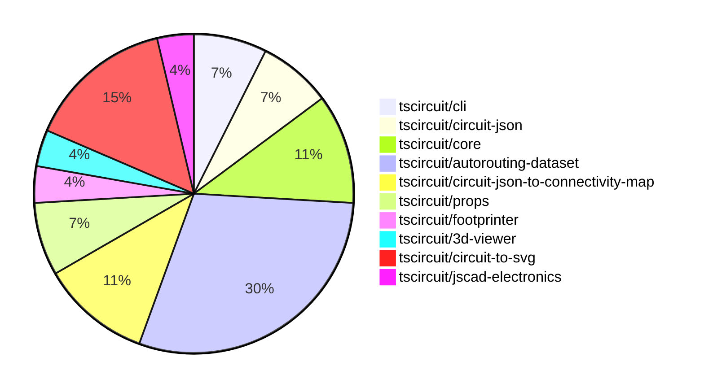

# contribution-tracker

Generates weekly contribution overviews for tscircuit contributors. Check out all
the [contribution overviews here](./contribution-overviews/)

* All PRs in the tscircuit org are scanned/summarized via Claude Haiku
* Claude classifies each Diff/PR as a Major, Minor or Tiny contribution
* All the PRs, summaries, and classifications are organized into charts and tables

The current week is shown below. There are 3 major sections:

* [Contributor Overview](#contributor-overview)
* [PRs by Repository](#prs-by-repository)
* [PRs by Contributor](#changes-by-contributor)

## Current Week

<!-- START_CURRENT_WEEK -->

# Contribution Overview 2024-09-14

## PRs by Repository

## Contributor Overview

| Contributor | 🐳 Major | 🐙 Minor | 🐌 Tiny |
|-------------|-------|-------|-------|
| seveibar | 13 | 7 | 0 |
| anas-sarkez | 0 | 1 | 0 |
| ShiboSoftwareDev | 3 | 0 | 0 |
| abhijitxy | 1 | 0 | 0 |
| imrishabh18 | 1 | 1 | 0 |

## Changes by Repository

### [tscircuit/cli](https://github.com/tscircuit/cli)

| PR # | Impact | Contributor | Description |
|------|--------|-------------|-------------|
| [#185](https://github.com/tscircuit/cli/pull/185) | 🐳 Major | seveibar | Fix Gerber exporting and add tests for Gerber export |
| [#179](https://github.com/tscircuit/cli/pull/179) | 🐳 Major | seveibar | Updated the configuration for the macrokeypad project, including changes to file ignores, manual trace hints, and CSS styles. |

### [tscircuit/circuit-json](https://github.com/tscircuit/circuit-json)

| PR # | Impact | Contributor | Description |
|------|--------|-------------|-------------|
| [#44](https://github.com/tscircuit/circuit-json/pull/44) | 🐳 Major | seveibar | Update package dependencies and fix the naming of fabrication note/path ids |
| [#46](https://github.com/tscircuit/circuit-json/pull/46) | 🐳 Major | seveibar | Updating naming convention, switch to bun, switch AnySoupElement to AnyCircuitElement with deprecated comments |

### [tscircuit/core](https://github.com/tscircuit/core)

| PR # | Impact | Contributor | Description |
|------|--------|-------------|-------------|
| [#90](https://github.com/tscircuit/core/pull/90) | 🐳 Major | seveibar | Possible fix for traces switching layers accidentally, cleanup trace code, add test for 9 key keyboard |
| [#89](https://github.com/tscircuit/core/pull/89) | 🐳 Major | seveibar | Enable goalbox optimization in the Trace component |
| [#86](https://github.com/tscircuit/core/pull/86) | 🐙 Minor | seveibar | Upgrade the version of `@tscircuit/infgrid-ijump-astar` dependency in the `package.json` file. |

### [tscircuit/autorouting-dataset](https://github.com/tscircuit/autorouting-dataset)

| PR # | Impact | Contributor | Description |
|------|--------|-------------|-------------|
| [#73](https://github.com/tscircuit/autorouting-dataset/pull/73) | 🐳 Major | seveibar | Introduce Github Action Benchmarks to automatically run and update algorithm benchmarks. |
| [#72](https://github.com/tscircuit/autorouting-dataset/pull/72) | 🐳 Major | seveibar | Finish the implementation of the goal box feature for the GeneralizedAstar algorithm, including preprocessing the connection before solving and postprocessing the result to update the PCB connectivity map. |
| [#71](https://github.com/tscircuit/autorouting-dataset/pull/71) | 🐳 Major | seveibar | This pull request introduces changes to the calculation of goal boxes for both targets, finds the optimal starting and ending points, and loads them into the input. It also includes a snapshot "worst case" example to fix. |
| [#69](https://github.com/tscircuit/autorouting-dataset/pull/69) | 🐳 Major | seveibar | Introduce a new interface `ConnectionWithGoalAlternatives` and related functions to handle connections with alternative goal boxes. |
| [#66](https://github.com/tscircuit/autorouting-dataset/pull/66) | 🐳 Major | seveibar | Adds vias for PCB trace routes in the solution soup. |
| [#77](https://github.com/tscircuit/autorouting-dataset/pull/77) | 🐙 Minor | seveibar | Add a new configuration parameter `minTraceWidth` to control the minimum width of the generated trace. |
| [#74](https://github.com/tscircuit/autorouting-dataset/pull/74) | 🐙 Minor | seveibar | Fix a dependency issue that was breaking the build for the 'bun-build-infgrid' GitHub workflow. |
| [#67](https://github.com/tscircuit/autorouting-dataset/pull/67) | 🐙 Minor | seveibar | Added a snapshot SVG file for Keyboard Sample 7 against the multilayer autorouter. |

### [tscircuit/circuit-json-to-connectivity-map](https://github.com/tscircuit/circuit-json-to-connectivity-map)

| PR # | Impact | Contributor | Description |
|------|--------|-------------|-------------|
| [#4](https://github.com/tscircuit/circuit-json-to-connectivity-map/pull/4) | 🐳 Major | seveibar | Add support for adding new connections to an existing connectivity map |
| [#3](https://github.com/tscircuit/circuit-json-to-connectivity-map/pull/3) | 🐳 Major | seveibar | Implement a PCB Connectivity Map feature to analyze the physical connections between PCB ports and traces. |
| [#5](https://github.com/tscircuit/circuit-json-to-connectivity-map/pull/5) | 🐙 Minor | seveibar | Add support for initializing an empty PCB connectivity map |

### [tscircuit/props](https://github.com/tscircuit/props)

| PR # | Impact | Contributor | Description |
|------|--------|-------------|-------------|
| [#51](https://github.com/tscircuit/props/pull/51) | 🐙 Minor | seveibar | Add a `defaultTraceWidth` prop to the `Board` and `Group` components to allow setting the default trace width. |
| [#50](https://github.com/tscircuit/props/pull/50) | 🐙 Minor | seveibar | Add `key` as an optional parameter for `trace` props |

### [tscircuit/footprinter](https://github.com/tscircuit/footprinter)

| PR # | Impact | Contributor | Description |
|------|--------|-------------|-------------|
| [#37](https://github.com/tscircuit/footprinter/pull/37) | 🐙 Minor | anas-sarkez | Update the `circuit-to-svg` dependency and change the SVG styles |

### [tscircuit/3d-viewer](https://github.com/tscircuit/3d-viewer)

| PR # | Impact | Contributor | Description |
|------|--------|-------------|-------------|
| [#17](https://github.com/tscircuit/3d-viewer/pull/17) | 🐳 Major | ShiboSoftwareDev | Implemented a function to create a 3D board geometry with a custom outline. |

### [tscircuit/circuit-to-svg](https://github.com/tscircuit/circuit-to-svg)

| PR # | Impact | Contributor | Description |
|------|--------|-------------|-------------|
| [#73](https://github.com/tscircuit/circuit-to-svg/pull/73) | 🐳 Major | ShiboSoftwareDev | Introduces the ability to draw PCB boards with a rectangular and outlined shape. |
| [#69](https://github.com/tscircuit/circuit-to-svg/pull/69) | 🐳 Major | ShiboSoftwareDev | Implemented colored fabrication note path/text |
| [#70](https://github.com/tscircuit/circuit-to-svg/pull/70) | 🐳 Major | imrishabh18 | Adds support for rendering PCB vias in the circuit-to-pcb-svg conversion. |
| [#71](https://github.com/tscircuit/circuit-to-svg/pull/71) | 🐙 Minor | imrishabh18 | Update the deprecated name of the `AnySoupElement` type to `AnyCircuitElement` in the code and documentation. |

### [tscircuit/jscad-electronics](https://github.com/tscircuit/jscad-electronics)

| PR # | Impact | Contributor | Description |
|------|--------|-------------|-------------|
| [#35](https://github.com/tscircuit/jscad-electronics/pull/35) | 🐳 Major | abhijitxy | Adds a new component for the SOT-723 package. |

## Changes by Contributor

### [seveibar](https://github.com/seveibar)

| PR # | Impact | Description |
|------|--------|-------------|
| [#185](https://github.com/tscircuit/cli/pull/185) | 🐳 Major | Fix Gerber exporting and add tests for Gerber export |
| [#179](https://github.com/tscircuit/cli/pull/179) | 🐳 Major | Updated the configuration for the macrokeypad project, including changes to file ignores, manual trace hints, and CSS styles. |
| [#44](https://github.com/tscircuit/circuit-json/pull/44) | 🐳 Major | Update package dependencies and fix the naming of fabrication note/path ids |
| [#46](https://github.com/tscircuit/circuit-json/pull/46) | 🐳 Major | Updating naming convention, switch to bun, switch AnySoupElement to AnyCircuitElement with deprecated comments |
| [#90](https://github.com/tscircuit/core/pull/90) | 🐳 Major | Possible fix for traces switching layers accidentally, cleanup trace code, add test for 9 key keyboard |
| [#89](https://github.com/tscircuit/core/pull/89) | 🐳 Major | Enable goalbox optimization in the Trace component |
| [#73](https://github.com/tscircuit/autorouting-dataset/pull/73) | 🐳 Major | Introduce Github Action Benchmarks to automatically run and update algorithm benchmarks. |
| [#72](https://github.com/tscircuit/autorouting-dataset/pull/72) | 🐳 Major | Finish the implementation of the goal box feature for the GeneralizedAstar algorithm, including preprocessing the connection before solving and postprocessing the result to update the PCB connectivity map. |
| [#71](https://github.com/tscircuit/autorouting-dataset/pull/71) | 🐳 Major | This pull request introduces changes to the calculation of goal boxes for both targets, finds the optimal starting and ending points, and loads them into the input. It also includes a snapshot "worst case" example to fix. |
| [#69](https://github.com/tscircuit/autorouting-dataset/pull/69) | 🐳 Major | Introduce a new interface `ConnectionWithGoalAlternatives` and related functions to handle connections with alternative goal boxes. |
| [#66](https://github.com/tscircuit/autorouting-dataset/pull/66) | 🐳 Major | Adds vias for PCB trace routes in the solution soup. |
| [#4](https://github.com/tscircuit/circuit-json-to-connectivity-map/pull/4) | 🐳 Major | Add support for adding new connections to an existing connectivity map |
| [#3](https://github.com/tscircuit/circuit-json-to-connectivity-map/pull/3) | 🐳 Major | Implement a PCB Connectivity Map feature to analyze the physical connections between PCB ports and traces. |
| [#51](https://github.com/tscircuit/props/pull/51) | 🐙 Minor | Add a `defaultTraceWidth` prop to the `Board` and `Group` components to allow setting the default trace width. |
| [#50](https://github.com/tscircuit/props/pull/50) | 🐙 Minor | Add `key` as an optional parameter for `trace` props |
| [#86](https://github.com/tscircuit/core/pull/86) | 🐙 Minor | Upgrade the version of `@tscircuit/infgrid-ijump-astar` dependency in the `package.json` file. |
| [#77](https://github.com/tscircuit/autorouting-dataset/pull/77) | 🐙 Minor | Add a new configuration parameter `minTraceWidth` to control the minimum width of the generated trace. |
| [#74](https://github.com/tscircuit/autorouting-dataset/pull/74) | 🐙 Minor | Fix a dependency issue that was breaking the build for the 'bun-build-infgrid' GitHub workflow. |
| [#67](https://github.com/tscircuit/autorouting-dataset/pull/67) | 🐙 Minor | Added a snapshot SVG file for Keyboard Sample 7 against the multilayer autorouter. |
| [#5](https://github.com/tscircuit/circuit-json-to-connectivity-map/pull/5) | 🐙 Minor | Add support for initializing an empty PCB connectivity map |

### [anas-sarkez](https://github.com/anas-sarkez)

| PR # | Impact | Description |
|------|--------|-------------|
| [#37](https://github.com/tscircuit/footprinter/pull/37) | 🐙 Minor | Update the `circuit-to-svg` dependency and change the SVG styles |

### [ShiboSoftwareDev](https://github.com/ShiboSoftwareDev)

| PR # | Impact | Description |
|------|--------|-------------|
| [#17](https://github.com/tscircuit/3d-viewer/pull/17) | 🐳 Major | Implemented a function to create a 3D board geometry with a custom outline. |
| [#73](https://github.com/tscircuit/circuit-to-svg/pull/73) | 🐳 Major | Introduces the ability to draw PCB boards with a rectangular and outlined shape. |
| [#69](https://github.com/tscircuit/circuit-to-svg/pull/69) | 🐳 Major | Implemented colored fabrication note path/text |

### [abhijitxy](https://github.com/abhijitxy)

| PR # | Impact | Description |
|------|--------|-------------|
| [#35](https://github.com/tscircuit/jscad-electronics/pull/35) | 🐳 Major | Adds a new component for the SOT-723 package. |

### [imrishabh18](https://github.com/imrishabh18)

| PR # | Impact | Description |
|------|--------|-------------|
| [#70](https://github.com/tscircuit/circuit-to-svg/pull/70) | 🐳 Major | Adds support for rendering PCB vias in the circuit-to-pcb-svg conversion. |
| [#71](https://github.com/tscircuit/circuit-to-svg/pull/71) | 🐙 Minor | Update the deprecated name of the `AnySoupElement` type to `AnyCircuitElement` in the code and documentation. |

<!-- END_CURRENT_WEEK -->
