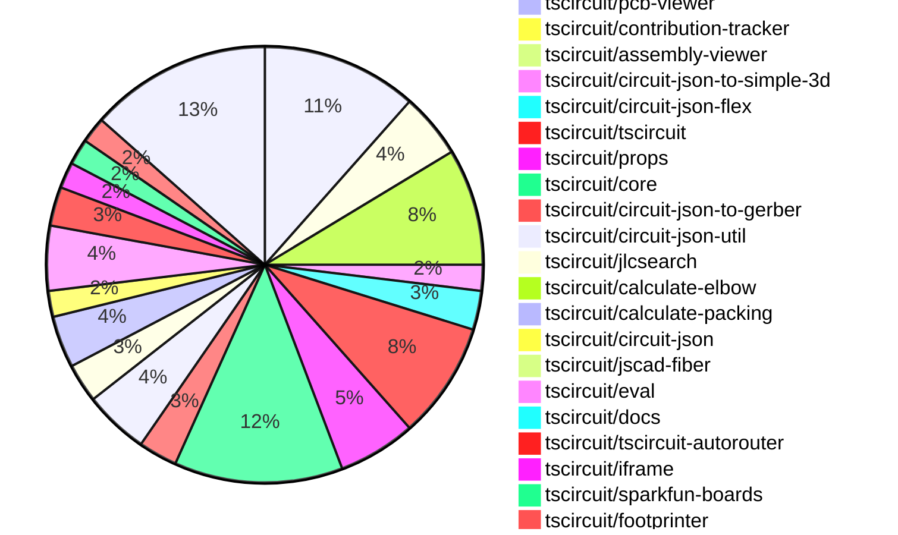
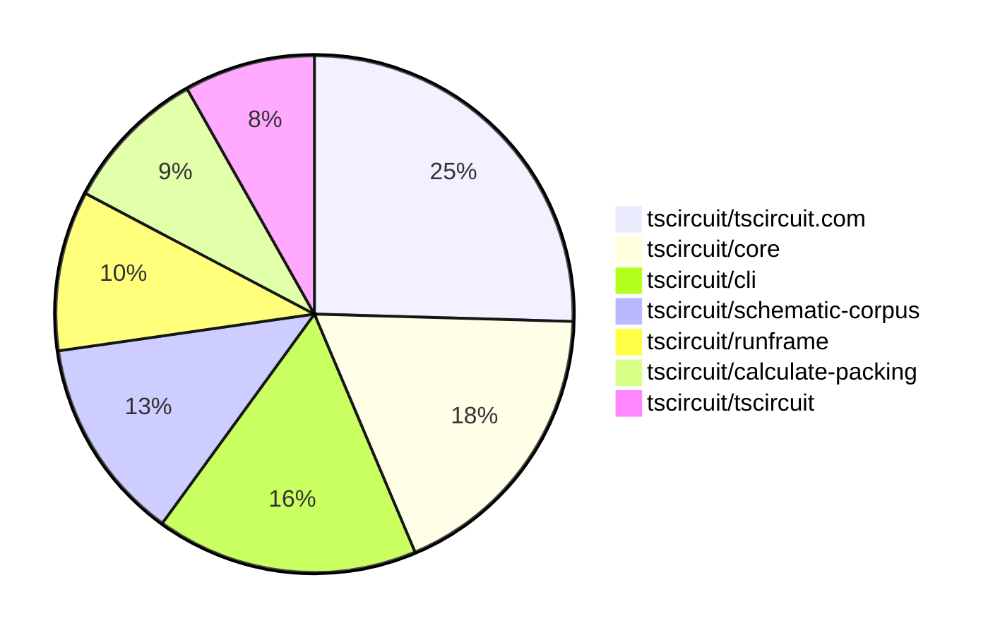

# contribution-tracker

[contributions.tscircuit.com](https://contributions.tscircuit.com) ・ [tscircuit.com](https://tscircuit.com) ・ [Contribution Overviews](./contribution-overviews/) ・ [Changelogs](./changelogs/)

Generates weekly contribution overviews for tscircuit contributors. Check out all
the [contribution overviews here](./contribution-overviews/)
You can find AI-generated monthly changelogs in the [changelogs directory](./changelogs/).

- All PRs in the tscircuit org are scanned/summarized via an LLM
- The LLM classifies each Diff/PR as into a set of attributes for scoring
- All the PRs, summaries, and classifications are organized into charts and tables for [the website](https://contributions.tscircuit.com)

> Want to run locally? See the [Development Section](#development)

The current week is shown below. There are 3 major sections:

- [Contributor Overview](#contributor-overview)
- [PRs by Repository](#prs-by-repository)
- [PRs by Contributor](#changes-by-contributor)

## Current Week

<!-- START_CURRENT_WEEK -->

# Contribution Overview 2025-07-23

## PRs by Repository



## Contributor Overview

| Contributor | 🐳 Major | 🐙 Minor | 🐌 Tiny | ⭐ | Issues Created | Discussion Contributions |
|-------------|---------|---------|---------|-----|----------------|--------------------------|
| [seveibar](#seveibar) | 9 | 2 | 36 | 👑 | 0 | 0🔹 0🔶 0💎 |
| [ArnavK-09](#ArnavK-09) | 8 | 1 | 9 | ⭐⭐⭐ | 0 | 0🔹 0🔶 0💎 |
| [Abse2001](#Abse2001) | 1 | 1 | 8 | ⭐⭐ | 0 | 0🔹 0🔶 0💎 |
| [imrishabh18](#imrishabh18) | 1 | 0 | 16 | ⭐⭐ | 0 | 0🔹 0🔶 0💎 |
| [MustafaMulla29](#MustafaMulla29) | 0 | 0 | 11 | ⭐ | 0 | 0🔹 0🔶 0💎 |
| [ShiboSoftwareDev](#ShiboSoftwareDev) | 0 | 1 | 1 | ⭐ | 0 | 0🔹 0🔶 0💎 |
| [abimaelmartell](#abimaelmartell) | 0 | 2 | 1 | ⭐ | 0 | 0🔹 0🔶 0💎 |
| [tscircuitbot](#tscircuitbot) | 0 | 0 | 2 |  | 0 | 0🔹 0🔶 0💎 |
| [techmannih](#techmannih) | 0 | 0 | 1 |  | 0 | 0🔹 0🔶 0💎 |
| [andrii-balitskyi](#andrii-balitskyi) | 0 | 0 | 1 |  | 0 | 0🔹 0🔶 0💎 |

### Discussion Contribution Legend

- 🔹 Normal Comments: Basic participation with minimal effort
- 🔶 Great Informative Comments: Thoughtful participation that adds value
- 💎 Incredible Comments: Exceptional participation with high-quality content

## Review Table

[reviews-received-hover]: ## "Number of reviews received for PRs for this contributor"
[approvals-received-hover]: ## "Number of approvals received for PRs this contributor authored"
[rejections-received-hover]: ## "Number of rejections received for PRs this contributor authored"
[prs-opened-hover]: ## "Number of PRs opened by this contributor"
[issues-created-hover]: ## "Number of issues created by this contributor"
[bountied-issues-hover]: ## "Number of issues this contributor created with a bounty"
[bountied-issue-$-hover]: ## "Total bounty amount placed on issues authored by this contributor"

| Contributor | Reviews Received | Approvals Received | Rejections Received | Approvals | Rejections | PRs Opened | PRs Merged | Score | Issues Created | Bountied Issues | Bountied Issue $ |
|---|---|---|---|---|---|---|---|---|---|---|---|
| [ArnavK-09](#ArnavK-09) | 21 | 18 | 0 | 0 | 0 | 19 | 19 | 41.5 | 0 | 0 | 0 |
| [seveibar](#seveibar) | 18 | 0 | 0 | 37 | 1 | 53 | 47 | 68 | 0 | 0 | 0 |
| [imrishabh18](#imrishabh18) | 15 | 8 | 1 | 0 | 0 | 20 | 17 | 17 | 0 | 0 | 0 |
| [cursor[bot]](#cursor[bot]) | 0 | 0 | 0 | 0 | 0 | 0 | 0 | 0 | 0 | 0 | 0 |
| [Abse2001](#Abse2001) | 8 | 7 | 0 | 11 | 0 | 11 | 10 | 23 | 0 | 0 | 0 |
| [ShiboSoftwareDev](#ShiboSoftwareDev) | 3 | 1 | 0 | 4 | 0 | 3 | 2 | 6.5 | 0 | 0 | 0 |
| [graphite-app[bot]](#graphite-app[bot]) | 0 | 0 | 0 | 0 | 0 | 0 | 0 | 0 | 0 | 0 | 0 |
| [techmannih](#techmannih) | 4 | 2 | 0 | 0 | 0 | 1 | 1 | 1 | 0 | 0 | 0 |
| [andrii-balitskyi](#andrii-balitskyi) | 3 | 1 | 0 | 0 | 0 | 2 | 1 | 1 | 0 | 0 | 0 |
| [abimaelmartell](#abimaelmartell) | 4 | 3 | 0 | 0 | 0 | 6 | 3 | 5 | 0 | 0 | 0 |
| [copilot-pull-request-reviewer[bot]](#copilot-pull-request-reviewer[bot]) | 0 | 0 | 0 | 0 | 0 | 0 | 0 | 0 | 0 | 0 | 0 |
| [tscircuitbot](#tscircuitbot) | 0 | 0 | 0 | 0 | 0 | 26 | 2 | 2 | 0 | 0 | 0 |
| [MustafaMulla29](#MustafaMulla29) | 12 | 12 | 0 | 0 | 0 | 11 | 11 | 10 | 0 | 0 | 0 |

## Top 7 Repositories by Contribution Points



## Changes by Repository

### [tscircuit/tscircuit.com](https://github.com/tscircuit/tscircuit.com)

| PR # | Impact | Rating | Contributor | Description |
|------|--------|--------|-------------|-------------|
| [#1508](https://github.com/tscircuit/tscircuit.com/pull/1508) | 🐳 Major | ⭐⭐⭐ | ArnavK-09 | Add validation to ensure circuit JSON exists before allowing AI review request, preventing errors when required data is missing. |
| [#1506](https://github.com/tscircuit/tscircuit.com/pull/1506) | 🐳 Major | ⭐⭐⭐ | ArnavK-09 | Automatically generates a package name based on the users account and existing packages if no name is provided. |
| [#1505](https://github.com/tscircuit/tscircuit.com/pull/1505) | 🐳 Major | ⭐⭐⭐ | ArnavK-09 | Fixes real-time updates for package details when files change during detail updates. |
| [#1504](https://github.com/tscircuit/tscircuit.com/pull/1504) | 🐳 Major | ⭐⭐⭐ | ArnavK-09 | Adds a click handler for the license file in the sidebar, enabling automatic viewing of the license file when clicked. |
| [#1501](https://github.com/tscircuit/tscircuit.com/pull/1501) | 🐳 Major | ⭐⭐⭐ | ArnavK-09 | Adds file renaming functionality to the file management system, allowing users to rename files within the application. |
| [#1509](https://github.com/tscircuit/tscircuit.com/pull/1509) | 🐙 Minor | ⭐⭐ | ArnavK-09 | Fixes incorrect component fetching in CodeEditorHeader by using the actual component name from props instead of a hardcoded value. |

<details>
<summary>🐌 Tiny Contributions (6)</summary>

| PR # | Impact | Contributor | Description |
|------|--------|-------------|-------------|
| [#1507](https://github.com/tscircuit/tscircuit.com/pull/1507) | 🐌 Tiny | ArnavK-09 | Adjusts loading state height in CodeAndPreview component, modifies dropdown menu item padding in main-content-header, and redesigns error boundary with improved visuals and reload option. |
| [#1512](https://github.com/tscircuit/tscircuit.com/pull/1512) | 🐌 Tiny | imrishabh18 | Sets the eval version to 0.0.264 temporarily to avoid issues with the latest eval version until it is stable |
| [#1503](https://github.com/tscircuit/tscircuit.com/pull/1503) | 🐌 Tiny | imrishabh18 | Add the packages marked and react-error-boundary (required by runframe) |
| [#1513](https://github.com/tscircuit/tscircuit.com/pull/1513) | 🐌 Tiny | seveibar | Updates the eval version to the latest by enabling the forceLatestEvalVersion flag in the CodeAndPreview component. |
| [#1502](https://github.com/tscircuit/tscircuit.com/pull/1502) | 🐌 Tiny | Abse2001 | Moves dotenv configuration from the entrypoint to vite.config for better environment variable management. |
| [#1510](https://github.com/tscircuit/tscircuit.com/pull/1510) | 🐌 Tiny | abimaelmartell | Fixes the import functionality to use JLCPCB Part Number instead of just the component name. |

</details>

### [tscircuit/runframe](https://github.com/tscircuit/runframe)

| PR # | Impact | Rating | Contributor | Description |
|------|--------|--------|-------------|-------------|
| [#914](https://github.com/tscircuit/runframe/pull/914) | 🐳 Major | ⭐⭐⭐ | ArnavK-09 | Adds utilities for converting Uint8Array to base64 and for encoding file maps, enabling the sharing of multiple files in error reports. |
| [#898](https://github.com/tscircuit/runframe/pull/898) | 🐳 Major | ⭐⭐⭐ | ArnavK-09 | img width1847 height988 altimage srchttps:github.comuser-attachmentsassetse09727d3-52dc-413d-a701-0d41b629438a  https:github.comuser-attachmentsassets7139446f-7066-4594-8b9c-f40db8ac0acd |

<details>
<summary>🐌 Tiny Contributions (3)</summary>

| PR # | Impact | Contributor | Description |
|------|--------|-------------|-------------|
| [#908](https://github.com/tscircuit/runframe/pull/908) | 🐌 Tiny | ArnavK-09 | Changes placeholder text in FileSelectorCombobox and refactors state variable names for clarity in file selection logic. |
| [#925](https://github.com/tscircuit/runframe/pull/925) | 🐌 Tiny | imrishabh18 | Resolves eval version to the numeric latest version instead of the literal string latest. |
| [#915](https://github.com/tscircuit/runframe/pull/915) | 🐌 Tiny | imrishabh18 | Adds utilities for encoding file maps and enhances issue reporting links in the RunFrame preview components. |

</details>

### [tscircuit/cli](https://github.com/tscircuit/cli)

| PR # | Impact | Rating | Contributor | Description |
|------|--------|--------|-------------|-------------|
| [#294](https://github.com/tscircuit/cli/pull/294) | 🐳 Major | ⭐⭐⭐ | ArnavK-09 | Add recursive search for entrypoints in child directories with depth limit, improve validation for project directory and file paths, add constants for allowed entrypoint names and search limits, better error handling and validation messages, remove unused saveProjectConfig import, support listing all files in root dir where cmd ran |
| [#299](https://github.com/tscircuit/cli/pull/299) | 🐳 Major | ⭐⭐⭐ | seveibar | Adds an interactive command to the CLI for importing components from JLCPCB or the tscircuit registry. |
| [#298](https://github.com/tscircuit/cli/pull/298) | 🐳 Major | ⭐⭐⭐ | seveibar | Extends the tsci search command to query the JLC search API and display star counts for registry results, while removing the interactive selection part of the search command. |

<details>
<summary>🐌 Tiny Contributions (6)</summary>

| PR # | Impact | Contributor | Description |
|------|--------|-------------|-------------|
| [#293](https://github.com/tscircuit/cli/pull/293) | 🐌 Tiny | ArnavK-09 | Updates the tscircuitrunframe dependency to version 0.0.722 to resolve development command issues. |
| [#292](https://github.com/tscircuit/cli/pull/292) | 🐌 Tiny | ArnavK-09 | Replaces hardcoded entrypoint path with dynamic retrieval using getEntrypoint function in development command. |
| [#291](https://github.com/tscircuit/cli/pull/291) | 🐌 Tiny | ArnavK-09 | Updates the version of the runframe and simple-3d-svg dependencies in the project, ensuring compatibility and access to the latest features. |
| [#297](https://github.com/tscircuit/cli/pull/297) | 🐌 Tiny | seveibar | Fixes the production outage by importing tscircuit dependencies from userland during the build process, ensuring that the correct version is utilized and preventing build failures. |
| [#296](https://github.com/tscircuit/cli/pull/296) | 🐌 Tiny | seveibar | Adds an explicit script for bun build to reduce bundling issues and prevents bundling of typescript. |
| [#295](https://github.com/tscircuit/cli/pull/295) | 🐌 Tiny | Abse2001 | Makes the tscircuit dependency optional to resolve version mismatch issues in the project. |

</details>

### [tscircuit/pcb-viewer](https://github.com/tscircuit/pcb-viewer)


<details>
<summary>🐌 Tiny Contributions (1)</summary>

| PR # | Impact | Contributor | Description |
|------|--------|-------------|-------------|
| [#348](https://github.com/tscircuit/pcb-viewer/pull/348) | 🐌 Tiny | ArnavK-09 | Adds react, react-dom, react-reconciler, and react-reconciler-18 as external dependencies in the build configuration. |

</details>

### [tscircuit/contribution-tracker](https://github.com/tscircuit/contribution-tracker)


<details>
<summary>🐌 Tiny Contributions (1)</summary>

| PR # | Impact | Contributor | Description |
|------|--------|-------------|-------------|
| [#205](https://github.com/tscircuit/contribution-tracker/pull/205) | 🐌 Tiny | ArnavK-09 | Clarify that PR assessment descriptions should use plain text only without any hyperlinks or image links to maintain consistency in output format. |

</details>

### [tscircuit/assembly-viewer](https://github.com/tscircuit/assembly-viewer)


<details>
<summary>🐌 Tiny Contributions (1)</summary>

| PR # | Impact | Contributor | Description |
|------|--------|-------------|-------------|
| [#6](https://github.com/tscircuit/assembly-viewer/pull/6) | 🐌 Tiny | ArnavK-09 | Changes the background color of the AssemblyViewer component from F5F1ED to FFFFFF. |

</details>

### [tscircuit/circuit-json-to-simple-3d](https://github.com/tscircuit/circuit-json-to-simple-3d)

| PR # | Impact | Rating | Contributor | Description |
|------|--------|--------|-------------|-------------|
| [#7](https://github.com/tscircuit/circuit-json-to-simple-3d/pull/7) | 🐳 Major | ⭐⭐⭐ | seveibar | Integrates 3D model support into the rendering process for circuit designs, allowing for STL and OBJ models to be displayed alongside PCB components. |

<details>
<summary>🐌 Tiny Contributions (1)</summary>

| PR # | Impact | Contributor | Description |
|------|--------|-------------|-------------|
| [#8](https://github.com/tscircuit/circuit-json-to-simple-3d/pull/8) | 🐌 Tiny | ArnavK-09 | Fixes the lock file to ensure that npm publish can be resumed without issues. |

</details>

### [tscircuit/circuit-json-flex](https://github.com/tscircuit/circuit-json-flex)

| PR # | Impact | Rating | Contributor | Description |
|------|--------|--------|-------------|-------------|
| [#2](https://github.com/tscircuit/circuit-json-flex/pull/2) | 🐳 Major | ⭐⭐⭐ | imrishabh18 | Adds a new function to layout PCB components using a flex-box algorithm, allowing for dynamic positioning of components within a specified container size. |

<details>
<summary>🐌 Tiny Contributions (2)</summary>

| PR # | Impact | Contributor | Description |
|------|--------|-------------|-------------|
| [#4](https://github.com/tscircuit/circuit-json-flex/pull/4) | 🐌 Tiny | imrishabh18 | Adds a build script to package.json for compiling TypeScript files into a distributable format using tsup-node. |
| [#3](https://github.com/tscircuit/circuit-json-flex/pull/3) | 🐌 Tiny | imrishabh18 | Adds support for subcircuit groups in the layout of circuit JSON, allowing for better organization and rendering of PCB components within groups. |

</details>

### [tscircuit/tscircuit](https://github.com/tscircuit/tscircuit)


<details>
<summary>🐌 Tiny Contributions (9)</summary>

| PR # | Impact | Contributor | Description |
|------|--------|-------------|-------------|
| [#723](https://github.com/tscircuit/tscircuit/pull/723) | 🐌 Tiny | imrishabh18 | Updates the version of the tscircuitcircuit-json-util package from 0.0.54 to 0.0.57 in package.json |
| [#718](https://github.com/tscircuit/tscircuit/pull/718) | 🐌 Tiny | imrishabh18 | Updates the versions of tscircuitcore and tscircuitprops in package.json to the latest releases. |
| [#714](https://github.com/tscircuit/tscircuit/pull/714) | 🐌 Tiny | imrishabh18 | Updates the tscircuitcore dependency version from 0.0.574 to 0.0.576 in package.json |
| [#722](https://github.com/tscircuit/tscircuit/pull/722) | 🐌 Tiny | seveibar | Adds new dependencies for packing and flex support, and updates existing dependencies in the project. |
| [#721](https://github.com/tscircuit/tscircuit/pull/721) | 🐌 Tiny | seveibar | Updates the CLI dependency to fix an outage caused by a userland import issue. |
| [#720](https://github.com/tscircuit/tscircuit/pull/720) | 🐌 Tiny | seveibar | Fixes libonly package generation and adds jscad-fiber and jscad-planner dependencies to the project. |
| [#719](https://github.com/tscircuit/tscircuit/pull/719) | 🐌 Tiny | seveibar | Adds a new workflow to publish a libonly version of the package, creating a separate package.json for it. |
| [#717](https://github.com/tscircuit/tscircuit/pull/717) | 🐌 Tiny | seveibar | Updates the CLI and packages to lock to a single version of react-reconciler, ensuring consistent behavior across the application. |
| [#715](https://github.com/tscircuit/tscircuit/pull/715) | 🐌 Tiny | Abse2001 | Updates the tscircuitcli dependency version from 0.1.179 to 0.1.185 in package.json and adds yalc. and .yalc to .gitignore. |

</details>

### [tscircuit/props](https://github.com/tscircuit/props)


<details>
<summary>🐌 Tiny Contributions (6)</summary>

| PR # | Impact | Contributor | Description |
|------|--------|-------------|-------------|
| [#333](https://github.com/tscircuit/props/pull/333) | 🐌 Tiny | imrishabh18 | Adds new justifyContent values (space-between, space-around, space-evenly) to the layout configuration for improved layout options. |
| [#337](https://github.com/tscircuit/props/pull/337) | 🐌 Tiny | seveibar | Adds a layers option in BoardProps with 2 or 4 as allowed values, updates documentation, and upgrades the expect-type dev dependency. |
| [#336](https://github.com/tscircuit/props/pull/336) | 🐌 Tiny | seveibar | Adds support for a relative layout mode in group layout configuration, including documentation and tests for parsing the new layout mode. |
| [#335](https://github.com/tscircuit/props/pull/335) | 🐌 Tiny | seveibar | Adds a step to format the README file using Prettier after it is generated by the script. |
| [#332](https://github.com/tscircuit/props/pull/332) | 🐌 Tiny | seveibar | Adds new layout properties for packing strategy in layout configuration. |
| [#331](https://github.com/tscircuit/props/pull/331) | 🐌 Tiny | seveibar | Summary add area options and square sizing to subcircuitGroupProps move board dimension properties into subcircuitGroupProps simplify BoardProps and update generated docs  Testing bun test testsboard.test.ts bun test testsstampboard.test.ts bun test tests |

</details>

### [tscircuit/core](https://github.com/tscircuit/core)

| PR # | Impact | Rating | Contributor | Description |
|------|--------|--------|-------------|-------------|
| [#1087](https://github.com/tscircuit/core/pull/1087) | 🐳 Major | ⭐⭐⭐ | seveibar | Adds PCB packing functionality by implementing calculate-packing and updating properties for layout preparation. |
| [#1101](https://github.com/tscircuit/core/pull/1101) | 🐙 Minor | ⭐⭐ | seveibar | Adds support for board layers in autorouting by exposing subcircuit layer count and utilizing the board layers property for routing decisions. |
| [#1099](https://github.com/tscircuit/core/pull/1099) | 🐙 Minor | ⭐⭐ | seveibar | Populates parent_source_group_id when rendering nested groups and updates circuit-json to the latest version. |
| [#1098](https://github.com/tscircuit/core/pull/1098) | 🐙 Minor | ⭐⭐ | abimaelmartell | Fixes incorrect schematic SVG generation due to miscalculated elbow segments in the calculate-elbow logic for schematic traces. |
| [#1092](https://github.com/tscircuit/core/pull/1092) | 🐙 Minor | ⭐⭐ | abimaelmartell | Fixes incorrect junction placement on schematic traces due to floating-point precision issues, ensuring junctions only appear at actual intersections. |

<details>
<summary>🐌 Tiny Contributions (8)</summary>

| PR # | Impact | Contributor | Description |
|------|--------|-------------|-------------|
| [#1091](https://github.com/tscircuit/core/pull/1091) | 🐌 Tiny | imrishabh18 | Adds support for flex layout within the board component, allowing for dynamic arrangement of child components based on specified justify content properties. |
| [#1088](https://github.com/tscircuit/core/pull/1088) | 🐌 Tiny | imrishabh18 | Adds support for a new PCB layout mode called flex in the Group component, allowing for flexible layout configurations. |
| [#1085](https://github.com/tscircuit/core/pull/1085) | 🐌 Tiny | imrishabh18 | Allows the width and height of the pcb_group to be specified as props, enabling more flexible layout configurations. |
| [#1100](https://github.com/tscircuit/core/pull/1100) | 🐌 Tiny | seveibar | Adds support for nested packing in PCB layout calculations, allowing for packing without requiring connections between components. |
| [#1095](https://github.com/tscircuit/core/pull/1095) | 🐌 Tiny | seveibar | Adds support for rotating packed components in PCB layout. |
| [#1096](https://github.com/tscircuit/core/pull/1096) | 🐌 Tiny | seveibar | Sets the default schematic layout to match-adapt when no layout is specified and no manual placements are present, while skipping auto layout if manual placements exist. |
| [#1093](https://github.com/tscircuit/core/pull/1093) | 🐌 Tiny | seveibar | Add a test for a flex board containing pack-layout groups and update calculate-packing to the latest version. |
| [#1094](https://github.com/tscircuit/core/pull/1094) | 🐌 Tiny | seveibar | Enhances the error message for unsupported components by providing a link to documentation and hints for users. |

</details>

### [tscircuit/circuit-json-to-gerber](https://github.com/tscircuit/circuit-json-to-gerber)


<details>
<summary>🐌 Tiny Contributions (3)</summary>

| PR # | Impact | Contributor | Description |
|------|--------|-------------|-------------|
| [#50](https://github.com/tscircuit/circuit-json-to-gerber/pull/50) | 🐌 Tiny | imrishabh18 | Moves circuit-json from dependencies to devDependencies in package.json |
| [#47](https://github.com/tscircuit/circuit-json-to-gerber/pull/47) | 🐌 Tiny | imrishabh18 | Adds a Renovate configuration file to automate dependency updates and manage package rules. |
| [#46](https://github.com/tscircuit/circuit-json-to-gerber/pull/46) | 🐌 Tiny | imrishabh18 | Updates the version of the circuit-json dependency from a wildcard to a specific version (0.0.220) in package.json |

</details>

### [tscircuit/circuit-json-util](https://github.com/tscircuit/circuit-json-util)

| PR # | Impact | Rating | Contributor | Description |
|------|--------|--------|-------------|-------------|
| [#42](https://github.com/tscircuit/circuit-json-util/pull/42) | 🐳 Major | ⭐⭐⭐ | seveibar | Adds the getCircuitJsonTree function for building a tree structure of circuit elements and fixes the buildSubtree function to ignore parent_source_group_id. |

<details>
<summary>🐌 Tiny Contributions (4)</summary>

| PR # | Impact | Contributor | Description |
|------|--------|-------------|-------------|
| [#45](https://github.com/tscircuit/circuit-json-util/pull/45) | 🐌 Tiny | seveibar | Improves handling of groupless cases by allowing empty groups to return a tree without sourceGroup, while including pcb_component as a subelement of sourceComponent. |
| [#44](https://github.com/tscircuit/circuit-json-util/pull/44) | 🐌 Tiny | seveibar | Changes the source_group_id property in the options parameter from a required string to an optional string. |
| [#43](https://github.com/tscircuit/circuit-json-util/pull/43) | 🐌 Tiny | seveibar | Fixes issues in the getCircuitJsonTree function by ensuring child nodes are properly initialized and improves the tree structure generation. |
| [#40](https://github.com/tscircuit/circuit-json-util/pull/40) | 🐌 Tiny | seveibar | Adds a utility function to reposition PCB components and their children within the circuit JSON structure. |

</details>

### [tscircuit/jlcsearch](https://github.com/tscircuit/jlcsearch)

| PR # | Impact | Rating | Contributor | Description |
|------|--------|--------|-------------|-------------|
| [#66](https://github.com/tscircuit/jlcsearch/pull/66) | 🐳 Major | ⭐⭐⭐ | seveibar | Adds relay support by introducing a new relay component and related database schema, along with a new route for listing relays. |

<details>
<summary>🐌 Tiny Contributions (2)</summary>

| PR # | Impact | Contributor | Description |
|------|--------|-------------|-------------|
| [#68](https://github.com/tscircuit/jlcsearch/pull/68) | 🐌 Tiny | seveibar | Adds a new derived table for USB-C connectors, sets up the table in the derived table script, creates a new route and documentation for USB-C connectors, links them from the index page, updates database types, updates the Kysely library to the latest version, and adds tests for the new route. |
| [#67](https://github.com/tscircuit/jlcsearch/pull/67) | 🐌 Tiny | seveibar | Adds a new page for analog switches, including a route for filtering and displaying data, along with tests for the new functionality. |

</details>

### [tscircuit/calculate-elbow](https://github.com/tscircuit/calculate-elbow)

| PR # | Impact | Rating | Contributor | Description |
|------|--------|--------|-------------|-------------|
| [#4](https://github.com/tscircuit/calculate-elbow/pull/4) | 🐳 Major | ⭐⭐⭐ | seveibar | Fixes elbow calculation for x- to y cases when the start point is right and above the destination by implementing an overshooting strategy and adds a test for this scenario. |

### [tscircuit/calculate-packing](https://github.com/tscircuit/calculate-packing)

| PR # | Impact | Rating | Contributor | Description |
|------|--------|--------|-------------|-------------|
| [#5](https://github.com/tscircuit/calculate-packing/pull/5) | 🐳 Major | ⭐⭐⭐ | seveibar | Adds disconnected pack direction functionality, refactors existing code, and provides an example for disconnected direction implementation. |
| [#3](https://github.com/tscircuit/calculate-packing/pull/3) | 🐳 Major | ⭐⭐⭐ | seveibar | Fixes the issue where candidate components are not being invalidated based on the minGap distance during rotation calculations. |

<details>
<summary>🐌 Tiny Contributions (2)</summary>

| PR # | Impact | Contributor | Description |
|------|--------|-------------|-------------|
| [#4](https://github.com/tscircuit/calculate-packing/pull/4) | 🐌 Tiny | seveibar | Adds support for specifying available rotation degrees for components, allowing for more flexible placement during packing. |
| [#2](https://github.com/tscircuit/calculate-packing/pull/2) | 🐌 Tiny | seveibar | No description provided |

</details>

### [tscircuit/circuit-json](https://github.com/tscircuit/circuit-json)

| PR # | Impact | Rating | Contributor | Description |
|------|--------|--------|-------------|-------------|
| [#244](https://github.com/tscircuit/circuit-json/pull/244) | 🐙 Minor | ⭐⭐ | ShiboSoftwareDev | Defines a voltage source for simulation purposes, applying a voltage difference between two source ports. |

<details>
<summary>🐌 Tiny Contributions (1)</summary>

| PR # | Impact | Contributor | Description |
|------|--------|-------------|-------------|
| [#243](https://github.com/tscircuit/circuit-json/pull/243) | 🐌 Tiny | seveibar | Adds an optional parent_source_group_id field to the source group schema and interface. |

</details>

### [tscircuit/jscad-fiber](https://github.com/tscircuit/jscad-fiber)


<details>
<summary>🐌 Tiny Contributions (1)</summary>

| PR # | Impact | Contributor | Description |
|------|--------|-------------|-------------|
| [#111](https://github.com/tscircuit/jscad-fiber/pull/111) | 🐌 Tiny | seveibar | Adds optional peer dependencies for three libraries, allowing for more flexible usage in projects without requiring all three to be installed. |

</details>

### [tscircuit/eval](https://github.com/tscircuit/eval)


<details>
<summary>🐌 Tiny Contributions (5)</summary>

| PR # | Impact | Contributor | Description |
|------|--------|-------------|-------------|
| [#746](https://github.com/tscircuit/eval/pull/746) | 🐌 Tiny | seveibar | Fixes the issue where the eval function fails to load due to the zod library not being bundled, and adds a version method to the worker for health checks. |
| [#745](https://github.com/tscircuit/eval/pull/745) | 🐌 Tiny | seveibar | Locks the zod library version to 3 in package.json to ensure compatibility and prevent breaking changes from future updates. |
| [#726](https://github.com/tscircuit/eval/pull/726) | 🐌 Tiny | seveibar | Updates the jscad-fiber dependency to version 0.0.82, adding more optional dependencies for enhanced functionality. |
| [#743](https://github.com/tscircuit/eval/pull/743) | 🐌 Tiny | tscircuitbot | Updates the tscircuitcore dependency to version 0.0.587 without introducing new functionality. |
| [#741](https://github.com/tscircuit/eval/pull/741) | 🐌 Tiny | tscircuitbot | Updates the tscircuitcore package to version 0.0.586, along with other related dependency updates in package.json. |

</details>

### [tscircuit/docs](https://github.com/tscircuit/docs)


<details>
<summary>🐌 Tiny Contributions (1)</summary>

| PR # | Impact | Contributor | Description |
|------|--------|-------------|-------------|
| [#104](https://github.com/tscircuit/docs/pull/104) | 🐌 Tiny | seveibar | Documents the jlcsearch.tscircuit.com API in the Web APIs section. |

</details>

### [tscircuit/tscircuit-autorouter](https://github.com/tscircuit/tscircuit-autorouter)


<details>
<summary>🐌 Tiny Contributions (3)</summary>

| PR # | Impact | Contributor | Description |
|------|--------|-------------|-------------|
| [#218](https://github.com/tscircuit/tscircuit-autorouter/pull/218) | 🐌 Tiny | seveibar | Adds a new example for a 4-layer autorouting configuration using the AutoroutingPipelineDebugger component. |
| [#217](https://github.com/tscircuit/tscircuit-autorouter/pull/217) | 🐌 Tiny | seveibar | Moves the convertSrjToGraphicsObject function into lib utilities, exports it from the package index, and updates imports in solver and tests. |
| [#219](https://github.com/tscircuit/tscircuit-autorouter/pull/219) | 🐌 Tiny | Abse2001 | Adds a JSON fixture and a React component to reproduce a bug in the highdensity85 autorouter. |

</details>

### [tscircuit/iframe](https://github.com/tscircuit/iframe)


<details>
<summary>🐌 Tiny Contributions (2)</summary>

| PR # | Impact | Contributor | Description |
|------|--------|-------------|-------------|
| [#5](https://github.com/tscircuit/iframe/pull/5) | 🐌 Tiny | seveibar | Adds documentation for evalVersion and forceLatestEvalVersion props in README and introduces a new format:check script for Biome without write flag. |
| [#4](https://github.com/tscircuit/iframe/pull/4) | 🐌 Tiny | seveibar | Adds evalVersion and forceLatestEvalVersion properties to TscircuitIframeProps for enhanced iframe configuration. |

</details>

### [tscircuit/sparkfun-boards](https://github.com/tscircuit/sparkfun-boards)

| PR # | Impact | Rating | Contributor | Description |
|------|--------|--------|-------------|-------------|
| [#86](https://github.com/tscircuit/sparkfun-boards/pull/86) | 🐳 Major | ⭐⭐⭐ | Abse2001 | Introduces a new circuit board for the SparkFun Line Sensor Breakout QRE1113 Analog, including its schematic and footprint. |
| [#85](https://github.com/tscircuit/sparkfun-boards/pull/85) | 🐙 Minor | ⭐⭐ | Abse2001 | No description provided |

### [tscircuit/footprinter](https://github.com/tscircuit/footprinter)


<details>
<summary>🐌 Tiny Contributions (2)</summary>

| PR # | Impact | Contributor | Description |
|------|--------|-------------|-------------|
| [#333](https://github.com/tscircuit/footprinter/pull/333) | 🐌 Tiny | Abse2001 | Renames the backsidelabel parameter to bottomsidepinlabel in the pinrow definition and related tests. |
| [#322](https://github.com/tscircuit/footprinter/pull/322) | 🐌 Tiny | techmannih | Introduces a new footprint variant for the JST-SH connector, allowing for better integration of this component in PCB designs. |

</details>

### [tscircuit/schematic-corpus](https://github.com/tscircuit/schematic-corpus)


<details>
<summary>🐌 Tiny Contributions (14)</summary>

| PR # | Impact | Contributor | Description |
|------|--------|-------------|-------------|
| [#117](https://github.com/tscircuit/schematic-corpus/pull/117) | 🐌 Tiny | Abse2001 | Adds a new circuit design (design78) to enhance the matchAdapt algorithm functionality. |
| [#116](https://github.com/tscircuit/schematic-corpus/pull/116) | 🐌 Tiny | Abse2001 | Adds a new circuit design (design77) to enhance the matchAdapt algorithm functionality. |
| [#115](https://github.com/tscircuit/schematic-corpus/pull/115) | 🐌 Tiny | Abse2001 | Updates the tscircuit dependency to the latest version, which includes the latest autorouter patch. |
| [#119](https://github.com/tscircuit/schematic-corpus/pull/119) | 🐌 Tiny | MustafaMulla29 | Adds a new design component (design80) to enhance the matchAdapt algorithm functionality. |
| [#118](https://github.com/tscircuit/schematic-corpus/pull/118) | 🐌 Tiny | MustafaMulla29 | Adds a new circuit design (design79) to enhance the matchAdapt algorithm functionality. |
| [#114](https://github.com/tscircuit/schematic-corpus/pull/114) | 🐌 Tiny | MustafaMulla29 | Adds a new circuit design (design76) to enhance the matchAdapt algorithm functionality. |
| [#113](https://github.com/tscircuit/schematic-corpus/pull/113) | 🐌 Tiny | MustafaMulla29 | Adds a new design (design075) to the schematic corpus, which includes a new circuit board layout and connections for a capacitor and chip. |
| [#112](https://github.com/tscircuit/schematic-corpus/pull/112) | 🐌 Tiny | MustafaMulla29 | Adds a new circuit design (design74) to enhance the matchAdapt algorithm functionality. |
| [#111](https://github.com/tscircuit/schematic-corpus/pull/111) | 🐌 Tiny | MustafaMulla29 | Adds a new design component (design73) to enhance the matchAdapt algorithm functionality. |
| [#110](https://github.com/tscircuit/schematic-corpus/pull/110) | 🐌 Tiny | MustafaMulla29 | Adds a new design (design072) to the schematic corpus, which includes a new circuit board layout and connections for components. |
| [#109](https://github.com/tscircuit/schematic-corpus/pull/109) | 🐌 Tiny | MustafaMulla29 | Adds a new design (design071) to the schematic corpus, which includes a new circuit board layout and components for the matchAdapt algorithm. |
| [#107](https://github.com/tscircuit/schematic-corpus/pull/107) | 🐌 Tiny | MustafaMulla29 | Adds a new circuit design (design69) to enhance the matchAdapt algorithm functionality. |
| [#106](https://github.com/tscircuit/schematic-corpus/pull/106) | 🐌 Tiny | MustafaMulla29 | Adds a new circuit design (design68) to enhance the matchAdapt algorithm functionality. |
| [#108](https://github.com/tscircuit/schematic-corpus/pull/108) | 🐌 Tiny | MustafaMulla29 | Adds a new circuit design (design70) to enhance the matchAdapt algorithm functionality. |

</details>

### [tscircuit/circuit-json-to-spice](https://github.com/tscircuit/circuit-json-to-spice)


<details>
<summary>🐌 Tiny Contributions (1)</summary>

| PR # | Impact | Contributor | Description |
|------|--------|-------------|-------------|
| [#6](https://github.com/tscircuit/circuit-json-to-spice/pull/6) | 🐌 Tiny | ShiboSoftwareDev | This PR updates package dependencies and formats the codebase for consistency. |

</details>

### [tscircuit/easyeda-converter](https://github.com/tscircuit/easyeda-converter)


<details>
<summary>🐌 Tiny Contributions (1)</summary>

| PR # | Impact | Contributor | Description |
|------|--------|-------------|-------------|
| [#289](https://github.com/tscircuit/easyeda-converter/pull/289) | 🐌 Tiny | andrii-balitskyi | Adds support for POLYGON pad shapes in the EasyEDA to TSCircuit conversion process, allowing for more complex pad geometries. |

</details>

## Changes by Contributor

### [ArnavK-09](https://github.com/ArnavK-09)

| PRs # | Impact | Rating | Description |
|------|--------|--------|-------------|
| [#1508](https://github.com/tscircuit/tscircuit.com/pull/1508) | 🐳 Major | ⭐⭐⭐ | Add validation to ensure circuit JSON exists before allowing AI review request, preventing errors when required data is missing. |
| [#1506](https://github.com/tscircuit/tscircuit.com/pull/1506) | 🐳 Major | ⭐⭐⭐ | Automatically generates a package name based on the users account and existing packages if no name is provided. |
| [#1505](https://github.com/tscircuit/tscircuit.com/pull/1505) | 🐳 Major | ⭐⭐⭐ | Fixes real-time updates for package details when files change during detail updates. |
| [#1504](https://github.com/tscircuit/tscircuit.com/pull/1504) | 🐳 Major | ⭐⭐⭐ | Adds a click handler for the license file in the sidebar, enabling automatic viewing of the license file when clicked. |
| [#1501](https://github.com/tscircuit/tscircuit.com/pull/1501) | 🐳 Major | ⭐⭐⭐ | Adds file renaming functionality to the file management system, allowing users to rename files within the application. |
| [#914](https://github.com/tscircuit/runframe/pull/914) | 🐳 Major | ⭐⭐⭐ | Adds utilities for converting Uint8Array to base64 and for encoding file maps, enabling the sharing of multiple files in error reports. |
| [#898](https://github.com/tscircuit/runframe/pull/898) | 🐳 Major | ⭐⭐⭐ | img width1847 height988 altimage srchttps:github.comuser-attachmentsassetse09727d3-52dc-413d-a701-0d41b629438a  https:github.comuser-attachmentsassets7139446f-7066-4594-8b9c-f40db8ac0acd |
| [#294](https://github.com/tscircuit/cli/pull/294) | 🐳 Major | ⭐⭐⭐ | Add recursive search for entrypoints in child directories with depth limit, improve validation for project directory and file paths, add constants for allowed entrypoint names and search limits, better error handling and validation messages, remove unused saveProjectConfig import, support listing all files in root dir where cmd ran |
| [#1509](https://github.com/tscircuit/tscircuit.com/pull/1509) | 🐙 Minor | ⭐⭐ | Fixes incorrect component fetching in CodeEditorHeader by using the actual component name from props instead of a hardcoded value. |

<details>
<summary>🐌 Tiny Contributions (9)</summary>

| PR # | Impact | Description |
|------|--------|-------------|
| [#348](https://github.com/tscircuit/pcb-viewer/pull/348) | 🐌 Tiny | Adds react, react-dom, react-reconciler, and react-reconciler-18 as external dependencies in the build configuration. |
| [#205](https://github.com/tscircuit/contribution-tracker/pull/205) | 🐌 Tiny | Clarify that PR assessment descriptions should use plain text only without any hyperlinks or image links to maintain consistency in output format. |
| [#1507](https://github.com/tscircuit/tscircuit.com/pull/1507) | 🐌 Tiny | Adjusts loading state height in CodeAndPreview component, modifies dropdown menu item padding in main-content-header, and redesigns error boundary with improved visuals and reload option. |
| [#908](https://github.com/tscircuit/runframe/pull/908) | 🐌 Tiny | Changes placeholder text in FileSelectorCombobox and refactors state variable names for clarity in file selection logic. |
| [#293](https://github.com/tscircuit/cli/pull/293) | 🐌 Tiny | Updates the tscircuitrunframe dependency to version 0.0.722 to resolve development command issues. |
| [#292](https://github.com/tscircuit/cli/pull/292) | 🐌 Tiny | Replaces hardcoded entrypoint path with dynamic retrieval using getEntrypoint function in development command. |
| [#291](https://github.com/tscircuit/cli/pull/291) | 🐌 Tiny | Updates the version of the runframe and simple-3d-svg dependencies in the project, ensuring compatibility and access to the latest features. |
| [#6](https://github.com/tscircuit/assembly-viewer/pull/6) | 🐌 Tiny | Changes the background color of the AssemblyViewer component from F5F1ED to FFFFFF. |
| [#8](https://github.com/tscircuit/circuit-json-to-simple-3d/pull/8) | 🐌 Tiny | Fixes the lock file to ensure that npm publish can be resumed without issues. |

</details>

### [imrishabh18](https://github.com/imrishabh18)

| PRs # | Impact | Rating | Description |
|------|--------|--------|-------------|
| [#2](https://github.com/tscircuit/circuit-json-flex/pull/2) | 🐳 Major | ⭐⭐⭐ | Adds a new function to layout PCB components using a flex-box algorithm, allowing for dynamic positioning of components within a specified container size. |

<details>
<summary>🐌 Tiny Contributions (16)</summary>

| PR # | Impact | Description |
|------|--------|-------------|
| [#723](https://github.com/tscircuit/tscircuit/pull/723) | 🐌 Tiny | Updates the version of the tscircuitcircuit-json-util package from 0.0.54 to 0.0.57 in package.json |
| [#718](https://github.com/tscircuit/tscircuit/pull/718) | 🐌 Tiny | Updates the versions of tscircuitcore and tscircuitprops in package.json to the latest releases. |
| [#714](https://github.com/tscircuit/tscircuit/pull/714) | 🐌 Tiny | Updates the tscircuitcore dependency version from 0.0.574 to 0.0.576 in package.json |
| [#333](https://github.com/tscircuit/props/pull/333) | 🐌 Tiny | Adds new justifyContent values (space-between, space-around, space-evenly) to the layout configuration for improved layout options. |
| [#1091](https://github.com/tscircuit/core/pull/1091) | 🐌 Tiny | Adds support for flex layout within the board component, allowing for dynamic arrangement of child components based on specified justify content properties. |
| [#1088](https://github.com/tscircuit/core/pull/1088) | 🐌 Tiny | Adds support for a new PCB layout mode called flex in the Group component, allowing for flexible layout configurations. |
| [#1085](https://github.com/tscircuit/core/pull/1085) | 🐌 Tiny | Allows the width and height of the pcb_group to be specified as props, enabling more flexible layout configurations. |
| [#50](https://github.com/tscircuit/circuit-json-to-gerber/pull/50) | 🐌 Tiny | Moves circuit-json from dependencies to devDependencies in package.json |
| [#47](https://github.com/tscircuit/circuit-json-to-gerber/pull/47) | 🐌 Tiny | Adds a Renovate configuration file to automate dependency updates and manage package rules. |
| [#46](https://github.com/tscircuit/circuit-json-to-gerber/pull/46) | 🐌 Tiny | Updates the version of the circuit-json dependency from a wildcard to a specific version (0.0.220) in package.json |
| [#1512](https://github.com/tscircuit/tscircuit.com/pull/1512) | 🐌 Tiny | Sets the eval version to 0.0.264 temporarily to avoid issues with the latest eval version until it is stable |
| [#1503](https://github.com/tscircuit/tscircuit.com/pull/1503) | 🐌 Tiny | Add the packages marked and react-error-boundary (required by runframe) |
| [#925](https://github.com/tscircuit/runframe/pull/925) | 🐌 Tiny | Resolves eval version to the numeric latest version instead of the literal string latest. |
| [#915](https://github.com/tscircuit/runframe/pull/915) | 🐌 Tiny | Adds utilities for encoding file maps and enhances issue reporting links in the RunFrame preview components. |
| [#4](https://github.com/tscircuit/circuit-json-flex/pull/4) | 🐌 Tiny | Adds a build script to package.json for compiling TypeScript files into a distributable format using tsup-node. |
| [#3](https://github.com/tscircuit/circuit-json-flex/pull/3) | 🐌 Tiny | Adds support for subcircuit groups in the layout of circuit JSON, allowing for better organization and rendering of PCB components within groups. |

</details>

### [seveibar](https://github.com/seveibar)

| PRs # | Impact | Rating | Description |
|------|--------|--------|-------------|
| [#42](https://github.com/tscircuit/circuit-json-util/pull/42) | 🐳 Major | ⭐⭐⭐ | Adds the getCircuitJsonTree function for building a tree structure of circuit elements and fixes the buildSubtree function to ignore parent_source_group_id. |
| [#1087](https://github.com/tscircuit/core/pull/1087) | 🐳 Major | ⭐⭐⭐ | Adds PCB packing functionality by implementing calculate-packing and updating properties for layout preparation. |
| [#66](https://github.com/tscircuit/jlcsearch/pull/66) | 🐳 Major | ⭐⭐⭐ | Adds relay support by introducing a new relay component and related database schema, along with a new route for listing relays. |
| [#299](https://github.com/tscircuit/cli/pull/299) | 🐳 Major | ⭐⭐⭐ | Adds an interactive command to the CLI for importing components from JLCPCB or the tscircuit registry. |
| [#298](https://github.com/tscircuit/cli/pull/298) | 🐳 Major | ⭐⭐⭐ | Extends the tsci search command to query the JLC search API and display star counts for registry results, while removing the interactive selection part of the search command. |
| [#7](https://github.com/tscircuit/circuit-json-to-simple-3d/pull/7) | 🐳 Major | ⭐⭐⭐ | Integrates 3D model support into the rendering process for circuit designs, allowing for STL and OBJ models to be displayed alongside PCB components. |
| [#4](https://github.com/tscircuit/calculate-elbow/pull/4) | 🐳 Major | ⭐⭐⭐ | Fixes elbow calculation for x- to y cases when the start point is right and above the destination by implementing an overshooting strategy and adds a test for this scenario. |
| [#5](https://github.com/tscircuit/calculate-packing/pull/5) | 🐳 Major | ⭐⭐⭐ | Adds disconnected pack direction functionality, refactors existing code, and provides an example for disconnected direction implementation. |
| [#3](https://github.com/tscircuit/calculate-packing/pull/3) | 🐳 Major | ⭐⭐⭐ | Fixes the issue where candidate components are not being invalidated based on the minGap distance during rotation calculations. |
| [#1101](https://github.com/tscircuit/core/pull/1101) | 🐙 Minor | ⭐⭐ | Adds support for board layers in autorouting by exposing subcircuit layer count and utilizing the board layers property for routing decisions. |
| [#1099](https://github.com/tscircuit/core/pull/1099) | 🐙 Minor | ⭐⭐ | Populates parent_source_group_id when rendering nested groups and updates circuit-json to the latest version. |

<details>
<summary>🐌 Tiny Contributions (36)</summary>

| PR # | Impact | Description |
|------|--------|-------------|
| [#722](https://github.com/tscircuit/tscircuit/pull/722) | 🐌 Tiny | Adds new dependencies for packing and flex support, and updates existing dependencies in the project. |
| [#721](https://github.com/tscircuit/tscircuit/pull/721) | 🐌 Tiny | Updates the CLI dependency to fix an outage caused by a userland import issue. |
| [#720](https://github.com/tscircuit/tscircuit/pull/720) | 🐌 Tiny | Fixes libonly package generation and adds jscad-fiber and jscad-planner dependencies to the project. |
| [#719](https://github.com/tscircuit/tscircuit/pull/719) | 🐌 Tiny | Adds a new workflow to publish a libonly version of the package, creating a separate package.json for it. |
| [#717](https://github.com/tscircuit/tscircuit/pull/717) | 🐌 Tiny | Updates the CLI and packages to lock to a single version of react-reconciler, ensuring consistent behavior across the application. |
| [#243](https://github.com/tscircuit/circuit-json/pull/243) | 🐌 Tiny | Adds an optional parent_source_group_id field to the source group schema and interface. |
| [#45](https://github.com/tscircuit/circuit-json-util/pull/45) | 🐌 Tiny | Improves handling of groupless cases by allowing empty groups to return a tree without sourceGroup, while including pcb_component as a subelement of sourceComponent. |
| [#44](https://github.com/tscircuit/circuit-json-util/pull/44) | 🐌 Tiny | Changes the source_group_id property in the options parameter from a required string to an optional string. |
| [#43](https://github.com/tscircuit/circuit-json-util/pull/43) | 🐌 Tiny | Fixes issues in the getCircuitJsonTree function by ensuring child nodes are properly initialized and improves the tree structure generation. |
| [#40](https://github.com/tscircuit/circuit-json-util/pull/40) | 🐌 Tiny | Adds a utility function to reposition PCB components and their children within the circuit JSON structure. |
| [#337](https://github.com/tscircuit/props/pull/337) | 🐌 Tiny | Adds a layers option in BoardProps with 2 or 4 as allowed values, updates documentation, and upgrades the expect-type dev dependency. |
| [#336](https://github.com/tscircuit/props/pull/336) | 🐌 Tiny | Adds support for a relative layout mode in group layout configuration, including documentation and tests for parsing the new layout mode. |
| [#335](https://github.com/tscircuit/props/pull/335) | 🐌 Tiny | Adds a step to format the README file using Prettier after it is generated by the script. |
| [#332](https://github.com/tscircuit/props/pull/332) | 🐌 Tiny | Adds new layout properties for packing strategy in layout configuration. |
| [#331](https://github.com/tscircuit/props/pull/331) | 🐌 Tiny | Summary add area options and square sizing to subcircuitGroupProps move board dimension properties into subcircuitGroupProps simplify BoardProps and update generated docs  Testing bun test testsboard.test.ts bun test testsstampboard.test.ts bun test tests |
| [#1100](https://github.com/tscircuit/core/pull/1100) | 🐌 Tiny | Adds support for nested packing in PCB layout calculations, allowing for packing without requiring connections between components. |
| [#1095](https://github.com/tscircuit/core/pull/1095) | 🐌 Tiny | Adds support for rotating packed components in PCB layout. |
| [#1096](https://github.com/tscircuit/core/pull/1096) | 🐌 Tiny | Sets the default schematic layout to match-adapt when no layout is specified and no manual placements are present, while skipping auto layout if manual placements exist. |
| [#1093](https://github.com/tscircuit/core/pull/1093) | 🐌 Tiny | Add a test for a flex board containing pack-layout groups and update calculate-packing to the latest version. |
| [#1094](https://github.com/tscircuit/core/pull/1094) | 🐌 Tiny | Enhances the error message for unsupported components by providing a link to documentation and hints for users. |
| [#111](https://github.com/tscircuit/jscad-fiber/pull/111) | 🐌 Tiny | Adds optional peer dependencies for three libraries, allowing for more flexible usage in projects without requiring all three to be installed. |
| [#1513](https://github.com/tscircuit/tscircuit.com/pull/1513) | 🐌 Tiny | Updates the eval version to the latest by enabling the forceLatestEvalVersion flag in the CodeAndPreview component. |
| [#68](https://github.com/tscircuit/jlcsearch/pull/68) | 🐌 Tiny | Adds a new derived table for USB-C connectors, sets up the table in the derived table script, creates a new route and documentation for USB-C connectors, links them from the index page, updates database types, updates the Kysely library to the latest version, and adds tests for the new route. |
| [#67](https://github.com/tscircuit/jlcsearch/pull/67) | 🐌 Tiny | Adds a new page for analog switches, including a route for filtering and displaying data, along with tests for the new functionality. |
| [#746](https://github.com/tscircuit/eval/pull/746) | 🐌 Tiny | Fixes the issue where the eval function fails to load due to the zod library not being bundled, and adds a version method to the worker for health checks. |
| [#745](https://github.com/tscircuit/eval/pull/745) | 🐌 Tiny | Locks the zod library version to 3 in package.json to ensure compatibility and prevent breaking changes from future updates. |
| [#726](https://github.com/tscircuit/eval/pull/726) | 🐌 Tiny | Updates the jscad-fiber dependency to version 0.0.82, adding more optional dependencies for enhanced functionality. |
| [#297](https://github.com/tscircuit/cli/pull/297) | 🐌 Tiny | Fixes the production outage by importing tscircuit dependencies from userland during the build process, ensuring that the correct version is utilized and preventing build failures. |
| [#296](https://github.com/tscircuit/cli/pull/296) | 🐌 Tiny | Adds an explicit script for bun build to reduce bundling issues and prevents bundling of typescript. |
| [#104](https://github.com/tscircuit/docs/pull/104) | 🐌 Tiny | Documents the jlcsearch.tscircuit.com API in the Web APIs section. |
| [#218](https://github.com/tscircuit/tscircuit-autorouter/pull/218) | 🐌 Tiny | Adds a new example for a 4-layer autorouting configuration using the AutoroutingPipelineDebugger component. |
| [#217](https://github.com/tscircuit/tscircuit-autorouter/pull/217) | 🐌 Tiny | Moves the convertSrjToGraphicsObject function into lib utilities, exports it from the package index, and updates imports in solver and tests. |
| [#5](https://github.com/tscircuit/iframe/pull/5) | 🐌 Tiny | Adds documentation for evalVersion and forceLatestEvalVersion props in README and introduces a new format:check script for Biome without write flag. |
| [#4](https://github.com/tscircuit/iframe/pull/4) | 🐌 Tiny | Adds evalVersion and forceLatestEvalVersion properties to TscircuitIframeProps for enhanced iframe configuration. |
| [#4](https://github.com/tscircuit/calculate-packing/pull/4) | 🐌 Tiny | Adds support for specifying available rotation degrees for components, allowing for more flexible placement during packing. |
| [#2](https://github.com/tscircuit/calculate-packing/pull/2) | 🐌 Tiny | No description provided |

</details>

### [Abse2001](https://github.com/Abse2001)

| PRs # | Impact | Rating | Description |
|------|--------|--------|-------------|
| [#86](https://github.com/tscircuit/sparkfun-boards/pull/86) | 🐳 Major | ⭐⭐⭐ | Introduces a new circuit board for the SparkFun Line Sensor Breakout QRE1113 Analog, including its schematic and footprint. |
| [#85](https://github.com/tscircuit/sparkfun-boards/pull/85) | 🐙 Minor | ⭐⭐ | No description provided |

<details>
<summary>🐌 Tiny Contributions (8)</summary>

| PR # | Impact | Description |
|------|--------|-------------|
| [#715](https://github.com/tscircuit/tscircuit/pull/715) | 🐌 Tiny | Updates the tscircuitcli dependency version from 0.1.179 to 0.1.185 in package.json and adds yalc. and .yalc to .gitignore. |
| [#333](https://github.com/tscircuit/footprinter/pull/333) | 🐌 Tiny | Renames the backsidelabel parameter to bottomsidepinlabel in the pinrow definition and related tests. |
| [#1502](https://github.com/tscircuit/tscircuit.com/pull/1502) | 🐌 Tiny | Moves dotenv configuration from the entrypoint to vite.config for better environment variable management. |
| [#295](https://github.com/tscircuit/cli/pull/295) | 🐌 Tiny | Makes the tscircuit dependency optional to resolve version mismatch issues in the project. |
| [#219](https://github.com/tscircuit/tscircuit-autorouter/pull/219) | 🐌 Tiny | Adds a JSON fixture and a React component to reproduce a bug in the highdensity85 autorouter. |
| [#117](https://github.com/tscircuit/schematic-corpus/pull/117) | 🐌 Tiny | Adds a new circuit design (design78) to enhance the matchAdapt algorithm functionality. |
| [#116](https://github.com/tscircuit/schematic-corpus/pull/116) | 🐌 Tiny | Adds a new circuit design (design77) to enhance the matchAdapt algorithm functionality. |
| [#115](https://github.com/tscircuit/schematic-corpus/pull/115) | 🐌 Tiny | Updates the tscircuit dependency to the latest version, which includes the latest autorouter patch. |

</details>

### [ShiboSoftwareDev](https://github.com/ShiboSoftwareDev)

| PRs # | Impact | Rating | Description |
|------|--------|--------|-------------|
| [#244](https://github.com/tscircuit/circuit-json/pull/244) | 🐙 Minor | ⭐⭐ | Defines a voltage source for simulation purposes, applying a voltage difference between two source ports. |

<details>
<summary>🐌 Tiny Contributions (1)</summary>

| PR # | Impact | Description |
|------|--------|-------------|
| [#6](https://github.com/tscircuit/circuit-json-to-spice/pull/6) | 🐌 Tiny | This PR updates package dependencies and formats the codebase for consistency. |

</details>

### [techmannih](https://github.com/techmannih)


<details>
<summary>🐌 Tiny Contributions (1)</summary>

| PR # | Impact | Description |
|------|--------|-------------|
| [#322](https://github.com/tscircuit/footprinter/pull/322) | 🐌 Tiny | Introduces a new footprint variant for the JST-SH connector, allowing for better integration of this component in PCB designs. |

</details>

### [andrii-balitskyi](https://github.com/andrii-balitskyi)


<details>
<summary>🐌 Tiny Contributions (1)</summary>

| PR # | Impact | Description |
|------|--------|-------------|
| [#289](https://github.com/tscircuit/easyeda-converter/pull/289) | 🐌 Tiny | Adds support for POLYGON pad shapes in the EasyEDA to TSCircuit conversion process, allowing for more complex pad geometries. |

</details>

### [abimaelmartell](https://github.com/abimaelmartell)

| PRs # | Impact | Rating | Description |
|------|--------|--------|-------------|
| [#1098](https://github.com/tscircuit/core/pull/1098) | 🐙 Minor | ⭐⭐ | Fixes incorrect schematic SVG generation due to miscalculated elbow segments in the calculate-elbow logic for schematic traces. |
| [#1092](https://github.com/tscircuit/core/pull/1092) | 🐙 Minor | ⭐⭐ | Fixes incorrect junction placement on schematic traces due to floating-point precision issues, ensuring junctions only appear at actual intersections. |

<details>
<summary>🐌 Tiny Contributions (1)</summary>

| PR # | Impact | Description |
|------|--------|-------------|
| [#1510](https://github.com/tscircuit/tscircuit.com/pull/1510) | 🐌 Tiny | Fixes the import functionality to use JLCPCB Part Number instead of just the component name. |

</details>

### [tscircuitbot](https://github.com/tscircuitbot)


<details>
<summary>🐌 Tiny Contributions (2)</summary>

| PR # | Impact | Description |
|------|--------|-------------|
| [#743](https://github.com/tscircuit/eval/pull/743) | 🐌 Tiny | Updates the tscircuitcore dependency to version 0.0.587 without introducing new functionality. |
| [#741](https://github.com/tscircuit/eval/pull/741) | 🐌 Tiny | Updates the tscircuitcore package to version 0.0.586, along with other related dependency updates in package.json. |

</details>

### [MustafaMulla29](https://github.com/MustafaMulla29)


<details>
<summary>🐌 Tiny Contributions (11)</summary>

| PR # | Impact | Description |
|------|--------|-------------|
| [#119](https://github.com/tscircuit/schematic-corpus/pull/119) | 🐌 Tiny | Adds a new design component (design80) to enhance the matchAdapt algorithm functionality. |
| [#118](https://github.com/tscircuit/schematic-corpus/pull/118) | 🐌 Tiny | Adds a new circuit design (design79) to enhance the matchAdapt algorithm functionality. |
| [#114](https://github.com/tscircuit/schematic-corpus/pull/114) | 🐌 Tiny | Adds a new circuit design (design76) to enhance the matchAdapt algorithm functionality. |
| [#113](https://github.com/tscircuit/schematic-corpus/pull/113) | 🐌 Tiny | Adds a new design (design075) to the schematic corpus, which includes a new circuit board layout and connections for a capacitor and chip. |
| [#112](https://github.com/tscircuit/schematic-corpus/pull/112) | 🐌 Tiny | Adds a new circuit design (design74) to enhance the matchAdapt algorithm functionality. |
| [#111](https://github.com/tscircuit/schematic-corpus/pull/111) | 🐌 Tiny | Adds a new design component (design73) to enhance the matchAdapt algorithm functionality. |
| [#110](https://github.com/tscircuit/schematic-corpus/pull/110) | 🐌 Tiny | Adds a new design (design072) to the schematic corpus, which includes a new circuit board layout and connections for components. |
| [#109](https://github.com/tscircuit/schematic-corpus/pull/109) | 🐌 Tiny | Adds a new design (design071) to the schematic corpus, which includes a new circuit board layout and components for the matchAdapt algorithm. |
| [#107](https://github.com/tscircuit/schematic-corpus/pull/107) | 🐌 Tiny | Adds a new circuit design (design69) to enhance the matchAdapt algorithm functionality. |
| [#106](https://github.com/tscircuit/schematic-corpus/pull/106) | 🐌 Tiny | Adds a new circuit design (design68) to enhance the matchAdapt algorithm functionality. |
| [#108](https://github.com/tscircuit/schematic-corpus/pull/108) | 🐌 Tiny | Adds a new circuit design (design70) to enhance the matchAdapt algorithm functionality. |

</details>

## Repository Owners

| Repository | Codeowners |
|------------|------------|
| [cli](https://github.com/tscircuit/cli/blob/main/.github/CODEOWNERS) | [ArnavK-09](https://github.com/ArnavK-09), [seveibar](https://github.com/seveibar) |
| [tscircuit.com](https://github.com/tscircuit/tscircuit.com/blob/main/.github/CODEOWNERS) | [seveibar](https://github.com/seveibar), [imrishabh18](https://github.com/imrishabh18) |
| [sparkfun-boards](https://github.com/tscircuit/sparkfun-boards/blob/main/.github/CODEOWNERS) | [Abse2001](https://github.com/Abse2001) |
| [schematic-corpus](https://github.com/tscircuit/schematic-corpus/blob/main/.github/CODEOWNERS) | [Abse2001](https://github.com/Abse2001) |
| [footprinter](https://github.com/tscircuit/footprinter/blob/main/.github/CODEOWNERS) | [techmannih](https://github.com/techmannih) |

## Repos by Owner

| User | Repo |
|------|------|
| [ArnavK-09](https://github.com/ArnavK-09) | [cli](https://github.com/tscircuit/cli/blob/main/.github/CODEOWNERS) |
| [seveibar](https://github.com/seveibar) | [tscircuit.com](https://github.com/tscircuit/tscircuit.com/blob/main/.github/CODEOWNERS) |
|  | [cli](https://github.com/tscircuit/cli/blob/main/.github/CODEOWNERS) |
| [imrishabh18](https://github.com/imrishabh18) | [tscircuit.com](https://github.com/tscircuit/tscircuit.com/blob/main/.github/CODEOWNERS) |
| [Abse2001](https://github.com/Abse2001) | [sparkfun-boards](https://github.com/tscircuit/sparkfun-boards/blob/main/.github/CODEOWNERS) |
|  | [schematic-corpus](https://github.com/tscircuit/schematic-corpus/blob/main/.github/CODEOWNERS) |
| [techmannih](https://github.com/techmannih) | [footprinter](https://github.com/tscircuit/footprinter/blob/main/.github/CODEOWNERS) |


<!-- END_CURRENT_WEEK -->


## Development

### Prerequisites

- [Bun](https://bun.sh/) runtime
- `.env` file with required API keys:
  ```
  GITHUB_TOKEN=your_github_token
  OPENAI_API_KEY=your_openai_api_key
  DISCORD_TOKEN=your_discord_token (optional, for Discord integration)
  SLACK_BOT_TOKEN=your_slack_token (optional, for Slack integration)
  ```

### Available Scripts

#### Core Generation Scripts

- `bun run generate:weekly` - Generate current week's contribution overview
- `bun run generate:monthly` - Generate current month's contribution overview
- `bun run generate:changelog` - Generate monthly changelog from PRs

#### Analysis & Testing

- `bun run analyze-pr` - Analyze a single PR (interactive prompt)
- `bun run test:github` - Test GitHub API integration

#### Notifications & Sync

- `bun run notifications:issues` - Send notifications for new issues
- `bun run notifications:pr` - Send notifications for new PRs
- `bun run sync:discord` - Sync contributor roles with Discord

#### Data Export

- `bun run export:sponsorship` - Generate sponsorship data CSV

#### Development

- `bun run dev` - Start development server for web UI
- `bun run build` - Build for production
- `bun run format` - Format code with Biome

### Usage Examples

```bash
# Generate this week's contribution overview
bun run generate:weekly

# Generate current month's overview
bun run generate:monthly

# Analyze a specific PR
bun run analyze-pr

# Test your GitHub token setup
bun run test:github
```
