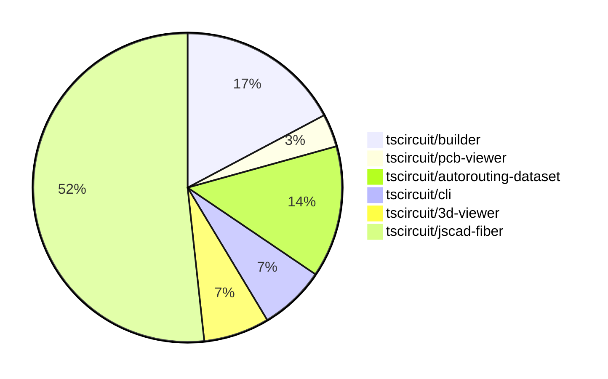

# contribution-tracker

Generates weekly contribution overviews for tscircuit contributors. Check out all
the [contribution overviews here](./contribution-overviews/)

* All PRs in the tscircuit org are scanned/summarized via Claude Haiku
* Claude classifies each Diff/PR as a Major, Minor or Tiny contribution
* All the PRs, summaries, and classifications are organized into charts and tables

The current week is shown below. There are 3 major sections:

* [Contributor Overview](#contributor-overview)
* [PRs by Repository](#prs-by-repository)
* [PRs by Contributor](#changes-by-contributor)

## Current Week

<!-- START_CURRENT_WEEK -->

# Contribution Overview 2024-08-03

## PRs by Repository

## Contributor Overview

| Contributor | 🐳 Major | 🐙 Minor | 🐌 Tiny |
|-------------|-------|-------|-------|
| seveibar | 5 | 3 | 0 |
| imrishabh18 | 4 | 1 | 0 |
| Slaviiiii | 2 | 13 | 0 |

## Changes by Repository

### [tscircuit/builder](https://github.com/tscircuit/builder)

| PR # | Impact | Contributor | Description |
|------|--------|-------------|-------------|
| [#100](https://github.com/tscircuit/builder/pull/100) | 🐳 Major | seveibar | When routing is disabled, do not route schematic routes with the autorouter, and instead use a straight route solver. |
| [#98](https://github.com/tscircuit/builder/pull/98) | 🐳 Major | seveibar | Fix `routingDisabled` not disabling routing |
| [#95](https://github.com/tscircuit/builder/pull/95) | 🐳 Major | imrishabh18 | Fix the issue of not centering the component when only one of the `schematic_x`, `sch_x`, `cx`, or `x` props is provided. |
| [#99](https://github.com/tscircuit/builder/pull/99) | 🐙 Minor | seveibar | Add additional debug logging to determine when trace building is being skipped |
| [#96](https://github.com/tscircuit/builder/pull/96) | 🐙 Minor | seveibar | Add CODEOWNERS file to specify code owners for the repository |

### [tscircuit/pcb-viewer](https://github.com/tscircuit/pcb-viewer)

| PR # | Impact | Contributor | Description |
|------|--------|-------------|-------------|
| [#32](https://github.com/tscircuit/pcb-viewer/pull/32) | 🐳 Major | seveibar | Fix stroke width not being used for fabrication note paths and fix a color not found error for fabrication note colors. |

### [tscircuit/autorouting-dataset](https://github.com/tscircuit/autorouting-dataset)

| PR # | Impact | Contributor | Description |
|------|--------|-------------|-------------|
| [#21](https://github.com/tscircuit/autorouting-dataset/pull/21) | 🐙 Minor | seveibar | Fix sample freezing on static build |
| [#20](https://github.com/tscircuit/autorouting-dataset/pull/20) | 🟣 | seveibar |  |
| [#19](https://github.com/tscircuit/autorouting-dataset/pull/19) | 🐳 Major | seveibar | Add support for Delaunay triangulation to construct the graph for the gridless poi algorithm and increase the sample count for the benchmark. |
| [#15](https://github.com/tscircuit/autorouting-dataset/pull/15) | 🐳 Major | seveibar | Implement a gridless point of interest (POI) approach for autorouting on printed circuit boards (PCBs). |

### [tscircuit/cli](https://github.com/tscircuit/cli)

| PR # | Impact | Contributor | Description |
|------|--------|-------------|-------------|
| [#119](https://github.com/tscircuit/cli/pull/119) | 🐳 Major | imrishabh18 | Introduce a new `render` command to the CLI to render circuit files as images in either PCB or schematic view. |
| [#117](https://github.com/tscircuit/cli/pull/117) | 🐳 Major | imrishabh18 | Introduce a new "Debug" button in the header menu to add the current dev package example's tscircuit soup to the debug.tscircuit.com website. |

### [tscircuit/3d-viewer](https://github.com/tscircuit/3d-viewer)

| PR # | Impact | Contributor | Description |
|------|--------|-------------|-------------|
| [#11](https://github.com/tscircuit/3d-viewer/pull/11) | 🐳 Major | imrishabh18 | Added better error handling for bad URLs in the useGlobalObjLoader hook. |
| [#12](https://github.com/tscircuit/3d-viewer/pull/12) | 🐙 Minor | imrishabh18 | Fix the top left cube overlap issue |

### [tscircuit/jscad-fiber](https://github.com/tscircuit/jscad-fiber)

| PR # | Impact | Contributor | Description |
|------|--------|-------------|-------------|
| [#62](https://github.com/tscircuit/jscad-fiber/pull/62) | 🐳 Major | Slaviiiii | Wrap the `Cylinder` component with `withColorProp` and `withOffsetProp` to add support for color and center properties. |
| [#59](https://github.com/tscircuit/jscad-fiber/pull/59) | 🐳 Major | Slaviiiii | Wrap the `ExtrudeRotate` component with `withColorProp` and `withOffsetProp` to add color and offset support. |
| [#70](https://github.com/tscircuit/jscad-fiber/pull/70) | 🐙 Minor | Slaviiiii | Wrap `HullChain` component with `withColorProp` and `withOffsetProp` higher-order components to add support for color and center props. |
| [#69](https://github.com/tscircuit/jscad-fiber/pull/69) | 🐙 Minor | Slaviiiii | The pull request wraps the `Hull` component with color and offset props. |
| [#68](https://github.com/tscircuit/jscad-fiber/pull/68) | 🐙 Minor | Slaviiiii | Wrap the `Rotate` component with `withColorProp` and `withOffsetProp` higher-order components to add color and offset functionality. |
| [#67](https://github.com/tscircuit/jscad-fiber/pull/67) | 🐙 Minor | Slaviiiii | Wrap `Torus` component with `withColorProp` and `withOffsetProp` wrappers |
| [#66](https://github.com/tscircuit/jscad-fiber/pull/66) | 🐙 Minor | Slaviiiii | Wrap the `GeodesicSphere` component with `withColorProp` and `withOffsetProp` higher-order components to add support for `color` and `center` properties. |
| [#64](https://github.com/tscircuit/jscad-fiber/pull/64) | 🐙 Minor | Slaviiiii | Wrap the `CylinderElliptic` component with `withColorProp` and `withOffsetProp` higher-order components. |
| [#65](https://github.com/tscircuit/jscad-fiber/pull/65) | 🐙 Minor | Slaviiiii | Wrap the `Ellipsoid` component with `withColorProp` and `withOffsetProp` wrappers to add color and center properties. |
| [#63](https://github.com/tscircuit/jscad-fiber/pull/63) | 🐙 Minor | Slaviiiii | Add color and center properties to the `RoundedCylinder` component |
| [#61](https://github.com/tscircuit/jscad-fiber/pull/61) | 🐙 Minor | Slaviiiii | Add color prop to the RoundedCuboid component and wrap it with a color wrapper. |
| [#60](https://github.com/tscircuit/jscad-fiber/pull/60) | 🐙 Minor | Slaviiiii | Adds color and center position properties to the Cube component. |
| [#58](https://github.com/tscircuit/jscad-fiber/pull/58) | 🐙 Minor | Slaviiiii | Wrap the `ExtrudeRectangular` component with `withColorProp` and `withOffsetProp` wrappers to add color and offset functionality. |
| [#56](https://github.com/tscircuit/jscad-fiber/pull/56) | 🐙 Minor | Slaviiiii | Wrap ExtrudeHelical component with withOffsetProp and withColorProp higher-order components. |
| [#57](https://github.com/tscircuit/jscad-fiber/pull/57) | 🐙 Minor | Slaviiiii | Wrap the ExtrudeLinear component with the withColorProp and withOffsetProp higher-order components to add color and center properties. |

## Changes by Contributor

### [seveibar](https://github.com/seveibar)

| PR # | Impact | Description |
|------|--------|-------------|
| [#100](https://github.com/tscircuit/builder/pull/100) | 🐳 Major | When routing is disabled, do not route schematic routes with the autorouter, and instead use a straight route solver. |
| [#98](https://github.com/tscircuit/builder/pull/98) | 🐳 Major | Fix `routingDisabled` not disabling routing |
| [#32](https://github.com/tscircuit/pcb-viewer/pull/32) | 🐳 Major | Fix stroke width not being used for fabrication note paths and fix a color not found error for fabrication note colors. |
| [#99](https://github.com/tscircuit/builder/pull/99) | 🐙 Minor | Add additional debug logging to determine when trace building is being skipped |
| [#96](https://github.com/tscircuit/builder/pull/96) | 🐙 Minor | Add CODEOWNERS file to specify code owners for the repository |
| [#21](https://github.com/tscircuit/autorouting-dataset/pull/21) | 🐙 Minor | Fix sample freezing on static build |
| [#20](https://github.com/tscircuit/autorouting-dataset/pull/20) | 🟣 |  |
| [#19](https://github.com/tscircuit/autorouting-dataset/pull/19) | 🐳 Major | Add support for Delaunay triangulation to construct the graph for the gridless poi algorithm and increase the sample count for the benchmark. |
| [#15](https://github.com/tscircuit/autorouting-dataset/pull/15) | 🐳 Major | Implement a gridless point of interest (POI) approach for autorouting on printed circuit boards (PCBs). |

### [imrishabh18](https://github.com/imrishabh18)

| PR # | Impact | Description |
|------|--------|-------------|
| [#95](https://github.com/tscircuit/builder/pull/95) | 🐳 Major | Fix the issue of not centering the component when only one of the `schematic_x`, `sch_x`, `cx`, or `x` props is provided. |
| [#119](https://github.com/tscircuit/cli/pull/119) | 🐳 Major | Introduce a new `render` command to the CLI to render circuit files as images in either PCB or schematic view. |
| [#117](https://github.com/tscircuit/cli/pull/117) | 🐳 Major | Introduce a new "Debug" button in the header menu to add the current dev package example's tscircuit soup to the debug.tscircuit.com website. |
| [#11](https://github.com/tscircuit/3d-viewer/pull/11) | 🐳 Major | Added better error handling for bad URLs in the useGlobalObjLoader hook. |
| [#12](https://github.com/tscircuit/3d-viewer/pull/12) | 🐙 Minor | Fix the top left cube overlap issue |

### [Slaviiiii](https://github.com/Slaviiiii)

| PR # | Impact | Description |
|------|--------|-------------|
| [#62](https://github.com/tscircuit/jscad-fiber/pull/62) | 🐳 Major | Wrap the `Cylinder` component with `withColorProp` and `withOffsetProp` to add support for color and center properties. |
| [#59](https://github.com/tscircuit/jscad-fiber/pull/59) | 🐳 Major | Wrap the `ExtrudeRotate` component with `withColorProp` and `withOffsetProp` to add color and offset support. |
| [#70](https://github.com/tscircuit/jscad-fiber/pull/70) | 🐙 Minor | Wrap `HullChain` component with `withColorProp` and `withOffsetProp` higher-order components to add support for color and center props. |
| [#69](https://github.com/tscircuit/jscad-fiber/pull/69) | 🐙 Minor | The pull request wraps the `Hull` component with color and offset props. |
| [#68](https://github.com/tscircuit/jscad-fiber/pull/68) | 🐙 Minor | Wrap the `Rotate` component with `withColorProp` and `withOffsetProp` higher-order components to add color and offset functionality. |
| [#67](https://github.com/tscircuit/jscad-fiber/pull/67) | 🐙 Minor | Wrap `Torus` component with `withColorProp` and `withOffsetProp` wrappers |
| [#66](https://github.com/tscircuit/jscad-fiber/pull/66) | 🐙 Minor | Wrap the `GeodesicSphere` component with `withColorProp` and `withOffsetProp` higher-order components to add support for `color` and `center` properties. |
| [#64](https://github.com/tscircuit/jscad-fiber/pull/64) | 🐙 Minor | Wrap the `CylinderElliptic` component with `withColorProp` and `withOffsetProp` higher-order components. |
| [#65](https://github.com/tscircuit/jscad-fiber/pull/65) | 🐙 Minor | Wrap the `Ellipsoid` component with `withColorProp` and `withOffsetProp` wrappers to add color and center properties. |
| [#63](https://github.com/tscircuit/jscad-fiber/pull/63) | 🐙 Minor | Add color and center properties to the `RoundedCylinder` component |
| [#61](https://github.com/tscircuit/jscad-fiber/pull/61) | 🐙 Minor | Add color prop to the RoundedCuboid component and wrap it with a color wrapper. |
| [#60](https://github.com/tscircuit/jscad-fiber/pull/60) | 🐙 Minor | Adds color and center position properties to the Cube component. |
| [#58](https://github.com/tscircuit/jscad-fiber/pull/58) | 🐙 Minor | Wrap the `ExtrudeRectangular` component with `withColorProp` and `withOffsetProp` wrappers to add color and offset functionality. |
| [#56](https://github.com/tscircuit/jscad-fiber/pull/56) | 🐙 Minor | Wrap ExtrudeHelical component with withOffsetProp and withColorProp higher-order components. |
| [#57](https://github.com/tscircuit/jscad-fiber/pull/57) | 🐙 Minor | Wrap the ExtrudeLinear component with the withColorProp and withOffsetProp higher-order components to add color and center properties. |

<!-- END_CURRENT_WEEK -->
