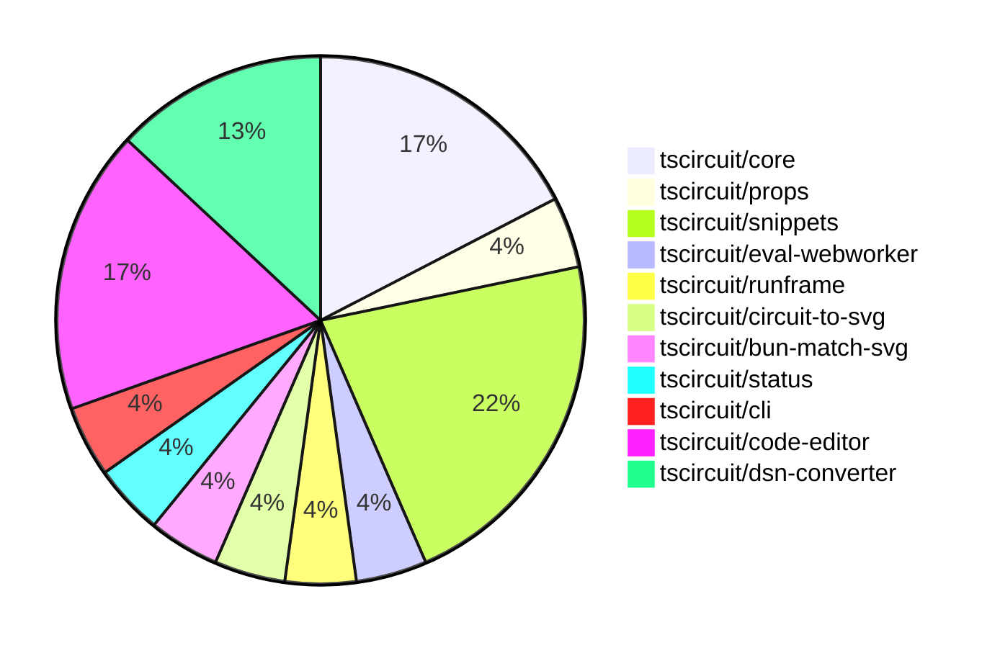

# contribution-tracker

Generates weekly contribution overviews for tscircuit contributors. Check out all
the [contribution overviews here](./contribution-overviews/)

* All PRs in the tscircuit org are scanned/summarized via Claude Haiku
* Claude classifies each Diff/PR as a Major, Minor or Tiny contribution
* All the PRs, summaries, and classifications are organized into charts and tables

The current week is shown below. There are 3 major sections:

* [Contributor Overview](#contributor-overview)
* [PRs by Repository](#prs-by-repository)
* [PRs by Contributor](#changes-by-contributor)

## Current Week

<!-- START_CURRENT_WEEK -->

# Contribution Overview 2025-01-15

## PRs by Repository

## Contributor Overview

| Contributor | 🐳 Major | 🐙 Minor | 🐌 Tiny | ⭐ | Issues Created |
|-------------|---------|---------|---------|-----|----------------|
| [seveibar](#seveibar) | 2 | 5 | 0 | 👑 | 32 |
| [imrishabh18](#imrishabh18) | 4 | 4 | 0 | ⭐⭐ | 0 |
| [techmannih](#techmannih) | 0 | 4 | 0 | ⭐ | 0 |
| [kom-senapati](#kom-senapati) | 0 | 3 | 0 | ⭐ | 1 |
| [Anshgrover23](#Anshgrover23) | 0 | 1 | 0 | ⭐ | 0 |

## Review Table

[reviews-received-hover]: ## "Number of reviews received for PRs for this contributor"
[approvals-received-hover]: ## "Number of approvals received for PRs this contributor authored"
[rejections-received-hover]: ## "Number of rejections received for PRs this contributor authored"
[prs-opened-hover]: ## "Number of PRs opened by this contributor"
[issues-created-hover]: ## "Number of issues created by this contributor"
[bountied-issues-hover]: ## "Number of issues this contributor created with a bounty"
[bountied-issue-$-hover]: ## "Total bounty amount placed on issues authored by this contributor"

| Contributor | Reviews Received | Approvals Received | Rejections Received | Approvals Sent | Rejections Sent | PRs Opened | PRs Merged | Issues Created | Bountied Issues | Bountied Issue $ |
|---|---|---|---|---|---|---|---|---|---|---|
| [seveibar](#seveibar) | 0 | 0 | 0 | 10 | 8 | 9 | 7 | 32 | 22 | 330 |
| [ShiboSoftwareDev](#ShiboSoftwareDev) | 4 | 0 | 0 | 1 | 1 | 1 | 0 | 2 | 2 | 20 |
| [techmannih](#techmannih) | 20 | 6 | 8 | 0 | 0 | 5 | 4 | 0 | 0 | 0 |
| [Ayushjhawar8](#Ayushjhawar8) | 3 | 0 | 2 | 0 | 0 | 1 | 0 | 0 | 0 | 0 |
| [imrishabh18](#imrishabh18) | 0 | 0 | 0 | 1 | 5 | 8 | 8 | 0 | 0 | 0 |
| [Anshgrover23](#Anshgrover23) | 6 | 2 | 2 | 0 | 4 | 5 | 1 | 0 | 0 | 0 |
| [kom-senapati](#kom-senapati) | 5 | 3 | 1 | 0 | 0 | 3 | 3 | 1 | 0 | 0 |
| [Saurabhsing21](#Saurabhsing21) | 6 | 1 | 3 | 0 | 0 | 1 | 0 | 0 | 0 | 0 |
| [Abse2001](#Abse2001) | 0 | 0 | 0 | 0 | 1 | 0 | 0 | 3 | 3 | 20 |
| [B-Mustafa](#B-Mustafa) | 1 | 0 | 1 | 0 | 0 | 1 | 0 | 0 | 0 | 0 |
| [yashksaini-coder](#yashksaini-coder) | 8 | 0 | 2 | 0 | 0 | 1 | 0 | 0 | 0 | 0 |

## Changes by Repository

### [tscircuit/core](https://github.com/tscircuit/core)

| PR # | Impact | Contributor | Description |
|------|--------|-------------|-------------|
| [#531](https://github.com/tscircuit/core/pull/531) | 🐳 Major | seveibar | Introduces a benchmarking server that runs various benchmarks and provides a website to visualize the results. |
| [#532](https://github.com/tscircuit/core/pull/532) | 🐳 Major | seveibar | Upgrades the React version from 18 to 19 and updates the corresponding dependencies. |
| [#523](https://github.com/tscircuit/core/pull/523) | 🐙 Minor | seveibar | Fixes a bug in the `createSchematicTraceCrossingSegments` function to avoid an infinite loop when handling non-orthogonal trace edges. |
| [#527](https://github.com/tscircuit/core/pull/527) | 🐙 Minor | techmannih | The pull request automatically adds net labels when a chip-to-chip trace is detected. |

### [tscircuit/props](https://github.com/tscircuit/props)

| PR # | Impact | Contributor | Description |
|------|--------|-------------|-------------|
| [#146](https://github.com/tscircuit/props/pull/146) | 🐙 Minor | seveibar | Add `key` prop to `group` component |

### [tscircuit/snippets](https://github.com/tscircuit/snippets)

| PR # | Impact | Contributor | Description |
|------|--------|-------------|-------------|
| [#578](https://github.com/tscircuit/snippets/pull/578) | 🐙 Minor | seveibar | Set up a GitHub Actions workflow to build and publish a fake snippets API to npm. |
| [#552](https://github.com/tscircuit/snippets/pull/552) | 🐙 Minor | techmannih | Fixes an issue where fork errors were not being displayed properly. |
| [#574](https://github.com/tscircuit/snippets/pull/574) | 🐙 Minor | techmannih | Improve the error message for 3D model download when the 3D viewer is not open. |
| [#571](https://github.com/tscircuit/snippets/pull/571) | 🐙 Minor | imrishabh18 | Revert the update to the "@tscircuit/3d-viewer" dependency to version 0.0.95, as it has broken the code editor page. |
| [#575](https://github.com/tscircuit/snippets/pull/575) | 🐙 Minor | Anshgrover23 | Fixes the GLTF downloader to correctly use the `.glb` extension for binary GLTF files. |

### [tscircuit/eval-webworker](https://github.com/tscircuit/eval-webworker)

| PR # | Impact | Contributor | Description |
|------|--------|-------------|-------------|
| [#78](https://github.com/tscircuit/eval-webworker/pull/78) | 🐙 Minor | seveibar | Update the web worker configuration to use a CJS bundle registry URL instead of the snippets API base URL for fetching imports. |

### [tscircuit/runframe](https://github.com/tscircuit/runframe)

| PR # | Impact | Contributor | Description |
|------|--------|-------------|-------------|
| [#139](https://github.com/tscircuit/runframe/pull/139) | 🐙 Minor | seveibar | Adds a render timings bar to the render log view, allowing sorting of render phases by duration or chronological order. |

### [tscircuit/circuit-to-svg](https://github.com/tscircuit/circuit-to-svg)

| PR # | Impact | Contributor | Description |
|------|--------|-------------|-------------|
| [#161](https://github.com/tscircuit/circuit-to-svg/pull/161) | 🐙 Minor | techmannih | Fixes the issue with making the label point transparent |

### [tscircuit/bun-match-svg](https://github.com/tscircuit/bun-match-svg)

| PR # | Impact | Contributor | Description |
|------|--------|-------------|-------------|
| [#7](https://github.com/tscircuit/bun-match-svg/pull/7) | 🐙 Minor | kom-senapati | Fix `import` statement and `toMatchSvgSnapshot` call in test file to improve `init` command. |

### [tscircuit/status](https://github.com/tscircuit/status)

| PR # | Impact | Contributor | Description |
|------|--------|-------------|-------------|
| [#10](https://github.com/tscircuit/status/pull/10) | 🐙 Minor | kom-senapati | Introduces a status check for the "registry and bundling" endpoints, ensuring the health of the ESM, CJS, and NPM endpoints. |

### [tscircuit/cli](https://github.com/tscircuit/cli)

| PR # | Impact | Contributor | Description |
|------|--------|-------------|-------------|
| [#22](https://github.com/tscircuit/cli/pull/22) | 🐙 Minor | kom-senapati | Adds a simple test fixture for CLI and TSCI init test |

### [tscircuit/code-editor](https://github.com/tscircuit/code-editor)

| PR # | Impact | Contributor | Description |
|------|--------|-------------|-------------|
| [#8](https://github.com/tscircuit/code-editor/pull/8) | 🐳 Major | imrishabh18 | Add TypeScript compiler integration to the code editor in the browser |
| [#7](https://github.com/tscircuit/code-editor/pull/7) | 🐳 Major | imrishabh18 | Introduces state management, formats the code using Prettier, and ports the UI from code snippets. |
| [#6](https://github.com/tscircuit/code-editor/pull/6) | 🐳 Major | imrishabh18 | Introduces a basic code editor with Cosmos and Vite integrated, along with Twind for styling. |
| [#4](https://github.com/tscircuit/code-editor/pull/4) | 🐳 Major | imrishabh18 | This pull request sets up the basic project structure, including configuration files for Bun, Tailwind CSS, and TypeScript, as well as the main HTML and CSS files. |

### [tscircuit/dsn-converter](https://github.com/tscircuit/dsn-converter)

| PR # | Impact | Contributor | Description |
|------|--------|-------------|-------------|
| [#80](https://github.com/tscircuit/dsn-converter/pull/80) | 🐙 Minor | imrishabh18 | Fix the `plated_hole` naming by including the `source_component_id` in the `refdes` property. |
| [#79](https://github.com/tscircuit/dsn-converter/pull/79) | 🐙 Minor | imrishabh18 | Fix trace linkage issue |
| [#78](https://github.com/tscircuit/dsn-converter/pull/78) | 🐙 Minor | imrishabh18 | Fix the issue of subcircuits with the same name by appending the source component ID to the component name. |

## Changes by Contributor

### [seveibar](https://github.com/seveibar)

| PR # | Impact | Description |
|------|--------|-------------|
| [#531](https://github.com/tscircuit/core/pull/531) | 🐳 Major | Introduces a benchmarking server that runs various benchmarks and provides a website to visualize the results. |
| [#532](https://github.com/tscircuit/core/pull/532) | 🐳 Major | Upgrades the React version from 18 to 19 and updates the corresponding dependencies. |
| [#146](https://github.com/tscircuit/props/pull/146) | 🐙 Minor | Add `key` prop to `group` component |
| [#523](https://github.com/tscircuit/core/pull/523) | 🐙 Minor | Fixes a bug in the `createSchematicTraceCrossingSegments` function to avoid an infinite loop when handling non-orthogonal trace edges. |
| [#578](https://github.com/tscircuit/snippets/pull/578) | 🐙 Minor | Set up a GitHub Actions workflow to build and publish a fake snippets API to npm. |
| [#78](https://github.com/tscircuit/eval-webworker/pull/78) | 🐙 Minor | Update the web worker configuration to use a CJS bundle registry URL instead of the snippets API base URL for fetching imports. |
| [#139](https://github.com/tscircuit/runframe/pull/139) | 🐙 Minor | Adds a render timings bar to the render log view, allowing sorting of render phases by duration or chronological order. |

### [techmannih](https://github.com/techmannih)

| PR # | Impact | Description |
|------|--------|-------------|
| [#527](https://github.com/tscircuit/core/pull/527) | 🐙 Minor | The pull request automatically adds net labels when a chip-to-chip trace is detected. |
| [#161](https://github.com/tscircuit/circuit-to-svg/pull/161) | 🐙 Minor | Fixes the issue with making the label point transparent |
| [#552](https://github.com/tscircuit/snippets/pull/552) | 🐙 Minor | Fixes an issue where fork errors were not being displayed properly. |
| [#574](https://github.com/tscircuit/snippets/pull/574) | 🐙 Minor | Improve the error message for 3D model download when the 3D viewer is not open. |

### [kom-senapati](https://github.com/kom-senapati)

| PR # | Impact | Description |
|------|--------|-------------|
| [#7](https://github.com/tscircuit/bun-match-svg/pull/7) | 🐙 Minor | Fix `import` statement and `toMatchSvgSnapshot` call in test file to improve `init` command. |
| [#10](https://github.com/tscircuit/status/pull/10) | 🐙 Minor | Introduces a status check for the "registry and bundling" endpoints, ensuring the health of the ESM, CJS, and NPM endpoints. |
| [#22](https://github.com/tscircuit/cli/pull/22) | 🐙 Minor | Adds a simple test fixture for CLI and TSCI init test |

### [imrishabh18](https://github.com/imrishabh18)

| PR # | Impact | Description |
|------|--------|-------------|
| [#8](https://github.com/tscircuit/code-editor/pull/8) | 🐳 Major | Add TypeScript compiler integration to the code editor in the browser |
| [#7](https://github.com/tscircuit/code-editor/pull/7) | 🐳 Major | Introduces state management, formats the code using Prettier, and ports the UI from code snippets. |
| [#6](https://github.com/tscircuit/code-editor/pull/6) | 🐳 Major | Introduces a basic code editor with Cosmos and Vite integrated, along with Twind for styling. |
| [#4](https://github.com/tscircuit/code-editor/pull/4) | 🐳 Major | This pull request sets up the basic project structure, including configuration files for Bun, Tailwind CSS, and TypeScript, as well as the main HTML and CSS files. |
| [#80](https://github.com/tscircuit/dsn-converter/pull/80) | 🐙 Minor | Fix the `plated_hole` naming by including the `source_component_id` in the `refdes` property. |
| [#79](https://github.com/tscircuit/dsn-converter/pull/79) | 🐙 Minor | Fix trace linkage issue |
| [#78](https://github.com/tscircuit/dsn-converter/pull/78) | 🐙 Minor | Fix the issue of subcircuits with the same name by appending the source component ID to the component name. |
| [#571](https://github.com/tscircuit/snippets/pull/571) | 🐙 Minor | Revert the update to the "@tscircuit/3d-viewer" dependency to version 0.0.95, as it has broken the code editor page. |

### [Anshgrover23](https://github.com/Anshgrover23)

| PR # | Impact | Description |
|------|--------|-------------|
| [#575](https://github.com/tscircuit/snippets/pull/575) | 🐙 Minor | Fixes the GLTF downloader to correctly use the `.glb` extension for binary GLTF files. |

<!-- END_CURRENT_WEEK -->
