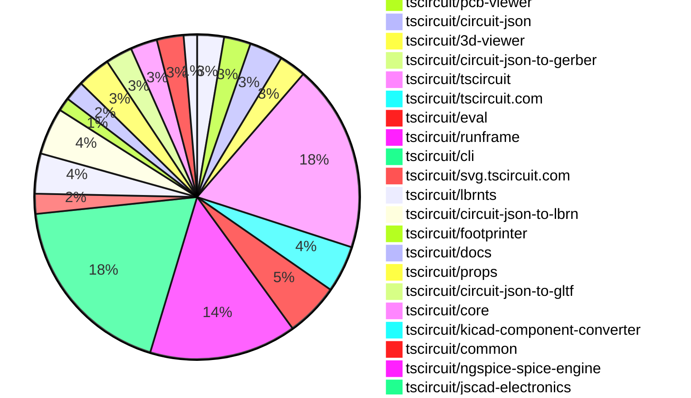
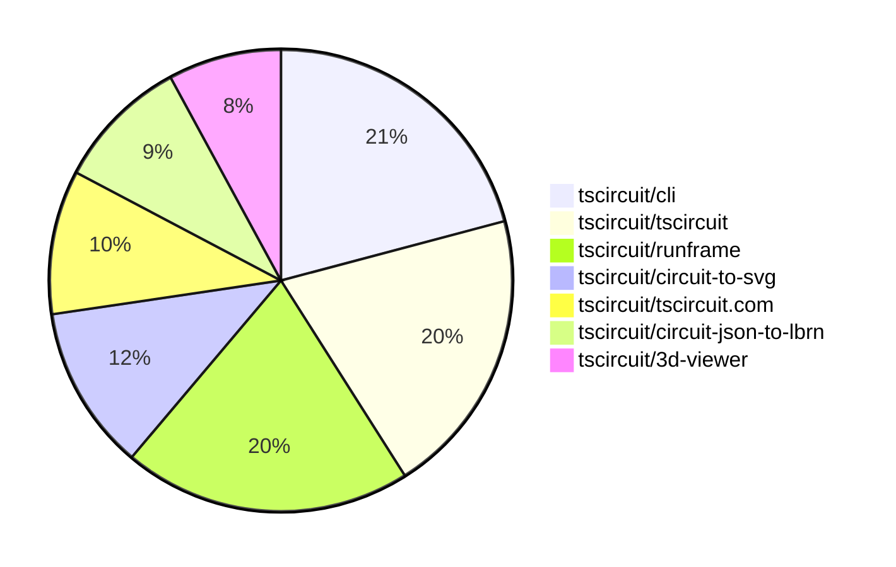

# contribution-tracker

[contributions.tscircuit.com](https://contributions.tscircuit.com) ・ [tscircuit.com](https://tscircuit.com) ・ [Contribution Overviews](./contribution-overviews/) ・ [Changelogs](./changelogs/)

Generates weekly contribution overviews for tscircuit contributors. Check out all
the [contribution overviews here](./contribution-overviews/)
You can find AI-generated monthly changelogs in the [changelogs directory](./changelogs/).

- All PRs in the tscircuit org are scanned/summarized via an LLM
- The LLM classifies each Diff/PR as into a set of attributes for scoring
- All the PRs, summaries, and classifications are organized into charts and tables for [the website](https://contributions.tscircuit.com)

> Want to run locally? See the [Development Section](#development)

The current week is shown below. There are 4 major sections:

- [Contributor Overview](#contributor-overview)
- [PRs by Repository](#prs-by-repository)
- [PRs by Contributor](#changes-by-contributor)
- [Scoring & Sponsorship System](#scoring--sponsorship-system)

## Current Week

<!-- START_CURRENT_WEEK -->

# Contribution Overview 2025-11-19

The current week is shown below. There are 4 major sections:

- [Contributor Overview](#contributor-overview)
- [PRs by Repository](#prs-by-repository)
- [PRs by Contributor](#changes-by-contributor)
- [Scoring & Sponsorship System](#scoring--sponsorship-system)

## PRs by Repository



## Contributor Overview

| Contributor | 🐳 Major | 🐙 Minor | 🐌 Tiny | ⭐ | Score | Discussion Contributions |
|-------------|---------|---------|---------|-----|----------------|--------------------------|
| [seveibar](#seveibar) | 3 | 5 | 5 | ⭐⭐⭐ | 42 | 0🔹 0🔶 0💎 |
| [imrishabh18](#imrishabh18) | 4 | 3 | 5 | ⭐⭐ | 28 | 0🔹 0🔶 0💎 |
| [Abse2001](#Abse2001) | 2 | 4 | 0 | ⭐⭐ | 16 | 0🔹 0🔶 0💎 |
| [Ayushjhawar8](#Ayushjhawar8) | 1 | 3 | 2 | ⭐⭐ | 13 | 0🔹 0🔶 0💎 |
| [ArnavK-09](#ArnavK-09) | 2 | 1 | 3 | ⭐⭐ | 13 | 0🔹 0🔶 0💎 |
| [tscircuitbot](#tscircuitbot) | 0 | 0 | 93 | ⭐⭐ | 12.5 | 0🔹 0🔶 0💎 |
| [ShiboSoftwareDev](#ShiboSoftwareDev) | 0 | 5 | 0 | ⭐⭐ | 12 | 0🔹 0🔶 0💎 |
| [techmannih](#techmannih) | 1 | 1 | 3 | ⭐⭐ | 11 | 0🔹 0🔶 0💎 |
| [RaghavArora14](#RaghavArora14) | 1 | 1 | 1 | ⭐ | 7 | 0🔹 0🔶 0💎 |
| [0hmX](#0hmX) | 1 | 0 | 2 | ⭐ | 5.5 | 0🔹 0🔶 0💎 |
| [pxlpal](#pxlpal) | 1 | 0 | 0 | ⭐ | 4 | 0🔹 0🔶 0💎 |
| [Heinrich-XIAO](#Heinrich-XIAO) | 0 | 0 | 2 |  | 2 | 0🔹 0🔶 0💎 |
| [joncherry](#joncherry) | 0 | 0 | 1 |  | 1 | 0🔹 0🔶 0💎 |

> Note: AI evaluates PRs and assigns 1-3 star ratings automatically. 4 and 5 star ratings require manual staff review.

### Discussion Contribution Legend

- 🔹 Normal Comments: Basic participation with minimal effort
- 🔶 Great Informative Comments: Thoughtful participation that adds value
- 💎 Incredible Comments: Exceptional participation with high-quality content

## Review Table

[reviews-received-hover]: ## "Number of reviews received for PRs for this contributor"
[approvals-received-hover]: ## "Number of approvals received for PRs this contributor authored"
[rejections-received-hover]: ## "Number of rejections received for PRs this contributor authored"
[prs-opened-hover]: ## "Number of PRs opened by this contributor"
[issues-created-hover]: ## "Number of issues created by this contributor"
[bountied-issues-hover]: ## "Number of issues this contributor created with a bounty"
[bountied-issue-$-hover]: ## "Total bounty amount placed on issues authored by this contributor"

| Contributor | Reviews Received | Approvals Received | Rejections Received | Approvals | Rejections | PRs Opened | PRs Merged | Score | Issues Created | Bountied Issues | Bountied Issue $ |
|---|---|---|---|---|---|---|---|---|---|---|---|
| [Abse2001](#Abse2001) | 6 | 6 | 0 | 0 | 0 | 7 | 6 | 16 | 0 | 0 | 0 |
| [seveibar](#seveibar) | 2 | 0 | 0 | 34 | 4 | 20 | 13 | 42 | 0 | 0 | 0 |
| [tscircuitbot](#tscircuitbot) | 0 | 0 | 0 | 0 | 0 | 116 | 93 | 12.5 | 0 | 0 | 0 |
| [techmannih](#techmannih) | 8 | 5 | 0 | 1 | 1 | 5 | 5 | 11 | 0 | 0 | 0 |
| [rushabhcodes](#rushabhcodes) | 8 | 1 | 1 | 1 | 0 | 2 | 0 | 0 | 0 | 0 | 0 |
| [Ayushjhawar8](#Ayushjhawar8) | 26 | 6 | 1 | 0 | 0 | 7 | 6 | 13 | 0 | 0 | 0 |
| [imrishabh18](#imrishabh18) | 5 | 4 | 0 | 1 | 1 | 12 | 12 | 28 | 0 | 0 | 0 |
| [ShiboSoftwareDev](#ShiboSoftwareDev) | 15 | 5 | 1 | 2 | 0 | 6 | 5 | 12 | 0 | 0 | 0 |
| [joncherry](#joncherry) | 3 | 2 | 0 | 0 | 0 | 2 | 1 | 1 | 0 | 0 | 0 |
| [nailoo](#nailoo) | 0 | 0 | 0 | 1 | 1 | 0 | 0 | 0 | 0 | 0 | 0 |
| [Devesh36](#Devesh36) | 2 | 0 | 1 | 0 | 0 | 1 | 0 | 0 | 0 | 0 | 0 |
| [RaghavArora14](#RaghavArora14) | 10 | 4 | 3 | 0 | 0 | 3 | 3 | 7 | 0 | 0 | 0 |
| [baeoc](#baeoc) | 0 | 0 | 0 | 0 | 1 | 0 | 0 | 0 | 0 | 0 | 0 |
| [ArnavK-09](#ArnavK-09) | 4 | 2 | 0 | 0 | 0 | 7 | 6 | 13 | 0 | 0 | 0 |
| [pxlpal](#pxlpal) | 1 | 1 | 0 | 0 | 0 | 1 | 1 | 4 | 0 | 0 | 0 |
| [MustafaMulla29](#MustafaMulla29) | 5 | 0 | 1 | 0 | 0 | 1 | 0 | 0 | 0 | 0 | 0 |
| [0hmX](#0hmX) | 8 | 2 | 0 | 0 | 0 | 6 | 3 | 5.5 | 0 | 0 | 0 |
| [Heinrich-XIAO](#Heinrich-XIAO) | 2 | 2 | 0 | 0 | 0 | 2 | 2 | 2 | 0 | 0 | 0 |

## Top 7 Repositories by Contribution Points



## Scoring & Sponsorship System

### Overview

PRs are analyzed by AI and assigned a **star rating (1-3 stars)**. 4 and 5 star ratings can only be manually assigned by staff. Weekly scores use `2^(starRating - 1)` per PR (capped at 12 PRs per rating), plus review/discussion points.

### Weekly Score → Star String

| Score Range | Star String | Count Value |
|------------|-------------|-------------|
| 0-3 | (empty) | 0 stars |
| 4-10 | ⭐ | 1 star |
| 11-30 | ⭐⭐ | 2 stars |
| 31-50 | ⭐⭐⭐ | 3 stars |
| 51-75 | 👑 | 1 crown |
| 76-100 | 👑👑 | 2 crowns |
| 101+ | 👑👑👑 | 3 crowns |

> Crowns count as 3 stars for sponsorship.

### Monthly Sponsorship Calculation

The sponsorship system calculates monthly payments based on your **weekly star counts** over the complete weeks in that month (typically 4-5 weeks, Wednesday-Tuesday format).

**Step 1: Collect Weekly Stars**
- All complete weeks in the month are analyzed
- Each week's star string is converted to a numeric count (⭐ = 1 star, ⭐⭐⭐ = 3 stars)
- Example: `[2, 2, 2, 1, 0]` means 2 stars in week 1, 2 stars in week 2, etc.

**Step 2: Calculate Metrics**
- **Median stars**: The median value of all weekly star counts
- **Min stars**: The minimum weekly star count
- **Max stars**: The maximum weekly star count
- **High score**: The maximum raw weekly score (0-100+ range from the scoring table) from any week in the month

**Step 3: Determine Base Amount**
The sponsorship amount is calculated based on these metrics (checked in order):

| Condition | Base Amount |
|-----------|-------------|
| `minStarCount >= 3` | **$500** |
| `medianStars >= 3` | **$450** |
| `medianStars >= 2.5` | **$300** |
| `medianStars >= 2` | **$200** |
| `medianStars >= 1.5` | **$100** |
| `medianStars >= 1` | **$75** |
| `maxStarCount >= 2` | **$25** |
| `maxStarCount >= 1` | **$15** |
| `highScore >= 3` (and all stars = 0) | **$5** |

| Maintainer Level | Monthly Bonus |
|------------------|---------------|
| Level 1 | **$200** |
| Level 2 | **$350** |
| Level 3 | **$500** |

**Final Amount** = Base Amount + Maintainer Bonus

## Changes by Repository

### [tscircuit/circuit-to-svg](https://github.com/tscircuit/circuit-to-svg)

| PR # | Impact | Rating | Contributor | Description |
|------|--------|--------|-------------|-------------|
| [#430](https://github.com/tscircuit/circuit-to-svg/pull/430) | 🐳 Major | ⭐⭐⭐ | Abse2001 | Adds support for corner_radius on rectangular PCB cutouts, converting the radius into SVG rxry, scaling by the board transform, and ensuring compatibility with rotation. Includes updates to circuit-json and a snapshot test for verification. |
| [#431](https://github.com/tscircuit/circuit-to-svg/pull/431) | 🐳 Major | ⭐⭐⭐ | imrishabh18 | Adds support for the is_covered_with_solder_mask property in pcb_hole and pcb_plated_hole, affecting how solder masks are rendered based on this property. |
| [#428](https://github.com/tscircuit/circuit-to-svg/pull/428) | 🐳 Major | ⭐⭐⭐ | imrishabh18 | Adds support for soldermask_margin around SMT pads, allowing for customizable solder mask dimensions based on positive or negative margin values. |
| [#429](https://github.com/tscircuit/circuit-to-svg/pull/429) | 🐳 Major | ⭐⭐⭐ | imrishabh18 | Add support for soldermask margin in PCB hole and plated hole rendering, allowing for customizable soldermask dimensions based on the specified margin. |

### [tscircuit/calculate-packing](https://github.com/tscircuit/calculate-packing)

| PR # | Impact | Rating | Contributor | Description |
|------|--------|--------|-------------|-------------|
| [#72](https://github.com/tscircuit/calculate-packing/pull/72) | 🐳 Major | ⭐⭐⭐ | Abse2001 | Replaced all fullOutline params, fields, and references with ccwFullOutline. Updated all dependent solvers (LargestRectOutsideOutlineFromPointSolver, OutlineSegmentCandidatePointSolver, SingleComponentPackSolver). Synced all tests, debugger components, and example pages with the new API. Added repro11 showcasing a complex packing scenario to improve debugging coverage. |

### [tscircuit/pcb-viewer](https://github.com/tscircuit/pcb-viewer)

| PR # | Impact | Rating | Contributor | Description |
|------|--------|--------|-------------|-------------|
| [#487](https://github.com/tscircuit/pcb-viewer/pull/487) | 🐙 Minor | ⭐⭐ | Abse2001 | Adds support for corner radius and rotation in PCB cutouts, updates the circuit-json dependency, and includes a unit test for the new functionality. |
| [#484](https://github.com/tscircuit/pcb-viewer/pull/484) | 🐙 Minor | ⭐⭐ | techmannih | Adds support for a new hole shape hole_with_polygon_pad in the PCB viewer, allowing for more complex pad designs in printed circuit boards. |

<details>
<summary>🐌 Tiny Contributions (2)</summary>

| PR # | Impact | Contributor | Description |
|------|--------|-------------|-------------|
| [#488](https://github.com/tscircuit/pcb-viewer/pull/488) | 🐌 Tiny | tscircuitbot | Automated package update |
| [#485](https://github.com/tscircuit/pcb-viewer/pull/485) | 🐌 Tiny | tscircuitbot | Automated package update |

</details>

### [tscircuit/circuit-json](https://github.com/tscircuit/circuit-json)

| PR # | Impact | Rating | Contributor | Description |
|------|--------|--------|-------------|-------------|
| [#355](https://github.com/tscircuit/circuit-json/pull/355) | 🐙 Minor | ⭐⭐ | Abse2001 | Adds an optional corner_radius property to the PcbCutoutRect type, allowing for rounded corners in PCB cutouts. |
| [#358](https://github.com/tscircuit/circuit-json/pull/358) | 🐙 Minor | ⭐⭐ | Ayushjhawar8 | Adds a new error type for when a pin with the mustBeConnected attribute is not connected to any trace. |
| [#356](https://github.com/tscircuit/circuit-json/pull/356) | 🐙 Minor | ⭐⭐ | imrishabh18 | Adds an optional boolean property is_covered_with_solder_mask to various PCB hole types to indicate if they are covered with solder mask. |
| [#357](https://github.com/tscircuit/circuit-json/pull/357) | 🐙 Minor | ⭐⭐ | imrishabh18 | Adds an optional boolean field is_covered_with_solder_mask to the pcb_plated_hole_circle definition to indicate if the hole is covered with solder mask. |

<details>
<summary>🐌 Tiny Contributions (1)</summary>

| PR # | Impact | Contributor | Description |
|------|--------|-------------|-------------|
| [#354](https://github.com/tscircuit/circuit-json/pull/354) | 🐌 Tiny | imrishabh18 | Adds an optional soldermask_margin property to SMT pads, holes, and plated holes in the PCB design schema. |

</details>

### [tscircuit/3d-viewer](https://github.com/tscircuit/3d-viewer)

| PR # | Impact | Rating | Contributor | Description |
|------|--------|--------|-------------|-------------|
| [#573](https://github.com/tscircuit/3d-viewer/pull/573) | 🐳 Major | ⭐⭐⭐ | techmannih | Adds support for a new hole shape hole_with_polygon_pad in the PCB design, allowing for custom polygon-shaped pads in plated holes. |
| [#575](https://github.com/tscircuit/3d-viewer/pull/575) | 🐳 Major | ⭐⭐⭐ | Ayushjhawar8 | Adds a keyboard shortcut menu that can be opened with a specific hotkey, enhancing user accessibility to keyboard shortcuts. |
| [#574](https://github.com/tscircuit/3d-viewer/pull/574) | 🐙 Minor | ⭐⭐ | Abse2001 | Adds support for corner radius handling in PCB cutouts for both JSCAD and Manifold pipelines, updates circuit-json dependency to v0.0.317, and includes coverage tests for rounded cutouts. |

<details>
<summary>🐌 Tiny Contributions (1)</summary>

| PR # | Impact | Contributor | Description |
|------|--------|-------------|-------------|
| [#577](https://github.com/tscircuit/3d-viewer/pull/577) | 🐌 Tiny | Ayushjhawar8 | Refactors the keyboard shortcut handling and layer visibility management in the CadViewer component, changing toggleLayer to setLayerVisibility and updating the shortcut representation. |

</details>

### [tscircuit/circuit-json-to-gerber](https://github.com/tscircuit/circuit-json-to-gerber)

| PR # | Impact | Rating | Contributor | Description |
|------|--------|--------|-------------|-------------|
| [#66](https://github.com/tscircuit/circuit-json-to-gerber/pull/66) | 🐙 Minor | ⭐⭐ | Abse2001 | Add support for corner radius on rectangular PCB cutouts when generating edge cuts, update circuit-json to version 0.0.317, and add a gerber snapshot test covering rounded PCB cutouts. |

### [tscircuit/tscircuit](https://github.com/tscircuit/tscircuit)


<details>
<summary>🐌 Tiny Contributions (28)</summary>

| PR # | Impact | Contributor | Description |
|------|--------|-------------|-------------|
| [#1396](https://github.com/tscircuit/tscircuit/pull/1396) | 🐌 Tiny | tscircuitbot | Automated package update |
| [#1395](https://github.com/tscircuit/tscircuit/pull/1395) | 🐌 Tiny | tscircuitbot | Automated package update |
| [#1394](https://github.com/tscircuit/tscircuit/pull/1394) | 🐌 Tiny | tscircuitbot | Automated package update |
| [#1393](https://github.com/tscircuit/tscircuit/pull/1393) | 🐌 Tiny | tscircuitbot | Automated package update |
| [#1392](https://github.com/tscircuit/tscircuit/pull/1392) | 🐌 Tiny | tscircuitbot | Automated package update |
| [#1391](https://github.com/tscircuit/tscircuit/pull/1391) | 🐌 Tiny | tscircuitbot | Automated package update |
| [#1390](https://github.com/tscircuit/tscircuit/pull/1390) | 🐌 Tiny | tscircuitbot | Automated package update |
| [#1389](https://github.com/tscircuit/tscircuit/pull/1389) | 🐌 Tiny | tscircuitbot | Updates the tscircuitcli package from version 0.1.514 to 0.1.515 |
| [#1388](https://github.com/tscircuit/tscircuit/pull/1388) | 🐌 Tiny | tscircuitbot | Automated package update |
| [#1387](https://github.com/tscircuit/tscircuit/pull/1387) | 🐌 Tiny | tscircuitbot | Automated package update |
| [#1386](https://github.com/tscircuit/tscircuit/pull/1386) | 🐌 Tiny | tscircuitbot | Automated package update |
| [#1385](https://github.com/tscircuit/tscircuit/pull/1385) | 🐌 Tiny | tscircuitbot | Automated package update |
| [#1384](https://github.com/tscircuit/tscircuit/pull/1384) | 🐌 Tiny | tscircuitbot | Automated package update |
| [#1383](https://github.com/tscircuit/tscircuit/pull/1383) | 🐌 Tiny | tscircuitbot | Automated package update |
| [#1382](https://github.com/tscircuit/tscircuit/pull/1382) | 🐌 Tiny | tscircuitbot | Automated package update |
| [#1381](https://github.com/tscircuit/tscircuit/pull/1381) | 🐌 Tiny | tscircuitbot | Updates the tscircuitcli package from version 0.1.510 to 0.1.511 and the tscircuitrunframe package from version 0.0.1262 to 0.0.1263 in package.json |
| [#1380](https://github.com/tscircuit/tscircuit/pull/1380) | 🐌 Tiny | tscircuitbot | Automated package update |
| [#1379](https://github.com/tscircuit/tscircuit/pull/1379) | 🐌 Tiny | tscircuitbot | Automated package update |
| [#1378](https://github.com/tscircuit/tscircuit/pull/1378) | 🐌 Tiny | tscircuitbot | Automated package update |
| [#1377](https://github.com/tscircuit/tscircuit/pull/1377) | 🐌 Tiny | tscircuitbot | Automated package update |
| [#1376](https://github.com/tscircuit/tscircuit/pull/1376) | 🐌 Tiny | tscircuitbot | Automated package update |
| [#1375](https://github.com/tscircuit/tscircuit/pull/1375) | 🐌 Tiny | tscircuitbot | Automated package update |
| [#1374](https://github.com/tscircuit/tscircuit/pull/1374) | 🐌 Tiny | tscircuitbot | Automated package update |
| [#1373](https://github.com/tscircuit/tscircuit/pull/1373) | 🐌 Tiny | tscircuitbot | Updates the tscircuitcli package version from 0.1.506 to 0.1.507 in package.json |
| [#1372](https://github.com/tscircuit/tscircuit/pull/1372) | 🐌 Tiny | tscircuitbot | Automated package update |
| [#1371](https://github.com/tscircuit/tscircuit/pull/1371) | 🐌 Tiny | tscircuitbot | Updates the tscircuitcli package to version 0.1.506 in the package.json file |
| [#1370](https://github.com/tscircuit/tscircuit/pull/1370) | 🐌 Tiny | tscircuitbot | Automated package update |
| [#1369](https://github.com/tscircuit/tscircuit/pull/1369) | 🐌 Tiny | tscircuitbot | Updates the tscircuitcli package from version 0.1.504 to 0.1.505 |

</details>

### [tscircuit/tscircuit.com](https://github.com/tscircuit/tscircuit.com)

| PR # | Impact | Rating | Contributor | Description |
|------|--------|--------|-------------|-------------|
| [#2028](https://github.com/tscircuit/tscircuit.com/pull/2028) | 🐳 Major | ⭐⭐⭐ | ArnavK-09 | Refactors organization-related API and database logic to replace the name field with tscircuit_handle for better clarity and consistency in organization identification. |
| [#2049](https://github.com/tscircuit/tscircuit.com/pull/2049) | 🐳 Major | ⭐⭐⭐ | pxlpal | Implement org invitations on fake Add invitation hooks Add org invitation UI |
| [#2047](https://github.com/tscircuit/tscircuit.com/pull/2047) | 🐙 Minor | ⭐⭐ | ArnavK-09 | Changes the build status determination to depend on user code status instead of the previous build status, affecting how release build statuses are displayed. |

<details>
<summary>🐌 Tiny Contributions (4)</summary>

| PR # | Impact | Contributor | Description |
|------|--------|-------------|-------------|
| [#2050](https://github.com/tscircuit/tscircuit.com/pull/2050) | 🐌 Tiny | tscircuitbot | Automated package update |
| [#2046](https://github.com/tscircuit/tscircuit.com/pull/2046) | 🐌 Tiny | tscircuitbot | Automated package update to version 0.0.149 |
| [#2045](https://github.com/tscircuit/tscircuit.com/pull/2045) | 🐌 Tiny | tscircuitbot | Automated package update |
| [#2043](https://github.com/tscircuit/tscircuit.com/pull/2043) | 🐌 Tiny | tscircuitbot | Updates the tscircuiteval package version from 0.0.476 to 0.0.478 in package.json |

</details>

### [tscircuit/eval](https://github.com/tscircuit/eval)

| PR # | Impact | Rating | Contributor | Description |
|------|--------|--------|-------------|-------------|
| [#1535](https://github.com/tscircuit/eval/pull/1535) | 🐙 Minor | ⭐⭐ | imrishabh18 | Creates a blob URL for static assets with content instead of using a static URL, improving the handling of file imports in the web worker. |

<details>
<summary>🐌 Tiny Contributions (7)</summary>

| PR # | Impact | Contributor | Description |
|------|--------|-------------|-------------|
| [#1543](https://github.com/tscircuit/eval/pull/1543) | 🐌 Tiny | tscircuitbot | Automated package update |
| [#1542](https://github.com/tscircuit/eval/pull/1542) | 🐌 Tiny | tscircuitbot | Automated package update |
| [#1538](https://github.com/tscircuit/eval/pull/1538) | 🐌 Tiny | tscircuitbot | Automated package update |
| [#1537](https://github.com/tscircuit/eval/pull/1537) | 🐌 Tiny | tscircuitbot | Automated package update |
| [#1536](https://github.com/tscircuit/eval/pull/1536) | 🐌 Tiny | tscircuitbot | Automated package update |
| [#1534](https://github.com/tscircuit/eval/pull/1534) | 🐌 Tiny | tscircuitbot | Automated package update |
| [#1533](https://github.com/tscircuit/eval/pull/1533) | 🐌 Tiny | tscircuitbot | Automated package update |

</details>

### [tscircuit/runframe](https://github.com/tscircuit/runframe)

| PR # | Impact | Rating | Contributor | Description |
|------|--------|--------|-------------|-------------|
| [#1817](https://github.com/tscircuit/runframe/pull/1817) | 🐳 Major | ⭐⭐⭐ | seveibar | Install circuit-json-to-lbrn package Create export-lbrn.ts handler for LBRN format conversion Add LightBurn to availableExports in file menu Implement exportLbrn function with error handling and toast notifications The new export option allows users to export circuit designs to LightBurn format (.lbrn) for laser cutting workflows. |
| [#1811](https://github.com/tscircuit/runframe/pull/1811) | 🐳 Major | ⭐⭐⭐ | ArnavK-09 | This pull request introduces support for new preview URLs and adds a 3D preview option to the ImportComponentDialog2 component. It modifies the existing preview tab functionality to include a new 3D option, allowing users to view 3D representations of components alongside PCB and schematic previews. The changes involve updates to the state management, rendering logic, and the addition of new URLs for 3D previews. |

<details>
<summary>🐌 Tiny Contributions (20)</summary>

| PR # | Impact | Contributor | Description |
|------|--------|-------------|-------------|
| [#1819](https://github.com/tscircuit/runframe/pull/1819) | 🐌 Tiny | tscircuitbot | Updates the tscircuit3d-viewer package from version 0.0.440 to 0.0.441 |
| [#1818](https://github.com/tscircuit/runframe/pull/1818) | 🐌 Tiny | tscircuitbot | Automated package update |
| [#1816](https://github.com/tscircuit/runframe/pull/1816) | 🐌 Tiny | tscircuitbot | Automated package update to version 0.0.1268 |
| [#1815](https://github.com/tscircuit/runframe/pull/1815) | 🐌 Tiny | tscircuitbot | Updates the tscircuiteval package to version 0.0.481 in the package.json file. |
| [#1814](https://github.com/tscircuit/runframe/pull/1814) | 🐌 Tiny | tscircuitbot | Automated package update |
| [#1813](https://github.com/tscircuit/runframe/pull/1813) | 🐌 Tiny | tscircuitbot | Updates the tscircuiteval package to version 0.0.480 |
| [#1812](https://github.com/tscircuit/runframe/pull/1812) | 🐌 Tiny | tscircuitbot | Automated package update |
| [#1810](https://github.com/tscircuit/runframe/pull/1810) | 🐌 Tiny | tscircuitbot | Automated package update |
| [#1808](https://github.com/tscircuit/runframe/pull/1808) | 🐌 Tiny | tscircuitbot | Automated package update |
| [#1805](https://github.com/tscircuit/runframe/pull/1805) | 🐌 Tiny | tscircuitbot | Automated package update |
| [#1804](https://github.com/tscircuit/runframe/pull/1804) | 🐌 Tiny | tscircuitbot | Updates the tscircuit3d-viewer package to version 0.0.440 in package.json |
| [#1803](https://github.com/tscircuit/runframe/pull/1803) | 🐌 Tiny | tscircuitbot | Automated package update |
| [#1802](https://github.com/tscircuit/runframe/pull/1802) | 🐌 Tiny | tscircuitbot | Updates the tscircuitpcb-viewer package from version 1.11.262 to 1.11.263 |
| [#1801](https://github.com/tscircuit/runframe/pull/1801) | 🐌 Tiny | tscircuitbot | Automated package update |
| [#1800](https://github.com/tscircuit/runframe/pull/1800) | 🐌 Tiny | tscircuitbot | Automated package update |
| [#1798](https://github.com/tscircuit/runframe/pull/1798) | 🐌 Tiny | tscircuitbot | Automated package update |
| [#1797](https://github.com/tscircuit/runframe/pull/1797) | 🐌 Tiny | tscircuitbot | Updates the tscircuitpcb-viewer package from version 1.11.261 to 1.11.262 |
| [#1796](https://github.com/tscircuit/runframe/pull/1796) | 🐌 Tiny | tscircuitbot | Updates the tscircuit3d-viewer package to version 0.0.438 in package.json |
| [#1807](https://github.com/tscircuit/runframe/pull/1807) | 🐌 Tiny | imrishabh18 | Updates the version of the tscircuiteval package from 0.0.468 to 0.0.479 and updates kicadts package from 0.0.10 to 0.0.22 while adding kicad-to-circuit-json package version 0.0.17 in package.json |
| [#1809](https://github.com/tscircuit/runframe/pull/1809) | 🐌 Tiny | ArnavK-09 | Removes an unimplemented error throw in the ImportComponentDialogForCli component, allowing for smoother operation during the import process. |

</details>

### [tscircuit/cli](https://github.com/tscircuit/cli)

| PR # | Impact | Rating | Contributor | Description |
|------|--------|--------|-------------|-------------|
| [#972](https://github.com/tscircuit/cli/pull/972) | 🐙 Minor | ⭐⭐ | seveibar | Moves the transpile build logic into a dedicated static asset Rollup plugin that recognizes CAD assets and extends TypeScript declarations for new CAD-related extensions. |

<details>
<summary>🐌 Tiny Contributions (27)</summary>

| PR # | Impact | Contributor | Description |
|------|--------|-------------|-------------|
| [#1001](https://github.com/tscircuit/cli/pull/1001) | 🐌 Tiny | tscircuitbot | Automated package update |
| [#1000](https://github.com/tscircuit/cli/pull/1000) | 🐌 Tiny | tscircuitbot | Updates the tscircuitrunframe package from version 0.0.1268 to 0.0.1269 |
| [#999](https://github.com/tscircuit/cli/pull/999) | 🐌 Tiny | tscircuitbot | Automated package update |
| [#998](https://github.com/tscircuit/cli/pull/998) | 🐌 Tiny | tscircuitbot | Automated package update |
| [#995](https://github.com/tscircuit/cli/pull/995) | 🐌 Tiny | tscircuitbot | Automated package update |
| [#994](https://github.com/tscircuit/cli/pull/994) | 🐌 Tiny | tscircuitbot | Updates the tscircuitrunframe package to version 0.0.1267 in the package.json file. |
| [#993](https://github.com/tscircuit/cli/pull/993) | 🐌 Tiny | tscircuitbot | Automated package update |
| [#991](https://github.com/tscircuit/cli/pull/991) | 🐌 Tiny | tscircuitbot | Automated package update |
| [#990](https://github.com/tscircuit/cli/pull/990) | 🐌 Tiny | tscircuitbot | Automated package update |
| [#989](https://github.com/tscircuit/cli/pull/989) | 🐌 Tiny | tscircuitbot | Automated package update |
| [#987](https://github.com/tscircuit/cli/pull/987) | 🐌 Tiny | tscircuitbot | Updates the tscircuitrunframe package from version 0.0.1264 to 0.0.1265 |
| [#986](https://github.com/tscircuit/cli/pull/986) | 🐌 Tiny | tscircuitbot | Automated package update to version 0.1.512 |
| [#985](https://github.com/tscircuit/cli/pull/985) | 🐌 Tiny | tscircuitbot | Automated package update |
| [#984](https://github.com/tscircuit/cli/pull/984) | 🐌 Tiny | tscircuitbot | Automated package update |
| [#983](https://github.com/tscircuit/cli/pull/983) | 🐌 Tiny | tscircuitbot | Updates the tscircuitrunframe package from version 0.0.1262 to 0.0.1263 |
| [#982](https://github.com/tscircuit/cli/pull/982) | 🐌 Tiny | tscircuitbot | Automated package update |
| [#981](https://github.com/tscircuit/cli/pull/981) | 🐌 Tiny | tscircuitbot | Updates the tscircuitrunframe package from version 0.0.1261 to 0.0.1262 |
| [#980](https://github.com/tscircuit/cli/pull/980) | 🐌 Tiny | tscircuitbot | Automated package update to version 0.1.509 |
| [#979](https://github.com/tscircuit/cli/pull/979) | 🐌 Tiny | tscircuitbot | Updates the tscircuitrunframe package from version 0.0.1259 to 0.0.1261 |
| [#978](https://github.com/tscircuit/cli/pull/978) | 🐌 Tiny | tscircuitbot | Automated package update |
| [#977](https://github.com/tscircuit/cli/pull/977) | 🐌 Tiny | tscircuitbot | Updates the tscircuitrunframe package from version 0.0.1258 to 0.0.1259 |
| [#975](https://github.com/tscircuit/cli/pull/975) | 🐌 Tiny | tscircuitbot | Automated package update to version 0.1.507 |
| [#973](https://github.com/tscircuit/cli/pull/973) | 🐌 Tiny | tscircuitbot | Automated package update |
| [#970](https://github.com/tscircuit/cli/pull/970) | 🐌 Tiny | tscircuitbot | Automated package update |
| [#974](https://github.com/tscircuit/cli/pull/974) | 🐌 Tiny | imrishabh18 | Fixes Windows-only transpile errors and adds a Windows-specific test workflow to ensure compatibility. |
| [#969](https://github.com/tscircuit/cli/pull/969) | 🐌 Tiny | seveibar | Adds a targeted hint when the build fails due to a type-only export being re-exported without the type modifier, improving error messaging for users. |
| [#992](https://github.com/tscircuit/cli/pull/992) | 🐌 Tiny | ArnavK-09 | Renames snippet references to package in DevServer for clarity, enhances pushSnippet to accept a logging function and improves success message handling, and adds a new TypeScript declaration file for .kicad_mod files. |

</details>

### [tscircuit/svg.tscircuit.com](https://github.com/tscircuit/svg.tscircuit.com)


<details>
<summary>🐌 Tiny Contributions (3)</summary>

| PR # | Impact | Contributor | Description |
|------|--------|-------------|-------------|
| [#605](https://github.com/tscircuit/svg.tscircuit.com/pull/605) | 🐌 Tiny | tscircuitbot | Updates the tscircuit package version from 0.0.915 to 0.0.916 in package.json |
| [#604](https://github.com/tscircuit/svg.tscircuit.com/pull/604) | 🐌 Tiny | tscircuitbot | Updates the tscircuit package version from 0.0.914 to 0.0.915 in package.json |
| [#603](https://github.com/tscircuit/svg.tscircuit.com/pull/603) | 🐌 Tiny | tscircuitbot | Updates the tscircuit package version from 0.0.913 to 0.0.914 in package.json |

</details>

### [tscircuit/lbrnts](https://github.com/tscircuit/lbrnts)


<details>
<summary>🐌 Tiny Contributions (6)</summary>

| PR # | Impact | Contributor | Description |
|------|--------|-------------|-------------|
| [#7](https://github.com/tscircuit/lbrnts/pull/7) | 🐌 Tiny | tscircuitbot | Updates the package version from 0.0.5 to 0.0.6 in package.json |
| [#5](https://github.com/tscircuit/lbrnts/pull/5) | 🐌 Tiny | tscircuitbot | Updates the package version from 0.0.3 to 0.0.5 in package.json |
| [#2](https://github.com/tscircuit/lbrnts/pull/2) | 🐌 Tiny | tscircuitbot | Updates the package version from 0.0.2 to 0.0.3 in package.json |
| [#1](https://github.com/tscircuit/lbrnts/pull/1) | 🐌 Tiny | tscircuitbot | Updates the package version from 0.0.1 to 0.0.2 in package.json |
| [#3](https://github.com/tscircuit/lbrnts/pull/3) | 🐌 Tiny | seveibar | Adapts to lbrn2 vertlist style, fixes PrimList, and updates patch based on lbrn2 output analysis. |
| [#6](https://github.com/tscircuit/lbrnts/pull/6) | 🐌 Tiny | seveibar | Fixes snapshot conflicts in CI tests by splitting tests into separate files to ensure unique snapshot names. |

</details>

### [tscircuit/circuit-json-to-lbrn](https://github.com/tscircuit/circuit-json-to-lbrn)

| PR # | Impact | Rating | Contributor | Description |
|------|--------|--------|-------------|-------------|
| [#2](https://github.com/tscircuit/circuit-json-to-lbrn/pull/2) | 🐳 Major | ⭐⭐⭐ | seveibar | This pull request introduces a Boolean geometry system for handling PCB traces and SMT pads, enhancing the connectivity mapping and geometry generation for circuit designs. It includes new functionalities for converting circles to polygons, managing connectivity maps, and unifying geometries for better representation in the LightBurn project. |
| [#6](https://github.com/tscircuit/circuit-json-to-lbrn/pull/6) | 🐙 Minor | ⭐⭐ | seveibar | Automatically calculates the bounding box of all circuit elements and sets the origin to ensure all elements are positioned in the positive quadrant (x  0, y  0) to prevent elements from being cut off in the LightBurn work area. |
| [#7](https://github.com/tscircuit/circuit-json-to-lbrn/pull/7) | 🐙 Minor | ⭐⭐ | seveibar | Fixes type errors in PCB trace width calculations and normalizes UI error handling to safely extract messages from unknown errors |
| [#3](https://github.com/tscircuit/circuit-json-to-lbrn/pull/3) | 🐙 Minor | ⭐⭐ | seveibar | Add optional origin parameter x: number, y: number to function options, include origin in ConvertContext for use across all handlers, and apply origin offset in addRectSmtPad and addPcbTrace handlers when creating Box geometry and circle centers respectively, defaulting origin to x: 0, y: 0 if not provided. |

<details>
<summary>🐌 Tiny Contributions (3)</summary>

| PR # | Impact | Contributor | Description |
|------|--------|-------------|-------------|
| [#8](https://github.com/tscircuit/circuit-json-to-lbrn/pull/8) | 🐌 Tiny | tscircuitbot | Automated package update |
| [#5](https://github.com/tscircuit/circuit-json-to-lbrn/pull/5) | 🐌 Tiny | tscircuitbot | Automated package update |
| [#4](https://github.com/tscircuit/circuit-json-to-lbrn/pull/4) | 🐌 Tiny | tscircuitbot | Automated package update |

</details>

### [tscircuit/footprinter](https://github.com/tscircuit/footprinter)


<details>
<summary>🐌 Tiny Contributions (2)</summary>

| PR # | Impact | Contributor | Description |
|------|--------|-------------|-------------|
| [#419](https://github.com/tscircuit/footprinter/pull/419) | 🐌 Tiny | techmannih | Fixes the inner and outer diameter values for DIP components in the footprint definitions. |
| [#427](https://github.com/tscircuit/footprinter/pull/427) | 🐌 Tiny | joncherry | Adds the norefdes flag to all footprints to disable reference designator labels, enhancing the flexibility of footprint definitions. |

</details>

### [tscircuit/docs](https://github.com/tscircuit/docs)


<details>
<summary>🐌 Tiny Contributions (3)</summary>

| PR # | Impact | Contributor | Description |
|------|--------|-------------|-------------|
| [#346](https://github.com/tscircuit/docs/pull/346) | 🐌 Tiny | techmannih | Fixes the indentation of the defaultView attribute in the CircuitPreview component to ensure proper rendering. |
| [#339](https://github.com/tscircuit/docs/pull/339) | 🐌 Tiny | techmannih | Hides the 3D and PCB view tabs for schematic components in the CircuitPreview component. |
| [#345](https://github.com/tscircuit/docs/pull/345) | 🐌 Tiny | ArnavK-09 | Fixes the copy button overlapping the title on screens wider than 500px by adjusting the media query to 800px. |

</details>

### [tscircuit/props](https://github.com/tscircuit/props)

| PR # | Impact | Rating | Contributor | Description |
|------|--------|--------|-------------|-------------|
| [#502](https://github.com/tscircuit/props/pull/502) | 🐙 Minor | ⭐⭐ | Ayushjhawar8 | Adds a mustBeConnected property to pin attributes, allowing for more precise control over pin connection requirements in circuit designs. |
| [#506](https://github.com/tscircuit/props/pull/506) | 🐙 Minor | ⭐⭐ | seveibar | Adds an optional pcbStraightLine flag to trace props to request straight PCB routing, documents regenerated component definitions and prop overviews, and covers the new property with a unit test. |
| [#505](https://github.com/tscircuit/props/pull/505) | 🐙 Minor | ⭐⭐ | ShiboSoftwareDev | Adds props to the Panel component to support panelization methods like tab-routing. |

<details>
<summary>🐌 Tiny Contributions (2)</summary>

| PR # | Impact | Contributor | Description |
|------|--------|-------------|-------------|
| [#503](https://github.com/tscircuit/props/pull/503) | 🐌 Tiny | imrishabh18 | Adds the solderMargin property to the CircleHoleProps, PillHoleProps, RectHoleProps, CirclePlatedHoleProps, OvalPlatedHoleProps, PillPlatedHoleProps, and various SMT pad properties to allow for customizable solder mask margins. |
| [#504](https://github.com/tscircuit/props/pull/504) | 🐌 Tiny | imrishabh18 | Adds a coveredWithSolderMask property to pcb_hole and pcb_plate_hole interfaces to specify if holes are covered with solder mask. |

</details>

### [tscircuit/circuit-json-to-gltf](https://github.com/tscircuit/circuit-json-to-gltf)

| PR # | Impact | Rating | Contributor | Description |
|------|--------|--------|-------------|-------------|
| [#86](https://github.com/tscircuit/circuit-json-to-gltf/pull/86) | 🐳 Major | ⭐⭐⭐ | RaghavArora14 | This PR simplifies copper pour rendering by removing the 3D geometry approach and relying entirely on texture-based rendering via circuit-to-svg, eliminating Z-fighting issues and providing a more realistic PCB appearance. |
| [#83](https://github.com/tscircuit/circuit-json-to-gltf/pull/83) | 🐙 Minor | ⭐⭐ | Ayushjhawar8 | Adds support for rendering PCB panels in GLTF format, including handling of panel dimensions, textures, and integration with existing PCB board structures. |
| [#81](https://github.com/tscircuit/circuit-json-to-gltf/pull/81) | 🐙 Minor | ⭐⭐ | RaghavArora14 | Add support for rendering BREP (Boundary Representation) shaped copper pours, including proper handling of curved edges via bulge values. |

<details>
<summary>🐌 Tiny Contributions (1)</summary>

| PR # | Impact | Contributor | Description |
|------|--------|-------------|-------------|
| [#85](https://github.com/tscircuit/circuit-json-to-gltf/pull/85) | 🐌 Tiny | Ayushjhawar8 | Refactors the panel mesh functionality by moving it into a separate file for better organization and maintainability. |

</details>

### [tscircuit/core](https://github.com/tscircuit/core)

| PR # | Impact | Rating | Contributor | Description |
|------|--------|--------|-------------|-------------|
| [#1665](https://github.com/tscircuit/core/pull/1665) | 🐳 Major | ⭐⭐⭐ | imrishabh18 | Add support for the soldermask_margin property in holes, plated holes, and SMT pads, allowing for more precise control over solder mask coverage. |
| [#1667](https://github.com/tscircuit/core/pull/1667) | 🐙 Minor | ⭐⭐ | ShiboSoftwareDev | Disables the auto-layout feature for panels when any child board has explicit pcbX or pcbY coordinates, preventing unexpected layouts with mixed positioned boards. |
| [#1666](https://github.com/tscircuit/core/pull/1666) | 🐙 Minor | ⭐⭐ | ShiboSoftwareDev | This change implements automatic PCB panelization features for the panel component, enabling automatic arrangement of boards, generation of tabs and mouse bites, and dynamic resizing of the panel. |
| [#1660](https://github.com/tscircuit/core/pull/1660) | 🐙 Minor | ⭐⭐ | ShiboSoftwareDev | Adds schematic representation for VoltageProbe components, including color-coded probes and automatic naming based on connection paths. |

### [tscircuit/kicad-component-converter](https://github.com/tscircuit/kicad-component-converter)

| PR # | Impact | Rating | Contributor | Description |
|------|--------|--------|-------------|-------------|
| [#170](https://github.com/tscircuit/kicad-component-converter/pull/170) | 🐳 Major | ⭐⭐⭐ | seveibar | Propagates numeric pin numbers to pcb_smtpad and pcb_plated_hole elements when port names are numeric, verifies that plated holes keep pin numbers, and adds a new SMD footprint regression covering pin_number on pads. |

### [tscircuit/common](https://github.com/tscircuit/common)


<details>
<summary>🐌 Tiny Contributions (4)</summary>

| PR # | Impact | Contributor | Description |
|------|--------|-------------|-------------|
| [#54](https://github.com/tscircuit/common/pull/54) | 🐌 Tiny | seveibar | Refines the XiaoReceiver component by marking pin labels as a const map for stronger literal inference and typing XiaoReceiver props with ChipProps to validate connections. |
| [#53](https://github.com/tscircuit/common/pull/53) | 🐌 Tiny | seveibar | Exports the XiaoReceiver circuit from the package entrypoint for external import. |
| [#55](https://github.com/tscircuit/common/pull/55) | 🐌 Tiny | Heinrich-XIAO | Adds silkscreen paths to the XiaoReceiver component for better visual representation on the PCB. |
| [#56](https://github.com/tscircuit/common/pull/56) | 🐌 Tiny | Heinrich-XIAO | Fixes the positioning of the XiaoReceiver component by allowing it to move according to pcbX and pcbY parameters instead of being fixed at (0,0). |

</details>

### [tscircuit/ngspice-spice-engine](https://github.com/tscircuit/ngspice-spice-engine)

| PR # | Impact | Rating | Contributor | Description |
|------|--------|--------|-------------|-------------|
| [#3](https://github.com/tscircuit/ngspice-spice-engine/pull/3) | 🐙 Minor | ⭐⭐ | ShiboSoftwareDev | Preserves the casing of net names specified in the .print tran command of the SPICE string in the final output voltage graphs. |

### [tscircuit/jscad-electronics](https://github.com/tscircuit/jscad-electronics)


<details>
<summary>🐌 Tiny Contributions (1)</summary>

| PR # | Impact | Contributor | Description |
|------|--------|-------------|-------------|
| [#235](https://github.com/tscircuit/jscad-electronics/pull/235) | 🐌 Tiny | RaghavArora14 | Add SOT-886 component implementation with 6 terminals (3 per side) and create example file demonstrating SOT-886 usage with ExtrudedPads |

</details>

### [tscircuit/tscircuit-autorouter](https://github.com/tscircuit/tscircuit-autorouter)

| PR # | Impact | Rating | Contributor | Description |
|------|--------|--------|-------------|-------------|
| [#327](https://github.com/tscircuit/tscircuit-autorouter/pull/327) | 🐳 Major | ⭐⭐⭐ | 0hmX | Implements a new routing optimization feature that uses off-board connections to find more efficient paths. |

### [tscircuit/rectdiff](https://github.com/tscircuit/rectdiff)


<details>
<summary>🐌 Tiny Contributions (2)</summary>

| PR # | Impact | Contributor | Description |
|------|--------|-------------|-------------|
| [#3](https://github.com/tscircuit/rectdiff/pull/3) | 🐌 Tiny | 0hmX | This pull request updates the bun version in multiple GitHub workflows from latest to 1.3.1 and makes minor formatting changes in the codebase for better readability. It also includes some adjustments in the RectDiffSolver and related files to improve code clarity and maintainability. |
| [#2](https://github.com/tscircuit/rectdiff/pull/2) | 🐌 Tiny | 0hmX | Adds formatting scripts to the project for consistent code style enforcement using biome. |

</details>

## Changes by Contributor

### [Abse2001](https://github.com/Abse2001)

| PRs # | Impact | Rating | Description |
|------|--------|--------|-------------|
| [#430](https://github.com/tscircuit/circuit-to-svg/pull/430) | 🐳 Major | ⭐⭐⭐ | Adds support for corner_radius on rectangular PCB cutouts, converting the radius into SVG rxry, scaling by the board transform, and ensuring compatibility with rotation. Includes updates to circuit-json and a snapshot test for verification. |
| [#72](https://github.com/tscircuit/calculate-packing/pull/72) | 🐳 Major | ⭐⭐⭐ | Replaced all fullOutline params, fields, and references with ccwFullOutline. Updated all dependent solvers (LargestRectOutsideOutlineFromPointSolver, OutlineSegmentCandidatePointSolver, SingleComponentPackSolver). Synced all tests, debugger components, and example pages with the new API. Added repro11 showcasing a complex packing scenario to improve debugging coverage. |
| [#487](https://github.com/tscircuit/pcb-viewer/pull/487) | 🐙 Minor | ⭐⭐ | Adds support for corner radius and rotation in PCB cutouts, updates the circuit-json dependency, and includes a unit test for the new functionality. |
| [#355](https://github.com/tscircuit/circuit-json/pull/355) | 🐙 Minor | ⭐⭐ | Adds an optional corner_radius property to the PcbCutoutRect type, allowing for rounded corners in PCB cutouts. |
| [#574](https://github.com/tscircuit/3d-viewer/pull/574) | 🐙 Minor | ⭐⭐ | Adds support for corner radius handling in PCB cutouts for both JSCAD and Manifold pipelines, updates circuit-json dependency to v0.0.317, and includes coverage tests for rounded cutouts. |
| [#66](https://github.com/tscircuit/circuit-json-to-gerber/pull/66) | 🐙 Minor | ⭐⭐ | Add support for corner radius on rectangular PCB cutouts when generating edge cuts, update circuit-json to version 0.0.317, and add a gerber snapshot test covering rounded PCB cutouts. |

### [tscircuitbot](https://github.com/tscircuitbot)


<details>
<summary>🐌 Tiny Contributions (93)</summary>

| PR # | Impact | Description |
|------|--------|-------------|
| [#488](https://github.com/tscircuit/pcb-viewer/pull/488) | 🐌 Tiny | Automated package update |
| [#485](https://github.com/tscircuit/pcb-viewer/pull/485) | 🐌 Tiny | Automated package update |
| [#1396](https://github.com/tscircuit/tscircuit/pull/1396) | 🐌 Tiny | Automated package update |
| [#1395](https://github.com/tscircuit/tscircuit/pull/1395) | 🐌 Tiny | Automated package update |
| [#1394](https://github.com/tscircuit/tscircuit/pull/1394) | 🐌 Tiny | Automated package update |
| [#1393](https://github.com/tscircuit/tscircuit/pull/1393) | 🐌 Tiny | Automated package update |
| [#1392](https://github.com/tscircuit/tscircuit/pull/1392) | 🐌 Tiny | Automated package update |
| [#1391](https://github.com/tscircuit/tscircuit/pull/1391) | 🐌 Tiny | Automated package update |
| [#1390](https://github.com/tscircuit/tscircuit/pull/1390) | 🐌 Tiny | Automated package update |
| [#1389](https://github.com/tscircuit/tscircuit/pull/1389) | 🐌 Tiny | Updates the tscircuitcli package from version 0.1.514 to 0.1.515 |
| [#1388](https://github.com/tscircuit/tscircuit/pull/1388) | 🐌 Tiny | Automated package update |
| [#1387](https://github.com/tscircuit/tscircuit/pull/1387) | 🐌 Tiny | Automated package update |
| [#1386](https://github.com/tscircuit/tscircuit/pull/1386) | 🐌 Tiny | Automated package update |
| [#1385](https://github.com/tscircuit/tscircuit/pull/1385) | 🐌 Tiny | Automated package update |
| [#1384](https://github.com/tscircuit/tscircuit/pull/1384) | 🐌 Tiny | Automated package update |
| [#1383](https://github.com/tscircuit/tscircuit/pull/1383) | 🐌 Tiny | Automated package update |
| [#1382](https://github.com/tscircuit/tscircuit/pull/1382) | 🐌 Tiny | Automated package update |
| [#1381](https://github.com/tscircuit/tscircuit/pull/1381) | 🐌 Tiny | Updates the tscircuitcli package from version 0.1.510 to 0.1.511 and the tscircuitrunframe package from version 0.0.1262 to 0.0.1263 in package.json |
| [#1380](https://github.com/tscircuit/tscircuit/pull/1380) | 🐌 Tiny | Automated package update |
| [#1379](https://github.com/tscircuit/tscircuit/pull/1379) | 🐌 Tiny | Automated package update |
| [#1378](https://github.com/tscircuit/tscircuit/pull/1378) | 🐌 Tiny | Automated package update |
| [#1377](https://github.com/tscircuit/tscircuit/pull/1377) | 🐌 Tiny | Automated package update |
| [#1376](https://github.com/tscircuit/tscircuit/pull/1376) | 🐌 Tiny | Automated package update |
| [#1375](https://github.com/tscircuit/tscircuit/pull/1375) | 🐌 Tiny | Automated package update |
| [#1374](https://github.com/tscircuit/tscircuit/pull/1374) | 🐌 Tiny | Automated package update |
| [#1373](https://github.com/tscircuit/tscircuit/pull/1373) | 🐌 Tiny | Updates the tscircuitcli package version from 0.1.506 to 0.1.507 in package.json |
| [#1372](https://github.com/tscircuit/tscircuit/pull/1372) | 🐌 Tiny | Automated package update |
| [#1371](https://github.com/tscircuit/tscircuit/pull/1371) | 🐌 Tiny | Updates the tscircuitcli package to version 0.1.506 in the package.json file |
| [#1370](https://github.com/tscircuit/tscircuit/pull/1370) | 🐌 Tiny | Automated package update |
| [#1369](https://github.com/tscircuit/tscircuit/pull/1369) | 🐌 Tiny | Updates the tscircuitcli package from version 0.1.504 to 0.1.505 |
| [#2050](https://github.com/tscircuit/tscircuit.com/pull/2050) | 🐌 Tiny | Automated package update |
| [#2046](https://github.com/tscircuit/tscircuit.com/pull/2046) | 🐌 Tiny | Automated package update to version 0.0.149 |
| [#2045](https://github.com/tscircuit/tscircuit.com/pull/2045) | 🐌 Tiny | Automated package update |
| [#2043](https://github.com/tscircuit/tscircuit.com/pull/2043) | 🐌 Tiny | Updates the tscircuiteval package version from 0.0.476 to 0.0.478 in package.json |
| [#1543](https://github.com/tscircuit/eval/pull/1543) | 🐌 Tiny | Automated package update |
| [#1542](https://github.com/tscircuit/eval/pull/1542) | 🐌 Tiny | Automated package update |
| [#1538](https://github.com/tscircuit/eval/pull/1538) | 🐌 Tiny | Automated package update |
| [#1537](https://github.com/tscircuit/eval/pull/1537) | 🐌 Tiny | Automated package update |
| [#1536](https://github.com/tscircuit/eval/pull/1536) | 🐌 Tiny | Automated package update |
| [#1534](https://github.com/tscircuit/eval/pull/1534) | 🐌 Tiny | Automated package update |
| [#1533](https://github.com/tscircuit/eval/pull/1533) | 🐌 Tiny | Automated package update |
| [#1819](https://github.com/tscircuit/runframe/pull/1819) | 🐌 Tiny | Updates the tscircuit3d-viewer package from version 0.0.440 to 0.0.441 |
| [#1818](https://github.com/tscircuit/runframe/pull/1818) | 🐌 Tiny | Automated package update |
| [#1816](https://github.com/tscircuit/runframe/pull/1816) | 🐌 Tiny | Automated package update to version 0.0.1268 |
| [#1815](https://github.com/tscircuit/runframe/pull/1815) | 🐌 Tiny | Updates the tscircuiteval package to version 0.0.481 in the package.json file. |
| [#1814](https://github.com/tscircuit/runframe/pull/1814) | 🐌 Tiny | Automated package update |
| [#1813](https://github.com/tscircuit/runframe/pull/1813) | 🐌 Tiny | Updates the tscircuiteval package to version 0.0.480 |
| [#1812](https://github.com/tscircuit/runframe/pull/1812) | 🐌 Tiny | Automated package update |
| [#1810](https://github.com/tscircuit/runframe/pull/1810) | 🐌 Tiny | Automated package update |
| [#1808](https://github.com/tscircuit/runframe/pull/1808) | 🐌 Tiny | Automated package update |
| [#1805](https://github.com/tscircuit/runframe/pull/1805) | 🐌 Tiny | Automated package update |
| [#1804](https://github.com/tscircuit/runframe/pull/1804) | 🐌 Tiny | Updates the tscircuit3d-viewer package to version 0.0.440 in package.json |
| [#1803](https://github.com/tscircuit/runframe/pull/1803) | 🐌 Tiny | Automated package update |
| [#1802](https://github.com/tscircuit/runframe/pull/1802) | 🐌 Tiny | Updates the tscircuitpcb-viewer package from version 1.11.262 to 1.11.263 |
| [#1801](https://github.com/tscircuit/runframe/pull/1801) | 🐌 Tiny | Automated package update |
| [#1800](https://github.com/tscircuit/runframe/pull/1800) | 🐌 Tiny | Automated package update |
| [#1798](https://github.com/tscircuit/runframe/pull/1798) | 🐌 Tiny | Automated package update |
| [#1797](https://github.com/tscircuit/runframe/pull/1797) | 🐌 Tiny | Updates the tscircuitpcb-viewer package from version 1.11.261 to 1.11.262 |
| [#1796](https://github.com/tscircuit/runframe/pull/1796) | 🐌 Tiny | Updates the tscircuit3d-viewer package to version 0.0.438 in package.json |
| [#1001](https://github.com/tscircuit/cli/pull/1001) | 🐌 Tiny | Automated package update |
| [#1000](https://github.com/tscircuit/cli/pull/1000) | 🐌 Tiny | Updates the tscircuitrunframe package from version 0.0.1268 to 0.0.1269 |
| [#999](https://github.com/tscircuit/cli/pull/999) | 🐌 Tiny | Automated package update |
| [#998](https://github.com/tscircuit/cli/pull/998) | 🐌 Tiny | Automated package update |
| [#995](https://github.com/tscircuit/cli/pull/995) | 🐌 Tiny | Automated package update |
| [#994](https://github.com/tscircuit/cli/pull/994) | 🐌 Tiny | Updates the tscircuitrunframe package to version 0.0.1267 in the package.json file. |
| [#993](https://github.com/tscircuit/cli/pull/993) | 🐌 Tiny | Automated package update |
| [#991](https://github.com/tscircuit/cli/pull/991) | 🐌 Tiny | Automated package update |
| [#990](https://github.com/tscircuit/cli/pull/990) | 🐌 Tiny | Automated package update |
| [#989](https://github.com/tscircuit/cli/pull/989) | 🐌 Tiny | Automated package update |
| [#987](https://github.com/tscircuit/cli/pull/987) | 🐌 Tiny | Updates the tscircuitrunframe package from version 0.0.1264 to 0.0.1265 |
| [#986](https://github.com/tscircuit/cli/pull/986) | 🐌 Tiny | Automated package update to version 0.1.512 |
| [#985](https://github.com/tscircuit/cli/pull/985) | 🐌 Tiny | Automated package update |
| [#984](https://github.com/tscircuit/cli/pull/984) | 🐌 Tiny | Automated package update |
| [#983](https://github.com/tscircuit/cli/pull/983) | 🐌 Tiny | Updates the tscircuitrunframe package from version 0.0.1262 to 0.0.1263 |
| [#982](https://github.com/tscircuit/cli/pull/982) | 🐌 Tiny | Automated package update |
| [#981](https://github.com/tscircuit/cli/pull/981) | 🐌 Tiny | Updates the tscircuitrunframe package from version 0.0.1261 to 0.0.1262 |
| [#980](https://github.com/tscircuit/cli/pull/980) | 🐌 Tiny | Automated package update to version 0.1.509 |
| [#979](https://github.com/tscircuit/cli/pull/979) | 🐌 Tiny | Updates the tscircuitrunframe package from version 0.0.1259 to 0.0.1261 |
| [#978](https://github.com/tscircuit/cli/pull/978) | 🐌 Tiny | Automated package update |
| [#977](https://github.com/tscircuit/cli/pull/977) | 🐌 Tiny | Updates the tscircuitrunframe package from version 0.0.1258 to 0.0.1259 |
| [#975](https://github.com/tscircuit/cli/pull/975) | 🐌 Tiny | Automated package update to version 0.1.507 |
| [#973](https://github.com/tscircuit/cli/pull/973) | 🐌 Tiny | Automated package update |
| [#970](https://github.com/tscircuit/cli/pull/970) | 🐌 Tiny | Automated package update |
| [#605](https://github.com/tscircuit/svg.tscircuit.com/pull/605) | 🐌 Tiny | Updates the tscircuit package version from 0.0.915 to 0.0.916 in package.json |
| [#604](https://github.com/tscircuit/svg.tscircuit.com/pull/604) | 🐌 Tiny | Updates the tscircuit package version from 0.0.914 to 0.0.915 in package.json |
| [#603](https://github.com/tscircuit/svg.tscircuit.com/pull/603) | 🐌 Tiny | Updates the tscircuit package version from 0.0.913 to 0.0.914 in package.json |
| [#7](https://github.com/tscircuit/lbrnts/pull/7) | 🐌 Tiny | Updates the package version from 0.0.5 to 0.0.6 in package.json |
| [#5](https://github.com/tscircuit/lbrnts/pull/5) | 🐌 Tiny | Updates the package version from 0.0.3 to 0.0.5 in package.json |
| [#2](https://github.com/tscircuit/lbrnts/pull/2) | 🐌 Tiny | Updates the package version from 0.0.2 to 0.0.3 in package.json |
| [#1](https://github.com/tscircuit/lbrnts/pull/1) | 🐌 Tiny | Updates the package version from 0.0.1 to 0.0.2 in package.json |
| [#8](https://github.com/tscircuit/circuit-json-to-lbrn/pull/8) | 🐌 Tiny | Automated package update |
| [#5](https://github.com/tscircuit/circuit-json-to-lbrn/pull/5) | 🐌 Tiny | Automated package update |
| [#4](https://github.com/tscircuit/circuit-json-to-lbrn/pull/4) | 🐌 Tiny | Automated package update |

</details>

### [techmannih](https://github.com/techmannih)

| PRs # | Impact | Rating | Description |
|------|--------|--------|-------------|
| [#573](https://github.com/tscircuit/3d-viewer/pull/573) | 🐳 Major | ⭐⭐⭐ | Adds support for a new hole shape hole_with_polygon_pad in the PCB design, allowing for custom polygon-shaped pads in plated holes. |
| [#484](https://github.com/tscircuit/pcb-viewer/pull/484) | 🐙 Minor | ⭐⭐ | Adds support for a new hole shape hole_with_polygon_pad in the PCB viewer, allowing for more complex pad designs in printed circuit boards. |

<details>
<summary>🐌 Tiny Contributions (3)</summary>

| PR # | Impact | Description |
|------|--------|-------------|
| [#419](https://github.com/tscircuit/footprinter/pull/419) | 🐌 Tiny | Fixes the inner and outer diameter values for DIP components in the footprint definitions. |
| [#346](https://github.com/tscircuit/docs/pull/346) | 🐌 Tiny | Fixes the indentation of the defaultView attribute in the CircuitPreview component to ensure proper rendering. |
| [#339](https://github.com/tscircuit/docs/pull/339) | 🐌 Tiny | Hides the 3D and PCB view tabs for schematic components in the CircuitPreview component. |

</details>

### [Ayushjhawar8](https://github.com/Ayushjhawar8)

| PRs # | Impact | Rating | Description |
|------|--------|--------|-------------|
| [#575](https://github.com/tscircuit/3d-viewer/pull/575) | 🐳 Major | ⭐⭐⭐ | Adds a keyboard shortcut menu that can be opened with a specific hotkey, enhancing user accessibility to keyboard shortcuts. |
| [#358](https://github.com/tscircuit/circuit-json/pull/358) | 🐙 Minor | ⭐⭐ | Adds a new error type for when a pin with the mustBeConnected attribute is not connected to any trace. |
| [#502](https://github.com/tscircuit/props/pull/502) | 🐙 Minor | ⭐⭐ | Adds a mustBeConnected property to pin attributes, allowing for more precise control over pin connection requirements in circuit designs. |
| [#83](https://github.com/tscircuit/circuit-json-to-gltf/pull/83) | 🐙 Minor | ⭐⭐ | Adds support for rendering PCB panels in GLTF format, including handling of panel dimensions, textures, and integration with existing PCB board structures. |

<details>
<summary>🐌 Tiny Contributions (2)</summary>

| PR # | Impact | Description |
|------|--------|-------------|
| [#577](https://github.com/tscircuit/3d-viewer/pull/577) | 🐌 Tiny | Refactors the keyboard shortcut handling and layer visibility management in the CadViewer component, changing toggleLayer to setLayerVisibility and updating the shortcut representation. |
| [#85](https://github.com/tscircuit/circuit-json-to-gltf/pull/85) | 🐌 Tiny | Refactors the panel mesh functionality by moving it into a separate file for better organization and maintainability. |

</details>

### [imrishabh18](https://github.com/imrishabh18)

| PRs # | Impact | Rating | Description |
|------|--------|--------|-------------|
| [#1665](https://github.com/tscircuit/core/pull/1665) | 🐳 Major | ⭐⭐⭐ | Add support for the soldermask_margin property in holes, plated holes, and SMT pads, allowing for more precise control over solder mask coverage. |
| [#431](https://github.com/tscircuit/circuit-to-svg/pull/431) | 🐳 Major | ⭐⭐⭐ | Adds support for the is_covered_with_solder_mask property in pcb_hole and pcb_plated_hole, affecting how solder masks are rendered based on this property. |
| [#428](https://github.com/tscircuit/circuit-to-svg/pull/428) | 🐳 Major | ⭐⭐⭐ | Adds support for soldermask_margin around SMT pads, allowing for customizable solder mask dimensions based on positive or negative margin values. |
| [#429](https://github.com/tscircuit/circuit-to-svg/pull/429) | 🐳 Major | ⭐⭐⭐ | Add support for soldermask margin in PCB hole and plated hole rendering, allowing for customizable soldermask dimensions based on the specified margin. |
| [#356](https://github.com/tscircuit/circuit-json/pull/356) | 🐙 Minor | ⭐⭐ | Adds an optional boolean property is_covered_with_solder_mask to various PCB hole types to indicate if they are covered with solder mask. |
| [#357](https://github.com/tscircuit/circuit-json/pull/357) | 🐙 Minor | ⭐⭐ | Adds an optional boolean field is_covered_with_solder_mask to the pcb_plated_hole_circle definition to indicate if the hole is covered with solder mask. |
| [#1535](https://github.com/tscircuit/eval/pull/1535) | 🐙 Minor | ⭐⭐ | Creates a blob URL for static assets with content instead of using a static URL, improving the handling of file imports in the web worker. |

<details>
<summary>🐌 Tiny Contributions (5)</summary>

| PR # | Impact | Description |
|------|--------|-------------|
| [#354](https://github.com/tscircuit/circuit-json/pull/354) | 🐌 Tiny | Adds an optional soldermask_margin property to SMT pads, holes, and plated holes in the PCB design schema. |
| [#503](https://github.com/tscircuit/props/pull/503) | 🐌 Tiny | Adds the solderMargin property to the CircleHoleProps, PillHoleProps, RectHoleProps, CirclePlatedHoleProps, OvalPlatedHoleProps, PillPlatedHoleProps, and various SMT pad properties to allow for customizable solder mask margins. |
| [#504](https://github.com/tscircuit/props/pull/504) | 🐌 Tiny | Adds a coveredWithSolderMask property to pcb_hole and pcb_plate_hole interfaces to specify if holes are covered with solder mask. |
| [#1807](https://github.com/tscircuit/runframe/pull/1807) | 🐌 Tiny | Updates the version of the tscircuiteval package from 0.0.468 to 0.0.479 and updates kicadts package from 0.0.10 to 0.0.22 while adding kicad-to-circuit-json package version 0.0.17 in package.json |
| [#974](https://github.com/tscircuit/cli/pull/974) | 🐌 Tiny | Fixes Windows-only transpile errors and adds a Windows-specific test workflow to ensure compatibility. |

</details>

### [seveibar](https://github.com/seveibar)

| PRs # | Impact | Rating | Description |
|------|--------|--------|-------------|
| [#170](https://github.com/tscircuit/kicad-component-converter/pull/170) | 🐳 Major | ⭐⭐⭐ | Propagates numeric pin numbers to pcb_smtpad and pcb_plated_hole elements when port names are numeric, verifies that plated holes keep pin numbers, and adds a new SMD footprint regression covering pin_number on pads. |
| [#1817](https://github.com/tscircuit/runframe/pull/1817) | 🐳 Major | ⭐⭐⭐ | Install circuit-json-to-lbrn package Create export-lbrn.ts handler for LBRN format conversion Add LightBurn to availableExports in file menu Implement exportLbrn function with error handling and toast notifications The new export option allows users to export circuit designs to LightBurn format (.lbrn) for laser cutting workflows. |
| [#2](https://github.com/tscircuit/circuit-json-to-lbrn/pull/2) | 🐳 Major | ⭐⭐⭐ | This pull request introduces a Boolean geometry system for handling PCB traces and SMT pads, enhancing the connectivity mapping and geometry generation for circuit designs. It includes new functionalities for converting circles to polygons, managing connectivity maps, and unifying geometries for better representation in the LightBurn project. |
| [#506](https://github.com/tscircuit/props/pull/506) | 🐙 Minor | ⭐⭐ | Adds an optional pcbStraightLine flag to trace props to request straight PCB routing, documents regenerated component definitions and prop overviews, and covers the new property with a unit test. |
| [#972](https://github.com/tscircuit/cli/pull/972) | 🐙 Minor | ⭐⭐ | Moves the transpile build logic into a dedicated static asset Rollup plugin that recognizes CAD assets and extends TypeScript declarations for new CAD-related extensions. |
| [#6](https://github.com/tscircuit/circuit-json-to-lbrn/pull/6) | 🐙 Minor | ⭐⭐ | Automatically calculates the bounding box of all circuit elements and sets the origin to ensure all elements are positioned in the positive quadrant (x  0, y  0) to prevent elements from being cut off in the LightBurn work area. |
| [#7](https://github.com/tscircuit/circuit-json-to-lbrn/pull/7) | 🐙 Minor | ⭐⭐ | Fixes type errors in PCB trace width calculations and normalizes UI error handling to safely extract messages from unknown errors |
| [#3](https://github.com/tscircuit/circuit-json-to-lbrn/pull/3) | 🐙 Minor | ⭐⭐ | Add optional origin parameter x: number, y: number to function options, include origin in ConvertContext for use across all handlers, and apply origin offset in addRectSmtPad and addPcbTrace handlers when creating Box geometry and circle centers respectively, defaulting origin to x: 0, y: 0 if not provided. |

<details>
<summary>🐌 Tiny Contributions (5)</summary>

| PR # | Impact | Description |
|------|--------|-------------|
| [#969](https://github.com/tscircuit/cli/pull/969) | 🐌 Tiny | Adds a targeted hint when the build fails due to a type-only export being re-exported without the type modifier, improving error messaging for users. |
| [#54](https://github.com/tscircuit/common/pull/54) | 🐌 Tiny | Refines the XiaoReceiver component by marking pin labels as a const map for stronger literal inference and typing XiaoReceiver props with ChipProps to validate connections. |
| [#53](https://github.com/tscircuit/common/pull/53) | 🐌 Tiny | Exports the XiaoReceiver circuit from the package entrypoint for external import. |
| [#3](https://github.com/tscircuit/lbrnts/pull/3) | 🐌 Tiny | Adapts to lbrn2 vertlist style, fixes PrimList, and updates patch based on lbrn2 output analysis. |
| [#6](https://github.com/tscircuit/lbrnts/pull/6) | 🐌 Tiny | Fixes snapshot conflicts in CI tests by splitting tests into separate files to ensure unique snapshot names. |

</details>

### [ShiboSoftwareDev](https://github.com/ShiboSoftwareDev)

| PRs # | Impact | Rating | Description |
|------|--------|--------|-------------|
| [#505](https://github.com/tscircuit/props/pull/505) | 🐙 Minor | ⭐⭐ | Adds props to the Panel component to support panelization methods like tab-routing. |
| [#1667](https://github.com/tscircuit/core/pull/1667) | 🐙 Minor | ⭐⭐ | Disables the auto-layout feature for panels when any child board has explicit pcbX or pcbY coordinates, preventing unexpected layouts with mixed positioned boards. |
| [#1666](https://github.com/tscircuit/core/pull/1666) | 🐙 Minor | ⭐⭐ | This change implements automatic PCB panelization features for the panel component, enabling automatic arrangement of boards, generation of tabs and mouse bites, and dynamic resizing of the panel. |
| [#1660](https://github.com/tscircuit/core/pull/1660) | 🐙 Minor | ⭐⭐ | Adds schematic representation for VoltageProbe components, including color-coded probes and automatic naming based on connection paths. |
| [#3](https://github.com/tscircuit/ngspice-spice-engine/pull/3) | 🐙 Minor | ⭐⭐ | Preserves the casing of net names specified in the .print tran command of the SPICE string in the final output voltage graphs. |

### [joncherry](https://github.com/joncherry)


<details>
<summary>🐌 Tiny Contributions (1)</summary>

| PR # | Impact | Description |
|------|--------|-------------|
| [#427](https://github.com/tscircuit/footprinter/pull/427) | 🐌 Tiny | Adds the norefdes flag to all footprints to disable reference designator labels, enhancing the flexibility of footprint definitions. |

</details>

### [RaghavArora14](https://github.com/RaghavArora14)

| PRs # | Impact | Rating | Description |
|------|--------|--------|-------------|
| [#86](https://github.com/tscircuit/circuit-json-to-gltf/pull/86) | 🐳 Major | ⭐⭐⭐ | This PR simplifies copper pour rendering by removing the 3D geometry approach and relying entirely on texture-based rendering via circuit-to-svg, eliminating Z-fighting issues and providing a more realistic PCB appearance. |
| [#81](https://github.com/tscircuit/circuit-json-to-gltf/pull/81) | 🐙 Minor | ⭐⭐ | Add support for rendering BREP (Boundary Representation) shaped copper pours, including proper handling of curved edges via bulge values. |

<details>
<summary>🐌 Tiny Contributions (1)</summary>

| PR # | Impact | Description |
|------|--------|-------------|
| [#235](https://github.com/tscircuit/jscad-electronics/pull/235) | 🐌 Tiny | Add SOT-886 component implementation with 6 terminals (3 per side) and create example file demonstrating SOT-886 usage with ExtrudedPads |

</details>

### [ArnavK-09](https://github.com/ArnavK-09)

| PRs # | Impact | Rating | Description |
|------|--------|--------|-------------|
| [#2028](https://github.com/tscircuit/tscircuit.com/pull/2028) | 🐳 Major | ⭐⭐⭐ | Refactors organization-related API and database logic to replace the name field with tscircuit_handle for better clarity and consistency in organization identification. |
| [#1811](https://github.com/tscircuit/runframe/pull/1811) | 🐳 Major | ⭐⭐⭐ | This pull request introduces support for new preview URLs and adds a 3D preview option to the ImportComponentDialog2 component. It modifies the existing preview tab functionality to include a new 3D option, allowing users to view 3D representations of components alongside PCB and schematic previews. The changes involve updates to the state management, rendering logic, and the addition of new URLs for 3D previews. |
| [#2047](https://github.com/tscircuit/tscircuit.com/pull/2047) | 🐙 Minor | ⭐⭐ | Changes the build status determination to depend on user code status instead of the previous build status, affecting how release build statuses are displayed. |

<details>
<summary>🐌 Tiny Contributions (3)</summary>

| PR # | Impact | Description |
|------|--------|-------------|
| [#1809](https://github.com/tscircuit/runframe/pull/1809) | 🐌 Tiny | Removes an unimplemented error throw in the ImportComponentDialogForCli component, allowing for smoother operation during the import process. |
| [#992](https://github.com/tscircuit/cli/pull/992) | 🐌 Tiny | Renames snippet references to package in DevServer for clarity, enhances pushSnippet to accept a logging function and improves success message handling, and adds a new TypeScript declaration file for .kicad_mod files. |
| [#345](https://github.com/tscircuit/docs/pull/345) | 🐌 Tiny | Fixes the copy button overlapping the title on screens wider than 500px by adjusting the media query to 800px. |

</details>

### [pxlpal](https://github.com/pxlpal)

| PRs # | Impact | Rating | Description |
|------|--------|--------|-------------|
| [#2049](https://github.com/tscircuit/tscircuit.com/pull/2049) | 🐳 Major | ⭐⭐⭐ | Implement org invitations on fake Add invitation hooks Add org invitation UI |

### [0hmX](https://github.com/0hmX)

| PRs # | Impact | Rating | Description |
|------|--------|--------|-------------|
| [#327](https://github.com/tscircuit/tscircuit-autorouter/pull/327) | 🐳 Major | ⭐⭐⭐ | Implements a new routing optimization feature that uses off-board connections to find more efficient paths. |

<details>
<summary>🐌 Tiny Contributions (2)</summary>

| PR # | Impact | Description |
|------|--------|-------------|
| [#3](https://github.com/tscircuit/rectdiff/pull/3) | 🐌 Tiny | This pull request updates the bun version in multiple GitHub workflows from latest to 1.3.1 and makes minor formatting changes in the codebase for better readability. It also includes some adjustments in the RectDiffSolver and related files to improve code clarity and maintainability. |
| [#2](https://github.com/tscircuit/rectdiff/pull/2) | 🐌 Tiny | Adds formatting scripts to the project for consistent code style enforcement using biome. |

</details>

### [Heinrich-XIAO](https://github.com/Heinrich-XIAO)


<details>
<summary>🐌 Tiny Contributions (2)</summary>

| PR # | Impact | Description |
|------|--------|-------------|
| [#55](https://github.com/tscircuit/common/pull/55) | 🐌 Tiny | Adds silkscreen paths to the XiaoReceiver component for better visual representation on the PCB. |
| [#56](https://github.com/tscircuit/common/pull/56) | 🐌 Tiny | Fixes the positioning of the XiaoReceiver component by allowing it to move according to pcbX and pcbY parameters instead of being fixed at (0,0). |

</details>

## Repository Owners

| Repository | Codeowners |
|------------|------------|
| [builder](https://github.com/tscircuit/builder/blob/main/.github/CODEOWNERS) | [seveibar](https://github.com/seveibar)
| [pcb-viewer](https://github.com/tscircuit/pcb-viewer/blob/main/.github/CODEOWNERS) | [seveibar](https://github.com/seveibar), [ShiboSoftwareDev](https://github.com/ShiboSoftwareDev)
| [footprints-old](https://github.com/tscircuit/footprints-old/blob/main/.github/CODEOWNERS) | [seveibar](https://github.com/seveibar)
| [footprinter](https://github.com/tscircuit/footprinter/blob/main/.github/CODEOWNERS) | [seveibar](https://github.com/seveibar), [techmannih](https://github.com/techmannih)
| [3d-viewer](https://github.com/tscircuit/3d-viewer/blob/main/.github/CODEOWNERS) | [ShiboSoftwareDev](https://github.com/ShiboSoftwareDev)
| [winterspec](https://github.com/tscircuit/winterspec/blob/main/.github/CODEOWNERS) | [seveibar](https://github.com/seveibar), [ShiboSoftwareDev](https://github.com/ShiboSoftwareDev)
| [jscad-electronics](https://github.com/tscircuit/jscad-electronics/blob/main/.github/CODEOWNERS) | [seveibar](https://github.com/seveibar), [techmannih](https://github.com/techmannih), [ShiboSoftwareDev](https://github.com/ShiboSoftwareDev), [anas-sarkez](https://github.com/anas-sarkez)
| [circuit-to-svg](https://github.com/tscircuit/circuit-to-svg/blob/main/.github/CODEOWNERS) | [imrishabh18](https://github.com/imrishabh18)
| [schematic-symbols](https://github.com/tscircuit/schematic-symbols/blob/main/.github/CODEOWNERS) | [seveibar](https://github.com/seveibar), [imrishabh18](https://github.com/imrishabh18), [techmannih](https://github.com/techmannih)
| [circuit-json-to-gerber](https://github.com/tscircuit/circuit-json-to-gerber/blob/main/.github/CODEOWNERS) | [seveibar](https://github.com/seveibar), [ShiboSoftwareDev](https://github.com/ShiboSoftwareDev)
| [tscircuit.com](https://github.com/tscircuit/tscircuit.com/blob/main/.github/CODEOWNERS) | [seveibar](https://github.com/seveibar), [imrishabh18](https://github.com/imrishabh18)
| [issue-roulette](https://github.com/tscircuit/issue-roulette/blob/main/.github/CODEOWNERS) | [Anshgrover23](https://github.com/Anshgrover23)
| [sparkfun-boards](https://github.com/tscircuit/sparkfun-boards/blob/main/.github/CODEOWNERS) | [ShiboSoftwareDev](https://github.com/ShiboSoftwareDev), [Abse2001](https://github.com/Abse2001), [MustafaMulla29](https://github.com/MustafaMulla29), [Anshgrover23](https://github.com/Anshgrover23), [techmannih](https://github.com/techmannih)
| [schematic-corpus](https://github.com/tscircuit/schematic-corpus/blob/main/.github/CODEOWNERS) | [Abse2001](https://github.com/Abse2001)
| [copper-pour-solver](https://github.com/tscircuit/copper-pour-solver/blob/main/.github/CODEOWNERS) | [seveibar](https://github.com/seveibar), [ShiboSoftwareDev](https://github.com/ShiboSoftwareDev)
| [common](https://github.com/tscircuit/common/blob/main/.github/CODEOWNERS) | [seveibar](https://github.com/seveibar), [Abse2001](https://github.com/Abse2001)

## Repositories by Owner

| User | Repo |
|------|------|
| [seveibar](https://github.com/seveibar) | [builder](https://github.com/tscircuit/builder/blob/main/.github/CODEOWNERS) |
|  | [pcb-viewer](https://github.com/tscircuit/pcb-viewer/blob/main/.github/CODEOWNERS) |
|  | [footprints-old](https://github.com/tscircuit/footprints-old/blob/main/.github/CODEOWNERS) |
|  | [footprinter](https://github.com/tscircuit/footprinter/blob/main/.github/CODEOWNERS) |
|  | [winterspec](https://github.com/tscircuit/winterspec/blob/main/.github/CODEOWNERS) |
|  | [jscad-electronics](https://github.com/tscircuit/jscad-electronics/blob/main/.github/CODEOWNERS) |
|  | [schematic-symbols](https://github.com/tscircuit/schematic-symbols/blob/main/.github/CODEOWNERS) |
|  | [circuit-json-to-gerber](https://github.com/tscircuit/circuit-json-to-gerber/blob/main/.github/CODEOWNERS) |
|  | [tscircuit.com](https://github.com/tscircuit/tscircuit.com/blob/main/.github/CODEOWNERS) |
|  | [copper-pour-solver](https://github.com/tscircuit/copper-pour-solver/blob/main/.github/CODEOWNERS) |
|  | [common](https://github.com/tscircuit/common/blob/main/.github/CODEOWNERS) |
| [ShiboSoftwareDev](https://github.com/ShiboSoftwareDev) | [pcb-viewer](https://github.com/tscircuit/pcb-viewer/blob/main/.github/CODEOWNERS) |
|  | [3d-viewer](https://github.com/tscircuit/3d-viewer/blob/main/.github/CODEOWNERS) |
|  | [winterspec](https://github.com/tscircuit/winterspec/blob/main/.github/CODEOWNERS) |
|  | [jscad-electronics](https://github.com/tscircuit/jscad-electronics/blob/main/.github/CODEOWNERS) |
|  | [circuit-json-to-gerber](https://github.com/tscircuit/circuit-json-to-gerber/blob/main/.github/CODEOWNERS) |
|  | [sparkfun-boards](https://github.com/tscircuit/sparkfun-boards/blob/main/.github/CODEOWNERS) |
|  | [copper-pour-solver](https://github.com/tscircuit/copper-pour-solver/blob/main/.github/CODEOWNERS) |
| [techmannih](https://github.com/techmannih) | [footprinter](https://github.com/tscircuit/footprinter/blob/main/.github/CODEOWNERS) |
|  | [jscad-electronics](https://github.com/tscircuit/jscad-electronics/blob/main/.github/CODEOWNERS) |
|  | [schematic-symbols](https://github.com/tscircuit/schematic-symbols/blob/main/.github/CODEOWNERS) |
|  | [sparkfun-boards](https://github.com/tscircuit/sparkfun-boards/blob/main/.github/CODEOWNERS) |
| [anas-sarkez](https://github.com/anas-sarkez) | [jscad-electronics](https://github.com/tscircuit/jscad-electronics/blob/main/.github/CODEOWNERS) |
| [imrishabh18](https://github.com/imrishabh18) | [circuit-to-svg](https://github.com/tscircuit/circuit-to-svg/blob/main/.github/CODEOWNERS) |
|  | [schematic-symbols](https://github.com/tscircuit/schematic-symbols/blob/main/.github/CODEOWNERS) |
|  | [tscircuit.com](https://github.com/tscircuit/tscircuit.com/blob/main/.github/CODEOWNERS) |
| [Anshgrover23](https://github.com/Anshgrover23) | [issue-roulette](https://github.com/tscircuit/issue-roulette/blob/main/.github/CODEOWNERS) |
|  | [sparkfun-boards](https://github.com/tscircuit/sparkfun-boards/blob/main/.github/CODEOWNERS) |
| [Abse2001](https://github.com/Abse2001) | [sparkfun-boards](https://github.com/tscircuit/sparkfun-boards/blob/main/.github/CODEOWNERS) |
|  | [schematic-corpus](https://github.com/tscircuit/schematic-corpus/blob/main/.github/CODEOWNERS) |
|  | [common](https://github.com/tscircuit/common/blob/main/.github/CODEOWNERS) |
| [MustafaMulla29](https://github.com/MustafaMulla29) | [sparkfun-boards](https://github.com/tscircuit/sparkfun-boards/blob/main/.github/CODEOWNERS) |


<!-- END_CURRENT_WEEK -->


## Development

### Prerequisites

- [Bun](https://bun.sh/) runtime
- `.env` file with required API keys:
  ```
  GITHUB_TOKEN=your_github_token
  OPENAI_API_KEY=your_openai_api_key
  DISCORD_TOKEN=your_discord_token (optional, for Discord integration)
  SLACK_BOT_TOKEN=your_slack_token (optional, for Slack integration)
  ```

### Available Scripts

#### Core Generation Scripts

- `bun run generate:weekly` - Generate current week's contribution overview
- `bun run generate:monthly` - Generate current month's contribution overview
- `bun run generate:changelog` - Generate monthly changelog from PRs

#### Analysis & Testing

- `bun run analyze-pr` - Analyze a single PR (interactive prompt)
- `bun run test:github` - Test GitHub API integration

#### Notifications & Sync

- `bun run notifications:issues` - Send notifications for new issues
- `bun run notifications:pr` - Send notifications for new PRs
- `bun run sync:discord` - Sync contributor roles with Discord

#### Data Export

- `bun run export:sponsorship` - Generate sponsorship data CSV

#### Development

- `bun run dev` - Start development server for web UI
- `bun run build` - Build for production
- `bun run format` - Format code with Biome

### Usage Examples

```bash
# Generate this week's contribution overview
bun run generate:weekly

# Generate current month's overview
bun run generate:monthly

# Analyze a specific PR
bun run analyze-pr

# Test your GitHub token setup
bun run test:github
```
