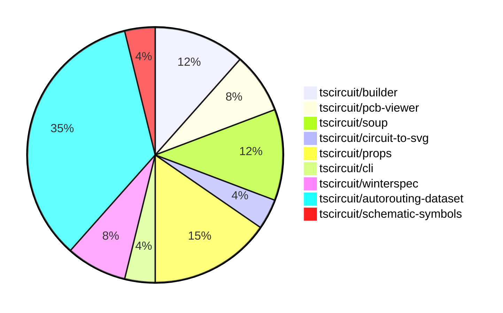

# contribution-tracker

Generates weekly contribution overviews for tscircuit contributors. Check out all
the [contribution overviews here](./contribution-overviews/)

* All PRs in the tscircuit org are scanned/summarized via Claude Haiku
* Claude classifies each Diff/PR as a Major, Minor or Tiny contribution
* All the PRs, summaries, and classifications are organized into charts and tables

The current week is shown below. There are 3 major sections:

* [Contributor Overview](#contributor-overview)
* [PRs by Repository](#prs-by-repository)
* [PRs by Contributor](#changes-by-contributor)

## Current Week

<!-- START_CURRENT_WEEK -->

# Contribution Overview 2024-08-10

## PRs by Repository

## Contributor Overview

| Contributor | 🐳 Major | 🐙 Minor | 🐌 Tiny |
|-------------|-------|-------|-------|
| imrishabh18 | 4 | 6 | 0 |
| abhijitxy | 1 | 2 | 0 |
| seveibar | 10 | 2 | 0 |
| angelacaq | 1 | 0 | 0 |

## Changes by Repository

### [tscircuit/builder](https://github.com/tscircuit/builder)

| PR # | Impact | Contributor | Description |
|------|--------|-------------|-------------|
| [#101](https://github.com/tscircuit/builder/pull/101) | 🐳 Major | imrishabh18 | Add trace width property to the PCB trace hint |
| [#102](https://github.com/tscircuit/builder/pull/102) | 🐙 Minor | imrishabh18 | Add support for `trace_width` in the `TraceHintBuilder` class. |
| [#97](https://github.com/tscircuit/builder/pull/97) | 🐙 Minor | abhijitxy | Add a test to replicate the issue of duplicate port hints by creating a `bug` with `footprint="soic8"`. |

### [tscircuit/pcb-viewer](https://github.com/tscircuit/pcb-viewer)

| PR # | Impact | Contributor | Description |
|------|--------|-------------|-------------|
| [#35](https://github.com/tscircuit/pcb-viewer/pull/35) | 🐳 Major | imrishabh18 | Add support for changeable trace width in the `EditTraceHintOverlay` component. |
| [#34](https://github.com/tscircuit/pcb-viewer/pull/34) | 🐙 Minor | imrishabh18 | Add a GitHub Actions workflow to type-check the project |

### [tscircuit/soup](https://github.com/tscircuit/soup)

| PR # | Impact | Contributor | Description |
|------|--------|-------------|-------------|
| [#18](https://github.com/tscircuit/soup/pull/18) | 🐳 Major | imrishabh18 | Introduce a new feature called "pcb_keepout" to define keep-out areas on a PCB. |
| [#20](https://github.com/tscircuit/soup/pull/20) | 🐙 Minor | imrishabh18 | Add `trace_width` field to `pcb_trace_hint` and `route_hint_point` objects |
| [#19](https://github.com/tscircuit/soup/pull/19) | 🐙 Minor | imrishabh18 | Add an optional trace width field to the pcb_trace_hint schema. |

### [tscircuit/circuit-to-svg](https://github.com/tscircuit/circuit-to-svg)

| PR # | Impact | Contributor | Description |
|------|--------|-------------|-------------|
| [#12](https://github.com/tscircuit/circuit-to-svg/pull/12) | 🐳 Major | imrishabh18 | Fixes the schematic port rendering and flips the schematic in the Y-axis to match the schematic-viewer. |

### [tscircuit/props](https://github.com/tscircuit/props)

| PR # | Impact | Contributor | Description |
|------|--------|-------------|-------------|
| [#17](https://github.com/tscircuit/props/pull/17) | 🐳 Major | abhijitxy | Added SwitchProps to standardize props for the Switch component |
| [#18](https://github.com/tscircuit/props/pull/18) | 🐙 Minor | imrishabh18 | Upgrade the `@tscircuit/soup` dependency to version `0.0.50` |
| [#16](https://github.com/tscircuit/props/pull/16) | 🐙 Minor | imrishabh18 | Add a "traceWidth" option to the TraceHintProps type |
| [#14](https://github.com/tscircuit/props/pull/14) | 🐙 Minor | abhijitxy | Rename BugProps to ChipProps and deprecate the old name. |

### [tscircuit/cli](https://github.com/tscircuit/cli)

| PR # | Impact | Contributor | Description |
|------|--------|-------------|-------------|
| [#120](https://github.com/tscircuit/cli/pull/120) | 🐳 Major | seveibar | Mega Refactor: Reorganize into single package.json, fix all types, improve imports, improve organization |

### [tscircuit/winterspec](https://github.com/tscircuit/winterspec)

| PR # | Impact | Contributor | Description |
|------|--------|-------------|-------------|
| [#7](https://github.com/tscircuit/winterspec/pull/7) | 🐳 Major | seveibar | Fixes an issue where the `opts` parameter is not being passed to the `makeRequestAgainstWinterSpec` function when creating bundles from directories, causing middleware not to run. |
| [#6](https://github.com/tscircuit/winterspec/pull/6) | 🐙 Minor | seveibar | Add support for fetch middleware in the `createFetchHandlerFromDir` function. |

### [tscircuit/autorouting-dataset](https://github.com/tscircuit/autorouting-dataset)

| PR # | Impact | Contributor | Description |
|------|--------|-------------|-------------|
| [#33](https://github.com/tscircuit/autorouting-dataset/pull/33) | 🐳 Major | seveibar | Introduce the ijump-max (ijump v2) algorithm, enhance logging, and refactor the infinite grid autorouter. |
| [#32](https://github.com/tscircuit/autorouting-dataset/pull/32) | 🐳 Major | seveibar | Check and regenerate problems that have overlapping pads |
| [#30](https://github.com/tscircuit/autorouting-dataset/pull/30) | 🐳 Major | seveibar | Introduce support for multi-trace routing and conjoined obstacle detection in the ijump-astar algorithm. |
| [#26](https://github.com/tscircuit/autorouting-dataset/pull/26) | 🐳 Major | seveibar | Implement orthogonal intersection handling in the infinite grid A* algorithm to optimize the path by considering obstacles in the surrounding directions. |
| [#25](https://github.com/tscircuit/autorouting-dataset/pull/25) | 🐳 Major | seveibar | Optimize the non-diagonal neighbors calculation in the infgrid-ijump A* algorithm, introducing new techniques like axis lock escape steps, fast step splitting, and heuristic distance penalty multiplier. |
| [#24](https://github.com/tscircuit/autorouting-dataset/pull/24) | 🐳 Major | seveibar | Introduce an implementation of the A* algorithm for finding paths in an infinite grid with obstacles. |
| [#23](https://github.com/tscircuit/autorouting-dataset/pull/23) | 🐳 Major | seveibar | Adds a Typescript template for an autorouting algorithm with instructions and supporting files. |
| [#22](https://github.com/tscircuit/autorouting-dataset/pull/22) | 🐳 Major | angelacaq | Introduces a new grid solver algorithm that uses the Jump Point Finder algorithm to significantly improve the performance of routing distant single traces on a PCB. |
| [#29](https://github.com/tscircuit/autorouting-dataset/pull/29) | 🐙 Minor | seveibar | Remove diagonal implementation pieces and add flag for fast step heuristic |

### [tscircuit/schematic-symbols](https://github.com/tscircuit/schematic-symbols)

| PR # | Impact | Contributor | Description |
|------|--------|-------------|-------------|
| [#2](https://github.com/tscircuit/schematic-symbols/pull/2) | 🐳 Major | seveibar | Added a new symbol for a fuse in both horizontal and vertical orientations. |

## Changes by Contributor

### [imrishabh18](https://github.com/imrishabh18)

| PR # | Impact | Description |
|------|--------|-------------|
| [#101](https://github.com/tscircuit/builder/pull/101) | 🐳 Major | Add trace width property to the PCB trace hint |
| [#35](https://github.com/tscircuit/pcb-viewer/pull/35) | 🐳 Major | Add support for changeable trace width in the `EditTraceHintOverlay` component. |
| [#18](https://github.com/tscircuit/soup/pull/18) | 🐳 Major | Introduce a new feature called "pcb_keepout" to define keep-out areas on a PCB. |
| [#12](https://github.com/tscircuit/circuit-to-svg/pull/12) | 🐳 Major | Fixes the schematic port rendering and flips the schematic in the Y-axis to match the schematic-viewer. |
| [#102](https://github.com/tscircuit/builder/pull/102) | 🐙 Minor | Add support for `trace_width` in the `TraceHintBuilder` class. |
| [#34](https://github.com/tscircuit/pcb-viewer/pull/34) | 🐙 Minor | Add a GitHub Actions workflow to type-check the project |
| [#20](https://github.com/tscircuit/soup/pull/20) | 🐙 Minor | Add `trace_width` field to `pcb_trace_hint` and `route_hint_point` objects |
| [#19](https://github.com/tscircuit/soup/pull/19) | 🐙 Minor | Add an optional trace width field to the pcb_trace_hint schema. |
| [#18](https://github.com/tscircuit/props/pull/18) | 🐙 Minor | Upgrade the `@tscircuit/soup` dependency to version `0.0.50` |
| [#16](https://github.com/tscircuit/props/pull/16) | 🐙 Minor | Add a "traceWidth" option to the TraceHintProps type |

### [abhijitxy](https://github.com/abhijitxy)

| PR # | Impact | Description |
|------|--------|-------------|
| [#17](https://github.com/tscircuit/props/pull/17) | 🐳 Major | Added SwitchProps to standardize props for the Switch component |
| [#97](https://github.com/tscircuit/builder/pull/97) | 🐙 Minor | Add a test to replicate the issue of duplicate port hints by creating a `bug` with `footprint="soic8"`. |
| [#14](https://github.com/tscircuit/props/pull/14) | 🐙 Minor | Rename BugProps to ChipProps and deprecate the old name. |

### [seveibar](https://github.com/seveibar)

| PR # | Impact | Description |
|------|--------|-------------|
| [#120](https://github.com/tscircuit/cli/pull/120) | 🐳 Major | Mega Refactor: Reorganize into single package.json, fix all types, improve imports, improve organization |
| [#7](https://github.com/tscircuit/winterspec/pull/7) | 🐳 Major | Fixes an issue where the `opts` parameter is not being passed to the `makeRequestAgainstWinterSpec` function when creating bundles from directories, causing middleware not to run. |
| [#33](https://github.com/tscircuit/autorouting-dataset/pull/33) | 🐳 Major | Introduce the ijump-max (ijump v2) algorithm, enhance logging, and refactor the infinite grid autorouter. |
| [#32](https://github.com/tscircuit/autorouting-dataset/pull/32) | 🐳 Major | Check and regenerate problems that have overlapping pads |
| [#30](https://github.com/tscircuit/autorouting-dataset/pull/30) | 🐳 Major | Introduce support for multi-trace routing and conjoined obstacle detection in the ijump-astar algorithm. |
| [#26](https://github.com/tscircuit/autorouting-dataset/pull/26) | 🐳 Major | Implement orthogonal intersection handling in the infinite grid A* algorithm to optimize the path by considering obstacles in the surrounding directions. |
| [#25](https://github.com/tscircuit/autorouting-dataset/pull/25) | 🐳 Major | Optimize the non-diagonal neighbors calculation in the infgrid-ijump A* algorithm, introducing new techniques like axis lock escape steps, fast step splitting, and heuristic distance penalty multiplier. |
| [#24](https://github.com/tscircuit/autorouting-dataset/pull/24) | 🐳 Major | Introduce an implementation of the A* algorithm for finding paths in an infinite grid with obstacles. |
| [#23](https://github.com/tscircuit/autorouting-dataset/pull/23) | 🐳 Major | Adds a Typescript template for an autorouting algorithm with instructions and supporting files. |
| [#2](https://github.com/tscircuit/schematic-symbols/pull/2) | 🐳 Major | Added a new symbol for a fuse in both horizontal and vertical orientations. |
| [#6](https://github.com/tscircuit/winterspec/pull/6) | 🐙 Minor | Add support for fetch middleware in the `createFetchHandlerFromDir` function. |
| [#29](https://github.com/tscircuit/autorouting-dataset/pull/29) | 🐙 Minor | Remove diagonal implementation pieces and add flag for fast step heuristic |

### [angelacaq](https://github.com/angelacaq)

| PR # | Impact | Description |
|------|--------|-------------|
| [#22](https://github.com/tscircuit/autorouting-dataset/pull/22) | 🐳 Major | Introduces a new grid solver algorithm that uses the Jump Point Finder algorithm to significantly improve the performance of routing distant single traces on a PCB. |

<!-- END_CURRENT_WEEK -->
