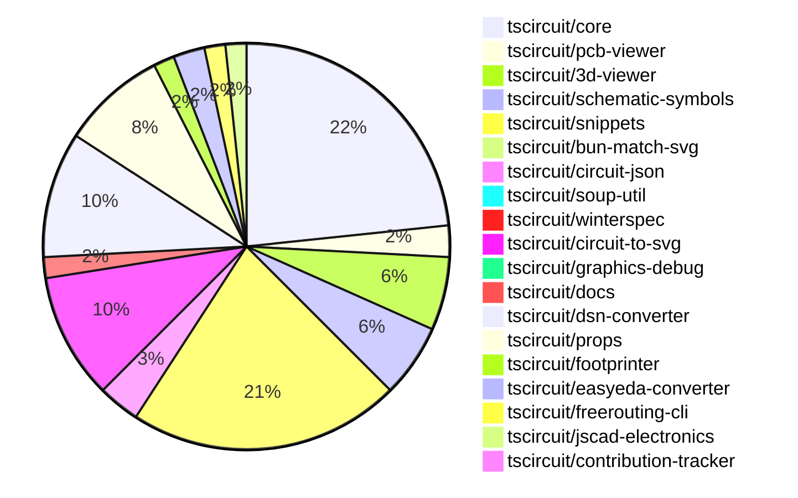

# contribution-tracker

Generates weekly contribution overviews for tscircuit contributors. Check out all
the [contribution overviews here](./contribution-overviews/)

* All PRs in the tscircuit org are scanned/summarized via Claude Haiku
* Claude classifies each Diff/PR as a Major, Minor or Tiny contribution
* All the PRs, summaries, and classifications are organized into charts and tables

The current week is shown below. There are 3 major sections:

* [Contributor Overview](#contributor-overview)
* [PRs by Repository](#prs-by-repository)
* [PRs by Contributor](#changes-by-contributor)

## Current Week

<!-- START_CURRENT_WEEK -->

# Contribution Overview 2024-11-13

## PRs by Repository

## Contributor Overview

| Contributor | 🐳 Major | 🐙 Minor | 🐌 Tiny | ⭐ |
|-------------|-------|-------|-------|-------|
| [seveibar](#seveibar) | 6 | 42 | 1 | 👑👑👑 |
| [imrishabh18](#imrishabh18) | 2 | 21 | 0 | ⭐⭐⭐ |
| [anas-sarkez](#anas-sarkez) | 5 | 9 | 2 | ⭐⭐⭐ |
| [ShiboSoftwareDev](#ShiboSoftwareDev) | 3 | 11 | 1 | ⭐⭐⭐ |
| [Abse2001](#Abse2001) | 1 | 6 | 0 | ⭐⭐ |
| [RohittCodes](#RohittCodes) | 1 | 4 | 0 | ⭐⭐ |
| [mrudulpatil18](#mrudulpatil18) | 0 | 4 | 0 | ⭐ |
| [kom-senapati](#kom-senapati) | 1 | 1 | 0 | ⭐ |
| [DhairyaMajmudar](#DhairyaMajmudar) | 1 | 0 | 0 | ⭐ |
| [Anshgrover23](#Anshgrover23) | 0 | 1 | 0 |  |
| [andrii-balitskyi](#andrii-balitskyi) | 0 | 0 | 1 |  |

## Review Table

| Contributor | Reviews Received | Approvals | Rejections | Changes Requested | PRs Opened | PRs Closed |
|-------------|------------------|-----------|------------|-------------------|------------|------------|
| [Abse2001](https://github.com/Abse2001) | 12 | 7 | 7 | 1 | 9 | 8 |
| [ShiboSoftwareDev](https://github.com/ShiboSoftwareDev) | 20 | 14 | 13 | 2 | 20 | 16 |
| [seveibar](https://github.com/seveibar) | 1 | 0 | 16 | 0 | 55 | 54 |
| [imrishabh18](https://github.com/imrishabh18) | 22 | 14 | 7 | 3 | 26 | 25 |
| [tscircuitbot](https://github.com/tscircuitbot) | 0 | 0 | 0 | 0 | 1 | 1 |
| [anas-sarkez](https://github.com/anas-sarkez) | 36 | 16 | 13 | 3 | 17 | 16 |
| [DhairyaMajmudar](https://github.com/DhairyaMajmudar) | 17 | 1 | 2 | 9 | 6 | 4 |
| [mrudulpatil18](https://github.com/mrudulpatil18) | 7 | 5 | 0 | 1 | 6 | 4 |
| [developerfred](https://github.com/developerfred) | 0 | 0 | 0 | 0 | 2 | 2 |
| [vishwamartur](https://github.com/vishwamartur) | 7 | 0 | 1 | 4 | 4 | 4 |
| [andrii-balitskyi](https://github.com/andrii-balitskyi) | 1 | 1 | 0 | 0 | 1 | 1 |
| [Anshgrover23](https://github.com/Anshgrover23) | 2 | 1 | 0 | 1 | 3 | 1 |
| [kom-senapati](https://github.com/kom-senapati) | 6 | 2 | 0 | 2 | 2 | 2 |
| [AkashJana18](https://github.com/AkashJana18) | 2 | 0 | 1 | 1 | 1 | 0 |
| [nocodeventure-nl](https://github.com/nocodeventure-nl) | 2 | 0 | 1 | 0 | 1 | 0 |
| [hunxjunedo](https://github.com/hunxjunedo) | 1 | 0 | 0 | 0 | 2 | 1 |
| [Niharika0104](https://github.com/Niharika0104) | 1 | 0 | 2 | 0 | 1 | 0 |
| [ni9999](https://github.com/ni9999) | 2 | 0 | 3 | 1 | 1 | 0 |
| [RohittCodes](https://github.com/RohittCodes) | 46 | 10 | 1 | 7 | 9 | 5 |

## Changes by Repository

### [tscircuit/core](https://github.com/tscircuit/core)

| PR # | Impact | Contributor | Description |
|------|--------|-------------|-------------|
| [#319](https://github.com/tscircuit/core/pull/319) | 🐳 Major | Abse2001 | Introduce a new `<pushbutton />` component |
| [#336](https://github.com/tscircuit/core/pull/336) | 🐳 Major | seveibar |  |
| [#297](https://github.com/tscircuit/core/pull/297) | 🐳 Major | seveibar | Fixes the logic for handling complex trace crossings in the schematic view. |
| [#300](https://github.com/tscircuit/core/pull/300) | 🐳 Major | imrishabh18 | Adds support for the 'Potentiometer' component in the circuit design library. |
| [#253](https://github.com/tscircuit/core/pull/253) | 🐳 Major | DhairyaMajmudar | Adds error handling for missing footprint in the `NormalComponent` class. |
| [#339](https://github.com/tscircuit/core/pull/339) | 🐙 Minor | Abse2001 | Implemented the `getInheritedProperty` method on the `PrimitiveComponent` class to retrieve property values from the component's parent hierarchy. |
| [#315](https://github.com/tscircuit/core/pull/315) | 🐙 Minor | ShiboSoftwareDev | Fixed non-port elements being added as ports for custom footprints |
| [#314](https://github.com/tscircuit/core/pull/314) | 🐙 Minor | ShiboSoftwareDev | Fixed rendering of battery symbol |
| [#334](https://github.com/tscircuit/core/pull/334) | 🐙 Minor | seveibar | Adds a GitHub Action workflow for the stale bot to automatically mark and close stale issues and pull requests. |
| [#326](https://github.com/tscircuit/core/pull/326) | 🐙 Minor | seveibar | Adds the ability to disable trace rendering inside of subcircuits |
| [#323](https://github.com/tscircuit/core/pull/323) | 🐙 Minor | seveibar | Adds write permissions to the GitHub Actions workflow for pull requests to enable bundle size reporting for non-organization members. |
| [#316](https://github.com/tscircuit/core/pull/316) | 🐙 Minor | seveibar | Fix Subcircuit Refdes Selection (Subcircuit Isolation Part 1) |
| [#309](https://github.com/tscircuit/core/pull/309) | 🐙 Minor | seveibar | Fix pin number type inference for createUseComponent hooks |
| [#305](https://github.com/tscircuit/core/pull/305) | 🐙 Minor | seveibar | Update the schematic-symbols package to version 0.0.98 |
| [#303](https://github.com/tscircuit/core/pull/303) | 🐙 Minor | seveibar | Adds directional symbol names for PrimitiveComponent. |
| [#299](https://github.com/tscircuit/core/pull/299) | 🐙 Minor | seveibar | Fix simplified overshot check in the `create-schematic-trace-crossing-segments.ts` file. |
| [#296](https://github.com/tscircuit/core/pull/296) | 🐙 Minor | seveibar | Fixes the facing direction of net labels in the Port component. |
| [#292](https://github.com/tscircuit/core/pull/292) | 🐙 Minor | seveibar | Allow `schPortArrangement` to accept strings in addition to numbers. |
| [#333](https://github.com/tscircuit/core/pull/333) | 🐙 Minor | imrishabh18 | Adds caching of the PCB trace route to improve rendering performance. |
| [#295](https://github.com/tscircuit/core/pull/295) | 🐙 Minor | imrishabh18 | Adjust the padding of the schematic box only when a label is present |
| [#294](https://github.com/tscircuit/core/pull/294) | 🐙 Minor | imrishabh18 | Adds a new `facingDirection` prop to the `PinHeader` component, which determines the orientation of the pins. |
| [#338](https://github.com/tscircuit/core/pull/338) | 🐙 Minor | anas-sarkez | Added support for tracing obstacles around schematic_box elements |
| [#335](https://github.com/tscircuit/core/pull/335) | 🐙 Minor | anas-sarkez | Resolved an issue where pin labels for the PinHeader component were not being drawn in SVG |
| [#325](https://github.com/tscircuit/core/pull/325) | 🐙 Minor | anas-sarkez | Modify the positioning of manufacturer part number and name label based on the component's port arrangement. |
| [#322](https://github.com/tscircuit/core/pull/322) | 🐙 Minor | anas-sarkez | Refactors the trace so the manufacturer labels are not passed to the chip manufacturer part number and name. |
| [#330](https://github.com/tscircuit/core/pull/330) | 🐌 Tiny | anas-sarkez | Updates the bun lockfile |
| [#329](https://github.com/tscircuit/core/pull/329) | 🐌 Tiny | anas-sarkez | Updated the project's dependency lockfile. |
| [#242](https://github.com/tscircuit/core/pull/242) | 🐌 Tiny | andrii-balitskyi | Adds a test for the `useDiode` hook, which creates diode components with the correct props and traces. |

### [tscircuit/pcb-viewer](https://github.com/tscircuit/pcb-viewer)

| PR # | Impact | Contributor | Description |
|------|--------|-------------|-------------|
| [#83](https://github.com/tscircuit/pcb-viewer/pull/83) | 🐙 Minor | Abse2001 | Fixed a type error by adding a non-null assertion operator (`!`) to a property access. |
| [#82](https://github.com/tscircuit/pcb-viewer/pull/82) | 🐙 Minor | ShiboSoftwareDev | Adds a biome format script to the project. |
| [#81](https://github.com/tscircuit/pcb-viewer/pull/81) | 🐙 Minor | seveibar | Update the README with details on using the `circuitJson` prop and add new props to the `PCBViewer` component. |

### [tscircuit/3d-viewer](https://github.com/tscircuit/3d-viewer)

| PR # | Impact | Contributor | Description |
|------|--------|-------------|-------------|
| [#44](https://github.com/tscircuit/3d-viewer/pull/44) | 🐳 Major | ShiboSoftwareDev | Allows plated holes to be either horizontal or vertical |
| [#38](https://github.com/tscircuit/3d-viewer/pull/38) | 🐳 Major | anas-sarkez | This pull request adds support for rendering pill-shaped board cutouts (holes) in the 3D viewer. |
| [#42](https://github.com/tscircuit/3d-viewer/pull/42) | 🐙 Minor | Abse2001 | Updates the project's lockfile by manually updating dependencies. |
| [#41](https://github.com/tscircuit/3d-viewer/pull/41) | 🐙 Minor | Abse2001 | Updating the `jscad-electronics` dependency to version 0.0.21 to fix an issue where the 3D capacitor color did not change in snippets. |
| [#40](https://github.com/tscircuit/3d-viewer/pull/40) | 🐙 Minor | imrishabh18 | Reverts the dependency update that was breaking the 3D viewer. |
| [#39](https://github.com/tscircuit/3d-viewer/pull/39) | 🐙 Minor | anas-sarkez | Update dependencies to newer versions |
| [#37](https://github.com/tscircuit/3d-viewer/pull/37) | 🐙 Minor | mrudulpatil18 | Positions the hover label below the pointer and updates its position frame by frame to prevent it from drifting away when the camera view changes. |

### [tscircuit/schematic-symbols](https://github.com/tscircuit/schematic-symbols)

| PR # | Impact | Contributor | Description |
|------|--------|-------------|-------------|
| [#204](https://github.com/tscircuit/schematic-symbols/pull/204) | 🐳 Major | seveibar | Flip y coordinates in the getSvg function and checkpoint rotating symbols. |
| [#198](https://github.com/tscircuit/schematic-symbols/pull/198) | 🐳 Major | anas-sarkez | Implemented flipSymbolOverYAxis and flipSymbolOverXAxis functions to modify LED arrows directions |
| [#195](https://github.com/tscircuit/schematic-symbols/pull/195) | 🐳 Major | anas-sarkez | The change updates the LED symbol to have "up", "right", "left", and "down" orientations instead of "horz" and "vert". |
| [#212](https://github.com/tscircuit/schematic-symbols/pull/212) | 🐙 Minor | Abse2001 | Create a function `approximateBezier` to improve 'C' case handling and add a new symbol `capacitor_polarised`. |
| [#206](https://github.com/tscircuit/schematic-symbols/pull/206) | 🐙 Minor | seveibar | Move the `modifySymbol` function from the `scripts/lib/modify-symbol/modify-symbol.ts` file to the `drawing/modify-symbol/modify-symbol.ts` file for export. |
| [#199](https://github.com/tscircuit/schematic-symbols/pull/199) | 🐙 Minor | seveibar | Adds capacitor symbols in four directions (down, left, right, up) |
| [#197](https://github.com/tscircuit/schematic-symbols/pull/197) | 🐙 Minor | imrishabh18 | Fix the position of the potentiometer label in the horizontal and vertical symbol definitions. |

### [tscircuit/snippets](https://github.com/tscircuit/snippets)

| PR # | Impact | Contributor | Description |
|------|--------|-------------|-------------|
| [#246](https://github.com/tscircuit/snippets/pull/246) | 🐳 Major | ShiboSoftwareDev | Adds a new feature to insert chip into the code editor |
| [#252](https://github.com/tscircuit/snippets/pull/252) | 🐳 Major | seveibar | Reverts a previous pull request that caused a regression where every snippet has red underlines until modified. |
| [#237](https://github.com/tscircuit/snippets/pull/237) | 🐳 Major | RohittCodes | Implements a route for fetching circuit images (PCB and schematic SVGs) for a given snippet. |
| [#247](https://github.com/tscircuit/snippets/pull/247) | 🐙 Minor | Abse2001 | Fixed 3D capacitor color not changing when using cap footprints |
| [#267](https://github.com/tscircuit/snippets/pull/267) | 🐙 Minor | ShiboSoftwareDev | Add a spinner on the run button when code is running |
| [#257](https://github.com/tscircuit/snippets/pull/257) | 🐙 Minor | ShiboSoftwareDev | Improve the user experience of the footprint insertion feature by adding a dropdown menu with the option to insert a footprint. |
| [#264](https://github.com/tscircuit/snippets/pull/264) | 🐙 Minor | seveibar | Improved keying for circuit JSON to handle changes in the circuit JSON. |
| [#263](https://github.com/tscircuit/snippets/pull/263) | 🐙 Minor | seveibar | Update the `@tscircuit/core` dependency to version `^0.0.193` |
| [#242](https://github.com/tscircuit/snippets/pull/242) | 🐙 Minor | seveibar | Redirect the `/playground` endpoint to the editor with a blank template |
| [#254](https://github.com/tscircuit/snippets/pull/254) | 🐙 Minor | seveibar | Add a GitHub link and stars badge to the landing page |
| [#240](https://github.com/tscircuit/snippets/pull/240) | 🐙 Minor | seveibar | Update renovate settings to include circuit-json package and group all dependency updates together |
| [#220](https://github.com/tscircuit/snippets/pull/220) | 🐙 Minor | seveibar | Update the versions of `@tscircuit/core` and `circuit-to-svg` to fix issues related to capacitor rotation. |
| [#213](https://github.com/tscircuit/snippets/pull/213) | 🐙 Minor | seveibar | Improve the PCBView reloading by using a unique `circuitJsonKey` instead of `tsxRunTriggerCount` to trigger a reload. |
| [#196](https://github.com/tscircuit/snippets/pull/196) | 🐙 Minor | seveibar | Adds support for asynchronous circuit rendering and opens BOM links in a new tab. |
| [#235](https://github.com/tscircuit/snippets/pull/235) | 🐙 Minor | imrishabh18 | Update the version of the `@tscircuit/3d-viewer` dependency to fix a 3D view issue. |
| [#208](https://github.com/tscircuit/snippets/pull/208) | 🐙 Minor | imrishabh18 | Adds a feature to download the DSN file for the circuit. |
| [#236](https://github.com/tscircuit/snippets/pull/236) | 🐙 Minor | mrudulpatil18 | Update the iframe embedding link for snippets to use the `/preview` endpoint. |
| [#179](https://github.com/tscircuit/snippets/pull/179) | 🐙 Minor | mrudulpatil18 | Added a /preview route to view the `<PreviewContent>` component and modified the sidebar to allow copying embed code for this route. |
| [#206](https://github.com/tscircuit/snippets/pull/206) | 🐙 Minor | mrudulpatil18 |  |
| [#218](https://github.com/tscircuit/snippets/pull/218) | 🐙 Minor | kom-senapati | This pull request adds a utility function to get the React TypeScript syntax error message and uses it within the `use-run-tsx` hook to return the syntax error message if there is one. |
| [#268](https://github.com/tscircuit/snippets/pull/268) | 🐙 Minor | RohittCodes | Fix the issue where "Unsaved Changes" message was displayed incorrectly due to `manualEditsFileContent` not being initialized with the `manual_edit_json` when the page loaded. |
| [#248](https://github.com/tscircuit/snippets/pull/248) | 🐙 Minor | RohittCodes | Adds a new field `manual_edits_json` to the `snippets` table schema and updates the `snippets/update` API endpoint to handle the new field. |
| [#250](https://github.com/tscircuit/snippets/pull/250) | 🐙 Minor | RohittCodes | Fixes an issue where an unnecessary dispatch causes the editor to update the content, resulting in the cursor going to line 0. |
| [#182](https://github.com/tscircuit/snippets/pull/182) | 🐙 Minor | RohittCodes | Refactor the search text component to handle different viewport sizes in Playwright tests. |
| [#233](https://github.com/tscircuit/snippets/pull/233) | 🐙 Minor | Anshgrover23 | Fixes an issue where hovering over traces did not change the color, by setting the `pointerEvents` CSS property to `auto`. |
| [#258](https://github.com/tscircuit/snippets/pull/258) | 🐌 Tiny | seveibar | Skips parts engine test on CI |

### [tscircuit/bun-match-svg](https://github.com/tscircuit/bun-match-svg)

| PR # | Impact | Contributor | Description |
|------|--------|-------------|-------------|
| [#4](https://github.com/tscircuit/bun-match-svg/pull/4) | 🐳 Major | ShiboSoftwareDev | Implemented a CLI tool that initializes the project in other repositories. |

### [tscircuit/circuit-json](https://github.com/tscircuit/circuit-json)

| PR # | Impact | Contributor | Description |
|------|--------|-------------|-------------|
| [#82](https://github.com/tscircuit/circuit-json/pull/82) | 🐙 Minor | ShiboSoftwareDev | Added a new "rotated_rect" shape for SMT pads on the PCB. |
| [#81](https://github.com/tscircuit/circuit-json/pull/81) | 🐙 Minor | imrishabh18 | Adds support for a new source component called "crystal" to the project. |
| [#80](https://github.com/tscircuit/circuit-json/pull/80) | 🐙 Minor | imrishabh18 | Add support for exporting potentiometer as a circuit element. |
| [#79](https://github.com/tscircuit/circuit-json/pull/79) | 🐙 Minor | imrishabh18 | Adds a new source component for a simple potentiometer. |

### [tscircuit/soup-util](https://github.com/tscircuit/soup-util)

| PR # | Impact | Contributor | Description |
|------|--------|-------------|-------------|
| [#25](https://github.com/tscircuit/soup-util/pull/25) | 🐙 Minor | ShiboSoftwareDev | Updated the `circuit-json` dependency to a newer version (from `0.0.85` to `0.0.106`) |

### [tscircuit/winterspec](https://github.com/tscircuit/winterspec)

| PR # | Impact | Contributor | Description |
|------|--------|-------------|-------------|
| [#22](https://github.com/tscircuit/winterspec/pull/22) | 🐙 Minor | ShiboSoftwareDev | Exports common middleware with testing |

### [tscircuit/circuit-to-svg](https://github.com/tscircuit/circuit-to-svg)

| PR # | Impact | Contributor | Description |
|------|--------|-------------|-------------|
| [#137](https://github.com/tscircuit/circuit-to-svg/pull/137) | 🐙 Minor | ShiboSoftwareDev | Rotate the rectangles representing SMT pads counter-clockwise instead of clockwise. |
| [#136](https://github.com/tscircuit/circuit-to-svg/pull/136) | 🐙 Minor | ShiboSoftwareDev | Adds support for rotated rectangular SMT pads in the PCB SVG rendering. |
| [#130](https://github.com/tscircuit/circuit-to-svg/pull/130) | 🐙 Minor | seveibar | Fixes outline scaling for trace stroke sizes and improves hovering over traces |
| [#129](https://github.com/tscircuit/circuit-to-svg/pull/129) | 🐙 Minor | seveibar | Fix an issue where the pin number text gets offset with large bounds |
| [#127](https://github.com/tscircuit/circuit-to-svg/pull/127) | 🐙 Minor | seveibar | Move `circuit-json` and `schematic-symbols` from `dependencies` to `peerDependencies`. |
| [#126](https://github.com/tscircuit/circuit-to-svg/pull/126) | 🐙 Minor | seveibar | Fix grid not appearing at boundaries and fix traces not being used in bounds calculation. |
| [#124](https://github.com/tscircuit/circuit-to-svg/pull/124) | 🐙 Minor | seveibar | Change the trace color on hover and make the paths rounded. |
| [#121](https://github.com/tscircuit/circuit-to-svg/pull/121) | 🐙 Minor | seveibar | Reverts the previous fix for the top and bottom anchor position of net labels. |
| [#120](https://github.com/tscircuit/circuit-to-svg/pull/120) | 🐙 Minor | imrishabh18 | Fixed the top and bottom anchor position for the schematic net label |
| [#134](https://github.com/tscircuit/circuit-to-svg/pull/134) | 🐙 Minor | anas-sarkez | Renders pin labels for the PinHeader component in SVG. |
| [#133](https://github.com/tscircuit/circuit-to-svg/pull/133) | 🐙 Minor | anas-sarkez | Updated the circuit-to-svg library to stop drawing the manufacturer part numbers. |
| [#132](https://github.com/tscircuit/circuit-to-svg/pull/132) | 🐙 Minor | anas-sarkez | Implemented a function to create SVG text objects for schematic text elements. |

### [tscircuit/graphics-debug](https://github.com/tscircuit/graphics-debug)

| PR # | Impact | Contributor | Description |
|------|--------|-------------|-------------|
| [#9](https://github.com/tscircuit/graphics-debug/pull/9) | 🐙 Minor | ShiboSoftwareDev | The pull request adds error handling to the `Home` component, displaying an error message when the input cannot be parsed. |

### [tscircuit/docs](https://github.com/tscircuit/docs)

| PR # | Impact | Contributor | Description |
|------|--------|-------------|-------------|
| [#37](https://github.com/tscircuit/docs/pull/37) | 🐙 Minor | imrishabh18 | Add documentation for the motor driver circuit |
| [#38](https://github.com/tscircuit/docs/pull/38) | 🐌 Tiny | ShiboSoftwareDev | Fixes a typo in the "pushbutton-led-circuit.mdx" tutorial. |

### [tscircuit/dsn-converter](https://github.com/tscircuit/dsn-converter)

| PR # | Impact | Contributor | Description |
|------|--------|-------------|-------------|
| [#24](https://github.com/tscircuit/dsn-converter/pull/24) | 🐳 Major | seveibar | Converts a circuit JSON representation to a DSN session format, including components, ports, nets, and traces. |
| [#20](https://github.com/tscircuit/dsn-converter/pull/20) | 🐳 Major | seveibar | Introduces initial support for parsing and converting DSN (Design Session) JSON format to Circuit JSON format. |
| [#26](https://github.com/tscircuit/dsn-converter/pull/26) | 🐙 Minor | seveibar | Adjust the scale factor for converting DSN session to circuit JSON. |
| [#25](https://github.com/tscircuit/dsn-converter/pull/25) | 🐙 Minor | seveibar | Fixes session JSON related issues |
| [#22](https://github.com/tscircuit/dsn-converter/pull/22) | 🐙 Minor | seveibar | Add support for stringifying DSN sessions |
| [#21](https://github.com/tscircuit/dsn-converter/pull/21) | 🐙 Minor | seveibar | Fixes parsing of DSN session data |
| [#28](https://github.com/tscircuit/dsn-converter/pull/28) | 🟣 | imrishabh18 | Fix the plated hole DSN file format and net |
| [#16](https://github.com/tscircuit/dsn-converter/pull/16) | 🐳 Major | imrishabh18 | Fixes the conversion of circuit JSON to DSN file by adding support for processing PCB traces. |
| [#27](https://github.com/tscircuit/dsn-converter/pull/27) | 🐙 Minor | imrishabh18 | Fixes a scaling issue in the session by adjusting the transformation factor for traces. |
| [#23](https://github.com/tscircuit/dsn-converter/pull/23) | 🐙 Minor | imrishabh18 | Restore the processing of PCB traces in the conversion from circuit JSON to DSN JSON. |
| [#19](https://github.com/tscircuit/dsn-converter/pull/19) | 🐙 Minor | imrishabh18 | Add support for plated holes and rotation on surface-mount pads. |
| [#18](https://github.com/tscircuit/dsn-converter/pull/18) | 🐙 Minor | imrishabh18 | Removed the processing of PCB traces, as they will be handled by the freerouting's autorouter. |

### [tscircuit/props](https://github.com/tscircuit/props)

| PR # | Impact | Contributor | Description |
|------|--------|-------------|-------------|
| [#103](https://github.com/tscircuit/props/pull/103) | 🐙 Minor | seveibar | Adds an "autorouter" property to the SubcircuitGroupProps interface, which can be either an AutorouterConfig object or one of the literal values "auto", "auto-local", or "auto-cloud". |
| [#99](https://github.com/tscircuit/props/pull/99) | 🐙 Minor | seveibar | Allow group prop discrimination to fix parsing issues |
| [#98](https://github.com/tscircuit/props/pull/98) | 🐙 Minor | seveibar | Removes the requirement for the `subcircuit: true` boolean property on subcircuits, making it optional. |
| [#97](https://github.com/tscircuit/props/pull/97) | 🐙 Minor | seveibar | Add a new file for subcircuit component |
| [#92](https://github.com/tscircuit/props/pull/92) | 🐙 Minor | seveibar | Allow strings and numbers to be defined together for pinLabels, and improve `expectTypesMatch` errors |
| [#102](https://github.com/tscircuit/props/pull/102) | 🐙 Minor | imrishabh18 | Add missing export for `PcbRouteCache` interface |
| [#101](https://github.com/tscircuit/props/pull/101) | 🐙 Minor | imrishabh18 | Add `pcbRouteCache` property to `SubcircuitGroupProps` interface. |
| [#100](https://github.com/tscircuit/props/pull/100) | 🐙 Minor | imrishabh18 | Add new `crystal` component |
| [#96](https://github.com/tscircuit/props/pull/96) | 🐙 Minor | imrishabh18 | Add a new component called "potentiometer" to the library. |
| [#93](https://github.com/tscircuit/props/pull/93) | 🐙 Minor | imrishabh18 | Adds a new prop "facingDirection" to the `pinHeader` component to specify the direction the header is facing. |

### [tscircuit/footprinter](https://github.com/tscircuit/footprinter)

| PR # | Impact | Contributor | Description |
|------|--------|-------------|-------------|
| [#81](https://github.com/tscircuit/footprinter/pull/81) | 🐙 Minor | seveibar | Adds a new test case for generating a PCB SVG with a custom-sized thermal pad. |
| [#83](https://github.com/tscircuit/footprinter/pull/83) | 🐙 Minor | anas-sarkez | Refactor all footprinter functions by updating their scheme, setting the default value of `num_pins` for all footprints. |

### [tscircuit/easyeda-converter](https://github.com/tscircuit/easyeda-converter)

| PR # | Impact | Contributor | Description |
|------|--------|-------------|-------------|
| [#112](https://github.com/tscircuit/easyeda-converter/pull/112) | 🐙 Minor | seveibar | Ensures that short part numbers fetch correctly from the EasyEDA API. |
| [#108](https://github.com/tscircuit/easyeda-converter/pull/108) | 🐙 Minor | seveibar | Add the `manufacturerPartNumber` prop to the `soupTypescriptComponentTemplate`. |
| [#107](https://github.com/tscircuit/easyeda-converter/pull/107) | 🐙 Minor | seveibar | Changes the supplier from LCSC to JLCPCB in the `convert-to-typescript-component` module. |

### [tscircuit/freerouting-cli](https://github.com/tscircuit/freerouting-cli)

| PR # | Impact | Contributor | Description |
|------|--------|-------------|-------------|
| [#3](https://github.com/tscircuit/freerouting-cli/pull/3) | 🐙 Minor | seveibar | Adds a command to start a local Freerouting server using Docker. |
| [#2](https://github.com/tscircuit/freerouting-cli/pull/2) | 🐙 Minor | seveibar | Adds a biome dependency, fixes config commands, and includes various other fixes. |

### [tscircuit/jscad-electronics](https://github.com/tscircuit/jscad-electronics)

| PR # | Impact | Contributor | Description |
|------|--------|-------------|-------------|
| [#79](https://github.com/tscircuit/jscad-electronics/pull/79) | 🐳 Major | anas-sarkez | Implemented a 3D StampBoard component with customizable dimensions and options for including inner holes. |
| [#78](https://github.com/tscircuit/jscad-electronics/pull/78) | 🐳 Major | anas-sarkez | Refactor QFN 3D element and add a QFN Footprinter3d example |

### [tscircuit/contribution-tracker](https://github.com/tscircuit/contribution-tracker)

| PR # | Impact | Contributor | Description |
|------|--------|-------------|-------------|
| [#6](https://github.com/tscircuit/contribution-tracker/pull/6) | 🐳 Major | kom-senapati |  |

## Changes by Contributor

### [Abse2001](https://github.com/Abse2001)

| PR # | Impact | Description |
|------|--------|-------------|
| [#319](https://github.com/tscircuit/core/pull/319) | 🐳 Major | Introduce a new `<pushbutton />` component |
| [#83](https://github.com/tscircuit/pcb-viewer/pull/83) | 🐙 Minor | Fixed a type error by adding a non-null assertion operator (`!`) to a property access. |
| [#42](https://github.com/tscircuit/3d-viewer/pull/42) | 🐙 Minor | Updates the project's lockfile by manually updating dependencies. |
| [#41](https://github.com/tscircuit/3d-viewer/pull/41) | 🐙 Minor | Updating the `jscad-electronics` dependency to version 0.0.21 to fix an issue where the 3D capacitor color did not change in snippets. |
| [#339](https://github.com/tscircuit/core/pull/339) | 🐙 Minor | Implemented the `getInheritedProperty` method on the `PrimitiveComponent` class to retrieve property values from the component's parent hierarchy. |
| [#212](https://github.com/tscircuit/schematic-symbols/pull/212) | 🐙 Minor | Create a function `approximateBezier` to improve 'C' case handling and add a new symbol `capacitor_polarised`. |
| [#247](https://github.com/tscircuit/snippets/pull/247) | 🐙 Minor | Fixed 3D capacitor color not changing when using cap footprints |

### [ShiboSoftwareDev](https://github.com/ShiboSoftwareDev)

| PR # | Impact | Description |
|------|--------|-------------|
| [#44](https://github.com/tscircuit/3d-viewer/pull/44) | 🐳 Major | Allows plated holes to be either horizontal or vertical |
| [#4](https://github.com/tscircuit/bun-match-svg/pull/4) | 🐳 Major | Implemented a CLI tool that initializes the project in other repositories. |
| [#246](https://github.com/tscircuit/snippets/pull/246) | 🐳 Major | Adds a new feature to insert chip into the code editor |
| [#82](https://github.com/tscircuit/pcb-viewer/pull/82) | 🐙 Minor | Adds a biome format script to the project. |
| [#82](https://github.com/tscircuit/circuit-json/pull/82) | 🐙 Minor | Added a new "rotated_rect" shape for SMT pads on the PCB. |
| [#25](https://github.com/tscircuit/soup-util/pull/25) | 🐙 Minor | Updated the `circuit-json` dependency to a newer version (from `0.0.85` to `0.0.106`) |
| [#22](https://github.com/tscircuit/winterspec/pull/22) | 🐙 Minor | Exports common middleware with testing |
| [#315](https://github.com/tscircuit/core/pull/315) | 🐙 Minor | Fixed non-port elements being added as ports for custom footprints |
| [#314](https://github.com/tscircuit/core/pull/314) | 🐙 Minor | Fixed rendering of battery symbol |
| [#137](https://github.com/tscircuit/circuit-to-svg/pull/137) | 🐙 Minor | Rotate the rectangles representing SMT pads counter-clockwise instead of clockwise. |
| [#136](https://github.com/tscircuit/circuit-to-svg/pull/136) | 🐙 Minor | Adds support for rotated rectangular SMT pads in the PCB SVG rendering. |
| [#267](https://github.com/tscircuit/snippets/pull/267) | 🐙 Minor | Add a spinner on the run button when code is running |
| [#257](https://github.com/tscircuit/snippets/pull/257) | 🐙 Minor | Improve the user experience of the footprint insertion feature by adding a dropdown menu with the option to insert a footprint. |
| [#9](https://github.com/tscircuit/graphics-debug/pull/9) | 🐙 Minor | The pull request adds error handling to the `Home` component, displaying an error message when the input cannot be parsed. |
| [#38](https://github.com/tscircuit/docs/pull/38) | 🐌 Tiny | Fixes a typo in the "pushbutton-led-circuit.mdx" tutorial. |

### [seveibar](https://github.com/seveibar)

| PR # | Impact | Description |
|------|--------|-------------|
| [#336](https://github.com/tscircuit/core/pull/336) | 🐳 Major |  |
| [#297](https://github.com/tscircuit/core/pull/297) | 🐳 Major | Fixes the logic for handling complex trace crossings in the schematic view. |
| [#204](https://github.com/tscircuit/schematic-symbols/pull/204) | 🐳 Major | Flip y coordinates in the getSvg function and checkpoint rotating symbols. |
| [#24](https://github.com/tscircuit/dsn-converter/pull/24) | 🐳 Major | Converts a circuit JSON representation to a DSN session format, including components, ports, nets, and traces. |
| [#20](https://github.com/tscircuit/dsn-converter/pull/20) | 🐳 Major | Introduces initial support for parsing and converting DSN (Design Session) JSON format to Circuit JSON format. |
| [#252](https://github.com/tscircuit/snippets/pull/252) | 🐳 Major | Reverts a previous pull request that caused a regression where every snippet has red underlines until modified. |
| [#81](https://github.com/tscircuit/pcb-viewer/pull/81) | 🐙 Minor | Update the README with details on using the `circuitJson` prop and add new props to the `PCBViewer` component. |
| [#103](https://github.com/tscircuit/props/pull/103) | 🐙 Minor | Adds an "autorouter" property to the SubcircuitGroupProps interface, which can be either an AutorouterConfig object or one of the literal values "auto", "auto-local", or "auto-cloud". |
| [#99](https://github.com/tscircuit/props/pull/99) | 🐙 Minor | Allow group prop discrimination to fix parsing issues |
| [#98](https://github.com/tscircuit/props/pull/98) | 🐙 Minor | Removes the requirement for the `subcircuit: true` boolean property on subcircuits, making it optional. |
| [#97](https://github.com/tscircuit/props/pull/97) | 🐙 Minor | Add a new file for subcircuit component |
| [#92](https://github.com/tscircuit/props/pull/92) | 🐙 Minor | Allow strings and numbers to be defined together for pinLabels, and improve `expectTypesMatch` errors |
| [#81](https://github.com/tscircuit/footprinter/pull/81) | 🐙 Minor | Adds a new test case for generating a PCB SVG with a custom-sized thermal pad. |
| [#112](https://github.com/tscircuit/easyeda-converter/pull/112) | 🐙 Minor | Ensures that short part numbers fetch correctly from the EasyEDA API. |
| [#108](https://github.com/tscircuit/easyeda-converter/pull/108) | 🐙 Minor | Add the `manufacturerPartNumber` prop to the `soupTypescriptComponentTemplate`. |
| [#107](https://github.com/tscircuit/easyeda-converter/pull/107) | 🐙 Minor | Changes the supplier from LCSC to JLCPCB in the `convert-to-typescript-component` module. |
| [#334](https://github.com/tscircuit/core/pull/334) | 🐙 Minor | Adds a GitHub Action workflow for the stale bot to automatically mark and close stale issues and pull requests. |
| [#326](https://github.com/tscircuit/core/pull/326) | 🐙 Minor | Adds the ability to disable trace rendering inside of subcircuits |
| [#323](https://github.com/tscircuit/core/pull/323) | 🐙 Minor | Adds write permissions to the GitHub Actions workflow for pull requests to enable bundle size reporting for non-organization members. |
| [#316](https://github.com/tscircuit/core/pull/316) | 🐙 Minor | Fix Subcircuit Refdes Selection (Subcircuit Isolation Part 1) |
| [#309](https://github.com/tscircuit/core/pull/309) | 🐙 Minor | Fix pin number type inference for createUseComponent hooks |
| [#305](https://github.com/tscircuit/core/pull/305) | 🐙 Minor | Update the schematic-symbols package to version 0.0.98 |
| [#303](https://github.com/tscircuit/core/pull/303) | 🐙 Minor | Adds directional symbol names for PrimitiveComponent. |
| [#299](https://github.com/tscircuit/core/pull/299) | 🐙 Minor | Fix simplified overshot check in the `create-schematic-trace-crossing-segments.ts` file. |
| [#296](https://github.com/tscircuit/core/pull/296) | 🐙 Minor | Fixes the facing direction of net labels in the Port component. |
| [#292](https://github.com/tscircuit/core/pull/292) | 🐙 Minor | Allow `schPortArrangement` to accept strings in addition to numbers. |
| [#130](https://github.com/tscircuit/circuit-to-svg/pull/130) | 🐙 Minor | Fixes outline scaling for trace stroke sizes and improves hovering over traces |
| [#129](https://github.com/tscircuit/circuit-to-svg/pull/129) | 🐙 Minor | Fix an issue where the pin number text gets offset with large bounds |
| [#127](https://github.com/tscircuit/circuit-to-svg/pull/127) | 🐙 Minor | Move `circuit-json` and `schematic-symbols` from `dependencies` to `peerDependencies`. |
| [#126](https://github.com/tscircuit/circuit-to-svg/pull/126) | 🐙 Minor | Fix grid not appearing at boundaries and fix traces not being used in bounds calculation. |
| [#124](https://github.com/tscircuit/circuit-to-svg/pull/124) | 🐙 Minor | Change the trace color on hover and make the paths rounded. |
| [#121](https://github.com/tscircuit/circuit-to-svg/pull/121) | 🐙 Minor | Reverts the previous fix for the top and bottom anchor position of net labels. |
| [#206](https://github.com/tscircuit/schematic-symbols/pull/206) | 🐙 Minor | Move the `modifySymbol` function from the `scripts/lib/modify-symbol/modify-symbol.ts` file to the `drawing/modify-symbol/modify-symbol.ts` file for export. |
| [#199](https://github.com/tscircuit/schematic-symbols/pull/199) | 🐙 Minor | Adds capacitor symbols in four directions (down, left, right, up) |
| [#26](https://github.com/tscircuit/dsn-converter/pull/26) | 🐙 Minor | Adjust the scale factor for converting DSN session to circuit JSON. |
| [#25](https://github.com/tscircuit/dsn-converter/pull/25) | 🐙 Minor | Fixes session JSON related issues |
| [#22](https://github.com/tscircuit/dsn-converter/pull/22) | 🐙 Minor | Add support for stringifying DSN sessions |
| [#21](https://github.com/tscircuit/dsn-converter/pull/21) | 🐙 Minor | Fixes parsing of DSN session data |
| [#264](https://github.com/tscircuit/snippets/pull/264) | 🐙 Minor | Improved keying for circuit JSON to handle changes in the circuit JSON. |
| [#263](https://github.com/tscircuit/snippets/pull/263) | 🐙 Minor | Update the `@tscircuit/core` dependency to version `^0.0.193` |
| [#242](https://github.com/tscircuit/snippets/pull/242) | 🐙 Minor | Redirect the `/playground` endpoint to the editor with a blank template |
| [#254](https://github.com/tscircuit/snippets/pull/254) | 🐙 Minor | Add a GitHub link and stars badge to the landing page |
| [#240](https://github.com/tscircuit/snippets/pull/240) | 🐙 Minor | Update renovate settings to include circuit-json package and group all dependency updates together |
| [#220](https://github.com/tscircuit/snippets/pull/220) | 🐙 Minor | Update the versions of `@tscircuit/core` and `circuit-to-svg` to fix issues related to capacitor rotation. |
| [#213](https://github.com/tscircuit/snippets/pull/213) | 🐙 Minor | Improve the PCBView reloading by using a unique `circuitJsonKey` instead of `tsxRunTriggerCount` to trigger a reload. |
| [#196](https://github.com/tscircuit/snippets/pull/196) | 🐙 Minor | Adds support for asynchronous circuit rendering and opens BOM links in a new tab. |
| [#3](https://github.com/tscircuit/freerouting-cli/pull/3) | 🐙 Minor | Adds a command to start a local Freerouting server using Docker. |
| [#2](https://github.com/tscircuit/freerouting-cli/pull/2) | 🐙 Minor | Adds a biome dependency, fixes config commands, and includes various other fixes. |
| [#258](https://github.com/tscircuit/snippets/pull/258) | 🐌 Tiny | Skips parts engine test on CI |

### [imrishabh18](https://github.com/imrishabh18)

| PR # | Impact | Description |
|------|--------|-------------|
| [#300](https://github.com/tscircuit/core/pull/300) | 🐳 Major | Adds support for the 'Potentiometer' component in the circuit design library. |
| [#81](https://github.com/tscircuit/circuit-json/pull/81) | 🐙 Minor | Adds support for a new source component called "crystal" to the project. |
| [#80](https://github.com/tscircuit/circuit-json/pull/80) | 🐙 Minor | Add support for exporting potentiometer as a circuit element. |
| [#79](https://github.com/tscircuit/circuit-json/pull/79) | 🐙 Minor | Adds a new source component for a simple potentiometer. |
| [#37](https://github.com/tscircuit/docs/pull/37) | 🐙 Minor | Add documentation for the motor driver circuit |
| [#102](https://github.com/tscircuit/props/pull/102) | 🐙 Minor | Add missing export for `PcbRouteCache` interface |
| [#101](https://github.com/tscircuit/props/pull/101) | 🐙 Minor | Add `pcbRouteCache` property to `SubcircuitGroupProps` interface. |
| [#100](https://github.com/tscircuit/props/pull/100) | 🐙 Minor | Add new `crystal` component |
| [#96](https://github.com/tscircuit/props/pull/96) | 🐙 Minor | Add a new component called "potentiometer" to the library. |
| [#93](https://github.com/tscircuit/props/pull/93) | 🐙 Minor | Adds a new prop "facingDirection" to the `pinHeader` component to specify the direction the header is facing. |
| [#40](https://github.com/tscircuit/3d-viewer/pull/40) | 🐙 Minor | Reverts the dependency update that was breaking the 3D viewer. |
| [#333](https://github.com/tscircuit/core/pull/333) | 🐙 Minor | Adds caching of the PCB trace route to improve rendering performance. |
| [#295](https://github.com/tscircuit/core/pull/295) | 🐙 Minor | Adjust the padding of the schematic box only when a label is present |
| [#294](https://github.com/tscircuit/core/pull/294) | 🐙 Minor | Adds a new `facingDirection` prop to the `PinHeader` component, which determines the orientation of the pins. |
| [#120](https://github.com/tscircuit/circuit-to-svg/pull/120) | 🐙 Minor | Fixed the top and bottom anchor position for the schematic net label |
| [#197](https://github.com/tscircuit/schematic-symbols/pull/197) | 🐙 Minor | Fix the position of the potentiometer label in the horizontal and vertical symbol definitions. |
| [#28](https://github.com/tscircuit/dsn-converter/pull/28) | 🟣 | Fix the plated hole DSN file format and net |
| [#16](https://github.com/tscircuit/dsn-converter/pull/16) | 🐳 Major | Fixes the conversion of circuit JSON to DSN file by adding support for processing PCB traces. |
| [#27](https://github.com/tscircuit/dsn-converter/pull/27) | 🐙 Minor | Fixes a scaling issue in the session by adjusting the transformation factor for traces. |
| [#23](https://github.com/tscircuit/dsn-converter/pull/23) | 🐙 Minor | Restore the processing of PCB traces in the conversion from circuit JSON to DSN JSON. |
| [#19](https://github.com/tscircuit/dsn-converter/pull/19) | 🐙 Minor | Add support for plated holes and rotation on surface-mount pads. |
| [#18](https://github.com/tscircuit/dsn-converter/pull/18) | 🐙 Minor | Removed the processing of PCB traces, as they will be handled by the freerouting's autorouter. |
| [#235](https://github.com/tscircuit/snippets/pull/235) | 🐙 Minor | Update the version of the `@tscircuit/3d-viewer` dependency to fix a 3D view issue. |
| [#208](https://github.com/tscircuit/snippets/pull/208) | 🐙 Minor | Adds a feature to download the DSN file for the circuit. |

### [anas-sarkez](https://github.com/anas-sarkez)

| PR # | Impact | Description |
|------|--------|-------------|
| [#38](https://github.com/tscircuit/3d-viewer/pull/38) | 🐳 Major | This pull request adds support for rendering pill-shaped board cutouts (holes) in the 3D viewer. |
| [#79](https://github.com/tscircuit/jscad-electronics/pull/79) | 🐳 Major | Implemented a 3D StampBoard component with customizable dimensions and options for including inner holes. |
| [#78](https://github.com/tscircuit/jscad-electronics/pull/78) | 🐳 Major | Refactor QFN 3D element and add a QFN Footprinter3d example |
| [#198](https://github.com/tscircuit/schematic-symbols/pull/198) | 🐳 Major | Implemented flipSymbolOverYAxis and flipSymbolOverXAxis functions to modify LED arrows directions |
| [#195](https://github.com/tscircuit/schematic-symbols/pull/195) | 🐳 Major | The change updates the LED symbol to have "up", "right", "left", and "down" orientations instead of "horz" and "vert". |
| [#83](https://github.com/tscircuit/footprinter/pull/83) | 🐙 Minor | Refactor all footprinter functions by updating their scheme, setting the default value of `num_pins` for all footprints. |
| [#39](https://github.com/tscircuit/3d-viewer/pull/39) | 🐙 Minor | Update dependencies to newer versions |
| [#338](https://github.com/tscircuit/core/pull/338) | 🐙 Minor | Added support for tracing obstacles around schematic_box elements |
| [#335](https://github.com/tscircuit/core/pull/335) | 🐙 Minor | Resolved an issue where pin labels for the PinHeader component were not being drawn in SVG |
| [#325](https://github.com/tscircuit/core/pull/325) | 🐙 Minor | Modify the positioning of manufacturer part number and name label based on the component's port arrangement. |
| [#322](https://github.com/tscircuit/core/pull/322) | 🐙 Minor | Refactors the trace so the manufacturer labels are not passed to the chip manufacturer part number and name. |
| [#134](https://github.com/tscircuit/circuit-to-svg/pull/134) | 🐙 Minor | Renders pin labels for the PinHeader component in SVG. |
| [#133](https://github.com/tscircuit/circuit-to-svg/pull/133) | 🐙 Minor | Updated the circuit-to-svg library to stop drawing the manufacturer part numbers. |
| [#132](https://github.com/tscircuit/circuit-to-svg/pull/132) | 🐙 Minor | Implemented a function to create SVG text objects for schematic text elements. |
| [#330](https://github.com/tscircuit/core/pull/330) | 🐌 Tiny | Updates the bun lockfile |
| [#329](https://github.com/tscircuit/core/pull/329) | 🐌 Tiny | Updated the project's dependency lockfile. |

### [mrudulpatil18](https://github.com/mrudulpatil18)

| PR # | Impact | Description |
|------|--------|-------------|
| [#37](https://github.com/tscircuit/3d-viewer/pull/37) | 🐙 Minor | Positions the hover label below the pointer and updates its position frame by frame to prevent it from drifting away when the camera view changes. |
| [#236](https://github.com/tscircuit/snippets/pull/236) | 🐙 Minor | Update the iframe embedding link for snippets to use the `/preview` endpoint. |
| [#179](https://github.com/tscircuit/snippets/pull/179) | 🐙 Minor | Added a /preview route to view the `<PreviewContent>` component and modified the sidebar to allow copying embed code for this route. |
| [#206](https://github.com/tscircuit/snippets/pull/206) | 🐙 Minor |  |

### [DhairyaMajmudar](https://github.com/DhairyaMajmudar)

| PR # | Impact | Description |
|------|--------|-------------|
| [#253](https://github.com/tscircuit/core/pull/253) | 🐳 Major | Adds error handling for missing footprint in the `NormalComponent` class. |

### [andrii-balitskyi](https://github.com/andrii-balitskyi)

| PR # | Impact | Description |
|------|--------|-------------|
| [#242](https://github.com/tscircuit/core/pull/242) | 🐌 Tiny | Adds a test for the `useDiode` hook, which creates diode components with the correct props and traces. |

### [kom-senapati](https://github.com/kom-senapati)

| PR # | Impact | Description |
|------|--------|-------------|
| [#6](https://github.com/tscircuit/contribution-tracker/pull/6) | 🐳 Major |  |
| [#218](https://github.com/tscircuit/snippets/pull/218) | 🐙 Minor | This pull request adds a utility function to get the React TypeScript syntax error message and uses it within the `use-run-tsx` hook to return the syntax error message if there is one. |

### [RohittCodes](https://github.com/RohittCodes)

| PR # | Impact | Description |
|------|--------|-------------|
| [#237](https://github.com/tscircuit/snippets/pull/237) | 🐳 Major | Implements a route for fetching circuit images (PCB and schematic SVGs) for a given snippet. |
| [#268](https://github.com/tscircuit/snippets/pull/268) | 🐙 Minor | Fix the issue where "Unsaved Changes" message was displayed incorrectly due to `manualEditsFileContent` not being initialized with the `manual_edit_json` when the page loaded. |
| [#248](https://github.com/tscircuit/snippets/pull/248) | 🐙 Minor | Adds a new field `manual_edits_json` to the `snippets` table schema and updates the `snippets/update` API endpoint to handle the new field. |
| [#250](https://github.com/tscircuit/snippets/pull/250) | 🐙 Minor | Fixes an issue where an unnecessary dispatch causes the editor to update the content, resulting in the cursor going to line 0. |
| [#182](https://github.com/tscircuit/snippets/pull/182) | 🐙 Minor | Refactor the search text component to handle different viewport sizes in Playwright tests. |

### [Anshgrover23](https://github.com/Anshgrover23)

| PR # | Impact | Description |
|------|--------|-------------|
| [#233](https://github.com/tscircuit/snippets/pull/233) | 🐙 Minor | Fixes an issue where hovering over traces did not change the color, by setting the `pointerEvents` CSS property to `auto`. |

<!-- END_CURRENT_WEEK -->
