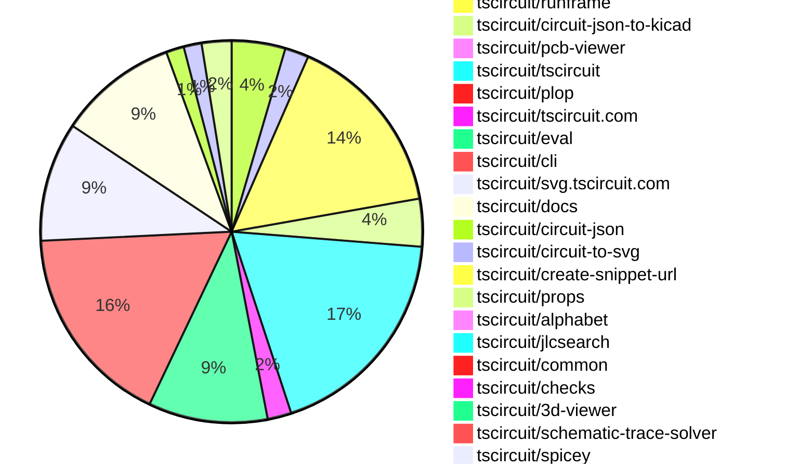
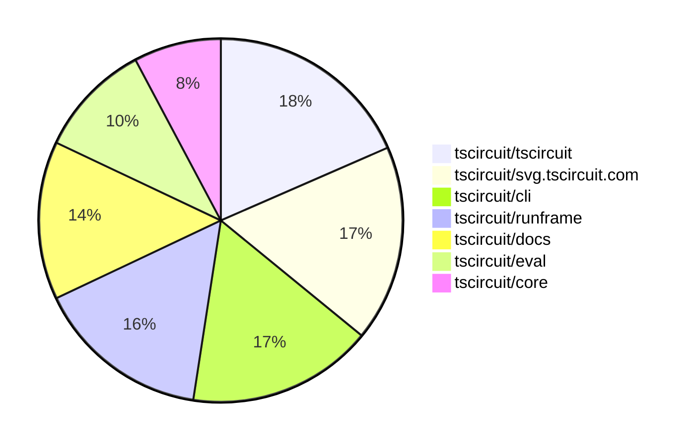

# contribution-tracker

[contributions.tscircuit.com](https://contributions.tscircuit.com) ・ [tscircuit.com](https://tscircuit.com) ・ [Contribution Overviews](./contribution-overviews/) ・ [Changelogs](./changelogs/)

Generates weekly contribution overviews for tscircuit contributors. Check out all
the [contribution overviews here](./contribution-overviews/)
You can find AI-generated monthly changelogs in the [changelogs directory](./changelogs/).

- All PRs in the tscircuit org are scanned/summarized via an LLM
- The LLM classifies each Diff/PR as into a set of attributes for scoring
- All the PRs, summaries, and classifications are organized into charts and tables for [the website](https://contributions.tscircuit.com)

> Want to run locally? See the [Development Section](#development)

The current week is shown below. There are 3 major sections:

- [Contributor Overview](#contributor-overview)
- [PRs by Repository](#prs-by-repository)
- [PRs by Contributor](#changes-by-contributor)

## Current Week

<!-- START_CURRENT_WEEK -->

# Contribution Overview 2025-10-08

## PRs by Repository



## Contributor Overview

| Contributor | 🐳 Major | 🐙 Minor | 🐌 Tiny | ⭐ | Score | Discussion Contributions |
|-------------|---------|---------|---------|-----|----------------|--------------------------|
| [seveibar](#seveibar) | 5 | 11 | 17 | 👑 | 65 | 0🔹 0🔶 0💎 |
| [imrishabh18](#imrishabh18) | 1 | 14 | 17 | ⭐⭐⭐ | 45.5 | 0🔹 0🔶 0💎 |
| [tscircuitbot](#tscircuitbot) | 0 | 0 | 111 | ⭐⭐ | 17.5 | 0🔹 0🔶 0💎 |
| [MustafaMulla29](#MustafaMulla29) | 2 | 3 | 1 | ⭐⭐ | 17 | 0🔹 0🔶 0💎 |
| [ShiboSoftwareDev](#ShiboSoftwareDev) | 2 | 4 | 0 | ⭐⭐ | 17 | 0🔹 0🔶 0💎 |
| [ArnavK-09](#ArnavK-09) | 2 | 1 | 3 | ⭐⭐ | 13 | 0🔹 0🔶 0💎 |
| [pxlpal](#pxlpal) | 2 | 0 | 0 | ⭐ | 8 | 0🔹 0🔶 0💎 |
| [Abse2001](#Abse2001) | 0 | 1 | 3 | ⭐ | 7 | 0🔹 0🔶 0💎 |
| [Ayushjhawar8](#Ayushjhawar8) | 0 | 2 | 3 | ⭐ | 7 | 0🔹 0🔶 0💎 |
| [0hmX](#0hmX) | 1 | 0 | 2 | ⭐ | 6 | 0🔹 0🔶 0💎 |
| [Asymtode712](#Asymtode712) | 0 | 1 | 2 | ⭐ | 4 | 0🔹 0🔶 0💎 |
| [nailoo](#nailoo) | 0 | 0 | 2 |  | 3 | 0🔹 0🔶 0💎 |
| [Heinrich-XIAO](#Heinrich-XIAO) | 0 | 1 | 0 |  | 2 | 0🔹 0🔶 0💎 |
| [techmannih](#techmannih) | 0 | 0 | 1 |  | 1 | 0🔹 0🔶 0💎 |
| [devroy10](#devroy10) | 0 | 0 | 1 |  | 1 | 0🔹 0🔶 0💎 |

### Discussion Contribution Legend

- 🔹 Normal Comments: Basic participation with minimal effort
- 🔶 Great Informative Comments: Thoughtful participation that adds value
- 💎 Incredible Comments: Exceptional participation with high-quality content

## Review Table

[reviews-received-hover]: ## "Number of reviews received for PRs for this contributor"
[approvals-received-hover]: ## "Number of approvals received for PRs this contributor authored"
[rejections-received-hover]: ## "Number of rejections received for PRs this contributor authored"
[prs-opened-hover]: ## "Number of PRs opened by this contributor"
[issues-created-hover]: ## "Number of issues created by this contributor"
[bountied-issues-hover]: ## "Number of issues this contributor created with a bounty"
[bountied-issue-$-hover]: ## "Total bounty amount placed on issues authored by this contributor"

| Contributor | Reviews Received | Approvals Received | Rejections Received | Approvals | Rejections | PRs Opened | PRs Merged | Score | Issues Created | Bountied Issues | Bountied Issue $ |
|---|---|---|---|---|---|---|---|---|---|---|---|
| [Quanta-Naut](#Quanta-Naut) | 1 | 1 | 0 | 0 | 0 | 2 | 0 | 0 | 0 | 0 | 0 |
| [imrishabh18](#imrishabh18) | 22 | 9 | 1 | 5 | 0 | 33 | 32 | 45.5 | 0 | 0 | 0 |
| [Excellencedev](#Excellencedev) | 10 | 0 | 2 | 0 | 0 | 9 | 0 | 0 | 0 | 0 | 0 |
| [baeoc](#baeoc) | 4 | 0 | 2 | 0 | 0 | 1 | 0 | 0 | 0 | 0 | 0 |
| [seveibar](#seveibar) | 26 | 1 | 0 | 46 | 14 | 44 | 34 | 65 | 0 | 0 | 0 |
| [tscircuitbot](#tscircuitbot) | 0 | 0 | 0 | 0 | 0 | 133 | 112 | 17.5 | 0 | 0 | 0 |
| [Abse2001](#Abse2001) | 5 | 5 | 0 | 1 | 1 | 5 | 4 | 7 | 0 | 0 | 0 |
| [MustafaMulla29](#MustafaMulla29) | 18 | 8 | 3 | 0 | 0 | 10 | 6 | 17 | 0 | 0 | 0 |
| [nailoo](#nailoo) | 3 | 2 | 0 | 0 | 0 | 2 | 2 | 3 | 0 | 0 | 0 |
| [techmannih](#techmannih) | 2 | 1 | 0 | 0 | 0 | 2 | 1 | 1 | 0 | 0 | 0 |
| [Pranjal6955](#Pranjal6955) | 0 | 0 | 0 | 0 | 0 | 2 | 0 | 0 | 0 | 0 | 0 |
| [jayantpranjal0](#jayantpranjal0) | 2 | 0 | 1 | 0 | 0 | 3 | 0 | 0 | 0 | 0 | 0 |
| [codecraft26](#codecraft26) | 3 | 0 | 0 | 0 | 0 | 3 | 0 | 0 | 0 | 0 | 0 |
| [0hmX](#0hmX) | 3 | 2 | 0 | 0 | 0 | 5 | 3 | 6 | 0 | 0 | 0 |
| [ShiboSoftwareDev](#ShiboSoftwareDev) | 20 | 6 | 3 | 0 | 0 | 8 | 6 | 17 | 0 | 0 | 0 |
| [ArnavK-09](#ArnavK-09) | 9 | 6 | 0 | 0 | 0 | 6 | 6 | 13 | 0 | 0 | 0 |
| [bitsbyritik](#bitsbyritik) | 0 | 0 | 0 | 0 | 0 | 1 | 0 | 0 | 0 | 0 | 0 |
| [Asymtode712](#Asymtode712) | 10 | 3 | 2 | 0 | 0 | 6 | 3 | 4 | 0 | 0 | 0 |
| [Ayushjhawar8](#Ayushjhawar8) | 5 | 5 | 0 | 0 | 0 | 6 | 5 | 7 | 0 | 0 | 0 |
| [Omar8345](#Omar8345) | 1 | 0 | 1 | 1 | 0 | 4 | 0 | 0 | 0 | 0 | 0 |
| [Richiemighty](#Richiemighty) | 0 | 0 | 0 | 0 | 0 | 1 | 0 | 0 | 0 | 0 | 0 |
| [yakhilgithub](#yakhilgithub) | 0 | 0 | 0 | 0 | 0 | 1 | 0 | 0 | 0 | 0 | 0 |
| [pxlpal](#pxlpal) | 2 | 1 | 0 | 0 | 0 | 2 | 2 | 8 | 0 | 0 | 0 |
| [saish9901](#saish9901) | 0 | 0 | 0 | 0 | 0 | 4 | 0 | 0 | 0 | 0 | 0 |
| [devroy10](#devroy10) | 2 | 2 | 0 | 0 | 0 | 2 | 1 | 1 | 0 | 0 | 0 |
| [992manav](#992manav) | 0 | 0 | 0 | 0 | 0 | 1 | 0 | 0 | 0 | 0 | 0 |
| [Sohail52](#Sohail52) | 0 | 0 | 0 | 0 | 0 | 1 | 0 | 0 | 0 | 0 | 0 |
| [DevGajjar28](#DevGajjar28) | 0 | 0 | 0 | 0 | 0 | 1 | 0 | 0 | 0 | 0 | 0 |
| [Heinrich-XIAO](#Heinrich-XIAO) | 1 | 1 | 0 | 0 | 0 | 1 | 1 | 2 | 0 | 0 | 0 |

## Top 7 Repositories by Contribution Points



## Changes by Repository

### [tscircuit/kicadts](https://github.com/tscircuit/kicadts)

| PR # | Impact | Rating | Contributor | Description |
|------|--------|--------|-------------|-------------|
| [#9](https://github.com/tscircuit/kicadts/pull/9) | 🐳 Major | ⭐⭐⭐ | imrishabh18 | Adds support for GlobalLabel in KiCad schematic representation, allowing for enhanced labeling of signals across sheets. |

### [tscircuit/kicad-component-converter](https://github.com/tscircuit/kicad-component-converter)

| PR # | Impact | Rating | Contributor | Description |
|------|--------|--------|-------------|-------------|
| [#146](https://github.com/tscircuit/kicad-component-converter/pull/146) | 🐙 Minor | ⭐⭐ | imrishabh18 | Fixes the conversion of fp_line to silkscreen and skips user-defined layers in the KiCad to TSCircuit conversion process. |

### [tscircuit/core](https://github.com/tscircuit/core)

| PR # | Impact | Rating | Contributor | Description |
|------|--------|--------|-------------|-------------|
| [#1475](https://github.com/tscircuit/core/pull/1475) | 🐙 Minor | ⭐⭐ | imrishabh18 | Adds support for autolayout functionality for schematic primitive elements, allowing for dynamic adjustment of their positions during layout changes. |
| [#1474](https://github.com/tscircuit/core/pull/1474) | 🐙 Minor | ⭐⭐ | imrishabh18 | Fixes failure in trace creation when using the connection property in components. |
| [#1471](https://github.com/tscircuit/core/pull/1471) | 🐙 Minor | ⭐⭐ | imrishabh18 | Adds support for tracing connections between ports of React symbols in the schematic, allowing for better representation and interaction of components. |
| [#1476](https://github.com/tscircuit/core/pull/1476) | 🐙 Minor | ⭐⭐ | seveibar | Refactors the cad model primitive to utilize a shared file extension utility, ensuring consistent handling of absolute paths and improving extension extraction by stripping queryhash fragments and normalizing the returned extension. |
| [#1463](https://github.com/tscircuit/core/pull/1463) | 🐙 Minor | ⭐⭐ | seveibar | Upgrades the calculate-packing library from version 0.0.41 to 0.0.48 and adds a test for Arduino shield components packed outside the board. |
| [#1478](https://github.com/tscircuit/core/pull/1478) | 🐙 Minor | ⭐⭐ | MustafaMulla29 | Adds a design rule check for PCB component overlap to prevent overlapping pads between components. |
| [#1456](https://github.com/tscircuit/core/pull/1456) | 🐙 Minor | ⭐⭐ | ShiboSoftwareDev | Adds support for duration and timePerStep props to the analogsimulation  component, allowing customization of SPICE transient analysis parameters. |

<details>
<summary>🐌 Tiny Contributions (2)</summary>

| PR # | Impact | Contributor | Description |
|------|--------|-------------|-------------|
| [#1473](https://github.com/tscircuit/core/pull/1473) | 🐌 Tiny | nailoo | Updates the circuit-to-svg dependency from version 0.0.221 to 0.0.228 in package.json |
| [#1464](https://github.com/tscircuit/core/pull/1464) | 🐌 Tiny | 0hmX | Updates the schematic-trace-solver dependency to version 0.0.41 in package.json |

</details>

### [tscircuit/status](https://github.com/tscircuit/status)

| PR # | Impact | Rating | Contributor | Description |
|------|--------|--------|-------------|-------------|
| [#50](https://github.com/tscircuit/status/pull/50) | 🐙 Minor | ⭐⭐ | imrishabh18 | Adds a health check for the usercode.tscircuit.com service to monitor its status and functionality. |

<details>
<summary>🐌 Tiny Contributions (3)</summary>

| PR # | Impact | Contributor | Description |
|------|--------|-------------|-------------|
| [#53](https://github.com/tscircuit/status/pull/53) | 🐌 Tiny | imrishabh18 | Fixes the name of the ignored service in the Discord notification script from check-usercode-health to usercode_api. |
| [#52](https://github.com/tscircuit/status/pull/52) | 🐌 Tiny | imrishabh18 | Ignores Discord notifications for the check-usercode-health service in the notification script. |
| [#51](https://github.com/tscircuit/status/pull/51) | 🐌 Tiny | imrishabh18 | Increases the timeout limit for health checks from 2 minutes to 5 minutes. |

</details>

### [tscircuit/runframe](https://github.com/tscircuit/runframe)

| PR # | Impact | Rating | Contributor | Description |
|------|--------|--------|-------------|-------------|
| [#1375](https://github.com/tscircuit/runframe/pull/1375) | 🐙 Minor | ⭐⭐ | imrishabh18 | Adds functionality to export a KiCad project including the project file, schematic, and PCB files. |

<details>
<summary>🐌 Tiny Contributions (30)</summary>

| PR # | Impact | Contributor | Description |
|------|--------|-------------|-------------|
| [#1364](https://github.com/tscircuit/runframe/pull/1364) | 🐌 Tiny | imrishabh18 | This pull request adds a new generated styles file for the project, which includes various CSS styles and utility classes for the application. The styles are generated using Tailwind CSS, providing a comprehensive set of utility classes for layout, spacing, typography, and more. |
| [#1363](https://github.com/tscircuit/runframe/pull/1363) | 🐌 Tiny | imrishabh18 | Adds a GitHub token to the workflow for closing existing pull requests by the bot. |
| [#1361](https://github.com/tscircuit/runframe/pull/1361) | 🐌 Tiny | imrishabh18 | Modifies the GitHub Actions workflow to prevent publishing on push events that start with v in the commit message. |
| [#1391](https://github.com/tscircuit/runframe/pull/1391) | 🐌 Tiny | tscircuitbot | Automated package update to version 0.0.1072 |
| [#1390](https://github.com/tscircuit/runframe/pull/1390) | 🐌 Tiny | tscircuitbot | Updates the tscircuiteval package to version 0.0.378 in the package.json file. |
| [#1389](https://github.com/tscircuit/runframe/pull/1389) | 🐌 Tiny | tscircuitbot | Updates the package version from 0.0.1070 to 0.0.1071 in package.json |
| [#1388](https://github.com/tscircuit/runframe/pull/1388) | 🐌 Tiny | tscircuitbot | Updates the tscircuiteval package to version 0.0.377 |
| [#1387](https://github.com/tscircuit/runframe/pull/1387) | 🐌 Tiny | tscircuitbot | Updates the package version from 0.0.1069 to 0.0.1070 in package.json |
| [#1384](https://github.com/tscircuit/runframe/pull/1384) | 🐌 Tiny | tscircuitbot | Automated package update to version 0.0.1069 |
| [#1380](https://github.com/tscircuit/runframe/pull/1380) | 🐌 Tiny | tscircuitbot | Automated package update to version 0.0.1068 |
| [#1379](https://github.com/tscircuit/runframe/pull/1379) | 🐌 Tiny | tscircuitbot | Updates the tscircuiteval package from version 0.0.375 to 0.0.376 |
| [#1378](https://github.com/tscircuit/runframe/pull/1378) | 🐌 Tiny | tscircuitbot | Automated package update |
| [#1377](https://github.com/tscircuit/runframe/pull/1377) | 🐌 Tiny | tscircuitbot | Updates the tscircuiteval package from version 0.0.374 to 0.0.375 |
| [#1376](https://github.com/tscircuit/runframe/pull/1376) | 🐌 Tiny | tscircuitbot | Automated package update to version 0.0.1066 |
| [#1374](https://github.com/tscircuit/runframe/pull/1374) | 🐌 Tiny | tscircuitbot | Updates the package version from 0.0.1064 to 0.0.1065 in package.json |
| [#1373](https://github.com/tscircuit/runframe/pull/1373) | 🐌 Tiny | tscircuitbot | Updates the tscircuit3d-viewer package to version 0.0.408 in the package.json file. |
| [#1372](https://github.com/tscircuit/runframe/pull/1372) | 🐌 Tiny | tscircuitbot | Automated package update |
| [#1371](https://github.com/tscircuit/runframe/pull/1371) | 🐌 Tiny | tscircuitbot | Updates the tscircuiteval package from version 0.0.373 to 0.0.374 |
| [#1369](https://github.com/tscircuit/runframe/pull/1369) | 🐌 Tiny | tscircuitbot | Automated package update |
| [#1368](https://github.com/tscircuit/runframe/pull/1368) | 🐌 Tiny | tscircuitbot | Updates the tscircuiteval package from version 0.0.372 to 0.0.373 |
| [#1367](https://github.com/tscircuit/runframe/pull/1367) | 🐌 Tiny | tscircuitbot | Automated package update |
| [#1366](https://github.com/tscircuit/runframe/pull/1366) | 🐌 Tiny | tscircuitbot | Updates the tscircuiteval package to version 0.0.372 |
| [#1365](https://github.com/tscircuit/runframe/pull/1365) | 🐌 Tiny | tscircuitbot | Automated package update |
| [#1362](https://github.com/tscircuit/runframe/pull/1362) | 🐌 Tiny | tscircuitbot | Updates the tscircuiteval package to version 0.0.371 in the package.json file. |
| [#1360](https://github.com/tscircuit/runframe/pull/1360) | 🐌 Tiny | tscircuitbot | Updates the tscircuiteval package to version 0.0.370 in the package.json file. |
| [#1359](https://github.com/tscircuit/runframe/pull/1359) | 🐌 Tiny | tscircuitbot | Updates the tscircuiteval package to version 0.0.370 in the package.json file. |
| [#1358](https://github.com/tscircuit/runframe/pull/1358) | 🐌 Tiny | tscircuitbot | Updates the tscircuiteval package from version 0.0.368 to 0.0.369 |
| [#1357](https://github.com/tscircuit/runframe/pull/1357) | 🐌 Tiny | tscircuitbot | Updates the tscircuiteval package from version 0.0.368 to 0.0.369 |
| [#1386](https://github.com/tscircuit/runframe/pull/1386) | 🐌 Tiny | Ayushjhawar8 | Removes TypeScript (.ts) icons from the file selector and adds support for JSX (.jsx) files in the component. |
| [#1383](https://github.com/tscircuit/runframe/pull/1383) | 🐌 Tiny | Ayushjhawar8 | Removes .ts files from the RunFrame file explorer, allowing only .tsx and .circuit.json files to be displayed. |

</details>

### [tscircuit/circuit-json-to-kicad](https://github.com/tscircuit/circuit-json-to-kicad)

| PR # | Impact | Rating | Contributor | Description |
|------|--------|--------|-------------|-------------|
| [#26](https://github.com/tscircuit/circuit-json-to-kicad/pull/26) | 🐙 Minor | ⭐⭐ | imrishabh18 | Adds support for standalone silkscreen text elements that are not associated with components in the PCB design. |
| [#25](https://github.com/tscircuit/circuit-json-to-kicad/pull/25) | 🐙 Minor | ⭐⭐ | imrishabh18 | Adds rotation functionality to PCB components, allowing for accurate placement in KiCad. |
| [#24](https://github.com/tscircuit/circuit-json-to-kicad/pull/24) | 🐙 Minor | ⭐⭐ | imrishabh18 | Adds support for converting non-plated holes (pcb_hole) to non-plated through holes (np_thru_hole) in the PCB generation process. |
| [#23](https://github.com/tscircuit/circuit-json-to-kicad/pull/23) | 🐙 Minor | ⭐⭐ | imrishabh18 | Removes the default component addition and replaces grText with fpText for footprint silkscreen elements in the PCB generation process. |
| [#22](https://github.com/tscircuit/circuit-json-to-kicad/pull/22) | 🐙 Minor | ⭐⭐ | imrishabh18 | Adds support for PCB silkscreen text and corrects the positioning of SMD pads in the PCB layout. |
| [#21](https://github.com/tscircuit/circuit-json-to-kicad/pull/21) | 🐙 Minor | ⭐⭐ | imrishabh18 | Adds support for converting pcb_plated_hole elements to through-hole pads in KiCad. |
| [#20](https://github.com/tscircuit/circuit-json-to-kicad/pull/20) | 🐙 Minor | ⭐⭐ | imrishabh18 | Converts net labels without a symbol name to KiCad global labels in the schematic export process. |
| [#19](https://github.com/tscircuit/circuit-json-to-kicad/pull/19) | 🐙 Minor | ⭐⭐ | imrishabh18 | Adds support for net labels with symbols for ground and power in schematic generation, allowing for better representation of these elements in the schematic. |

### [tscircuit/pcb-viewer](https://github.com/tscircuit/pcb-viewer)


<details>
<summary>🐌 Tiny Contributions (1)</summary>

| PR # | Impact | Contributor | Description |
|------|--------|-------------|-------------|
| [#392](https://github.com/tscircuit/pcb-viewer/pull/392) | 🐌 Tiny | imrishabh18 | Adds a GitHub Actions workflow that prevents direct pushes to the main branch and automates version bumping and package updates. |

</details>

### [tscircuit/tscircuit](https://github.com/tscircuit/tscircuit)

| PR # | Impact | Rating | Contributor | Description |
|------|--------|--------|-------------|-------------|
| [#928](https://github.com/tscircuit/tscircuit/pull/928) | 🐙 Minor | ⭐⭐ | Abse2001 | Adds tscircuitcommon to the DO_NOT_SYNC_PACKAGE list in the core versioning script to prevent synchronization of this package. |

<details>
<summary>🐌 Tiny Contributions (36)</summary>

| PR # | Impact | Contributor | Description |
|------|--------|-------------|-------------|
| [#963](https://github.com/tscircuit/tscircuit/pull/963) | 🐌 Tiny | imrishabh18 | Updates the kicad-component-converter dependency to version 0.1.22 in package.json |
| [#968](https://github.com/tscircuit/tscircuit/pull/968) | 🐌 Tiny | tscircuitbot | Automated package update to version 0.0.737 |
| [#967](https://github.com/tscircuit/tscircuit/pull/967) | 🐌 Tiny | tscircuitbot | Updates the tscircuitcli package to version 0.1.307 |
| [#966](https://github.com/tscircuit/tscircuit/pull/966) | 🐌 Tiny | tscircuitbot | Automated package update |
| [#965](https://github.com/tscircuit/tscircuit/pull/965) | 🐌 Tiny | tscircuitbot | Updates the tscircuitcli and other related package versions in package.json |
| [#964](https://github.com/tscircuit/tscircuit/pull/964) | 🐌 Tiny | tscircuitbot | Automated package update |
| [#962](https://github.com/tscircuit/tscircuit/pull/962) | 🐌 Tiny | tscircuitbot | Automated package update |
| [#961](https://github.com/tscircuit/tscircuit/pull/961) | 🐌 Tiny | tscircuitbot | Automated package update |
| [#958](https://github.com/tscircuit/tscircuit/pull/958) | 🐌 Tiny | tscircuitbot | Automated package update |
| [#957](https://github.com/tscircuit/tscircuit/pull/957) | 🐌 Tiny | tscircuitbot | Updates the tscircuitcli package to version 0.1.304 in package.json |
| [#956](https://github.com/tscircuit/tscircuit/pull/956) | 🐌 Tiny | tscircuitbot | Automated package update |
| [#955](https://github.com/tscircuit/tscircuit/pull/955) | 🐌 Tiny | tscircuitbot | Automated package update |
| [#953](https://github.com/tscircuit/tscircuit/pull/953) | 🐌 Tiny | tscircuitbot | Updates the package version from 0.0.729 to 0.0.730 in package.json |
| [#952](https://github.com/tscircuit/tscircuit/pull/952) | 🐌 Tiny | tscircuitbot | Automated package update |
| [#951](https://github.com/tscircuit/tscircuit/pull/951) | 🐌 Tiny | tscircuitbot | Automated package update |
| [#950](https://github.com/tscircuit/tscircuit/pull/950) | 🐌 Tiny | tscircuitbot | Updates the tscircuitcli package to version 0.1.302 in the package.json file |
| [#949](https://github.com/tscircuit/tscircuit/pull/949) | 🐌 Tiny | tscircuitbot | Automated package update |
| [#948](https://github.com/tscircuit/tscircuit/pull/948) | 🐌 Tiny | tscircuitbot | Updates the tscircuitcli package from version 0.1.300 to 0.1.301 and the tscircuitrunframe package from version 0.0.1068 to 0.0.1069 in package.json |
| [#947](https://github.com/tscircuit/tscircuit/pull/947) | 🐌 Tiny | tscircuitbot | Automated package update |
| [#946](https://github.com/tscircuit/tscircuit/pull/946) | 🐌 Tiny | tscircuitbot | Updates the tscircuitcli package from version 0.1.299 to 0.1.300 and the tscircuitrunframe package from version 0.0.1067 to 0.0.1068 in package.json |
| [#945](https://github.com/tscircuit/tscircuit/pull/945) | 🐌 Tiny | tscircuitbot | Updates the package version from 0.0.723 to 0.0.726 in package.json |
| [#944](https://github.com/tscircuit/tscircuit/pull/944) | 🐌 Tiny | tscircuitbot | Automated package update |
| [#942](https://github.com/tscircuit/tscircuit/pull/942) | 🐌 Tiny | tscircuitbot | Updates the tscircuitcli package to version 0.1.298 in package.json |
| [#940](https://github.com/tscircuit/tscircuit/pull/940) | 🐌 Tiny | tscircuitbot | Automated package update |
| [#938](https://github.com/tscircuit/tscircuit/pull/938) | 🐌 Tiny | tscircuitbot | Updates the package version from 0.0.722 to 0.0.723 in package.json |
| [#937](https://github.com/tscircuit/tscircuit/pull/937) | 🐌 Tiny | tscircuitbot | Automated package update |
| [#936](https://github.com/tscircuit/tscircuit/pull/936) | 🐌 Tiny | tscircuitbot | Automated package update |
| [#935](https://github.com/tscircuit/tscircuit/pull/935) | 🐌 Tiny | tscircuitbot | Automated package update |
| [#934](https://github.com/tscircuit/tscircuit/pull/934) | 🐌 Tiny | tscircuitbot | Automated package update |
| [#933](https://github.com/tscircuit/tscircuit/pull/933) | 🐌 Tiny | tscircuitbot | Updates the tscircuitcli and tscircuiteval packages to their latest versions. |
| [#932](https://github.com/tscircuit/tscircuit/pull/932) | 🐌 Tiny | tscircuitbot | Automated package update |
| [#931](https://github.com/tscircuit/tscircuit/pull/931) | 🐌 Tiny | tscircuitbot | Automated package update |
| [#930](https://github.com/tscircuit/tscircuit/pull/930) | 🐌 Tiny | tscircuitbot | Automated package update |
| [#925](https://github.com/tscircuit/tscircuit/pull/925) | 🐌 Tiny | tscircuitbot | Automated package update |
| [#954](https://github.com/tscircuit/tscircuit/pull/954) | 🐌 Tiny | seveibar | Adds TypeScript declarations for various 3D file formats including .obj, .stl, .kicad_mod, .glb, .gltf, and .step to resolve GLB type issues. |
| [#924](https://github.com/tscircuit/tscircuit/pull/924) | 🐌 Tiny | seveibar | Skip the bun-pver-release workflow when the triggering push commit message starts with v |

</details>

### [tscircuit/plop](https://github.com/tscircuit/plop)


<details>
<summary>🐌 Tiny Contributions (1)</summary>

| PR # | Impact | Contributor | Description |
|------|--------|-------------|-------------|
| [#22](https://github.com/tscircuit/plop/pull/22) | 🐌 Tiny | imrishabh18 | Prevents the release of a version bump when the commit message starts with v. |

</details>

### [tscircuit/tscircuit.com](https://github.com/tscircuit/tscircuit.com)

| PR # | Impact | Rating | Contributor | Description |
|------|--------|--------|-------------|-------------|
| [#1782](https://github.com/tscircuit/tscircuit.com/pull/1782) | 🐳 Major | ⭐⭐⭐ | ArnavK-09 | Add github_handle to PublicOrgSchema and seed data, introduce GithubAvatarWithFallback; use in org cardheader, add useOrgByName hook and update ProfileRouter to use it, tweak UI: adjust members card padding and org grid columns |
| [#1783](https://github.com/tscircuit/tscircuit.com/pull/1783) | 🐙 Minor | ⭐⭐ | ArnavK-09 | Adds a size parameter to GitHub avatar URLs, allowing customization of avatar sizes in various components. |

<details>
<summary>🐌 Tiny Contributions (2)</summary>

| PR # | Impact | Contributor | Description |
|------|--------|-------------|-------------|
| [#1781](https://github.com/tscircuit/tscircuit.com/pull/1781) | 🐌 Tiny | imrishabh18 | Updates the versions of kicadts and circuit-json-to-kicad in package.json to their latest releases. |
| [#1778](https://github.com/tscircuit/tscircuit.com/pull/1778) | 🐌 Tiny | Asymtode712 | Updates the dependency version of tscircuit3d-viewer to resolve lighting issues in the 3D viewer. |

</details>

### [tscircuit/eval](https://github.com/tscircuit/eval)

| PR # | Impact | Rating | Contributor | Description |
|------|--------|--------|-------------|-------------|
| [#1211](https://github.com/tscircuit/eval/pull/1211) | 🐙 Minor | ⭐⭐ | ShiboSoftwareDev | Adds support for resolving non-relative imports using tsconfig.json paths, including wildcard and exact aliases, with extension fallback and tests included. |

<details>
<summary>🐌 Tiny Contributions (19)</summary>

| PR # | Impact | Contributor | Description |
|------|--------|-------------|-------------|
| [#1230](https://github.com/tscircuit/eval/pull/1230) | 🐌 Tiny | imrishabh18 | Updates the kicad-component-converter dependency to version 0.1.22 and adjusts import paths in the test file for proper resolution. |
| [#1199](https://github.com/tscircuit/eval/pull/1199) | 🐌 Tiny | imrishabh18 | Modifies the GitHub Actions workflow to prevent publishing on push events that start with v in the commit message. |
| [#1197](https://github.com/tscircuit/eval/pull/1197) | 🐌 Tiny | imrishabh18 | Updates the GitHub Actions workflow to close existing pull requests with titles containing chore: update packages instead of update tscircuitcore. |
| [#1231](https://github.com/tscircuit/eval/pull/1231) | 🐌 Tiny | tscircuitbot | Automated package update |
| [#1229](https://github.com/tscircuit/eval/pull/1229) | 🐌 Tiny | tscircuitbot | Automated package update |
| [#1228](https://github.com/tscircuit/eval/pull/1228) | 🐌 Tiny | tscircuitbot | Automated package update |
| [#1227](https://github.com/tscircuit/eval/pull/1227) | 🐌 Tiny | tscircuitbot | Automated package update |
| [#1226](https://github.com/tscircuit/eval/pull/1226) | 🐌 Tiny | tscircuitbot | Updates the version of the tscircuitcore package from 0.0.774 to 0.0.775 in package.json |
| [#1224](https://github.com/tscircuit/eval/pull/1224) | 🐌 Tiny | tscircuitbot | Automated package update |
| [#1223](https://github.com/tscircuit/eval/pull/1223) | 🐌 Tiny | tscircuitbot | Updates the version of the tscircuitcore package from 0.0.771 to 0.0.774 in package.json |
| [#1217](https://github.com/tscircuit/eval/pull/1217) | 🐌 Tiny | tscircuitbot | Automated package update to version 0.0.374 |
| [#1216](https://github.com/tscircuit/eval/pull/1216) | 🐌 Tiny | tscircuitbot | Updates various package dependencies in the project to their latest versions. |
| [#1214](https://github.com/tscircuit/eval/pull/1214) | 🐌 Tiny | tscircuitbot | Automated package update |
| [#1213](https://github.com/tscircuit/eval/pull/1213) | 🐌 Tiny | tscircuitbot | Automated package update |
| [#1200](https://github.com/tscircuit/eval/pull/1200) | 🐌 Tiny | tscircuitbot | Automated package update |
| [#1198](https://github.com/tscircuit/eval/pull/1198) | 🐌 Tiny | tscircuitbot | Automated package update |
| [#1196](https://github.com/tscircuit/eval/pull/1196) | 🐌 Tiny | tscircuitbot | Automated package update |
| [#1195](https://github.com/tscircuit/eval/pull/1195) | 🐌 Tiny | tscircuitbot | Automated package update |
| [#1212](https://github.com/tscircuit/eval/pull/1212) | 🐌 Tiny | seveibar | Updates the bun test workflow to execute each test file in its own bun process and retry on segmentation faults, skipping the step when no test files exist in the matrix directory. |

</details>

### [tscircuit/cli](https://github.com/tscircuit/cli)


<details>
<summary>🐌 Tiny Contributions (34)</summary>

| PR # | Impact | Contributor | Description |
|------|--------|-------------|-------------|
| [#544](https://github.com/tscircuit/cli/pull/544) | 🐌 Tiny | imrishabh18 | Updates the kicad-component-converter and tscircuit dependencies in package.json to their latest versions. |
| [#506](https://github.com/tscircuit/cli/pull/506) | 🐌 Tiny | imrishabh18 | Modifies the GitHub Actions workflow to prevent publishing on push events that start with v in the commit message. |
| [#545](https://github.com/tscircuit/cli/pull/545) | 🐌 Tiny | tscircuitbot | Automated package update |
| [#543](https://github.com/tscircuit/cli/pull/543) | 🐌 Tiny | tscircuitbot | Automated package update |
| [#542](https://github.com/tscircuit/cli/pull/542) | 🐌 Tiny | tscircuitbot | Updates the tscircuitrunframe package to version 0.0.1072 in the package.json file. |
| [#541](https://github.com/tscircuit/cli/pull/541) | 🐌 Tiny | tscircuitbot | Automated package update |
| [#540](https://github.com/tscircuit/cli/pull/540) | 🐌 Tiny | tscircuitbot | Updates the tscircuitrunframe package from version 0.0.1070 to 0.0.1071 |
| [#539](https://github.com/tscircuit/cli/pull/539) | 🐌 Tiny | tscircuitbot | Automated package update |
| [#537](https://github.com/tscircuit/cli/pull/537) | 🐌 Tiny | tscircuitbot | Automated package update |
| [#536](https://github.com/tscircuit/cli/pull/536) | 🐌 Tiny | tscircuitbot | Updates the tscircuitrunframe package from version 0.0.1069 to 0.0.1070 |
| [#535](https://github.com/tscircuit/cli/pull/535) | 🐌 Tiny | tscircuitbot | Automated package update to version 0.1.302 |
| [#533](https://github.com/tscircuit/cli/pull/533) | 🐌 Tiny | tscircuitbot | Automated package update |
| [#532](https://github.com/tscircuit/cli/pull/532) | 🐌 Tiny | tscircuitbot | Updates the tscircuitrunframe package from version 0.0.1068 to 0.0.1069 |
| [#531](https://github.com/tscircuit/cli/pull/531) | 🐌 Tiny | tscircuitbot | Automated package update |
| [#530](https://github.com/tscircuit/cli/pull/530) | 🐌 Tiny | tscircuitbot | Updates the tscircuitrunframe package to version 0.0.1068 in package.json |
| [#529](https://github.com/tscircuit/cli/pull/529) | 🐌 Tiny | tscircuitbot | Automated package update |
| [#528](https://github.com/tscircuit/cli/pull/528) | 🐌 Tiny | tscircuitbot | Updates the tscircuitrunframe package from version 0.0.1066 to 0.0.1067 |
| [#527](https://github.com/tscircuit/cli/pull/527) | 🐌 Tiny | tscircuitbot | Automated package update |
| [#524](https://github.com/tscircuit/cli/pull/524) | 🐌 Tiny | tscircuitbot | Automated package update |
| [#523](https://github.com/tscircuit/cli/pull/523) | 🐌 Tiny | tscircuitbot | Updates the tscircuitrunframe package from version 0.0.1064 to 0.0.1066 |
| [#522](https://github.com/tscircuit/cli/pull/522) | 🐌 Tiny | tscircuitbot | Automated package update |
| [#521](https://github.com/tscircuit/cli/pull/521) | 🐌 Tiny | tscircuitbot | Updates the tscircuitrunframe package to version 0.0.1064 in the package.json file. |
| [#519](https://github.com/tscircuit/cli/pull/519) | 🐌 Tiny | tscircuitbot | Automated package update |
| [#517](https://github.com/tscircuit/cli/pull/517) | 🐌 Tiny | tscircuitbot | Updates the tscircuitrunframe package from version 0.0.1062 to 0.0.1063 |
| [#515](https://github.com/tscircuit/cli/pull/515) | 🐌 Tiny | tscircuitbot | Automated package update |
| [#514](https://github.com/tscircuit/cli/pull/514) | 🐌 Tiny | tscircuitbot | Updates the tscircuitrunframe package from version 0.0.1061 to 0.0.1062 |
| [#512](https://github.com/tscircuit/cli/pull/512) | 🐌 Tiny | tscircuitbot | Automated package update |
| [#510](https://github.com/tscircuit/cli/pull/510) | 🐌 Tiny | tscircuitbot | Automated package update to version 0.1.292 |
| [#509](https://github.com/tscircuit/cli/pull/509) | 🐌 Tiny | tscircuitbot | Updates the tscircuitrunframe package from version 0.0.1060 to 0.0.1061 |
| [#507](https://github.com/tscircuit/cli/pull/507) | 🐌 Tiny | tscircuitbot | Automated package update |
| [#538](https://github.com/tscircuit/cli/pull/538) | 🐌 Tiny | seveibar | Changes TypeScript configuration to use tscircuit instead of tscircuitcore for type definitions. |
| [#525](https://github.com/tscircuit/cli/pull/525) | 🐌 Tiny | seveibar | Adds examples for loading GLB files and reproduces a project-relative-path loading issue. |
| [#534](https://github.com/tscircuit/cli/pull/534) | 🐌 Tiny | Abse2001 | Updates the tscircuit dependency version from 0.0.723 to 0.0.728 in the package.json file. |
| [#511](https://github.com/tscircuit/cli/pull/511) | 🐌 Tiny | ArnavK-09 | Adds a KiCad import example and reorganizes example directories for better structure. |

</details>

### [tscircuit/svg.tscircuit.com](https://github.com/tscircuit/svg.tscircuit.com)

| PR # | Impact | Rating | Contributor | Description |
|------|--------|--------|-------------|-------------|
| [#376](https://github.com/tscircuit/svg.tscircuit.com/pull/376) | 🐳 Major | ⭐⭐⭐ | seveibar | Renders 3D PNGs by converting circuit JSON to GLB and rasterizing with poppygl, adds dependencies for GLB generation, and includes a PNG regression test for GLB-backed CAD model boards. |
| [#372](https://github.com/tscircuit/svg.tscircuit.com/pull/372) | 🐳 Major | ⭐⭐⭐ | ArnavK-09 | Adds full revamp with fsmap support, updates dependencies, and fixes URLs. |
| [#402](https://github.com/tscircuit/svg.tscircuit.com/pull/402) | 🐳 Major | ⭐⭐⭐ | pxlpal | Adds support for generating assembly views in both SVG and PNG formats for circuit designs. |
| [#384](https://github.com/tscircuit/svg.tscircuit.com/pull/384) | 🐳 Major | ⭐⭐⭐ | pxlpal | Adds support for generating assembly SVG and PNG views from TSCircuit code, enhancing the APIs capabilities for visualizing circuit layouts. |
| [#397](https://github.com/tscircuit/svg.tscircuit.com/pull/397) | 🐙 Minor | ⭐⭐ | seveibar | Refactors the endpoint handling logic by separating different request handlers into individual files for better organization and maintainability. |
| [#390](https://github.com/tscircuit/svg.tscircuit.com/pull/390) | 🐙 Minor | ⭐⭐ | seveibar | Add support for project_base_url to configure project-specific base URLs in requests |
| [#389](https://github.com/tscircuit/svg.tscircuit.com/pull/389) | 🐙 Minor | ⭐⭐ | seveibar | Adds preview images for PCB, schematic, pinout, and 3D outputs in the README, linking them directly to generated assets for immediate user access. |
| [#385](https://github.com/tscircuit/svg.tscircuit.com/pull/385) | 🐙 Minor | ⭐⭐ | seveibar | Document the fs_map input option for GET and POST requests in the README, add fs_map parsing utilities, GET handling, and better POST validation in the endpoint, cover fs_map GETPOST behavior with a new test and ignore tsbuildinfo artifacts, extract the fs_map parameter parser into its own helper for reuse. |

<details>
<summary>🐌 Tiny Contributions (12)</summary>

| PR # | Impact | Contributor | Description |
|------|--------|-------------|-------------|
| [#382](https://github.com/tscircuit/svg.tscircuit.com/pull/382) | 🐌 Tiny | imrishabh18 | Adds a GitHub token to the workflow to enable closing of existing pull requests by the bot. |
| [#396](https://github.com/tscircuit/svg.tscircuit.com/pull/396) | 🐌 Tiny | tscircuitbot | Updates the tscircuit package version from 0.0.732 to 0.0.733 in package.json |
| [#395](https://github.com/tscircuit/svg.tscircuit.com/pull/395) | 🐌 Tiny | tscircuitbot | Updates the tscircuit package version from 0.0.731 to 0.0.732 in package.json |
| [#394](https://github.com/tscircuit/svg.tscircuit.com/pull/394) | 🐌 Tiny | tscircuitbot | Updates the tscircuit package version from 0.0.730 to 0.0.731 in package.json |
| [#393](https://github.com/tscircuit/svg.tscircuit.com/pull/393) | 🐌 Tiny | tscircuitbot | Updates the tscircuit package version from 0.0.729 to 0.0.730 in package.json |
| [#392](https://github.com/tscircuit/svg.tscircuit.com/pull/392) | 🐌 Tiny | tscircuitbot | Updates the tscircuit package version from 0.0.728 to 0.0.729 in package.json |
| [#391](https://github.com/tscircuit/svg.tscircuit.com/pull/391) | 🐌 Tiny | tscircuitbot | Updates the tscircuit package version from 0.0.727 to 0.0.728 in package.json |
| [#387](https://github.com/tscircuit/svg.tscircuit.com/pull/387) | 🐌 Tiny | tscircuitbot | Updates the tscircuit package version from 0.0.726 to 0.0.727 in package.json |
| [#386](https://github.com/tscircuit/svg.tscircuit.com/pull/386) | 🐌 Tiny | tscircuitbot | Updates the tscircuit package version from 0.0.723 to 0.0.726 in package.json |
| [#383](https://github.com/tscircuit/svg.tscircuit.com/pull/383) | 🐌 Tiny | tscircuitbot | Updates the tscircuit package version from 0.0.722 to 0.0.723 in package.json |
| [#375](https://github.com/tscircuit/svg.tscircuit.com/pull/375) | 🐌 Tiny | tscircuitbot | Updates the tscircuit package version from 0.0.720 to 0.0.722 in package.json |
| [#378](https://github.com/tscircuit/svg.tscircuit.com/pull/378) | 🐌 Tiny | seveibar | Fixes PNG generation for PCB, schematic, and pinout types in Next.js server and adds corresponding PNG URLs to the generated HTML table. |

</details>

### [tscircuit/docs](https://github.com/tscircuit/docs)

| PR # | Impact | Rating | Contributor | Description |
|------|--------|--------|-------------|-------------|
| [#208](https://github.com/tscircuit/docs/pull/208) | 🐳 Major | ⭐⭐⭐ | seveibar | Simplifies the import example for CAD models and adds support for loading static assets from the documentation using projectBaseUrl in CircuitPreview. |
| [#204](https://github.com/tscircuit/docs/pull/204) | 🐳 Major | ⭐⭐⭐ | MustafaMulla29 | Fixes the markdown generation for the Copy page by utilizing the turndown package and improves the mobile view layout. |
| [#221](https://github.com/tscircuit/docs/pull/221) | 🐙 Minor | ⭐⭐ | seveibar | Adds detailed documentation on group positioning and automatic packing for PCB layout in the tscircuit documentation. |
| [#214](https://github.com/tscircuit/docs/pull/214) | 🐙 Minor | ⭐⭐ | Ayushjhawar8 | Revamps the index and overview page of the documentation to improve layout and styling, including changes to how items are displayed and styled in the documentation index. |
| [#186](https://github.com/tscircuit/docs/pull/186) | 🐙 Minor | ⭐⭐ | Ayushjhawar8 | Removes breadcrumb navigation and centers the body content of the documentation, adjusts subtitle alignment, and modifies various styling elements for better visual consistency. |

<details>
<summary>🐌 Tiny Contributions (15)</summary>

| PR # | Impact | Contributor | Description |
|------|--------|-------------|-------------|
| [#209](https://github.com/tscircuit/docs/pull/209) | 🐌 Tiny | imrishabh18 | Adds documentation for configuring TypeScript path aliases in tscircuit projects and updates the dependency version for create-snippet-url. |
| [#217](https://github.com/tscircuit/docs/pull/217) | 🐌 Tiny | seveibar | Adds a Docusaurus Root wrapper that tags level-3 sidebar links with a padding class and updates custom CSS so level-3 links keep their indentation on hover and active states. |
| [#215](https://github.com/tscircuit/docs/pull/215) | 🐌 Tiny | seveibar | Increases indentation for level 3 sidebar links to improve hierarchy clarity |
| [#213](https://github.com/tscircuit/docs/pull/213) | 🐌 Tiny | seveibar | Fixes the CircuitPreview components projectBaseUrl and refactors its implementation while adding a new guide for using groups in PCB layout. |
| [#212](https://github.com/tscircuit/docs/pull/212) | 🐌 Tiny | seveibar | Fixes the import of local glb files by updating the model references in the documentation. |
| [#205](https://github.com/tscircuit/docs/pull/205) | 🐌 Tiny | seveibar | Adds an example for importing local GLB models into the CAD model component. |
| [#201](https://github.com/tscircuit/docs/pull/201) | 🐌 Tiny | seveibar | Adds a CAD assembly example for integrating multiple 3D models of components in the documentation. |
| [#190](https://github.com/tscircuit/docs/pull/190) | 🐌 Tiny | seveibar | Corrects the Quickstart CLI guide to use the HTTP localhost URL when accessing the dev server |
| [#200](https://github.com/tscircuit/docs/pull/200) | 🐌 Tiny | seveibar | Adds documentation for CAD assembly and CAD model components, including usage examples and supported file formats. |
| [#192](https://github.com/tscircuit/docs/pull/192) | 🐌 Tiny | MustafaMulla29 | Adds a new Copy Page Button component that allows users to copy the current page content as Markdown and open it in AI chat applications. |
| [#189](https://github.com/tscircuit/docs/pull/189) | 🐌 Tiny | 0hmX | Fixes incorrect usage of HTTPS in the documentation by changing the URL from https:localhost:3020 to http:localhost:3020. |
| [#199](https://github.com/tscircuit/docs/pull/199) | 🐌 Tiny | ArnavK-09 | Adds a rotation transformation to the Scroll back to top button for improved visual feedback. |
| [#196](https://github.com/tscircuit/docs/pull/196) | 🐌 Tiny | ArnavK-09 | Updates sidebar icons and adjusts margins in the documentation site. |
| [#220](https://github.com/tscircuit/docs/pull/220) | 🐌 Tiny | Asymtode712 | Fixes inconsistent padding behavior in the documentation sidebar for level-3 menu items by enforcing padding rules and removing conflicting styles. |
| [#223](https://github.com/tscircuit/docs/pull/223) | 🐌 Tiny | Ayushjhawar8 | Fixes markdown formatting issues, adds missing descriptions to documentation pages, and adjusts spacing before the first paragraph in several markdown files. |

</details>

### [tscircuit/circuit-json](https://github.com/tscircuit/circuit-json)

| PR # | Impact | Rating | Contributor | Description |
|------|--------|--------|-------------|-------------|
| [#309](https://github.com/tscircuit/circuit-json/pull/309) | 🐳 Major | ⭐⭐⭐ | seveibar | Add schemas and TypeScript interfaces for PCB fabrication note rectangle, courtyard rectangle, and courtyard outline, expose these elements in PCB exports, and add tests for parsing these new elements. |
| [#310](https://github.com/tscircuit/circuit-json/pull/310) | 🐳 Major | ⭐⭐⭐ | MustafaMulla29 | Adds support for pill-shaped and rotated pill-shaped holes in PCB designs, enhancing the flexibility of hole shapes available for users. |
| [#308](https://github.com/tscircuit/circuit-json/pull/308) | 🐙 Minor | ⭐⭐ | seveibar | Require a source_group_id on source_board definitions in the schema and interface, document the new requirement in the README reference, and cover the required field with a dedicated unit test. |

### [tscircuit/circuit-to-svg](https://github.com/tscircuit/circuit-to-svg)

| PR # | Impact | Rating | Contributor | Description |
|------|--------|--------|-------------|-------------|
| [#370](https://github.com/tscircuit/circuit-to-svg/pull/370) | 🐳 Major | ⭐⭐⭐ | seveibar | Add an optional grid configuration to PCB SVG conversion for drawing a semi-transparent overlay, allowing users to control cell size and line color, and includes PCB snapshot coverage for default and custom grid colors to prevent regressions. |
| [#369](https://github.com/tscircuit/circuit-to-svg/pull/369) | 🐳 Major | ⭐⭐⭐ | ShiboSoftwareDev | Updates simulation graph generation to use the name from a simulation_voltage_probe element as a fallback label for the corresponding simulation_transient_voltage_graph in the SVG legend. |
| [#371](https://github.com/tscircuit/circuit-to-svg/pull/371) | 🐙 Minor | ⭐⭐ | MustafaMulla29 | Adds support for visual error indicators for PCB footprint overlap errors in circuit JSON rendering. |

### [tscircuit/create-snippet-url](https://github.com/tscircuit/create-snippet-url)

| PR # | Impact | Rating | Contributor | Description |
|------|--------|--------|-------------|-------------|
| [#6](https://github.com/tscircuit/create-snippet-url/pull/6) | 🐳 Major | ⭐⭐⭐ | seveibar | Allows createSvgUrl to accept either raw code or an fsMap payload when building svg.tscircuit.com links, and adds optional rendering settings such as format and PNG dimensions. |

### [tscircuit/props](https://github.com/tscircuit/props)

| PR # | Impact | Rating | Contributor | Description |
|------|--------|--------|-------------|-------------|
| [#442](https://github.com/tscircuit/props/pull/442) | 🐙 Minor | ⭐⭐ | seveibar | Allows cadmodel  props to accept an optional stepUrl, regenerates documentation to surface the new property, and extends the cadmodel unit test coverage for the new field. |
| [#441](https://github.com/tscircuit/props/pull/441) | 🐙 Minor | ⭐⭐ | seveibar | Add prop definitions for fabricationnoterect , courtyardrect , and courtyardoutline  and expose the new schemas through the public index, along with documentation regeneration and tests for the new components. |

<details>
<summary>🐌 Tiny Contributions (3)</summary>

| PR # | Impact | Contributor | Description |
|------|--------|-------------|-------------|
| [#445](https://github.com/tscircuit/props/pull/445) | 🐌 Tiny | seveibar | Updates the README generation script to include fabrication note components in the documentation, ensuring all components are listed and properly represented in the component table and interface section. |
| [#440](https://github.com/tscircuit/props/pull/440) | 🐌 Tiny | seveibar | Adds an optional thickness distance property to the board component schema and regenerates documentation to include the new board thickness prop. |
| [#444](https://github.com/tscircuit/props/pull/444) | 🐌 Tiny | Abse2001 | Removes the connections property from the BoardProps interface, affecting how board components are defined and used. |

</details>

### [tscircuit/alphabet](https://github.com/tscircuit/alphabet)

| PR # | Impact | Rating | Contributor | Description |
|------|--------|--------|-------------|-------------|
| [#14](https://github.com/tscircuit/alphabet/pull/14) | 🐙 Minor | ⭐⭐ | seveibar | Adds an SVG path definition for the comma glyph to enable rendering like other punctuation marks. |

### [tscircuit/jlcsearch](https://github.com/tscircuit/jlcsearch)


<details>
<summary>🐌 Tiny Contributions (1)</summary>

| PR # | Impact | Contributor | Description |
|------|--------|-------------|-------------|
| [#95](https://github.com/tscircuit/jlcsearch/pull/95) | 🐌 Tiny | seveibar | Fixes test cleanup by implementing a global deferred cleanup queue that runs after each test execution. |

</details>

### [tscircuit/common](https://github.com/tscircuit/common)

| PR # | Impact | Rating | Contributor | Description |
|------|--------|--------|-------------|-------------|
| [#28](https://github.com/tscircuit/common/pull/28) | 🐙 Minor | ⭐⭐ | Heinrich-XIAO | Fixes error: Cannot create component micromod: A component with the same name already exists |

<details>
<summary>🐌 Tiny Contributions (1)</summary>

| PR # | Impact | Contributor | Description |
|------|--------|-------------|-------------|
| [#31](https://github.com/tscircuit/common/pull/31) | 🐌 Tiny | Abse2001 | Refactors the usage of splitBoardAndChipProps across components, enhancing prop handling in ArduinoShield and MicroModBoard, and fixes naming and typing issues. |

</details>

### [tscircuit/checks](https://github.com/tscircuit/checks)

| PR # | Impact | Rating | Contributor | Description |
|------|--------|--------|-------------|-------------|
| [#87](https://github.com/tscircuit/checks/pull/87) | 🐙 Minor | ⭐⭐ | MustafaMulla29 | Adds a new check to detect overlapping PCB footprint elements (pads, holes) from different components on different nets, allowing for better error detection in PCB design. |

### [tscircuit/3d-viewer](https://github.com/tscircuit/3d-viewer)


<details>
<summary>🐌 Tiny Contributions (1)</summary>

| PR # | Impact | Contributor | Description |
|------|--------|-------------|-------------|
| [#514](https://github.com/tscircuit/3d-viewer/pull/514) | 🐌 Tiny | nailoo | Fixes the support for rectangular border radius in the manifold processing of plated holes, ensuring correct geometry generation for pads with rounded corners. |

</details>

### [tscircuit/schematic-trace-solver](https://github.com/tscircuit/schematic-trace-solver)

| PR # | Impact | Rating | Contributor | Description |
|------|--------|--------|-------------|-------------|
| [#74](https://github.com/tscircuit/schematic-trace-solver/pull/74) | 🐳 Major | ⭐⭐⭐ | 0hmX | Adds functionality to allow long traces in schematic designs that do not intersect with existing traces, enhancing the routing capabilities of the schematic trace solver. |

### [tscircuit/spicey](https://github.com/tscircuit/spicey)

| PR # | Impact | Rating | Contributor | Description |
|------|--------|--------|-------------|-------------|
| [#7](https://github.com/tscircuit/spicey/pull/7) | 🐳 Major | ⭐⭐⭐ | ShiboSoftwareDev | Adds support for Diode (D) and Switch (SW) models in the SPICE simulator, enabling accurate transient analysis for these components. |
| [#8](https://github.com/tscircuit/spicey/pull/8) | 🐙 Minor | ⭐⭐ | ShiboSoftwareDev | Adds support for .PRINT TRAN statements to specify output probes for transient analysis in the netlist parser and simulation. |

### [tscircuit/circuit-json-to-spice](https://github.com/tscircuit/circuit-json-to-spice)

| PR # | Impact | Rating | Contributor | Description |
|------|--------|--------|-------------|-------------|
| [#14](https://github.com/tscircuit/circuit-json-to-spice/pull/14) | 🐙 Minor | ⭐⭐ | ShiboSoftwareDev | Adds support for simulation voltage probes, enabling the generation of .PRINT TRAN statements for SPICE simulations. |

### [tscircuit/jscad-electronics](https://github.com/tscircuit/jscad-electronics)


<details>
<summary>🐌 Tiny Contributions (1)</summary>

| PR # | Impact | Contributor | Description |
|------|--------|-------------|-------------|
| [#123](https://github.com/tscircuit/jscad-electronics/pull/123) | 🐌 Tiny | techmannih | Add a tapered top surface to the generic chip body using a hull between different footprint sizes and adjust the chip body construction to combine the straight section with the tapered cap. |

</details>

### [tscircuit/poppygl](https://github.com/tscircuit/poppygl)

| PR # | Impact | Rating | Contributor | Description |
|------|--------|--------|-------------|-------------|
| [#17](https://github.com/tscircuit/poppygl/pull/17) | 🐙 Minor | ⭐⭐ | Asymtode712 | Adds an infinite grid rendering feature with a fade-out effect for improved visual representation in 3D scenes. |

### [tscircuit/circuit-json-to-step](https://github.com/tscircuit/circuit-json-to-step)


<details>
<summary>🐌 Tiny Contributions (1)</summary>

| PR # | Impact | Contributor | Description |
|------|--------|-------------|-------------|
| [#11](https://github.com/tscircuit/circuit-json-to-step/pull/11) | 🐌 Tiny | devroy10 | Replaces writeFileSync with await Bun.write(...) in the test suite to prevent test failures due to missing debug-output directory, and updates README accordingly. |

</details>

## Changes by Contributor

### [imrishabh18](https://github.com/imrishabh18)

| PRs # | Impact | Rating | Description |
|------|--------|--------|-------------|
| [#9](https://github.com/tscircuit/kicadts/pull/9) | 🐳 Major | ⭐⭐⭐ | Adds support for GlobalLabel in KiCad schematic representation, allowing for enhanced labeling of signals across sheets. |
| [#146](https://github.com/tscircuit/kicad-component-converter/pull/146) | 🐙 Minor | ⭐⭐ | Fixes the conversion of fp_line to silkscreen and skips user-defined layers in the KiCad to TSCircuit conversion process. |
| [#1475](https://github.com/tscircuit/core/pull/1475) | 🐙 Minor | ⭐⭐ | Adds support for autolayout functionality for schematic primitive elements, allowing for dynamic adjustment of their positions during layout changes. |
| [#1474](https://github.com/tscircuit/core/pull/1474) | 🐙 Minor | ⭐⭐ | Fixes failure in trace creation when using the connection property in components. |
| [#1471](https://github.com/tscircuit/core/pull/1471) | 🐙 Minor | ⭐⭐ | Adds support for tracing connections between ports of React symbols in the schematic, allowing for better representation and interaction of components. |
| [#50](https://github.com/tscircuit/status/pull/50) | 🐙 Minor | ⭐⭐ | Adds a health check for the usercode.tscircuit.com service to monitor its status and functionality. |
| [#1375](https://github.com/tscircuit/runframe/pull/1375) | 🐙 Minor | ⭐⭐ | Adds functionality to export a KiCad project including the project file, schematic, and PCB files. |
| [#26](https://github.com/tscircuit/circuit-json-to-kicad/pull/26) | 🐙 Minor | ⭐⭐ | Adds support for standalone silkscreen text elements that are not associated with components in the PCB design. |
| [#25](https://github.com/tscircuit/circuit-json-to-kicad/pull/25) | 🐙 Minor | ⭐⭐ | Adds rotation functionality to PCB components, allowing for accurate placement in KiCad. |
| [#24](https://github.com/tscircuit/circuit-json-to-kicad/pull/24) | 🐙 Minor | ⭐⭐ | Adds support for converting non-plated holes (pcb_hole) to non-plated through holes (np_thru_hole) in the PCB generation process. |
| [#23](https://github.com/tscircuit/circuit-json-to-kicad/pull/23) | 🐙 Minor | ⭐⭐ | Removes the default component addition and replaces grText with fpText for footprint silkscreen elements in the PCB generation process. |
| [#22](https://github.com/tscircuit/circuit-json-to-kicad/pull/22) | 🐙 Minor | ⭐⭐ | Adds support for PCB silkscreen text and corrects the positioning of SMD pads in the PCB layout. |
| [#21](https://github.com/tscircuit/circuit-json-to-kicad/pull/21) | 🐙 Minor | ⭐⭐ | Adds support for converting pcb_plated_hole elements to through-hole pads in KiCad. |
| [#20](https://github.com/tscircuit/circuit-json-to-kicad/pull/20) | 🐙 Minor | ⭐⭐ | Converts net labels without a symbol name to KiCad global labels in the schematic export process. |
| [#19](https://github.com/tscircuit/circuit-json-to-kicad/pull/19) | 🐙 Minor | ⭐⭐ | Adds support for net labels with symbols for ground and power in schematic generation, allowing for better representation of these elements in the schematic. |

<details>
<summary>🐌 Tiny Contributions (17)</summary>

| PR # | Impact | Description |
|------|--------|-------------|
| [#392](https://github.com/tscircuit/pcb-viewer/pull/392) | 🐌 Tiny | Adds a GitHub Actions workflow that prevents direct pushes to the main branch and automates version bumping and package updates. |
| [#963](https://github.com/tscircuit/tscircuit/pull/963) | 🐌 Tiny | Updates the kicad-component-converter dependency to version 0.1.22 in package.json |
| [#22](https://github.com/tscircuit/plop/pull/22) | 🐌 Tiny | Prevents the release of a version bump when the commit message starts with v. |
| [#1781](https://github.com/tscircuit/tscircuit.com/pull/1781) | 🐌 Tiny | Updates the versions of kicadts and circuit-json-to-kicad in package.json to their latest releases. |
| [#53](https://github.com/tscircuit/status/pull/53) | 🐌 Tiny | Fixes the name of the ignored service in the Discord notification script from check-usercode-health to usercode_api. |
| [#52](https://github.com/tscircuit/status/pull/52) | 🐌 Tiny | Ignores Discord notifications for the check-usercode-health service in the notification script. |
| [#51](https://github.com/tscircuit/status/pull/51) | 🐌 Tiny | Increases the timeout limit for health checks from 2 minutes to 5 minutes. |
| [#1230](https://github.com/tscircuit/eval/pull/1230) | 🐌 Tiny | Updates the kicad-component-converter dependency to version 0.1.22 and adjusts import paths in the test file for proper resolution. |
| [#1199](https://github.com/tscircuit/eval/pull/1199) | 🐌 Tiny | Modifies the GitHub Actions workflow to prevent publishing on push events that start with v in the commit message. |
| [#1197](https://github.com/tscircuit/eval/pull/1197) | 🐌 Tiny | Updates the GitHub Actions workflow to close existing pull requests with titles containing chore: update packages instead of update tscircuitcore. |
| [#1364](https://github.com/tscircuit/runframe/pull/1364) | 🐌 Tiny | This pull request adds a new generated styles file for the project, which includes various CSS styles and utility classes for the application. The styles are generated using Tailwind CSS, providing a comprehensive set of utility classes for layout, spacing, typography, and more. |
| [#1363](https://github.com/tscircuit/runframe/pull/1363) | 🐌 Tiny | Adds a GitHub token to the workflow for closing existing pull requests by the bot. |
| [#1361](https://github.com/tscircuit/runframe/pull/1361) | 🐌 Tiny | Modifies the GitHub Actions workflow to prevent publishing on push events that start with v in the commit message. |
| [#544](https://github.com/tscircuit/cli/pull/544) | 🐌 Tiny | Updates the kicad-component-converter and tscircuit dependencies in package.json to their latest versions. |
| [#506](https://github.com/tscircuit/cli/pull/506) | 🐌 Tiny | Modifies the GitHub Actions workflow to prevent publishing on push events that start with v in the commit message. |
| [#382](https://github.com/tscircuit/svg.tscircuit.com/pull/382) | 🐌 Tiny | Adds a GitHub token to the workflow to enable closing of existing pull requests by the bot. |
| [#209](https://github.com/tscircuit/docs/pull/209) | 🐌 Tiny | Adds documentation for configuring TypeScript path aliases in tscircuit projects and updates the dependency version for create-snippet-url. |

</details>

### [tscircuitbot](https://github.com/tscircuitbot)


<details>
<summary>🐌 Tiny Contributions (111)</summary>

| PR # | Impact | Description |
|------|--------|-------------|
| [#968](https://github.com/tscircuit/tscircuit/pull/968) | 🐌 Tiny | Automated package update to version 0.0.737 |
| [#967](https://github.com/tscircuit/tscircuit/pull/967) | 🐌 Tiny | Updates the tscircuitcli package to version 0.1.307 |
| [#966](https://github.com/tscircuit/tscircuit/pull/966) | 🐌 Tiny | Automated package update |
| [#965](https://github.com/tscircuit/tscircuit/pull/965) | 🐌 Tiny | Updates the tscircuitcli and other related package versions in package.json |
| [#964](https://github.com/tscircuit/tscircuit/pull/964) | 🐌 Tiny | Automated package update |
| [#962](https://github.com/tscircuit/tscircuit/pull/962) | 🐌 Tiny | Automated package update |
| [#961](https://github.com/tscircuit/tscircuit/pull/961) | 🐌 Tiny | Automated package update |
| [#958](https://github.com/tscircuit/tscircuit/pull/958) | 🐌 Tiny | Automated package update |
| [#957](https://github.com/tscircuit/tscircuit/pull/957) | 🐌 Tiny | Updates the tscircuitcli package to version 0.1.304 in package.json |
| [#956](https://github.com/tscircuit/tscircuit/pull/956) | 🐌 Tiny | Automated package update |
| [#955](https://github.com/tscircuit/tscircuit/pull/955) | 🐌 Tiny | Automated package update |
| [#953](https://github.com/tscircuit/tscircuit/pull/953) | 🐌 Tiny | Updates the package version from 0.0.729 to 0.0.730 in package.json |
| [#952](https://github.com/tscircuit/tscircuit/pull/952) | 🐌 Tiny | Automated package update |
| [#951](https://github.com/tscircuit/tscircuit/pull/951) | 🐌 Tiny | Automated package update |
| [#950](https://github.com/tscircuit/tscircuit/pull/950) | 🐌 Tiny | Updates the tscircuitcli package to version 0.1.302 in the package.json file |
| [#949](https://github.com/tscircuit/tscircuit/pull/949) | 🐌 Tiny | Automated package update |
| [#948](https://github.com/tscircuit/tscircuit/pull/948) | 🐌 Tiny | Updates the tscircuitcli package from version 0.1.300 to 0.1.301 and the tscircuitrunframe package from version 0.0.1068 to 0.0.1069 in package.json |
| [#947](https://github.com/tscircuit/tscircuit/pull/947) | 🐌 Tiny | Automated package update |
| [#946](https://github.com/tscircuit/tscircuit/pull/946) | 🐌 Tiny | Updates the tscircuitcli package from version 0.1.299 to 0.1.300 and the tscircuitrunframe package from version 0.0.1067 to 0.0.1068 in package.json |
| [#945](https://github.com/tscircuit/tscircuit/pull/945) | 🐌 Tiny | Updates the package version from 0.0.723 to 0.0.726 in package.json |
| [#944](https://github.com/tscircuit/tscircuit/pull/944) | 🐌 Tiny | Automated package update |
| [#942](https://github.com/tscircuit/tscircuit/pull/942) | 🐌 Tiny | Updates the tscircuitcli package to version 0.1.298 in package.json |
| [#940](https://github.com/tscircuit/tscircuit/pull/940) | 🐌 Tiny | Automated package update |
| [#938](https://github.com/tscircuit/tscircuit/pull/938) | 🐌 Tiny | Updates the package version from 0.0.722 to 0.0.723 in package.json |
| [#937](https://github.com/tscircuit/tscircuit/pull/937) | 🐌 Tiny | Automated package update |
| [#936](https://github.com/tscircuit/tscircuit/pull/936) | 🐌 Tiny | Automated package update |
| [#935](https://github.com/tscircuit/tscircuit/pull/935) | 🐌 Tiny | Automated package update |
| [#934](https://github.com/tscircuit/tscircuit/pull/934) | 🐌 Tiny | Automated package update |
| [#933](https://github.com/tscircuit/tscircuit/pull/933) | 🐌 Tiny | Updates the tscircuitcli and tscircuiteval packages to their latest versions. |
| [#932](https://github.com/tscircuit/tscircuit/pull/932) | 🐌 Tiny | Automated package update |
| [#931](https://github.com/tscircuit/tscircuit/pull/931) | 🐌 Tiny | Automated package update |
| [#930](https://github.com/tscircuit/tscircuit/pull/930) | 🐌 Tiny | Automated package update |
| [#925](https://github.com/tscircuit/tscircuit/pull/925) | 🐌 Tiny | Automated package update |
| [#1231](https://github.com/tscircuit/eval/pull/1231) | 🐌 Tiny | Automated package update |
| [#1229](https://github.com/tscircuit/eval/pull/1229) | 🐌 Tiny | Automated package update |
| [#1228](https://github.com/tscircuit/eval/pull/1228) | 🐌 Tiny | Automated package update |
| [#1227](https://github.com/tscircuit/eval/pull/1227) | 🐌 Tiny | Automated package update |
| [#1226](https://github.com/tscircuit/eval/pull/1226) | 🐌 Tiny | Updates the version of the tscircuitcore package from 0.0.774 to 0.0.775 in package.json |
| [#1224](https://github.com/tscircuit/eval/pull/1224) | 🐌 Tiny | Automated package update |
| [#1223](https://github.com/tscircuit/eval/pull/1223) | 🐌 Tiny | Updates the version of the tscircuitcore package from 0.0.771 to 0.0.774 in package.json |
| [#1217](https://github.com/tscircuit/eval/pull/1217) | 🐌 Tiny | Automated package update to version 0.0.374 |
| [#1216](https://github.com/tscircuit/eval/pull/1216) | 🐌 Tiny | Updates various package dependencies in the project to their latest versions. |
| [#1214](https://github.com/tscircuit/eval/pull/1214) | 🐌 Tiny | Automated package update |
| [#1213](https://github.com/tscircuit/eval/pull/1213) | 🐌 Tiny | Automated package update |
| [#1200](https://github.com/tscircuit/eval/pull/1200) | 🐌 Tiny | Automated package update |
| [#1198](https://github.com/tscircuit/eval/pull/1198) | 🐌 Tiny | Automated package update |
| [#1196](https://github.com/tscircuit/eval/pull/1196) | 🐌 Tiny | Automated package update |
| [#1195](https://github.com/tscircuit/eval/pull/1195) | 🐌 Tiny | Automated package update |
| [#1391](https://github.com/tscircuit/runframe/pull/1391) | 🐌 Tiny | Automated package update to version 0.0.1072 |
| [#1390](https://github.com/tscircuit/runframe/pull/1390) | 🐌 Tiny | Updates the tscircuiteval package to version 0.0.378 in the package.json file. |
| [#1389](https://github.com/tscircuit/runframe/pull/1389) | 🐌 Tiny | Updates the package version from 0.0.1070 to 0.0.1071 in package.json |
| [#1388](https://github.com/tscircuit/runframe/pull/1388) | 🐌 Tiny | Updates the tscircuiteval package to version 0.0.377 |
| [#1387](https://github.com/tscircuit/runframe/pull/1387) | 🐌 Tiny | Updates the package version from 0.0.1069 to 0.0.1070 in package.json |
| [#1384](https://github.com/tscircuit/runframe/pull/1384) | 🐌 Tiny | Automated package update to version 0.0.1069 |
| [#1380](https://github.com/tscircuit/runframe/pull/1380) | 🐌 Tiny | Automated package update to version 0.0.1068 |
| [#1379](https://github.com/tscircuit/runframe/pull/1379) | 🐌 Tiny | Updates the tscircuiteval package from version 0.0.375 to 0.0.376 |
| [#1378](https://github.com/tscircuit/runframe/pull/1378) | 🐌 Tiny | Automated package update |
| [#1377](https://github.com/tscircuit/runframe/pull/1377) | 🐌 Tiny | Updates the tscircuiteval package from version 0.0.374 to 0.0.375 |
| [#1376](https://github.com/tscircuit/runframe/pull/1376) | 🐌 Tiny | Automated package update to version 0.0.1066 |
| [#1374](https://github.com/tscircuit/runframe/pull/1374) | 🐌 Tiny | Updates the package version from 0.0.1064 to 0.0.1065 in package.json |
| [#1373](https://github.com/tscircuit/runframe/pull/1373) | 🐌 Tiny | Updates the tscircuit3d-viewer package to version 0.0.408 in the package.json file. |
| [#1372](https://github.com/tscircuit/runframe/pull/1372) | 🐌 Tiny | Automated package update |
| [#1371](https://github.com/tscircuit/runframe/pull/1371) | 🐌 Tiny | Updates the tscircuiteval package from version 0.0.373 to 0.0.374 |
| [#1369](https://github.com/tscircuit/runframe/pull/1369) | 🐌 Tiny | Automated package update |
| [#1368](https://github.com/tscircuit/runframe/pull/1368) | 🐌 Tiny | Updates the tscircuiteval package from version 0.0.372 to 0.0.373 |
| [#1367](https://github.com/tscircuit/runframe/pull/1367) | 🐌 Tiny | Automated package update |
| [#1366](https://github.com/tscircuit/runframe/pull/1366) | 🐌 Tiny | Updates the tscircuiteval package to version 0.0.372 |
| [#1365](https://github.com/tscircuit/runframe/pull/1365) | 🐌 Tiny | Automated package update |
| [#1362](https://github.com/tscircuit/runframe/pull/1362) | 🐌 Tiny | Updates the tscircuiteval package to version 0.0.371 in the package.json file. |
| [#1360](https://github.com/tscircuit/runframe/pull/1360) | 🐌 Tiny | Updates the tscircuiteval package to version 0.0.370 in the package.json file. |
| [#1359](https://github.com/tscircuit/runframe/pull/1359) | 🐌 Tiny | Updates the tscircuiteval package to version 0.0.370 in the package.json file. |
| [#1358](https://github.com/tscircuit/runframe/pull/1358) | 🐌 Tiny | Updates the tscircuiteval package from version 0.0.368 to 0.0.369 |
| [#1357](https://github.com/tscircuit/runframe/pull/1357) | 🐌 Tiny | Updates the tscircuiteval package from version 0.0.368 to 0.0.369 |
| [#545](https://github.com/tscircuit/cli/pull/545) | 🐌 Tiny | Automated package update |
| [#543](https://github.com/tscircuit/cli/pull/543) | 🐌 Tiny | Automated package update |
| [#542](https://github.com/tscircuit/cli/pull/542) | 🐌 Tiny | Updates the tscircuitrunframe package to version 0.0.1072 in the package.json file. |
| [#541](https://github.com/tscircuit/cli/pull/541) | 🐌 Tiny | Automated package update |
| [#540](https://github.com/tscircuit/cli/pull/540) | 🐌 Tiny | Updates the tscircuitrunframe package from version 0.0.1070 to 0.0.1071 |
| [#539](https://github.com/tscircuit/cli/pull/539) | 🐌 Tiny | Automated package update |
| [#537](https://github.com/tscircuit/cli/pull/537) | 🐌 Tiny | Automated package update |
| [#536](https://github.com/tscircuit/cli/pull/536) | 🐌 Tiny | Updates the tscircuitrunframe package from version 0.0.1069 to 0.0.1070 |
| [#535](https://github.com/tscircuit/cli/pull/535) | 🐌 Tiny | Automated package update to version 0.1.302 |
| [#533](https://github.com/tscircuit/cli/pull/533) | 🐌 Tiny | Automated package update |
| [#532](https://github.com/tscircuit/cli/pull/532) | 🐌 Tiny | Updates the tscircuitrunframe package from version 0.0.1068 to 0.0.1069 |
| [#531](https://github.com/tscircuit/cli/pull/531) | 🐌 Tiny | Automated package update |
| [#530](https://github.com/tscircuit/cli/pull/530) | 🐌 Tiny | Updates the tscircuitrunframe package to version 0.0.1068 in package.json |
| [#529](https://github.com/tscircuit/cli/pull/529) | 🐌 Tiny | Automated package update |
| [#528](https://github.com/tscircuit/cli/pull/528) | 🐌 Tiny | Updates the tscircuitrunframe package from version 0.0.1066 to 0.0.1067 |
| [#527](https://github.com/tscircuit/cli/pull/527) | 🐌 Tiny | Automated package update |
| [#524](https://github.com/tscircuit/cli/pull/524) | 🐌 Tiny | Automated package update |
| [#523](https://github.com/tscircuit/cli/pull/523) | 🐌 Tiny | Updates the tscircuitrunframe package from version 0.0.1064 to 0.0.1066 |
| [#522](https://github.com/tscircuit/cli/pull/522) | 🐌 Tiny | Automated package update |
| [#521](https://github.com/tscircuit/cli/pull/521) | 🐌 Tiny | Updates the tscircuitrunframe package to version 0.0.1064 in the package.json file. |
| [#519](https://github.com/tscircuit/cli/pull/519) | 🐌 Tiny | Automated package update |
| [#517](https://github.com/tscircuit/cli/pull/517) | 🐌 Tiny | Updates the tscircuitrunframe package from version 0.0.1062 to 0.0.1063 |
| [#515](https://github.com/tscircuit/cli/pull/515) | 🐌 Tiny | Automated package update |
| [#514](https://github.com/tscircuit/cli/pull/514) | 🐌 Tiny | Updates the tscircuitrunframe package from version 0.0.1061 to 0.0.1062 |
| [#512](https://github.com/tscircuit/cli/pull/512) | 🐌 Tiny | Automated package update |
| [#510](https://github.com/tscircuit/cli/pull/510) | 🐌 Tiny | Automated package update to version 0.1.292 |
| [#509](https://github.com/tscircuit/cli/pull/509) | 🐌 Tiny | Updates the tscircuitrunframe package from version 0.0.1060 to 0.0.1061 |
| [#507](https://github.com/tscircuit/cli/pull/507) | 🐌 Tiny | Automated package update |
| [#396](https://github.com/tscircuit/svg.tscircuit.com/pull/396) | 🐌 Tiny | Updates the tscircuit package version from 0.0.732 to 0.0.733 in package.json |
| [#395](https://github.com/tscircuit/svg.tscircuit.com/pull/395) | 🐌 Tiny | Updates the tscircuit package version from 0.0.731 to 0.0.732 in package.json |
| [#394](https://github.com/tscircuit/svg.tscircuit.com/pull/394) | 🐌 Tiny | Updates the tscircuit package version from 0.0.730 to 0.0.731 in package.json |
| [#393](https://github.com/tscircuit/svg.tscircuit.com/pull/393) | 🐌 Tiny | Updates the tscircuit package version from 0.0.729 to 0.0.730 in package.json |
| [#392](https://github.com/tscircuit/svg.tscircuit.com/pull/392) | 🐌 Tiny | Updates the tscircuit package version from 0.0.728 to 0.0.729 in package.json |
| [#391](https://github.com/tscircuit/svg.tscircuit.com/pull/391) | 🐌 Tiny | Updates the tscircuit package version from 0.0.727 to 0.0.728 in package.json |
| [#387](https://github.com/tscircuit/svg.tscircuit.com/pull/387) | 🐌 Tiny | Updates the tscircuit package version from 0.0.726 to 0.0.727 in package.json |
| [#386](https://github.com/tscircuit/svg.tscircuit.com/pull/386) | 🐌 Tiny | Updates the tscircuit package version from 0.0.723 to 0.0.726 in package.json |
| [#383](https://github.com/tscircuit/svg.tscircuit.com/pull/383) | 🐌 Tiny | Updates the tscircuit package version from 0.0.722 to 0.0.723 in package.json |
| [#375](https://github.com/tscircuit/svg.tscircuit.com/pull/375) | 🐌 Tiny | Updates the tscircuit package version from 0.0.720 to 0.0.722 in package.json |

</details>

### [seveibar](https://github.com/seveibar)

| PRs # | Impact | Rating | Description |
|------|--------|--------|-------------|
| [#309](https://github.com/tscircuit/circuit-json/pull/309) | 🐳 Major | ⭐⭐⭐ | Add schemas and TypeScript interfaces for PCB fabrication note rectangle, courtyard rectangle, and courtyard outline, expose these elements in PCB exports, and add tests for parsing these new elements. |
| [#370](https://github.com/tscircuit/circuit-to-svg/pull/370) | 🐳 Major | ⭐⭐⭐ | Add an optional grid configuration to PCB SVG conversion for drawing a semi-transparent overlay, allowing users to control cell size and line color, and includes PCB snapshot coverage for default and custom grid colors to prevent regressions. |
| [#6](https://github.com/tscircuit/create-snippet-url/pull/6) | 🐳 Major | ⭐⭐⭐ | Allows createSvgUrl to accept either raw code or an fsMap payload when building svg.tscircuit.com links, and adds optional rendering settings such as format and PNG dimensions. |
| [#376](https://github.com/tscircuit/svg.tscircuit.com/pull/376) | 🐳 Major | ⭐⭐⭐ | Renders 3D PNGs by converting circuit JSON to GLB and rasterizing with poppygl, adds dependencies for GLB generation, and includes a PNG regression test for GLB-backed CAD model boards. |
| [#208](https://github.com/tscircuit/docs/pull/208) | 🐳 Major | ⭐⭐⭐ | Simplifies the import example for CAD models and adds support for loading static assets from the documentation using projectBaseUrl in CircuitPreview. |
| [#308](https://github.com/tscircuit/circuit-json/pull/308) | 🐙 Minor | ⭐⭐ | Require a source_group_id on source_board definitions in the schema and interface, document the new requirement in the README reference, and cover the required field with a dedicated unit test. |
| [#442](https://github.com/tscircuit/props/pull/442) | 🐙 Minor | ⭐⭐ | Allows cadmodel  props to accept an optional stepUrl, regenerates documentation to surface the new property, and extends the cadmodel unit test coverage for the new field. |
| [#441](https://github.com/tscircuit/props/pull/441) | 🐙 Minor | ⭐⭐ | Add prop definitions for fabricationnoterect , courtyardrect , and courtyardoutline  and expose the new schemas through the public index, along with documentation regeneration and tests for the new components. |
| [#1476](https://github.com/tscircuit/core/pull/1476) | 🐙 Minor | ⭐⭐ | Refactors the cad model primitive to utilize a shared file extension utility, ensuring consistent handling of absolute paths and improving extension extraction by stripping queryhash fragments and normalizing the returned extension. |
| [#1463](https://github.com/tscircuit/core/pull/1463) | 🐙 Minor | ⭐⭐ | Upgrades the calculate-packing library from version 0.0.41 to 0.0.48 and adds a test for Arduino shield components packed outside the board. |
| [#14](https://github.com/tscircuit/alphabet/pull/14) | 🐙 Minor | ⭐⭐ | Adds an SVG path definition for the comma glyph to enable rendering like other punctuation marks. |
| [#397](https://github.com/tscircuit/svg.tscircuit.com/pull/397) | 🐙 Minor | ⭐⭐ | Refactors the endpoint handling logic by separating different request handlers into individual files for better organization and maintainability. |
| [#390](https://github.com/tscircuit/svg.tscircuit.com/pull/390) | 🐙 Minor | ⭐⭐ | Add support for project_base_url to configure project-specific base URLs in requests |
| [#389](https://github.com/tscircuit/svg.tscircuit.com/pull/389) | 🐙 Minor | ⭐⭐ | Adds preview images for PCB, schematic, pinout, and 3D outputs in the README, linking them directly to generated assets for immediate user access. |
| [#385](https://github.com/tscircuit/svg.tscircuit.com/pull/385) | 🐙 Minor | ⭐⭐ | Document the fs_map input option for GET and POST requests in the README, add fs_map parsing utilities, GET handling, and better POST validation in the endpoint, cover fs_map GETPOST behavior with a new test and ignore tsbuildinfo artifacts, extract the fs_map parameter parser into its own helper for reuse. |
| [#221](https://github.com/tscircuit/docs/pull/221) | 🐙 Minor | ⭐⭐ | Adds detailed documentation on group positioning and automatic packing for PCB layout in the tscircuit documentation. |

<details>
<summary>🐌 Tiny Contributions (17)</summary>

| PR # | Impact | Description |
|------|--------|-------------|
| [#954](https://github.com/tscircuit/tscircuit/pull/954) | 🐌 Tiny | Adds TypeScript declarations for various 3D file formats including .obj, .stl, .kicad_mod, .glb, .gltf, and .step to resolve GLB type issues. |
| [#924](https://github.com/tscircuit/tscircuit/pull/924) | 🐌 Tiny | Skip the bun-pver-release workflow when the triggering push commit message starts with v |
| [#445](https://github.com/tscircuit/props/pull/445) | 🐌 Tiny | Updates the README generation script to include fabrication note components in the documentation, ensuring all components are listed and properly represented in the component table and interface section. |
| [#440](https://github.com/tscircuit/props/pull/440) | 🐌 Tiny | Adds an optional thickness distance property to the board component schema and regenerates documentation to include the new board thickness prop. |
| [#95](https://github.com/tscircuit/jlcsearch/pull/95) | 🐌 Tiny | Fixes test cleanup by implementing a global deferred cleanup queue that runs after each test execution. |
| [#1212](https://github.com/tscircuit/eval/pull/1212) | 🐌 Tiny | Updates the bun test workflow to execute each test file in its own bun process and retry on segmentation faults, skipping the step when no test files exist in the matrix directory. |
| [#538](https://github.com/tscircuit/cli/pull/538) | 🐌 Tiny | Changes TypeScript configuration to use tscircuit instead of tscircuitcore for type definitions. |
| [#525](https://github.com/tscircuit/cli/pull/525) | 🐌 Tiny | Adds examples for loading GLB files and reproduces a project-relative-path loading issue. |
| [#378](https://github.com/tscircuit/svg.tscircuit.com/pull/378) | 🐌 Tiny | Fixes PNG generation for PCB, schematic, and pinout types in Next.js server and adds corresponding PNG URLs to the generated HTML table. |
| [#217](https://github.com/tscircuit/docs/pull/217) | 🐌 Tiny | Adds a Docusaurus Root wrapper that tags level-3 sidebar links with a padding class and updates custom CSS so level-3 links keep their indentation on hover and active states. |
| [#215](https://github.com/tscircuit/docs/pull/215) | 🐌 Tiny | Increases indentation for level 3 sidebar links to improve hierarchy clarity |
| [#213](https://github.com/tscircuit/docs/pull/213) | 🐌 Tiny | Fixes the CircuitPreview components projectBaseUrl and refactors its implementation while adding a new guide for using groups in PCB layout. |
| [#212](https://github.com/tscircuit/docs/pull/212) | 🐌 Tiny | Fixes the import of local glb files by updating the model references in the documentation. |
| [#205](https://github.com/tscircuit/docs/pull/205) | 🐌 Tiny | Adds an example for importing local GLB models into the CAD model component. |
| [#201](https://github.com/tscircuit/docs/pull/201) | 🐌 Tiny | Adds a CAD assembly example for integrating multiple 3D models of components in the documentation. |
| [#190](https://github.com/tscircuit/docs/pull/190) | 🐌 Tiny | Corrects the Quickstart CLI guide to use the HTTP localhost URL when accessing the dev server |
| [#200](https://github.com/tscircuit/docs/pull/200) | 🐌 Tiny | Adds documentation for CAD assembly and CAD model components, including usage examples and supported file formats. |

</details>

### [Abse2001](https://github.com/Abse2001)

| PRs # | Impact | Rating | Description |
|------|--------|--------|-------------|
| [#928](https://github.com/tscircuit/tscircuit/pull/928) | 🐙 Minor | ⭐⭐ | Adds tscircuitcommon to the DO_NOT_SYNC_PACKAGE list in the core versioning script to prevent synchronization of this package. |

<details>
<summary>🐌 Tiny Contributions (3)</summary>

| PR # | Impact | Description |
|------|--------|-------------|
| [#444](https://github.com/tscircuit/props/pull/444) | 🐌 Tiny | Removes the connections property from the BoardProps interface, affecting how board components are defined and used. |
| [#534](https://github.com/tscircuit/cli/pull/534) | 🐌 Tiny | Updates the tscircuit dependency version from 0.0.723 to 0.0.728 in the package.json file. |
| [#31](https://github.com/tscircuit/common/pull/31) | 🐌 Tiny | Refactors the usage of splitBoardAndChipProps across components, enhancing prop handling in ArduinoShield and MicroModBoard, and fixes naming and typing issues. |

</details>

### [MustafaMulla29](https://github.com/MustafaMulla29)

| PRs # | Impact | Rating | Description |
|------|--------|--------|-------------|
| [#310](https://github.com/tscircuit/circuit-json/pull/310) | 🐳 Major | ⭐⭐⭐ | Adds support for pill-shaped and rotated pill-shaped holes in PCB designs, enhancing the flexibility of hole shapes available for users. |
| [#204](https://github.com/tscircuit/docs/pull/204) | 🐳 Major | ⭐⭐⭐ | Fixes the markdown generation for the Copy page by utilizing the turndown package and improves the mobile view layout. |
| [#1478](https://github.com/tscircuit/core/pull/1478) | 🐙 Minor | ⭐⭐ | Adds a design rule check for PCB component overlap to prevent overlapping pads between components. |
| [#371](https://github.com/tscircuit/circuit-to-svg/pull/371) | 🐙 Minor | ⭐⭐ | Adds support for visual error indicators for PCB footprint overlap errors in circuit JSON rendering. |
| [#87](https://github.com/tscircuit/checks/pull/87) | 🐙 Minor | ⭐⭐ | Adds a new check to detect overlapping PCB footprint elements (pads, holes) from different components on different nets, allowing for better error detection in PCB design. |

<details>
<summary>🐌 Tiny Contributions (1)</summary>

| PR # | Impact | Description |
|------|--------|-------------|
| [#192](https://github.com/tscircuit/docs/pull/192) | 🐌 Tiny | Adds a new Copy Page Button component that allows users to copy the current page content as Markdown and open it in AI chat applications. |

</details>

### [nailoo](https://github.com/nailoo)


<details>
<summary>🐌 Tiny Contributions (2)</summary>

| PR # | Impact | Description |
|------|--------|-------------|
| [#514](https://github.com/tscircuit/3d-viewer/pull/514) | 🐌 Tiny | Fixes the support for rectangular border radius in the manifold processing of plated holes, ensuring correct geometry generation for pads with rounded corners. |
| [#1473](https://github.com/tscircuit/core/pull/1473) | 🐌 Tiny | Updates the circuit-to-svg dependency from version 0.0.221 to 0.0.228 in package.json |

</details>

### [0hmX](https://github.com/0hmX)

| PRs # | Impact | Rating | Description |
|------|--------|--------|-------------|
| [#74](https://github.com/tscircuit/schematic-trace-solver/pull/74) | 🐳 Major | ⭐⭐⭐ | Adds functionality to allow long traces in schematic designs that do not intersect with existing traces, enhancing the routing capabilities of the schematic trace solver. |

<details>
<summary>🐌 Tiny Contributions (2)</summary>

| PR # | Impact | Description |
|------|--------|-------------|
| [#1464](https://github.com/tscircuit/core/pull/1464) | 🐌 Tiny | Updates the schematic-trace-solver dependency to version 0.0.41 in package.json |
| [#189](https://github.com/tscircuit/docs/pull/189) | 🐌 Tiny | Fixes incorrect usage of HTTPS in the documentation by changing the URL from https:localhost:3020 to http:localhost:3020. |

</details>

### [ShiboSoftwareDev](https://github.com/ShiboSoftwareDev)

| PRs # | Impact | Rating | Description |
|------|--------|--------|-------------|
| [#369](https://github.com/tscircuit/circuit-to-svg/pull/369) | 🐳 Major | ⭐⭐⭐ | Updates simulation graph generation to use the name from a simulation_voltage_probe element as a fallback label for the corresponding simulation_transient_voltage_graph in the SVG legend. |
| [#7](https://github.com/tscircuit/spicey/pull/7) | 🐳 Major | ⭐⭐⭐ | Adds support for Diode (D) and Switch (SW) models in the SPICE simulator, enabling accurate transient analysis for these components. |
| [#1456](https://github.com/tscircuit/core/pull/1456) | 🐙 Minor | ⭐⭐ | Adds support for duration and timePerStep props to the analogsimulation  component, allowing customization of SPICE transient analysis parameters. |
| [#1211](https://github.com/tscircuit/eval/pull/1211) | 🐙 Minor | ⭐⭐ | Adds support for resolving non-relative imports using tsconfig.json paths, including wildcard and exact aliases, with extension fallback and tests included. |
| [#14](https://github.com/tscircuit/circuit-json-to-spice/pull/14) | 🐙 Minor | ⭐⭐ | Adds support for simulation voltage probes, enabling the generation of .PRINT TRAN statements for SPICE simulations. |
| [#8](https://github.com/tscircuit/spicey/pull/8) | 🐙 Minor | ⭐⭐ | Adds support for .PRINT TRAN statements to specify output probes for transient analysis in the netlist parser and simulation. |

### [techmannih](https://github.com/techmannih)


<details>
<summary>🐌 Tiny Contributions (1)</summary>

| PR # | Impact | Description |
|------|--------|-------------|
| [#123](https://github.com/tscircuit/jscad-electronics/pull/123) | 🐌 Tiny | Add a tapered top surface to the generic chip body using a hull between different footprint sizes and adjust the chip body construction to combine the straight section with the tapered cap. |

</details>

### [ArnavK-09](https://github.com/ArnavK-09)

| PRs # | Impact | Rating | Description |
|------|--------|--------|-------------|
| [#1782](https://github.com/tscircuit/tscircuit.com/pull/1782) | 🐳 Major | ⭐⭐⭐ | Add github_handle to PublicOrgSchema and seed data, introduce GithubAvatarWithFallback; use in org cardheader, add useOrgByName hook and update ProfileRouter to use it, tweak UI: adjust members card padding and org grid columns |
| [#372](https://github.com/tscircuit/svg.tscircuit.com/pull/372) | 🐳 Major | ⭐⭐⭐ | Adds full revamp with fsmap support, updates dependencies, and fixes URLs. |
| [#1783](https://github.com/tscircuit/tscircuit.com/pull/1783) | 🐙 Minor | ⭐⭐ | Adds a size parameter to GitHub avatar URLs, allowing customization of avatar sizes in various components. |

<details>
<summary>🐌 Tiny Contributions (3)</summary>

| PR # | Impact | Description |
|------|--------|-------------|
| [#511](https://github.com/tscircuit/cli/pull/511) | 🐌 Tiny | Adds a KiCad import example and reorganizes example directories for better structure. |
| [#199](https://github.com/tscircuit/docs/pull/199) | 🐌 Tiny | Adds a rotation transformation to the Scroll back to top button for improved visual feedback. |
| [#196](https://github.com/tscircuit/docs/pull/196) | 🐌 Tiny | Updates sidebar icons and adjusts margins in the documentation site. |

</details>

### [Asymtode712](https://github.com/Asymtode712)

| PRs # | Impact | Rating | Description |
|------|--------|--------|-------------|
| [#17](https://github.com/tscircuit/poppygl/pull/17) | 🐙 Minor | ⭐⭐ | Adds an infinite grid rendering feature with a fade-out effect for improved visual representation in 3D scenes. |

<details>
<summary>🐌 Tiny Contributions (2)</summary>

| PR # | Impact | Description |
|------|--------|-------------|
| [#1778](https://github.com/tscircuit/tscircuit.com/pull/1778) | 🐌 Tiny | Updates the dependency version of tscircuit3d-viewer to resolve lighting issues in the 3D viewer. |
| [#220](https://github.com/tscircuit/docs/pull/220) | 🐌 Tiny | Fixes inconsistent padding behavior in the documentation sidebar for level-3 menu items by enforcing padding rules and removing conflicting styles. |

</details>

### [Ayushjhawar8](https://github.com/Ayushjhawar8)

| PRs # | Impact | Rating | Description |
|------|--------|--------|-------------|
| [#214](https://github.com/tscircuit/docs/pull/214) | 🐙 Minor | ⭐⭐ | Revamps the index and overview page of the documentation to improve layout and styling, including changes to how items are displayed and styled in the documentation index. |
| [#186](https://github.com/tscircuit/docs/pull/186) | 🐙 Minor | ⭐⭐ | Removes breadcrumb navigation and centers the body content of the documentation, adjusts subtitle alignment, and modifies various styling elements for better visual consistency. |

<details>
<summary>🐌 Tiny Contributions (3)</summary>

| PR # | Impact | Description |
|------|--------|-------------|
| [#1386](https://github.com/tscircuit/runframe/pull/1386) | 🐌 Tiny | Removes TypeScript (.ts) icons from the file selector and adds support for JSX (.jsx) files in the component. |
| [#1383](https://github.com/tscircuit/runframe/pull/1383) | 🐌 Tiny | Removes .ts files from the RunFrame file explorer, allowing only .tsx and .circuit.json files to be displayed. |
| [#223](https://github.com/tscircuit/docs/pull/223) | 🐌 Tiny | Fixes markdown formatting issues, adds missing descriptions to documentation pages, and adjusts spacing before the first paragraph in several markdown files. |

</details>

### [pxlpal](https://github.com/pxlpal)

| PRs # | Impact | Rating | Description |
|------|--------|--------|-------------|
| [#402](https://github.com/tscircuit/svg.tscircuit.com/pull/402) | 🐳 Major | ⭐⭐⭐ | Adds support for generating assembly views in both SVG and PNG formats for circuit designs. |
| [#384](https://github.com/tscircuit/svg.tscircuit.com/pull/384) | 🐳 Major | ⭐⭐⭐ | Adds support for generating assembly SVG and PNG views from TSCircuit code, enhancing the APIs capabilities for visualizing circuit layouts. |

### [devroy10](https://github.com/devroy10)


<details>
<summary>🐌 Tiny Contributions (1)</summary>

| PR # | Impact | Description |
|------|--------|-------------|
| [#11](https://github.com/tscircuit/circuit-json-to-step/pull/11) | 🐌 Tiny | Replaces writeFileSync with await Bun.write(...) in the test suite to prevent test failures due to missing debug-output directory, and updates README accordingly. |

</details>

### [Heinrich-XIAO](https://github.com/Heinrich-XIAO)

| PRs # | Impact | Rating | Description |
|------|--------|--------|-------------|
| [#28](https://github.com/tscircuit/common/pull/28) | 🐙 Minor | ⭐⭐ | Fixes error: Cannot create component micromod: A component with the same name already exists |

## Repository Owners

| Repository | Codeowners |
|------------|------------|
| [builder](https://github.com/tscircuit/builder/blob/main/.github/CODEOWNERS) | [seveibar](https://github.com/seveibar)
| [pcb-viewer](https://github.com/tscircuit/pcb-viewer/blob/main/.github/CODEOWNERS) | [seveibar](https://github.com/seveibar), [ShiboSoftwareDev](https://github.com/ShiboSoftwareDev)
| [footprints-old](https://github.com/tscircuit/footprints-old/blob/main/.github/CODEOWNERS) | [seveibar](https://github.com/seveibar)
| [footprinter](https://github.com/tscircuit/footprinter/blob/main/.github/CODEOWNERS) | [seveibar](https://github.com/seveibar), [techmannih](https://github.com/techmannih)
| [3d-viewer](https://github.com/tscircuit/3d-viewer/blob/main/.github/CODEOWNERS) | [ShiboSoftwareDev](https://github.com/ShiboSoftwareDev)
| [winterspec](https://github.com/tscircuit/winterspec/blob/main/.github/CODEOWNERS) | [seveibar](https://github.com/seveibar), [ShiboSoftwareDev](https://github.com/ShiboSoftwareDev)
| [jscad-electronics](https://github.com/tscircuit/jscad-electronics/blob/main/.github/CODEOWNERS) | [seveibar](https://github.com/seveibar), [abhijitxy](https://github.com/abhijitxy), [anas-sarkez](https://github.com/anas-sarkez)
| [circuit-to-svg](https://github.com/tscircuit/circuit-to-svg/blob/main/.github/CODEOWNERS) | [imrishabh18](https://github.com/imrishabh18)
| [schematic-symbols](https://github.com/tscircuit/schematic-symbols/blob/main/.github/CODEOWNERS) | [seveibar](https://github.com/seveibar), [imrishabh18](https://github.com/imrishabh18), [techmannih](https://github.com/techmannih)
| [circuit-json-to-gerber](https://github.com/tscircuit/circuit-json-to-gerber/blob/main/.github/CODEOWNERS) | [seveibar](https://github.com/seveibar), [ShiboSoftwareDev](https://github.com/ShiboSoftwareDev)
| [tscircuit.com](https://github.com/tscircuit/tscircuit.com/blob/main/.github/CODEOWNERS) | [seveibar](https://github.com/seveibar), [imrishabh18](https://github.com/imrishabh18)
| [issue-roulette](https://github.com/tscircuit/issue-roulette/blob/main/.github/CODEOWNERS) | [Anshgrover23](https://github.com/Anshgrover23)
| [sparkfun-boards](https://github.com/tscircuit/sparkfun-boards/blob/main/.github/CODEOWNERS) | [ShiboSoftwareDev](https://github.com/ShiboSoftwareDev), [Abse2001](https://github.com/Abse2001), [MustafaMulla29](https://github.com/MustafaMulla29), [Anshgrover23](https://github.com/Anshgrover23), [techmannih](https://github.com/techmannih)
| [schematic-corpus](https://github.com/tscircuit/schematic-corpus/blob/main/.github/CODEOWNERS) | [Abse2001](https://github.com/Abse2001)

## Repositories by Owner

| User | Repo |
|------|------|
| [seveibar](https://github.com/seveibar) | [builder](https://github.com/tscircuit/builder/blob/main/.github/CODEOWNERS) |
|  | [pcb-viewer](https://github.com/tscircuit/pcb-viewer/blob/main/.github/CODEOWNERS) |
|  | [footprints-old](https://github.com/tscircuit/footprints-old/blob/main/.github/CODEOWNERS) |
|  | [footprinter](https://github.com/tscircuit/footprinter/blob/main/.github/CODEOWNERS) |
|  | [winterspec](https://github.com/tscircuit/winterspec/blob/main/.github/CODEOWNERS) |
|  | [jscad-electronics](https://github.com/tscircuit/jscad-electronics/blob/main/.github/CODEOWNERS) |
|  | [schematic-symbols](https://github.com/tscircuit/schematic-symbols/blob/main/.github/CODEOWNERS) |
|  | [circuit-json-to-gerber](https://github.com/tscircuit/circuit-json-to-gerber/blob/main/.github/CODEOWNERS) |
|  | [tscircuit.com](https://github.com/tscircuit/tscircuit.com/blob/main/.github/CODEOWNERS) |
| [ShiboSoftwareDev](https://github.com/ShiboSoftwareDev) | [pcb-viewer](https://github.com/tscircuit/pcb-viewer/blob/main/.github/CODEOWNERS) |
|  | [3d-viewer](https://github.com/tscircuit/3d-viewer/blob/main/.github/CODEOWNERS) |
|  | [winterspec](https://github.com/tscircuit/winterspec/blob/main/.github/CODEOWNERS) |
|  | [circuit-json-to-gerber](https://github.com/tscircuit/circuit-json-to-gerber/blob/main/.github/CODEOWNERS) |
|  | [sparkfun-boards](https://github.com/tscircuit/sparkfun-boards/blob/main/.github/CODEOWNERS) |
| [techmannih](https://github.com/techmannih) | [footprinter](https://github.com/tscircuit/footprinter/blob/main/.github/CODEOWNERS) |
|  | [schematic-symbols](https://github.com/tscircuit/schematic-symbols/blob/main/.github/CODEOWNERS) |
|  | [sparkfun-boards](https://github.com/tscircuit/sparkfun-boards/blob/main/.github/CODEOWNERS) |
| [abhijitxy](https://github.com/abhijitxy) | [jscad-electronics](https://github.com/tscircuit/jscad-electronics/blob/main/.github/CODEOWNERS) |
| [anas-sarkez](https://github.com/anas-sarkez) | [jscad-electronics](https://github.com/tscircuit/jscad-electronics/blob/main/.github/CODEOWNERS) |
| [imrishabh18](https://github.com/imrishabh18) | [circuit-to-svg](https://github.com/tscircuit/circuit-to-svg/blob/main/.github/CODEOWNERS) |
|  | [schematic-symbols](https://github.com/tscircuit/schematic-symbols/blob/main/.github/CODEOWNERS) |
|  | [tscircuit.com](https://github.com/tscircuit/tscircuit.com/blob/main/.github/CODEOWNERS) |
| [Anshgrover23](https://github.com/Anshgrover23) | [issue-roulette](https://github.com/tscircuit/issue-roulette/blob/main/.github/CODEOWNERS) |
|  | [sparkfun-boards](https://github.com/tscircuit/sparkfun-boards/blob/main/.github/CODEOWNERS) |
| [Abse2001](https://github.com/Abse2001) | [sparkfun-boards](https://github.com/tscircuit/sparkfun-boards/blob/main/.github/CODEOWNERS) |
|  | [schematic-corpus](https://github.com/tscircuit/schematic-corpus/blob/main/.github/CODEOWNERS) |
| [MustafaMulla29](https://github.com/MustafaMulla29) | [sparkfun-boards](https://github.com/tscircuit/sparkfun-boards/blob/main/.github/CODEOWNERS) |


<!-- END_CURRENT_WEEK -->


## Development

### Prerequisites

- [Bun](https://bun.sh/) runtime
- `.env` file with required API keys:
  ```
  GITHUB_TOKEN=your_github_token
  OPENAI_API_KEY=your_openai_api_key
  DISCORD_TOKEN=your_discord_token (optional, for Discord integration)
  SLACK_BOT_TOKEN=your_slack_token (optional, for Slack integration)
  ```

### Available Scripts

#### Core Generation Scripts

- `bun run generate:weekly` - Generate current week's contribution overview
- `bun run generate:monthly` - Generate current month's contribution overview
- `bun run generate:changelog` - Generate monthly changelog from PRs

#### Analysis & Testing

- `bun run analyze-pr` - Analyze a single PR (interactive prompt)
- `bun run test:github` - Test GitHub API integration

#### Notifications & Sync

- `bun run notifications:issues` - Send notifications for new issues
- `bun run notifications:pr` - Send notifications for new PRs
- `bun run sync:discord` - Sync contributor roles with Discord

#### Data Export

- `bun run export:sponsorship` - Generate sponsorship data CSV

#### Development

- `bun run dev` - Start development server for web UI
- `bun run build` - Build for production
- `bun run format` - Format code with Biome

### Usage Examples

```bash
# Generate this week's contribution overview
bun run generate:weekly

# Generate current month's overview
bun run generate:monthly

# Analyze a specific PR
bun run analyze-pr

# Test your GitHub token setup
bun run test:github
```
