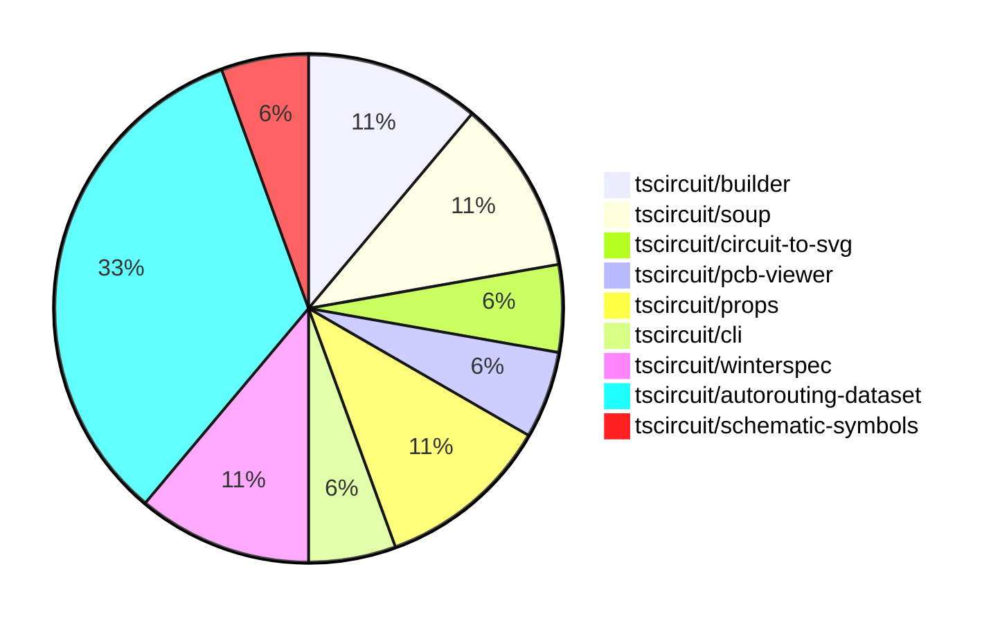

# contribution-tracker

Generates weekly contribution overviews for tscircuit contributors. Check out all
the [contribution overviews here](./contribution-overviews/)

* All PRs in the tscircuit org are scanned/summarized via Claude Haiku
* Claude classifies each Diff/PR as a Major, Minor or Tiny contribution
* All the PRs, summaries, and classifications are organized into charts and tables

The current week is shown below. There are 3 major sections:

* [Contributor Overview](#contributor-overview)
* [PRs by Repository](#prs-by-repository)
* [PRs by Contributor](#changes-by-contributor)

## Current Week

<!-- START_CURRENT_WEEK -->

# Contribution Overview 2024-08-10

## PRs by Repository

## Contributor Overview

| Contributor | 🐳 Major | 🐙 Minor | 🐌 Tiny |
|-------------|-------|-------|-------|
| imrishabh18 | 3 | 3 | 0 |
| abhijitxy | 0 | 2 | 0 |
| seveibar | 7 | 2 | 0 |
| angelacaq | 1 | 0 | 0 |

## Changes by Repository

### [tscircuit/builder](https://github.com/tscircuit/builder)

| PR # | Impact | Contributor | Description |
|------|--------|-------------|-------------|
| [#101](https://github.com/tscircuit/builder/pull/101) | 🐳 Major | imrishabh18 | Add trace width feature |
| [#97](https://github.com/tscircuit/builder/pull/97) | 🐙 Minor | abhijitxy | Add a test to replicate the issue of duplicate port hints by creating a `bug` with `footprint="soic8"`. |

### [tscircuit/soup](https://github.com/tscircuit/soup)

| PR # | Impact | Contributor | Description |
|------|--------|-------------|-------------|
| [#18](https://github.com/tscircuit/soup/pull/18) | 🐳 Major | imrishabh18 | Introduces a new feature, `pcb_keepout`, which allows defining a keepout area on the PCB. |
| [#19](https://github.com/tscircuit/soup/pull/19) | 🐙 Minor | imrishabh18 | Add an optional `trace_width` property to the `pcb_trace_hint` type. |

### [tscircuit/circuit-to-svg](https://github.com/tscircuit/circuit-to-svg)

| PR # | Impact | Contributor | Description |
|------|--------|-------------|-------------|
| [#12](https://github.com/tscircuit/circuit-to-svg/pull/12) | 🐳 Major | imrishabh18 | Fixes the schematic port rendering by adding the `schematic_port` element and flipping the schematic in the Y-axis to match the schematic-viewer. |

### [tscircuit/pcb-viewer](https://github.com/tscircuit/pcb-viewer)

| PR # | Impact | Contributor | Description |
|------|--------|-------------|-------------|
| [#34](https://github.com/tscircuit/pcb-viewer/pull/34) | 🐙 Minor | imrishabh18 | Fix a TypeScript issue by updating the import statements in several components. |

### [tscircuit/props](https://github.com/tscircuit/props)

| PR # | Impact | Contributor | Description |
|------|--------|-------------|-------------|
| [#16](https://github.com/tscircuit/props/pull/16) | 🐙 Minor | imrishabh18 | Adds a new property `traceWidth` to the `TraceHintProps` type in the TypeScript code. |
| [#14](https://github.com/tscircuit/props/pull/14) | 🐙 Minor | abhijitxy | Rename `BugProps` to `ChipProps` and deprecate `BugProps` |

### [tscircuit/cli](https://github.com/tscircuit/cli)

| PR # | Impact | Contributor | Description |
|------|--------|-------------|-------------|
| [#120](https://github.com/tscircuit/cli/pull/120) | 🐳 Major | seveibar |  |

### [tscircuit/winterspec](https://github.com/tscircuit/winterspec)

| PR # | Impact | Contributor | Description |
|------|--------|-------------|-------------|
| [#7](https://github.com/tscircuit/winterspec/pull/7) | 🐳 Major | seveibar | Fix opts not passing when creating bundles from dirs causing middleware not to run |
| [#6](https://github.com/tscircuit/winterspec/pull/6) | 🐙 Minor | seveibar | Add support for fetch middleware in the createFetchHandlerFromDir function. |

### [tscircuit/autorouting-dataset](https://github.com/tscircuit/autorouting-dataset)

| PR # | Impact | Contributor | Description |
|------|--------|-------------|-------------|
| [#26](https://github.com/tscircuit/autorouting-dataset/pull/26) | 🐳 Major | seveibar | Enhance the `getNeighbors` function in the `infinite-grid-ijump-astar` algorithm to consider orthogonal intersection hops for optimal path planning. |
| [#25](https://github.com/tscircuit/autorouting-dataset/pull/25) | 🐳 Major | seveibar | This pull request optimizes the non-diagonal movement in the `infgrid-ijump` A* algorithm, which includes adding new sub-directions, breaking up large steps, and introducing an "axis lock" escape mechanism to avoid slow exploration. |
| [#24](https://github.com/tscircuit/autorouting-dataset/pull/24) | 🐳 Major | seveibar | Implements a jumpy A* algorithm to find paths in an infinite grid with obstacles. |
| [#23](https://github.com/tscircuit/autorouting-dataset/pull/23) | 🐳 Major | seveibar | Add an algorithm template in TypeScript for an autorouting algorithm. |
| [#22](https://github.com/tscircuit/autorouting-dataset/pull/22) | 🐳 Major | angelacaq | Improve the speed of the distant-single-trace solver using the Jump Point Finder algorithm. |
| [#29](https://github.com/tscircuit/autorouting-dataset/pull/29) | 🐙 Minor | seveibar | Removes the diagonal implementation pieces from the ortho implementation and adds a flag for the fast step heuristic. |

### [tscircuit/schematic-symbols](https://github.com/tscircuit/schematic-symbols)

| PR # | Impact | Contributor | Description |
|------|--------|-------------|-------------|
| [#2](https://github.com/tscircuit/schematic-symbols/pull/2) | 🐳 Major | seveibar | Added a new symbol for a fuse, including both horizontal and vertical orientations. |

## Changes by Contributor

### [imrishabh18](https://github.com/imrishabh18)

| PR # | Impact | Description |
|------|--------|-------------|
| [#101](https://github.com/tscircuit/builder/pull/101) | 🐳 Major | Add trace width feature |
| [#18](https://github.com/tscircuit/soup/pull/18) | 🐳 Major | Introduces a new feature, `pcb_keepout`, which allows defining a keepout area on the PCB. |
| [#12](https://github.com/tscircuit/circuit-to-svg/pull/12) | 🐳 Major | Fixes the schematic port rendering by adding the `schematic_port` element and flipping the schematic in the Y-axis to match the schematic-viewer. |
| [#34](https://github.com/tscircuit/pcb-viewer/pull/34) | 🐙 Minor | Fix a TypeScript issue by updating the import statements in several components. |
| [#19](https://github.com/tscircuit/soup/pull/19) | 🐙 Minor | Add an optional `trace_width` property to the `pcb_trace_hint` type. |
| [#16](https://github.com/tscircuit/props/pull/16) | 🐙 Minor | Adds a new property `traceWidth` to the `TraceHintProps` type in the TypeScript code. |

### [abhijitxy](https://github.com/abhijitxy)

| PR # | Impact | Description |
|------|--------|-------------|
| [#97](https://github.com/tscircuit/builder/pull/97) | 🐙 Minor | Add a test to replicate the issue of duplicate port hints by creating a `bug` with `footprint="soic8"`. |
| [#14](https://github.com/tscircuit/props/pull/14) | 🐙 Minor | Rename `BugProps` to `ChipProps` and deprecate `BugProps` |

### [seveibar](https://github.com/seveibar)

| PR # | Impact | Description |
|------|--------|-------------|
| [#120](https://github.com/tscircuit/cli/pull/120) | 🐳 Major |  |
| [#7](https://github.com/tscircuit/winterspec/pull/7) | 🐳 Major | Fix opts not passing when creating bundles from dirs causing middleware not to run |
| [#26](https://github.com/tscircuit/autorouting-dataset/pull/26) | 🐳 Major | Enhance the `getNeighbors` function in the `infinite-grid-ijump-astar` algorithm to consider orthogonal intersection hops for optimal path planning. |
| [#25](https://github.com/tscircuit/autorouting-dataset/pull/25) | 🐳 Major | This pull request optimizes the non-diagonal movement in the `infgrid-ijump` A* algorithm, which includes adding new sub-directions, breaking up large steps, and introducing an "axis lock" escape mechanism to avoid slow exploration. |
| [#24](https://github.com/tscircuit/autorouting-dataset/pull/24) | 🐳 Major | Implements a jumpy A* algorithm to find paths in an infinite grid with obstacles. |
| [#23](https://github.com/tscircuit/autorouting-dataset/pull/23) | 🐳 Major | Add an algorithm template in TypeScript for an autorouting algorithm. |
| [#2](https://github.com/tscircuit/schematic-symbols/pull/2) | 🐳 Major | Added a new symbol for a fuse, including both horizontal and vertical orientations. |
| [#6](https://github.com/tscircuit/winterspec/pull/6) | 🐙 Minor | Add support for fetch middleware in the createFetchHandlerFromDir function. |
| [#29](https://github.com/tscircuit/autorouting-dataset/pull/29) | 🐙 Minor | Removes the diagonal implementation pieces from the ortho implementation and adds a flag for the fast step heuristic. |

### [angelacaq](https://github.com/angelacaq)

| PR # | Impact | Description |
|------|--------|-------------|
| [#22](https://github.com/tscircuit/autorouting-dataset/pull/22) | 🐳 Major | Improve the speed of the distant-single-trace solver using the Jump Point Finder algorithm. |

<!-- END_CURRENT_WEEK -->
