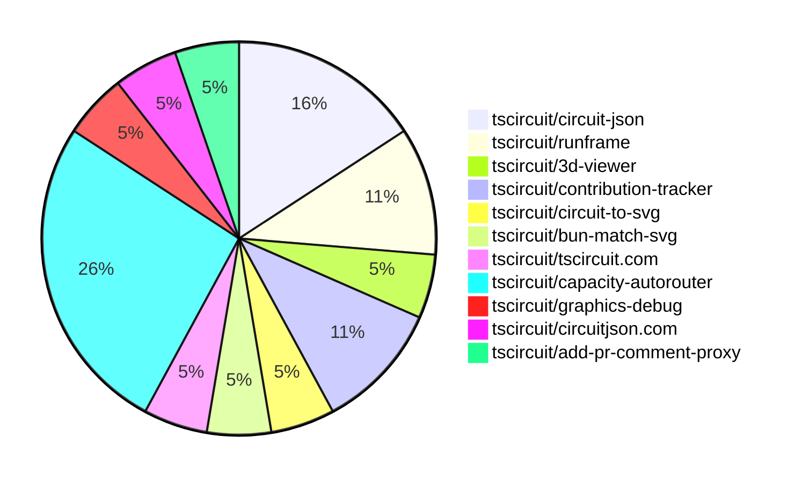

# contribution-tracker

Generates weekly contribution overviews for tscircuit contributors. Check out all
the [contribution overviews here](./contribution-overviews/)

* All PRs in the tscircuit org are scanned/summarized via Claude Haiku
* Claude classifies each Diff/PR as a Major, Minor or Tiny contribution
* All the PRs, summaries, and classifications are organized into charts and tables

The current week is shown below. There are 3 major sections:

* [Contributor Overview](#contributor-overview)
* [PRs by Repository](#prs-by-repository)
* [PRs by Contributor](#changes-by-contributor)

## Current Week

<!-- START_CURRENT_WEEK -->

# Contribution Overview 2025-02-26

## PRs by Repository

## Contributor Overview

| Contributor | 🐳 Major | 🐙 Minor | 🐌 Tiny | ⭐ | Issues Created |
|-------------|---------|---------|---------|-----|----------------|
| [seveibar](#seveibar) | 2 | 4 | 0 | ⭐⭐ | 11 |
| [imrishabh18](#imrishabh18) | 0 | 1 | 2 | ⭐ | 3 |
| [MustafaMulla29](#MustafaMulla29) | 1 | 1 | 0 | ⭐ | 1 |
| [techmannih](#techmannih) | 0 | 2 | 0 | ⭐ | 3 |
| [Abse2001](#Abse2001) | 0 | 1 | 0 | ⭐ | 1 |
| [Ayushjhawar8](#Ayushjhawar8) | 0 | 1 | 0 |  | 0 |
| [Anshgrover23](#Anshgrover23) | 0 | 1 | 0 |  | 1 |
| [krushnarout](#krushnarout) | 0 | 1 | 0 |  | 0 |
| [kom-senapati](#kom-senapati) | 0 | 0 | 0 |  | 0 |

## Review Table

[reviews-received-hover]: ## "Number of reviews received for PRs for this contributor"
[approvals-received-hover]: ## "Number of approvals received for PRs this contributor authored"
[rejections-received-hover]: ## "Number of rejections received for PRs this contributor authored"
[prs-opened-hover]: ## "Number of PRs opened by this contributor"
[issues-created-hover]: ## "Number of issues created by this contributor"
[bountied-issues-hover]: ## "Number of issues this contributor created with a bounty"
[bountied-issue-$-hover]: ## "Total bounty amount placed on issues authored by this contributor"

| Contributor | Reviews Received | Approvals Received | Rejections Received | Approvals | Rejections | PRs Opened | PRs Merged | Issues Created | Bountied Issues | Bountied Issue $ |
|---|---|---|---|---|---|---|---|---|---|---|
| [techmannih](#techmannih) | 7 | 3 | 2 | 0 | 0 | 8 | 2 | 3 | 0 | 0 |
| [Abse2001](#Abse2001) | 0 | 0 | 0 | 2 | 0 | 1 | 1 | 1 | 1 | 15 |
| [imrishabh18](#imrishabh18) | 0 | 0 | 0 | 2 | 0 | 3 | 3 | 3 | 1 | 20 |
| [MustafaMulla29](#MustafaMulla29) | 5 | 3 | 1 | 0 | 0 | 4 | 2 | 1 | 0 | 0 |
| [seveibar](#seveibar) | 0 | 0 | 0 | 6 | 3 | 8 | 6 | 11 | 10 | 152 |
| [ShiboSoftwareDev](#ShiboSoftwareDev) | 0 | 0 | 0 | 1 | 0 | 1 | 0 | 9 | 2 | 45 |
| [kom-senapati](#kom-senapati) | 7 | 5 | 0 | 0 | 0 | 2 | 2 | 0 | 0 | 0 |
| [ArnavK-09](#ArnavK-09) | 0 | 0 | 0 | 2 | 0 | 0 | 0 | 2 | 0 | 0 |
| [Anshgrover23](#Anshgrover23) | 1 | 1 | 0 | 1 | 0 | 1 | 1 | 1 | 0 | 0 |
| [Ayushjhawar8](#Ayushjhawar8) | 3 | 1 | 0 | 0 | 0 | 2 | 1 | 0 | 0 | 0 |
| [krushnarout](#krushnarout) | 1 | 1 | 0 | 0 | 0 | 1 | 1 | 0 | 0 | 0 |
| [PatanSharuKhan](#PatanSharuKhan) | 0 | 0 | 0 | 0 | 0 | 1 | 0 | 0 | 0 | 0 |

## Changes by Repository

### [tscircuit/circuit-json](https://github.com/tscircuit/circuit-json)

| PR # | Impact | Contributor | Description |
|------|--------|-------------|-------------|
| [#150](https://github.com/tscircuit/circuit-json/pull/150) | 🐙 Minor | techmannih | Add support for setting the stroke width of silkscreen text |
| [#151](https://github.com/tscircuit/circuit-json/pull/151) | 🐙 Minor | techmannih | Add rotation in schematic component |
| [#152](https://github.com/tscircuit/circuit-json/pull/152) | 🐙 Minor | Abse2001 | Reverts the addition of rotation in schematic component. |

### [tscircuit/runframe](https://github.com/tscircuit/runframe)

| PR # | Impact | Contributor | Description |
|------|--------|-------------|-------------|
| [#281](https://github.com/tscircuit/runframe/pull/281) | 🐙 Minor | imrishabh18 | Update the pushbutton footprint in the 3D viewer |
| [#282](https://github.com/tscircuit/runframe/pull/282) | 🐌 Tiny | imrishabh18 | Update the GitHub Actions workflow to use the correct version of the `oven-sh/setup-bun` action and the latest version of the `actions/setup-node` action. |

### [tscircuit/3d-viewer](https://github.com/tscircuit/3d-viewer)

| PR # | Impact | Contributor | Description |
|------|--------|-------------|-------------|
| [#196](https://github.com/tscircuit/3d-viewer/pull/196) | 🐌 Tiny | imrishabh18 | Update the jscad-electronics dependency to version 0.0.27 |

### [tscircuit/contribution-tracker](https://github.com/tscircuit/contribution-tracker)

| PR # | Impact | Contributor | Description |
|------|--------|-------------|-------------|
| [#68](https://github.com/tscircuit/contribution-tracker/pull/68) | 🟣 | kom-senapati | Add loading state to contributors data fetching |
| [#79](https://github.com/tscircuit/contribution-tracker/pull/79) | 🟣 | kom-senapati | Add tooltips to contribution icons and stats in the contributor card and overview components. |

### [tscircuit/circuit-to-svg](https://github.com/tscircuit/circuit-to-svg)

| PR # | Impact | Contributor | Description |
|------|--------|-------------|-------------|
| [#179](https://github.com/tscircuit/circuit-to-svg/pull/179) | 🐙 Minor | Ayushjhawar8 | Fix silkscreen text rotation |

### [tscircuit/bun-match-svg](https://github.com/tscircuit/bun-match-svg)

| PR # | Impact | Contributor | Description |
|------|--------|-------------|-------------|
| [#10](https://github.com/tscircuit/bun-match-svg/pull/10) | 🐙 Minor | Anshgrover23 | The pull request fixes an issue where existing files would be overwritten during the initialization process. |

### [tscircuit/tscircuit.com](https://github.com/tscircuit/tscircuit.com)

| PR # | Impact | Contributor | Description |
|------|--------|-------------|-------------|
| [#696](https://github.com/tscircuit/tscircuit.com/pull/696) | 🐙 Minor | krushnarout | Fix blinking led board template by updating the import for the A555Timer component |

### [tscircuit/capacity-autorouter](https://github.com/tscircuit/capacity-autorouter)

| PR # | Impact | Contributor | Description |
|------|--------|-------------|-------------|
| [#23](https://github.com/tscircuit/capacity-autorouter/pull/23) | 🐳 Major | seveibar | The pull request modifies the way PCB traces are processed and merged in the CapacityMeshSolver class. |
| [#20](https://github.com/tscircuit/capacity-autorouter/pull/20) | 🐳 Major | seveibar | This pull request adds a JSON file containing information about a PCB design, including the bounds, obstacles, and their connections. |
| [#24](https://github.com/tscircuit/capacity-autorouter/pull/24) | 🐙 Minor | seveibar | Fix SimpleRouteJson output and add svg tests for making sure they don't break |
| [#22](https://github.com/tscircuit/capacity-autorouter/pull/22) | 🐙 Minor | seveibar | Fix layers and add connection name to output PCB traces |
| [#21](https://github.com/tscircuit/capacity-autorouter/pull/21) | 🐙 Minor | seveibar | Make connection names unique to fix segment point crossing issues. |

### [tscircuit/graphics-debug](https://github.com/tscircuit/graphics-debug)

| PR # | Impact | Contributor | Description |
|------|--------|-------------|-------------|
| [#30](https://github.com/tscircuit/graphics-debug/pull/30) | 🐙 Minor | seveibar | Add a custom matcher for testing GraphicsObjects with Bun's test framework |

### [tscircuit/circuitjson.com](https://github.com/tscircuit/circuitjson.com)

| PR # | Impact | Contributor | Description |
|------|--------|-------------|-------------|
| [#12](https://github.com/tscircuit/circuitjson.com/pull/12) | 🐳 Major | MustafaMulla29 | Added support for uploading SimpleRouteJson format and converting it to CircuitJson format. |

### [tscircuit/add-pr-comment-proxy](https://github.com/tscircuit/add-pr-comment-proxy)

| PR # | Impact | Contributor | Description |
|------|--------|-------------|-------------|
| [#9](https://github.com/tscircuit/add-pr-comment-proxy/pull/9) | 🐙 Minor | MustafaMulla29 | The pull request updates the existing comment instead of reposting a new one. |

## Changes by Contributor

### [techmannih](https://github.com/techmannih)

| PR # | Impact | Description |
|------|--------|-------------|
| [#150](https://github.com/tscircuit/circuit-json/pull/150) | 🐙 Minor | Add support for setting the stroke width of silkscreen text |
| [#151](https://github.com/tscircuit/circuit-json/pull/151) | 🐙 Minor | Add rotation in schematic component |

### [Abse2001](https://github.com/Abse2001)

| PR # | Impact | Description |
|------|--------|-------------|
| [#152](https://github.com/tscircuit/circuit-json/pull/152) | 🐙 Minor | Reverts the addition of rotation in schematic component. |

### [imrishabh18](https://github.com/imrishabh18)

| PR # | Impact | Description |
|------|--------|-------------|
| [#281](https://github.com/tscircuit/runframe/pull/281) | 🐙 Minor | Update the pushbutton footprint in the 3D viewer |
| [#196](https://github.com/tscircuit/3d-viewer/pull/196) | 🐌 Tiny | Update the jscad-electronics dependency to version 0.0.27 |
| [#282](https://github.com/tscircuit/runframe/pull/282) | 🐌 Tiny | Update the GitHub Actions workflow to use the correct version of the `oven-sh/setup-bun` action and the latest version of the `actions/setup-node` action. |

### [kom-senapati](https://github.com/kom-senapati)

| PR # | Impact | Description |
|------|--------|-------------|
| [#68](https://github.com/tscircuit/contribution-tracker/pull/68) | 🟣 | Add loading state to contributors data fetching |
| [#79](https://github.com/tscircuit/contribution-tracker/pull/79) | 🟣 | Add tooltips to contribution icons and stats in the contributor card and overview components. |

### [Ayushjhawar8](https://github.com/Ayushjhawar8)

| PR # | Impact | Description |
|------|--------|-------------|
| [#179](https://github.com/tscircuit/circuit-to-svg/pull/179) | 🐙 Minor | Fix silkscreen text rotation |

### [Anshgrover23](https://github.com/Anshgrover23)

| PR # | Impact | Description |
|------|--------|-------------|
| [#10](https://github.com/tscircuit/bun-match-svg/pull/10) | 🐙 Minor | The pull request fixes an issue where existing files would be overwritten during the initialization process. |

### [krushnarout](https://github.com/krushnarout)

| PR # | Impact | Description |
|------|--------|-------------|
| [#696](https://github.com/tscircuit/tscircuit.com/pull/696) | 🐙 Minor | Fix blinking led board template by updating the import for the A555Timer component |

### [seveibar](https://github.com/seveibar)

| PR # | Impact | Description |
|------|--------|-------------|
| [#23](https://github.com/tscircuit/capacity-autorouter/pull/23) | 🐳 Major | The pull request modifies the way PCB traces are processed and merged in the CapacityMeshSolver class. |
| [#20](https://github.com/tscircuit/capacity-autorouter/pull/20) | 🐳 Major | This pull request adds a JSON file containing information about a PCB design, including the bounds, obstacles, and their connections. |
| [#30](https://github.com/tscircuit/graphics-debug/pull/30) | 🐙 Minor | Add a custom matcher for testing GraphicsObjects with Bun's test framework |
| [#24](https://github.com/tscircuit/capacity-autorouter/pull/24) | 🐙 Minor | Fix SimpleRouteJson output and add svg tests for making sure they don't break |
| [#22](https://github.com/tscircuit/capacity-autorouter/pull/22) | 🐙 Minor | Fix layers and add connection name to output PCB traces |
| [#21](https://github.com/tscircuit/capacity-autorouter/pull/21) | 🐙 Minor | Make connection names unique to fix segment point crossing issues. |

### [MustafaMulla29](https://github.com/MustafaMulla29)

| PR # | Impact | Description |
|------|--------|-------------|
| [#12](https://github.com/tscircuit/circuitjson.com/pull/12) | 🐳 Major | Added support for uploading SimpleRouteJson format and converting it to CircuitJson format. |
| [#9](https://github.com/tscircuit/add-pr-comment-proxy/pull/9) | 🐙 Minor | The pull request updates the existing comment instead of reposting a new one. |

<!-- END_CURRENT_WEEK -->
