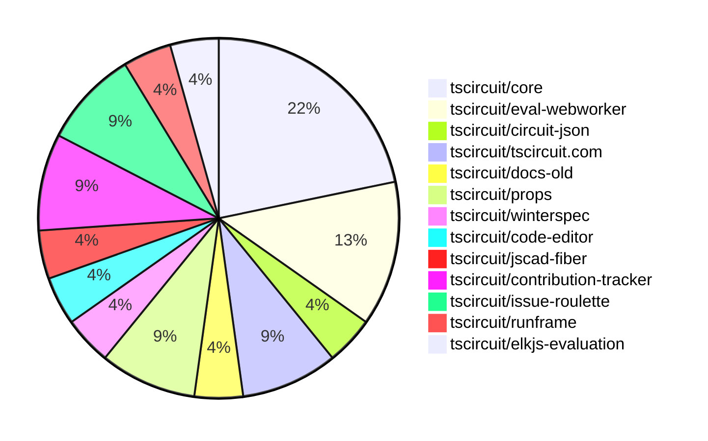

# contribution-tracker

Generates weekly contribution overviews for tscircuit contributors. Check out all
the [contribution overviews here](./contribution-overviews/)

* All PRs in the tscircuit org are scanned/summarized via Claude Haiku
* Claude classifies each Diff/PR as a Major, Minor or Tiny contribution
* All the PRs, summaries, and classifications are organized into charts and tables

The current week is shown below. There are 3 major sections:

* [Contributor Overview](#contributor-overview)
* [PRs by Repository](#prs-by-repository)
* [PRs by Contributor](#changes-by-contributor)

## Current Week

<!-- START_CURRENT_WEEK -->

# Contribution Overview 2025-01-22

## PRs by Repository

## Contributor Overview

| Contributor | 🐳 Major | 🐙 Minor | 🐌 Tiny | ⭐ | Issues Created |
|-------------|---------|---------|---------|-----|----------------|
| [seveibar](#seveibar) | 3 | 5 | 0 | ⭐⭐⭐ | 34 |
| [imrishabh18](#imrishabh18) | 1 | 3 | 0 | ⭐⭐ | 3 |
| [Anshgrover23](#Anshgrover23) | 1 | 2 | 0 | ⭐ | 3 |
| [ShiboSoftwareDev](#ShiboSoftwareDev) | 1 | 1 | 0 | ⭐ | 1 |
| [krushnarout](#krushnarout) | 1 | 0 | 0 | ⭐ | 0 |
| [ArnavK-09](#ArnavK-09) | 1 | 0 | 0 | ⭐ | 0 |
| [Ayushjhawar8](#Ayushjhawar8) | 1 | 0 | 0 | ⭐ | 0 |
| [AnasSarkiz](#AnasSarkiz) | 1 | 0 | 0 | ⭐ | 1 |
| [kom-senapati](#kom-senapati) | 0 | 1 | 0 |  | 2 |
| [techmannih](#techmannih) | 0 | 1 | 0 |  | 4 |

## Review Table

[reviews-received-hover]: ## "Number of reviews received for PRs for this contributor"
[approvals-received-hover]: ## "Number of approvals received for PRs this contributor authored"
[rejections-received-hover]: ## "Number of rejections received for PRs this contributor authored"
[prs-opened-hover]: ## "Number of PRs opened by this contributor"
[issues-created-hover]: ## "Number of issues created by this contributor"
[bountied-issues-hover]: ## "Number of issues this contributor created with a bounty"
[bountied-issue-$-hover]: ## "Total bounty amount placed on issues authored by this contributor"

| Contributor | Reviews Received | Approvals Received | Rejections Received | Approvals | Rejections | PRs Opened | PRs Merged | Issues Created | Bountied Issues | Bountied Issue $ |
|---|---|---|---|---|---|---|---|---|---|---|
| [seveibar](#seveibar) | 0 | 0 | 0 | 11 | 8 | 9 | 8 | 34 | 28 | 417 |
| [krushnarout](#krushnarout) | 10 | 0 | 3 | 0 | 0 | 2 | 1 | 0 | 0 | 0 |
| [imrishabh18](#imrishabh18) | 8 | 0 | 0 | 0 | 3 | 4 | 4 | 3 | 1 | 10 |
| [Ayushjhawar8](#Ayushjhawar8) | 12 | 1 | 5 | 0 | 0 | 3 | 1 | 0 | 0 | 0 |
| [Anshgrover23](#Anshgrover23) | 7 | 3 | 1 | 2 | 4 | 5 | 3 | 3 | 0 | 0 |
| [ArnavK-09](#ArnavK-09) | 4 | 2 | 0 | 0 | 0 | 3 | 1 | 0 | 0 | 0 |
| [techmannih](#techmannih) | 7 | 1 | 2 | 0 | 0 | 4 | 1 | 4 | 0 | 0 |
| [kom-senapati](#kom-senapati) | 6 | 2 | 4 | 0 | 0 | 4 | 1 | 2 | 1 | 2 |
| [ShiboSoftwareDev](#ShiboSoftwareDev) | 2 | 2 | 0 | 0 | 0 | 2 | 2 | 1 | 0 | 0 |
| [mdkaifansari04](#mdkaifansari04) | 0 | 0 | 0 | 0 | 0 | 1 | 0 | 0 | 0 | 0 |
| [mojafa](#mojafa) | 0 | 0 | 0 | 0 | 0 | 1 | 0 | 0 | 0 | 0 |
| [Abse2001](#Abse2001) | 1 | 1 | 0 | 0 | 0 | 1 | 0 | 0 | 0 | 0 |
| [Girma35](#Girma35) | 0 | 0 | 0 | 0 | 0 | 1 | 0 | 0 | 0 | 0 |
| [AnasSarkiz](#AnasSarkiz) | 1 | 1 | 0 | 0 | 0 | 1 | 1 | 1 | 0 | 0 |

## Changes by Repository

### [tscircuit/core](https://github.com/tscircuit/core)

| PR # | Impact | Contributor | Description |
|------|--------|-------------|-------------|
| [#549](https://github.com/tscircuit/core/pull/549) | 🐳 Major | seveibar | Introduces the `sel` object, which provides a structured and type-safe way to access components and their pins in a circuit. |
| [#543](https://github.com/tscircuit/core/pull/543) | 🐳 Major | seveibar | Adds support for subcircuit-dependent autorouting in the PCB rendering pipeline. |
| [#546](https://github.com/tscircuit/core/pull/546) | 🐙 Minor | seveibar | Fixes an issue with the reconciler constants import that was preventing the use of NextJS core. |
| [#545](https://github.com/tscircuit/core/pull/545) | 🐙 Minor | imrishabh18 | Optimized the circuit JSON sent to the autorouter by including only the `Source_` and `Pcb_` elements, and added the `subcircuit_id` to the request. |
| [#539](https://github.com/tscircuit/core/pull/539) | 🐙 Minor | imrishabh18 | Adds `subcircuit_id` and `pcb_group_id` to primitive components, and adds `is_subcircuit` to the `source_group`. |

### [tscircuit/eval-webworker](https://github.com/tscircuit/eval-webworker)

| PR # | Impact | Contributor | Description |
|------|--------|-------------|-------------|
| [#91](https://github.com/tscircuit/eval-webworker/pull/91) | 🐳 Major | seveibar | Add Eval Export |
| [#92](https://github.com/tscircuit/eval-webworker/pull/92) | 🐙 Minor | seveibar | Add types to exports in package.json file. |
| [#89](https://github.com/tscircuit/eval-webworker/pull/89) | 🐙 Minor | seveibar | Allow importing "tscircuit" and alias it to "@tscircuit/core" |

### [tscircuit/circuit-json](https://github.com/tscircuit/circuit-json)

| PR # | Impact | Contributor | Description |
|------|--------|-------------|-------------|
| [#125](https://github.com/tscircuit/circuit-json/pull/125) | 🐙 Minor | seveibar | Adds a new optional field 'parent_subcircuit_id' to the SourceGroup schema. |

### [tscircuit/tscircuit.com](https://github.com/tscircuit/tscircuit.com)

| PR # | Impact | Contributor | Description |
|------|--------|-------------|-------------|
| [#605](https://github.com/tscircuit/tscircuit.com/pull/605) | 🐙 Minor | seveibar | Allows synchronous import of "tscircuit" in the "use-run-tsx" hook |
| [#604](https://github.com/tscircuit/tscircuit.com/pull/604) | 🐙 Minor | imrishabh18 | Replace custom viewer components with the CircuitJsonPreview component from the runframe library. |

### [tscircuit/docs-old](https://github.com/tscircuit/docs-old)

| PR # | Impact | Contributor | Description |
|------|--------|-------------|-------------|
| [#59](https://github.com/tscircuit/docs-old/pull/59) | 🐳 Major | krushnarout | Ports the existing documentation from Mintlify to Docusaurus. |

### [tscircuit/props](https://github.com/tscircuit/props)

| PR # | Impact | Contributor | Description |
|------|--------|-------------|-------------|
| [#148](https://github.com/tscircuit/props/pull/148) | 🐳 Major | ShiboSoftwareDev | Adds a script to generate a markdown file for TSCircuit component types. |
| [#147](https://github.com/tscircuit/props/pull/147) | 🐙 Minor | ShiboSoftwareDev | Cleanup folder structure by moving source files to their respective component folders. |

### [tscircuit/winterspec](https://github.com/tscircuit/winterspec)

| PR # | Impact | Contributor | Description |
|------|--------|-------------|-------------|
| [#29](https://github.com/tscircuit/winterspec/pull/29) | 🐳 Major | ArnavK-09 | Fixes the Node Check CI and adds a new workflow to run tests with Bun. |

### [tscircuit/code-editor](https://github.com/tscircuit/code-editor)

| PR # | Impact | Contributor | Description |
|------|--------|-------------|-------------|
| [#9](https://github.com/tscircuit/code-editor/pull/9) | 🐳 Major | imrishabh18 | Adds a GitHub Actions workflow to automatically publish the package to npm on a push to the main branch. |

### [tscircuit/jscad-fiber](https://github.com/tscircuit/jscad-fiber)

| PR # | Impact | Contributor | Description |
|------|--------|-------------|-------------|
| [#103](https://github.com/tscircuit/jscad-fiber/pull/103) | 🐙 Minor | kom-senapati | Isolate functions requiring Three.js into a separate entrypoint |

### [tscircuit/contribution-tracker](https://github.com/tscircuit/contribution-tracker)

| PR # | Impact | Contributor | Description |
|------|--------|-------------|-------------|
| [#37](https://github.com/tscircuit/contribution-tracker/pull/37) | 🐳 Major | Anshgrover23 | The pull request changes the scoring mechanism for contributor reviews, using distinct PR counts instead of raw review counts, and capping the review points at 20. |
| [#39](https://github.com/tscircuit/contribution-tracker/pull/39) | 🐙 Minor | Anshgrover23 | Add "Major", "Minor", "Tiny", and star rating to the contributor stats in the generated Markdown |

### [tscircuit/issue-roulette](https://github.com/tscircuit/issue-roulette)

| PR # | Impact | Contributor | Description |
|------|--------|-------------|-------------|
| [#8](https://github.com/tscircuit/issue-roulette/pull/8) | 🐙 Minor | Anshgrover23 | Adds a filter to the IssueRoulette component to allow users to view all issues, bountied issues, or unbountied issues. |
| [#14](https://github.com/tscircuit/issue-roulette/pull/14) | 🐙 Minor | techmannih | Updates the title of the metadata object. |

### [tscircuit/runframe](https://github.com/tscircuit/runframe)

| PR # | Impact | Contributor | Description |
|------|--------|-------------|-------------|
| [#164](https://github.com/tscircuit/runframe/pull/164) | 🐳 Major | Ayushjhawar8 | Adds a red square stop/pause button to the run frame component. |

### [tscircuit/elkjs-evaluation](https://github.com/tscircuit/elkjs-evaluation)

| PR # | Impact | Contributor | Description |
|------|--------|-------------|-------------|
| [#2](https://github.com/tscircuit/elkjs-evaluation/pull/2) | 🐳 Major | AnasSarkiz | Added Bootstrap ElkJS Evaluation |

## Changes by Contributor

### [seveibar](https://github.com/seveibar)

| PR # | Impact | Description |
|------|--------|-------------|
| [#549](https://github.com/tscircuit/core/pull/549) | 🐳 Major | Introduces the `sel` object, which provides a structured and type-safe way to access components and their pins in a circuit. |
| [#543](https://github.com/tscircuit/core/pull/543) | 🐳 Major | Adds support for subcircuit-dependent autorouting in the PCB rendering pipeline. |
| [#91](https://github.com/tscircuit/eval-webworker/pull/91) | 🐳 Major | Add Eval Export |
| [#125](https://github.com/tscircuit/circuit-json/pull/125) | 🐙 Minor | Adds a new optional field 'parent_subcircuit_id' to the SourceGroup schema. |
| [#546](https://github.com/tscircuit/core/pull/546) | 🐙 Minor | Fixes an issue with the reconciler constants import that was preventing the use of NextJS core. |
| [#605](https://github.com/tscircuit/tscircuit.com/pull/605) | 🐙 Minor | Allows synchronous import of "tscircuit" in the "use-run-tsx" hook |
| [#92](https://github.com/tscircuit/eval-webworker/pull/92) | 🐙 Minor | Add types to exports in package.json file. |
| [#89](https://github.com/tscircuit/eval-webworker/pull/89) | 🐙 Minor | Allow importing "tscircuit" and alias it to "@tscircuit/core" |

### [krushnarout](https://github.com/krushnarout)

| PR # | Impact | Description |
|------|--------|-------------|
| [#59](https://github.com/tscircuit/docs-old/pull/59) | 🐳 Major | Ports the existing documentation from Mintlify to Docusaurus. |

### [ShiboSoftwareDev](https://github.com/ShiboSoftwareDev)

| PR # | Impact | Description |
|------|--------|-------------|
| [#148](https://github.com/tscircuit/props/pull/148) | 🐳 Major | Adds a script to generate a markdown file for TSCircuit component types. |
| [#147](https://github.com/tscircuit/props/pull/147) | 🐙 Minor | Cleanup folder structure by moving source files to their respective component folders. |

### [ArnavK-09](https://github.com/ArnavK-09)

| PR # | Impact | Description |
|------|--------|-------------|
| [#29](https://github.com/tscircuit/winterspec/pull/29) | 🐳 Major | Fixes the Node Check CI and adds a new workflow to run tests with Bun. |

### [imrishabh18](https://github.com/imrishabh18)

| PR # | Impact | Description |
|------|--------|-------------|
| [#9](https://github.com/tscircuit/code-editor/pull/9) | 🐳 Major | Adds a GitHub Actions workflow to automatically publish the package to npm on a push to the main branch. |
| [#545](https://github.com/tscircuit/core/pull/545) | 🐙 Minor | Optimized the circuit JSON sent to the autorouter by including only the `Source_` and `Pcb_` elements, and added the `subcircuit_id` to the request. |
| [#539](https://github.com/tscircuit/core/pull/539) | 🐙 Minor | Adds `subcircuit_id` and `pcb_group_id` to primitive components, and adds `is_subcircuit` to the `source_group`. |
| [#604](https://github.com/tscircuit/tscircuit.com/pull/604) | 🐙 Minor | Replace custom viewer components with the CircuitJsonPreview component from the runframe library. |

### [kom-senapati](https://github.com/kom-senapati)

| PR # | Impact | Description |
|------|--------|-------------|
| [#103](https://github.com/tscircuit/jscad-fiber/pull/103) | 🐙 Minor | Isolate functions requiring Three.js into a separate entrypoint |

### [Anshgrover23](https://github.com/Anshgrover23)

| PR # | Impact | Description |
|------|--------|-------------|
| [#37](https://github.com/tscircuit/contribution-tracker/pull/37) | 🐳 Major | The pull request changes the scoring mechanism for contributor reviews, using distinct PR counts instead of raw review counts, and capping the review points at 20. |
| [#39](https://github.com/tscircuit/contribution-tracker/pull/39) | 🐙 Minor | Add "Major", "Minor", "Tiny", and star rating to the contributor stats in the generated Markdown |
| [#8](https://github.com/tscircuit/issue-roulette/pull/8) | 🐙 Minor | Adds a filter to the IssueRoulette component to allow users to view all issues, bountied issues, or unbountied issues. |

### [Ayushjhawar8](https://github.com/Ayushjhawar8)

| PR # | Impact | Description |
|------|--------|-------------|
| [#164](https://github.com/tscircuit/runframe/pull/164) | 🐳 Major | Adds a red square stop/pause button to the run frame component. |

### [techmannih](https://github.com/techmannih)

| PR # | Impact | Description |
|------|--------|-------------|
| [#14](https://github.com/tscircuit/issue-roulette/pull/14) | 🐙 Minor | Updates the title of the metadata object. |

### [AnasSarkiz](https://github.com/AnasSarkiz)

| PR # | Impact | Description |
|------|--------|-------------|
| [#2](https://github.com/tscircuit/elkjs-evaluation/pull/2) | 🐳 Major | Added Bootstrap ElkJS Evaluation |

<!-- END_CURRENT_WEEK -->
