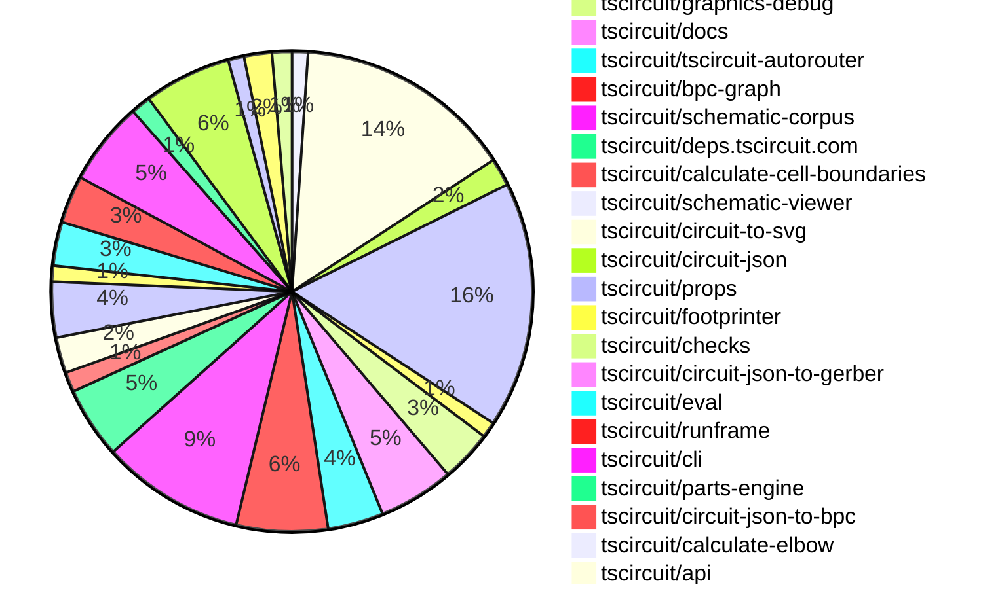
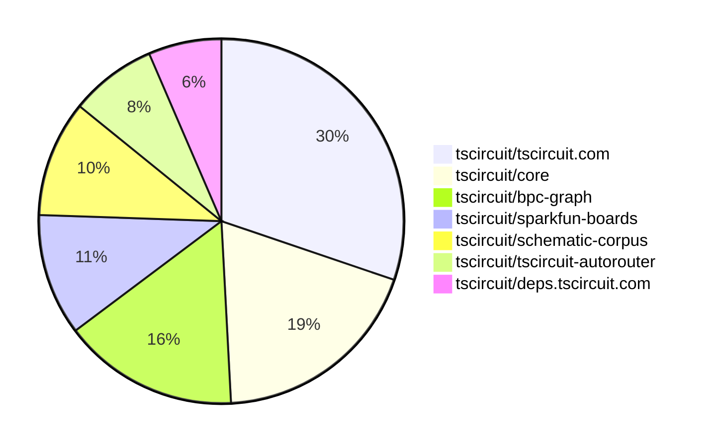

# contribution-tracker

[contributions.tscircuit.com](https://contributions.tscircuit.com) ・ [tscircuit.com](https://tscircuit.com) ・ [Contribution Overviews](./contribution-overviews/) ・ [Changelogs](./changelogs/)

Generates weekly contribution overviews for tscircuit contributors. Check out all
the [contribution overviews here](./contribution-overviews/)
You can find AI-generated monthly changelogs in the [changelogs directory](./changelogs/).

- All PRs in the tscircuit org are scanned/summarized via an LLM
- The LLM classifies each Diff/PR as into a set of attributes for scoring
- All the PRs, summaries, and classifications are organized into charts and tables for [the website](https://contributions.tscircuit.com)

> Want to run locally? See the [Development Section](#development)

The current week is shown below. There are 3 major sections:

- [Contributor Overview](#contributor-overview)
- [PRs by Repository](#prs-by-repository)
- [PRs by Contributor](#changes-by-contributor)

## Current Week

<!-- START_CURRENT_WEEK -->

# Contribution Overview 2025-06-18

## PRs by Repository



## Contributor Overview

| Contributor | 🐳 Major | 🐙 Minor | 🐌 Tiny | ⭐ | Issues Created | Discussion Contributions |
|-------------|---------|---------|---------|-----|----------------|--------------------------|
| [seveibar](#seveibar) | 35 | 12 | 105 | 👑👑 | 4 | 0🔹 0🔶 0💎 |
| [ArnavK-09](#ArnavK-09) | 16 | 4 | 15 | 👑 | 14 | 0🔹 0🔶 0💎 |
| [imrishabh18](#imrishabh18) | 4 | 11 | 42 | 👑 | 4 | 0🔹 0🔶 0💎 |
| [ShiboSoftwareDev](#ShiboSoftwareDev) | 4 | 4 | 22 | ⭐⭐⭐ | 17 | 0🔹 0🔶 0💎 |
| [techmannih](#techmannih) | 1 | 6 | 20 | ⭐⭐⭐ | 4 | 0🔹 0🔶 0💎 |
| [Anshgrover23](#Anshgrover23) | 3 | 1 | 31 | ⭐⭐⭐ | 20 | 0🔹 0🔶 0💎 |
| [Abse2001](#Abse2001) | 1 | 4 | 23 | ⭐⭐ | 3 | 0🔹 0🔶 0💎 |
| [MustafaMulla29](#MustafaMulla29) | 2 | 1 | 9 | ⭐⭐ | 7 | 0🔹 0🔶 0💎 |
| [ricohageman](#ricohageman) | 3 | 0 | 1 | ⭐⭐ | 0 | 0🔹 0🔶 0💎 |
| [andrii-balitskyi](#andrii-balitskyi) | 2 | 1 | 2 | ⭐⭐ | 0 | 0🔹 0🔶 0💎 |
| [tscircuitbot](#tscircuitbot) | 0 | 0 | 6 | ⭐ | 0 | 0🔹 0🔶 0💎 |

### Discussion Contribution Legend

- 🔹 Normal Comments: Basic participation with minimal effort
- 🔶 Great Informative Comments: Thoughtful participation that adds value
- 💎 Incredible Comments: Exceptional participation with high-quality content

## Review Table

[reviews-received-hover]: ## "Number of reviews received for PRs for this contributor"
[approvals-received-hover]: ## "Number of approvals received for PRs this contributor authored"
[rejections-received-hover]: ## "Number of rejections received for PRs this contributor authored"
[prs-opened-hover]: ## "Number of PRs opened by this contributor"
[issues-created-hover]: ## "Number of issues created by this contributor"
[bountied-issues-hover]: ## "Number of issues this contributor created with a bounty"
[bountied-issue-$-hover]: ## "Total bounty amount placed on issues authored by this contributor"

| Contributor | Reviews Received | Approvals Received | Rejections Received | Approvals | Rejections | PRs Opened | PRs Merged | Issues Created | Bountied Issues | Bountied Issue $ |
|---|---|---|---|---|---|---|---|---|---|---|
| [seveibar](#seveibar) | 46 | 2 | 0 | 136 | 12 | 197 | 153 | 4 | 2 | 50 |
| [Abse2001](#Abse2001) | 23 | 19 | 1 | 13 | 0 | 32 | 28 | 3 | 0 | 0 |
| [imrishabh18](#imrishabh18) | 42 | 27 | 2 | 23 | 2 | 69 | 61 | 4 | 0 | 0 |
| [techmannih](#techmannih) | 79 | 34 | 11 | 7 | 4 | 42 | 27 | 4 | 0 | 0 |
| [ShiboSoftwareDev](#ShiboSoftwareDev) | 41 | 29 | 1 | 27 | 2 | 40 | 31 | 17 | 1 | 5 |
| [Anshgrover23](#Anshgrover23) | 62 | 47 | 6 | 6 | 7 | 46 | 35 | 20 | 0 | 0 |
| [graphite-app[bot]](#graphite-app[bot]) | 0 | 0 | 0 | 0 | 0 | 0 | 0 | 0 | 0 | 0 |
| [cursor[bot]](#cursor[bot]) | 0 | 0 | 0 | 0 | 0 | 0 | 0 | 0 | 0 | 0 |
| [MustafaMulla29](#MustafaMulla29) | 23 | 17 | 3 | 1 | 0 | 18 | 12 | 7 | 0 | 0 |
| [ArnavK-09](#ArnavK-09) | 53 | 37 | 2 | 7 | 0 | 37 | 35 | 14 | 0 | 0 |
| [andrii-balitskyi](#andrii-balitskyi) | 7 | 4 | 1 | 0 | 0 | 6 | 5 | 0 | 0 | 0 |
| [tscircuitbot](#tscircuitbot) | 0 | 0 | 0 | 0 | 0 | 101 | 7 | 0 | 0 | 0 |
| [ricohageman](#ricohageman) | 6 | 4 | 0 | 0 | 0 | 4 | 4 | 0 | 0 | 0 |

## Top 7 Repositories by Contribution Points



## Changes by Repository

### [tscircuit/easyeda-converter](https://github.com/tscircuit/easyeda-converter)

| PR # | Impact | Contributor | Description |
|------|--------|-------------|-------------|
| [#269](https://github.com/tscircuit/easyeda-converter/pull/269) | 🐳 Major | seveibar | Summary add ViaSchema to support VIA shapes in packages convert VIA elements to pcb_via add test for part C46497 which includes VIA add snapshot test for pcb vias  Testing bun test testsparse-testsparse-c46497.test.ts BUN_UPDATE_SNAPSHOTS1 bun test testsconvert-to-soup-testsc46497.test.ts |
| [#254](https://github.com/tscircuit/easyeda-converter/pull/254) | 🐙 Minor | techmannih | Fixes import issue with part C5830143 from JLCPCB, ensuring proper conversion to TypeScript and circuit JSON. |
| [#255](https://github.com/tscircuit/easyeda-converter/pull/255) | 🐙 Minor | techmannih | Fixes import failure for JLCPCB part C9900017879 by correcting the schema definition for component parameters in the EasyEDA JSON schema. |

<details>
<summary>🐌 Tiny Contributions (1)</summary>

| PR # | Impact | Contributor | Description |
|------|--------|-------------|-------------|
| [#270](https://github.com/tscircuit/easyeda-converter/pull/270) | 🐌 Tiny | seveibar | Adds support for converting vias to TSX format in the generateFootprintTsx function, including a test for a specific component with vias. |

</details>

### [tscircuit/core](https://github.com/tscircuit/core)

| PR # | Impact | Contributor | Description |
|------|--------|-------------|-------------|
| [#1023](https://github.com/tscircuit/core/pull/1023) | 🐳 Major | seveibar | Fixes autorouting issues by sending externallyConnectedPointIds to the autorouter, enabling better route selection for subcircuits. |
| [#1016](https://github.com/tscircuit/core/pull/1016) | 🐳 Major | seveibar | Rewrite match adapt to use BPC graphs, route traces in matchAdapt mode, and work in progress on layout. |
| [#1025](https://github.com/tscircuit/core/pull/1025) | 🐳 Major | imrishabh18 | Fixes incorrect positioning of schematic text when placed within translated groups by computing the position using global coordinates instead of local coordinates. |
| [#1002](https://github.com/tscircuit/core/pull/1002) | 🐳 Major | imrishabh18 | Fixes the issue where multiple traces could exist between the same pins in a subcircuit, ensuring proper autorouting behavior. |
| [#1000](https://github.com/tscircuit/core/pull/1000) | 🐳 Major | ShiboSoftwareDev | Adds functionality to generate obstacles for cutout components in PCB designs, including rectangles, circles, and polygons. |
| [#1004](https://github.com/tscircuit/core/pull/1004) | 🐙 Minor | seveibar | Fixes the netlabel center offset calculation based on the anchor position and side, ensuring accurate placement of netlabels in schematics. |
| [#1003](https://github.com/tscircuit/core/pull/1003) | 🐙 Minor | seveibar | Fixes incorrect net IDs on schematic net labels, ensuring proper association with the corresponding nets. |
| [#948](https://github.com/tscircuit/core/pull/948) | 🐙 Minor | seveibar | Removes the deprecated NetAlias component and replaces it with a new NetLabel component, updating related tests and intrinsic JSX typings accordingly. |
| [#1028](https://github.com/tscircuit/core/pull/1028) | 🐙 Minor | imrishabh18 | Fixes the could not find port error when the pinheader component is processed inside a group due to incorrect name substitution. |
| [#962](https://github.com/tscircuit/core/pull/962) | 🐙 Minor | imrishabh18 | Expands simple route JSON bounds by padded PCB group size and adds a test to check padding application during simple route JSON computation. |
| [#938](https://github.com/tscircuit/core/pull/938) | 🐙 Minor | imrishabh18 | Fixes net label lookup in subcircuits to ensure descendant nets are correctly identified and utilized in circuit paths. |
| [#1014](https://github.com/tscircuit/core/pull/1014) | 🐙 Minor | techmannih | Adds a new test for the testpoint  component with netlabels and updates the schematic symbol version. |
| [#1008](https://github.com/tscircuit/core/pull/1008) | 🐙 Minor | ShiboSoftwareDev | Fixes the calculation of the board center based on the outline dimensions, ensuring accurate positioning of the PCB. |
| [#954](https://github.com/tscircuit/core/pull/954) | 🐙 Minor | Anshgrover23 | Fixes the issue where the schWidth property was not being displayed in the components props, ensuring proper rendering of schematic text elements. |

<details>
<summary>🐌 Tiny Contributions (41)</summary>

| PR # | Impact | Contributor | Description |
|------|--------|-------------|-------------|
| [#1024](https://github.com/tscircuit/core/pull/1024) | 🐌 Tiny | seveibar | Adds a type declaration to the import statement for the schematic-corpus, specifying that the imported data is in JSON format. |
| [#1015](https://github.com/tscircuit/core/pull/1015) | 🐌 Tiny | seveibar | Adds support for schOrientation mapping to schematic symbol rotation and introduces tests for polarized capacitor orientations. |
| [#1005](https://github.com/tscircuit/core/pull/1005) | 🐌 Tiny | seveibar | Removes the TODO placeholder from the PrimitiveComponent name getter and ensures NormalComponent footprint generation uses a fallback name. |
| [#976](https://github.com/tscircuit/core/pull/976) | 🐌 Tiny | seveibar | Fixes net label positioning based on connected ports to ensure accurate schematic representation. |
| [#977](https://github.com/tscircuit/core/pull/977) | 🐌 Tiny | seveibar | Forbids  or - characters in net names and validates Net properties against these characters. |
| [#959](https://github.com/tscircuit/core/pull/959) | 🐌 Tiny | seveibar | Allows sel to be invoked as a function and supports generic pins for any reference designator, along with testing for dynamic reference designator usage. |
| [#973](https://github.com/tscircuit/core/pull/973) | 🐌 Tiny | seveibar | Adds support for the pcbDisabled option in the RootCircuit constructor, allowing for conditional behavior based on platform configuration. |
| [#972](https://github.com/tscircuit/core/pull/972) | 🐌 Tiny | seveibar | Fixes the issue where user-defined schematic width is overridden, ensuring that the provided width is respected during schematic generation. |
| [#961](https://github.com/tscircuit/core/pull/961) | 🐌 Tiny | seveibar | Provides clearer error messages when a port selector cant resolve a pin and adds tests covering all error scenarios when port lookup fails. |
| [#960](https://github.com/tscircuit/core/pull/960) | 🐌 Tiny | seveibar | Adds support for JP jumpers and constant USBC in selector types within the tscircuitcore library. |
| [#957](https://github.com/tscircuit/core/pull/957) | 🐌 Tiny | seveibar | Allows netlabel.connectsTo to accept an array of selectors, enabling multiple connections to be defined for a netlabel. |
| [#955](https://github.com/tscircuit/core/pull/955) | 🐌 Tiny | seveibar | Disables the lockfile feature in the bunfig.toml configuration, allowing for more flexible dependency management. |
| [#951](https://github.com/tscircuit/core/pull/951) | 🐌 Tiny | seveibar | Allows net creation from netlabels and creates traces if a NetLabel has connectsTo defined, fixing the handling of netlabel connections in the schematic. |
| [#950](https://github.com/tscircuit/core/pull/950) | 🐌 Tiny | seveibar | Links netlabels to traces using the connection prop and updates the netlabel-connection schematic snapshot. |
| [#946](https://github.com/tscircuit/core/pull/946) | 🐌 Tiny | seveibar | Adds a test for netalias connections and updates the circuit-json dependency. |
| [#996](https://github.com/tscircuit/core/pull/996) | 🐌 Tiny | Abse2001 | Adds support for Test Point selectors in the selector module, allowing access to pins like sel.TP1.pin1. |
| [#956](https://github.com/tscircuit/core/pull/956) | 🐌 Tiny | Abse2001 | Adds support for J references in the selector, allowing for new component references like sel.J1 and sel.J2. |
| [#1013](https://github.com/tscircuit/core/pull/1013) | 🐌 Tiny | imrishabh18 | Locks the css-select package version to 5.1.0 to prevent breaking type issues caused by upgrading to a newer version. |
| [#998](https://github.com/tscircuit/core/pull/998) | 🐌 Tiny | imrishabh18 | Adds functionality to print board information (project name, version, URL) to the silkscreen layer of the PCB if specified in the platform configuration. |
| [#997](https://github.com/tscircuit/core/pull/997) | 🐌 Tiny | imrishabh18 | Reproduces a bug where multiple traces are created between the same pins within a subcircuit, aiding in debugging the issue. |
| [#992](https://github.com/tscircuit/core/pull/992) | 🐌 Tiny | imrishabh18 | Handles the props.symbolName for SolderJumper, allowing for dynamic schematic symbol naming based on provided props. |
| [#989](https://github.com/tscircuit/core/pull/989) | 🐌 Tiny | imrishabh18 | Adds support for a new bridged prop in the SolderJumper component, allowing for the connection of all pins when the prop is set to true, and updates test coverage for this new behavior. |
| [#985](https://github.com/tscircuit/core/pull/985) | 🐌 Tiny | imrishabh18 | Updates the circuit-to-svg dependency from version 0.0.154 to 0.0.160 in package.json. |
| [#983](https://github.com/tscircuit/core/pull/983) | 🐌 Tiny | imrishabh18 | Sets the default pin count for solderjumper to two when both pinCount and footprint are omitted, ensuring consistent behavior in component instantiation. |
| [#969](https://github.com/tscircuit/core/pull/969) | 🐌 Tiny | imrishabh18 | Fixes the polarized capacitor symbol in the schematic representation by updating the relevant type and adding tests for polarized capacitors. |
| [#949](https://github.com/tscircuit/core/pull/949) | 🐌 Tiny | imrishabh18 | Adds a render phase to assign names to unnamed components, ensuring they have default names before rendering and providing placeholder names for JSX elements that lack one. |
| [#965](https://github.com/tscircuit/core/pull/965) | 🐌 Tiny | imrishabh18 | Fixes the issue where the subcircuit_id is incorrectly set for groups that are not subcircuits, ensuring that it remains undefined when not applicable. |
| [#964](https://github.com/tscircuit/core/pull/964) | 🐌 Tiny | imrishabh18 | Adds a new render phase SourceGroupRender for initializing subcircuits in the Group component and updates the render lifecycle event tests accordingly. |
| [#947](https://github.com/tscircuit/core/pull/947) | 🐌 Tiny | imrishabh18 | Adds support for padding in the Group PCB layout and updates the tscircuitprops package to utilize new padding properties. |
| [#967](https://github.com/tscircuit/core/pull/967) | 🐌 Tiny | techmannih | Adds support for the fuse component selector in the selection utility, allowing for new pin types to be utilized in the circuit design. |
| [#975](https://github.com/tscircuit/core/pull/975) | 🐌 Tiny | techmannih | Adds typing for additional pins (pin3 to pin6) in the switch selector type definition, enhancing type safety and usability. |
| [#971](https://github.com/tscircuit/core/pull/971) | 🐌 Tiny | techmannih | Adds the display of load capacitance value alongside frequency in the crystal component. |
| [#999](https://github.com/tscircuit/core/pull/999) | 🐌 Tiny | ShiboSoftwareDev | Updates the footprinter dependency version from 0.0.182 to 0.0.186 and corrects floating-point precision in test cases. |
| [#963](https://github.com/tscircuit/core/pull/963) | 🐌 Tiny | ShiboSoftwareDev | Adds support for pin labels in solder jumper components, allowing for more descriptive pin naming in circuit designs. |
| [#995](https://github.com/tscircuit/core/pull/995) | 🐌 Tiny | Anshgrover23 | Adds a test for the Led component to verify the correct creation of traces for connections to GND and VCC. |
| [#984](https://github.com/tscircuit/core/pull/984) | 🐌 Tiny | Anshgrover23 | Adds N_CS as a new pin and net name in the CommonPinNames and CommonNetNames types. |
| [#980](https://github.com/tscircuit/core/pull/980) | 🐌 Tiny | Anshgrover23 | Adds INT to CommonNetNames and CommonPinNames types in the codebase, allowing for the use of INT as a valid net and pin name. |
| [#953](https://github.com/tscircuit/core/pull/953) | 🐌 Tiny | Anshgrover23 | Updates the version of the tscircuitprops dependency from 0.0.234 to 0.0.236 in package.json |
| [#1009](https://github.com/tscircuit/core/pull/1009) | 🐌 Tiny | MustafaMulla29 | Adds a test case that reproduces the jumper netlabel connection functionality in the circuit rendering. |
| [#982](https://github.com/tscircuit/core/pull/982) | 🐌 Tiny | MustafaMulla29 | Adds N_INT to CommonNetNames and CommonPinNames types in the codebase, allowing for its use in circuit definitions. |
| [#978](https://github.com/tscircuit/core/pull/978) | 🐌 Tiny | MustafaMulla29 | Adds gate, source, and drain pin types to the TransistorPinNames type, enabling MOSFET components to utilize these pin types in circuit designs. |

</details>

### [tscircuit/contribution-tracker](https://github.com/tscircuit/contribution-tracker)

| PR # | Impact | Contributor | Description |
|------|--------|-------------|-------------|
| [#184](https://github.com/tscircuit/contribution-tracker/pull/184) | 🐳 Major | seveibar | No description provided |
| [#183](https://github.com/tscircuit/contribution-tracker/pull/183) | 🐳 Major | seveibar | No description provided |
| [#182](https://github.com/tscircuit/contribution-tracker/pull/182) | 🐳 Major | seveibar | No description provided |

<details>
<summary>🐌 Tiny Contributions (4)</summary>

| PR # | Impact | Contributor | Description |
|------|--------|-------------|-------------|
| [#187](https://github.com/tscircuit/contribution-tracker/pull/187) | 🐌 Tiny | seveibar | No description provided |
| [#185](https://github.com/tscircuit/contribution-tracker/pull/185) | 🐌 Tiny | seveibar | update previous weeks make sure readme reflects the latest |
| [#178](https://github.com/tscircuit/contribution-tracker/pull/178) | 🐌 Tiny | seveibar | Switches to o3 for AI object generation and fixes a type error in the SDK. |
| [#177](https://github.com/tscircuit/contribution-tracker/pull/177) | 🐌 Tiny | seveibar | Adds a monthly changelog generator that uses AI to create markdown files summarizing pull requests, updates the README to link to these changelogs, and sets up a CI workflow to run the generator nightly. |

</details>

### [tscircuit/tscircuit.com](https://github.com/tscircuit/tscircuit.com)

| PR # | Impact | Contributor | Description |
|------|--------|-------------|-------------|
| [#1325](https://github.com/tscircuit/tscircuit.com/pull/1325) | 🐳 Major | seveibar | Caches default TypeScript libraries using IndexedDB and loads them when the CodeEditor mounts, enhancing performance and reducing load times. |
| [#1399](https://github.com/tscircuit/tscircuit.com/pull/1399) | 🐳 Major | imrishabh18 | Adds support for URL encoding of all package files, enabling the loading of multiple files from a URL and utilizing new multi-file sharing in the editor. |
| [#1392](https://github.com/tscircuit/tscircuit.com/pull/1392) | 🐳 Major | ArnavK-09 | Adds functionality to download package files as a ZIP archive, similar to GitHubs download feature. |
| [#1388](https://github.com/tscircuit/tscircuit.com/pull/1388) | 🐳 Major | ArnavK-09 | Adds a global find and replace feature to the code editor, allowing users to search and replace text across multiple files using keyboard shortcuts. |
| [#1382](https://github.com/tscircuit/tscircuit.com/pull/1382) | 🐳 Major | ArnavK-09 | Adds a native share option for users to share package details via the devices share functionality. |
| [#1384](https://github.com/tscircuit/tscircuit.com/pull/1384) | 🐳 Major | ArnavK-09 | This PR updates the RunFrame component and limits the optimal size of the editor and RunFrame to enhance layout consistency and usability. |
| [#1378](https://github.com/tscircuit/tscircuit.com/pull/1378) | 🐳 Major | ArnavK-09 | Revamps the CmdK menu to enhance user experience by improving search functionality and UI components. |
| [#1372](https://github.com/tscircuit/tscircuit.com/pull/1372) | 🐳 Major | ArnavK-09 | Adds a toggle button for AI autocomplete functionality in the CodeEditorHeader component, allowing users to enable or disable this feature. |
| [#1335](https://github.com/tscircuit/tscircuit.com/pull/1335) | 🐳 Major | ArnavK-09 | Adds a font size control feature to the code editor, allowing users to adjust the font size using the Ctrl key and scroll wheel, mimicking VSCode-like zoom behavior. |
| [#1357](https://github.com/tscircuit/tscircuit.com/pull/1357) | 🐳 Major | ArnavK-09 | Implements client-side caching for file content in the ImportantFilesView component to enhance performance and reduce unnecessary data fetching. |
| [#1353](https://github.com/tscircuit/tscircuit.com/pull/1353) | 🐳 Major | ArnavK-09 | Adds a new utility hook for handling keyboard shortcuts, replacing existing keydown event listeners in multiple components. |
| [#1336](https://github.com/tscircuit/tscircuit.com/pull/1336) | 🐳 Major | ArnavK-09 | Adds support for the Tab key to accept autocompletion suggestions in the code editor. |
| [#1337](https://github.com/tscircuit/tscircuit.com/pull/1337) | 🐳 Major | ArnavK-09 | Adds a VSCode-style file switcher to the editor, allowing users to quickly open files using the CtrlP shortcut. |
| [#1332](https://github.com/tscircuit/tscircuit.com/pull/1332) | 🐳 Major | ArnavK-09 | Adds a button to re-request AI review on the Important Files View page. |
| [#1330](https://github.com/tscircuit/tscircuit.com/pull/1330) | 🐳 Major | ArnavK-09 | Adds a releases section specifically for small screens on the repository page, improving accessibility for mobile users. |
| [#1307](https://github.com/tscircuit/tscircuit.com/pull/1307) | 🐳 Major | ArnavK-09 | Adds a dynamic image URL for package previews based on the default view type, allowing for more accurate representation of the package in Open Graph meta tags. |
| [#1313](https://github.com/tscircuit/tscircuit.com/pull/1313) | 🐳 Major | ArnavK-09 | Adds functionality to download a PNG image of the circuit based on the selected type (PCB, schematic, assembly, or 3D). |
| [#1315](https://github.com/tscircuit/tscircuit.com/pull/1315) | 🐳 Major | andrii-balitskyi | Reloads the page when lazy-loaded chunks fail and catches various dynamic import error messages. |
| [#1320](https://github.com/tscircuit/tscircuit.com/pull/1320) | 🐳 Major | andrii-balitskyi | Injects a build ID meta tag during Vite build, watches for build changes in the browser, and reloads when needed. |
| [#1393](https://github.com/tscircuit/tscircuit.com/pull/1393) | 🐙 Minor | imrishabh18 | Adds a tooltip to the AI autocomplete button to describe its functionality for users. |
| [#1371](https://github.com/tscircuit/tscircuit.com/pull/1371) | 🐙 Minor | imrishabh18 | Sorts the fetched packages on the dashboard page by their updated or created date. |
| [#1365](https://github.com/tscircuit/tscircuit.com/pull/1365) | 🐙 Minor | imrishabh18 | Fixes the issue where an empty new-file input triggers an error when closing the input field. |
| [#1355](https://github.com/tscircuit/tscircuit.com/pull/1355) | 🐙 Minor | ArnavK-09 | Fixes responsive design issues in the dialog component to ensure it adapts correctly to various screen sizes and aligns with the current theme. |
| [#1354](https://github.com/tscircuit/tscircuit.com/pull/1354) | 🐙 Minor | ArnavK-09 | Filters out hidden files from the file selection menu in the CodeEditor component, improving user experience by only displaying relevant files. |
| [#1310](https://github.com/tscircuit/tscircuit.com/pull/1310) | 🐙 Minor | ArnavK-09 | Fixes the issue where the editor does not reload properly after saving changes, ensuring that users see the latest updates immediately. |
| [#1368](https://github.com/tscircuit/tscircuit.com/pull/1368) | 🐙 Minor | andrii-balitskyi | Fixes the loading state for AI review requests by showing a loading spinner immediately after the request is made and maintaining the local loading state during the request process. |

<details>
<summary>🐌 Tiny Contributions (36)</summary>

| PR # | Impact | Contributor | Description |
|------|--------|-------------|-------------|
| [#1362](https://github.com/tscircuit/tscircuit.com/pull/1362) | 🐌 Tiny | seveibar | Allows usePackageRelease and useCurrentPackageRelease to accept dynamic refetchInterval and starts polling package release when AI review is requested. |
| [#1346](https://github.com/tscircuit/tscircuit.com/pull/1346) | 🐌 Tiny | Abse2001 | Updates the circuit-to-svg dependency version from 0.0.152 to 0.0.157 in package.json. |
| [#1329](https://github.com/tscircuit/tscircuit.com/pull/1329) | 🐌 Tiny | Abse2001 | Updates the version of the tscircuitrunframe dependency from 0.0.610 to 0.0.614 in package.json. |
| [#1400](https://github.com/tscircuit/tscircuit.com/pull/1400) | 🐌 Tiny | imrishabh18 | Fixes the display of transpilation logs by changing the log message field from message to msg. |
| [#1394](https://github.com/tscircuit/tscircuit.com/pull/1394) | 🐌 Tiny | imrishabh18 | Updates the version of the tscircuitrunframe package from 0.0.647 to 0.0.653 in package.json. |
| [#1370](https://github.com/tscircuit/tscircuit.com/pull/1370) | 🐌 Tiny | imrishabh18 | Avoids mutating cached package list when sorting on the dashboard. |
| [#1367](https://github.com/tscircuit/tscircuit.com/pull/1367) | 🐌 Tiny | imrishabh18 | Updates the circuit-to-svg dependency to version 0.0.160 in package.json. |
| [#1366](https://github.com/tscircuit/tscircuit.com/pull/1366) | 🐌 Tiny | imrishabh18 | Fixes the visibility of the copy button on the AI review tab to only show when review text exists, maintaining the clipboard logic unchanged. |
| [#1364](https://github.com/tscircuit/tscircuit.com/pull/1364) | 🐌 Tiny | imrishabh18 | Fetches AI reviews with a new useAiReview hook, returns AI review ID from the request mutation, and polls for AI review completion in the package view page. |
| [#1328](https://github.com/tscircuit/tscircuit.com/pull/1328) | 🐌 Tiny | imrishabh18 | Updates the status logic in the sidebar release section to utilize the new _display_status properties for better accuracy in build status representation. |
| [#1324](https://github.com/tscircuit/tscircuit.com/pull/1324) | 🐌 Tiny | imrishabh18 | Updates the tscircuitrunframe dependency to version 0.0.610, which likely includes manifold support improvements. |
| [#1318](https://github.com/tscircuit/tscircuit.com/pull/1318) | 🐌 Tiny | imrishabh18 | Fixes z-index issue in dialog rendering within RunFrame component. |
| [#1317](https://github.com/tscircuit/tscircuit.com/pull/1317) | 🐌 Tiny | imrishabh18 | Widen the file dropdown trigger and menu items to enhance usability. |
| [#1314](https://github.com/tscircuit/tscircuit.com/pull/1314) | 🐌 Tiny | imrishabh18 | Updates the runframe package and adds missing dependencies to ensure compatibility and functionality after the peer dependencies shift. |
| [#1395](https://github.com/tscircuit/tscircuit.com/pull/1395) | 🐌 Tiny | techmannih | Updates the version of the tscircuitfootprinter dependency from 0.0.176 to 0.0.186 in package.json. |
| [#1322](https://github.com/tscircuit/tscircuit.com/pull/1322) | 🐌 Tiny | techmannih | Updates the easyeda dependency from version 0.0.129 to 0.0.181 in package.json. |
| [#1312](https://github.com/tscircuit/tscircuit.com/pull/1312) | 🐌 Tiny | ShiboSoftwareDev | Fixes the layout of the TreeActions button in the TreeView component to ensure proper alignment and interaction. |
| [#1397](https://github.com/tscircuit/tscircuit.com/pull/1397) | 🐌 Tiny | Anshgrover23 | Updates the versions of the tscircuitcore and tscircuiteval dependencies in package.json. |
| [#1389](https://github.com/tscircuit/tscircuit.com/pull/1389) | 🐌 Tiny | Anshgrover23 | Updates the circuit-to-svg dependency version from 0.0.160 to 0.0.163 in package.json. |
| [#1323](https://github.com/tscircuit/tscircuit.com/pull/1323) | 🐌 Tiny | Anshgrover23 | Updates major dependencies in the project, specifically tscircuitcore, tscircuiteval, and tscircuitprops, to their latest versions. |
| [#1347](https://github.com/tscircuit/tscircuit.com/pull/1347) | 🐌 Tiny | MustafaMulla29 | Updates the tscircuitrunframe dependency to version 0.0.623 to resolve issues with part imports. |
| [#1387](https://github.com/tscircuit/tscircuit.com/pull/1387) | 🐌 Tiny | ArnavK-09 | Updates various dependencies in package.json to their latest versions, ensuring compatibility and security improvements. |
| [#1383](https://github.com/tscircuit/tscircuit.com/pull/1383) | 🐌 Tiny | ArnavK-09 | Removes extra spacing in the CmdKMenu component, improving visual consistency. |
| [#1381](https://github.com/tscircuit/tscircuit.com/pull/1381) | 🐌 Tiny | ArnavK-09 | Prevents navigation to a 404 page when a package is still loading by checking if the package ID is available before proceeding with the navigation. |
| [#1379](https://github.com/tscircuit/tscircuit.com/pull/1379) | 🐌 Tiny | ArnavK-09 | Fixes layout issues on the Package Build Details Page to enhance responsiveness across different screen sizes. |
| [#1374](https://github.com/tscircuit/tscircuit.com/pull/1374) | 🐌 Tiny | ArnavK-09 | Changes the logic to check for GitHub username instead of account ID in the settings dialog, ensuring correct display of user information locally. |
| [#1373](https://github.com/tscircuit/tscircuit.com/pull/1373) | 🐌 Tiny | ArnavK-09 | This pull request restricts the ability to generate or re-generate AI reviews to only the package owner, enhancing security by preventing unauthorized access. |
| [#1363](https://github.com/tscircuit/tscircuit.com/pull/1363) | 🐌 Tiny | ArnavK-09 | Fixes the dialog component to prevent it from taking the full width on full screens by adjusting the maximum width for medium-sized screens. |
| [#1358](https://github.com/tscircuit/tscircuit.com/pull/1358) | 🐌 Tiny | ArnavK-09 | Fixes layout issues in markdown content by adjusting CSS styles for better responsiveness and presentation. |
| [#1333](https://github.com/tscircuit/tscircuit.com/pull/1333) | 🐌 Tiny | ArnavK-09 | Hides the edit button for AI-generated content in the ImportantFilesView component. |
| [#1334](https://github.com/tscircuit/tscircuit.com/pull/1334) | 🐌 Tiny | ArnavK-09 | Adds a new user interface for requesting AI reviews and loading states, enhancing user interaction with the AI review feature. |
| [#1338](https://github.com/tscircuit/tscircuit.com/pull/1338) | 🐌 Tiny | ArnavK-09 | Adds a keyboard shortcut (CtrlB) to toggle the visibility of the files sidebar, similar to functionality in VSCode. |
| [#1348](https://github.com/tscircuit/tscircuit.com/pull/1348) | 🐌 Tiny | ArnavK-09 | Adds a home link to the header component, allowing users to navigate back to the homepage easily. |
| [#1331](https://github.com/tscircuit/tscircuit.com/pull/1331) | 🐌 Tiny | ArnavK-09 | Fixes z-index issue for the Download dropdown to ensure it displays correctly above other elements. |
| [#1360](https://github.com/tscircuit/tscircuit.com/pull/1360) | 🐌 Tiny | andrii-balitskyi | Caches package information by both package ID and name, ensuring the latest package release is cached when queried by ID. |
| [#1316](https://github.com/tscircuit/tscircuit.com/pull/1316) | 🐌 Tiny | andrii-balitskyi | Adds middleware to mimic Vercel SSR routing in development, allowing HTML requests to be handled from apigenerated-index.js. |

</details>

### [tscircuit/jlcsearch](https://github.com/tscircuit/jlcsearch)

| PR # | Impact | Contributor | Description |
|------|--------|-------------|-------------|
| [#61](https://github.com/tscircuit/jlcsearch/pull/61) | 🐳 Major | seveibar | Add functionality to track gas sensor measurement capabilities by introducing boolean flags for various gases, updating the database schema, and ensuring proper testing of the new features. |
| [#60](https://github.com/tscircuit/jlcsearch/pull/60) | 🐳 Major | seveibar | Adds a new page for Boost DC-DC converters, including a derived table, a new API endpoint, and tests for the new functionality. |
| [#65](https://github.com/tscircuit/jlcsearch/pull/65) | 🐙 Minor | seveibar | Adds a small tolerance in filtering for resistors and capacitors to account for rounding errors in exact values, ensuring that components are not missed due to minor discrepancies. |

<details>
<summary>🐌 Tiny Contributions (1)</summary>

| PR # | Impact | Contributor | Description |
|------|--------|-------------|-------------|
| [#62](https://github.com/tscircuit/jlcsearch/pull/62) | 🐌 Tiny | seveibar | Adds a measurement query parameter and filter logic for gas sensors, allowing users to filter gas sensors based on specific measurement types such as air quality, CO2, and others. |

</details>

### [tscircuit/graphics-debug](https://github.com/tscircuit/graphics-debug)

| PR # | Impact | Contributor | Description |
|------|--------|-------------|-------------|
| [#61](https://github.com/tscircuit/graphics-debug/pull/61) | 🐳 Major | seveibar | Adds a new method to create a grid layout for graphics objects, allowing for organized arrangement in a specified cell size. |
| [#60](https://github.com/tscircuit/graphics-debug/pull/60) | 🐳 Major | seveibar | Adds stackGraphicsHorizontally and stackGraphicsVertically functions to combine graphics by translation, exports these helpers, updates README documentation, and includes tests for the new utilities. |
| [#58](https://github.com/tscircuit/graphics-debug/pull/58) | 🐳 Major | seveibar | Add support for rendering text objects in SVG output and canvas, including merging, translating, and updating bounds for texts, and enabling texts in InteractiveGraphics components. |
| [#66](https://github.com/tscircuit/graphics-debug/pull/66) | 🐙 Minor | seveibar | Allows customizing SVG width and height in the getSvgFromGraphicsObject function. |
| [#65](https://github.com/tscircuit/graphics-debug/pull/65) | 🐙 Minor | seveibar | Fixes the Y offset when creating a graphics grid so rows are not reversed and updates tests for the new grid orientation. |
| [#63](https://github.com/tscircuit/graphics-debug/pull/63) | 🐙 Minor | seveibar | Calculates a dynamic font size for rectangle labels based on their dimensions and tests the label font sizing functionality. |

<details>
<summary>🐌 Tiny Contributions (7)</summary>

| PR # | Impact | Contributor | Description |
|------|--------|-------------|-------------|
| [#69](https://github.com/tscircuit/graphics-debug/pull/69) | 🐌 Tiny | seveibar | Adds a titles option to the stackGraphicsVertically function, allowing titles to be displayed left of each stacked graphic, and updates the README and tests accordingly. |
| [#68](https://github.com/tscircuit/graphics-debug/pull/68) | 🐌 Tiny | seveibar | Adds a titles option to the stackGraphicsHorizontally function, allowing users to specify titles for each graphic in a horizontal stack, and includes documentation and snapshot tests for this feature. |
| [#67](https://github.com/tscircuit/graphics-debug/pull/67) | 🐌 Tiny | seveibar | Sets the default value of includeTextLabels to false in the SVG generation function, adjusting tests accordingly to reflect this change. |
| [#64](https://github.com/tscircuit/graphics-debug/pull/64) | 🐌 Tiny | seveibar | Aligns rectangle label text to the top of the rectangle and increases the label size by 3x, while also updating the test expectations and the typesbun dependency version. |
| [#62](https://github.com/tscircuit/graphics-debug/pull/62) | 🐌 Tiny | seveibar | Adds options to specify gaps when generating graphics grids, allowing for gap fractions relative to cell width. |
| [#59](https://github.com/tscircuit/graphics-debug/pull/59) | 🐌 Tiny | seveibar | Adjusts text sizing logic to account for text widthheight when computing bounds, scales text font sizes using the transform matrix, exposes font size ratios, and adds tests for new behavior while adjusting existing tests. |
| [#57](https://github.com/tscircuit/graphics-debug/pull/57) | 🐌 Tiny | seveibar | Adds a new utility function mergeGraphics to combine two graphics objects, along with documentation and tests for the new functionality. |

</details>

### [tscircuit/docs](https://github.com/tscircuit/docs)

| PR # | Impact | Contributor | Description |
|------|--------|-------------|-------------|
| [#81](https://github.com/tscircuit/docs/pull/81) | 🐳 Major | seveibar | Adds leftView and rightView props to CircuitPreview, allowing users to display two different views side by side, enhancing the preview functionality. |
| [#74](https://github.com/tscircuit/docs/pull/74) | 🐳 Major | imrishabh18 | Adds a new section detailing the ordering process for prototypes through the tscircuit platform, including component properties and steps for placing an order. |
| [#93](https://github.com/tscircuit/docs/pull/93) | 🐙 Minor | imrishabh18 | Adds YouTube video embeds demonstrating manual edits in the schematic and PCB viewer. |

<details>
<summary>🐌 Tiny Contributions (16)</summary>

| PR # | Impact | Contributor | Description |
|------|--------|-------------|-------------|
| [#94](https://github.com/tscircuit/docs/pull/94) | 🐌 Tiny | seveibar | Documents the schOrientation property for polarized capacitors in the layout property guide, explaining its usage and valid values. |
| [#92](https://github.com/tscircuit/docs/pull/92) | 🐌 Tiny | seveibar | Documents the usage of sel.net under new selector documentation. |
| [#90](https://github.com/tscircuit/docs/pull/90) | 🐌 Tiny | seveibar | Documents the generic usage of sel.net for creating custom net selectors in TypeScript. |
| [#89](https://github.com/tscircuit/docs/pull/89) | 🐌 Tiny | seveibar | Adds documentation for the new create order quote endpoint in the Ordering API, detailing the request body and response format. |
| [#88](https://github.com/tscircuit/docs/pull/88) | 🐌 Tiny | seveibar | Documents the Order Quote API in the Ordering API page, providing details on how to retrieve pricing quotes for PCB orders. |
| [#86](https://github.com/tscircuit/docs/pull/86) | 🐌 Tiny | seveibar | Documents public ordering API endpoints for creating and retrieving orders through the tscircuit API. |
| [#87](https://github.com/tscircuit/docs/pull/87) | 🐌 Tiny | seveibar | Documents the pin information schema in the Datasheet API docs and shows sample pin info output from the RP2040 datasheet. |
| [#85](https://github.com/tscircuit/docs/pull/85) | 🐌 Tiny | seveibar | Adds documentation for the datasheetsget and datasheetscreate endpoints, along with CLI reference for tsci auth print-token. |
| [#84](https://github.com/tscircuit/docs/pull/84) | 🐌 Tiny | seveibar | Adds documentation for the breakout container and breakoutpoint for routing targets. |
| [#82](https://github.com/tscircuit/docs/pull/82) | 🐌 Tiny | seveibar | Documents the new feature for calling sel() with a reference designator and recommends saving the selector set to a variable. |
| [#76](https://github.com/tscircuit/docs/pull/76) | 🐌 Tiny | seveibar | Documents the new netlabel  element, replacing the deprecated netalias  element in the schematic documentation. |
| [#80](https://github.com/tscircuit/docs/pull/80) | 🐌 Tiny | seveibar | Expands documentation for the jumper  component by adding a bridge pin example, documenting jumper properties, and refining the bridging description with pin labels. |
| [#77](https://github.com/tscircuit/docs/pull/77) | 🐌 Tiny | seveibar | Documents how to add tscircuit types in tsconfig and updates clsx to the latest version. |
| [#75](https://github.com/tscircuit/docs/pull/75) | 🐌 Tiny | seveibar | Adds documentation for the tsci build and tsci snapshot commands, detailing their usage, options, and output. |
| [#79](https://github.com/tscircuit/docs/pull/79) | 🐌 Tiny | imrishabh18 | Adds documentation for the schematictext  component, detailing its properties and usage, and ensures lint compliance for the YouTubeEmbed component by changing the iframe to a self-closing tag. |
| [#78](https://github.com/tscircuit/docs/pull/78) | 🐌 Tiny | imrishabh18 | Fixes incomplete sentences in the net  documentation, providing clearer explanations of its usage and implications. |

</details>

### [tscircuit/tscircuit-autorouter](https://github.com/tscircuit/tscircuit-autorouter)

| PR # | Impact | Contributor | Description |
|------|--------|-------------|-------------|
| [#183](https://github.com/tscircuit/tscircuit-autorouter/pull/183) | 🐳 Major | seveibar | Adds support for externally connected point IDs in autorouting connections, allowing for off-board connections to be recognized and handled appropriately. |
| [#182](https://github.com/tscircuit/tscircuit-autorouter/pull/182) | 🐳 Major | seveibar | Adds functionality to accept high-density solutions with small gaps when the solver reaches maximum iterations, enhancing the flexibility of the autorouting process. |
| [#161](https://github.com/tscircuit/tscircuit-autorouter/pull/161) | 🐳 Major | Anshgrover23 | Adds a new fixture for the hyperdensity autorouter bug, specifically addressing the issue outlined in 160. |
| [#181](https://github.com/tscircuit/tscircuit-autorouter/pull/181) | 🐳 Major | ricohageman | Fixes cache key collisions in the HyperCapacityPathingSolver when multiple routes exist between the same node pair, improving cache efficiency and reducing warnings. |
| [#54](https://github.com/tscircuit/tscircuit-autorouter/pull/54) | 🐳 Major | ricohageman | Removes edges leading to dead-end nodes in the autorouting algorithm to optimize search space and improve pathing efficiency. |
| [#180](https://github.com/tscircuit/tscircuit-autorouter/pull/180) | 🐳 Major | ricohageman | Fixes caching issue in the unravelMultiSectionSolver by rounding delta values to a higher precision, preventing errors from accumulated rounding. |

<details>
<summary>🐌 Tiny Contributions (8)</summary>

| PR # | Impact | Contributor | Description |
|------|--------|-------------|-------------|
| [#177](https://github.com/tscircuit/tscircuit-autorouter/pull/177) | 🐌 Tiny | techmannih | Adds high-density fixtures for nodes cn2776 and cn1722, including their respective JSON configurations and testing fixtures. |
| [#156](https://github.com/tscircuit/tscircuit-autorouter/pull/156) | 🐌 Tiny | ShiboSoftwareDev | Adds a new JSON fixture for high density node input and a corresponding React component for debugging the autorouting solver. |
| [#172](https://github.com/tscircuit/tscircuit-autorouter/pull/172) | 🐌 Tiny | Anshgrover23 | Adds additional fixtures for testing autorouting hypersolver bugs, specifically addressing issues related to node configurations and port points. |
| [#171](https://github.com/tscircuit/tscircuit-autorouter/pull/171) | 🐌 Tiny | Anshgrover23 | Adds additional fixtures for testing autorouting hyperdensity bugs, specifically addressing issues related to nodes cn1879 and cn1995. |
| [#170](https://github.com/tscircuit/tscircuit-autorouter/pull/170) | 🐌 Tiny | Anshgrover23 | Excludes JSON files from formatting checks in the project configuration. |
| [#165](https://github.com/tscircuit/tscircuit-autorouter/pull/165) | 🐌 Tiny | Anshgrover23 | Adds new fixtures for testing the hyperdensity solver, addressing bugs related to node configurations and connections. |
| [#168](https://github.com/tscircuit/tscircuit-autorouter/pull/168) | 🐌 Tiny | Anshgrover23 | Adds a reproduction for the highdensity62 test case, including a new JSON asset and a corresponding fixture component for testing. |
| [#164](https://github.com/tscircuit/tscircuit-autorouter/pull/164) | 🐌 Tiny | MustafaMulla29 | Adds JSON fixtures for nodes that failed to autoroute, addressing issues related to node connectivity and routing failures. |

</details>

### [tscircuit/bpc-graph](https://github.com/tscircuit/bpc-graph)

| PR # | Impact | Contributor | Description |
|------|--------|-------------|-------------|
| [#30](https://github.com/tscircuit/bpc-graph/pull/30) | 🐳 Major | seveibar | Adds a new function for layout schematic graphs, enabling better organization and representation of circuit schematics. |
| [#29](https://github.com/tscircuit/bpc-graph/pull/29) | 🐳 Major | seveibar | Adds a complete layout process with partitioning, including new methods for partition matching, duplicate pin handling, and graph adaptations. |
| [#28](https://github.com/tscircuit/bpc-graph/pull/28) | 🐳 Major | seveibar | Introduces a new partitioning algorithm for graph layout that utilizes singleton keys to manage pin connections effectively. |
| [#20](https://github.com/tscircuit/bpc-graph/pull/20) | 🐳 Major | seveibar | Adds examples and utilities for calculating graph distances using the Weisfeiler-Leman algorithm and visualizing flat BPC graphs. |
| [#18](https://github.com/tscircuit/bpc-graph/pull/18) | 🐳 Major | seveibar | Fixes the floating box assignment logic and adds an example image to the README for better user understanding. |
| [#12](https://github.com/tscircuit/bpc-graph/pull/12) | 🐳 Major | seveibar | Introduces a renetworking function that allows for heuristic graph cuts, improving the scoring of WL Distance by creating edges between pins and the center of the box. |
| [#11](https://github.com/tscircuit/bpc-graph/pull/11) | 🐳 Major | seveibar | Introduces functionality to partition a graph into subgraphs based on box sides, enhancing the ability to manage and manipulate circuit designs. |
| [#10](https://github.com/tscircuit/bpc-graph/pull/10) | 🐳 Major | seveibar | Add utilities to build and merge subgraphs for box sides, detect connected groups of box sides, and test for isolated box sides. |
| [#9](https://github.com/tscircuit/bpc-graph/pull/9) | 🐳 Major | seveibar | Fixes issues in net adaptation logic and adds snapshot tests for verification of graphical outputs. |
| [#8](https://github.com/tscircuit/bpc-graph/pull/8) | 🐳 Major | seveibar | page tweaking more work on improving graphics representation for the matchingdistance debugging more visualization for matching setup for simple edit operations setup |
| [#7](https://github.com/tscircuit/bpc-graph/pull/7) | 🐳 Major | seveibar | Operation Costs, Solve for Graph Transform with A, heuristic matching function (2) v0.0.7 rewrite test input to make a color change more reasonable v0.0.8 feat: add corpus matcher page fix corpus matching page tailwind loading add mouse hover corpus match with hovering remove other bpc matching page add match button add preview for texxt area v0.0.9 add adapted match display on the corpus match page add ignoreTopMatch, possibly fix adaptation fix ignore top match logic introduce placeholder test repro infinite load bug v0.0.10 Match-Adapt against Corpus (5) v0.0.11 Flat BPC Graph (6) working on adjacency matrix add getComparisonGraphics and start eigenvec comparison suite get comparison svg working flat bpc construction adjacency matrix more readable matrices |
| [#6](https://github.com/tscircuit/bpc-graph/pull/6) | 🐳 Major | seveibar | Introduces a flat BPC graph type, renaming and restructuring related functions and files to support new functionality in graph transformation and similarity calculations. |
| [#5](https://github.com/tscircuit/bpc-graph/pull/5) | 🐳 Major | seveibar | Adds a corpus matcher page, fixes the corpus matching page, and introduces mouse hover functionality for corpus matching, along with a match button and preview display. |
| [#2](https://github.com/tscircuit/bpc-graph/pull/2) | 🐳 Major | seveibar | bootstrap some operations logic, add some operation types and utilities for dir vecs wip bootstrapping operation cost setup add some ops get operation cost functions |

<details>
<summary>🐌 Tiny Contributions (9)</summary>

| PR # | Impact | Contributor | Description |
|------|--------|-------------|-------------|
| [#32](https://github.com/tscircuit/bpc-graph/pull/32) | 🐌 Tiny | seveibar | Adds a test that reproduces a core issue related to the tscircuitsch02 circuit, facilitating easier debugging and verification of the issue. |
| [#31](https://github.com/tscircuit/bpc-graph/pull/31) | 🐌 Tiny | seveibar | Changes the layoutSchematicGraph function to require a corpus parameter instead of bundling it, allowing for more flexible graph processing. |
| [#27](https://github.com/tscircuit/bpc-graph/pull/27) | 🐌 Tiny | seveibar | Replaces the existing tscircuit code example with a simpler version that has exact matches in the corpus, improving clarity and usability for users. |
| [#21](https://github.com/tscircuit/bpc-graph/pull/21) | 🐌 Tiny | seveibar | Adds a test for a tscircuit code example that generates a schematic and verifies its SVG output. |
| [#19](https://github.com/tscircuit/bpc-graph/pull/19) | 🐌 Tiny | seveibar | Adds a new function to merge two subgraphs into a single graph and includes a corresponding SVG snapshot for visualization. |
| [#17](https://github.com/tscircuit/bpc-graph/pull/17) | 🐌 Tiny | seveibar | Adds a better example for the renetworking functionality in the README, including improved code snippets and visual examples. |
| [#13](https://github.com/tscircuit/bpc-graph/pull/13) | 🐌 Tiny | seveibar | Adds documentation for the library API and basic usage in the README, along with snapshot-based example tests under testsreadme. |
| [#4](https://github.com/tscircuit/bpc-graph/pull/4) | 🐌 Tiny | seveibar | Adds a new page for comparing a BPC graph against the schematic corpus, along with the addition of the tscircuitschematic-corpus dependency. |
| [#33](https://github.com/tscircuit/bpc-graph/pull/33) | 🐌 Tiny | ricohageman | This PR ensures that the center of the partitioned box aligns with the origin in all merged graphs, correcting the positioning of boxes during the merge process. |

</details>

### [tscircuit/schematic-corpus](https://github.com/tscircuit/schematic-corpus)

| PR # | Impact | Contributor | Description |
|------|--------|-------------|-------------|
| [#2](https://github.com/tscircuit/schematic-corpus/pull/2) | 🐳 Major | seveibar | Adds a script to convert circuit JSON output to BPC graphs and generates a bundled JSON file with all BPC graphs. |
| [#25](https://github.com/tscircuit/schematic-corpus/pull/25) | 🐙 Minor | seveibar | Adds functionality to generate SVG graphics for BPC graphs from circuit JSON files. |
| [#42](https://github.com/tscircuit/schematic-corpus/pull/42) | 🐙 Minor | Abse2001 | Redesigns the schematic for design014 by updating component placements and connections, enhancing the overall layout and functionality. |
| [#19](https://github.com/tscircuit/schematic-corpus/pull/19) | 🐙 Minor | Abse2001 | Adds new net labels and modifies existing connections in the circuit design for better functionality and clarity. |
| [#14](https://github.com/tscircuit/schematic-corpus/pull/14) | 🐙 Minor | Abse2001 | Fixes the schottky_diode symbol rendering issue in the schematic. |

<details>
<summary>🐌 Tiny Contributions (31)</summary>

| PR # | Impact | Contributor | Description |
|------|--------|-------------|-------------|
| [#43](https://github.com/tscircuit/schematic-corpus/pull/43) | 🐌 Tiny | seveibar | Adds TypeScript definitions for the build system and updates the main export path in package.json to point to the new index file. |
| [#37](https://github.com/tscircuit/schematic-corpus/pull/37) | 🐌 Tiny | seveibar | Adds a new site for displaying BPC graphs with improved SVG handling and mouse hover support. |
| [#11](https://github.com/tscircuit/schematic-corpus/pull/11) | 🐌 Tiny | seveibar | Updates the BPC generation process to include netlabels, enhancing the clarity and organization of circuit schematics. |
| [#44](https://github.com/tscircuit/schematic-corpus/pull/44) | 🐌 Tiny | Abse2001 | Adds a new design (design030) that includes manual edits for schematic placements to enhance the autolayout algorithm functionality. |
| [#41](https://github.com/tscircuit/schematic-corpus/pull/41) | 🐌 Tiny | Abse2001 | Fixes inconsistent widths of schematic boxes across multiple designs in the schematic corpus. |
| [#20](https://github.com/tscircuit/schematic-corpus/pull/20) | 🐌 Tiny | Abse2001 | Adds a new circuit design (design019) with multiple net labels and connections for a chip (U1) in the schematic corpus. |
| [#18](https://github.com/tscircuit/schematic-corpus/pull/18) | 🐌 Tiny | Abse2001 | Adds a new circuit design component with a defined schematic layout for a chip and its connections. |
| [#17](https://github.com/tscircuit/schematic-corpus/pull/17) | 🐌 Tiny | Abse2001 | Adds a new circuit design (design016) with a specific chip configuration and net labels for connections in the schematic. |
| [#16](https://github.com/tscircuit/schematic-corpus/pull/16) | 🐌 Tiny | Abse2001 | Adds a new circuit design featuring a switch, capacitor, resistor, and net labels for a schematic representation. |
| [#15](https://github.com/tscircuit/schematic-corpus/pull/15) | 🐌 Tiny | Abse2001 | Adds a new circuit design component with a switch and net labels for BOOT0 and V3_3 connections. |
| [#13](https://github.com/tscircuit/schematic-corpus/pull/13) | 🐌 Tiny | Abse2001 | Adds a new circuit design with capacitors and net labels for schematic representation. |
| [#12](https://github.com/tscircuit/schematic-corpus/pull/12) | 🐌 Tiny | Abse2001 | Adds a new circuit design with capacitors and a crystal oscillator to the schematic corpus. |
| [#9](https://github.com/tscircuit/schematic-corpus/pull/9) | 🐌 Tiny | Abse2001 | Adds a new circuit design component with a specific chip configuration and net labels for V3_3 and GND. |
| [#8](https://github.com/tscircuit/schematic-corpus/pull/8) | 🐌 Tiny | Abse2001 | Adds a new circuit design with specific component placements and connections in the schematic corpus. |
| [#7](https://github.com/tscircuit/schematic-corpus/pull/7) | 🐌 Tiny | Abse2001 | Adds a new circuit design with a resistor and a chip, including specific schematic placements and net labels for connections. |
| [#6](https://github.com/tscircuit/schematic-corpus/pull/6) | 🐌 Tiny | Abse2001 | Creates a new schematic design in the tscircuitschematic-corpus repository |
| [#5](https://github.com/tscircuit/schematic-corpus/pull/5) | 🐌 Tiny | Abse2001 | Adds a new circuit design with specific component placements and connections in the schematic corpus. |
| [#4](https://github.com/tscircuit/schematic-corpus/pull/4) | 🐌 Tiny | Abse2001 | Adds a new circuit design with specific component placements and connections in the schematic corpus. |
| [#3](https://github.com/tscircuit/schematic-corpus/pull/3) | 🐌 Tiny | Abse2001 | Creates a new schematic design to facilitate testing and tuning of the auto-layout algorithm. |
| [#35](https://github.com/tscircuit/schematic-corpus/pull/35) | 🐌 Tiny | techmannih | Creates a new schematic design in the tscircuitschematic-corpus repository |
| [#33](https://github.com/tscircuit/schematic-corpus/pull/33) | 🐌 Tiny | techmannih | Creates a new schematic design in the tscircuitschematic-corpus repository |
| [#31](https://github.com/tscircuit/schematic-corpus/pull/31) | 🐌 Tiny | techmannih | Modifies the design025 circuit by adding a third pin to the pin arrangement and updating net labels for better clarity and functionality. |
| [#27](https://github.com/tscircuit/schematic-corpus/pull/27) | 🐌 Tiny | techmannih | Creates a new schematic design in the tscircuitschematic-corpus repository |
| [#26](https://github.com/tscircuit/schematic-corpus/pull/26) | 🐌 Tiny | techmannih | Creates a new schematic design in the tscircuitschematic-corpus repository |
| [#21](https://github.com/tscircuit/schematic-corpus/pull/21) | 🐌 Tiny | techmannih | Creates a new schematic design in the tscircuitschematic-corpus repository |
| [#36](https://github.com/tscircuit/schematic-corpus/pull/36) | 🐌 Tiny | Anshgrover23 | Creates a new schematic design in the tscircuitschematic-corpus repository |
| [#34](https://github.com/tscircuit/schematic-corpus/pull/34) | 🐌 Tiny | Anshgrover23 | Creates a new schematic design in the tscircuitschematic-corpus repository |
| [#32](https://github.com/tscircuit/schematic-corpus/pull/32) | 🐌 Tiny | Anshgrover23 | Adds a new circuit design (design024) to the schematic corpus, including a jumper and multiple net labels for connections. |
| [#24](https://github.com/tscircuit/schematic-corpus/pull/24) | 🐌 Tiny | Anshgrover23 | Creates a new schematic design in the tscircuitschematic-corpus repository |
| [#22](https://github.com/tscircuit/schematic-corpus/pull/22) | 🐌 Tiny | Anshgrover23 | Creates a new schematic design in the tscircuitschematic-corpus repository |
| [#10](https://github.com/tscircuit/schematic-corpus/pull/10) | 🐌 Tiny | Anshgrover23 | Creates a new schematic design in the tscircuitschematic-corpus repository |

</details>

### [tscircuit/deps.tscircuit.com](https://github.com/tscircuit/deps.tscircuit.com)

| PR # | Impact | Contributor | Description |
|------|--------|-------------|-------------|
| [#22](https://github.com/tscircuit/deps.tscircuit.com/pull/22) | 🐳 Major | seveibar | Adds functionality to focus on nodes in the dependency graph, showing connected nodes and fading out unconnected ones, along with an unfocus button. |
| [#14](https://github.com/tscircuit/deps.tscircuit.com/pull/14) | 🐳 Major | seveibar | Adds a category filter dropdown to the dependency graph, allowing users to filter displayed nodes and edges based on selected package categories. |
| [#8](https://github.com/tscircuit/deps.tscircuit.com/pull/8) | 🐳 Major | seveibar | Retains user-modified node positions during data refreshes and adds a Reset Layout button to automatically reset the layout when new repositories appear. |

<details>
<summary>🐌 Tiny Contributions (15)</summary>

| PR # | Impact | Contributor | Description |
|------|--------|-------------|-------------|
| [#23](https://github.com/tscircuit/deps.tscircuit.com/pull/23) | 🐌 Tiny | seveibar | Adds the tscircuitcli package as a downstream dependency and updates the dependency graph accordingly. |
| [#21](https://github.com/tscircuit/deps.tscircuit.com/pull/21) | 🐌 Tiny | seveibar | Changes the default behavior of the dependency graph to show all dependencies instead of only peer dependencies. |
| [#19](https://github.com/tscircuit/deps.tscircuit.com/pull/19) | 🐌 Tiny | seveibar | Maps tscircuitchecks to the Core Utility category and tests that it resolves correctly. |
| [#18](https://github.com/tscircuit/deps.tscircuit.com/pull/18) | 🐌 Tiny | seveibar | Adds the parts-engine repository to the dependency graph and categorizes it as a Core Utility, along with testing the new category mapping. |
| [#17](https://github.com/tscircuit/deps.tscircuit.com/pull/17) | 🐌 Tiny | seveibar | Maps tscircuit to Packaged Bundles and updates the category for jscad-electronics to UI Packages. |
| [#13](https://github.com/tscircuit/deps.tscircuit.com/pull/13) | 🐌 Tiny | seveibar | Adds support for peerDependencies in the dependency graph, ensuring that edges are only created for dependencies declared in peerDependencies. |
| [#12](https://github.com/tscircuit/deps.tscircuit.com/pull/12) | 🐌 Tiny | seveibar | Adds worstEdgeColor to DisplayNodeData and computes the worst incoming edge color for nodes, displaying red or yellow borders based on severity. |
| [#10](https://github.com/tscircuit/deps.tscircuit.com/pull/10) | 🐌 Tiny | seveibar | Adds a getEdgeColor helper to compute color based on version differences and applies this logic when building dependency edges. |
| [#7](https://github.com/tscircuit/deps.tscircuit.com/pull/7) | 🐌 Tiny | seveibar | Displays the dependency name in edge labels when a package version is stale and exposes the formatEdgeLabel helper with tests for it. |
| [#9](https://github.com/tscircuit/deps.tscircuit.com/pull/9) | 🐌 Tiny | seveibar | Adds additional GitHub repositories to the dependency graph for better visibility of dependencies. |
| [#5](https://github.com/tscircuit/deps.tscircuit.com/pull/5) | 🐌 Tiny | seveibar | Displays dependency edges in gray when the requirement is satisfied and in yellow with a used  latest label when behind. |
| [#6](https://github.com/tscircuit/deps.tscircuit.com/pull/6) | 🐌 Tiny | seveibar | Updates the site description to remove the v0 reference and includes the tscircuit-autorouter repo in the dependency graph. |
| [#3](https://github.com/tscircuit/deps.tscircuit.com/pull/3) | 🐌 Tiny | seveibar | Allows nodes and edges in the dependency graph to be dragged for better visualization and interaction. |
| [#4](https://github.com/tscircuit/deps.tscircuit.com/pull/4) | 🐌 Tiny | seveibar | Adds a GitHub repository badge link in the README and updates the semver dependency version to a specific version. |
| [#2](https://github.com/tscircuit/deps.tscircuit.com/pull/2) | 🐌 Tiny | seveibar | Adds the last updated timestamp for each node in the dependency graph, enhancing user awareness of package updates. |

</details>

### [tscircuit/calculate-cell-boundaries](https://github.com/tscircuit/calculate-cell-boundaries)

| PR # | Impact | Contributor | Description |
|------|--------|-------------|-------------|
| [#4](https://github.com/tscircuit/calculate-cell-boundaries/pull/4) | 🐳 Major | seveibar | fix algorithm to pass tests add test11, show mouse coords add test12 fix test12 wip new algo proposal wip wip wip fix bad paths being used add dragndrop support remove distance filter remove competing adjacent parallel segments remove redundant boundary paths start polygon rewrite merged polygons (not completely working) merge polygon impl wip probably broken merge fix for drag add rect merge visualization pre-merge rects starting to look correct progress on merged rects improve merged rect drawing improve merging wip outline stage outlines 1 update outlines method some integration with lib wip add instructive comment improve output sorting, fix first 3 tests wip container tweaking split up sites, fix test05 |
| [#2](https://github.com/tscircuit/calculate-cell-boundaries/pull/2) | 🐳 Major | seveibar | Fixes the algorithm for calculating cell boundaries by overhauling line extension logic, expanding horizontals to nearest verticals, and ensuring only the top-most horizontal is kept when multiple share the same span. |
| [#5](https://github.com/tscircuit/calculate-cell-boundaries/pull/5) | 🐙 Minor | seveibar | Adjusts cell boundary calculations to account for container offsets, ensuring accurate positioning of cell contents within the defined boundaries. |

<details>
<summary>🐌 Tiny Contributions (2)</summary>

| PR # | Impact | Contributor | Description |
|------|--------|-------------|-------------|
| [#7](https://github.com/tscircuit/calculate-cell-boundaries/pull/7) | 🐌 Tiny | seveibar | Summary move algorithm internals out of claude folder rename types.ts used inside the algorithm to internalTypes.ts update imports across the library rename example component to cell-boundaries.tsx  Testing bun test tests |
| [#6](https://github.com/tscircuit/calculate-cell-boundaries/pull/6) | 🐌 Tiny | seveibar | Fixes failing test expectations and sorts computed boundaries for tests in the calculate-cell-boundaries repository. |

</details>

### [tscircuit/schematic-viewer](https://github.com/tscircuit/schematic-viewer)

| PR # | Impact | Contributor | Description |
|------|--------|-------------|-------------|
| [#97](https://github.com/tscircuit/schematic-viewer/pull/97) | 🐙 Minor | seveibar | Adds a grid icon and z-index entry, allowing component dragging to snap to a 0.1 grid when enabled, and exposes snap toggle in SchematicViewer. |

<details>
<summary>🐌 Tiny Contributions (1)</summary>

| PR # | Impact | Contributor | Description |
|------|--------|-------------|-------------|
| [#98](https://github.com/tscircuit/schematic-viewer/pull/98) | 🐌 Tiny | Abse2001 | Updates the circuit-to-svg dependency from version 0.0.120 to 0.0.155 in package.json. |

</details>

### [tscircuit/circuit-to-svg](https://github.com/tscircuit/circuit-to-svg)

| PR # | Impact | Contributor | Description |
|------|--------|-------------|-------------|
| [#270](https://github.com/tscircuit/circuit-to-svg/pull/270) | 🐳 Major | ShiboSoftwareDev | Adds rendering support for pads, pins, and holes in the assembly SVG output, enhancing the visual representation of circuit components. |
| [#266](https://github.com/tscircuit/circuit-to-svg/pull/266) | 🐙 Minor | seveibar | Avoids rendering port circles for connected pins based on their connection status, improving SVG rendering accuracy. |
| [#262](https://github.com/tscircuit/circuit-to-svg/pull/262) | 🐙 Minor | seveibar | Adds a software metadata attribute to SVG outputs by exposing the getSoftwareUsedString utility and attaching data-software-used-string to all SVG outputs when metadata is present. |
| [#261](https://github.com/tscircuit/circuit-to-svg/pull/261) | 🐙 Minor | Abse2001 | Fixes the stroke scaling of schematic boxes to use non-scaling stroke, ensuring consistent appearance regardless of transformations applied. |
| [#268](https://github.com/tscircuit/circuit-to-svg/pull/268) | 🐙 Minor | imrishabh18 | Adds support for newline characters in PCB silkscreen text by creating a tspan for each line and includes a test for this functionality. |
| [#265](https://github.com/tscircuit/circuit-to-svg/pull/265) | 🐙 Minor | imrishabh18 | Adds newline rendering logic for schematic text, allowing for multi-line text display in schematics. |

<details>
<summary>🐌 Tiny Contributions (3)</summary>

| PR # | Impact | Contributor | Description |
|------|--------|-------------|-------------|
| [#276](https://github.com/tscircuit/circuit-to-svg/pull/276) | 🐌 Tiny | seveibar | Fixes rendering issues by removing overline from net labels and adjusting font size for pin labels with overline. |
| [#267](https://github.com/tscircuit/circuit-to-svg/pull/267) | 🐌 Tiny | seveibar | Add overline styling for pin labels and net labels that start with N_, compute net label widths based on trimmed label text, and test inverted pin label rendering. |
| [#264](https://github.com/tscircuit/circuit-to-svg/pull/264) | 🐌 Tiny | seveibar | Fixes rendering issue where bottom layer traces do not appear below top layer SMT pads in SVG outputs, ensuring correct visual representation of PCB layouts. |

</details>

### [tscircuit/circuit-json](https://github.com/tscircuit/circuit-json)


<details>
<summary>🐌 Tiny Contributions (3)</summary>

| PR # | Impact | Contributor | Description |
|------|--------|-------------|-------------|
| [#233](https://github.com/tscircuit/circuit-json/pull/233) | 🐌 Tiny | seveibar | Fixes README generation for nested interfaces by using TypeScript AST to parse interfaces for documentation generation, updating the README docs generation logic, and regenerating the README. |
| [#232](https://github.com/tscircuit/circuit-json/pull/232) | 🐌 Tiny | seveibar | Stops defaulting SchematicNetLabel.is_movable to true, updates documentation for schematic_net_label, updates unit tests, and bumps zod. |
| [#235](https://github.com/tscircuit/circuit-json/pull/235) | 🐌 Tiny | Anshgrover23 | Adds an optional boolean property is_connected to the SchematicPort interface to indicate the connection status of schematic ports. |

</details>

### [tscircuit/props](https://github.com/tscircuit/props)


<details>
<summary>🐌 Tiny Contributions (14)</summary>

| PR # | Impact | Contributor | Description |
|------|--------|-------------|-------------|
| [#309](https://github.com/tscircuit/props/pull/309) | 🐌 Tiny | seveibar | Adds a new property connectsTo to the NetProps interface, allowing nets to specify connections to other components. |
| [#308](https://github.com/tscircuit/props/pull/308) | 🐌 Tiny | seveibar | Extends CommonComponentProps with a new optional pinAttributes field and propagates pin label generics to several component prop interfaces. |
| [#302](https://github.com/tscircuit/props/pull/302) | 🐌 Tiny | seveibar | Adds a bridged boolean option to SolderJumperProps, allowing users to specify if all pins are bridged with cuttable traces, along with documentation and tests for this new feature. |
| [#301](https://github.com/tscircuit/props/pull/301) | 🐌 Tiny | seveibar | Adds a new schTitle prop to the group component, allowing users to display a schematic title above the group in the schematic view. |
| [#298](https://github.com/tscircuit/props/pull/298) | 🐌 Tiny | seveibar | Adds a connectsTo property to plated hole components, allowing for better connection management in circuit designs. |
| [#297](https://github.com/tscircuit/props/pull/297) | 🐌 Tiny | seveibar | Allows naming of smtpads and vias, enables vias to specify nets they connect to via connectsTo, documents the new props, tests the via parser, and updates existing smtpad tests. |
| [#296](https://github.com/tscircuit/props/pull/296) | 🐌 Tiny | seveibar | Adds a schematicOrientation enum and supports the schOrientation prop on two-pin components, including tests for parsing orientation for diodes and resistors. |
| [#295](https://github.com/tscircuit/props/pull/295) | 🐌 Tiny | seveibar | Adds a connections property to the jumper  component, allowing it to connect to other components and includes documentation and tests for this new feature. |
| [#294](https://github.com/tscircuit/props/pull/294) | 🐌 Tiny | seveibar | Clarifies comments and documentation for the internallyConnectedPins property in the ConnectorProps and JumperProps interfaces, ensuring accurate representation of the property without the misleading term bridged. |
| [#291](https://github.com/tscircuit/props/pull/291) | 🐌 Tiny | seveibar | Summary expand connectsTo union to accept string or array regenerate docs for NetLabelProps  Testing bun test tests bun update --latest some-dep (fails: GET https:registry.npmjs.orgsome-dep - 403) |
| [#307](https://github.com/tscircuit/props/pull/307) | 🐌 Tiny | imrishabh18 | Adds board information fields to the PlatformConfig interface and documents these options in the README. |
| [#304](https://github.com/tscircuit/props/pull/304) | 🐌 Tiny | Anshgrover23 | Adds a connections property to the LED component, allowing for flexible connection definitions including single strings and arrays for anode and cathode connections. |
| [#293](https://github.com/tscircuit/props/pull/293) | 🐌 Tiny | Anshgrover23 | Makes schX and schY properties optional in schematic-text and schematic-box components, enhancing flexibility in their usage. |
| [#292](https://github.com/tscircuit/props/pull/292) | 🐌 Tiny | Anshgrover23 | Adds missing properties schWidth, schHeight, schPinSpacing, and schPinStyle to the PinHeaderProps interface, allowing for better customization of pin headers in schematics. |

</details>

### [tscircuit/footprinter](https://github.com/tscircuit/footprinter)

| PR # | Impact | Contributor | Description |
|------|--------|-------------|-------------|
| [#295](https://github.com/tscircuit/footprinter/pull/295) | 🐙 Minor | techmannih | Fixes incorrect logic for pad dimensions in passive component footprint calculations. |

<details>
<summary>🐌 Tiny Contributions (3)</summary>

| PR # | Impact | Contributor | Description |
|------|--------|-------------|-------------|
| [#302](https://github.com/tscircuit/footprinter/pull/302) | 🐌 Tiny | seveibar | Adds a new option for BGA footprints to use circular pads instead of rectangular pads, enhancing the flexibility of pad shapes in PCB design. |
| [#306](https://github.com/tscircuit/footprinter/pull/306) | 🐌 Tiny | techmannih | Fixes the 1210 footprint to have taller pads for improved compatibility with components. |
| [#307](https://github.com/tscircuit/footprinter/pull/307) | 🐌 Tiny | ShiboSoftwareDev | Adds a nopinlabels option to the pinrow definition and builder, allowing users to skip silkscreen pin labels when set to true. |

</details>

### [tscircuit/checks](https://github.com/tscircuit/checks)


<details>
<summary>🐌 Tiny Contributions (1)</summary>

| PR # | Impact | Contributor | Description |
|------|--------|-------------|-------------|
| [#52](https://github.com/tscircuit/checks/pull/52) | 🐌 Tiny | seveibar | Adds a new utility function runAllChecks that executes multiple PCB checks on provided circuit code and validates the results with unit tests. |

</details>

### [tscircuit/circuit-json-to-gerber](https://github.com/tscircuit/circuit-json-to-gerber)

| PR # | Impact | Contributor | Description |
|------|--------|-------------|-------------|
| [#45](https://github.com/tscircuit/circuit-json-to-gerber/pull/45) | 🐙 Minor | imrishabh18 | Fixes incorrect handling of silkscreen text anchor alignment in Gerber file generation, ensuring proper rendering based on the anchor_side property. |

<details>
<summary>🐌 Tiny Contributions (1)</summary>

| PR # | Impact | Contributor | Description |
|------|--------|-------------|-------------|
| [#44](https://github.com/tscircuit/circuit-json-to-gerber/pull/44) | 🐌 Tiny | seveibar | Adds support for nine text anchors in Gerber conversion, allowing for more precise placement of silkscreen text on circuit boards. |

</details>

### [tscircuit/eval](https://github.com/tscircuit/eval)


<details>
<summary>🐌 Tiny Contributions (11)</summary>

| PR # | Impact | Contributor | Description |
|------|--------|-------------|-------------|
| [#585](https://github.com/tscircuit/eval/pull/585) | 🐌 Tiny | seveibar | Adds a utility function to list candidate circuit entrypoints based on the provided file system map. |
| [#576](https://github.com/tscircuit/eval/pull/576) | 🐌 Tiny | seveibar | Adds support for an optional platform configuration in CircuitRunner, allowing users to customize platform settings for circuit execution. |
| [#624](https://github.com/tscircuit/eval/pull/624) | 🐌 Tiny | imrishabh18 | Updates the parts-engine dependency from version 0.0.3 to 0.0.8 and adds a capacitor component to the test suite for enhanced testing of the parts engine functionality. |
| [#608](https://github.com/tscircuit/eval/pull/608) | 🐌 Tiny | imrishabh18 | Updates the tscircuitcore dependency version from 0.0.510 to 0.0.526 in package.json. |
| [#625](https://github.com/tscircuit/eval/pull/625) | 🐌 Tiny | ShiboSoftwareDev | Adds the graphics-debug dependency to resolve a build issue related to graphics rendering. |
| [#632](https://github.com/tscircuit/eval/pull/632) | 🐌 Tiny | tscircuitbot | Updates the tscircuitcore dependency to version 0.0.537, ensuring compatibility with the latest features and fixes provided by the core library. |
| [#630](https://github.com/tscircuit/eval/pull/630) | 🐌 Tiny | tscircuitbot | Updates the tscircuitcore dependency to version 0.0.536, reflecting the latest changes and improvements in the core library. |
| [#619](https://github.com/tscircuit/eval/pull/619) | 🐌 Tiny | tscircuitbot | Updates the tscircuitcore package from version 0.0.526 to 0.0.532 and updates the schematic-symbols package from version 0.0.163 to 0.0.165. |
| [#575](https://github.com/tscircuit/eval/pull/575) | 🐌 Tiny | tscircuitbot | Automated update of tscircuitcore to v0.0.510, which includes dependency updates without introducing new functionality. |
| [#563](https://github.com/tscircuit/eval/pull/563) | 🐌 Tiny | tscircuitbot | Updates the tscircuitcore dependency to version 0.0.504, ensuring compatibility with the latest features and fixes from the core library. |
| [#546](https://github.com/tscircuit/eval/pull/546) | 🐌 Tiny | tscircuitbot | Updates the tscircuitcore dependency to version 0.0.495 in package.json. |

</details>

### [tscircuit/runframe](https://github.com/tscircuit/runframe)

| PR # | Impact | Contributor | Description |
|------|--------|-------------|-------------|
| [#820](https://github.com/tscircuit/runframe/pull/820) | 🐳 Major | ArnavK-09 | !image(https:github.comuser-attachmentsassets4927470f-9778-4b11-8b74-03637b23bb2d) !image(https:github.comuser-attachmentsassets762ea70e-b151-4e2e-a3be-cd3e03db73bc) |
| [#824](https://github.com/tscircuit/runframe/pull/824) | 🐙 Minor | ArnavK-09 | Fixes the issue where the active tab does not persist when an error occurs, ensuring that users return to the last active tab after resolving the error. |

<details>
<summary>🐌 Tiny Contributions (10)</summary>

| PR # | Impact | Contributor | Description |
|------|--------|-------------|-------------|
| [#783](https://github.com/tscircuit/runframe/pull/783) | 🐌 Tiny | seveibar | Displays the last run evaluation version below the runframe version in the CircuitJsonPreview component. |
| [#790](https://github.com/tscircuit/runframe/pull/790) | 🐌 Tiny | Abse2001 | Updates the version of the tscircuitschematic-viewer dependency from 2.0.21 to 2.0.22 in package.json. |
| [#830](https://github.com/tscircuit/runframe/pull/830) | 🐌 Tiny | imrishabh18 | Fetches the latest version of tscircuiteval when preloading the web worker and refactors version fetching to a reusable helper. |
| [#796](https://github.com/tscircuit/runframe/pull/796) | 🐌 Tiny | imrishabh18 | Changes the ImportComponentDialog to use Dialog instead of AlertDialog and allows clicking outside to close the dialog. |
| [#793](https://github.com/tscircuit/runframe/pull/793) | 🐌 Tiny | imrishabh18 | Updates the versions of the tscircuiteval and schematic-symbols dependencies in package.json. |
| [#786](https://github.com/tscircuit/runframe/pull/786) | 🐌 Tiny | imrishabh18 | Updates the 3D viewer dependency to version 0.0.278 in package.json |
| [#781](https://github.com/tscircuit/runframe/pull/781) | 🐌 Tiny | imrishabh18 | Elevates the OrderDialog above other layers by setting z-index to 101. |
| [#780](https://github.com/tscircuit/runframe/pull/780) | 🐌 Tiny | imrishabh18 | Adds error telemetry for capturing errors in the InitialOrder component using the useErrorTelemetry hook. |
| [#800](https://github.com/tscircuit/runframe/pull/800) | 🐌 Tiny | MustafaMulla29 | Updates the easyeda dependency to version 0.0.185 to resolve part import issues in the application. |
| [#823](https://github.com/tscircuit/runframe/pull/823) | 🐌 Tiny | ArnavK-09 | before  after !image(https:github.comuser-attachmentsassets73ea7397-8a6d-4d95-a394-a4387ebbd670) !image(https:github.comuser-attachmentsassets4a449006-c265-4a57-92ec-e8c3d15e6a95) |

</details>

### [tscircuit/cli](https://github.com/tscircuit/cli)

| PR # | Impact | Contributor | Description |
|------|--------|-------------|-------------|
| [#241](https://github.com/tscircuit/cli/pull/241) | 🐙 Minor | ShiboSoftwareDev | Refactors the configuration creation logic to support both global and project-specific settings, enhancing the command-line interface for setting configuration values. |

<details>
<summary>🐌 Tiny Contributions (20)</summary>

| PR # | Impact | Contributor | Description |
|------|--------|-------------|-------------|
| [#253](https://github.com/tscircuit/cli/pull/253) | 🐌 Tiny | seveibar | Fixes the CLI build process to utilize the peer dependency of tscircuit, preventing the bundling of core, eval, and tscircuit packages, which ensures that the CLI uses the users installed version instead. |
| [#248](https://github.com/tscircuit/cli/pull/248) | 🐌 Tiny | seveibar | Adds a command-line option to disable PCB outputs during the build process. |
| [#243](https://github.com/tscircuit/cli/pull/243) | 🐌 Tiny | seveibar | Allows tsci snapshot file to generate snapshots for a single file and supports filePaths option in snapshotProject. |
| [#236](https://github.com/tscircuit/cli/pull/236) | 🐌 Tiny | seveibar | Adds --pcb-only and --schematic-only flags to the tsci snapshot command, allowing users to generate snapshots for PCB or schematic independently. |
| [#234](https://github.com/tscircuit/cli/pull/234) | 🐌 Tiny | seveibar | Logs the paths of snapshot files when they are created, providing clearer feedback to users about the snapshot generation process. |
| [#242](https://github.com/tscircuit/cli/pull/242) | 🐌 Tiny | Abse2001 | Updates the version of the tscircuitrunframe dependency from 0.0.609 to 0.0.614 in package.json. |
| [#252](https://github.com/tscircuit/cli/pull/252) | 🐌 Tiny | imrishabh18 | Updates the versions of the tscircuiteval and tscircuit dependencies in package.json to the latest versions. |
| [#233](https://github.com/tscircuit/cli/pull/233) | 🐌 Tiny | imrishabh18 | Renames the project configuration schema field from mainEntrypoint to mainComponentPath and updates related functions to use the new field. |
| [#251](https://github.com/tscircuit/cli/pull/251) | 🐌 Tiny | ShiboSoftwareDev | Updates GitHub Actions workflows to use Node.js version 22 for improved compatibility and performance. |
| [#250](https://github.com/tscircuit/cli/pull/250) | 🐌 Tiny | ShiboSoftwareDev | Adds the ability to ignore circuitJson errors during the build process when the --ignore-errors flag is used, allowing builds to continue despite errors. |
| [#249](https://github.com/tscircuit/cli/pull/249) | 🐌 Tiny | ShiboSoftwareDev | Adds tscircuitprops as a peer dependency in package.json, ensuring compatibility with other packages that depend on it. |
| [#247](https://github.com/tscircuit/cli/pull/247) | 🐌 Tiny | ShiboSoftwareDev | Changes the dependency status of tscircuit from a regular dependency to a peer dependency in the package.json file. |
| [#245](https://github.com/tscircuit/cli/pull/245) | 🐌 Tiny | ShiboSoftwareDev | Fixes a regression that caused the snapshot command to break by checking irrelevant index files and updates the tscircuit dependency version. |
| [#244](https://github.com/tscircuit/cli/pull/244) | 🐌 Tiny | ShiboSoftwareDev | Fixes the GitHub Actions workflow for the tsci snapshot command to ensure it checks for snapshot mismatches correctly during push and pull request events. |
| [#239](https://github.com/tscircuit/cli/pull/239) | 🐌 Tiny | ShiboSoftwareDev | Updates various dependencies in the project to their latest versions, potentially resolving issues with sparkfun-packages. |
| [#237](https://github.com/tscircuit/cli/pull/237) | 🐌 Tiny | ShiboSoftwareDev | Enables the snapshot command to function correctly on Windows machines, ensuring compatibility across different operating systems. |
| [#257](https://github.com/tscircuit/cli/pull/257) | 🐌 Tiny | Anshgrover23 | Updates the version of the circuit-to-svg dependency from 0.0.163 to 0.0.164 in package.json. |
| [#256](https://github.com/tscircuit/cli/pull/256) | 🐌 Tiny | Anshgrover23 | Updates the version of the tscircuitrunframe dependency from 0.0.649 to 0.0.656 in package.json. |
| [#255](https://github.com/tscircuit/cli/pull/255) | 🐌 Tiny | Anshgrover23 | Updates the versions of the circuit-to-svg and runframe dependencies in the package.json file. |
| [#254](https://github.com/tscircuit/cli/pull/254) | 🐌 Tiny | ArnavK-09 | Updates dependencies and adjusts height settings in RunFrame for better layout management. |

</details>

### [tscircuit/parts-engine](https://github.com/tscircuit/parts-engine)

| PR # | Impact | Contributor | Description |
|------|--------|-------------|-------------|
| [#9](https://github.com/tscircuit/parts-engine/pull/9) | 🐙 Minor | imrishabh18 | Fixes the search functionality to use the displayed resistance and capacitance values instead of their absolute values, allowing for more accurate component searches. |
| [#5](https://github.com/tscircuit/parts-engine/pull/5) | 🐙 Minor | techmannih | Adds support for the simple_fuse component type in the parts engine, allowing for the retrieval of fuse parts from the JLCPCB API. |

<details>
<summary>🐌 Tiny Contributions (3)</summary>

| PR # | Impact | Contributor | Description |
|------|--------|-------------|-------------|
| [#7](https://github.com/tscircuit/parts-engine/pull/7) | 🐌 Tiny | seveibar | Returns an empty part list when the API response is missing data and adds a regression test for missing API fields. |
| [#6](https://github.com/tscircuit/parts-engine/pull/6) | 🐌 Tiny | techmannih | Adds GitHub workflows for format and type checking using Bun. |
| [#8](https://github.com/tscircuit/parts-engine/pull/8) | 🐌 Tiny | Anshgrover23 | Fixes a bug where undefined fuses would cause errors in the findPart function by ensuring that an empty array is returned instead of causing a runtime error. |

</details>

### [tscircuit/circuit-json-to-bpc](https://github.com/tscircuit/circuit-json-to-bpc)


<details>
<summary>🐌 Tiny Contributions (3)</summary>

| PR # | Impact | Contributor | Description |
|------|--------|-------------|-------------|
| [#4](https://github.com/tscircuit/circuit-json-to-bpc/pull/4) | 🐌 Tiny | seveibar | Add a readable ID option to the circuit JSON to BPC conversion process, enhancing debugging capabilities by allowing users to utilize more meaningful identifiers for schematic components and net labels. |
| [#3](https://github.com/tscircuit/circuit-json-to-bpc/pull/3) | 🐌 Tiny | seveibar | Adds boxAttributes to net labels, allowing BPC Graphs to implement special logic for managing large net label networks. |
| [#2](https://github.com/tscircuit/circuit-json-to-bpc/pull/2) | 🐌 Tiny | seveibar | Adds functionality to convert schematic net labels into boxes with pins in the BPC graph, along with tests for this conversion and updates to dependencies. |

</details>

### [tscircuit/calculate-elbow](https://github.com/tscircuit/calculate-elbow)


<details>
<summary>🐌 Tiny Contributions (1)</summary>

| PR # | Impact | Contributor | Description |
|------|--------|-------------|-------------|
| [#3](https://github.com/tscircuit/calculate-elbow/pull/3) | 🐌 Tiny | seveibar | Adds two new test cases for the calculateElbow function to ensure correct behavior with different input scenarios. |

</details>

### [tscircuit/api](https://github.com/tscircuit/api)


<details>
<summary>🐌 Tiny Contributions (3)</summary>

| PR # | Impact | Contributor | Description |
|------|--------|-------------|-------------|
| [#4](https://github.com/tscircuit/api/pull/4) | 🐌 Tiny | seveibar | Adds an example of the datasheet output for the RP2040 chip to the documentation. |
| [#3](https://github.com/tscircuit/api/pull/3) | 🐌 Tiny | seveibar | Adds a new helper method for finding, creating, and waiting for datasheets, along with support for retrieving datasheets by chip name and enhancing the README with usage examples. |
| [#2](https://github.com/tscircuit/api/pull/2) | 🐌 Tiny | seveibar | Implements datasheet createget API in the client and completes associated tests. |

</details>

### [tscircuit/sparkfun-boards](https://github.com/tscircuit/sparkfun-boards)

| PR # | Impact | Contributor | Description |
|------|--------|-------------|-------------|
| [#29](https://github.com/tscircuit/sparkfun-boards/pull/29) | 🐳 Major | Abse2001 | Introduces a new circuit board for the SparkFun Transceiver Breakout MAX3232, including schematic and footprint definitions. |
| [#5](https://github.com/tscircuit/sparkfun-boards/pull/5) | 🐳 Major | techmannih | Introduces a new circuit board design for the SparkFun USB to Serial Breakout FT232RL, including its schematic and footprint. |
| [#11](https://github.com/tscircuit/sparkfun-boards/pull/11) | 🐳 Major | ShiboSoftwareDev | the only thing left is using the connections prop and using sel, but we should fix the autorouting error and these type errors first: !image(https:github.comuser-attachmentsassets70f32353-4c6a-4ccd-81e8-ebccc03ec867) |
| [#18](https://github.com/tscircuit/sparkfun-boards/pull/18) | 🐳 Major | Anshgrover23 | No description provided |
| [#15](https://github.com/tscircuit/sparkfun-boards/pull/15) | 🐳 Major | Anshgrover23 | here is my board link : https:www.sparkfun.comsparkfun-rfm69-breakout-915mhz.html |
| [#22](https://github.com/tscircuit/sparkfun-boards/pull/22) | 🐳 Major | MustafaMulla29 | Introduces a new circuit board for the Sparkfun Mini Linear 3D Hall Effect Sensor, including its schematic and footprint. |
| [#10](https://github.com/tscircuit/sparkfun-boards/pull/10) | 🐳 Major | MustafaMulla29 | original sparkfun board: https:www.sparkfun.comsparkfun-hmc6343-breakout.html |
| [#12](https://github.com/tscircuit/sparkfun-boards/pull/12) | 🐙 Minor | techmannih | Fixes pin labeling and connections for the USBToSerialBreakout board, ensuring accurate representation of the DTR, RTS, and other pins. |
| [#37](https://github.com/tscircuit/sparkfun-boards/pull/37) | 🐙 Minor | MustafaMulla29 | No description provided |

<details>
<summary>🐌 Tiny Contributions (13)</summary>

| PR # | Impact | Contributor | Description |
|------|--------|-------------|-------------|
| [#31](https://github.com/tscircuit/sparkfun-boards/pull/31) | 🐌 Tiny | techmannih | Adds a README file for the SparkFun USB to Serial Breakout - FT232RL board, providing a link to the official product page for user reference. |
| [#30](https://github.com/tscircuit/sparkfun-boards/pull/30) | 🐌 Tiny | ShiboSoftwareDev | No description provided |
| [#25](https://github.com/tscircuit/sparkfun-boards/pull/25) | 🐌 Tiny | ShiboSoftwareDev | Updates GitHub workflows to run on Node.js version 22 and updates dependencies to their latest versions, ensuring the tsci snapshot workflow functions correctly. |
| [#9](https://github.com/tscircuit/sparkfun-boards/pull/9) | 🐌 Tiny | ShiboSoftwareDev | No description provided |
| [#8](https://github.com/tscircuit/sparkfun-boards/pull/8) | 🐌 Tiny | ShiboSoftwareDev | Introduces a new React component for the MCP4725 I2C DAC Breakout, including its footprint and CAD model. |
| [#41](https://github.com/tscircuit/sparkfun-boards/pull/41) | 🐌 Tiny | Anshgrover23 | No description provided |
| [#33](https://github.com/tscircuit/sparkfun-boards/pull/33) | 🐌 Tiny | Anshgrover23 | Refactors the jumper footprint into a separate file for better organization and maintainability. |
| [#32](https://github.com/tscircuit/sparkfun-boards/pull/32) | 🐌 Tiny | Anshgrover23 | Adds snapshot and snapshot:update scripts to package.json for easier snapshot management. |
| [#16](https://github.com/tscircuit/sparkfun-boards/pull/16) | 🐌 Tiny | Anshgrover23 | Adds a README file for the SparkFun RFM69 Breakout (915MHz) board, providing a link to the official product page for user reference. |
| [#24](https://github.com/tscircuit/sparkfun-boards/pull/24) | 🐌 Tiny | Anshgrover23 | No description provided |
| [#38](https://github.com/tscircuit/sparkfun-boards/pull/38) | 🐌 Tiny | MustafaMulla29 | No description provided |
| [#21](https://github.com/tscircuit/sparkfun-boards/pull/21) | 🐌 Tiny | MustafaMulla29 | No description provided |
| [#13](https://github.com/tscircuit/sparkfun-boards/pull/13) | 🐌 Tiny | MustafaMulla29 | Updates the dependency tscircuit from version 0.0.499 to 0.0.502 to resolve selection type errors in the SparkFun boards. |

</details>

### [tscircuit/tscircuit](https://github.com/tscircuit/tscircuit)


<details>
<summary>🐌 Tiny Contributions (4)</summary>

| PR # | Impact | Contributor | Description |
|------|--------|-------------|-------------|
| [#695](https://github.com/tscircuit/tscircuit/pull/695) | 🐌 Tiny | imrishabh18 | Adds the graphics-debug package and updates the versions of core and eval packages in the project. |
| [#694](https://github.com/tscircuit/tscircuit/pull/694) | 🐌 Tiny | imrishabh18 | Updates the versions of the tscircuitcore and tscircuiteval dependencies in package.json. |
| [#690](https://github.com/tscircuit/tscircuit/pull/690) | 🐌 Tiny | techmannih | Updates the versions of the dependencies tscircuitcore and tscircuiteval in package.json. |
| [#688](https://github.com/tscircuit/tscircuit/pull/688) | 🐌 Tiny | ShiboSoftwareDev | Updates various dependencies in the project to their latest versions, including tscircuitcapacity-autorouter, tscircuitcli, tscircuitcore, tscircuiteval, and tscircuitprops. |

</details>

### [tscircuit/3d-viewer](https://github.com/tscircuit/3d-viewer)

| PR # | Impact | Contributor | Description |
|------|--------|-------------|-------------|
| [#356](https://github.com/tscircuit/3d-viewer/pull/356) | 🐳 Major | ShiboSoftwareDev | Refactors the manifold rendering process to operate within a web worker, preventing UI freezing during updates and improving rendering performance. |
| [#368](https://github.com/tscircuit/3d-viewer/pull/368) | 🐙 Minor | ShiboSoftwareDev | Fixes the board positioning for outlines in the 3D viewer, ensuring accurate representation of the boards dimensions and layout. |
| [#365](https://github.com/tscircuit/3d-viewer/pull/365) | 🐙 Minor | ShiboSoftwareDev | Fixes rendering issues by enabling JSX board definitions in the Manifold engine, allowing for proper circuit visualization. |

<details>
<summary>🐌 Tiny Contributions (4)</summary>

| PR # | Impact | Contributor | Description |
|------|--------|-------------|-------------|
| [#350](https://github.com/tscircuit/3d-viewer/pull/350) | 🐌 Tiny | imrishabh18 | Loads the Manifold WebAssembly module from a CDN instead of a local file, improving loading times and reducing the bundle size. |
| [#366](https://github.com/tscircuit/3d-viewer/pull/366) | 🐌 Tiny | ShiboSoftwareDev | Fixes the rendering issue in the Keyboard story by properly defining the KeyswitchSocket component and adding a new Socket component for visualization. |
| [#364](https://github.com/tscircuit/3d-viewer/pull/364) | 🐌 Tiny | ShiboSoftwareDev | Handles cases where the board data is empty, preventing errors during rendering by rendering nothing for the board and showing the components instead. |
| [#355](https://github.com/tscircuit/3d-viewer/pull/355) | 🐌 Tiny | ShiboSoftwareDev | Adds support for pill-shaped plated holes in the manifold processing, allowing for more versatile PCB designs. |

</details>

### [tscircuit/schematic-symbols](https://github.com/tscircuit/schematic-symbols)


<details>
<summary>🐌 Tiny Contributions (5)</summary>

| PR # | Impact | Contributor | Description |
|------|--------|-------------|-------------|
| [#310](https://github.com/tscircuit/schematic-symbols/pull/310) | 🐌 Tiny | imrishabh18 | Adds missing port labels pos and neg to the capacitor polarized symbols for right, up, and down orientations. |
| [#316](https://github.com/tscircuit/schematic-symbols/pull/316) | 🐌 Tiny | techmannih | Introduces a new schematic symbol for not connected in multiple orientations. |
| [#315](https://github.com/tscircuit/schematic-symbols/pull/315) | 🐌 Tiny | techmannih | Reduces the size of the testpoint symbol in the schematic representation. |
| [#309](https://github.com/tscircuit/schematic-symbols/pull/309) | 🐌 Tiny | techmannih | Fixes the crystal symbol variations by correcting text references and introducing new directional symbols for better representation. |
| [#312](https://github.com/tscircuit/schematic-symbols/pull/312) | 🐌 Tiny | techmannih | Introduces a new schematic symbol for bridged ground with all variations. |

</details>

### [tscircuit/led-water-accelerometer](https://github.com/tscircuit/led-water-accelerometer)


<details>
<summary>🐌 Tiny Contributions (2)</summary>

| PR # | Impact | Contributor | Description |
|------|--------|-------------|-------------|
| [#4](https://github.com/tscircuit/led-water-accelerometer/pull/4) | 🐌 Tiny | imrishabh18 | Adds an additional column to the LED matrix, increasing the column count from 7 to 8 and adjusting the spacing accordingly. |
| [#3](https://github.com/tscircuit/led-water-accelerometer/pull/3) | 🐌 Tiny | imrishabh18 | Adds mounting holes to the PCB layout and connects the Picos VBUS to the V5 net for improved power distribution. |

</details>

## Changes by Contributor

### [seveibar](https://github.com/seveibar)

| PR # | Impact | Description |
|------|--------|-------------|
| [#269](https://github.com/tscircuit/easyeda-converter/pull/269) | 🐳 Major | Summary add ViaSchema to support VIA shapes in packages convert VIA elements to pcb_via add test for part C46497 which includes VIA add snapshot test for pcb vias  Testing bun test testsparse-testsparse-c46497.test.ts BUN_UPDATE_SNAPSHOTS1 bun test testsconvert-to-soup-testsc46497.test.ts |
| [#1023](https://github.com/tscircuit/core/pull/1023) | 🐳 Major | Fixes autorouting issues by sending externallyConnectedPointIds to the autorouter, enabling better route selection for subcircuits. |
| [#1016](https://github.com/tscircuit/core/pull/1016) | 🐳 Major | Rewrite match adapt to use BPC graphs, route traces in matchAdapt mode, and work in progress on layout. |
| [#184](https://github.com/tscircuit/contribution-tracker/pull/184) | 🐳 Major | No description provided |
| [#183](https://github.com/tscircuit/contribution-tracker/pull/183) | 🐳 Major | No description provided |
| [#182](https://github.com/tscircuit/contribution-tracker/pull/182) | 🐳 Major | No description provided |
| [#1325](https://github.com/tscircuit/tscircuit.com/pull/1325) | 🐳 Major | Caches default TypeScript libraries using IndexedDB and loads them when the CodeEditor mounts, enhancing performance and reducing load times. |
| [#61](https://github.com/tscircuit/jlcsearch/pull/61) | 🐳 Major | Add functionality to track gas sensor measurement capabilities by introducing boolean flags for various gases, updating the database schema, and ensuring proper testing of the new features. |
| [#60](https://github.com/tscircuit/jlcsearch/pull/60) | 🐳 Major | Adds a new page for Boost DC-DC converters, including a derived table, a new API endpoint, and tests for the new functionality. |
| [#61](https://github.com/tscircuit/graphics-debug/pull/61) | 🐳 Major | Adds a new method to create a grid layout for graphics objects, allowing for organized arrangement in a specified cell size. |
| [#60](https://github.com/tscircuit/graphics-debug/pull/60) | 🐳 Major | Adds stackGraphicsHorizontally and stackGraphicsVertically functions to combine graphics by translation, exports these helpers, updates README documentation, and includes tests for the new utilities. |
| [#58](https://github.com/tscircuit/graphics-debug/pull/58) | 🐳 Major | Add support for rendering text objects in SVG output and canvas, including merging, translating, and updating bounds for texts, and enabling texts in InteractiveGraphics components. |
| [#81](https://github.com/tscircuit/docs/pull/81) | 🐳 Major | Adds leftView and rightView props to CircuitPreview, allowing users to display two different views side by side, enhancing the preview functionality. |
| [#183](https://github.com/tscircuit/tscircuit-autorouter/pull/183) | 🐳 Major | Adds support for externally connected point IDs in autorouting connections, allowing for off-board connections to be recognized and handled appropriately. |
| [#182](https://github.com/tscircuit/tscircuit-autorouter/pull/182) | 🐳 Major | Adds functionality to accept high-density solutions with small gaps when the solver reaches maximum iterations, enhancing the flexibility of the autorouting process. |
| [#30](https://github.com/tscircuit/bpc-graph/pull/30) | 🐳 Major | Adds a new function for layout schematic graphs, enabling better organization and representation of circuit schematics. |
| [#29](https://github.com/tscircuit/bpc-graph/pull/29) | 🐳 Major | Adds a complete layout process with partitioning, including new methods for partition matching, duplicate pin handling, and graph adaptations. |
| [#28](https://github.com/tscircuit/bpc-graph/pull/28) | 🐳 Major | Introduces a new partitioning algorithm for graph layout that utilizes singleton keys to manage pin connections effectively. |
| [#20](https://github.com/tscircuit/bpc-graph/pull/20) | 🐳 Major | Adds examples and utilities for calculating graph distances using the Weisfeiler-Leman algorithm and visualizing flat BPC graphs. |
| [#18](https://github.com/tscircuit/bpc-graph/pull/18) | 🐳 Major | Fixes the floating box assignment logic and adds an example image to the README for better user understanding. |
| [#12](https://github.com/tscircuit/bpc-graph/pull/12) | 🐳 Major | Introduces a renetworking function that allows for heuristic graph cuts, improving the scoring of WL Distance by creating edges between pins and the center of the box. |
| [#11](https://github.com/tscircuit/bpc-graph/pull/11) | 🐳 Major | Introduces functionality to partition a graph into subgraphs based on box sides, enhancing the ability to manage and manipulate circuit designs. |
| [#10](https://github.com/tscircuit/bpc-graph/pull/10) | 🐳 Major | Add utilities to build and merge subgraphs for box sides, detect connected groups of box sides, and test for isolated box sides. |
| [#9](https://github.com/tscircuit/bpc-graph/pull/9) | 🐳 Major | Fixes issues in net adaptation logic and adds snapshot tests for verification of graphical outputs. |
| [#8](https://github.com/tscircuit/bpc-graph/pull/8) | 🐳 Major | page tweaking more work on improving graphics representation for the matchingdistance debugging more visualization for matching setup for simple edit operations setup |
| [#7](https://github.com/tscircuit/bpc-graph/pull/7) | 🐳 Major | Operation Costs, Solve for Graph Transform with A, heuristic matching function (2) v0.0.7 rewrite test input to make a color change more reasonable v0.0.8 feat: add corpus matcher page fix corpus matching page tailwind loading add mouse hover corpus match with hovering remove other bpc matching page add match button add preview for texxt area v0.0.9 add adapted match display on the corpus match page add ignoreTopMatch, possibly fix adaptation fix ignore top match logic introduce placeholder test repro infinite load bug v0.0.10 Match-Adapt against Corpus (5) v0.0.11 Flat BPC Graph (6) working on adjacency matrix add getComparisonGraphics and start eigenvec comparison suite get comparison svg working flat bpc construction adjacency matrix more readable matrices |
| [#6](https://github.com/tscircuit/bpc-graph/pull/6) | 🐳 Major | Introduces a flat BPC graph type, renaming and restructuring related functions and files to support new functionality in graph transformation and similarity calculations. |
| [#5](https://github.com/tscircuit/bpc-graph/pull/5) | 🐳 Major | Adds a corpus matcher page, fixes the corpus matching page, and introduces mouse hover functionality for corpus matching, along with a match button and preview display. |
| [#2](https://github.com/tscircuit/bpc-graph/pull/2) | 🐳 Major | bootstrap some operations logic, add some operation types and utilities for dir vecs wip bootstrapping operation cost setup add some ops get operation cost functions |
| [#2](https://github.com/tscircuit/schematic-corpus/pull/2) | 🐳 Major | Adds a script to convert circuit JSON output to BPC graphs and generates a bundled JSON file with all BPC graphs. |
| [#22](https://github.com/tscircuit/deps.tscircuit.com/pull/22) | 🐳 Major | Adds functionality to focus on nodes in the dependency graph, showing connected nodes and fading out unconnected ones, along with an unfocus button. |
| [#14](https://github.com/tscircuit/deps.tscircuit.com/pull/14) | 🐳 Major | Adds a category filter dropdown to the dependency graph, allowing users to filter displayed nodes and edges based on selected package categories. |
| [#8](https://github.com/tscircuit/deps.tscircuit.com/pull/8) | 🐳 Major | Retains user-modified node positions during data refreshes and adds a Reset Layout button to automatically reset the layout when new repositories appear. |
| [#4](https://github.com/tscircuit/calculate-cell-boundaries/pull/4) | 🐳 Major | fix algorithm to pass tests add test11, show mouse coords add test12 fix test12 wip new algo proposal wip wip wip fix bad paths being used add dragndrop support remove distance filter remove competing adjacent parallel segments remove redundant boundary paths start polygon rewrite merged polygons (not completely working) merge polygon impl wip probably broken merge fix for drag add rect merge visualization pre-merge rects starting to look correct progress on merged rects improve merged rect drawing improve merging wip outline stage outlines 1 update outlines method some integration with lib wip add instructive comment improve output sorting, fix first 3 tests wip container tweaking split up sites, fix test05 |
| [#2](https://github.com/tscircuit/calculate-cell-boundaries/pull/2) | 🐳 Major | Fixes the algorithm for calculating cell boundaries by overhauling line extension logic, expanding horizontals to nearest verticals, and ensuring only the top-most horizontal is kept when multiple share the same span. |
| [#97](https://github.com/tscircuit/schematic-viewer/pull/97) | 🐙 Minor | Adds a grid icon and z-index entry, allowing component dragging to snap to a 0.1 grid when enabled, and exposes snap toggle in SchematicViewer. |
| [#1004](https://github.com/tscircuit/core/pull/1004) | 🐙 Minor | Fixes the netlabel center offset calculation based on the anchor position and side, ensuring accurate placement of netlabels in schematics. |
| [#1003](https://github.com/tscircuit/core/pull/1003) | 🐙 Minor | Fixes incorrect net IDs on schematic net labels, ensuring proper association with the corresponding nets. |
| [#948](https://github.com/tscircuit/core/pull/948) | 🐙 Minor | Removes the deprecated NetAlias component and replaces it with a new NetLabel component, updating related tests and intrinsic JSX typings accordingly. |
| [#266](https://github.com/tscircuit/circuit-to-svg/pull/266) | 🐙 Minor | Avoids rendering port circles for connected pins based on their connection status, improving SVG rendering accuracy. |
| [#262](https://github.com/tscircuit/circuit-to-svg/pull/262) | 🐙 Minor | Adds a software metadata attribute to SVG outputs by exposing the getSoftwareUsedString utility and attaching data-software-used-string to all SVG outputs when metadata is present. |
| [#65](https://github.com/tscircuit/jlcsearch/pull/65) | 🐙 Minor | Adds a small tolerance in filtering for resistors and capacitors to account for rounding errors in exact values, ensuring that components are not missed due to minor discrepancies. |
| [#66](https://github.com/tscircuit/graphics-debug/pull/66) | 🐙 Minor | Allows customizing SVG width and height in the getSvgFromGraphicsObject function. |
| [#65](https://github.com/tscircuit/graphics-debug/pull/65) | 🐙 Minor | Fixes the Y offset when creating a graphics grid so rows are not reversed and updates tests for the new grid orientation. |
| [#63](https://github.com/tscircuit/graphics-debug/pull/63) | 🐙 Minor | Calculates a dynamic font size for rectangle labels based on their dimensions and tests the label font sizing functionality. |
| [#25](https://github.com/tscircuit/schematic-corpus/pull/25) | 🐙 Minor | Adds functionality to generate SVG graphics for BPC graphs from circuit JSON files. |
| [#5](https://github.com/tscircuit/calculate-cell-boundaries/pull/5) | 🐙 Minor | Adjusts cell boundary calculations to account for container offsets, ensuring accurate positioning of cell contents within the defined boundaries. |

<details>
<summary>🐌 Tiny Contributions (105)</summary>

| PR # | Impact | Description |
|------|--------|-------------|
| [#233](https://github.com/tscircuit/circuit-json/pull/233) | 🐌 Tiny | Fixes README generation for nested interfaces by using TypeScript AST to parse interfaces for documentation generation, updating the README docs generation logic, and regenerating the README. |
| [#232](https://github.com/tscircuit/circuit-json/pull/232) | 🐌 Tiny | Stops defaulting SchematicNetLabel.is_movable to true, updates documentation for schematic_net_label, updates unit tests, and bumps zod. |
| [#309](https://github.com/tscircuit/props/pull/309) | 🐌 Tiny | Adds a new property connectsTo to the NetProps interface, allowing nets to specify connections to other components. |
| [#308](https://github.com/tscircuit/props/pull/308) | 🐌 Tiny | Extends CommonComponentProps with a new optional pinAttributes field and propagates pin label generics to several component prop interfaces. |
| [#302](https://github.com/tscircuit/props/pull/302) | 🐌 Tiny | Adds a bridged boolean option to SolderJumperProps, allowing users to specify if all pins are bridged with cuttable traces, along with documentation and tests for this new feature. |
| [#301](https://github.com/tscircuit/props/pull/301) | 🐌 Tiny | Adds a new schTitle prop to the group component, allowing users to display a schematic title above the group in the schematic view. |
| [#298](https://github.com/tscircuit/props/pull/298) | 🐌 Tiny | Adds a connectsTo property to plated hole components, allowing for better connection management in circuit designs. |
| [#297](https://github.com/tscircuit/props/pull/297) | 🐌 Tiny | Allows naming of smtpads and vias, enables vias to specify nets they connect to via connectsTo, documents the new props, tests the via parser, and updates existing smtpad tests. |
| [#296](https://github.com/tscircuit/props/pull/296) | 🐌 Tiny | Adds a schematicOrientation enum and supports the schOrientation prop on two-pin components, including tests for parsing orientation for diodes and resistors. |
| [#295](https://github.com/tscircuit/props/pull/295) | 🐌 Tiny | Adds a connections property to the jumper  component, allowing it to connect to other components and includes documentation and tests for this new feature. |
| [#294](https://github.com/tscircuit/props/pull/294) | 🐌 Tiny | Clarifies comments and documentation for the internallyConnectedPins property in the ConnectorProps and JumperProps interfaces, ensuring accurate representation of the property without the misleading term bridged. |
| [#291](https://github.com/tscircuit/props/pull/291) | 🐌 Tiny | Summary expand connectsTo union to accept string or array regenerate docs for NetLabelProps  Testing bun test tests bun update --latest some-dep (fails: GET https:registry.npmjs.orgsome-dep - 403) |
| [#302](https://github.com/tscircuit/footprinter/pull/302) | 🐌 Tiny | Adds a new option for BGA footprints to use circular pads instead of rectangular pads, enhancing the flexibility of pad shapes in PCB design. |
| [#270](https://github.com/tscircuit/easyeda-converter/pull/270) | 🐌 Tiny | Adds support for converting vias to TSX format in the generateFootprintTsx function, including a test for a specific component with vias. |
| [#1024](https://github.com/tscircuit/core/pull/1024) | 🐌 Tiny | Adds a type declaration to the import statement for the schematic-corpus, specifying that the imported data is in JSON format. |
| [#1015](https://github.com/tscircuit/core/pull/1015) | 🐌 Tiny | Adds support for schOrientation mapping to schematic symbol rotation and introduces tests for polarized capacitor orientations. |
| [#1005](https://github.com/tscircuit/core/pull/1005) | 🐌 Tiny | Removes the TODO placeholder from the PrimitiveComponent name getter and ensures NormalComponent footprint generation uses a fallback name. |
| [#976](https://github.com/tscircuit/core/pull/976) | 🐌 Tiny | Fixes net label positioning based on connected ports to ensure accurate schematic representation. |
| [#977](https://github.com/tscircuit/core/pull/977) | 🐌 Tiny | Forbids  or - characters in net names and validates Net properties against these characters. |
| [#959](https://github.com/tscircuit/core/pull/959) | 🐌 Tiny | Allows sel to be invoked as a function and supports generic pins for any reference designator, along with testing for dynamic reference designator usage. |
| [#973](https://github.com/tscircuit/core/pull/973) | 🐌 Tiny | Adds support for the pcbDisabled option in the RootCircuit constructor, allowing for conditional behavior based on platform configuration. |
| [#972](https://github.com/tscircuit/core/pull/972) | 🐌 Tiny | Fixes the issue where user-defined schematic width is overridden, ensuring that the provided width is respected during schematic generation. |
| [#961](https://github.com/tscircuit/core/pull/961) | 🐌 Tiny | Provides clearer error messages when a port selector cant resolve a pin and adds tests covering all error scenarios when port lookup fails. |
| [#960](https://github.com/tscircuit/core/pull/960) | 🐌 Tiny | Adds support for JP jumpers and constant USBC in selector types within the tscircuitcore library. |
| [#957](https://github.com/tscircuit/core/pull/957) | 🐌 Tiny | Allows netlabel.connectsTo to accept an array of selectors, enabling multiple connections to be defined for a netlabel. |
| [#955](https://github.com/tscircuit/core/pull/955) | 🐌 Tiny | Disables the lockfile feature in the bunfig.toml configuration, allowing for more flexible dependency management. |
| [#951](https://github.com/tscircuit/core/pull/951) | 🐌 Tiny | Allows net creation from netlabels and creates traces if a NetLabel has connectsTo defined, fixing the handling of netlabel connections in the schematic. |
| [#950](https://github.com/tscircuit/core/pull/950) | 🐌 Tiny | Links netlabels to traces using the connection prop and updates the netlabel-connection schematic snapshot. |
| [#946](https://github.com/tscircuit/core/pull/946) | 🐌 Tiny | Adds a test for netalias connections and updates the circuit-json dependency. |
| [#187](https://github.com/tscircuit/contribution-tracker/pull/187) | 🐌 Tiny | No description provided |
| [#185](https://github.com/tscircuit/contribution-tracker/pull/185) | 🐌 Tiny | update previous weeks make sure readme reflects the latest |
| [#178](https://github.com/tscircuit/contribution-tracker/pull/178) | 🐌 Tiny | Switches to o3 for AI object generation and fixes a type error in the SDK. |
| [#177](https://github.com/tscircuit/contribution-tracker/pull/177) | 🐌 Tiny | Adds a monthly changelog generator that uses AI to create markdown files summarizing pull requests, updates the README to link to these changelogs, and sets up a CI workflow to run the generator nightly. |
| [#276](https://github.com/tscircuit/circuit-to-svg/pull/276) | 🐌 Tiny | Fixes rendering issues by removing overline from net labels and adjusting font size for pin labels with overline. |
| [#267](https://github.com/tscircuit/circuit-to-svg/pull/267) | 🐌 Tiny | Add overline styling for pin labels and net labels that start with N_, compute net label widths based on trimmed label text, and test inverted pin label rendering. |
| [#264](https://github.com/tscircuit/circuit-to-svg/pull/264) | 🐌 Tiny | Fixes rendering issue where bottom layer traces do not appear below top layer SMT pads in SVG outputs, ensuring correct visual representation of PCB layouts. |
| [#52](https://github.com/tscircuit/checks/pull/52) | 🐌 Tiny | Adds a new utility function runAllChecks that executes multiple PCB checks on provided circuit code and validates the results with unit tests. |
| [#44](https://github.com/tscircuit/circuit-json-to-gerber/pull/44) | 🐌 Tiny | Adds support for nine text anchors in Gerber conversion, allowing for more precise placement of silkscreen text on circuit boards. |
| [#1362](https://github.com/tscircuit/tscircuit.com/pull/1362) | 🐌 Tiny | Allows usePackageRelease and useCurrentPackageRelease to accept dynamic refetchInterval and starts polling package release when AI review is requested. |
| [#62](https://github.com/tscircuit/jlcsearch/pull/62) | 🐌 Tiny | Adds a measurement query parameter and filter logic for gas sensors, allowing users to filter gas sensors based on specific measurement types such as air quality, CO2, and others. |
| [#69](https://github.com/tscircuit/graphics-debug/pull/69) | 🐌 Tiny | Adds a titles option to the stackGraphicsVertically function, allowing titles to be displayed left of each stacked graphic, and updates the README and tests accordingly. |
| [#68](https://github.com/tscircuit/graphics-debug/pull/68) | 🐌 Tiny | Adds a titles option to the stackGraphicsHorizontally function, allowing users to specify titles for each graphic in a horizontal stack, and includes documentation and snapshot tests for this feature. |
| [#67](https://github.com/tscircuit/graphics-debug/pull/67) | 🐌 Tiny | Sets the default value of includeTextLabels to false in the SVG generation function, adjusting tests accordingly to reflect this change. |
| [#64](https://github.com/tscircuit/graphics-debug/pull/64) | 🐌 Tiny | Aligns rectangle label text to the top of the rectangle and increases the label size by 3x, while also updating the test expectations and the typesbun dependency version. |
| [#62](https://github.com/tscircuit/graphics-debug/pull/62) | 🐌 Tiny | Adds options to specify gaps when generating graphics grids, allowing for gap fractions relative to cell width. |
| [#59](https://github.com/tscircuit/graphics-debug/pull/59) | 🐌 Tiny | Adjusts text sizing logic to account for text widthheight when computing bounds, scales text font sizes using the transform matrix, exposes font size ratios, and adds tests for new behavior while adjusting existing tests. |
| [#57](https://github.com/tscircuit/graphics-debug/pull/57) | 🐌 Tiny | Adds a new utility function mergeGraphics to combine two graphics objects, along with documentation and tests for the new functionality. |
| [#585](https://github.com/tscircuit/eval/pull/585) | 🐌 Tiny | Adds a utility function to list candidate circuit entrypoints based on the provided file system map. |
| [#576](https://github.com/tscircuit/eval/pull/576) | 🐌 Tiny | Adds support for an optional platform configuration in CircuitRunner, allowing users to customize platform settings for circuit execution. |
| [#783](https://github.com/tscircuit/runframe/pull/783) | 🐌 Tiny | Displays the last run evaluation version below the runframe version in the CircuitJsonPreview component. |
| [#253](https://github.com/tscircuit/cli/pull/253) | 🐌 Tiny | Fixes the CLI build process to utilize the peer dependency of tscircuit, preventing the bundling of core, eval, and tscircuit packages, which ensures that the CLI uses the users installed version instead. |
| [#248](https://github.com/tscircuit/cli/pull/248) | 🐌 Tiny | Adds a command-line option to disable PCB outputs during the build process. |
| [#243](https://github.com/tscircuit/cli/pull/243) | 🐌 Tiny | Allows tsci snapshot file to generate snapshots for a single file and supports filePaths option in snapshotProject. |
| [#236](https://github.com/tscircuit/cli/pull/236) | 🐌 Tiny | Adds --pcb-only and --schematic-only flags to the tsci snapshot command, allowing users to generate snapshots for PCB or schematic independently. |
| [#234](https://github.com/tscircuit/cli/pull/234) | 🐌 Tiny | Logs the paths of snapshot files when they are created, providing clearer feedback to users about the snapshot generation process. |
| [#94](https://github.com/tscircuit/docs/pull/94) | 🐌 Tiny | Documents the schOrientation property for polarized capacitors in the layout property guide, explaining its usage and valid values. |
| [#92](https://github.com/tscircuit/docs/pull/92) | 🐌 Tiny | Documents the usage of sel.net under new selector documentation. |
| [#90](https://github.com/tscircuit/docs/pull/90) | 🐌 Tiny | Documents the generic usage of sel.net for creating custom net selectors in TypeScript. |
| [#89](https://github.com/tscircuit/docs/pull/89) | 🐌 Tiny | Adds documentation for the new create order quote endpoint in the Ordering API, detailing the request body and response format. |
| [#88](https://github.com/tscircuit/docs/pull/88) | 🐌 Tiny | Documents the Order Quote API in the Ordering API page, providing details on how to retrieve pricing quotes for PCB orders. |
| [#86](https://github.com/tscircuit/docs/pull/86) | 🐌 Tiny | Documents public ordering API endpoints for creating and retrieving orders through the tscircuit API. |
| [#87](https://github.com/tscircuit/docs/pull/87) | 🐌 Tiny | Documents the pin information schema in the Datasheet API docs and shows sample pin info output from the RP2040 datasheet. |
| [#85](https://github.com/tscircuit/docs/pull/85) | 🐌 Tiny | Adds documentation for the datasheetsget and datasheetscreate endpoints, along with CLI reference for tsci auth print-token. |
| [#84](https://github.com/tscircuit/docs/pull/84) | 🐌 Tiny | Adds documentation for the breakout container and breakoutpoint for routing targets. |
| [#82](https://github.com/tscircuit/docs/pull/82) | 🐌 Tiny | Documents the new feature for calling sel() with a reference designator and recommends saving the selector set to a variable. |
| [#76](https://github.com/tscircuit/docs/pull/76) | 🐌 Tiny | Documents the new netlabel  element, replacing the deprecated netalias  element in the schematic documentation. |
| [#80](https://github.com/tscircuit/docs/pull/80) | 🐌 Tiny | Expands documentation for the jumper  component by adding a bridge pin example, documenting jumper properties, and refining the bridging description with pin labels. |
| [#77](https://github.com/tscircuit/docs/pull/77) | 🐌 Tiny | Documents how to add tscircuit types in tsconfig and updates clsx to the latest version. |
| [#75](https://github.com/tscircuit/docs/pull/75) | 🐌 Tiny | Adds documentation for the tsci build and tsci snapshot commands, detailing their usage, options, and output. |
| [#7](https://github.com/tscircuit/parts-engine/pull/7) | 🐌 Tiny | Returns an empty part list when the API response is missing data and adds a regression test for missing API fields. |
| [#32](https://github.com/tscircuit/bpc-graph/pull/32) | 🐌 Tiny | Adds a test that reproduces a core issue related to the tscircuitsch02 circuit, facilitating easier debugging and verification of the issue. |
| [#31](https://github.com/tscircuit/bpc-graph/pull/31) | 🐌 Tiny | Changes the layoutSchematicGraph function to require a corpus parameter instead of bundling it, allowing for more flexible graph processing. |
| [#27](https://github.com/tscircuit/bpc-graph/pull/27) | 🐌 Tiny | Replaces the existing tscircuit code example with a simpler version that has exact matches in the corpus, improving clarity and usability for users. |
| [#21](https://github.com/tscircuit/bpc-graph/pull/21) | 🐌 Tiny | Adds a test for a tscircuit code example that generates a schematic and verifies its SVG output. |
| [#19](https://github.com/tscircuit/bpc-graph/pull/19) | 🐌 Tiny | Adds a new function to merge two subgraphs into a single graph and includes a corresponding SVG snapshot for visualization. |
| [#17](https://github.com/tscircuit/bpc-graph/pull/17) | 🐌 Tiny | Adds a better example for the renetworking functionality in the README, including improved code snippets and visual examples. |
| [#13](https://github.com/tscircuit/bpc-graph/pull/13) | 🐌 Tiny | Adds documentation for the library API and basic usage in the README, along with snapshot-based example tests under testsreadme. |
| [#4](https://github.com/tscircuit/bpc-graph/pull/4) | 🐌 Tiny | Adds a new page for comparing a BPC graph against the schematic corpus, along with the addition of the tscircuitschematic-corpus dependency. |
| [#4](https://github.com/tscircuit/circuit-json-to-bpc/pull/4) | 🐌 Tiny | Add a readable ID option to the circuit JSON to BPC conversion process, enhancing debugging capabilities by allowing users to utilize more meaningful identifiers for schematic components and net labels. |
| [#3](https://github.com/tscircuit/circuit-json-to-bpc/pull/3) | 🐌 Tiny | Adds boxAttributes to net labels, allowing BPC Graphs to implement special logic for managing large net label networks. |
| [#2](https://github.com/tscircuit/circuit-json-to-bpc/pull/2) | 🐌 Tiny | Adds functionality to convert schematic net labels into boxes with pins in the BPC graph, along with tests for this conversion and updates to dependencies. |
| [#43](https://github.com/tscircuit/schematic-corpus/pull/43) | 🐌 Tiny | Adds TypeScript definitions for the build system and updates the main export path in package.json to point to the new index file. |
| [#37](https://github.com/tscircuit/schematic-corpus/pull/37) | 🐌 Tiny | Adds a new site for displaying BPC graphs with improved SVG handling and mouse hover support. |
| [#11](https://github.com/tscircuit/schematic-corpus/pull/11) | 🐌 Tiny | Updates the BPC generation process to include netlabels, enhancing the clarity and organization of circuit schematics. |
| [#23](https://github.com/tscircuit/deps.tscircuit.com/pull/23) | 🐌 Tiny | Adds the tscircuitcli package as a downstream dependency and updates the dependency graph accordingly. |
| [#21](https://github.com/tscircuit/deps.tscircuit.com/pull/21) | 🐌 Tiny | Changes the default behavior of the dependency graph to show all dependencies instead of only peer dependencies. |
| [#19](https://github.com/tscircuit/deps.tscircuit.com/pull/19) | 🐌 Tiny | Maps tscircuitchecks to the Core Utility category and tests that it resolves correctly. |
| [#18](https://github.com/tscircuit/deps.tscircuit.com/pull/18) | 🐌 Tiny | Adds the parts-engine repository to the dependency graph and categorizes it as a Core Utility, along with testing the new category mapping. |
| [#17](https://github.com/tscircuit/deps.tscircuit.com/pull/17) | 🐌 Tiny | Maps tscircuit to Packaged Bundles and updates the category for jscad-electronics to UI Packages. |
| [#13](https://github.com/tscircuit/deps.tscircuit.com/pull/13) | 🐌 Tiny | Adds support for peerDependencies in the dependency graph, ensuring that edges are only created for dependencies declared in peerDependencies. |
| [#12](https://github.com/tscircuit/deps.tscircuit.com/pull/12) | 🐌 Tiny | Adds worstEdgeColor to DisplayNodeData and computes the worst incoming edge color for nodes, displaying red or yellow borders based on severity. |
| [#10](https://github.com/tscircuit/deps.tscircuit.com/pull/10) | 🐌 Tiny | Adds a getEdgeColor helper to compute color based on version differences and applies this logic when building dependency edges. |
| [#7](https://github.com/tscircuit/deps.tscircuit.com/pull/7) | 🐌 Tiny | Displays the dependency name in edge labels when a package version is stale and exposes the formatEdgeLabel helper with tests for it. |
| [#9](https://github.com/tscircuit/deps.tscircuit.com/pull/9) | 🐌 Tiny | Adds additional GitHub repositories to the dependency graph for better visibility of dependencies. |
| [#5](https://github.com/tscircuit/deps.tscircuit.com/pull/5) | 🐌 Tiny | Displays dependency edges in gray when the requirement is satisfied and in yellow with a used  latest label when behind. |
| [#6](https://github.com/tscircuit/deps.tscircuit.com/pull/6) | 🐌 Tiny | Updates the site description to remove the v0 reference and includes the tscircuit-autorouter repo in the dependency graph. |
| [#3](https://github.com/tscircuit/deps.tscircuit.com/pull/3) | 🐌 Tiny | Allows nodes and edges in the dependency graph to be dragged for better visualization and interaction. |
| [#4](https://github.com/tscircuit/deps.tscircuit.com/pull/4) | 🐌 Tiny | Adds a GitHub repository badge link in the README and updates the semver dependency version to a specific version. |
| [#2](https://github.com/tscircuit/deps.tscircuit.com/pull/2) | 🐌 Tiny | Adds the last updated timestamp for each node in the dependency graph, enhancing user awareness of package updates. |
| [#3](https://github.com/tscircuit/calculate-elbow/pull/3) | 🐌 Tiny | Adds two new test cases for the calculateElbow function to ensure correct behavior with different input scenarios. |
| [#4](https://github.com/tscircuit/api/pull/4) | 🐌 Tiny | Adds an example of the datasheet output for the RP2040 chip to the documentation. |
| [#3](https://github.com/tscircuit/api/pull/3) | 🐌 Tiny | Adds a new helper method for finding, creating, and waiting for datasheets, along with support for retrieving datasheets by chip name and enhancing the README with usage examples. |
| [#2](https://github.com/tscircuit/api/pull/2) | 🐌 Tiny | Implements datasheet createget API in the client and completes associated tests. |
| [#7](https://github.com/tscircuit/calculate-cell-boundaries/pull/7) | 🐌 Tiny | Summary move algorithm internals out of claude folder rename types.ts used inside the algorithm to internalTypes.ts update imports across the library rename example component to cell-boundaries.tsx  Testing bun test tests |
| [#6](https://github.com/tscircuit/calculate-cell-boundaries/pull/6) | 🐌 Tiny | Fixes failing test expectations and sorts computed boundaries for tests in the calculate-cell-boundaries repository. |

</details>

### [Abse2001](https://github.com/Abse2001)

| PR # | Impact | Description |
|------|--------|-------------|
| [#29](https://github.com/tscircuit/sparkfun-boards/pull/29) | 🐳 Major | Introduces a new circuit board for the SparkFun Transceiver Breakout MAX3232, including schematic and footprint definitions. |
| [#261](https://github.com/tscircuit/circuit-to-svg/pull/261) | 🐙 Minor | Fixes the stroke scaling of schematic boxes to use non-scaling stroke, ensuring consistent appearance regardless of transformations applied. |
| [#42](https://github.com/tscircuit/schematic-corpus/pull/42) | 🐙 Minor | Redesigns the schematic for design014 by updating component placements and connections, enhancing the overall layout and functionality. |
| [#19](https://github.com/tscircuit/schematic-corpus/pull/19) | 🐙 Minor | Adds new net labels and modifies existing connections in the circuit design for better functionality and clarity. |
| [#14](https://github.com/tscircuit/schematic-corpus/pull/14) | 🐙 Minor | Fixes the schottky_diode symbol rendering issue in the schematic. |

<details>
<summary>🐌 Tiny Contributions (23)</summary>

| PR # | Impact | Description |
|------|--------|-------------|
| [#98](https://github.com/tscircuit/schematic-viewer/pull/98) | 🐌 Tiny | Updates the circuit-to-svg dependency from version 0.0.120 to 0.0.155 in package.json. |
| [#996](https://github.com/tscircuit/core/pull/996) | 🐌 Tiny | Adds support for Test Point selectors in the selector module, allowing access to pins like sel.TP1.pin1. |
| [#956](https://github.com/tscircuit/core/pull/956) | 🐌 Tiny | Adds support for J references in the selector, allowing for new component references like sel.J1 and sel.J2. |
| [#1346](https://github.com/tscircuit/tscircuit.com/pull/1346) | 🐌 Tiny | Updates the circuit-to-svg dependency version from 0.0.152 to 0.0.157 in package.json. |
| [#1329](https://github.com/tscircuit/tscircuit.com/pull/1329) | 🐌 Tiny | Updates the version of the tscircuitrunframe dependency from 0.0.610 to 0.0.614 in package.json. |
| [#790](https://github.com/tscircuit/runframe/pull/790) | 🐌 Tiny | Updates the version of the tscircuitschematic-viewer dependency from 2.0.21 to 2.0.22 in package.json. |
| [#242](https://github.com/tscircuit/cli/pull/242) | 🐌 Tiny | Updates the version of the tscircuitrunframe dependency from 0.0.609 to 0.0.614 in package.json. |
| [#44](https://github.com/tscircuit/schematic-corpus/pull/44) | 🐌 Tiny | Adds a new design (design030) that includes manual edits for schematic placements to enhance the autolayout algorithm functionality. |
| [#41](https://github.com/tscircuit/schematic-corpus/pull/41) | 🐌 Tiny | Fixes inconsistent widths of schematic boxes across multiple designs in the schematic corpus. |
| [#20](https://github.com/tscircuit/schematic-corpus/pull/20) | 🐌 Tiny | Adds a new circuit design (design019) with multiple net labels and connections for a chip (U1) in the schematic corpus. |
| [#18](https://github.com/tscircuit/schematic-corpus/pull/18) | 🐌 Tiny | Adds a new circuit design component with a defined schematic layout for a chip and its connections. |
| [#17](https://github.com/tscircuit/schematic-corpus/pull/17) | 🐌 Tiny | Adds a new circuit design (design016) with a specific chip configuration and net labels for connections in the schematic. |
| [#16](https://github.com/tscircuit/schematic-corpus/pull/16) | 🐌 Tiny | Adds a new circuit design featuring a switch, capacitor, resistor, and net labels for a schematic representation. |
| [#15](https://github.com/tscircuit/schematic-corpus/pull/15) | 🐌 Tiny | Adds a new circuit design component with a switch and net labels for BOOT0 and V3_3 connections. |
| [#13](https://github.com/tscircuit/schematic-corpus/pull/13) | 🐌 Tiny | Adds a new circuit design with capacitors and net labels for schematic representation. |
| [#12](https://github.com/tscircuit/schematic-corpus/pull/12) | 🐌 Tiny | Adds a new circuit design with capacitors and a crystal oscillator to the schematic corpus. |
| [#9](https://github.com/tscircuit/schematic-corpus/pull/9) | 🐌 Tiny | Adds a new circuit design component with a specific chip configuration and net labels for V3_3 and GND. |
| [#8](https://github.com/tscircuit/schematic-corpus/pull/8) | 🐌 Tiny | Adds a new circuit design with specific component placements and connections in the schematic corpus. |
| [#7](https://github.com/tscircuit/schematic-corpus/pull/7) | 🐌 Tiny | Adds a new circuit design with a resistor and a chip, including specific schematic placements and net labels for connections. |
| [#6](https://github.com/tscircuit/schematic-corpus/pull/6) | 🐌 Tiny | Creates a new schematic design in the tscircuitschematic-corpus repository |
| [#5](https://github.com/tscircuit/schematic-corpus/pull/5) | 🐌 Tiny | Adds a new circuit design with specific component placements and connections in the schematic corpus. |
| [#4](https://github.com/tscircuit/schematic-corpus/pull/4) | 🐌 Tiny | Adds a new circuit design with specific component placements and connections in the schematic corpus. |
| [#3](https://github.com/tscircuit/schematic-corpus/pull/3) | 🐌 Tiny | Creates a new schematic design to facilitate testing and tuning of the auto-layout algorithm. |

</details>

### [imrishabh18](https://github.com/imrishabh18)

| PR # | Impact | Description |
|------|--------|-------------|
| [#1025](https://github.com/tscircuit/core/pull/1025) | 🐳 Major | Fixes incorrect positioning of schematic text when placed within translated groups by computing the position using global coordinates instead of local coordinates. |
| [#1002](https://github.com/tscircuit/core/pull/1002) | 🐳 Major | Fixes the issue where multiple traces could exist between the same pins in a subcircuit, ensuring proper autorouting behavior. |
| [#1399](https://github.com/tscircuit/tscircuit.com/pull/1399) | 🐳 Major | Adds support for URL encoding of all package files, enabling the loading of multiple files from a URL and utilizing new multi-file sharing in the editor. |
| [#74](https://github.com/tscircuit/docs/pull/74) | 🐳 Major | Adds a new section detailing the ordering process for prototypes through the tscircuit platform, including component properties and steps for placing an order. |
| [#1028](https://github.com/tscircuit/core/pull/1028) | 🐙 Minor | Fixes the could not find port error when the pinheader component is processed inside a group due to incorrect name substitution. |
| [#962](https://github.com/tscircuit/core/pull/962) | 🐙 Minor | Expands simple route JSON bounds by padded PCB group size and adds a test to check padding application during simple route JSON computation. |
| [#938](https://github.com/tscircuit/core/pull/938) | 🐙 Minor | Fixes net label lookup in subcircuits to ensure descendant nets are correctly identified and utilized in circuit paths. |
| [#268](https://github.com/tscircuit/circuit-to-svg/pull/268) | 🐙 Minor | Adds support for newline characters in PCB silkscreen text by creating a tspan for each line and includes a test for this functionality. |
| [#265](https://github.com/tscircuit/circuit-to-svg/pull/265) | 🐙 Minor | Adds newline rendering logic for schematic text, allowing for multi-line text display in schematics. |
| [#45](https://github.com/tscircuit/circuit-json-to-gerber/pull/45) | 🐙 Minor | Fixes incorrect handling of silkscreen text anchor alignment in Gerber file generation, ensuring proper rendering based on the anchor_side property. |
| [#1393](https://github.com/tscircuit/tscircuit.com/pull/1393) | 🐙 Minor | Adds a tooltip to the AI autocomplete button to describe its functionality for users. |
| [#1371](https://github.com/tscircuit/tscircuit.com/pull/1371) | 🐙 Minor | Sorts the fetched packages on the dashboard page by their updated or created date. |
| [#1365](https://github.com/tscircuit/tscircuit.com/pull/1365) | 🐙 Minor | Fixes the issue where an empty new-file input triggers an error when closing the input field. |
| [#93](https://github.com/tscircuit/docs/pull/93) | 🐙 Minor | Adds YouTube video embeds demonstrating manual edits in the schematic and PCB viewer. |
| [#9](https://github.com/tscircuit/parts-engine/pull/9) | 🐙 Minor | Fixes the search functionality to use the displayed resistance and capacitance values instead of their absolute values, allowing for more accurate component searches. |

<details>
<summary>🐌 Tiny Contributions (42)</summary>

| PR # | Impact | Description |
|------|--------|-------------|
| [#695](https://github.com/tscircuit/tscircuit/pull/695) | 🐌 Tiny | Adds the graphics-debug package and updates the versions of core and eval packages in the project. |
| [#694](https://github.com/tscircuit/tscircuit/pull/694) | 🐌 Tiny | Updates the versions of the tscircuitcore and tscircuiteval dependencies in package.json. |
| [#307](https://github.com/tscircuit/props/pull/307) | 🐌 Tiny | Adds board information fields to the PlatformConfig interface and documents these options in the README. |
| [#350](https://github.com/tscircuit/3d-viewer/pull/350) | 🐌 Tiny | Loads the Manifold WebAssembly module from a CDN instead of a local file, improving loading times and reducing the bundle size. |
| [#1013](https://github.com/tscircuit/core/pull/1013) | 🐌 Tiny | Locks the css-select package version to 5.1.0 to prevent breaking type issues caused by upgrading to a newer version. |
| [#998](https://github.com/tscircuit/core/pull/998) | 🐌 Tiny | Adds functionality to print board information (project name, version, URL) to the silkscreen layer of the PCB if specified in the platform configuration. |
| [#997](https://github.com/tscircuit/core/pull/997) | 🐌 Tiny | Reproduces a bug where multiple traces are created between the same pins within a subcircuit, aiding in debugging the issue. |
| [#992](https://github.com/tscircuit/core/pull/992) | 🐌 Tiny | Handles the props.symbolName for SolderJumper, allowing for dynamic schematic symbol naming based on provided props. |
| [#989](https://github.com/tscircuit/core/pull/989) | 🐌 Tiny | Adds support for a new bridged prop in the SolderJumper component, allowing for the connection of all pins when the prop is set to true, and updates test coverage for this new behavior. |
| [#985](https://github.com/tscircuit/core/pull/985) | 🐌 Tiny | Updates the circuit-to-svg dependency from version 0.0.154 to 0.0.160 in package.json. |
| [#983](https://github.com/tscircuit/core/pull/983) | 🐌 Tiny | Sets the default pin count for solderjumper to two when both pinCount and footprint are omitted, ensuring consistent behavior in component instantiation. |
| [#969](https://github.com/tscircuit/core/pull/969) | 🐌 Tiny | Fixes the polarized capacitor symbol in the schematic representation by updating the relevant type and adding tests for polarized capacitors. |
| [#949](https://github.com/tscircuit/core/pull/949) | 🐌 Tiny | Adds a render phase to assign names to unnamed components, ensuring they have default names before rendering and providing placeholder names for JSX elements that lack one. |
| [#965](https://github.com/tscircuit/core/pull/965) | 🐌 Tiny | Fixes the issue where the subcircuit_id is incorrectly set for groups that are not subcircuits, ensuring that it remains undefined when not applicable. |
| [#964](https://github.com/tscircuit/core/pull/964) | 🐌 Tiny | Adds a new render phase SourceGroupRender for initializing subcircuits in the Group component and updates the render lifecycle event tests accordingly. |
| [#947](https://github.com/tscircuit/core/pull/947) | 🐌 Tiny | Adds support for padding in the Group PCB layout and updates the tscircuitprops package to utilize new padding properties. |
| [#310](https://github.com/tscircuit/schematic-symbols/pull/310) | 🐌 Tiny | Adds missing port labels pos and neg to the capacitor polarized symbols for right, up, and down orientations. |
| [#1400](https://github.com/tscircuit/tscircuit.com/pull/1400) | 🐌 Tiny | Fixes the display of transpilation logs by changing the log message field from message to msg. |
| [#1394](https://github.com/tscircuit/tscircuit.com/pull/1394) | 🐌 Tiny | Updates the version of the tscircuitrunframe package from 0.0.647 to 0.0.653 in package.json. |
| [#1370](https://github.com/tscircuit/tscircuit.com/pull/1370) | 🐌 Tiny | Avoids mutating cached package list when sorting on the dashboard. |
| [#1367](https://github.com/tscircuit/tscircuit.com/pull/1367) | 🐌 Tiny | Updates the circuit-to-svg dependency to version 0.0.160 in package.json. |
| [#1366](https://github.com/tscircuit/tscircuit.com/pull/1366) | 🐌 Tiny | Fixes the visibility of the copy button on the AI review tab to only show when review text exists, maintaining the clipboard logic unchanged. |
| [#1364](https://github.com/tscircuit/tscircuit.com/pull/1364) | 🐌 Tiny | Fetches AI reviews with a new useAiReview hook, returns AI review ID from the request mutation, and polls for AI review completion in the package view page. |
| [#1328](https://github.com/tscircuit/tscircuit.com/pull/1328) | 🐌 Tiny | Updates the status logic in the sidebar release section to utilize the new _display_status properties for better accuracy in build status representation. |
| [#1324](https://github.com/tscircuit/tscircuit.com/pull/1324) | 🐌 Tiny | Updates the tscircuitrunframe dependency to version 0.0.610, which likely includes manifold support improvements. |
| [#1318](https://github.com/tscircuit/tscircuit.com/pull/1318) | 🐌 Tiny | Fixes z-index issue in dialog rendering within RunFrame component. |
| [#1317](https://github.com/tscircuit/tscircuit.com/pull/1317) | 🐌 Tiny | Widen the file dropdown trigger and menu items to enhance usability. |
| [#1314](https://github.com/tscircuit/tscircuit.com/pull/1314) | 🐌 Tiny | Updates the runframe package and adds missing dependencies to ensure compatibility and functionality after the peer dependencies shift. |
| [#624](https://github.com/tscircuit/eval/pull/624) | 🐌 Tiny | Updates the parts-engine dependency from version 0.0.3 to 0.0.8 and adds a capacitor component to the test suite for enhanced testing of the parts engine functionality. |
| [#608](https://github.com/tscircuit/eval/pull/608) | 🐌 Tiny | Updates the tscircuitcore dependency version from 0.0.510 to 0.0.526 in package.json. |
| [#830](https://github.com/tscircuit/runframe/pull/830) | 🐌 Tiny | Fetches the latest version of tscircuiteval when preloading the web worker and refactors version fetching to a reusable helper. |
| [#796](https://github.com/tscircuit/runframe/pull/796) | 🐌 Tiny | Changes the ImportComponentDialog to use Dialog instead of AlertDialog and allows clicking outside to close the dialog. |
| [#793](https://github.com/tscircuit/runframe/pull/793) | 🐌 Tiny | Updates the versions of the tscircuiteval and schematic-symbols dependencies in package.json. |
| [#786](https://github.com/tscircuit/runframe/pull/786) | 🐌 Tiny | Updates the 3D viewer dependency to version 0.0.278 in package.json |
| [#781](https://github.com/tscircuit/runframe/pull/781) | 🐌 Tiny | Elevates the OrderDialog above other layers by setting z-index to 101. |
| [#780](https://github.com/tscircuit/runframe/pull/780) | 🐌 Tiny | Adds error telemetry for capturing errors in the InitialOrder component using the useErrorTelemetry hook. |
| [#252](https://github.com/tscircuit/cli/pull/252) | 🐌 Tiny | Updates the versions of the tscircuiteval and tscircuit dependencies in package.json to the latest versions. |
| [#233](https://github.com/tscircuit/cli/pull/233) | 🐌 Tiny | Renames the project configuration schema field from mainEntrypoint to mainComponentPath and updates related functions to use the new field. |
| [#79](https://github.com/tscircuit/docs/pull/79) | 🐌 Tiny | Adds documentation for the schematictext  component, detailing its properties and usage, and ensures lint compliance for the YouTubeEmbed component by changing the iframe to a self-closing tag. |
| [#78](https://github.com/tscircuit/docs/pull/78) | 🐌 Tiny | Fixes incomplete sentences in the net  documentation, providing clearer explanations of its usage and implications. |
| [#4](https://github.com/tscircuit/led-water-accelerometer/pull/4) | 🐌 Tiny | Adds an additional column to the LED matrix, increasing the column count from 7 to 8 and adjusting the spacing accordingly. |
| [#3](https://github.com/tscircuit/led-water-accelerometer/pull/3) | 🐌 Tiny | Adds mounting holes to the PCB layout and connects the Picos VBUS to the V5 net for improved power distribution. |

</details>

### [techmannih](https://github.com/techmannih)

| PR # | Impact | Description |
|------|--------|-------------|
| [#5](https://github.com/tscircuit/sparkfun-boards/pull/5) | 🐳 Major | Introduces a new circuit board design for the SparkFun USB to Serial Breakout FT232RL, including its schematic and footprint. |
| [#295](https://github.com/tscircuit/footprinter/pull/295) | 🐙 Minor | Fixes incorrect logic for pad dimensions in passive component footprint calculations. |
| [#254](https://github.com/tscircuit/easyeda-converter/pull/254) | 🐙 Minor | Fixes import issue with part C5830143 from JLCPCB, ensuring proper conversion to TypeScript and circuit JSON. |
| [#255](https://github.com/tscircuit/easyeda-converter/pull/255) | 🐙 Minor | Fixes import failure for JLCPCB part C9900017879 by correcting the schema definition for component parameters in the EasyEDA JSON schema. |
| [#1014](https://github.com/tscircuit/core/pull/1014) | 🐙 Minor | Adds a new test for the testpoint  component with netlabels and updates the schematic symbol version. |
| [#5](https://github.com/tscircuit/parts-engine/pull/5) | 🐙 Minor | Adds support for the simple_fuse component type in the parts engine, allowing for the retrieval of fuse parts from the JLCPCB API. |
| [#12](https://github.com/tscircuit/sparkfun-boards/pull/12) | 🐙 Minor | Fixes pin labeling and connections for the USBToSerialBreakout board, ensuring accurate representation of the DTR, RTS, and other pins. |

<details>
<summary>🐌 Tiny Contributions (20)</summary>

| PR # | Impact | Description |
|------|--------|-------------|
| [#690](https://github.com/tscircuit/tscircuit/pull/690) | 🐌 Tiny | Updates the versions of the dependencies tscircuitcore and tscircuiteval in package.json. |
| [#306](https://github.com/tscircuit/footprinter/pull/306) | 🐌 Tiny | Fixes the 1210 footprint to have taller pads for improved compatibility with components. |
| [#967](https://github.com/tscircuit/core/pull/967) | 🐌 Tiny | Adds support for the fuse component selector in the selection utility, allowing for new pin types to be utilized in the circuit design. |
| [#975](https://github.com/tscircuit/core/pull/975) | 🐌 Tiny | Adds typing for additional pins (pin3 to pin6) in the switch selector type definition, enhancing type safety and usability. |
| [#971](https://github.com/tscircuit/core/pull/971) | 🐌 Tiny | Adds the display of load capacitance value alongside frequency in the crystal component. |
| [#316](https://github.com/tscircuit/schematic-symbols/pull/316) | 🐌 Tiny | Introduces a new schematic symbol for not connected in multiple orientations. |
| [#315](https://github.com/tscircuit/schematic-symbols/pull/315) | 🐌 Tiny | Reduces the size of the testpoint symbol in the schematic representation. |
| [#309](https://github.com/tscircuit/schematic-symbols/pull/309) | 🐌 Tiny | Fixes the crystal symbol variations by correcting text references and introducing new directional symbols for better representation. |
| [#312](https://github.com/tscircuit/schematic-symbols/pull/312) | 🐌 Tiny | Introduces a new schematic symbol for bridged ground with all variations. |
| [#1395](https://github.com/tscircuit/tscircuit.com/pull/1395) | 🐌 Tiny | Updates the version of the tscircuitfootprinter dependency from 0.0.176 to 0.0.186 in package.json. |
| [#1322](https://github.com/tscircuit/tscircuit.com/pull/1322) | 🐌 Tiny | Updates the easyeda dependency from version 0.0.129 to 0.0.181 in package.json. |
| [#177](https://github.com/tscircuit/tscircuit-autorouter/pull/177) | 🐌 Tiny | Adds high-density fixtures for nodes cn2776 and cn1722, including their respective JSON configurations and testing fixtures. |
| [#6](https://github.com/tscircuit/parts-engine/pull/6) | 🐌 Tiny | Adds GitHub workflows for format and type checking using Bun. |
| [#31](https://github.com/tscircuit/sparkfun-boards/pull/31) | 🐌 Tiny | Adds a README file for the SparkFun USB to Serial Breakout - FT232RL board, providing a link to the official product page for user reference. |
| [#35](https://github.com/tscircuit/schematic-corpus/pull/35) | 🐌 Tiny | Creates a new schematic design in the tscircuitschematic-corpus repository |
| [#33](https://github.com/tscircuit/schematic-corpus/pull/33) | 🐌 Tiny | Creates a new schematic design in the tscircuitschematic-corpus repository |
| [#31](https://github.com/tscircuit/schematic-corpus/pull/31) | 🐌 Tiny | Modifies the design025 circuit by adding a third pin to the pin arrangement and updating net labels for better clarity and functionality. |
| [#27](https://github.com/tscircuit/schematic-corpus/pull/27) | 🐌 Tiny | Creates a new schematic design in the tscircuitschematic-corpus repository |
| [#26](https://github.com/tscircuit/schematic-corpus/pull/26) | 🐌 Tiny | Creates a new schematic design in the tscircuitschematic-corpus repository |
| [#21](https://github.com/tscircuit/schematic-corpus/pull/21) | 🐌 Tiny | Creates a new schematic design in the tscircuitschematic-corpus repository |

</details>

### [ShiboSoftwareDev](https://github.com/ShiboSoftwareDev)

| PR # | Impact | Description |
|------|--------|-------------|
| [#356](https://github.com/tscircuit/3d-viewer/pull/356) | 🐳 Major | Refactors the manifold rendering process to operate within a web worker, preventing UI freezing during updates and improving rendering performance. |
| [#1000](https://github.com/tscircuit/core/pull/1000) | 🐳 Major | Adds functionality to generate obstacles for cutout components in PCB designs, including rectangles, circles, and polygons. |
| [#270](https://github.com/tscircuit/circuit-to-svg/pull/270) | 🐳 Major | Adds rendering support for pads, pins, and holes in the assembly SVG output, enhancing the visual representation of circuit components. |
| [#11](https://github.com/tscircuit/sparkfun-boards/pull/11) | 🐳 Major | the only thing left is using the connections prop and using sel, but we should fix the autorouting error and these type errors first: !image(https:github.comuser-attachmentsassets70f32353-4c6a-4ccd-81e8-ebccc03ec867) |
| [#368](https://github.com/tscircuit/3d-viewer/pull/368) | 🐙 Minor | Fixes the board positioning for outlines in the 3D viewer, ensuring accurate representation of the boards dimensions and layout. |
| [#365](https://github.com/tscircuit/3d-viewer/pull/365) | 🐙 Minor | Fixes rendering issues by enabling JSX board definitions in the Manifold engine, allowing for proper circuit visualization. |
| [#1008](https://github.com/tscircuit/core/pull/1008) | 🐙 Minor | Fixes the calculation of the board center based on the outline dimensions, ensuring accurate positioning of the PCB. |
| [#241](https://github.com/tscircuit/cli/pull/241) | 🐙 Minor | Refactors the configuration creation logic to support both global and project-specific settings, enhancing the command-line interface for setting configuration values. |

<details>
<summary>🐌 Tiny Contributions (22)</summary>

| PR # | Impact | Description |
|------|--------|-------------|
| [#688](https://github.com/tscircuit/tscircuit/pull/688) | 🐌 Tiny | Updates various dependencies in the project to their latest versions, including tscircuitcapacity-autorouter, tscircuitcli, tscircuitcore, tscircuiteval, and tscircuitprops. |
| [#307](https://github.com/tscircuit/footprinter/pull/307) | 🐌 Tiny | Adds a nopinlabels option to the pinrow definition and builder, allowing users to skip silkscreen pin labels when set to true. |
| [#366](https://github.com/tscircuit/3d-viewer/pull/366) | 🐌 Tiny | Fixes the rendering issue in the Keyboard story by properly defining the KeyswitchSocket component and adding a new Socket component for visualization. |
| [#364](https://github.com/tscircuit/3d-viewer/pull/364) | 🐌 Tiny | Handles cases where the board data is empty, preventing errors during rendering by rendering nothing for the board and showing the components instead. |
| [#355](https://github.com/tscircuit/3d-viewer/pull/355) | 🐌 Tiny | Adds support for pill-shaped plated holes in the manifold processing, allowing for more versatile PCB designs. |
| [#999](https://github.com/tscircuit/core/pull/999) | 🐌 Tiny | Updates the footprinter dependency version from 0.0.182 to 0.0.186 and corrects floating-point precision in test cases. |
| [#963](https://github.com/tscircuit/core/pull/963) | 🐌 Tiny | Adds support for pin labels in solder jumper components, allowing for more descriptive pin naming in circuit designs. |
| [#1312](https://github.com/tscircuit/tscircuit.com/pull/1312) | 🐌 Tiny | Fixes the layout of the TreeActions button in the TreeView component to ensure proper alignment and interaction. |
| [#625](https://github.com/tscircuit/eval/pull/625) | 🐌 Tiny | Adds the graphics-debug dependency to resolve a build issue related to graphics rendering. |
| [#251](https://github.com/tscircuit/cli/pull/251) | 🐌 Tiny | Updates GitHub Actions workflows to use Node.js version 22 for improved compatibility and performance. |
| [#250](https://github.com/tscircuit/cli/pull/250) | 🐌 Tiny | Adds the ability to ignore circuitJson errors during the build process when the --ignore-errors flag is used, allowing builds to continue despite errors. |
| [#249](https://github.com/tscircuit/cli/pull/249) | 🐌 Tiny | Adds tscircuitprops as a peer dependency in package.json, ensuring compatibility with other packages that depend on it. |
| [#247](https://github.com/tscircuit/cli/pull/247) | 🐌 Tiny | Changes the dependency status of tscircuit from a regular dependency to a peer dependency in the package.json file. |
| [#245](https://github.com/tscircuit/cli/pull/245) | 🐌 Tiny | Fixes a regression that caused the snapshot command to break by checking irrelevant index files and updates the tscircuit dependency version. |
| [#244](https://github.com/tscircuit/cli/pull/244) | 🐌 Tiny | Fixes the GitHub Actions workflow for the tsci snapshot command to ensure it checks for snapshot mismatches correctly during push and pull request events. |
| [#239](https://github.com/tscircuit/cli/pull/239) | 🐌 Tiny | Updates various dependencies in the project to their latest versions, potentially resolving issues with sparkfun-packages. |
| [#237](https://github.com/tscircuit/cli/pull/237) | 🐌 Tiny | Enables the snapshot command to function correctly on Windows machines, ensuring compatibility across different operating systems. |
| [#156](https://github.com/tscircuit/tscircuit-autorouter/pull/156) | 🐌 Tiny | Adds a new JSON fixture for high density node input and a corresponding React component for debugging the autorouting solver. |
| [#30](https://github.com/tscircuit/sparkfun-boards/pull/30) | 🐌 Tiny | No description provided |
| [#25](https://github.com/tscircuit/sparkfun-boards/pull/25) | 🐌 Tiny | Updates GitHub workflows to run on Node.js version 22 and updates dependencies to their latest versions, ensuring the tsci snapshot workflow functions correctly. |
| [#9](https://github.com/tscircuit/sparkfun-boards/pull/9) | 🐌 Tiny | No description provided |
| [#8](https://github.com/tscircuit/sparkfun-boards/pull/8) | 🐌 Tiny | Introduces a new React component for the MCP4725 I2C DAC Breakout, including its footprint and CAD model. |

</details>

### [Anshgrover23](https://github.com/Anshgrover23)

| PR # | Impact | Description |
|------|--------|-------------|
| [#161](https://github.com/tscircuit/tscircuit-autorouter/pull/161) | 🐳 Major | Adds a new fixture for the hyperdensity autorouter bug, specifically addressing the issue outlined in 160. |
| [#18](https://github.com/tscircuit/sparkfun-boards/pull/18) | 🐳 Major | No description provided |
| [#15](https://github.com/tscircuit/sparkfun-boards/pull/15) | 🐳 Major | here is my board link : https:www.sparkfun.comsparkfun-rfm69-breakout-915mhz.html |
| [#954](https://github.com/tscircuit/core/pull/954) | 🐙 Minor | Fixes the issue where the schWidth property was not being displayed in the components props, ensuring proper rendering of schematic text elements. |

<details>
<summary>🐌 Tiny Contributions (31)</summary>

| PR # | Impact | Description |
|------|--------|-------------|
| [#235](https://github.com/tscircuit/circuit-json/pull/235) | 🐌 Tiny | Adds an optional boolean property is_connected to the SchematicPort interface to indicate the connection status of schematic ports. |
| [#304](https://github.com/tscircuit/props/pull/304) | 🐌 Tiny | Adds a connections property to the LED component, allowing for flexible connection definitions including single strings and arrays for anode and cathode connections. |
| [#293](https://github.com/tscircuit/props/pull/293) | 🐌 Tiny | Makes schX and schY properties optional in schematic-text and schematic-box components, enhancing flexibility in their usage. |
| [#292](https://github.com/tscircuit/props/pull/292) | 🐌 Tiny | Adds missing properties schWidth, schHeight, schPinSpacing, and schPinStyle to the PinHeaderProps interface, allowing for better customization of pin headers in schematics. |
| [#995](https://github.com/tscircuit/core/pull/995) | 🐌 Tiny | Adds a test for the Led component to verify the correct creation of traces for connections to GND and VCC. |
| [#984](https://github.com/tscircuit/core/pull/984) | 🐌 Tiny | Adds N_CS as a new pin and net name in the CommonPinNames and CommonNetNames types. |
| [#980](https://github.com/tscircuit/core/pull/980) | 🐌 Tiny | Adds INT to CommonNetNames and CommonPinNames types in the codebase, allowing for the use of INT as a valid net and pin name. |
| [#953](https://github.com/tscircuit/core/pull/953) | 🐌 Tiny | Updates the version of the tscircuitprops dependency from 0.0.234 to 0.0.236 in package.json |
| [#1397](https://github.com/tscircuit/tscircuit.com/pull/1397) | 🐌 Tiny | Updates the versions of the tscircuitcore and tscircuiteval dependencies in package.json. |
| [#1389](https://github.com/tscircuit/tscircuit.com/pull/1389) | 🐌 Tiny | Updates the circuit-to-svg dependency version from 0.0.160 to 0.0.163 in package.json. |
| [#1323](https://github.com/tscircuit/tscircuit.com/pull/1323) | 🐌 Tiny | Updates major dependencies in the project, specifically tscircuitcore, tscircuiteval, and tscircuitprops, to their latest versions. |
| [#257](https://github.com/tscircuit/cli/pull/257) | 🐌 Tiny | Updates the version of the circuit-to-svg dependency from 0.0.163 to 0.0.164 in package.json. |
| [#256](https://github.com/tscircuit/cli/pull/256) | 🐌 Tiny | Updates the version of the tscircuitrunframe dependency from 0.0.649 to 0.0.656 in package.json. |
| [#255](https://github.com/tscircuit/cli/pull/255) | 🐌 Tiny | Updates the versions of the circuit-to-svg and runframe dependencies in the package.json file. |
| [#172](https://github.com/tscircuit/tscircuit-autorouter/pull/172) | 🐌 Tiny | Adds additional fixtures for testing autorouting hypersolver bugs, specifically addressing issues related to node configurations and port points. |
| [#171](https://github.com/tscircuit/tscircuit-autorouter/pull/171) | 🐌 Tiny | Adds additional fixtures for testing autorouting hyperdensity bugs, specifically addressing issues related to nodes cn1879 and cn1995. |
| [#170](https://github.com/tscircuit/tscircuit-autorouter/pull/170) | 🐌 Tiny | Excludes JSON files from formatting checks in the project configuration. |
| [#165](https://github.com/tscircuit/tscircuit-autorouter/pull/165) | 🐌 Tiny | Adds new fixtures for testing the hyperdensity solver, addressing bugs related to node configurations and connections. |
| [#168](https://github.com/tscircuit/tscircuit-autorouter/pull/168) | 🐌 Tiny | Adds a reproduction for the highdensity62 test case, including a new JSON asset and a corresponding fixture component for testing. |
| [#8](https://github.com/tscircuit/parts-engine/pull/8) | 🐌 Tiny | Fixes a bug where undefined fuses would cause errors in the findPart function by ensuring that an empty array is returned instead of causing a runtime error. |
| [#41](https://github.com/tscircuit/sparkfun-boards/pull/41) | 🐌 Tiny | No description provided |
| [#33](https://github.com/tscircuit/sparkfun-boards/pull/33) | 🐌 Tiny | Refactors the jumper footprint into a separate file for better organization and maintainability. |
| [#32](https://github.com/tscircuit/sparkfun-boards/pull/32) | 🐌 Tiny | Adds snapshot and snapshot:update scripts to package.json for easier snapshot management. |
| [#16](https://github.com/tscircuit/sparkfun-boards/pull/16) | 🐌 Tiny | Adds a README file for the SparkFun RFM69 Breakout (915MHz) board, providing a link to the official product page for user reference. |
| [#24](https://github.com/tscircuit/sparkfun-boards/pull/24) | 🐌 Tiny | No description provided |
| [#36](https://github.com/tscircuit/schematic-corpus/pull/36) | 🐌 Tiny | Creates a new schematic design in the tscircuitschematic-corpus repository |
| [#34](https://github.com/tscircuit/schematic-corpus/pull/34) | 🐌 Tiny | Creates a new schematic design in the tscircuitschematic-corpus repository |
| [#32](https://github.com/tscircuit/schematic-corpus/pull/32) | 🐌 Tiny | Adds a new circuit design (design024) to the schematic corpus, including a jumper and multiple net labels for connections. |
| [#24](https://github.com/tscircuit/schematic-corpus/pull/24) | 🐌 Tiny | Creates a new schematic design in the tscircuitschematic-corpus repository |
| [#22](https://github.com/tscircuit/schematic-corpus/pull/22) | 🐌 Tiny | Creates a new schematic design in the tscircuitschematic-corpus repository |
| [#10](https://github.com/tscircuit/schematic-corpus/pull/10) | 🐌 Tiny | Creates a new schematic design in the tscircuitschematic-corpus repository |

</details>

### [MustafaMulla29](https://github.com/MustafaMulla29)

| PR # | Impact | Description |
|------|--------|-------------|
| [#22](https://github.com/tscircuit/sparkfun-boards/pull/22) | 🐳 Major | Introduces a new circuit board for the Sparkfun Mini Linear 3D Hall Effect Sensor, including its schematic and footprint. |
| [#10](https://github.com/tscircuit/sparkfun-boards/pull/10) | 🐳 Major | original sparkfun board: https:www.sparkfun.comsparkfun-hmc6343-breakout.html |
| [#37](https://github.com/tscircuit/sparkfun-boards/pull/37) | 🐙 Minor | No description provided |

<details>
<summary>🐌 Tiny Contributions (9)</summary>

| PR # | Impact | Description |
|------|--------|-------------|
| [#1009](https://github.com/tscircuit/core/pull/1009) | 🐌 Tiny | Adds a test case that reproduces the jumper netlabel connection functionality in the circuit rendering. |
| [#982](https://github.com/tscircuit/core/pull/982) | 🐌 Tiny | Adds N_INT to CommonNetNames and CommonPinNames types in the codebase, allowing for its use in circuit definitions. |
| [#978](https://github.com/tscircuit/core/pull/978) | 🐌 Tiny | Adds gate, source, and drain pin types to the TransistorPinNames type, enabling MOSFET components to utilize these pin types in circuit designs. |
| [#1347](https://github.com/tscircuit/tscircuit.com/pull/1347) | 🐌 Tiny | Updates the tscircuitrunframe dependency to version 0.0.623 to resolve issues with part imports. |
| [#800](https://github.com/tscircuit/runframe/pull/800) | 🐌 Tiny | Updates the easyeda dependency to version 0.0.185 to resolve part import issues in the application. |
| [#164](https://github.com/tscircuit/tscircuit-autorouter/pull/164) | 🐌 Tiny | Adds JSON fixtures for nodes that failed to autoroute, addressing issues related to node connectivity and routing failures. |
| [#38](https://github.com/tscircuit/sparkfun-boards/pull/38) | 🐌 Tiny | No description provided |
| [#21](https://github.com/tscircuit/sparkfun-boards/pull/21) | 🐌 Tiny | No description provided |
| [#13](https://github.com/tscircuit/sparkfun-boards/pull/13) | 🐌 Tiny | Updates the dependency tscircuit from version 0.0.499 to 0.0.502 to resolve selection type errors in the SparkFun boards. |

</details>

### [ArnavK-09](https://github.com/ArnavK-09)

| PR # | Impact | Description |
|------|--------|-------------|
| [#1392](https://github.com/tscircuit/tscircuit.com/pull/1392) | 🐳 Major | Adds functionality to download package files as a ZIP archive, similar to GitHubs download feature. |
| [#1388](https://github.com/tscircuit/tscircuit.com/pull/1388) | 🐳 Major | Adds a global find and replace feature to the code editor, allowing users to search and replace text across multiple files using keyboard shortcuts. |
| [#1382](https://github.com/tscircuit/tscircuit.com/pull/1382) | 🐳 Major | Adds a native share option for users to share package details via the devices share functionality. |
| [#1384](https://github.com/tscircuit/tscircuit.com/pull/1384) | 🐳 Major | This PR updates the RunFrame component and limits the optimal size of the editor and RunFrame to enhance layout consistency and usability. |
| [#1378](https://github.com/tscircuit/tscircuit.com/pull/1378) | 🐳 Major | Revamps the CmdK menu to enhance user experience by improving search functionality and UI components. |
| [#1372](https://github.com/tscircuit/tscircuit.com/pull/1372) | 🐳 Major | Adds a toggle button for AI autocomplete functionality in the CodeEditorHeader component, allowing users to enable or disable this feature. |
| [#1335](https://github.com/tscircuit/tscircuit.com/pull/1335) | 🐳 Major | Adds a font size control feature to the code editor, allowing users to adjust the font size using the Ctrl key and scroll wheel, mimicking VSCode-like zoom behavior. |
| [#1357](https://github.com/tscircuit/tscircuit.com/pull/1357) | 🐳 Major | Implements client-side caching for file content in the ImportantFilesView component to enhance performance and reduce unnecessary data fetching. |
| [#1353](https://github.com/tscircuit/tscircuit.com/pull/1353) | 🐳 Major | Adds a new utility hook for handling keyboard shortcuts, replacing existing keydown event listeners in multiple components. |
| [#1336](https://github.com/tscircuit/tscircuit.com/pull/1336) | 🐳 Major | Adds support for the Tab key to accept autocompletion suggestions in the code editor. |
| [#1337](https://github.com/tscircuit/tscircuit.com/pull/1337) | 🐳 Major | Adds a VSCode-style file switcher to the editor, allowing users to quickly open files using the CtrlP shortcut. |
| [#1332](https://github.com/tscircuit/tscircuit.com/pull/1332) | 🐳 Major | Adds a button to re-request AI review on the Important Files View page. |
| [#1330](https://github.com/tscircuit/tscircuit.com/pull/1330) | 🐳 Major | Adds a releases section specifically for small screens on the repository page, improving accessibility for mobile users. |
| [#1307](https://github.com/tscircuit/tscircuit.com/pull/1307) | 🐳 Major | Adds a dynamic image URL for package previews based on the default view type, allowing for more accurate representation of the package in Open Graph meta tags. |
| [#1313](https://github.com/tscircuit/tscircuit.com/pull/1313) | 🐳 Major | Adds functionality to download a PNG image of the circuit based on the selected type (PCB, schematic, assembly, or 3D). |
| [#820](https://github.com/tscircuit/runframe/pull/820) | 🐳 Major | !image(https:github.comuser-attachmentsassets4927470f-9778-4b11-8b74-03637b23bb2d) !image(https:github.comuser-attachmentsassets762ea70e-b151-4e2e-a3be-cd3e03db73bc) |
| [#1355](https://github.com/tscircuit/tscircuit.com/pull/1355) | 🐙 Minor | Fixes responsive design issues in the dialog component to ensure it adapts correctly to various screen sizes and aligns with the current theme. |
| [#1354](https://github.com/tscircuit/tscircuit.com/pull/1354) | 🐙 Minor | Filters out hidden files from the file selection menu in the CodeEditor component, improving user experience by only displaying relevant files. |
| [#1310](https://github.com/tscircuit/tscircuit.com/pull/1310) | 🐙 Minor | Fixes the issue where the editor does not reload properly after saving changes, ensuring that users see the latest updates immediately. |
| [#824](https://github.com/tscircuit/runframe/pull/824) | 🐙 Minor | Fixes the issue where the active tab does not persist when an error occurs, ensuring that users return to the last active tab after resolving the error. |

<details>
<summary>🐌 Tiny Contributions (15)</summary>

| PR # | Impact | Description |
|------|--------|-------------|
| [#1387](https://github.com/tscircuit/tscircuit.com/pull/1387) | 🐌 Tiny | Updates various dependencies in package.json to their latest versions, ensuring compatibility and security improvements. |
| [#1383](https://github.com/tscircuit/tscircuit.com/pull/1383) | 🐌 Tiny | Removes extra spacing in the CmdKMenu component, improving visual consistency. |
| [#1381](https://github.com/tscircuit/tscircuit.com/pull/1381) | 🐌 Tiny | Prevents navigation to a 404 page when a package is still loading by checking if the package ID is available before proceeding with the navigation. |
| [#1379](https://github.com/tscircuit/tscircuit.com/pull/1379) | 🐌 Tiny | Fixes layout issues on the Package Build Details Page to enhance responsiveness across different screen sizes. |
| [#1374](https://github.com/tscircuit/tscircuit.com/pull/1374) | 🐌 Tiny | Changes the logic to check for GitHub username instead of account ID in the settings dialog, ensuring correct display of user information locally. |
| [#1373](https://github.com/tscircuit/tscircuit.com/pull/1373) | 🐌 Tiny | This pull request restricts the ability to generate or re-generate AI reviews to only the package owner, enhancing security by preventing unauthorized access. |
| [#1363](https://github.com/tscircuit/tscircuit.com/pull/1363) | 🐌 Tiny | Fixes the dialog component to prevent it from taking the full width on full screens by adjusting the maximum width for medium-sized screens. |
| [#1358](https://github.com/tscircuit/tscircuit.com/pull/1358) | 🐌 Tiny | Fixes layout issues in markdown content by adjusting CSS styles for better responsiveness and presentation. |
| [#1333](https://github.com/tscircuit/tscircuit.com/pull/1333) | 🐌 Tiny | Hides the edit button for AI-generated content in the ImportantFilesView component. |
| [#1334](https://github.com/tscircuit/tscircuit.com/pull/1334) | 🐌 Tiny | Adds a new user interface for requesting AI reviews and loading states, enhancing user interaction with the AI review feature. |
| [#1338](https://github.com/tscircuit/tscircuit.com/pull/1338) | 🐌 Tiny | Adds a keyboard shortcut (CtrlB) to toggle the visibility of the files sidebar, similar to functionality in VSCode. |
| [#1348](https://github.com/tscircuit/tscircuit.com/pull/1348) | 🐌 Tiny | Adds a home link to the header component, allowing users to navigate back to the homepage easily. |
| [#1331](https://github.com/tscircuit/tscircuit.com/pull/1331) | 🐌 Tiny | Fixes z-index issue for the Download dropdown to ensure it displays correctly above other elements. |
| [#823](https://github.com/tscircuit/runframe/pull/823) | 🐌 Tiny | before  after !image(https:github.comuser-attachmentsassets73ea7397-8a6d-4d95-a394-a4387ebbd670) !image(https:github.comuser-attachmentsassets4a449006-c265-4a57-92ec-e8c3d15e6a95) |
| [#254](https://github.com/tscircuit/cli/pull/254) | 🐌 Tiny | Updates dependencies and adjusts height settings in RunFrame for better layout management. |

</details>

### [andrii-balitskyi](https://github.com/andrii-balitskyi)

| PR # | Impact | Description |
|------|--------|-------------|
| [#1315](https://github.com/tscircuit/tscircuit.com/pull/1315) | 🐳 Major | Reloads the page when lazy-loaded chunks fail and catches various dynamic import error messages. |
| [#1320](https://github.com/tscircuit/tscircuit.com/pull/1320) | 🐳 Major | Injects a build ID meta tag during Vite build, watches for build changes in the browser, and reloads when needed. |
| [#1368](https://github.com/tscircuit/tscircuit.com/pull/1368) | 🐙 Minor | Fixes the loading state for AI review requests by showing a loading spinner immediately after the request is made and maintaining the local loading state during the request process. |

<details>
<summary>🐌 Tiny Contributions (2)</summary>

| PR # | Impact | Description |
|------|--------|-------------|
| [#1360](https://github.com/tscircuit/tscircuit.com/pull/1360) | 🐌 Tiny | Caches package information by both package ID and name, ensuring the latest package release is cached when queried by ID. |
| [#1316](https://github.com/tscircuit/tscircuit.com/pull/1316) | 🐌 Tiny | Adds middleware to mimic Vercel SSR routing in development, allowing HTML requests to be handled from apigenerated-index.js. |

</details>

### [tscircuitbot](https://github.com/tscircuitbot)


<details>
<summary>🐌 Tiny Contributions (6)</summary>

| PR # | Impact | Description |
|------|--------|-------------|
| [#632](https://github.com/tscircuit/eval/pull/632) | 🐌 Tiny | Updates the tscircuitcore dependency to version 0.0.537, ensuring compatibility with the latest features and fixes provided by the core library. |
| [#630](https://github.com/tscircuit/eval/pull/630) | 🐌 Tiny | Updates the tscircuitcore dependency to version 0.0.536, reflecting the latest changes and improvements in the core library. |
| [#619](https://github.com/tscircuit/eval/pull/619) | 🐌 Tiny | Updates the tscircuitcore package from version 0.0.526 to 0.0.532 and updates the schematic-symbols package from version 0.0.163 to 0.0.165. |
| [#575](https://github.com/tscircuit/eval/pull/575) | 🐌 Tiny | Automated update of tscircuitcore to v0.0.510, which includes dependency updates without introducing new functionality. |
| [#563](https://github.com/tscircuit/eval/pull/563) | 🐌 Tiny | Updates the tscircuitcore dependency to version 0.0.504, ensuring compatibility with the latest features and fixes from the core library. |
| [#546](https://github.com/tscircuit/eval/pull/546) | 🐌 Tiny | Updates the tscircuitcore dependency to version 0.0.495 in package.json. |

</details>

### [ricohageman](https://github.com/ricohageman)

| PR # | Impact | Description |
|------|--------|-------------|
| [#181](https://github.com/tscircuit/tscircuit-autorouter/pull/181) | 🐳 Major | Fixes cache key collisions in the HyperCapacityPathingSolver when multiple routes exist between the same node pair, improving cache efficiency and reducing warnings. |
| [#54](https://github.com/tscircuit/tscircuit-autorouter/pull/54) | 🐳 Major | Removes edges leading to dead-end nodes in the autorouting algorithm to optimize search space and improve pathing efficiency. |
| [#180](https://github.com/tscircuit/tscircuit-autorouter/pull/180) | 🐳 Major | Fixes caching issue in the unravelMultiSectionSolver by rounding delta values to a higher precision, preventing errors from accumulated rounding. |

<details>
<summary>🐌 Tiny Contributions (1)</summary>

| PR # | Impact | Description |
|------|--------|-------------|
| [#33](https://github.com/tscircuit/bpc-graph/pull/33) | 🐌 Tiny | This PR ensures that the center of the partitioned box aligns with the origin in all merged graphs, correcting the positioning of boxes during the merge process. |

</details>

## Repository Owners

| Repository | Codeowners |
|------------|------------|
| [footprinter](https://github.com/tscircuit/footprinter/blob/main/.github/CODEOWNERS) | [seveibar](https://github.com/seveibar), [techmannih](https://github.com/techmannih) |
| [winterspec](https://github.com/tscircuit/winterspec/blob/main/.github/CODEOWNERS) | [seveibar](https://github.com/seveibar) |
| [circuit-json-to-gerber](https://github.com/tscircuit/circuit-json-to-gerber/blob/main/.github/CODEOWNERS) | [seveibar](https://github.com/seveibar), [ShiboSoftwareDev](https://github.com/ShiboSoftwareDev) |
| [tscircuit.com](https://github.com/tscircuit/tscircuit.com/blob/main/.github/CODEOWNERS) | [seveibar](https://github.com/seveibar), [imrishabh18](https://github.com/imrishabh18) |
| [cli](https://github.com/tscircuit/cli/blob/main/.github/CODEOWNERS) | [seveibar](https://github.com/seveibar), [imrishabh18](https://github.com/imrishabh18), [ArnavK-09](https://github.com/ArnavK-09) |
| [circuit-to-svg](https://github.com/tscircuit/circuit-to-svg/blob/main/.github/CODEOWNERS) | [imrishabh18](https://github.com/imrishabh18) |
| [schematic-symbols](https://github.com/tscircuit/schematic-symbols/blob/main/.github/CODEOWNERS) | [imrishabh18](https://github.com/imrishabh18) |

## Repos by Owner

| User | Repo |
|------|------|
| [seveibar](https://github.com/seveibar) | [footprinter](https://github.com/tscircuit/footprinter/blob/main/.github/CODEOWNERS) |
|  | [winterspec](https://github.com/tscircuit/winterspec/blob/main/.github/CODEOWNERS) |
|  | [circuit-json-to-gerber](https://github.com/tscircuit/circuit-json-to-gerber/blob/main/.github/CODEOWNERS) |
|  | [tscircuit.com](https://github.com/tscircuit/tscircuit.com/blob/main/.github/CODEOWNERS) |
|  | [cli](https://github.com/tscircuit/cli/blob/main/.github/CODEOWNERS) |
| [imrishabh18](https://github.com/imrishabh18) | [circuit-to-svg](https://github.com/tscircuit/circuit-to-svg/blob/main/.github/CODEOWNERS) |
|  | [schematic-symbols](https://github.com/tscircuit/schematic-symbols/blob/main/.github/CODEOWNERS) |
|  | [tscircuit.com](https://github.com/tscircuit/tscircuit.com/blob/main/.github/CODEOWNERS) |
|  | [cli](https://github.com/tscircuit/cli/blob/main/.github/CODEOWNERS) |
| [techmannih](https://github.com/techmannih) | [footprinter](https://github.com/tscircuit/footprinter/blob/main/.github/CODEOWNERS) |
| [ShiboSoftwareDev](https://github.com/ShiboSoftwareDev) | [circuit-json-to-gerber](https://github.com/tscircuit/circuit-json-to-gerber/blob/main/.github/CODEOWNERS) |
| [ArnavK-09](https://github.com/ArnavK-09) | [cli](https://github.com/tscircuit/cli/blob/main/.github/CODEOWNERS) |


<!-- END_CURRENT_WEEK -->


## Development

### Prerequisites

- [Bun](https://bun.sh/) runtime
- `.env` file with required API keys:
  ```
  GITHUB_TOKEN=your_github_token
  OPENAI_API_KEY=your_openai_api_key
  DISCORD_TOKEN=your_discord_token (optional, for Discord integration)
  SLACK_BOT_TOKEN=your_slack_token (optional, for Slack integration)
  ```

### Available Scripts

#### Core Generation Scripts

- `bun run generate:weekly` - Generate current week's contribution overview
- `bun run generate:monthly` - Generate current month's contribution overview
- `bun run generate:changelog` - Generate monthly changelog from PRs

#### Analysis & Testing

- `bun run analyze-pr` - Analyze a single PR (interactive prompt)
- `bun run test:github` - Test GitHub API integration

#### Notifications & Sync

- `bun run notifications:issues` - Send notifications for new issues
- `bun run notifications:pr` - Send notifications for new PRs
- `bun run sync:discord` - Sync contributor roles with Discord

#### Data Export

- `bun run export:sponsorship` - Generate sponsorship data CSV

#### Development

- `bun run dev` - Start development server for web UI
- `bun run build` - Build for production
- `bun run format` - Format code with Biome

### Usage Examples

```bash
# Generate this week's contribution overview
bun run generate:weekly

# Generate current month's overview
bun run generate:monthly

# Analyze a specific PR
bun run analyze-pr

# Test your GitHub token setup
bun run test:github
```
