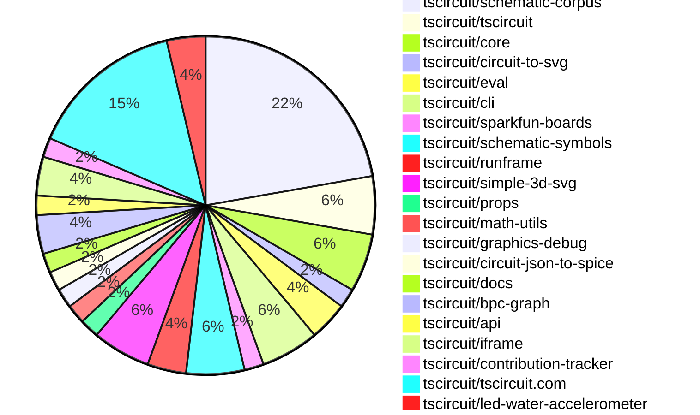
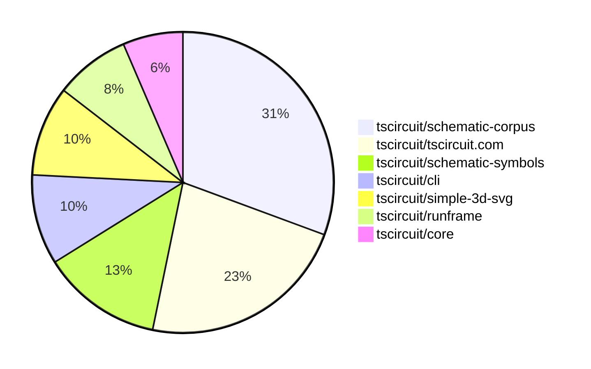

# contribution-tracker

[contributions.tscircuit.com](https://contributions.tscircuit.com) ・ [tscircuit.com](https://tscircuit.com) ・ [Contribution Overviews](./contribution-overviews/) ・ [Changelogs](./changelogs/)

Generates weekly contribution overviews for tscircuit contributors. Check out all
the [contribution overviews here](./contribution-overviews/)
You can find AI-generated monthly changelogs in the [changelogs directory](./changelogs/).

- All PRs in the tscircuit org are scanned/summarized via an LLM
- The LLM classifies each Diff/PR as into a set of attributes for scoring
- All the PRs, summaries, and classifications are organized into charts and tables for [the website](https://contributions.tscircuit.com)

> Want to run locally? See the [Development Section](#development)

The current week is shown below. There are 3 major sections:

- [Contributor Overview](#contributor-overview)
- [PRs by Repository](#prs-by-repository)
- [PRs by Contributor](#changes-by-contributor)

## Current Week

<!-- START_CURRENT_WEEK -->

# Contribution Overview 2025-07-16

## PRs by Repository



## Contributor Overview

| Contributor | 🐳 Major | 🐙 Minor | 🐌 Tiny | ⭐ | Issues Created | Discussion Contributions |
|-------------|---------|---------|---------|-----|----------------|--------------------------|
| [seveibar](#seveibar) | 2 | 0 | 12 | ⭐⭐⭐ | 0 | 0🔹 0🔶 0💎 |
| [Abse2001](#Abse2001) | 2 | 1 | 4 | ⭐⭐ | 0 | 0🔹 0🔶 0💎 |
| [MustafaMulla29](#MustafaMulla29) | 2 | 0 | 13 | ⭐⭐ | 0 | 0🔹 0🔶 0💎 |
| [ArnavK-09](#ArnavK-09) | 1 | 3 | 4 | ⭐⭐ | 0 | 0🔹 0🔶 0💎 |
| [techmannih](#techmannih) | 0 | 3 | 3 | ⭐ | 0 | 0🔹 0🔶 0💎 |
| [ShiboSoftwareDev](#ShiboSoftwareDev) | 0 | 0 | 1 | ⭐ | 0 | 0🔹 0🔶 0💎 |
| [imrishabh18](#imrishabh18) | 0 | 1 | 2 | ⭐ | 0 | 0🔹 0🔶 0💎 |

### Discussion Contribution Legend

- 🔹 Normal Comments: Basic participation with minimal effort
- 🔶 Great Informative Comments: Thoughtful participation that adds value
- 💎 Incredible Comments: Exceptional participation with high-quality content

## Review Table

[reviews-received-hover]: ## "Number of reviews received for PRs for this contributor"
[approvals-received-hover]: ## "Number of approvals received for PRs this contributor authored"
[rejections-received-hover]: ## "Number of rejections received for PRs this contributor authored"
[prs-opened-hover]: ## "Number of PRs opened by this contributor"
[issues-created-hover]: ## "Number of issues created by this contributor"
[bountied-issues-hover]: ## "Number of issues this contributor created with a bounty"
[bountied-issue-$-hover]: ## "Total bounty amount placed on issues authored by this contributor"

| Contributor | Reviews Received | Approvals Received | Rejections Received | Approvals | Rejections | PRs Opened | PRs Merged | Issues Created | Bountied Issues | Bountied Issue $ |
|---|---|---|---|---|---|---|---|---|---|---|
| [MustafaMulla29](#MustafaMulla29) | 15 | 14 | 0 | 0 | 0 | 18 | 15 | 0 | 0 | 0 |
| [seveibar](#seveibar) | 7 | 0 | 0 | 23 | 0 | 18 | 14 | 0 | 0 | 0 |
| [ShiboSoftwareDev](#ShiboSoftwareDev) | 2 | 2 | 0 | 5 | 0 | 3 | 1 | 0 | 0 | 0 |
| [Abse2001](#Abse2001) | 10 | 7 | 0 | 10 | 0 | 10 | 7 | 0 | 0 | 0 |
| [andrii-balitskyi](#andrii-balitskyi) | 0 | 0 | 0 | 0 | 0 | 3 | 0 | 0 | 0 | 0 |
| [techmannih](#techmannih) | 9 | 6 | 0 | 0 | 0 | 6 | 6 | 0 | 0 | 0 |
| [graphite-app[bot]](#graphite-app[bot]) | 0 | 0 | 0 | 0 | 0 | 0 | 0 | 0 | 0 | 0 |
| [imrishabh18](#imrishabh18) | 1 | 1 | 0 | 1 | 0 | 3 | 3 | 0 | 0 | 0 |
| [ArnavK-09](#ArnavK-09) | 12 | 9 | 0 | 0 | 0 | 15 | 8 | 0 | 0 | 0 |
| [cursor[bot]](#cursor[bot]) | 0 | 0 | 0 | 0 | 0 | 0 | 0 | 0 | 0 | 0 |
| [abimaelmartell](#abimaelmartell) | 0 | 0 | 0 | 0 | 0 | 1 | 0 | 0 | 0 | 0 |
| [tscircuitbot](#tscircuitbot) | 0 | 0 | 0 | 0 | 0 | 4 | 0 | 0 | 0 | 0 |

## Top 7 Repositories by Contribution Points



## Changes by Repository

### [tscircuit/schematic-corpus](https://github.com/tscircuit/schematic-corpus)

| PR # | Impact | Rating | Contributor | Description |
|------|--------|--------|-------------|-------------|
| [#98](https://github.com/tscircuit/schematic-corpus/pull/98) | 🐳 Major | ⭐⭐⭐ | MustafaMulla29 | Adds a new circuit design (design63) that enhances the autorouting algorithm by providing a new schematic representation and component layout. |
| [#96](https://github.com/tscircuit/schematic-corpus/pull/96) | 🐳 Major | ⭐⭐⭐ | MustafaMulla29 | Adds a new design (design61) to the schematic corpus, which is intended to enhance the autorouting algorithm. |
| [#95](https://github.com/tscircuit/schematic-corpus/pull/95) | 🐙 Minor | ⭐⭐ | Abse2001 | Introduces a GitHub star button and a mobile-friendly burger menu for navigation, enhancing user interaction and accessibility on both site and mobile views. |

<details>
<summary>🐌 Tiny Contributions (9)</summary>

| PR # | Impact | Contributor | Description |
|------|--------|-------------|-------------|
| [#105](https://github.com/tscircuit/schematic-corpus/pull/105) | 🐌 Tiny | MustafaMulla29 | Adds a new design (design67) to the schematic corpus, which is intended to enhance the autorouting algorithms performance. |
| [#100](https://github.com/tscircuit/schematic-corpus/pull/100) | 🐌 Tiny | MustafaMulla29 | Adds a new circuit design (design065) to the schematic corpus, which is intended to enhance the autorouting algorithms performance. |
| [#99](https://github.com/tscircuit/schematic-corpus/pull/99) | 🐌 Tiny | MustafaMulla29 | Adds a new design (design064) to the schematic corpus, which is intended to enhance the autorouting algorithm. |
| [#97](https://github.com/tscircuit/schematic-corpus/pull/97) | 🐌 Tiny | MustafaMulla29 | Adds a new circuit design (design62) to the schematic corpus, which is intended to enhance the autorouting algorithms performance. |
| [#89](https://github.com/tscircuit/schematic-corpus/pull/89) | 🐌 Tiny | MustafaMulla29 | Adds a new circuit design (design60) to enhance the autorouting algorithms performance and capabilities. |
| [#94](https://github.com/tscircuit/schematic-corpus/pull/94) | 🐌 Tiny | Abse2001 | Updates the tscircuit dependency version from 0.0.532 to 0.0.546 in package.json. |
| [#104](https://github.com/tscircuit/schematic-corpus/pull/104) | 🐌 Tiny | techmannih | Renames design61 and design62 files to design061 and design062 respectively for consistency in naming conventions. |
| [#101](https://github.com/tscircuit/schematic-corpus/pull/101) | 🐌 Tiny | techmannih | Adds a new design (design059) to the schematic corpus, which includes a new circuit layout for improved autolayout functionality. |
| [#102](https://github.com/tscircuit/schematic-corpus/pull/102) | 🐌 Tiny | techmannih | Adds a new design (design066) to the schematic corpus, which includes a new circuit layout for improved autolayout functionality. |

</details>

### [tscircuit/tscircuit](https://github.com/tscircuit/tscircuit)


<details>
<summary>🐌 Tiny Contributions (3)</summary>

| PR # | Impact | Contributor | Description |
|------|--------|-------------|-------------|
| [#710](https://github.com/tscircuit/tscircuit/pull/710) | 🐌 Tiny | MustafaMulla29 | Updates the circuit-to-svg dependency from version 0.0.166 to 0.0.170 in package.json |
| [#708](https://github.com/tscircuit/tscircuit/pull/708) | 🐌 Tiny | MustafaMulla29 | Updates the version of the tscircuiteval package from 0.0.260 to 0.0.261 in package.json. |
| [#709](https://github.com/tscircuit/tscircuit/pull/709) | 🐌 Tiny | Abse2001 | Updates the CLI dependency version from 0.1.175 to 0.1.176 in package.json |

</details>

### [tscircuit/core](https://github.com/tscircuit/core)

| PR # | Impact | Rating | Contributor | Description |
|------|--------|--------|-------------|-------------|
| [#1077](https://github.com/tscircuit/core/pull/1077) | 🐙 Minor | ⭐⭐ | techmannih | Fixes pin aliases for transistors to use standard labels (collector, emitter, base) in connections, ensuring correct schematic representation. |

<details>
<summary>🐌 Tiny Contributions (2)</summary>

| PR # | Impact | Contributor | Description |
|------|--------|-------------|-------------|
| [#1076](https://github.com/tscircuit/core/pull/1076) | 🐌 Tiny | MustafaMulla29 | Updates the footprinter dependency to version 0.0.203 to support the _textbottom flag for 0603 components. |
| [#1079](https://github.com/tscircuit/core/pull/1079) | 🐌 Tiny | Abse2001 | Reproduces a bug related to externally connected pins in circuit design, providing a test case for further investigation and resolution. |

</details>

### [tscircuit/circuit-to-svg](https://github.com/tscircuit/circuit-to-svg)


<details>
<summary>🐌 Tiny Contributions (1)</summary>

| PR # | Impact | Contributor | Description |
|------|--------|-------------|-------------|
| [#287](https://github.com/tscircuit/circuit-to-svg/pull/287) | 🐌 Tiny | MustafaMulla29 | Updates the footprinter dependency to version 0.0.203, enabling support for the _textbottom flag. |

</details>

### [tscircuit/eval](https://github.com/tscircuit/eval)


<details>
<summary>🐌 Tiny Contributions (2)</summary>

| PR # | Impact | Contributor | Description |
|------|--------|-------------|-------------|
| [#709](https://github.com/tscircuit/eval/pull/709) | 🐌 Tiny | MustafaMulla29 | Updates the version of the tscircuitfootprinter dependency from 0.0.193 to 0.0.203 in package.json. |
| [#707](https://github.com/tscircuit/eval/pull/707) | 🐌 Tiny | MustafaMulla29 | Updates the tscircuitcore dependency version from 0.0.564 to 0.0.571 in package.json. |

</details>

### [tscircuit/cli](https://github.com/tscircuit/cli)

| PR # | Impact | Rating | Contributor | Description |
|------|--------|--------|-------------|-------------|
| [#281](https://github.com/tscircuit/cli/pull/281) | 🐳 Major | ⭐⭐⭐ | Abse2001 | Introduce image-based visual diffing for more reliable snapshot verification |

<details>
<summary>🐌 Tiny Contributions (2)</summary>

| PR # | Impact | Contributor | Description |
|------|--------|-------------|-------------|
| [#284](https://github.com/tscircuit/cli/pull/284) | 🐌 Tiny | MustafaMulla29 | Updates the tscircuit dependency version from 0.0.540 to 0.0.546 in package.json to incorporate the latest changes and improvements from the tscircuit library. |
| [#282](https://github.com/tscircuit/cli/pull/282) | 🐌 Tiny | Abse2001 | Fixes the static import of the looks-same library to ensure proper functionality in image comparison. |

</details>

### [tscircuit/sparkfun-boards](https://github.com/tscircuit/sparkfun-boards)


<details>
<summary>🐌 Tiny Contributions (1)</summary>

| PR # | Impact | Contributor | Description |
|------|--------|-------------|-------------|
| [#74](https://github.com/tscircuit/sparkfun-boards/pull/74) | 🐌 Tiny | MustafaMulla29 | Updates the tscircuit dependency version from 0.0.541 to 0.0.543 in package.json. |

</details>

### [tscircuit/schematic-symbols](https://github.com/tscircuit/schematic-symbols)

| PR # | Impact | Rating | Contributor | Description |
|------|--------|--------|-------------|-------------|
| [#334](https://github.com/tscircuit/schematic-symbols/pull/334) | 🐳 Major | ⭐⭐⭐ | Abse2001 | Refactors the symbol generation script and updates text anchor positioning logic for schematic symbols. |
| [#336](https://github.com/tscircuit/schematic-symbols/pull/336) | 🐙 Minor | ⭐⭐ | techmannih | Adds alternative pin labels (Base, Emitter, Collector) to NPN and PNP bipolar transistor symbols for better clarity and usability. |
| [#335](https://github.com/tscircuit/schematic-symbols/pull/335) | 🐙 Minor | ⭐⭐ | techmannih | Fixes pin numbering for PNP and NPN bipolar transistors to follow a clockwise convention, ensuring consistency in schematic representations. |

### [tscircuit/runframe](https://github.com/tscircuit/runframe)

| PR # | Impact | Rating | Contributor | Description |
|------|--------|--------|-------------|-------------|
| [#885](https://github.com/tscircuit/runframe/pull/885) | 🐳 Major | ⭐⭐⭐ | seveibar | This PR adds availableTabs and defaultTab props to the RunFrame component, allowing users to specify which tabs are available and which tab should be selected by default in the CircuitJsonPreview. |

<details>
<summary>🐌 Tiny Contributions (1)</summary>

| PR # | Impact | Contributor | Description |
|------|--------|-------------|-------------|
| [#887](https://github.com/tscircuit/runframe/pull/887) | 🐌 Tiny | ArnavK-09 | Adjusted the width of the dialog content for better responsiveness. Improved text sizes and spacing for dialog titles, descriptions, and buttons. Enhanced the layout of search results and component details for better usability. Updated styles for various elements to ensure consistency across different screen sizes. Fixed minor layout issues in the component details dialog for improved visual clarity. fix black background issue |

</details>

### [tscircuit/simple-3d-svg](https://github.com/tscircuit/simple-3d-svg)

| PR # | Impact | Rating | Contributor | Description |
|------|--------|--------|-------------|-------------|
| [#45](https://github.com/tscircuit/simple-3d-svg/pull/45) | 🐳 Major | ⭐⭐⭐ | seveibar | Adds optional parameters showAxes, showOrigin, and showGrid to the renderScene function, enabling the rendering of a small XYZ axis guide and origin lines in the SVG output. |

<details>
<summary>🐌 Tiny Contributions (2)</summary>

| PR # | Impact | Contributor | Description |
|------|--------|-------------|-------------|
| [#47](https://github.com/tscircuit/simple-3d-svg/pull/47) | 🐌 Tiny | seveibar | Transforms STL model coordinates from Z-up to Y-up by applying a rotation, ensuring compatibility with Y-up systems. |
| [#46](https://github.com/tscircuit/simple-3d-svg/pull/46) | 🐌 Tiny | seveibar | Adds gradient fading to axis lines in the SVG rendering of the origin, enhancing visual clarity. |

</details>

### [tscircuit/props](https://github.com/tscircuit/props)


<details>
<summary>🐌 Tiny Contributions (1)</summary>

| PR # | Impact | Contributor | Description |
|------|--------|-------------|-------------|
| [#330](https://github.com/tscircuit/props/pull/330) | 🐌 Tiny | seveibar | Summary drop dcSimulationVoltage from PinAttributeMap regenerate docs and format markdown files  Testing bun test testschip3-type-tests.test.tsx bun run format |

</details>

### [tscircuit/math-utils](https://github.com/tscircuit/math-utils)


<details>
<summary>🐌 Tiny Contributions (1)</summary>

| PR # | Impact | Contributor | Description |
|------|--------|-------------|-------------|
| [#14](https://github.com/tscircuit/math-utils/pull/14) | 🐌 Tiny | seveibar | Adds an API table summarizing all exported methods in the README. |

</details>

### [tscircuit/graphics-debug](https://github.com/tscircuit/graphics-debug)


<details>
<summary>🐌 Tiny Contributions (1)</summary>

| PR # | Impact | Contributor | Description |
|------|--------|-------------|-------------|
| [#70](https://github.com/tscircuit/graphics-debug/pull/70) | 🐌 Tiny | seveibar | Adds documentation for the usage of the InteractiveGraphics component from the graphics-debugreact package. |

</details>

### [tscircuit/circuit-json-to-spice](https://github.com/tscircuit/circuit-json-to-spice)


<details>
<summary>🐌 Tiny Contributions (1)</summary>

| PR # | Impact | Contributor | Description |
|------|--------|-------------|-------------|
| [#5](https://github.com/tscircuit/circuit-json-to-spice/pull/5) | 🐌 Tiny | seveibar | Adds integration tests for the EEcircuit-engine, including a new bunfig.toml configuration and updates to dependencies. |

</details>

### [tscircuit/docs](https://github.com/tscircuit/docs)


<details>
<summary>🐌 Tiny Contributions (1)</summary>

| PR # | Impact | Contributor | Description |
|------|--------|-------------|-------------|
| [#101](https://github.com/tscircuit/docs/pull/101) | 🐌 Tiny | seveibar | Adds documentation for the compile.tscircuit.com API, detailing usage, endpoints, and examples for compiling tscircuit user code into Circuit JSON. |

</details>

### [tscircuit/bpc-graph](https://github.com/tscircuit/bpc-graph)


<details>
<summary>🐌 Tiny Contributions (2)</summary>

| PR # | Impact | Contributor | Description |
|------|--------|-------------|-------------|
| [#68](https://github.com/tscircuit/bpc-graph/pull/68) | 🐌 Tiny | seveibar | Adds documentation for layoutSchematic and layoutSchematicWithInputVariants functions in the README.md file. |
| [#66](https://github.com/tscircuit/bpc-graph/pull/66) | 🐌 Tiny | seveibar | Removes tscircuitschematic-corpus as a peer dependency from the package.json file. |

</details>

### [tscircuit/api](https://github.com/tscircuit/api)


<details>
<summary>🐌 Tiny Contributions (1)</summary>

| PR # | Impact | Contributor | Description |
|------|--------|-------------|-------------|
| [#5](https://github.com/tscircuit/api/pull/5) | 🐌 Tiny | seveibar | Adds a new API client method to compile user code into Circuit JSON format via client.compile.compileCode, along with documentation and tests for this functionality. |

</details>

### [tscircuit/iframe](https://github.com/tscircuit/iframe)


<details>
<summary>🐌 Tiny Contributions (2)</summary>

| PR # | Impact | Contributor | Description |
|------|--------|-------------|-------------|
| [#3](https://github.com/tscircuit/iframe/pull/3) | 🐌 Tiny | seveibar | Documents the props of the TscircuitIframe component in the README file. |
| [#2](https://github.com/tscircuit/iframe/pull/2) | 🐌 Tiny | seveibar | Adds error handling events and additional properties to the TscircuitIframe component, enhancing its functionality for user interaction and error management. |

</details>

### [tscircuit/contribution-tracker](https://github.com/tscircuit/contribution-tracker)


<details>
<summary>🐌 Tiny Contributions (1)</summary>

| PR # | Impact | Contributor | Description |
|------|--------|-------------|-------------|
| [#202](https://github.com/tscircuit/contribution-tracker/pull/202) | 🐌 Tiny | ShiboSoftwareDev | Adds functionality to fetch and parse the CODEOWNERS file from the root or .github directory, improving code ownership management. |

</details>

### [tscircuit/tscircuit.com](https://github.com/tscircuit/tscircuit.com)

| PR # | Impact | Rating | Contributor | Description |
|------|--------|--------|-------------|-------------|
| [#1487](https://github.com/tscircuit/tscircuit.com/pull/1487) | 🐳 Major | ⭐⭐⭐ | ArnavK-09 | Fixes file selection logic to correctly handle hidden files in the CodeEditorHeader and useFileManagement hook. |
| [#1489](https://github.com/tscircuit/tscircuit.com/pull/1489) | 🐙 Minor | ⭐⭐ | ArnavK-09 | Adds new UI components and improves the layout of the DatasheetPage for better user experience. |
| [#1481](https://github.com/tscircuit/tscircuit.com/pull/1481) | 🐙 Minor | ⭐⭐ | ArnavK-09 | Prevents the entire page from loading when rendering the 3D preview by implementing a Suspense fallback for the CadViewer component. |
| [#1475](https://github.com/tscircuit/tscircuit.com/pull/1475) | 🐙 Minor | ⭐⭐ | ArnavK-09 | Replaces plain text loading indicator with animated placeholders in ShikiCodeViewer for improved user experience during loading states. |

<details>
<summary>🐌 Tiny Contributions (4)</summary>

| PR # | Impact | Contributor | Description |
|------|--------|-------------|-------------|
| [#1484](https://github.com/tscircuit/tscircuit.com/pull/1484) | 🐌 Tiny | ArnavK-09 | Removes a line that causes an error during the JLCPCB import process in the CodeEditorHeader component. |
| [#1479](https://github.com/tscircuit/tscircuit.com/pull/1479) | 🐌 Tiny | ArnavK-09 | Fixes the jlcpcb import functionality by correcting the fetch request headers and method handling in the CodeEditorHeader component. |
| [#1476](https://github.com/tscircuit/tscircuit.com/pull/1476) | 🐌 Tiny | ArnavK-09 | Adds session token validation for importing components from jlcpcb, ensuring users are logged in before proceeding with the import. |
| [#1491](https://github.com/tscircuit/tscircuit.com/pull/1491) | 🐌 Tiny | imrishabh18 | Hides the file delete option in the FileSidebar component for users who do not own the package, ensuring that only the owner can delete files. |

</details>

### [tscircuit/led-water-accelerometer](https://github.com/tscircuit/led-water-accelerometer)

| PR # | Impact | Rating | Contributor | Description |
|------|--------|--------|-------------|-------------|
| [#7](https://github.com/tscircuit/led-water-accelerometer/pull/7) | 🐙 Minor | ⭐⭐ | imrishabh18 | Adds firmware for controlling a NeoPixel LED matrix to display animated text and patterns, including scrolling text and letter animations. |

<details>
<summary>🐌 Tiny Contributions (1)</summary>

| PR # | Impact | Contributor | Description |
|------|--------|-------------|-------------|
| [#6](https://github.com/tscircuit/led-water-accelerometer/pull/6) | 🐌 Tiny | imrishabh18 | Adds functionality to support vertical flipping in the water simulation, allowing for more accurate representation of gravity effects on the LED display. |

</details>

## Changes by Contributor

### [MustafaMulla29](https://github.com/MustafaMulla29)

| PRs # | Impact | Rating | Description |
|------|--------|--------|-------------|
| [#98](https://github.com/tscircuit/schematic-corpus/pull/98) | 🐳 Major | ⭐⭐⭐ | Adds a new circuit design (design63) that enhances the autorouting algorithm by providing a new schematic representation and component layout. |
| [#96](https://github.com/tscircuit/schematic-corpus/pull/96) | 🐳 Major | ⭐⭐⭐ | Adds a new design (design61) to the schematic corpus, which is intended to enhance the autorouting algorithm. |

<details>
<summary>🐌 Tiny Contributions (13)</summary>

| PR # | Impact | Description |
|------|--------|-------------|
| [#710](https://github.com/tscircuit/tscircuit/pull/710) | 🐌 Tiny | Updates the circuit-to-svg dependency from version 0.0.166 to 0.0.170 in package.json |
| [#708](https://github.com/tscircuit/tscircuit/pull/708) | 🐌 Tiny | Updates the version of the tscircuiteval package from 0.0.260 to 0.0.261 in package.json. |
| [#1076](https://github.com/tscircuit/core/pull/1076) | 🐌 Tiny | Updates the footprinter dependency to version 0.0.203 to support the _textbottom flag for 0603 components. |
| [#287](https://github.com/tscircuit/circuit-to-svg/pull/287) | 🐌 Tiny | Updates the footprinter dependency to version 0.0.203, enabling support for the _textbottom flag. |
| [#709](https://github.com/tscircuit/eval/pull/709) | 🐌 Tiny | Updates the version of the tscircuitfootprinter dependency from 0.0.193 to 0.0.203 in package.json. |
| [#707](https://github.com/tscircuit/eval/pull/707) | 🐌 Tiny | Updates the tscircuitcore dependency version from 0.0.564 to 0.0.571 in package.json. |
| [#284](https://github.com/tscircuit/cli/pull/284) | 🐌 Tiny | Updates the tscircuit dependency version from 0.0.540 to 0.0.546 in package.json to incorporate the latest changes and improvements from the tscircuit library. |
| [#74](https://github.com/tscircuit/sparkfun-boards/pull/74) | 🐌 Tiny | Updates the tscircuit dependency version from 0.0.541 to 0.0.543 in package.json. |
| [#105](https://github.com/tscircuit/schematic-corpus/pull/105) | 🐌 Tiny | Adds a new design (design67) to the schematic corpus, which is intended to enhance the autorouting algorithms performance. |
| [#100](https://github.com/tscircuit/schematic-corpus/pull/100) | 🐌 Tiny | Adds a new circuit design (design065) to the schematic corpus, which is intended to enhance the autorouting algorithms performance. |
| [#99](https://github.com/tscircuit/schematic-corpus/pull/99) | 🐌 Tiny | Adds a new design (design064) to the schematic corpus, which is intended to enhance the autorouting algorithm. |
| [#97](https://github.com/tscircuit/schematic-corpus/pull/97) | 🐌 Tiny | Adds a new circuit design (design62) to the schematic corpus, which is intended to enhance the autorouting algorithms performance. |
| [#89](https://github.com/tscircuit/schematic-corpus/pull/89) | 🐌 Tiny | Adds a new circuit design (design60) to enhance the autorouting algorithms performance and capabilities. |

</details>

### [Abse2001](https://github.com/Abse2001)

| PRs # | Impact | Rating | Description |
|------|--------|--------|-------------|
| [#334](https://github.com/tscircuit/schematic-symbols/pull/334) | 🐳 Major | ⭐⭐⭐ | Refactors the symbol generation script and updates text anchor positioning logic for schematic symbols. |
| [#281](https://github.com/tscircuit/cli/pull/281) | 🐳 Major | ⭐⭐⭐ | Introduce image-based visual diffing for more reliable snapshot verification |
| [#95](https://github.com/tscircuit/schematic-corpus/pull/95) | 🐙 Minor | ⭐⭐ | Introduces a GitHub star button and a mobile-friendly burger menu for navigation, enhancing user interaction and accessibility on both site and mobile views. |

<details>
<summary>🐌 Tiny Contributions (4)</summary>

| PR # | Impact | Description |
|------|--------|-------------|
| [#709](https://github.com/tscircuit/tscircuit/pull/709) | 🐌 Tiny | Updates the CLI dependency version from 0.1.175 to 0.1.176 in package.json |
| [#1079](https://github.com/tscircuit/core/pull/1079) | 🐌 Tiny | Reproduces a bug related to externally connected pins in circuit design, providing a test case for further investigation and resolution. |
| [#282](https://github.com/tscircuit/cli/pull/282) | 🐌 Tiny | Fixes the static import of the looks-same library to ensure proper functionality in image comparison. |
| [#94](https://github.com/tscircuit/schematic-corpus/pull/94) | 🐌 Tiny | Updates the tscircuit dependency version from 0.0.532 to 0.0.546 in package.json. |

</details>

### [seveibar](https://github.com/seveibar)

| PRs # | Impact | Rating | Description |
|------|--------|--------|-------------|
| [#885](https://github.com/tscircuit/runframe/pull/885) | 🐳 Major | ⭐⭐⭐ | This PR adds availableTabs and defaultTab props to the RunFrame component, allowing users to specify which tabs are available and which tab should be selected by default in the CircuitJsonPreview. |
| [#45](https://github.com/tscircuit/simple-3d-svg/pull/45) | 🐳 Major | ⭐⭐⭐ | Adds optional parameters showAxes, showOrigin, and showGrid to the renderScene function, enabling the rendering of a small XYZ axis guide and origin lines in the SVG output. |

<details>
<summary>🐌 Tiny Contributions (12)</summary>

| PR # | Impact | Description |
|------|--------|-------------|
| [#330](https://github.com/tscircuit/props/pull/330) | 🐌 Tiny | Summary drop dcSimulationVoltage from PinAttributeMap regenerate docs and format markdown files  Testing bun test testschip3-type-tests.test.tsx bun run format |
| [#14](https://github.com/tscircuit/math-utils/pull/14) | 🐌 Tiny | Adds an API table summarizing all exported methods in the README. |
| [#70](https://github.com/tscircuit/graphics-debug/pull/70) | 🐌 Tiny | Adds documentation for the usage of the InteractiveGraphics component from the graphics-debugreact package. |
| [#5](https://github.com/tscircuit/circuit-json-to-spice/pull/5) | 🐌 Tiny | Adds integration tests for the EEcircuit-engine, including a new bunfig.toml configuration and updates to dependencies. |
| [#101](https://github.com/tscircuit/docs/pull/101) | 🐌 Tiny | Adds documentation for the compile.tscircuit.com API, detailing usage, endpoints, and examples for compiling tscircuit user code into Circuit JSON. |
| [#47](https://github.com/tscircuit/simple-3d-svg/pull/47) | 🐌 Tiny | Transforms STL model coordinates from Z-up to Y-up by applying a rotation, ensuring compatibility with Y-up systems. |
| [#46](https://github.com/tscircuit/simple-3d-svg/pull/46) | 🐌 Tiny | Adds gradient fading to axis lines in the SVG rendering of the origin, enhancing visual clarity. |
| [#68](https://github.com/tscircuit/bpc-graph/pull/68) | 🐌 Tiny | Adds documentation for layoutSchematic and layoutSchematicWithInputVariants functions in the README.md file. |
| [#66](https://github.com/tscircuit/bpc-graph/pull/66) | 🐌 Tiny | Removes tscircuitschematic-corpus as a peer dependency from the package.json file. |
| [#5](https://github.com/tscircuit/api/pull/5) | 🐌 Tiny | Adds a new API client method to compile user code into Circuit JSON format via client.compile.compileCode, along with documentation and tests for this functionality. |
| [#3](https://github.com/tscircuit/iframe/pull/3) | 🐌 Tiny | Documents the props of the TscircuitIframe component in the README file. |
| [#2](https://github.com/tscircuit/iframe/pull/2) | 🐌 Tiny | Adds error handling events and additional properties to the TscircuitIframe component, enhancing its functionality for user interaction and error management. |

</details>

### [techmannih](https://github.com/techmannih)

| PRs # | Impact | Rating | Description |
|------|--------|--------|-------------|
| [#1077](https://github.com/tscircuit/core/pull/1077) | 🐙 Minor | ⭐⭐ | Fixes pin aliases for transistors to use standard labels (collector, emitter, base) in connections, ensuring correct schematic representation. |
| [#336](https://github.com/tscircuit/schematic-symbols/pull/336) | 🐙 Minor | ⭐⭐ | Adds alternative pin labels (Base, Emitter, Collector) to NPN and PNP bipolar transistor symbols for better clarity and usability. |
| [#335](https://github.com/tscircuit/schematic-symbols/pull/335) | 🐙 Minor | ⭐⭐ | Fixes pin numbering for PNP and NPN bipolar transistors to follow a clockwise convention, ensuring consistency in schematic representations. |

<details>
<summary>🐌 Tiny Contributions (3)</summary>

| PR # | Impact | Description |
|------|--------|-------------|
| [#104](https://github.com/tscircuit/schematic-corpus/pull/104) | 🐌 Tiny | Renames design61 and design62 files to design061 and design062 respectively for consistency in naming conventions. |
| [#101](https://github.com/tscircuit/schematic-corpus/pull/101) | 🐌 Tiny | Adds a new design (design059) to the schematic corpus, which includes a new circuit layout for improved autolayout functionality. |
| [#102](https://github.com/tscircuit/schematic-corpus/pull/102) | 🐌 Tiny | Adds a new design (design066) to the schematic corpus, which includes a new circuit layout for improved autolayout functionality. |

</details>

### [ShiboSoftwareDev](https://github.com/ShiboSoftwareDev)


<details>
<summary>🐌 Tiny Contributions (1)</summary>

| PR # | Impact | Description |
|------|--------|-------------|
| [#202](https://github.com/tscircuit/contribution-tracker/pull/202) | 🐌 Tiny | Adds functionality to fetch and parse the CODEOWNERS file from the root or .github directory, improving code ownership management. |

</details>

### [ArnavK-09](https://github.com/ArnavK-09)

| PRs # | Impact | Rating | Description |
|------|--------|--------|-------------|
| [#1487](https://github.com/tscircuit/tscircuit.com/pull/1487) | 🐳 Major | ⭐⭐⭐ | Fixes file selection logic to correctly handle hidden files in the CodeEditorHeader and useFileManagement hook. |
| [#1489](https://github.com/tscircuit/tscircuit.com/pull/1489) | 🐙 Minor | ⭐⭐ | Adds new UI components and improves the layout of the DatasheetPage for better user experience. |
| [#1481](https://github.com/tscircuit/tscircuit.com/pull/1481) | 🐙 Minor | ⭐⭐ | Prevents the entire page from loading when rendering the 3D preview by implementing a Suspense fallback for the CadViewer component. |
| [#1475](https://github.com/tscircuit/tscircuit.com/pull/1475) | 🐙 Minor | ⭐⭐ | Replaces plain text loading indicator with animated placeholders in ShikiCodeViewer for improved user experience during loading states. |

<details>
<summary>🐌 Tiny Contributions (4)</summary>

| PR # | Impact | Description |
|------|--------|-------------|
| [#1484](https://github.com/tscircuit/tscircuit.com/pull/1484) | 🐌 Tiny | Removes a line that causes an error during the JLCPCB import process in the CodeEditorHeader component. |
| [#1479](https://github.com/tscircuit/tscircuit.com/pull/1479) | 🐌 Tiny | Fixes the jlcpcb import functionality by correcting the fetch request headers and method handling in the CodeEditorHeader component. |
| [#1476](https://github.com/tscircuit/tscircuit.com/pull/1476) | 🐌 Tiny | Adds session token validation for importing components from jlcpcb, ensuring users are logged in before proceeding with the import. |
| [#887](https://github.com/tscircuit/runframe/pull/887) | 🐌 Tiny | Adjusted the width of the dialog content for better responsiveness. Improved text sizes and spacing for dialog titles, descriptions, and buttons. Enhanced the layout of search results and component details for better usability. Updated styles for various elements to ensure consistency across different screen sizes. Fixed minor layout issues in the component details dialog for improved visual clarity. fix black background issue |

</details>

### [imrishabh18](https://github.com/imrishabh18)

| PRs # | Impact | Rating | Description |
|------|--------|--------|-------------|
| [#7](https://github.com/tscircuit/led-water-accelerometer/pull/7) | 🐙 Minor | ⭐⭐ | Adds firmware for controlling a NeoPixel LED matrix to display animated text and patterns, including scrolling text and letter animations. |

<details>
<summary>🐌 Tiny Contributions (2)</summary>

| PR # | Impact | Description |
|------|--------|-------------|
| [#1491](https://github.com/tscircuit/tscircuit.com/pull/1491) | 🐌 Tiny | Hides the file delete option in the FileSidebar component for users who do not own the package, ensuring that only the owner can delete files. |
| [#6](https://github.com/tscircuit/led-water-accelerometer/pull/6) | 🐌 Tiny | Adds functionality to support vertical flipping in the water simulation, allowing for more accurate representation of gravity effects on the LED display. |

</details>

## Repository Owners

| Repository | Codeowners |
|------------|------------|
| [sparkfun-boards](https://github.com/tscircuit/sparkfun-boards/blob/main/.github/CODEOWNERS) | [MustafaMulla29](https://github.com/MustafaMulla29) |
| [tscircuit.com](https://github.com/tscircuit/tscircuit.com/blob/main/.github/CODEOWNERS) | [seveibar](https://github.com/seveibar), [imrishabh18](https://github.com/imrishabh18) |
| [schematic-corpus](https://github.com/tscircuit/schematic-corpus/blob/main/.github/CODEOWNERS) | [Abse2001](https://github.com/Abse2001) |
| [schematic-symbols](https://github.com/tscircuit/schematic-symbols/blob/main/.github/CODEOWNERS) | [techmannih](https://github.com/techmannih) |
| [cli](https://github.com/tscircuit/cli/blob/main/.github/CODEOWNERS) | [ArnavK-09](https://github.com/ArnavK-09) |

## Repos by Owner

| User | Repo |
|------|------|
| [MustafaMulla29](https://github.com/MustafaMulla29) | [sparkfun-boards](https://github.com/tscircuit/sparkfun-boards/blob/main/.github/CODEOWNERS) |
| [seveibar](https://github.com/seveibar) | [tscircuit.com](https://github.com/tscircuit/tscircuit.com/blob/main/.github/CODEOWNERS) |
| [Abse2001](https://github.com/Abse2001) | [schematic-corpus](https://github.com/tscircuit/schematic-corpus/blob/main/.github/CODEOWNERS) |
| [techmannih](https://github.com/techmannih) | [schematic-symbols](https://github.com/tscircuit/schematic-symbols/blob/main/.github/CODEOWNERS) |
| [imrishabh18](https://github.com/imrishabh18) | [tscircuit.com](https://github.com/tscircuit/tscircuit.com/blob/main/.github/CODEOWNERS) |
| [ArnavK-09](https://github.com/ArnavK-09) | [cli](https://github.com/tscircuit/cli/blob/main/.github/CODEOWNERS) |


<!-- END_CURRENT_WEEK -->


## Development

### Prerequisites

- [Bun](https://bun.sh/) runtime
- `.env` file with required API keys:
  ```
  GITHUB_TOKEN=your_github_token
  OPENAI_API_KEY=your_openai_api_key
  DISCORD_TOKEN=your_discord_token (optional, for Discord integration)
  SLACK_BOT_TOKEN=your_slack_token (optional, for Slack integration)
  ```

### Available Scripts

#### Core Generation Scripts

- `bun run generate:weekly` - Generate current week's contribution overview
- `bun run generate:monthly` - Generate current month's contribution overview
- `bun run generate:changelog` - Generate monthly changelog from PRs

#### Analysis & Testing

- `bun run analyze-pr` - Analyze a single PR (interactive prompt)
- `bun run test:github` - Test GitHub API integration

#### Notifications & Sync

- `bun run notifications:issues` - Send notifications for new issues
- `bun run notifications:pr` - Send notifications for new PRs
- `bun run sync:discord` - Sync contributor roles with Discord

#### Data Export

- `bun run export:sponsorship` - Generate sponsorship data CSV

#### Development

- `bun run dev` - Start development server for web UI
- `bun run build` - Build for production
- `bun run format` - Format code with Biome

### Usage Examples

```bash
# Generate this week's contribution overview
bun run generate:weekly

# Generate current month's overview
bun run generate:monthly

# Analyze a specific PR
bun run analyze-pr

# Test your GitHub token setup
bun run test:github
```
