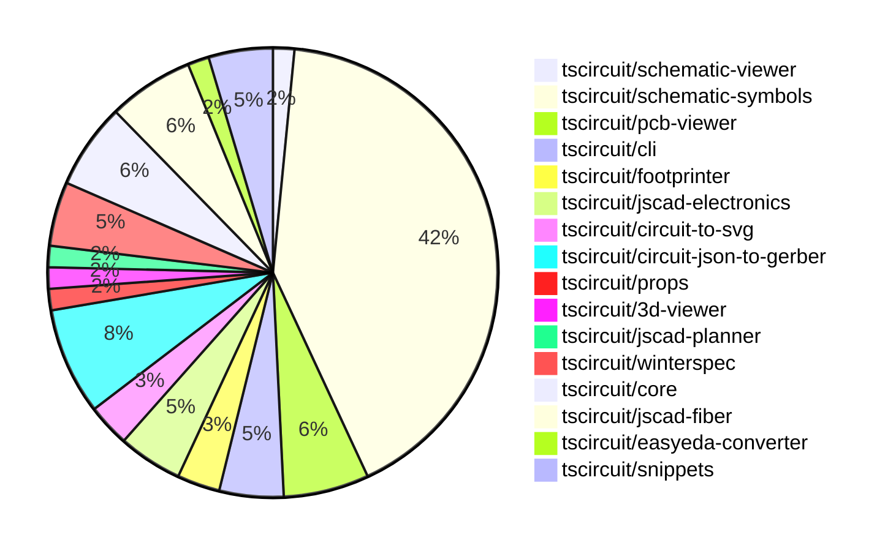

# contribution-tracker

Generates weekly contribution overviews for tscircuit contributors. Check out all
the [contribution overviews here](./contribution-overviews/)

* All PRs in the tscircuit org are scanned/summarized via Claude Haiku
* Claude classifies each Diff/PR as a Major, Minor or Tiny contribution
* All the PRs, summaries, and classifications are organized into charts and tables

The current week is shown below. There are 3 major sections:

* [Contributor Overview](#contributor-overview)
* [PRs by Repository](#prs-by-repository)
* [PRs by Contributor](#changes-by-contributor)

## Current Week

<!-- START_CURRENT_WEEK -->

# Contribution Overview 2024-09-28

## PRs by Repository

## Contributor Overview

| Contributor | 🐳 Major | 🐙 Minor | 🐌 Tiny |
|-------------|-------|-------|-------|
| DhairyaMajmudar | 1 | 0 | 0 |
| Abse2001 | 2 | 2 | 0 |
| anas-sarkez | 7 | 3 | 0 |
| ShiboSoftwareDev | 5 | 2 | 0 |
| seveibar | 12 | 4 | 0 |
| andrii-balitskyi | 1 | 0 | 0 |
| imrishabh18 | 6 | 1 | 1 |
| abhijitxy | 1 | 0 | 0 |
| MandeepPaul | 1 | 0 | 0 |
| bhavyajain511 | 1 | 0 | 0 |
| bbland1 | 2 | 0 | 0 |
| programmersoham | 0 | 1 | 0 |
| 0xkafkaa | 1 | 0 | 0 |
| Timer00 | 4 | 3 | 0 |
| Complexlity | 1 | 1 | 1 |

## Changes by Repository

### [tscircuit/schematic-viewer](https://github.com/tscircuit/schematic-viewer)

| PR # | Impact | Contributor | Description |
|------|--------|-------------|-------------|
| [#64](https://github.com/tscircuit/schematic-viewer/pull/64) | 🐳 Major | DhairyaMajmudar | Replaced the types in core.ts files with those exported from the `circuit-json` package. |

### [tscircuit/schematic-symbols](https://github.com/tscircuit/schematic-symbols)

| PR # | Impact | Contributor | Description |
|------|--------|-------------|-------------|
| [#23](https://github.com/tscircuit/schematic-symbols/pull/23) | 🐳 Major | Abse2001 | This pull request fixes the positioning of the reference and value text labels for various electronic components (capacitor, diode, LED, potentiometer, and varistor) so that they always grow away from the symbols. |
| [#21](https://github.com/tscircuit/schematic-symbols/pull/21) | 🐳 Major | Abse2001 | Added new symbols for "push_button_normally_open_momentary" in horizontal and vertical orientations. |
| [#81](https://github.com/tscircuit/schematic-symbols/pull/81) | 🐳 Major | anas-sarkez | Added a new SVG file for a zener diode symbol and a corresponding JSON file with its definition. |
| [#80](https://github.com/tscircuit/schematic-symbols/pull/80) | 🐳 Major | anas-sarkez | Added a varactor diode symbol and associated JSON data. |
| [#75](https://github.com/tscircuit/schematic-symbols/pull/75) | 🐳 Major | anas-sarkez | Added a Schottky diode SVG symbol and JSON data. |
| [#85](https://github.com/tscircuit/schematic-symbols/pull/85) | 🐳 Major | anas-sarkez | Added a new tunnel diode symbol and associated JSON data. |
| [#82](https://github.com/tscircuit/schematic-symbols/pull/82) | 🐳 Major | anas-sarkez | Added an avalanche diode symbol to the project. |
| [#72](https://github.com/tscircuit/schematic-symbols/pull/72) | 🐳 Major | seveibar | Introduce a photodiode symbol and make the `bun run generate` command interactive. |
| [#106](https://github.com/tscircuit/schematic-symbols/pull/106) | 🐳 Major | imrishabh18 | Introduce support for the 'Q' command in the SVG path parsing, which is used for quadratic Bézier curves. |
| [#73](https://github.com/tscircuit/schematic-symbols/pull/73) | 🐳 Major | imrishabh18 | Fix a bug that caused the lockfile to be frozen. |
| [#22](https://github.com/tscircuit/schematic-symbols/pull/22) | 🐳 Major | imrishabh18 | Add port reference blocks for capacitor symbol in SVG and JSON |
| [#101](https://github.com/tscircuit/schematic-symbols/pull/101) | 🐳 Major | MandeepPaul | Introduce a new IGBT transistor component |
| [#113](https://github.com/tscircuit/schematic-symbols/pull/113) | 🐳 Major | bhavyajain511 | Introduce a new symbol called "var_meter" |
| [#108](https://github.com/tscircuit/schematic-symbols/pull/108) | 🐳 Major | bbland1 | Adds an SVG and TypeScript file for a silicon-controlled rectifier symbol. |
| [#109](https://github.com/tscircuit/schematic-symbols/pull/109) | 🐳 Major | bbland1 | Created SVG and TypeScript for Triac symbol |
| [#91](https://github.com/tscircuit/schematic-symbols/pull/91) | 🐳 Major | 0xkafkaa | Create a new power factor meter symbol |
| [#77](https://github.com/tscircuit/schematic-symbols/pull/77) | 🐳 Major | Timer00 | Introduce a new DC ammeter symbol |
| [#94](https://github.com/tscircuit/schematic-symbols/pull/94) | 🐳 Major | Timer00 | Introduce an AC voltmeter component |
| [#89](https://github.com/tscircuit/schematic-symbols/pull/89) | 🐳 Major | Timer00 | Introduce type guards for drawing types to ensure type safety when performing operations on symbols. |
| [#74](https://github.com/tscircuit/schematic-symbols/pull/74) | 🐳 Major | Timer00 | Introduce a new symbol for a DC voltmeter. |
| [#98](https://github.com/tscircuit/schematic-symbols/pull/98) | 🐙 Minor | seveibar | Update the "vercel-build" script to include the "bun run build" command |
| [#86](https://github.com/tscircuit/schematic-symbols/pull/86) | 🐙 Minor | imrishabh18 | Added reference points for the port locations in the box resistor symbol. |
| [#107](https://github.com/tscircuit/schematic-symbols/pull/107) | 🐙 Minor | programmersoham | Added SVG files for NPN bipolar transistor, PNP bipolar transistor, and Phototransistor symbols. |
| [#105](https://github.com/tscircuit/schematic-symbols/pull/105) | 🐙 Minor | Timer00 | Add a step to commit and push any changes before publishing to npm |
| [#103](https://github.com/tscircuit/schematic-symbols/pull/103) | 🐙 Minor | Timer00 | Updates the lockfile to fix npm publish |
| [#76](https://github.com/tscircuit/schematic-symbols/pull/76) | 🐙 Minor | Timer00 | Add a formatting step to the instructions for adding new symbols. |
| [#104](https://github.com/tscircuit/schematic-symbols/pull/104) | 🐌 Tiny | imrishabh18 | Removes the `package-lock.json` file, as there is already a `yarn.lock` file present. |

### [tscircuit/pcb-viewer](https://github.com/tscircuit/pcb-viewer)

| PR # | Impact | Contributor | Description |
|------|--------|-------------|-------------|
| [#61](https://github.com/tscircuit/pcb-viewer/pull/61) | 🐳 Major | anas-sarkez | Added hotkeys for all layers |
| [#69](https://github.com/tscircuit/pcb-viewer/pull/69) | 🐙 Minor | Abse2001 | Increased the z-index of the ElementOverlayBox to ensure it is displayed above the traces. |
| [#67](https://github.com/tscircuit/pcb-viewer/pull/67) | 🐙 Minor | anas-sarkez | The hotHey hook now checks if the window is active before triggering the hot key event. |
| [#65](https://github.com/tscircuit/pcb-viewer/pull/65) | 🐙 Minor | anas-sarkez | Replace the deprecated imports from "circuit-json" with the new ones. |

### [tscircuit/cli](https://github.com/tscircuit/cli)

| PR # | Impact | Contributor | Description |
|------|--------|-------------|-------------|
| [#212](https://github.com/tscircuit/cli/pull/212) | 🐳 Major | ShiboSoftwareDev | Fixed filepath bug by updating imports to use `path/posix` instead of `path`. |
| [#222](https://github.com/tscircuit/cli/pull/222) | 🐙 Minor | Abse2001 | Updated the pcb_viewer dependency to fix via hover and the resistor example |
| [#213](https://github.com/tscircuit/cli/pull/213) | 🐙 Minor | ShiboSoftwareDev | Fixed the `popoverContent` index issue by setting the `z-index` to a higher value. |

### [tscircuit/footprinter](https://github.com/tscircuit/footprinter)

| PR # | Impact | Contributor | Description |
|------|--------|-------------|-------------|
| [#49](https://github.com/tscircuit/footprinter/pull/49) | 🟣 | anas-sarkez | Implement `_silkscreenpins` for dip components |
| [#47](https://github.com/tscircuit/footprinter/pull/47) | 🐳 Major | seveibar | Add axial footprint and update circuitJson |

### [tscircuit/jscad-electronics](https://github.com/tscircuit/jscad-electronics)

| PR # | Impact | Contributor | Description |
|------|--------|-------------|-------------|
| [#47](https://github.com/tscircuit/jscad-electronics/pull/47) | 🐳 Major | anas-sarkez | Fixed the 3D component legs and footprints for TSSOP packages. |
| [#46](https://github.com/tscircuit/jscad-electronics/pull/46) | 🐳 Major | seveibar | Introduces a build system, checkpoint axis flipping, and updates the DIP example to use the new "DualInlinePackage" module. |
| [#45](https://github.com/tscircuit/jscad-electronics/pull/45) | 🐳 Major | abhijitxy | Fix the position of the BGA component to not be on the side |

### [tscircuit/circuit-to-svg](https://github.com/tscircuit/circuit-to-svg)

| PR # | Impact | Contributor | Description |
|------|--------|-------------|-------------|
| [#81](https://github.com/tscircuit/circuit-to-svg/pull/81) | 🐳 Major | imrishabh18 | Introduce a new KiCad-style schematic rendering functionality |
| [#80](https://github.com/tscircuit/circuit-to-svg/pull/80) | 🐙 Minor | anas-sarkez | Removed the regular expression-based text cleanup and restored the original text. |

### [tscircuit/circuit-json-to-gerber](https://github.com/tscircuit/circuit-json-to-gerber)

| PR # | Impact | Contributor | Description |
|------|--------|-------------|-------------|
| [#14](https://github.com/tscircuit/circuit-json-to-gerber/pull/14) | 🐳 Major | ShiboSoftwareDev | The pull request adds support for displaying PCB vias in the copper layer of the Gerber output. |
| [#13](https://github.com/tscircuit/circuit-json-to-gerber/pull/13) | 🐳 Major | ShiboSoftwareDev | The pull request introduces a change where the pcb_plated_hole now has copper/soldermask fill instead of an outline. |
| [#11](https://github.com/tscircuit/circuit-json-to-gerber/pull/11) | 🐳 Major | ShiboSoftwareDev | Implemented pcb_hole support in excellon drill and soldermask, and updated the repository to use circuit-json. |
| [#9](https://github.com/tscircuit/circuit-json-to-gerber/pull/9) | 🐳 Major | ShiboSoftwareDev | Fixed the gerber units to work with JLCPCB and PCBWay |
| [#16](https://github.com/tscircuit/circuit-json-to-gerber/pull/16) | 🐙 Minor | ShiboSoftwareDev | Updates the snapshots for the excellon-drill-builder tests. |

### [tscircuit/props](https://github.com/tscircuit/props)

| PR # | Impact | Contributor | Description |
|------|--------|-------------|-------------|
| [#55](https://github.com/tscircuit/props/pull/55) | 🐳 Major | seveibar | Modify the schematic pin definitions to support a more flexible structure for defining port arrangements. |

### [tscircuit/3d-viewer](https://github.com/tscircuit/3d-viewer)

| PR # | Impact | Contributor | Description |
|------|--------|-------------|-------------|
| [#23](https://github.com/tscircuit/3d-viewer/pull/23) | 🐳 Major | seveibar | Improve README, Support for 3d Components generated by footprint |

### [tscircuit/jscad-planner](https://github.com/tscircuit/jscad-planner)

| PR # | Impact | Contributor | Description |
|------|--------|-------------|-------------|
| [#3](https://github.com/tscircuit/jscad-planner/pull/3) | 🐳 Major | seveibar | Implement cuboid and polygon shapes in the JSCAD library. |

### [tscircuit/winterspec](https://github.com/tscircuit/winterspec)

| PR # | Impact | Contributor | Description |
|------|--------|-------------|-------------|
| [#14](https://github.com/tscircuit/winterspec/pull/14) | 🐳 Major | seveibar | The changes in this pull request ensure that the middleware does not require a "Content-Type" header if the `jsonBody` is optional, and it only parses JSON bodies if the "Content-Type" header is set to "application/json". Similarly, it only parses URL-encoded bodies if the "Content-Type" header is set to "application/x-www-form-urlencoded". |
| [#15](https://github.com/tscircuit/winterspec/pull/15) | 🐙 Minor | seveibar | Fix the dev exports in the package.json file |
| [#13](https://github.com/tscircuit/winterspec/pull/13) | 🐙 Minor | seveibar | Allow optional form data without requiring the content-type header. |

### [tscircuit/core](https://github.com/tscircuit/core)

| PR # | Impact | Contributor | Description |
|------|--------|-------------|-------------|
| [#132](https://github.com/tscircuit/core/pull/132) | 🐳 Major | seveibar | Introduce a new cad_component for any component with a footprint |
| [#130](https://github.com/tscircuit/core/pull/130) | 🐳 Major | seveibar | Add error handling when there's a missing footprint for a port in the PCB trace. |
| [#135](https://github.com/tscircuit/core/pull/135) | 🐳 Major | imrishabh18 | The pull request fixes a bug in the `circuit-to-svg` library by adding the `schematic_port` information into the JSON for individual component placement. |
| [#133](https://github.com/tscircuit/core/pull/133) | 🐳 Major | imrishabh18 | Fix the chip design by updating the imports, adding new port properties, and updating the Diode component. |

### [tscircuit/jscad-fiber](https://github.com/tscircuit/jscad-fiber)

| PR # | Impact | Contributor | Description |
|------|--------|-------------|-------------|
| [#82](https://github.com/tscircuit/jscad-fiber/pull/82) | 🐳 Major | seveibar | Add support for Cylinder.rotation |
| [#80](https://github.com/tscircuit/jscad-fiber/pull/80) | 🐳 Major | seveibar | Add a new `ExtrudeFromSlices` component to the library, which allows creating 3D models by extruding a series of 2D slices. |
| [#78](https://github.com/tscircuit/jscad-fiber/pull/78) | 🐳 Major | seveibar | Fix grid orientation with z-axis up and convert from npm to bun |
| [#81](https://github.com/tscircuit/jscad-fiber/pull/81) | 🐙 Minor | seveibar | Add a new "center" prop to the Sphere component to allow setting the center of the sphere. |

### [tscircuit/easyeda-converter](https://github.com/tscircuit/easyeda-converter)

| PR # | Impact | Contributor | Description |
|------|--------|-------------|-------------|
| [#43](https://github.com/tscircuit/easyeda-converter/pull/43) | 🐳 Major | andrii-balitskyi | Expose 'convert' CLI command functionality under a separate function |

### [tscircuit/snippets](https://github.com/tscircuit/snippets)

| PR # | Impact | Contributor | Description |
|------|--------|-------------|-------------|
| [#9](https://github.com/tscircuit/snippets/pull/9) | 🐳 Major | Complexlity | Adds a new dropdown menu to the header component for creating different types of blank templates. |
| [#6](https://github.com/tscircuit/snippets/pull/6) | 🐙 Minor | Complexlity | Remove package lock file |
| [#4](https://github.com/tscircuit/snippets/pull/4) | 🐌 Tiny | Complexlity | Update the favicon of the website to match the one used on tscircuits sites. |

## Changes by Contributor

### [DhairyaMajmudar](https://github.com/DhairyaMajmudar)

| PR # | Impact | Description |
|------|--------|-------------|
| [#64](https://github.com/tscircuit/schematic-viewer/pull/64) | 🐳 Major | Replaced the types in core.ts files with those exported from the `circuit-json` package. |

### [Abse2001](https://github.com/Abse2001)

| PR # | Impact | Description |
|------|--------|-------------|
| [#23](https://github.com/tscircuit/schematic-symbols/pull/23) | 🐳 Major | This pull request fixes the positioning of the reference and value text labels for various electronic components (capacitor, diode, LED, potentiometer, and varistor) so that they always grow away from the symbols. |
| [#21](https://github.com/tscircuit/schematic-symbols/pull/21) | 🐳 Major | Added new symbols for "push_button_normally_open_momentary" in horizontal and vertical orientations. |
| [#69](https://github.com/tscircuit/pcb-viewer/pull/69) | 🐙 Minor | Increased the z-index of the ElementOverlayBox to ensure it is displayed above the traces. |
| [#222](https://github.com/tscircuit/cli/pull/222) | 🐙 Minor | Updated the pcb_viewer dependency to fix via hover and the resistor example |

### [anas-sarkez](https://github.com/anas-sarkez)

| PR # | Impact | Description |
|------|--------|-------------|
| [#61](https://github.com/tscircuit/pcb-viewer/pull/61) | 🐳 Major | Added hotkeys for all layers |
| [#81](https://github.com/tscircuit/schematic-symbols/pull/81) | 🐳 Major | Added a new SVG file for a zener diode symbol and a corresponding JSON file with its definition. |
| [#80](https://github.com/tscircuit/schematic-symbols/pull/80) | 🐳 Major | Added a varactor diode symbol and associated JSON data. |
| [#75](https://github.com/tscircuit/schematic-symbols/pull/75) | 🐳 Major | Added a Schottky diode SVG symbol and JSON data. |
| [#67](https://github.com/tscircuit/pcb-viewer/pull/67) | 🐙 Minor | The hotHey hook now checks if the window is active before triggering the hot key event. |
| [#65](https://github.com/tscircuit/pcb-viewer/pull/65) | 🐙 Minor | Replace the deprecated imports from "circuit-json" with the new ones. |
| [#49](https://github.com/tscircuit/footprinter/pull/49) | 🟣 | Implement `_silkscreenpins` for dip components |
| [#47](https://github.com/tscircuit/jscad-electronics/pull/47) | 🐳 Major | Fixed the 3D component legs and footprints for TSSOP packages. |
| [#85](https://github.com/tscircuit/schematic-symbols/pull/85) | 🐳 Major | Added a new tunnel diode symbol and associated JSON data. |
| [#82](https://github.com/tscircuit/schematic-symbols/pull/82) | 🐳 Major | Added an avalanche diode symbol to the project. |
| [#80](https://github.com/tscircuit/circuit-to-svg/pull/80) | 🐙 Minor | Removed the regular expression-based text cleanup and restored the original text. |

### [ShiboSoftwareDev](https://github.com/ShiboSoftwareDev)

| PR # | Impact | Description |
|------|--------|-------------|
| [#212](https://github.com/tscircuit/cli/pull/212) | 🐳 Major | Fixed filepath bug by updating imports to use `path/posix` instead of `path`. |
| [#14](https://github.com/tscircuit/circuit-json-to-gerber/pull/14) | 🐳 Major | The pull request adds support for displaying PCB vias in the copper layer of the Gerber output. |
| [#13](https://github.com/tscircuit/circuit-json-to-gerber/pull/13) | 🐳 Major | The pull request introduces a change where the pcb_plated_hole now has copper/soldermask fill instead of an outline. |
| [#11](https://github.com/tscircuit/circuit-json-to-gerber/pull/11) | 🐳 Major | Implemented pcb_hole support in excellon drill and soldermask, and updated the repository to use circuit-json. |
| [#9](https://github.com/tscircuit/circuit-json-to-gerber/pull/9) | 🐳 Major | Fixed the gerber units to work with JLCPCB and PCBWay |
| [#213](https://github.com/tscircuit/cli/pull/213) | 🐙 Minor | Fixed the `popoverContent` index issue by setting the `z-index` to a higher value. |
| [#16](https://github.com/tscircuit/circuit-json-to-gerber/pull/16) | 🐙 Minor | Updates the snapshots for the excellon-drill-builder tests. |

### [seveibar](https://github.com/seveibar)

| PR # | Impact | Description |
|------|--------|-------------|
| [#55](https://github.com/tscircuit/props/pull/55) | 🐳 Major | Modify the schematic pin definitions to support a more flexible structure for defining port arrangements. |
| [#47](https://github.com/tscircuit/footprinter/pull/47) | 🐳 Major | Add axial footprint and update circuitJson |
| [#23](https://github.com/tscircuit/3d-viewer/pull/23) | 🐳 Major | Improve README, Support for 3d Components generated by footprint |
| [#3](https://github.com/tscircuit/jscad-planner/pull/3) | 🐳 Major | Implement cuboid and polygon shapes in the JSCAD library. |
| [#14](https://github.com/tscircuit/winterspec/pull/14) | 🐳 Major | The changes in this pull request ensure that the middleware does not require a "Content-Type" header if the `jsonBody` is optional, and it only parses JSON bodies if the "Content-Type" header is set to "application/json". Similarly, it only parses URL-encoded bodies if the "Content-Type" header is set to "application/x-www-form-urlencoded". |
| [#132](https://github.com/tscircuit/core/pull/132) | 🐳 Major | Introduce a new cad_component for any component with a footprint |
| [#130](https://github.com/tscircuit/core/pull/130) | 🐳 Major | Add error handling when there's a missing footprint for a port in the PCB trace. |
| [#46](https://github.com/tscircuit/jscad-electronics/pull/46) | 🐳 Major | Introduces a build system, checkpoint axis flipping, and updates the DIP example to use the new "DualInlinePackage" module. |
| [#82](https://github.com/tscircuit/jscad-fiber/pull/82) | 🐳 Major | Add support for Cylinder.rotation |
| [#80](https://github.com/tscircuit/jscad-fiber/pull/80) | 🐳 Major | Add a new `ExtrudeFromSlices` component to the library, which allows creating 3D models by extruding a series of 2D slices. |
| [#78](https://github.com/tscircuit/jscad-fiber/pull/78) | 🐳 Major | Fix grid orientation with z-axis up and convert from npm to bun |
| [#72](https://github.com/tscircuit/schematic-symbols/pull/72) | 🐳 Major | Introduce a photodiode symbol and make the `bun run generate` command interactive. |
| [#15](https://github.com/tscircuit/winterspec/pull/15) | 🐙 Minor | Fix the dev exports in the package.json file |
| [#13](https://github.com/tscircuit/winterspec/pull/13) | 🐙 Minor | Allow optional form data without requiring the content-type header. |
| [#81](https://github.com/tscircuit/jscad-fiber/pull/81) | 🐙 Minor | Add a new "center" prop to the Sphere component to allow setting the center of the sphere. |
| [#98](https://github.com/tscircuit/schematic-symbols/pull/98) | 🐙 Minor | Update the "vercel-build" script to include the "bun run build" command |

### [andrii-balitskyi](https://github.com/andrii-balitskyi)

| PR # | Impact | Description |
|------|--------|-------------|
| [#43](https://github.com/tscircuit/easyeda-converter/pull/43) | 🐳 Major | Expose 'convert' CLI command functionality under a separate function |

### [imrishabh18](https://github.com/imrishabh18)

| PR # | Impact | Description |
|------|--------|-------------|
| [#135](https://github.com/tscircuit/core/pull/135) | 🐳 Major | The pull request fixes a bug in the `circuit-to-svg` library by adding the `schematic_port` information into the JSON for individual component placement. |
| [#133](https://github.com/tscircuit/core/pull/133) | 🐳 Major | Fix the chip design by updating the imports, adding new port properties, and updating the Diode component. |
| [#81](https://github.com/tscircuit/circuit-to-svg/pull/81) | 🐳 Major | Introduce a new KiCad-style schematic rendering functionality |
| [#106](https://github.com/tscircuit/schematic-symbols/pull/106) | 🐳 Major | Introduce support for the 'Q' command in the SVG path parsing, which is used for quadratic Bézier curves. |
| [#73](https://github.com/tscircuit/schematic-symbols/pull/73) | 🐳 Major | Fix a bug that caused the lockfile to be frozen. |
| [#22](https://github.com/tscircuit/schematic-symbols/pull/22) | 🐳 Major | Add port reference blocks for capacitor symbol in SVG and JSON |
| [#86](https://github.com/tscircuit/schematic-symbols/pull/86) | 🐙 Minor | Added reference points for the port locations in the box resistor symbol. |
| [#104](https://github.com/tscircuit/schematic-symbols/pull/104) | 🐌 Tiny | Removes the `package-lock.json` file, as there is already a `yarn.lock` file present. |

### [abhijitxy](https://github.com/abhijitxy)

| PR # | Impact | Description |
|------|--------|-------------|
| [#45](https://github.com/tscircuit/jscad-electronics/pull/45) | 🐳 Major | Fix the position of the BGA component to not be on the side |

### [MandeepPaul](https://github.com/MandeepPaul)

| PR # | Impact | Description |
|------|--------|-------------|
| [#101](https://github.com/tscircuit/schematic-symbols/pull/101) | 🐳 Major | Introduce a new IGBT transistor component |

### [bhavyajain511](https://github.com/bhavyajain511)

| PR # | Impact | Description |
|------|--------|-------------|
| [#113](https://github.com/tscircuit/schematic-symbols/pull/113) | 🐳 Major | Introduce a new symbol called "var_meter" |

### [bbland1](https://github.com/bbland1)

| PR # | Impact | Description |
|------|--------|-------------|
| [#108](https://github.com/tscircuit/schematic-symbols/pull/108) | 🐳 Major | Adds an SVG and TypeScript file for a silicon-controlled rectifier symbol. |
| [#109](https://github.com/tscircuit/schematic-symbols/pull/109) | 🐳 Major | Created SVG and TypeScript for Triac symbol |

### [programmersoham](https://github.com/programmersoham)

| PR # | Impact | Description |
|------|--------|-------------|
| [#107](https://github.com/tscircuit/schematic-symbols/pull/107) | 🐙 Minor | Added SVG files for NPN bipolar transistor, PNP bipolar transistor, and Phototransistor symbols. |

### [0xkafkaa](https://github.com/0xkafkaa)

| PR # | Impact | Description |
|------|--------|-------------|
| [#91](https://github.com/tscircuit/schematic-symbols/pull/91) | 🐳 Major | Create a new power factor meter symbol |

### [Timer00](https://github.com/Timer00)

| PR # | Impact | Description |
|------|--------|-------------|
| [#77](https://github.com/tscircuit/schematic-symbols/pull/77) | 🐳 Major | Introduce a new DC ammeter symbol |
| [#94](https://github.com/tscircuit/schematic-symbols/pull/94) | 🐳 Major | Introduce an AC voltmeter component |
| [#89](https://github.com/tscircuit/schematic-symbols/pull/89) | 🐳 Major | Introduce type guards for drawing types to ensure type safety when performing operations on symbols. |
| [#74](https://github.com/tscircuit/schematic-symbols/pull/74) | 🐳 Major | Introduce a new symbol for a DC voltmeter. |
| [#105](https://github.com/tscircuit/schematic-symbols/pull/105) | 🐙 Minor | Add a step to commit and push any changes before publishing to npm |
| [#103](https://github.com/tscircuit/schematic-symbols/pull/103) | 🐙 Minor | Updates the lockfile to fix npm publish |
| [#76](https://github.com/tscircuit/schematic-symbols/pull/76) | 🐙 Minor | Add a formatting step to the instructions for adding new symbols. |

### [Complexlity](https://github.com/Complexlity)

| PR # | Impact | Description |
|------|--------|-------------|
| [#9](https://github.com/tscircuit/snippets/pull/9) | 🐳 Major | Adds a new dropdown menu to the header component for creating different types of blank templates. |
| [#6](https://github.com/tscircuit/snippets/pull/6) | 🐙 Minor | Remove package lock file |
| [#4](https://github.com/tscircuit/snippets/pull/4) | 🐌 Tiny | Update the favicon of the website to match the one used on tscircuits sites. |

<!-- END_CURRENT_WEEK -->
